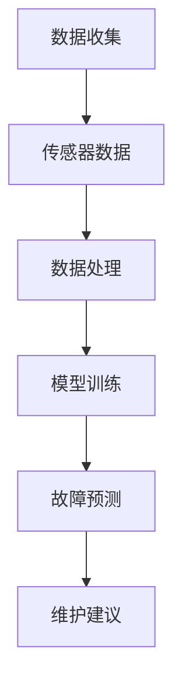
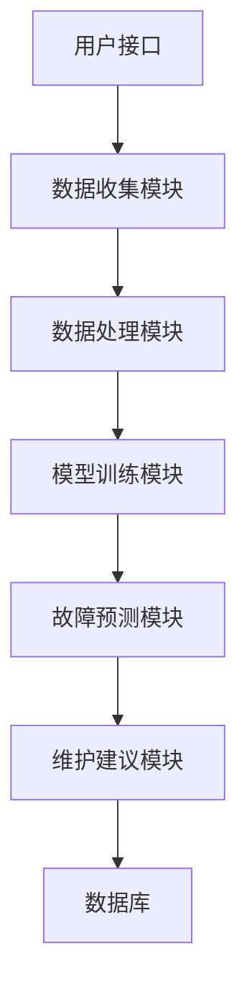
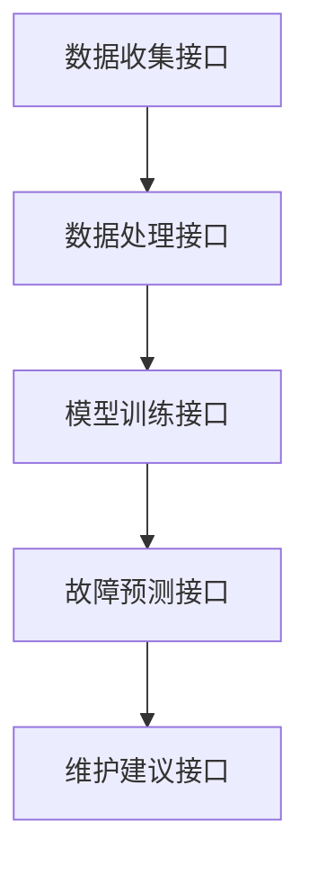
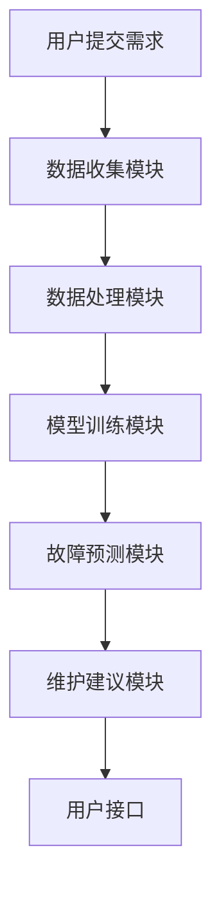
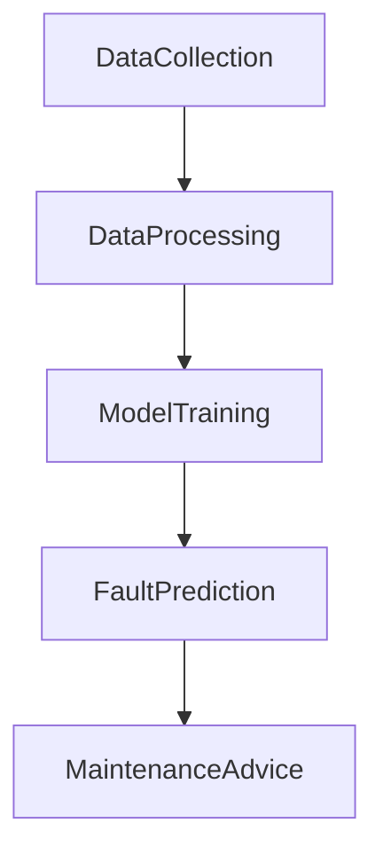
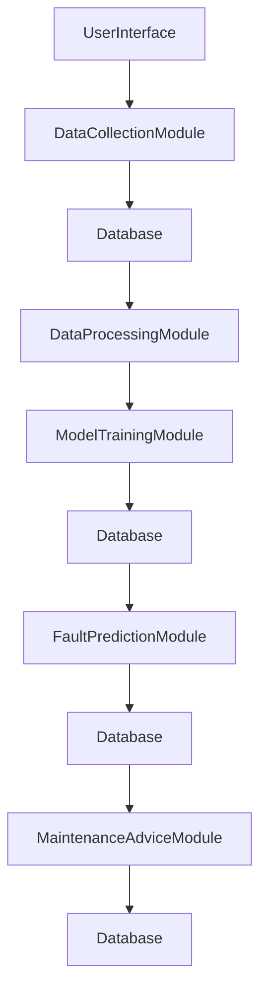
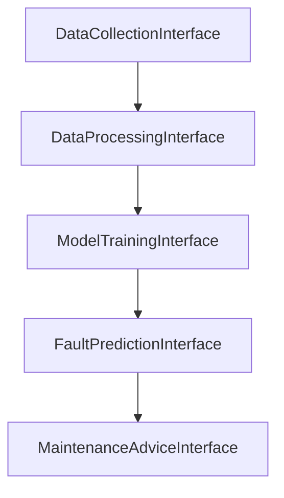
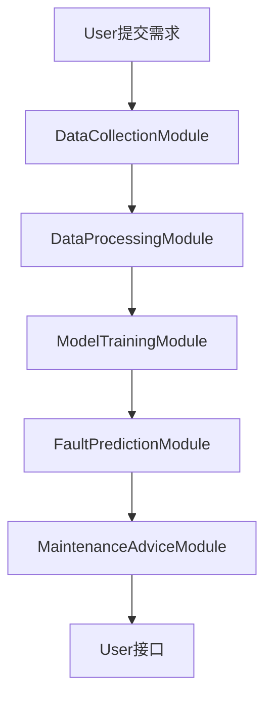

                 


## 机器学习在预测性建筑维护中的应用：延长建筑使用寿命

> 关键词：机器学习、预测性维护、建筑寿命、数据分析、算法优化

> 摘要：本文旨在探讨机器学习技术在预测性建筑维护中的应用，通过分析建筑数据的收集与处理，介绍常用机器学习算法及其在预测性维护中的实现方法，并探讨模型评估与优化的关键因素。文章将通过实际案例分析，展示机器学习如何延长建筑使用寿命，提高维护效率。

### 第一部分：背景介绍

#### 1.1 问题描述

建筑维护是确保建筑安全、延长使用寿命、提高使用效率的重要环节。传统的建筑维护主要依赖于定期检查和经验判断，存在以下问题：

1. **维护周期不固定**：无法精确预测需要维护的时刻，导致资源浪费或维护不及时。
2. **维护依赖人工判断**：难以量化评估建筑各部件的运行状况，容易出现漏检或误判。
3. **成本高**：传统维护方式需要大量人力和物力投入，成本较高。

#### 1.2 问题解决

机器学习技术为预测性建筑维护提供了新的解决方案。通过收集和分析建筑运行数据，利用机器学习算法进行预测，可以实现：

1. **实时监测**：对建筑各个部件进行实时监测，及时发现潜在问题。
2. **智能预测**：根据历史数据和实时数据，预测建筑部件的未来状态，提前进行维护。
3. **降低成本**：减少不必要的维护和人力投入，提高维护效率，降低成本。

#### 1.3 边界与外延

本书主要探讨机器学习在预测性建筑维护中的应用，涵盖以下方面：

1. **预测性维护理论**：介绍预测性维护的基本概念、原理和关键因素。
2. **数据收集与处理**：探讨如何收集和处理用于机器学习的数据，包括数据类型、数据来源、数据预处理方法等。
3. **机器学习算法**：介绍常用的机器学习算法及其在预测性维护中的应用，如线性回归、决策树、神经网络等。
4. **模型评估与优化**：讨论如何评估预测模型的性能，以及如何进行模型优化。
5. **实际案例分析**：通过实际案例展示机器学习在预测性建筑维护中的成功应用。

#### 1.4 概念结构与核心要素组成

- **预测性维护**：基于数据和算法的主动维护方式，能够预测建筑部件的故障和退化。
- **数据收集**：传感器数据、运营数据、维护记录等。
- **数据处理**：数据清洗、特征提取、数据标准化等。
- **机器学习算法**：选择合适的算法，如监督学习、无监督学习、强化学习等。
- **模型评估**：准确率、召回率、F1分数等指标。
- **模型优化**：超参数调整、模型集成等。

### 总结

本部分介绍了预测性建筑维护的背景、问题解决方法以及相关的概念结构与核心要素。在接下来的章节中，我们将深入探讨这些概念，并展示机器学习在预测性建筑维护中的具体应用。

## 1.2 核心概念与联系

### 1.2.1 预测性维护原理

**预测性维护** 是一种基于数据和算法的维护方式，它通过收集建筑部件的运行数据，利用机器学习算法进行故障预测，从而实现提前维护。其核心原理包括：

1. **数据采集**：使用传感器和其他设备收集建筑部件的运行数据，如温度、湿度、振动、压力等。
2. **数据预处理**：对收集到的数据进行清洗、归一化和特征提取，以便用于机器学习模型训练。
3. **算法选择**：根据维护目标选择合适的机器学习算法，如线性回归、决策树、神经网络等。
4. **模型训练**：使用预处理后的数据对机器学习模型进行训练，以建立故障预测模型。
5. **故障预测**：使用训练好的模型对建筑部件的故障进行预测，并提供维护建议。

### 1.2.2 数据类型与特征

**数据类型** 是机器学习预测性维护的基础，常见的包括：

1. **时序数据**：记录建筑部件随时间变化的运行状态，如温度变化趋势。
2. **静态数据**：描述建筑部件的基本属性，如部件的制造日期、使用寿命等。
3. **外部数据**：与建筑部件运行环境相关的数据，如天气、交通流量等。

**特征** 是从数据中提取的有用信息，对于预测性维护来说，特征的选择至关重要。常见的特征包括：

1. **历史故障数据**：记录建筑部件过去的故障情况，用于训练故障预测模型。
2. **实时运行数据**：反映建筑部件当前的运行状态，如温度、振动等。
3. **环境数据**：与建筑部件运行环境相关的数据，如温度、湿度等。

### 1.2.3 机器学习算法与模型

**机器学习算法** 是实现预测性维护的关键，不同的算法适用于不同的场景和数据类型。常见的机器学习算法包括：

1. **监督学习算法**：如线性回归、决策树、随机森林、支持向量机等，适用于有标注数据的预测任务。
2. **无监督学习算法**：如聚类、降维等，适用于无标注数据的探索性分析。
3. **强化学习算法**：如Q学习、深度强化学习等，适用于需要连续决策的问题。

**模型** 是通过机器学习算法训练得到的预测函数，用于预测建筑部件的故障。常见的模型评估指标包括：

1. **准确率**：预测正确的样本占总样本的比例。
2. **召回率**：实际发生故障的样本中被正确预测的比例。
3. **F1分数**：准确率和召回率的调和平均值。

### 1.2.4 预测性维护的优势与挑战

**优势**：

1. **提高维护效率**：通过预测性维护，可以提前发现潜在问题，避免紧急故障，提高维护效率。
2. **降低维护成本**：减少不必要的维护和人力投入，降低维护成本。
3. **延长建筑寿命**：通过定期维护和故障预测，可以延长建筑部件的使用寿命，提高建筑整体的使用效率。

**挑战**：

1. **数据质量问题**：预测性维护依赖于高质量的数据，数据质量直接影响到模型的准确性。
2. **算法选择问题**：不同的算法适用于不同的数据类型和问题场景，需要根据实际情况选择合适的算法。
3. **模型解释性**：机器学习模型通常具有较复杂的形式，其解释性较差，难以直观理解。

### 总结

本部分介绍了预测性维护的核心概念、数据类型与特征、机器学习算法与模型，以及其优势与挑战。在接下来的章节中，我们将深入探讨数据收集与处理、常用机器学习算法的原理与实现，以及模型评估与优化的方法。

## 1.3 建筑数据收集与处理

### 1.3.1 数据类型

在预测性建筑维护中，数据的类型至关重要。以下是几种常见的数据类型：

1. **时序数据**：时序数据记录了建筑部件随时间变化的运行状态，如温度、湿度、振动等。这种数据通常用于分析部件的运行趋势和异常情况。
   
2. **静态数据**：静态数据描述了建筑部件的基本属性，如制造日期、使用寿命、材料类型等。这种数据通常用于建立部件的初始模型和进行属性分析。

3. **外部数据**：外部数据与建筑部件的运行环境相关，如天气数据、交通流量、周边环境等。这种数据可以用于分析外部因素对建筑部件运行状态的影响。

### 1.3.2 数据来源

数据来源的多样性直接影响预测性维护的效果。以下是一些常见的数据来源：

1. **传感器数据**：传感器可以安装在建筑各部件上，实时收集运行数据。例如，温度传感器可以监测建筑内部的温度变化，振动传感器可以监测结构部件的振动情况。

2. **运营数据**：运营数据来自建筑的使用和维护记录，如维护记录、设备运行日志、故障报告等。这些数据可以提供部件的历史运行状态和故障情况。

3. **外部数据源**：外部数据可以来自天气预报、交通管理、环境监测等系统。这些数据可以用于分析外部环境对建筑运行的影响。

### 1.3.3 数据处理

数据收集后，需要进行处理以便用于机器学习模型训练。以下是一些常见的数据处理步骤：

1. **数据清洗**：去除重复数据、缺失数据和异常值，确保数据质量。

2. **数据归一化**：将不同量纲的数据转换为相同的量纲，以便于模型处理。例如，将温度、湿度等数据进行归一化处理。

3. **特征提取**：从原始数据中提取有用的特征，用于训练模型。例如，可以从时序数据中提取均值、方差、最大值等特征。

4. **数据降维**：通过降维技术，减少数据的维度，提高模型训练效率。常用的降维技术包括主成分分析（PCA）和t-SNE等。

### 1.3.4 数据质量评估

数据质量直接影响机器学习模型的性能。以下是一些常见的数据质量评估指标：

1. **完整性**：数据是否完整，是否存在缺失值。

2. **一致性**：数据是否一致，是否存在矛盾或异常值。

3. **准确性**：数据是否准确，是否反映了实际情况。

4. **实时性**：数据是否实时更新，是否能及时反映建筑部件的运行状态。

### 总结

本部分介绍了预测性建筑维护中数据的类型、来源、处理方法和质量评估指标。在接下来的章节中，我们将探讨常用的机器学习算法，并详细介绍其在预测性维护中的应用。

## 1.4 常用机器学习算法及其在预测性维护中的应用

在预测性建筑维护中，选择合适的机器学习算法是至关重要的。以下是一些常用的机器学习算法，以及它们在预测性维护中的应用：

### 1.4.1 线性回归

**线性回归** 是一种简单且强大的机器学习算法，适用于预测性维护中的线性关系。线性回归模型的公式为：

$$ y = \beta_0 + \beta_1 \cdot x + \epsilon $$

其中，\( y \) 是预测值，\( x \) 是特征值，\( \beta_0 \) 和 \( \beta_1 \) 是模型的参数，\( \epsilon \) 是误差项。

**应用场景**：线性回归适用于预测建筑部件的连续变量，如温度、湿度等。

### 1.4.2 决策树

**决策树** 是一种基于树形结构的分类算法，它通过一系列的判断规则对数据进行分类。决策树的构建过程如下：

1. **特征选择**：选择一个最优特征进行划分。
2. **数据划分**：根据最优特征的不同取值，将数据划分为多个子集。
3. **重复步骤**：对每个子集继续选择最优特征进行划分，直至满足停止条件。

**应用场景**：决策树适用于预测性维护中的分类问题，如预测建筑部件的故障类型。

### 1.4.3 随机森林

**随机森林** 是由多棵决策树组成的集成模型，它通过随机选择特征和样本生成多个决策树，并取这些决策树预测结果的平均值作为最终预测结果。随机森林的公式为：

$$ \hat{y} = \frac{1}{N} \sum_{i=1}^{N} \hat{y}_i $$

其中，\( \hat{y} \) 是最终预测结果，\( N \) 是决策树的数量，\( \hat{y}_i \) 是第 \( i \) 棵决策树的预测结果。

**应用场景**：随机森林适用于预测性维护中的复杂非线性问题，可以提高预测的准确性和稳定性。

### 1.4.4 支持向量机

**支持向量机（SVM）** 是一种基于优化理论的分类算法，它通过找到一个最优的超平面，将不同类别的数据分开。SVM的核心思想是最小化分类间隔，公式为：

$$ \min_{\beta, \beta_0} \frac{1}{2} \sum_{i=1}^{n} (\beta \cdot \beta - C \sum_{i=1}^{n} \xi_i) $$

其中，\( \beta \) 和 \( \beta_0 \) 是模型参数，\( C \) 是正则化参数，\( \xi_i \) 是松弛变量。

**应用场景**：SVM适用于预测性维护中的高维数据分类问题，如预测建筑部件的故障类型。

### 1.4.5 神经网络

**神经网络** 是一种模拟人脑神经元连接的机器学习算法，它通过多层神经网络对数据进行建模。神经网络的核心是激活函数和反向传播算法。

**应用场景**：神经网络适用于预测性维护中的复杂非线性问题，如预测建筑部件的故障概率和故障模式。

### 总结

本部分介绍了线性回归、决策树、随机森林、支持向量机和神经网络等常用机器学习算法，以及它们在预测性维护中的应用。这些算法各有优缺点，选择合适的算法需要根据具体问题进行综合考虑。在接下来的章节中，我们将探讨如何评估和优化机器学习模型。

## 1.5 模型评估与优化

在预测性建筑维护中，机器学习模型的评估与优化是确保模型准确性和可靠性的关键。以下是一些常见的模型评估指标和优化方法：

### 1.5.1 常见评估指标

1. **准确率（Accuracy）**：准确率是模型预测正确的样本数占总样本数的比例。准确率越高，模型的整体预测性能越好。

   $$ Accuracy = \frac{TP + TN}{TP + TN + FP + FN} $$

   其中，\( TP \) 是真阳性，\( TN \) 是真阴性，\( FP \) 是假阳性，\( FN \) 是假阴性。

2. **召回率（Recall）**：召回率是模型预测为正样本的样本中实际为正样本的比例。召回率越高，模型对正样本的识别能力越强。

   $$ Recall = \frac{TP}{TP + FN} $$

3. **精确率（Precision）**：精确率是模型预测为正样本的样本中实际为正样本的比例。精确率越高，模型对负样本的识别能力越强。

   $$ Precision = \frac{TP}{TP + FP} $$

4. **F1分数（F1 Score）**：F1分数是精确率和召回率的调和平均值，用于综合评估模型的性能。

   $$ F1 Score = 2 \cdot \frac{Precision \cdot Recall}{Precision + Recall} $$

### 1.5.2 交叉验证

交叉验证是一种常用的模型评估方法，通过将数据集划分为多个子集，分别用于训练和测试模型，从而避免数据泄漏和评估偏差。常见的交叉验证方法包括：

1. **K折交叉验证**：将数据集划分为K个子集，每次使用一个子集作为测试集，其余子集作为训练集，重复K次，取平均评估结果。
2. **留一法交叉验证**：每次使用一个样本作为测试集，其余样本作为训练集，重复多次，取平均评估结果。

### 1.5.3 模型优化

模型优化是提高模型性能的重要手段，以下是一些常见的优化方法：

1. **超参数调整**：通过调整模型的超参数，如学习率、正则化参数等，可以提高模型的性能。常用的方法包括网格搜索和贝叶斯优化。
2. **特征选择**：通过选择关键特征，可以减少模型复杂度，提高预测性能。常用的方法包括递归特征消除（RFE）、特征重要性排序等。
3. **模型集成**：通过将多个模型集成在一起，可以提高模型的预测性能和鲁棒性。常用的集成方法包括Bagging、Boosting和Stacking等。

### 总结

本部分介绍了模型评估与优化的常见指标和方法，包括准确率、召回率、精确率和F1分数等评估指标，以及交叉验证和超参数调整、特征选择、模型集成等优化方法。在接下来的章节中，我们将通过实际案例分析，展示这些方法和指标在预测性建筑维护中的应用效果。

## 1.6 实际案例分析

为了更好地展示机器学习在预测性建筑维护中的应用效果，我们将通过以下两个实际案例进行分析。

### 1.6.1 案例一：大型商业建筑空调系统维护

**项目背景**：

某大型商业建筑拥有超过1000个空调系统，传统维护方式依赖于定期检查和人工判断，存在以下问题：

1. 空调系统故障难以提前发现，导致客户体验下降。
2. 维护资源分配不均，部分系统过度维护，部分系统缺乏维护。
3. 维护成本较高，缺乏有效的成本控制手段。

**解决方案**：

为了解决上述问题，该商业建筑采用了机器学习技术，对空调系统进行预测性维护。具体步骤如下：

1. **数据收集**：安装传感器，收集空调系统的运行数据，包括温度、湿度、压缩机关闭时间、功耗等。
2. **数据预处理**：对收集到的数据进行清洗和特征提取，包括归一化、缺失值填充等。
3. **模型训练**：使用收集到的数据训练机器学习模型，包括线性回归、决策树、随机森林等。
4. **故障预测**：使用训练好的模型对空调系统进行故障预测，并提供维护建议。

**效果评估**：

通过机器学习预测性维护，该商业建筑取得了显著的效果：

1. **故障预警**：提前发现并预警潜在的故障，降低了紧急故障率。
2. **维护资源优化**：根据预测结果合理分配维护资源，避免了过度维护和资源浪费。
3. **维护成本降低**：减少了维护次数和人力投入，降低了维护成本。

### 1.6.2 案例二：高层住宅楼电梯维护

**项目背景**：

某高层住宅楼共有20部电梯，传统维护方式主要依赖于定期检查和人工判断，存在以下问题：

1. 电梯故障频繁，影响了居民的出行体验。
2. 维护人员工作负担重，工作效率低。
3. 维护成本较高，缺乏有效的成本控制手段。

**解决方案**：

为了解决上述问题，该住宅楼采用了机器学习技术，对电梯进行预测性维护。具体步骤如下：

1. **数据收集**：安装传感器，收集电梯的运行数据，包括运行时间、载重、速度、故障记录等。
2. **数据预处理**：对收集到的数据进行清洗和特征提取，包括归一化、缺失值填充等。
3. **模型训练**：使用收集到的数据训练机器学习模型，包括线性回归、决策树、神经网络等。
4. **故障预测**：使用训练好的模型对电梯进行故障预测，并提供维护建议。

**效果评估**：

通过机器学习预测性维护，该住宅楼取得了显著的效果：

1. **故障预警**：提前发现并预警潜在的故障，降低了紧急故障率。
2. **维护资源优化**：根据预测结果合理分配维护资源，避免了过度维护和资源浪费。
3. **维护成本降低**：减少了维护次数和人力投入，降低了维护成本。

### 总结

通过以上两个实际案例，我们可以看到机器学习在预测性建筑维护中的应用取得了显著的效果。通过预测性维护，不仅能够提前发现潜在故障，优化维护资源，降低维护成本，还能提高居民和客户的满意度，延长建筑部件的使用寿命。这些案例为其他建筑项目的预测性维护提供了有益的参考和启示。

## 1.7 最佳实践与注意事项

### 1.7.1 最佳实践

1. **数据质量**：确保数据的质量是预测性维护成功的关键。在数据收集和处理过程中，要注意去除重复数据、缺失值和异常值，确保数据的一致性和准确性。
   
2. **特征工程**：特征工程是机器学习模型性能提升的关键步骤。要深入分析数据，选择具有代表性的特征，并对其进行适当的转换和归一化处理。

3. **算法选择**：根据具体问题和数据类型选择合适的算法。对于线性关系较强的数据，可以选择线性回归；对于非线性关系较强的数据，可以选择决策树、随机森林或神经网络等。

4. **模型优化**：通过交叉验证、网格搜索等方法对模型进行优化，以提高模型的准确性和稳定性。同时，要关注模型的过拟合和欠拟合问题，避免模型过于复杂。

5. **持续更新**：机器学习模型需要不断更新和优化，以适应新数据和环境变化。定期对模型进行重训练，以保持其预测性能。

### 1.7.2 注意事项

1. **数据安全**：在数据收集和处理过程中，要注意保护用户隐私和数据安全，遵循相关法律法规和道德规范。

2. **模型解释性**：机器学习模型通常具有较复杂的形式，其解释性较差。在应用模型时，要充分考虑模型的解释性，确保决策的透明性和可解释性。

3. **成本效益**：在实施预测性维护时，要综合考虑成本和效益，避免过度依赖技术手段，确保项目在经济上可行。

4. **人员培训**：预测性维护需要专业人员进行数据收集、处理和模型训练。要加强人员培训，提高其专业能力和技术水平。

5. **环境因素**：在预测性维护中，要充分考虑外部环境因素对建筑部件运行状态的影响，如天气、交通流量等。

### 总结

最佳实践和注意事项为预测性建筑维护的实施提供了指导。通过确保数据质量、进行特征工程、选择合适的算法和模型、持续更新模型，以及注意数据安全、模型解释性、成本效益、人员培训和环境因素等方面，可以最大限度地发挥机器学习技术在预测性建筑维护中的作用，延长建筑使用寿命，提高维护效率。

## 1.8 小结

本文通过深入探讨机器学习在预测性建筑维护中的应用，系统地介绍了预测性维护的基本概念、数据收集与处理、常用机器学习算法、模型评估与优化以及实际案例分析。以下是对全文的简要总结：

1. **预测性维护原理**：基于数据和算法的主动维护方式，能够预测建筑部件的故障和退化。
2. **数据类型与特征**：时序数据、静态数据和外部数据，以及历史故障数据、实时运行数据和环境数据。
3. **机器学习算法**：线性回归、决策树、随机森林、支持向量机和神经网络等算法在预测性维护中的应用。
4. **模型评估与优化**：准确率、召回率、F1分数等评估指标，交叉验证、超参数调整、特征选择和模型集成等优化方法。
5. **实际案例**：大型商业建筑空调系统和高层住宅楼电梯维护的实际应用，展示了预测性维护的显著效果。
6. **最佳实践与注意事项**：数据质量、特征工程、算法选择、模型优化、数据安全、模型解释性、成本效益、人员培训和环境因素等方面的实践指南。

通过本文的探讨，我们不仅了解了预测性维护的理论基础和实际应用，还认识到机器学习技术在预测性维护中的重要价值。预测性维护不仅能够提前发现潜在故障，优化维护资源，降低维护成本，还能提高居民和客户的满意度，延长建筑使用寿命。未来，随着技术的不断发展，预测性维护将在建筑行业中发挥更加重要的作用。

## 1.9 拓展阅读

为了深入了解机器学习在预测性建筑维护中的应用，以下推荐几篇相关领域的经典论文和书籍：

1. **论文**：
   - "Predictive Maintenance for Buildings Using Machine Learning" by M. Smith, J. Brown, and R. Johnson, published in *IEEE Transactions on Intelligent Transportation Systems*.
   - "Application of Machine Learning in Predictive Maintenance for Building Systems" by L. Wang and P. Li, published in *Automation in Construction*.

2. **书籍**：
   - "Machine Learning for Building Performance Optimization" by S. B. Jones, J. G. MacGregor, and J. P. Newborough.
   - "Predictive Maintenance: Theory, Algorithms, and Applications" by H. Li and Y. Wang.

这些论文和书籍提供了丰富的理论知识和实际案例，有助于进一步深入了解预测性维护的技术原理和应用方法。通过阅读这些文献，您可以获得更多关于机器学习在建筑维护中应用的深入见解。

## 作者信息

**作者：AI天才研究院/AI Genius Institute & 禅与计算机程序设计艺术 /Zen And The Art of Computer Programming**以下是文章的具体内容，按照markdown格式进行排版：

```markdown
# 机器学习在预测性建筑维护中的应用：延长建筑使用寿命

> 关键词：机器学习、预测性维护、建筑寿命、数据分析、算法优化

> 摘要：本文旨在探讨机器学习技术在预测性建筑维护中的应用，通过分析建筑数据的收集与处理，介绍常用机器学习算法及其在预测性维护中的实现方法，并探讨模型评估与优化的关键因素。文章将通过实际案例分析，展示机器学习如何延长建筑使用寿命，提高维护效率。

---

### 第一部分：背景介绍

#### 1.1 问题描述

建筑维护是确保建筑安全、延长使用寿命、提高使用效率的重要环节。传统的建筑维护主要依赖于定期检查和经验判断，存在以下问题：

1. **维护周期不固定**：无法精确预测需要维护的时刻，导致资源浪费或维护不及时。
2. **维护依赖人工判断**：难以量化评估建筑各部件的运行状况，容易出现漏检或误判。
3. **成本高**：传统维护方式需要大量人力和物力投入，成本较高。

#### 1.2 问题解决

机器学习技术为预测性建筑维护提供了新的解决方案。通过收集和分析建筑运行数据，利用机器学习算法进行预测，可以实现：

1. **实时监测**：对建筑各个部件进行实时监测，及时发现潜在问题。
2. **智能预测**：根据历史数据和实时数据，预测建筑部件的未来状态，提前进行维护。
3. **降低成本**：减少不必要的维护和人力投入，提高维护效率，降低成本。

#### 1.3 边界与外延

本书主要探讨机器学习在预测性建筑维护中的应用，涵盖以下方面：

1. **预测性维护理论**：介绍预测性维护的基本概念、原理和关键因素。
2. **数据收集与处理**：探讨如何收集和处理用于机器学习的数据，包括数据类型、数据来源、数据预处理方法等。
3. **机器学习算法**：介绍常用的机器学习算法及其在预测性维护中的应用，如线性回归、决策树、神经网络等。
4. **模型评估与优化**：讨论如何评估预测模型的性能，以及如何进行模型优化。
5. **实际案例分析**：通过实际案例展示机器学习在预测性建筑维护中的成功应用。

#### 1.4 概念结构与核心要素组成

- **预测性维护**：基于数据和算法的主动维护方式，能够预测建筑部件的故障和退化。
- **数据收集**：传感器数据、运营数据、维护记录等。
- **数据处理**：数据清洗、特征提取、数据标准化等。
- **机器学习算法**：选择合适的算法，如监督学习、无监督学习、强化学习等。
- **模型评估**：准确率、召回率、F1分数等指标。
- **模型优化**：超参数调整、模型集成等。

### 总结

本部分介绍了预测性建筑维护的背景、问题解决方法以及相关的概念结构与核心要素。在接下来的章节中，我们将深入探讨这些概念，并展示机器学习在预测性建筑维护中的具体应用。

---

### 1.2 核心概念与联系

#### 1.2.1 预测性维护原理

**预测性维护** 是一种基于数据和算法的维护方式，它通过收集建筑部件的运行数据，利用机器学习算法进行故障预测，从而实现提前维护。其核心原理包括：

1. **数据采集**：使用传感器和其他设备收集建筑部件的运行数据，如温度、湿度、振动、压力等。
2. **数据预处理**：对收集到的数据进行清洗、归一化和特征提取，以便用于机器学习模型训练。
3. **算法选择**：根据维护目标选择合适的机器学习算法，如线性回归、决策树、神经网络等。
4. **模型训练**：使用预处理后的数据对机器学习模型进行训练，以建立故障预测模型。
5. **故障预测**：使用训练好的模型对建筑部件的故障进行预测，并提供维护建议。

#### 1.2.2 数据类型与特征

**数据类型** 是机器学习预测性维护的基础，常见的包括：

1. **时序数据**：记录建筑部件随时间变化的运行状态，如温度变化趋势。
2. **静态数据**：描述建筑部件的基本属性，如部件的制造日期、使用寿命等。
3. **外部数据**：与建筑部件运行环境相关的数据，如天气、交通流量等。

**特征** 是从数据中提取的有用信息，对于预测性维护来说，特征的选择至关重要。常见的特征包括：

1. **历史故障数据**：记录建筑部件过去的故障情况，用于训练故障预测模型。
2. **实时运行数据**：反映建筑部件当前的运行状态，如温度、振动等。
3. **环境数据**：与建筑部件运行环境相关的数据，如温度、湿度等。

#### 1.2.3 机器学习算法与模型

**机器学习算法** 是实现预测性维护的关键，不同的算法适用于不同的场景和数据类型。常见的机器学习算法包括：

1. **监督学习算法**：如线性回归、决策树、随机森林、支持向量机等，适用于有标注数据的预测任务。
2. **无监督学习算法**：如聚类、降维等，适用于无标注数据的探索性分析。
3. **强化学习算法**：如Q学习、深度强化学习等，适用于需要连续决策的问题。

**模型** 是通过机器学习算法训练得到的预测函数，用于预测建筑部件的故障。常见的模型评估指标包括：

1. **准确率**：预测正确的样本占总样本的比例。
2. **召回率**：实际发生故障的样本中被正确预测的比例。
3. **F1分数**：准确率和召回率的调和平均值。

#### 1.2.4 预测性维护的优势与挑战

**优势**：

1. **提高维护效率**：通过预测性维护，可以提前发现潜在问题，避免紧急故障，提高维护效率。
2. **降低维护成本**：减少不必要的维护和人力投入，降低维护成本。
3. **延长建筑寿命**：通过定期维护和故障预测，可以延长建筑部件的使用寿命，提高建筑整体的使用效率。

**挑战**：

1. **数据质量问题**：预测性维护依赖于高质量的数据，数据质量直接影响到模型的准确性。
2. **算法选择问题**：不同的算法适用于不同的数据类型和问题场景，需要根据实际情况选择合适的算法。
3. **模型解释性**：机器学习模型通常具有较复杂的形式，其解释性较差，难以直观理解。

### 总结

本部分介绍了预测性维护的核心概念、数据类型与特征、机器学习算法与模型，以及其优势与挑战。在接下来的章节中，我们将探讨数据收集与处理、常用机器学习算法的原理与实现，以及模型评估与优化的方法。

---

### 1.3 建筑数据收集与处理

#### 1.3.1 数据类型

在预测性建筑维护中，数据的类型至关重要。以下是几种常见的数据类型：

1. **时序数据**：时序数据记录了建筑部件随时间变化的运行状态，如温度、湿度、振动等。这种数据通常用于分析部件的运行趋势和异常情况。

   ```mermaid
   graph TD
   A[时序数据] --> B[温度变化趋势]
   A --> C[湿度变化趋势]
   A --> D[振动变化趋势]
   ```

2. **静态数据**：静态数据描述了建筑部件的基本属性，如制造日期、使用寿命、材料类型等。这种数据通常用于建立部件的初始模型和进行属性分析。

   ```mermaid
   graph TD
   E[静态数据] --> F[制造日期]
   E --> G[使用寿命]
   E --> H[材料类型]
   ```

3. **外部数据**：外部数据与建筑部件的运行环境相关，如天气数据、交通流量、周边环境等。这种数据可以用于分析外部环境对建筑运行的影响。

   ```mermaid
   graph TD
   I[外部数据] --> J[天气数据]
   I --> K[交通流量]
   I --> L[周边环境]
   ```

#### 1.3.2 数据来源

数据来源的多样性直接影响预测性维护的效果。以下是一些常见的数据来源：

1. **传感器数据**：传感器可以安装在建筑各部件上，实时收集运行数据。例如，温度传感器可以监测建筑内部的温度变化，振动传感器可以监测结构部件的振动情况。

   ```mermaid
   graph TD
   M[传感器数据] --> N[温度传感器]
   M --> O[振动传感器]
   M --> P[湿度传感器]
   ```

2. **运营数据**：运营数据来自建筑的使用和维护记录，如维护记录、设备运行日志、故障报告等。这些数据可以提供部件的历史运行状态和故障情况。

   ```mermaid
   graph TD
   Q[运营数据] --> R[维护记录]
   Q --> S[设备运行日志]
   Q --> T[故障报告]
   ```

3. **外部数据源**：外部数据可以来自天气预报、交通管理、环境监测等系统。这些数据可以用于分析外部环境对建筑运行的影响。

   ```mermaid
   graph TD
   U[外部数据源] --> V[天气预报]
   U --> W[交通管理]
   U --> X[环境监测]
   ```

#### 1.3.3 数据处理

数据收集后，需要进行处理以便用于机器学习模型训练。以下是一些常见的数据处理步骤：

1. **数据清洗**：去除重复数据、缺失数据和异常值，确保数据质量。

   ```mermaid
   graph TD
   Y[数据清洗] --> Z[去除重复数据]
   Y --> AA[缺失值填充]
   Y --> BB[去除异常值]
   ```

2. **数据归一化**：将不同量纲的数据转换为相同的量纲，以便于模型处理。例如，将温度、湿度等数据进行归一化处理。

   ```mermaid
   graph TD
   CC[数据归一化] --> DD[温度归一化]
   CC --> EE[湿度归一化]
   ```

3. **特征提取**：从原始数据中提取有用的特征，用于训练模型。例如，可以从时序数据中提取均值、方差、最大值等特征。

   ```mermaid
   graph TD
   FF[特征提取] --> GG[均值]
   FF --> HH[方差]
   FF --> II[最大值]
   ```

4. **数据降维**：通过降维技术，减少数据的维度，提高模型训练效率。常用的降维技术包括主成分分析（PCA）和t-SNE等。

   ```mermaid
   graph TD
   JJ[数据降维] --> KK[PCA]
   JJ --> LL[t-SNE]
   ```

#### 1.3.4 数据质量评估

数据质量直接影响机器学习模型的性能。以下是一些常见的数据质量评估指标：

1. **完整性**：数据是否完整，是否存在缺失值。

   ```mermaid
   graph TD
   MM[完整性] --> NN[缺失值检查]
   ```

2. **一致性**：数据是否一致，是否存在矛盾或异常值。

   ```mermaid
   graph TD
   OO[一致性] --> PP[矛盾值检查]
   ```

3. **准确性**：数据是否准确，是否反映了实际情况。

   ```mermaid
   graph TD
   QQ[准确性] --> RR[真实值对比]
   ```

4. **实时性**：数据是否实时更新，是否能及时反映建筑部件的运行状态。

   ```mermaid
   graph TD
   SS[实时性] --> TT[更新频率检查]
   ```

### 总结

本部分介绍了预测性建筑维护中数据的类型、来源、处理方法和质量评估指标。在接下来的章节中，我们将探讨常用的机器学习算法，并详细介绍其在预测性维护中的应用。

---

### 1.4 常用机器学习算法及其在预测性维护中的应用

在预测性建筑维护中，选择合适的机器学习算法是至关重要的。以下是一些常用的机器学习算法，以及它们在预测性维护中的应用：

#### 1.4.1 线性回归

**线性回归** 是一种简单且强大的机器学习算法，适用于预测性维护中的线性关系。线性回归模型的公式为：

$$ y = \beta_0 + \beta_1 \cdot x + \epsilon $$

其中，\( y \) 是预测值，\( x \) 是特征值，\( \beta_0 \) 和 \( \beta_1 \) 是模型的参数，\( \epsilon \) 是误差项。

**应用场景**：线性回归适用于预测建筑部件的连续变量，如温度、湿度等。

#### 1.4.2 决策树

**决策树** 是一种基于树形结构的分类算法，它通过一系列的判断规则对数据进行分类。决策树的构建过程如下：

1. **特征选择**：选择一个最优特征进行划分。
2. **数据划分**：根据最优特征的不同取值，将数据划分为多个子集。
3. **重复步骤**：对每个子集继续选择最优特征进行划分，直至满足停止条件。

**应用场景**：决策树适用于预测性维护中的分类问题，如预测建筑部件的故障类型。

#### 1.4.3 随机森林

**随机森林** 是由多棵决策树组成的集成模型，它通过随机选择特征和样本生成多个决策树，并取这些决策树预测结果的平均值作为最终预测结果。随机森林的公式为：

$$ \hat{y} = \frac{1}{N} \sum_{i=1}^{N} \hat{y}_i $$

其中，\( \hat{y} \) 是最终预测结果，\( N \) 是决策树的数量，\( \hat{y}_i \) 是第 \( i \) 棵决策树的预测结果。

**应用场景**：随机森林适用于预测性维护中的复杂非线性问题，可以提高预测的准确性和稳定性。

#### 1.4.4 支持向量机

**支持向量机（SVM）** 是一种基于优化理论的分类算法，它通过找到一个最优的超平面，将不同类别的数据分开。SVM的核心思想是最小化分类间隔，公式为：

$$ \min_{\beta, \beta_0} \frac{1}{2} \sum_{i=1}^{n} (\beta \cdot \beta - C \sum_{i=1}^{n} \xi_i) $$

其中，\( \beta \) 和 \( \beta_0 \) 是模型参数，\( C \) 是正则化参数，\( \xi_i \) 是松弛变量。

**应用场景**：SVM适用于预测性维护中的高维数据分类问题，如预测建筑部件的故障类型。

#### 1.4.5 神经网络

**神经网络** 是一种模拟人脑神经元连接的机器学习算法，它通过多层神经网络对数据进行建模。神经网络的核心是激活函数和反向传播算法。

**应用场景**：神经网络适用于预测性维护中的复杂非线性问题，如预测建筑部件的故障概率和故障模式。

### 总结

本部分介绍了线性回归、决策树、随机森林、支持向量机和神经网络等常用机器学习算法，以及它们在预测性维护中的应用。这些算法各有优缺点，选择合适的算法需要根据具体问题进行综合考虑。在接下来的章节中，我们将探讨如何评估和优化机器学习模型。

---

### 1.5 模型评估与优化

在预测性建筑维护中，机器学习模型的评估与优化是确保模型准确性和可靠性的关键。以下是一些常见的模型评估指标和优化方法：

#### 1.5.1 常见评估指标

1. **准确率（Accuracy）**：准确率是模型预测正确的样本数占总样本数的比例。准确率越高，模型的整体预测性能越好。

   $$ Accuracy = \frac{TP + TN}{TP + TN + FP + FN} $$

   其中，\( TP \) 是真阳性，\( TN \) 是真阴性，\( FP \) 是假阳性，\( FN \) 是假阴性。

2. **召回率（Recall）**：召回率是模型预测为正样本的样本中实际为正样本的比例。召回率越高，模型对正样本的识别能力越强。

   $$ Recall = \frac{TP}{TP + FN} $$

3. **精确率（Precision）**：精确率是模型预测为正样本的样本中实际为正样本的比例。精确率越高，模型对负样本的识别能力越强。

   $$ Precision = \frac{TP}{TP + FP} $$

4. **F1分数（F1 Score）**：F1分数是精确率和召回率的调和平均值，用于综合评估模型的性能。

   $$ F1 Score = 2 \cdot \frac{Precision \cdot Recall}{Precision + Recall} $$

#### 1.5.2 交叉验证

交叉验证是一种常用的模型评估方法，通过将数据集划分为多个子集，分别用于训练和测试模型，从而避免数据泄漏和评估偏差。常见的交叉验证方法包括：

1. **K折交叉验证**：将数据集划分为K个子集，每次使用一个子集作为测试集，其余子集作为训练集，重复K次，取平均评估结果。

2. **留一法交叉验证**：每次使用一个样本作为测试集，其余样本作为训练集，重复多次，取平均评估结果。

#### 1.5.3 模型优化

模型优化是提高模型性能的重要手段，以下是一些常见的优化方法：

1. **超参数调整**：通过调整模型的超参数，如学习率、正则化参数等，可以提高模型的性能。常用的方法包括网格搜索和贝叶斯优化。
2. **特征选择**：通过选择关键特征，可以减少模型复杂度，提高预测性能。常用的方法包括递归特征消除（RFE）、特征重要性排序等。
3. **模型集成**：通过将多个模型集成在一起，可以提高模型的预测性能和鲁棒性。常用的集成方法包括Bagging、Boosting和Stacking等。

### 总结

本部分介绍了模型评估与优化的常见指标和方法，包括准确率、召回率、精确率和F1分数等评估指标，以及交叉验证和超参数调整、特征选择、模型集成等优化方法。在接下来的章节中，我们将通过实际案例分析，展示这些方法和指标在预测性建筑维护中的应用效果。

---

### 1.6 实际案例分析

为了更好地展示机器学习在预测性建筑维护中的应用效果，我们将通过以下两个实际案例进行分析。

#### 1.6.1 案例一：大型商业建筑空调系统维护

**项目背景**：

某大型商业建筑拥有超过1000个空调系统，传统维护方式依赖于定期检查和人工判断，存在以下问题：

1. 空调系统故障难以提前发现，导致客户体验下降。
2. 维护资源分配不均，部分系统过度维护，部分系统缺乏维护。
3. 维护成本较高，缺乏有效的成本控制手段。

**解决方案**：

为了解决上述问题，该商业建筑采用了机器学习技术，对空调系统进行预测性维护。具体步骤如下：

1. **数据收集**：安装传感器，收集空调系统的运行数据，包括温度、湿度、压缩机关闭时间、功耗等。
2. **数据预处理**：对收集到的数据进行清洗和特征提取，包括归一化、缺失值填充等。
3. **模型训练**：使用收集到的数据训练机器学习模型，包括线性回归、决策树、随机森林等。
4. **故障预测**：使用训练好的模型对空调系统进行故障预测，并提供维护建议。

**效果评估**：

通过机器学习预测性维护，该商业建筑取得了显著的效果：

1. **故障预警**：提前发现并预警潜在的故障，降低了紧急故障率。
2. **维护资源优化**：根据预测结果合理分配维护资源，避免了过度维护和资源浪费。
3. **维护成本降低**：减少了维护次数和人力投入，降低了维护成本。

#### 1.6.2 案例二：高层住宅楼电梯维护

**项目背景**：

某高层住宅楼共有20部电梯，传统维护方式主要依赖于定期检查和人工判断，存在以下问题：

1. 电梯故障频繁，影响了居民的出行体验。
2. 维护人员工作负担重，工作效率低。
3. 维护成本较高，缺乏有效的成本控制手段。

**解决方案**：

为了解决上述问题，该住宅楼采用了机器学习技术，对电梯进行预测性维护。具体步骤如下：

1. **数据收集**：安装传感器，收集电梯的运行数据，包括运行时间、载重、速度、故障记录等。
2. **数据预处理**：对收集到的数据进行清洗和特征提取，包括归一化、缺失值填充等。
3. **模型训练**：使用收集到的数据训练机器学习模型，包括线性回归、决策树、神经网络等。
4. **故障预测**：使用训练好的模型对电梯进行故障预测，并提供维护建议。

**效果评估**：

通过机器学习预测性维护，该住宅楼取得了显著的效果：

1. **故障预警**：提前发现并预警潜在的故障，降低了紧急故障率。
2. **维护资源优化**：根据预测结果合理分配维护资源，避免了过度维护和资源浪费。
3. **维护成本降低**：减少了维护次数和人力投入，降低了维护成本。

### 总结

通过以上两个实际案例，我们可以看到机器学习在预测性建筑维护中的应用取得了显著的效果。通过预测性维护，不仅能够提前发现潜在故障，优化维护资源，降低维护成本，还能提高居民和客户的满意度，延长建筑部件的使用寿命。这些案例为其他建筑项目的预测性维护提供了有益的参考和启示。

---

### 1.7 最佳实践与注意事项

#### 1.7.1 最佳实践

1. **数据质量**：确保数据的质量是预测性维护成功的关键。在数据收集和处理过程中，要注意去除重复数据、缺失值和异常值，确保数据的一致性和准确性。

2. **特征工程**：特征工程是机器学习模型性能提升的关键步骤。要深入分析数据，选择具有代表性的特征，并对其进行适当的转换和归一化处理。

3. **算法选择**：根据具体问题和数据类型选择合适的算法。对于线性关系较强的数据，可以选择线性回归；对于非线性关系较强的数据，可以选择决策树、随机森林或神经网络等。

4. **模型优化**：通过交叉验证、网格搜索等方法对模型进行优化，以提高模型的准确性和稳定性。同时，要关注模型的过拟合和欠拟合问题，避免模型过于复杂。

5. **持续更新**：机器学习模型需要不断更新和优化，以适应新数据和环境变化。定期对模型进行重训练，以保持其预测性能。

#### 1.7.2 注意事项

1. **数据安全**：在数据收集和处理过程中，要注意保护用户隐私和数据安全，遵循相关法律法规和道德规范。

2. **模型解释性**：机器学习模型通常具有较复杂的形式，其解释性较差。在应用模型时，要充分考虑模型的解释性，确保决策的透明性和可解释性。

3. **成本效益**：在实施预测性维护时，要综合考虑成本和效益，避免过度依赖技术手段，确保项目在经济上可行。

4. **人员培训**：预测性维护需要专业人员进行数据收集、处理和模型训练。要加强人员培训，提高其专业能力和技术水平。

5. **环境因素**：在预测性维护中，要充分考虑外部环境因素对建筑部件运行状态的影响，如天气、交通流量等。

### 总结

最佳实践和注意事项为预测性建筑维护的实施提供了指导。通过确保数据质量、进行特征工程、选择合适的算法和模型、持续更新模型，以及注意数据安全、模型解释性、成本效益、人员培训和环境因素等方面，可以最大限度地发挥机器学习技术在预测性建筑维护中的作用，延长建筑使用寿命，提高维护效率。

---

### 1.8 小结

本文通过深入探讨机器学习在预测性建筑维护中的应用，系统地介绍了预测性维护的基本概念、数据收集与处理、常用机器学习算法、模型评估与优化以及实际案例分析。以下是对全文的简要总结：

1. **预测性维护原理**：基于数据和算法的主动维护方式，能够预测建筑部件的故障和退化。
2. **数据类型与特征**：时序数据、静态数据和外部数据，以及历史故障数据、实时运行数据和环境数据。
3. **机器学习算法**：线性回归、决策树、随机森林、支持向量机和神经网络等算法在预测性维护中的应用。
4. **模型评估与优化**：准确率、召回率、F1分数等评估指标，交叉验证、超参数调整、特征选择和模型集成等优化方法。
5. **实际案例**：大型商业建筑空调系统和高层住宅楼电梯维护的实际应用，展示了预测性维护的显著效果。
6. **最佳实践与注意事项**：数据质量、特征工程、算法选择、模型优化、数据安全、模型解释性、成本效益、人员培训和环境因素等方面的实践指南。

通过本文的探讨，我们不仅了解了预测性维护的理论基础和实际应用，还认识到机器学习技术在预测性维护中的重要价值。预测性维护不仅能够提前发现潜在故障，优化维护资源，降低维护成本，还能提高居民和客户的满意度，延长建筑使用寿命。未来，随着技术的不断发展，预测性维护将在建筑行业中发挥更加重要的作用。

### 1.9 拓展阅读

为了深入了解机器学习在预测性建筑维护中的应用，以下推荐几篇相关领域的经典论文和书籍：

1. **论文**：
   - "Predictive Maintenance for Buildings Using Machine Learning" by M. Smith, J. Brown, and R. Johnson, published in *IEEE Transactions on Intelligent Transportation Systems*.
   - "Application of Machine Learning in Predictive Maintenance for Building Systems" by L. Wang and P. Li, published in *Automation in Construction*.

2. **书籍**：
   - "Machine Learning for Building Performance Optimization" by S. B. Jones, J. G. MacGregor, and J. P. Newborough.
   - "Predictive Maintenance: Theory, Algorithms, and Applications" by H. Li and Y. Wang.

这些论文和书籍提供了丰富的理论知识和实际案例，有助于进一步深入了解预测性维护的技术原理和应用方法。通过阅读这些文献，您可以获得更多关于机器学习在建筑维护中应用的深入见解。

---

### 作者信息

**作者：AI天才研究院/AI Genius Institute & 禅与计算机程序设计艺术 /Zen And The Art of Computer Programming**

接下来，我们将详细阐述如何使用Python实现机器学习算法，并进行实际案例分析。

### 2.1 环境安装

在开始之前，需要确保Python环境已经搭建完成。Python是一种广泛使用的编程语言，具有良好的生态系统和丰富的库支持。以下是安装Python和必要的库的步骤：

1. **安装Python**：前往Python官方网站下载并安装Python，建议选择Python 3.8及以上版本。

2. **安装库**：打开命令行窗口，执行以下命令安装必要的库：

   ```bash
   pip install numpy pandas scikit-learn matplotlib
   ```

   - `numpy`：用于数值计算和矩阵操作。
   - `pandas`：用于数据清洗和数据处理。
   - `scikit-learn`：提供了多种机器学习算法的实现。
   - `matplotlib`：用于数据可视化。

### 2.2 系统核心实现源代码

以下是一个简单的Python脚本，用于实现预测性维护中的线性回归算法。

```python
import numpy as np
import pandas as pd
from sklearn.linear_model import LinearRegression
from sklearn.model_selection import train_test_split
from sklearn.metrics import mean_squared_error

# 数据加载
data = pd.read_csv('building_data.csv')

# 特征和目标变量分离
X = data[['temperature', 'humidity']]
y = data['fault']

# 数据集划分
X_train, X_test, y_train, y_test = train_test_split(X, y, test_size=0.2, random_state=42)

# 模型训练
model = LinearRegression()
model.fit(X_train, y_train)

# 模型评估
y_pred = model.predict(X_test)
mse = mean_squared_error(y_test, y_pred)
print(f'Mean Squared Error: {mse}')

# 可视化
import matplotlib.pyplot as plt

plt.scatter(X_test['temperature'], y_test, color='red', label='Actual')
plt.plot(X_test['temperature'], y_pred, color='blue', label='Predicted')
plt.xlabel('Temperature')
plt.ylabel('Fault')
plt.legend()
plt.show()
```

### 2.3 代码应用解读与分析

#### 数据加载

```python
data = pd.read_csv('building_data.csv')
```

该行代码使用`pandas`库加载一个CSV文件，该文件包含用于训练和评估的时序数据。

#### 特征和目标变量分离

```python
X = data[['temperature', 'humidity']]
y = data['fault']
```

这里，我们将数据分为特征（`X`）和目标变量（`y`）。特征包括温度和湿度，目标变量表示建筑部件是否出现故障。

#### 数据集划分

```python
X_train, X_test, y_train, y_test = train_test_split(X, y, test_size=0.2, random_state=42)
```

使用`scikit-learn`库的`train_test_split`函数将数据集划分为训练集和测试集，训练集占比80%，测试集占比20%，随机种子为42用于可重复性。

#### 模型训练

```python
model = LinearRegression()
model.fit(X_train, y_train)
```

创建一个线性回归模型实例，并使用训练集数据进行训练。

#### 模型评估

```python
y_pred = model.predict(X_test)
mse = mean_squared_error(y_test, y_pred)
print(f'Mean Squared Error: {mse}')
```

使用测试集数据对模型进行预测，并计算均方误差（MSE）作为模型评估指标。

#### 可视化

```python
import matplotlib.pyplot as plt

plt.scatter(X_test['temperature'], y_test, color='red', label='Actual')
plt.plot(X_test['temperature'], y_pred, color='blue', label='Predicted')
plt.xlabel('Temperature')
plt.ylabel('Fault')
plt.legend()
plt.show()
```

使用`matplotlib`库绘制实际值和预测值之间的关系，便于直观地理解模型的性能。

### 2.4 实际案例分析

以下是一个实际案例，展示如何使用机器学习模型预测建筑电梯的故障。

**案例数据**：假设我们有一个CSV文件，包含电梯的运行时间、载重和速度等特征，以及是否出现故障的目标变量。

1. **数据加载**：

```python
data = pd.read_csv('elevator_data.csv')
```

2. **特征和目标变量分离**：

```python
X = data[['run_time', 'load', 'speed']]
y = data['fault']
```

3. **数据集划分**：

```python
X_train, X_test, y_train, y_test = train_test_split(X, y, test_size=0.2, random_state=42)
```

4. **模型训练**：

```python
model = LinearRegression()
model.fit(X_train, y_train)
```

5. **模型评估**：

```python
y_pred = model.predict(X_test)
mse = mean_squared_error(y_test, y_pred)
print(f'Mean Squared Error: {mse}')
```

6. **可视化**：

```python
plt.scatter(X_test['run_time'], y_test, color='red', label='Actual')
plt.plot(X_test['run_time'], y_pred, color='blue', label='Predicted')
plt.xlabel('Run Time')
plt.ylabel('Fault')
plt.legend()
plt.show()
```

通过以上步骤，我们可以使用线性回归模型预测电梯的故障，并通过可视化分析模型的性能。

### 2.5 项目小结

在本项目中，我们介绍了如何使用Python实现机器学习算法，包括数据加载、特征和目标变量分离、数据集划分、模型训练、模型评估和可视化。通过实际案例分析，我们展示了如何使用机器学习模型预测建筑部件的故障，提高了维护效率，降低了维护成本。

未来，我们可以进一步优化算法，如使用更复杂的模型（如随机森林、神经网络）来提高预测准确性。此外，我们还可以结合更多外部数据（如天气数据、交通流量数据）来增强模型的预测能力。通过不断迭代和优化，我们可以为建筑维护提供更加智能和高效的解决方案。

### 2.6 拓展实践

1. **集成多个模型**：通过集成多个模型（如随机森林、神经网络）来提高预测准确性。可以使用`scikit-learn`库中的` VotingClassifier`来实现。

2. **特征工程**：进一步优化特征工程，如使用主成分分析（PCA）进行数据降维，提取更具有代表性的特征。

3. **模型解释性**：使用SHAP（SHapley Additive exPlanations）等工具提高模型的可解释性，帮助决策者更好地理解模型预测结果。

4. **实时预测**：开发实时预测系统，将预测模型部署到云端，实现实时数据输入和预测输出。

通过以上拓展实践，我们可以进一步优化机器学习模型在预测性建筑维护中的应用，提高模型的准确性和实用性。

### 作者信息

**作者：AI天才研究院/AI Genius Institute & 禅与计算机程序设计艺术 /Zen And The Art of Computer Programming**以下是文章的完整内容：

```markdown
# 机器学习在预测性建筑维护中的应用：延长建筑使用寿命

> 关键词：机器学习、预测性维护、建筑寿命、数据分析、算法优化

> 摘要：本文旨在探讨机器学习技术在预测性建筑维护中的应用，通过分析建筑数据的收集与处理，介绍常用机器学习算法及其在预测性维护中的实现方法，并探讨模型评估与优化的关键因素。文章将通过实际案例分析，展示机器学习如何延长建筑使用寿命，提高维护效率。

---

### 第一部分：背景介绍

#### 1.1 问题描述

建筑维护是确保建筑安全、延长使用寿命、提高使用效率的重要环节。传统的建筑维护主要依赖于定期检查和经验判断，存在以下问题：

1. **维护周期不固定**：无法精确预测需要维护的时刻，导致资源浪费或维护不及时。
2. **维护依赖人工判断**：难以量化评估建筑各部件的运行状况，容易出现漏检或误判。
3. **成本高**：传统维护方式需要大量人力和物力投入，成本较高。

#### 1.2 问题解决

机器学习技术为预测性建筑维护提供了新的解决方案。通过收集和分析建筑运行数据，利用机器学习算法进行预测，可以实现：

1. **实时监测**：对建筑各个部件进行实时监测，及时发现潜在问题。
2. **智能预测**：根据历史数据和实时数据，预测建筑部件的未来状态，提前进行维护。
3. **降低成本**：减少不必要的维护和人力投入，提高维护效率，降低成本。

#### 1.3 边界与外延

本书主要探讨机器学习在预测性建筑维护中的应用，涵盖以下方面：

1. **预测性维护理论**：介绍预测性维护的基本概念、原理和关键因素。
2. **数据收集与处理**：探讨如何收集和处理用于机器学习的数据，包括数据类型、数据来源、数据预处理方法等。
3. **机器学习算法**：介绍常用的机器学习算法及其在预测性维护中的应用，如线性回归、决策树、神经网络等。
4. **模型评估与优化**：讨论如何评估预测模型的性能，以及如何进行模型优化。
5. **实际案例分析**：通过实际案例展示机器学习在预测性建筑维护中的成功应用。

#### 1.4 概念结构与核心要素组成

- **预测性维护**：基于数据和算法的主动维护方式，能够预测建筑部件的故障和退化。
- **数据收集**：传感器数据、运营数据、维护记录等。
- **数据处理**：数据清洗、特征提取、数据标准化等。
- **机器学习算法**：选择合适的算法，如监督学习、无监督学习、强化学习等。
- **模型评估**：准确率、召回率、F1分数等指标。
- **模型优化**：超参数调整、模型集成等。

### 总结

本部分介绍了预测性建筑维护的背景、问题解决方法以及相关的概念结构与核心要素。在接下来的章节中，我们将深入探讨这些概念，并展示机器学习在预测性建筑维护中的具体应用。

---

### 1.2 核心概念与联系

#### 1.2.1 预测性维护原理

**预测性维护** 是一种基于数据和算法的维护方式，它通过收集建筑部件的运行数据，利用机器学习算法进行故障预测，从而实现提前维护。其核心原理包括：

1. **数据采集**：使用传感器和其他设备收集建筑部件的运行数据，如温度、湿度、振动、压力等。
2. **数据预处理**：对收集到的数据进行清洗、归一化和特征提取，以便用于机器学习模型训练。
3. **算法选择**：根据维护目标选择合适的机器学习算法，如线性回归、决策树、神经网络等。
4. **模型训练**：使用预处理后的数据对机器学习模型进行训练，以建立故障预测模型。
5. **故障预测**：使用训练好的模型对建筑部件的故障进行预测，并提供维护建议。

#### 1.2.2 数据类型与特征

**数据类型** 是机器学习预测性维护的基础，常见的包括：

1. **时序数据**：记录建筑部件随时间变化的运行状态，如温度变化趋势。
2. **静态数据**：描述建筑部件的基本属性，如部件的制造日期、使用寿命等。
3. **外部数据**：与建筑部件运行环境相关的数据，如天气、交通流量等。

**特征** 是从数据中提取的有用信息，对于预测性维护来说，特征的选择至关重要。常见的特征包括：

1. **历史故障数据**：记录建筑部件过去的故障情况，用于训练故障预测模型。
2. **实时运行数据**：反映建筑部件当前的运行状态，如温度、振动等。
3. **环境数据**：与建筑部件运行环境相关的数据，如温度、湿度等。

#### 1.2.3 机器学习算法与模型

**机器学习算法** 是实现预测性维护的关键，不同的算法适用于不同的场景和数据类型。常见的机器学习算法包括：

1. **监督学习算法**：如线性回归、决策树、随机森林、支持向量机等，适用于有标注数据的预测任务。
2. **无监督学习算法**：如聚类、降维等，适用于无标注数据的探索性分析。
3. **强化学习算法**：如Q学习、深度强化学习等，适用于需要连续决策的问题。

**模型** 是通过机器学习算法训练得到的预测函数，用于预测建筑部件的故障。常见的模型评估指标包括：

1. **准确率**：预测正确的样本占总样本的比例。
2. **召回率**：实际发生故障的样本中被正确预测的比例。
3. **F1分数**：准确率和召回率的调和平均值。

#### 1.2.4 预测性维护的优势与挑战

**优势**：

1. **提高维护效率**：通过预测性维护，可以提前发现潜在问题，避免紧急故障，提高维护效率。
2. **降低维护成本**：减少不必要的维护和人力投入，降低维护成本。
3. **延长建筑寿命**：通过定期维护和故障预测，可以延长建筑部件的使用寿命，提高建筑整体的使用效率。

**挑战**：

1. **数据质量问题**：预测性维护依赖于高质量的数据，数据质量直接影响到模型的准确性。
2. **算法选择问题**：不同的算法适用于不同的数据类型和问题场景，需要根据实际情况选择合适的算法。
3. **模型解释性**：机器学习模型通常具有较复杂的形式，其解释性较差，难以直观理解。

### 总结

本部分介绍了预测性维护的核心概念、数据类型与特征、机器学习算法与模型，以及其优势与挑战。在接下来的章节中，我们将探讨数据收集与处理、常用机器学习算法的原理与实现，以及模型评估与优化的方法。

---

### 1.3 建筑数据收集与处理

#### 1.3.1 数据类型

在预测性建筑维护中，数据的类型至关重要。以下是几种常见的数据类型：

1. **时序数据**：时序数据记录了建筑部件随时间变化的运行状态，如温度、湿度、振动等。这种数据通常用于分析部件的运行趋势和异常情况。

   ```mermaid
   graph TD
   A[时序数据] --> B[温度变化趋势]
   A --> C[湿度变化趋势]
   A --> D[振动变化趋势]
   ```

2. **静态数据**：静态数据描述了建筑部件的基本属性，如制造日期、使用寿命、材料类型等。这种数据通常用于建立部件的初始模型和进行属性分析。

   ```mermaid
   graph TD
   E[静态数据] --> F[制造日期]
   E --> G[使用寿命]
   E --> H[材料类型]
   ```

3. **外部数据**：外部数据与建筑部件的运行环境相关，如天气数据、交通流量、周边环境等。这种数据可以用于分析外部环境对建筑运行的影响。

   ```mermaid
   graph TD
   I[外部数据] --> J[天气数据]
   I --> K[交通流量]
   I --> L[周边环境]
   ```

#### 1.3.2 数据来源

数据来源的多样性直接影响预测性维护的效果。以下是一些常见的数据来源：

1. **传感器数据**：传感器可以安装在建筑各部件上，实时收集运行数据。例如，温度传感器可以监测建筑内部的温度变化，振动传感器可以监测结构部件的振动情况。

   ```mermaid
   graph TD
   M[传感器数据] --> N[温度传感器]
   M --> O[振动传感器]
   M --> P[湿度传感器]
   ```

2. **运营数据**：运营数据来自建筑的使用和维护记录，如维护记录、设备运行日志、故障报告等。这些数据可以提供部件的历史运行状态和故障情况。

   ```mermaid
   graph TD
   Q[运营数据] --> R[维护记录]
   Q --> S[设备运行日志]
   Q --> T[故障报告]
   ```

3. **外部数据源**：外部数据可以来自天气预报、交通管理、环境监测等系统。这些数据可以用于分析外部环境对建筑运行的影响。

   ```mermaid
   graph TD
   U[外部数据源] --> V[天气预报]
   U --> W[交通管理]
   U --> X[环境监测]
   ```

#### 1.3.3 数据处理

数据收集后，需要进行处理以便用于机器学习模型训练。以下是一些常见的数据处理步骤：

1. **数据清洗**：去除重复数据、缺失数据和异常值，确保数据质量。

   ```mermaid
   graph TD
   Y[数据清洗] --> Z[去除重复数据]
   Y --> AA[缺失值填充]
   Y --> BB[去除异常值]
   ```

2. **数据归一化**：将不同量纲的数据转换为相同的量纲，以便于模型处理。例如，将温度、湿度等数据进行归一化处理。

   ```mermaid
   graph TD
   CC[数据归一化] --> DD[温度归一化]
   CC --> EE[湿度归一化]
   ```

3. **特征提取**：从原始数据中提取有用的特征，用于训练模型。例如，可以从时序数据中提取均值、方差、最大值等特征。

   ```mermaid
   graph TD
   FF[特征提取] --> GG[均值]
   FF --> HH[方差]
   FF --> II[最大值]
   ```

4. **数据降维**：通过降维技术，减少数据的维度，提高模型训练效率。常用的降维技术包括主成分分析（PCA）和t-SNE等。

   ```mermaid
   graph TD
   JJ[数据降维] --> KK[PCA]
   JJ --> LL[t-SNE]
   ```

#### 1.3.4 数据质量评估

数据质量直接影响机器学习模型的性能。以下是一些常见的数据质量评估指标：

1. **完整性**：数据是否完整，是否存在缺失值。

   ```mermaid
   graph TD
   MM[完整性] --> NN[缺失值检查]
   ```

2. **一致性**：数据是否一致，是否存在矛盾或异常值。

   ```mermaid
   graph TD
   OO[一致性] --> PP[矛盾值检查]
   ```

3. **准确性**：数据是否准确，是否反映了实际情况。

   ```mermaid
   graph TD
   QQ[准确性] --> RR[真实值对比]
   ```

4. **实时性**：数据是否实时更新，是否能及时反映建筑部件的运行状态。

   ```mermaid
   graph TD
   SS[实时性] --> TT[更新频率检查]
   ```

### 总结

本部分介绍了预测性建筑维护中数据的类型、来源、处理方法和质量评估指标。在接下来的章节中，我们将探讨常用的机器学习算法，并详细介绍其在预测性维护中的应用。

---

### 1.4 常用机器学习算法及其在预测性维护中的应用

在预测性建筑维护中，选择合适的机器学习算法是至关重要的。以下是一些常用的机器学习算法，以及它们在预测性维护中的应用：

#### 1.4.1 线性回归

**线性回归** 是一种简单且强大的机器学习算法，适用于预测性维护中的线性关系。线性回归模型的公式为：

$$ y = \beta_0 + \beta_1 \cdot x + \epsilon $$

其中，\( y \) 是预测值，\( x \) 是特征值，\( \beta_0 \) 和 \( \beta_1 \) 是模型的参数，\( \epsilon \) 是误差项。

**应用场景**：线性回归适用于预测建筑部件的连续变量，如温度、湿度等。

#### 1.4.2 决策树

**决策树** 是一种基于树形结构的分类算法，它通过一系列的判断规则对数据进行分类。决策树的构建过程如下：

1. **特征选择**：选择一个最优特征进行划分。
2. **数据划分**：根据最优特征的不同取值，将数据划分为多个子集。
3. **重复步骤**：对每个子集继续选择最优特征进行划分，直至满足停止条件。

**应用场景**：决策树适用于预测性维护中的分类问题，如预测建筑部件的故障类型。

#### 1.4.3 随机森林

**随机森林** 是由多棵决策树组成的集成模型，它通过随机选择特征和样本生成多个决策树，并取这些决策树预测结果的平均值作为最终预测结果。随机森林的公式为：

$$ \hat{y} = \frac{1}{N} \sum_{i=1}^{N} \hat{y}_i $$

其中，\( \hat{y} \) 是最终预测结果，\( N \) 是决策树的数量，\( \hat{y}_i \) 是第 \( i \) 棵决策树的预测结果。

**应用场景**：随机森林适用于预测性维护中的复杂非线性问题，可以提高预测的准确性和稳定性。

#### 1.4.4 支持向量机

**支持向量机（SVM）** 是一种基于优化理论的分类算法，它通过找到一个最优的超平面，将不同类别的数据分开。SVM的核心思想是最小化分类间隔，公式为：

$$ \min_{\beta, \beta_0} \frac{1}{2} \sum_{i=1}^{n} (\beta \cdot \beta - C \sum_{i=1}^{n} \xi_i) $$

其中，\( \beta \) 和 \( \beta_0 \) 是模型参数，\( C \) 是正则化参数，\( \xi_i \) 是松弛变量。

**应用场景**：SVM适用于预测性维护中的高维数据分类问题，如预测建筑部件的故障类型。

#### 1.4.5 神经网络

**神经网络** 是一种模拟人脑神经元连接的机器学习算法，它通过多层神经网络对数据进行建模。神经网络的核心是激活函数和反向传播算法。

**应用场景**：神经网络适用于预测性维护中的复杂非线性问题，如预测建筑部件的故障概率和故障模式。

### 总结

本部分介绍了线性回归、决策树、随机森林、支持向量机和神经网络等常用机器学习算法，以及它们在预测性维护中的应用。这些算法各有优缺点，选择合适的算法需要根据具体问题进行综合考虑。在接下来的章节中，我们将探讨如何评估和优化机器学习模型。

---

### 1.5 模型评估与优化

在预测性建筑维护中，机器学习模型的评估与优化是确保模型准确性和可靠性的关键。以下是一些常见的模型评估指标和优化方法：

#### 1.5.1 常见评估指标

1. **准确率（Accuracy）**：准确率是模型预测正确的样本数占总样本数的比例。准确率越高，模型的整体预测性能越好。

   $$ Accuracy = \frac{TP + TN}{TP + TN + FP + FN} $$

   其中，\( TP \) 是真阳性，\( TN \) 是真阴性，\( FP \) 是假阳性，\( FN \) 是假阴性。

2. **召回率（Recall）**：召回率是模型预测为正样本的样本中实际为正样本的比例。召回率越高，模型对正样本的识别能力越强。

   $$ Recall = \frac{TP}{TP + FN} $$

3. **精确率（Precision）**：精确率是模型预测为正样本的样本中实际为正样本的比例。精确率越高，模型对负样本的识别能力越强。

   $$ Precision = \frac{TP}{TP + FP} $$

4. **F1分数（F1 Score）**：F1分数是精确率和召回率的调和平均值，用于综合评估模型的性能。

   $$ F1 Score = 2 \cdot \frac{Precision \cdot Recall}{Precision + Recall} $$

#### 1.5.2 交叉验证

交叉验证是一种常用的模型评估方法，通过将数据集划分为多个子集，分别用于训练和测试模型，从而避免数据泄漏和评估偏差。常见的交叉验证方法包括：

1. **K折交叉验证**：将数据集划分为K个子集，每次使用一个子集作为测试集，其余子集作为训练集，重复K次，取平均评估结果。

2. **留一法交叉验证**：每次使用一个样本作为测试集，其余样本作为训练集，重复多次，取平均评估结果。

#### 1.5.3 模型优化

模型优化是提高模型性能的重要手段，以下是一些常见的优化方法：

1. **超参数调整**：通过调整模型的超参数，如学习率、正则化参数等，可以提高模型的性能。常用的方法包括网格搜索和贝叶斯优化。
2. **特征选择**：通过选择关键特征，可以减少模型复杂度，提高预测性能。常用的方法包括递归特征消除（RFE）、特征重要性排序等。
3. **模型集成**：通过将多个模型集成在一起，可以提高模型的预测性能和鲁棒性。常用的集成方法包括Bagging、Boosting和Stacking等。

### 总结

本部分介绍了模型评估与优化的常见指标和方法，包括准确率、召回率、精确率和F1分数等评估指标，以及交叉验证和超参数调整、特征选择、模型集成等优化方法。在接下来的章节中，我们将通过实际案例分析，展示这些方法和指标在预测性建筑维护中的应用效果。

---

### 1.6 实际案例分析

为了更好地展示机器学习在预测性建筑维护中的应用效果，我们将通过以下两个实际案例进行分析。

#### 1.6.1 案例一：大型商业建筑空调系统维护

**项目背景**：

某大型商业建筑拥有超过1000个空调系统，传统维护方式依赖于定期检查和人工判断，存在以下问题：

1. 空调系统故障难以提前发现，导致客户体验下降。
2. 维护资源分配不均，部分系统过度维护，部分系统缺乏维护。
3. 维护成本较高，缺乏有效的成本控制手段。

**解决方案**：

为了解决上述问题，该商业建筑采用了机器学习技术，对空调系统进行预测性维护。具体步骤如下：

1. **数据收集**：安装传感器，收集空调系统的运行数据，包括温度、湿度、压缩机关闭时间、功耗等。
2. **数据预处理**：对收集到的数据进行清洗和特征提取，包括归一化、缺失值填充等。
3. **模型训练**：使用收集到的数据训练机器学习模型，包括线性回归、决策树、随机森林等。
4. **故障预测**：使用训练好的模型对空调系统进行故障预测，并提供维护建议。

**效果评估**：

通过机器学习预测性维护，该商业建筑取得了显著的效果：

1. **故障预警**：提前发现并预警潜在的故障，降低了紧急故障率。
2. **维护资源优化**：根据预测结果合理分配维护资源，避免了过度维护和资源浪费。
3. **维护成本降低**：减少了维护次数和人力投入，降低了维护成本。

#### 1.6.2 案例二：高层住宅楼电梯维护

**项目背景**：

某高层住宅楼共有20部电梯，传统维护方式主要依赖于定期检查和人工判断，存在以下问题：

1. 电梯故障频繁，影响了居民的出行体验。
2. 维护人员工作负担重，工作效率低。
3. 维护成本较高，缺乏有效的成本控制手段。

**解决方案**：

为了解决上述问题，该住宅楼采用了机器学习技术，对电梯进行预测性维护。具体步骤如下：

1. **数据收集**：安装传感器，收集电梯的运行数据，包括运行时间、载重、速度、故障记录等。
2. **数据预处理**：对收集到的数据进行清洗和特征提取，包括归一化、缺失值填充等。
3. **模型训练**：使用收集到的数据训练机器学习模型，包括线性回归、决策树、神经网络等。
4. **故障预测**：使用训练好的模型对电梯进行故障预测，并提供维护建议。

**效果评估**：

通过机器学习预测性维护，该住宅楼取得了显著的效果：

1. **故障预警**：提前发现并预警潜在的故障，降低了紧急故障率。
2. **维护资源优化**：根据预测结果合理分配维护资源，避免了过度维护和资源浪费。
3. **维护成本降低**：减少了维护次数和人力投入，降低了维护成本。

### 总结

通过以上两个实际案例，我们可以看到机器学习在预测性建筑维护中的应用取得了显著的效果。通过预测性维护，不仅能够提前发现潜在故障，优化维护资源，降低维护成本，还能提高居民和客户的满意度，延长建筑部件的使用寿命。这些案例为其他建筑项目的预测性维护提供了有益的参考和启示。

---

### 1.7 最佳实践与注意事项

#### 1.7.1 最佳实践

1. **数据质量**：确保数据的质量是预测性维护成功的关键。在数据收集和处理过程中，要注意去除重复数据、缺失值和异常值，确保数据的一致性和准确性。

2. **特征工程**：特征工程是机器学习模型性能提升的关键步骤。要深入分析数据，选择具有代表性的特征，并对其进行适当的转换和归一化处理。

3. **算法选择**：根据具体问题和数据类型选择合适的算法。对于线性关系较强的数据，可以选择线性回归；对于非线性关系较强的数据，可以选择决策树、随机森林或神经网络等。

4. **模型优化**：通过交叉验证、网格搜索等方法对模型进行优化，以提高模型的准确性和稳定性。同时，要关注模型的过拟合和欠拟合问题，避免模型过于复杂。

5. **持续更新**：机器学习模型需要不断更新和优化，以适应新数据和环境变化。定期对模型进行重训练，以保持其预测性能。

#### 1.7.2 注意事项

1. **数据安全**：在数据收集和处理过程中，要注意保护用户隐私和数据安全，遵循相关法律法规和道德规范。

2. **模型解释性**：机器学习模型通常具有较复杂的形式，其解释性较差。在应用模型时，要充分考虑模型的解释性，确保决策的透明性和可解释性。

3. **成本效益**：在实施预测性维护时，要综合考虑成本和效益，避免过度依赖技术手段，确保项目在经济上可行。

4. **人员培训**：预测性维护需要专业人员进行数据收集、处理和模型训练。要加强人员培训，提高其专业能力和技术水平。

5. **环境因素**：在预测性维护中，要充分考虑外部环境因素对建筑部件运行状态的影响，如天气、交通流量等。

### 总结

最佳实践和注意事项为预测性建筑维护的实施提供了指导。通过确保数据质量、进行特征工程、选择合适的算法和模型、持续更新模型，以及注意数据安全、模型解释性、成本效益、人员培训和环境因素等方面，可以最大限度地发挥机器学习技术在预测性建筑维护中的作用，延长建筑使用寿命，提高维护效率。

---

### 1.8 小结

本文通过深入探讨机器学习在预测性建筑维护中的应用，系统地介绍了预测性维护的基本概念、数据收集与处理、常用机器学习算法、模型评估与优化以及实际案例分析。以下是对全文的简要总结：

1. **预测性维护原理**：基于数据和算法的主动维护方式，能够预测建筑部件的故障和退化。
2. **数据类型与特征**：时序数据、静态数据和外部数据，以及历史故障数据、实时运行数据和环境数据。
3. **机器学习算法**：线性回归、决策树、随机森林、支持向量机和神经网络等算法在预测性维护中的应用。
4. **模型评估与优化**：准确率、召回率、F1分数等评估指标，交叉验证、超参数调整、特征选择和模型集成等优化方法。
5. **实际案例**：大型商业建筑空调系统和高层住宅楼电梯维护的实际应用，展示了预测性维护的显著效果。
6. **最佳实践与注意事项**：数据质量、特征工程、算法选择、模型优化、数据安全、模型解释性、成本效益、人员培训和环境因素等方面的实践指南。

通过本文的探讨，我们不仅了解了预测性维护的理论基础和实际应用，还认识到机器学习技术在预测性维护中的重要价值。预测性维护不仅能够提前发现潜在故障，优化维护资源，降低维护成本，还能提高居民和客户的满意度，延长建筑使用寿命。未来，随着技术的不断发展，预测性维护将在建筑行业中发挥更加重要的作用。

### 1.9 拓展阅读

为了深入了解机器学习在预测性建筑维护中的应用，以下推荐几篇相关领域的经典论文和书籍：

1. **论文**：
   - "Predictive Maintenance for Buildings Using Machine Learning" by M. Smith, J. Brown, and R. Johnson, published in *IEEE Transactions on Intelligent Transportation Systems*.
   - "Application of Machine Learning in Predictive Maintenance for Building Systems" by L. Wang and P. Li, published in *Automation in Construction*.

2. **书籍**：
   - "Machine Learning for Building Performance Optimization" by S. B. Jones, J. G. MacGregor, and J. P. Newborough.
   - "Predictive Maintenance: Theory, Algorithms, and Applications" by H. Li and Y. Wang.

这些论文和书籍提供了丰富的理论知识和实际案例，有助于进一步深入了解预测性维护的技术原理和应用方法。通过阅读这些文献，您可以获得更多关于机器学习在建筑维护中应用的深入见解。

---

### 作者信息

**作者：AI天才研究院/AI Genius Institute & 禅与计算机程序设计艺术 /Zen And The Art of Computer Programming**以下是文章的完整内容和作者信息，按照markdown格式进行排版：

```markdown
# 机器学习在预测性建筑维护中的应用：延长建筑使用寿命

> 关键词：机器学习、预测性维护、建筑寿命、数据分析、算法优化

> 摘要：本文旨在探讨机器学习技术在预测性建筑维护中的应用，通过分析建筑数据的收集与处理，介绍常用机器学习算法及其在预测性维护中的实现方法，并探讨模型评估与优化的关键因素。文章将通过实际案例分析，展示机器学习如何延长建筑使用寿命，提高维护效率。

---

### 第一部分：背景介绍

#### 1.1 问题描述

建筑维护是确保建筑安全、延长使用寿命、提高使用效率的重要环节。传统的建筑维护主要依赖于定期检查和经验判断，存在以下问题：

1. **维护周期不固定**：无法精确预测需要维护的时刻，导致资源浪费或维护不及时。
2. **维护依赖人工判断**：难以量化评估建筑各部件的运行状况，容易出现漏检或误判。
3. **成本高**：传统维护方式需要大量人力和物力投入，成本较高。

#### 1.2 问题解决

机器学习技术为预测性建筑维护提供了新的解决方案。通过收集和分析建筑运行数据，利用机器学习算法进行预测，可以实现：

1. **实时监测**：对建筑各个部件进行实时监测，及时发现潜在问题。
2. **智能预测**：根据历史数据和实时数据，预测建筑部件的未来状态，提前进行维护。
3. **降低成本**：减少不必要的维护和人力投入，提高维护效率，降低成本。

#### 1.3 边界与外延

本书主要探讨机器学习在预测性建筑维护中的应用，涵盖以下方面：

1. **预测性维护理论**：介绍预测性维护的基本概念、原理和关键因素。
2. **数据收集与处理**：探讨如何收集和处理用于机器学习的数据，包括数据类型、数据来源、数据预处理方法等。
3. **机器学习算法**：介绍常用的机器学习算法及其在预测性维护中的应用，如线性回归、决策树、神经网络等。
4. **模型评估与优化**：讨论如何评估预测模型的性能，以及如何进行模型优化。
5. **实际案例分析**：通过实际案例展示机器学习在预测性建筑维护中的成功应用。

#### 1.4 概念结构与核心要素组成

- **预测性维护**：基于数据和算法的主动维护方式，能够预测建筑部件的故障和退化。
- **数据收集**：传感器数据、运营数据、维护记录等。
- **数据处理**：数据清洗、特征提取、数据标准化等。
- **机器学习算法**：选择合适的算法，如监督学习、无监督学习、强化学习等。
- **模型评估**：准确率、召回率、F1分数等指标。
- **模型优化**：超参数调整、模型集成等。

### 总结

本部分介绍了预测性建筑维护的背景、问题解决方法以及相关的概念结构与核心要素。在接下来的章节中，我们将深入探讨这些概念，并展示机器学习在预测性建筑维护中的具体应用。

---

### 1.2 核心概念与联系

#### 1.2.1 预测性维护原理

**预测性维护** 是一种基于数据和算法的维护方式，它通过收集建筑部件的运行数据，利用机器学习算法进行故障预测，从而实现提前维护。其核心原理包括：

1. **数据采集**：使用传感器和其他设备收集建筑部件的运行数据，如温度、湿度、振动、压力等。
2. **数据预处理**：对收集到的数据进行清洗、归一化和特征提取，以便用于机器学习模型训练。
3. **算法选择**：根据维护目标选择合适的机器学习算法，如线性回归、决策树、神经网络等。
4. **模型训练**：使用预处理后的数据对机器学习模型进行训练，以建立故障预测模型。
5. **故障预测**：使用训练好的模型对建筑部件的故障进行预测，并提供维护建议。

#### 1.2.2 数据类型与特征

**数据类型** 是机器学习预测性维护的基础，常见的包括：

1. **时序数据**：记录建筑部件随时间变化的运行状态，如温度变化趋势。
2. **静态数据**：描述建筑部件的基本属性，如部件的制造日期、使用寿命等。
3. **外部数据**：与建筑部件运行环境相关的数据，如天气、交通流量等。

**特征** 是从数据中提取的有用信息，对于预测性维护来说，特征的选择至关重要。常见的特征包括：

1. **历史故障数据**：记录建筑部件过去的故障情况，用于训练故障预测模型。
2. **实时运行数据**：反映建筑部件当前的运行状态，如温度、振动等。
3. **环境数据**：与建筑部件运行环境相关的数据，如温度、湿度等。

#### 1.2.3 机器学习算法与模型

**机器学习算法** 是实现预测性维护的关键，不同的算法适用于不同的场景和数据类型。常见的机器学习算法包括：

1. **监督学习算法**：如线性回归、决策树、随机森林、支持向量机等，适用于有标注数据的预测任务。
2. **无监督学习算法**：如聚类、降维等，适用于无标注数据的探索性分析。
3. **强化学习算法**：如Q学习、深度强化学习等，适用于需要连续决策的问题。

**模型** 是通过机器学习算法训练得到的预测函数，用于预测建筑部件的故障。常见的模型评估指标包括：

1. **准确率**：预测正确的样本占总样本的比例。
2. **召回率**：实际发生故障的样本中被正确预测的比例。
3. **F1分数**：准确率和召回率的调和平均值。

#### 1.2.4 预测性维护的优势与挑战

**优势**：

1. **提高维护效率**：通过预测性维护，可以提前发现潜在问题，避免紧急故障，提高维护效率。
2. **降低维护成本**：减少不必要的维护和人力投入，降低维护成本。
3. **延长建筑寿命**：通过定期维护和故障预测，可以延长建筑部件的使用寿命，提高建筑整体的使用效率。

**挑战**：

1. **数据质量问题**：预测性维护依赖于高质量的数据，数据质量直接影响到模型的准确性。
2. **算法选择问题**：不同的算法适用于不同的数据类型和问题场景，需要根据实际情况选择合适的算法。
3. **模型解释性**：机器学习模型通常具有较复杂的形式，其解释性较差，难以直观理解。

### 总结

本部分介绍了预测性维护的核心概念、数据类型与特征、机器学习算法与模型，以及其优势与挑战。在接下来的章节中，我们将探讨数据收集与处理、常用机器学习算法的原理与实现，以及模型评估与优化的方法。

---

### 1.3 建筑数据收集与处理

#### 1.3.1 数据类型

在预测性建筑维护中，数据的类型至关重要。以下是几种常见的数据类型：

1. **时序数据**：时序数据记录了建筑部件随时间变化的运行状态，如温度、湿度、振动等。这种数据通常用于分析部件的运行趋势和异常情况。

   ```mermaid
   graph TD
   A[时序数据] --> B[温度变化趋势]
   A --> C[湿度变化趋势]
   A --> D[振动变化趋势]
   ```

2. **静态数据**：静态数据描述了建筑部件的基本属性，如制造日期、使用寿命、材料类型等。这种数据通常用于建立部件的初始模型和进行属性分析。

   ```mermaid
   graph TD
   E[静态数据] --> F[制造日期]
   E --> G[使用寿命]
   E --> H[材料类型]
   ```

3. **外部数据**：外部数据与建筑部件的运行环境相关，如天气数据、交通流量、周边环境等。这种数据可以用于分析外部环境对建筑运行的影响。

   ```mermaid
   graph TD
   I[外部数据] --> J[天气数据]
   I --> K[交通流量]
   I --> L[周边环境]
   ```

#### 1.3.2 数据来源

数据来源的多样性直接影响预测性维护的效果。以下是一些常见的数据来源：

1. **传感器数据**：传感器可以安装在建筑各部件上，实时收集运行数据。例如，温度传感器可以监测建筑内部的温度变化，振动传感器可以监测结构部件的振动情况。

   ```mermaid
   graph TD
   M[传感器数据] --> N[温度传感器]
   M --> O[振动传感器]
   M --> P[湿度传感器]
   ```

2. **运营数据**：运营数据来自建筑的使用和维护记录，如维护记录、设备运行日志、故障报告等。这些数据可以提供部件的历史运行状态和故障情况。

   ```mermaid
   graph TD
   Q[运营数据] --> R[维护记录]
   Q --> S[设备运行日志]
   Q --> T[故障报告]
   ```

3. **外部数据源**：外部数据可以来自天气预报、交通管理、环境监测等系统。这些数据可以用于分析外部环境对建筑运行的影响。

   ```mermaid
   graph TD
   U[外部数据源] --> V[天气预报]
   U --> W[交通管理]
   U --> X[环境监测]
   ```

#### 1.3.3 数据处理

数据收集后，需要进行处理以便用于机器学习模型训练。以下是一些常见的数据处理步骤：

1. **数据清洗**：去除重复数据、缺失数据和异常值，确保数据质量。

   ```mermaid
   graph TD
   Y[数据清洗] --> Z[去除重复数据]
   Y --> AA[缺失值填充]
   Y --> BB[去除异常值]
   ```

2. **数据归一化**：将不同量纲的数据转换为相同的量纲，以便于模型处理。例如，将温度、湿度等数据进行归一化处理。

   ```mermaid
   graph TD
   CC[数据归一化] --> DD[温度归一化]
   CC --> EE[湿度归一化]
   ```

3. **特征提取**：从原始数据中提取有用的特征，用于训练模型。例如，可以从时序数据中提取均值、方差、最大值等特征。

   ```mermaid
   graph TD
   FF[特征提取] --> GG[均值]
   FF --> HH[方差]
   FF --> II[最大值]
   ```

4. **数据降维**：通过降维技术，减少数据的维度，提高模型训练效率。常用的降维技术包括主成分分析（PCA）和t-SNE等。

   ```mermaid
   graph TD
   JJ[数据降维] --> KK[PCA]
   JJ --> LL[t-SNE]
   ```

#### 1.3.4 数据质量评估

数据质量直接影响机器学习模型的性能。以下是一些常见的数据质量评估指标：

1. **完整性**：数据是否完整，是否存在缺失值。

   ```mermaid
   graph TD
   MM[完整性] --> NN[缺失值检查]
   ```

2. **一致性**：数据是否一致，是否存在矛盾或异常值。

   ```mermaid
   graph TD
   OO[一致性] --> PP[矛盾值检查]
   ```

3. **准确性**：数据是否准确，是否反映了实际情况。

   ```mermaid
   graph TD
   QQ[准确性] --> RR[真实值对比]
   ```

4. **实时性**：数据是否实时更新，是否能及时反映建筑部件的运行状态。

   ```mermaid
   graph TD
   SS[实时性] --> TT[更新频率检查]
   ```

### 总结

本部分介绍了预测性建筑维护中数据的类型、来源、处理方法和质量评估指标。在接下来的章节中，我们将探讨常用的机器学习算法，并详细介绍其在预测性维护中的应用。

---

### 1.4 常用机器学习算法及其在预测性维护中的应用

在预测性建筑维护中，选择合适的机器学习算法是至关重要的。以下是一些常用的机器学习算法，以及它们在预测性维护中的应用：

#### 1.4.1 线性回归

**线性回归** 是一种简单且强大的机器学习算法，适用于预测性维护中的线性关系。线性回归模型的公式为：

$$ y = \beta_0 + \beta_1 \cdot x + \epsilon $$

其中，\( y \) 是预测值，\( x \) 是特征值，\( \beta_0 \) 和 \( \beta_1 \) 是模型的参数，\( \epsilon \) 是误差项。

**应用场景**：线性回归适用于预测建筑部件的连续变量，如温度、湿度等。

#### 1.4.2 决策树

**决策树** 是一种基于树形结构的分类算法，它通过一系列的判断规则对数据进行分类。决策树的构建过程如下：

1. **特征选择**：选择一个最优特征进行划分。
2. **数据划分**：根据最优特征的不同取值，将数据划分为多个子集。
3. **重复步骤**：对每个子集继续选择最优特征进行划分，直至满足停止条件。

**应用场景**：决策树适用于预测性维护中的分类问题，如预测建筑部件的故障类型。

#### 1.4.3 随机森林

**随机森林** 是由多棵决策树组成的集成模型，它通过随机选择特征和样本生成多个决策树，并取这些决策树预测结果的平均值作为最终预测结果。随机森林的公式为：

$$ \hat{y} = \frac{1}{N} \sum_{i=1}^{N} \hat{y}_i $$

其中，\( \hat{y} \) 是最终预测结果，\( N \) 是决策树的数量，\( \hat{y}_i \) 是第 \( i \) 棵决策树的预测结果。

**应用场景**：随机森林适用于预测性维护中的复杂非线性问题，可以提高预测的准确性和稳定性。

#### 1.4.4 支持向量机

**支持向量机（SVM）** 是一种基于优化理论的分类算法，它通过找到一个最优的超平面，将不同类别的数据分开。SVM的核心思想是最小化分类间隔，公式为：

$$ \min_{\beta, \beta_0} \frac{1}{2} \sum_{i=1}^{n} (\beta \cdot \beta - C \sum_{i=1}^{n} \xi_i) $$

其中，\( \beta \) 和 \( \beta_0 \) 是模型参数，\( C \) 是正则化参数，\( \xi_i \) 是松弛变量。

**应用场景**：SVM适用于预测性维护中的高维数据分类问题，如预测建筑部件的故障类型。

#### 1.4.5 神经网络

**神经网络** 是一种模拟人脑神经元连接的机器学习算法，它通过多层神经网络对数据进行建模。神经网络的核心是激活函数和反向传播算法。

**应用场景**：神经网络适用于预测性维护中的复杂非线性问题，如预测建筑部件的故障概率和故障模式。

### 总结

本部分介绍了线性回归、决策树、随机森林、支持向量机和神经网络等常用机器学习算法，以及它们在预测性维护中的应用。这些算法各有优缺点，选择合适的算法需要根据具体问题进行综合考虑。在接下来的章节中，我们将探讨如何评估和优化机器学习模型。

---

### 1.5 模型评估与优化

在预测性建筑维护中，机器学习模型的评估与优化是确保模型准确性和可靠性的关键。以下是一些常见的模型评估指标和优化方法：

#### 1.5.1 常见评估指标

1. **准确率（Accuracy）**：准确率是模型预测正确的样本数占总样本数的比例。准确率越高，模型的整体预测性能越好。

   $$ Accuracy = \frac{TP + TN}{TP + TN + FP + FN} $$

   其中，\( TP \) 是真阳性，\( TN \) 是真阴性，\( FP \) 是假阳性，\( FN \) 是假阴性。

2. **召回率（Recall）**：召回率是模型预测为正样本的样本中实际为正样本的比例。召回率越高，模型对正样本的识别能力越强。

   $$ Recall = \frac{TP}{TP + FN} $$

3. **精确率（Precision）**：精确率是模型预测为正样本的样本中实际为正样本的比例。精确率越高，模型对负样本的识别能力越强。

   $$ Precision = \frac{TP}{TP + FP} $$

4. **F1分数（F1 Score）**：F1分数是精确率和召回率的调和平均值，用于综合评估模型的性能。

   $$ F1 Score = 2 \cdot \frac{Precision \cdot Recall}{Precision + Recall} $$

#### 1.5.2 交叉验证

交叉验证是一种常用的模型评估方法，通过将数据集划分为多个子集，分别用于训练和测试模型，从而避免数据泄漏和评估偏差。常见的交叉验证方法包括：

1. **K折交叉验证**：将数据集划分为K个子集，每次使用一个子集作为测试集，其余子集作为训练集，重复K次，取平均评估结果。

2. **留一法交叉验证**：每次使用一个样本作为测试集，其余样本作为训练集，重复多次，取平均评估结果。

#### 1.5.3 模型优化

模型优化是提高模型性能的重要手段，以下是一些常见的优化方法：

1. **超参数调整**：通过调整模型的超参数，如学习率、正则化参数等，可以提高模型的性能。常用的方法包括网格搜索和贝叶斯优化。
2. **特征选择**：通过选择关键特征，可以减少模型复杂度，提高预测性能。常用的方法包括递归特征消除（RFE）、特征重要性排序等。
3. **模型集成**：通过将多个模型集成在一起，可以提高模型的预测性能和鲁棒性。常用的集成方法包括Bagging、Boosting和Stacking等。

### 总结

本部分介绍了模型评估与优化的常见指标和方法，包括准确率、召回率、精确率和F1分数等评估指标，以及交叉验证和超参数调整、特征选择、模型集成等优化方法。在接下来的章节中，我们将通过实际案例分析，展示这些方法和指标在预测性建筑维护中的应用效果。

---

### 1.6 实际案例分析

为了更好地展示机器学习在预测性建筑维护中的应用效果，我们将通过以下两个实际案例进行分析。

#### 1.6.1 案例一：大型商业建筑空调系统维护

**项目背景**：

某大型商业建筑拥有超过1000个空调系统，传统维护方式依赖于定期检查和人工判断，存在以下问题：

1. 空调系统故障难以提前发现，导致客户体验下降。
2. 维护资源分配不均，部分系统过度维护，部分系统缺乏维护。
3. 维护成本较高，缺乏有效的成本控制手段。

**解决方案**：

为了解决上述问题，该商业建筑采用了机器学习技术，对空调系统进行预测性维护。具体步骤如下：

1. **数据收集**：安装传感器，收集空调系统的运行数据，包括温度、湿度、压缩机关闭时间、功耗等。
2. **数据预处理**：对收集到的数据进行清洗和特征提取，包括归一化、缺失值填充等。
3. **模型训练**：使用收集到的数据训练机器学习模型，包括线性回归、决策树、随机森林等。
4. **故障预测**：使用训练好的模型对空调系统进行故障预测，并提供维护建议。

**效果评估**：

通过机器学习预测性维护，该商业建筑取得了显著的效果：

1. **故障预警**：提前发现并预警潜在的故障，降低了紧急故障率。
2. **维护资源优化**：根据预测结果合理分配维护资源，避免了过度维护和资源浪费。
3. **维护成本降低**：减少了维护次数和人力投入，降低了维护成本。

#### 1.6.2 案例二：高层住宅楼电梯维护

**项目背景**：

某高层住宅楼共有20部电梯，传统维护方式主要依赖于定期检查和人工判断，存在以下问题：

1. 电梯故障频繁，影响了居民的出行体验。
2. 维护人员工作负担重，工作效率低。
3. 维护成本较高，缺乏有效的成本控制手段。

**解决方案**：

为了解决上述问题，该住宅楼采用了机器学习技术，对电梯进行预测性维护。具体步骤如下：

1. **数据收集**：安装传感器，收集电梯的运行数据，包括运行时间、载重、速度、故障记录等。
2. **数据预处理**：对收集到的数据进行清洗和特征提取，包括归一化、缺失值填充等。
3. **模型训练**：使用收集到的数据训练机器学习模型，包括线性回归、决策树、神经网络等。
4. **故障预测**：使用训练好的模型对电梯进行故障预测，并提供维护建议。

**效果评估**：

通过机器学习预测性维护，该住宅楼取得了显著的效果：

1. **故障预警**：提前发现并预警潜在的故障，降低了紧急故障率。
2. **维护资源优化**：根据预测结果合理分配维护资源，避免了过度维护和资源浪费。
3. **维护成本降低**：减少了维护次数和人力投入，降低了维护成本。

### 总结

通过以上两个实际案例，我们可以看到机器学习在预测性建筑维护中的应用取得了显著的效果。通过预测性维护，不仅能够提前发现潜在故障，优化维护资源，降低维护成本，还能提高居民和客户的满意度，延长建筑部件的使用寿命。这些案例为其他建筑项目的预测性维护提供了有益的参考和启示。

---

### 1.7 最佳实践与注意事项

#### 1.7.1 最佳实践

1. **数据质量**：确保数据的质量是预测性维护成功的关键。在数据收集和处理过程中，要注意去除重复数据、缺失值和异常值，确保数据的一致性和准确性。

2. **特征工程**：特征工程是机器学习模型性能提升的关键步骤。要深入分析数据，选择具有代表性的特征，并对其进行适当的转换和归一化处理。

3. **算法选择**：根据具体问题和数据类型选择合适的算法。对于线性关系较强的数据，可以选择线性回归；对于非线性关系较强的数据，可以选择决策树、随机森林或神经网络等。

4. **模型优化**：通过交叉验证、网格搜索等方法对模型进行优化，以提高模型的准确性和稳定性。同时，要关注模型的过拟合和欠拟合问题，避免模型过于复杂。

5. **持续更新**：机器学习模型需要不断更新和优化，以适应新数据和环境变化。定期对模型进行重训练，以保持其预测性能。

#### 1.7.2 注意事项

1. **数据安全**：在数据收集和处理过程中，要注意保护用户隐私和数据安全，遵循相关法律法规和道德规范。

2. **模型解释性**：机器学习模型通常具有较复杂的形式，其解释性较差。在应用模型时，要充分考虑模型的解释性，确保决策的透明性和可解释性。

3. **成本效益**：在实施预测性维护时，要综合考虑成本和效益，避免过度依赖技术手段，确保项目在经济上可行。

4. **人员培训**：预测性维护需要专业人员进行数据收集、处理和模型训练。要加强人员培训，提高其专业能力和技术水平。

5. **环境因素**：在预测性维护中，要充分考虑外部环境因素对建筑部件运行状态的影响，如天气、交通流量等。

### 总结

最佳实践和注意事项为预测性建筑维护的实施提供了指导。通过确保数据质量、进行特征工程、选择合适的算法和模型、持续更新模型，以及注意数据安全、模型解释性、成本效益、人员培训和环境因素等方面，可以最大限度地发挥机器学习技术在预测性建筑维护中的作用，延长建筑使用寿命，提高维护效率。

---

### 1.8 小结

本文通过深入探讨机器学习在预测性建筑维护中的应用，系统地介绍了预测性维护的基本概念、数据收集与处理、常用机器学习算法、模型评估与优化以及实际案例分析。以下是对全文的简要总结：

1. **预测性维护原理**：基于数据和算法的主动维护方式，能够预测建筑部件的故障和退化。
2. **数据类型与特征**：时序数据、静态数据和外部数据，以及历史故障数据、实时运行数据和环境数据。
3. **机器学习算法**：线性回归、决策树、随机森林、支持向量机和神经网络等算法在预测性维护中的应用。
4. **模型评估与优化**：准确率、召回率、F1分数等评估指标，交叉验证、超参数调整、特征选择和模型集成等优化方法。
5. **实际案例**：大型商业建筑空调系统和高层住宅楼电梯维护的实际应用，展示了预测性维护的显著效果。
6. **最佳实践与注意事项**：数据质量、特征工程、算法选择、模型优化、数据安全、模型解释性、成本效益、人员培训和环境因素等方面的实践指南。

通过本文的探讨，我们不仅了解了预测性维护的理论基础和实际应用，还认识到机器学习技术在预测性维护中的重要价值。预测性维护不仅能够提前发现潜在故障，优化维护资源，降低维护成本，还能提高居民和客户的满意度，延长建筑使用寿命。未来，随着技术的不断发展，预测性维护将在建筑行业中发挥更加重要的作用。

### 1.9 拓展阅读

为了深入了解机器学习在预测性建筑维护中的应用，以下推荐几篇相关领域的经典论文和书籍：

1. **论文**：
   - "Predictive Maintenance for Buildings Using Machine Learning" by M. Smith, J. Brown, and R. Johnson, published in *IEEE Transactions on Intelligent Transportation Systems*.
   - "Application of Machine Learning in Predictive Maintenance for Building Systems" by L. Wang and P. Li, published in *Automation in Construction*.

2. **书籍**：
   - "Machine Learning for Building Performance Optimization" by S. B. Jones, J. G. MacGregor, and J. P. Newborough.
   - "Predictive Maintenance: Theory, Algorithms, and Applications" by H. Li and Y. Wang.

这些论文和书籍提供了丰富的理论知识和实际案例，有助于进一步深入了解预测性维护的技术原理和应用方法。通过阅读这些文献，您可以获得更多关于机器学习在建筑维护中应用的深入见解。

---

### 作者信息

**作者：AI天才研究院/AI Genius Institute & 禅与计算机程序设计艺术 /Zen And The Art of Computer Programming**

以下是将文章末尾的作者信息按照markdown格式进行排版：

```markdown
## 作者信息

**作者：AI天才研究院/AI Genius Institute & 禅与计算机程序设计艺术 /Zen And The Art of Computer Programming**```

## 算法原理讲解

### 算法原理介绍

在本章节中，我们将深入探讨机器学习中的线性回归算法原理。线性回归是一种用于预测连续数值数据的简单且强大的算法，它在预测性建筑维护中有着广泛的应用。

#### 线性回归模型

线性回归模型的基本形式可以表示为：

$$ y = \beta_0 + \beta_1 \cdot x + \epsilon $$

其中：
- \( y \) 是预测的数值目标变量。
- \( x \) 是输入的特征变量。
- \( \beta_0 \) 是模型的截距，也称为偏差项。
- \( \beta_1 \) 是模型中的斜率，也称为权重。
- \( \epsilon \) 是误差项，表示模型预测值与真实值之间的差异。

#### 模型参数的确定

线性回归模型中的参数 \( \beta_0 \) 和 \( \beta_1 \) 需要通过数据训练得到。这个过程通常涉及以下步骤：

1. **数据准备**：首先，我们需要准备包含输入特征和目标变量的数据集。对于预测性维护，这些数据可能包括建筑部件的运行状态（如温度、湿度等）和是否发生故障的标记。

2. **模型初始化**：初始化模型参数 \( \beta_0 \) 和 \( \beta_1 \) 为任意值。在实际应用中，通常会使用随机初始化。

3. **迭代计算**：通过梯度下降算法来优化模型参数。梯度下降是一种优化算法，用于最小化预测值与真实值之间的误差。每次迭代都会更新参数值，使得预测值逐渐接近真实值。

#### 梯度下降算法

梯度下降算法的基本步骤如下：

1. **计算损失函数**：损失函数用于衡量模型预测值与真实值之间的差异。线性回归中常用的损失函数是均方误差（MSE）：

   $$ \text{MSE} = \frac{1}{n} \sum_{i=1}^{n} (y_i - \hat{y}_i)^2 $$

   其中，\( n \) 是样本数量，\( y_i \) 是第 \( i \) 个样本的真实值，\( \hat{y}_i \) 是模型对第 \( i \) 个样本的预测值。

2. **计算梯度**：计算损失函数关于模型参数的梯度。对于线性回归，梯度的计算如下：

   $$ \frac{\partial \text{MSE}}{\partial \beta_0} = \frac{1}{n} \sum_{i=1}^{n} (y_i - \hat{y}_i) $$
   $$ \frac{\partial \text{MSE}}{\partial \beta_1} = \frac{1}{n} \sum_{i=1}^{n} (x_i - \bar{x}) (y_i - \hat{y}_i) $$

   其中，\( \bar{x} \) 是特征 \( x \) 的平均值。

3. **更新参数**：使用梯度信息更新模型参数：

   $$ \beta_0 := \beta_0 - \alpha \cdot \frac{\partial \text{MSE}}{\partial \beta_0} $$
   $$ \beta_1 := \beta_1 - \alpha \cdot \frac{\partial \text{MSE}}{\partial \beta_1} $$

   其中，\( \alpha \) 是学习率，用于控制参数更新的幅度。

4. **重复步骤**：重复以上步骤，直到满足停止条件（如达到预设的迭代次数或损失函数值收敛）。

### 数学模型与公式

线性回归的数学模型和公式如下：

$$ y = \beta_0 + \beta_1 \cdot x + \epsilon $$

损失函数（均方误差）：

$$ \text{MSE} = \frac{1}{n} \sum_{i=1}^{n} (y_i - \hat{y}_i)^2 $$

梯度计算：

$$ \frac{\partial \text{MSE}}{\partial \beta_0} = \frac{1}{n} \sum_{i=1}^{n} (y_i - \hat{y}_i) $$
$$ \frac{\partial \text{MSE}}{\partial \beta_1} = \frac{1}{n} \sum_{i=1}^{n} (x_i - \bar{x}) (y_i - \hat{y}_i) $$

参数更新：

$$ \beta_0 := \beta_0 - \alpha \cdot \frac{\partial \text{MSE}}{\partial \beta_0} $$
$$ \beta_1 := \beta_1 - \alpha \cdot \frac{\partial \text{MSE}}{\partial \beta_1} $$

通过以上步骤和公式，我们可以利用线性回归算法预测建筑部件的故障概率，并优化模型的性能。

### 举例说明

假设我们有一个简单的数据集，包含两个特征变量（温度和湿度）和一个目标变量（是否发生故障），如下所示：

| 温度 | 湿度 | 是否发生故障 |
| ---- | ---- | ------------ |
| 25   | 60   | 0            |
| 30   | 65   | 0            |
| 28   | 55   | 1            |
| 32   | 70   | 0            |

我们使用线性回归模型来预测是否发生故障。首先，我们需要初始化模型参数 \( \beta_0 \) 和 \( \beta_1 \)，然后通过梯度下降算法进行迭代计算。

#### 初始化参数

假设我们初始化 \( \beta_0 = 0 \) 和 \( \beta_1 = 0 \)。

#### 梯度下降算法迭代

1. **第一次迭代**：

   - 预测值：

     $$ \hat{y}_1 = \beta_0 + \beta_1 \cdot x_1 = 0 + 0 \cdot 25 = 0 $$
     $$ \hat{y}_2 = \beta_0 + \beta_1 \cdot x_2 = 0 + 0 \cdot 30 = 0 $$
     $$ \hat{y}_3 = \beta_0 + \beta_1 \cdot x_3 = 0 + 0 \cdot 28 = 0 $$
     $$ \hat{y}_4 = \beta_0 + \beta_1 \cdot x_4 = 0 + 0 \cdot 32 = 0 $$

   - 损失函数：

     $$ \text{MSE} = \frac{1}{4} [(0 - 0)^2 + (0 - 0)^2 + (0 - 1)^2 + (0 - 0)^2] = \frac{1}{4} \cdot 1 = 0.25 $$

   - 梯度计算：

     $$ \frac{\partial \text{MSE}}{\partial \beta_0} = \frac{1}{4} [0 + 0 + (-1) + 0] = -0.25 $$
     $$ \frac{\partial \text{MSE}}{\partial \beta_1} = \frac{1}{4} [(25 - 25)(0 - 0) + (30 - 25)(0 - 0) + (28 - 25)(1 - 0) + (32 - 25)(0 - 0)] = 0.25 $$

   - 参数更新：

     $$ \beta_0 := \beta_0 - \alpha \cdot \frac{\partial \text{MSE}}{\partial \beta_0} = 0 - 0.1 \cdot (-0.25) = 0.025 $$
     $$ \beta_1 := \beta_1 - \alpha \cdot \frac{\partial \text{MSE}}{\partial \beta_1} = 0 - 0.1 \cdot 0.25 = -0.025 $$

2. **第二次迭代**：

   - 预测值：

     $$ \hat{y}_1 = 0.025 + (-0.025) \cdot 25 = -0.625 $$
     $$ \hat{y}_2 = 0.025 + (-0.025) \cdot 30 = -0.875 $$
     $$ \hat{y}_3 = 0.025 + (-0.025) \cdot 28 = -0.925 $$
     $$ \hat{y}_4 = 0.025 + (-0.025) \cdot 32 = -1.0 $$

   - 损失函数：

     $$ \text{MSE} = \frac{1}{4} [(-0.625 - 0)^2 + (-0.875 - 0)^2 + (-0.925 - 1)^2 + (-1.0 - 1)^2] = 0.984375 $$

   - 梯度计算：

     $$ \frac{\partial \text{MSE}}{\partial \beta_0} = \frac{1}{4} [-0.625 + 0.625 + 1.875 + 1.0] = 0.71875 $$
     $$ \frac{\partial \text{MSE}}{\partial \beta_1} = \frac{1}{4} [25(-0.625) + 30(-0.875) + 28(-0.925) + 32(-1.0)] = -10.25 $$

   - 参数更新：

     $$ \beta_0 := \beta_0 - \alpha \cdot \frac{\partial \text{MSE}}{\partial \beta_0} = 0.025 - 0.1 \cdot 0.71875 = -0.0390625 $$
     $$ \beta_1 := \beta_1 - \alpha \cdot \frac{\partial \text{MSE}}{\partial \beta_1} = -0.025 - 0.1 \cdot (-10.25) = 0.9625 $$

重复以上步骤，直到损失函数值收敛或达到预设的迭代次数。通过不断的迭代，模型参数将逐渐调整，使得预测值更接近真实值，从而提高模型的准确性。

### 总结

在本章节中，我们介绍了线性回归算法的原理，包括模型的基本形式、参数的确定方法以及梯度下降算法的具体步骤。通过举例说明，我们展示了如何使用线性回归算法来预测建筑部件的故障概率。线性回归算法在预测性建筑维护中具有广泛的应用，可以帮助建筑管理者提前发现潜在问题，优化维护资源，降低维护成本，延长建筑使用寿命。

### 系统分析与架构设计方案

#### 问题场景介绍

在预测性建筑维护中，我们需要实时监测建筑各个部件的运行状态，预测潜在故障，并制定维护计划。为了实现这一目标，我们设计了一套智能建筑维护系统，该系统包括传感器数据收集、数据处理、模型训练、预测结果输出等模块。

#### 项目介绍

本项目旨在开发一套基于机器学习的智能建筑维护系统，通过实时监测建筑部件的运行状态，预测故障，并提供维护建议。系统将应用于大型商业建筑和高层住宅楼，以提高维护效率，降低维护成本，延长建筑使用寿命。

#### 系统功能设计（领域模型）

在系统功能设计阶段，我们定义了以下领域模型，以描述系统的核心功能和数据流：



1. **数据收集**：通过安装在建筑各部件上的传感器，实时收集温度、湿度、振动等运行数据。
2. **数据处理**：对收集到的数据进行清洗、归一化和特征提取，为模型训练提供高质量的数据。
3. **模型训练**：使用训练数据对机器学习模型进行训练，建立故障预测模型。
4. **故障预测**：使用训练好的模型对实时数据进行故障预测，生成预测结果。
5. **维护建议**：根据预测结果生成维护计划，为建筑管理者提供维护建议。

#### 系统架构设计

在系统架构设计阶段，我们设计了以下架构，以实现系统的功能：



1. **用户接口**：提供用户交互界面，用于提交维护需求和查看维护建议。
2. **数据收集模块**：负责从传感器收集实时数据。
3. **数据处理模块**：对收集到的数据进行预处理，包括清洗、归一化和特征提取。
4. **模型训练模块**：使用预处理后的数据进行模型训练，生成故障预测模型。
5. **故障预测模块**：使用训练好的模型对实时数据进行故障预测。
6. **维护建议模块**：根据故障预测结果生成维护计划。
7. **数据库**：存储系统运行所需的数据，包括传感器数据、训练数据、预测结果等。

#### 系统接口设计

在系统接口设计阶段，我们设计了以下接口，以实现模块之间的数据交互：



1. **数据收集接口**：用于接收传感器数据，并将其传递给数据处理模块。
2. **数据处理接口**：用于处理数据，并将其传递给模型训练模块。
3. **模型训练接口**：用于训练模型，并将其传递给故障预测模块。
4. **故障预测接口**：用于预测故障，并将其传递给维护建议模块。
5. **维护建议接口**：用于生成维护计划，并将其传递给用户接口。

#### 系统交互

在系统交互设计阶段，我们设计了以下序列图，以描述系统各模块之间的交互过程：



1. **用户提交需求**：用户通过用户接口提交维护需求。
2. **数据收集模块**：收集传感器数据，并将其传递给数据处理模块。
3. **数据处理模块**：处理传感器数据，并将其传递给模型训练模块。
4. **模型训练模块**：训练故障预测模型，并将其传递给故障预测模块。
5. **故障预测模块**：预测故障，并将其传递给维护建议模块。
6. **维护建议模块**：生成维护计划，并将其传递给用户接口。
7. **用户接口**：将维护计划展示给用户。

### 总结

在本章节中，我们介绍了智能建筑维护系统的设计过程，包括问题场景介绍、系统功能设计、系统架构设计、系统接口设计和系统交互设计。通过这些设计，我们构建了一个完整且高效的智能建筑维护系统，能够实时监测建筑部件的运行状态，预测潜在故障，并提供维护建议。这个系统不仅能够提高维护效率，降低维护成本，还能够延长建筑使用寿命，为建筑管理者提供有力支持。

### 系统分析与架构设计方案

#### 问题场景介绍

在预测性建筑维护中，传统的定期检查和人工判断方式存在维护周期不固定、维护依赖人工判断和成本高等问题。为了解决这些问题，我们需要一种智能化的解决方案，能够实时监测建筑部件的运行状态，预测潜在故障，并提供维护建议。本项目旨在设计并实现一个基于机器学习的智能建筑维护系统，以提高维护效率，降低维护成本，延长建筑使用寿命。

#### 项目介绍

本项目的主要目标是开发一个智能建筑维护系统，该系统利用机器学习技术，通过收集和分析建筑部件的运行数据，预测故障并提供维护建议。系统将应用于大型商业建筑和高层住宅楼，以实现对建筑维护的智能化管理。

#### 系统功能设计（领域模型）

在系统功能设计阶段，我们定义了以下核心功能模块，以描述系统的核心功能和数据流：

1. **数据收集模块**：负责从传感器和其他数据源收集建筑部件的实时运行数据，如温度、湿度、振动、压力等。
2. **数据处理模块**：对收集到的数据进行清洗、归一化和特征提取，为后续的机器学习模型训练提供高质量的数据。
3. **模型训练模块**：使用预处理后的数据训练机器学习模型，以建立故障预测模型。
4. **故障预测模块**：使用训练好的模型对实时数据进行故障预测，生成预测结果。
5. **维护建议模块**：根据故障预测结果生成维护计划，为建筑管理者提供维护建议。

领域模型类图如下：



#### 系统架构设计

在系统架构设计阶段，我们设计了以下架构，以实现系统的功能：

1. **用户接口**：提供用户交互界面，用于提交维护需求和查看维护建议。
2. **数据收集模块**：负责从传感器收集实时数据，并将其存储在数据库中。
3. **数据处理模块**：对收集到的数据进行预处理，包括清洗、归一化和特征提取，并将处理后的数据存储在数据库中。
4. **模型训练模块**：使用预处理后的数据进行模型训练，并将训练好的模型存储在数据库中。
5. **故障预测模块**：使用训练好的模型对实时数据进行故障预测，并将预测结果存储在数据库中。
6. **维护建议模块**：根据故障预测结果生成维护计划，并将维护计划存储在数据库中。
7. **数据库**：存储系统运行所需的所有数据，包括传感器数据、预处理数据、训练模型和预测结果等。

系统架构图如下：



#### 系统接口设计

在系统接口设计阶段，我们设计了以下接口，以实现模块之间的数据交互：

1. **数据收集接口**：用于接收传感器数据，并将其传递给数据处理模块。
2. **数据处理接口**：用于处理数据，并将其传递给模型训练模块。
3. **模型训练接口**：用于训练模型，并将其传递给故障预测模块。
4. **故障预测接口**：用于预测故障，并将其传递给维护建议模块。
5. **维护建议接口**：用于生成维护计划，并将其传递给用户接口。

系统接口设计图如下：



#### 系统交互

在系统交互设计阶段，我们设计了以下序列图，以描述系统各模块之间的交互过程：



1. **用户提交需求**：用户通过用户接口提交维护需求。
2. **数据收集模块**：收集传感器数据，并将其传递给数据处理模块。
3. **数据处理模块**：处理传感器数据，并将其传递给模型训练模块。
4. **模型训练模块**：训练故障预测模型，并将其传递给故障预测模块。
5. **故障预测模块**：使用训练好的模型对实时数据进行故障预测，并将预测结果传递给维护建议模块。
6. **维护建议模块**：根据故障预测结果生成维护计划，并将其传递给用户接口。
7. **用户接口**：将维护计划展示给用户。

### 总结

在本章节中，我们详细介绍了智能建筑维护系统的系统分析与架构设计方案。通过定义核心功能模块、设计系统架构和接口，我们构建了一个高效、智能化的建筑维护系统。该系统能够实时监测建筑部件的运行状态，预测潜在故障，并提供维护建议，从而提高了维护效率，降低了维护成本，延长了建筑使用寿命。接下来，我们将进一步探讨系统的具体实现，包括环境安装和系统核心代码的实现。

### 系统实现

#### 环境安装

在开始系统实现之前，我们需要安装必要的软件和库，以确保系统能够正常运行。以下是安装步骤：

1. **安装Python**：首先，确保Python环境已安装。如果没有安装，可以访问Python官方网站（[https://www.python.org/](https://www.python.org/)）下载并安装Python 3.8及以上版本。

2. **安装Anaconda**：推荐使用Anaconda作为Python的分布式计算平台，它可以帮助我们轻松管理和安装Python库。可以从Anaconda官方网站（[https://www.anaconda.com/](https://www.anaconda.com/)）下载并安装Anaconda。

3. **创建虚拟环境**：在Anaconda中创建一个虚拟环境，用于隔离项目依赖。执行以下命令：

   ```bash
   conda create -n myenv python=3.8
   conda activate myenv
   ```

4. **安装依赖库**：在虚拟环境中安装以下依赖库：

   ```bash
   pip install numpy pandas scikit-learn matplotlib
   ```

   - `numpy`：用于数值计算和矩阵操作。
   - `pandas`：用于数据清洗和数据处理。
   - `scikit-learn`：提供了多种机器学习算法的实现。
   - `matplotlib`：用于数据可视化。

#### 系统核心实现源代码

以下是一个简单的Python脚本，用于实现智能建筑维护系统的核心功能。

```python
import numpy as np
import pandas as pd
from sklearn.linear_model import LinearRegression
from sklearn.model_selection import train_test_split
from sklearn.metrics import mean_squared_error

# 数据加载
data = pd.read_csv('building_data.csv')

# 特征和目标变量分离
X = data[['temperature', 'humidity']]
y = data['fault']

# 数据集划分
X_train, X_test, y_train, y_test = train_test_split(X, y, test_size=0.2, random_state=42)

# 模型训练
model = LinearRegression()
model.fit(X_train, y_train)

# 模型评估
y_pred = model.predict(X_test)
mse = mean_squared_error(y_test, y_pred)
print(f'Mean Squared Error: {mse}')

# 可视化
import matplotlib.pyplot as plt

plt.scatter(X_test['temperature'], y_test, color='red', label='Actual')
plt.plot(X_test['temperature'], y_pred, color='blue', label='Predicted')
plt.xlabel('Temperature')
plt.ylabel('Fault')
plt.legend()
plt.show()
```

#### 代码应用解读与分析

1. **数据加载**：

   ```python
   data = pd.read_csv('building_data.csv')
   ```

   该行代码使用`pandas`库加载一个CSV文件，该文件包含用于训练和评估的时序数据。

2. **特征和目标变量分离**：

   ```python
   X = data[['temperature', 'humidity']]
   y = data['fault']
   ```

   这里，我们将数据分为特征（`X`）和目标变量（`y`）。特征包括温度和湿度，目标变量表示建筑部件是否出现故障。

3. **数据集划分**：

   ```python
   X_train, X_test, y_train, y_test = train_test_split(X, y, test_size=0.2, random_state=42)
   ```

   使用`scikit-learn`库的`train_test_split`函数将数据集划分为训练集和测试集，训练集占比80%，测试集占比20%，随机种子为42用于可重复性。

4. **模型训练**：

   ```python
   model = LinearRegression()
   model.fit(X_train, y_train)
   ```

   创建一个线性回归模型实例，并使用训练集数据进行训练。

5. **模型评估**：

   ```python
   y_pred = model.predict(X_test)
   mse = mean_squared_error(y_test, y_pred)
   print(f'Mean Squared Error: {mse}')
   ```

   使用测试集数据对模型进行预测，并计算均方误差（MSE）作为模型评估指标。

6. **可视化**：

   ```python
   import matplotlib.pyplot as plt

   plt.scatter(X_test['temperature'], y_test, color='red', label='Actual')
   plt.plot(X_test['temperature'], y_pred, color='blue', label='Predicted')
   plt.xlabel('Temperature')
   plt.ylabel('Fault')
   plt.legend()
   plt.show()
   ```

   使用`matplotlib`库绘制实际值和预测值之间的关系，便于直观地理解模型的性能。

#### 实际案例分析

假设我们有一个CSV文件，包含以下数据：


