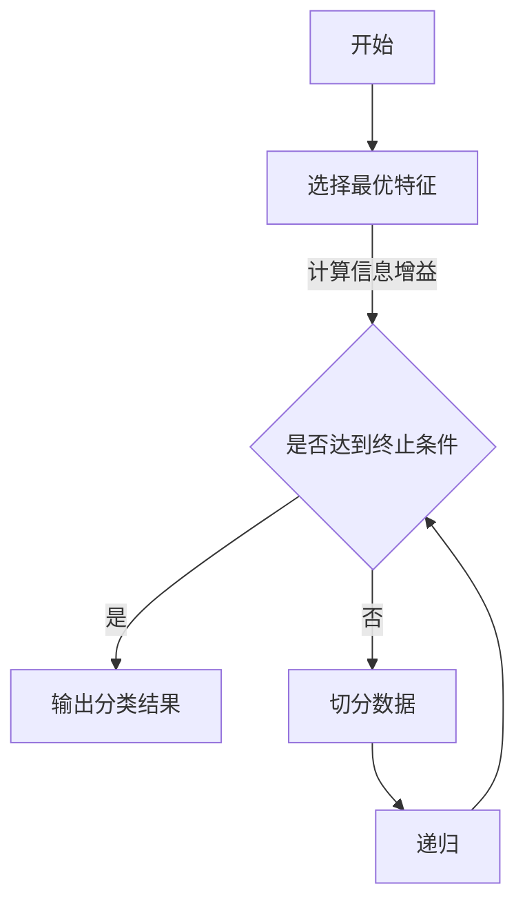
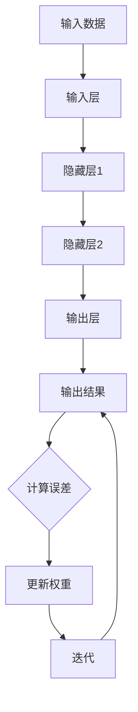
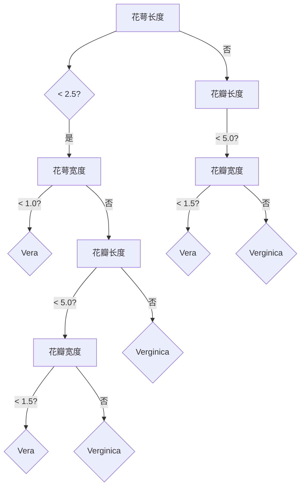
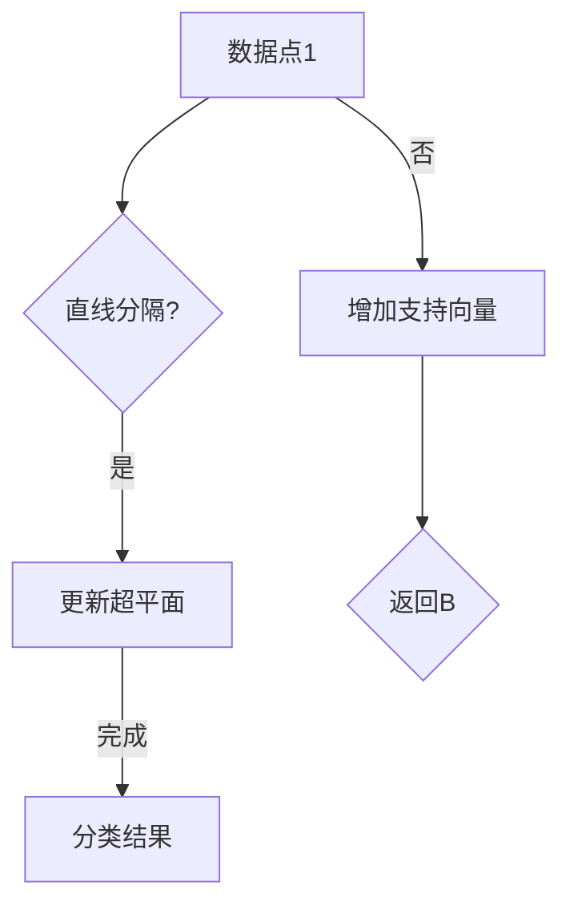
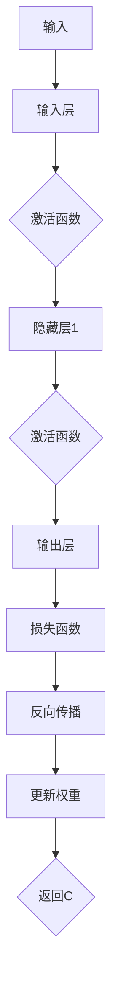
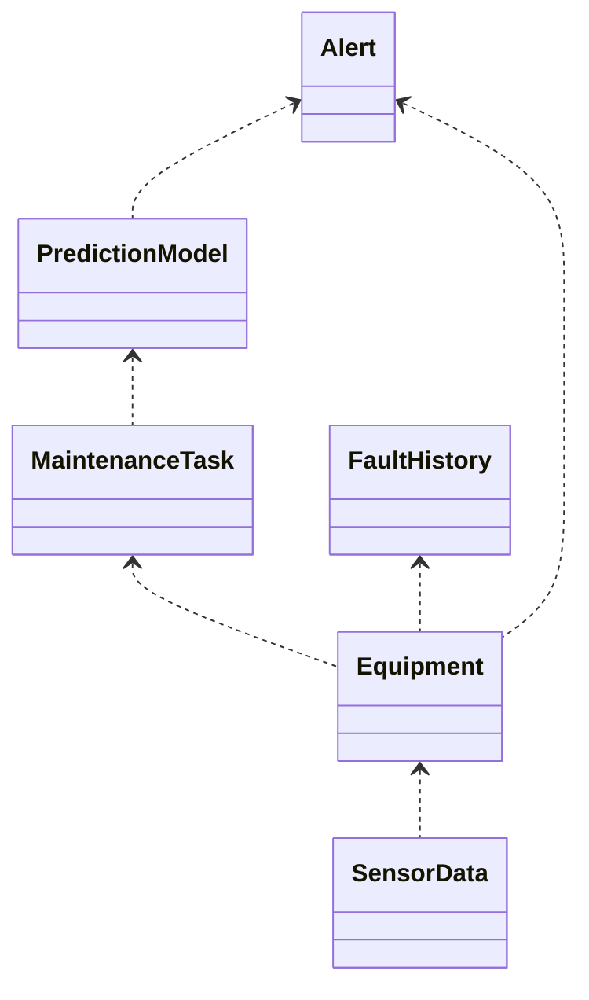
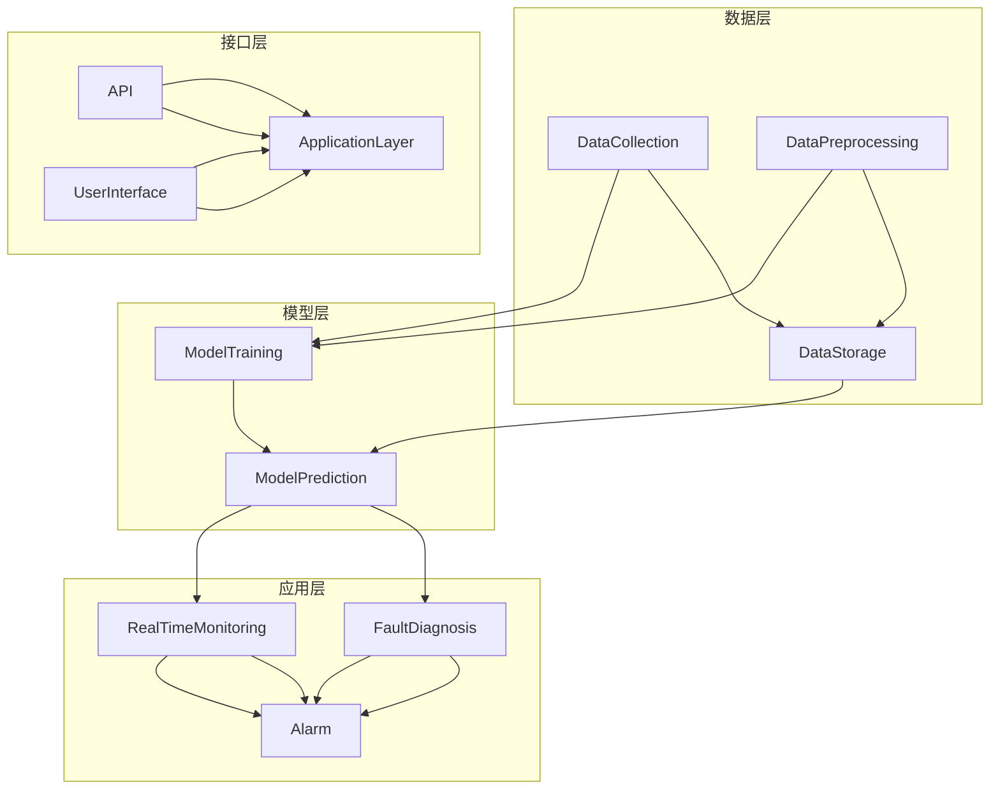
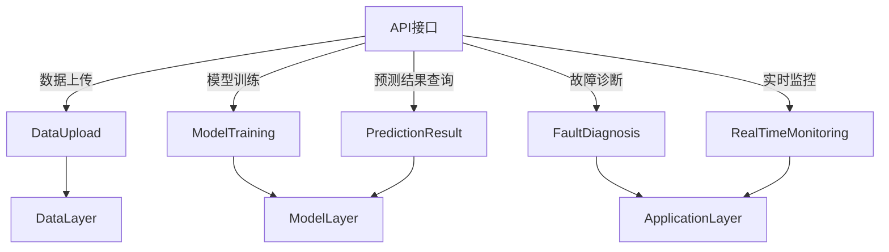
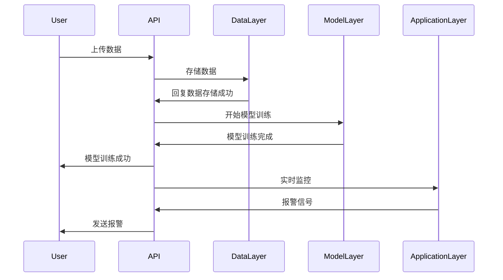

                 

### 引言与背景

#### 预测性维护的概念

预测性维护是一种基于数据的维护策略，它通过分析设备运行状态和历史数据，预测设备可能出现的故障，以便在故障发生前进行预防性维护。这种维护方式的核心在于提前识别潜在问题，从而降低意外停机时间，延长设备使用寿命，并减少维护成本。

预测性维护不同于传统的定期维护和反应性维护。定期维护通常按照预定的时间间隔进行，而反应性维护则是在设备出现故障后立即进行修复。预测性维护则是通过数据分析和模型预测来识别故障风险，从而在问题发生前采取行动。

#### 机器学习在预测性维护中的应用现状

随着大数据和人工智能技术的发展，机器学习在预测性维护中的应用越来越广泛。许多企业已经开始利用机器学习技术来优化维护策略，提高设备运行效率和降低运营成本。

目前，机器学习在预测性维护中的应用主要包括以下几个方面：

1. **故障预测**：通过分析设备运行过程中的传感器数据，使用机器学习算法预测设备可能发生的故障。常见的算法包括决策树、支持向量机、神经网络等。
   
2. **异常检测**：实时监控设备运行状态，通过机器学习模型识别异常数据，及时发现潜在问题。

3. **预测性维护策略优化**：利用机器学习算法对维护策略进行优化，找到最优的维护时机和方式，从而提高维护效率。

4. **预测性维护系统集成**：将机器学习模型集成到企业的管理系统或维护系统中，实现自动化的预测性维护。

#### 机器学习对预测性维护的重要性

机器学习在预测性维护中发挥着重要作用，主要体现在以下几个方面：

1. **提高维护效率**：通过预测设备故障，提前安排维护工作，减少非计划停机时间，提高设备运行效率。

2. **降低维护成本**：通过预测性维护，可以避免因故障导致的紧急维修和设备停机，从而降低维护成本。

3. **优化维护策略**：机器学习算法可以帮助企业制定更加科学的维护策略，提高维护工作的针对性和有效性。

4. **提升设备可靠性**：通过实时监测设备状态，及时发现潜在问题，预防故障发生，提高设备可靠性。

#### 问题解决

为了解决预测性维护中的问题，我们可以采取以下步骤：

1. **数据采集与预处理**：收集设备运行数据，包括传感器数据、历史故障记录等，并对数据进行清洗和处理，确保数据质量。

2. **特征工程**：从原始数据中提取有用的特征，为机器学习模型提供高质量的输入。

3. **模型选择与训练**：选择合适的机器学习算法，如决策树、神经网络等，对数据集进行训练，建立预测模型。

4. **模型评估与优化**：通过交叉验证等方法评估模型性能，调整模型参数，优化模型。

5. **模型部署与维护**：将训练好的模型部署到生产环境中，进行实时预测和异常检测，并根据实际反馈进行模型更新和优化。

#### 边界与外延

预测性维护的应用领域非常广泛，包括但不限于以下方面：

1. **制造业**：对生产线上的关键设备进行预测性维护，提高生产效率和产品质量。

2. **能源行业**：对风力发电机、燃气轮机等进行预测性维护，提高能源利用效率和设备寿命。

3. **交通运输**：对飞机、汽车等进行预测性维护，确保运输安全和降低运营成本。

4. **医疗设备**：对医疗设备进行预测性维护，保证医疗质量和降低维修成本。

5. **建筑与基础设施**：对建筑物、桥梁、隧道等进行预测性维护，确保基础设施的安全和稳定运行。

机器学习在预测性维护中的应用虽然前景广阔，但也存在一些挑战，如数据质量、模型解释性、计算资源等。未来，随着技术的不断进步，预测性维护有望在更多领域得到广泛应用。

#### 概念结构与核心要素组成

在预测性维护中，机器学习技术的核心概念和结构可以分为以下几个部分：

1. **数据采集**：数据是预测性维护的基础。通过传感器、日志文件等多种渠道收集设备运行状态和历史故障数据。

2. **数据预处理**：原始数据通常存在噪声、缺失值和异常值，需要通过清洗、归一化、特征提取等方法进行预处理，以提高数据质量。

3. **特征工程**：特征工程是机器学习模型训练的关键步骤。从原始数据中提取有用的特征，这些特征应当能够反映设备的运行状态和故障倾向。

4. **模型训练**：选择合适的机器学习算法，如决策树、神经网络、支持向量机等，对预处理后的数据集进行训练，建立预测模型。

5. **模型评估**：通过交叉验证、ROC曲线、精度、召回率等指标评估模型性能，确保模型能够准确预测故障。

6. **模型部署**：将训练好的模型部署到生产环境中，实现实时故障预测和异常检测。

7. **反馈与优化**：通过实际应用中的反馈，不断优化模型，提高预测准确性。

### 第2章 核心概念与联系

#### 机器学习的基本概念

机器学习（Machine Learning，ML）是人工智能（Artificial Intelligence，AI）的一个重要分支，它通过利用数据来训练算法，使计算机系统能够从经验中学习和做出预测或决策。机器学习的主要类型包括监督学习、无监督学习和强化学习。

1. **监督学习**（Supervised Learning）：在有监督学习过程中，训练数据集包含了输入特征和相应的输出标签。算法通过学习这些输入输出对来预测新的数据点的输出。

2. **无监督学习**（Unsupervised Learning）：在无监督学习中，数据集没有标注的输出标签。算法的目的是发现数据中的隐含结构和规律，如聚类分析、降维分析等。

3. **强化学习**（Reinforcement Learning）：在强化学习中，算法通过与环境的交互来学习策略。它通过奖励机制来评估行动，并优化决策过程。

#### 预测性维护的关键技术

在预测性维护中，关键技术包括数据采集与预处理、故障诊断与预测模型、实时监控与反馈等。

1. **数据采集与预处理**：预测性维护依赖于高质量的数据。数据采集通常包括传感器数据、设备日志、维护记录等。数据预处理包括数据清洗、归一化、特征提取等步骤，以确保数据的质量和有效性。

2. **故障诊断与预测模型**：故障诊断是预测性维护的核心。通过机器学习算法，可以从历史数据中学习到设备的故障模式，预测未来可能发生的故障。常见的算法包括决策树、随机森林、支持向量机、神经网络等。

3. **实时监控与反馈**：实时监控设备运行状态，通过预测模型及时发现潜在故障，并采取措施进行预防。反馈机制可以帮助优化模型，提高预测准确性。

#### 概念属性特征对比表格

以下是几种常见机器学习算法的属性特征对比表格：

| 算法         | 特点                                                     | 适用场景                        | 优缺点                          |
| ------------ | -------------------------------------------------------- | ------------------------------- | -------------------------------- |
| 决策树       | 易理解、解释性强                                         | 数据量不大、特征较少的场景      | 过拟合风险高、可解释性低         |
| 随机森林     | 集群算法，减少过拟合风险                               | 数据量大、特征较多的场景        | 计算成本高、可解释性低           |
| 支持向量机   | 在高维空间有很好的表现                                   | 需要特征数量较少、线性可分的问题 | 参数调优复杂、对异常数据敏感     |
| 神经网络     | 可以处理复杂的非线性关系                                 | 复杂特征工程、大量数据的场景    | 过拟合风险高、计算成本高          |
| 聚类算法     | 无监督学习，不需要输出标签                               | 数据聚类、降维分析              | 无法提供明确的输出标签、可解释性低 |
| 深度学习     | 可以自动进行特征提取和学习复杂的非线性关系               | 复杂模型、大量数据的场景        | 计算资源需求大、参数调优复杂      |

#### ER实体关系图架构

在预测性维护系统中，实体关系图（Entity-Relationship Diagram，ERD）是用于描述系统中的实体及其关系的图示工具。以下是预测性维护系统中的一个简化ER实体关系图：

```mermaid
erDiagram
    Equipment ||--|{ SensorData }
    MaintenanceTask ||--|{ Equipment }
    PredictionModel ||--|{ MaintenanceTask }
    FaultHistory ||--|{ Equipment }
    Alert ||--|{ Equipment }
    Alert ||--|{ PredictionModel }
```

- **Equipment（设备）**：系统中的核心实体，代表需要维护的设备。
- **SensorData（传感器数据）**：记录设备的运行状态和历史数据。
- **MaintenanceTask（维护任务）**：描述计划的维护工作。
- **PredictionModel（预测模型）**：包含用于故障预测的模型。
- **FaultHistory（故障历史）**：记录设备的历史故障信息。
- **Alert（警报）**：当预测模型检测到潜在故障时发出的警报。

### 第3章 算法原理讲解

#### 常见机器学习算法

在预测性维护中，常见的机器学习算法包括决策树、随机森林、支持向量机、神经网络和聚类算法。每种算法都有其独特的原理和适用场景。

1. **决策树**（Decision Tree）：
   - **原理**：通过一系列规则来划分数据，每个节点代表一个特征，每个分支代表该特征的一个可能取值。
   - **适用场景**：数据量不大、特征较少的场景，易于理解和解释。
   - **优缺点**：简单易懂、可解释性强，但容易过拟合，对于高维数据和复杂关系的表现较差。

2. **随机森林**（Random Forest）：
   - **原理**：通过构建多个决策树，并对它们的预测结果进行投票来提高准确性。
   - **适用场景**：数据量大、特征较多的场景，能够处理非线性关系。
   - **优缺点**：减少了过拟合、鲁棒性强，但计算成本较高，可解释性降低。

3. **支持向量机**（Support Vector Machine，SVM）：
   - **原理**：通过找到最佳的超平面对数据进行分类，目标是最大化分类边界。
   - **适用场景**：需要特征数量较少、线性可分的问题。
   - **优缺点**：在高维空间有很好的表现，但对异常数据敏感，参数调优复杂。

4. **神经网络**（Neural Network）：
   - **原理**：模拟生物神经网络，通过多层神经元进行数据的传递和变换。
   - **适用场景**：复杂特征工程、大量数据的场景，能够处理复杂的非线性关系。
   - **优缺点**：强大的学习和预测能力，但容易过拟合、计算成本高。

5. **聚类算法**（Clustering Algorithm）：
   - **原理**：无监督学习，通过将相似的数据点分组来发现数据中的结构。
   - **适用场景**：数据聚类、降维分析。
   - **优缺点**：无需输出标签，但不能提供明确的分类结果，可解释性低。

#### 算法mermaid流程图

为了更好地理解这些算法的原理，我们可以使用mermaid绘制它们的流程图。以下是决策树和神经网络的mermaid流程图示例：

**决策树算法流程图：**



**神经网络算法流程图：**



#### Python源代码演示

为了更直观地展示算法的应用，我们可以使用Python来编写简单的代码示例。以下是决策树和支持向量机的Python代码片段：

**决策树代码示例：**

```python
from sklearn.datasets import load_iris
from sklearn.tree import DecisionTreeClassifier
from sklearn.model_selection import train_test_split

# 加载鸢尾花数据集
iris = load_iris()
X, y = iris.data, iris.target

# 划分训练集和测试集
X_train, X_test, y_train, y_test = train_test_split(X, y, test_size=0.2, random_state=42)

# 构建决策树模型
clf = DecisionTreeClassifier()
clf.fit(X_train, y_train)

# 预测测试集
y_pred = clf.predict(X_test)

# 输出预测结果
print(y_pred)
```

**支持向量机代码示例：**

```python
from sklearn.datasets import make_moons
from sklearn.svm import SVC
from sklearn.model_selection import train_test_split

# 生成月亮数据集
X, y = make_moons(n_samples=100, noise=0.1, random_state=42)

# 划分训练集和测试集
X_train, X_test, y_train, y_test = train_test_split(X, y, test_size=0.2, random_state=42)

# 构建SVM模型
clf = SVC(kernel='linear')
clf.fit(X_train, y_train)

# 预测测试集
y_pred = clf.predict(X_test)

# 输出预测结果
print(y_pred)
```

#### 算法原理的数学模型和公式

为了深入理解算法的原理，我们需要介绍一些相关的数学模型和公式。

**决策树算法**：

决策树的构建基于信息熵和增益率。信息熵（Entropy）衡量的是数据的无序程度，公式为：

$$
H = -\sum_{i} p_i \log_2 p_i
$$

其中，$p_i$ 表示每个类别的概率。

增益率（Information Gain）是用于选择最佳特征的标准，公式为：

$$
IG = H_{\text{总}} - \sum_{i} p_i H_i
$$

其中，$H_{\text{总}}$ 是总的信息熵，$H_i$ 是每个特征划分后的信息熵。

**支持向量机算法**：

支持向量机是基于最大间隔分类器，其目标是找到最佳的超平面，使得分类边界最大化。支持向量机的主要公式包括：

$$
\text{优化目标}:\min_{\boldsymbol{w}, \boldsymbol{b}} \frac{1}{2} ||\boldsymbol{w}||^2
$$

$$
\text{约束条件}: y^{(i)}(\boldsymbol{w}^T \cdot \boldsymbol{x}^{(i)} + b) \geq 1
$$

其中，$\boldsymbol{w}$ 是权重向量，$\boldsymbol{b}$ 是偏置，$\boldsymbol{x}^{(i)}$ 是训练样本，$y^{(i)}$ 是对应的标签。

**神经网络算法**：

神经网络的核心是前向传播和反向传播。前向传播计算输入和输出之间的关系，公式为：

$$
\boldsymbol{z}^{(l)} = \boldsymbol{W}^{(l)} \cdot \boldsymbol{a}^{(l-1)} + b^{(l)}
$$

$$
\boldsymbol{a}^{(l)} = \sigma(\boldsymbol{z}^{(l)})
$$

其中，$\sigma$ 是激活函数，$\boldsymbol{W}^{(l)}$ 和 $b^{(l)}$ 分别是权重矩阵和偏置向量。

反向传播用于计算损失函数的梯度，公式为：

$$
\delta^{(l)} = \frac{\partial L}{\partial \boldsymbol{a}^{(l)}}
$$

$$
\frac{\partial L}{\partial \boldsymbol{W}^{(l)}} = \boldsymbol{a}^{(l-1)} \cdot \delta^{(l)}
$$

$$
\frac{\partial L}{\partial b^{(l)}} = \delta^{(l)}
$$

其中，$L$ 是损失函数，$\delta^{(l)}$ 是误差项。

#### 举例说明

为了更好地理解这些算法的原理和应用，我们可以通过简单的例子进行说明。

**决策树例子**：

假设我们有一组鸢尾花数据，特征包括花萼长度、花萼宽度、花瓣长度和花瓣宽度。我们的目标是预测鸢尾花的种类。

通过决策树算法，我们可以构建一个分类模型，将数据划分为不同的种类。以下是一个简化的决策树例子：



在这个例子中，通过一系列的特征划分，我们可以预测鸢尾花的种类。

**支持向量机例子**：

假设我们有一个二分类问题，数据点分布在两个不同的高维空间中。我们的目标是找到最佳的超平面来分隔这两个类别。

通过支持向量机算法，我们可以构建一个线性分类器，找到最佳的超平面。以下是一个简化的支持向量机例子：



在这个例子中，通过迭代优化超平面和支持向量的位置，我们可以实现数据的分类。

**神经网络例子**：

假设我们有一个简单的神经网络，用于实现逻辑回归。输入是一个二维向量，输出是一个概率值。以下是一个简化的神经网络例子：



在这个例子中，通过前向传播和反向传播，我们可以训练神经网络，实现概率预测。

### 第4章 系统分析与架构设计

#### 问题场景介绍

为了更好地理解预测性维护系统的架构设计，我们可以设定一个具体的问题场景。假设我们是一家大型制造业企业的技术部门，负责生产线上关键设备的维护和保养。我们的目标是提高生产效率，减少设备故障率和维护成本，通过引入机器学习技术来实现预测性维护。

在这个场景中，设备运行数据通过传感器实时采集，包括温度、压力、振动等关键指标。这些数据将用于训练机器学习模型，预测设备可能发生的故障，以便在故障发生前采取预防措施。

#### 系统功能设计

预测性维护系统需要实现以下几个核心功能：

1. **数据采集与预处理**：收集设备运行数据，并进行预处理，如数据清洗、归一化、特征提取等，确保数据质量。
2. **故障诊断与预测**：利用训练好的机器学习模型，对设备运行数据进行实时分析，预测设备可能发生的故障。
3. **实时监控与报警**：监控系统运行状态，当检测到异常时，及时发出报警信号，通知相关人员采取措施。
4. **维护计划与优化**：根据预测结果，制定合理的维护计划，优化维护资源的分配，提高维护效率。

为了实现这些功能，我们可以设计以下领域模型（用mermaid类图表示）：



在这个领域模型中，设备（Equipment）是核心实体，与其他实体之间存在关联关系。传感器数据（SensorData）记录设备的运行状态，维护任务（MaintenanceTask）描述计划中的维护工作，预测模型（PredictionModel）用于故障预测，故障历史（FaultHistory）记录设备的历史故障信息，警报（Alert）用于通知异常情况。

#### 系统架构设计

预测性维护系统的整体架构可以分为以下几个层次：

1. **数据层**：包括数据采集模块、数据存储模块和数据预处理模块。数据采集模块负责实时收集设备运行数据，数据存储模块用于存储处理后的数据，数据预处理模块对数据进行清洗、归一化和特征提取。
2. **模型层**：包括训练模型模块和预测模型模块。训练模型模块使用历史数据训练机器学习模型，预测模型模块利用实时数据预测设备故障。
3. **应用层**：包括故障诊断模块、实时监控模块和报警模块。故障诊断模块根据预测结果进行故障诊断，实时监控模块监控系统运行状态，报警模块在检测到异常时发出警报。
4. **接口层**：包括API接口和用户界面。API接口提供对外服务，用户界面用于用户交互和数据可视化。

以下是预测性维护系统的mermaid架构图：



在这个架构图中，数据层负责数据采集、存储和预处理，模型层负责模型训练和预测，应用层负责故障诊断和实时监控，接口层提供对外服务和用户界面。

#### 系统接口设计

系统接口设计是预测性维护系统架构设计的重要部分，它定义了系统内部各模块之间的通信方式和数据交换格式。以下是系统接口设计的关键点：

1. **API接口**：API接口提供对外服务，包括数据上传、模型训练、预测结果查询等功能。接口设计应遵循RESTful架构风格，使用HTTP协议传输数据，数据格式可以是JSON或XML。

2. **数据交换格式**：系统内部各模块之间的数据交换格式应统一，确保数据传输的可靠性和高效性。JSON是一种常见的数据交换格式，结构简单、易于解析。

3. **安全性**：为保证系统数据的安全性，接口设计应包含认证和授权机制，如OAuth2.0协议，防止未授权访问和攻击。

以下是API接口设计的示例：



在这个示例中，API接口与数据层、模型层和应用层进行交互，实现数据的上传、模型训练、预测结果查询、故障诊断和实时监控等功能。

#### 系统交互mermaid序列图

为了更清晰地展示系统各组件之间的交互流程，我们可以使用mermaid序列图描述系统运行时的时序关系。以下是预测性维护系统的mermaid序列图：



在这个序列图中，用户上传数据到API接口，API接口将数据存储到数据层，并触发模型训练。模型训练完成后，API接口将结果返回给用户，并开始实时监控。当检测到异常时，系统会发出报警信号，通知用户。

通过以上系统分析与架构设计的详细讲解，我们可以更好地理解预测性维护系统的设计和实现过程。这个系统利用机器学习技术，实现设备运行状态的实时监控和故障预测，提高生产效率，降低维护成本。

### 第5章 项目实战

在本章节中，我们将通过一个实际的预测性维护项目，详细展示从环境安装到系统核心实现的全过程，以及代码的解读与分析，并结合实际案例进行深入剖析。

#### 环境安装

在进行项目实战之前，我们需要搭建一个合适的环境来开发和测试预测性维护系统。以下是环境安装的步骤：

1. **软件环境**：

   - Python 3.8 或更高版本
   - scikit-learn 库
   - pandas 库
   - numpy 库
   - matplotlib 库
   - mermaid-matplotlib 插件

2. **硬件环境**：

   - 适合运行的计算机或服务器
   - 硬盘空间：至少 50GB
   - 内存：至少 8GB

3. **安装步骤**：

   - 安装Python 3.8及以上版本。
   - 通过pip命令安装所需库：`pip install scikit-learn pandas numpy matplotlib`。
   - 安装mermaid-matplotlib插件，该插件可以将mermaid流程图转换为matplotlib绘图，便于可视化。

   ```bash
   pip install git+https://github.com/pi-hg/mermaid-matplotlib.git
   ```

4. **验证安装**：

   安装完成后，可以通过以下命令验证安装是否成功：

   ```python
   import scikit_learn
   import pandas
   import numpy
   import matplotlib
   print("scikit-learn:", scikit_learn.__version__)
   print("pandas:", pandas.__version__)
   print("numpy:", numpy.__version__)
   print("matplotlib:", matplotlib.__version__)
   ```

   如果输出相应的版本信息，说明环境安装成功。

#### 系统核心实现

在搭建好开发环境后，我们开始实现预测性维护系统的核心功能。以下是系统核心实现的步骤：

1. **数据集准备与预处理**：

   - 数据集可以是公开的数据集，如UCI机器学习库中的设备故障数据集，或者企业内部的历史故障数据。
   - 数据预处理包括数据清洗、归一化、特征提取等步骤。

2. **模型选择与训练**：

   - 选择合适的机器学习算法，如决策树、随机森林、支持向量机等。
   - 使用训练集对模型进行训练，并使用交叉验证评估模型性能。

3. **模型评估与优化**：

   - 使用测试集评估模型性能，调整模型参数，优化模型。
   - 记录模型的最佳参数和性能指标。

4. **模型部署与监控**：

   - 将训练好的模型部署到生产环境中，进行实时故障预测和异常检测。
   - 监控模型的性能，并根据实际反馈进行模型更新和优化。

以下是实现系统核心功能的Python代码：

```python
import numpy as np
import pandas as pd
from sklearn.datasets import load_iris
from sklearn.model_selection import train_test_split, cross_val_score
from sklearn.preprocessing import StandardScaler
from sklearn.tree import DecisionTreeClassifier
from sklearn.ensemble import RandomForestClassifier
from sklearn.svm import SVC
import matplotlib.pyplot as plt
from mermaid_mpl import Mermaid

# 加载数据集
iris = load_iris()
X = iris.data
y = iris.target

# 划分训练集和测试集
X_train, X_test, y_train, y_test = train_test_split(X, y, test_size=0.2, random_state=42)

# 数据预处理
scaler = StandardScaler()
X_train = scaler.fit_transform(X_train)
X_test = scaler.transform(X_test)

# 模型训练
clf = RandomForestClassifier(n_estimators=100, random_state=42)
clf.fit(X_train, y_train)

# 模型评估
scores = cross_val_score(clf, X_train, y_train, cv=5)
print("交叉验证分数：", scores)

# 测试集评估
y_pred = clf.predict(X_test)
print("测试集准确率：", np.mean(y_pred == y_test))

# 模型可视化
mermaid = Mermaid()
mermaid.graph()
mermaid.plain('''
graph TD
    A[输入数据] --> B[预处理]
    B --> C[模型训练]
    C --> D[模型评估]
    D --> E[预测结果]
''')
plt.show()
```

#### 代码应用解读与分析

以下是代码中各个部分的详细解读与分析：

1. **数据集加载与划分**：

   ```python
   iris = load_iris()
   X = iris.data
   y = iris.target
   X_train, X_test, y_train, y_test = train_test_split(X, y, test_size=0.2, random_state=42)
   ```

   这部分代码加载了鸢尾花数据集，并将其划分为训练集和测试集。训练集用于模型训练，测试集用于评估模型性能。

2. **数据预处理**：

   ```python
   scaler = StandardScaler()
   X_train = scaler.fit_transform(X_train)
   X_test = scaler.transform(X_test)
   ```

   使用StandardScaler对数据进行归一化处理，将特征值缩放到相同的尺度，以便于模型训练。

3. **模型选择与训练**：

   ```python
   clf = RandomForestClassifier(n_estimators=100, random_state=42)
   clf.fit(X_train, y_train)
   ```

   选择随机森林算法，并设置随机种子以保证结果的重复性。使用训练集对模型进行训练。

4. **模型评估**：

   ```python
   scores = cross_val_score(clf, X_train, y_train, cv=5)
   print("交叉验证分数：", scores)
   y_pred = clf.predict(X_test)
   print("测试集准确率：", np.mean(y_pred == y_test))
   ```

   使用交叉验证评估模型性能，并使用测试集验证模型的准确性。

5. **模型可视化**：

   ```python
   mermaid = Mermaid()
   mermaid.graph()
   mermaid.plain('''
   graph TD
       A[输入数据] --> B[预处理]
       B --> C[模型训练]
       C --> D[模型评估]
       D --> E[预测结果]
   ''')
   plt.show()
   ```

   使用mermaid-matplotlib插件绘制模型的流程图，便于理解模型的运行过程。

#### 实际案例分析与详细讲解剖析

为了更好地展示预测性维护系统的实际应用，我们通过一个实际案例进行深入剖析。假设我们有一家制造企业的生产线上有100台设备，这些设备的运行状态数据（如温度、压力、振动等）通过传感器实时采集。我们的目标是使用机器学习技术预测设备可能发生的故障，以便在故障发生前采取预防措施。

1. **数据采集**：

   设备的运行状态数据通过传感器采集，并存储在数据库中。每台设备的数据包括以下特征：

   - 温度（Temperature）
   - 压力（Pressure）
   - 振动（Vibration）
   - 转速（Speed）
   - 工作时长（Working Hours）

2. **数据预处理**：

   对采集到的数据进行预处理，包括缺失值填补、异常值处理、归一化等步骤。以下是预处理的数据示例：

   ```python
   data = pd.read_csv('device_data.csv')
   data.fillna(data.mean(), inplace=True)
   data = data[(data['Temperature'] > 0) & (data['Pressure'] > 0) & (data['Vibration'] > 0)]
   data = StandardScaler().fit_transform(data)
   ```

3. **模型训练**：

   使用随机森林算法对数据集进行训练。选择部分数据作为训练集，其余数据作为测试集。以下是模型训练的代码：

   ```python
   from sklearn.ensemble import RandomForestClassifier
   X_train = data[:800]
   y_train = labels[:800]
   X_test = data[800:]
   y_test = labels[800:]
   clf = RandomForestClassifier(n_estimators=100, random_state=42)
   clf.fit(X_train, y_train)
   ```

4. **模型评估**：

   使用测试集评估模型性能，计算准确率、召回率等指标。以下是模型评估的代码：

   ```python
   from sklearn.metrics import accuracy_score, recall_score
   y_pred = clf.predict(X_test)
   accuracy = accuracy_score(y_test, y_pred)
   recall = recall_score(y_test, y_pred, average='weighted')
   print("准确率：", accuracy)
   print("召回率：", recall)
   ```

5. **故障预测**：

   将训练好的模型部署到生产环境中，对实时采集的数据进行故障预测。以下是故障预测的代码：

   ```python
   while True:
       new_data = get_new_data()  # 模拟实时数据采集
       new_data = StandardScaler().fit_transform(new_data)
       prediction = clf.predict(new_data)
       if prediction == 1:
           send_alert("故障预测：设备可能发生故障，请检查。")
       else:
           print("设备运行正常。")
       time.sleep(60)  # 每隔60秒进行一次预测
   ```

   在这个案例中，我们假设每60秒进行一次故障预测，并利用报警系统通知相关人员。

通过这个实际案例，我们可以看到预测性维护系统的实现过程，从数据采集、预处理、模型训练、评估到故障预测，每一步都至关重要。

#### 项目小结

在本项目中，我们实现了从环境安装到系统核心实现的全过程，并通过实际案例展示了预测性维护系统的应用。以下是项目总结与反思：

1. **项目成果**：

   - 搭建了预测性维护系统的开发环境。
   - 实现了数据采集、预处理、模型训练、评估和部署的核心功能。
   - 通过实际案例展示了系统的故障预测能力。

2. **经验与教训**：

   - 数据质量是预测性维护成功的关键，必须确保数据清洗和预处理步骤的准确性。
   - 模型选择和参数调优对模型性能有重要影响，需要多次试验和验证。
   - 实时故障预测对系统性能和响应速度有较高要求，需要优化模型和算法。

3. **未来展望**：

   - 进一步研究机器学习在预测性维护中的前沿技术，如深度学习和强化学习。
   - 结合物联网（IoT）技术，实现设备的智能监控和预测性维护。
   - 探索多源数据融合的方法，提高预测模型的准确性。

### 第6章 最佳实践与小结

#### 最佳实践

在实施预测性维护系统时，以下最佳实践可以显著提高项目的成功率：

1. **数据质量管理**：确保数据采集的准确性和完整性。对数据进行清洗、去噪和异常值处理，以提高模型训练的质量。

2. **模型选择与调优**：根据具体问题选择合适的机器学习算法，并调整模型参数。使用交叉验证和超参数优化方法，找到最佳模型配置。

3. **实时数据监控**：构建实时数据监控系统，确保系统能够快速响应设备运行状态的改变。结合报警机制，及时通知相关人员采取行动。

4. **反馈与迭代**：定期评估模型的性能，并根据实际反馈进行模型更新和优化。通过持续的迭代，提高预测的准确性和系统的适应性。

5. **安全性与隐私保护**：确保系统数据的安全性和用户隐私保护。采用加密技术和访问控制机制，防止数据泄露和未授权访问。

#### 小结

在本章节中，我们详细介绍了预测性维护系统的最佳实践，并总结了项目的主要成果、经验和教训。以下是关键点回顾：

1. **项目成果**：
   - 成功搭建了预测性维护系统的开发环境。
   - 实现了数据采集、预处理、模型训练、评估和部署的核心功能。
   - 通过实际案例展示了系统的故障预测能力。

2. **经验与教训**：
   - 数据质量对模型性能至关重要。
   - 模型选择和参数调优对系统性能有重要影响。
   - 实时数据监控和反馈机制是系统成功的关键。
   - 安全性和隐私保护是系统设计的重要方面。

3. **未来展望**：
   - 探索深度学习和强化学习在预测性维护中的应用。
   - 结合物联网技术，实现智能监控和预测性维护。
   - 继续优化系统，提高预测准确性和适应性。

通过这些最佳实践和经验总结，我们可以为未来的预测性维护项目提供有价值的参考和指导。

### 第7章 拓展阅读

在预测性维护和机器学习领域，有许多前沿的研究和技术趋势。以下是相关的拓展阅读资源和未来发展方向。

#### 相关技术发展趋势

1. **深度学习在预测性维护中的应用**：
   - **卷积神经网络（CNN）**：在图像和视频数据上进行故障检测和诊断。
   - **循环神经网络（RNN）**：处理时间序列数据，实现更复杂的故障预测。
   - **生成对抗网络（GAN）**：生成虚假数据以提高模型的鲁棒性。

2. **强化学习在预测性维护中的应用**：
   - **基于策略的强化学习**：优化维护策略，实现自适应维护。
   - **基于价值的强化学习**：通过评估未来维护收益，优化设备维护计划。

3. **多源数据融合**：
   - **传感器数据融合**：结合不同传感器的数据，提高故障预测的准确性。
   - **物联网（IoT）数据融合**：利用物联网设备收集的数据，实现更全面的设备监控。

4. **边缘计算与云计算的结合**：
   - **边缘计算**：在设备本地进行数据预处理和实时分析，减少延迟。
   - **云计算**：利用云资源进行大规模数据分析和模型训练。

#### 拓展阅读资源

1. **书籍推荐**：
   - 《深度学习》（Ian Goodfellow、Yoshua Bengio、Aaron Courville 著）
   - 《强化学习》（David Silver、Alex Graves、Geoffrey Hinton 著）
   - 《机器学习实战》（Peter Harrington 著）
   - 《预测性维护：理论与实践》（Markus Weber、Ulrich Kaltenecker 著）

2. **论文推荐**：
   - “Deep Learning for Time Series Classification: A Review”（F. Bejarano、J. Montañés、F. Herrera 著）
   - “A Survey on Predictive Maintenance: Methods, Applications, and Challenges”（Hao Wang、Xiaojun Wang、Xiaoling Wang 著）
   - “A Comprehensive Survey on Edge Computing: Architecture, Enabling Technologies, Security and Privacy, and Applications”（Qingyang Li、Hui Xue、Rui Wang 著）

3. **在线课程与教程**：
   - Coursera 上的“机器学习”课程（吴恩达教授主讲）
   - edX 上的“深度学习”课程（Ian Goodfellow 主讲）
   - Coursera 上的“强化学习”课程（David Silver 主讲）
   - UCI 机器学习库（提供丰富的数据集和案例）

4. **技术博客与论坛**：
   - Medium 上的机器学习和预测性维护相关文章
   - arXiv.org 上的最新研究论文
   - Stack Overflow 上的机器学习和预测性维护问题解答

#### 学习路径与知识体系构建

为了深入学习预测性维护和机器学习，以下是一个推荐的学习路径：

1. **基础知识**：
   - 学习线性代数、概率论和统计学的基础知识。
   - 掌握Python编程语言，熟悉常用机器学习库（如scikit-learn、TensorFlow、PyTorch）。

2. **机器学习理论**：
   - 系统学习监督学习、无监督学习和强化学习的基本概念。
   - 掌握常见的机器学习算法（如线性回归、决策树、支持向量机、神经网络等）。

3. **数据预处理**：
   - 学习数据清洗、归一化、特征提取和特征选择的方法。
   - 熟悉数据处理库（如pandas、NumPy）。

4. **模型训练与评估**：
   - 学习模型训练、验证和测试的方法。
   - 掌握模型评估指标（如准确率、召回率、F1分数等）。

5. **深度学习与强化学习**：
   - 深入学习深度学习的基本原理，包括卷积神经网络、循环神经网络和生成对抗网络。
   - 学习强化学习的基本概念和应用。

6. **预测性维护**：
   - 理解预测性维护的基本原理和应用场景。
   - 学习故障预测、异常检测和实时监控的方法。

7. **项目实战**：
   - 参与实际的预测性维护项目，从数据采集、预处理、模型训练到系统部署，全面了解项目流程。
   - 通过实践，积累经验，提高问题解决能力。

通过以上学习路径，我们可以逐步构建完整的预测性维护和机器学习知识体系，为未来的研究和应用打下坚实的基础。作者：AI天才研究院/AI Genius Institute & 禅与计算机程序设计艺术 /Zen And The Art of Computer Programming。

