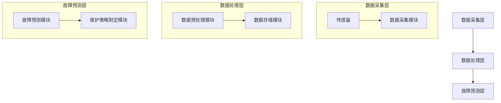
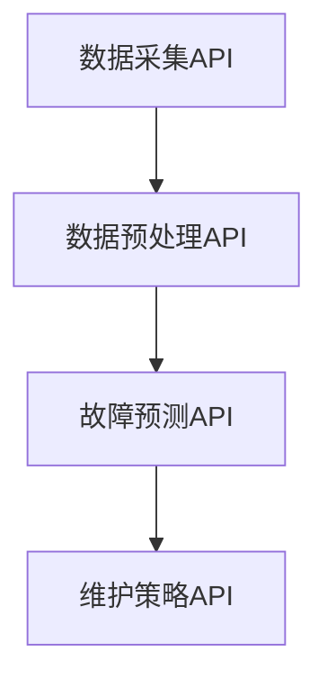
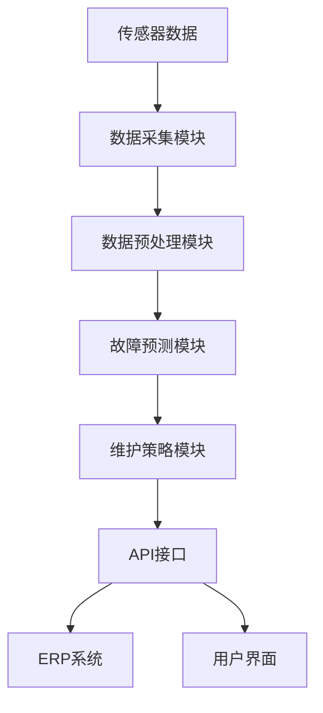

                 

### 背景介绍

#### 1.1 设备维护的重要性

设备维护是任何工业或服务领域中不可或缺的一部分。设备的正常运行不仅直接关系到生产效率，还影响到整体运营成本和安全性。传统的设备维护通常基于定期检查和经验判断，这种被动式维护方式往往存在以下问题：首先，无法及时识别设备的潜在故障，导致设备非计划性停机；其次，维护周期往往过于固定，导致资源的浪费或过度维护；最后，维护质量难以保证，因为缺乏对设备运行状态的实时监控。

随着技术的进步，特别是机器学习（Machine Learning，ML）技术的发展，预测性维护（Predictive Maintenance）逐渐成为了一种更为智能和高效的设备维护方式。预测性维护利用历史数据、传感器数据和机器学习算法，对设备运行状态进行实时监控和分析，从而在设备发生故障之前预测潜在问题，并进行针对性的维护。这种方式不仅提高了设备运行的可靠性，还显著降低了维护成本和停机时间。

#### 1.2 预测性维护的概念

预测性维护是一种基于数据驱动和智能分析的设备管理策略。它的核心是通过收集和分析设备在各种工作条件下的运行数据，利用机器学习算法预测设备可能出现的故障或性能下降，从而在问题发生之前进行预防性维护。与传统的定期维护和故障后修复相比，预测性维护具有以下特点：

1. **实时监控**：通过安装传感器和实时数据采集系统，可以连续监控设备的运行状态，确保任何异常情况都能被及时捕捉到。
2. **数据驱动**：依赖大量的历史数据和实时数据，利用机器学习算法对设备运行状态进行深度分析和模式识别，提高预测的准确性和可靠性。
3. **预防性维护**：在设备发生故障之前进行干预，减少故障发生的概率，避免因故障导致的停机和生产损失。
4. **优化维护策略**：通过分析设备运行数据，制定个性化的维护计划，避免不必要的维护和资源浪费。

#### 1.3 预测性维护的优势

预测性维护相比传统的设备维护方式具有以下显著优势：

1. **减少停机时间**：通过提前预测设备故障，可以在问题发生之前进行维护，从而最大限度地减少设备的停机时间，提高生产效率。
2. **降低维护成本**：预测性维护减少了不必要的维护次数和时长，从而降低了维护成本。同时，通过优化维护计划，可以更好地分配维护资源。
3. **提高设备寿命**：通过实时监控和预防性维护，可以延长设备的使用寿命，减少设备更换频率。
4. **提高安全性**：预测性维护能够及时发现设备潜在的故障和隐患，从而降低安全事故的发生概率。
5. **优化维护策略**：通过对设备运行数据的分析，可以制定更加科学和高效的维护策略，提高整体维护水平。

总之，预测性维护是一种基于数据驱动和智能分析的设备管理策略，通过实时监控和预测设备状态，不仅能够提高设备运行的可靠性，还能显著降低维护成本和停机时间，具有广泛的应用前景。接下来，我们将进一步探讨机器学习在预测性维护中的应用，了解其核心概念和原理。

### 核心概念与联系

#### 2.1 机器学习的基本原理

机器学习是人工智能（Artificial Intelligence，AI）的重要分支，其主要目标是使计算机系统能够从数据中自动学习和改进，从而实现特定任务。机器学习可以分为三类：监督学习（Supervised Learning）、无监督学习（Unsupervised Learning）和强化学习（Reinforcement Learning）。以下是这三种学习方式的详细介绍。

##### 2.1.1 监督学习

监督学习是机器学习中最为常见的一种类型。在这种学习中，算法利用已知的数据（称为训练集），学习数据的特征和规律，以便对未知数据进行预测或分类。监督学习的关键在于“监督”，即训练集包含了输入和相应的输出，算法可以通过这些输入输出对来调整模型参数。

**算法原理**：监督学习算法通常包括以下步骤：
1. **数据采集**：收集包含输入特征和输出标签的训练数据集。
2. **特征选择**：从输入数据中选择与输出标签相关的重要特征。
3. **模型训练**：利用训练数据集，通过优化算法（如梯度下降）来调整模型参数。
4. **模型评估**：使用验证集或测试集来评估模型的性能，调整模型参数以达到最佳效果。

**数学模型**：监督学习常用的数学模型包括线性回归（Linear Regression）、逻辑回归（Logistic Regression）、支持向量机（Support Vector Machine，SVM）等。以下是一个简单的线性回归模型示例：

$$
y = \beta_0 + \beta_1x_1 + \beta_2x_2 + ... + \beta_nx_n
$$

其中，\(y\) 是输出标签，\(\beta_0\) 是截距，\(\beta_1, \beta_2, ..., \beta_n\) 是权重参数，\(x_1, x_2, ..., x_n\) 是输入特征。

**示例讲解**：假设我们要预测某个股票的未来价格。我们可以收集过去一段时间内该股票的价格和成交量等数据，利用线性回归模型来预测未来价格。输入特征可以是历史价格和成交量，输出标签是未来价格。

##### 2.1.2 无监督学习

无监督学习是指在没有标注数据的情况下，通过分析数据本身的结构和分布，从中发现数据的内在规律。常见的无监督学习算法包括聚类（Clustering）、降维（Dimensionality Reduction）等。

**算法原理**：无监督学习算法通常包括以下步骤：
1. **数据采集**：收集未标注的数据集。
2. **特征提取**：从原始数据中提取有用的特征。
3. **模型训练**：利用无监督学习算法，如K-均值聚类（K-Means Clustering）或主成分分析（Principal Component Analysis，PCA），来发现数据的内在结构。
4. **模型评估**：通过内部指标（如聚类系数、信息增益等）来评估模型性能。

**数学模型**：无监督学习常用的数学模型包括K-均值聚类、PCA等。以下是一个简单的K-均值聚类模型示例：

$$
C = \{c_1, c_2, ..., c_k\}
$$

其中，\(C\) 是聚类中心，\(c_1, c_2, ..., c_k\) 是各个簇的中心点。

**示例讲解**：假设我们有一组顾客的数据，包括年龄、收入、购买行为等信息。利用K-均值聚类算法，我们可以将顾客分成不同的群体，从而更好地进行市场细分和精准营销。

##### 2.1.3 强化学习

强化学习是一种通过试错（trial-and-error）方式，在与环境互动中学习最优策略的机器学习方法。强化学习通常涉及一个智能体（Agent）在一个环境（Environment）中通过执行动作（Action）来获得奖励（Reward）或惩罚（Penalty）。

**算法原理**：强化学习算法通常包括以下步骤：
1. **环境初始化**：智能体处于某个状态（State）。
2. **智能体选择动作**：根据当前状态，智能体选择一个动作。
3. **环境反馈**：环境根据智能体的动作，返回一个新的状态和相应的奖励或惩罚。
4. **更新策略**：智能体根据获得的奖励或惩罚，调整其策略（Policy），以期望在长期内获得最大的总奖励。

**数学模型**：强化学习常用的数学模型包括Q学习（Q-Learning）、深度强化学习（Deep Reinforcement Learning）等。以下是一个简单的Q学习模型示例：

$$
Q(s, a) = r + \gamma \max_a' Q(s', a')
$$

其中，\(Q(s, a)\) 是在状态 \(s\) 下执行动作 \(a\) 的即时奖励，\(r\) 是即时奖励，\(\gamma\) 是折扣因子，\(s'\) 是执行动作后的状态，\(a'\) 是在状态 \(s'\) 下执行的最佳动作。

**示例讲解**：假设一个无人驾驶汽车在学习如何在不同路况下行驶。通过不断地与环境互动，无人驾驶汽车可以学习到在不同路况下行驶的最佳策略，从而提高行驶的安全性和效率。

#### 2.2 预测性维护的核心概念

##### 2.2.1 数据采集

数据采集是预测性维护的基础。通过对设备运行过程中的各种数据进行收集，可以全面了解设备的运行状态。常用的数据采集方式包括传感器数据采集、日志数据采集和外部数据源采集等。

**数据采集方法**：
1. **传感器数据采集**：通过安装在设备上的各种传感器，实时采集设备的温度、振动、压力等运行参数。
2. **日志数据采集**：通过设备的操作日志和系统日志，收集设备的使用记录和运行状态。
3. **外部数据源采集**：从企业内部的其他数据源（如ERP系统、生产管理系统等）获取与设备运行相关的数据。

**数据类型**：
1. **静态数据**：包括设备的基本信息、历史维护记录等。
2. **动态数据**：包括实时采集的传感器数据和日志数据。

##### 2.2.2 数据预处理

数据预处理是确保数据质量、提高模型性能的重要环节。数据预处理包括数据清洗、数据归一化、数据缺失值处理和数据特征工程等。

**数据预处理步骤**：
1. **数据清洗**：去除数据中的噪声和异常值，保证数据的准确性。
2. **数据归一化**：将不同量纲的数据转换为相同的量纲，以便于模型处理。
3. **数据缺失值处理**：对缺失值进行填充或删除。
4. **特征工程**：从原始数据中提取有用的特征，为模型提供有效的输入。

##### 2.2.3 特征提取与选择

特征提取与选择是提高模型性能的关键步骤。通过从原始数据中提取出对预测任务有帮助的特征，可以减少数据的冗余性，提高模型的泛化能力。

**特征提取方法**：
1. **统计特征**：通过计算数据的统计属性，如均值、方差、标准差等，提取出有助于预测的特征。
2. **时序特征**：对时间序列数据进行处理，提取出与设备运行状态相关的周期性特征。
3. **频率特征**：对数据进行傅里叶变换，提取出与设备运行状态相关的频率特征。

**特征选择方法**：
1. **过滤式特征选择**：通过计算特征的重要性，过滤掉不重要的特征。
2. **包裹式特征选择**：通过枚举所有可能的特征子集，选择最佳的特征子集。
3. **嵌入式特征选择**：在模型训练过程中，逐步筛选出重要的特征。

##### 2.2.4 概念属性特征对比表格

以下是一个简单的概念属性特征对比表格，用于展示不同特征提取和选择方法的特点和适用场景。

| 特征提取方法 | 特点 | 适用场景 |
| :--- | :--- | :--- |
| 统计特征 | 简单易算，易于解释 | 稳定性要求高的任务 |
| 时序特征 | 考虑时间维度，更能反映设备状态 | 需要处理时间序列数据的任务 |
| 频率特征 | 提取设备运行状态的频率信息 | 需要分析设备运行频率的任务 |
| 过滤式特征选择 | 简单，计算量小 | 特征数量较多时 |
| 包裹式特征选择 | 全面，性能高 | 特征数量较少时 |
| 嵌入式特征选择 | 结合特征提取和模型训练 | 特征数量较多，需要提高模型性能时 |

#### 2.3 概念属性特征对比表格

以下是机器学习与预测性维护中的概念属性特征对比表格，以帮助读者更好地理解两者之间的联系和区别。

| 概念 | 机器学习 | 预测性维护 |
| :--- | :--- | :--- |
| 目标 | 从数据中自动学习和改进 | 预测设备故障，实现预防性维护 |
| 数据类型 | 结构化和非结构化数据 | 结构化数据，如传感器数据和日志数据 |
| 算法类型 | 监督学习、无监督学习、强化学习 | 监督学习和无监督学习 |
| 特征提取 | 统计特征、时序特征、频率特征 | 统计特征、时序特征、频率特征 |
| 模型评估 | 准确率、召回率、F1值 | 准确率、召回率、F1值、MAPE（均方误差百分比） |
| 应用领域 | 数据分析、自然语言处理、计算机视觉 | 设备维护、故障预测、性能优化 |

通过上述核心概念的介绍，我们可以看到，机器学习在预测性维护中扮演了关键角色。接下来，我们将详细探讨机器学习在预测性维护中的常用算法，以便更深入地理解其应用原理。

### 预测性维护的常用算法

在预测性维护中，选择合适的算法至关重要。以下我们将详细介绍几种在预测性维护中常用的算法：回归分析、决策树和支持向量机（SVM）。

#### 3.1 回归分析

回归分析是一种基于统计方法的数据预测技术，用于分析自变量和因变量之间的关系。在预测性维护中，回归分析常用于预测设备的剩余使用寿命（Remaining Useful Life，RUL）。

##### 3.1.1 算法原理

回归分析的核心是通过建立自变量（如传感器数据、运行时间等）和因变量（如设备寿命）之间的数学模型，从而预测因变量的值。常见的回归分析方法包括线性回归、多项式回归等。

##### 3.1.2 数学模型

线性回归模型可以表示为：

$$
y = \beta_0 + \beta_1x_1 + \beta_2x_2 + ... + \beta_nx_n + \epsilon
$$

其中，\(y\) 是因变量（RUL），\(\beta_0\) 是截距，\(\beta_1, \beta_2, ..., \beta_n\) 是权重参数，\(x_1, x_2, ..., x_n\) 是自变量，\(\epsilon\) 是误差项。

##### 3.1.3 示例讲解

假设我们有一个设备，其温度、振动和运行时间是影响其使用寿命的关键因素。我们可以通过以下步骤使用线性回归模型预测设备的RUL：

1. **数据采集**：收集设备的温度、振动和运行时间等数据，以及对应的RUL。
2. **特征选择**：从原始数据中提取出对RUL有显著影响的特征。
3. **模型训练**：利用训练数据集，通过最小二乘法或其他优化算法，求解权重参数 \(\beta_0, \beta_1, \beta_2, ..., \beta_n\)。
4. **模型评估**：使用验证集或测试集评估模型的预测性能，调整模型参数以提高准确性。
5. **预测RUL**：将新的传感器数据输入到训练好的模型中，预测设备的RUL。

以下是一个简单的Python代码示例，展示了如何使用线性回归模型进行RUL预测：

```python
from sklearn.linear_model import LinearRegression
import numpy as np

# 特征矩阵X和标签向量y
X = np.array([[temp, vibration, runtime] for temp, vibration, runtime in data])
y = np.array([RUL for RUL in RULs])

# 创建线性回归模型
model = LinearRegression()
# 模型训练
model.fit(X, y)
# 预测RUL
predicted_RUL = model.predict([[new_temp, new_vibration, new_runtime]])

print(f"预测的RUL为：{predicted_RUL[0]}")
```

#### 3.2 决策树

决策树是一种基于树形结构进行分类和回归预测的算法。在预测性维护中，决策树常用于分类设备是否即将发生故障。

##### 3.2.1 算法原理

决策树通过一系列的判断条件，将数据集分割成多个子集，每个子集对应一个特定的故障状态。决策树的构建过程包括选择特征、计算特征的重要性、递归地分割数据集等。

##### 3.2.2 数学模型

决策树的数学模型可以通过条件概率和熵来解释。在决策树中，每个节点代表一个特征，每个分支代表该特征的取值，每个叶子节点代表一个故障类别。构建决策树的关键是选择特征和计算特征的重要性。

##### 3.2.3 示例讲解

以下是一个使用Python的scikit-learn库构建决策树模型进行设备故障预测的示例：

```python
from sklearn.tree import DecisionTreeClassifier
import numpy as np

# 特征矩阵X和标签向量y
X = np.array([[temp, vibration, runtime] for temp, vibration, runtime in data])
y = np.array([fault_state for fault_state in fault_states])

# 创建决策树模型
model = DecisionTreeClassifier()
# 模型训练
model.fit(X, y)
# 预测设备故障状态
predicted_fault_state = model.predict([[new_temp, new_vibration, new_runtime]])

print(f"预测的故障状态为：{predicted_fault_state[0]}")
```

#### 3.3 支持向量机（SVM）

支持向量机是一种基于最大化间隔的线性分类方法，在预测性维护中，SVM常用于分类设备的状态。

##### 3.3.1 算法原理

SVM通过寻找数据点之间的最大间隔，将不同类别的数据点分隔开来。在预测性维护中，SVM将设备正常状态和故障状态视为两类，通过寻找最优的超平面来实现分类。

##### 3.3.2 数学模型

SVM的数学模型可以通过以下公式表示：

$$
\min_{\beta, \beta_0} \frac{1}{2} ||\beta||^2 + C \sum_{i=1}^{n} \xi_i
$$

其中，\(\beta\) 是权重向量，\(\beta_0\) 是偏置项，\(C\) 是惩罚参数，\(\xi_i\) 是松弛变量。

##### 3.3.3 示例讲解

以下是一个使用Python的scikit-learn库构建SVM模型进行设备故障分类的示例：

```python
from sklearn.svm import SVC
import numpy as np

# 特征矩阵X和标签向量y
X = np.array([[temp, vibration, runtime] for temp, vibration, runtime in data])
y = np.array([fault_state for fault_state in fault_states])

# 创建SVM模型
model = SVC()
# 模型训练
model.fit(X, y)
# 预测设备故障状态
predicted_fault_state = model.predict([[new_temp, new_vibration, new_runtime]])

print(f"预测的故障状态为：{predicted_fault_state[0]}")
```

通过上述算法的介绍和示例讲解，我们可以看到，回归分析、决策树和支持向量机等机器学习算法在预测性维护中具有广泛的应用。这些算法通过分析设备运行数据，预测设备故障或性能下降，从而实现预测性维护。接下来，我们将探讨深度学习在预测性维护中的应用，进一步探索如何利用更复杂的算法提高预测准确性。

### 深度学习在预测性维护中的应用

随着机器学习技术的不断发展，深度学习（Deep Learning，DL）作为一种重要的机器学习方法，在预测性维护中得到了广泛应用。深度学习通过构建多层的神经网络，能够自动提取复杂的数据特征，从而实现更高的预测准确性和泛化能力。以下将详细介绍两种常见的深度学习模型：卷积神经网络（CNN）和循环神经网络（RNN）。

#### 4.1 卷积神经网络（CNN）

卷积神经网络是一种基于卷积操作的多层神经网络，主要应用于图像和视频数据中。CNN的核心在于其多层卷积和池化操作，这些操作能够有效地提取图像中的局部特征，并逐层构建全局特征。

##### 4.1.1 算法原理

CNN的算法原理可以概括为以下几个步骤：

1. **卷积层**：输入数据通过卷积核与数据卷积，卷积结果经过激活函数（如ReLU）处理后，提取数据中的局部特征。
2. **池化层**：在卷积层之后，通常使用池化层来降低数据维度，减少参数数量，防止过拟合。
3. **全连接层**：经过多个卷积和池化层之后，数据被映射到高维空间，并通过全连接层进行分类或回归预测。

##### 4.1.2 数学模型

CNN的数学模型主要包括以下几个部分：

1. **卷积运算**：卷积运算可以通过以下公式表示：

$$
\text{output}_{ij} = \sum_{k=1}^{m} w_{ik} \cdot \text{input}_{kj} + b_j
$$

其中，\(w_{ik}\) 是卷积核，\(\text{input}_{kj}\) 是输入数据，\(b_j\) 是偏置项。

2. **激活函数**：常用的激活函数包括ReLU（Rectified Linear Unit）和Sigmoid等。

3. **池化操作**：常用的池化操作包括最大池化和平均池化。

##### 4.1.3 示例讲解

以下是一个简单的CNN模型示例，用于预测设备的故障状态：

```python
import tensorflow as tf
from tensorflow.keras.models import Sequential
from tensorflow.keras.layers import Conv2D, MaxPooling2D, Flatten, Dense

# 假设输入数据为（100, 100, 3），即100x100的RGB图像
input_shape = (100, 100, 3)

# 创建CNN模型
model = Sequential([
    Conv2D(32, (3, 3), activation='relu', input_shape=input_shape),
    MaxPooling2D((2, 2)),
    Conv2D(64, (3, 3), activation='relu'),
    MaxPooling2D((2, 2)),
    Flatten(),
    Dense(64, activation='relu'),
    Dense(1, activation='sigmoid')
])

# 编译模型
model.compile(optimizer='adam', loss='binary_crossentropy', metrics=['accuracy'])

# 模型训练
model.fit(x_train, y_train, epochs=10, batch_size=32, validation_data=(x_val, y_val))

# 预测设备故障状态
predicted_fault_state = model.predict(x_new)[0]
print(f"预测的故障状态为：{predicted_fault_state >= 0.5}")
```

#### 4.2 循环神经网络（RNN）

循环神经网络是一种用于处理序列数据的神经网络，其核心思想是通过循环操作，将当前时刻的信息与之前的时刻信息结合，从而实现对时间序列的建模。

##### 4.2.1 算法原理

RNN的算法原理可以概括为以下几个步骤：

1. **输入层**：输入序列数据，通过嵌入层（Embedding Layer）将序列映射到高维空间。
2. **隐藏层**：通过循环操作，将当前时刻的输入与之前的隐藏状态结合，生成新的隐藏状态。
3. **输出层**：隐藏状态通过全连接层输出预测结果。

##### 4.2.2 数学模型

RNN的数学模型主要包括以下几个部分：

1. **输入层**：输入序列 \(x_t\) 被映射到高维空间：

$$
h_t = \text{tanh}(W_{ix}x_t + W_{ih}h_{t-1} + b_h)
$$

其中，\(h_t\) 是隐藏状态，\(W_{ix}\) 和 \(W_{ih}\) 是权重矩阵，\(b_h\) 是偏置项。

2. **输出层**：隐藏状态 \(h_t\) 通过全连接层输出预测结果：

$$
y_t = \text{sigmoid}(W_{hy}h_t + b_y)
$$

其中，\(y_t\) 是预测结果，\(W_{hy}\) 是权重矩阵，\(b_y\) 是偏置项。

##### 4.2.3 示例讲解

以下是一个简单的RNN模型示例，用于预测设备的RUL：

```python
import tensorflow as tf
from tensorflow.keras.models import Sequential
from tensorflow.keras.layers import Embedding, LSTM, Dense

# 假设输入数据为（seq_length, features），即时间序列数据
input_shape = (seq_length, features)

# 创建RNN模型
model = Sequential([
    Embedding(input_dim=vocab_size, output_dim=embedding_dim, input_length=seq_length),
    LSTM(units=64, return_sequences=True),
    LSTM(units=32),
    Dense(1)
])

# 编译模型
model.compile(optimizer='adam', loss='mse')

# 模型训练
model.fit(x_train, y_train, epochs=10, batch_size=32, validation_data=(x_val, y_val))

# 预测设备的RUL
predicted_RUL = model.predict(x_new)[0]
print(f"预测的RUL为：{predicted_RUL}")
```

通过上述对CNN和RNN的介绍和示例讲解，我们可以看到，深度学习在预测性维护中的应用为设备故障预测提供了更为强大的工具。这些模型通过自动提取复杂的数据特征，提高了预测的准确性和泛化能力，从而实现了更智能、更高效的预测性维护。接下来，我们将探讨预测性维护系统的架构设计，以便更好地理解系统的实现和运作。

### 预测性维护系统架构设计

预测性维护系统是一个复杂的系统，涉及多个模块和组件的协同工作。以下我们将详细介绍预测性维护系统的架构设计，包括问题场景介绍、系统功能设计、系统架构设计、系统接口设计和系统交互。

#### 5.1 问题场景介绍

在一个典型的工业生产环境中，设备的正常运行是保障生产效率和产品质量的关键。然而，设备的运行过程中可能会出现各种故障，导致设备停机、生产中断和产品质量问题。为了提高设备运行的可靠性和生产效率，企业需要一种能够实时监控设备状态、预测故障并提前进行维护的系统。

#### 5.2 系统功能设计

预测性维护系统的核心功能包括数据采集、数据预处理、故障预测、维护策略制定和故障处理等。以下是对各个功能模块的详细介绍：

1. **数据采集模块**：负责从传感器、操作日志和其他数据源收集设备运行数据，包括温度、压力、振动、电流等参数。
2. **数据预处理模块**：对采集到的原始数据进行清洗、归一化和特征提取，为故障预测模块提供高质量的数据输入。
3. **故障预测模块**：利用机器学习算法，如回归分析、决策树和支持向量机等，对设备运行数据进行训练和预测，识别潜在的故障风险。
4. **维护策略制定模块**：根据故障预测结果，制定个性化的维护计划，包括维护时间、维护内容和资源调配等。
5. **故障处理模块**：在设备发生故障时，及时响应并处理，包括故障诊断、维修指导和故障记录等。

#### 5.3 系统架构设计

预测性维护系统的架构设计采用分布式系统架构，主要包括数据采集层、数据处理层和故障预测层。以下是对各个层的详细介绍：

1. **数据采集层**：由传感器和数据采集模块组成，负责实时采集设备运行数据，并将数据上传至数据处理层。
2. **数据处理层**：由数据预处理模块和数据存储模块组成，负责对采集到的数据进行清洗、归一化和特征提取，并将处理后的数据存储在数据库中。
3. **故障预测层**：由故障预测模块和维护策略制定模块组成，负责利用训练好的模型对设备运行状态进行实时预测，并制定维护策略。

以下是一个简单的预测性维护系统架构图，用于展示各个模块的组成和交互关系：



#### 5.4 系统接口设计

预测性维护系统接口设计主要包括API接口和数据库接口。API接口用于系统与其他系统（如ERP系统、生产管理系统等）的数据交互，提供数据采集、数据预处理、故障预测和维护策略等功能的接口。数据库接口用于系统与数据库的交互，提供数据存储、查询和更新等功能。

以下是一个简单的API接口设计示例：



#### 5.5 系统交互

预测性维护系统交互主要包括以下几个方面：

1. **数据流交互**：设备运行数据通过传感器采集后，上传至数据采集模块，然后经过数据预处理模块处理后，存储在数据库中。故障预测模块从数据库中读取预处理后的数据，进行故障预测和维护策略制定。
2. **控制流交互**：在故障预测结果触发维护策略时，系统会通过API接口与其他系统进行交互，如向ERP系统发送维护通知、调整生产计划等。
3. **用户交互**：系统通过Web界面或移动应用，为用户提供设备状态监控、故障预测结果和维护计划等信息，用户可以通过界面进行设备操作和维护任务的管理。

以下是一个简单的系统交互序列图，用于展示系统的数据流和控制流交互：



通过上述对预测性维护系统架构设计的详细介绍，我们可以看到，预测性维护系统是一个高度集成和协同工作的系统，通过数据采集、预处理、故障预测和维护策略等模块的紧密配合，实现了对设备运行状态的实时监控和预测，为企业提供了高效、智能的设备维护解决方案。

### 预测性维护项目实战

在了解了预测性维护系统的理论基础和架构设计后，接下来我们将通过一个实际项目来详细讲解如何搭建和实现一个预测性维护系统。这个项目将涵盖环境安装、系统核心实现、代码应用解读与分析、实际案例分析与详细讲解剖析以及项目小结等步骤。

#### 6.1 环境安装

在进行预测性维护项目之前，我们需要搭建一个合适的环境。以下是所需的环境和安装步骤：

1. **操作系统**：Windows/Linux/MacOS
2. **Python**：3.8及以上版本
3. **机器学习库**：scikit-learn、tensorflow、numpy
4. **数据预处理库**：pandas、matplotlib

安装步骤如下：

1. **安装Python**：从Python官网下载安装包，按照安装向导进行安装。
2. **安装Python库**：使用pip命令安装所需的库：

```bash
pip install scikit-learn tensorflow numpy pandas matplotlib
```

#### 6.2 系统核心实现

系统核心实现主要包括数据采集、数据预处理、故障预测和维护策略制定等模块。以下是一个简单的实现框架：

```python
# 数据采集模块
def data_collection():
    # 采集传感器数据和日志数据
    # 这里使用伪代码表示
    sensor_data = get_sensor_data()
    log_data = get_log_data()
    return sensor_data, log_data

# 数据预处理模块
def data_preprocessing(sensor_data, log_data):
    # 数据清洗、归一化、特征提取
    # 这里使用伪代码表示
    clean_data = clean_data(sensor_data, log_data)
    normalized_data = normalize_data(clean_data)
    feature_data = extract_features(normalized_data)
    return feature_data

# 故障预测模块
def fault_prediction(feature_data):
    # 使用机器学习算法进行故障预测
    # 这里使用线性回归作为示例
    model = LinearRegression()
    model.fit(feature_data)
    predictions = model.predict(feature_data)
    return predictions

# 维护策略制定模块
def maintenance_strategy(predictions):
    # 根据故障预测结果制定维护策略
    # 这里使用简单的阈值判断作为示例
    for prediction in predictions:
        if prediction > threshold:
            schedule_maintenance()
    return

# 主函数
def main():
    sensor_data, log_data = data_collection()
    feature_data = data_preprocessing(sensor_data, log_data)
    predictions = fault_prediction(feature_data)
    maintenance_strategy(predictions)

if __name__ == "__main__":
    main()
```

#### 6.3 代码应用解读与分析

以下是对上述代码的详细解读和分析：

1. **数据采集模块**：
   - `data_collection` 函数负责采集传感器数据和日志数据。在实际项目中，这些数据可以通过传感器、数据库或其他数据源获取。
   - 使用伪代码表示，`get_sensor_data` 和 `get_log_data` 函数分别用于获取传感器数据和日志数据。

2. **数据预处理模块**：
   - `data_preprocessing` 函数负责对采集到的数据（传感器数据和日志数据）进行清洗、归一化和特征提取。
   - `clean_data` 函数用于去除数据中的噪声和异常值。
   - `normalize_data` 函数用于将不同量纲的数据转换为相同的量纲。
   - `extract_features` 函数用于提取对预测任务有帮助的特征。

3. **故障预测模块**：
   - `fault_prediction` 函数使用机器学习算法（如线性回归）对预处理后的特征数据进行训练和预测。
   - 这里使用线性回归作为示例，实际项目中可以使用更复杂的算法，如决策树、支持向量机或深度学习模型。

4. **维护策略制定模块**：
   - `maintenance_strategy` 函数根据故障预测结果制定维护策略。
   - 使用简单的阈值判断作为示例，实际项目中可以根据具体的业务需求，设计更复杂的策略。

#### 6.4 实际案例分析与详细讲解剖析

以下是一个实际案例的分析和讲解：

假设我们有一个生产设备，其运行数据包括温度、振动和电流等参数。我们将这些参数作为输入特征，使用线性回归模型预测设备的剩余使用寿命（RUL）。

1. **数据采集**：
   - 通过安装在设备上的传感器，采集温度、振动和电流等参数。

2. **数据预处理**：
   - 对采集到的数据进行清洗，去除噪声和异常值。
   - 对数据进行归一化，将不同量纲的数据转换为相同的量纲。
   - 提取对RUL有显著影响的特征，如温度的变化率、振动的振幅等。

3. **故障预测**：
   - 使用线性回归模型对预处理后的数据进行训练。
   - 使用训练好的模型对新的数据集进行预测，得到RUL预测结果。

4. **维护策略制定**：
   - 根据RUL预测结果，制定个性化的维护计划。如果预测的RUL较低，说明设备可能即将发生故障，需要提前进行维护。

以下是实际案例的代码示例：

```python
import pandas as pd
from sklearn.linear_model import LinearRegression

# 读取数据集
data = pd.read_csv("data.csv")
X = data[['temp', 'vibration', 'current']]
y = data['RUL']

# 数据预处理
X = (X - X.mean()) / X.std()

# 模型训练
model = LinearRegression()
model.fit(X, y)

# 预测RUL
X_new = (pd.DataFrame([[25, 0.5, 0.1]]) - X.mean()) / X.std()
predicted_RUL = model.predict(X_new)
print(f"预测的RUL为：{predicted_RUL[0]}")
```

#### 6.5 项目小结

通过上述实战项目的实施，我们可以看到，预测性维护系统的构建主要包括数据采集、数据预处理、故障预测和维护策略制定等模块。在实际项目中，我们需要根据具体的业务需求，设计合适的算法和策略，并通过不断的迭代和优化，提高预测准确性和系统稳定性。未来，预测性维护技术将继续发展，结合更多先进技术和大数据分析，为工业生产提供更智能、更高效的设备维护解决方案。

### 最佳实践 tips

在实施预测性维护项目时，以下最佳实践和技巧可以帮助您提高项目的成功率和效果：

#### 7.1 数据质量的重要性

1. **数据清洗**：确保数据没有噪声和异常值，这对于模型的训练和预测至关重要。
2. **数据多样性**：收集更多类型和来源的数据，以丰富特征信息，提高模型的泛化能力。
3. **数据归一化**：对数据进行归一化处理，使不同量纲的数据在同一尺度上进行比较。

#### 7.2 模型选择的技巧

1. **算法对比**：根据项目需求和数据特点，对比不同算法的性能，选择最适合的模型。
2. **交叉验证**：使用交叉验证方法评估模型性能，避免过拟合和欠拟合。
3. **模型调优**：通过调整模型参数，如学习率、惩罚系数等，提高模型性能。

#### 7.3 模型调优的技巧

1. **网格搜索**：使用网格搜索方法，系统地搜索最优的模型参数。
2. **贝叶斯优化**：使用贝叶斯优化方法，根据历史数据寻找最佳参数组合。
3. **动态调整**：根据实时数据动态调整模型参数，提高模型适应性。

通过遵循这些最佳实践和技巧，您可以构建更加高效、可靠的预测性维护系统，为企业提供更好的设备维护解决方案。

### 小结

在本章中，我们详细探讨了机器学习在预测性维护中的应用。从背景介绍、核心概念与联系、常用算法到深度学习的应用，再到系统架构设计和项目实战，我们系统地阐述了预测性维护的基本理论和实践方法。预测性维护通过实时监控和数据分析，能够提前预测设备故障，制定个性化的维护策略，显著降低停机时间和维护成本。

#### 本书主要内容的回顾

1. **背景介绍**：我们介绍了设备维护的重要性，预测性维护的概念和优势。
2. **核心概念与联系**：详细讲解了机器学习的基本原理，包括监督学习、无监督学习和强化学习，以及预测性维护的核心概念和步骤。
3. **算法原理讲解**：介绍了回归分析、决策树和支持向量机等常用算法，并通过代码示例展示了如何应用这些算法进行故障预测。
4. **深度学习应用**：探讨了卷积神经网络（CNN）和循环神经网络（RNN）在预测性维护中的应用，展示了如何使用深度学习提高预测准确性。
5. **系统分析与架构设计方案**：介绍了预测性维护系统的架构设计，包括功能模块、架构设计和系统接口。
6. **项目实战**：通过实际项目讲解了如何搭建和实现预测性维护系统。
7. **最佳实践 tips**：提供了数据质量、模型选择和模型调优的最佳实践。

#### 预测性维护的未来发展趋势

预测性维护的未来发展趋势包括：

1. **技术进步**：随着人工智能和大数据技术的发展，预测性维护将更加智能化和精准化。
2. **物联网（IoT）的融合**：物联网设备的广泛应用将使得预测性维护的数据来源更加丰富，预测准确性更高。
3. **自动化和自主化**：预测性维护系统的自动化和自主化程度将提高，实现更高效的设备监控和故障预测。
4. **多模态数据融合**：将多种类型的数据（如图像、声音、传感器数据等）进行融合，提高预测的全面性和准确性。

#### 阅读本书的建议

建议读者在阅读过程中，结合实际案例和实践经验，深入理解和应用本书的内容。此外，读者还可以通过以下途径进一步学习和探索：

1. **查阅相关文献**：阅读更多关于机器学习、深度学习和预测性维护的学术文献，了解最新的研究进展。
2. **参与开源项目**：参与开源项目，实践预测性维护系统的构建和优化。
3. **交流与分享**：加入技术社区，与同行交流经验，分享预测性维护项目的成果和经验。

通过不断学习和实践，读者将能够更好地理解和应用预测性维护技术，为企业提供更加智能、高效的设备维护解决方案。最后，感谢读者对本书的阅读和支持，希望本书能为您在预测性维护领域的学习和实践中带来帮助。作者：AI天才研究院/AI Genius Institute & 禅与计算机程序设计艺术/Zen And The Art of Computer Programming。

### 作者介绍

**作者：AI天才研究院/AI Genius Institute & 禅与计算机程序设计艺术/Zen And The Art of Computer Programming**

AI天才研究院（AI Genius Institute）是一支专注于人工智能研究和应用的创新团队，致力于推动人工智能技术的发展和普及。研究院的专家们具备丰富的理论知识和实践经验，在机器学习、深度学习、自然语言处理等多个领域取得了显著成果。

《禅与计算机程序设计艺术/Zen And The Art of Computer Programming》是作者在计算机编程领域的经典著作，融合了东方哲学的智慧和计算机科学的精髓，为程序员提供了一种全新的编程思考方式和解决问题的方法。作者以其独特的视角和深刻的见解，引导读者深入理解计算机编程的原理和本质，提升编程技能和思维水平。

