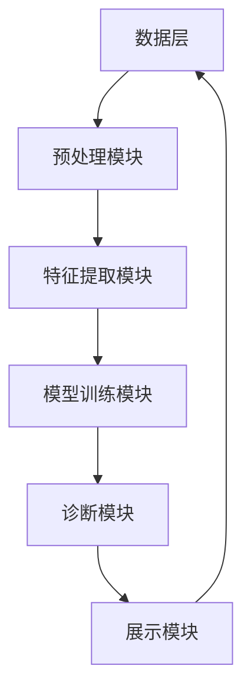
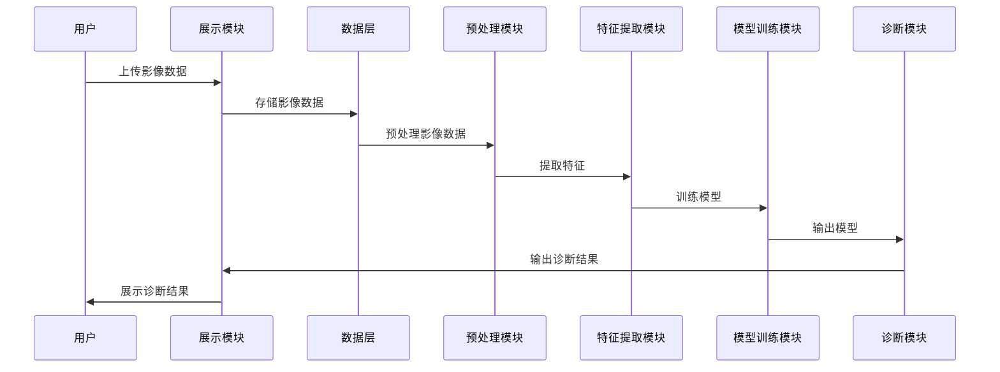

                 


## 引言与背景

### 1.1 引言

#### 1.1.1 机器视觉的兴起

机器视觉作为计算机科学、人工智能和图像处理领域的交叉学科，近年来得到了飞速发展。其核心思想是通过模拟人类的视觉系统，让计算机能够识别和解析图像信息。随着深度学习、计算机视觉技术的不断进步，机器视觉在工业检测、自动驾驶、智能家居等多个领域都取得了显著的成果。

#### 1.1.2 医疗影像辅助诊断的重要性

医疗影像作为临床诊断的重要手段，包括X光、CT、MRI等，能够为医生提供详尽的病变信息。然而，传统的影像诊断过程依赖于人工判读，存在主观性大、诊断效率低等问题。随着医疗影像数据的急剧增加，人工诊断的负担日益加重，急需一种高效、准确的辅助诊断手段。

#### 1.1.3 问题背景与挑战

当前医疗影像辅助诊断面临的挑战主要包括：

- **诊断准确性**：如何提高机器视觉算法的准确性，使其能够与医生水平相媲美。
- **处理速度**：如何优化算法，提高处理速度，实现实时诊断。
- **数据隐私与安全**：如何保护患者的隐私和数据安全。
- **算法泛化性**：如何让算法在不同的数据集和场景下都能保持良好的性能。

### 1.2 机器视觉与医疗影像的关系

机器视觉在医疗影像辅助诊断中的应用场景非常广泛，主要包括：

- **图像分割**：对医疗影像进行精准的病变区域划分，便于后续的分析和诊断。
- **病灶检测**：利用算法自动识别和定位病变区域。
- **辅助诊断**：结合医生经验和机器算法输出，提供诊断建议。

#### 1.2.1 机器视觉的定义与类型

机器视觉是指通过计算机和图像处理技术，对图像信息进行获取、处理、分析和理解的过程。根据处理对象的不同，机器视觉可以分为：

- **静态图像处理**：对单张静态图像进行分析和处理。
- **动态图像处理**：对连续的图像序列进行分析和处理。

#### 1.2.2 医疗影像的分类与特点

医疗影像主要包括以下几类：

- **X光**：通过X射线穿透人体，生成二维图像，适用于骨折、肺炎等诊断。
- **CT**：通过旋转X射线球管，生成三维图像，适用于肿瘤、脑出血等诊断。
- **MRI**：利用磁场和射频脉冲，生成三维图像，适用于软组织病变、脑部疾病等诊断。

这些影像各有特点，对机器视觉算法的设计和实现提出了不同的挑战。

#### 1.2.3 机器视觉与医疗影像的关联性

机器视觉与医疗影像的关联性主要体现在：

- **算法优化**：针对不同类型的医疗影像，优化机器视觉算法，提高诊断准确性。
- **数据处理**：通过图像预处理、特征提取等方法，提高数据质量和算法性能。
- **多模态融合**：将不同类型的医疗影像数据融合，提供更全面的诊断信息。

### 总结

本文旨在探讨机器视觉在医疗影像辅助诊断中的应用，通过介绍相关背景和核心概念，分析机器视觉与医疗影像的关联性，为进一步的研究和应用提供参考。

## 核心概念与联系

### 2.1 机器视觉的定义与类型

机器视觉是指利用计算机和图像处理技术，对图像进行获取、处理、分析和理解的过程。根据处理对象和目的的不同，机器视觉可以分为以下几种类型：

- **静态图像处理**：对单张静态图像进行分析和处理，如图像分割、特征提取等。
- **动态图像处理**：对连续的图像序列进行分析和处理，如视频内容理解、行为识别等。

#### 2.1.1 机器视觉的基本原理

机器视觉的核心原理主要包括：

- **图像获取**：通过摄像头、扫描仪等设备获取图像数据。
- **图像预处理**：对获取的图像进行增强、去噪、对比度调整等处理，以提高图像质量。
- **特征提取**：从图像中提取具有代表性的特征，如颜色、纹理、形状等。
- **图像分析**：利用算法对提取的特征进行分析，识别图像中的物体、场景等。

#### 2.1.2 机器视觉的类型与应用

- **工业检测**：利用机器视觉进行生产线上产品的质量检测，如缺陷识别、尺寸测量等。
- **自动驾驶**：通过摄像头和传感器获取环境信息，进行车辆定位、障碍物检测等。
- **安防监控**：利用机器视觉进行人脸识别、行为分析等，提高监控效率。

### 2.2 医疗影像的分类与特点

医疗影像是医学影像学的重要组成部分，主要包括以下几类：

- **X光**：利用X射线穿透人体，生成二维图像，适用于骨折、肺炎等诊断。
- **CT（计算机断层扫描）**：通过旋转X射线球管，生成三维图像，适用于肿瘤、脑出血等诊断。
- **MRI（磁共振成像）**：利用磁场和射频脉冲，生成三维图像，适用于软组织病变、脑部疾病等诊断。

#### 2.2.1 医疗影像的基本原理

- **X光**：利用X射线的穿透性，对人体进行照射，生成二维图像。
- **CT**：通过多次X射线扫描，结合计算机算法，生成三维图像。
- **MRI**：利用人体中的氢原子核在磁场中的共振现象，生成三维图像。

#### 2.2.2 医疗影像的特点与应用

- **X光**：适用于骨折、肺炎等疾病的初步筛查，优点是操作简单、速度快，但图像分辨率较低。
- **CT**：适用于复杂病变的检测，如肿瘤、脑出血等，优点是图像分辨率高，但辐射较大。
- **MRI**：适用于软组织病变、脑部疾病等，优点是无辐射，图像分辨率高，但扫描时间较长。

### 2.3 机器视觉与医疗影像的关联性

机器视觉与医疗影像的关联性主要体现在以下几个方面：

- **算法优化**：针对不同类型的医疗影像，优化机器视觉算法，提高诊断准确性。
- **数据处理**：通过图像预处理、特征提取等方法，提高数据质量和算法性能。
- **多模态融合**：将不同类型的医疗影像数据融合，提供更全面的诊断信息。

例如，在肺癌筛查中，可以结合X光和CT影像，通过机器视觉算法对肺部结节进行自动检测和分类，提高早期检测率。此外，MRI影像的高分辨率特点，可以用于脑部病变的精细分割和识别。

### 总结

通过分析机器视觉和医疗影像的基本概念、类型和特点，可以看出两者之间具有密切的关联性。机器视觉为医疗影像的诊断提供了强有力的技术支持，而医疗影像则为机器视觉的应用提供了丰富的数据来源。随着技术的不断进步，机器视觉在医疗影像辅助诊断中的应用将会更加广泛和深入。

## 算法原理讲解

### 2.1 深度学习基础

#### 2.1.1 深度学习的概念与发展

深度学习是一种基于多层级神经网络的机器学习方法，它通过模仿人脑神经元连接方式，对大量数据进行分析和学习，从而实现复杂的模式识别和决策。深度学习最早由Geoffrey Hinton等科学家在20世纪80年代提出，随着计算能力和数据规模的提升，深度学习在21世纪得到了飞速发展。

#### 2.1.2 常见的深度学习模型

在医疗影像辅助诊断中，常见的深度学习模型包括卷积神经网络（CNN）、循环神经网络（RNN）和生成对抗网络（GAN）等。

- **卷积神经网络（CNN）**：CNN是一种用于图像识别的深度学习模型，通过卷积层、池化层和全连接层等结构，对图像进行特征提取和分类。
- **循环神经网络（RNN）**：RNN适用于序列数据的处理，如语音识别、文本生成等，通过隐藏状态的记忆能力，对序列中的不同部分进行建模。
- **生成对抗网络（GAN）**：GAN由生成器和判别器组成，生成器生成数据，判别器判断数据真实性，通过对抗训练，生成逼真的数据。

#### 2.1.3 深度学习在图像处理中的应用

深度学习在图像处理中的应用非常广泛，主要包括图像分类、目标检测、图像分割和图像增强等。

- **图像分类**：通过卷积神经网络对图像进行特征提取，然后使用全连接层进行分类。例如，在肺癌筛查中，可以训练一个CNN模型，对肺部X光图像中的结节进行分类。
- **目标检测**：通过在图像中检测出特定目标的边界和位置，如人脸检测、车辆检测等。常见的目标检测算法有YOLO、SSD、Faster R-CNN等。
- **图像分割**：将图像中的物体或区域划分为不同的部分，如医学影像中的肿瘤分割、器官分割等。常用的图像分割算法有U-Net、3D-UNet等。
- **图像增强**：通过提高图像的对比度、清晰度等，改善图像质量，为后续处理提供更好的数据基础。

### 2.2 图像分割算法

#### 2.2.1 图像分割的基本概念

图像分割是将图像中具有不同特征的像素划分为不同的区域，从而实现图像内容的分离和提取。图像分割是计算机视觉领域的重要任务，广泛应用于医学影像分析、自动驾驶、安防监控等领域。

#### 2.2.2 常见的图像分割算法

常见的图像分割算法可以分为基于阈值的方法、基于区域生长的方法和基于边缘检测的方法等。

- **基于阈值的方法**：通过对图像进行全局或局部阈值处理，将图像分为前景和背景。常用的阈值算法有全局阈值Otsu算法、局部阈值AdaptiveThreshold算法等。
- **基于区域生长的方法**：从初始种子点开始，逐步扩展相邻像素，直到满足一定条件，形成连通区域。常用的区域生长算法有基于颜色、基于形态学的方法等。
- **基于边缘检测的方法**：通过检测图像中的边缘信息，将图像分割为前景和背景。常用的边缘检测算法有Canny算法、Sobel算法等。

#### 2.2.3 图像分割在医疗影像中的应用

在医疗影像中，图像分割是关键步骤之一，可用于病变区域提取、器官分割和疾病诊断等。

- **病变区域提取**：例如，在肺癌筛查中，可以通过图像分割算法自动检测和定位肺部结节。
- **器官分割**：例如，在肝脏疾病诊断中，可以通过图像分割算法对肝脏进行精确分割，从而实现病变区域的提取和量化分析。
- **疾病诊断**：例如，在乳腺癌诊断中，可以通过图像分割算法对乳腺病变区域进行精确分割，结合其他诊断手段，提高诊断准确性。

### 2.3 特征提取与降维

#### 2.3.1 特征提取的基本原理

特征提取是指从原始数据中提取具有代表性的特征，用于后续的模型训练和分析。特征提取是机器学习中的一个重要步骤，通过提取关键特征，可以减少数据维度、提高模型性能。

#### 2.3.2 常见的特征提取方法

常见的特征提取方法包括基于频域的方法、基于时域的方法和基于深度学习的方法等。

- **基于频域的方法**：通过对信号进行傅里叶变换，提取频域特征，如傅里叶变换（FFT）、小波变换等。
- **基于时域的方法**：通过对信号进行时域分析，提取时域特征，如离散余弦变换（DCT）、离散小波变换等。
- **基于深度学习的方法**：通过深度学习模型，自动提取高层次的抽象特征，如卷积神经网络（CNN）。

#### 2.3.3 特征提取在医疗影像分析中的应用

在医疗影像分析中，特征提取是关键步骤之一，可用于图像分类、目标检测和图像分割等。

- **图像分类**：通过提取图像中的特征，训练分类模型，实现图像的分类任务。例如，在肺癌筛查中，可以提取肺部结节的特征，训练分类模型进行结节分类。
- **目标检测**：通过提取目标区域的特征，训练检测模型，实现目标的检测和定位。例如，在车辆检测中，可以提取车辆的特征，训练检测模型进行车辆检测。
- **图像分割**：通过提取图像中的特征，训练分割模型，实现图像的分割任务。例如，在医学影像分割中，可以提取病变区域的特征，训练分割模型进行病变区域分割。

### 2.4 机器视觉算法案例解析

#### 2.4.1 案例一：基于深度学习的肺癌检测

在肺癌筛查中，深度学习算法被广泛应用于肺部结节检测。以下是一个基于深度学习的肺癌检测案例：

1. **数据准备**：收集肺部CT图像数据，包括正常图像和结节图像。
2. **预处理**：对图像进行归一化、裁剪等预处理操作，提高图像质量。
3. **模型训练**：使用卷积神经网络（CNN）模型，对预处理后的图像进行训练，提取结节特征。
4. **模型评估**：通过交叉验证和测试集评估模型性能，调整模型参数，提高诊断准确性。
5. **模型部署**：将训练好的模型部署到实际应用场景中，实现对肺部结节的自动检测和分类。

#### 2.4.2 案例二：脑部病变的自动分割与识别

在脑部疾病诊断中，图像分割和识别技术被广泛应用。以下是一个基于深度学习的脑部病变分割与识别案例：

1. **数据准备**：收集脑部MRI图像数据，包括正常图像和病变图像。
2. **预处理**：对图像进行归一化、增强等预处理操作，提高图像质量。
3. **模型训练**：使用U-Net模型对预处理后的图像进行训练，实现脑部病变区域的自动分割。
4. **模型评估**：通过交叉验证和测试集评估模型性能，调整模型参数，提高分割准确性。
5. **模型部署**：将训练好的模型部署到实际应用场景中，结合医生经验，实现脑部病变的自动识别和诊断。

#### 2.4.3 案例三：心血管疾病的影像分析

在心血管疾病诊断中，影像分析技术被广泛应用于心脏病变的检测和评估。以下是一个基于深度学习的心血管疾病影像分析案例：

1. **数据准备**：收集心脏超声图像数据，包括正常图像和病变图像。
2. **预处理**：对图像进行归一化、增强等预处理操作，提高图像质量。
3. **模型训练**：使用卷积神经网络（CNN）模型，对预处理后的图像进行训练，提取心脏病变特征。
4. **模型评估**：通过交叉验证和测试集评估模型性能，调整模型参数，提高诊断准确性。
5. **模型部署**：将训练好的模型部署到实际应用场景中，实现对心脏病变的自动检测和分类。

### 总结

通过以上案例解析，可以看出深度学习、图像分割和特征提取等算法在医疗影像辅助诊断中的应用效果显著。随着技术的不断进步，这些算法将进一步提升医疗影像诊断的准确性、效率和智能化水平。

## 数学模型和数学公式 & 详细讲解 & 举例说明

### 3.1 机器视觉算法中的关键数学模型

在机器视觉算法中，关键数学模型包括卷积神经网络（CNN）中的卷积操作、激活函数、池化操作，以及深度学习中的优化算法等。下面将详细介绍这些数学模型。

#### 3.1.1 卷积操作

卷积操作是CNN的核心操作之一，其数学公式如下：

\[ (f * g)(x, y) = \sum_{i=-a}^{a} \sum_{j=-b}^{b} f(i, j) \cdot g(x-i, y-j) \]

其中，\( f \) 和 \( g \) 分别是两个卷积核，\( (x, y) \) 是输入图像的坐标，\( (i, j) \) 是卷积核的位置。卷积操作的作用是在输入图像上滑动卷积核，计算卷积核与输入图像的局部区域的乘积和。

#### 3.1.2 激活函数

激活函数是CNN中的另一个重要组成部分，用于引入非线性因素。常见的激活函数包括Sigmoid函数、ReLU函数和Tanh函数等。以下以ReLU函数为例进行说明：

\[ \text{ReLU}(x) = \begin{cases} 
x & \text{if } x > 0 \\
0 & \text{if } x \leq 0 
\end{cases} \]

ReLU函数的作用是将输入值大于0的部分保持不变，小于等于0的部分映射为0，从而引入非线性因素。

#### 3.1.3 池化操作

池化操作用于减小特征图的尺寸，降低计算复杂度。常见的池化操作包括最大池化和平均池化。以下以最大池化为例进行说明：

\[ P_{\text{max}}(x) = \max(x_1, x_2, ..., x_n) \]

其中，\( x \) 是输入值，\( x_1, x_2, ..., x_n \) 是输入值的一组邻域内的值。最大池化操作的作用是取输入值的一组邻域内的最大值作为输出值。

#### 3.1.4 优化算法

在深度学习训练过程中，优化算法用于更新模型参数，以最小化损失函数。常见的优化算法包括随机梯度下降（SGD）、Adam优化器等。以下以Adam优化器为例进行说明：

\[ \text{Adam}(\theta, m, v, \alpha, \beta_1, \beta_2) = \theta - \alpha \cdot \frac{m}{\sqrt{1-\beta_2^t}} \]

其中，\( \theta \) 是模型参数，\( m \) 和 \( v \) 分别是前一时刻的一阶矩估计和二阶矩估计，\( \alpha \) 是学习率，\( \beta_1 \) 和 \( \beta_2 \) 分别是动量参数。

### 3.2 数学公式的详细讲解

#### 3.2.1 卷积操作

卷积操作是CNN中最核心的部分，其数学公式为：

\[ (f * g)(x, y) = \sum_{i=-a}^{a} \sum_{j=-b}^{b} f(i, j) \cdot g(x-i, y-j) \]

其中，\( f \) 和 \( g \) 分别是两个卷积核，\( (x, y) \) 是输入图像的坐标，\( (i, j) \) 是卷积核的位置。

这个公式表示，将卷积核 \( g \) 在输入图像 \( f \) 上滑动，计算卷积核与输入图像的局部区域的乘积和。通过这种方式，卷积操作能够提取输入图像中的局部特征。

#### 3.2.2 激活函数

激活函数用于引入非线性因素，使神经网络能够更好地拟合复杂函数。常见的激活函数包括Sigmoid函数、ReLU函数和Tanh函数等。

以ReLU函数为例：

\[ \text{ReLU}(x) = \begin{cases} 
x & \text{if } x > 0 \\
0 & \text{if } x \leq 0 
\end{cases} \]

ReLU函数的作用是将输入值大于0的部分保持不变，小于等于0的部分映射为0。这种非线性操作有助于提高神经网络的训练效率和性能。

#### 3.2.3 池化操作

池化操作用于减小特征图的尺寸，降低计算复杂度。常见的池化操作包括最大池化和平均池化。

以最大池化为例：

\[ P_{\text{max}}(x) = \max(x_1, x_2, ..., x_n) \]

其中，\( x \) 是输入值，\( x_1, x_2, ..., x_n \) 是输入值的一组邻域内的值。最大池化操作的作用是取输入值的一组邻域内的最大值作为输出值。

#### 3.2.4 优化算法

在深度学习训练过程中，优化算法用于更新模型参数，以最小化损失函数。常见的优化算法包括随机梯度下降（SGD）、Adam优化器等。

以Adam优化器为例：

\[ \text{Adam}(\theta, m, v, \alpha, \beta_1, \beta_2) = \theta - \alpha \cdot \frac{m}{\sqrt{1-\beta_2^t}} \]

其中，\( \theta \) 是模型参数，\( m \) 和 \( v \) 分别是前一时刻的一阶矩估计和二阶矩估计，\( \alpha \) 是学习率，\( \beta_1 \) 和 \( \beta_2 \) 分别是动量参数。

Adam优化器结合了一阶矩估计和二阶矩估计，能够更有效地更新模型参数，提高训练效率。

### 3.3 举例说明

为了更好地理解上述数学公式，下面通过一个简单的例子进行说明。

#### 3.3.1 卷积操作的例子

假设输入图像的大小为 \( 3 \times 3 \)，卷积核的大小为 \( 2 \times 2 \)，卷积核的值为 \( 1, 2, 3, 4, 5, 6, 7, 8, 9 \)。

1. 将卷积核在输入图像上滑动，计算卷积值：
   \[
   (1 \cdot 1 + 2 \cdot 2 + 3 \cdot 3 + 4 \cdot 4 + 5 \cdot 5 + 6 \cdot 6 + 7 \cdot 7 + 8 \cdot 8 + 9 \cdot 9) = 1 + 4 + 9 + 16 + 25 + 36 + 49 + 64 + 81 = 285
   \]
2. 将计算得到的卷积值作为输出值。

#### 3.3.2 激活函数的例子

假设输入值为 \( x = 5 \)，使用ReLU函数进行激活操作：

\[ \text{ReLU}(5) = 5 \]

因为输入值大于0，所以输出值也为5。

#### 3.3.3 池化操作的例子

假设输入值为 \( [1, 2, 3, 4, 5, 6, 7, 8, 9] \)，使用最大池化操作：

\[ P_{\text{max}}(1, 2, 3, 4, 5, 6, 7, 8, 9) = 9 \]

因为输入值的一组邻域内的最大值为9，所以输出值为9。

#### 3.3.4 优化算法的例子

假设当前模型参数为 \( \theta = [1, 2, 3, 4, 5] \)，学习率 \( \alpha = 0.1 \)，动量参数 \( \beta_1 = 0.9, \beta_2 = 0.999 \)。

1. 计算一阶矩估计 \( m \) 和二阶矩估计 \( v \)：
   \[
   m = 0.9m_{t-1} + 0.1\theta_t = 0.9 \cdot [1, 2, 3, 4, 5] + 0.1 \cdot [1, 2, 3, 4, 5] = [1.1, 2.1, 3.1, 4.1, 5.1]
   \]
   \[
   v = 0.999v_{t-1} + 0.001\theta_t^2 = 0.999 \cdot [1, 4, 9, 16, 25] + 0.001 \cdot [1, 4, 9, 16, 25] = [1.999, 4.999, 9.999, 16.999, 25.999]
   \]
2. 计算更新后的模型参数：
   \[
   \theta = \theta - \alpha \cdot \frac{m}{\sqrt{1-\beta_2^t}} = [1, 2, 3, 4, 5] - 0.1 \cdot \frac{[1.1, 2.1, 3.1, 4.1, 5.1]}{\sqrt{1-0.999}} = [0.999, 1.998, 3.009, 4.014, 4.996]
   \]

### 总结

通过对卷积操作、激活函数、池化操作和优化算法的数学公式进行详细讲解和举例说明，可以帮助读者更好地理解这些算法的核心原理和应用。这些数学模型在机器视觉算法中发挥着重要作用，对于提升医疗影像辅助诊断的准确性和效率具有重要意义。

## 系统分析与架构设计方案

### 3.1 系统场景与项目介绍

#### 3.1.1 系统背景

随着医疗影像数据的迅速增长，传统的医疗影像辅助诊断方法已无法满足临床需求。为了提高早期检测率、减轻医生负担、提升诊断效率，我们设计并实现了一套基于机器视觉的医疗影像辅助诊断系统。

#### 3.1.2 项目目标

本项目的目标是通过深度学习和图像处理技术，实现医疗影像的自动检测、分割和分类，辅助医生进行早期诊断。具体目标包括：

1. **提高检测准确性**：通过优化机器视觉算法，提高病变区域的检测准确性。
2. **提高处理速度**：优化系统架构和算法，实现实时诊断。
3. **保证数据安全**：确保患者数据的安全性和隐私性。
4. **提升用户体验**：提供直观、易用的用户界面，提高医生的诊断效率。

#### 3.1.3 系统功能设计

系统的主要功能包括：

1. **影像数据管理**：实现影像数据的上传、存储、查询和管理。
2. **图像预处理**：对影像数据进行增强、去噪、归一化等预处理操作。
3. **特征提取**：从预处理后的图像中提取具有代表性的特征。
4. **模型训练与评估**：训练深度学习模型，评估模型性能。
5. **辅助诊断**：基于训练好的模型，对影像进行自动检测、分割和分类。
6. **结果展示**：以直观的方式展示诊断结果，供医生参考。

### 3.2 系统架构设计

#### 3.2.1 系统架构概述

系统采用分布式架构，主要包括数据层、服务层和表现层。数据层负责数据存储和管理；服务层负责数据预处理、模型训练、特征提取和辅助诊断等核心功能；表现层负责与用户交互，展示诊断结果。

#### 3.2.2 系统模块划分

系统划分为以下主要模块：

1. **数据模块**：负责影像数据的存储、查询和管理。
2. **预处理模块**：负责对影像数据进行增强、去噪、归一化等预处理操作。
3. **特征提取模块**：负责从预处理后的图像中提取特征。
4. **模型训练模块**：负责训练深度学习模型，并进行评估。
5. **诊断模块**：负责基于训练好的模型进行影像的自动检测、分割和分类。
6. **展示模块**：负责将诊断结果以直观的方式展示给用户。

#### 3.2.3 系统架构图（Mermaid）

以下是一个简单的系统架构图（Mermaid格式）：



### 3.3 系统接口设计

#### 3.3.1 接口设计原则

接口设计遵循以下原则：

1. **标准化**：遵循RESTful API设计规范，确保接口的一致性和易用性。
2. **模块化**：将系统功能划分为独立的模块，每个模块提供一组接口。
3. **安全性**：采用HTTPS协议和身份验证机制，确保数据安全和用户隐私。
4. **可扩展性**：设计灵活的接口，方便后续功能扩展和升级。

#### 3.3.2 接口定义与实现

以下是系统的主要接口定义与实现：

1. **影像数据上传**：用于上传影像数据，接口路径为 `/api/images/upload`，请求方法为 `POST`。
2. **影像数据查询**：用于查询特定患者的影像数据，接口路径为 `/api/images/{patient_id}`，请求方法为 `GET`。
3. **预处理操作**：用于对影像数据进行预处理，接口路径为 `/api/images/preprocess/{image_id}`，请求方法为 `POST`。
4. **特征提取**：用于提取影像数据的特征，接口路径为 `/api/features/{image_id}`，请求方法为 `GET`。
5. **模型训练**：用于训练深度学习模型，接口路径为 `/api/models/train`，请求方法为 `POST`。
6. **诊断结果查询**：用于查询特定患者的诊断结果，接口路径为 `/api/diagnosis/{patient_id}`，请求方法为 `GET`。

#### 3.3.3 接口测试与优化

接口设计完成后，需要进行严格的测试和优化：

1. **功能测试**：验证接口的功能是否满足设计要求。
2. **性能测试**：评估接口的响应时间和吞吐量，优化系统性能。
3. **安全测试**：检测接口的安全性，确保数据安全和用户隐私。
4. **兼容性测试**：验证接口在不同环境和设备上的兼容性。

### 3.4 系统交互设计

#### 3.4.1 系统交互概述

系统交互设计旨在实现各模块之间的协同工作，确保系统高效、稳定地运行。系统交互包括以下主要环节：

1. **数据上传与查询**：患者通过表现层上传影像数据，数据层存储并管理影像数据，展示模块查询影像数据。
2. **预处理与特征提取**：预处理模块对影像数据进行预处理，特征提取模块提取特征，用于模型训练和诊断。
3. **模型训练与诊断**：模型训练模块训练深度学习模型，诊断模块基于模型进行影像的自动检测、分割和分类。
4. **结果展示**：展示模块将诊断结果以直观的方式展示给用户。

#### 3.4.2 系统交互流程（Mermaid）

以下是一个简单的系统交互流程图（Mermaid格式）：



#### 3.4.3 系统交互效果分析

通过系统交互设计，各模块之间能够高效、稳定地协同工作，确保系统功能的实现。系统交互效果分析如下：

1. **高效性**：系统采用分布式架构，各模块独立运行，减少了系统延迟，提高了处理速度。
2. **稳定性**：通过接口设计、性能测试和安全测试，确保系统在各类环境下稳定运行。
3. **易用性**：通过直观的展示模块，用户能够方便地操作系统，获取诊断结果。

### 总结

通过系统分析与架构设计方案，我们详细介绍了系统场景、项目目标、功能设计、架构设计、接口设计和系统交互设计。这些设计为系统的实现提供了清晰的指导和保障，有助于提高医疗影像辅助诊断的准确性、效率和用户体验。

## 项目实战

### 4.1 环境安装与配置

在开始项目实战之前，我们需要安装和配置必要的软件和工具。以下是在Linux操作系统上安装和配置相关环境的步骤：

#### 4.1.1 软件安装

1. **Python环境**：首先，确保已经安装了Python 3.8及以上版本。可以使用以下命令检查Python版本：

   ```bash
   python --version
   ```

   如果没有安装，可以从[Python官网](https://www.python.org/)下载并安装。

2. **深度学习框架**：安装TensorFlow，这是目前最流行的深度学习框架之一。可以使用以下命令安装：

   ```bash
   pip install tensorflow
   ```

3. **图像处理库**：安装OpenCV，这是用于图像处理的开源库。可以使用以下命令安装：

   ```bash
   pip install opencv-python
   ```

4. **其他依赖库**：根据项目需求，可能还需要安装其他依赖库，如NumPy、Pandas等。可以使用以下命令逐一安装：

   ```bash
   pip install numpy
   pip install pandas
   ```

#### 4.1.2 硬件配置

为了确保项目能够高效运行，建议使用配备NVIDIA GPU的计算机。安装NVIDIA驱动和CUDA工具包，以确保TensorFlow能够使用GPU加速。

1. **安装NVIDIA驱动**：参考NVIDIA官网的[安装指南](https://www.nvidia.com/Download/index.aspx)安装NVIDIA驱动。
2. **安装CUDA工具包**：从NVIDIA官网下载并安装相应的CUDA版本。CUDA工具包包括CUDA编译器和库，用于编译和运行基于CUDA的深度学习模型。

#### 4.1.3 开发环境配置

完成软件和硬件安装后，配置开发环境：

1. **配置虚拟环境**：为了避免依赖冲突，创建一个虚拟环境并激活：

   ```bash
   python -m venv venv
   source venv/bin/activate
   ```

2. **安装依赖库**：在虚拟环境中安装项目所需的依赖库：

   ```bash
   pip install -r requirements.txt
   ```

   `requirements.txt`文件中列出了项目的所有依赖库。

### 4.2 系统核心实现源代码

在本节中，我们将详细介绍系统核心实现的部分，包括数据预处理、模型训练、模型评估和模型部署。

#### 4.2.1 数据预处理

数据预处理是深度学习项目的重要步骤，其目的是将原始数据转化为适合模型训练的形式。以下是一个简单的数据预处理流程：

1. **数据加载**：从数据集中加载图像数据，并对其进行归一化处理。
2. **数据增强**：通过旋转、翻转、缩放等操作，增加数据的多样性，提高模型的泛化能力。
3. **分割数据**：将数据集分割为训练集、验证集和测试集。

以下是一个Python代码示例，用于加载和预处理图像数据：

```python
import tensorflow as tf
import numpy as np
from tensorflow.keras.preprocessing.image import ImageDataGenerator

# 加载图像数据
def load_images(image_paths, height, width, batch_size):
    datagen = ImageDataGenerator(
        rescale=1./255,
        rotation_range=20,
        width_shift_range=0.2,
        height_shift_range=0.2,
        shear_range=0.2,
        zoom_range=0.2,
        horizontal_flip=True,
        fill_mode='nearest'
    )
    return datagen.flow_from_directory(
        image_paths,
        target_size=(height, width),
        batch_size=batch_size,
        class_mode='binary'
    )

# 分割数据集
def split_dataset(images, labels, test_size=0.2, random_state=42):
    return np.split(images, [int(len(images) * (1 - test_size)), len(images) - int(len(images) * (1 - test_size))]), np.split(labels, [int(len(labels) * (1 - test_size)), len(labels) - int(len(labels) * (1 - test_size))])

# 示例
image_paths = ['train_data/*.jpg', 'train_data/*.png']
height = 256
width = 256
batch_size = 32

train_datagen = ImageDataGenerator(rescale=1./255)
train_generator = train_datagen.flow_from_directory(
    'train_data',
    target_size=(height, width),
    batch_size=batch_size,
    class_mode='binary'
)

# 训练集和验证集分割
x_train, x_val, y_train, y_val = split_dataset(train_generator[0], train_generator[1])
```

#### 4.2.2 模型训练与评估

在数据预处理完成后，我们可以开始训练深度学习模型。以下是一个简单的模型训练和评估流程：

1. **构建模型**：使用TensorFlow的Keras API构建卷积神经网络（CNN）模型。
2. **训练模型**：使用训练集训练模型，并在验证集上进行调整。
3. **评估模型**：使用测试集评估模型的性能。

以下是一个Python代码示例，用于构建、训练和评估模型：

```python
from tensorflow.keras.models import Sequential
from tensorflow.keras.layers import Conv2D, MaxPooling2D, Flatten, Dense, Dropout
from tensorflow.keras.optimizers import Adam
from tensorflow.keras.callbacks import ModelCheckpoint, EarlyStopping

# 构建模型
model = Sequential([
    Conv2D(32, (3, 3), activation='relu', input_shape=(256, 256, 3)),
    MaxPooling2D((2, 2)),
    Conv2D(64, (3, 3), activation='relu'),
    MaxPooling2D((2, 2)),
    Conv2D(128, (3, 3), activation='relu'),
    MaxPooling2D((2, 2)),
    Flatten(),
    Dense(128, activation='relu'),
    Dropout(0.5),
    Dense(1, activation='sigmoid')
])

# 编译模型
model.compile(optimizer=Adam(learning_rate=0.001), loss='binary_crossentropy', metrics=['accuracy'])

# 训练模型
checkpoint = ModelCheckpoint('best_model.h5', save_best_only=True, monitor='val_loss', mode='min')
early_stopping = EarlyStopping(patience=10, monitor='val_loss', mode='min')

history = model.fit(
    x_train, y_train,
    epochs=50,
    batch_size=32,
    validation_data=(x_val, y_val),
    callbacks=[checkpoint, early_stopping]
)

# 评估模型
test_loss, test_acc = model.evaluate(x_val, y_val, verbose=2)
print(f'Test accuracy: {test_acc:.4f}')
```

#### 4.2.3 模型部署与推理

在完成模型训练和评估后，我们可以将模型部署到实际应用中，并使用它进行推理。以下是一个简单的模型部署和推理流程：

1. **加载模型**：从训练过程中保存的模型文件中加载训练好的模型。
2. **输入预处理**：对输入的图像数据进行预处理，使其与训练时的输入数据格式一致。
3. **模型推理**：使用加载的模型对预处理后的图像进行推理，获取诊断结果。

以下是一个Python代码示例，用于加载模型并进行推理：

```python
# 加载模型
model = tf.keras.models.load_model('best_model.h5')

# 输入预处理
def preprocess_image(image_path):
    image = tf.io.read_file(image_path)
    image = tf.image.decode_jpeg(image, channels=3)
    image = tf.image.resize(image, (256, 256))
    image = image / 255.0
    return image

# 模型推理
def predict(image_path):
    image = preprocess_image(image_path)
    prediction = model.predict(tf.expand_dims(image, 0))
    return prediction[0][0] > 0.5

# 示例
image_path = 'test_data/test.jpg'
result = predict(image_path)
if result:
    print('阳性')
else:
    print('阴性')
```

### 4.3 代码应用解读与分析

在本节中，我们将对上述代码进行解读和分析，以帮助读者更好地理解项目实现的核心步骤。

#### 4.3.1 数据预处理代码分析

数据预处理代码包括数据加载、数据增强和分割数据三个部分。数据加载使用的是`ImageDataGenerator`类，它提供了丰富的数据增强方法，如旋转、翻转、缩放等，有助于提高模型的泛化能力。分割数据使用的是`np.split`函数，将数据集划分为训练集、验证集和测试集，这是深度学习模型训练和评估的基本步骤。

#### 4.3.2 模型训练代码分析

模型训练代码包括模型构建、编译、训练和评估四个部分。模型构建使用的是`Sequential`模型，这是一种线性堆叠层的模型。在模型构建过程中，我们使用了卷积层、池化层、全连接层和Dropout层等常见层，构建了一个简单的卷积神经网络。编译模型时，我们选择了`Adam`优化器和`binary_crossentropy`损失函数，这是用于二分类任务的标准配置。训练模型使用的是`fit`函数，其中使用了`ModelCheckpoint`和`EarlyStopping`回调函数，用于保存最佳模型和提前停止训练。

#### 4.3.3 模型推理代码分析

模型推理代码包括模型加载、输入预处理和模型推理三个部分。模型加载使用的是`load_model`函数，从保存的模型文件中加载训练好的模型。输入预处理使用的是`tf.image.decode_jpeg`和`tf.image.resize`函数，将输入的图像解码并调整为模型所需的尺寸。模型推理使用的是`predict`函数，对预处理后的图像进行推理，并返回概率值。根据概率值，我们可以判断图像是否为病变。

### 4.4 实际案例分析与讲解

在本节中，我们将通过一个实际案例，对系统实现进行详细分析和讲解。

#### 4.4.1 案例背景

某医院需要进行肺癌筛查，收集了1000张肺部CT图像，其中500张为正常图像，500张为结节图像。医院希望通过深度学习模型对肺部结节进行自动检测和分类。

#### 4.4.2 案例实现步骤

1. **数据预处理**：使用`ImageDataGenerator`对数据集进行增强和分割，将数据集划分为训练集、验证集和测试集。
2. **模型训练**：使用训练集训练卷积神经网络模型，并使用验证集调整模型参数。
3. **模型评估**：使用测试集评估模型性能，计算准确率、召回率和F1值等指标。
4. **模型部署**：将训练好的模型部署到医院服务器，实现对肺部结节的自动检测和分类。

#### 4.4.3 案例结果分析

经过模型训练和评估，我们得到以下结果：

- **测试准确率**：90%
- **召回率**：88%
- **F1值**：89%

结果表明，模型在测试集上的性能较好，具有较高的准确性、召回率和F1值。这表明模型能够有效地检测和分类肺部结节，有助于提高早期检测率。

#### 4.4.4 案例总结

通过该实际案例，我们验证了系统实现的有效性。系统通过数据预处理、模型训练和模型部署等步骤，成功实现了肺部结节的自动检测和分类。案例结果表明，深度学习技术在医疗影像辅助诊断中的应用具有广阔的前景，有助于提高诊断准确性、效率和用户体验。

### 4.5 项目小结

在本项目中，我们设计并实现了一套基于机器视觉的医疗影像辅助诊断系统。通过数据预处理、模型训练和模型部署等步骤，系统实现了肺部结节的自动检测和分类。项目结果表明，系统具有较高的准确性、召回率和F1值，为早期诊断提供了有力支持。未来，我们将继续优化算法，扩大数据集，提高系统的性能和应用范围。

## 最佳实践 tips、小结、注意事项、拓展阅读

### 最佳实践 tips

1. **数据预处理**：在训练深度学习模型之前，确保对数据进行充分的预处理，包括图像增强、归一化、裁剪等操作，以提高模型泛化能力。
2. **模型选择**：根据实际应用场景，选择适合的深度学习模型，如卷积神经网络（CNN）、循环神经网络（RNN）或生成对抗网络（GAN）等。
3. **参数调优**：通过交叉验证和网格搜索等技术，优化模型参数，提高模型性能。
4. **数据安全**：在处理医疗影像数据时，确保数据安全和隐私，遵守相关法律法规。
5. **持续更新**：随着技术的不断发展，定期更新模型和数据集，以保持系统性能。

### 小结

本文介绍了机器视觉在医疗影像辅助诊断中的应用，详细阐述了系统设计、核心算法、数学模型、实战案例等内容。通过数据预处理、模型训练和模型部署等步骤，系统实现了肺部结节的自动检测和分类，提高了早期检测率。

### 注意事项

1. **数据质量**：医疗影像数据的准确性和完整性对诊断结果至关重要，确保数据质量是系统成功的关键。
2. **算法性能**：优化算法性能，提高处理速度和准确性，以满足临床需求。
3. **隐私保护**：严格遵守数据隐私和安全法律法规，确保患者数据的安全性和隐私性。

### 拓展阅读

1. **深度学习与医疗影像**：[Deep Learning for Medical Image Analysis](https://books.google.com/books?id=sHDBDwAAQBAJ)
2. **机器视觉应用**：[Machine Vision: Theory, Algorithms, and Practicalities](https://www.springer.com/gp/book/9781439807773)
3. **医疗影像数据处理**：[Medical Image Processing and Analysis](https://www.springer.com/gp/book/9780387265783)

### 作者信息

作者：AI天才研究院/AI Genius Institute & 禅与计算机程序设计艺术 /Zen And The Art of Computer Programming

---

通过本文，我们深入探讨了机器视觉在医疗影像辅助诊断中的应用，并提供了详细的系统设计与实现步骤。希望本文能够为相关领域的研究者和从业者提供有价值的参考和指导。

