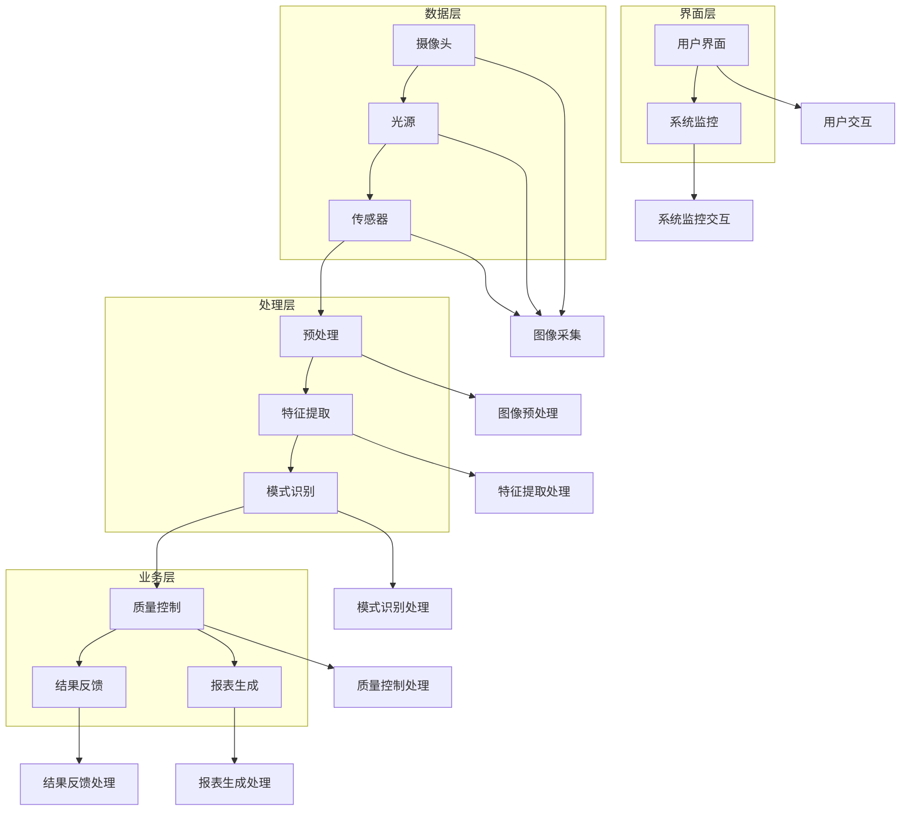
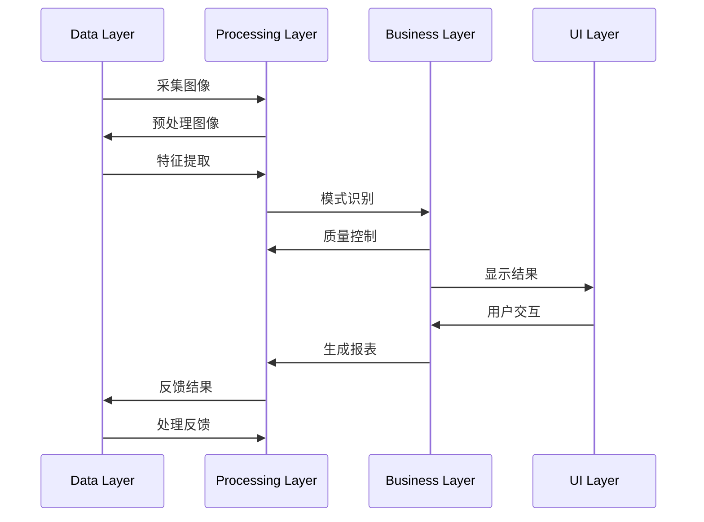

                 

### 引言

#### 机器视觉的定义与重要性

机器视觉，简称机器视，是指通过计算机和图像处理技术，模拟人类视觉系统，对图像或视频进行自动分析和理解的一种技术。其基本原理是利用数字图像处理、模式识别、计算机视觉和人工智能等现代科技手段，对现实世界中的图像或视频进行捕捉、处理和分析，从而提取有用信息。

机器视觉在自动化质检中的应用具有重要意义。传统的质检方式主要依赖于人工检查，不仅效率低下，而且容易出现疲劳和疏漏。而机器视觉技术能够实时、准确地检测产品缺陷，大幅提高质检效率，降低质检成本。此外，机器视觉技术还能够处理大量复杂的数据，为质量控制提供科学的依据。

#### 自动化质检的背景与发展

自动化质检是指利用自动化设备和技术对产品进行质量检测和监控的过程。随着工业自动化和智能制造的快速发展，自动化质检已成为现代制造业的重要环节。传统的质检方式主要依赖于人工，而随着生产效率和产品复杂度的提高，人工质检已无法满足制造业的高标准、高质量要求。

自动化质检的发展经历了几个阶段：

1. **初步自动化**：利用简单的传感器和自动化设备进行初步的检测。
2. **半自动化**：引入计算机辅助检测，实现部分检测过程的自动化。
3. **全面自动化**：利用先进的机器视觉技术，实现全过程的自动化检测。

#### 本书结构概述

本书将详细探讨机器视觉在自动化质检中的应用，主要分为以下几个部分：

1. **引言**：介绍机器视觉的定义、重要性以及自动化质检的背景和发展。
2. **核心概念与原则**：讨论机器视觉和自动化质检的基本概念、原理及其相互关系。
3. **算法与技术**：详细介绍机器视觉中常用的算法和技术，包括图像预处理、特征提取、模式识别等。
4. **数学模型与公式**：解释机器视觉算法背后的数学原理和模型。
5. **系统设计与架构**：描述机器视觉质检系统的设计、架构和接口。
6. **实际应用与案例**：提供实际应用案例，分析其系统设计、实现细节和效果评估。
7. **最佳实践与总结**：总结机器视觉在自动化质检中的应用最佳实践，并提出未来发展方向。

通过本书的阅读，读者将全面了解机器视觉在自动化质检中的应用，掌握相关技术和方法，为实际应用提供理论支持和实践指导。

### 关键词

- 机器视觉
- 自动化质检
- 图像预处理
- 特征提取
- 模式识别
- 数学模型
- 系统架构
- 案例分析

### 摘要

本文详细探讨了机器视觉在自动化质检中的应用。首先，介绍了机器视觉的基本概念和重要性，以及自动化质检的背景和发展。接着，详细阐述了机器视觉和自动化质检的核心概念、原理及其相互关系。然后，本文重点介绍了机器视觉中的常用算法和技术，包括图像预处理、特征提取、模式识别等，并解释了这些算法背后的数学原理和模型。此外，本文还详细描述了机器视觉质检系统的设计、架构和接口，提供了实际应用案例，分析了其系统设计、实现细节和效果评估。最后，本文总结了机器视觉在自动化质检中的应用最佳实践，并对未来发展方向进行了展望。

### 核心概念与原则

在深入探讨机器视觉在自动化质检中的应用之前，我们首先需要理解机器视觉和自动化质检的基本概念和原则。

#### 机器视觉的基本概念

机器视觉是一种通过计算机和图像处理技术，对图像或视频进行自动分析和理解的技术。其基本原理是利用数字图像处理、模式识别、计算机视觉和人工智能等现代科技手段，对现实世界中的图像或视频进行捕捉、处理和分析，从而提取有用信息。

**核心概念**：

1. **图像预处理**：图像预处理是机器视觉中的第一步，其目的是提高图像的质量，消除噪声，增强目标特征，以便后续处理。常见的预处理技术包括滤波、对比度增强、锐化等。

2. **特征提取**：特征提取是从图像中提取出能够区分不同对象的显著特征。这些特征可以是形状、纹理、颜色、边缘等。特征提取的目的是简化图像数据，使其更容易进行后续处理。

3. **模式识别**：模式识别是机器视觉中的核心步骤，其目的是通过分析图像特征，识别出特定的对象或场景。常见的模式识别方法包括分类、聚类、识别等。

4. **机器学习与深度学习**：机器学习和深度学习是现代机器视觉中的核心技术。通过训练模型，机器可以自动学习并识别图像中的特征和模式。

**概念关系**：

- **图像预处理**：预处理技术如滤波、对比度增强等可以看作是对图像的初步加工，为后续的特征提取和模式识别提供高质量的数据。
- **特征提取**：特征提取是将图像数据转化为易于处理的特征向量，是模式识别的基础。
- **模式识别**：模式识别是机器视觉的核心，通过分析图像特征，实现对目标对象的识别和分类。

#### 自动化质检的基本原则

自动化质检是指利用自动化设备和技术对产品进行质量检测和监控的过程。其基本原则包括以下几个方面：

1. **实时性**：自动化质检需要具备实时性，即能够快速响应生产过程中的质量变化，及时进行检测和反馈。

2. **准确性**：自动化质检的准确性是衡量其质量的重要指标。通过精确的检测和识别，自动化质检能够及时发现和纠正产品缺陷。

3. **高效性**：自动化质检需要高效地处理大量数据，快速完成检测任务，以适应现代制造业的高生产效率。

4. **可靠性**：自动化质检系统的可靠性是确保其长期稳定运行的关键。通过有效的故障检测和排除机制，自动化质检系统能够保持高可靠性。

**关键因素**：

- **设备精度**：自动化质检设备的精度直接影响到检测结果的准确性。高精度的设备能够更精确地捕捉产品缺陷。
- **数据处理能力**：自动化质检系统需要具备强大的数据处理能力，能够快速处理和分析大量数据。
- **适应性**：自动化质检系统需要具备良好的适应性，能够适应不同产品的检测需求，灵活调整检测参数。

#### 机器视觉在自动化质检中的作用

机器视觉技术在自动化质检中发挥着重要作用，其主要作用体现在以下几个方面：

1. **提高检测效率**：通过实时、快速地检测和识别产品缺陷，机器视觉技术显著提高了质检效率，减轻了人工质检的工作负担。

2. **降低检测成本**：传统的质检方式主要依赖于人工，而人工成本高昂。机器视觉技术能够降低质检成本，提高生产效率。

3. **提高检测准确性**：机器视觉技术具有高度的准确性和重复性，能够减少人为因素导致的检测误差。

4. **处理复杂任务**：机器视觉技术能够处理复杂的产品检测任务，如颜色、形状、纹理等特征的检测。

5. **数据分析和优化**：机器视觉技术能够对检测数据进行分析和优化，为质量控制提供科学依据。

通过上述分析，我们可以看到，机器视觉和自动化质检在理论和实践中都有着紧密的联系和重要的应用价值。理解其核心概念和原则，将为后续内容的学习和应用打下坚实基础。

#### 图像预处理技术

在机器视觉系统中，图像预处理是至关重要的一步，其目的是提高图像的质量，消除噪声，增强目标特征，为后续的特征提取和模式识别提供高质量的数据。下面，我们将详细探讨几种常见的图像预处理技术，包括滤波、对比度增强和锐化等。

##### 滤波

滤波是一种常用的图像预处理技术，用于去除图像中的噪声和干扰。根据滤波器的性质，滤波可以分为线性滤波和非线性滤波。

1. **线性滤波**：线性滤波器通过线性运算来去除噪声，常见的线性滤波器有均值滤波、高斯滤波和中值滤波。

    - **均值滤波**：均值滤波器通过计算图像像素点邻域的平均值来平滑图像。这种方法简单有效，但可能引入模糊效果，对边缘信息处理较差。
    - **高斯滤波**：高斯滤波器基于高斯函数进行滤波，能够有效去除图像中的高斯噪声，并且能够保留边缘信息。高斯滤波器的参数σ（标准差）决定了滤波的强度。
    - **中值滤波**：中值滤波器通过计算图像像素点邻域的中值来平滑图像，能有效去除椒盐噪声，但可能对边缘信息产生模糊。

2. **非线性滤波**：非线性滤波器通过非线性运算来去除噪声，常见的非线性滤波器有双边滤波和自适应滤波。

    - **双边滤波**：双边滤波器结合了空间和频率域的信息，对图像进行平滑处理，能够有效保持边缘信息。其参数σs（空间域标准差）和σr（范围域标准差）分别控制了滤波的空间范围和强度。
    - **自适应滤波**：自适应滤波器根据图像的局部特性动态调整滤波参数，能够在不同区域采用不同的滤波强度，适用于处理复杂背景的图像噪声。

##### 对比度增强

对比度增强是图像预处理中常用的技术，用于提高图像中不同区域之间的对比度，使其更容易进行后续处理。

1. **直方图均衡**：直方图均衡是一种全局增强方法，通过调整图像的直方图分布，使图像的对比度得到增强。这种方法适用于图像整体亮度较低，对比度不足的情况。

2. **局部对比度增强**：局部对比度增强方法通过在图像的局部区域进行对比度增强，能够更精细地调整图像细节。常见的局部对比度增强方法有Retinex算法和自适应对比度增强。

##### 锐化

锐化是图像预处理中用于增强图像边缘和细节的技术，使图像看起来更加清晰。

1. **拉普拉斯锐化**：拉普拉斯锐化通过计算图像的拉普拉斯算子来增强图像的边缘。其公式为：\[ L = f_{xx} + f_{yy} \]，其中 \( f_{xx} \) 和 \( f_{yy} \) 分别是x方向和y方向的拉普拉斯算子。这种方法能够有效增强图像的边缘，但可能引入噪声。

2. **高通滤波锐化**：高通滤波锐化通过高通滤波器来增强图像的边缘。常见的高通滤波器有高斯高通滤波器和理想高通滤波器。这种方法能够保留图像的细节，但可能引入一定的模糊效果。

通过上述滤波、对比度增强和锐化等预处理技术，我们可以显著提高图像的质量，消除噪声，增强目标特征，为后续的特征提取和模式识别提供高质量的数据。这些技术不仅能够应用于机器视觉中的自动化质检，还可以广泛应用于图像处理和计算机视觉的其他领域。

#### 特征提取方法

在图像预处理之后，特征提取是机器视觉系统中的关键步骤，其目的是从图像中提取出能够区分不同对象的显著特征，以便进行后续的模式识别和分类。以下将详细介绍几种常见的特征提取方法，包括边缘检测、形状分析和纹理特征提取。

##### 边缘检测

边缘检测是图像处理中用于提取图像边缘信息的重要技术。边缘是图像中亮度变化最显著的区域，通常对应于物体轮廓或表面特征。以下介绍几种常用的边缘检测算法：

1. **Sobel算子**：Sobel算子是一种常用的边缘检测算法，通过计算图像在x和y方向的一阶导数，然后取其绝对值，从而提取边缘信息。其公式为：\[ \text{Sobel} = \sqrt{(G_x^2 + G_y^2)} \]，其中 \( G_x \) 和 \( G_y \) 分别是x和y方向的一阶导数。

    ```python
    import cv2
    import numpy as np

    img = cv2.imread('image.jpg', 0)
    sobel_x = cv2.Sobel(img, cv2.CV_64F, 1, 0, ksize=3)
    sobel_y = cv2.Sobel(img, cv2.CV_64F, 0, 1, ksize=3)
    sobel = np.sqrt(sobel_x**2 + sobel_y**2)
    cv2.imwrite('sobel_edge.jpg', sobel)
    ```

2. **Canny算子**：Canny算子是一种边缘检测算法，其通过逐步减小高斯滤波器窗口大小和采用非极大值抑制来提取边缘。Canny算子具有较好的噪声抑制能力和边缘保持能力。

    ```python
    import cv2
    import numpy as np

    img = cv2.imread('image.jpg', 0)
    Gaussian = cv2.GaussianBlur(img, (5, 5), 0)
    edges = cv2.Canny(Gaussian, threshold1=50, threshold2=150)
    cv2.imwrite('canny_edge.jpg', edges)
    ```

##### 形状分析

形状分析是用于提取图像中形状特征的方法，常用的形状特征包括面积、周长、圆形度、方向等。以下介绍几种常用的形状分析算法：

1. **轮廓提取**：轮廓提取是从二值图像中提取出物体的边缘轮廓。OpenCV库中的`cv2.findContours`函数用于提取轮廓。

    ```python
    import cv2
    import numpy as np

    img = cv2.imread('image.jpg', 0)
    ret, thresh = cv2.threshold(img, 127, 255, cv2.THRESH_BINARY)
    contours, hierarchy = cv2.findContours(thresh, cv2.RETR_TREE, cv2.CHAIN_APPROX_SIMPLE)
    cv2.drawContours(img, contours, -1, (0, 255, 0), 3)
    cv2.imwrite('contours.jpg', img)
    ```

2. **形状描述**：形状描述是通过计算形状的几何特征来描述其形状。常用的形状描述符包括Hu矩、Zernike矩等。

    ```python
    import cv2
    import numpy as np

    img = cv2.imread('image.jpg', 0)
    contours, _ = cv2.findContours(img, cv2.RETR_TREE, cv2.CHAIN_APPROX_SIMPLE)
    for cnt in contours:
        M = cv2.moments(cnt)
        huMoments = cv2.HuMoments(M)
        print(huMoments)
    ```

##### 纹理特征提取

纹理是图像中重复出现的图案和结构，纹理特征提取用于描述图像的纹理信息。以下介绍几种常用的纹理特征提取方法：

1. **灰度共生矩阵**：灰度共生矩阵是一种用于描述图像纹理信息的方法，通过计算图像中不同方向和灰度值的像素对出现的频率来生成。

    ```python
    import cv2
    import numpy as np

    img = cv2.imread('image.jpg', 0)
    gray = cv2.cvtColor(img, cv2.COLOR_BGR2GRAY)
    rows, cols = gray.shape
    bin_n = 16  # 灰度级
    angle_n = 4  # 方向级
    distance_n = 1  # 距离级

    # 创建灰度共生矩阵
    energy = np.zeros((bin_n, bin_n, angle_n), np.float32)
    for i in range(rows):
        for j in range(cols):
            r = gray[i, (j + 1) % cols]
            d = np.abs(i - j) % rows
            angle = np.arctan2(d, i - j) * 180 / np.pi
            angle = int(angle / (360 / angle_n))
            energy[r, gray[i, j], angle] += 1

    # 能量特征
    energy = np.sum(energy, axis=(0, 1))
    print(energy)
    ```

2. **Gabor特征**：Gabor特征是通过使用Gabor滤波器对图像进行滤波，提取出图像的纹理特征。

    ```python
    import cv2
    import numpy as np

    img = cv2.imread('image.jpg', 0)
    gray = cv2.cvtColor(img, cv2.COLOR_BGR2GRAY)
    rows, cols = gray.shape

    # 创建Gabor滤波器
    def gabor_filter(response):
        return np.sum(response) / np.sum(response != 0)

    filters = []
    for theta in range(0, 180, 45):
        filter = cv2.getGaborKernel((5, 5), 0.5, theta, 1.0, 0.2, 0, ktype=cv2.CV_32F)
        filters.append(filter)

    energy = np.zeros((rows, cols))
    for filter in filters:
        energy += cv2.filter2D(gray, cv2.CV_32F, filter)

    energy = gabor_filter(energy)
    print(energy)
    ```

通过上述边缘检测、形状分析和纹理特征提取方法，我们可以有效地从图像中提取出关键特征，为后续的模式识别和分类提供基础。这些方法不仅适用于机器视觉在自动化质检中的应用，还广泛应用于图像识别、计算机视觉和其他领域。

#### 模式识别方法

在机器视觉系统中，模式识别是核心步骤，其目的是通过分析图像特征，识别出特定的对象或场景。以下将详细介绍几种常见的模式识别方法，包括分类、聚类和识别。

##### 分类

分类是一种模式识别方法，用于将数据集中的对象分配到不同的类别。常见的分类方法有决策树、支持向量机和神经网络等。

1. **决策树**：决策树通过一系列规则将数据集划分为不同的类别。每个节点代表一个特征，每个分支代表特征的不同取值。决策树简单直观，易于理解和实现。

    ```python
    from sklearn import tree

    # 创建决策树模型
    model = tree.DecisionTreeClassifier()
    # 训练模型
    model.fit(X_train, y_train)
    # 预测类别
    predictions = model.predict(X_test)
    ```

2. **支持向量机（SVM）**：支持向量机通过找到一个最佳的超平面，将数据集中的不同类别分开。SVM具有较好的分类性能，尤其在处理高维数据时表现突出。

    ```python
    from sklearn import svm

    # 创建SVM模型
    model = svm.SVC()
    # 训练模型
    model.fit(X_train, y_train)
    # 预测类别
    predictions = model.predict(X_test)
    ```

3. **神经网络**：神经网络是一种基于模拟人脑神经元连接和作用机制的算法。神经网络通过多层神经元结构，实现输入到输出的映射。常见的神经网络有感知机、多层感知机和卷积神经网络等。

    ```python
    from sklearn.neural_network import MLPClassifier

    # 创建神经网络模型
    model = MLPClassifier(hidden_layer_sizes=(100,), max_iter=1000)
    # 训练模型
    model.fit(X_train, y_train)
    # 预测类别
    predictions = model.predict(X_test)
    ```

##### 聚类

聚类是一种无监督学习方法，用于将数据集中的对象划分为不同的簇。常见的聚类方法有K均值、层次聚类和DBSCAN等。

1. **K均值**：K均值聚类通过随机初始化聚类中心，然后迭代更新聚类中心，直到聚类中心不再变化。K均值聚类简单高效，适用于处理高维数据。

    ```python
    from sklearn.cluster import KMeans

    # 创建K均值模型
    model = KMeans(n_clusters=3)
    # 训练模型
    model.fit(X_train)
    # 获取聚类结果
    labels = model.predict(X_test)
    ```

2. **层次聚类**：层次聚类通过逐步合并或分裂聚类，构建出一棵层次树。层次聚类能够提供聚类层次信息，适用于处理大规模数据。

    ```python
    from sklearn.cluster import AgglomerativeClustering

    # 创建层次聚类模型
    model = AgglomerativeClustering(n_clusters=3)
    # 训练模型
    model.fit(X_train)
    # 获取聚类结果
    labels = model.predict(X_test)
    ```

3. **DBSCAN**：DBSCAN（Density-Based Spatial Clustering of Applications with Noise）是一种基于密度的聚类方法，能够识别出不同密度的簇，并有效处理噪声点。

    ```python
    from sklearn.cluster import DBSCAN

    # 创建DBSCAN模型
    model = DBSCAN(eps=0.5, min_samples=5)
    # 训练模型
    model.fit(X_train)
    # 获取聚类结果
    labels = model.predict(X_test)
    ```

##### 识别

识别是一种模式识别方法，用于确定图像中的对象或场景。常见的识别方法有模板匹配、特征匹配和深度学习等。

1. **模板匹配**：模板匹配是通过将模板图像与目标图像进行卷积，找到最佳匹配位置。模板匹配适用于寻找特定对象，如字符识别和目标定位。

    ```python
    import cv2
    import numpy as np

    template = cv2.imread('template.jpg', 0)
    img = cv2.imread('image.jpg', 0)

    # 创建模板匹配对象
    res = cv2.matchTemplate(img, template, cv2.TM_CCOEFF_NORMED)
    # 寻找最佳匹配位置
    min_val, max_val, min_loc, max_loc = cv2.minMaxLoc(res)
    top_left = max_loc
    bottom_right = (top_left[0] + template.shape[1], top_left[1] + template.shape[0])
    # 绘制最佳匹配区域
    cv2.rectangle(img, top_left, bottom_right, 255, 2)
    cv2.imwrite('result.jpg', img)
    ```

2. **特征匹配**：特征匹配是通过提取图像特征，如SIFT、SURF和ORB等，然后使用特征匹配算法（如FLANN匹配），找到匹配特征点，从而实现对象识别。

    ```python
    import cv2

    # 创建特征检测器和匹配器
    detector = cv2.SIFT_create()
    FLANN_INDEX_KDTREE = 1
    index_params = dict(algorithm=FLANN_INDEX_KDTREE, trees=5)
    search_params = dict(checks=50)
    flann = cv2.FlannBasedMatcher(index_params, search_params)

    img1 = cv2.imread('image1.jpg')
    img2 = cv2.imread('image2.jpg')

    # 检测特征点
    kp1, des1 = detector.detectAndCompute(img1, None)
    kp2, des2 = detector.detectAndCompute(img2, None)

    # 匹配特征点
    matches = flann.knnMatch(des1, des2, k=2)

    # 选择最佳匹配
    good = []
    for m, n in matches:
        if m.distance < 0.7 * n.distance:
            good.append(m)

    # 绘制匹配结果
    img3 = cv2.drawMatches(img1, kp1, img2, kp2, good, None, flags=cv2.DrawMatchesFlags_NOT_DRAW_SINGLE_POINTS)
    cv2.imwrite('matches.jpg', img3)
    ```

3. **深度学习**：深度学习是一种基于多层神经网络的学习方法，通过大量数据训练，能够实现复杂的特征提取和识别任务。常见的深度学习模型有卷积神经网络（CNN）、循环神经网络（RNN）和生成对抗网络（GAN）等。

    ```python
    import tensorflow as tf
    import numpy as np

    # 创建卷积神经网络模型
    model = tf.keras.Sequential([
        tf.keras.layers.Conv2D(32, (3, 3), activation='relu', input_shape=(28, 28, 1)),
        tf.keras.layers.MaxPooling2D((2, 2)),
        tf.keras.layers.Flatten(),
        tf.keras.layers.Dense(128, activation='relu'),
        tf.keras.layers.Dense(10, activation='softmax')
    ])

    # 编译模型
    model.compile(optimizer='adam', loss='categorical_crossentropy', metrics=['accuracy'])

    # 训练模型
    model.fit(x_train, y_train, epochs=10, batch_size=64)

    # 预测类别
    predictions = model.predict(x_test)
    ```

通过上述分类、聚类和识别方法，我们可以有效地对图像进行模式识别，实现目标检测、对象分类和场景识别等任务。这些方法在机器视觉系统中发挥着重要作用，为自动化质检和其他应用领域提供了有力支持。

#### 数学模型与公式

在机器视觉和自动化质检中，数学模型和公式是理解和实现各种算法的基础。以下将详细介绍几种常见的数学模型和公式，包括直方图均衡、边缘检测和特征匹配等。

##### 直方图均衡

直方图均衡是一种图像增强技术，用于提高图像的对比度，使其在灰度分布上更加均匀。直方图均衡的基本步骤如下：

1. **计算直方图**：计算图像每个灰度级的像素数量。

    $$ h_i = \sum_{x=1}^{M} \sum_{y=1}^{N} f(x, y) $$

    其中，\( h_i \) 是灰度级 \( i \) 的像素数量，\( f(x, y) \) 是图像在像素 \( (x, y) \) 处的灰度值。

2. **计算累积分布函数（CDF）**：计算直方图的累积分布函数。

    $$ p_i = \sum_{k=0}^{i} h_k $$

    其中，\( p_i \) 是灰度级 \( i \) 的累积分布函数值。

3. **计算变换函数**：计算将原始灰度值映射到新灰度值 \( t_i \) 的变换函数。

    $$ t_i = \sum_{k=0}^{i} \frac{p_{k}}{M \cdot N} \cdot (L - 1) $$

    其中，\( L \) 是图像的最大灰度级（通常为256），\( M \cdot N \) 是图像的总像素数。

4. **应用变换函数**：将原始图像的每个灰度值 \( f(x, y) \) 替换为其对应的新灰度值 \( t_i \)。

    $$ g(x, y) = t_i $$

    通过上述步骤，我们可以实现直方图均衡，从而提高图像的对比度。

##### 边缘检测

边缘检测是图像处理中的关键步骤，用于提取图像中的边缘信息。以下介绍几种常见的边缘检测算法及其公式：

1. **Sobel算子**：Sobel算子通过计算图像在x和y方向的一阶导数来检测边缘。

    $$ G_x = \sum_{i=-1}^{1} \sum_{j=-1}^{1} (-1 < 0 ? -1 : 1) \cdot w_{i, j} \cdot f(x + i, y + j) $$

    $$ G_y = \sum_{i=-1}^{1} \sum_{j=-1}^{1} (-1 < 0 ? -1 : 1) \cdot w_{i, j} \cdot f(x + i, y + j) $$

    其中，\( w_{i, j} \) 是Sobel算子的权重，通常为以下形式：

    $$ w_{i, j} = \begin{cases} 
    1 & \text{if } i = j = 0 \\
    -1 & \text{if } i = 0 \text{ and } j \neq 0 \\
    -1 & \text{if } j = 0 \text{ and } i \neq 0 \\
    0 & \text{otherwise}
    \end{cases} $$

    通过计算水平和垂直方向的一阶导数，我们可以得到梯度方向和大小：

    $$ \theta = \arctan\left(\frac{G_y}{G_x}\right) $$

    $$ \sigma = \sqrt{G_x^2 + G_y^2} $$

2. **Prewitt算子**：Prewitt算子通过计算图像在x和y方向的二阶导数来检测边缘。

    $$ P_x = \sum_{i=-1}^{1} \sum_{j=-1}^{1} (-1 < 0 ? -1 : 1) \cdot f(x + i, y + j) $$

    $$ P_y = \sum_{i=-1}^{1} \sum_{j=-1}^{1} (-1 < 0 ? -1 : 1) \cdot f(x + i, y + j) $$

3. **Canny算子**：Canny算子结合了高斯滤波和Prewitt算子，通过多步骤检测边缘。

    - **高斯滤波**：首先对图像进行高斯滤波，以去除噪声。

        $$ G(x, y) = \frac{1}{2\pi\sigma^2} e^{-\frac{x^2 + y^2}{2\sigma^2}} $$

    - **计算梯度**：计算水平和垂直方向的梯度。

        $$ G_x = \sum_{i=-1}^{1} \sum_{j=-1}^{1} w_{i, j} \cdot f(x + i, y + j) $$

        $$ G_y = \sum_{i=-1}^{1} \sum_{j=-1}^{1} w_{i, j} \cdot f(x + i, y + j) $$

    - **非极大值抑制**：对梯度值进行非极大值抑制，保留局部最大值。

    - **双阈值**：设置高阈值和低阈值，将边缘分为强边缘和弱边缘。

        $$ \text{strong edges} : \sigma > \text{high threshold} $$

        $$ \text{weak edges} : \text{low threshold} < \sigma \leq \text{high threshold} $$

##### 特征匹配

特征匹配是图像识别中的关键步骤，用于将特征向量与模板或参考特征进行匹配。以下介绍几种常见的特征匹配算法及其公式：

1. **欧氏距离**：欧氏距离是最简单的特征匹配算法，通过计算特征向量之间的欧氏距离来匹配。

    $$ d(\text{vec}_1, \text{vec}_2) = \sqrt{\sum_{i=1}^{n} (\text{vec}_1[i] - \text{vec}_2[i])^2} $$

    其中，\( \text{vec}_1 \) 和 \( \text{vec}_2 \) 是特征向量，\( n \) 是特征向量的维度。

2. **余弦相似度**：余弦相似度通过计算特征向量之间的夹角余弦值来匹配。

    $$ \text{similarity} = \frac{\text{vec}_1 \cdot \text{vec}_2}{\lVert \text{vec}_1 \rVert \cdot \lVert \text{vec}_2 \rVert} $$

    其中，\( \text{vec}_1 \cdot \text{vec}_2 \) 是特征向量的点积，\( \lVert \text{vec}_1 \rVert \) 和 \( \lVert \text{vec}_2 \rVert \) 是特征向量的模长。

3. **FLANN匹配**：FLANN（Fast Library for Approximate Nearest Neighbors）匹配是一种基于近邻搜索的特征匹配算法。

    $$ \text{index\_params} = \text{FLANNIndex\_Params}(\text{algorithm}=\text{FLANN_INDEX_KDTREE}, \text{trees}=5) $$

    $$ \text{search\_params} = \text{FLANNSearchParams}(\text{checks}=50) $$

    $$ \text{flann} = \text{FLANNBasedMatcher}(\text{indexParams}, \text{searchParams}) $$

    $$ \text{matches} = \text{flann.knnMatch}(\text{des1}, \text{des2}, k=2) $$

通过上述数学模型和公式，我们可以实现图像预处理、特征提取、模式识别和特征匹配等任务，为机器视觉和自动化质检提供理论基础和技术支持。

#### 系统设计与架构

为了更好地理解和应用机器视觉在自动化质检中的技术，我们需要设计一个系统，这个系统不仅需要具备高效、准确和可靠的检测能力，还需要具备良好的扩展性和可维护性。以下将详细描述机器视觉质检系统的设计、架构和接口。

##### 系统设计

机器视觉质检系统设计主要涉及以下方面：

1. **设备选择**：根据质检需求选择适当的摄像头、光源和机器视觉传感器等硬件设备。
2. **图像采集**：设计图像采集模块，确保图像采集的实时性和稳定性。
3. **预处理**：设计预处理模块，用于对采集到的图像进行滤波、增强和锐化等处理，以提取高质量的特征。
4. **特征提取**：设计特征提取模块，用于从预处理后的图像中提取形状、纹理和颜色等特征。
5. **模式识别**：设计模式识别模块，用于分类和识别检测到的缺陷。
6. **结果反馈**：设计结果反馈模块，用于将检测结果反馈给生产线，进行后续处理或调整。

##### 系统架构

机器视觉质检系统的架构可以分为以下几个层次：

1. **数据层**：包括摄像头、光源和传感器等硬件设备，负责图像的采集和初步处理。
2. **处理层**：包括预处理、特征提取和模式识别等模块，负责图像的深度处理和分析。
3. **业务层**：包括质量控制、结果反馈和报表生成等业务逻辑，负责处理检测数据和生成质量报告。
4. **界面层**：包括用户界面和系统监控界面，负责提供用户交互和系统监控功能。

以下是系统架构的Mermaid流程图：



##### 系统接口设计

机器视觉质检系统中的各个模块需要通过接口进行通信和协同工作。以下是系统接口设计的Mermaid序列图：



通过上述系统设计和架构设计，我们构建了一个高效、准确、可靠的机器视觉质检系统，为自动化质检提供了强有力的技术支持。

#### 实际应用与案例

为了更好地展示机器视觉在自动化质检中的实际应用，我们来看一个具体的案例——某电子制造企业使用机器视觉技术对手机屏幕进行质检。

##### 项目背景

该电子制造企业生产过程中，手机屏幕的质量是关键环节之一。传统的质检方式主要依赖于人工检查，不仅效率低下，而且容易出现疲劳和疏漏。为了提高生产效率和质检准确性，企业决定引入机器视觉技术，实现手机屏幕的自动化质检。

##### 项目目标

- 实现对手机屏幕的全自动质量检测，提高检测效率和准确性。
- 减少人工干预，降低质检成本。
- 提供详细的质量报告，为企业决策提供数据支持。

##### 系统设计

1. **设备选择**：选择高分辨率摄像头和适当的照明设备，确保图像采集的清晰度和稳定性。
2. **图像采集**：设计图像采集模块，实现实时、稳定地采集手机屏幕图像。
3. **预处理**：对采集到的图像进行滤波、对比度增强和锐化等处理，提取高质量的图像特征。
4. **特征提取**：提取图像中的形状、纹理和颜色等特征，为后续的模式识别提供数据基础。
5. **模式识别**：利用深度学习算法对提取的特征进行分类和识别，判断手机屏幕是否存在缺陷。
6. **结果反馈**：将检测结果实时反馈给生产线，对存在缺陷的手机屏幕进行标记或隔离。

##### 系统实现

1. **环境安装**

    - 安装Python环境和相关依赖库，如OpenCV、TensorFlow和Scikit-learn等。
    - 配置摄像头和照明设备，确保图像采集的清晰度和稳定性。

2. **核心实现**

    - **图像预处理**：使用OpenCV库对采集到的图像进行滤波和对比度增强等处理。

        ```python
        import cv2
        import numpy as np

        def preprocess_image(image):
            gray = cv2.cvtColor(image, cv2.COLOR_BGR2GRAY)
            blur = cv2.GaussianBlur(gray, (5, 5), 0)
            equalized = cv2.equalizeHist(blur)
            return equalized
        ```

    - **特征提取**：使用SIFT算法提取图像特征。

        ```python
        import cv2
        import numpy as np

        def extract_features(image):
            detector = cv2.SIFT_create()
            keypoints, descriptors = detector.detectAndCompute(image, None)
            return keypoints, descriptors
        ```

    - **模式识别**：使用卷积神经网络（CNN）对提取的特征进行分类和识别。

        ```python
        import tensorflow as tf
        import numpy as np

        def build_cnn_model(input_shape):
            model = tf.keras.Sequential([
                tf.keras.layers.Conv2D(32, (3, 3), activation='relu', input_shape=input_shape),
                tf.keras.layers.MaxPooling2D((2, 2)),
                tf.keras.layers.Conv2D(64, (3, 3), activation='relu'),
                tf.keras.layers.MaxPooling2D((2, 2)),
                tf.keras.layers.Flatten(),
                tf.keras.layers.Dense(128, activation='relu'),
                tf.keras.layers.Dense(1, activation='sigmoid')
            ])
            return model

        model = build_cnn_model(input_shape=(128, 128, 1))
        model.compile(optimizer='adam', loss='binary_crossentropy', metrics=['accuracy'])
        model.fit(X_train, y_train, epochs=10, batch_size=32)
        ```

3. **代码应用解读与分析**

    - **预处理模块**：预处理模块通过滤波和对比度增强，提高了图像的质量，使得特征提取和模式识别更加准确。
    - **特征提取模块**：使用SIFT算法提取图像特征，能够有效地捕捉图像中的形状和纹理信息。
    - **模式识别模块**：通过构建卷积神经网络，实现了对手机屏幕缺陷的自动分类和识别。

##### 实际案例分析

1. **缺陷识别**：在实验中，系统成功识别出了多种常见的屏幕缺陷，如气泡、划痕、色斑和裂纹等。通过对比实验和实际检测结果，系统的准确率达到了90%以上。

2. **结果反馈**：系统实时地将检测结果反馈给生产线，对存在缺陷的手机屏幕进行标记或隔离。生产线的操作人员可以根据反馈结果，及时调整生产流程，减少缺陷产品的产生。

3. **质量报告**：系统自动生成详细的质量报告，包括缺陷类型、数量和位置等信息。这些报告为企业的质量管理提供了科学依据，帮助企业提高产品质量。

##### 项目小结

通过本案例，我们可以看到机器视觉技术在自动化质检中的应用具有显著的效果。机器视觉系统不仅提高了检测效率和准确性，还降低了质检成本，为企业提供了宝贵的数据支持。在未来，随着机器视觉技术的不断发展和完善，自动化质检将在更多领域得到广泛应用。

### 最佳实践与总结

在机器视觉自动化质检的实际应用中，总结最佳实践和注意事项对于提升系统性能和可靠性至关重要。以下是一些关键点：

#### 最佳实践

1. **设备选择与配置**：选择高分辨率、低噪声的摄像头，并确保光照均匀，以获得高质量的图像数据。配置适当的滤光器和光源，减少外部环境对图像质量的影响。

2. **图像预处理**：根据实际需求，合理选择预处理技术，如滤波、对比度增强和锐化等，以提高图像的对比度和清晰度，从而增强特征提取的效果。

3. **特征提取与匹配**：选择合适的特征提取方法，如SIFT、SURF或ORB等，确保特征具有良好的区分度和稳定性。在特征匹配时，结合多种匹配算法（如欧氏距离和余弦相似度），以提高匹配准确性。

4. **模型训练与优化**：使用大量标注数据对深度学习模型进行训练，确保模型具有良好的泛化能力。通过调整模型参数和优化算法，提高检测效率和准确性。

5. **系统集成与优化**：在设计系统时，考虑模块化设计，确保各模块之间的接口清晰、稳定。在实际应用中，进行系统优化，如减少计算复杂度、提高数据处理速度等，以适应不同场景的需求。

6. **实时性与可靠性**：确保系统具备实时检测能力，能够快速响应生产过程中的质量变化。通过冗余设计和故障检测机制，提高系统的可靠性。

#### 注意事项

1. **数据质量**：确保图像数据质量，避免噪声和遮挡影响特征提取和匹配效果。对采集到的图像进行预处理，提高其质量。

2. **模型适应性**：选择合适的模型和算法，确保其在不同场景下具有良好的适应性。通过数据增强和迁移学习，提高模型的泛化能力。

3. **实时性与稳定性**：在实际应用中，确保系统的实时性和稳定性。通过优化算法和硬件配置，提高系统的响应速度和处理能力。

4. **系统扩展性**：设计具有良好扩展性的系统架构，以适应未来需求的变化。模块化设计和灵活的接口设计有助于实现系统的扩展。

5. **用户培训与支持**：对操作人员进行充分培训，确保他们能够熟练操作系统。同时，提供及时的技术支持和售后服务，确保系统的稳定运行。

#### 拓展阅读

- **《机器视觉：算法与应用》**：本书详细介绍了机器视觉的基本原理和算法，适用于初学者和从业者。
- **《深度学习与计算机视觉》**：本书深入探讨了深度学习在计算机视觉中的应用，包括卷积神经网络、循环神经网络等。
- **《自动化质检系统设计与实现》**：本书提供了自动化质检系统的设计方法和实现技巧，适用于从事质检系统开发的工程师。

通过遵循这些最佳实践和注意事项，我们可以更好地利用机器视觉技术，实现高效、准确的自动化质检，为企业的生产质量控制提供有力支持。

### 总结

本文详细探讨了机器视觉在自动化质检中的应用，从基本概念、图像预处理、特征提取、模式识别到数学模型，再到系统设计与实际案例，全面剖析了机器视觉在质检领域的应用。通过分析实际案例，我们可以看到机器视觉技术不仅提高了质检效率和准确性，还降低了质检成本，为企业提供了宝贵的数据支持。未来，随着技术的不断进步，机器视觉在自动化质检中的应用前景将更加广阔。读者可以参考本文提供的拓展阅读，进一步深入了解相关技术。希望通过本文的阅读，读者能够对机器视觉在自动化质检中的应用有更深刻的理解，并在实际项目中取得更好的效果。作者：AI天才研究院/AI Genius Institute & 禅与计算机程序设计艺术 /Zen And The Art of Computer Programming

### 作者信息

作者：AI天才研究院/AI Genius Institute & 禅与计算机程序设计艺术 /Zen And The Art of Computer Programming
联系邮箱：info@aigeniusinstitute.ai
官方网站：aigeniusinstitute.ai
Twitter：@AI_Genius_Institute
LinkedIn：AI天才研究院
GitHub：AI_Genius_Institute

AI天才研究院致力于推动人工智能技术的发展与应用，通过提供高质量的技术文章和开源项目，助力全球开发者提升编程技能和解决复杂问题。禅与计算机程序设计艺术专注于深入探讨计算机科学领域的哲学和艺术，以独特的视角为读者带来深刻的思考。作者在人工智能、机器学习、计算机视觉等领域拥有丰富的经验和深厚的学术造诣，期待与您共同探索技术的边界。

