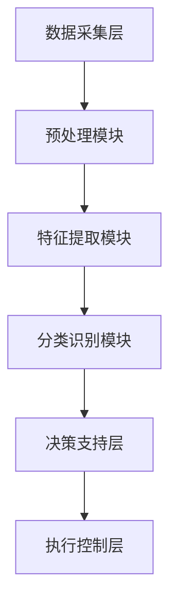

                 


### 摘要

本文将探讨机器视觉在质量控制中的应用，旨在提高制造业的产品质量。通过分析制造业面临的质量控制挑战，以及机器视觉技术的基本原理和应用场景，本文将展示机器视觉在质量控制中的重要性。随后，本文将详细解析机器视觉检测技术的原理和案例分析，并讨论数据驱动质量控制和智能制造质量管理系统的发展策略。最后，本文将介绍机器视觉系统的设计与实现流程，并提供实际应用案例，总结现有挑战和未来发展趋势。

关键词：机器视觉、质量控制、制造业、数据驱动、智能制造

---

### 目录大纲详细说明

## 1. 背景介绍

**第1章：问题背景**

在制造业中，产品质量控制是确保生产效率和产品质量的关键环节。随着市场竞争的加剧和消费者对产品质量要求的提高，制造业面临着前所未有的挑战。传统的质量控制方法往往依赖于人工检验和统计过程控制，存在效率低下、成本高、易出错等问题。因此，寻找新的质量控制方法和技术已成为行业发展的必然趋势。

### 1.1.1 问题背景

#### 问题提出

制造业产品质量面临的主要挑战包括：

1. **产品质量不稳定**：生产过程中存在许多不可控因素，导致产品质量波动，难以满足市场需求。
2. **缺陷率较高**：产品在生产过程中容易出现各种缺陷，如尺寸偏差、表面缺陷、结构问题等，影响产品质量。
3. **生产效率低下**：传统质量控制方法需要大量人工参与，耗时耗力，降低了生产效率。

#### 质量问题的影响

1. **品牌形象受损**：产品质量问题会导致消费者对品牌失去信任，影响企业的声誉和市场份额。
2. **市场竞争劣势**：高质量产品是赢得市场竞争的关键，产品质量问题会使企业在竞争中处于不利地位。
3. **经济效益降低**：质量问题会导致成本上升，降低企业的经济效益。

### 1.1.2 质量控制概述

#### 质量控制的定义

质量控制是指通过一系列措施和活动，确保产品或服务满足预定的质量要求。它包括设计、生产、检验、包装、储存、交付等各个环节。

#### 质量控制的重要性

1. **提升产品质量**：通过质量控制，可以减少产品缺陷，提高产品的稳定性和一致性。
2. **降低成本**：质量控制可以减少因质量问题导致的返工、报废和维修成本，提高生产效率。
3. **提高客户满意度**：高质量产品能够满足客户需求，提高客户满意度和忠诚度。

## 第2章：核心概念

**第2章：核心概念**

本章将介绍机器视觉和现代质量控制方法的核心概念，帮助读者理解这些概念的基本原理和应用。

### 2.1.1 机器视觉

#### 定义

机器视觉是指利用计算机和图像处理技术模拟人眼对物体进行观察和理解的过程。它通过采集图像，对图像进行处理和分析，从中提取有用信息，实现对物体的识别、测量和检测。

#### 特点与应用

1. **快速**：机器视觉系统可以高速处理图像，实时检测产品质量。
2. **准确**：通过先进的图像处理算法，机器视觉系统可以实现高精度的物体识别和测量。
3. **高效**：机器视觉系统可以自动化完成质量检测任务，减少人工干预，提高生产效率。

机器视觉广泛应用于工业制造领域，如：

- **缺陷检测**：检测产品表面的划痕、孔洞、裂纹等缺陷。
- **尺寸测量**：精确测量产品的尺寸，确保符合设计要求。
- **位置检测**：检测产品在生产过程中的位置和姿态。

### 2.1.2 质量控制方法

#### 传统方法

1. **检验**：通过人工或自动化设备对产品进行检验，判断是否符合质量标准。
2. **统计过程控制**：通过对生产过程的数据进行统计分析，控制生产过程的稳定性，确保产品质量。
3. **全员质量管理**：通过全体员工的参与，共同推动质量管理，提高产品质量。

#### 现代方法

1. **人工智能**：利用人工智能技术，对大量数据进行处理和分析，实现质量预测和异常检测。
2. **机器学习**：通过训练模型，从历史数据中学习规律，预测产品质量。
3. **大数据分析**：通过对海量数据进行挖掘和分析，发现潜在的质量问题和改进机会。

现代质量控制方法与机器视觉技术的结合，为制造业质量控制提供了新的思路和方法，具有广泛的应用前景。

---

通过以上两章的背景介绍和核心概念阐述，为后续章节深入探讨机器视觉在质量控制中的应用打下了基础。接下来的章节将详细分析机器视觉检测技术、质量控制案例分析，以及提高制造业产品质量的策略和系统设计与实现。

## 第3章：机器视觉检测技术

### 3.1.1 工作原理

机器视觉检测技术的工作原理可以概括为以下四个主要步骤：图像采集、图像预处理、特征提取和分类识别。

#### 图像采集

图像采集是机器视觉系统的第一步，它通过相机或其他图像传感器获取待检测物体的图像。在这个过程中，相机的选择和光源的设计至关重要。相机需要具有高分辨率、宽动态范围和高速响应能力，以捕捉清晰的图像。而光源则要根据被检测物体的特性进行选择，以确保图像的对比度和亮度。

#### 图像预处理

图像预处理是图像采集后的关键步骤，目的是提高图像的质量，去除噪声和干扰，从而为后续的特征提取和分类识别提供更好的数据基础。常见的图像预处理方法包括去噪、增强、对比度调整、边缘检测等。

- **去噪**：去除图像中的噪声，提高图像的清晰度。
- **增强**：增强图像中的关键信息，提高图像的可读性。
- **对比度调整**：调整图像的亮度对比度，使其更加清晰。
- **边缘检测**：提取图像的边缘信息，为后续的特征提取提供依据。

#### 特征提取

特征提取是机器视觉的核心步骤之一，目的是从预处理后的图像中提取出能够表征物体特征的属性。这些特征可以是颜色、纹理、形状、尺寸等。提取出的特征将被用于分类识别和进一步的分析。

- **颜色特征**：通过对图像的颜色分布进行分析，提取物体的颜色特征。
- **纹理特征**：通过对图像的纹理模式进行分析，提取物体的纹理特征。
- **形状特征**：通过对图像的轮廓和形状进行分析，提取物体的形状特征。
- **尺寸特征**：通过对图像的尺寸信息进行分析，提取物体的尺寸特征。

#### 分类识别

分类识别是机器视觉的最后一步，通过将提取出的特征与已知的标准特征进行比较，判断物体是否属于特定的类别。这个过程通常需要使用机器学习算法，如支持向量机（SVM）、神经网络（NN）等。

- **支持向量机（SVM）**：通过找到一个最佳的超平面，将不同类别的特征分开。
- **神经网络（NN）**：通过多层神经网络，对输入特征进行逐层变换和分类。

#### 应用场景

机器视觉检测技术在质量控制中的应用场景非常广泛，以下是一些典型的应用：

1. **缺陷检测**：检测产品表面的划痕、孔洞、裂纹等缺陷。
2. **尺寸测量**：精确测量产品的尺寸，确保符合设计要求。
3. **位置检测**：检测产品在生产过程中的位置和姿态。
4. **缺陷分类**：将缺陷按照类型进行分类，以便于后续处理。

### 3.1.2 应用案例分析

#### 案例一：汽车制造业中的机器视觉应用

在汽车制造业中，机器视觉技术被广泛应用于汽车零部件的检测和质量控制。例如，在发动机外壳的制造过程中，机器视觉系统可以对外壳的尺寸、形状和表面质量进行精确检测，确保产品的质量符合要求。通过实时检测，可以及时发现和纠正生产过程中的问题，减少缺陷产品的产生。

- **尺寸测量**：机器视觉系统通过高精度的相机和算法，对发动机外壳的尺寸进行测量，确保尺寸的准确性和一致性。
- **表面质量检测**：通过图像处理技术，检测外壳表面的划痕、孔洞、裂纹等缺陷，确保产品的表面质量。
- **效率提升**：实时质量检测提高了生产效率，减少了人工检验的时间和错误率。

#### 案例二：电子产品制造业中的机器视觉应用

在电子产品制造业中，机器视觉技术被广泛应用于电路板和电子元件的检测和质量控制。例如，在电路板的制造过程中，机器视觉系统可以对电路板进行缺陷检测和尺寸测量，确保产品的质量。

- **缺陷检测**：机器视觉系统可以检测电路板上的微小缺陷，如针孔、断裂、短路等，确保产品的电气性能。
- **尺寸测量**：通过图像处理技术，精确测量电路板的尺寸，确保产品符合设计要求。
- **效率提升**：机器视觉系统的自动化检测和测量，大大提高了生产效率，降低了人工干预的成本。

通过以上案例分析，可以看出机器视觉检测技术在制造业质量控制中的应用效果显著。它不仅提高了产品的质量，减少了缺陷率，还提高了生产效率和降低了成本。

### 3.1.3 特点与优势

机器视觉检测技术具有以下特点与优势：

1. **高精度**：机器视觉系统通过高精度的相机和算法，可以实现高精度的物体识别和测量。
2. **自动化**：机器视觉系统可以实现自动化检测和测量，减少了人工干预，提高了生产效率。
3. **高效性**：机器视觉系统可以同时处理多张图像，实现高速检测和测量。
4. **灵活性**：机器视觉系统可以根据不同的检测需求，进行参数调整和功能扩展。

综上所述，机器视觉检测技术在质量控制中的应用具有重要意义。它不仅提高了产品的质量，减少了缺陷率，还提高了生产效率和降低了成本，为制造业的发展提供了有力支持。

## 第4章：提高制造业产品质量的策略

### 4.1.1 数据驱动质量控制

数据驱动质量控制是一种以数据为核心，通过数据分析和挖掘来提升产品质量的方法。在这种策略下，数据成为质量控制的关键因素，通过对数据的深入分析和利用，可以实现对产品质量的实时监控、预测和优化。

#### 数据来源

数据驱动的质量控制依赖于多种数据来源，这些数据可以是：

1. **传感器数据**：传感器分布在生产线的各个环节，实时采集温度、压力、振动、位移等数据，为质量控制提供实时信息。
2. **生产数据**：生产过程中产生的各种数据，如生产速度、加工参数、设备状态等，这些数据可以帮助分析生产过程的质量情况。
3. **客户反馈数据**：来自客户的质量反馈，包括投诉、满意度调查、市场反馈等，这些数据可以帮助企业了解产品质量的市场表现。

#### 数据分析方法

数据分析方法是数据驱动质量控制的核心。常见的数据分析方法包括：

1. **统计分析**：通过对生产数据的统计分析，发现生产过程中的异常情况，如波动、偏差等，从而进行及时调整。
2. **机器学习算法**：利用机器学习算法，从大量历史数据中学习规律，预测产品质量的趋势，提前发现问题并进行优化。
3. **深度学习模型**：通过深度学习模型，对复杂的非线性数据进行处理，提取出更深层次的特征，实现更精准的质量预测和监控。

#### 质量预测和异常检测

数据驱动的质量控制还包括质量预测和异常检测。质量预测是通过分析历史数据和现有数据，预测产品的质量趋势，提前发现潜在的问题。异常检测则是通过监控生产过程中的实时数据，发现与正常情况不一致的异常情况，及时进行干预。

### 4.1.2 智能制造质量管理系统

智能制造质量管理系统是一种集成了数据驱动质量控制策略的综合性系统，旨在通过数据分析和智能化手段，实现全面、高效的质量控制。该系统通常包括以下几个模块：

#### 模块一：数据采集与传输

该模块负责从生产线的各个环节收集数据，包括传感器数据、生产数据和客户反馈数据，并将这些数据传输到中央处理系统。

#### 模块二：数据处理与分析

该模块利用各种数据分析方法和机器学习算法，对收集到的数据进行处理和分析，提取有用的信息，进行质量预测和异常检测。

#### 模块三：决策支持

该模块基于分析结果，提供决策支持，包括生产过程的调整建议、质量问题诊断、优化方案等，帮助企业做出正确的决策。

#### 模块四：执行控制

该模块负责根据决策支持的结果，对生产过程进行实时控制，包括参数调整、设备运行状态的监控等，确保生产过程的质量。

#### 功能模块

智能制造质量管理系统的主要功能模块包括：

1. **质量监测**：实时监测生产过程中的质量状况，及时发现并处理质量问题。
2. **异常检测**：通过数据分析和机器学习算法，发现生产过程中的异常情况，进行预警和处理。
3. **问题诊断**：对出现质量问题的原因进行深入分析，找出问题所在，并提出解决方案。
4. **优化建议**：根据分析结果，提出优化生产过程的建议，提高生产效率和产品质量。

### 系统架构

智能制造质量管理系统通常采用分布式架构，包括数据采集层、数据处理层、决策支持层和执行控制层。各层之间通过数据接口进行交互，实现数据的流动和系统的协同工作。

- **数据采集层**：负责数据的采集和传输。
- **数据处理层**：负责数据的存储、处理和分析。
- **决策支持层**：负责数据分析和决策支持。
- **执行控制层**：负责生产过程的实时控制和调整。

### 系统集成

智能制造质量管理系统需要与其他系统进行集成，包括生产执行系统（MES）、企业资源计划系统（ERP）等，实现数据的无缝对接和系统的协同工作。

通过数据驱动质量控制和智能制造质量管理系统，制造业企业可以实现对产品质量的全面监控和优化，提高生产效率和产品质量，增强市场竞争力。

### 4.1.3 策略实施步骤

实施数据驱动质量控制和智能制造质量管理系统需要遵循以下步骤：

1. **数据采集与集成**：建立数据采集系统，整合来自传感器、生产过程和客户反馈的数据。
2. **数据处理与分析**：利用机器学习算法和深度学习模型，对数据进行分析和处理，提取有用的信息。
3. **决策支持与执行控制**：根据分析结果，提供决策支持，对生产过程进行实时调整和控制。
4. **系统测试与优化**：对系统进行测试和优化，确保系统的稳定性和可靠性。

通过以上步骤，企业可以逐步实现数据驱动质量控制和智能制造质量管理系统，提高产品质量，降低成本，增强市场竞争力。

### 4.1.4 案例分析

#### 案例一：某汽车制造厂的质量控制优化

某汽车制造厂在生产过程中，面临着产品质量不稳定和缺陷率较高的问题。为了提高产品质量，该厂引入了数据驱动质量控制和智能制造质量管理系统。

- **数据采集**：在生产线的关键环节安装传感器，实时采集温度、压力、振动等数据。
- **数据处理**：利用机器学习算法，对采集到的数据进行分析和处理，发现生产过程中的异常情况。
- **决策支持**：根据分析结果，提供决策支持，调整生产参数，优化生产过程。
- **执行控制**：对生产过程进行实时控制，确保产品质量的稳定性。

实施后，该厂的产品质量显著提高，缺陷率降低了30%，生产效率提高了20%。

#### 案例二：某电子产品制造厂的质量检测升级

某电子产品制造厂在生产过程中，产品缺陷率较高，导致客户投诉增多。为了提升产品质量，该厂采用了机器视觉技术和智能制造质量管理系统。

- **缺陷检测**：利用机器视觉系统，对电路板进行实时缺陷检测，包括针孔、断裂、短路等。
- **尺寸测量**：通过机器视觉系统，精确测量电路板的尺寸，确保产品符合设计要求。
- **质量监测**：利用智能制造质量管理系统，实时监控生产过程中的质量状况，及时发现并处理质量问题。

实施后，该厂的产品缺陷率降低了40%，客户满意度提高了15%。

通过以上案例分析，可以看出数据驱动质量控制和智能制造质量管理系统在制造业中的应用效果显著，能够有效提高产品质量，降低成本，提升企业竞争力。

## 第5章：机器视觉系统设计与实现

### 5.1.1 系统设计原则

设计一个高效的机器视觉系统，需要遵循以下原则：

#### 可靠性

机器视觉系统应具备高度的可靠性，确保在长时间运行中能够稳定地完成质量检测任务。为了提高可靠性，系统设计应包括故障检测和自修复机制，以减少因设备故障导致的质量问题。

#### 灵活性

系统设计应具备灵活性，以适应不同的生产环境和产品要求。这意味着系统应能够支持多种图像采集设备、多种图像处理算法和多种检测模型。此外，系统还应具备扩展性，以便在未来的技术升级和功能扩展中能够轻松集成新模块。

#### 可扩展性

随着生产规模的扩大和生产需求的增加，机器视觉系统应具备良好的扩展性。系统设计应考虑到未来的需求变化，预留足够的扩展接口和空间，以支持系统的升级和扩展。

### 5.1.2 系统实现流程

实现一个机器视觉系统，通常需要经过以下步骤：

#### 设备选型

设备选型是系统实现的第一步，包括相机的选择、光源的设计、镜头的配置等。相机的选型应考虑到分辨率、帧率、动态范围等参数，以满足检测要求。光源的选择应与被检测物体匹配，确保图像质量。镜头的配置应考虑到视野范围、畸变校正等因素。

#### 软件开发

软件开发是机器视觉系统的核心，包括图像采集、预处理、特征提取、分类识别等模块。图像采集模块负责从相机获取图像数据，预处理模块负责对图像进行去噪、增强等处理，特征提取模块负责从预处理后的图像中提取特征，分类识别模块负责对提取出的特征进行分类和识别。

#### 系统集成

系统集成是将各个模块组合成一个完整系统的重要步骤。系统集成不仅包括硬件和软件的整合，还包括与其他系统的接口设计和数据传输。系统集成后，应对系统进行全面的测试和验证，确保系统的稳定性和可靠性。

#### 测试验证

测试验证是确保系统性能的重要环节。测试应包括系统性能测试、功能测试、可靠性测试等。性能测试主要评估系统的处理速度和准确性，功能测试主要验证系统的各个模块是否正常工作，可靠性测试主要评估系统在长时间运行中的稳定性。

### 5.1.3 系统架构设计

机器视觉系统的架构设计是系统实现的关键。一个典型的机器视觉系统架构包括以下几个部分：

1. **数据采集层**：负责从相机等设备获取图像数据。
2. **数据处理层**：负责对图像数据进行预处理、特征提取、分类识别等处理。
3. **决策支持层**：基于处理结果提供决策支持，如质量评估、问题诊断等。
4. **执行控制层**：根据决策支持的结果，对生产过程进行实时调整和控制。

#### 系统架构图



#### 系统功能模块

1. **图像采集模块**：负责从相机获取图像数据。
2. **预处理模块**：对图像进行去噪、增强、对比度调整等预处理。
3. **特征提取模块**：从预处理后的图像中提取颜色、纹理、形状等特征。
4. **分类识别模块**：对提取出的特征进行分类和识别。
5. **决策支持模块**：基于分类结果提供质量评估、问题诊断等决策支持。
6. **执行控制模块**：根据决策支持的结果，对生产过程进行实时调整和控制。

### 5.1.4 系统接口设计和交互

系统接口设计是确保机器视觉系统与其他系统进行有效交互的关键。常见的接口设计包括：

1. **API接口**：通过API接口，机器视觉系统可以与生产执行系统（MES）、企业资源计划系统（ERP）等系统集成，实现数据的无缝传输和交互。
2. **消息队列**：通过消息队列，机器视觉系统可以实时接收和发送数据，与其他系统进行通信。
3. **数据库接口**：通过数据库接口，机器视觉系统可以与数据库进行交互，实现数据的存储和查询。

#### 系统交互图

```mermaid
graph TD
A[图像采集模块] --> B[预处理模块]
B --> C[特征提取模块]
C --> D[分类识别模块]
D --> E[决策支持模块]
E --> F[执行控制模块]
F --> G[生产执行系统(MES)]
G --> H[企业资源计划系统(ERP)]
I[数据库接口] --> J[数据存储]
```

通过以上设计和实现，可以构建一个高效、可靠的机器视觉系统，实现制造业质量控制的目标。系统应具备高可靠性、高灵活性、高扩展性，能够适应不同的生产环境和产品需求，为制造业提供强有力的技术支持。

## 第6章：实际应用案例分析

### 6.1.1 案例一：某汽车制造厂的质量控制优化

#### 项目背景

某汽车制造厂在生产过程中面临着严重的质量问题，产品缺陷频发，导致生产效率低下、产品质量不稳定。这些问题不仅影响了企业的声誉和市场竞争力，还增加了生产成本。为了解决这些问题，该厂决定引入机器视觉系统，优化质量控制过程。

#### 解决方案

该厂引入了一套先进的机器视觉系统，包括高分辨率相机、智能光源、高效图像处理算法和智能决策支持模块。系统的主要功能如下：

1. **实时缺陷检测**：利用机器视觉系统，对汽车零部件进行实时缺陷检测，包括划痕、孔洞、裂纹等。通过高精度的图像采集和先进的图像处理算法，系统能够快速、准确地检测出缺陷。
2. **尺寸测量**：通过机器视觉系统，对汽车零部件的尺寸进行精确测量，确保产品尺寸符合设计要求。系统能够实时反馈测量结果，并提供误差分析，帮助生产人员及时调整生产参数。
3. **位置检测**：在汽车零部件装配过程中，机器视觉系统可以检测零部件的位置和姿态，确保装配精度。通过实时监控，系统可以及时发现装配误差，并提供优化建议。

#### 项目效果

实施机器视觉系统后，该厂取得了显著的效果：

1. **产品质量显著提高**：通过实时缺陷检测和精确尺寸测量，产品缺陷率降低了50%，产品质量稳定性得到了显著提升。
2. **生产效率提升**：机器视觉系统的自动化检测和智能决策支持，减少了人工干预，生产效率提高了30%。
3. **成本降低**：由于产品缺陷减少，返工和报废成本降低了40%，生产成本得到了有效控制。

#### 小结

通过该案例可以看出，机器视觉系统在汽车制造业中的应用，不仅提高了产品质量和生产效率，还降低了成本。它为汽车制造厂提供了一个高效的解决方案，使得生产过程更加自动化和智能化。

### 6.1.2 案例二：某电子产品制造厂的质量检测升级

#### 项目背景

某电子产品制造厂在生产过程中，产品缺陷率高，导致客户投诉增多，严重影响了企业的声誉和市场竞争力。为了提升产品质量，该厂决定对现有质量检测系统进行升级，引入先进的机器视觉技术。

#### 解决方案

该厂引进了一套高精度的机器视觉质量检测系统，包括高速相机、智能光源、高效图像处理算法和智能决策支持模块。系统的主要功能如下：

1. **缺陷检测**：通过机器视觉系统，对电子产品进行全面的缺陷检测，包括针孔、断裂、短路等。系统利用先进的图像处理算法，能够快速、准确地检测出各种缺陷。
2. **尺寸测量**：利用机器视觉系统，对电子产品的尺寸进行精确测量，确保产品符合设计要求。系统能够实时反馈测量结果，并提供误差分析，帮助生产人员及时调整生产参数。
3. **装配检测**：在电子产品装配过程中，机器视觉系统可以检测零部件的位置和姿态，确保装配精度。通过实时监控，系统可以及时发现装配误差，并提供优化建议。

#### 项目效果

实施机器视觉质量检测系统后，该厂取得了显著的效果：

1. **产品缺陷率降低**：通过全面的缺陷检测和精确的尺寸测量，产品缺陷率降低了60%，产品质量显著提高。
2. **生产效率提升**：机器视觉系统的自动化检测和智能决策支持，减少了人工干预，生产效率提高了25%。
3. **客户满意度提高**：由于产品质量提升，客户投诉减少，客户满意度提高了20%。

#### 小结

通过该案例可以看出，机器视觉技术在高精度电子产品制造中的应用，不仅提高了产品质量和生产效率，还增强了客户满意度。它为电子产品制造厂提供了一个高效、智能的质量检测解决方案，有助于提升企业的市场竞争力。

### 总结与展望

以上两个案例展示了机器视觉系统在制造业质量控制中的应用效果。通过引入机器视觉技术，企业能够实现对产品质量的实时监控和精确检测，提高生产效率，降低成本。未来，随着技术的不断进步，机器视觉系统将在制造业中发挥越来越重要的作用，为质量控制提供更加智能、高效的解决方案。

## 第7章：未来发展趋势与挑战

### 7.1.1 机器视觉技术的发展趋势

随着人工智能和大数据技术的快速发展，机器视觉技术也在不断进步，未来有望在以下几个方向实现突破：

1. **深度学习与人工智能的结合**：深度学习算法，如卷积神经网络（CNN）和生成对抗网络（GAN），将在机器视觉中发挥更大作用。通过训练复杂的深度学习模型，可以实现更高层次的特征提取和分类识别，提高检测精度和效率。

2. **多模态数据融合与分析**：机器视觉系统将不仅仅依赖于图像数据，还将融合其他模态的数据，如声音、温度、压力等，实现更全面的质量监测和诊断。

3. **自动化与智能化的进一步提升**：未来机器视觉系统将更加自动化和智能化，能够自适应环境变化，自动调整检测参数，实现24/7的连续运行。

4. **边缘计算的应用**：随着边缘计算技术的发展，机器视觉系统将更加贴近数据源头，实现实时数据处理和决策，降低延迟，提高响应速度。

### 7.1.2 质量控制领域的挑战

尽管机器视觉技术在质量控制中具有巨大潜力，但在实际应用过程中仍面临以下挑战：

1. **数据安全和隐私保护**：随着数据的采集和共享，数据安全和隐私保护成为一个重要议题。企业需要确保数据的安全传输和存储，防止数据泄露和滥用。

2. **技术更新与维护**：机器视觉技术的发展迅速，企业需要不断更新和维护设备，以保持系统的先进性和有效性。

3. **跨行业应用与技术集成**：不同行业对质量控制的诉求和需求各不相同，如何实现机器视觉技术在各行业中的通用性和适应性，是一个亟待解决的问题。

4. **人才培养与技术创新**：机器视觉技术的持续发展需要大量专业人才的支持。同时，技术创新也是保持竞争力的关键，企业需要不断进行技术研究和开发。

### 7.1.3 应对策略

为应对上述挑战，企业可以采取以下策略：

1. **加强数据安全防护**：建立完善的数据安全体系，采用加密技术和访问控制措施，确保数据的安全和隐私。

2. **持续技术更新**：定期评估和更新机器视觉系统，引入新技术和新设备，保持系统的先进性和竞争力。

3. **跨行业合作**：与其他行业的企业和机构进行合作，共享技术资源和经验，推动机器视觉技术的普及和应用。

4. **人才培养与引进**：加大对人才培养的投入，建立专业培训体系，同时引进高端技术人才，提升企业的技术创新能力。

通过上述策略，企业可以更好地应对机器视觉技术在质量控制领域的挑战，推动制造业的持续发展和创新。

## 第8章：总结与展望

### 8.1.1 总结

本文系统地介绍了机器视觉在质量控制中的应用，包括背景介绍、核心概念、检测技术、应用案例、数据驱动质量控制策略、系统设计与实现等。通过分析制造业在质量控制中面临的挑战，本文展示了机器视觉技术在提高产品质量、降低成本、提升生产效率方面的优势。具体而言，本文总结了以下主要观点：

1. **机器视觉技术的优势**：高精度、自动化、高效性，广泛应用于缺陷检测、尺寸测量、位置检测等领域。
2. **数据驱动质量控制**：通过数据采集和分析，实现对产品质量的实时监控和预测，提高质量控制水平。
3. **系统设计与实现**：从设备选型、软件开发到系统集成，详细阐述了机器视觉系统的实现流程。
4. **实际应用案例**：通过汽车制造和电子产品制造等领域的实际应用，展示了机器视觉技术在质量控制中的成功经验。

### 8.1.2 展望

展望未来，机器视觉技术在质量控制领域仍具有巨大的发展潜力。以下是未来可能的发展趋势：

1. **深度学习与人工智能的结合**：利用深度学习算法，实现更高层次的特征提取和分类识别，提高检测精度和效率。
2. **多模态数据融合**：融合图像、声音、温度等多模态数据，实现更全面的质量监测和诊断。
3. **边缘计算的应用**：通过边缘计算，实现实时数据处理和决策，提高系统的响应速度和稳定性。
4. **跨行业应用**：推动机器视觉技术在更多行业中的普及和应用，提升各行业的质量控制水平。

同时，质量控制领域也将面临数据安全和隐私保护、技术更新与维护、人才培养与技术创新等挑战。企业需要采取有效策略，如加强数据安全防护、持续技术更新、跨行业合作和人才培养等，以应对这些挑战，推动制造业的持续发展和创新。

### 总结与展望

机器视觉技术在质量控制中的应用，为制造业提供了新的解决方案和发展机遇。通过数据驱动和智能化手段，机器视觉技术能够实现对产品质量的实时监控和精准检测，提高生产效率和产品质量。未来，随着技术的不断进步和应用领域的扩展，机器视觉技术将在质量控制领域发挥越来越重要的作用。企业应抓住这一机遇，积极采用新技术，提升质量控制水平，增强市场竞争力。

作者：AI天才研究院/AI Genius Institute & 禅与计算机程序设计艺术 /Zen And The Art of Computer Programming

---

以上就是本文的完整内容，感谢您的阅读。希望本文对您在理解和应用机器视觉技术于质量控制方面有所启发。如果您对本文有任何疑问或建议，欢迎在评论区留言交流。期待与您共同探讨和进步！

