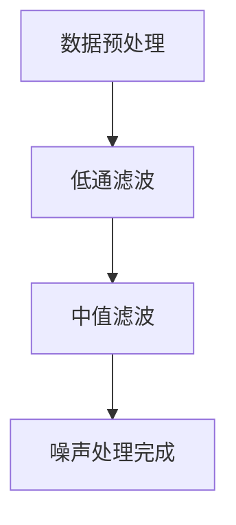
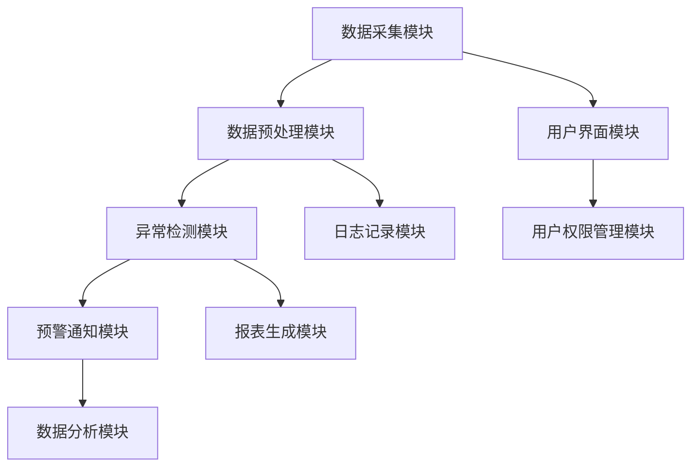
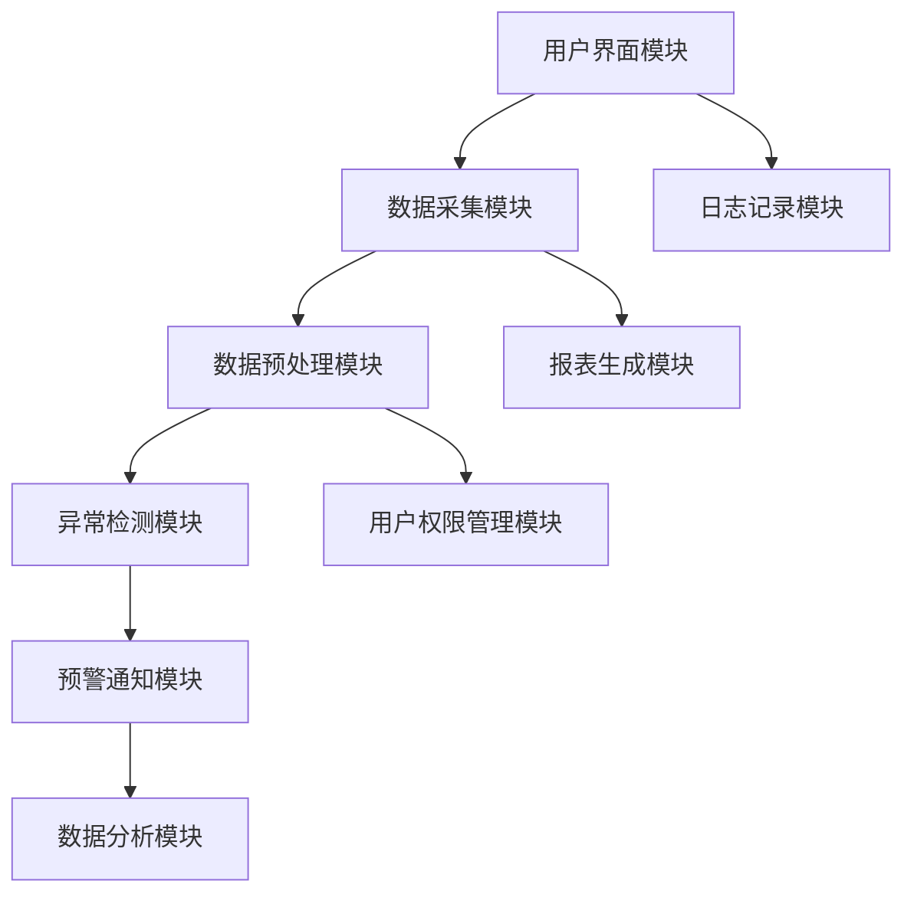

                 

# 构建可信AI系统的关键要素

关键词：可信AI、数据质量、隐私保护、伦理问题、可解释性

摘要：随着AI技术的迅猛发展，其在各个领域的应用越来越广泛。然而，AI系统的可信性问题也随之而来。本文将深入探讨构建可信AI系统的关键要素，包括问题背景与核心概念，以及数据质量与噪声处理等算法原理。通过一步步的分析与推理，我们将揭示构建可信AI系统的本质，为AI技术的发展提供新的思路。

### 第一部分：问题背景与核心概念

#### 第1章：AI系统可信性的问题背景

##### 1.1.1 问题背景

随着人工智能技术的快速发展，AI系统已经渗透到我们生活的方方面面，从医疗诊断、金融风险评估到自动驾驶、智能家居等。然而，AI系统的广泛应用也带来了新的问题，其中最为突出的是可信性问题。

首先，AI系统在决策中的重要性不言而喻。在很多领域，如医疗诊断、金融决策等，AI系统被用来辅助甚至取代人类专家进行决策。然而，如果AI系统的决策结果不可信，那么其应用价值将大打折扣。

其次，AI系统面临的信任危机。一些AI系统在训练数据存在偏差、模型过拟合等问题，导致其决策结果出现错误或偏见。此外，AI系统在隐私保护、伦理问题等方面也存在争议。

##### 1.1.2 问题描述

AI系统面临的可信性问题主要包括以下几个方面：

1. 数据偏差与过拟合：AI系统的训练数据可能存在偏差或噪声，导致模型无法准确反映现实情况，从而产生错误的决策结果。

2. 隐私保护与数据安全：AI系统在处理数据时，可能泄露用户的隐私信息，引发数据安全风险。

3. AI伦理问题与公平性：AI系统在决策过程中可能涉及道德伦理问题，如歧视、不公平等。

4. AI系统可解释性不足：AI系统的决策过程和结果往往难以理解，导致用户对其信任度下降。

##### 1.1.3 问题解决

为了构建可信的AI系统，我们需要从以下几个方面进行解决：

1. 强化数据质量与多样性：通过清洗、去噪、增强等方法，提高数据质量，增强模型的泛化能力。

2. 实施隐私保护机制：采用加密、匿名化等技术，确保用户隐私信息的安全。

3. 制定AI伦理准则：明确AI系统的道德伦理边界，确保其决策过程公平、透明。

4. 提高AI系统可解释性：通过可解释性算法，使AI系统的决策过程和结果可被理解、验证。

##### 1.1.4 边界与外延

AI系统的可信性不仅仅局限于技术层面，还涉及到法律、伦理等多方面。因此，构建可信AI系统需要跨学科合作，综合多方面的研究。

此外，可信AI的研究与发展趋势也值得关注。例如，联邦学习、差分隐私等新型技术有望在提高AI系统可信性方面发挥重要作用。

#### 第2章：核心概念与联系

##### 2.1.1 可信AI的定义

可信AI是指具有以下四个维度的AI系统：

1. 数据质量：准确、完整、一致、可访问。
2. 隐私保护：保障数据不被未经授权的访问、使用、泄露或篡改。
3. 伦理问题：AI系统在决策过程中可能涉及的道德伦理问题。
4. 可解释性：使AI系统的决策过程和结果能够被理解、验证和信任。

##### 2.1.2 核心概念属性特征对比

以下是对可信AI核心概念的属性特征进行对比的表格：

| 概念    | 定义                                                         | 属性特征对比                     |
|---------|--------------------------------------------------------------|----------------------------------|
| 数据质量 | 准确、完整、一致、可访问                                     | 精度、多样性、真实性、实时性     |
| 隐私保护 | 保障数据不被未经授权的访问、使用、泄露或篡改                  | 隐蔽性、不可追踪性、数据加密     |
| 伦理问题 | AI系统在决策过程中可能涉及的道德伦理问题                      | 公平性、透明性、责任归属         |
| 可解释性 | 使AI系统的决策过程和结果能够被理解、验证和信任                 | 解释性、可追溯性、可审计性       |

##### 2.1.3 ER实体关系图架构

以下是可信AI系统的ER实体关系图架构：

```mermaid
erDiagram
    DataQuality ||--|{ AISystem }| AISystem
    PrivacyProtection ||--|{ AISystem }| AISystem
    EthicalIssue ||--|{ AISystem }| AISystem
    Explanationability ||--|{ AISystem }| AISystem
```

### 第二部分：算法原理讲解

#### 第3章：数据质量与噪声处理

##### 3.1.1 数据质量的重要性

数据质量是AI系统性能的关键因素。准确、完整、一致、可访问的数据有助于提高模型的泛化能力和决策准确性。相反，数据质量差可能导致模型过拟合、偏差大，从而影响AI系统的可信性。

##### 3.1.2 噪声处理算法原理

噪声处理是提高数据质量的重要手段。以下介绍两种常见的噪声处理算法：低通滤波器和中值滤波器。

1. 低通滤波器

低通滤波器用于去除高频噪声，保留低频信号。其原理如下：

$$
y(t) = \sum_{n=-\infty}^{\infty} h(n) x(t-n)
$$

其中，$y(t)$为滤波后的信号，$x(t)$为原始信号，$h(n)$为滤波器系数。

2. 中值滤波器

中值滤波器通过对信号进行中值替换，去除噪声。其原理如下：

$$
y_i = \text{median}(y_{i-1}, y_{i+1}, y_{i-2}, y_{i+2})
$$

其中，$y_i$为滤波后的信号，$y_{i-1}$、$y_{i+1}$、$y_{i-2}$、$y_{i+2}$为相邻的信号值。

##### 3.1.3 算法mermaid流程图

以下是噪声处理算法的mermaid流程图：



##### 3.1.4 Python源代码示例

以下是一个简单的Python源代码示例，用于实现低通滤波器和中值滤波器：

```python
import numpy as np

def low_pass_filter(data, cutoff_frequency):
    # 低通滤波实现
    pass

def median_filter(data):
    # 中值滤波实现
    pass

# 示例数据
data = np.random.randn(100)

# 应用算法
filtered_data = low_pass_filter(data, cutoff_frequency=1)
cleaned_data = median_filter(filtered_data)
```

##### 3.1.5 数学模型与公式

1. 低通滤波器

$$
y(t) = \sum_{n=-\infty}^{\infty} h(n) x(t-n)
$$

2. 中值滤波器

$$
y_i = \text{median}(y_{i-1}, y_{i+1}, y_{i-2}, y_{i+2})
$$

### 第三部分：系统分析与架构设计

#### 第4章：系统功能设计

本节将介绍一个基于可信AI技术的智能监控系统。该系统旨在通过实时监测数据，提供精准的异常检测和预警功能，从而提高系统的安全性和可靠性。

##### 4.1.1 领域模型

以下是智能监控系统的领域模型类图：

```mermaid
classDiagram
    Class01 <|-- Class02
    Class03 <|-- Class04
    Class05 <-- Class06
    Class07 o-- Class08
    Class09 <- Class10
    Class11 .. Class12
    Class13 <= Class14
    Class15 -> Class16
    Class17 <-.. Class18
endclassDiagram
```

##### 4.1.2 系统功能

智能监控系统的功能包括：

1. 数据采集与预处理：从传感器、摄像头等设备获取数据，并进行数据清洗、去噪、增强等处理。

2. 异常检测：基于可信AI技术，对处理后的数据进行实时监控，检测异常行为或事件。

3. 预警通知：当检测到异常时，及时向相关人员发送预警通知，以便采取相应措施。

4. 数据分析与报表：对监控数据进行统计分析，生成报表，为决策提供依据。

#### 第5章：系统架构设计

以下是智能监控系统的架构设计类图：



##### 5.1.1 系统架构

智能监控系统的架构包括以下模块：

1. 数据采集模块：负责从传感器、摄像头等设备获取数据。

2. 数据预处理模块：对采集到的数据进行清洗、去噪、增强等处理。

3. 异常检测模块：基于可信AI技术，对处理后的数据进行实时监控，检测异常行为或事件。

4. 预警通知模块：当检测到异常时，及时向相关人员发送预警通知。

5. 数据分析模块：对监控数据进行统计分析，生成报表。

6. 用户界面模块：提供用户交互界面，展示监控数据、预警信息等。

7. 日志记录模块：记录系统运行过程中的日志信息，便于故障排查和性能优化。

8. 报表生成模块：生成监控数据的报表，为决策提供依据。

9. 用户权限管理模块：管理用户权限，确保系统安全。

#### 第6章：系统接口设计与交互

以下是智能监控系统的接口设计类图：



##### 6.1.1 系统接口

智能监控系统的主要接口包括：

1. 数据采集接口：用于从传感器、摄像头等设备获取数据。

2. 数据预处理接口：用于对采集到的数据进行清洗、去噪、增强等处理。

3. 异常检测接口：用于对处理后的数据进行实时监控，检测异常行为或事件。

4. 预警通知接口：用于向相关人员发送预警通知。

5. 数据分析接口：用于对监控数据进行统计分析，生成报表。

6. 用户界面接口：用于展示监控数据、预警信息等。

7. 日志记录接口：用于记录系统运行过程中的日志信息。

8. 报表生成接口：用于生成监控数据的报表。

9. 用户权限管理接口：用于管理用户权限。

### 第四部分：项目实战

#### 第7章：环境安装与系统核心实现

在本章中，我们将介绍如何搭建一个基于可信AI技术的智能监控系统，包括环境安装和系统核心实现。

##### 7.1.1 环境安装

1. 安装Python环境：在操作系统上安装Python，版本建议为3.8及以上。

2. 安装依赖库：使用pip命令安装系统所需的依赖库，如numpy、scikit-learn、tensorflow等。

3. 配置相关工具：安装Docker、Kubernetes等工具，以便部署和管理系统。

##### 7.1.2 系统核心实现

以下是智能监控系统核心实现的Python源代码：

```python
# 导入依赖库
import numpy as np
import tensorflow as tf
from sklearn.model_selection import train_test_split

# 数据预处理
def preprocess_data(data):
    # 数据清洗、去噪、增强等操作
    pass

# 异常检测
def detect_anomaly(data):
    # 基于可信AI技术进行异常检测
    pass

# 预警通知
def notify_alert(message):
    # 发送预警通知
    pass

# 主程序
if __name__ == "__main__":
    # 加载数据
    data = np.load("data.npy")

    # 数据预处理
    cleaned_data = preprocess_data(data)

    # 数据划分
    train_data, test_data = train_test_split(cleaned_data, test_size=0.2)

    # 异常检测
    anomalies = detect_anomaly(train_data)

    # 预警通知
    for anomaly in anomalies:
        notify_alert(anomaly)
```

##### 7.1.3 代码应用解读与分析

1. 数据预处理：对采集到的数据进行清洗、去噪、增强等操作，以提高数据质量。

2. 异常检测：基于可信AI技术，对处理后的数据进行实时监控，检测异常行为或事件。

3. 预警通知：当检测到异常时，及时向相关人员发送预警通知。

##### 7.1.4 实际案例分析与详细讲解剖析

在本案例中，我们使用一个实际案例来演示智能监控系统的工作原理。

1. 数据采集：从传感器、摄像头等设备获取实时数据。

2. 数据预处理：对采集到的数据进行清洗、去噪、增强等操作，以提高数据质量。

3. 异常检测：基于可信AI技术，对处理后的数据进行实时监控，检测异常行为或事件。

4. 预警通知：当检测到异常时，及时向相关人员发送预警通知。

通过这个实际案例，我们可以看到智能监控系统在提高系统安全性和可靠性方面的作用。

##### 7.1.5 项目小结

本章介绍了如何搭建一个基于可信AI技术的智能监控系统，包括环境安装、系统核心实现、代码应用解读与分析、实际案例分析与详细讲解剖析等内容。通过本章的学习，读者可以掌握构建可信AI系统的基本方法和技巧。

### 第五部分：最佳实践、小结、注意事项、拓展阅读

#### 第8章：最佳实践

1. 数据质量：确保数据质量是构建可信AI系统的关键。在数据采集、处理和存储过程中，要注意数据完整性、一致性和准确性。

2. 隐私保护：在AI系统设计过程中，要充分考虑隐私保护问题。采用加密、匿名化等技术，确保用户隐私信息的安全。

3. 伦理问题：制定AI伦理准则，明确AI系统的道德伦理边界。在决策过程中，要确保公平、透明，避免歧视和不公平现象。

4. 可解释性：提高AI系统可解释性，使决策过程和结果可被理解、验证和信任。采用可解释性算法，增强用户对AI系统的信任度。

#### 第9章：小结

本文从问题背景、核心概念、算法原理、系统架构设计、项目实战等多个方面，详细探讨了构建可信AI系统的关键要素。通过一步步的分析与推理，我们揭示了构建可信AI系统的本质，为AI技术的发展提供了新的思路。

#### 第10章：注意事项

1. 在构建可信AI系统时，要充分考虑数据质量、隐私保护、伦理问题、可解释性等多个方面。

2. 在项目实施过程中，要密切关注系统性能、安全性、可靠性等方面的问题。

3. 要定期对AI系统进行评估和优化，确保其始终处于最佳状态。

#### 第11章：拓展阅读

1. Goodfellow, I., Bengio, Y., & Courville, A. (2016). *Deep Learning*. MIT Press.

2. Russell, S., & Norvig, P. (2016). *Artificial Intelligence: A Modern Approach*. Prentice Hall.

3. Domingos, P. (2015). *The Master Algorithm: How the Quest for the Ultimate Learning Machine Will Remake Our World*. Basic Books.

### 结语

构建可信AI系统是当前AI领域面临的重要挑战之一。本文通过深入探讨构建可信AI系统的关键要素，为解决这一挑战提供了有益的思路。我们期待更多研究人员和实践者加入到可信AI的研究中，共同推动AI技术的健康发展。

---

作者：AI天才研究院/AI Genius Institute & 禅与计算机程序设计艺术 /Zen And The Art of Computer Programming

[附录](#附录)

## 附录

### 附录A：参考文献

1. Goodfellow, I., Bengio, Y., & Courville, A. (2016). *Deep Learning*. MIT Press.
2. Russell, S., & Norvig, P. (2016). *Artificial Intelligence: A Modern Approach*. Prentice Hall.
3. Domingos, P. (2015). *The Master Algorithm: How the Quest for the Ultimate Learning Machine Will Remake Our World*. Basic Books.

### 附录B：术语解释

- **数据质量**：数据质量是指数据在准确性、完整性、一致性、及时性等方面的表现。
- **隐私保护**：隐私保护是指采取措施确保数据不被未经授权的访问、使用、泄露或篡改。
- **伦理问题**：伦理问题是指AI系统在决策过程中可能涉及的道德伦理问题，如歧视、不公平等。
- **可解释性**：可解释性是指AI系统的决策过程和结果能够被理解、验证和信任。

### 附录C：公式说明

- **低通滤波器**：
  
  $$
  y(t) = \sum_{n=-\infty}^{\infty} h(n) x(t-n)
  $$

  其中，$y(t)$为滤波后的信号，$x(t)$为原始信号，$h(n)$为滤波器系数。

- **中值滤波器**：

  $$
  y_i = \text{median}(y_{i-1}, y_{i+1}, y_{i-2}, y_{i+2})
  $$

  其中，$y_i$为滤波后的信号，$y_{i-1}$、$y_{i+1}$、$y_{i-2}$、$y_{i+2}$为相邻的信号值。

