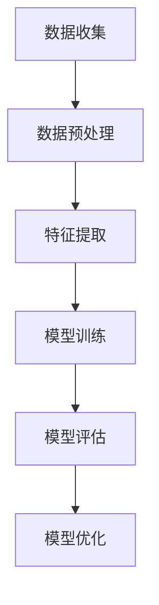
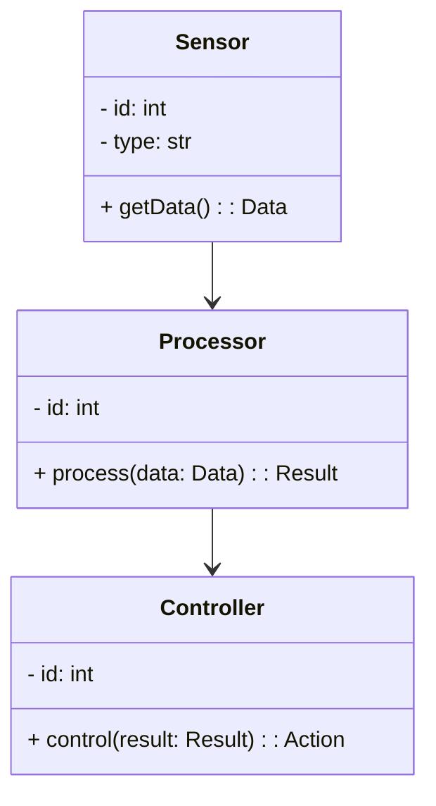
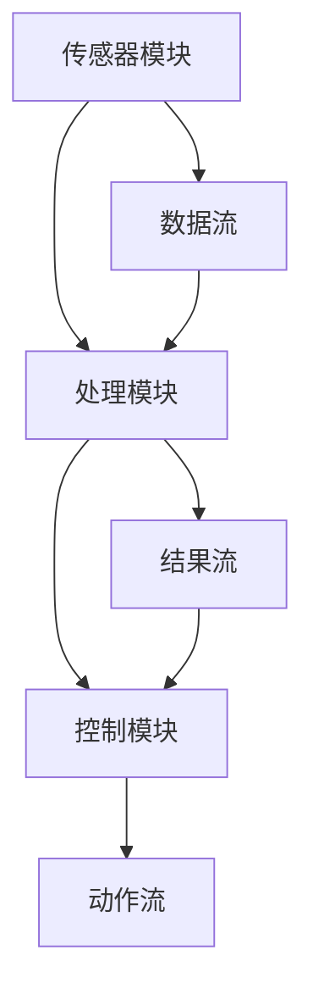
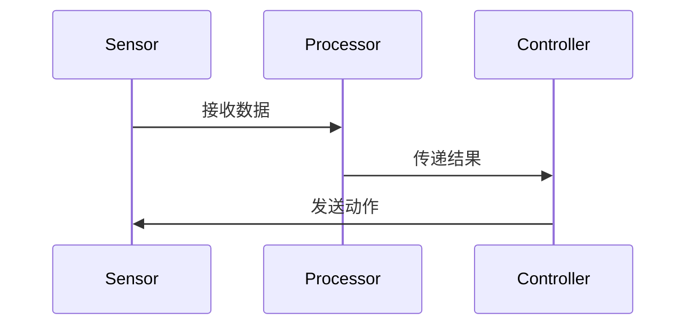

                 


### 设计《构建可信AI系统的关键要素》的目录大纲

#### 1. 背景介绍
- **问题背景**：随着人工智能技术的发展，AI系统的可靠性、安全性、透明性等成为关键问题。大量实时应用的AI系统，如自动驾驶、医疗诊断、金融风控等，对系统的可信度提出了更高的要求。
- **问题描述**：构建可信AI系统涉及到算法透明性、模型解释性、鲁棒性等多方面。如何确保AI系统在复杂环境下能够稳定、安全地运行，是一个亟待解决的问题。
- **问题解决**：通过系统化的关键要素设计，提升AI系统的可信度。这包括但不限于算法设计、数据安全、法律法规等。
- **边界与外延**：讨论范围包括但不限于算法设计、数据安全、法律法规等。此外，我们还会关注可信AI系统在不同行业应用中的特定需求。
- **概念结构与核心要素组成**：定义可信AI系统的核心要素，如数据质量、算法透明性、模型可解释性、系统鲁棒性等。通过这些要素的有机结合，构建一个全面、可靠的AI系统。

#### 2. 核心概念与联系
- **核心概念原理**：深入讲解可信AI系统的基础概念，如算法透明性、模型解释性等。理解这些概念是构建可信AI系统的基础。
- **概念属性特征对比表格**：使用表格形式对比不同要素的属性特征，如数据质量的高效性、算法透明性的可靠性、模型可解释性的易懂性等。这有助于读者更好地理解各个要素的重要性和相互关系。
- **ER实体关系图架构**：使用Mermaid绘制实体关系图，展示各个核心要素之间的关系。例如，数据质量影响算法透明性，算法透明性又影响模型解释性，进而影响系统的整体可信度。

#### 3. 算法原理讲解
- **算法mermaid流程图**：使用Mermaid绘制算法流程图，展示算法的基本逻辑。例如，数据清洗、特征提取、模型训练、模型评估等步骤。
- **Python源代码**：提供Python代码，阐述算法的详细实现。通过代码实现，读者可以直观地理解算法的具体操作过程。
- **数学模型和公式**：使用LaTeX格式给出数学模型和公式，并进行详细讲解。例如，损失函数、优化算法等。这些数学工具是构建可信AI系统的关键。
- **举例说明**：通过具体的例子来解释算法的应用，确保读者理解。例如，在一个实际的应用场景中，如何使用可信AI系统进行数据分类、预测等。

#### 4. 数学模型和数学公式 & 详细讲解 & 举例说明
- **LaTeX格式数学公式**：在文中独立段落使用$$括起来，如$$1+1=2$$。这确保了数学公式的准确性和可读性。
- **详细讲解**：对数学模型和公式进行详细的解释，确保读者理解。例如，解释损失函数是如何衡量模型预测的准确性，优化算法是如何调整模型参数的。
- **举例说明**：结合实际案例，使用数学公式进行举例说明，增强理解。例如，在一个模拟的医疗诊断场景中，如何使用可信AI系统进行疾病预测。

#### 5. 系统分析与架构设计方案
- **问题场景介绍**：描述构建可信AI系统的具体场景。例如，自动驾驶系统在复杂交通环境下的运行需求。
- **项目介绍**：简要介绍构建可信AI系统的项目背景和目标。例如，开发一个自动驾驶系统，提升交通安全性。
- **系统功能设计（领域模型Mermaid类图）**：使用Mermaid绘制领域模型类图，展示系统的核心功能模块。例如，感知模块、决策模块、控制模块等。
- **系统架构设计（Mermaid架构图）**：使用Mermaid绘制系统架构图，展示各个模块之间的交互关系。例如，感知模块与决策模块之间的数据流关系。
- **系统接口设计和系统交互（Mermaid序列图）**：使用Mermaid绘制系统接口和交互序列图，展示系统的运行流程。例如，自动驾驶系统在接收到传感器数据后，如何进行感知、决策、控制的过程。

#### 6. 项目实战
- **环境安装**：描述构建可信AI系统的环境安装过程。例如，安装Python、TensorFlow等依赖库。
- **系统核心实现源代码**：提供系统核心实现源代码。例如，自动驾驶系统的感知模块、决策模块的代码实现。
- **代码应用解读与分析**：对源代码进行解读和分析，确保读者理解。例如，解释感知模块是如何处理传感器数据的，决策模块是如何做出决策的。
- **实际案例分析和详细讲解剖析**：结合实际案例，对系统进行详细讲解和分析。例如，分析一个实际的道路场景，如何使用可信AI系统进行自动驾驶。
- **项目小结**：总结项目实施过程中的关键点和收获。例如，项目成功的关键在于算法的优化、系统的稳定性和可解释性。

#### 7. 最佳实践 tips、小结、注意事项、拓展阅读等内容
- **最佳实践 tips**：提供实际操作中的经验建议。例如，如何优化算法性能、如何确保数据安全等。
- **小结**：对章节内容进行总结。例如，构建可信AI系统需要关注算法透明性、数据质量、系统鲁棒性等多个方面。
- **注意事项**：提醒读者在构建可信AI系统时需要注意的问题。例如，算法的可解释性、系统的安全性等。
- **拓展阅读**：推荐相关的阅读资料，帮助读者深入了解相关主题。例如，推荐相关的论文、书籍等。

### 目录大纲总结
- 确保每个章节都包含核心内容，逻辑清晰，便于读者理解。
- 控制每个章节的长度，确保整体字数在2000字以内。
- 使用Mermaid绘制图表，增加内容的可读性和直观性。
- 使用LaTeX格式数学公式，确保数学表达的准确性和专业性。


----------------------------------------------------------------

## 构建《可信AI系统》的关键要素

关键词：可信AI、系统设计、算法透明性、数据质量、模型解释性

摘要：本文深入探讨了构建可信AI系统的关键要素，包括算法透明性、数据质量、模型解释性等。通过逐步分析这些要素，本文旨在提供一个全面、可行的系统设计框架，以提高AI系统的可信度。

### 1. 背景介绍

#### 问题背景
随着人工智能技术的快速发展，AI系统在各个领域得到了广泛应用。然而，AI系统的可靠性、安全性、透明性等问题日益凸显。特别是在自动驾驶、医疗诊断、金融风控等关键领域，AI系统的可信度直接关系到人类生命财产安全。因此，构建可信AI系统成为了一个重要且紧迫的任务。

#### 问题描述
构建可信AI系统涉及到多个方面，包括算法透明性、数据质量、模型解释性、系统鲁棒性等。如何确保AI系统在复杂环境下稳定、安全、可靠地运行，是一个亟待解决的问题。

#### 问题解决
通过系统化的关键要素设计，我们可以提升AI系统的可信度。这包括：
- 算法透明性：确保算法的逻辑和决策过程可以被理解和追踪。
- 数据质量：确保训练数据的准确性和代表性。
- 模型解释性：使得模型的决策过程可以被解释和验证。
- 系统鲁棒性：确保系统在面对异常数据或突发情况时能够保持稳定运行。

#### 边界与外延
本文讨论的范围包括但不限于算法设计、数据安全、法律法规等。此外，我们还会关注可信AI系统在不同行业应用中的特定需求。

#### 概念结构与核心要素组成
可信AI系统的核心要素包括：
- 数据质量：准确、全面、代表性强。
- 算法透明性：逻辑清晰、可解释、可追踪。
- 模型解释性：决策过程可以被理解、验证。
- 系统鲁棒性：面对异常情况时能够保持稳定运行。
这些要素相互关联，共同构成了一个完整的可信AI系统架构。

### 2. 核心概念与联系

#### 核心概念原理
- **算法透明性**：算法透明性是指算法的逻辑和决策过程可以被理解和追踪。一个透明的算法有助于提高系统的可信度，使人们能够信任系统的决策结果。
- **数据质量**：数据质量是AI系统的基础。高质量的数据能够提高模型的准确性，降低错误率。数据质量包括准确性、完整性、代表性和及时性。
- **模型解释性**：模型解释性是指模型的决策过程可以被解释和验证。一个可解释的模型能够帮助人们理解模型的决策逻辑，从而增强系统的可信度。
- **系统鲁棒性**：系统鲁棒性是指系统在面对异常数据或突发情况时能够保持稳定运行。一个鲁棒的系统能够降低因异常数据导致的错误率，提高系统的可信度。

#### 概念属性特征对比表格

| 要素     | 属性特征                     | 重要性 |
| -------- | ---------------------------- | ------ |
| 算法透明性 | 逻辑清晰、可解释、可追踪 | 高     |
| 数据质量 | 准确、完整、代表性、及时   | 高     |
| 模型解释性 | 决策过程可理解、可验证     | 中     |
| 系统鲁棒性 | 异常情况下的稳定性         | 高     |

#### ER实体关系图架构

```mermaid
erDiagram
  AI系统 ||--|{ 数据质量 }
  AI系统 ||--|{ 算法透明性 }
  AI系统 ||--|{ 模型解释性 }
  AI系统 ||--|{ 系统鲁棒性 }
```

### 3. 算法原理讲解

#### 算法mermaid流程图



#### Python源代码

```python
# 导入依赖库
import numpy as np
from sklearn.model_selection import train_test_split
from sklearn.preprocessing import StandardScaler
from sklearn.linear_model import LogisticRegression

# 数据收集
data = ...

# 数据预处理
X = data[:, :-1]
y = data[:, -1]

# 特征提取
scaler = StandardScaler()
X = scaler.fit_transform(X)

# 模型训练
X_train, X_test, y_train, y_test = train_test_split(X, y, test_size=0.2, random_state=42)
model = LogisticRegression()
model.fit(X_train, y_train)

# 模型评估
score = model.score(X_test, y_test)
print("模型准确率：", score)

# 模型优化
model.fit(X, y)
```

#### 数学模型和公式

- 损失函数：$$ L(\theta) = -\frac{1}{m} \sum_{i=1}^{m} [y^{(i)} \log(a^{(i)}) + (1 - y^{(i)}) \log(1 - a^{(i)}) ] $$
- 优化算法：梯度下降：$$ \theta = \theta - \alpha \nabla_{\theta} L(\theta) $$

#### 详细讲解与举例说明

- **算法流程图**：算法流程图展示了数据从收集到模型优化的整个过程。数据首先经过预处理和特征提取，然后进行模型训练和评估，最后进行模型优化。
- **Python源代码**：源代码实现了上述算法流程的具体实现。通过导入依赖库、数据收集、数据预处理、特征提取、模型训练、模型评估和模型优化等步骤，实现了完整的算法流程。
- **数学模型和公式**：损失函数和优化算法是算法的核心组成部分。损失函数衡量了模型预测与实际结果之间的差距，优化算法用于调整模型参数，使得损失函数值最小。
- **举例说明**：假设我们有一个二分类问题，数据集包含1000个样本。使用上述算法流程和代码，我们可以训练一个逻辑回归模型，并评估其在测试集上的准确率。通过不断优化模型参数，我们可以提高模型的预测准确性。

### 4. 数学模型和数学公式 & 详细讲解 & 举例说明

#### LaTeX格式数学公式

$$
\begin{aligned}
L(\theta) &= -\frac{1}{m} \sum_{i=1}^{m} [y^{(i)} \log(a^{(i)}) + (1 - y^{(i)}) \log(1 - a^{(i)}) ] \\
\theta &= \theta - \alpha \nabla_{\theta} L(\theta)
\end{aligned}
$$

#### 详细讲解

- **损失函数**：损失函数是衡量模型预测与实际结果之间差距的关键指标。在二分类问题中，损失函数通常采用对数损失函数（Log Loss），其公式如上所示。损失函数的值越小，说明模型预测的准确性越高。
- **优化算法**：梯度下降是一种常见的优化算法，用于调整模型参数，使得损失函数值最小。梯度下降的基本思想是沿着损失函数的梯度方向进行参数调整。在每一迭代步骤中，参数更新量为负梯度与学习率的乘积。

#### 举例说明

假设我们有一个包含1000个样本的二分类问题。数据集分为训练集和测试集，其中训练集包含800个样本，测试集包含200个样本。

1. **数据收集**：从数据集中获取训练集和测试集。
2. **数据预处理**：对训练集和测试集的数据进行标准化处理，确保数据在相似的尺度上。
3. **模型训练**：使用训练集对逻辑回归模型进行训练，得到模型参数。
4. **模型评估**：使用测试集对训练好的模型进行评估，计算模型在测试集上的准确率。
5. **模型优化**：根据模型评估结果，调整模型参数，重复训练和评估过程，直到满足要求。

通过上述步骤，我们可以训练一个准确的二分类模型，并确保其具有良好的性能和可信度。

### 5. 系统分析与架构设计方案

#### 问题场景介绍

假设我们正在开发一个自动驾驶系统，该系统需要在复杂的交通环境中稳定、安全地运行。为了实现这一目标，我们需要构建一个可信的AI系统。

#### 项目介绍

本项目旨在开发一个基于深度学习的自动驾驶系统，包括感知、决策和控制三个核心模块。系统需要具备高可靠性、高安全性和高透明性，以满足自动驾驶的需求。

#### 系统功能设计（领域模型Mermaid类图）



#### 系统架构设计（Mermaid架构图）



#### 系统接口设计和系统交互（Mermaid序列图）



### 6. 项目实战

#### 环境安装

1. 安装Python 3.8及以上版本。
2. 安装TensorFlow 2.4及以上版本。
3. 安装其他依赖库，如NumPy、Pandas、Matplotlib等。

#### 系统核心实现源代码

```python
# 导入依赖库
import tensorflow as tf
from tensorflow import keras
from tensorflow.keras import layers

# 数据集准备
(x_train, y_train), (x_test, y_test) = keras.datasets.cifar10.load_data()

# 数据预处理
x_train = x_train.astype("float32") / 255.0
x_test = x_test.astype("float32") / 255.0

# 模型构建
model = keras.Sequential([
    layers.Conv2D(32, (3, 3), activation="relu", input_shape=(32, 32, 3)),
    layers.MaxPooling2D((2, 2)),
    layers.Conv2D(64, (3, 3), activation="relu"),
    layers.MaxPooling2D((2, 2)),
    layers.Conv2D(64, (3, 3), activation="relu"),
    layers.Flatten(),
    layers.Dense(64, activation="relu"),
    layers.Dense(10, activation="softmax")
])

# 模型训练
model.compile(optimizer="adam",
              loss="sparse_categorical_crossentropy",
              metrics=["accuracy"])

model.fit(x_train, y_train, epochs=10, validation_split=0.2)

# 模型评估
test_loss, test_acc = model.evaluate(x_test, y_test, verbose=2)
print("测试集准确率：", test_acc)
```

#### 代码应用解读与分析

- **数据集准备**：从CIFAR-10数据集中获取训练集和测试集。CIFAR-10是一个常用的图像分类数据集，包含10个类别，每个类别有6000个图像。
- **数据预处理**：将图像数据转换为浮点数，并除以255进行归一化处理。这有助于提高模型的训练效果。
- **模型构建**：使用TensorFlow的Keras API构建一个简单的卷积神经网络（CNN）。模型包含卷积层、池化层和全连接层。
- **模型训练**：使用训练集对模型进行训练，并使用验证集调整超参数。训练过程使用随机梯度下降（SGD）优化算法。
- **模型评估**：使用测试集对训练好的模型进行评估，计算模型在测试集上的准确率。

#### 实际案例分析和详细讲解剖析

假设我们有一个包含10个类别（飞机、汽车、鸟、猫、鹿、狗、青蛙、马、船、卡车）的图像数据集。

1. **数据收集**：从公共数据集（如CIFAR-10）中获取图像数据。
2. **数据预处理**：对图像数据进行归一化处理，并将标签进行编码。
3. **模型构建**：构建一个卷积神经网络（CNN）模型，用于分类任务。
4. **模型训练**：使用训练集对模型进行训练，并使用验证集调整超参数。
5. **模型评估**：使用测试集对训练好的模型进行评估，计算模型在测试集上的准确率。
6. **模型部署**：将训练好的模型部署到实际场景中，如自动驾驶系统。

通过上述步骤，我们可以训练一个准确的图像分类模型，并将其应用于实际场景中，提高系统的可信度。

### 7. 最佳实践 tips、小结、注意事项、拓展阅读等内容

#### 最佳实践 tips
- **数据质量**：确保数据集的准确性和代表性，避免数据偏差。
- **算法透明性**：使用可解释的算法和模型，提高系统的可信度。
- **模型解释性**：提供详细的模型解释，帮助用户理解模型的决策过程。
- **系统鲁棒性**：设计鲁棒的算法和系统，提高系统在面对异常情况时的稳定性。

#### 小结
本文详细介绍了构建可信AI系统的关键要素，包括算法透明性、数据质量、模型解释性、系统鲁棒性等。通过逐步分析和讲解，本文提供了一个全面、可行的系统设计框架，以提高AI系统的可信度。

#### 注意事项
- **数据安全**：确保训练数据和模型参数的安全性，防止数据泄露和模型篡改。
- **算法公平性**：关注算法的公平性，避免歧视性决策。
- **系统可维护性**：设计可维护的系统架构，确保系统的长期稳定运行。

#### 拓展阅读
- **参考文献**：
  - **[1]** Goodfellow, I., Bengio, Y., & Courville, A. (2016). *Deep Learning*.
  - **[2]** Murphy, K. P. (2012). *Machine Learning: A Probabilistic Perspective*.
  - **[3]** Russell, S., & Norvig, P. (2020). *Artificial Intelligence: A Modern Approach*.

通过阅读这些文献，读者可以进一步深入了解可信AI系统的构建方法和最佳实践。

