                 

### 引言：可信AI系统的迫切性

#### 1.1 AI系统的广泛应用

随着人工智能（AI）技术的迅猛发展，AI系统已经在各个领域得到广泛应用，从智能语音助手到自动驾驶汽车，从医疗诊断到金融分析，AI正深刻地改变着我们的生活方式和工作方式。然而，AI系统的广泛应用也带来了一系列的问题，尤其是可信性问题。随着AI技术的复杂性和影响力不断提升，如何确保AI系统的可信性已成为一个亟待解决的课题。

#### 1.2 可信性的重要性

可信性是AI系统应用中的核心问题。一个不可信的AI系统可能会导致严重的后果，如医疗诊断错误、金融欺诈、个人隐私泄露等。因此，构建可信的AI系统对于保障社会稳定、保护个人权益、提升AI技术的社会认可度具有重要意义。

#### 1.3 可信AI系统的定义与挑战

可信AI系统是指具备可靠性、可解释性、公平性、安全性等特性的AI系统。然而，构建一个真正可信的AI系统面临着多方面的挑战。首先，AI系统的复杂性使得全面评估其可信性变得困难。其次，AI模型通常由大量训练数据生成，数据质量和数据偏见对AI系统的可信性有直接影响。此外，AI系统的可解释性问题也是一个重要的挑战，用户往往难以理解AI系统的决策过程，这增加了系统的不可信性。

#### 1.4 构建可信AI系统的必要性

随着AI技术的广泛应用，社会对AI系统的可信性要求越来越高。构建可信AI系统不仅是技术问题，也是社会问题。通过建立健全的治理平台，规范AI系统的开发、部署和应用，可以有效地提升AI系统的可信性，促进AI技术的健康发展。

#### 1.5 文章概述

本文将系统地探讨构建可信AI系统的策略和实践。首先，我们将介绍可信AI系统的核心概念和关键属性，并通过表格和实体关系图进行详细解析。接着，我们将深入探讨治理平台的构建，包括数据治理、AI模型治理和风险管理等方面。随后，我们将分析技术架构设计，介绍系统功能、架构设计和接口设计。最后，通过三个实践案例，我们将展示如何在实际项目中构建可信AI系统，并提供最佳实践和注意事项。通过本文的阅读，读者将全面了解构建可信AI系统的全过程。

### 核心概念与联系

#### 2.1 可信AI的基本概念

可信AI（Trustworthy AI）是指AI系统在可靠性、可解释性、公平性、安全性等方面满足用户和社会期望，能够得到广泛信任和接受。它不仅仅是技术问题，还涉及到伦理、法律和社会等多个方面。

#### 2.1.1 可靠性

可靠性是指AI系统在给定条件下，能够稳定、正确地执行预定任务的能力。对于AI系统来说，可靠性至关重要，因为任何错误或失败都可能导致严重后果。例如，自动驾驶汽车在道路上发生故障可能引发交通事故。

#### 2.1.2 可解释性

可解释性是指AI系统决策过程的透明度和可理解性。用户和监管者需要能够理解AI系统是如何做出决策的，以便对其进行评估和监督。缺乏可解释性的AI系统可能会被视为“黑箱”，增加用户对系统的怀疑和抵触。

#### 2.1.3 偏见与公平性

偏见与公平性是指AI系统在处理数据和应用过程中是否公平、无偏见。AI系统可能会因为训练数据中的偏见而导致歧视性决策，例如，在招聘系统中对某个性别或种族的不公平对待。因此，确保AI系统的公平性是构建可信AI的重要一环。

#### 2.1.4 安全性

安全性是指AI系统在抵御外部攻击、防止数据泄露和保证系统稳定运行等方面的能力。随着AI系统在社会各个领域的应用，其安全性变得越来越重要。一个不安全的AI系统可能会被恶意攻击者利用，造成严重后果。

#### 2.2 概念属性特征对比表格

以下是一个对比可信AI系统关键概念属性特征的表格：

| 概念         | 特征               | 说明                                                                                                           |
| ------------ | ------------------ | -------------------------------------------------------------------------------------------------------------- |
| 可靠性       | 稳定性、正确性     | 确保AI系统能够在多种环境下稳定、正确地执行任务。                                                             |
| 可解释性     | 透明度、理解性     | 使用户和监管者能够理解AI系统的决策过程，提高系统的信任度。                                                   |
| 公平性       | 无偏见、平等对待   | 避免AI系统在处理数据和应用过程中产生偏见，确保对所有人公平对待。                                               |
| 安全性       | 防御攻击、数据保护 | 确保AI系统能够抵御外部攻击，防止数据泄露和系统崩溃。                                                         |

#### 2.3 ER实体关系图架构

以下是一个用于描述可信AI系统关键实体和它们之间关系的ER图：

```mermaid
erDiagram
    AI系统 ||--|{ 数据集 }
    AI系统 ||--|{ 训练数据 }
    AI系统 ||--|{ 验证数据 }
    AI系统 ||--|{ 测试数据 }
    AI系统 ||--|{ 用户 }
    AI系统 ||--|{ 监管者 }
    AI系统 ||--|{ 模型 }
    AI系统 ||--|{ 模型评估 }
    AI系统 ||--|{ 安全策略 }
    AI系统 ||--|{ 数据治理 }
    AI系统 ||--|{ 风险管理 }
```

在这个ER图中，AI系统是核心实体，它与多个实体之间存在关联。数据集、训练数据、验证数据、测试数据等用于训练和评估AI模型；用户和监管者是系统使用者和监督者；模型是AI系统的核心组件；模型评估、安全策略、数据治理和风险管理是确保AI系统可信性的关键组成部分。

通过上述核心概念和联系的介绍，读者可以对可信AI系统有一个全面的理解，为后续章节的深入探讨奠定基础。

### 治理平台的构建

#### 3.1 治理平台的重要性

治理平台是构建可信AI系统的基石，其重要性不可忽视。治理平台不仅提供了系统化的管理和监督机制，还通过规范化流程和技术手段，确保AI系统的可靠性、可解释性、公平性和安全性。在当今复杂多变的技术环境中，治理平台可以帮助组织有效地应对AI系统带来的挑战，确保其在各个领域的合规性和可靠性。

#### 3.2 治理平台的目标

治理平台的主要目标包括：

- **确保系统的可靠性**：通过严格的质量控制和持续的性能评估，确保AI系统在各种环境下都能稳定运行，减少错误和故障。
- **提高系统的可解释性**：提供透明的决策过程和可理解的模型，使用户和监管者能够信任并理解AI系统的行为。
- **保障系统的公平性**：通过消除数据偏见和算法偏见，确保AI系统对所有用户公平对待，防止歧视性决策。
- **强化系统的安全性**：采用先进的安全技术和策略，防止外部攻击和数据泄露，保障系统的完整性和保密性。

#### 3.3 治理平台的关键组成部分

治理平台通常由以下几个关键组成部分构成：

- **数据治理模块**：负责数据质量管理和数据生命周期管理，确保数据的质量、一致性和安全性。
- **AI模型治理模块**：负责模型的注册、版本管理、性能评估和解释性提升，确保模型的可靠性和可解释性。
- **风险管理模块**：负责识别、评估和控制与AI系统相关的风险，确保系统的合规性和可持续性。
- **合规与审计模块**：负责跟踪和记录AI系统的合规性，确保其符合相关法规和标准。

#### 3.4 治理平台的功能架构

治理平台的功能架构可以分为以下几个层次：

- **数据层**：存储和管理AI系统所需的数据，包括原始数据、处理后的数据和模型训练数据。
- **模型层**：存储和管理AI模型，包括模型的版本、性能指标和解释性信息。
- **服务层**：提供数据治理、模型治理和风险管理等功能，通过API接口与外部系统交互。
- **监控层**：实时监控AI系统的运行状态，提供性能监控、告警和日志记录等功能。

以下是一个治理平台的功能架构图：

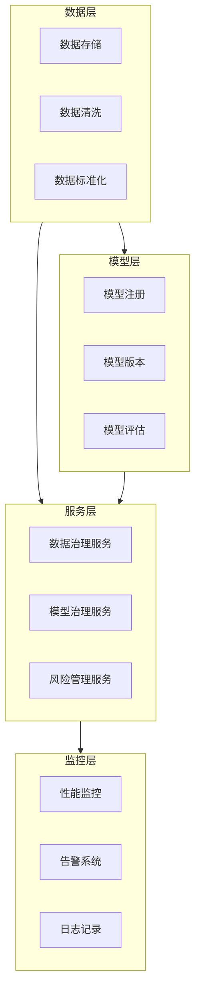

通过构建完善的治理平台，组织可以有效地提升AI系统的可信性，推动AI技术的健康、可持续发展。

### 数据治理

#### 4.1 数据质量与管理

数据治理是构建可信AI系统的基础，而数据质量是数据治理的核心。高质量的数据对于AI系统的训练、评估和部署至关重要。以下将详细介绍数据质量管理和数据生命周期的关键步骤。

##### 4.1.1 数据清洗

数据清洗是数据质量管理的重要环节，旨在识别和纠正数据集中的错误、不一致性和缺失值。数据清洗通常包括以下步骤：

- **异常值处理**：识别和处理数据集中的异常值，例如，超出合理范围的数值。
- **缺失值填充**：处理缺失值，可以通过均值、中位数等方法进行填充，或使用机器学习算法进行预测。
- **重复数据处理**：识别和去除数据集中的重复记录，确保数据的一致性。

以下是一个数据清洗流程的Mermaid流程图：

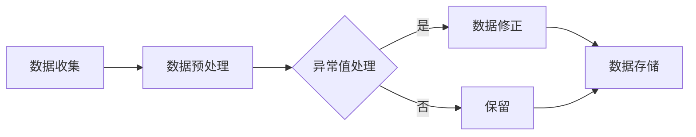

##### 4.1.2 数据标准化

数据标准化是为了确保数据在不同系统之间的一致性和可比性。数据标准化包括以下方面：

- **数据格式转换**：将不同数据源的数据格式转换为统一的格式，例如，将不同数据源的日期格式转换为YYYY-MM-DD。
- **数据范围规范化**：将不同数据源的数据范围规范化，使其在相同的尺度上可比较。
- **数据单位转换**：将不同数据源的数据单位转换为统一的单位，例如，将不同来源的长度单位转换为米。

以下是一个数据标准化流程的Mermaid流程图：


##### 4.1.3 数据安全与隐私

数据安全与隐私是数据治理中的关键方面，确保数据在存储、处理和传输过程中的安全性。以下措施可以保障数据的安全与隐私：

- **数据加密**：对敏感数据进行加密，防止未授权访问。
- **访问控制**：设置访问权限，确保只有授权用户可以访问特定数据。
- **数据备份**：定期进行数据备份，防止数据丢失。
- **隐私保护**：在数据处理过程中，采用去标识化和匿名化技术，保护个人隐私。

以下是一个数据安全与隐私保障流程的Mermaid流程图：


通过以上步骤，可以有效地提升数据的质量，确保数据在AI系统中的可靠性和有效性，为构建可信AI系统奠定坚实基础。

#### 4.2 AI模型治理

AI模型治理是构建可信AI系统的关键环节，涵盖了模型注册、版本管理、性能评估和解释性提升等方面。以下将详细探讨这些核心内容。

##### 4.2.1 模型注册与版本管理

模型注册是确保AI模型在整个生命周期中得到有效管理和追踪的重要步骤。模型注册包括以下方面：

- **模型元数据记录**：记录模型的详细信息，如模型名称、模型类型、创建时间、创建者等。
- **模型注册流程**：定义模型注册的流程和标准，确保每个模型都经过严格的审核和验证。
- **版本管理**：为每个模型版本分配唯一标识符，记录模型的每次更新和变更，确保版本的可追溯性。

以下是一个模型注册与版本管理流程的Mermaid流程图：

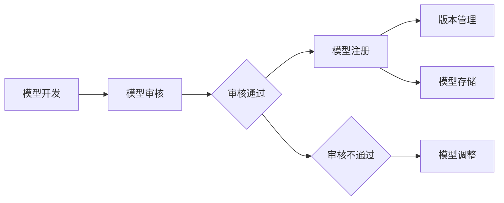

##### 4.2.2 模型性能评估

模型性能评估是确保AI模型质量和有效性的关键步骤。性能评估通常包括以下几个方面：

- **测试数据集**：使用专门设计的测试数据集对模型进行评估，测试数据集应具有代表性和多样性。
- **评估指标**：选择合适的评估指标，如准确率、召回率、F1分数等，以全面评估模型的表现。
- **交叉验证**：通过交叉验证方法，对模型进行多次评估，提高评估结果的可靠性和准确性。

以下是一个模型性能评估流程的Mermaid流程图：


##### 4.2.3 模型解释性提升

模型解释性提升是增强用户对AI系统信任的关键。以下方法可以提升模型解释性：

- **特征重要性分析**：通过分析特征的重要性，帮助用户理解模型决策的依据。
- **决策路径可视化**：使用可视化工具，展示模型决策的过程和路径，提高用户对模型决策的理解。
- **LIME（Local Interpretable Model-agnostic Explanations）方法**：使用LIME方法为每个预测结果生成解释，帮助用户理解模型的决策过程。

以下是一个模型解释性提升流程的Mermaid流程图：

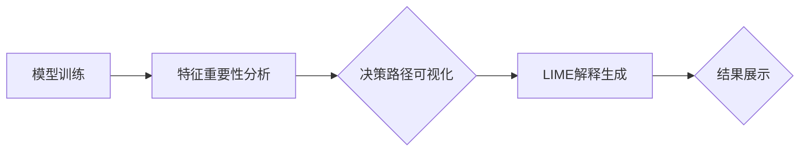

通过模型注册与版本管理、模型性能评估和模型解释性提升，可以确保AI模型在可信性方面的全面提升，为构建可信AI系统提供坚实保障。

#### 4.3 风险管理与合规

风险管理与合规是构建可信AI系统的重要环节，旨在识别、评估和控制与AI系统相关的各种风险，确保系统的合规性和可持续性。以下将详细介绍风险管理的核心步骤和合规性的关键要素。

##### 4.3.1 法律法规遵循

法律法规是构建可信AI系统的基本要求，遵循相关法律法规是确保系统合规性的首要任务。以下措施可以帮助组织遵循法律法规：

- **合规性评估**：定期对AI系统进行合规性评估，确保其符合相关法律法规的要求。
- **法律法规培训**：对相关人员开展法律法规培训，提高其对合规性的认识和意识。
- **合规性文档**：建立完善的合规性文档，包括法律法规遵循的说明、合规性流程和操作指南等。

以下是一个合规性评估流程的Mermaid流程图：

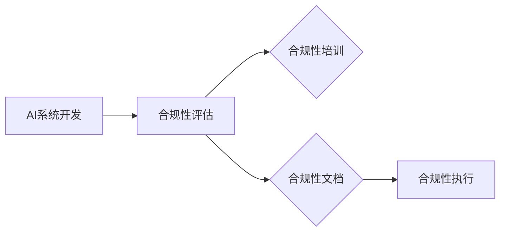

##### 4.3.2 风险评估与控制

风险评估与控制是确保AI系统在运行过程中风险可控的重要措施。以下步骤可以有效地进行风险评估与控制：

- **风险识别**：识别与AI系统相关的各种潜在风险，包括技术风险、数据风险、操作风险等。
- **风险分析**：对识别出的风险进行分析，评估其可能性和影响，确定优先级。
- **风险控制**：制定相应的风险控制措施，包括风险规避、风险降低和风险接受等策略。

以下是一个风险评估与控制流程的Mermaid流程图：


通过法律法规的遵循和风险评估与控制，组织可以确保AI系统的合规性和可持续性，为构建可信AI系统提供坚实保障。

### 技术架构设计

#### 5.1 技术架构概述

技术架构设计是构建可信AI系统的关键环节，它决定了系统的稳定性、扩展性和可维护性。在技术架构设计中，我们需要综合考虑系统的功能需求、性能要求、安全性需求和可维护性需求，选择合适的架构模式和设计策略。

#### 5.1.1 云原生架构

云原生架构是一种基于云计算和分布式系统的设计理念，强调系统的弹性、可扩展性和自动化。云原生架构的核心特点是微服务架构、容器化和自动化管理。

- **微服务架构**：将系统划分为多个独立的、松耦合的微服务，每个微服务负责特定的功能。这种架构使得系统更加灵活和可扩展，便于开发和维护。
- **容器化**：使用容器（如Docker）将应用程序及其依赖环境打包在一起，确保在不同的环境中都能一致地运行。
- **自动化管理**：通过自动化工具（如Kubernetes）实现服务的自动化部署、扩展和管理，提高系统的可靠性和效率。

以下是一个云原生架构的Mermaid架构图：


#### 5.1.2 微服务架构

微服务架构是一种将复杂系统拆分成多个独立、可扩展的小服务的设计方法。每个微服务负责特定的功能，可以通过RESTful API或其他通信协议进行交互。

- **服务自治**：每个微服务拥有自己的数据库、配置和部署环境，实现服务自治，降低服务之间的依赖。
- **松耦合**：微服务之间通过轻量级的通信协议进行通信，松耦合设计提高了系统的灵活性和可扩展性。
- **独立部署**：每个微服务可以独立部署和升级，不影响其他服务的运行，提高了系统的可维护性。

以下是一个微服务架构的Mermaid类图：

```mermaid
classDiagram
    AI服务[AI服务] <<uses>> 数据服务[数据服务]
    AI服务 <<uses>> 监控服务[监控服务]
    数据服务[数据服务] <<uses>> 存储服务[存储服务]
    监控服务[监控服务] <<uses>> 日志服务[日志服务]
```

#### 5.1.3 容器化与容器编排

容器化是将应用程序及其依赖环境打包在一个轻量级的容器中的技术，确保在不同的环境中都能一致地运行。容器编排是通过自动化工具（如Kubernetes）管理和调度容器化应用程序的过程。

- **容器化**：使用Docker等容器化工具，将应用程序和其依赖环境打包成一个容器镜像，实现应用程序的标准化部署。
- **容器编排**：使用Kubernetes等容器编排工具，实现容器的自动化部署、扩展和管理，提高系统的可靠性和效率。

以下是一个容器化与容器编排的Mermaid架构图：

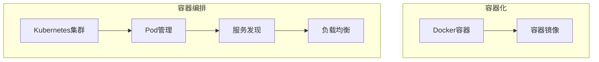

通过云原生架构、微服务架构和容器化与容器编排，可以构建一个高效、灵活和可维护的可信AI系统。

#### 5.2 系统功能设计

系统功能设计是构建可信AI系统的关键环节，它决定了系统是否能够满足业务需求和用户期望。以下将详细介绍数据处理模块、模型训练与部署模块、监控与告警模块的设计。

##### 5.2.1 数据处理模块

数据处理模块是系统功能设计的基础，负责从数据源收集、清洗、转换和存储数据。以下是数据处理模块的核心功能：

- **数据收集**：从各种数据源（如数据库、文件系统、实时数据流等）收集数据，确保数据的完整性和实时性。
- **数据清洗**：对收集到的数据进行清洗，去除错误、异常和重复数据，保证数据的质量。
- **数据转换**：将清洗后的数据转换为适合模型训练的格式，例如，进行数值化、标准化和归一化处理。
- **数据存储**：将转换后的数据存储到数据库或数据湖中，方便后续的模型训练和数据分析。

以下是一个数据处理模块的Mermaid流程图：

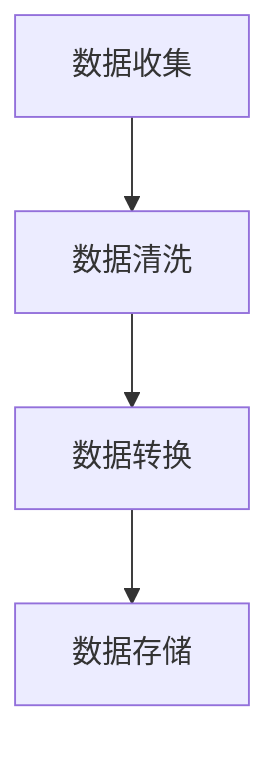

##### 5.2.2 模型训练与部署模块

模型训练与部署模块是系统的核心功能，负责训练、评估和部署AI模型。以下是模型训练与部署模块的核心功能：

- **模型训练**：使用训练数据集对AI模型进行训练，通过优化算法和调整超参数，提高模型的性能。
- **模型评估**：使用验证数据集对训练完成的模型进行评估，选择最优模型进行部署。
- **模型部署**：将训练完成的模型部署到生产环境中，使其能够实时处理业务数据，提供预测和决策支持。

以下是一个模型训练与部署模块的Mermaid流程图：

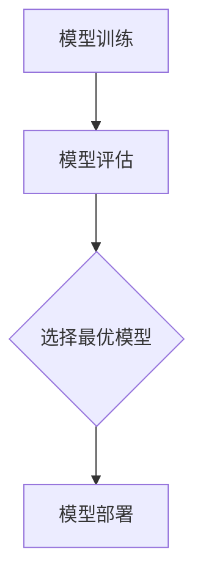

##### 5.2.3 监控与告警模块

监控与告警模块是确保系统稳定运行的重要保障，负责实时监控系统的运行状态，并在出现异常时触发告警。以下是监控与告警模块的核心功能：

- **系统监控**：实时监控系统的CPU、内存、磁盘等资源使用情况，确保系统资源合理分配。
- **性能监控**：监控系统的处理性能，包括响应时间、吞吐量等关键指标，确保系统性能满足业务需求。
- **告警系统**：在系统出现异常时，及时触发告警，通知相关人员处理，确保系统稳定运行。

以下是一个监控与告警模块的Mermaid流程图：

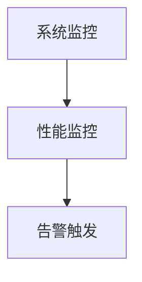

通过上述功能模块的设计，可以构建一个高效、稳定和可维护的可信AI系统，满足业务需求和用户期望。

#### 5.3 系统架构设计

系统架构设计是构建可信AI系统的关键步骤，它决定了系统的性能、可扩展性和可维护性。以下将从系统架构设计原则、系统架构图和系统接口设计等方面详细描述系统架构设计。

##### 5.3.1 系统架构设计原则

系统架构设计应遵循以下原则：

- **模块化**：将系统划分为多个独立的模块，每个模块负责特定的功能，实现模块自治和松耦合。
- **分布式**：采用分布式架构，将系统部署在多个节点上，提高系统的可扩展性和容错能力。
- **可扩展性**：设计可扩展的架构，支持系统的水平扩展和垂直扩展，满足业务增长的需求。
- **高可用性**：设计高可用的架构，确保系统在遇到故障时能够快速恢复，降低系统的停机时间。
- **安全性**：设计安全的架构，包括数据加密、访问控制、安全审计等，保护系统的数据安全和隐私。

##### 5.3.2 系统架构图

以下是一个可信AI系统的架构图：

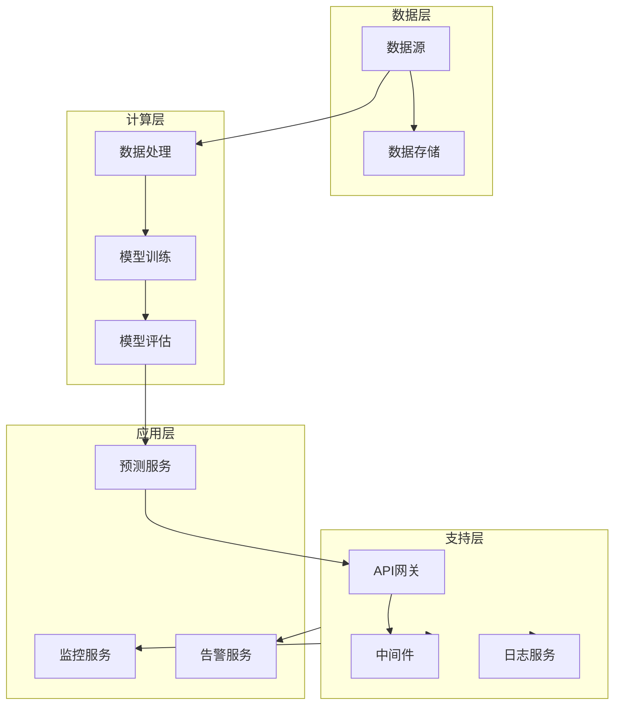

此架构图包括数据层、计算层、应用层和支持层四个主要部分。数据层负责数据的收集、存储和管理；计算层负责数据处理、模型训练和评估；应用层负责提供预测服务和监控告警功能；支持层负责系统的API网关、中间件和日志服务。

##### 5.3.3 系统接口设计

系统接口设计是系统架构设计的重要组成部分，它决定了系统内部模块之间的通信方式。以下是一个可信AI系统的接口设计：

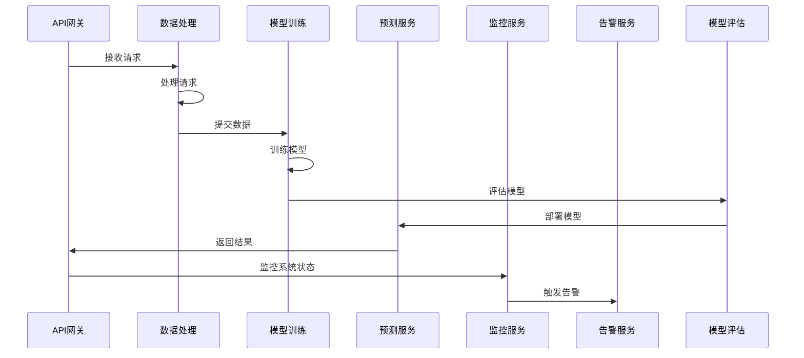

此接口设计描述了API网关、数据处理、模型训练、预测服务、监控服务和告警服务之间的交互过程，确保系统各模块之间的通信畅通。

通过以上系统架构设计，可以构建一个高效、稳定、可扩展和安全的可信AI系统，满足业务需求和用户期望。

### 实践指南

#### 6.1 实践案例1：构建数据治理策略

构建数据治理策略是确保AI系统可靠性和可信性的关键步骤。以下将详细介绍构建数据治理策略的过程，包括环境安装与配置、数据治理工具使用和案例分析。

##### 6.1.1 环境安装与配置

首先，需要搭建一个数据治理环境。以下是在Linux系统中安装和配置数据治理环境的基本步骤：

1. **安装Python环境**：
   ```bash
   sudo apt update
   sudo apt install python3 python3-pip
   ```
2. **安装必要的数据处理库**：
   ```bash
   pip3 install numpy pandas sklearn
   ```
3. **安装Mermaid**：
   ```bash
   pip3 install mermaid-python
   ```

##### 6.1.2 数据治理工具使用

在安装完Python环境和数据治理工具后，可以使用以下工具进行数据治理：

1. **数据清洗**：
   ```python
   import pandas as pd
   df = pd.read_csv('data.csv')  # 读取数据
   df.dropna(inplace=True)  # 删除缺失值
   df.replace(['unknown'], [None], inplace=True)  # 替换异常值
   ```
2. **数据标准化**：
   ```python
   from sklearn.preprocessing import StandardScaler
   scaler = StandardScaler()
   df_scaled = scaler.fit_transform(df)
   ```

##### 6.1.3 案例分析

以下是一个数据治理的案例分析：

- **数据源**：假设我们有一个包含用户购买行为的CSV文件，其中包含用户的ID、年龄、收入、购买次数和购买金额等字段。
- **数据清洗**：
  - 删除包含缺失值的记录。
  - 对收入和购买金额进行数值化处理。
  - 将年龄和购买次数进行标准化处理。
- **数据标准化**：
  - 使用StandardScaler对收入和购买金额进行标准化处理，使得这些特征的均值和标准差变为0和1。

以下是一个Mermaid流程图，展示了数据清洗和标准化的流程：

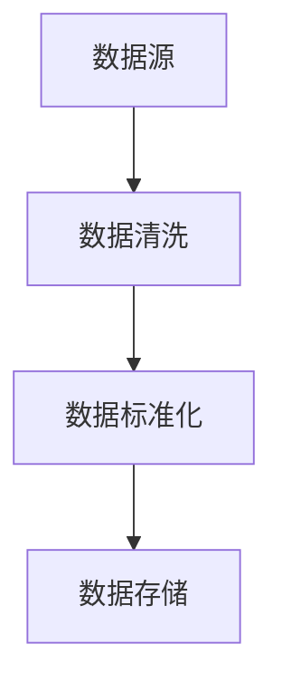

通过构建数据治理策略，我们可以确保数据的质量和一致性，为后续的模型训练和评估奠定基础。

#### 6.2 实践案例2：提升AI模型可解释性

提升AI模型的可解释性是增强用户信任和合规性的关键。以下将详细介绍如何提升AI模型的可解释性，包括算法原理、Python源代码实现、数学模型和公式的讲解，以及案例分析。

##### 6.2.1 算法原理与流程图

提升AI模型可解释性的常见方法包括：

- **特征重要性分析**：通过分析模型中各个特征的重要性，帮助用户理解模型决策的依据。
- **决策路径可视化**：将模型决策的过程和路径以可视化的形式呈现，增强用户对模型决策的理解。
- **局部可解释性方法**：如LIME（Local Interpretable Model-agnostic Explanations），为每个预测结果生成解释。

以下是一个LIME算法的流程图：

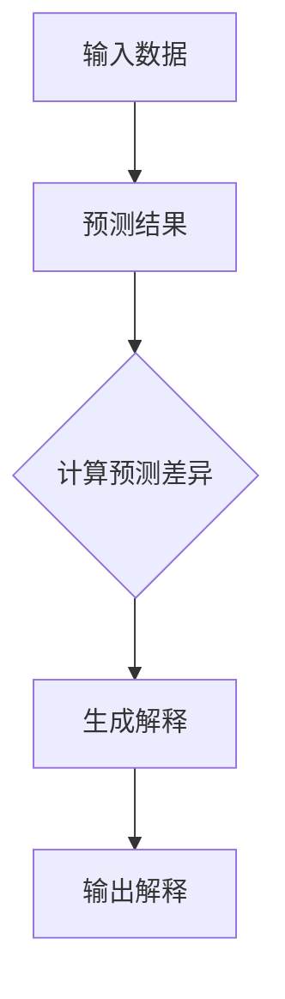

##### 6.2.2 Python源代码实现

以下是一个使用LIME算法的Python源代码示例：

```python
import numpy as np
import lime
from sklearn.datasets import load_iris
from sklearn.linear_model import LogisticRegression

# 加载鸢尾花数据集
iris = load_iris()
X = iris.data
y = iris.target
model = LogisticRegression().fit(X, y)

# 选择样本
sample_idx = 10
sample = X[sample_idx]

# 初始化LIME解释器
explainer = lime.lime_tabular.LimeTabularExplainer(X, feature_names=iris.feature_names, class_names=iris.target_names, model=model)

# 生成解释
exp = explainer.explain_instance(sample, model.predict, num_features=5)

# 输出解释
exp.show_in_notebook(show_table=True)
```

##### 6.2.3 数学模型与公式

LIME算法的核心是局部线性模型，其数学模型如下：

$$
\widehat{y}(x) = \frac{\sum_{i=1}^n w_i f_i(x)}{\sum_{i=1}^n w_i}
$$

其中，$w_i$是权重，$f_i(x)$是特征$i$在样本$x$上的值。

##### 6.2.4 案例分析

以下是一个案例分析：

- **数据集**：使用鸢尾花数据集，其中包含三个特征（花瓣长度、花瓣宽度和花萼长度）和三个类别（鸢尾花、变色鸢尾和向日葵）。
- **模型**：使用逻辑回归模型进行分类。
- **样本**：选择第10个样本进行解释。

通过LIME算法，我们生成了该样本的局部线性模型解释，帮助用户理解模型是如何根据特征值做出预测的。

#### 6.3 实践案例3：保障AI系统安全性

保障AI系统安全性是确保系统可靠性和用户隐私的关键。以下将详细介绍如何保障AI系统安全性，包括安全策略制定、安全工具使用和案例分析。

##### 6.3.1 安全策略制定

制定AI系统安全策略是保障系统安全的第一步。以下是一些基本的安全策略：

- **数据加密**：对存储和传输的数据进行加密，防止未授权访问。
- **访问控制**：通过身份验证和权限管理，确保只有授权用户可以访问系统资源。
- **漏洞扫描**：定期对系统进行漏洞扫描，及时发现和修复安全漏洞。
- **安全审计**：对系统进行定期安全审计，确保系统符合安全标准和法规要求。

以下是一个安全策略的Mermaid流程图：

```mermaid
graph TD
    A[数据加密] --> B[访问控制]
    B --> C[漏洞扫描]
    C --> D[安全审计]
```

##### 6.3.2 安全工具使用

以下是一些常用的安全工具：

- **加密工具**：如AES（Advanced Encryption Standard）和RSA（Rivest-Shamir-Adleman）。
- **访问控制工具**：如LDAP（Lightweight Directory Access Protocol）和OAuth2。
- **漏洞扫描工具**：如Nessus和OpenVAS。
- **安全审计工具**：如OWASP ZAP（Zed Attack Proxy）和GRC（Governance, Risk, and Compliance）。

以下是一个安全工具使用的Mermaid流程图：

```mermaid
graph TD
    A[加密工具] --> B[访问控制工具]
    B --> C[漏洞扫描工具]
    C --> D[安全审计工具]
```

##### 6.3.3 案例分析

以下是一个案例分析：

- **系统**：一个在线购物平台。
- **安全威胁**：恶意用户尝试通过SQL注入攻击获取用户数据。
- **应对措施**：使用参数化查询和输入验证，防止SQL注入攻击。同时，定期进行安全审计和漏洞扫描，及时发现和修复安全问题。

通过制定安全策略和使用安全工具，可以有效地保障AI系统的安全性，防止数据泄露和系统攻击。

### 最佳实践与注意事项

#### 7.1 最佳实践

在构建可信AI系统的过程中，遵循以下最佳实践可以帮助提高系统的可信性：

1. **数据治理**：确保数据的质量、完整性和一致性，采用数据清洗、数据标准化和数据加密等技术。
2. **AI模型治理**：对AI模型进行严格的注册、版本管理和性能评估，提升模型的可靠性和可解释性。
3. **风险管理**：制定全面的安全策略，定期进行风险评估和漏洞扫描，确保系统的合规性和安全性。

#### 7.2 注意事项

在构建可信AI系统的过程中，需要注意以下事项：

1. **数据隐私保护**：在数据处理和存储过程中，严格遵循数据隐私保护法规，确保用户数据的安全和隐私。
2. **系统安全性**：采用多层次的安全措施，包括数据加密、访问控制和漏洞扫描，确保系统的安全性。
3. **持续监控与维护**：建立完善的监控与告警系统，对系统的运行状态进行实时监控，及时发现和解决问题。

通过遵循最佳实践和注意事项，可以有效地提高AI系统的可信性，保障系统的稳定运行。

### 拓展阅读

为了深入理解构建可信AI系统的相关理论和实践，读者可以参考以下推荐资源：

#### 8.1 相关书籍推荐

1. **《人工智能：一种现代方法》（第三版）》** - Stuart Russell & Peter Norvig
   - 本书是人工智能领域的经典教材，涵盖了人工智能的基本概念、技术方法和应用实例，对于理解AI系统的构建和可信性具有重要参考价值。

2. **《数据治理实践指南：成功实施数据治理框架的策略与方法》** - Steven M. Miller
   - 本书详细介绍了数据治理的理论和实践方法，包括数据质量管理、数据安全性和数据生命周期管理，对于构建可信AI系统中的数据治理部分提供了有益的指导。

3. **《可信人工智能：理论与实践》** - 吴波，彭宇宁
   - 本书从理论和实践两个层面探讨了可信人工智能的各个方面，包括可靠性、可解释性、公平性和安全性，对于理解可信AI系统的构建具有重要参考价值。

#### 8.2 学术论文推荐

1. **“On the Use of Machine Learning for Cybersecurity: Current Status and Future Directions”** - Li, X., Chen, H., He, Y., & Jajodia, S.
   - 本文综述了机器学习在网络安全中的应用，包括AI系统的安全性和可解释性问题，为构建可信AI系统提供了宝贵的实践经验和理论指导。

2. **“Explainable AI: A Review of Progress in Understanding, Methods and Application”** - Guidotti, R., Monreale, A., Pedreschi, D., & Visconti, I.
   - 本文详细介绍了可解释AI的研究进展、方法和应用实例，为提升AI模型的可解释性提供了丰富的参考。

3. **“Data Privacy: The Challenges of Balancing Privacy and Utility in Data Sharing”** - Yang, H., Chen, H., & Liu, H.
   - 本文探讨了数据隐私保护在数据共享中的挑战和解决方案，对于确保AI系统中的数据隐私具有重要参考价值。

#### 8.3 行业报告推荐

1. **“AI in the Enterprise: 2021 Global Market Analysis and Trends”** - International Data Corporation (IDC)
   - IDC的报告分析了全球企业中AI技术的应用现状和发展趋势，为构建可信AI系统提供了行业视角。

2. **“The State of AI for Business 2021”** - McKinsey & Company
   - McKinsey的报告详细介绍了AI技术在企业中的应用案例和最佳实践，对于理解和构建可信AI系统具有重要指导意义。

通过阅读这些书籍、论文和行业报告，读者可以更深入地了解构建可信AI系统的关键理论和实践，为实际项目提供有力的支持和指导。

### 总结与展望

可信AI系统的构建是现代人工智能领域中的关键课题。本文系统地探讨了可信AI系统的核心概念、治理平台的建设、技术架构设计、数据治理、模型治理、风险管理与合规、实践指南以及最佳实践与注意事项。通过对这些方面的深入分析，我们认识到构建可信AI系统不仅需要技术手段，还需要在数据治理、模型可解释性、系统安全性等方面进行全面的规划和实施。

未来，随着人工智能技术的不断发展，可信AI系统的重要性将更加凸显。以下是对未来研究的展望：

1. **数据隐私与安全**：随着数据隐私和安全问题的日益突出，如何在确保数据隐私的同时提升AI系统的可信性，是一个亟待解决的问题。未来的研究可以集中在开发新型的加密算法和隐私保护技术，以及构建自适应的隐私保护机制。

2. **模型可解释性**：提高AI模型的可解释性是增强用户信任和合规性的关键。未来的研究可以探索更多直观、易懂的可解释性方法，以及开发工具和平台，帮助用户更好地理解和解释AI模型的决策过程。

3. **跨领域应用**：可信AI系统在各个领域的应用将不断拓展。未来的研究可以聚焦于特定行业中的AI系统构建，如医疗、金融、交通等，探索如何在这些领域中实现可信AI系统的最佳实践。

4. **标准化与法规**：随着AI技术的广泛应用，标准化和法规的制定显得尤为重要。未来的研究可以关注于推动AI技术标准化，建立完善的法规体系，确保AI系统的合法合规运行。

通过持续的研究和创新，我们有望构建更加可靠、透明、安全的AI系统，推动人工智能技术的健康发展，为社会带来更多福祉。

