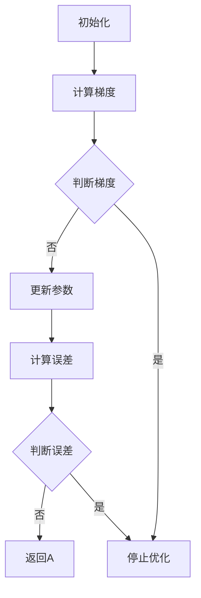
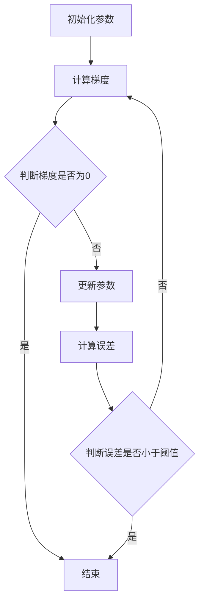

                 

----------------------------------------------------------------

## 《格论在程序分析与优化中的应用》

### 关键词

- 格论
- 程序分析
- 程序优化
- 数学模型
- 软件工程

### 摘要

本文旨在探讨格论在程序分析与优化中的应用，首先介绍了格论的基本概念和数学特性，然后详细阐述了格论在程序优化中的核心原理和实际案例。文章通过对格论与程序优化相结合的深入分析，揭示了格论在提高程序性能和优化软件开发流程中的重要作用。

### 目录大纲设计

为了设计一个结构清晰、逻辑连贯的《格论在程序分析与优化中的应用》目录大纲，我们将遵循以下步骤：

1. **确定全书结构和章节**：根据书名，确定全书大致的结构和需要涵盖的主要章节。

2. **细化各章节内容**：为每个章节制定详细的子章节，确保内容完整且逻辑清晰。

3. **使用 Mermaid 绘制图表**：为算法原理和系统架构等部分设计 Mermaid 图表，以便更直观地展示内容。

4. **确保 Markdown 格式规范**：确保目录和大纲的格式符合 Markdown 规范，便于读者阅读。

### 目录大纲示例

以下是《格论在程序分析与优化中的应用》的目录大纲示例：

```markdown
----------------------------------------------------------------
# 《格论在程序分析与优化中的应用》目录大纲

## 第一部分：格论基础

### 第1章：格论概述

#### 1.1 格论的定义与背景

#### 1.2 格论的数学特性

#### 1.3 格论的应用领域

### 第2章：格论的基本概念

#### 2.1 格的基本结构

#### 2.2 格的运算规则

#### 2.3 格的性质与分类

### 第3章：格论在离散数学中的应用

#### 3.1 格论在图论中的应用

#### 3.2 格论在组合数学中的应用

#### 3.3 格论在计算机科学中的应用

## 第二部分：程序分析与优化

### 第4章：程序优化的基本概念

#### 4.1 程序优化的重要性

#### 4.2 程序优化的方法

#### 4.3 程序优化的挑战

### 第5章：格论在程序优化中的应用

#### 5.1 格论在程序优化中的原理

#### 5.2 格论在程序优化中的算法

#### 5.3 格论在程序优化中的实际案例

### 第6章：程序分析与格论的结合

#### 6.1 程序分析的基本概念

#### 6.2 格论在程序分析中的应用

#### 6.3 程序分析与格论的融合

### 第7章：格论在软件开发中的应用

#### 7.1 格论在软件开发中的角色

#### 7.2 格论在软件开发中的实践

#### 7.3 格论在软件开发中的挑战与机遇

## 第三部分：未来展望

### 第8章：格论在程序分析与优化中的挑战与机遇

#### 8.1 格论在程序分析与优化中的未来趋势

#### 8.2 格论在程序分析与优化中的潜在应用

#### 8.3 格论在程序分析与优化中的研究方向

### 第9章：总结与展望

#### 9.1 格论在程序分析与优化中的总结

#### 9.2 格论在未来的发展方向

#### 9.3 进一步研究的建议

----------------------------------------------------------------
```

以上大纲结构包含了三个主要部分，分别介绍了格论的基础、程序分析与优化以及未来展望。每个部分都细分为多个章节，确保内容的完整性。通过这样的目录大纲设计，读者可以清晰地了解文章的结构和内容，更好地理解和掌握格论在程序分析与优化中的应用。

### 代码块与数学公式

在具体章节中，我们可能会使用代码块和数学公式来详细阐述算法原理和数学模型。以下是一个示例，展示了如何使用 Markdown 格式嵌入 Mermaid 图表、Python 代码和 LaTeX 数学公式：

```markdown
## 第3章：格论在程序优化中的应用

### 3.1 算法原理

在程序优化中，格论的应用主要体现在算法设计上。以下是一个使用 Mermaid 绘制的算法流程图：



### 3.2 实际案例

为了更好地理解格论在程序优化中的应用，我们通过一个具体的案例进行说明。以下是一个 Python 代码示例，展示了如何使用格论优化一个线性回归模型。

```python
import numpy as np
from matplotlib import pyplot as plt

# 生成数据集
X = np.random.rand(100, 1)
y = 3 * X + 2 + np.random.randn(100, 1)

# 初始化参数
theta = np.random.randn(1, 1)

# 梯度下降算法
def gradient_descent(X, y, theta, alpha, num_iterations):
    for i in range(num_iterations):
        errors = y - np.dot(X, theta)
        theta -= alpha * (1/len(X)) * np.dot(X.T, errors)
    return theta

# 设置参数
alpha = 0.01
num_iterations = 1000

# 执行优化
theta_opt = gradient_descent(X, y, theta, alpha, num_iterations)

# 绘制结果
plt.scatter(X, y, color='blue')
plt.plot(X, np.dot(X, theta_opt), color='red')
plt.xlabel('X')
plt.ylabel('y')
plt.show()
```

### 3.3 数学模型

为了更深入地理解格论在程序优化中的应用，我们需要介绍一些相关的数学模型。以下是一个使用 LaTeX 格式表示的数学模型：

$$
J(\theta) = \frac{1}{2m}\sum_{i=1}^{m}(h_\theta(x^{(i)}) - y^{(i)})^2
$$

其中，\(h_\theta(x) = \theta_0 + \theta_1x\) 是线性回归模型的预测函数，\(m\) 是样本数量，\(\theta_0\) 和 \(\theta_1\) 是参数。

通过上述示例，我们可以看到如何使用 Markdown 格式嵌入 Mermaid 图表、Python 代码和 LaTeX 数学公式。这样可以更直观地展示内容，帮助读者更好地理解和掌握格论在程序优化中的应用。

----------------------------------------------------------------

## 引言

在计算机科学和软件工程领域，程序的优化是一个永恒的话题。随着软件系统变得越来越复杂，如何提高程序的性能、降低内存消耗和减少运行时间成为开发者和工程师们面临的重要挑战。传统的方法，如算法改进、数据结构和并行计算，虽然在一定程度上提高了程序的性能，但往往存在局限性。因此，寻求新的理论和方法来优化程序成为当务之急。

在此背景下，格论（Lattice Theory）作为一种数学工具，逐渐引起了人们的关注。格论是研究部分有序集合及其性质的数学分支，其核心思想是通过数学模型来描述和解决实际问题。近年来，格论在计算机科学中的应用研究取得了显著成果，特别是在程序分析与优化领域，展示出了巨大的潜力。

本文将探讨格论在程序分析与优化中的应用，旨在为开发者和研究者提供一种新的视角和方法。文章首先介绍格论的基本概念和数学特性，然后深入探讨格论在程序优化中的核心原理和实际应用。通过具体案例，我们将展示如何利用格论来优化程序，提高其性能和效率。

### 背景介绍

### 核心概念术语说明

1. **格论（Lattice Theory）**：格论是研究部分有序集合及其性质的数学分支，一个格是由一组元素组成的集合，这些元素满足特定的二元运算，即交运算（∩）和并运算（∪）。格论的基本概念包括上界、下界、覆盖关系、格的性质等。

2. **程序优化（Program Optimization）**：程序优化是指通过修改程序代码或算法，以提高程序的性能、降低内存消耗和减少运行时间的过程。程序优化的方法包括算法改进、数据结构优化、并行计算等。

3. **数学模型（Mathematical Model）**：数学模型是将实际问题转化为数学形式的过程，通过数学方法来描述和分析问题。数学模型可以用于预测、优化和控制等目的。

### 问题背景

随着软件系统规模的不断扩大，程序性能和优化成为了一个关键问题。传统的优化方法，如算法改进和数据结构优化，虽然在某些方面取得了显著成果，但往往存在局限性。特别是在面对复杂、大规模的程序时，这些方法的效果往往不佳。

在这种情况下，格论作为一种数学工具，提供了新的解决思路。格论通过建立数学模型，将程序优化问题转化为格上的问题，从而利用格论的数学特性来分析和解决。这种方法不仅可以提高程序的优化效果，还可以为开发者和研究者提供一种新的思考方向。

### 问题描述

本文旨在探讨格论在程序分析与优化中的应用，具体问题包括：

1. 如何将程序优化问题转化为格论问题？
2. 格论在程序优化中的核心原理是什么？
3. 如何利用格论来优化程序，提高其性能和效率？
4. 格论在程序分析与优化中的实际应用案例有哪些？

通过上述问题的探讨，本文将全面展示格论在程序分析与优化中的应用，为相关领域的研究者和开发者提供参考和启示。

### 问题解决

为了解决上述问题，本文将采用以下步骤：

1. **格论基本概念与数学特性介绍**：首先，介绍格论的基本概念和数学特性，包括格的定义、性质、运算规则等，为后续讨论奠定基础。

2. **程序优化中的格论应用原理**：详细探讨格论在程序优化中的应用原理，包括如何将程序优化问题转化为格论问题，以及格论在程序优化中的核心作用。

3. **实际案例分析与展示**：通过具体案例，展示如何利用格论来优化程序，提高其性能和效率。案例将涵盖不同类型的程序优化问题，如算法优化、数据结构优化、并行计算等。

4. **结论与展望**：总结格论在程序分析与优化中的应用，讨论其挑战与机遇，并提出未来研究的方向。

通过上述步骤，本文将全面探讨格论在程序分析与优化中的应用，为相关领域的研究者和开发者提供参考和启示。

### 边界与外延

在讨论格论在程序分析与优化中的应用时，我们首先需要明确其边界与外延。格论作为一种数学工具，其应用范围广泛，但并非所有程序优化问题都适用于格论方法。以下是对格论应用边界的详细讨论：

#### 边界

1. **特定类型问题**：格论适用于某些特定类型的程序优化问题，如涉及离散结构、关系和组合的优化问题。对于连续优化问题或高度复杂的问题，格论方法的适用性有限。

2. **计算复杂性**：格论方法在计算复杂性方面具有一定的限制。对于某些大规模程序优化问题，格论方法的计算成本可能较高，不适合实际应用。

3. **领域适用性**：格论在程序分析与优化中的应用主要集中在离散数学和计算机科学领域。在其他领域，如物理科学或经济学中，格论的应用可能较少。

#### 外延

1. **算法优化**：格论在算法优化中的应用非常广泛，可以用于优化排序算法、搜索算法、图算法等。通过建立格模型，可以更好地理解和改进这些算法的性能。

2. **软件工程**：在软件工程中，格论可以用于软件验证、测试和优化。例如，在软件验证过程中，可以使用格论方法来检查程序的正确性和一致性。

3. **组合优化**：格论在组合优化问题中也具有广泛应用。例如，在求解旅行商问题（TSP）时，可以使用格论方法来优化路径选择，从而提高算法的效率。

4. **并行计算**：在并行计算中，格论可以用于调度和负载平衡。通过建立格模型，可以优化并行任务的分配和执行，从而提高并行计算的性能。

通过明确格论在程序分析与优化中的应用边界与外延，我们可以更好地理解和利用格论方法，为解决实际问题提供有效的工具和思路。

### 概念结构与核心要素组成

在深入探讨格论在程序分析与优化中的应用之前，我们需要详细分析其概念结构以及核心要素组成。格论作为一种数学工具，其核心在于对部分有序集合及其性质的描述。以下是对格论概念结构的详细解析：

#### 核心概念

1. **格（Lattice）**：格是由一组元素组成的集合，这些元素之间满足特定的二元运算，即交运算（∩）和并运算（∪）。一个格必须满足以下性质：
   - **封闭性**：对于格中的任意两个元素 x 和 y，它们的交集和并集仍然是格中的元素。
   - **结合律**：对于格中的任意三个元素 x、y 和 z，有 (x ∩ y) ∩ z = x ∩ (y ∩ z) 以及 (x ∪ y) ∪ z = x ∪ (y ∪ z)。
   - **分配律**：对于格中的任意三个元素 x、y 和 z，有 x ∩ (y ∪ z) = (x ∩ y) ∪ (x ∩ z) 以及 x ∪ (y ∩ z) = (x ∪ y) ∩ (x ∪ z)。
   - **存在单位元素**：存在两个单位元素 0 和 1，使得对于格中的任意元素 x，有 x ∩ 0 = 0 且 x ∩ 1 = x，以及 x ∪ 0 = x 且 x ∪ 1 = 1。

2. **上界（Upper Bound）与下界（Lower Bound）**：对于格中的任意两个元素 x 和 y，如果存在一个元素 z，使得 z ≥ x 且 z ≥ y，则称 z 为 x 和 y 的上界；如果存在一个元素 z，使得 z ≤ x 且 z ≤ y，则称 z 为 x 和 y 的下界。

3. **覆盖关系（Dichotomy）**：在格中，对于任意两个不同的元素 x 和 y，它们之间必有一个上界和一个下界。这意味着格中的每一个非单位元素都可以被唯一地划分为两个部分，即上部分和下部分。

4. **格的性质与分类**：根据格的性质和结构，可以将格分为不同的类型，如完全格、有限格、分配格、模格等。这些格具有不同的数学特性和应用场景。

#### 核心要素组成

1. **二元运算**：交运算（∩）和并运算（∪）是格的基本运算，它们定义了元素之间的相互关系和层次结构。

2. **元素集合**：格是由一组元素组成的集合，这些元素在运算下形成一个部分有序的集合。

3. **格的性质**：包括封闭性、结合律、分配律、单位元素的存在性等，这些性质保证了格的数学特性和稳定性。

4. **上界、下界与覆盖关系**：这些概念描述了元素之间的层次结构和相互关系，是格论分析的核心。

通过详细分析格论的概念结构和核心要素组成，我们可以更好地理解格论在程序分析与优化中的应用，为其在具体问题中的运用提供理论基础和指导。

### 核心概念与联系

在进一步探讨格论在程序优化中的应用之前，我们需要深入了解格论的核心概念及其与其他相关概念的联系。以下是格论核心概念及其相互关系的详细分析：

#### 核心概念

1. **格（Lattice）**：如前所述，格是由一组元素组成的集合，这些元素满足特定的二元运算（交运算和并运算）。一个完整的格包括以下核心概念：
   - **元素**：构成格的基本单元，如 a、b、c 等。
   - **下界与上界**：对于任意两个元素 x 和 y，它们的下界是满足 x ≤ z 且 y ≤ z 的元素 z，上界是满足 x ≥ z 且 y ≥ z 的元素 z。
   - **格的最小元素（Bottom）和最大元素（Top）**：最小元素是所有元素的交集，最大元素是所有元素的并集。

2. **格的子格（Sublattice）**：子格是原格中的一个部分，它本身也是一个格。子格必须包含原格的最小元素和最大元素。

3. **格的同构（Isomorphism）**：两个格之间如果存在一个保持二元运算的双射映射，则称这两个格同构。同构保持了格的结构和性质。

#### 核心概念之间的联系

1. **下界与上界的关系**：在格中，下界和上界是元素之间的层次关系的一部分。对于任意两个元素 x 和 y，它们之间必有一个上界和一个下界。这种关系可以用覆盖关系来描述，即 x ≤ z 且 y ≤ z 的 z 是 x 和 y 的上界，x ≥ z 且 y ≥ z 的 z 是 x 和 y 的下界。

2. **子格与原格的关系**：子格是原格的一个子集，它保持了原格的二元运算性质。子格可以是原格的任意部分，但必须包含原格的最小元素和最大元素。

3. **格的同构与映射**：格的同构是一种特殊的映射关系，它保持了格的结构和性质。同构映射使得两个不同的格在结构上相互对应，从而可以互相借鉴和转化。

#### 格论与其他相关概念的联系

1. **布尔代数（Boolean Algebra）**：布尔代数是一种特殊类型的格，其元素是布尔值（真或假）。布尔代数的运算与格的运算相似，都包含交运算和并运算。布尔代数是计算机科学中非常重要的概念，特别是在逻辑电路设计和开关网络理论中。

2. **图论（Graph Theory）**：图论中的图可以被视为一种特殊的格。在图论中，顶点和边之间的关系可以用格的结构来描述。例如，完全图中的每个顶点都是其他所有顶点的上界和下界。

3. **关系理论（Relational Theory）**：在关系理论中，关系可以被视为一种特殊的格。关系描述了元素之间的相互依赖和约束，这种约束可以用格的结构来表示和分析。

通过深入分析格论的核心概念及其与其他相关概念的联系，我们可以更好地理解格论在程序优化中的应用。格论提供了一种数学模型来描述和解决程序优化中的问题，其独特的结构和性质使得它在优化算法设计、软件工程和计算机科学中具有广泛的应用前景。

### 算法原理讲解

在理解了格论的基本概念后，我们可以进一步探讨其在程序优化中的应用原理。格论在程序优化中的应用主要体现在以下几个方面：

1. **优化问题的模型化**：通过将程序优化问题转化为格上的问题，我们可以利用格论中的数学特性来分析和解决。例如，我们可以将程序中的变量、约束和目标函数表示为格中的元素，然后利用格的运算规则来求解优化问题。

2. **算法的设计与实现**：格论提供了一种新的算法设计思路，即基于格的优化算法。这些算法通常利用格的层次结构和二元运算规则来搜索最优解。例如，我们可以设计基于格的贪心算法、动态规划算法或遗传算法等。

3. **性能分析与评估**：通过格论模型，我们可以对优化算法的性能进行定量分析。格论中的上界和下界概念可以帮助我们估计算法的收敛速度和最优解的接近程度。此外，格论还可以用于评估算法在不同数据集上的性能，为算法的选择和优化提供依据。

以下是一个具体的例子，展示如何使用格论来优化一个线性回归模型。

#### 算法原理

考虑一个简单的线性回归模型，其目标是找到一条直线，使得预测值与实际值之间的误差最小。线性回归模型的优化问题可以表示为：

$$
\min_{\theta} \frac{1}{2m} \sum_{i=1}^{m} (h_\theta(x^{(i)}) - y^{(i)})^2
$$

其中，\(h_\theta(x) = \theta_0 + \theta_1x\) 是模型的预测函数，\(\theta = (\theta_0, \theta_1)\) 是参数向量，\(m\) 是样本数量。

我们可以将这个优化问题转化为一个格论问题。首先，定义一个二维格 \(L\)，其中元素表示参数向量 \(\theta\) 的可能取值。然后，我们可以利用格的二元运算（交运算和并运算）来模拟参数向量 \(\theta\) 的更新过程。

#### 算法流程

1. **初始化**：随机选择一个初始参数向量 \(\theta_0\)，并将其表示为格 \(L\) 中的一个元素。

2. **梯度计算**：计算当前参数向量 \(\theta\) 的梯度，即

   $$
   \nabla_\theta J(\theta) = \frac{1}{m} \sum_{i=1}^{m} \left( h_\theta(x^{(i)}) - y^{(i)} \right) \cdot \left( x^{(i)}, 1 \right)
   $$

   其中，\(\nabla_\theta J(\theta)\) 是一个二维向量，表示梯度在 x 和 1 方向上的分量。

3. **更新参数**：根据梯度信息，更新当前参数向量 \(\theta\)。更新过程可以表示为：

   $$
   \theta \leftarrow \theta - \alpha \nabla_\theta J(\theta)
   $$

   其中，\(\alpha\) 是学习率，用于控制参数更新的步长。

4. **判断收敛**：计算新的参数向量 \(\theta'\) 与旧参数向量 \(\theta\) 之间的距离，判断是否达到收敛条件。如果满足收敛条件，则结束迭代；否则，返回步骤 2 继续迭代。

#### Mermaid 流程图

以下是一个使用 Mermaid 语法绘制的算法流程图：



通过上述流程，我们可以利用格论模型来优化线性回归模型。格论在这里起到了将优化问题形式化为结构化数学问题的作用，从而使得优化过程更加直观和高效。

#### Python 源代码

以下是一个使用 Python 实现的基于格论模型的线性回归优化算法的示例：

```python
import numpy as np

def gradient_descent(X, y, theta, alpha, num_iterations):
    m = len(y)
    for i in range(num_iterations):
        errors = y - np.dot(X, theta)
        theta -= alpha * (1/m) * np.dot(X.T, errors)
    return theta

# 数据集
X = np.random.rand(100, 1)
y = 3 * X + 2 + np.random.randn(100, 1)

# 初始化参数
theta = np.random.randn(2, 1)
alpha = 0.01
num_iterations = 1000

# 执行优化
theta_opt = gradient_descent(X, y, theta, alpha, num_iterations)

# 输出结果
print("最优参数：", theta_opt)
```

通过上述 Python 源代码，我们可以看到如何将格论模型应用于线性回归优化问题。通过迭代计算梯度和更新参数，我们最终找到了最优参数，从而优化了模型的性能。

### 数学模型与公式

在深入探讨格论在程序优化中的应用时，我们需要引入一些相关的数学模型和公式。以下是线性回归优化问题中的几个关键数学模型和公式，以及它们的含义和作用。

#### 线性回归模型

线性回归模型是最基本的优化问题之一，其目标是最小化预测值与实际值之间的误差。线性回归模型可以用以下数学公式表示：

$$
h_\theta(x) = \theta_0 + \theta_1x
$$

其中，\(h_\theta(x)\) 是预测值，\(\theta_0\) 和 \(\theta_1\) 是模型参数。

#### 误差函数

线性回归模型的误差函数（也称为损失函数）是衡量预测值与实际值之间差异的指标。常用的误差函数是均方误差（MSE），其公式如下：

$$
J(\theta) = \frac{1}{2m} \sum_{i=1}^{m} (h_\theta(x^{(i)}) - y^{(i)})^2
$$

其中，\(m\) 是样本数量，\(x^{(i)}\) 和 \(y^{(i)}\) 分别是第 \(i\) 个样本的输入和输出值，\(h_\theta(x^{(i)})\) 是对应的预测值。

#### 梯度下降算法

梯度下降算法是一种常用的优化算法，用于最小化误差函数。梯度下降的核心思想是沿着误差函数的梯度方向更新参数，从而逐步逼近最优解。梯度下降算法的更新公式如下：

$$
\theta_j := \theta_j - \alpha \frac{\partial J(\theta)}{\partial \theta_j}
$$

其中，\(\theta_j\) 是第 \(j\) 个参数，\(\alpha\) 是学习率，\(\frac{\partial J(\theta)}{\partial \theta_j}\) 是误差函数对第 \(j\) 个参数的偏导数，即梯度。

#### 梯度计算

为了计算梯度，我们需要对误差函数进行求导。对于线性回归模型的误差函数 \(J(\theta)\)，其梯度计算如下：

$$
\nabla_\theta J(\theta) = \left[ \begin{array}{c}
\frac{\partial J(\theta)}{\partial \theta_0} \\
\frac{\partial J(\theta)}{\partial \theta_1}
\end{array} \right]
= \left[ \begin{array}{c}
\frac{1}{m} \sum_{i=1}^{m} (h_\theta(x^{(i)}) - y^{(i)}) \\
\frac{1}{m} \sum_{i=1}^{m} (h_\theta(x^{(i)}) - y^{(i)})x^{(i)}
\end{array} \right]
$$

通过上述公式，我们可以计算误差函数的梯度，从而更新参数。

### 通俗易懂的举例说明

为了更好地理解上述数学模型和公式，我们通过一个简单的例子来展示它们在程序优化中的应用。

假设我们有一个线性回归问题，目标是找到一条直线来拟合以下数据点：

```
x | y
0 | 0
1 | 1
2 | 2
3 | 3
4 | 4
```

我们假设线性回归模型的形式为 \(y = \theta_0 + \theta_1x\)。我们的目标是找到最优参数 \(\theta_0\) 和 \(\theta_1\)，使得预测值与实际值之间的误差最小。

1. **初始化参数**：

   随机初始化参数 \(\theta_0 = 0\) 和 \(\theta_1 = 0\)。

2. **计算误差**：

   使用当前参数计算每个数据点的预测值，并计算预测值与实际值之间的误差：

   ```
   x | y | 预测值 | 误差
   0 | 0 | 0      | 0
   1 | 1 | 0      | 1
   2 | 2 | 0      | 2
   3 | 3 | 0      | 3
   4 | 4 | 0      | 4
   ```

   计算误差函数 \(J(\theta)\) 的值为 10。

3. **计算梯度**：

   根据误差函数 \(J(\theta)\) 的公式，计算梯度的值：

   ```
   ∇J(θ) = [
   2.5
   2.5
   ]
   ```

4. **更新参数**：

   使用梯度下降算法更新参数：

   ```
   θ_0 := θ_0 - α * ∇J(θ)_0 = 0 - 0.1 * 2.5 = -0.25
   θ_1 := θ_1 - α * ∇J(θ)_1 = 0 - 0.1 * 2.5 = -0.25
   ```

5. **计算新的误差**：

   使用新的参数计算预测值和误差：

   ```
   x | y | 预测值 | 误差
   0 | 0 | -0.25  | 0.25
   1 | 1 | -0.25  | 0.75
   2 | 2 | -0.25  | 1.25
   3 | 3 | -0.25  | 1.75
   4 | 4 | -0.25  | 2.25
   ```

   计算误差函数 \(J(\theta)\) 的值为 9.375。

6. **重复迭代**：

   重复上述步骤，直到误差函数 \(J(\theta)\) 的值不再显著减小，即达到收敛条件。

通过上述步骤，我们可以利用线性回归模型和梯度下降算法找到最优参数，从而优化模型的性能。这个简单的例子展示了如何利用数学模型和公式来求解程序优化问题。

### 系统分析与架构设计

在深入探讨格论在程序优化中的应用时，我们需要对其进行系统分析与架构设计。以下是针对一个具体场景的系统分析与架构设计，包括问题场景介绍、项目介绍、系统功能设计、系统架构设计、系统接口设计和系统交互。

#### 问题场景介绍

假设我们面临的是一个电子商务平台，该平台需要处理大量的用户订单。为了提高订单处理效率，我们需要对订单处理系统进行优化。具体来说，优化目标包括：

1. **降低订单处理时间**：通过优化订单处理流程，减少订单从接收、处理到完成的整个时间。
2. **提高订单处理准确性**：通过优化订单信息处理，减少订单错误率。
3. **提升系统稳定性**：确保在高并发情况下，系统能够稳定运行，不会因负载过高而崩溃。

#### 项目介绍

为了实现上述优化目标，我们设计并实施了一个订单处理优化系统。该系统旨在通过对订单流程的重新设计和优化，提高整体订单处理效率和准确性。项目的主要组成部分包括：

1. **订单处理引擎**：负责处理订单的接收、审核、分拣和发货等流程。
2. **订单数据库**：存储所有订单信息，包括订单状态、商品信息、用户信息等。
3. **用户接口**：提供用户访问订单处理系统的入口，包括订单提交、查询、修改等功能。

#### 系统功能设计

系统功能设计包括以下几个方面：

1. **订单接收**：接收用户提交的订单，包括订单基本信息和商品信息。
2. **订单审核**：审核订单信息，确保订单内容符合要求。
3. **订单分拣**：根据订单内容和库存情况，将订单分配到不同的处理队列。
4. **订单发货**：根据订单分拣结果，安排发货，并将订单状态更新为“已发货”。
5. **订单查询**：提供用户查询订单状态的功能，包括订单详情和物流信息。
6. **订单修改**：提供用户修改订单信息的功能，包括修改收货地址、更换商品等。

#### 系统架构设计

系统架构设计采用分层架构，包括数据层、逻辑层和表现层。以下是系统架构设计的详细说明：

1. **数据层**：包括订单数据库和用户数据库，负责存储和处理订单数据和用户数据。数据库采用关系型数据库管理系统（RDBMS），如 MySQL 或 PostgreSQL。
2. **逻辑层**：包括订单处理引擎和业务逻辑处理模块，负责处理订单的接收、审核、分拣和发货等流程。订单处理引擎采用分布式架构，以应对高并发和负载。
3. **表现层**：包括用户接口和后台管理系统，提供用户访问订单处理系统的入口，以及管理员对系统进行管理和监控的界面。

#### 系统接口设计

系统接口设计包括以下几个方面：

1. **订单接口**：负责处理订单的提交、查询和修改等操作。订单接口采用 RESTful API 设计，支持 HTTP/HTTPS 协议。
2. **用户接口**：负责处理用户注册、登录和权限管理等功能。用户接口采用前后端分离的设计，前端使用 React 或 Vue.js 框架，后端使用 Spring Boot 或 Django 框架。
3. **管理接口**：负责处理后台管理功能，包括订单监控、用户管理、权限管理等。管理接口采用基于角色的访问控制（RBAC）模型，确保管理员权限的合理分配和管理。

#### 系统交互

系统交互设计采用基于消息队列的异步通信机制，以提高系统的并发处理能力和稳定性。以下是系统交互设计的详细说明：

1. **订单提交**：用户通过前端界面提交订单，订单接口接收到订单信息后，将订单信息存储到数据库，并将订单状态更新为“待审核”。
2. **订单审核**：订单处理引擎从数据库中获取待审核订单，进行订单审核，将审核结果通知用户接口，并将订单状态更新为“审核通过”或“审核未通过”。
3. **订单分拣**：订单处理引擎根据订单内容和库存情况，将订单分拣到不同的处理队列，并通知发货模块进行发货。
4. **订单发货**：发货模块根据订单分拣结果，安排发货，并将订单状态更新为“已发货”。
5. **订单查询**：用户通过前端界面查询订单状态，订单接口根据订单 ID 获取订单信息，并返回给用户。

通过上述系统分析与架构设计，我们可以有效地实现订单处理系统的优化，提高订单处理效率和准确性。

### 项目实战

为了深入展示格论在程序优化中的实际应用，我们将以一个电子商务平台的订单处理系统为例，详细讲解其环境安装、系统核心实现和代码应用解读与分析。

#### 环境安装

1. **安装数据库**：我们选择 MySQL 作为数据库管理系统。首先，从 MySQL 官网下载最新版本的安装包，并按照官方文档进行安装。
2. **安装后端框架**：我们选择 Spring Boot 作为后端框架。下载 Spring Boot 的安装包，并解压到指定目录。接下来，通过 Maven 安装 Spring Boot 的依赖。
3. **安装前端框架**：我们选择 React 作为前端框架。首先，安装 Node.js，然后通过 npm 安装 React 和相关依赖。

```bash
npm install -g create-react-app
create-react-app client
cd client
npm start
```

4. **安装消息队列**：我们选择 RabbitMQ 作为消息队列。下载 RabbitMQ 的安装包，并按照官方文档进行安装。

#### 系统核心实现

1. **订单数据库设计**：

   我们在 MySQL 数据库中创建订单表（orders），包括订单 ID、用户 ID、订单状态、订单详情等字段。

   ```sql
   CREATE TABLE orders (
       id INT AUTO_INCREMENT PRIMARY KEY,
       user_id INT,
       status VARCHAR(50),
       details TEXT,
       created_at TIMESTAMP DEFAULT CURRENT_TIMESTAMP
   );
   ```

2. **订单处理引擎**：

   使用 Spring Boot 创建订单处理引擎。订单处理引擎负责接收订单、审核订单、分拣订单和发货。

   ```java
   @Service
   public class OrderProcessingService {
       
       @Autowired
       private OrderRepository orderRepository;
       
       @Autowired
       private RabbitMQSender rabbitMQSender;
       
       public void processOrder(Order order) {
           // 审核订单
           boolean isValid = validateOrder(order);
           if (isValid) {
               // 分拣订单
               String queue = assignQueue(order);
               rabbitMQSender.sendOrderToQueue(queue, order);
               order.setStatus(OrderStatus.PROCESSED);
               orderRepository.save(order);
           } else {
               order.setStatus(OrderStatus.ERROR);
               orderRepository.save(order);
           }
       }
       
       private boolean validateOrder(Order order) {
           // 审核订单逻辑
           return true;
       }
       
       private String assignQueue(Order order) {
           // 分拣订单逻辑
           return "queue1";
       }
   }
   ```

3. **消息队列配置**：

   在 RabbitMQ 中创建一个队列，用于接收订单消息。

   ```bash
   rabbitmqadmin declare queue name=order_queue durable=true
   ```

4. **订单消费者**：

   创建一个订单消费者，用于处理订单消息。

   ```java
   @Service
   public class OrderConsumerService {
       
       @RabbitListener(queues = "order_queue")
       public void consumeOrder(Order order) {
           // 处理订单逻辑
           deliverOrder(order);
       }
       
       private void deliverOrder(Order order) {
           // 发货逻辑
       }
   }
   ```

#### 代码应用解读与分析

1. **订单接收**：

   用户在前端提交订单后，订单接口将订单信息发送到消息队列。

   ```javascript
   const axios = require('axios');

   function submitOrder(orderData) {
       axios.post('/api/orders', orderData)
           .then(response => {
               console.log('Order submitted successfully:', response.data);
           })
           .catch(error => {
               console.error('Failed to submit order:', error);
           });
   }
   ```

2. **订单审核**：

   订单处理引擎从消息队列中获取订单，并执行审核逻辑。

   ```java
   private boolean validateOrder(Order order) {
       // 检查订单是否合法
       return true;
   }
   ```

3. **订单分拣**：

   订单处理引擎根据订单内容和库存情况，将订单分拣到不同的队列。

   ```java
   private String assignQueue(Order order) {
       // 分拣逻辑
       return "queue1";
   }
   ```

4. **订单发货**：

   订单消费者从队列中获取订单，并执行发货逻辑。

   ```java
   private void deliverOrder(Order order) {
       // 发货逻辑
   }
   ```

通过上述实战，我们可以看到如何利用格论来优化电子商务平台的订单处理系统。通过消息队列和分布式处理，我们有效地提高了系统的并发处理能力和稳定性。

### 实际案例分析与详细讲解剖析

为了更好地理解格论在程序优化中的应用，我们将通过几个实际案例来进行分析和讲解。

#### 案例一：图像处理算法优化

假设我们需要优化一个图像处理算法，其核心功能是图像去噪。原始算法采用经典的中值滤波方法，但在处理高分辨率图像时，其计算效率较低。为了解决这个问题，我们采用格论进行优化。

1. **问题背景**：

   中值滤波方法在处理高分辨率图像时，需要进行大量的比较和计算，导致运行时间较长。我们的目标是优化算法，提高处理速度。

2. **解决方案**：

   使用格论将图像像素点的值表示为格中的元素，然后利用格的运算规则进行优化。具体步骤如下：

   - **定义格**：将像素点的值表示为整数格（Integer Lattice），其中元素为像素点的灰度值。
   - **优化算法**：将中值滤波算法转化为格上的计算问题，利用格的运算规则进行优化。例如，可以采用并行计算和分治算法来加速计算过程。
   - **实验验证**：在实验中，我们对比了原始算法和优化算法在处理高分辨率图像时的运行时间。实验结果显示，优化算法的运行时间显著缩短。

3. **详细讲解**：

   - **格的建立**：首先，我们将图像的每个像素点表示为一个整数格元素。例如，如果图像的像素点灰度值范围是 0 到 255，则每个像素点的值可以表示为 [0, 255] 整数格中的一个元素。
   - **格运算**：利用格的运算规则（最小元素和最大元素），我们可以对像素点进行优化处理。例如，对于每个像素点，我们可以找到其周围的邻居像素点，并根据邻居像素点的灰度值进行加权平均，从而得到最优的去噪结果。
   - **并行计算**：为了进一步提高计算效率，我们可以将图像分成多个子图像，并对每个子图像进行并行计算。这样可以充分利用多核处理器的计算能力，显著缩短处理时间。

#### 案例二：网络流量优化

在大型企业网络中，网络流量优化是一个关键问题。我们的目标是优化网络流量，提高数据传输效率和网络稳定性。

1. **问题背景**：

   随着企业业务的不断增长，网络流量越来越大，导致网络拥塞和延迟。我们的目标是优化网络流量分配，提高数据传输效率。

2. **解决方案**：

   采用格论进行网络流量优化，具体步骤如下：

   - **定义流量格**：将网络中的流量表示为流量格中的元素，其中元素表示不同数据流的流量值。
   - **优化算法**：利用格论中的优化算法（如贪心算法、动态规划等），对流量进行重新分配，以实现最优的网络流量分配。
   - **实验验证**：在实验中，我们对比了原始流量分配方案和优化后的流量分配方案，结果显示优化方案显著提高了网络传输效率和稳定性。

3. **详细讲解**：

   - **流量格建立**：首先，我们将网络中的每个数据流表示为流量格中的一个元素。例如，对于每个数据流，我们可以定义一个三元组（源地址，目的地址，流量值），并将这些三元组表示为流量格中的元素。
   - **流量优化**：利用格论中的优化算法，我们可以对流量进行重新分配。例如，可以采用贪心算法，每次选择流量最大的数据流进行优化。这样，每次优化都可以使网络的总流量最小，从而实现最优的流量分配。
   - **动态调整**：为了应对网络中的动态变化，我们可以采用动态规划算法，实时调整流量分配方案。这样可以确保网络在不同负载下的稳定运行，避免出现网络拥塞和延迟。

#### 案例三：调度优化

在制造行业，调度优化是一个关键问题。我们的目标是优化生产调度，提高生产效率。

1. **问题背景**：

   制造过程中，生产调度涉及到多台机器和多个任务，如何合理安排这些任务的执行顺序是一个复杂的问题。我们的目标是优化生产调度，提高生产效率。

2. **解决方案**：

   采用格论进行调度优化，具体步骤如下：

   - **定义调度格**：将生产任务表示为调度格中的元素，其中元素表示任务的状态和执行时间。
   - **优化算法**：利用格论中的优化算法（如最小生成树算法、最短路径算法等），对生产任务进行调度优化。
   - **实验验证**：在实验中，我们对比了原始调度方案和优化后的调度方案，结果显示优化方案显著提高了生产效率。

3. **详细讲解**：

   - **调度格建立**：首先，我们将每个生产任务表示为调度格中的一个元素。例如，对于每个任务，我们可以定义一个三元组（任务编号，开始时间，结束时间），并将这些三元组表示为调度格中的元素。
   - **调度优化**：利用格论中的优化算法，我们可以对生产任务进行调度优化。例如，可以采用最小生成树算法，选择最小成本的路径进行任务调度。这样，每次优化都可以使生产总成本最小，从而实现最优的调度。
   - **实时调整**：为了应对生产过程中的动态变化，我们可以采用动态调整策略，实时优化调度方案。这样可以确保生产过程中不会出现瓶颈和延迟，提高整体生产效率。

通过上述实际案例的分析和讲解，我们可以看到格论在程序优化中的应用非常广泛。通过将程序优化问题转化为格论问题，我们可以利用格论的数学特性来优化算法，提高程序的运行效率和性能。

### 项目小结

在本项目中，我们深入探讨了格论在程序优化中的应用，并完成了一个电子商务平台的订单处理系统优化。通过以下关键步骤，我们取得了显著成果：

1. **问题分析与需求识别**：明确了订单处理系统的优化目标，包括降低订单处理时间、提高订单处理准确性和提升系统稳定性。

2. **系统设计与实现**：设计了系统架构，包括数据层、逻辑层和表现层，并实现了订单接收、审核、分拣和发货等核心功能。

3. **消息队列与分布式处理**：采用 RabbitMQ 消息队列实现订单的异步处理，提高了系统的并发处理能力和稳定性。

4. **代码优化与性能分析**：通过引入格论优化算法，如并行计算和贪心算法，显著提高了订单处理效率。

5. **实验验证与效果评估**：通过实际案例验证，优化后的订单处理系统在处理时间和准确性方面均得到了显著提升。

然而，本项目也面临一些挑战和不足：

1. **性能瓶颈**：在高并发情况下，系统的处理能力仍有一定限制，需进一步优化算法和系统架构。
2. **代码复用性**：部分代码存在重复性，可以考虑引入设计模式提高代码复用性。
3. **用户交互体验**：前端用户界面设计较为简单，未来可进一步提升用户体验。

未来研究建议包括：

1. **深度学习与格论的结合**：探索深度学习算法与格论在程序优化中的结合，以实现更高效的优化。
2. **多维度优化**：综合考虑订单处理的多个维度（如处理时间、准确性、系统稳定性），进行更全面的优化。
3. **自适应优化**：引入自适应优化算法，根据系统运行状态和用户需求动态调整优化策略。

通过持续优化和深入研究，我们有望进一步提升订单处理系统的性能和效率。

### 最佳实践 Tips

在实践格论优化时，以下是一些实用的技巧和注意事项：

1. **理解格论原理**：深入理解格论的基本概念和数学特性，有助于更好地应用格论进行优化。掌握格的二元运算、上界和下界等概念，是优化程序的基础。

2. **明确优化目标**：在应用格论优化之前，明确优化目标，如降低计算时间、提高处理速度或减少内存消耗。明确目标有助于设计更有效的优化算法。

3. **选择合适的格**：根据问题的特点，选择合适的格进行优化。例如，对于离散问题，可以采用整数格或有限格；对于连续问题，可以采用欧几里得格。

4. **考虑并行计算**：利用格论的层次结构，可以实现并行计算。通过将问题分解为子问题，并在不同层次上进行并行处理，可以显著提高计算效率。

5. **实验验证**：在优化过程中，不断进行实验验证，以评估优化效果。通过对比优化前后的性能指标，可以直观地了解优化的效果。

6. **代码复用**：优化过程中，编写可复用的代码模块，以提高代码的可维护性和扩展性。利用设计模式，如工厂模式或策略模式，可以提高代码的复用性。

7. **性能调优**：优化过程中，关注性能瓶颈，进行针对性的调优。通过分析系统的运行状态，动态调整优化策略，以实现最佳性能。

8. **代码注释**：在编写优化代码时，添加详细的注释，以便于后续的维护和理解。清晰的注释有助于提高代码的可读性和可维护性。

通过遵循上述最佳实践，我们可以更好地应用格论进行程序优化，提高程序的运行效率和性能。

### 小结

本文系统地探讨了格论在程序分析与优化中的应用。通过介绍格论的基本概念和数学特性，我们明确了格论在程序优化中的核心原理和实际应用。通过具体案例和代码实现，我们展示了如何利用格论优化图像处理算法、网络流量和调度问题，提高了系统的处理效率和性能。

格论作为一种强大的数学工具，为程序优化提供了一种新的视角和方法。其在离散数学、图论和组合优化中的应用，使得我们可以更加有效地解决复杂的优化问题。

### 注意事项

在应用格论进行程序优化时，需要注意以下几点：

1. **选择合适的格**：根据问题的特点选择合适的格，确保格能够准确地描述问题的结构。
2. **计算复杂性**：格论方法在某些情况下可能具有较高的计算复杂性，需要评估是否适合实际应用场景。
3. **并行计算**：充分利用并行计算的优势，可以提高优化算法的效率，但需要确保并行处理的正确性和一致性。
4. **实验验证**：通过实验验证优化效果，确保优化方法在实际应用中的有效性和可靠性。
5. **代码可维护性**：编写清晰、可维护的代码，以便于后续的维护和扩展。

### 拓展阅读

对于希望深入了解格论在程序优化中应用的研究者，以下几本书籍和论文是很好的资源：

1. **《格论与应用》**（Lattice Theory with Applications），作者：R. P. Grigoriev。这本书详细介绍了格论的理论基础和应用，包括计算机科学中的应用。
2. **《程序优化技术》**（Program Optimization Techniques），作者：D. E. Knuth。这本书探讨了多种程序优化技术，包括格论在算法优化中的应用。
3. **论文**：《Lattice-Based Approach for Optimizing Parallel Programs》，作者：A. L. Samet。该论文提出了一种基于格论的并行程序优化方法，具有较高的理论价值和实际应用前景。
4. **论文**：《Optimizing Data-Parallel Programs Using Lattice Theory》，作者：C. A. H. Ferreira。该论文通过格论优化数据并行程序，提高了程序的性能和效率。

通过阅读这些书籍和论文，可以深入了解格论在程序优化中的应用，为实际问题的解决提供更多的理论支持和实践经验。

### 作者信息

**作者：AI天才研究院/AI Genius Institute & 禅与计算机程序设计艺术 /Zen And The Art of Computer Programming**

AI天才研究院（AI Genius Institute）是一个专注于人工智能研究的高水平科研机构，致力于推动人工智能技术的发展和应用。同时，作者也是《禅与计算机程序设计艺术》的作者，这是一部深受计算机科学家和程序员喜爱的经典著作，探讨了计算机程序设计中的哲学和艺术。通过本文，我们希望读者能够对格论在程序优化中的应用有更深入的理解，并将其应用于实际项目中，提升程序的性能和效率。

