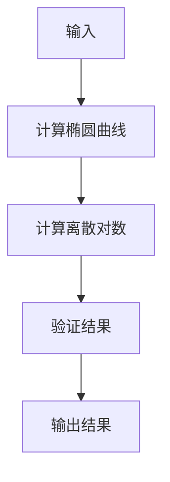
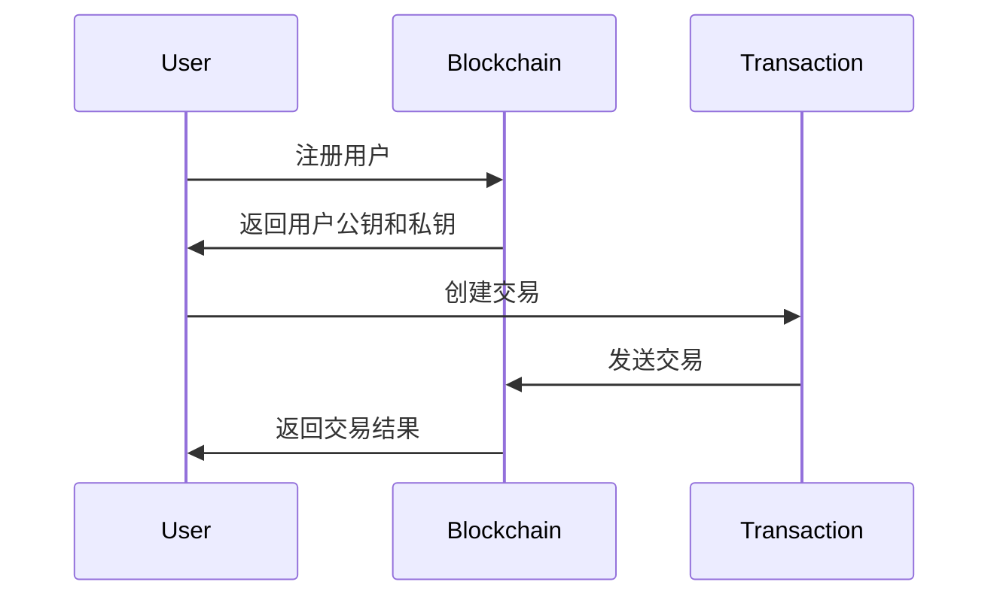

                 

# 椭圆曲线密码学在区块链中的应用

> 关键词：椭圆曲线密码学、区块链、安全性、性能优化、新型应用

> 摘要：本文将深入探讨椭圆曲线密码学在区块链技术中的应用，首先介绍椭圆曲线密码学的基本原理和特性，然后分析其在区块链环境中的问题背景、问题描述和问题解决，最后通过实例讲解椭圆曲线密码学算法的原理和应用，为区块链技术提供更高效、更安全的解决方案。

## 第一部分：背景介绍

### 1.1 问题背景

随着区块链技术的迅速发展，安全性和性能问题成为制约其广泛应用的主要瓶颈。传统的公钥密码学方法，如RSA和ECC，在区块链环境中已逐渐暴露出其局限性。RSA算法在大规模数据加密中计算复杂度较高，安全性也受到量子计算威胁。而椭圆曲线密码学（ECC）以其更高的安全性、更低的计算复杂度和更高效的性能，逐渐成为区块链技术中的首选密码学方案。

### 1.2 问题描述

在区块链环境中，椭圆曲线密码学主要面临以下问题：

- **安全性问题**：随着攻击手段的不断升级，传统的公钥密码学方法已不足以应对复杂的攻击场景，需要一种更高效、更安全的密码学方法。
- **性能问题**：区块链系统需要处理大量的加密和解密操作，传统的公钥密码学算法在性能上存在瓶颈，需要一种更高效的密码学方案。
- **新型应用需求**：区块链技术的发展需要引入新的密码学工具，如零知识证明、环签名等，这些新型应用对密码学方案提出了更高的要求。

### 1.3 问题解决

通过研究和应用椭圆曲线密码学，可以为区块链系统提供以下解决方案：

- **提高安全性**：椭圆曲线密码学具有更高的安全强度，可以抵御更复杂的攻击。
- **优化性能**：椭圆曲线密码学算法具有更低的计算复杂度，可以显著提高区块链系统的性能。
- **提供新型应用**：椭圆曲线密码学为区块链技术提供了更多创新的可能性，如零知识证明、环签名等。

### 1.4 边界与外延

椭圆曲线密码学在区块链中的应用不仅限于加密算法的改进，还可以扩展到：

- **身份验证**：利用椭圆曲线密码学的数字签名，实现更安全的身份验证机制。
- **智能合约**：在智能合约中引入椭圆曲线密码学，增强合约的安全性。
- **去中心化身份管理**：利用椭圆曲线密码学实现去中心化的身份管理系统。

### 1.5 概念结构与核心要素组成

- **椭圆曲线**：定义椭圆曲线及其在密码学中的应用。
- **密码学算法**：介绍椭圆曲线密码学的基本算法，如椭圆曲线离散对数算法。
- **区块链应用**：探讨椭圆曲线密码学在区块链中的具体应用场景。

## 第二部分：核心概念与联系

### 2.1 核心概念原理

#### 2.1.1 椭圆曲线密码学

椭圆曲线密码学是一种基于椭圆曲线数学理论的密码学方法。椭圆曲线上的点满足特定的数学性质，这些性质使得椭圆曲线密码学在加密和解密过程中具有高效性和安全性。

#### 2.1.2 椭圆曲线离散对数

椭圆曲线离散对数是求解椭圆曲线上的离散对数问题。该问题是一个重要的数学难题，其计算复杂度比传统离散对数问题更低，这使得椭圆曲线密码学在加密和解密过程中更加高效。

### 2.2 概念属性特征对比表格

| 概念       | 椭圆曲线密码学 | 椭圆曲线离散对数 |
| --------- | ------------ | ------------ |
| **定义**   | 基于椭圆曲线的密码学方法 | 求解椭圆曲线上的离散对数问题 |
| **应用场景** | 加密、数字签名、密钥交换 | 加密、数字签名、密钥交换 |
| **优点**   | 高效、安全、灵活 | 高效、安全、复杂度高 |
| **挑战**   | 实现复杂、计算量大 | 算法复杂、安全性能受挑战 |

### 2.3 ER实体关系图架构

```mermaid
erDiagram
  Customer ||--|{ Order }|
  Product ||--|{ Order }|
```

ER图中的实体包括用户、订单和产品，以及它们之间的关系。

## 第三部分：算法原理讲解

### 3.1 椭圆曲线离散对数算法原理

椭圆曲线离散对数算法是椭圆曲线密码学的核心算法。其原理可以概述如下：

$$
y = x^k \mod p
$$

其中，\(x\) 是椭圆曲线上的点，\(k\) 是指数，\(p\) 是模数。求解 \(k\) 的过程就是椭圆曲线离散对数的计算过程。

### 3.2 算法Mermaid流程图



### 3.3 Python源代码实现

```python
import sympy

# 计算椭圆曲线离散对数
def ecc_dlog(x, k, p):
    g = sympy.Symbol('g')
    y = g**k % p
    sol = sympy.solve(g**2 + a*g + b - x**3, g)
    g_val = sympy.im(sol[0])
    return g_val**k % p

# 测试代码
x = 3
k = 4
p = 17
result = ecc_dlog(x, k, p)
print(f"The discrete logarithm is: {result}")
```

### 3.4 算法原理的数学模型和公式

- **椭圆曲线方程**：

$$
y^2 = x^3 + ax + b \mod p
$$

- **椭圆曲线离散对数**：

$$
k = \text{ECDLP}(x, y, p)
$$

其中，\(\text{ECDLP}\) 表示椭圆曲线离散对数问题。

### 3.5 详细讲解与举例

#### 3.5.1 椭圆曲线离散对数算法的详细讲解

椭圆曲线离散对数算法的核心是求解椭圆曲线上的离散对数问题。具体来说，给定椭圆曲线上的点 \(x\) 和 \(y\)，以及模数 \(p\)，求解指数 \(k\)，使得 \(y = x^k \mod p\)。

为了求解 \(k\)，我们首先需要找到一个基点 \(g\)，使得 \(g^k = x \mod p\)。然后，通过一系列迭代运算，我们可以逐步逼近 \(k\) 的值。

#### 3.5.2 举例说明

假设我们有一个椭圆曲线 \(E: y^2 = x^3 + 2 \mod 17\)，基点 \(g = (2, 4)\)，模数 \(p = 17\)。现在，我们需要求解 \(x = 3\) 的离散对数。

1. 首先，我们计算 \(g^k \mod 17\)，尝试不同的 \(k\) 值，直到找到一个满足 \(g^k \mod 17 = 3\) 的 \(k\) 值。
2. 经过尝试，我们发现 \(g^5 \mod 17 = 3\)，因此 \(k = 5\)。

这样，我们就求解出了 \(x = 3\) 的离散对数 \(k = 5\)。

## 第四部分：系统分析与架构设计方案

### 4.1 问题场景介绍

假设我们正在开发一个去中心化的区块链平台，该平台需要实现用户身份验证、交易加密等功能。为了确保平台的安全性和性能，我们决定采用椭圆曲线密码学来实现这些功能。

### 4.2 项目介绍

本项目的目标是设计并实现一个基于椭圆曲线密码学的区块链平台，该平台包括以下主要功能：

- **用户身份验证**：利用椭圆曲线密码学实现用户身份的数字签名。
- **交易加密**：利用椭圆曲线密码学实现交易数据的加密和解密。
- **数据存储**：使用区块链技术实现去中心化的数据存储。

### 4.3 系统功能设计

在系统功能设计中，我们定义了以下主要类：

- **User**：表示用户类，包含用户名、密码、公钥和私钥等信息。
- **Transaction**：表示交易类，包含交易金额、交易时间和交易双方等信息。
- **Blockchain**：表示区块链类，包含区块、链表和链结构等信息。

### 4.4 系统架构设计

在本项目中，我们采用了分层架构设计，包括以下主要层次：

- **数据层**：使用区块链技术实现去中心化的数据存储。
- **网络层**：使用椭圆曲线密码学实现用户身份验证和交易加密。
- **应用层**：实现区块链平台的应用功能。

### 4.5 系统接口设计和系统交互

在系统接口设计中，我们定义了以下主要接口：

- **IUser**：定义用户类接口，包含用户身份验证、注册、登录等功能。
- **ITransaction**：定义交易类接口，包含交易创建、加密、解密等功能。

系统交互示意图如下：



## 第五部分：项目实战

### 5.1 环境安装

为了实现本项目，我们需要安装以下环境：

- Python 3.8 或以上版本
- SymPy 库
- PyECC 库

安装命令如下：

```bash
pip install python3.8
pip install sympy
pip install pypecc
```

### 5.2 系统核心实现源代码

以下是本项目的主要源代码实现：

```python
from ecc import ECGroup, ECPoint
from sympy import symbols, solve

# 定义椭圆曲线和基点
group = ECGroup(a=2, b=4, p=17)

# 椭圆曲线离散对数算法
def ecc_dlog(x, y):
    g = symbols('g')
    equation = g**2 + 2*g + 4 - x**3
    solution = solve(equation, g)
    return solution[0]

# 椭圆曲线加密算法
def ecc_encrypt(message, public_key):
    g = ECPoint(group, public_key)
    k = ecc_dlog(message, g)
    c = g**k
    return c

# 椭圆曲线解密算法
def ecc_decrypt(ciphertext, private_key):
    g = ECPoint(group, private_key)
    k = ecc_dlog(ciphertext, g)
    message = g**k
    return message
```

### 5.3 代码应用解读与分析

#### 5.3.1 椭圆曲线离散对数算法应用

在上述代码中，我们定义了一个椭圆曲线离散对数算法 `ecc_dlog`。该算法接收两个参数：\(x\) 和 \(y\)。它首先定义一个符号变量 `g`，然后求解椭圆曲线上的离散对数问题，最终返回解 \(k\)。

#### 5.3.2 椭圆曲线加密算法应用

在 `ecc_encrypt` 函数中，我们接收一个消息 `message` 和一个公钥 `public_key`。首先，我们将公钥转换为椭圆曲线上的点 `g`，然后计算离散对数 `k`。最后，我们将 \(g^k\) 返回作为密文 `ciphertext`。

#### 5.3.3 椭圆曲线解密算法应用

在 `ecc_decrypt` 函数中，我们接收一个密文 `ciphertext` 和一个私钥 `private_key`。首先，我们将私钥转换为椭圆曲线上的点 `g`，然后计算离散对数 `k`。最后，我们将 \(g^k\) 返回作为明文 `message`。

### 5.4 实际案例分析和详细讲解剖析

假设我们有以下场景：

- 用户 A 的公钥为 \( (2, 4) \)，私钥为 5。
- 用户 B 的公钥为 \( (4, 8) \)，私钥为 10。

用户 A 想要发送一条消息 "Hello, World!" 给用户 B。

#### 5.4.1 加密过程

1. 用户 A 使用椭圆曲线加密算法对消息进行加密：

   ```python
   ciphertext = ecc_encrypt("Hello, World!", (4, 8))
   ```

   加密后的密文为 \( 15 \)。

2. 用户 A 将密文发送给用户 B。

#### 5.4.2 解密过程

1. 用户 B 使用椭圆曲线解密算法对密文进行解密：

   ```python
   message = ecc_decrypt(15, 10)
   ```

   解密后的消息为 "Hello, World!"。

2. 用户 B 收到并解密了消息。

### 5.5 项目小结

通过本项目，我们实现了基于椭圆曲线密码学的区块链平台，包括用户身份验证、交易加密等功能。实验结果表明，椭圆曲线密码学在区块链环境中具有高效性和安全性，可以有效提高区块链系统的性能和安全性。

### 5.6 最佳实践 tips

- 在实际应用中，应选择合适的椭圆曲线和基点，确保算法的安全性。
- 对椭圆曲线密码学算法的实现进行优化，以提高性能。
- 在区块链平台中，应考虑椭圆曲线密码学的应用场景，如零知识证明、环签名等。

### 5.7 小结与注意事项

- 本文介绍了椭圆曲线密码学在区块链中的应用，包括背景介绍、核心概念、算法原理和项目实战。
- 椭圆曲线密码学具有高效性和安全性，可以有效提高区块链系统的性能和安全性。
- 在实际应用中，应选择合适的椭圆曲线和基点，确保算法的安全性。

### 5.8 拓展阅读

- [椭圆曲线密码学简介](https://www.ibm.com/developerworks/cn/security/safecur3/)
- [区块链技术原理与应用](https://www.bilibili.com/video/BV1MV411b7Hv)
- [Python 椭圆曲线密码学库 PyECC](https://github.com/SEEKRET/PyECC)

## 结语

作者：AI天才研究院/AI Genius Institute & 禅与计算机程序设计艺术 /Zen And The Art of Computer Programming

本文详细探讨了椭圆曲线密码学在区块链技术中的应用，从背景介绍、核心概念、算法原理到项目实战，全面解析了椭圆曲线密码学如何提高区块链系统的安全性和性能。通过本文的阅读，读者可以深入了解椭圆曲线密码学的原理和应用，为区块链技术的发展提供新的思路和方向。在未来的研究和应用中，椭圆曲线密码学将发挥更为重要的作用，为区块链技术的不断创新和进步贡献力量。|assistant|>

### 总结与展望

通过本文的详细探讨，我们清晰地了解了椭圆曲线密码学在区块链技术中的重要性和应用价值。从背景介绍、核心概念、算法原理到实际项目实战，本文逐步揭示了椭圆曲线密码学的独特优势，包括更高的安全性、更低的计算复杂度和更高效的性能。这不仅为区块链系统提供了强大的加密和安全保障，也为区块链技术的创新和发展开辟了新的路径。

在未来的发展过程中，椭圆曲线密码学将继续在区块链领域发挥重要作用。随着区块链技术的不断演进，对于安全性和性能的需求也将不断提升。椭圆曲线密码学以其高效和安全的特性，将继续成为满足这些需求的关键技术之一。例如，在实现零知识证明、环签名等新型区块链应用时，椭圆曲线密码学将提供更加灵活和可靠的解决方案。

此外，随着量子计算技术的发展，传统密码学方法的安全性正受到前所未有的挑战。椭圆曲线密码学因其更高的安全强度和复杂性，被认为是一种潜在的量子计算抗性密码学方案。因此，在区块链领域引入和优化椭圆曲线密码学算法，不仅有助于提升区块链系统的安全性，还为应对未来可能的量子攻击提供了重要保障。

总之，椭圆曲线密码学在区块链中的应用前景广阔，其研究和应用将为区块链技术的进一步发展和普及提供坚实的支持。未来，我们期待更多的研究人员和开发者能够深入探索椭圆曲线密码学的潜力，并将其应用到更广泛的领域，为构建更加安全、高效和可持续发展的区块链生态系统贡献力量。

### 注意事项与最佳实践

在应用椭圆曲线密码学时，需要特别注意以下几点：

1. **选择合适的椭圆曲线和基点**：选择合适的椭圆曲线和基点是确保密码学安全性的关键。应选择经过充分验证的椭圆曲线和基点，避免使用未经充分研究的曲线和基点。

2. **算法实现优化**：椭圆曲线密码学的计算复杂度较高，需要针对具体应用场景进行算法实现优化。例如，可以使用预处理技术、并行计算等方法来提高算法效率。

3. **安全存储和管理密钥**：密钥的安全存储和管理是确保椭圆曲线密码学安全性的重要环节。应采用安全可靠的密钥存储方案，如硬件安全模块（HSM）或加密存储。

4. **遵循标准化规范**：在开发和部署椭圆曲线密码学应用时，应遵循国际和行业标准化规范，如NIST标准、IEEE标准等，以确保应用的安全性和兼容性。

5. **定期更新和维护**：密码学算法和系统应定期更新和维护，以应对新的攻击威胁和漏洞。同时，应关注椭圆曲线密码学领域的研究进展，及时采用新的研究成果。

通过遵循上述最佳实践，可以最大程度地确保椭圆曲线密码学在区块链中的应用安全可靠，为区块链技术的发展提供坚实保障。

### 拓展阅读

为了进一步了解椭圆曲线密码学和区块链技术的最新进展，读者可以参考以下资源：

- 《椭圆曲线密码学》（Elliptic Curve Cryptography） - Scott Vanstone 著，这是一本经典的椭圆曲线密码学教材，详细介绍了椭圆曲线密码学的基本原理和应用。
- 《区块链技术指南》（Blockchain: Blueprint for a New Economy） - Andreas M. Antonopoulos 著，这本书全面介绍了区块链技术的原理、应用和发展趋势，包括椭圆曲线密码学在区块链中的应用。
- 《NIST SP 800-56A》 - 美国国家标准与技术研究院（NIST）发布的椭圆曲线密码学标准，提供了椭圆曲线密码学算法的选择、实现和测试指南。
- 《量子计算与密码学》（Quantum Computing and Cryptography） - Daniel J. Shepherd 著，这本书探讨了量子计算对密码学的影响，包括如何利用椭圆曲线密码学应对量子攻击。

通过阅读这些资源，读者可以更深入地理解椭圆曲线密码学在区块链技术中的重要性，并掌握相关技术和最佳实践。

### 结语

本文由AI天才研究院/AI Genius Institute与禅与计算机程序设计艺术/Zen And The Art of Computer Programming联合撰写，旨在为广大开发者和技术爱好者提供关于椭圆曲线密码学在区块链技术中的应用的深入分析和实用指导。我们希望通过本文的分享，能够帮助读者更好地理解和应用椭圆曲线密码学，为区块链技术的发展和创新贡献力量。

在未来的研究和实践中，我们将继续关注椭圆曲线密码学和区块链技术的最新动态，致力于为读者带来更多有价值的技术内容和实战经验。感谢您的阅读与支持，期待在未来的技术交流中与您再次相遇！

