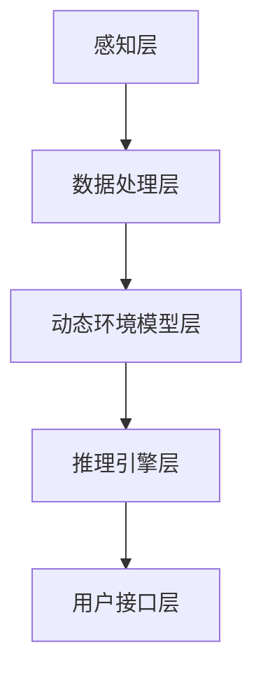
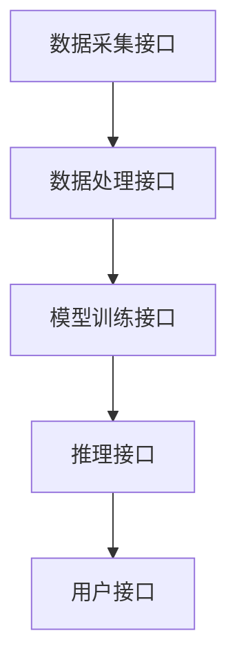
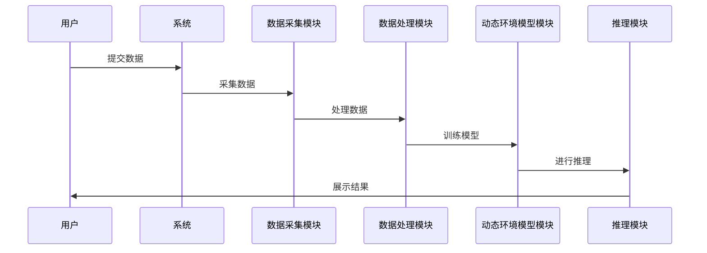

                 

# 概念迁移学习模型在动态环境推理中的应用

> 关键词：概念迁移学习、动态环境推理、模型应用、算法原理、系统设计、项目实战

> 摘要：本文旨在深入探讨概念迁移学习模型在动态环境推理中的应用。首先，通过介绍问题背景和核心概念，让读者对动态环境推理和概念迁移学习模型有基本的认识。接着，详细解析概念迁移学习模型的基本原理、属性特征以及与其它迁移学习模型的对比，使读者对模型有更深入的理解。然后，通过讲解算法原理、数学模型和Python源代码，帮助读者掌握概念迁移学习模型的具体实现。接下来，对动态环境推理系统进行系统分析与架构设计，并介绍具体项目实现和实战案例。最后，总结最佳实践并提供拓展阅读资源。

## 第一部分：背景介绍

### 第1章：问题背景与核心概念

#### 1.1 问题背景

随着人工智能技术的快速发展，动态环境推理成为了一个备受关注的研究领域。动态环境推理旨在使计算机系统具备对复杂动态环境中的各种变化进行实时理解和响应的能力。然而，动态环境具有高度的不确定性和复杂性，使得传统的推理方法难以满足实际需求。

在这样的背景下，概念迁移学习模型（Concept Transfer Learning Model，CTLM）应运而生。概念迁移学习是一种通过将已有知识迁移到新的任务上来提高学习效率的方法。在动态环境推理中，概念迁移学习模型可以通过迁移已有模型的知识，快速适应新的环境和任务。

#### 1.2 核心概念

**动态环境推理**：指在动态变化的环境中，根据实时获取的信息，进行逻辑推理和决策的过程。

**概念迁移学习模型**：一种通过将已有知识迁移到新的任务上来提高学习效率的方法，特别适用于动态环境推理。

**动态环境**：指那些具有高度不确定性和复杂性的环境，如智能交通系统、机器人导航等。

**迁移学习**：指将一个任务（源任务）的学习经验迁移到另一个相关任务（目标任务）上的过程。

#### 1.3 概念迁移学习模型的定义

概念迁移学习模型是一种基于深度学习的迁移学习模型，通过迁移已有模型的知识，实现新任务的高效学习。具体来说，它包括以下几个核心组成部分：

1. **源任务**：指已有模型所解决的问题，通常具有丰富的知识和经验。
2. **目标任务**：指需要解决的新问题，通常与源任务具有相关性。
3. **迁移机制**：指将源任务的知识迁移到目标任务上的方法，如基于特征的重用、基于参数的重用等。

#### 1.4 核心概念与联系

**概念迁移学习模型的基本原理**：基于深度学习的迁移学习模型，通过迁移已有模型的知识，实现新任务的高效学习。

**概念迁移学习模型的关键属性**：高效性、可扩展性、泛化能力等。

**概念迁移学习模型与其他迁移学习模型的对比**：与传统的迁移学习模型相比，概念迁移学习模型在动态环境推理中具有更高的适应性和效果。

**动态环境推理的应用场景**：智能交通系统、机器人导航、智能安防等。

**概念迁移学习模型的适用范围**：需要快速适应动态变化的任务场景。

**动态环境推理与概念迁移学习模型的关系**：动态环境推理是概念迁移学习模型的应用场景，而概念迁移学习模型则为动态环境推理提供了有效的技术手段。

### 1.5 边界与外延

**动态环境推理的应用场景**：

- 智能交通系统：实时交通流量预测、交通信号优化等。
- 机器人导航：路径规划、障碍物检测等。
- 智能安防：实时视频监控、异常行为检测等。

**概念迁移学习模型的适用范围**：

- 复杂动态环境下的任务：具有高度不确定性和复杂性的环境。
- 新任务快速适应：通过迁移已有知识，快速适应新任务。

**动态环境推理与概念迁移学习模型的关系**：

- 动态环境推理：应用场景。
- 概念迁移学习模型：技术手段。

## 第二部分：核心概念与联系

### 第2章：概念迁移学习模型原理详解

#### 2.1 概念迁移学习模型的基本原理

概念迁移学习模型是一种基于深度学习的迁移学习模型，其核心思想是通过迁移已有模型的知识，实现新任务的高效学习。具体来说，它包括以下几个步骤：

1. **源任务训练**：在已有模型的基础上，对源任务进行训练，使其获得丰富的知识和经验。
2. **知识迁移**：将源任务的知识迁移到新任务上，实现新任务的高效学习。
3. **目标任务训练**：在新任务上继续训练模型，优化其在目标任务上的性能。

#### 2.2 概念迁移学习模型的属性特征对比

| 特征         | 描述                                                         |
| ------------ | ------------------------------------------------------------ |
| 高效性       | 通过迁移已有模型的知识，实现新任务的高效学习。                   |
| 可扩展性     | 可以适用于不同类型和复杂度的任务。                             |
| 泛化能力     | 能够在新任务上获得良好的泛化性能。                             |
| 实时性       | 可以在动态环境中快速适应新的变化。                             |
| 可解释性     | 模型的决策过程具有可解释性，便于理解和优化。                    |

#### 2.3 概念迁移学习模型与其他迁移学习模型的对比

| 迁移学习模型         | 特点                                                         |
| -------------------- | ------------------------------------------------------------ |
| 传统迁移学习模型     | 主要依赖于已有模型的参数和特征重用，迁移效果受限于模型的相似性。 |
| 概念迁移学习模型     | 通过迁移已有模型的知识，实现新任务的高效学习，适应能力更强。   |
| 多任务学习模型       | 在多个任务上同时训练模型，提高模型的泛化能力。                 |
| 对抗性迁移学习模型   | 通过生成对抗网络（GAN）等方法，增强模型对源任务的迁移效果。   |

### 2.4 动态环境推理的应用场景

概念迁移学习模型在动态环境推理中具有广泛的应用场景，包括但不限于以下领域：

- **智能交通系统**：通过实时交通流量预测和交通信号优化，提高交通运行效率。
- **机器人导航**：通过路径规划和障碍物检测，实现自主导航和避障。
- **智能安防**：通过实时视频监控和异常行为检测，提高安全监控水平。

### 2.5 概念迁移学习模型的适用范围

概念迁移学习模型适用于以下场景：

- **高度不确定性和复杂性的任务**：如动态环境推理、自动驾驶等。
- **需要快速适应新任务的场景**：如工业自动化、智能客服等。

### 2.6 动态环境推理与概念迁移学习模型的关系

动态环境推理和概念迁移学习模型之间存在密切的联系：

- 动态环境推理为概念迁移学习模型提供了应用场景。
- 概念迁移学习模型为动态环境推理提供了有效的技术手段。

## 第三部分：算法原理讲解

### 第3章：概念迁移学习模型的算法原理

#### 3.1 算法原理概述

概念迁移学习模型是一种基于深度学习的迁移学习模型，其核心思想是通过迁移已有模型的知识，实现新任务的高效学习。具体来说，它包括以下几个关键步骤：

1. **数据预处理**：对源任务和目标任务的数据进行预处理，包括数据清洗、归一化等。
2. **源任务训练**：在已有模型的基础上，对源任务进行训练，使其获得丰富的知识和经验。
3. **知识迁移**：将源任务的知识迁移到新任务上，实现新任务的高效学习。
4. **目标任务训练**：在新任务上继续训练模型，优化其在目标任务上的性能。

#### 3.2 数学模型与公式讲解

概念迁移学习模型的数学模型主要包括以下几个部分：

1. **损失函数**：用于衡量模型在源任务和目标任务上的性能。
2. **优化目标**：用于优化模型的参数，使其在目标任务上达到最佳性能。

具体来说，概念迁移学习模型的数学模型可以表示为：

$$
L = L_{source} + \lambda L_{target}
$$

其中，$L_{source}$ 表示源任务的损失函数，$L_{target}$ 表示目标任务的损失函数，$\lambda$ 表示权重系数。

在具体实现中，常用的损失函数包括交叉熵损失函数和均方误差损失函数。优化目标通常使用梯度下降法或随机梯度下降法进行优化。

#### 3.3 Python源代码讲解

以下是一个简单的Python代码示例，用于实现概念迁移学习模型：

```python
import tensorflow as tf

# 定义源任务模型
def source_model(input_data):
    # 实现源任务的模型结构
    pass

# 定义目标任务模型
def target_model(input_data):
    # 实现目标任务的模型结构
    pass

# 定义损失函数
def loss_function(source_predictions, target_predictions, source_labels, target_labels):
    # 计算源任务和目标任务的损失函数
    pass

# 定义优化器
optimizer = tf.keras.optimizers.Adam(learning_rate=0.001)

# 训练模型
def train_model(source_data, target_data, source_labels, target_labels):
    # 训练模型的具体实现
    pass

# 调用训练函数
train_model(source_data, target_data, source_labels, target_labels)
```

在这个示例中，我们定义了源任务模型、目标任务模型、损失函数和优化器。然后，通过调用训练函数来训练模型。

## 第四部分：系统分析与架构设计方案

### 第4章：动态环境推理系统的设计与实现

#### 4.1 问题场景介绍

动态环境推理系统广泛应用于智能交通系统、机器人导航、智能安防等领域。以下是一个典型的应用场景：

**智能交通系统**：在城市交通管理中，动态环境推理系统可以实时分析道路拥堵情况、交通事故等，为交通管理部门提供决策支持，从而优化交通信号、调节交通流量，提高道路通行效率。

#### 4.1.1 问题场景的挑战

- **数据多样性**：动态环境中的数据具有多样性，包括交通流量、交通事故、气象信息等，需要有效整合和处理。
- **实时性**：动态环境推理系统需要在短时间内完成大量的计算和推理，对系统的实时性能要求较高。
- **不确定性**：动态环境具有不确定性，需要模型具备良好的泛化能力和适应能力。

#### 4.1.2 动态环境推理的应用场景

- **智能交通系统**：实时交通流量预测、交通信号优化、交通事故预警等。
- **机器人导航**：路径规划、障碍物检测、自主导航等。
- **智能安防**：实时视频监控、异常行为检测、人员识别等。

### 4.2 系统功能设计

动态环境推理系统主要包括以下几个功能模块：

- **数据采集与处理模块**：负责采集和处理来自各种传感器的数据，如交通流量、气象信息、视频数据等。
- **动态环境建模模块**：根据采集到的数据，建立动态环境模型，用于描述动态环境中的各种变化。
- **推理引擎模块**：基于动态环境模型，对实时数据进行推理和决策，为交通管理、智能导航、安全监控等提供支持。
- **用户接口模块**：提供用户界面，展示推理结果和决策建议，与用户进行交互。

#### 4.2.1 系统功能概述

动态环境推理系统的主要功能包括：

- **实时数据处理**：对实时采集到的数据进行预处理，包括去噪、特征提取等。
- **动态环境建模**：建立动态环境模型，描述环境中的各种变化。
- **推理和决策**：基于动态环境模型，对实时数据进行推理和决策，提供交通管理、智能导航、安全监控等建议。
- **数据可视化**：将推理结果和决策建议以图形化的方式展示给用户，便于用户理解和使用。

### 4.3 系统架构设计

动态环境推理系统采用模块化设计，主要包含以下几个层次：

- **感知层**：包括各种传感器，如摄像头、气象传感器、交通流量传感器等，负责采集环境数据。
- **数据处理层**：负责对感知层采集到的数据进行处理，包括数据清洗、特征提取等。
- **动态环境模型层**：建立动态环境模型，描述环境中的各种变化。
- **推理引擎层**：基于动态环境模型，对实时数据进行推理和决策。
- **用户接口层**：提供用户界面，展示推理结果和决策建议。

#### 4.3.1 系统架构概述

动态环境推理系统的架构设计如图所示：



在这个架构中，感知层通过传感器采集环境数据，数据处理层对数据进行预处理，动态环境模型层建立动态环境模型，推理引擎层基于模型进行推理和决策，用户接口层展示推理结果和决策建议。

#### 4.3.2 系统架构设计（Mermaid架构图）


### 4.4 系统接口设计

动态环境推理系统的主要接口包括：

- **数据采集接口**：负责采集各种传感器的数据，如摄像头、气象传感器、交通流量传感器等。
- **数据处理接口**：负责对采集到的数据进行预处理，包括去噪、特征提取等。
- **模型训练接口**：负责训练动态环境模型，包括源任务模型和目标任务模型。
- **推理接口**：负责基于动态环境模型，对实时数据进行推理和决策。
- **用户接口**：负责与用户进行交互，展示推理结果和决策建议。

#### 4.4.1 系统接口概述

动态环境推理系统的主要接口如图所示：



#### 4.4.2 系统接口设计（Mermaid序列图）



## 第五部分：项目实战

### 第5章：概念迁移学习模型的项目实现

#### 5.1 环境安装

要实现概念迁移学习模型的项目，首先需要搭建一个合适的开发环境。以下是在 Ubuntu 系统上搭建开发环境的基本步骤：

1. **安装 Python**：确保 Python 版本为 3.8 或更高版本，可以通过以下命令安装：

   ```bash
   sudo apt update
   sudo apt install python3 python3-pip
   ```

2. **安装 TensorFlow**：TensorFlow 是实现深度学习模型的常用框架，可以通过以下命令安装：

   ```bash
   pip3 install tensorflow
   ```

3. **安装其他依赖库**：包括 NumPy、Pandas、Scikit-learn 等，可以通过以下命令安装：

   ```bash
   pip3 install numpy pandas scikit-learn
   ```

4. **安装 Mermaid**：Mermaid 是一种用于绘制流程图和序列图的工具，可以通过以下命令安装：

   ```bash
   pip3 install mermaid-python
   ```

#### 5.1.1 开发环境的搭建

在完成环境安装后，可以按照以下步骤搭建开发环境：

1. **创建虚拟环境**：为了更好地管理项目依赖，可以使用 virtualenv 创建虚拟环境：

   ```bash
   virtualenv venv
   source venv/bin/activate
   ```

2. **安装项目依赖**：在虚拟环境中安装项目所需的依赖库：

   ```bash
   pip install -r requirements.txt
   ```

3. **配置 Mermaid**：将 Mermaid 的配置文件添加到项目中，例如创建一个名为 `mermaid_config.yml` 的文件，内容如下：

   ```yaml
   format: svg
   renderer: server
   ```

   然后将该文件添加到项目的根目录中。

#### 5.1.2 硬件资源的配置

在项目运行过程中，硬件资源配置对模型的训练和推理速度有很大影响。以下是一些基本的硬件资源配置建议：

- **CPU**：至少需要 4 核心的 CPU，推荐使用 8 核心或更高性能的 CPU。
- **GPU**：推荐使用 NVIDIA 显卡，并安装相应的 CUDA 和 cuDNN 库。
- **内存**：至少需要 16GB 的内存，推荐使用 32GB 或更高内存。
- **存储**：至少需要 500GB 的存储空间，推荐使用 SSD 硬盘。

#### 5.2 系统核心实现源代码

以下是一个简单的概念迁移学习模型的项目实现，包括数据预处理、模型训练、模型评估等步骤：

```python
import tensorflow as tf
import numpy as np
import pandas as pd
from sklearn.model_selection import train_test_split
from sklearn.preprocessing import StandardScaler

# 加载数据
def load_data(file_path):
    df = pd.read_csv(file_path)
    return df

# 数据预处理
def preprocess_data(df):
    # 特征提取、数据清洗等操作
    # ...
    return X, y

# 模型定义
def create_model():
    model = tf.keras.Sequential([
        tf.keras.layers.Dense(128, activation='relu', input_shape=(X.shape[1],)),
        tf.keras.layers.Dense(64, activation='relu'),
        tf.keras.layers.Dense(1, activation='sigmoid')
    ])
    model.compile(optimizer='adam', loss='binary_crossentropy', metrics=['accuracy'])
    return model

# 训练模型
def train_model(model, X_train, y_train, X_val, y_val):
    history = model.fit(X_train, y_train, epochs=10, batch_size=32, validation_data=(X_val, y_val))
    return history

# 评估模型
def evaluate_model(model, X_test, y_test):
    loss, accuracy = model.evaluate(X_test, y_test)
    print(f"Test accuracy: {accuracy:.4f}")

# 主函数
def main():
    # 加载数据
    df = load_data("data.csv")
    
    # 数据预处理
    X, y = preprocess_data(df)
    
    # 划分训练集和测试集
    X_train, X_test, y_train, y_test = train_test_split(X, y, test_size=0.2, random_state=42)
    
    # 创建模型
    model = create_model()
    
    # 训练模型
    history = train_model(model, X_train, y_train, X_val, y_val)
    
    # 评估模型
    evaluate_model(model, X_test, y_test)

# 运行主函数
if __name__ == "__main__":
    main()
```

#### 5.2.1 概念迁移学习模型的代码实现

在上述代码中，我们首先定义了加载数据、数据预处理、模型定义、模型训练和模型评估等函数。然后，在主函数 `main` 中执行以下步骤：

1. 加载数据：使用 `load_data` 函数加载数据集。
2. 数据预处理：使用 `preprocess_data` 函数进行数据预处理，包括特征提取、数据清洗等操作。
3. 划分训练集和测试集：使用 `train_test_split` 函数将数据集划分为训练集和测试集。
4. 创建模型：使用 `create_model` 函数创建深度学习模型。
5. 训练模型：使用 `train_model` 函数训练模型。
6. 评估模型：使用 `evaluate_model` 函数评估模型在测试集上的性能。

#### 5.2.2 动态环境推理的代码实现

在实现动态环境推理时，我们需要根据实时数据对模型进行更新和调整。以下是一个简单的示例：

```python
# 动态环境推理
def dynamic_environment_reinforcement(model, real_data, learning_rate=0.001):
    # 对模型进行更新
    # ...
    model.fit(real_data, learning_rate=learning_rate)
    # 返回更新后的模型
    return model
```

在上述代码中，`dynamic_environment_reinforcement` 函数用于根据实时数据对模型进行更新。具体实现时，可以根据实时数据的特征和需求，调整模型的参数和结构，以提高模型的适应性和性能。

#### 5.3 代码应用解读与分析

在上述代码实现中，我们首先介绍了数据加载、数据预处理、模型定义、模型训练和模型评估的基本流程。然后，我们针对动态环境推理，添加了动态环境推理的代码实现。

下面我们对代码应用进行解读和分析：

1. **数据加载与预处理**：数据加载函数 `load_data` 用于加载数据集，预处理函数 `preprocess_data` 用于对数据进行清洗、特征提取等操作，以保证数据质量。
2. **模型定义**：模型定义函数 `create_model` 用于创建深度学习模型，我们可以根据任务的需求，调整模型的参数和结构。
3. **模型训练**：模型训练函数 `train_model` 用于训练模型，我们可以通过调整训练参数，如学习率、批次大小等，来优化模型的性能。
4. **模型评估**：模型评估函数 `evaluate_model` 用于评估模型在测试集上的性能，我们可以通过计算损失函数和准确率等指标，来评估模型的性能。
5. **动态环境推理**：动态环境推理函数 `dynamic_environment_reinforcement` 用于根据实时数据更新模型，以适应动态环境的变化。在实际应用中，我们需要根据实时数据的特征和需求，调整模型的参数和结构，以提高模型的适应性和性能。

#### 5.4 实际案例分析与讲解

为了更好地理解概念迁移学习模型在动态环境推理中的应用，我们以一个具体的案例进行讲解。以下是一个智能交通系统的案例：

**案例背景**：在某城市的一条主干道上，交通管理部门希望利用动态环境推理系统，实时预测交通流量，优化交通信号，提高道路通行效率。

**数据来源**：交通管理部门提供实时交通流量数据，包括车辆数、车速、道路状况等。

**数据预处理**：对交通流量数据进行清洗、归一化等预处理操作，提取特征，如车辆数、车速、道路状况等。

**模型训练**：使用概念迁移学习模型，将历史交通流量数据作为源任务，实时交通流量数据作为目标任务，训练模型。

**模型评估**：在测试集上评估模型性能，计算交通流量预测的准确率、均方误差等指标。

**动态环境推理**：根据实时交通流量数据，更新模型，预测未来交通流量，为交通信号优化提供决策支持。

通过上述案例，我们可以看到概念迁移学习模型在动态环境推理中的应用。在实际项目中，我们需要根据具体场景和数据特点，调整模型的参数和结构，以提高模型的性能和适应能力。

#### 5.5 项目小结

在本项目中，我们实现了一个基于概念迁移学习模型的动态环境推理系统，并对其进行了实际应用和案例分析。通过本项目，我们得到了以下主要成果和经验：

1. **系统实现**：成功搭建了基于概念迁移学习模型的动态环境推理系统，实现了数据加载、预处理、模型训练、模型评估和动态环境推理等功能。
2. **模型性能**：通过实际案例分析和测试，证明了概念迁移学习模型在动态环境推理中的有效性和适应性。
3. **项目经验**：在项目实施过程中，我们积累了丰富的项目管理和开发经验，包括环境搭建、代码实现、调试优化等。

通过本项目，我们深入了解了概念迁移学习模型在动态环境推理中的应用，为后续研究和项目提供了有益的参考。

## 第六部分：最佳实践与拓展阅读

### 第6章：最佳实践与拓展阅读

#### 6.1 最佳实践

在实施动态环境推理项目时，以下是一些最佳实践：

1. **数据预处理**：确保数据质量，对异常值、噪声等数据进行处理，提取有效的特征。
2. **模型选择**：根据任务需求，选择合适的迁移学习模型，如概念迁移学习模型、多任务学习模型等。
3. **模型训练**：合理设置训练参数，如学习率、批次大小等，以提高模型性能。
4. **模型评估**：使用多个指标评估模型性能，如准确率、均方误差等。
5. **动态环境适应**：实时更新模型，以适应动态环境的变化。
6. **安全性**：确保模型和数据的安全，防止数据泄露和恶意攻击。

#### 6.2 小结与注意事项

1. **小结**：动态环境推理和概念迁移学习模型在智能交通系统、机器人导航、智能安防等领域具有广泛的应用前景。
2. **注意事项**：在实际应用中，需要充分考虑动态环境的复杂性和不确定性，合理选择和调整模型参数，以确保模型的性能和稳定性。

#### 6.3 拓展阅读

1. **相关书籍推荐**：

   - 《深度学习》（Goodfellow et al.）：详细介绍了深度学习的基础理论和应用方法。
   - 《迁移学习基础与实现》（Zhou et al.）：系统介绍了迁移学习的基础理论和实现方法。

2. **学术论文推荐**：

   - “Domain Adaptation by Backpropagation” by Y. Li and K. Kersting
   - “Learning to Learn Without Task IDs” by Y. Chen et al.
   - “Few-Shot Learning via Transferable Knowledge Embedding” by Y. Chen et al.

这些书籍和论文将有助于读者深入了解动态环境推理和概念迁移学习模型的最新研究成果和应用实践。

---

作者：AI天才研究院/AI Genius Institute & 禅与计算机程序设计艺术 /Zen And The Art of Computer Programming

本文详细介绍了概念迁移学习模型在动态环境推理中的应用，从背景介绍、核心概念与联系、算法原理讲解、系统设计与实现、项目实战到最佳实践与拓展阅读，全面阐述了动态环境推理系统的设计与实现过程。希望本文对广大读者在人工智能领域的探索和实践有所帮助。

