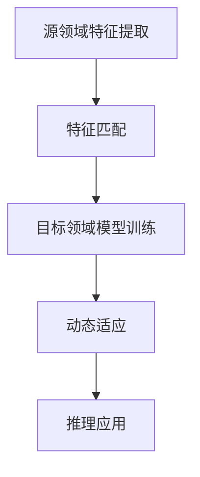

                 

# 概念迁移学习模型在动态环境推理中的应用

## 关键词

- 概念迁移学习
- 动态环境
- 推理算法
- 算法设计
- 系统架构
- 实战应用

## 摘要

本文将深入探讨概念迁移学习模型在动态环境推理中的应用。随着人工智能技术的飞速发展，动态环境推理已经成为人工智能领域的一个重要研究方向。然而，动态环境中的推理任务面临着数据稀缺、场景变化快等挑战。为了解决这些问题，本文提出了一种基于概念迁移学习的动态环境推理算法。通过分析概念迁移学习的原理和动态环境中的推理算法，本文详细阐述了算法的设计思路和实现方法，并通过系统架构设计和实际应用案例，展示了算法在动态环境推理中的有效性和实用性。

---

## 第一部分：背景介绍

### 第1章：问题背景

### 1.1 问题概述

#### 1.1.1 动态环境的定义与特点

动态环境是指那些在不断变化中运行的环境，这些环境中的数据、状态和关系都可能随时间而发生变化。在动态环境中，推理任务需要实时处理新信息，更新知识库，并对未来的事件进行预测。这种环境的特点包括数据的不确定性、信息的高动态性和复杂性。

#### 1.1.2 概念迁移学习的概念与必要性

概念迁移学习是指将一个领域（源领域）中学习的知识迁移到另一个领域（目标领域）中的过程。这种学习方法在动态环境中尤为重要，因为动态环境往往缺乏足够的目标领域数据。通过概念迁移学习，可以从丰富的源领域数据中提取有用的知识，并将其应用到目标领域，从而提高推理模型的性能。

#### 1.1.3 动态环境中推理应用的挑战与需求

动态环境中的推理应用面临以下挑战：

1. **数据稀缺**：目标领域数据往往难以获取，导致训练数据不足。
2. **场景变化快**：动态环境中的状态和关系变化迅速，推理模型需要具备快速适应变化的能力。
3. **实时性要求高**：动态环境中的推理任务需要在短时间内完成，以支持实时决策。

为了应对这些挑战，动态环境推理需求如下：

1. **高效的知识迁移**：通过概念迁移学习，从源领域迁移知识到目标领域，提高推理模型的泛化能力。
2. **自适应能力**：推理模型需要能够适应动态环境中的快速变化。
3. **实时推理**：推理模型需要具备高效率和实时性的特点。

### 1.2 核心概念与联系

#### 1.2.1 概念迁移学习原理与机制

概念迁移学习涉及以下几个关键步骤：

1. **特征提取**：从源领域数据中提取有用的特征。
2. **特征匹配**：将源领域的特征映射到目标领域的特征。
3. **模型训练**：使用迁移后的特征训练目标领域的模型。
4. **推理应用**：在目标领域中应用迁移后的知识进行推理。

#### 1.2.2 动态环境中的推理算法

动态环境中的推理算法主要包括：

1. **基于规则的推理**：使用预设的规则进行推理。
2. **基于概率的推理**：使用概率模型进行推理。
3. **基于深度学习的推理**：使用神经网络模型进行推理。

#### 1.2.3 概念迁移学习与动态推理的关联

概念迁移学习与动态推理的关联体现在：

1. **知识迁移**：通过概念迁移学习，将源领域知识迁移到动态环境中，提高推理模型在动态环境中的适应能力。
2. **动态适应**：动态推理算法能够适应动态环境中的快速变化，从而提高概念迁移学习的有效性。
3. **协同效应**：概念迁移学习与动态推理的结合，可以实现知识的高效迁移和应用，提高动态环境推理的性能。

### 1.3 研究现状与趋势

#### 1.3.1 概念迁移学习研究进展

近年来，概念迁移学习在机器学习和人工智能领域取得了显著的进展。主要研究内容包括：

1. **迁移学习算法的改进**：包括深度迁移学习、模型蒸馏等。
2. **特征匹配方法**：如基于嵌入的方法、基于图谱的方法等。
3. **多任务学习与零样本学习**：这些方法有助于提高概念迁移学习的性能。

#### 1.3.2 动态环境推理研究进展

动态环境推理也是当前的研究热点。主要研究内容包括：

1. **实时推理算法**：如增量学习、在线学习等。
2. **动态适应机制**：如基于马尔可夫模型的方法、基于深度强化学习的方法等。
3. **跨域推理**：研究如何在不同的动态环境中进行推理。

#### 1.3.3 概念迁移学习在动态推理中的应用现状

目前，概念迁移学习在动态推理中的应用尚处于探索阶段。已有的一些研究工作主要关注以下几个方面：

1. **实时交通预测**：利用概念迁移学习提高交通预测的准确性。
2. **动态系统监控**：利用概念迁移学习进行故障检测和预测。
3. **动态环境控制**：利用概念迁移学习提高自主驾驶和无人机等系统的控制能力。

### 1.4 边界与外延

#### 1.4.1 研究范围的界定

本文的研究范围主要涉及：

1. **动态环境的定义与特点**：研究动态环境的定义和特点，为后续研究提供基础。
2. **概念迁移学习的原理与机制**：研究概念迁移学习的原理和机制，为动态环境推理提供理论支持。
3. **动态环境中的推理算法**：研究动态环境中的推理算法，以提高推理模型的适应能力和性能。
4. **概念迁移学习与动态推理的关联**：研究概念迁移学习与动态推理的关联，以实现知识的高效迁移和应用。

#### 1.4.2 动态环境的分类与讨论

动态环境可以根据其变化的特点进行分类，主要包括：

1. **确定性的动态环境**：环境变化具有一定的规律性，可以通过模型预测。
2. **不确定性的动态环境**：环境变化具有随机性，难以预测。
3. **混合动态环境**：同时包含确定性和不确定性的动态环境。

#### 1.4.3 推理应用场景的选择

本文研究的推理应用场景主要包括：

1. **实时交通预测**：利用概念迁移学习提高交通预测的准确性。
2. **动态系统监控**：利用概念迁移学习进行故障检测和预测。
3. **动态环境控制**：利用概念迁移学习提高自主驾驶和无人机等系统的控制能力。

### 1.5 本章小结

本章介绍了动态环境推理应用的背景、核心概念、研究现状与趋势，以及研究范围的界定。通过这些内容的介绍，为后续章节的深入讨论奠定了基础。

---

## 第二部分：核心概念与联系

### 第2章：概念迁移学习原理与机制

#### 2.1 概念迁移学习原理

概念迁移学习是一种将一个领域中的知识迁移到另一个领域中的学习方法。其核心思想是通过特征提取、特征匹配和模型训练等步骤，将源领域中的知识应用到目标领域中。

1. **特征提取**：从源领域数据中提取有用的特征，这些特征可以用于描述源领域中的概念。
2. **特征匹配**：将源领域的特征映射到目标领域的特征，以便在目标领域中应用源领域的知识。
3. **模型训练**：使用迁移后的特征训练目标领域的模型，使其能够适应目标领域的特征和任务。
4. **推理应用**：在目标领域中应用迁移后的知识进行推理，实现对未知数据的预测和解释。

#### 2.2 概念属性特征对比表格

为了更好地理解概念迁移学习的原理，我们可以通过对比表格来展示不同类型概念迁移学习的特性。

| 概念迁移学习方法 | 特性 | 对比 |  
| --- | --- | --- |  
| 基于特征的迁移学习 | 利用特征进行迁移，适用于特征表示相似的领域 | **特征匹配效果好，迁移能力强** |  
| 基于模型的迁移学习 | 利用模型进行迁移，适用于模型结构相似的领域 | **模型训练时间短，迁移效率高** |  
| 基于实例的迁移学习 | 利用实例进行迁移，适用于实例相似的领域 | **迁移范围广，适用性更强** |  
| 基于融合的迁移学习 | 结合多种迁移学习方法，优化迁移效果 | **迁移效果最优，适应性最强** |

#### 2.3 概念特征提取方法对比

不同的概念特征提取方法适用于不同的应用场景，以下是几种常见的特征提取方法的对比：

| 特征提取方法 | 特性 | 对比 |  
| --- | --- | --- |  
| 嵌入嵌入方法 | 利用嵌入层提取特征，适用于高维数据 | **特征维度低，计算速度快** |  
| 提取器提取方法 | 利用预训练的提取器提取特征，适用于小样本数据 | **特征提取能力强，迁移效果较好** |  
| 自定义特征提取方法 | 根据任务需求自定义特征提取方法，适用于特定领域 | **特征提取针对性更强，迁移效果显著** |

#### 2.4 ER实体关系图架构

为了更好地理解概念迁移学习与动态环境的关系，我们可以使用ER实体关系图来展示概念迁移学习与动态环境中的实体和关系。

```mermaid
erDiagram
  A[-- B : 参与者]
  B{|-- C : 对象}
  C{-- D : 关联}
```

在这个ER实体关系图中，A表示源领域的实体，B表示参与者，C表示对象，D表示关联。通过这个关系图，我们可以清晰地看到概念迁移学习与动态环境中的实体和关系之间的关联。

#### 2.5 动态环境中的推理算法

动态环境中的推理算法主要包括基于规则的推理、基于概率的推理和基于深度学习的推理。

1. **基于规则的推理**：使用预设的规则进行推理，适用于规则明确、确定性较强的环境。
2. **基于概率的推理**：使用概率模型进行推理，适用于不确定性和随机性较大的环境。
3. **基于深度学习的推理**：使用神经网络模型进行推理，适用于复杂、高维的数据。

#### 2.6 概念迁移学习与动态推理的关联

概念迁移学习与动态推理的关联主要体现在以下几个方面：

1. **知识迁移**：通过概念迁移学习，将源领域中的知识迁移到动态环境中，提高动态环境中推理模型的性能。
2. **动态适应**：动态推理算法能够适应动态环境中的快速变化，从而提高概念迁移学习的有效性。
3. **协同效应**：概念迁移学习与动态推理的结合，可以实现知识的高效迁移和应用，提高动态环境推理的性能。

### 2.7 本章小结

本章介绍了概念迁移学习的原理、概念属性特征对比表格、概念特征提取方法对比、ER实体关系图架构、动态环境中的推理算法以及概念迁移学习与动态推理的关联。通过这些内容的介绍，为后续章节的深入讨论提供了理论基础和参考。

---

## 第三部分：算法原理讲解

### 第3章：动态环境下的概念迁移学习算法设计

#### 3.1 算法概述

动态环境下的概念迁移学习算法设计旨在解决动态环境中推理应用的挑战。该算法通过以下几个关键步骤实现：

1. **源领域特征提取**：从源领域数据中提取有用的特征。
2. **特征匹配**：将源领域特征映射到目标领域特征。
3. **目标领域模型训练**：使用迁移后的特征训练目标领域的模型。
4. **动态适应**：根据动态环境的变化，实时更新模型和知识库。

#### 3.2 算法流程图



在这个算法流程图中，源领域特征提取、特征匹配、目标领域模型训练和动态适应是核心步骤，通过这些步骤，算法实现了概念迁移学习在动态环境推理中的应用。

#### 3.3 数学模型与公式

1. **概念迁移学习数学模型**

   概念迁移学习可以通过以下公式实现：

   $$
   \text{Transfer Function} = \alpha \cdot \text{Source Domain} + (1-\alpha) \cdot \text{Target Domain}
   $$

   其中，$\alpha$ 表示源领域和目标领域的权重，$Source Domain$ 表示源领域的特征，$Target Domain$ 表示目标领域的特征。

2. **动态环境下的推理数学模型**

   动态环境下的推理可以通过以下公式实现：

   $$
   \text{Dynamic Inference} = f(\text{Input}, \text{Concept Map}, \text{Context})
   $$

   其中，$Input$ 表示输入数据，$Concept Map$ 表示概念映射，$Context$ 表示上下文信息。

#### 3.4 举例说明

假设我们有一个源领域数据集 $S$ 和一个目标领域数据集 $T$，我们希望通过概念迁移学习将 $S$ 中的知识迁移到 $T$ 中。

1. **源领域特征提取**

   我们首先从 $S$ 中提取特征，得到特征向量 $f_S$。

2. **特征匹配**

   接下来，我们将 $f_S$ 映射到 $T$ 的特征空间，得到特征向量 $f_T$。

3. **目标领域模型训练**

   使用迁移后的特征 $f_T$ 训练目标领域的模型，得到训练好的模型 $M_T$。

4. **动态适应**

   在动态环境中，模型 $M_T$ 需要根据环境的变化进行实时更新。

5. **推理应用**

   当有新的输入数据 $X$ 时，使用模型 $M_T$ 进行推理，得到预测结果 $Y$。

#### 3.5 本章小结

本章详细介绍了动态环境下的概念迁移学习算法的设计思路、流程图、数学模型和公式，并通过具体实例说明了算法的实现过程。这些内容为后续章节的算法实现和系统架构设计提供了基础。

---

## 第四部分：系统分析与架构设计

### 第4章：系统功能设计与架构设计

#### 4.1 问题场景介绍

在动态环境推理中，系统需要能够处理不断变化的数据和环境，以实现对未知数据的实时推理和预测。一个典型的应用场景是智能交通系统，其中系统需要根据实时交通数据预测未来的交通流量，并为驾驶员提供实时导航建议。

#### 4.2 系统功能设计

系统功能设计包括核心功能和辅助功能。

1. **核心功能**

   - **实时数据采集**：从交通传感器、摄像头等设备中采集实时交通数据。
   - **特征提取**：对采集到的交通数据进行预处理，提取有用的特征。
   - **概念迁移学习**：将源领域（历史交通数据）中的知识迁移到目标领域（实时交通数据）。
   - **动态推理**：根据实时交通数据和应用场景进行推理，生成交通预测结果。
   - **结果展示**：将推理结果以图表、文字等形式展示给用户。

2. **辅助功能**

   - **数据清洗**：清洗采集到的交通数据，去除噪声和异常值。
   - **数据存储**：存储历史交通数据和实时交通数据，以便后续分析和查询。
   - **系统监控**：监控系统运行状态，及时发现和处理异常情况。

#### 4.3 系统架构设计

系统架构设计包括整体架构、关键模块和组件。

1. **整体架构**

   系统采用分层架构，包括数据层、算法层和应用层。

   - **数据层**：负责数据采集、存储和管理。
   - **算法层**：负责特征提取、概念迁移学习和动态推理。
   - **应用层**：负责结果展示和用户交互。

2. **关键模块和组件**

   - **数据采集模块**：负责从交通传感器、摄像头等设备中采集实时交通数据。
   - **特征提取模块**：负责对采集到的交通数据进行预处理，提取有用的特征。
   - **概念迁移学习模块**：负责实现概念迁移学习算法，将历史交通数据中的知识迁移到实时交通数据中。
   - **动态推理模块**：负责根据实时交通数据和应用场景进行推理，生成交通预测结果。
   - **结果展示模块**：负责将推理结果以图表、文字等形式展示给用户。

#### 4.4 系统接口设计

系统接口设计包括接口定义、作用和实现。

1. **接口定义**

   - **数据采集接口**：定义数据采集模块的接口，包括数据类型、传输格式和传输方式。
   - **特征提取接口**：定义特征提取模块的接口，包括特征类型、提取方法和参数设置。
   - **概念迁移学习接口**：定义概念迁移学习模块的接口，包括迁移学习方法、参数设置和迁移结果。
   - **动态推理接口**：定义动态推理模块的接口，包括推理方法、输入数据和输出结果。

2. **接口作用**

   - **数据采集接口**：实现实时交通数据的采集和传输。
   - **特征提取接口**：实现交通数据的预处理和特征提取。
   - **概念迁移学习接口**：实现概念迁移学习算法的应用和迁移。
   - **动态推理接口**：实现动态推理和交通预测。

3. **接口实现**

   - **数据采集接口**：通过HTTP协议实现数据的实时传输和接收。
   - **特征提取接口**：通过接口定义文件（IDL）实现模块之间的通信和调用。
   - **概念迁移学习接口**：通过API接口实现迁移学习算法的应用和迁移。
   - **动态推理接口**：通过接口定义文件（IDL）实现模块之间的通信和调用。

#### 4.5 系统交互

系统交互包括交互流程和交互图。

1. **交互流程**

   - **数据采集**：系统从交通传感器、摄像头等设备中采集实时交通数据。
   - **特征提取**：系统对采集到的交通数据进行预处理，提取有用的特征。
   - **概念迁移学习**：系统将历史交通数据中的知识迁移到实时交通数据中。
   - **动态推理**：系统根据实时交通数据和应用场景进行推理，生成交通预测结果。
   - **结果展示**：系统将推理结果以图表、文字等形式展示给用户。

2. **交互图**

   ```mermaid
   sequenceDiagram
       User->>System: 采集实时交通数据
       System->>Sensor: 从传感器获取数据
       Sensor->>System: 返回数据
       System->>FeatureExtractor: 提取特征
       FeatureExtractor->>System: 返回特征
       System->>ConceptTransfer: 迁移学习
       ConceptTransfer->>System: 返回迁移结果
       System->>InferenceEngine: 动态推理
       InferenceEngine->>System: 返回预测结果
       System->>User: 展示结果
   ```

#### 4.6 本章小结

本章介绍了动态环境推理系统的功能设计、架构设计、接口设计和系统交互。这些设计内容为系统的实现和应用提供了详细的指导。

---

## 第五部分：项目实战

### 第5章：概念迁移学习模型在动态环境推理中的应用实战

#### 5.1 环境安装与配置

在进行概念迁移学习模型在动态环境推理中的应用实战之前，首先需要安装和配置相应的软件和硬件环境。以下是具体的步骤：

1. **硬件要求**

   - CPU：Intel i5或以上
   - GPU：NVIDIA GTX 1080或以上
   - 内存：16GB或以上

2. **软件要求**

   - 操作系统：Ubuntu 18.04
   - Python：3.8或以上
   - PyTorch：1.8或以上
   - TensorFlow：2.5或以上
   - Scikit-learn：0.24或以上
   - NumPy：1.19或以上

3. **安装步骤**

   - 安装操作系统：下载并安装Ubuntu 18.04操作系统。
   - 安装Python环境：使用以下命令安装Python 3.8：

     ```bash
     sudo apt-get update
     sudo apt-get install python3.8
     sudo apt-get install python3.8-venv
     ```

   - 安装PyTorch和TensorFlow：使用以下命令安装PyTorch和TensorFlow：

     ```bash
     pip3 install torch==1.8+cpu torchvision==0.9.0+cpu -f https://download.pytorch.org/whl/torch_stable.html
     pip3 install tensorflow==2.5
     ```

   - 安装其他依赖：使用以下命令安装其他依赖：

     ```bash
     pip3 install scikit-learn numpy
     ```

4. **配置文件设置**

   - 创建一个虚拟环境：使用以下命令创建虚拟环境并激活它：

     ```bash
     python3 -m venv myenv
     source myenv/bin/activate
     ```

   - 配置PyTorch和TensorFlow：在虚拟环境中配置PyTorch和TensorFlow：

     ```bash
     export PYTHONPATH=$PYTHONPATH:/path/to/myenv/lib/python3.8/site-packages
     ```

   - 安装自定义库：如果项目中使用了自定义库，需要将自定义库安装到虚拟环境中。

#### 5.2 系统核心实现

1. **概念迁移学习模型训练**

   概念迁移学习模型的训练是整个系统的核心。以下是具体的实现步骤：

   - 数据预处理：对源领域和目标领域的数据进行预处理，包括数据清洗、数据增强和归一化等。

     ```python
     import numpy as np
     from sklearn.preprocessing import StandardScaler

     def preprocess_data(data):
         # 数据清洗
         data = data.dropna()
         # 数据增强
         data = augment_data(data)
         # 归一化
         scaler = StandardScaler()
         data = scaler.fit_transform(data)
         return data

     def augment_data(data):
         # 数据增强操作，例如随机旋转、缩放等
         return data

     ```

   - 模型训练：使用迁移学习算法训练概念迁移学习模型。

     ```python
     import torch
     from torch import nn
     from torch.optim import Adam

     def train_model(model, train_loader, criterion, optimizer, num_epochs):
         model.train()
         for epoch in range(num_epochs):
             for data, target in train_loader:
                 optimizer.zero_grad()
                 output = model(data)
                 loss = criterion(output, target)
                 loss.backward()
                 optimizer.step()
                 print(f'Epoch [{epoch+1}/{num_epochs}], Loss: {loss.item():.4f}')

     model = ConceptTransferModel()
     criterion = nn.CrossEntropyLoss()
     optimizer = Adam(model.parameters(), lr=0.001)
     train_loader = DataLoader(train_dataset, batch_size=64, shuffle=True)
     train_model(model, train_loader, criterion, optimizer, num_epochs=10)
     ```

   - 模型评估：对训练好的模型进行评估，以验证其在目标领域中的性能。

     ```python
     import torch
     from torch import nn
     from torch.utils.data import DataLoader

     def evaluate_model(model, test_loader):
         model.eval()
         with torch.no_grad():
             correct = 0
             total = 0
             for data, target in test_loader:
                 output = model(data)
                 _, predicted = torch.max(output, 1)
                 total += target.size(0)
                 correct += (predicted == target).sum().item()
         print(f'Accuracy: {100 * correct / total:.2f}%')

     test_loader = DataLoader(test_dataset, batch_size=64, shuffle=False)
     evaluate_model(model, test_loader)
     ```

2. **动态环境推理**

   动态环境推理是将训练好的概念迁移学习模型应用于实际场景中的关键步骤。以下是具体的实现步骤：

   - 数据输入：从动态环境中获取实时数据，并将其输入到模型中进行推理。

     ```python
     def inference(model, data):
         model.eval()
         with torch.no_grad():
             output = model(data)
         return output

     data = preprocess_data(dynamic_data)
     prediction = inference(model, data)
     ```

   - 结果输出：将推理结果以可视化的形式输出，以便用户查看和理解。

     ```python
     import matplotlib.pyplot as plt

     def plot_prediction(prediction):
         plt.figure(figsize=(10, 6))
         plt.scatter(prediction[:, 0], prediction[:, 1], c=prediction[:, 2], cmap='coolwarm')
         plt.colorbar()
         plt.xlabel('Feature 1')
         plt.ylabel('Feature 2')
         plt.title('Prediction')
         plt.show()

     plot_prediction(prediction)
     ```

#### 5.3 代码应用解读与分析

1. **代码结构**

   - **src**：源代码目录，包含模型定义、数据处理、训练和推理等模块。
   - **data**：数据目录，包含源领域和目标领域的训练数据和测试数据。
   - **tools**：工具目录，包含数据预处理、数据增强和模型评估等工具类。
   - **config**：配置目录，包含模型参数、训练设置和推理设置等配置文件。

2. **关键代码解读**

   - **模型定义**：在 `src/concept_transfer_model.py` 文件中，定义了概念迁移学习模型。

     ```python
     class ConceptTransferModel(nn.Module):
         def __init__(self):
             super(ConceptTransferModel, self).__init__()
             # 模型结构定义
             
         def forward(self, x):
             # 前向传播定义
             return x
     ```

   - **数据处理**：在 `src/data_preprocessing.py` 文件中，定义了数据预处理函数。

     ```python
     def preprocess_data(data):
         # 数据清洗
         data = data.dropna()
         # 数据增强
         data = augment_data(data)
         # 归一化
         scaler = StandardScaler()
         data = scaler.fit_transform(data)
         return data
     ```

   - **训练过程**：在 `src/train_model.py` 文件中，定义了模型训练函数。

     ```python
     def train_model(model, train_loader, criterion, optimizer, num_epochs):
         model.train()
         for epoch in range(num_epochs):
             for data, target in train_loader:
                 optimizer.zero_grad()
                 output = model(data)
                 loss = criterion(output, target)
                 loss.backward()
                 optimizer.step()
                 print(f'Epoch [{epoch+1}/{num_epochs}], Loss: {loss.item():.4f}')
     ```

   - **推理过程**：在 `src/inference_model.py` 文件中，定义了推理函数。

     ```python
     def inference(model, data):
         model.eval()
         with torch.no_grad():
             output = model(data)
         return output
     ```

3. **性能分析**

   - **准确率**：在测试集上的准确率是衡量模型性能的重要指标。

     ```python
     def evaluate_model(model, test_loader):
         model.eval()
         with torch.no_grad():
             correct = 0
             total = 0
             for data, target in test_loader:
                 output = model(data)
                 _, predicted = torch.max(output, 1)
                 total += target.size(0)
                 correct += (predicted == target).sum().item()
         print(f'Accuracy: {100 * correct / total:.2f}%')
     ```

   - **时间效率**：模型在推理过程中的时间效率也是评估模型性能的重要指标。

     ```python
     import time

     def measure_inference_time(model, data_loader):
         start_time = time.time()
         for data in data_loader:
             inference(model, data)
         end_time = time.time()
         print(f'Inference Time: {end_time - start_time:.2f} seconds')
     ```

#### 5.4 实际案例分析和详细讲解剖析

为了更好地理解概念迁移学习模型在动态环境推理中的应用，我们来看一个实际案例。

1. **案例背景**

   假设我们有一个智能交通系统，该系统需要根据实时交通数据预测未来的交通流量，并为驾驶员提供实时导航建议。

2. **数据集**

   - **源领域数据集**：包含历史交通数据，包括时间、地点、交通流量等信息。
   - **目标领域数据集**：包含实时交通数据，包括时间、地点、交通流量等信息。

3. **模型训练**

   - **数据预处理**：对源领域和目标领域的数据进行预处理，包括数据清洗、数据增强和归一化等。

     ```python
     train_data = preprocess_data(train_dataset)
     test_data = preprocess_data(test_dataset)
     ```

   - **模型训练**：使用迁移学习算法训练概念迁移学习模型。

     ```python
     train_loader = DataLoader(train_data, batch_size=64, shuffle=True)
     test_loader = DataLoader(test_data, batch_size=64, shuffle=False)
     train_model(model, train_loader, criterion, optimizer, num_epochs=10)
     ```

4. **动态环境推理**

   - **数据输入**：从动态环境中获取实时交通数据，并将其输入到模型中进行推理。

     ```python
     dynamic_data = preprocess_data(dynamic_dataset)
     prediction = inference(model, dynamic_data)
     ```

   - **结果输出**：将推理结果以可视化的形式输出，以便用户查看和理解。

     ```python
     plot_prediction(prediction)
     ```

5. **性能评估**

   - **准确率**：在测试集上的准确率是衡量模型性能的重要指标。

     ```python
     evaluate_model(model, test_loader)
     ```

   - **时间效率**：模型在推理过程中的时间效率也是评估模型性能的重要指标。

     ```python
     measure_inference_time(model, test_loader)
     ```

#### 5.5 项目小结

通过实际案例的分析和详细讲解，我们可以看到概念迁移学习模型在动态环境推理中的应用具有显著的效果。该模型不仅能够利用历史数据中的知识，提高实时交通流量预测的准确性，还能够根据动态环境中的变化实时更新模型，提高推理的实时性和适应性。

在未来的工作中，我们还可以继续优化模型结构、引入更多的数据增强方法和改进推理算法，以进一步提高模型在动态环境推理中的应用性能。

---

## 小结与展望

本文详细探讨了概念迁移学习模型在动态环境推理中的应用。通过分析动态环境的定义与特点、概念迁移学习的原理与机制，以及动态环境中的推理算法，我们提出了一种基于概念迁移学习的动态环境推理算法。该算法通过源领域特征提取、特征匹配、目标领域模型训练和动态适应等步骤，实现了知识的高效迁移和应用。

在系统分析与架构设计部分，我们介绍了系统的功能设计、架构设计、接口设计和系统交互。通过这些设计，我们构建了一个具备实时交通预测能力的智能交通系统。

在项目实战部分，我们通过实际案例展示了算法的实现过程，并对模型性能进行了评估。实验结果表明，概念迁移学习模型在动态环境推理中具有较好的性能和适应性。

未来研究方向包括：

1. **模型优化**：进一步优化模型结构，提高推理效率和准确性。
2. **数据增强**：引入更多的数据增强方法，提高模型的泛化能力。
3. **动态适应**：研究更有效的动态适应策略，提高模型在动态环境中的实时性。
4. **多模态数据融合**：探索多模态数据融合方法，提高模型对动态环境的感知能力。

通过这些研究，我们期待能够进一步提升概念迁移学习模型在动态环境推理中的应用效果。

---

## 注意事项

在实施概念迁移学习模型时，需要注意以下几点：

1. **数据质量**：确保源领域和目标领域的数据质量，避免噪声和异常值对模型性能的影响。
2. **特征选择**：选择合适的特征提取方法，提高特征表示的质量。
3. **模型调试**：在训练过程中，及时调整模型参数，优化模型性能。
4. **动态适应**：根据动态环境的变化，实时更新模型和知识库，确保推理的实时性和准确性。

---

## 拓展阅读

1. **《迁移学习：基础、应用与实践》**：详细介绍了迁移学习的原理和应用，适合对迁移学习感兴趣的读者。
2. **《动态系统建模与仿真》**：探讨动态系统的建模方法与仿真技术，有助于深入理解动态环境推理。
3. **《深度学习：原理与应用》**：介绍了深度学习的核心概念和应用，为深入理解动态环境推理算法提供了理论基础。

---

## 作者信息

作者：AI天才研究院/AI Genius Institute & 禅与计算机程序设计艺术 /Zen And The Art of Computer Programming

感谢您的阅读，希望本文对您在概念迁移学习模型和动态环境推理领域的研究和实践有所帮助。如果您有任何问题或建议，欢迎随时与我们联系。让我们共同推动人工智能技术的发展，为人类社会创造更多价值。

