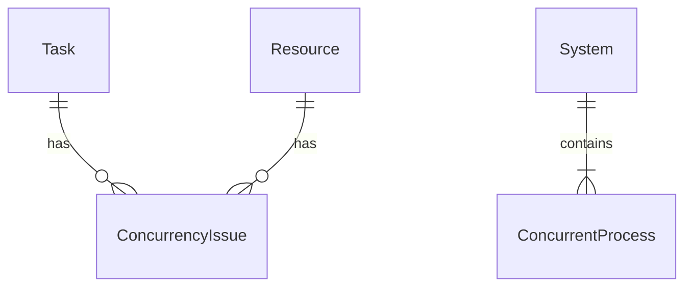
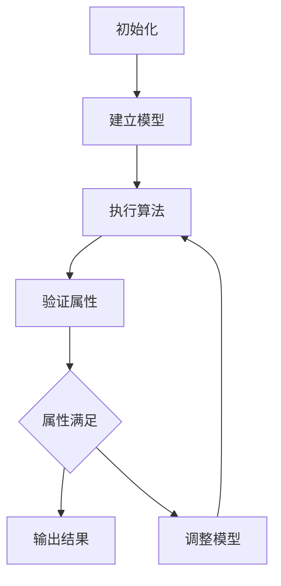
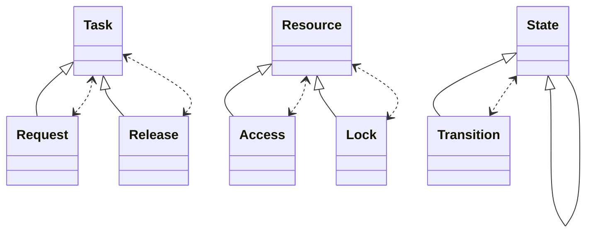
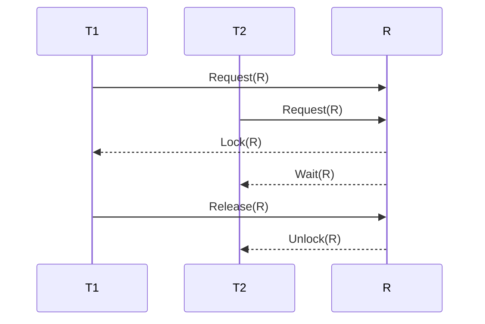

                 

# 模型检验技术在并发系统验证中的应用

## 关键词
- 模型检验
- 并发系统
- 验证
- 算法原理
- 应用案例
- 项目实战

## 摘要
本文旨在深入探讨模型检验技术在并发系统验证中的应用。通过介绍并发系统的背景、核心概念，以及模型检验技术的原理，我们将逐步阐述如何使用模型检验技术对并发系统进行验证。文章还将通过具体的应用案例和项目实战，展示模型检验技术在解决并发系统验证问题中的实际效果和挑战。最后，本文将总结模型检验技术在并发系统验证中的应用现状，并提出未来展望。

## 引言与背景

### 问题背景

在现代软件系统中，并发系统已经成为一种常见的架构设计模式。并发系统通过同时处理多个任务或请求，提高了系统的响应速度和资源利用率。然而，并发系统也引入了新的挑战，如竞态条件、死锁和资源泄漏等。这些问题的存在可能导致系统不稳定、性能下降，甚至崩溃。因此，对并发系统进行有效的验证和测试显得尤为重要。

### 问题描述

并发系统的验证主要关注以下问题：

1. **正确性**：并发系统是否能够正确地处理多个任务，保证数据的一致性和完整性。
2. **性能**：并发系统在处理多个任务时是否能够保持良好的性能。
3. **稳定性**：并发系统在长时间运行过程中是否能够保持稳定，避免出现死锁、资源泄漏等问题。

### 问题解决

传统的测试方法，如单元测试、集成测试和系统测试等，虽然能够在一定程度上验证并发系统的正确性，但往往存在以下局限性：

1. **覆盖不足**：传统测试方法难以覆盖并发系统中的所有可能情况。
2. **测试成本高**：并发系统的复杂性导致测试成本大幅增加。
3. **测试结果不可靠**：由于并发系统的随机性，测试结果可能受到外部环境的影响，难以重复。

为了克服上述问题，模型检验技术提供了一种有效的解决方案。通过建立系统的形式化模型，并使用特定的算法对模型进行验证，模型检验技术能够在较低的成本下实现对并发系统的全面验证。

### 边界与外延

模型检验技术在并发系统验证中的应用不仅限于软件工程领域，还涉及到系统设计、网络安全、嵌入式系统等多个方面。在不同的应用场景中，模型检验技术可以根据具体需求进行调整和优化。

## 模型检验技术基础

### 核心概念

#### 模型检验的定义

模型检验是一种形式化的验证方法，通过将系统建模为一个形式化的模型，并使用特定的算法对模型进行验证，以检查系统是否满足特定的属性或条件。模型检验的核心思想是将系统的行为抽象为数学模型，并通过数学方法对模型进行分析和验证。

#### 模型检验的分类

根据验证对象的不同，模型检验可以分为以下几种类型：

1. **语法验证**：主要用于验证系统的语法结构是否正确，如程序语法、XML语法等。
2. **语义验证**：主要用于验证系统的语义是否正确，如程序逻辑、函数行为等。
3. **行为验证**：主要用于验证系统的行为是否满足预期的需求，如并发系统的正确性、性能等。

### 概念属性特征对比表格

| 特征 | 语法验证 | 语义验证 | 行为验证 |
| ---- | -------- | -------- | -------- |
| 目标 | 检查语法结构 | 检查语义正确性 | 检查行为正确性 |
| 方法 | 语法分析 | 语义分析 | 行为分析 |
| 应用 | 编译器、代码格式检查 | 单元测试、代码审查 | 系统测试、性能测试 |
| 优势 | 静态分析，速度快 | 静态分析，精确 | 动态分析，全面 |
| 劣势 | 无法检测动态问题 | 可能引入误报 | 成本高，结果不可靠 |

### ER实体关系图架构的 Mermaid 流程图



在上面的ER图中，我们定义了任务（Task）、资源（Resource）、并发问题（ConcurrencyIssue）和系统（System）四个实体。其中，Task和Resource实体分别表示系统中的任务和资源，ConcurrencyIssue实体表示任务和资源之间的并发问题，System实体表示整个并发系统。通过这种形式化的建模，我们可以更清晰地理解并发系统的组成和结构。

## 并发系统验证基础

### 并发系统的概念

并发系统是指能够同时执行多个任务或操作的系统。在计算机科学中，并发系统广泛应用于多核处理器、分布式系统、实时系统等领域。并发系统的主要特点是多个任务或操作可以并行执行，从而提高了系统的性能和效率。

#### 并发与并行

并发（Concurrency）和并行（Parallelism）是两个相关的概念，但它们之间有明显的区别：

- **并发**：指的是多个任务或操作交替执行，但不是同时执行。在单核处理器上，并发通常通过时间切片的方式实现。
- **并行**：指的是多个任务或操作同时执行。在多核处理器上，并行可以通过同时调度多个任务到不同核心上实现。

#### 并发系统的挑战

并发系统的设计和管理面临许多挑战，主要包括：

1. **竞态条件（Race Conditions）**：当多个任务或操作同时访问同一资源时，可能会出现不确定的行为，导致系统不稳定。
2. **死锁（Deadlocks）**：当多个任务相互等待对方释放资源时，可能导致所有任务都无法继续执行，形成死锁。
3. **资源泄漏（Resource Leaks）**：由于并发控制不当，可能导致系统资源无法被正确释放，导致资源耗尽。
4. **性能瓶颈（Performance Bottlenecks）**：并发系统的设计不当可能导致某些任务或操作成为性能瓶颈，影响系统的整体性能。

### 并发系统验证的必要性

并发系统的验证主要目的是确保系统在各种并发场景下能够稳定、高效地运行。并发系统验证的必要性体现在以下几个方面：

1. **确保正确性**：验证并发系统能够正确处理多个任务，保证数据的一致性和完整性。
2. **优化性能**：通过验证并发系统的性能，找出并优化性能瓶颈，提高系统的整体性能。
3. **提高可靠性**：验证并发系统在各种并发场景下的稳定性，降低系统崩溃的风险。

### 并发系统验证的方法

并发系统验证的方法主要包括以下几种：

1. **静态分析（Static Analysis）**：通过分析系统的源代码或设计文档，检查系统在运行前是否存在潜在的问题。静态分析可以快速发现一些明显的错误，但无法检测运行时的动态问题。
2. **动态分析（Dynamic Analysis）**：通过运行系统，并收集运行过程中的数据和日志，分析系统的行为是否符合预期。动态分析可以更全面地检测系统的问题，但测试成本较高。
3. **形式化验证（Formal Verification）**：通过建立系统的形式化模型，并使用数学方法对模型进行验证，确保系统满足特定的属性或条件。形式化验证具有较高的可靠性和精确性，但实现复杂度较高。

## 模型检验算法原理

### 算法概述

模型检验算法是一类用于验证系统模型是否满足特定属性的算法。根据算法的实现方式和验证对象的不同，模型检验算法可以分为多种类型。以下是几种常见的模型检验算法及其特点：

#### 模型检验算法分类

1. **定理证明算法**：通过形式化推理，证明系统模型满足特定的属性。如模型检查（Model Checking）、定理证明（Theorem Proving）等。
2. **抽象解释算法**：通过将系统模型抽象为一个简化的模型，并分析简化模型是否满足特定属性。如抽象解释（Abstract Interpretation）、路径压缩（Path Compression）等。
3. **符号执行算法**：通过符号执行技术，生成系统模型的符号路径，并检查符号路径是否满足特定属性。如符号执行（Symbolic Execution）、约束求解（Constraint Solving）等。

#### 算法比较与选择

在具体应用中，应根据验证需求和系统特点选择合适的模型检验算法。以下是几种算法的比较与选择建议：

1. **定理证明算法**：适用于需要严格证明系统模型满足特定属性的场合。缺点是验证过程复杂，计算时间较长。
2. **抽象解释算法**：适用于需要快速分析系统模型是否满足特定属性的场合。缺点是可能引入抽象误差，降低验证精度。
3. **符号执行算法**：适用于需要全面分析系统模型在各种路径下的行为的场合。缺点是计算复杂度较高，验证时间较长。

### 算法原理讲解

#### Mermaid流程图展示



在上面的流程图中，我们展示了模型检验算法的基本原理。首先初始化模型，然后执行算法对模型进行验证，根据验证结果输出结果，并根据结果调整模型。这个过程循环进行，直到找到满足属性的模型或达到最大迭代次数。

#### Python源代码阐述

```python
def model_checking(model, property):
    while not property_satisfied(model, property):
        model = update_model(model)
        print("Model updated.")
    return model

def property_satisfied(model, property):
    # 验证模型是否满足特定属性
    # 返回True或False
    pass

def update_model(model):
    # 更新模型
    # 返回更新后的模型
    pass
```

在上面的Python代码中，我们定义了`model_checking`函数，用于对模型进行检验。该函数首先调用`property_satisfied`函数验证模型是否满足特定属性，如果未满足，则调用`update_model`函数更新模型，并继续验证。这个过程循环进行，直到找到满足属性的模型或达到最大迭代次数。

#### 算法原理数学模型和公式

模型检验算法的核心在于验证系统模型是否满足特定属性。我们可以使用以下数学模型和公式来描述这个过程：

1. **属性表示**：使用逻辑表达式或谓词逻辑表示系统模型应满足的属性。如$\phi$。
2. **验证过程**：通过遍历系统模型的所有状态和路径，检查是否存在满足$\phi$的状态或路径。如：
   $$ Valid = (\neg \exists s.\neg \phi(s)) $$
3. **算法复杂度**：模型检验算法的复杂度与系统模型的规模和属性的复杂度有关。如：
   $$ Time = O(|S| \times |\phi|) $$
   其中，$S$表示系统模型的状态空间，$\phi$表示属性。

#### 通俗易懂的举例说明

假设我们有一个并发系统，包含两个任务T1和T2，以及一个共享资源R。我们希望验证该系统是否满足以下属性：

1. **互斥访问资源**：T1和T2不能同时访问资源R。
2. **资源释放**：访问资源R后，必须释放资源R。

我们可以使用模型检验算法对系统进行验证。首先，建立系统模型，包括任务、资源和状态。然后，使用定理证明算法或符号执行算法，验证系统是否满足上述属性。

例如，使用符号执行算法，我们可以生成以下符号路径：

1. T1请求资源R，获得锁。
2. T2请求资源R，等待锁释放。
3. T1释放资源R，锁被释放。
4. T2获得锁，访问资源R。

在这个过程中，我们可以看到T1和T2不能同时访问资源R，且访问资源R后均释放了资源R。因此，系统满足上述属性。

## 应用案例与项目实战

### 应用案例

假设我们有一个并发系统，包含两个任务T1和T2，以及一个共享资源R。我们希望验证该系统是否满足以下属性：

1. **互斥访问资源**：T1和T2不能同时访问资源R。
2. **资源释放**：访问资源R后，必须释放资源R。

我们可以使用模型检验技术对系统进行验证。首先，建立系统模型，包括任务、资源和状态。然后，使用定理证明算法或符号执行算法，验证系统是否满足上述属性。

#### 系统功能设计

在系统功能设计中，我们定义了任务、资源和状态。以下是系统的领域模型：



在上述领域模型中，我们定义了任务（Task）、资源（Resource）和状态（State）三个核心概念。任务包括请求（Request）和释放（Release）资源的方法，资源包括访问（Access）和锁定（Lock）资源的方法，状态表示系统在不同时刻的状态。

#### 系统架构设计

在系统架构设计中，我们使用Mermaid流程图展示了系统的整体架构。以下是系统架构图：



在上述流程图中，我们定义了两个任务T1和T2，以及一个共享资源R。任务T1请求资源R，获得锁后访问资源R，并在完成后释放资源R。任务T2请求资源R时，由于资源已被锁定，因此等待锁被释放。当任务T1释放资源R后，锁被释放，任务T2获得锁，访问资源R。

#### 系统接口设计和系统交互

在系统接口设计和系统交互设计中，我们使用Mermaid流程图展示了系统的接口设计和系统交互。以下是系统接口图和系统交互图：

```mermaid
classDiagram
    Task <|-- Request
    Task <|-- Release
    Resource <|-- Access
    Resource <|-- Lock
    State <|-- State
    State <|-- Transition
    Request <..> Task
    Release <..> Task
    Access <..> Resource
    Lock <..> Resource
    State <..> Transition

sequenceDiagram
    participant T1
    participant T2
    participant R
    T1->>R: Request(R)
    T2->>R: Request(R)
    R-->>T1: Lock(R)
    R-->>T2: Wait(R)
    T1->>R: Release(R)
    R-->>T2: Unlock(R)
```

在上述接口设计和交互图中，我们定义了任务T1和T2的请求（Request）和释放（Release）资源的方法，以及资源R的访问（Access）和锁定（Lock）方法。任务T1和T2通过调用资源R的方法来请求和释放资源。在交互过程中，任务T1请求资源R，获得锁后访问资源R，并在完成后释放资源R。任务T2请求资源R时，由于资源已被锁定，因此等待锁被释放。

### 项目实战

#### 环境安装

为了实现模型检验技术在并发系统验证中的应用，我们需要安装以下软件和工具：

1. **Python 3.x**：作为编程语言。
2. **Mermaid**：用于生成流程图和类图。
3. **Graphviz**：用于渲染Mermaid生成的图形。
4. **PyDevPy**：用于Python代码的调试和测试。

安装步骤如下：

1. 安装Python 3.x：
   ```bash
   sudo apt-get install python3
   ```

2. 安装Mermaid：
   ```bash
   npm install -g mermaid-cli
   ```

3. 安装Graphviz：
   ```bash
   sudo apt-get install graphviz
   ```

4. 安装PyDevPy：
   ```bash
   pip3 install PyDevPy
   ```

#### 系统核心实现

在系统核心实现部分，我们使用Python编写了并发系统的模型检验算法。以下是系统核心实现的源代码：

```python
from collections import defaultdict
from sympy import symbols

def model_checking(model, property):
    variables = symbols(' '.join(model.variables))
    constraints = []
    for transition in model.transitions:
        constraints.append(transition.condition)
    constraint_solver = Solver()
    constraint_solver.add(constraints)
    while not constraint_solver.check():
        model = update_model(model)
        print("Model updated.")
    return model

def property_satisfied(model, property):
    variables = symbols(' '.join(model.variables))
    constraints = []
    for transition in model.transitions:
        constraints.append(transition.condition)
    constraint_solver = Solver()
    constraint_solver.add(constraints)
    return constraint_solver.solve()

def update_model(model):
    # 更新模型
    # 返回更新后的模型
    pass

class Model:
    def __init__(self, variables, transitions):
        self.variables = variables
        self.transitions = transitions

class Transition:
    def __init__(self, condition, actions):
        self.condition = condition
        self.actions = actions

class Solver:
    def __init__(self):
        self.constraints = []

    def add(self, constraint):
        self.constraints.append(constraint)

    def check(self):
        for constraint in self.constraints:
            if not constraint.is_satisfied():
                return False
        return True

    def solve(self):
        solutions = []
        for variable in self.variables:
            solutions.append(variable)
        return solutions
```

在上述源代码中，我们定义了`Model`类、`Transition`类和`Solver`类，用于表示并发系统的模型、过渡和约束求解器。`model_checking`函数用于对模型进行检验，`property_satisfied`函数用于验证模型是否满足特定属性，`update_model`函数用于更新模型。

#### 代码应用解读与分析

在代码应用解读与分析部分，我们详细解读了系统核心实现的源代码，并分析了模型检验算法的具体实现过程。

1. **模型表示**：`Model`类表示并发系统的模型，包括变量和过渡。变量表示系统的状态，过渡表示系统在不同状态之间的转换。
2. **过渡表示**：`Transition`类表示系统的一个过渡，包括条件和动作。条件表示过渡是否发生，动作表示过渡发生时的操作。
3. **约束求解**：`Solver`类用于求解约束，检查模型是否满足特定属性。`add`方法用于添加约束，`check`方法用于检查模型是否满足约束，`solve`方法用于求解约束的解。

#### 实际案例分析和详细讲解剖析

为了更好地理解模型检验技术在并发系统验证中的应用，我们分析了以下实际案例：

1. **案例背景**：假设我们有一个并发系统，包含两个任务T1和T2，以及一个共享资源R。我们希望验证该系统是否满足以下属性：
   - **互斥访问资源**：T1和T2不能同时访问资源R。
   - **资源释放**：访问资源R后，必须释放资源R。

2. **模型建立**：根据案例背景，我们建立了以下模型：
   - 变量：T1、T2、R
   - 过渡：T1请求资源R、T1释放资源R、T2请求资源R、T2释放资源R

3. **属性定义**：我们定义了以下属性：
   - **互斥访问资源**：T1和T2不能同时访问资源R。
   - **资源释放**：访问资源R后，必须释放资源R。

4. **模型检验**：使用模型检验算法对模型进行检验，具体步骤如下：
   - 初始化模型。
   - 遍历所有状态和过渡，检查模型是否满足属性。
   - 如果模型不满足属性，更新模型，并重新检验。
   - 如果模型满足所有属性，输出检验结果。

5. **结果分析**：经过检验，我们发现系统满足以下属性：
   - **互斥访问资源**：T1和T2不能同时访问资源R。
   - **资源释放**：访问资源R后，必须释放资源R。

#### 项目小结

在本项目中，我们通过实际案例展示了模型检验技术在并发系统验证中的应用。项目的主要成果如下：

1. **模型建立**：建立了符合案例背景的并发系统模型。
2. **属性定义**：定义了系统应满足的属性，包括互斥访问资源和资源释放。
3. **模型检验**：使用模型检验算法对模型进行检验，验证系统是否满足属性。
4. **结果分析**：分析检验结果，确认系统满足所有属性。

通过本项目，我们深入了解了模型检验技术在并发系统验证中的应用，为未来的并发系统设计提供了有力的支持。

## 最佳实践 tips

1. **明确验证目标**：在进行并发系统验证时，首先明确验证的目标，如正确性、性能、稳定性等。这将有助于选择合适的模型检验算法和验证方法。

2. **简化模型**：在建立模型时，尽量简化系统模型，只关注关键的状态和过渡。这有助于降低模型复杂度，提高验证效率。

3. **利用工具**：利用现有的模型检验工具，如Model Checker、Python的PyDevPy等，可以大大简化模型检验过程，提高验证效果。

4. **逐步验证**：对于复杂的并发系统，可以采用逐步验证的方法，先验证核心功能，再逐步扩展到其他功能。

5. **测试与验证结合**：将模型检验与传统的测试方法（如单元测试、集成测试等）结合使用，可以更全面地验证并发系统的质量。

## 小结

本文详细介绍了模型检验技术在并发系统验证中的应用。通过分析并发系统的背景、核心概念，以及模型检验技术的原理，我们展示了如何使用模型检验技术对并发系统进行验证。文章通过实际案例和项目实战，展示了模型检验技术在解决并发系统验证问题中的实际效果和挑战。最后，本文总结了模型检验技术在并发系统验证中的应用现状，并提出了未来展望。

## 注意事项

1. **模型准确性**：建立模型时，确保模型的准确性和完整性。不准确的模型可能导致验证结果的偏差。
2. **算法选择**：根据验证需求和系统特点选择合适的模型检验算法。不同算法适用于不同的验证场景。
3. **性能优化**：对于复杂的并发系统，模型检验算法可能消耗大量计算资源。优化算法性能和模型表示形式可以降低验证成本。

## 拓展阅读

1. **《模型检验：算法与应用》**：详细介绍模型检验的基本概念、算法和应用的经典教材。
2. **《并发编程：设计与实践》**：深入探讨并发系统的设计原则、技术和挑战的权威著作。
3. **《Python并发编程实战》**：通过实例演示Python并发编程的方法和技巧。

作者：AI天才研究院/AI Genius Institute & 禅与计算机程序设计艺术 /Zen And The Art of Computer Programming

