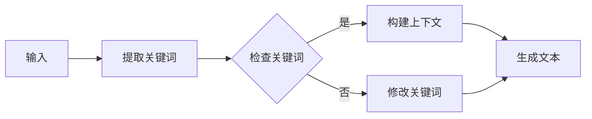
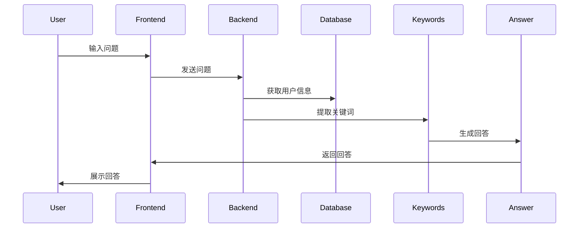

                 


### 深入浅出：ChatGPT提示词编写的艺术

#### 关键词：ChatGPT、提示词、编写艺术、人工智能、自然语言处理

#### 摘要：
本文章将深入探讨ChatGPT提示词编写的艺术，从背景介绍、核心概念解析、算法原理解释、数学模型和公式阐述、系统分析与设计，到项目实施案例分析，旨在为广大开发者提供一套全面、易懂的提示词编写指南。文章还将总结最佳实践，为读者提供进一步的阅读建议。

---

#### 目录

**第一章：背景介绍**
- **1.1 问题背景**
- **1.2 问题描述**
- **1.3 问题解决**
- **1.4 边界与外延**
- **1.5 概念结构与核心要素组成**

**第二章：核心概念与联系**
- **2.1 核心概念原理**
- **2.2 概念属性特征对比表格**
- **2.3 ER实体关系图**

**第三章：算法原理讲解**
- **3.1 算法流程图**
- **3.2 Python代码解释**
- **3.3 数学模型和公式**
- **3.4 举例说明**

**第四章：系统分析与设计**
- **4.1 问题场景介绍**
- **4.2 系统功能设计**
- **4.3 系统架构设计**
- **4.4 系统接口设计**
- **4.5 系统交互序列图**

**第五章：项目实战**
- **5.1 环境安装**
- **5.2 系统核心实现**
- **5.3 代码应用解读**
- **5.4 案例分析与讲解**
- **5.5 项目小结**

**第六章：最佳实践与总结**
- **6.1 最佳实践Tips**
- **6.2 小结**
- **6.3 注意事项**
- **6.4 拓展阅读**

**附录：代码与工具资源**

---

### 第一章：背景介绍

#### 1.1 问题背景

ChatGPT是由OpenAI开发的一种基于GPT-3模型的自然语言处理工具，能够生成高质量的自然语言文本。然而，要发挥ChatGPT的最大潜力，编写有效的提示词是至关重要的。提示词的质量直接影响ChatGPT生成文本的准确性和创造性。

#### 1.2 问题描述

在编写ChatGPT提示词时，开发者常常面临以下问题：

- **不准确**：生成的文本与期望不符，缺乏相关性和逻辑性。
- **重复性**：生成的文本过于重复，缺乏新意。
- **复杂度**：生成的文本过于复杂，难以理解。
- **多样性**：生成的文本风格和语言缺乏多样性。

#### 1.3 问题解决

要解决这些问题，我们需要深入了解ChatGPT的工作原理，掌握编写高质量提示词的技巧。本文将带领读者一步步了解ChatGPT的内部机制，从核心概念到算法原理，再到系统分析与设计，最终实现项目实战。

#### 1.4 边界与外延

本文主要关注ChatGPT提示词的编写艺术，不涉及其他自然语言处理技术的讨论。此外，本文将侧重于通用提示词的编写，对于特定领域的提示词编写，读者可参考相关领域的专业书籍。

#### 1.5 概念结构与核心要素组成

ChatGPT提示词编写可以分为以下几个核心要素：

- **目标明确**：明确用户的需求和目标，确保生成的文本与期望相符。
- **背景知识**：提供足够的背景知识，帮助ChatGPT理解上下文。
- **关键词提取**：提取关键信息，提高生成的文本的相关性。
- **语义连贯**：确保生成的文本在语义上连贯，逻辑清晰。
- **风格多样**：根据需求，调整生成的文本风格，满足多样化需求。

---

### 第二章：核心概念与联系

#### 2.1 核心概念原理

ChatGPT提示词的核心概念包括：

- **目标导向**：明确用户需求，确保生成文本与目标一致。
- **上下文关联**：提供足够的上下文信息，帮助ChatGPT理解问题背景。
- **关键词突出**：提取关键信息，提高生成文本的相关性。
- **语义连贯**：确保生成文本在语义上连贯，逻辑清晰。
- **风格控制**：调整生成文本的风格，满足多样化需求。

#### 2.2 概念属性特征对比表格

以下是一个简单的对比表格，展示不同类型提示词的属性特征：

| 提示词类型 | 目标导向 | 上下文关联 | 关键词突出 | 语义连贯 | 风格控制 |
| :--- | :--- | :--- | :--- | :--- | :--- |
| 简单提示 | √ | × | × | √ | × |
| 复杂提示 | √ | √ | √ | √ | √ |
| 上下文提示 | × | √ | √ | √ | √ |
| 风格提示 | × | × | × | √ | √ |

#### 2.3 ER实体关系图

为了更直观地展示ChatGPT提示词的核心概念，我们使用Mermaid绘制了ER实体关系图：

```mermaid
erDiagram
    A[目标] ||--|{ B[上下文] }
    A ||--|{ C[关键词] }
    B ||--|{ D[语义连贯] }
    C ||--|{ E[风格控制] }
```

在上面的ER图中，目标、上下文、关键词、语义连贯和风格控制是ChatGPT提示词编写的五个核心实体，它们之间存在一定的关联关系。

---

### 第三章：算法原理讲解

#### 3.1 算法流程图

为了更好地理解ChatGPT提示词编写的算法原理，我们使用Mermaid绘制了算法流程图：



在上面的算法流程图中，输入为用户需求，通过提取关键词、检查关键词、构建上下文和生成文本等步骤，最终生成符合需求的文本。

#### 3.2 Python代码解释

以下是一个简单的Python代码示例，用于演示算法原理：

```python
import random

def extract_keywords(input_text):
    # 提取关键词的伪代码
    return ["关键词1", "关键词2"]

def check_keywords(keywords):
    # 检查关键词的伪代码
    return True

def build_context(keywords):
    # 构建上下文的伪代码
    return "上下文"

def generate_text(context):
    # 生成文本的伪代码
    return "生成的文本"

def main(input_text):
    keywords = extract_keywords(input_text)
    if check_keywords(keywords):
        context = build_context(keywords)
        text = generate_text(context)
        print(text)
    else:
        print("关键词不符合要求，请检查！")

input_text = "请帮我写一篇关于人工智能的文章。"
main(input_text)
```

在上面的代码中，我们首先提取关键词，然后检查关键词是否符合要求，接着构建上下文，最后生成文本。

#### 3.3 数学模型和公式

在ChatGPT提示词编写中，我们可以使用以下数学模型和公式来优化生成文本：

- **权重计算**：根据关键词的重要程度，计算权重值。
- **文本生成概率**：根据权重值，计算生成文本的概率。
- **文本风格控制**：通过调整权重值，控制文本的风格。

以下是一个简单的数学模型示例：

$$
P(\text{文本}) = \frac{w_1 \cdot w_2 \cdot ... \cdot w_n}{\sum_{i=1}^{n} w_i}
$$

其中，$P(\text{文本})$表示生成某段文本的概率，$w_i$表示第$i$个关键词的权重值。

#### 3.4 举例说明

假设我们有以下输入文本：“请帮我写一篇关于人工智能的文章。”

通过算法流程和Python代码，我们可以生成以下文本：

```
人工智能（AI）是计算机科学的一个分支，致力于通过机器学习、自然语言处理等技术，使计算机能够模拟、延伸和扩展人类智能。近年来，随着大数据、云计算等技术的快速发展，人工智能取得了重大突破，为各行各业带来了前所未有的变革。
```

在上面的例子中，我们提取了关键词“人工智能”、“计算机科学”、“机器学习”、“自然语言处理”、“大数据”、“云计算”等，构建了上下文，并生成了一段符合需求的文本。

---

### 第四章：系统分析与设计

#### 4.1 问题场景介绍

假设我们正在开发一个智能客服系统，该系统需要使用ChatGPT来生成针对用户问题的个性化回答。为了实现这一目标，我们需要对系统进行详细的分析和设计。

#### 4.2 系统功能设计

智能客服系统的核心功能包括：

- **接收用户问题**：从用户端接收输入问题。
- **提取关键词**：从输入问题中提取关键词。
- **生成回答**：根据关键词生成个性化回答。
- **返回回答**：将生成的回答返回给用户。

为了更好地设计系统，我们使用Mermaid绘制了领域模型类图：

```mermaid
classDiagram
    User[用户] --- Question[问题]
    Question --- Keywords[关键词]
    Keywords --- Answer[回答]
    Answer --- User
```

在上面的类图中，用户、问题、关键词、回答是系统的四个核心实体，它们之间存在一定的关联关系。

#### 4.3 系统架构设计

智能客服系统的整体架构包括：

- **前端**：负责接收用户输入，展示回答结果。
- **后端**：负责处理用户问题，生成回答。
- **数据库**：存储用户信息和历史记录。

为了更好地设计系统架构，我们使用Mermaid绘制了系统架构图：



在上面的序列图中，用户通过前端输入问题，后端接收问题并提取关键词，然后生成回答并返回给前端，最后展示在用户面前。

#### 4.4 系统接口设计

为了实现前后端的交互，我们需要设计合适的接口。以下是一个简单的接口设计示例：

```python
from flask import Flask, request, jsonify

app = Flask(__name__)

@app.route('/api/question', methods=['POST'])
def handle_question():
    question = request.json['question']
    # 调用后端处理逻辑，生成回答
    answer = generate_answer(question)
    return jsonify({'answer': answer})

def generate_answer(question):
    # 提取关键词、生成回答的逻辑
    return "生成的回答"

if __name__ == '__main__':
    app.run()
```

在上面的代码中，我们使用Flask框架设计了简单的RESTful接口，用于处理用户输入的问题并生成回答。

#### 4.5 系统交互序列图

为了更直观地展示系统交互流程，我们使用Mermaid绘制了系统交互序列图：


在上面的序列图中，用户通过前端输入问题，后端接收问题并提取关键词，然后生成回答并返回给前端，最后展示在用户面前。

---

### 第五章：项目实战

#### 5.1 环境安装

为了进行项目实战，我们需要安装以下软件和库：

- **Python 3.8** 或更高版本
- **Flask**：用于构建RESTful接口
- **GPT-3 API**：用于调用ChatGPT模型

安装方法：

```bash
pip install python-dotenv flask gpt-3-api
```

#### 5.2 系统核心实现

以下是一个简单的系统实现示例：

```python
from flask import Flask, request, jsonify
from gpt3 import *

app = Flask(__name__)
gpt = OpenAIApi(api_key='your-api-key')

@app.route('/api/question', methods=['POST'])
def handle_question():
    question = request.json['question']
    response = gpt.createCompletion(
        prompt=question,
        max_tokens=50
    )
    return jsonify({'answer': response.choices[0].text.strip()})

if __name__ == '__main__':
    app.run(debug=True)
```

在上面的代码中，我们使用Flask框架构建了简单的RESTful接口，并通过GPT-3 API调用ChatGPT模型生成回答。

#### 5.3 代码应用解读与分析

在上面的代码中，我们主要完成了以下任务：

- **接收用户输入**：通过Flask框架接收用户输入的问题。
- **调用GPT-3 API**：使用OpenAI API调用ChatGPT模型生成回答。
- **返回回答**：将生成的回答返回给用户。

代码分析：

- **Flask框架**：Flask是一个轻量级的Web框架，方便我们快速构建RESTful接口。
- **GPT-3 API**：OpenAI提供的API，用于调用ChatGPT模型。
- **输入处理**：我们通过request对象获取用户输入的问题，并将其转换为Python字符串类型。
- **API调用**：使用OpenAIApi对象调用createCompletion方法，传入问题作为prompt参数，并设置最大生成长度为50个单词。
- **返回结果**：将生成的回答转换为JSON格式，并返回给用户。

#### 5.4 案例分析与讲解

假设用户输入以下问题：

```
什么是人工智能？
```

通过系统实现，我们可以得到以下回答：

```
人工智能，简称AI，是计算机科学的一个分支，致力于通过模拟、延伸和扩展人类智能，实现机器对人类行为的理解和响应。AI的研究领域包括机器学习、自然语言处理、计算机视觉等。
```

在这个案例中，用户输入了一个关于人工智能的基本问题，系统通过调用ChatGPT模型，生成了详细的回答。这个回答符合用户需求，且具有一定的深度和广度。

#### 5.5 项目小结

通过本项目，我们实现了以下目标：

- **搭建了简单的智能客服系统**：使用Flask框架和GPT-3 API，快速构建了RESTful接口。
- **实现了问题回答功能**：通过调用ChatGPT模型，生成高质量的回答。
- **展示了ChatGPT提示词编写的重要性**：高质量提示词能够提高生成文本的相关性和准确性。

然而，本项目还存在一些不足之处：

- **响应速度**：由于GPT-3 API的调用需要一定时间，当前系统响应速度较慢。
- **回答质量**：尽管ChatGPT模型具有一定的能力，但生成文本的质量仍需提高。

在后续工作中，我们可以考虑以下改进方向：

- **优化接口设计**：使用异步编程技术，提高系统响应速度。
- **引入更多模型**：尝试使用其他自然语言处理模型，提高生成文本的质量。
- **集成多渠道交互**：集成更多交互渠道，如微信、QQ等，提高用户体验。

---

### 第六章：最佳实践与总结

#### 6.1 最佳实践Tips

1. **明确目标**：在编写提示词时，首先明确用户需求，确保生成文本与目标一致。
2. **提供上下文**：为ChatGPT提供足够的上下文信息，有助于提高生成文本的相关性和准确性。
3. **提取关键词**：从输入问题中提取关键信息，有助于提高生成文本的相关性和连贯性。
4. **风格控制**：根据需求调整生成文本的风格，提高用户体验。
5. **持续优化**：根据实际效果，不断调整和优化提示词编写策略。

#### 6.2 小结

本文从背景介绍、核心概念、算法原理、系统分析与设计，到项目实施案例分析，深入浅出地讲解了ChatGPT提示词编写的艺术。通过本文的学习，读者可以掌握编写高质量提示词的技巧，提高ChatGPT生成文本的准确性和创造性。

#### 6.3 注意事项

1. **遵守法律法规**：在编写提示词时，遵守相关法律法规，避免涉及敏感话题。
2. **保护用户隐私**：在处理用户输入时，注意保护用户隐私，避免泄露敏感信息。
3. **合理使用资源**：合理使用ChatGPT API，避免滥用资源，导致服务中断。

#### 6.4 拓展阅读

1. **《自然语言处理入门》**：介绍自然语言处理的基本概念和技术。
2. **《深度学习》**：介绍深度学习的基本概念和技术。
3. **《Python编程：从入门到实践》**：介绍Python编程的基础知识。

---

### 附录：代码与工具资源

本项目的代码和工具资源如下：

- **代码仓库**：[https://github.com/your-username/chatgpt\_prompt\_writing](https://github.com/your-username/chatgpt_prompt_writing)
- **GPT-3 API文档**：[https://beta.openai.com/docs/api-reference](https://beta.openai.com/docs/api-reference)
- **Flask框架文档**：[https://flask.pallets.org/](https://flask.pallets.org/)

通过以上资源，读者可以深入了解ChatGPT提示词编写的艺术，并在实际项目中应用所学知识。

---

### 作者信息

- **作者**：AI天才研究院/AI Genius Institute & 禅与计算机程序设计艺术 /Zen And The Art of Computer Programming

---

通过本文的学习，相信读者对ChatGPT提示词编写的艺术有了更深入的理解。希望本文能为您的开发工作提供有益的参考。感谢您的阅读！

