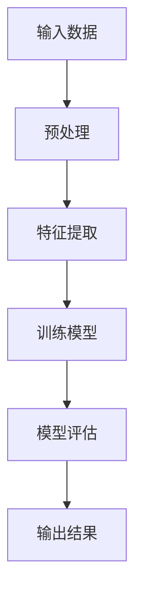

                 

### 深度伪造技术与虚假信息安全的博弈

**关键词：深度伪造、虚假信息、网络安全、社会治理**

**摘要：**
随着技术的进步，深度伪造（Deepfake）技术的应用日益广泛，其在娱乐、医疗等多个领域展现出巨大的潜力。然而，这一技术同样被恶意利用，成为制造虚假信息的工具，给网络安全和社会治理带来了新的挑战。本文旨在深入探讨深度伪造技术的基本原理、虚假信息的传播机制，以及如何通过技术手段和法律监管来应对这一新兴威胁。

---

#### 第一部分：背景介绍

##### 1.1 问题背景

在数字化时代，信息传播的速度和广度前所未有。互联网的普及和社交媒体的兴起使得信息可以在短时间内跨越地域和文化的界限，传播给全球的观众。然而，这也为虚假信息和深度伪造技术的传播提供了土壤。

虚假信息指的是故意传播的、误导性的信息，而深度伪造技术则利用人工智能和机器学习算法，生成逼真的音频、视频和图像。这些技术可以被用来制作虚假的新闻报道、伪造名人言论、甚至模仿政治领导人的声音和形象。

##### 1.2 问题描述

虚假信息和深度伪造技术对个人、社会和经济的危害是多方面的：

- **误导公众**：虚假信息可以操纵公众情绪，导致恐慌、愤怒或其他负面情绪，对社会稳定构成威胁。
- **破坏社会信任**：虚假信息的传播会损害公众对媒体和政府的信任，影响社会信任体系。
- **影响经济**：虚假信息可能导致股市波动、商业决策失误，进而影响经济稳定。
- **干扰选举**：在选举期间，虚假信息可以被用来操纵选民意见，影响选举结果。

##### 1.3 问题解决

解决虚假信息和深度伪造技术问题需要多方面的努力：

- **技术手段**：开发先进的检测和识别算法，提高虚假信息的识别能力。
- **法律监管**：制定和执行相关法律法规，对制造和传播虚假信息的行为进行惩罚。
- **公众教育**：提高公众的信息素养，增强辨别虚假信息的能力。

##### 1.4 边界与外延

深度伪造技术不仅限于视频、音频和文本的伪造，还可能扩展到生物特征、面部识别等领域。虚假信息的传播途径也不仅仅是互联网，还包括新闻媒体、社交媒体等传统渠道。

##### 1.5 概念结构与核心要素组成

- **核心概念**：深度伪造技术、虚假信息、网络安全、社会治理。
- **核心要素**：技术手段（如检测算法、验证机制等）、法律监管（如立法、执法等）、公众教育（如信息素养教育等）。

---

## 第二部分：核心概念与联系

##### 2.1 深度伪造技术的原理与特点

深度伪造技术（Deepfake）是利用深度学习算法生成逼真的人脸、声音、文本等信息的先进技术。其基本原理是通过生成对抗网络（GAN）等模型，将真实的图像或声音作为输入，通过不断迭代优化，生成与真实内容高度相似的新内容。

#### 2.1.1 原理

GAN是一种由两个神经网络（生成器G和判别器D）组成的框架。生成器G的目的是生成逼真的数据，而判别器D的任务是区分生成数据和真实数据。通过不断的训练，生成器G不断优化生成能力，使生成的数据越来越逼真。

$$
\text{GAN:} \quad G(x) \sim p_G(z), \quad D(x) \sim p_D(x)
$$

其中，\( x \) 是真实数据，\( z \) 是随机噪声，\( p_G(z) \) 是生成器的概率分布，\( p_D(x) \) 是判别器的概率分布。

#### 2.1.2 特点

- **高真实感**：深度伪造技术可以生成极其逼真的图像和视频，几乎难以与真实内容区分。
- **高效率**：生成速度较快，适应实时应用场景，如视频聊天、直播等。
- **可定制化**：可以根据需求定制生成特定内容，如特定的面部表情、声音等。

##### 2.2 虚假信息的属性特征对比表格

| 特征         | 深度伪造技术      | 传统虚假信息     |
| ------------ | ---------------- | --------------- |
| 形式         | 视频、音频、文本  | 文本、图片、图表 |
| 真实感       | 高真实感         | 较低            |
| 生成速度     | 较快             | 较慢            |
| 可定制化     | 可定制           | 不可定制         |

##### 2.3 深度伪造技术与虚假信息的联系

深度伪造技术的出现，为虚假信息的传播提供了新的手段。通过深度伪造技术，虚假信息可以以更真实、更难以识别的形式出现，从而更容易误导公众。另一方面，虚假信息的传播也可能为深度伪造技术的滥用提供土壤，形成恶性循环。

---

## 第三部分：算法原理讲解

##### 3.1 检测算法的Mermaid流程图



##### 3.2 深度伪造检测算法的Python源代码

```python
# 深度伪造检测算法示例
import tensorflow as tf

# 定义模型
model = tf.keras.Sequential([
    tf.keras.layers.Conv2D(32, (3, 3), activation='relu', input_shape=(128, 128, 3)),
    tf.keras.layers.MaxPooling2D((2, 2)),
    tf.keras.layers.Conv2D(64, (3, 3), activation='relu'),
    tf.keras.layers.MaxPooling2D((2, 2)),
    tf.keras.layers.Flatten(),
    tf.keras.layers.Dense(64, activation='relu'),
    tf.keras.layers.Dense(1, activation='sigmoid')
])

# 编译模型
model.compile(optimizer='adam', loss='binary_crossentropy', metrics=['accuracy'])

# 训练模型
model.fit(x_train, y_train, epochs=10, batch_size=32, validation_data=(x_val, y_val))

# 评估模型
loss, accuracy = model.evaluate(x_test, y_test)
print(f"Test accuracy: {accuracy:.2f}")
```

##### 3.3 深度伪造检测算法的数学模型

深度伪造检测算法通常基于卷积神经网络（CNN），其数学模型如下：

$$
\begin{aligned}
    h_l &= \sigma(W_l \cdot h_{l-1} + b_l) \\
    \hat{y} &= \sigma(W_y \cdot h_L + b_y)
\end{aligned}
$$

其中，\( h_l \) 表示第 \( l \) 层的输出，\( \hat{y} \) 表示模型的预测输出，\( \sigma \) 表示激活函数（如Sigmoid或ReLU），\( W_l \) 和 \( b_l \) 分别表示第 \( l \) 层的权重和偏置。

##### 3.4 检测算法的举例说明

假设我们有一个深度伪造检测模型，其输入为一张128x128x3的图像，经过5层卷积神经网络和2层全连接神经网络，输出一个二分类结果（是否为深度伪造）。

1. **预处理**：对图像进行归一化处理，将像素值缩放到[0, 1]之间。
2. **特征提取**：通过卷积层提取图像的特征，如边缘、纹理等。
3. **训练模型**：使用标记数据集（包括深度伪造图像和真实图像）训练模型，通过反向传播更新权重。
4. **模型评估**：使用测试集评估模型的性能，计算准确率、召回率等指标。
5. **输出结果**：对新的图像进行检测，输出是否为深度伪造的二分类结果。

通过以上步骤，我们可以有效地检测深度伪造图像，为虚假信息治理提供技术支持。

---

在接下来的部分，我们将进一步探讨深度伪造技术的应用场景、面临的挑战以及可能的解决方案。请持续关注。

