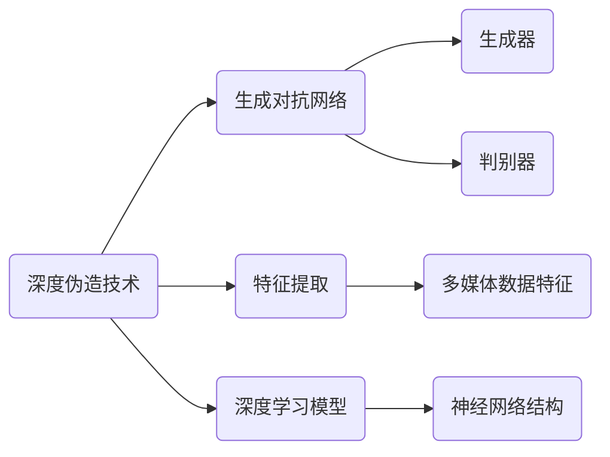
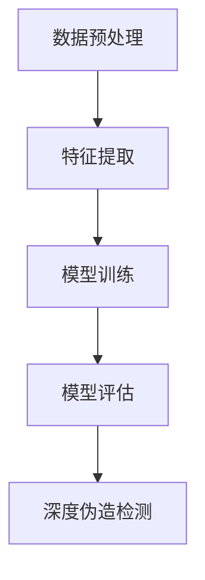

                 

# 深度伪造技术的检测与防御

关键词：深度伪造、检测算法、防御技术、生成对抗网络、深度学习模型

摘要：深度伪造技术以其逼真的效果引发了广泛关注，同时也带来了严重的安全隐患。本文从问题背景、核心概念、检测算法原理等多个角度，详细探讨了深度伪造技术的检测与防御方法，旨在为相关领域的研究者和开发者提供参考。

## 第1章: 深度伪造技术的检测与防御背景

### 1.1 问题背景

深度伪造技术（Deepfake）是近年来迅速崛起的一项技术，它利用生成对抗网络（GAN）等深度学习算法，可以伪造出高度逼真的语音、图像和视频。这种技术的应用范围广泛，涵盖了娱乐、艺术、媒体、政治等领域。然而，深度伪造技术的滥用也带来了许多问题，如隐私侵犯、虚假信息传播、政治恶搞等。

隐私侵犯是深度伪造技术最直接的负面影响。通过伪造他人的面部表情、声音和动作，不法分子可以制作出极具欺骗性的视频和音频，严重侵犯个人隐私。虚假信息传播是深度伪造技术的另一大问题。通过伪造新闻视频、政治宣传视频等，不法分子可以在社交媒体上传播虚假信息，误导公众，影响社会稳定。政治恶搞也是深度伪造技术的一种滥用方式。通过伪造政治领袖的言论和行动，不法分子可以制造政治谣言，影响选举结果。

### 1.2 问题描述

深度伪造技术的广泛应用引发了社会对真实性与诚信的质疑。在政治、商业、司法等领域，深度伪造技术的滥用可能导致严重后果。例如，政治领袖的虚假言论可能导致政治动荡，商业广告的虚假宣传可能导致消费者损失，司法证据的伪造可能导致冤案的发生。因此，如何有效地检测与防御深度伪造技术，已成为当前信息安全领域的一个关键问题。

### 1.3 问题解决

针对深度伪造技术的检测与防御问题，可以从技术手段和法律法规两个方面进行解决。

技术手段方面，可以采用特征提取、模型训练、图像对比等方法来检测深度伪造内容。例如，可以提取图像中的纹理、颜色、人脸特征等特征，利用深度学习模型进行分类和识别。此外，还可以通过图像对比技术，比较深度伪造图像与原始图像的差异，判断图像是否为深度伪造。

法律法规方面，需要建立健全的监管机制，对深度伪造技术的滥用进行严厉打击。例如，可以制定相关法律法规，对深度伪造技术的开发、传播和使用进行规范，对违法行为进行处罚。此外，还可以建立深度伪造技术的监测与举报平台，及时发现和处理深度伪造内容。

### 1.4 边界与外延

深度伪造技术的检测与防御是一个跨学科、跨领域的复杂问题。它不仅涉及到计算机视觉、机器学习等技术，还涉及到法律、伦理、社会等多个方面。因此，在解决这一问题时，需要多方协作，共同推动技术的进步与法律法规的完善。

### 1.5 概念结构与核心要素组成

深度伪造技术的检测与防御主要包括以下几个核心要素：

1. **特征提取**：从图像、语音、视频等多媒体数据中提取出能够表征真实性的特征。
2. **模型训练**：利用提取出的特征，训练深度学习模型，用于识别和分类深度伪造内容。
3. **图像对比**：通过对比真实图像与深度伪造图像的相似度，判断图像是否为深度伪造。
4. **法律法规**：建立健全的监管机制，对深度伪造技术的滥用进行打击。
5. **公众教育**：提高公众对深度伪造技术的识别能力，减少虚假信息的传播。

## 第2章: 深度伪造技术的核心概念与联系

### 2.1 核心概念原理

深度伪造技术的核心概念包括生成对抗网络（GAN）、特征提取和深度学习模型。这些概念相互关联，共同构成了深度伪造技术的基础。

1. **生成对抗网络（GAN）**：GAN由生成器和判别器组成。生成器的任务是生成逼真的图像，判别器的任务是区分真实图像和生成图像。两者相互对抗，通过不断训练，生成器的生成质量逐渐提高，判别器的判别能力逐渐增强。
2. **特征提取**：特征提取是从多媒体数据中提取出能够表征数据特性的信息。在深度伪造技术中，特征提取的目的是提取出深度伪造图像与真实图像的区别，以便于后续的检测和识别。
3. **深度学习模型**：深度学习模型是一种通过多层神经网络进行特征提取和分类的算法。在深度伪造技术中，深度学习模型用于训练和识别深度伪造图像。

### 2.2 概念属性特征对比表格

| 概念               | 属性特征                 | 相互关系                |
|--------------------|--------------------------|------------------------|
| 生成对抗网络（GAN） | 生成器、判别器           | 对抗性训练，相互竞争   |
| 特征提取           | 多媒体数据特征           | 辅助深度学习模型训练   |
| 深度学习模型       | 神经网络结构             | 用于识别和分类深度伪造 |

### 2.3 ER实体关系图架构

## 第3章: 深度伪造检测算法原理讲解

### 3.1 算法原理概述

深度伪造检测算法主要基于生成对抗网络（GAN）和深度学习模型。以下将详细介绍这些算法的基本原理。

### 3.2 生成对抗网络（GAN）原理讲解

生成对抗网络（GAN）由生成器和判别器组成，两者相互对抗，共同提高生成图像的质量和判别器的判别能力。

1. **生成器**：生成器的任务是生成逼真的图像。它通过学习真实图像的数据分布，生成与真实图像相似的图像。生成器通常由多个神经网络层组成，包括输入层、卷积层、反卷积层等。
2. **判别器**：判别器的任务是区分真实图像和生成图像。它通过学习真实图像和生成图像的特征，提高对生成图像的判别能力。判别器通常由多个神经网络层组成，包括输入层、卷积层、全连接层等。
3. **对抗性训练**：生成器和判别器通过对抗性训练相互竞争。生成器试图生成更逼真的图像，以欺骗判别器，而判别器则试图准确区分真实图像和生成图像。通过这种对抗性训练，生成器的生成质量和判别器的判别能力都得到了提高。

### 3.3 特征提取算法讲解

特征提取是深度伪造检测的重要环节。以下介绍一种常见的方法——卷积神经网络（CNN）。

1. **输入层**：输入层接收多媒体数据，如图像、语音等。
2. **卷积层**：卷积层通过卷积操作提取图像的特征。卷积层通常包括多个卷积核，每个卷积核提取图像的不同特征。
3. **池化层**：池化层用于降低图像的分辨率，减少参数数量，提高计算效率。
4. **全连接层**：全连接层将卷积层和池化层提取的特征进行合并，形成完整的特征向量。
5. **输出层**：输出层用于分类和识别，通常包括一个或多个神经元，每个神经元表示一个类别。

### 3.4 深度学习模型讲解

深度学习模型是一种通过多层神经网络进行特征提取和分类的算法。以下以卷积神经网络（CNN）为例，介绍深度学习模型的基本原理。

1. **神经网络结构**：神经网络由多个神经元组成，每个神经元都与其他神经元相连。神经元的连接权重通过训练进行调整。
2. **前向传播**：输入数据通过神经网络的各个层进行传递，直到输出层得到预测结果。
3. **反向传播**：根据预测结果和实际结果的误差，调整神经网络的权重，使得预测结果更接近实际结果。
4. **优化算法**：优化算法用于调整神经网络的权重，常用的优化算法包括梯度下降、随机梯度下降等。

### 3.5 检测流程讲解

深度伪造检测的基本流程包括以下几个步骤：

1. **数据预处理**：对图像、语音等数据进行预处理，包括归一化、去噪等操作。
2. **特征提取**：利用卷积神经网络（CNN）等算法提取图像、语音等数据中的特征。
3. **模型训练**：利用提取出的特征，训练深度学习模型，包括生成器和判别器。
4. **模型评估**：对训练好的模型进行评估，包括准确率、召回率、F1值等指标。
5. **深度伪造检测**：利用训练好的模型对新的图像、语音等进行深度伪造检测，判断是否为深度伪造内容。

### 3.6 检测算法的mermaid流程图

## 第4章: 深度伪造防御技术分析

### 4.1 防御技术概述

深度伪造技术的防御主要包括以下几个方面：

1. **数据隐私保护**：通过加密、匿名化等技术，保护用户数据的隐私。
2. **内容监管**：建立健全的内容监管机制，对深度伪造内容进行监控和过滤。
3. **法律法规**：制定相关法律法规，对深度伪造技术的滥用进行严厉打击。
4. **公众教育**：提高公众对深度伪造技术的识别能力，减少虚假信息的传播。

### 4.2 数据隐私保护

数据隐私保护是防御深度伪造技术的重要手段之一。通过加密、匿名化等技术，可以有效保护用户数据的隐私。

1. **加密技术**：加密技术可以将原始数据转换为难以解读的密文，确保数据在传输和存储过程中不被窃取或篡改。常用的加密算法包括对称加密和非对称加密。
2. **匿名化技术**：匿名化技术可以将个人身份信息与数据分离，确保数据在分析和使用过程中不会泄露个人隐私。常见的匿名化方法包括数据混淆、数据聚合等。

### 4.3 内容监管

内容监管是防御深度伪造技术的重要手段之一。通过建立健全的内容监管机制，可以及时发现和处理深度伪造内容。

1. **实时监控**：实时监控是发现深度伪造内容的关键。可以通过部署监控系统、使用人工智能算法等方式，实时监控互联网上的深度伪造内容。
2. **过滤技术**：过滤技术可以自动识别和过滤深度伪造内容。常用的过滤技术包括基于规则的过滤、基于内容的过滤等。
3. **举报机制**：建立举报机制，鼓励公众参与深度伪造内容的举报和监管。

### 4.4 法律法规

法律法规是防御深度伪造技术的有力武器。通过制定相关法律法规，可以规范深度伪造技术的开发、传播和使用。

1. **立法**：制定相关法律法规，明确深度伪造技术的合法使用范围和法律责任。
2. **执法**：加强执法力度，对深度伪造技术的滥用行为进行严厉打击。
3. **国际合作**：加强国际合作，共同应对深度伪造技术的全球性挑战。

### 4.5 公众教育

公众教育是防御深度伪造技术的重要环节。通过提高公众对深度伪造技术的识别能力，可以减少虚假信息的传播。

1. **宣传教育**：通过媒体、网络等渠道，普及深度伪造技术的相关知识，提高公众的防范意识。
2. **培训课程**：开设培训课程，教授公众如何识别和防范深度伪造技术。
3. **案例分析**：通过案例分析，让公众了解深度伪造技术的危害和防范方法。

## 第5章: 深度伪造检测与防御技术的应用场景

### 5.1 政治领域

在政治领域，深度伪造技术可以用于伪造政治领袖的言论和行动，制造政治谣言，影响选举结果。因此，对深度伪造技术的检测与防御在政治领域具有重要意义。

1. **检测技术**：可以通过特征提取和深度学习模型，对政治视频和音频进行深度伪造检测，及时发现和处理虚假信息。
2. **防御技术**：可以通过数据隐私保护、内容监管和法律法规等手段，防止深度伪造技术的滥用，维护政治领域的真实性和诚信。

### 5.2 商业领域

在商业领域，深度伪造技术可以用于伪造广告、虚假宣传，误导消费者。因此，对深度伪造技术的检测与防御在商业领域具有重要意义。

1. **检测技术**：可以通过特征提取和深度学习模型，对商业广告和宣传内容进行深度伪造检测，及时发现和处理虚假广告。
2. **防御技术**：可以通过数据隐私保护、内容监管和法律法规等手段，防止深度伪造技术的滥用，维护商业领域的真实性和诚信。

### 5.3 司法领域

在司法领域，深度伪造技术可以用于伪造证据、操纵司法程序，严重危害司法公正。因此，对深度伪造技术的检测与防御在司法领域具有重要意义。

1. **检测技术**：可以通过特征提取和深度学习模型，对司法证据进行深度伪造检测，及时发现和处理伪造证据。
2. **防御技术**：可以通过数据隐私保护、内容监管和法律法规等手段，防止深度伪造技术的滥用，维护司法领域的真实性和公正性。

## 第6章: 深度伪造检测与防御技术的未来发展趋势

### 6.1 技术发展

随着人工智能技术的不断发展，深度伪造检测与防御技术也在不断进步。未来，可以预见以下几个发展方向：

1. **算法优化**：深度学习算法的性能和效率将不断提高，使得深度伪造检测与防御技术更加准确和高效。
2. **多模态融合**：将图像、语音、视频等多种数据类型进行融合，提高深度伪造检测的准确性和全面性。
3. **实时性提升**：提升深度伪造检测的实时性，实现实时监控和快速响应。

### 6.2 法律法规

在法律法规方面，未来需要进一步完善和加强。可以从以下几个方面着手：

1. **国际协作**：加强国际间的协作，共同制定和实施深度伪造技术的法律法规。
2. **跨国执法**：建立跨国执法机制，对深度伪造技术的跨国滥用行为进行严厉打击。
3. **公众参与**：鼓励公众参与深度伪造技术的监管，提高公众的防范意识。

### 6.3 公众教育

公众教育是防御深度伪造技术的重要一环。未来，可以从以下几个方面加强公众教育：

1. **知识普及**：通过媒体、网络等渠道，普及深度伪造技术的相关知识，提高公众的防范意识。
2. **技能培训**：开设培训课程，教授公众如何识别和防范深度伪造技术。
3. **案例分析**：通过案例分析，让公众了解深度伪造技术的危害和防范方法。

## 第7章: 结论

深度伪造技术的检测与防御是一个复杂而重要的课题。本文从问题背景、核心概念、检测算法原理、防御技术分析、应用场景和未来发展趋势等多个角度，详细探讨了深度伪造技术的检测与防御方法。通过本文的研究，我们得出以下结论：

1. **技术手段**：特征提取、模型训练、图像对比等技术手段在深度伪造检测中发挥了重要作用，可以有效地识别和分类深度伪造内容。
2. **法律法规**：建立健全的法律法规，对深度伪造技术的滥用进行严厉打击，是防御深度伪造技术的重要手段。
3. **公众教育**：提高公众对深度伪造技术的识别能力，减少虚假信息的传播，是防御深度伪造技术的重要环节。

未来，需要进一步加强深度伪造检测与防御技术的研究，完善法律法规体系，加强公众教育，共同应对深度伪造技术的挑战。

## 第8章: 最佳实践 Tips

1. **数据安全**：在进行深度伪造检测时，要确保数据的安全性和隐私性，避免数据泄露。
2. **实时监控**：建立实时监控机制，及时发现和处理深度伪造内容。
3. **公众参与**：鼓励公众参与深度伪造技术的监管，提高公众的防范意识。
4. **多模态融合**：结合多种数据类型，提高深度伪造检测的准确性和全面性。
5. **算法优化**：不断优化深度学习算法，提高检测和防御的效率。

## 第9章: 小结

本文系统地探讨了深度伪造技术的检测与防御，包括问题背景、核心概念、检测算法原理、防御技术分析、应用场景和未来发展趋势等。通过本文的研究，我们可以更好地理解和应对深度伪造技术带来的挑战。

## 第10章: 注意事项

1. **数据安全**：在进行深度伪造检测时，要确保数据的安全性和隐私性。
2. **法律法规**：遵守相关法律法规，避免违法行为。
3. **公众教育**：加强公众教育，提高公众对深度伪造技术的识别能力。

## 第11章: 拓展阅读

1. **论文**：《Deepfake Detection using GAN-based Binary Classifier》
2. **书籍**：《深度伪造技术的检测与防御》
3. **网站**：深度伪造技术联盟（Deepfake Technology Alliance）

## 作者信息

作者：AI天才研究院/AI Genius Institute & 禅与计算机程序设计艺术 /Zen And The Art of Computer Programming

