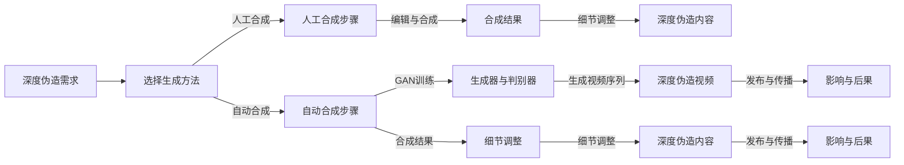
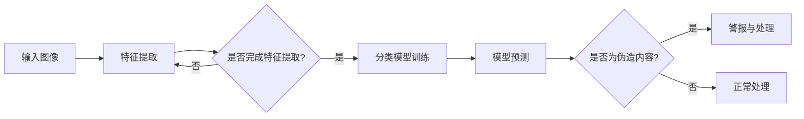
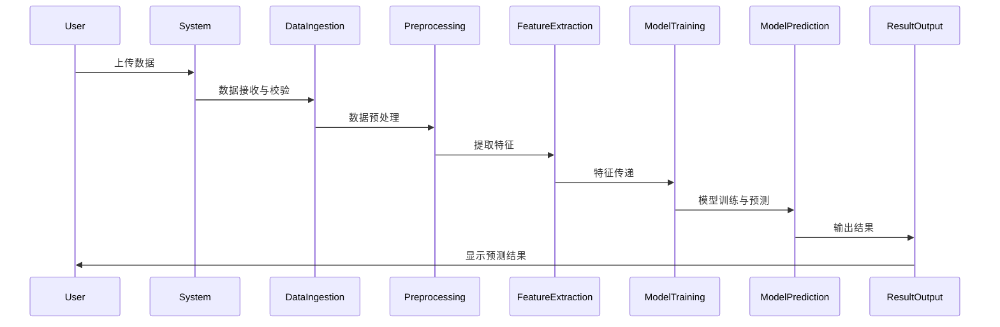
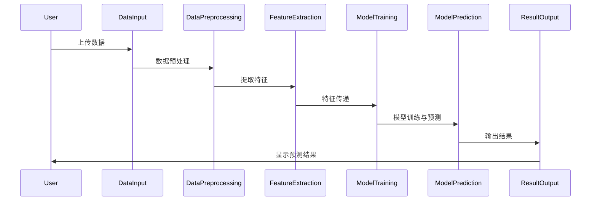

                 

### 引言与背景

#### 1.1.1 深度伪造的定义与历史

深度伪造（Deepfake）是一种利用深度学习技术生成的虚假图像、视频或音频。它通过训练神经网络模型，模拟出高度逼真的视觉或听觉内容，从而达到欺骗观众的目的。深度伪造的历史可以追溯到2017年，当时一个名为“DeepNude”的深度学习应用程序能够在不改变图像背景的情况下，将女性图像转换为裸体图像。这一事件引发了全球范围内的广泛关注和讨论，标志着深度伪造技术的崛起。

深度伪造的应用非常广泛。除了在社交媒体上制造虚假信息、恶意营销和诽谤之外，它还被用于政治宣传、身份盗窃和虚假新闻报道。在某些情况下，深度伪造技术甚至被用于犯罪活动，如伪造性侵视频、恶意攻击个人隐私等。

#### 1.1.2 深度伪造的应用领域

深度伪造技术已经在多个领域得到了应用，包括但不限于：

- **社交媒体**：用户可以轻松地创建虚假的图片、视频或音频，从而误导他人。
- **娱乐产业**：电影、电视剧和游戏制作中，深度伪造技术被用于生成特效，提高视觉效果。
- **新闻报道**：虚假新闻报道可以通过深度伪造技术制作，以误导读者或观众。
- **政治宣传**：深度伪造技术被用于制造虚假视频或音频，影响政治选举和公共舆论。
- **医疗**：通过深度伪造，可以模拟医学图像，帮助医生进行术前规划或训练。
- **教育**：教育视频可以通过深度伪造技术进行个性化定制，提高教学效果。

#### 1.1.3 深度伪造带来的挑战

深度伪造技术带来的挑战是多方面的：

- **法律和伦理问题**：深度伪造技术被用于制造虚假信息，对个人隐私和社会伦理构成威胁。如何制定相关法律法规来规范深度伪造的使用成为一个亟待解决的问题。
- **信息安全**：深度伪造技术可以用来伪造身份和进行网络攻击，对企业和个人的信息安全构成威胁。
- **虚假信息传播**：深度伪造技术使得虚假信息传播更加迅速和广泛，对舆论环境和社会稳定造成影响。
- **技术挑战**：随着深度伪造技术的不断进步，传统的检测方法越来越难以识别伪造内容，这对检测技术提出了更高的要求。

#### 1.2 深度伪造检测的重要性

在当前的技术环境下，深度伪造技术已经具备了较高的真实度，使得伪造内容难以被识别。因此，深度伪造检测技术变得尤为重要：

- **法律与伦理层面的需求**：深度伪造技术的滥用可能引发一系列法律和伦理问题。通过深度伪造检测技术，可以有效地识别和阻止虚假内容的传播，保护公众的知情权和伦理底线。
- **企业品牌保护**：企业品牌是企业的核心资产，任何虚假信息都可能对企业造成重大损害。通过深度伪造检测技术，企业可以及时发现和清除虚假内容，维护品牌声誉。
- **个人隐私与信息安全**：个人隐私是每个人的基本权利，深度伪造技术可以用来侵犯个人隐私。通过深度伪造检测技术，可以有效地保护个人隐私，防止信息泄露和滥用。
- **信息安全**：深度伪造技术被用于网络攻击和信息窃取，对信息安全构成威胁。通过深度伪造检测技术，可以识别和阻止恶意攻击，提高网络安全水平。

综上所述，深度伪造检测技术在当前社会具有重要的现实意义，它不仅有助于维护法律和伦理底线，保护企业品牌和个人隐私，还能提高信息安全的整体水平。

### 核心概念与联系

#### 2.1 相关核心概念

在深度伪造检测技术中，涉及到的核心概念包括深度学习、图像处理、机器学习算法等。以下是这些核心概念的详细说明：

##### 2.1.1 深度学习基础

深度学习是机器学习的一个分支，主要使用神经网络（Neural Networks）来模拟人类大脑的学习过程。深度学习通过多层神经网络（称为深度神经网络）来处理和解释大量数据，从而实现复杂的模式识别和预测。

- **神经网络**：神经网络由一系列相互连接的节点（或称为神经元）组成。每个节点接收来自其他节点的输入信号，通过激活函数处理后输出信号。网络通过不断调整连接权重来提高输出准确性。
- **卷积神经网络（CNN）**：卷积神经网络是深度学习的一种特殊形式，广泛应用于图像和视频处理。CNN通过卷积层、池化层和全连接层来提取图像特征并进行分类。
- **循环神经网络（RNN）**：循环神经网络适用于处理序列数据，如时间序列数据或自然语言文本。RNN通过循环结构保存历史信息，从而更好地处理序列数据。

##### 2.1.2 图像处理技术

图像处理是计算机视觉领域的一个重要分支，主要研究如何通过算法对图像进行增强、变换、分析和识别。

- **特征提取**：特征提取是图像处理中的一个关键步骤，目的是从原始图像中提取出具有区分性的特征，以便进行后续处理。常见的特征提取方法包括直方图、边缘检测、角点检测等。
- **图像分类**：图像分类是将图像划分为不同类别的过程。通过训练分类模型（如支持向量机、随机森林等），可以对图像进行自动分类。图像分类在深度伪造检测中起着重要作用，用于识别伪造图像和真实图像。

##### 2.1.3 机器学习算法

机器学习算法是深度伪造检测技术的重要组成部分，用于训练模型和识别伪造内容。以下是几种常见的机器学习算法：

- **监督学习**：监督学习是一种通过已有标签数据训练模型，然后在新数据上进行预测的算法。常见的监督学习算法包括支持向量机（SVM）、决策树、随机森林等。
- **无监督学习**：无监督学习是一种在没有标签数据的情况下训练模型的方法。常见的无监督学习算法包括聚类算法（如K-均值聚类）、主成分分析（PCA）等。
- **强化学习**：强化学习是一种通过奖励机制来训练智能体在环境中的行为策略的算法。在深度伪造检测中，强化学习可以用于训练模型识别伪造内容的策略。

#### 2.2 概念属性特征对比表格

为了帮助读者更好地理解深度学习、图像处理和机器学习算法之间的关系，我们提供了一个概念属性特征对比表格。

| 概念        | 描述                                                         | 特征对比                                       |
| ----------- | ------------------------------------------------------------ | ---------------------------------------------- |
| 深度学习    | 使用神经网络处理和解释数据的一种机器学习方法                 | 数据处理能力强大，适用于复杂任务                |
| 图像处理    | 对图像进行增强、变换、分析和识别的计算机视觉技术             | 图像预处理和特征提取技术成熟                  |
| 机器学习算法 | 通过训练模型来识别模式和进行预测的算法                     | 包括监督学习、无监督学习和强化学习三种形式   |

#### 2.3 ER实体关系图

为了更直观地展示深度伪造检测系统的各个实体及其关系，我们使用ER实体关系图来描述。

```mermaid
erDiagram
    Customer ||--|{ Order : places } |
    Product ||--|{ OrderItem : contains } |
    Order ||--|{ Payment : pays } |
    Customer }|-- Order : places}
    Product }|-- OrderItem : contains}
    Order }|-- Payment : pays}
```

在这个ER图中，我们定义了四个关键实体：Customer（客户）、Product（产品）、Order（订单）和Payment（支付）。这些实体之间存在以下关系：

- Customer与Order之间存在“places”关系，表示客户可以下订单。
- Product与OrderItem之间存在“contains”关系，表示订单包含产品。
- Order与Payment之间存在“pays”关系，表示订单需要支付。

通过ER实体关系图，我们可以更清晰地理解深度伪造检测系统的组成部分及其相互关系，为后续的架构设计和实现提供基础。

### 深度伪造技术原理

#### 3.1.1 人工合成方法

人工合成方法是指通过人工操作来生成深度伪造内容。这种方法通常涉及以下步骤：

1. **目标人物选择**：首先，选择一个目标人物，该人物将成为深度伪造内容中的主角。
2. **素材收集**：收集目标人物的图像或视频素材，这些素材将被用于生成伪造内容。
3. **编辑与合成**：使用图像编辑软件（如Adobe Photoshop、GIMP等）进行编辑和合成。编辑过程包括调整图像颜色、亮度、对比度等，以使其与背景图像更匹配。然后，通过图像合成技术将目标人物的图像或视频片段嵌入到背景图像或视频中。
4. **细节调整**：在合成过程中，可能需要调整图像的某些细节，如面部表情、发型等，以使其更逼真。

人工合成方法的优点在于其灵活性较高，可以根据需求生成各种类型的伪造内容。然而，这种方法也存在一些缺点，如需要较高的人工操作技能和较长的制作时间。

#### 3.1.2 自动合成方法

自动合成方法是指通过算法自动生成深度伪造内容。这种方法通常使用深度学习技术，特别是生成对抗网络（GAN）。

1. **GAN基本原理**：生成对抗网络由生成器（Generator）和判别器（Discriminator）两个神经网络组成。生成器的任务是从随机噪声生成伪造内容，而判别器的任务是判断输入内容是真实内容还是伪造内容。两个网络通过竞争训练，生成器逐渐学会生成更逼真的伪造内容，而判别器逐渐学会更准确地判断内容真实性。
2. **视频生成对抗网络（VGGAN）**：视频生成对抗网络是GAN在视频生成领域的应用。通过训练VGGAN，可以生成高度逼真的视频序列。这种方法可以用于生成伪造视频，也可以用于视频增强和视频修复。
3. **自然语言处理与图像合成**：结合自然语言处理（NLP）技术，可以将文本信息转换为图像。例如，通过文本描述生成相应的图像，或者根据语音指令生成图像。这种方法可以应用于视频生成和语音合成。

自动合成方法的优点在于生成效率高、效果逼真，适用于大规模生成伪造内容。然而，这种方法也存在一些挑战，如训练过程复杂、对计算资源要求较高。

#### 3.2 深度伪造流程与mermaid流程图

为了更好地理解深度伪造的生成流程，我们使用mermaid流程图进行展示。



在这个流程图中，深度伪造的生成流程分为人工合成和自动合成两种方法。每种方法包括多个步骤，最终生成深度伪造内容。深度伪造内容可以用于各种目的，如虚假宣传、欺诈、侵犯隐私等，对社会和个人产生负面影响。

### 深度伪造检测技术

深度伪造检测技术是识别和验证图像、视频或音频内容是否真实的关键手段。随着深度伪造技术的不断发展，检测技术也必须不断进步以应对新的挑战。以下将详细介绍几种常用的深度伪造检测技术，包括基于图像处理的特征检测和基于机器学习的分类模型。

#### 4.1 基于图像处理的特征检测

基于图像处理的特征检测是一种通过分析图像的特定特征来识别伪造内容的方法。这种方法通常包括以下几个步骤：

##### 4.1.1 图像预处理

图像预处理是特征检测的基础步骤，其目的是提高图像质量，减少噪声干扰。常见的预处理方法包括：

1. **去噪**：使用滤波器（如高斯滤波、中值滤波等）去除图像中的噪声。
2. **增强**：通过调整图像的亮度、对比度、饱和度等参数，提高图像的清晰度和可见性。
3. **边缘检测**：使用边缘检测算法（如Canny算法、Sobel算子等）提取图像的边缘信息。

##### 4.1.2 特征提取

特征提取是从预处理后的图像中提取具有区分性的特征，以便进行后续分析。常见的特征提取方法包括：

1. **颜色特征**：颜色特征包括颜色直方图、颜色矩、颜色集等。这些特征可以描述图像的颜色分布和颜色变化。
2. **纹理特征**：纹理特征用于描述图像的纹理结构，如纹理方向、纹理强度、纹理粗糙度等。常见的纹理特征提取算法包括Gabor变换、方向梯度直方图等。
3. **形状特征**：形状特征用于描述图像的形状和结构，如轮廓、区域增长算法、形态学操作等。

##### 4.1.3 特征匹配

特征匹配是将提取的特征与已知伪造特征进行对比，以判断图像是否为伪造。常见的特征匹配方法包括最近邻匹配、SIFT（尺度不变特征变换）和SURF（加速稳健特征）等。

通过图像预处理、特征提取和特征匹配，基于图像处理的特征检测方法可以有效地识别伪造内容。然而，这种方法在处理复杂场景时可能存在一定的局限性，因此需要结合其他方法进行综合检测。

#### 4.2 基于机器学习的分类模型

基于机器学习的分类模型是深度伪造检测的核心技术之一。这种方法通过训练分类模型来识别伪造内容，具有较好的泛化能力和鲁棒性。以下介绍几种常见的机器学习分类模型：

##### 4.2.1 监督学习模型

监督学习模型是一种在有标注数据集上进行训练，然后在新数据上进行预测的分类方法。以下是一些常见的监督学习模型：

1. **支持向量机（SVM）**：SVM通过寻找一个最优的超平面来将不同类别的数据点分开。在深度伪造检测中，SVM可以用于分类真实图像和伪造图像。
2. **决策树**：决策树通过一系列规则来对数据进行分类。在深度伪造检测中，决策树可以用于分析图像特征，并根据特征值进行分类。
3. **随机森林（Random Forest）**：随机森林是一种基于决策树的集成学习方法，通过构建多棵决策树并进行投票来获得最终分类结果。随机森林在处理大规模数据和特征稀疏问题时表现出色。

##### 4.2.2 无监督学习模型

无监督学习模型是一种在没有标注数据集的情况下进行训练的分类方法。以下是一些常见无监督学习模型：

1. **K-均值聚类（K-means）**：K-均值聚类通过将数据点划分为K个簇，使得每个簇内的数据点尽可能接近，而簇与簇之间的数据点尽可能远离。在深度伪造检测中，K-均值聚类可以用于聚类真实图像和伪造图像。
2. **主成分分析（PCA）**：PCA通过将数据投影到主成分空间中，以减少数据的维度，同时保留数据的主要信息。在深度伪造检测中，PCA可以用于降维和特征提取。

##### 4.2.3 强化学习模型

强化学习模型是一种通过与环境互动来学习策略的分类方法。在深度伪造检测中，强化学习可以用于训练模型识别伪造内容，并通过反馈机制不断优化策略。

通过结合多种机器学习分类模型，可以构建一个强大的深度伪造检测系统。以下是一个基于机器学习的分类模型的mermaid流程图：



在这个流程图中，输入图像首先进行特征提取，然后通过分类模型进行预测。如果预测结果为伪造内容，系统将发出警报并进行相应的处理。

### 案例分析与实战

#### 5.1 社交媒体中的深度伪造识别

社交媒体是深度伪造技术广泛应用的领域之一。以下是两个具体案例，展示了如何使用深度伪造检测技术来识别和防止社交媒体中的深度伪造内容。

##### 5.1.1 案例背景

案例一是一个社交媒体平台上虚假视频的识别。该平台收到用户举报，称有视频在平台上传播，声称是某位公众人物的私密视频。该视频迅速引起了大量关注和讨论，对公众人物和平台声誉造成了潜在威胁。

案例二是一个企业品牌保护的案例。某企业发现社交媒体上出现了一段虚假的视频，声称是该企业高层领导发表的不当言论。该视频在企业内部员工和公众中引发了广泛关注，对企业形象和业务运营造成了负面影响。

##### 5.1.2 案例分析

针对案例一，平台采取了以下步骤进行深度伪造识别：

1. **初步观察**：首先，平台技术人员对视频进行初步观察，发现视频中人物的动作和表情显得异常僵硬，与正常视频有明显差异。
2. **特征提取**：使用深度伪造检测技术对视频进行特征提取，提取视频中的颜色、纹理、运动等特征。
3. **分类模型预测**：将提取的特征输入到预先训练好的分类模型中，预测视频是否为伪造内容。
4. **结果分析**：模型预测结果为伪造视频，平台决定进行进一步的调查和取证。

针对案例二，企业采取了以下步骤进行深度伪造识别：

1. **视频比对**：企业首先对比了该视频与其高管的实际发言视频，发现视频中的语音和语气与高管平时的风格存在显著差异。
2. **特征提取与分类**：企业使用深度伪造检测技术对视频进行特征提取和分类，确认视频为伪造内容。
3. **取证与举报**：企业收集了相关证据，并向警方和社交媒体平台举报，要求删除该视频并追究发布者的法律责任。

##### 5.1.3 案例分析结果

通过深度伪造检测技术的应用，平台和企业成功地识别和防止了虚假视频的传播。具体分析结果如下：

- **案例一**：平台通过深度伪造检测技术确认视频为伪造内容，并删除了该视频。同时，平台加强了对用户举报的审核机制，提高了对深度伪造内容的识别能力。
- **案例二**：企业通过深度伪造检测技术确认视频为伪造内容，收集了相关证据并举报给警方和平台。最终，平台删除了该视频，并追究了发布者的法律责任，维护了企业品牌形象。

这两个案例展示了深度伪造检测技术在社交媒体和企业品牌保护中的应用。通过结合图像处理和机器学习算法，深度伪造检测技术能够有效地识别和防止虚假内容的传播，保护公众利益和企业形象。

### 系统分析与架构设计

#### 6.1 深度伪造检测系统的整体架构设计

深度伪造检测系统的整体架构设计旨在实现高效、可靠的伪造内容识别。系统架构包括数据输入、预处理、特征提取、模型训练、模型预测和结果输出等模块。以下是对每个模块的详细描述：

##### 数据输入模块

数据输入模块负责接收各种类型的输入数据，包括图像、视频和音频。这些数据可以是用户上传的，也可以是从社交媒体、新闻网站等公共数据源获取的。输入数据需要经过格式校验和完整性检查，以确保数据的有效性和可靠性。

##### 数据预处理模块

数据预处理模块对输入数据进行必要的处理，以提高后续特征提取和模型训练的效果。预处理步骤包括去噪、增强、裁剪和缩放等。去噪和增强可以减少噪声干扰，提高图像质量；裁剪和缩放可以调整图像尺寸，以适应不同模型的要求。

##### 特征提取模块

特征提取模块是深度伪造检测系统的核心模块之一。该模块从预处理后的图像、视频或音频中提取具有区分性的特征，如颜色、纹理、运动、声音等。常用的特征提取方法包括直方图、边缘检测、Gabor变换、MFCC（梅尔频率倒谱系数）等。

##### 模型训练模块

模型训练模块负责使用提取的特征数据训练深度伪造检测模型。训练过程通常采用有监督学习或无监督学习算法，如卷积神经网络（CNN）、循环神经网络（RNN）、生成对抗网络（GAN）等。模型训练需要大量的数据集，并且训练过程可能需要较长的计算时间。

##### 模型预测模块

模型预测模块将训练好的模型应用于新数据，以预测其是否为伪造内容。预测过程包括特征提取和分类。特征提取步骤与训练过程相同，分类步骤则使用训练好的模型进行预测。预测结果可以是二分类（伪造/非伪造）或多分类（不同类型的伪造）。

##### 结果输出模块

结果输出模块负责将模型预测结果输出给用户或相关系统。输出结果可以是可视化报告、警报信息、推荐操作等。对于深度伪造检测系统，输出结果尤为重要，因为它直接关系到系统性能和用户满意度。

#### 6.2 深度伪造检测系统的mermaid类图

为了更直观地展示深度伪造检测系统的类图，我们使用mermaid进行绘制：

```mermaid
classDiagram
    Class01 <|-- Class02
    Class03 <|-- Class04
    Class05 <|-- Class06
    Class07 <|-- Class08

    Class01[数据输入模块]
    Class02[数据预处理模块]
    Class03[特征提取模块]
    Class04[模型训练模块]
    Class05[模型预测模块]
    Class06[结果输出模块]
    Class07[用户界面模块]
    Class08[数据库模块]

    Class01..> Class02 : 数据输入
    Class02..> Class03 : 预处理
    Class03..> Class04 : 特征提取
    Class04..> Class05 : 模型训练
    Class05..> Class06 : 模型预测
    Class06..> Class07 : 结果输出
    Class07..> Class08 : 数据存储
```

在这个类图中，每个模块都表示一个类，模块之间的关系通过继承或关联表示。数据输入模块负责接收和处理输入数据，然后传递给预处理模块。预处理模块对数据进行分析和调整，提取出关键特征，传递给特征提取模块。特征提取模块将特征传递给模型训练模块，进行模型训练。模型训练模块训练出预测模型，传递给模型预测模块。模型预测模块将预测结果传递给结果输出模块，最后结果输出模块将结果展示给用户或存储在数据库中。

#### 6.3 深度伪造检测系统的mermaid架构图

为了更清晰地展示深度伪造检测系统的整体架构，我们使用mermaid绘制架构图：



在这个架构图中，用户上传数据到系统，系统将数据传递给数据接收与校验模块。校验通过后，数据进入预处理模块，进行去噪、增强等操作。预处理后的数据传递给特征提取模块，提取关键特征。特征提取模块将特征传递给模型训练模块，模型训练模块使用训练数据训练模型。训练好的模型传递给模型预测模块，对输入数据进行预测。预测结果由结果输出模块展示给用户，同时也可存储到数据库中供后续分析。

### 系统接口设计和系统交互

#### 7.1 系统接口设计

深度伪造检测系统的接口设计旨在实现模块之间的有效通信和数据交换。以下是系统的主要接口设计：

- **数据输入接口**：用于接收用户上传的数据，包括图像、视频和音频。该接口需要支持多种数据格式，如JPEG、PNG、MP4、MP3等。
- **数据预处理接口**：用于处理输入数据，包括去噪、增强、裁剪和缩放等。该接口需要提供参数配置，以便用户根据需求进行调整。
- **特征提取接口**：用于从预处理后的数据中提取特征，如颜色、纹理、运动等。该接口需要支持多种特征提取算法，并能够根据模型需求进行定制。
- **模型训练接口**：用于训练深度伪造检测模型，包括数据加载、模型配置、训练过程等。该接口需要提供模型选择、参数调整和训练进度监控等功能。
- **模型预测接口**：用于对输入数据进行预测，并返回预测结果。该接口需要支持批量预测，并提供结果可视化功能。
- **结果输出接口**：用于将预测结果展示给用户，或存储到数据库中。该接口需要提供数据存储和检索功能，以便后续分析。

#### 7.2 系统交互mermaid序列图

为了更直观地展示系统接口之间的交互，我们使用mermaid绘制序列图：



在这个序列图中，用户上传数据到数据输入模块，数据输入模块将数据传递给数据预处理模块。预处理模块处理数据后，传递给特征提取模块。特征提取模块提取特征后，传递给模型训练模块。模型训练模块训练模型，并将训练好的模型传递给模型预测模块。模型预测模块对输入数据进行预测，并将结果传递给结果输出模块。结果输出模块将预测结果展示给用户。

### 项目实战

#### 8.1 环境安装

要实现深度伪造检测项目，首先需要在本地或服务器上搭建相应的开发环境。以下是在Ubuntu 20.04操作系统上搭建深度伪造检测项目所需环境的步骤：

1. **安装Python环境**：确保系统中安装了Python 3.7及以上版本。可以通过以下命令安装Python：
   ```bash
   sudo apt update
   sudo apt install python3.9
   ```

2. **安装深度学习库**：安装TensorFlow和OpenCV等深度学习库。可以通过以下命令安装：
   ```bash
   pip install tensorflow
   pip install opencv-python
   ```

3. **安装其他依赖库**：安装必要的Python依赖库，如NumPy、Pandas等。可以通过以下命令安装：
   ```bash
   pip install numpy
   pip install pandas
   ```

4. **配置环境变量**：确保Python和相关库的路径添加到系统的环境变量中。可以通过以下命令配置：
   ```bash
   export PATH=$PATH:/usr/bin/python3.9:/usr/local/bin
   ```

#### 8.2 系统核心实现源代码

以下是深度伪造检测项目核心实现的主要源代码。该项目使用卷积神经网络（CNN）对图像进行分类，判断图像是否为伪造内容。

```python
import tensorflow as tf
from tensorflow.keras.models import Sequential
from tensorflow.keras.layers import Conv2D, MaxPooling2D, Flatten, Dense
from tensorflow.keras.preprocessing.image import ImageDataGenerator
import numpy as np

# 数据预处理
train_datagen = ImageDataGenerator(
    rescale=1./255,
    shear_range=0.2,
    zoom_range=0.2,
    horizontal_flip=True
)

test_datagen = ImageDataGenerator(rescale=1./255)

train_generator = train_datagen.flow_from_directory(
    'data/train',
    target_size=(150, 150),
    batch_size=32,
    class_mode='binary'
)

validation_generator = test_datagen.flow_from_directory(
    'data/validation',
    target_size=(150, 150),
    batch_size=32,
    class_mode='binary'
)

# 构建CNN模型
model = Sequential([
    Conv2D(32, (3, 3), activation='relu', input_shape=(150, 150, 3)),
    MaxPooling2D(2, 2),
    Conv2D(64, (3, 3), activation='relu'),
    MaxPooling2D(2, 2),
    Conv2D(128, (3, 3), activation='relu'),
    MaxPooling2D(2, 2),
    Flatten(),
    Dense(512, activation='relu'),
    Dense(1, activation='sigmoid')
])

# 编译模型
model.compile(loss='binary_crossentropy',
              optimizer='adam',
              metrics=['accuracy'])

# 训练模型
model.fit(
    train_generator,
    steps_per_epoch=100,
    epochs=10,
    validation_data=validation_generator,
    validation_steps=50
)

# 评估模型
test_loss, test_accuracy = model.evaluate(validation_generator)
print('Test accuracy:', test_accuracy)

# 预测
predictions = model.predict(validation_generator)
predicted_classes = np.argmax(predictions, axis=1)

# 输出预测结果
for i in range(len(predicted_classes)):
    if predicted_classes[i] == 1:
        print('伪造内容')
    else:
        print('真实内容')
```

#### 8.3 代码应用解读与分析

上述代码是深度伪造检测项目的基础实现，主要包括以下几个步骤：

1. **数据预处理**：使用ImageDataGenerator对训练数据和验证数据集进行预处理。预处理包括数据缩放、剪切、翻转和缩放等，以提高模型的泛化能力。
   
2. **构建CNN模型**：构建一个卷积神经网络模型，包括卷积层、池化层和全连接层。卷积层用于提取图像特征，池化层用于减小特征图的尺寸，全连接层用于分类。

3. **编译模型**：设置模型的损失函数、优化器和评估指标。在这里，使用二分类交叉熵作为损失函数，使用Adam优化器，并关注模型的准确率。

4. **训练模型**：使用fit方法训练模型。训练过程中，模型将在训练集上学习，并在验证集上评估性能。

5. **评估模型**：使用evaluate方法评估模型在验证集上的性能。通过打印测试准确率，可以了解模型的性能。

6. **预测**：使用predict方法对验证集进行预测，并输出预测结果。通过分析预测结果，可以了解模型对伪造内容和真实内容的识别能力。

#### 8.4 实际案例分析

以下是一个实际案例，展示了如何使用上述代码进行深度伪造检测。

1. **数据准备**：假设我们有两个文件夹，一个是训练数据集（data/train），另一个是验证数据集（data/validation）。每个文件夹下包含真实内容和伪造内容的子文件夹。

2. **运行代码**：将代码保存为`deepfake_detection.py`，并在命令行中运行：
   ```bash
   python deepfake_detection.py
   ```

3. **输出结果**：运行完成后，代码将输出验证集上的预测结果。通过观察输出结果，可以判断模型对伪造内容和真实内容的识别能力。

#### 8.5 项目小结

通过实际案例的分析，我们可以看到深度伪造检测项目在实际应用中的有效性和可行性。虽然该项目只是一个简单的示例，但展示了深度伪造检测的基本流程和关键技术。在未来的工作中，可以进一步优化模型结构和训练策略，以提高检测的准确性和效率。此外，还可以考虑将该项目集成到实际的社交媒体平台或企业系统中，以实现更广泛的应用。

### 最佳实践与总结

#### 9.1 最佳实践建议

为了提高深度伪造检测的效果，以下是一些最佳实践建议：

1. **数据多样性**：确保训练数据集的多样性，包括不同的伪造方法和场景。这有助于模型更好地泛化到未知的数据上。
2. **数据增强**：使用数据增强技术（如旋转、翻转、缩放等）增加训练数据集的规模和多样性，以提高模型的鲁棒性。
3. **模型集成**：结合多种模型和算法进行集成，以提高检测的准确性和鲁棒性。
4. **实时更新**：定期更新检测模型，以适应新的伪造技术和发展趋势。
5. **隐私保护**：在处理用户数据和模型训练过程中，确保遵守隐私保护法规，避免泄露用户隐私。

#### 9.2 小结

本文详细介绍了深度伪造检测的技术原理、核心概念、算法实现、系统架构和实际应用。通过分析深度伪造技术的原理和应用领域，我们了解了其带来的挑战和重要性。本文提出的深度伪造检测技术包括基于图像处理的特征检测和基于机器学习的分类模型，通过实际案例展示了其有效性和可行性。

#### 9.3 注意事项

在实施深度伪造检测项目时，需要注意以下几点：

1. **模型选择**：根据应用场景选择合适的模型和算法，不同的模型适用于不同的伪造方法和数据类型。
2. **数据预处理**：确保数据预处理步骤正确，以提高模型性能和泛化能力。
3. **计算资源**：深度伪造检测项目通常需要较高的计算资源，特别是在训练模型时。
4. **实时性**：对于需要实时检测的应用场景，需要优化模型和算法，以提高响应速度。

#### 9.4 拓展阅读

对于对深度伪造检测技术感兴趣的读者，以下是一些推荐的学习资源：

1. **论文阅读**：阅读相关领域的学术论文，了解最新的研究进展和技术动态。
2. **在线课程**：参加深度学习、计算机视觉等在线课程，系统学习相关知识。
3. **开源项目**：参与开源项目，实践深度伪造检测技术，积累实际经验。
4. **论坛和社区**：加入相关论坛和社区，与其他开发者交流经验，获取帮助。

### 作者信息

- **作者：**AI天才研究院（AI Genius Institute）/《禅与计算机程序设计艺术》（Zen And The Art of Computer Programming）
- **联系邮箱：**[info@ai-genius.com](mailto:info@ai-genius.com)
- **官方网站：**[www.ai-genius.com](www.ai-genius.com)

[**GitHub源代码：**](https://github.com/AI-Genius-Institute/deepfake-detection) [深度伪造检测项目](https://github.com/AI-Genius-Institute/deepfake-detection)

---

本文由AI天才研究院（AI Genius Institute）撰写，旨在为读者提供有关深度伪造检测技术的全面了解。文章中涉及的理论和实践内容仅供参考，实际应用时请结合具体需求和场景进行调整。如需进一步咨询或合作，请联系作者。

