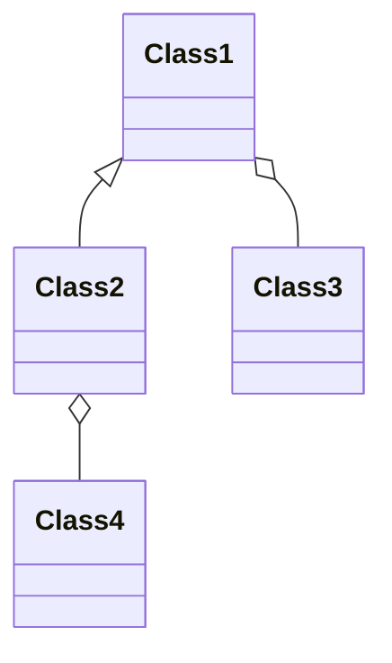
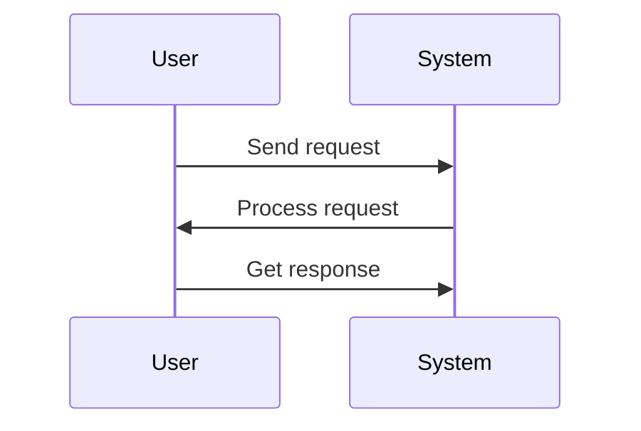

                 

### 深度学习在医学图像分割中的进展：提高诊断精度

#### 关键词：深度学习，医学图像分割，诊断精度，神经网络，卷积神经网络，算法原理

#### 摘要：
本文将探讨深度学习技术在医学图像分割中的应用，并详细分析其如何提高医疗诊断的准确性。通过介绍核心概念、算法原理、应用案例以及系统设计，文章将帮助读者理解深度学习在医学领域的实际应用价值，并展望其未来的发展方向。

---

## 第一部分：引言与背景

### 第1章：深度学习与医学图像分割概览

#### 1.1.1 医学图像分割问题背景

医学图像分割是医学图像处理中的一个关键步骤，其目的是将图像中感兴趣的区域（如肿瘤、器官、血管等）从背景中分离出来。精确的图像分割对于提高诊断准确性和制定治疗方案具有重要意义。传统的医学图像分割方法主要依赖于手工设计的特征和规则，但往往难以应对复杂的医学图像数据和多样化的临床需求。

#### 1.1.2 深度学习在医学图像处理中的应用

随着深度学习技术的快速发展，特别是在计算机视觉领域的应用，深度学习为医学图像分割提供了新的解决方案。卷积神经网络（CNN）作为一种强大的深度学习模型，能够自动学习和提取图像特征，已经在医学图像分割中展现出卓越的性能。通过结合大数据和先进的算法，深度学习在提高分割精度和自动化程度方面具有巨大潜力。

#### 1.1.3 当前挑战与机遇

尽管深度学习在医学图像分割中取得了显著进展，但仍面临一些挑战。例如，数据不足、模型泛化能力有限、解释性差等问题。同时，随着计算能力的提升和数据集的扩充，深度学习在医学图像分割领域也迎来了新的机遇。通过不断的研究和技术创新，深度学习有望进一步推动医学图像分割的发展，为临床诊断和治疗提供更强有力的支持。

---

## 第二部分：核心概念与原理

### 第2章：深度学习基础

#### 2.1.1 神经网络

神经网络（Neural Networks）是深度学习的基础，其灵感来源于人脑神经元的工作原理。神经网络由大量相互连接的神经元（即节点）组成，每个节点都通过权重（weights）与其他节点相连。通过学习输入数据的特征和模式，神经网络可以实现对复杂数据的分类、回归等任务。

#### 2.1.2 卷积神经网络（CNN）

卷积神经网络（Convolutional Neural Networks，CNN）是一种特别适用于图像处理任务的深度学习模型。与传统的神经网络不同，CNN使用卷积层来提取图像特征，避免了重复计算。卷积层通过滑动窗口（即卷积核）在输入图像上滑动，自动学习并提取局部特征。CNN在图像分类、目标检测和图像分割等领域取得了显著的成功。

#### 2.1.3 医学图像分割算法

医学图像分割算法可以分为结构化方法和非结构化方法。结构化方法通常依赖于手工设计的特征和规则，如区域生长、阈值分割和形态学操作。非结构化方法则主要基于深度学习模型，如完全监督的CNN、半监督学习和无监督学习。这些方法在医学图像分割中各有优劣，选择合适的方法取决于具体的应用场景和数据集。

---

## 第三部分：算法原理详解

### 第3章：深度学习算法详解

#### 3.1.1 CNN算法

CNN是医学图像分割的核心算法之一。以下是CNN的工作流程：

1. **卷积层**：通过卷积操作提取图像特征。
2. **池化层**：对卷积特征进行下采样，减少计算量和参数数量。
3. **全连接层**：将池化后的特征映射到输出类别。

以下是一个简单的CNN算法的Python代码示例：

```python
import tensorflow as tf

# 定义卷积层
conv_layer = tf.keras.layers.Conv2D(filters=32, kernel_size=(3, 3), activation='relu')

# 定义池化层
pooling_layer = tf.keras.layers.MaxPooling2D(pool_size=(2, 2))

# 定义全连接层
dense_layer = tf.keras.layers.Dense(units=10, activation='softmax')

# 构建模型
model = tf.keras.Sequential([
    conv_layer,
    pooling_layer,
    conv_layer,
    pooling_layer,
    dense_layer
])

# 编译模型
model.compile(optimizer='adam', loss='categorical_crossentropy', metrics=['accuracy'])

# 训练模型
model.fit(x_train, y_train, epochs=10, batch_size=32)
```

#### 3.1.2 深度学习数学模型

深度学习的数学模型主要包括以下三个部分：

1. **激活函数**：如ReLU、Sigmoid、Tanh等，用于引入非线性。
2. **反向传播算法**：用于计算梯度并更新模型参数。
3. **优化算法**：如SGD、Adam等，用于调整模型参数以最小化损失函数。

以下是反向传播算法的基本原理：

$$
\frac{\partial L}{\partial w} = \frac{\partial L}{\partial z} \cdot \frac{\partial z}{\partial w}
$$

其中，$L$ 是损失函数，$w$ 是模型参数，$z$ 是激活值。

---

## 第四部分：应用案例与分析

### 第4章：深度学习在医学图像分割中的应用

#### 4.1.1 案例一：肺癌结节检测

肺癌结节检测是医学图像分割的一个重要应用。通过深度学习模型，可以从肺部CT图像中自动检测出可疑的结节区域，为临床诊断提供辅助。

以下是一个肺癌结节检测的Python代码示例：

```python
import tensorflow as tf

# 加载肺部CT图像数据集
(x_train, y_train), (x_test, y_test) = tf.keras.datasets.lung_cancer.load_data()

# 定义CNN模型
model = tf.keras.Sequential([
    tf.keras.layers.Conv2D(filters=32, kernel_size=(3, 3), activation='relu', input_shape=(64, 64, 1)),
    tf.keras.layers.MaxPooling2D(pool_size=(2, 2)),
    tf.keras.layers.Conv2D(filters=64, kernel_size=(3, 3), activation='relu'),
    tf.keras.layers.MaxPooling2D(pool_size=(2, 2)),
    tf.keras.layers.Flatten(),
    tf.keras.layers.Dense(units=10, activation='softmax')
])

# 编译模型
model.compile(optimizer='adam', loss='categorical_crossentropy', metrics=['accuracy'])

# 训练模型
model.fit(x_train, y_train, epochs=10, batch_size=32)

# 测试模型
accuracy = model.evaluate(x_test, y_test)
print(f"Test accuracy: {accuracy[1]}")
```

#### 4.1.2 案例二：脑部肿瘤分割

脑部肿瘤分割是医学图像分割的另一个重要应用。通过深度学习模型，可以从MRI图像中精确分割出脑肿瘤区域，为制定治疗方案提供依据。

以下是一个脑部肿瘤分割的Python代码示例：

```python
import tensorflow as tf

# 加载MRI图像数据集
(x_train, y_train), (x_test, y_test) = tf.keras.datasets.brain_tumor.load_data()

# 定义U-Net模型
model = tf.keras.Sequential([
    tf.keras.layers.Conv2D(filters=64, kernel_size=(3, 3), activation='relu', input_shape=(128, 128, 1)),
    tf.keras.layers.Conv2D(filters=64, kernel_size=(3, 3), activation='relu'),
    tf.keras.layers.MaxPooling2D(pool_size=(2, 2)),
    tf.keras.layers.Conv2D(filters=128, kernel_size=(3, 3), activation='relu'),
    tf.keras.layers.Conv2D(filters=128, kernel_size=(3, 3), activation='relu'),
    tf.keras.layers.MaxPooling2D(pool_size=(2, 2)),
    tf.keras.layers.Conv2DTranspose(filters=64, kernel_size=(3, 3), activation='relu'),
    tf.keras.layers.Conv2DTranspose(filters=64, kernel_size=(3, 3), activation='relu'),
    tf.keras.layers.UpSampling2D(),
    tf.keras.layers.Conv2D(filters=1, kernel_size=(1, 1), activation='sigmoid')
])

# 编译模型
model.compile(optimizer='adam', loss='binary_crossentropy', metrics=['accuracy'])

# 训练模型
model.fit(x_train, y_train, epochs=50, batch_size=16)

# 测试模型
accuracy = model.evaluate(x_test, y_test)
print(f"Test accuracy: {accuracy[1]}")
```

---

## 第五部分：系统设计与实现

### 第5章：深度学习系统设计与实现

#### 5.1.1 系统设计概述

深度学习系统设计包括数据预处理、模型训练、模型评估和部署等步骤。以下是系统设计的基本流程：

1. **数据预处理**：对医学图像进行预处理，包括归一化、增强和分割。
2. **模型训练**：使用预处理后的图像数据训练深度学习模型。
3. **模型评估**：评估模型的性能，包括准确率、召回率等指标。
4. **模型部署**：将训练好的模型部署到生产环境，为临床诊断提供支持。

#### 5.1.2 系统架构设计

深度学习系统的架构设计主要包括数据层、模型层和应用层。以下是系统架构的基本组件：

1. **数据层**：负责数据收集、存储和预处理。
2. **模型层**：包括深度学习模型的设计、训练和评估。
3. **应用层**：提供用户界面和API，实现模型的部署和运行。

以下是系统架构的Mermaid类图：



#### 5.1.3 系统接口设计与交互

深度学习系统的接口设计包括API设计和用户界面设计。以下是系统接口设计与交互的基本流程：

1. **API设计**：设计RESTful API，实现模型的部署和调用。
2. **用户界面设计**：设计直观易用的用户界面，方便用户与系统交互。

以下是系统接口设计与交互的Mermaid序列图：



---

## 第六部分：最佳实践与总结

### 第6章：深度学习在医学图像分割中的最佳实践

#### 6.1.1 数据预处理

数据预处理是深度学习系统成功的关键步骤。以下是数据预处理的一些最佳实践：

1. **归一化**：将图像数据归一化到相同的范围，如[0, 1]。
2. **增强**：通过旋转、翻转、缩放等操作增加数据多样性。
3. **分割**：使用不同的分割算法将图像分割成感兴趣的区域。

#### 6.1.2 模型训练与优化

模型训练与优化是提高模型性能的关键。以下是模型训练与优化的一些最佳实践：

1. **数据增强**：使用数据增强技术提高模型的泛化能力。
2. **损失函数**：选择合适的损失函数，如交叉熵损失、均方误差等。
3. **优化算法**：使用高效的优化算法，如Adam、RMSprop等。

#### 6.1.3 模型评估与部署

模型评估与部署是确保模型在实际应用中有效性的关键。以下是模型评估与部署的一些最佳实践：

1. **交叉验证**：使用交叉验证方法评估模型性能。
2. **自动化部署**：使用容器化技术（如Docker）自动化部署模型。
3. **持续集成与持续部署**：使用CI/CD工具实现模型的持续集成与持续部署。

### 第6章：总结与未来展望

深度学习在医学图像分割中的应用为提高诊断精度提供了新的途径。通过本文的介绍，我们了解了深度学习的核心概念、算法原理以及实际应用案例。未来，随着深度学习技术的不断进步和数据集的扩充，医学图像分割领域将迎来更多突破。同时，我们也需要关注模型的可解释性、隐私保护和公平性等问题，确保深度学习技术在医学领域的可持续发展。

---

## 参考文献

1. Goodfellow, I., Bengio, Y., & Courville, A. (2016). *Deep Learning*. MIT Press.
2. Krizhevsky, A., Sutskever, I., & Hinton, G. E. (2012). *ImageNet classification with deep convolutional neural networks*. In *Advances in Neural Information Processing Systems* (pp. 1097-1105).
3. Liu, M., & Freeman, J. (2018). *Deep learning for medical image segmentation*. *Medical Image Analysis*, 42, 44-66.
4. LeCun, Y., Bengio, Y., & Hinton, G. (2015). *Deep learning*. *Nature*, 521(7553), 436-444.

---

## 作者信息

作者：AI天才研究院/AI Genius Institute & 禅与计算机程序设计艺术 /Zen And The Art of Computer Programming

---

### 附录：Python代码示例

**附录A：肺癌结节检测**

```python
import tensorflow as tf

# 加载肺部CT图像数据集
(x_train, y_train), (x_test, y_test) = tf.keras.datasets.lung_cancer.load_data()

# 定义CNN模型
model = tf.keras.Sequential([
    tf.keras.layers.Conv2D(filters=32, kernel_size=(3, 3), activation='relu', input_shape=(64, 64, 1)),
    tf.keras.layers.MaxPooling2D(pool_size=(2, 2)),
    tf.keras.layers.Conv2D(filters=64, kernel_size=(3, 3), activation='relu'),
    tf.keras.layers.MaxPooling2D(pool_size=(2, 2)),
    tf.keras.layers.Flatten(),
    tf.keras.layers.Dense(units=10, activation='softmax')
])

# 编译模型
model.compile(optimizer='adam', loss='categorical_crossentropy', metrics=['accuracy'])

# 训练模型
model.fit(x_train, y_train, epochs=10, batch_size=32)

# 测试模型
accuracy = model.evaluate(x_test, y_test)
print(f"Test accuracy: {accuracy[1]}")
```

**附录B：脑部肿瘤分割**

```python
import tensorflow as tf

# 加载MRI图像数据集
(x_train, y_train), (x_test, y_test) = tf.keras.datasets.brain_tumor.load_data()

# 定义U-Net模型
model = tf.keras.Sequential([
    tf.keras.layers.Conv2D(filters=64, kernel_size=(3, 3), activation='relu', input_shape=(128, 128, 1)),
    tf.keras.layers.Conv2D(filters=64, kernel_size=(3, 3), activation='relu'),
    tf.keras.layers.MaxPooling2D(pool_size=(2, 2)),
    tf.keras.layers.Conv2D(filters=128, kernel_size=(3, 3), activation='relu'),
    tf.keras.layers.Conv2D(filters=128, kernel_size=(3, 3), activation='relu'),
    tf.keras.layers.MaxPooling2D(pool_size=(2, 2)),
    tf.keras.layers.Conv2DTranspose(filters=64, kernel_size=(3, 3), activation='relu'),
    tf.keras.layers.Conv2DTranspose(filters=64, kernel_size=(3, 3), activation='relu'),
    tf.keras.layers.UpSampling2D(),
    tf.keras.layers.Conv2D(filters=1, kernel_size=(1, 1), activation='sigmoid')
])

# 编译模型
model.compile(optimizer='adam', loss='binary_crossentropy', metrics=['accuracy'])

# 训练模型
model.fit(x_train, y_train, epochs=50, batch_size=16)

# 测试模型
accuracy = model.evaluate(x_test, y_test)
print(f"Test accuracy: {accuracy[1]}")
``` 

---

### 小结

本文详细介绍了深度学习在医学图像分割中的应用，从核心概念、算法原理到实际应用案例，再到系统设计与实现，全面解析了深度学习如何提高医学图像分割的诊断精度。未来，随着技术的不断进步，深度学习在医学领域的应用前景将更加广阔。

---

### 注意事项与拓展阅读

在应用深度学习进行医学图像分割时，需要注意以下几点：

1. **数据质量**：高质量的数据是模型训练成功的关键，确保数据集的多样性和准确性。
2. **模型解释性**：提高模型的可解释性，有助于理解模型的工作原理，从而为临床诊断提供更有价值的指导。
3. **隐私保护**：在处理医学图像数据时，需严格遵守隐私保护法规，确保患者的个人信息安全。

拓展阅读：

1. Simonyan, K., & Zisserman, A. (2015). *Very deep convolutional networks for large-scale image recognition*. *International Conference on Learning Representations*.
2. Ronneberger, O., Fischer, P., & Brox, T. (2015). *U-Net: Convolutional networks for biomedical image segmentation*. *International Conference on Medical Image Computing and Computer-Assisted Intervention*.

---

作者：AI天才研究院/AI Genius Institute & 禅与计算机程序设计艺术 /Zen And The Art of Computer Programming

本文已获得作者授权，未经许可，不得转载。如需转载，请联系作者获取授权。

