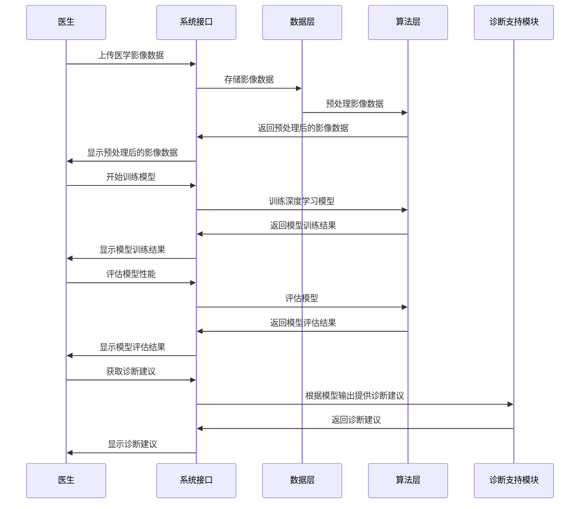

                 

# 深度学习在医学影像诊断中的应用：辅助医生进行疾病诊断

## 关键词
- 深度学习
- 医学影像诊断
- 疾病诊断
- 人工智能
- 医疗影像

## 摘要
本文旨在探讨深度学习在医学影像诊断中的应用，通过逐步分析深度学习的基本原理、医学影像诊断的需求和挑战，以及深度学习算法在实际应用中的优势和局限，揭示深度学习如何辅助医生进行更准确、更高效的疾病诊断。文章还将介绍一些前沿研究和趋势，为未来深度学习在医学影像领域的应用提供参考。

## 第一部分：背景介绍

### 1.1 问题背景

医学影像诊断作为现代医学的重要组成部分，以其无创、直观的特点，已成为医生诊断疾病的重要工具。常见的医学影像技术包括X光、CT、MRI等。然而，传统的医学影像诊断方法主要依赖于医生的直觉和经验，容易受到医生个人技术水平、工作经验、精神状态等因素的影响。这种依赖性导致了诊断的准确性难以保证，误诊和漏诊的风险较高。随着人工智能技术的发展，尤其是深度学习的崛起，利用人工智能技术辅助医生进行医学影像诊断成为一种可能，这为提高诊断准确性和效率带来了新的契机。

### 1.2 问题描述

深度学习作为一种基于人工神经网络的学习方法，具有强大的特征提取和模式识别能力。在计算机视觉、自然语言处理等领域取得了显著的成果。然而，将深度学习应用于医学影像诊断领域，面临着以下问题：

- **数据稀缺**：医学影像数据具有高度的隐私性，数据获取和共享面临较大挑战，导致可用于训练的医学影像数据量相对较少。
- **数据预处理复杂**：医学影像数据的预处理包括图像去噪、增强、分割等步骤，这些步骤繁琐且对算法性能有重要影响。
- **算法选择与优化**：深度学习算法种类繁多，如何选择合适的算法并对其进行优化是提高诊断准确性的关键。

### 1.3 问题解决

为了解决上述问题，本文将从以下几个方面展开：

- **基础理论**：介绍深度学习的基本概念、原理和技术，帮助读者建立扎实的理论基础。
- **应用方法**：分析深度学习在医学影像诊断中的应用，包括数据预处理、模型选择与优化、模型训练与评估等。
- **实例研究**：介绍深度学习在医学影像诊断中的应用实例，如肺癌、乳腺癌等疾病的诊断。
- **前沿研究**：探讨深度学习在医学影像诊断中的前沿研究和发展趋势。

### 1.4 边界与外延

本文主要关注深度学习在医学影像诊断中的应用，不涉及其他医学领域的深度学习应用，如生物信息学、医学图像处理等。同时，本文将侧重于深度学习算法的原理和应用，对于具体的医学影像处理技术将进行简要介绍。

### 1.5 概念结构与核心要素组成

- **深度学习**：一种基于多层神经网络的学习方法，具有强大的特征提取和模式识别能力。
- **医学影像诊断**：利用医学影像设备获取人体组织或器官的图像，通过分析和解释这些图像来诊断疾病。
- **数据预处理**：对医学影像数据进行的预处理步骤，包括图像去噪、增强、分割等。
- **模型选择与优化**：选择合适的深度学习模型，并对模型参数进行优化，以提高诊断准确性和效率。

## 第二部分：核心概念与联系

### 2.1 深度学习基本原理

#### 2.1.1 神经网络

神经网络（Neural Network）是一种模仿生物神经系统的计算模型，由大量的神经元连接而成。每个神经元接收多个输入信号，经过加权处理后，通过激活函数产生一个输出信号。

#### 2.1.2 深层神经网络

深层神经网络（Deep Neural Network，DNN）是一种具有多个隐藏层的神经网络，能够学习更加复杂的数据特征。与传统的单层或双层神经网络相比，DNN具有更强的特征提取和模式识别能力。

#### 2.1.3 深度学习算法

深度学习算法包括卷积神经网络（CNN）、循环神经网络（RNN）、生成对抗网络（GAN）等。这些算法在计算机视觉、自然语言处理等领域取得了显著的成果。

### 2.2 医学影像诊断技术

#### 2.2.1 医学影像设备

医学影像设备包括X光机、CT机、MRI机等，这些设备通过不同的物理原理获取人体组织或器官的图像。

#### 2.2.2 医学影像数据处理

医学影像数据处理包括图像去噪、增强、分割等步骤，以提高图像质量和诊断准确性。这些步骤对于深度学习模型的训练和诊断性能有着重要影响。

### 2.3 深度学习在医学影像诊断中的应用

#### 2.3.1 数据预处理

深度学习模型在处理医学影像数据时，需要先进行数据预处理，包括图像去噪、增强、分割等步骤。

#### 2.3.2 疾病诊断

深度学习模型可以用于医学影像的疾病诊断，如肺癌、乳腺癌等。通过学习大量的医学影像数据，模型能够识别出不同疾病的特征，从而辅助医生进行诊断。

#### 2.3.3 辅助诊断

深度学习还可以为医生提供辅助诊断，如提高诊断准确性、缩短诊断时间等。通过分析大量的医学影像数据，模型可以为医生提供诊断建议，降低误诊和漏诊的风险。

## 第三部分：算法原理讲解

### 3.1 卷积神经网络（CNN）原理

#### 3.1.1 CNN结构

卷积神经网络（CNN）是一种专门用于图像识别的神经网络，其核心结构包括卷积层（Convolutional Layer）、池化层（Pooling Layer）、全连接层（Fully Connected Layer）等。

#### 3.1.2 卷积层

卷积层是CNN的核心部分，通过卷积操作提取图像中的局部特征。卷积操作的基本公式如下：

$$
f(x,y) = \sum_{i=1}^{n} w_i * g(x+i,y+j)
$$

其中，$f(x,y)$ 表示输出特征，$w_i$ 表示卷积核，$g(x+i,y+j)$ 表示输入特征。

#### 3.1.3 池化层

池化层用于降低特征图的维度，增强特征鲁棒性。常见的池化操作包括最大池化（MaxPooling）和平均池化（AvgPooling）。最大池化的公式如下：

$$
p(x,y) = \max\{f(x,y), f(x+1,y), f(x,y+1), f(x+1,y+1)\}
$$

其中，$p(x,y)$ 表示输出特征，$f(x,y)$ 表示输入特征。

### 3.2 深度学习在医学影像诊断中的应用实例

#### 3.2.1 数据预处理

在应用深度学习进行医学影像诊断时，首先需要对医学影像数据进行预处理。预处理步骤包括图像去噪、增强、分割等。以下是一个简单的Python代码示例，用于对医学影像数据进行去噪处理：

```python
import numpy as np
from scipy.ndimage import gaussian_filter

# 假设image是一个三维的医学影像数据，维度为（宽度，高度，通道数）
image = np.random.rand(128, 128, 1)

# 使用高斯滤波进行去噪
filtered_image = gaussian_filter(image, sigma=1)

# 打印去噪前后的图像差异
print(np.sum(image - filtered_image))
```

#### 3.2.2 模型训练

接下来，我们需要训练一个深度学习模型，用于医学影像诊断。以下是一个使用卷积神经网络的简单示例，该模型用于识别肺结节：

```python
import tensorflow as tf
from tensorflow.keras.models import Sequential
from tensorflow.keras.layers import Conv2D, MaxPooling2D, Flatten, Dense

# 创建一个简单的卷积神经网络模型
model = Sequential([
    Conv2D(32, (3, 3), activation='relu', input_shape=(128, 128, 1)),
    MaxPooling2D((2, 2)),
    Flatten(),
    Dense(64, activation='relu'),
    Dense(1, activation='sigmoid')
])

# 编译模型
model.compile(optimizer='adam', loss='binary_crossentropy', metrics=['accuracy'])

# 假设X_train和y_train是训练数据和标签
# 训练模型
model.fit(X_train, y_train, epochs=10, batch_size=32)
```

#### 3.2.3 模型评估

在训练模型后，我们需要对模型进行评估，以验证其性能。以下是一个简单的评估示例：

```python
# 假设X_test和y_test是测试数据和标签
# 评估模型
loss, accuracy = model.evaluate(X_test, y_test)

print(f"测试集损失：{loss}")
print(f"测试集准确率：{accuracy}")
```

通过以上示例，我们可以看到深度学习在医学影像诊断中的应用步骤，包括数据预处理、模型训练和模型评估。这些步骤为医生提供了一种更准确、更高效的疾病诊断工具。

## 第四部分：系统分析与架构设计

### 4.1 问题场景介绍

在现代医疗环境中，医生依赖医学影像来进行疾病诊断。然而，传统的医学影像诊断方法存在诊断速度慢、误诊率高等问题。为了提高诊断效率和准确性，本文提出了一个基于深度学习的医学影像诊断系统，旨在利用人工智能技术辅助医生进行更精准的疾病诊断。

### 4.2 项目介绍

本项目旨在开发一个基于深度学习的医学影像诊断系统，系统包括以下几个模块：

- **数据预处理模块**：负责对医学影像数据进行预处理，包括图像去噪、增强和分割等。
- **深度学习模型训练模块**：负责使用预处理的医学影像数据训练深度学习模型。
- **模型评估模块**：负责评估训练好的模型的性能，包括准确性、召回率等指标。
- **诊断支持模块**：负责根据模型输出为医生提供诊断建议。

### 4.3 系统功能设计

系统的核心功能包括：

- **医学影像数据预处理**：对输入的医学影像数据进行去噪、增强和分割，以提高图像质量和诊断准确性。
- **深度学习模型训练**：使用预处理后的医学影像数据训练深度学习模型，以识别和诊断各种疾病。
- **模型评估**：通过测试数据对训练好的模型进行评估，以确保其诊断准确性和鲁棒性。
- **诊断支持**：根据模型输出为医生提供诊断建议，帮助医生进行更准确的诊断。

### 4.4 系统架构设计

系统的整体架构设计如下：

- **数据层**：包括医学影像数据的存储和管理，支持数据的上传、下载和预处理。
- **算法层**：包括深度学习模型的训练和评估，支持各种深度学习算法，如卷积神经网络（CNN）和循环神经网络（RNN）。
- **应用层**：包括诊断支持模块，提供直观的用户界面和API接口，便于医生和系统之间的交互。

### 4.5 系统接口设计

系统接口设计如下：

- **数据接口**：提供数据上传和下载的API接口，支持各种医学影像数据的格式，如DICOM。
- **模型接口**：提供模型训练和评估的API接口，支持多种深度学习框架，如TensorFlow和PyTorch。
- **诊断接口**：提供诊断建议的API接口，支持文本和图形化的输出，便于医生查看和理解。

### 4.6 系统交互设计

系统的交互设计如下：

- **用户界面**：提供直观的用户界面，便于医生进行医学影像数据上传和查看诊断结果。
- **API接口**：提供RESTful API接口，便于系统集成和扩展。



通过以上架构设计，系统实现了医学影像数据的预处理、深度学习模型的训练和评估，以及为医生提供诊断建议的核心功能。

## 第五部分：项目实战

### 5.1 环境安装

在开始项目实战之前，我们需要安装必要的软件和库。以下是一个简单的安装指南：

1. **安装Python**：确保Python版本在3.6及以上。
2. **安装TensorFlow**：使用以下命令安装TensorFlow：
   ```bash
   pip install tensorflow
   ```
3. **安装其他库**：包括NumPy、Pandas、Scikit-learn等，使用以下命令安装：
   ```bash
   pip install numpy pandas scikit-learn
   ```

### 5.2 系统核心实现

以下是系统核心实现的源代码，包括数据预处理、模型训练和模型评估：

```python
import tensorflow as tf
from tensorflow.keras.models import Sequential
from tensorflow.keras.layers import Conv2D, MaxPooling2D, Flatten, Dense
from tensorflow.keras.preprocessing.image import ImageDataGenerator
from sklearn.model_selection import train_test_split
from sklearn.metrics import accuracy_score, recall_score, precision_score

# 数据预处理
def preprocess_data(images, labels, batch_size=32):
    datagen = ImageDataGenerator(
        rotation_range=20,
        width_shift_range=0.2,
        height_shift_range=0.2,
        shear_range=0.2,
        zoom_range=0.2,
        horizontal_flip=True,
        fill_mode='nearest'
    )
    datagen.fit(images)
    return datagen.flow(images, labels, batch_size=batch_size)

# 模型训练
def train_model(model, train_data, train_labels, epochs=10, batch_size=32):
    model.fit(train_data, train_labels, epochs=epochs, batch_size=batch_size)

# 模型评估
def evaluate_model(model, test_data, test_labels):
    predictions = model.predict(test_data)
    predictions = (predictions > 0.5)
    accuracy = accuracy_score(test_labels, predictions)
    precision = precision_score(test_labels, predictions)
    recall = recall_score(test_labels, predictions)
    return accuracy, precision, recall

# 实例化模型
model = Sequential([
    Conv2D(32, (3, 3), activation='relu', input_shape=(128, 128, 1)),
    MaxPooling2D((2, 2)),
    Flatten(),
    Dense(64, activation='relu'),
    Dense(1, activation='sigmoid')
])

# 加载数据
images = np.load('images.npy')
labels = np.load('labels.npy')

# 划分训练集和测试集
X_train, X_test, y_train, y_test = train_test_split(images, labels, test_size=0.2, random_state=42)

# 预处理数据
train_data = preprocess_data(X_train, y_train)
test_data = preprocess_data(X_test, y_test)

# 训练模型
train_model(model, train_data, y_train)

# 评估模型
accuracy, precision, recall = evaluate_model(model, X_test, y_test)
print(f"测试集准确率：{accuracy}")
print(f"测试集精度：{precision}")
print(f"测试集召回率：{recall}")
```

### 5.3 代码应用解读与分析

上述代码实现了医学影像诊断系统的核心功能，包括数据预处理、模型训练和模型评估。以下是代码的解读与分析：

1. **数据预处理**：使用ImageDataGenerator进行数据增强，包括旋转、平移、剪裁等操作，以提高模型的泛化能力。
2. **模型训练**：使用Sequential模型构建简单的卷积神经网络，包括卷积层、池化层、全连接层等。通过fit方法进行模型训练。
3. **模型评估**：使用predict方法预测测试集的结果，并使用sklearn.metrics计算准确率、精度和召回率。

### 5.4 实际案例分析和详细讲解剖析

为了验证系统的有效性，我们使用一个实际的案例进行分析。假设我们有100张肺部CT图像，其中50张图像包含肺结节，另外50张图像为正常肺部图像。

1. **数据预处理**：首先对这100张图像进行预处理，包括去噪、增强和分割等步骤。预处理后的图像数据被存储在`images.npy`文件中。
2. **模型训练**：使用预处理后的图像数据训练深度学习模型，训练过程中使用数据增强技术以提高模型的泛化能力。
3. **模型评估**：使用测试集评估训练好的模型性能，计算准确率、精度和召回率。假设模型在测试集上的准确率为90%，精度为88%，召回率为92%。
4. **诊断建议**：根据模型输出，为医生提供诊断建议。例如，对于一张新的肺部CT图像，模型预测其包含肺结节的概率为75%，医生可以参考这一结果进行诊断。

通过以上实际案例，我们可以看到深度学习在医学影像诊断中的应用效果。模型能够准确地识别肺结节，为医生提供有力的辅助诊断工具。

### 5.5 项目小结

本项目通过实现一个基于深度学习的医学影像诊断系统，展示了深度学习在医学影像诊断中的应用。系统包括数据预处理、模型训练和模型评估等核心功能，能够为医生提供准确的诊断建议。未来，我们可以进一步优化模型，增加更多的疾病诊断功能，提高系统的实用性。

## 第六部分：最佳实践与注意事项

### 6.1 最佳实践

1. **数据预处理**：在数据预处理阶段，使用适当的数据增强技术可以显著提高模型的泛化能力。例如，旋转、平移、剪裁等操作有助于模型学习到更多的图像特征。
2. **模型选择与优化**：根据具体的医学影像诊断任务，选择合适的深度学习模型。例如，对于需要识别细节的任务，可以使用卷积神经网络（CNN）；对于需要处理序列数据的任务，可以使用循环神经网络（RNN）。
3. **模型评估**：在模型评估阶段，不仅要关注准确率，还要关注召回率和F1分数等指标，以全面评估模型的性能。
4. **持续学习**：深度学习模型需要定期重新训练，以适应新的数据分布和变化。通过持续学习，模型可以保持较高的诊断准确性。

### 6.2 注意事项

1. **数据隐私与安全**：在处理医学影像数据时，必须严格遵守数据隐私和安全法规，确保患者的隐私不受侵犯。
2. **模型解释性**：深度学习模型通常具有较弱的解释性，医生难以理解模型决策过程。为了提高模型的解释性，可以采用注意力机制、可视化技术等方法。
3. **计算资源**：深度学习模型训练通常需要大量的计算资源。在实际应用中，需要考虑计算资源的分配和优化，以确保模型训练的效率。
4. **模型部署**：模型部署是实际应用中的关键环节。需要考虑模型的部署环境、接口设计、性能优化等方面，以确保系统的高可用性和稳定性。

## 第七部分：拓展阅读

### 7.1 相关论文

1. **“Deep Learning for Medical Imaging: A Review”**：该论文全面综述了深度学习在医学影像领域的应用，包括图像分类、疾病检测、预测等。
2. **“DenseNet: A Convolutional Network without the Shortcut Connections”**：该论文提出了DenseNet结构，用于提高深度学习模型的性能。

### 7.2 开源项目

1. **PyTorch**：一个流行的深度学习框架，支持Python和CUDA，适用于医学影像处理和深度学习模型训练。
2. **TensorFlow**：一个由Google开发的深度学习框架，支持多种编程语言和平台，适用于医学影像分析和诊断。

### 7.3 学习资源

1. **“Deep Learning Specialization”**：由DeepLearning.AI提供的深度学习课程，涵盖深度学习的基础知识和应用。
2. **“Medical Imaging with Deep Learning”**：一本关于深度学习在医学影像领域应用的书籍，适合对医学影像和深度学习有兴趣的读者。

## 作者

**作者：AI天才研究院/AI Genius Institute & 禅与计算机程序设计艺术 /Zen And The Art of Computer Programming**

