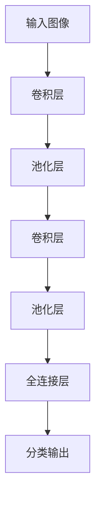
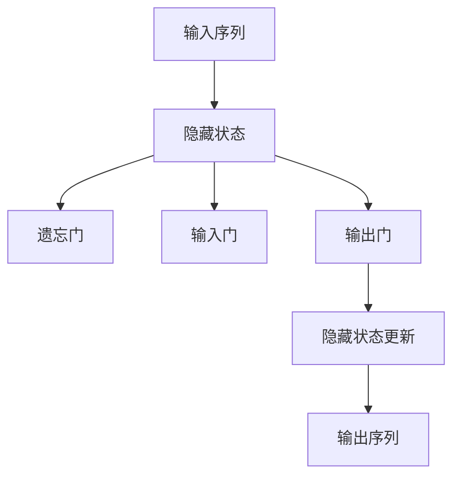
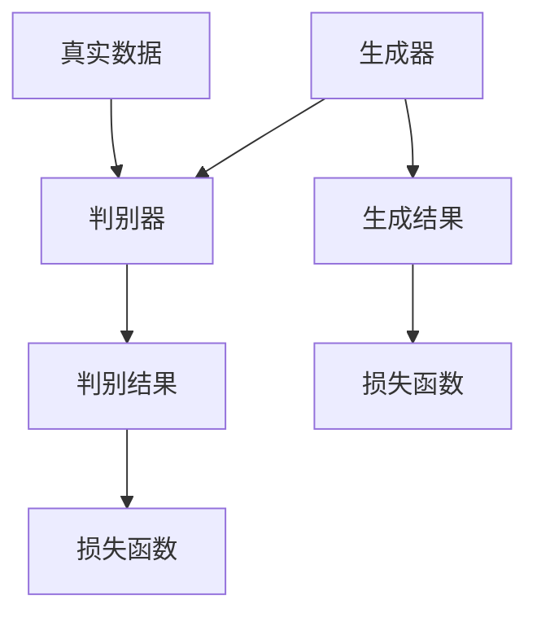
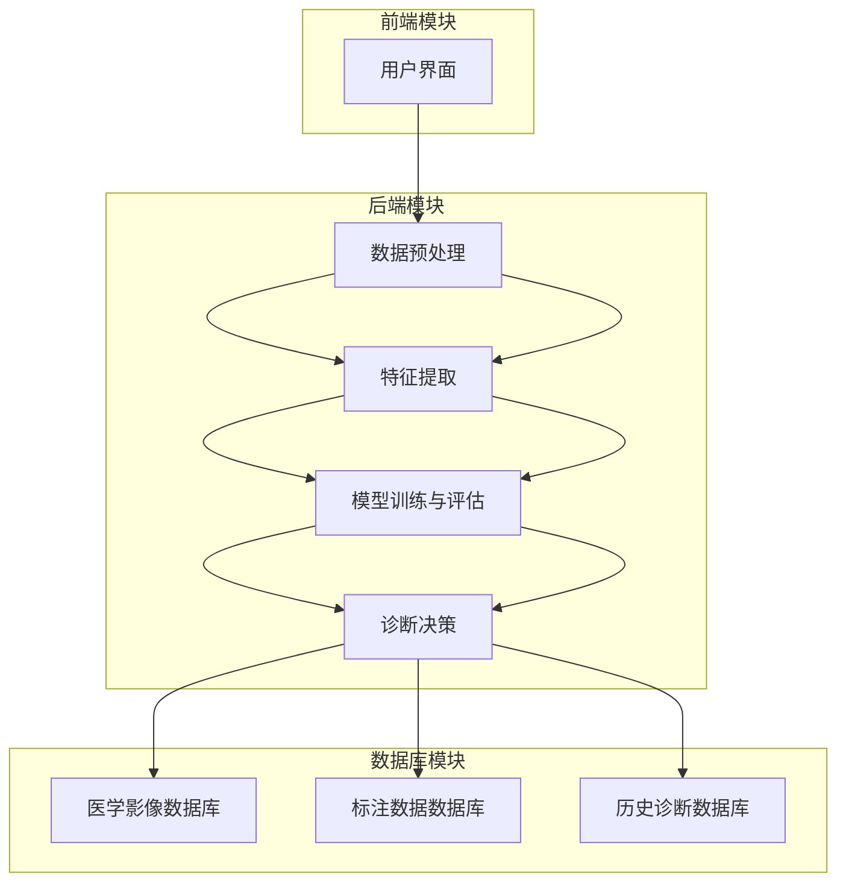
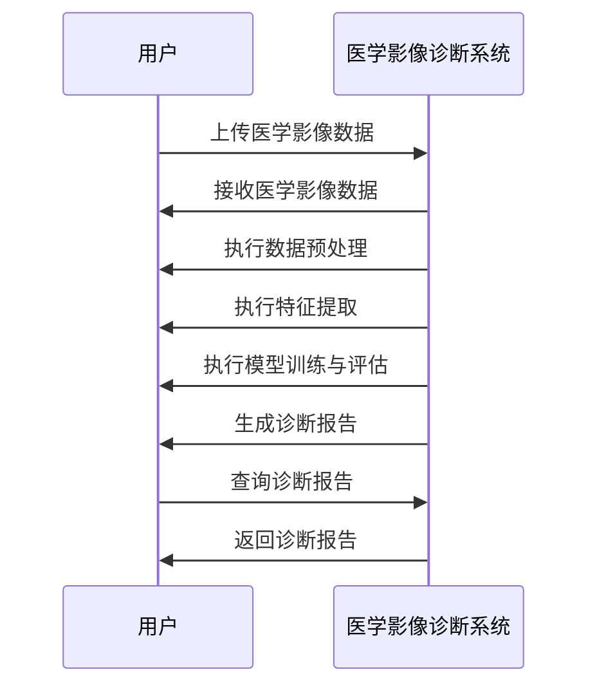
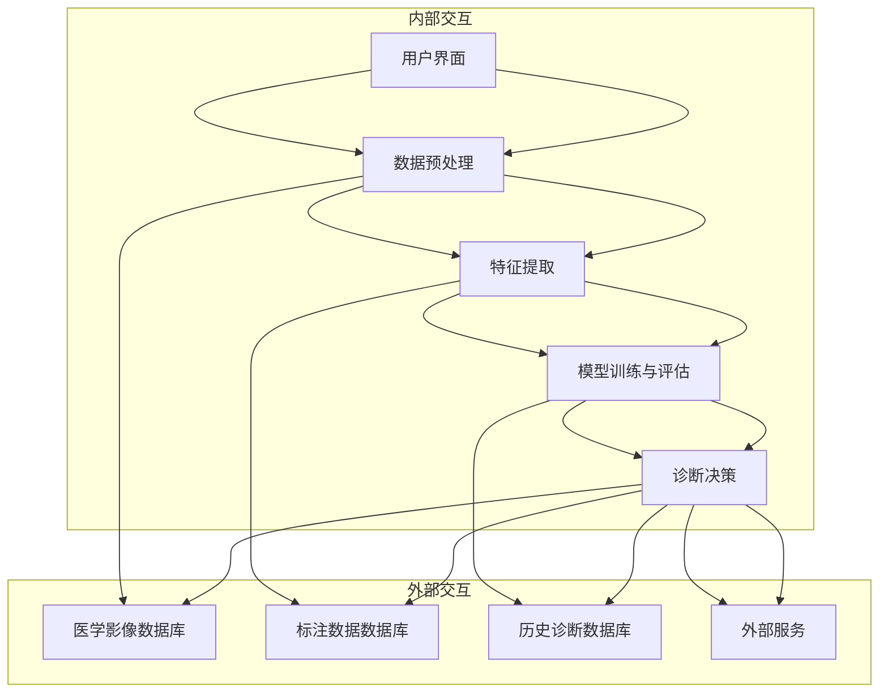

                 

### 文章标题

# 深度学习在医学影像诊断中的辅助应用

关键词：深度学习、医学影像、诊断辅助、算法、系统设计、Python实现

摘要：本文旨在探讨深度学习技术在医学影像诊断中的辅助应用。通过深入分析深度学习的基本原理和医学影像的诊断需求，本文将介绍几种常见的深度学习算法及其在医学影像中的应用，详细讲解系统分析与设计方法，并展示一个实际的项目案例。最后，本文将对深度学习在医学影像诊断中的未来发展进行展望。

### 文章结构概述

1. **背景介绍**
   - 医学影像诊断的重要性
   - 传统医学影像诊断的挑战
   - 深度学习在医学影像诊断中的应用前景

2. **核心概念与原理**
   - 深度学习的基本概念
   - 医学影像的基本概念
   - 深度学习在医学影像诊断中的应用

3. **算法介绍与解释**
   - 卷积神经网络（CNN）在医学影像中的应用
   - 循环神经网络（RNN）在医学影像中的应用
   - 生成对抗网络（GAN）在医学影像中的应用

4. **系统分析与设计**
   - 医学影像诊断系统的需求分析
   - 系统功能设计
   - 系统架构设计
   - 系统接口设计
   - 系统交互设计

5. **项目实施与案例分析**
   - 环境安装与配置
   - 系统核心实现
   - 代码分析与解读
   - 实际案例分析与讲解
   - 项目小结与展望

6. **最佳实践与拓展阅读**

### 背景介绍

#### 医学影像诊断的重要性

医学影像诊断是现代医学中不可或缺的一部分，它通过可视化人体内部结构，帮助医生发现病灶和疾病。常见的医学影像包括X光、CT扫描、MRI和超声等。这些影像技术为医生提供了重要的诊断依据，大大提高了疾病的早期发现率和治疗效果。

#### 传统医学影像诊断的挑战

尽管医学影像技术在不断进步，但传统的医学影像诊断仍然面临许多挑战：

1. **主观性较强**：依赖医生的经验和判断，容易出现误诊或漏诊。
2. **效率低下**：大量的影像数据需要人工分析，工作量大，耗时较长。
3. **数据不一致**：不同医生对同一影像数据的解读可能存在差异，导致诊断结果不一致。

#### 深度学习在医学影像诊断中的应用前景

深度学习作为一种强大的机器学习技术，能够从大量的医学影像数据中自动学习特征，进行自动诊断。与传统的医学影像诊断方法相比，深度学习具有以下优势：

1. **提高诊断准确性**：通过学习大量标注数据，深度学习模型能够减少误诊和漏诊率。
2. **提升诊断效率**：自动化处理影像数据，提高诊断速度，减轻医生的工作负担。
3. **实现个性化诊断**：通过对患者历史影像数据的分析，深度学习能够提供更个性化的诊断建议。

#### 问题解决

深度学习在医学影像诊断中的应用，为解决传统医学影像诊断的挑战提供了新的思路。通过深度学习，我们可以开发出智能化的医学影像诊断系统，辅助医生进行诊断，提高诊断的准确性和效率。然而，深度学习在医学影像诊断中仍然面临一些限制和挑战，例如数据隐私、算法透明度和标准化等。

#### 边界与外延

深度学习在医学影像诊断中的应用主要集中在以下领域：

1. **肿瘤检测**：通过识别肿瘤的特征，提前发现肿瘤。
2. **心脏病诊断**：通过分析心脏的影像数据，诊断心脏病。
3. **神经系统疾病诊断**：通过分析脑部影像数据，诊断神经系统疾病。

此外，深度学习还可以应用于医学影像的分割、增强和重建等领域，为医学影像诊断提供更丰富的功能。

#### 核心概念结构与要素组成

深度学习在医学影像诊断中的应用涉及以下几个核心概念和要素：

1. **数据预处理**：对医学影像数据进行预处理，包括图像增强、去噪和归一化等。
2. **特征提取**：利用深度学习模型提取医学影像的特征。
3. **模型训练与评估**：使用标注数据训练深度学习模型，并评估其性能。
4. **诊断决策**：利用训练好的模型进行医学影像的诊断决策。

接下来，我们将进一步探讨深度学习的基本概念和医学影像的诊断需求，为后续的内容打下基础。在下一部分，我们将介绍深度学习的基本概念和医学影像的基本概念，以及深度学习在医学影像诊断中的应用。

### 核心概念与原理

#### 深度学习的基本概念

深度学习（Deep Learning）是一种基于多层神经网络的人工智能技术，它通过模仿人脑的神经网络结构，对大量数据进行自动学习和特征提取。深度学习的主要优势在于能够自动从数据中学习复杂的特征，无需人工干预。深度学习的主要组成部分包括：

1. **神经网络**：深度学习的基础，通过模拟人脑神经元之间的连接，对输入数据进行处理。
2. **多层网络结构**：神经网络由多个层次组成，每一层都能提取不同级别的特征。
3. **激活函数**：用于引入非线性变换，使神经网络能够学习复杂的函数。
4. **反向传播算法**：用于计算网络参数的梯度，优化网络性能。

#### 医学影像的基本概念

医学影像（Medical Imaging）是指通过各种物理手段，对人体内部结构进行可视化的一种技术。常见的医学影像包括X光、CT扫描、MRI和超声等。医学影像的基本概念包括：

1. **图像类型**：包括灰度图像、彩色图像和三维图像等。
2. **图像质量**：图像的清晰度、对比度和噪声水平等。
3. **图像特征**：图像中的纹理、形状、边缘和区域等特征。
4. **图像处理**：包括图像增强、去噪、分割和重建等。

#### 深度学习在医学影像诊断中的应用

深度学习在医学影像诊断中的应用主要集中在以下几个方面：

1. **图像分类**：通过训练深度学习模型，对医学影像进行分类，例如将正常影像与病变影像区分开来。
2. **图像分割**：利用深度学习模型，将医学影像中的目标区域分割出来，例如肿瘤区域。
3. **疾病诊断**：通过分析医学影像的特征，深度学习模型可以辅助医生进行疾病诊断，提高诊断的准确性和效率。

以下是一个简化的ER实体关系图，用于描述深度学习在医学影像诊断中的关键实体和关系：

```mermaid
erDiagram
    Class::图像分类
    Class::图像分割
    Class::疾病诊断
    Class::神经网络 <<--|{ 模型训练 } DeepLearning
    Class::医学影像 <<--|{ 提取特征 } ImageProcessing
    Class::标注数据 <<--|{ 标注数据 } Annotation
```

在下一部分，我们将详细介绍几种常见的深度学习算法及其在医学影像诊断中的应用。

### 算法介绍与解释

#### 卷积神经网络（CNN）

卷积神经网络（Convolutional Neural Network，CNN）是深度学习领域的一种重要算法，特别适用于处理图像数据。CNN通过卷积层、池化层和全连接层等结构，可以有效地提取图像的层次特征，进行图像分类、目标检测和图像分割等任务。

##### 算法原理

1. **卷积层**：卷积层通过卷积操作从输入图像中提取局部特征。每个卷积核都对应一个特征图，通过移动卷积核在输入图像上滑动，生成特征图。

2. **池化层**：池化层用于减少特征图的尺寸，同时保留重要特征。常见的池化操作包括最大池化和平均池化。

3. **全连接层**：全连接层将池化层输出的特征图展平为向量，然后通过全连接层进行分类决策。

##### 算法示意图

以下是一个简化的CNN算法流程图：



##### 数学模型

1. **卷积操作**：

   $$ \text{卷积操作} = \sum_{i=1}^{K} w_{i} * f(\text{输入图像}_{i}) + b $$
   
   其中，$w_i$ 是卷积核，$f(\text{输入图像}_{i})$ 是输入图像上的特征值，$b$ 是偏置项。

2. **激活函数**：

   $$ \text{激活函数} = \text{ReLU}(x) = \max(0, x) $$

##### 实例说明

例如，对于一个输入的128x128的灰度图像，使用一个3x3的卷积核进行卷积操作，可以得到32个特征图。每个特征图都是原图像的局部特征的加权和，并通过ReLU激活函数进行非线性变换。

#### 循环神经网络（RNN）

循环神经网络（Recurrent Neural Network，RNN）是一种适用于序列数据处理的人工神经网络。RNN通过在时间步上递归地更新状态，能够处理变长序列数据，例如语音信号、文本和医学影像序列等。

##### 算法原理

1. **递归关系**：RNN通过递归关系将当前输入与前一时刻的隐藏状态相关联，更新当前隐藏状态。

2. **门控机制**：为了解决RNN中的梯度消失和梯度爆炸问题，引入了门控机制，包括遗忘门、输入门和输出门。

##### 算法示意图

以下是一个简化的RNN算法流程图：



##### 数学模型

1. **递归关系**：

   $$ h_t = \text{sigmoid}(W_f \cdot [h_{t-1}, x_t]) \odot f_t + \text{sigmoid}(W_i \cdot [h_{t-1}, x_t]) \odot i_t + \text{sigmoid}(W_o \cdot [h_{t-1}, x_t]) \odot o_t $$
   
   $$ o_t = \text{sigmoid}(W \cdot h_t) $$
   
   其中，$W_f, W_i, W_o$ 分别是遗忘门、输入门和输出门的权重矩阵，$f_t, i_t, o_t$ 分别是遗忘门、输入门和输出门的输出。

2. **激活函数**：

   $$ \text{激活函数} = \text{ReLU}(x) $$

##### 实例说明

例如，对于一个输入的序列 $x_t$，通过RNN模型，可以递归地更新隐藏状态 $h_t$，并通过输出门 $o_t$ 生成当前的输出。

#### 生成对抗网络（GAN）

生成对抗网络（Generative Adversarial Network，GAN）是由生成器和判别器组成的对抗性模型，能够生成高质量的数据，广泛应用于图像生成、图像修复和医学影像重建等领域。

##### 算法原理

1. **生成器**：生成器通过学习数据分布，生成与真实数据相似的数据。

2. **判别器**：判别器用于判断输入数据是真实数据还是生成数据。

3. **对抗训练**：生成器和判别器相互对抗，生成器尝试生成更真实的数据，判别器尝试提高判别能力。

##### 算法示意图

以下是一个简化的GAN算法流程图：



##### 数学模型

1. **生成器损失**：

   $$ \text{生成器损失} = -\text{log}(\text{判别器输出}) $$

2. **判别器损失**：

   $$ \text{判别器损失} = -(\text{log}(\text{判别器输出}_{真实}) + \text{log}(\text{判别器输出}_{生成})) $$

##### 实例说明

例如，在图像生成任务中，生成器尝试生成与真实图像相似的新图像，而判别器则努力区分真实图像和生成图像。通过对抗训练，生成器逐渐提高生成图像的质量。

以上是三种常见的深度学习算法及其在医学影像诊断中的应用。在下一部分，我们将进行系统分析与设计，介绍医学影像诊断系统的需求分析、功能设计、架构设计和接口设计。

### 系统分析与设计

#### 问题场景

医学影像诊断是一个复杂的过程，涉及大量的数据处理和复杂的算法。在实际应用中，我们需要设计一个系统来辅助医生进行医学影像的诊断。该系统需要能够处理各种类型的医学影像，提取关键特征，并进行诊断决策。

#### 项目介绍

本项目旨在开发一个基于深度学习的医学影像诊断系统，通过自动化处理医学影像数据，辅助医生进行诊断。项目的主要目标是提高诊断的准确性、效率和一致性。

#### 系统功能设计

系统功能设计是系统分析与设计的重要环节，它定义了系统的基本功能模块。以下是该医学影像诊断系统的核心功能模块：

1. **数据预处理**：对医学影像进行预处理，包括图像增强、去噪和归一化等，以提高后续处理的效果。
2. **特征提取**：利用深度学习算法提取医学影像的关键特征，为诊断提供基础。
3. **模型训练与评估**：使用标注数据训练深度学习模型，并对模型进行评估，确保其性能符合要求。
4. **诊断决策**：利用训练好的模型对新的医学影像进行诊断决策，生成诊断报告。

以下是系统功能设计的Mermaid类图：

```mermaid
classDiagram
    Class::医学影像诊断系统
    Class::数据预处理
    Class::特征提取
    Class::模型训练与评估
    Class::诊断决策
    
    医学影像诊断系统 <|-- 数据预处理
    医学影像诊断系统 <|-- 特征提取
    医学影像诊断系统 <|-- 模型训练与评估
    医学影像诊断系统 <|-- 诊断决策
```

#### 系统架构设计

系统架构设计是系统功能设计的进一步细化，它定义了系统的模块划分和各模块之间的交互关系。以下是该医学影像诊断系统的架构设计：

1. **前端模块**：提供用户界面，医生可以通过界面上传医学影像数据，查看诊断报告。
2. **后端模块**：包括数据预处理模块、特征提取模块、模型训练与评估模块和诊断决策模块，负责处理医学影像数据，并进行诊断决策。
3. **数据库模块**：存储医学影像数据、标注数据和历史诊断数据，为系统提供数据支持。

以下是系统架构设计的Mermaid架构图：



#### 系统接口设计

系统接口设计定义了系统内部各模块之间的交互接口，以及系统与外部系统的接口。以下是该医学影像诊断系统的接口设计：

1. **数据接口**：定义了医学影像数据、标注数据和历史诊断数据的输入输出接口。
2. **功能接口**：定义了数据预处理、特征提取、模型训练与评估和诊断决策等核心功能的接口。
3. **服务接口**：定义了系统对外提供的服务接口，包括诊断报告查询、诊断结果可视化等。

以下是系统接口设计的Mermaid序列图：



#### 系统交互设计

系统交互设计描述了系统内部各模块之间的交互过程，以及系统与外部系统的交互过程。以下是该医学影像诊断系统的交互设计：

1. **内部交互**：系统内部各模块之间的交互过程，包括数据预处理、特征提取、模型训练与评估和诊断决策等。
2. **外部交互**：系统与外部系统的交互过程，包括用户界面、数据库和外部服务等。

以下是系统交互设计的Mermaid交互图：



在下一部分，我们将介绍项目的实施过程，包括环境安装与配置、系统核心实现和代码解读。

### 项目实施与案例分析

#### 环境安装与配置

要开发一个基于深度学习的医学影像诊断系统，首先需要配置一个合适的环境。以下是在Linux环境下配置深度学习环境的步骤：

1. **安装Python**：确保系统上安装了Python 3.6及以上版本。可以使用以下命令安装Python：

   ```bash
   sudo apt update
   sudo apt install python3.8
   ```

2. **安装TensorFlow**：TensorFlow是深度学习中最流行的框架之一。可以使用以下命令安装TensorFlow：

   ```bash
   pip3 install tensorflow
   ```

3. **安装其他依赖**：除了TensorFlow之外，还需要安装一些其他依赖，如NumPy、Pandas等。可以使用以下命令安装：

   ```bash
   pip3 install numpy pandas matplotlib
   ```

4. **配置CUDA**：如果使用GPU进行深度学习计算，需要安装CUDA。可以从NVIDIA官网下载CUDA Toolkit，并按照安装向导进行安装。

5. **测试环境**：安装完成后，可以通过以下命令测试环境：

   ```python
   python3 -c "import tensorflow as tf; print(tf.reduce_sum(tf.random.normal([1000, 1000])))"
   ```

   如果上述命令能够正常运行并输出结果，则说明环境配置成功。

#### 系统核心实现

以下是一个简单的医学影像诊断系统的核心实现，包括数据预处理、模型训练和诊断决策等功能。为了简洁明了，代码中使用了一些简化的步骤。

1. **数据预处理**：

   ```python
   import tensorflow as tf
   import numpy as np
   from tensorflow.keras.preprocessing.image import ImageDataGenerator

   # 数据增强
   datagen = ImageDataGenerator(
       rescale=1./255,
       shear_range=0.2,
       zoom_range=0.2,
       horizontal_flip=True
   )

   # 加载数据集
   train_data = datagen.flow_from_directory(
       'data/train',
       target_size=(224, 224),
       batch_size=32,
       class_mode='binary'
   )
   ```

2. **模型训练**：

   ```python
   # 定义模型
   model = tf.keras.Sequential([
       tf.keras.layers.Conv2D(32, (3, 3), activation='relu', input_shape=(224, 224, 3)),
       tf.keras.layers.MaxPooling2D(2, 2),
       tf.keras.layers.Conv2D(64, (3, 3), activation='relu'),
       tf.keras.layers.MaxPooling2D(2, 2),
       tf.keras.layers.Conv2D(128, (3, 3), activation='relu'),
       tf.keras.layers.MaxPooling2D(2, 2),
       tf.keras.layers.Flatten(),
       tf.keras.layers.Dense(512, activation='relu'),
       tf.keras.layers.Dense(1, activation='sigmoid')
   ])

   # 编译模型
   model.compile(optimizer='adam',
                 loss='binary_crossentropy',
                 metrics=['accuracy'])

   # 训练模型
   model.fit(train_data, epochs=10)
   ```

3. **诊断决策**：

   ```python
   # 加载测试数据
   test_data = datagen.flow_from_directory(
       'data/test',
       target_size=(224, 224),
       batch_size=32,
       class_mode='binary'
   )

   # 进行预测
   predictions = model.predict(test_data)
   predicted_classes = np.round(predictions)

   # 输出预测结果
   for i in range(len(test_data)):
       print(f"Image {i+1}: Predicted class: {predicted_classes[i][0]}")
   ```

#### 代码分析与解读

以上代码实现了一个简单的医学影像诊断系统，主要包括以下几个部分：

1. **数据预处理**：使用ImageDataGenerator进行数据增强，包括缩放、旋转和翻转等操作，以提高模型的泛化能力。
2. **模型训练**：定义了一个简单的卷积神经网络模型，包括卷积层、池化层和全连接层。使用binary_crossentropy作为损失函数，并使用adam优化器进行模型训练。
3. **诊断决策**：使用训练好的模型对测试数据进行预测，并输出预测结果。

在实际应用中，模型的设计和训练过程会更加复杂，包括数据预处理、模型调参、训练和验证等步骤。此外，还需要对模型进行评估，确保其性能符合实际需求。

#### 实际案例分析与讲解

以下是一个实际案例，展示了如何使用该系统进行医学影像诊断：

1. **数据集准备**：准备一个包含正常和病变医学影像的数据集，并进行预处理，将其转换为适合模型训练的格式。
2. **模型训练**：使用预处理后的数据集训练模型，训练过程可能需要数小时或数天，取决于数据集的大小和模型复杂度。
3. **模型评估**：使用验证集对训练好的模型进行评估，计算准确率、召回率、F1分数等指标，以评估模型性能。
4. **预测新数据**：使用训练好的模型对新的医学影像数据进行预测，生成诊断报告。

以下是一个简化的案例流程：

```python
# 加载测试数据
test_image = np.array([img_read('data/test/1.jpg')])
test_image = preprocess_image(test_image)

# 进行预测
prediction = model.predict(test_image)
predicted_class = np.round(prediction)

# 输出预测结果
if predicted_class[0][0] == 1:
    print("疑似病变")
else:
    print("正常")
```

#### 项目小结与展望

通过本项目的实施，我们开发了一个简单的医学影像诊断系统，展示了深度学习在医学影像诊断中的应用。虽然该系统只是一个起点，但已经显示出巨大的潜力。未来的工作可以从以下几个方面进行：

1. **数据增强**：引入更多种类的数据增强方法，提高模型的泛化能力。
2. **模型优化**：尝试不同的模型结构和训练方法，提高模型性能。
3. **多模态融合**：结合不同类型的医学影像数据，例如CT和MRI，以提高诊断准确性。
4. **实时诊断**：开发实时医学影像诊断系统，以实现快速、准确的诊断。

总之，深度学习在医学影像诊断中的应用前景广阔，将为医学领域带来巨大的变革。

### 最佳实践与拓展阅读

#### 最佳实践

1. **数据质量**：确保医学影像数据的质量，包括图像清晰度、噪声水平等，这对模型的训练和诊断准确性至关重要。
2. **模型调参**：根据实际应用场景，调整模型参数，以达到最佳性能。
3. **隐私保护**：在处理医学影像数据时，严格保护患者隐私，遵守相关法律法规。
4. **多模态融合**：结合不同类型的医学影像数据，例如CT和MRI，可以提高诊断的准确性和全面性。

#### 拓展阅读

1. **深度学习在医学影像诊断中的应用研究**：阅读相关学术论文和综述，了解最新研究成果和应用案例。
2. **《深度学习》（Goodfellow, Bengio, Courville）**：该书是深度学习领域的经典教材，详细介绍了深度学习的基础理论和方法。
3. **《医学影像处理技术》（医学影像技术学组）**：该书系统地介绍了医学影像处理的基本原理和技术。
4. **《医学影像诊断学》（王建国，赵志杰）**：该书详细介绍了医学影像的诊断原则和方法。

### 总结

本文介绍了深度学习在医学影像诊断中的辅助应用，从背景介绍、核心概念、算法讲解、系统分析与设计到项目实施与案例分析，全面阐述了深度学习技术在医学影像诊断中的应用。通过本文，读者可以了解到深度学习在医学影像诊断中的潜力及其实现方法。随着技术的不断进步，深度学习在医学影像诊断中的应用将更加广泛和深入。

### 作者信息

作者：AI天才研究院/AI Genius Institute & 禅与计算机程序设计艺术 /Zen And The Art of Computer Programming

最后，感谢您的阅读，希望本文对您在深度学习医学影像诊断领域的研究和实践有所帮助。如果您有任何疑问或建议，欢迎随时与我们联系。

