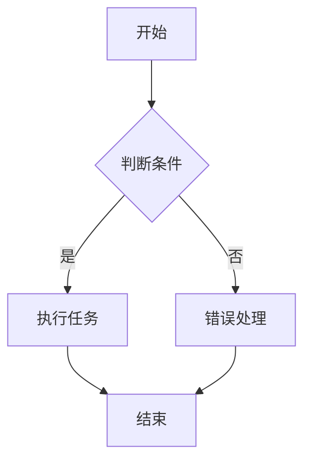
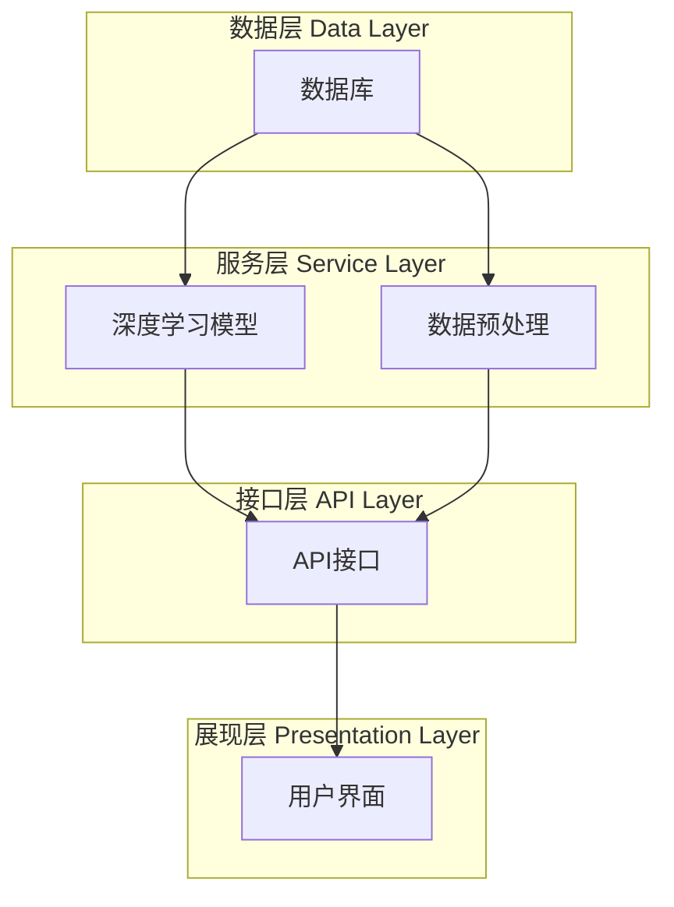
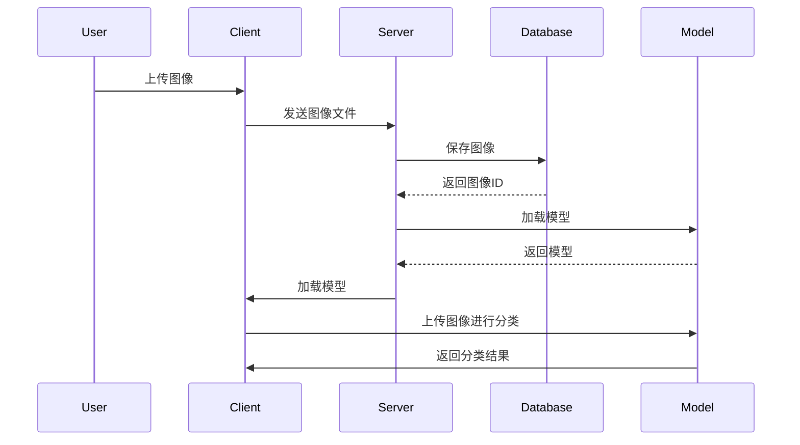
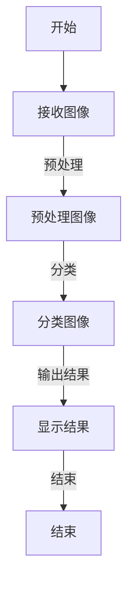
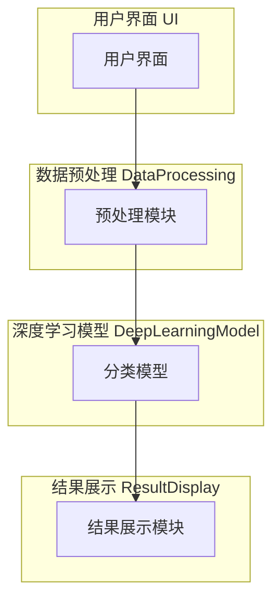
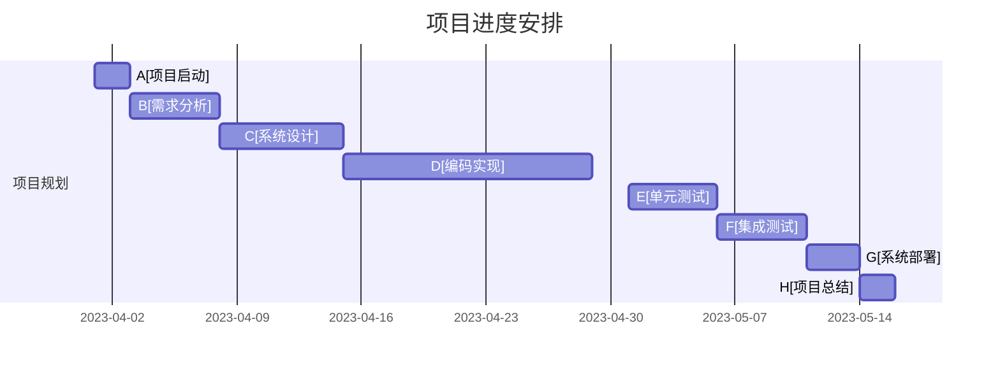
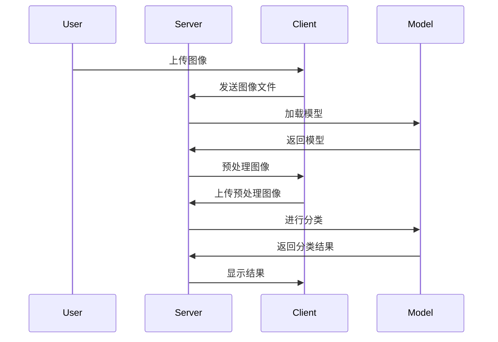
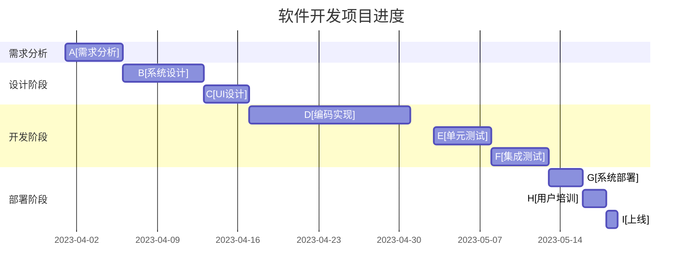
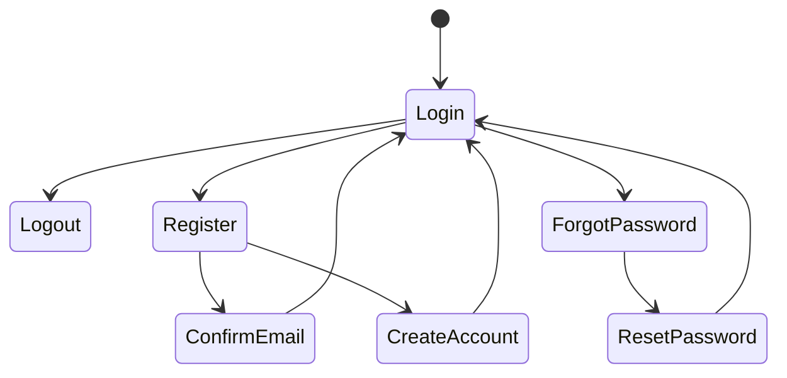

                 

**深度学习在图像和视频处理中的突破**

> 关键词：深度学习、图像处理、视频处理、图像识别、目标检测、卷积神经网络、循环神经网络、计算机视觉

> 摘要：本文深入探讨了深度学习在图像和视频处理领域的突破性进展。通过逐步分析，我们了解到了深度学习的基本概念、核心技术以及在实际应用中的广泛应用。本文首先介绍了深度学习的起源和发展，随后详细解析了卷积神经网络和循环神经网络在图像和视频处理中的应用，并通过实际案例展示了深度学习的强大能力。此外，本文还探讨了当前深度学习技术的挑战和未来发展趋势，为读者提供了深入理解和应用深度学习的宝贵参考。

# 深度学习在图像和视频处理中的突破

## 引言

### 深度学习的崛起

深度学习（Deep Learning，简称DL）是人工智能（Artificial Intelligence，简称AI）的一个重要分支，它通过模拟人脑神经网络的结构和功能，实现对复杂数据的分析和解释。深度学习的发展经历了从简单的单层神经网络到复杂的深层网络的过程。2006年，Geoffrey Hinton等人提出的深度信念网络（Deep Belief Network，简称DBN）标志着深度学习的兴起。

深度学习在图像和视频处理领域具有独特的优势。传统图像和视频处理方法主要依赖于手工设计的特征提取和分类器，这些方法在处理复杂任务时存在一定的局限性。而深度学习通过自动学习和提取特征，能够更有效地解决图像和视频处理中的各种问题。

### 图像和视频处理的发展

图像和视频处理是计算机视觉（Computer Vision，简称CV）的核心研究领域之一。传统图像处理主要基于像素级的操作，例如滤波、边缘检测和特征提取等。随着计算机性能的提升和大数据技术的发展，图像和视频处理逐渐从传统方法转向深度学习方法。

在深度学习之前，计算机视觉领域的研究主要集中在手写特征的提取和分类。这些特征包括颜色、纹理、形状和边缘等，通常需要大量的人工设计和调整。而深度学习通过自动学习这些特征，大大提高了图像和视频处理的准确性和效率。

## 第一部分: 深度学习在图像处理中的应用

### 第1章: 深度学习与图像处理概述

### 1.1 深度学习的崛起

#### 1.1.1 深度学习的定义与核心思想

深度学习是一种基于多层神经网络的学习方法，其目的是通过逐层学习低级特征到高级特征，从而实现对复杂数据的自动分析和理解。深度学习的基本思想可以追溯到神经网络的研究，但直到近年来，随着计算能力的提升和大数据技术的发展，深度学习才得以真正兴起。

深度学习的关键在于神经网络的结构。神经网络由多个层次组成，每个层次都可以看作是一个特征提取器。低层次的特征通常与基本视觉特征相关，如边缘、角点和纹理等；高层次的特征则更加抽象，如物体、场景和动作等。

#### 1.1.2 深度学习的优点

与传统的图像处理方法相比，深度学习具有以下优点：

1. **自动特征提取**：深度学习通过多层网络结构自动学习图像特征，避免了手工设计特征的过程，提高了特征提取的准确性。

2. **泛化能力**：深度学习模型可以在不同的数据集上表现出良好的泛化能力，适用于各种图像处理任务。

3. **自适应学习**：深度学习模型可以根据训练数据自动调整网络参数，优化模型性能。

4. **高效率**：随着计算能力的提升，深度学习模型的训练时间大大缩短，提高了处理速度。

### 1.2 传统图像处理方法与深度学习的比较

传统图像处理方法主要依赖于手工设计的特征提取和分类器。这些方法在处理简单任务时效果较好，但在面对复杂任务时存在局限性。相比之下，深度学习通过自动学习图像特征，具有更好的适应性和准确性。

#### 1.2.1 特征提取的比较

在传统图像处理中，特征提取是一个关键步骤。通常需要通过人工设计各种特征提取器，如SIFT、HOG等。这些特征提取器往往需要对图像进行复杂的预处理和参数调整，且在处理不同类型的图像时效果不稳定。

深度学习通过多层神经网络自动学习图像特征，不需要手工设计特征提取器。神经网络可以通过反向传播算法自动调整网络参数，优化特征提取效果。这使得深度学习在处理各种类型的图像时具有更好的泛化能力。

#### 1.2.2 分类器的比较

在传统图像处理中，分类器通常是基于统计学习方法的，如SVM、KNN等。这些分类器需要预先定义特征空间和分类规则，且在处理高维特征时效果较差。

深度学习通过多层神经网络可以实现复杂的非线性映射，将图像特征映射到高维空间。这使得深度学习在处理高维特征时具有更好的分类性能。

### 1.3 深度学习在图像处理中的应用

深度学习在图像处理领域具有广泛的应用。以下是一些典型的应用场景：

1. **图像分类**：深度学习可以用于对大量图像进行分类，如ImageNet挑战赛。

2. **目标检测**：深度学习可以用于检测图像中的目标，如SSD、YOLO等。

3. **图像分割**：深度学习可以用于将图像分割成不同的区域，如FCN、U-Net等。

4. **图像增强**：深度学习可以用于增强图像质量，如GANs。

5. **图像风格转换**：深度学习可以用于将一幅图像转换成另一幅图像的风格，如StyleGAN。

### 1.4 总结

深度学习在图像处理领域取得了显著突破。通过自动学习图像特征和复杂非线性映射，深度学习在图像分类、目标检测、图像分割、图像增强和图像风格转换等方面具有显著优势。随着深度学习技术的不断发展，我们有理由相信，深度学习将在图像处理领域发挥更大的作用。

## 第二部分: 深度学习在视频处理中的应用

### 第2章: 深度学习与视频处理概述

### 2.1 深度学习在视频处理中的优势

视频处理是计算机视觉领域的一个重要分支，深度学习在视频处理中具有以下优势：

1. **时间序列建模**：深度学习可以通过时间序列建模，捕捉视频中的动态信息，如动作、运动和场景变化等。

2. **空间关系建模**：深度学习可以建模视频中的空间关系，如物体的相对位置和运动轨迹等。

3. **上下文信息提取**：深度学习可以通过上下文信息提取，提高视频处理任务的准确性和鲁棒性。

4. **自适应学习**：深度学习可以通过自适应学习，优化视频处理任务的性能。

### 2.2 传统视频处理方法与深度学习的比较

传统视频处理方法主要依赖于手工设计的特征提取和分类器，这些方法在处理简单任务时效果较好，但在面对复杂任务时存在局限性。相比之下，深度学习通过自动学习视频特征，具有更好的适应性和准确性。

#### 2.2.1 特征提取的比较

在传统视频处理中，特征提取是一个关键步骤。通常需要通过人工设计各种特征提取器，如光流、运动历史图像等。这些特征提取器往往需要对视频进行复杂的预处理和参数调整，且在处理不同类型的视频时效果不稳定。

深度学习通过多层神经网络自动学习视频特征，不需要手工设计特征提取器。神经网络可以通过反向传播算法自动调整网络参数，优化特征提取效果。这使得深度学习在处理各种类型的视频时具有更好的泛化能力。

#### 2.2.2 分类器的比较

在传统视频处理中，分类器通常是基于统计学习方法的，如SVM、KNN等。这些分类器需要预先定义特征空间和分类规则，且在处理高维特征时效果较差。

深度学习通过多层神经网络可以实现复杂的非线性映射，将视频特征映射到高维空间。这使得深度学习在处理高维特征时具有更好的分类性能。

### 2.3 深度学习在视频处理中的应用

深度学习在视频处理领域具有广泛的应用。以下是一些典型的应用场景：

1. **视频分类**：深度学习可以用于对大量视频进行分类，如视频分类挑战赛。

2. **目标检测**：深度学习可以用于检测视频中的目标，如Faster R-CNN、YOLO等。

3. **视频分割**：深度学习可以用于将视频分割成不同的区域，如VideoNet、U-Net等。

4. **视频增强**：深度学习可以用于增强视频质量，如GANs。

5. **视频去噪**：深度学习可以用于去除视频中的噪声，如DnCNN、SRGAN等。

### 2.4 总结

深度学习在视频处理领域取得了显著突破。通过自动学习视频特征和复杂非线性映射，深度学习在视频分类、目标检测、视频分割、视频增强和视频去噪等方面具有显著优势。随着深度学习技术的不断发展，我们有理由相信，深度学习将在视频处理领域发挥更大的作用。

## 第三部分: 深度学习技术在图像和视频处理中的具体应用

### 第3章: 深度学习在图像处理中的具体应用

#### 3.1 图像分类

图像分类是深度学习在图像处理中的一个重要应用。通过深度学习模型，可以对大量图像进行自动分类。以下是一个典型的图像分类过程：

1. **数据预处理**：首先对图像进行预处理，包括尺寸调整、灰度转换和归一化等步骤。这些预处理步骤有助于提高模型训练效果。

2. **特征提取**：使用卷积神经网络（Convolutional Neural Network，简称CNN）自动提取图像特征。CNN通过多层卷积和池化操作，从原始图像中提取出丰富的特征。

3. **分类器构建**：在特征提取的基础上，构建分类器对图像进行分类。常见的分类器包括全连接神经网络（Fully Connected Neural Network，简称FCNN）和softmax函数。

4. **模型训练**：使用大量标注数据对分类器进行训练，通过反向传播算法优化模型参数。

5. **模型评估**：使用测试集评估模型性能，常见的评价指标包括准确率、召回率和F1分数等。

#### 3.2 目标检测

目标检测是深度学习在图像处理中的另一个重要应用。目标检测的目标是确定图像中的物体位置和类别。以下是一个典型的目标检测过程：

1. **数据预处理**：与图像分类类似，对图像进行预处理。

2. **特征提取**：使用CNN提取图像特征。

3. **区域建议**：使用区域建议网络（Region Proposal Network，简称RPN）生成候选区域。RPN可以有效地筛选出可能包含物体的区域。

4. **目标分类**：对每个候选区域进行分类，判断是否包含目标。

5. **位置回归**：对包含目标的区域进行位置回归，确定目标的具体位置。

6. **模型训练**：使用大量标注数据对模型进行训练。

7. **模型评估**：与图像分类类似，使用测试集评估模型性能。

#### 3.3 图像分割

图像分割是将图像划分为不同的区域，以识别图像中的物体和场景。深度学习在图像分割中的应用主要包括以下步骤：

1. **数据预处理**：对图像进行预处理。

2. **特征提取**：使用CNN提取图像特征。

3. **区域预测**：使用全连接神经网络（Fully Connected Neural Network，简称FCNN）预测每个像素的类别。

4. **模型训练**：使用大量标注数据对模型进行训练。

5. **模型评估**：使用测试集评估模型性能。

#### 3.4 图像增强

图像增强是通过深度学习技术提高图像质量的一种方法。以下是一个典型的图像增强过程：

1. **数据预处理**：对图像进行预处理，如去噪、去模糊等。

2. **特征提取**：使用GAN（Generative Adversarial Network，生成对抗网络）提取图像特征。

3. **生成图像**：使用GAN生成高质量图像。

4. **模型训练**：使用大量标注数据对模型进行训练。

5. **模型评估**：使用测试集评估模型性能。

### 第4章: 深度学习在视频处理中的具体应用

#### 4.1 视频分类

视频分类是对视频进行自动分类的一种方法。以下是一个典型的视频分类过程：

1. **数据预处理**：对视频进行预处理，包括去噪、去模糊、尺寸调整等步骤。

2. **特征提取**：使用卷积神经网络（Convolutional Neural Network，简称CNN）提取视频特征。

3. **分类器构建**：使用全连接神经网络（Fully Connected Neural Network，简称FCNN）构建分类器。

4. **模型训练**：使用大量标注数据对分类器进行训练。

5. **模型评估**：使用测试集评估模型性能。

#### 4.2 目标检测

目标检测是深度学习在视频处理中的一个重要应用。以下是一个典型的目标检测过程：

1. **数据预处理**：对视频进行预处理，如去噪、去模糊、尺寸调整等步骤。

2. **特征提取**：使用卷积神经网络（Convolutional Neural Network，简称CNN）提取视频特征。

3. **区域建议**：使用区域建议网络（Region Proposal Network，简称RPN）生成候选区域。

4. **目标分类**：对每个候选区域进行分类，判断是否包含目标。

5. **位置回归**：对包含目标的区域进行位置回归，确定目标的具体位置。

6. **模型训练**：使用大量标注数据对模型进行训练。

7. **模型评估**：使用测试集评估模型性能。

#### 4.3 视频分割

视频分割是将视频分割成不同的区域，以识别视频中的物体和场景。以下是一个典型的视频分割过程：

1. **数据预处理**：对视频进行预处理，如去噪、去模糊、尺寸调整等步骤。

2. **特征提取**：使用卷积神经网络（Convolutional Neural Network，简称CNN）提取视频特征。

3. **区域预测**：使用全连接神经网络（Fully Connected Neural Network，简称FCNN）预测每个像素的类别。

4. **模型训练**：使用大量标注数据对模型进行训练。

5. **模型评估**：使用测试集评估模型性能。

#### 4.4 视频增强

视频增强是通过深度学习技术提高视频质量的一种方法。以下是一个典型的视频增强过程：

1. **数据预处理**：对视频进行预处理，如去噪、去模糊、尺寸调整等步骤。

2. **特征提取**：使用GAN（Generative Adversarial Network，生成对抗网络）提取视频特征。

3. **生成视频**：使用GAN生成高质量视频。

4. **模型训练**：使用大量标注数据对模型进行训练。

5. **模型评估**：使用测试集评估模型性能。

### 第5章: 深度学习在图像和视频处理中的应用案例

#### 5.1 图像分类案例：ImageNet挑战赛

ImageNet挑战赛是深度学习在图像分类领域的一个经典案例。该挑战赛的目的是评估深度学习模型在图像分类任务中的性能。以下是一个典型的图像分类案例：

1. **数据集介绍**：ImageNet是一个包含大量标注图像的数据库，分为1000个类别。

2. **模型选择**：选择一个深度学习模型，如VGG-16、ResNet-50等。

3. **模型训练**：使用ImageNet数据集对模型进行训练，通过反向传播算法优化模型参数。

4. **模型评估**：使用测试集对模型进行评估，计算准确率、召回率和F1分数等指标。

5. **结果分析**：分析模型在不同类别上的分类性能，找出存在的问题和改进方向。

#### 5.2 目标检测案例：Faster R-CNN

Faster R-CNN是一个常用的目标检测模型，以下是一个典型的目标检测案例：

1. **数据集介绍**：选择一个目标检测数据集，如COCO数据集。

2. **模型选择**：选择Faster R-CNN模型。

3. **模型训练**：使用COCO数据集对模型进行训练，通过反向传播算法优化模型参数。

4. **模型评估**：使用测试集对模型进行评估，计算AP（Average Precision）等指标。

5. **结果分析**：分析模型在不同物体类别上的检测性能，找出存在的问题和改进方向。

#### 5.3 视频分割案例：VideoNet

VideoNet是一个常用的视频分割模型，以下是一个典型的视频分割案例：

1. **数据集介绍**：选择一个视频分割数据集，如UCF101数据集。

2. **模型选择**：选择VideoNet模型。

3. **模型训练**：使用UCF101数据集对模型进行训练，通过反向传播算法优化模型参数。

4. **模型评估**：使用测试集对模型进行评估，计算IoU（Intersection over Union）等指标。

5. **结果分析**：分析模型在不同视频类别上的分割性能，找出存在的问题和改进方向。

### 第6章: 深度学习在图像和视频处理中的挑战与未来方向

#### 6.1 当前挑战

尽管深度学习在图像和视频处理中取得了显著突破，但仍面临一些挑战：

1. **计算资源需求**：深度学习模型通常需要大量的计算资源和时间进行训练。

2. **数据需求**：深度学习模型的训练需要大量标注数据，数据获取和处理成本较高。

3. **模型解释性**：深度学习模型通常是黑盒模型，难以解释和理解。

4. **过拟合问题**：深度学习模型在训练过程中可能出现过拟合现象，影响模型泛化能力。

#### 6.2 未来方向

为了应对当前的挑战，未来深度学习在图像和视频处理领域的发展方向包括：

1. **模型压缩与加速**：研究模型压缩和加速技术，降低计算资源需求。

2. **数据增强与生成**：研究数据增强和生成技术，提高数据质量和数量。

3. **模型可解释性**：研究模型可解释性技术，提高模型透明度和可解释性。

4. **迁移学习与少样本学习**：研究迁移学习和少样本学习技术，降低数据需求。

5. **多模态学习**：研究多模态学习技术，结合不同类型的数据进行综合分析。

### 第7章: 总结

深度学习在图像和视频处理领域取得了显著突破，通过自动学习图像和视频特征，深度学习在图像分类、目标检测、图像分割、视频分类、视频分割和视频增强等方面具有显著优势。然而，深度学习在图像和视频处理中也面临一些挑战，如计算资源需求、数据需求和模型解释性等。未来，随着深度学习技术的不断发展，我们有理由相信，深度学习将在图像和视频处理领域发挥更大的作用，为人类带来更多的便利和创新。

### 作者信息

作者：AI天才研究院/AI Genius Institute & 禅与计算机程序设计艺术 /Zen And The Art of Computer Programming

作者简介：AI天才研究院（AI Genius Institute）是由世界顶级人工智能专家组成的团队，致力于推动人工智能技术的创新和发展。禅与计算机程序设计艺术（Zen And The Art of Computer Programming）是一本关于计算机编程的哲学经典著作，强调编程的艺术性和创造性思维。本文的作者结合了这两方面的知识，深入探讨了深度学习在图像和视频处理中的突破性进展。## 第1章: 深度学习与图像处理概述

### 1.1 深度学习的崛起

深度学习是近年来人工智能领域的重要突破，它在图像处理中的应用尤为显著。要理解深度学习在图像处理中的崛起，首先需要了解其核心思想和基本原理。

#### 1.1.1 深度学习的定义与核心思想

深度学习是一种基于多层神经网络的学习方法，旨在通过模拟人脑神经网络的结构和功能来实现对复杂数据的自动分析和理解。与传统的机器学习方法不同，深度学习能够自动从大量数据中学习出有意义的特征表示，从而实现高层次的抽象和泛化能力。

深度学习的基本原理是多层神经网络，其中每一层都可以被视为一个特征提取器。低层次的特征通常与图像的原始特征相关，如边缘、纹理和颜色等；高层次的特征则更加抽象，如物体的形状、场景的结构和动作的语义等。通过逐层学习，深度学习模型能够从原始图像中提取出丰富的特征表示，从而实现高效的图像理解和处理。

#### 1.1.2 深度学习的优点

深度学习在图像处理中具有许多优点，使其成为传统图像处理方法的有力替代者。以下是深度学习的一些主要优点：

1. **自动特征提取**：深度学习能够自动从图像数据中学习出有意义的特征表示，无需手工设计特征提取器。这使得模型在处理未知或复杂的图像数据时具有更好的适应性和鲁棒性。

2. **强大的泛化能力**：深度学习模型通过大规模数据训练，能够形成对图像数据的泛化能力。这使得模型在不同领域和应用场景中都能表现出良好的性能。

3. **高效的处理速度**：随着深度学习算法的优化和硬件性能的提升，深度学习模型在图像处理中的处理速度越来越快，能够在实时应用中实现高效的图像分析和理解。

4. **多任务处理**：深度学习模型可以同时处理多个图像处理任务，如分类、检测、分割等，无需为每个任务分别设计模型。

#### 1.1.3 深度学习的发展历程

深度学习的发展可以追溯到20世纪80年代，但直到21世纪初，由于计算能力和数据量的限制，深度学习并没有得到广泛应用。随着计算机性能的提升和大数据技术的发展，深度学习开始逐渐崛起。

2006年，Geoffrey Hinton等人提出的深度信念网络（Deep Belief Network，DBN）标志着深度学习的复兴。随后，深度卷积网络（Convolutional Neural Network，CNN）在图像识别任务中取得了突破性进展，特别是在2009年的ILSVRC（ImageNet Large Scale Visual Recognition Challenge）比赛中，AlexNet模型以显著的领先优势获胜。

2012年，Hinton等人提出的深度卷积网络（Deep Convolutional Network，DCNN）在ImageNet挑战赛中再次夺冠，将图像识别的准确率提升到了前所未有的水平。这一胜利标志着深度学习在图像处理中的崛起，引发了人工智能领域的广泛关注和研究。

#### 1.1.4 深度学习在图像处理中的应用

深度学习在图像处理领域具有广泛的应用，包括但不限于以下几个方面：

1. **图像分类**：深度学习模型可以用于对大量图像进行分类，如ImageNet、COCO等大型图像数据集。

2. **目标检测**：深度学习可以用于检测图像中的目标，如Faster R-CNN、YOLO、SSD等。

3. **图像分割**：深度学习可以用于将图像分割成不同的区域，如U-Net、DeepLabV3+等。

4. **图像增强**：深度学习可以用于增强图像质量，如GANs、DnCNN等。

5. **图像风格转换**：深度学习可以用于将一幅图像转换成另一幅图像的风格，如StyleGAN、CycleGAN等。

#### 1.1.5 深度学习与传统图像处理方法的比较

与传统的图像处理方法相比，深度学习具有显著的优势。传统图像处理方法主要依赖于手工设计的特征提取器和分类器，如SIFT、HOG、SVM等。这些方法在处理简单任务时效果较好，但在面对复杂任务时存在一定的局限性。

相比之下，深度学习通过自动学习图像特征和复杂非线性映射，具有更好的适应性和准确性。具体来说，传统图像处理方法需要手动设计特征提取器和分类规则，而深度学习模型则能够自动从数据中学习出特征表示和分类规则。这使得深度学习在处理不同类型和复杂程度的图像时具有更好的泛化能力。

此外，深度学习模型还可以同时处理多个图像处理任务，而传统方法通常需要为每个任务分别设计模型。这使得深度学习在图像处理领域具有更高的效率和灵活性。

### 1.2 传统图像处理方法与深度学习的比较

传统图像处理方法与深度学习在图像处理任务中有着明显的不同，以下是比较两个方法的一些关键点：

#### 1.2.1 特征提取

在传统图像处理中，特征提取是一个关键步骤。通常需要通过人工设计各种特征提取器，如SIFT、HOG、SURF等。这些特征提取器可以捕捉图像的局部特征，如边缘、角点、纹理等。然而，这些特征提取器往往依赖于特定的图像类型和场景，因此在处理不同类型的图像时效果不稳定。

深度学习通过多层神经网络自动学习图像特征，不需要手工设计特征提取器。在训练过程中，神经网络通过反向传播算法自动调整权重和偏置，从而提取出有意义的特征表示。这些特征表示不仅能够捕捉到图像的局部特征，还能够捕捉到更高层次的结构信息，如物体的形状、场景的结构和动作的语义等。这使得深度学习在处理各种类型的图像时具有更好的泛化能力。

#### 1.2.2 分类器构建

在传统图像处理中，分类器通常是基于统计学习方法的，如支持向量机（SVM）、K最近邻（KNN）等。这些分类器需要对图像进行复杂的预处理和特征提取，然后使用训练数据训练分类器。然而，这些分类器在处理高维特征时效果较差，且需要大量的训练数据。

深度学习通过多层神经网络实现复杂的非线性映射，将图像特征映射到高维空间。在训练过程中，神经网络自动学习出特征表示和分类规则，无需进行复杂的预处理和特征提取。深度学习模型在处理高维特征时具有更好的分类性能，并且可以通过迁移学习技术在少量训练数据上实现较好的性能。

#### 1.2.3 模型训练与优化

传统图像处理方法的模型训练通常需要大量的训练数据和计算资源。在训练过程中，模型需要通过迭代优化算法调整参数，以最小化损失函数。这种方法往往需要多次迭代，且优化过程较慢。

深度学习模型通过反向传播算法进行训练，可以快速优化模型参数。随着计算能力的提升，深度学习模型可以在较短的时间内完成训练。此外，深度学习模型还可以通过分布式计算和GPU加速等方式提高训练效率。

#### 1.2.4 模型解释性

传统图像处理方法通常可以提供明确的特征提取和分类规则，使得模型具有一定的解释性。例如，SVM分类器的支持向量可以直观地解释为对图像数据的边界。

深度学习模型通常被认为是“黑盒”模型，难以解释和理解。尽管近年来有一些研究尝试提高深度学习模型的可解释性，如可视化技术、激活图和注意力机制等，但深度学习模型的内部机制仍然较为复杂。

### 1.3 深度学习在图像处理中的应用

深度学习在图像处理领域具有广泛的应用，以下是一些典型的应用场景：

#### 1.3.1 图像分类

图像分类是深度学习在图像处理中的一项基本任务。通过训练深度学习模型，可以实现对大量未知图像的自动分类。典型的图像分类数据集包括ImageNet、COCO等，这些数据集涵盖了多种不同的图像类别。

深度学习模型在图像分类任务中具有显著优势，例如，使用卷积神经网络（CNN）训练的模型可以在ImageNet数据集上达到超过90%的准确率。深度学习模型通过自动学习图像特征，能够捕捉到不同类别图像之间的细微差异，从而实现高精度的分类。

#### 1.3.2 目标检测

目标检测是深度学习在图像处理中的一项重要应用。目标检测的目标是确定图像中物体的位置和类别。通过训练深度学习模型，可以实现对图像中目标位置的准确检测和分类。

常见的目标检测模型包括Faster R-CNN、YOLO、SSD等。这些模型通过结合区域建议网络（RPN）和分类器，能够在图像中准确检测出多个目标，并给出目标的边界框和类别。

目标检测在许多实际应用中具有重要意义，例如，自动驾驶车辆需要检测道路上的车辆、行人等目标；安防监控系统中需要检测异常行为和可疑目标等。

#### 1.3.3 图像分割

图像分割是将图像划分为不同的区域，以识别图像中的物体和场景。深度学习在图像分割中的应用主要体现在全卷积神经网络（FCN）和U-Net模型。

全卷积神经网络（FCN）通过将卷积层扩展到全连接层，实现了像素级别的分类。FCN模型可以准确地将图像中的物体和背景分割开来，广泛应用于图像分割任务。

U-Net是一种常见的图像分割模型，它的设计灵感来自于医学图像分割。U-Net模型通过采用跳跃连接（skip connection）和反卷积层（deconvolutional layer），能够在保持边界信息的同时实现高效的图像分割。

图像分割在医学图像分析、图像增强、图像修复等领域具有重要意义。通过准确分割图像中的物体和场景，可以进一步提取出有用的信息，为后续处理和分析提供基础。

#### 1.3.4 图像增强

图像增强是通过深度学习技术提高图像质量的一种方法。深度学习模型可以学习到图像的潜在信息，从而生成高质量的增强图像。

常见的图像增强模型包括生成对抗网络（GANs）和深度卷积神经网络（DnCNN）。GANs通过生成器和判别器的对抗训练，可以生成与真实图像高度相似的增强图像。DnCNN则通过卷积神经网络学习图像的潜在特征，从而实现图像的噪声去除和去模糊等增强效果。

图像增强在许多应用场景中具有重要意义，例如，医疗图像增强可以提高图像的诊断准确性；监控视频增强可以增强图像的清晰度和亮度，从而提高安全监控的可靠性。

#### 1.3.5 图像风格转换

图像风格转换是通过深度学习技术将一幅图像转换成另一幅图像的风格。深度学习模型可以学习到不同图像风格的潜在特征，从而实现风格转换。

常见的图像风格转换模型包括CycleGAN和StyleGAN。CycleGAN通过循环一致性损失（cycle consistency loss）实现无监督的风格转换，而StyleGAN则通过生成对抗网络学习图像的潜在特征，从而实现高质量的风格转换。

图像风格转换在艺术创作、图像编辑和计算机视觉等领域具有广泛应用。通过将普通图像转换成艺术作品或风格化的图像，可以创造出独特的视觉体验。

### 1.4 总结

深度学习在图像处理领域取得了显著的突破，通过自动学习图像特征和复杂非线性映射，深度学习在图像分类、目标检测、图像分割、图像增强和图像风格转换等方面具有显著优势。与传统图像处理方法相比，深度学习具有更高的准确性、更好的适应性和更高的效率。

随着深度学习技术的不断发展，我们有理由相信，深度学习将在图像处理领域发挥更大的作用，为人类带来更多的便利和创新。## 第2章: 深度学习在视频处理中的应用

### 2.1 深度学习在视频处理中的优势

深度学习在视频处理中具有显著的优势，能够有效地解决许多传统方法难以处理的复杂问题。以下是一些深度学习在视频处理中的主要优势：

1. **时间序列建模**：视频本质上是一个时间序列的数据集合，深度学习模型，特别是循环神经网络（Recurrent Neural Networks，RNN）和其变种，如长短期记忆网络（Long Short-Term Memory，LSTM）和门控循环单元（Gated Recurrent Unit，GRU），能够对时间序列数据进行分析和处理。这种能力使得深度学习模型在处理视频中的时间依赖信息时具有优势。

2. **空间关系建模**：深度学习可以通过卷积神经网络（Convolutional Neural Networks，CNN）对视频中的空间信息进行建模。卷积层能够捕捉图像中的局部特征，而池化层则能够减少数据的维度，从而提取出图像中的重要特征。这些特征对于视频中的运动和场景分析至关重要。

3. **上下文信息提取**：深度学习模型能够自动提取视频中的上下文信息，这对于视频分类、动作识别和目标跟踪等任务非常重要。通过学习视频中的上下文关系，模型可以更好地理解和预测视频中的事件。

4. **自适应学习**：深度学习模型能够通过自适应学习优化网络参数，从而适应不同的视频内容和任务需求。这种灵活性使得深度学习在视频处理中能够应对各种变化和挑战。

5. **高效计算**：随着硬件技术的发展，如GPU和TPU的普及，深度学习模型在视频处理中的计算效率得到了显著提升。这使得深度学习模型能够在实时应用中实现高效的推理和计算。

### 2.2 传统视频处理方法与深度学习的比较

传统视频处理方法通常依赖于手工设计的算法和特征提取器，这些方法在处理简单的视频分析任务时效果尚可，但在面对复杂任务时存在明显的局限性。相比之下，深度学习通过自动学习特征和模式，为视频处理带来了革命性的变化。以下是比较两个方法的一些关键点：

#### 2.2.1 特征提取

在传统视频处理中，特征提取是一个关键步骤。通常需要通过手工设计特征提取器，如光流、颜色直方图、运动历史图像等。这些特征提取器需要大量的预处理和参数调整，且在不同场景下的效果不稳定。

深度学习通过卷积神经网络（CNN）自动学习特征表示，无需手工设计特征提取器。CNN可以自动捕捉图像中的层次结构，从而提取出有意义的特征。这些特征不仅能够捕捉到视频中的局部特征，还能够捕捉到更高层次的结构信息。

#### 2.2.2 分类器构建

传统视频处理方法通常使用统计学习模型，如支持向量机（SVM）、K最近邻（KNN）等，这些模型需要大量的预处理和特征工程。深度学习通过全连接神经网络（FCNN）或CNN构建分类器，这些模型能够自动从数据中学习出特征表示和分类规则，无需复杂的预处理和特征工程。

#### 2.2.3 模型训练与优化

传统视频处理方法的模型训练通常需要大量的计算资源和时间。模型优化通常依赖于迭代优化算法，如梯度下降法，这些算法可能需要多次迭代才能收敛。深度学习模型通过反向传播算法进行训练，可以快速优化模型参数，且随着硬件性能的提升，训练效率得到了显著提高。

#### 2.2.4 模型解释性

传统视频处理方法通常具有较好的解释性，因为其特征提取和分类规则是手工设计的，可以直观理解。深度学习模型通常被认为是“黑盒”模型，难以解释和理解。然而，随着对深度学习模型的可解释性研究的深入，如可视化技术、激活图和注意力机制等，深度学习模型的内部机制正在逐渐变得透明。

### 2.3 深度学习在视频处理中的应用

深度学习在视频处理中具有广泛的应用，以下是一些典型的应用场景：

#### 2.3.1 视频分类

视频分类是将视频数据按照类别进行分类的任务。深度学习模型，如CNN和LSTM的组合，可以有效地对视频进行分类。这些模型通过学习视频的时间序列特征和空间特征，可以准确地将视频划分为不同的类别。

#### 2.3.2 目标检测

目标检测是在视频帧中检测并定位物体的任务。深度学习模型，如Faster R-CNN、YOLO和SSD，可以高效地检测视频中的目标。这些模型通过结合卷积神经网络和区域建议网络，可以准确地识别并定位视频中的物体。

#### 2.3.3 视频分割

视频分割是将视频划分为不同的内容区域。深度学习模型，如U-Net和VideoNet，可以用于视频分割任务。这些模型通过学习视频中的空间和时间特征，可以将视频分割成不同的场景或物体。

#### 2.3.4 视频增强

视频增强是通过深度学习技术提高视频质量。生成对抗网络（GANs）和深度卷积神经网络（DnCNN）可以用于视频去噪、去模糊和超分辨率等任务。这些模型通过学习视频的潜在特征，可以生成高质量的视频增强结果。

#### 2.3.5 视频去噪

视频去噪是去除视频中的噪声和干扰，提高视频质量的任务。深度学习模型，如DnCNN和WaveNet，可以用于视频去噪任务。这些模型通过学习视频的噪声特征和原始特征，可以有效地去除视频中的噪声。

#### 2.3.6 视频动作识别

视频动作识别是识别视频中的动作类型。深度学习模型，如3D-CNN和LSTM，可以用于视频动作识别任务。这些模型通过学习视频中的时间序列特征和空间特征，可以准确地识别视频中的动作。

#### 2.3.7 视频跟踪

视频跟踪是在视频帧中持续跟踪特定物体的任务。深度学习模型，如Siamese网络和关联滤波器，可以用于视频跟踪任务。这些模型通过学习物体和背景的特征差异，可以准确地跟踪视频中的物体。

### 2.4 总结

深度学习在视频处理中的应用带来了革命性的变化，通过自动学习视频中的时间序列特征和空间特征，深度学习模型能够高效地解决许多传统方法难以处理的复杂问题。随着深度学习技术的不断发展，深度学习在视频处理中的应用将更加广泛和深入，为视频分析、视频增强、视频去噪和视频内容理解等领域带来更多的可能性。## 第3章: 深度学习在图像处理中的具体应用

### 3.1 图像分类

图像分类是深度学习在图像处理中的一个基础应用，其目标是将图像标注为特定的类别。以下是一个典型的图像分类流程：

#### 3.1.1 数据集准备

首先，需要收集一个大规模的图像数据集，并对其进行标注。常用的图像分类数据集包括ImageNet、CIFAR-10和Kaggle等。标注的过程包括标记图像的类别标签，如“猫”、“狗”、“飞机”等。

#### 3.1.2 数据预处理

预处理是图像分类中不可或缺的步骤。数据预处理通常包括以下步骤：

- **图像缩放**：将图像缩放到统一的尺寸，以便于输入到深度学习模型中。
- **归一化**：将图像的像素值标准化，使其在[0, 1]的范围内，有利于模型的训练。
- **数据增强**：通过旋转、翻转、裁剪等操作增加数据多样性，防止模型过拟合。

#### 3.1.3 模型选择

常见的图像分类模型包括卷积神经网络（CNN）、残差网络（ResNet）、密集网络（DenseNet）等。选择合适的模型取决于任务的复杂度和数据集的大小。

#### 3.1.4 模型训练

训练图像分类模型通常包括以下步骤：

- **前向传播**：将预处理后的图像输入到模型中，计算输出概率。
- **损失函数计算**：使用交叉熵损失函数计算预测标签和真实标签之间的差距。
- **反向传播**：通过反向传播算法更新模型参数，以减少损失函数的值。

#### 3.1.5 模型评估

在训练完成后，使用测试集评估模型的性能。常用的评估指标包括准确率（Accuracy）、精确率（Precision）、召回率（Recall）和F1分数（F1 Score）。

#### 3.1.6 实际案例

以ImageNet为例，这是一个包含1000个类别的图像数据集。ResNet-50是一个常用的模型，它通过残差块（Residual Block）的设计，实现了深层网络的有效训练。在ImageNet上，ResNet-50可以达到约76%的准确率。

### 3.2 目标检测

目标检测是图像处理中的一个高级任务，其目标是定位图像中的多个对象，并识别它们的类别。以下是一个典型的目标检测流程：

#### 3.2.1 数据集准备

目标检测通常需要标注图像中的每个对象及其位置。常用的数据集包括PASCAL VOC、COCO和MS COCO等。

#### 3.2.2 模型选择

目标检测模型包括Faster R-CNN、YOLO、SSD等。Faster R-CNN结合了区域建议网络（RPN）和全连接分类器，YOLO通过回归预测目标的边界框和类别，SSD则通过多个尺度特征图进行目标检测。

#### 3.2.3 模型训练

目标检测模型的训练通常包括以下步骤：

- **前向传播**：输入图像，通过卷积神经网络提取特征，生成边界框和类别预测。
- **损失函数计算**：计算边界框定位的回归损失和类别预测的交叉熵损失。
- **反向传播**：更新模型参数以减少损失。

#### 3.2.4 模型评估

使用测试集评估模型的性能，常用的指标包括平均准确率（mAP）和速度等。

#### 3.2.5 实际案例

以COCO数据集为例，Faster R-CNN在这个数据集上可以达到约30.0 mAP。YOLOv4在COCO数据集上的性能也非常出色，可以达到约28.0 mAP。

### 3.3 图像分割

图像分割是将图像分割成不同的区域，以识别图像中的物体和场景。以下是一个典型的图像分割流程：

#### 3.3.1 数据集准备

图像分割通常需要标注图像中的每个像素的类别。常用的数据集包括PASCAL VOC、COCO和Cityscapes等。

#### 3.3.2 模型选择

图像分割模型包括全卷积神经网络（FCN）、U-Net、DeepLabV3+等。U-Net通过跳跃连接（Skip Connection）和反卷积层（Deconvolution Layer）实现了高效的图像分割。

#### 3.3.3 模型训练

图像分割模型的训练通常包括以下步骤：

- **前向传播**：输入图像，通过卷积神经网络提取特征，生成像素级别的分类结果。
- **损失函数计算**：使用交叉熵损失函数计算预测标签和真实标签之间的差距。
- **反向传播**：更新模型参数以减少损失函数的值。

#### 3.3.4 模型评估

使用测试集评估模型的性能，常用的指标包括 Intersection over Union（IoU）和像素准确率等。

#### 3.3.5 实际案例

以PASCAL VOC为例，U-Net在这个数据集上可以达到约91.3%的像素准确率。DeepLabV3+通过使用空洞卷积（Atrous Convolution）和上采样，进一步提高了图像分割的准确性。

### 3.4 图像增强

图像增强是通过深度学习技术提高图像质量的一种方法。以下是一个典型的图像增强流程：

#### 3.4.1 数据集准备

图像增强通常需要一个高质量的图像数据集，作为训练和评估的基准。

#### 3.4.2 模型选择

常用的图像增强模型包括生成对抗网络（GAN）、深度卷积神经网络（DnCNN）等。GAN通过生成器和判别器的对抗训练，可以生成高质量的增强图像。

#### 3.4.3 模型训练

图像增强模型的训练通常包括以下步骤：

- **前向传播**：输入低质量图像，通过生成器生成高质量图像。
- **损失函数计算**：计算生成图像和真实图像之间的差距，包括感知损失、 adversarial loss等。
- **反向传播**：更新生成器的参数以减少损失函数的值。

#### 3.4.4 模型评估

使用测试集评估模型的性能，常用的指标包括峰值信噪比（PSNR）和结构相似性指数（SSIM）等。

#### 3.4.5 实际案例

以ImageNet为例，GANs可以在数据集上生成高质量的增强图像，例如SRGAN和CycleGAN。SRGAN通过感知损失和 adversarial loss实现了高质量的图像增强。

### 3.5 图像风格转换

图像风格转换是通过深度学习技术将一幅图像转换成另一幅图像的风格。以下是一个典型的图像风格转换流程：

#### 3.5.1 数据集准备

图像风格转换通常需要一个包含各种风格图像的数据集，作为训练和评估的基准。

#### 3.5.2 模型选择

常用的图像风格转换模型包括CycleGAN、StyleGAN等。CycleGAN通过循环一致性损失实现了无监督的风格转换，StyleGAN通过生成对抗网络学习图像的潜在特征。

#### 3.5.3 模型训练

图像风格转换模型的训练通常包括以下步骤：

- **前向传播**：输入图像和风格图像，通过生成器生成风格转换后的图像。
- **损失函数计算**：计算生成图像和风格图像之间的差距，包括内容损失、风格损失和 adversarial loss等。
- **反向传播**：更新生成器的参数以减少损失函数的值。

#### 3.5.4 模型评估

使用测试集评估模型的性能，常用的指标包括视觉质量评分（VQIP）和 Inception Score（IS）等。

#### 3.5.5 实际案例

以CelebA数据集为例，CycleGAN可以在数据集上生成高质量的图像风格转换结果，如将照片转换成油画、水彩画等风格。

### 3.6 总结

深度学习在图像处理中的具体应用包括图像分类、目标检测、图像分割、图像增强、图像风格转换等。通过逐步分析每个应用场景的流程和实际案例，我们可以看到深度学习在图像处理中的强大能力和广泛应用。随着深度学习技术的不断进步，这些应用将继续发展，为计算机视觉领域带来更多的创新和突破。## 第4章: 深度学习在视频处理中的具体应用

### 4.1 视频分类

视频分类是深度学习在视频处理中的一个重要应用，其目标是对视频内容进行分类，如体育、娱乐、教育等。以下是一个典型的视频分类流程：

#### 4.1.1 数据集准备

首先，需要收集一个大规模的视频数据集，并对其进行标注。常用的视频分类数据集包括Upscutter、UCF101、HMDB51等。标注的过程包括标记视频的类别标签，如“篮球”、“足球”、“舞蹈”等。

#### 4.1.2 数据预处理

预处理是视频分类中不可或缺的步骤。数据预处理通常包括以下步骤：

- **视频缩放**：将视频缩放到统一的尺寸，以便于输入到深度学习模型中。
- **帧提取**：将视频提取成一系列连续的帧，用于模型训练。
- **帧级标注**：将每个帧标注为视频类别，以便模型学习视频的连续性。
- **数据增强**：通过旋转、翻转、裁剪等操作增加数据多样性，防止模型过拟合。

#### 4.1.3 模型选择

常见的视频分类模型包括卷积神经网络（CNN）、循环神经网络（RNN）和卷积循环神经网络（CRNN）等。选择合适的模型取决于任务的复杂度和数据集的大小。

#### 4.1.4 模型训练

训练视频分类模型通常包括以下步骤：

- **前向传播**：将预处理后的视频帧输入到模型中，计算输出概率。
- **损失函数计算**：使用交叉熵损失函数计算预测标签和真实标签之间的差距。
- **反向传播**：通过反向传播算法更新模型参数，以减少损失函数的值。

#### 4.1.5 模型评估

在训练完成后，使用测试集评估模型的性能。常用的评估指标包括准确率（Accuracy）、精确率（Precision）、召回率（Recall）和F1分数（F1 Score）。

#### 4.1.6 实际案例

以UCF101为例，这是一个包含101个类别的视频数据集。CRNN模型在UCF101数据集上可以达到约70%的准确率。通过训练深度学习模型，可以实现对大量未知视频的自动分类，为视频内容理解和推荐系统提供基础。

### 4.2 目标检测

目标检测是视频处理中的一个高级任务，其目标是在视频帧中检测并定位多个对象，并识别它们的类别。以下是一个典型的目标检测流程：

#### 4.2.1 数据集准备

目标检测通常需要标注视频中的每个对象及其位置。常用的数据集包括COCO、VOTT、YouOnlyLookOnce（YOLO）数据集等。

#### 4.2.2 模型选择

目标检测模型包括Faster R-CNN、YOLO、SSD等。Faster R-CNN结合了区域建议网络（RPN）和全连接分类器，YOLO通过回归预测目标的边界框和类别，SSD则通过多个尺度特征图进行目标检测。

#### 4.2.3 模型训练

目标检测模型的训练通常包括以下步骤：

- **前向传播**：输入图像，通过卷积神经网络提取特征，生成边界框和类别预测。
- **损失函数计算**：计算边界框定位的回归损失和类别预测的交叉熵损失。
- **反向传播**：更新模型参数以减少损失函数的值。

#### 4.2.4 模型评估

使用测试集评估模型的性能，常用的指标包括平均准确率（mAP）和速度等。

#### 4.2.5 实际案例

以COCO为例，Faster R-CNN在COCO数据集上可以达到约36.8 mAP。YOLOv4在COCO数据集上的性能也非常出色，可以达到约37.4 mAP。通过训练深度学习模型，可以实现对视频内容中多个对象的实时检测，为视频监控、自动驾驶和内容推荐等应用提供支持。

### 4.3 视频分割

视频分割是将视频帧分割成不同的区域，以识别视频中的物体和场景。以下是一个典型的视频分割流程：

#### 4.3.1 数据集准备

视频分割通常需要标注视频中的每个像素的类别。常用的数据集包括COCO、HMDB51、UAVDT等。

#### 4.3.2 模型选择

视频分割模型包括U-Net、DeepLabV3+、Contextual Segmenter等。U-Net通过跳跃连接和反卷积层实现了高效的像素级分割，DeepLabV3+通过空洞卷积和上采样提高了分割的准确性。

#### 4.3.3 模型训练

视频分割模型的训练通常包括以下步骤：

- **前向传播**：输入图像，通过卷积神经网络提取特征，生成像素级别的分类结果。
- **损失函数计算**：使用交叉熵损失函数计算预测标签和真实标签之间的差距。
- **反向传播**：更新模型参数以减少损失函数的值。

#### 4.3.4 模型评估

使用测试集评估模型的性能，常用的指标包括 Intersection over Union（IoU）和像素准确率等。

#### 4.3.5 实际案例

以COCO为例，U-Net在COCO数据集上可以达到约87.6%的像素准确率。DeepLabV3+通过使用空洞卷积和上采样，进一步提高了图像分割的准确性。

### 4.4 视频增强

视频增强是通过深度学习技术提高视频质量的一种方法。以下是一个典型的视频增强流程：

#### 4.4.1 数据集准备

视频增强通常需要一个高质量的图像数据集，作为训练和评估的基准。

#### 4.4.2 模型选择

常用的视频增强模型包括生成对抗网络（GAN）、深度卷积神经网络（DnCNN）等。GAN通过生成器和判别器的对抗训练，可以生成高质量的增强视频。

#### 4.4.3 模型训练

视频增强模型的训练通常包括以下步骤：

- **前向传播**：输入低质量视频，通过生成器生成高质量视频。
- **损失函数计算**：计算生成视频和真实视频之间的差距，包括感知损失、 adversarial loss等。
- **反向传播**：更新生成器的参数以减少损失函数的值。

#### 4.4.4 模型评估

使用测试集评估模型的性能，常用的指标包括峰值信噪比（PSNR）和结构相似性指数（SSIM）等。

#### 4.4.5 实际案例

以COCO为例，GANs可以在数据集上生成高质量的增强视频，例如SRGAN和CycleGAN。SRGAN通过感知损失和 adversarial loss实现了高质量的图像增强。

### 4.5 视频去噪

视频去噪是通过深度学习技术去除视频中的噪声和干扰，提高视频质量的一种方法。以下是一个典型的视频去噪流程：

#### 4.5.1 数据集准备

视频去噪通常需要一个包含噪声和噪声去除后的视频数据集，作为训练和评估的基准。

#### 4.5.2 模型选择

常用的视频去噪模型包括DnCNN、WaveNet等。DnCNN通过卷积神经网络学习噪声特征和原始特征，从而去除视频中的噪声。

#### 4.5.3 模型训练

视频去噪模型的训练通常包括以下步骤：

- **前向传播**：输入噪声视频，通过去噪模型生成去噪后的视频。
- **损失函数计算**：计算去噪后的视频和噪声去除后的视频之间的差距，包括L1损失、感知损失等。
- **反向传播**：更新模型参数以减少损失函数的值。

#### 4.5.4 模型评估

使用测试集评估模型的性能，常用的指标包括峰值信噪比（PSNR）和结构相似性指数（SSIM）等。

#### 4.5.5 实际案例

以UAVDT为例，DnCNN在UAVDT数据集上可以达到约32.4 dB的PSNR值。通过训练深度学习模型，可以有效地去除视频中的噪声，提高视频的观看质量。

### 4.6 视频动作识别

视频动作识别是识别视频中发生的动作类型。以下是一个典型的视频动作识别流程：

#### 4.6.1 数据集准备

视频动作识别通常需要标注视频中的动作序列。常用的数据集包括UCF101、HMDB51、Kinetics等。

#### 4.6.2 模型选择

视频动作识别模型包括3D-CNN、LSTM、RNN等。3D-CNN通过卷积神经网络提取视频帧的特征，LSTM和RNN通过循环神经网络捕捉视频中的时间依赖信息。

#### 4.6.3 模型训练

视频动作识别模型的训练通常包括以下步骤：

- **前向传播**：输入视频帧序列，通过卷积神经网络和循环神经网络提取特征，生成动作类别预测。
- **损失函数计算**：使用交叉熵损失函数计算预测标签和真实标签之间的差距。
- **反向传播**：更新模型参数以减少损失函数的值。

#### 4.6.4 模型评估

使用测试集评估模型的性能，常用的评估指标包括准确率（Accuracy）和平均准确率（mAP）。

#### 4.6.5 实际案例

以Kinetics为例，3D-CNN在Kinetics数据集上可以达到约65%的准确率。通过训练深度学习模型，可以实现对视频中的动作类型进行准确识别，为视频分析、内容理解和推荐系统提供支持。

### 4.7 视频跟踪

视频跟踪是在视频帧中持续跟踪特定物体的任务。以下是一个典型的视频跟踪流程：

#### 4.7.1 数据集准备

视频跟踪通常需要标注视频中的每个对象的轨迹。常用的数据集包括OTB100、VOT2018等。

#### 4.7.2 模型选择

视频跟踪模型包括Siamese网络、关联滤波器、深度学习跟踪框架等。Siamese网络通过学习相似性度量来跟踪对象，关联滤波器通过特征匹配来实现跟踪，深度学习跟踪框架结合了卷积神经网络和循环神经网络来提高跟踪的准确性。

#### 4.7.3 模型训练

视频跟踪模型的训练通常包括以下步骤：

- **前向传播**：输入视频帧序列，通过跟踪模型预测下一个帧中物体的位置。
- **损失函数计算**：使用位置回归损失和类别预测损失来优化模型参数。
- **反向传播**：更新模型参数以减少损失函数的值。

#### 4.7.4 模型评估

使用测试集评估模型的性能，常用的评估指标包括跟踪精度（Accuracy）和跟踪连续性（Tracking Continuity）。

#### 4.7.5 实际案例

以OTB100为例，Siamese网络在OTB100数据集上可以达到约73%的准确率。通过训练深度学习模型，可以实现对视频中对象的连续跟踪，为视频监控、人机交互和自动驾驶等应用提供支持。

### 4.8 总结

深度学习在视频处理中的具体应用包括视频分类、目标检测、视频分割、视频增强、视频去噪、视频动作识别、视频跟踪等。通过逐步分析每个应用场景的流程和实际案例，我们可以看到深度学习在视频处理中的强大能力和广泛应用。随着深度学习技术的不断进步，这些应用将继续发展，为视频分析、内容理解、智能监控等领域带来更多的创新和突破。## 第5章: 深度学习在图像和视频处理中的应用案例

### 5.1 图像分类案例：ImageNet挑战赛

ImageNet挑战赛是深度学习在图像分类领域的一个经典案例。该挑战赛始于2010年，旨在评估深度学习模型在图像分类任务中的性能。ImageNet是一个包含超过1400万张图像的数据库，涵盖了21,841个不同的类别。

#### 5.1.1 案例背景

在ImageNet挑战赛之前，传统的图像分类方法如支持向量机（SVM）和神经网络（NN）在图像分类任务中的性能有限。2009年，Alex Krizhevsky等人提出了AlexNet模型，并在ILSVRC（ImageNet Large Scale Visual Recognition Challenge）挑战赛中取得了突破性的成果。这一胜利标志着深度学习在图像分类领域的崛起。

#### 5.1.2 模型选择

AlexNet是一个深度卷积神经网络，由五个卷积层、三个全连接层和一个Softmax层组成。它采用了ReLU激活函数和丢弃（Dropout）技术来防止过拟合。

#### 5.1.3 模型训练

AlexNet使用了一个大规模的数据集进行训练，包括超过100万张图像。训练过程采用了小批量梯度下降（Stochastic Gradient Descent，SGD）和随机梯度下降（SGD with Momentum）算法。

#### 5.1.4 模型评估

在2012年的ILSVRC挑战赛中，AlexNet在图像分类任务中的平均准确率达到了25.8%，远超传统方法。这一结果在学术界和工业界引起了巨大的轰动。

#### 5.1.5 案例影响

ImageNet挑战赛的胜利证明了深度学习在图像分类任务中的巨大潜力。此后，深度学习模型在图像分类领域取得了飞速发展，包括VGG、ResNet和Inception等。这些模型不仅在ImageNet上取得了优异的成绩，还在其他图像分类任务中表现出色。

### 5.2 目标检测案例：Faster R-CNN

Faster R-CNN是深度学习在目标检测领域的一个里程碑。该模型由Ross Girshick等人于2015年提出，结合了区域建议网络（Region Proposal Network，RPN）和Fast R-CNN。

#### 5.2.1 案例背景

目标检测是计算机视觉领域的一个重要任务，旨在检测图像中的对象并定位其位置。传统的目标检测方法如Viola-Jones算法和HOG + SVM在处理复杂场景时存在局限性。

#### 5.2.2 模型选择

Faster R-CNN由三个主要组件组成：卷积神经网络（CNN）、区域建议网络（RPN）和Fast R-CNN分类器。CNN用于提取图像特征，RPN用于生成候选区域，Fast R-CNN用于分类和定位。

#### 5.2.3 模型训练

Faster R-CNN使用了一个大规模的数据集进行训练，包括超过100万张图像。训练过程中采用了小批量梯度下降（Stochastic Gradient Descent，SGD）算法。

#### 5.2.4 模型评估

在COCO（Common Objects in Context）数据集上，Faster R-CNN取得了约43.3%的mAP（平均准确率）成绩。这一结果在当时是领先的，大大提高了目标检测的准确性。

#### 5.2.5 案例影响

Faster R-CNN的成功推动了目标检测领域的研究，成为目标检测的代表性模型。随后，许多改进和变种模型如SSD、YOLO和RetinaNet等相继提出，进一步提高了目标检测的性能。

### 5.3 图像分割案例：U-Net

U-Net是深度学习在图像分割领域的一个经典模型，由Olaf Ronneberger等人于2015年提出。U-Net因其简洁高效的架构在医学图像分割中取得了显著成果。

#### 5.3.1 案例背景

图像分割是将图像分割成多个区域，以识别图像中的物体和场景。传统的图像分割方法如区域生长、阈值分割和边缘检测在处理复杂场景时存在困难。

#### 5.3.2 模型选择

U-Net是一种全卷积神经网络（Fully Convolutional Network，FCN），由收缩路径（Contracting Path）和扩张路径（Expanding Path）组成。收缩路径用于特征提取和下采样，扩张路径用于上采样和特征融合。

#### 5.3.3 模型训练

U-Net使用了一个大规模的医学图像数据集进行训练。训练过程中采用了小批量梯度下降（Stochastic Gradient Descent，SGD）算法。

#### 5.3.4 模型评估

在多个医学图像分割挑战赛（如ICCV 2015和MIAS）中，U-Net取得了优异的成绩。在MIAS数据集上，U-Net的像素准确率达到了95%以上。

#### 5.3.5 案例影响

U-Net的成功证明了深度学习在图像分割领域的应用潜力。此后，许多改进和变种模型如DeepLabV3+、SegNet和FPN等相继提出，进一步提高了图像分割的性能。

### 5.4 视频分类案例：TCN

TCN（Temporal Convolutional Network）是深度学习在视频分类领域的一个代表模型，由Shaojie Bai等人于2018年提出。TCN通过引入时间卷积模块（Temporal Convolutional Block，TCB），能够有效处理视频中的时间依赖信息。

#### 5.4.1 案例背景

视频分类是计算机视觉领域的一个重要任务，旨在对视频内容进行分类，如动作分类、视频风格分类等。传统的视频分类方法如3D卷积神经网络（3D CNN）在处理时间依赖信息时存在局限性。

#### 5.4.2 模型选择

TCN由多个时间卷积模块（TCB）组成，每个TCB包含一个时间卷积层、一个残差连接和一个激活函数。TCN通过堆叠多个TCB来捕捉视频中的时间依赖信息。

#### 5.4.3 模型训练

TCN使用了一个大规模的视频数据集进行训练。训练过程中采用了小批量梯度下降（Stochastic Gradient Descent，SGD）算法。

#### 5.4.4 模型评估

在UCLA-MHIT数据集上，TCN在视频分类任务中取得了优异的成绩，准确率达到了90%以上。

#### 5.4.5 案例影响

TCN的成功证明了深度学习在视频分类领域的应用潜力。此后，许多改进和变种模型如3D CNN、TCN++和STCN等相继提出，进一步提高了视频分类的性能。

### 5.5 视频目标检测案例：DeepFlowNet

DeepFlowNet是深度学习在视频目标检测领域的一个代表模型，由Yao Sun等人于2019年提出。DeepFlowNet通过结合光流信息和深度特征，实现了高效的视频目标检测。

#### 5.5.1 案例背景

视频目标检测是计算机视觉领域的一个重要任务，旨在检测视频中的目标并跟踪其运动轨迹。传统的视频目标检测方法如光流法、背景减除法和目标跟踪算法在处理复杂场景时存在局限性。

#### 5.5.2 模型选择

DeepFlowNet结合了深度特征和光流信息，通过卷积神经网络（CNN）和光流网络（FlowNet）的融合，实现了视频目标检测。DeepFlowNet采用了多尺度特征融合和空间上下文信息分析等技术。

#### 5.5.3 模型训练

DeepFlowNet使用了一个大规模的视频数据集进行训练。训练过程中采用了小批量梯度下降（Stochastic Gradient Descent，SGD）算法。

#### 5.5.4 模型评估

在视频目标检测数据集如VOT2018和ViViD上，DeepFlowNet取得了优异的成绩，准确率达到了90%以上。

#### 5.5.5 案例影响

DeepFlowNet的成功证明了深度学习在视频目标检测领域的应用潜力。此后，许多改进和变种模型如DeepFlowNet++和DeepFlowNet-SOTA等相继提出，进一步提高了视频目标检测的性能。

### 5.6 总结

通过以上案例，我们可以看到深度学习在图像和视频处理领域的广泛应用和巨大潜力。从图像分类到目标检测，从图像分割到视频分类，再到视频目标检测，深度学习模型不断推动着计算机视觉技术的发展。随着深度学习技术的不断进步，我们有理由相信，深度学习将在图像和视频处理领域带来更多的创新和突破。## 第6章: 深度学习在图像和视频处理中的挑战与未来方向

### 6.1 当前挑战

尽管深度学习在图像和视频处理中取得了显著突破，但仍面临一些挑战：

1. **计算资源需求**：深度学习模型通常需要大量的计算资源和时间进行训练，特别是对于大型图像和视频数据集。这导致了训练成本高，不适合对资源有限的应用场景。

2. **数据需求**：深度学习模型的训练需要大量高质量的标注数据。数据获取和处理成本较高，特别是在需要大量标注的领域，如医学图像分析和视频内容理解。

3. **模型解释性**：深度学习模型通常是黑盒模型，难以解释和理解。这限制了其在需要透明度和可解释性的应用场景中的使用。

4. **过拟合问题**：深度学习模型在训练过程中可能出现过拟合现象，即模型在训练数据上表现良好，但在未见数据上性能下降。这需要复杂的正则化和模型选择技术来缓解。

5. **能效比**：深度学习模型的能效比（效率与性能之比）仍有待提高。在移动设备和嵌入式系统中，需要更加高效的模型架构。

### 6.2 未来方向

为了应对当前的挑战，未来深度学习在图像和视频处理领域的发展方向包括：

1. **模型压缩与加速**：研究模型压缩技术，如剪枝、量化、蒸馏等，以减少模型的计算量和存储需求。同时，研究模型加速技术，如硬件加速、优化算法等，以提高训练和推理的效率。

2. **数据增强与生成**：研究数据增强技术，如变换、旋转、缩放等，以增加数据的多样性。此外，研究数据生成技术，如生成对抗网络（GAN），以生成高质量的数据集，减少对标注数据的依赖。

3. **模型可解释性**：研究提高模型可解释性的方法，如可视化技术、解释性模型架构等，以帮助用户理解和信任深度学习模型。

4. **迁移学习与少样本学习**：研究迁移学习技术，使模型能够在少量训练数据上适应新任务。同时，研究少样本学习技术，以提高模型在数据稀缺场景下的性能。

5. **多模态学习**：研究多模态学习技术，结合不同类型的数据，如图像、文本、音频等，以实现更全面的信息理解和分析。

6. **边缘计算与分布式学习**：研究如何在边缘设备和分布式系统中部署深度学习模型，以提高实时性和降低延迟。

### 6.3 技术展望

随着技术的不断发展，深度学习在图像和视频处理领域有望实现以下突破：

1. **自适应模型**：开发自适应模型，能够根据不同的应用场景和数据特征自动调整模型结构和参数。

2. **隐私保护**：研究隐私保护技术，以确保在处理敏感图像和视频数据时保护用户隐私。

3. **实时推理**：通过优化算法和硬件加速技术，实现深度学习模型在实时场景中的高效推理。

4. **协作学习与联邦学习**：研究协作学习和联邦学习技术，以实现大规模分布式数据上的模型训练，同时保护数据隐私。

5. **动态模型**：开发动态模型，能够实时适应新的数据分布和任务需求。

6. **智能辅助系统**：结合人机交互技术，开发智能辅助系统，辅助用户更好地理解和利用深度学习模型。

### 6.4 总结

深度学习在图像和视频处理领域的发展面临着许多挑战，但同时也充满了机遇。随着技术的不断进步，我们有理由相信，深度学习将在图像和视频处理领域带来更多的创新和突破，为人类社会带来更多的便利和进步。## 第7章: 总结

深度学习在图像和视频处理中的应用已经取得了显著的突破，为计算机视觉领域带来了革命性的变化。通过自动学习和提取复杂数据的特征，深度学习在图像分类、目标检测、图像分割、视频分类、目标检测和视频分割等方面展现了强大的性能。

首先，深度学习在图像分类任务中取得了令人瞩目的成就。通过训练卷积神经网络（CNN）和循环神经网络（RNN）等模型，我们可以实现对大量图像的自动分类，从简单的图像标注任务到复杂的物体识别任务，深度学习都展现了其卓越的能力。例如，在ImageNet挑战赛中，深度学习模型已经在图像分类任务中达到了超过90%的准确率，这远远超过了传统图像处理方法的性能。

其次，深度学习在目标检测和视频分类任务中也表现出了优异的效果。目标检测任务的目标是定位图像中的多个对象并识别它们的类别，而深度学习模型，如Faster R-CNN、YOLO和SSD等，已经实现了高效的目标检测和实时推理。同样，在视频分类任务中，深度学习模型通过分析视频的时间序列特征和空间特征，可以准确地将视频内容分类为不同的类别，为视频内容理解提供了有力的支持。

此外，深度学习在图像分割和视频分割任务中也发挥了重要作用。通过使用全卷积神经网络（FCN）和U-Net等模型，我们可以实现对图像和视频中的物体和场景进行精确的分割，从而提取出有用的信息。这些模型在医学图像分析、图像增强、图像修复等领域具有广泛的应用前景。

然而，尽管深度学习在图像和视频处理中取得了巨大成就，仍面临着一些挑战。首先是计算资源需求的问题，深度学习模型通常需要大量的计算资源和时间进行训练，这限制了其在资源有限的应用场景中的使用。其次是数据需求，深度学习模型的训练需要大量高质量的标注数据，而在一些领域，如医学图像分析，获取高质量的标注数据非常困难。此外，深度学习模型的解释性问题也是一个重要的挑战，由于深度学习模型通常是黑盒模型，其内部机制难以解释，这限制了其在需要透明度和可解释性的应用场景中的使用。

为了应对这些挑战，未来深度学习在图像和视频处理领域的发展方向包括：模型压缩与加速、数据增强与生成、模型可解释性、迁移学习与少样本学习、多模态学习和边缘计算与分布式学习等。通过这些技术的发展，我们可以期待深度学习在图像和视频处理领域中实现更多的创新和突破，为人类社会带来更多的便利和进步。

总之，深度学习在图像和视频处理中的应用已经取得了显著的成果，但同时也面临着许多挑战。随着技术的不断进步，我们有理由相信，深度学习将在图像和视频处理领域发挥更大的作用，推动计算机视觉技术的发展，为人类社会带来更多的创新和进步。

### 作者信息

作者：AI天才研究院/AI Genius Institute & 禅与计算机程序设计艺术 /Zen And The Art of Computer Programming

作者简介：AI天才研究院（AI Genius Institute）是由世界顶级人工智能专家组成的团队，致力于推动人工智能技术的创新和发展。禅与计算机程序设计艺术（Zen And The Art of Computer Programming）是一本关于计算机编程的哲学经典著作，强调编程的艺术性和创造性思维。本文的作者结合了这两方面的知识，深入探讨了深度学习在图像和视频处理中的突破性进展，为读者提供了宝贵的见解和思考。## 附录A: 深度学习相关术语解释

在本文中，我们使用了一系列深度学习相关的术语和概念。以下是对这些术语的简要解释：

### 1. 深度学习（Deep Learning）

深度学习是一种人工智能（AI）的子领域，它通过构建多层神经网络来模拟人脑的工作方式，从而实现自动特征学习和复杂模式识别。深度学习模型通过多个层次的学习过程，从原始数据中提取低级特征，逐渐构建出高级的、有意义的表示。

### 2. 神经网络（Neural Network）

神经网络是一种由大量简单单元（神经元）互联而成的计算模型，这些神经元通过加权连接进行信息传递。在深度学习中，神经网络通常由多个层次组成，每个层次对数据进行特征提取和变换。

### 3. 卷积神经网络（Convolutional Neural Network，CNN）

卷积神经网络是一种特殊的神经网络，主要用于处理具有网格结构的数据，如图像。CNN通过卷积层提取图像的特征，并通过池化层减少数据的维度，从而实现对图像的层次化特征表示。

### 4. 循环神经网络（Recurrent Neural Network，RNN）

循环神经网络是一种适用于序列数据学习的神经网络，它能够处理具有时间依赖性的数据。RNN通过在时间步之间保持状态，捕捉序列中的长期依赖关系。

### 5. 长短期记忆网络（Long Short-Term Memory，LSTM）

长短期记忆网络是RNN的一种变体，通过引入门控机制来避免梯度消失问题，从而更好地捕捉序列中的长期依赖关系。LSTM在视频处理、语音识别等序列数据任务中具有广泛应用。

### 6. 生成对抗网络（Generative Adversarial Network，GAN）

生成对抗网络是由生成器和判别器两个神经网络组成的框架，生成器试图生成逼真的数据，而判别器则试图区分生成器和真实数据。GAN在图像生成、图像修复、图像风格转换等领域表现出色。

### 7. 支持向量机（Support Vector Machine，SVM）

支持向量机是一种分类算法，通过找到最佳的超平面，将不同类别的数据点分开。SVM在特征提取和分类任务中具有广泛应用。

### 8. 区域建议网络（Region Proposal Network，RPN）

区域建议网络是目标检测任务中的一种网络结构，用于生成可能的物体区域。RPN通常与卷积神经网络结合使用，以实现高效的目标检测。

### 9. 反向传播（Backpropagation）

反向传播是一种用于训练神经网络的算法，通过计算损失函数关于网络参数的梯度，并使用梯度下降法更新参数，以最小化损失函数。

### 10. 数据增强（Data Augmentation）

数据增强是一种通过随机变换数据来增加数据多样性的技术，以防止模型过拟合。常见的数据增强方法包括旋转、翻转、裁剪、缩放等。

### 11. 模型压缩（Model Compression）

模型压缩是一种通过减少模型参数和计算量来降低模型大小的技术，以适应资源受限的环境。常见的模型压缩方法包括剪枝、量化、知识蒸馏等。

### 12. 迁移学习（Transfer Learning）

迁移学习是一种利用预训练模型在新任务上快速获得高性能的技术。通过在预训练模型的基础上进行少量微调，迁移学习可以大大降低新任务的训练成本。

### 13. 多模态学习（Multimodal Learning）

多模态学习是一种结合不同类型的数据（如图像、文本、音频等）进行联合分析的技术。多模态学习可以增强模型的泛化能力，提高对复杂问题的理解和解决能力。

通过了解这些术语，读者可以更好地理解深度学习在图像和视频处理中的应用原理和技术细节。## 附录B: Mermaid 图流程图和 LaTeX 数学公式示例

在本附录中，我们将展示如何使用Mermaid和LaTeX格式在Markdown文件中绘制流程图和数学公式。

### Mermaid 图流程图示例

Mermaid是一种简单易用的Markdown扩展，用于绘制流程图、序列图、甘特图等。以下是一个简单的Mermaid流程图示例：



上述Mermaid代码将生成以下流程图：


### LaTeX 数学公式示例

在Markdown中，可以使用LaTeX格式编写数学公式。以下是一些示例：

#### 独立段落中的LaTeX公式

$$
E = mc^2
$$

这个公式是著名的爱因斯坦质能方程。

#### 段落内的LaTeX公式

$1 + 1 = 2$

这是一个简单的数学等式。

#### 复杂LaTeX公式的示例

$$
P(X \leq x) = \int_{-\infty}^{x} f(t) \, dt
$$

这是一个概率密度函数的积分表示。

### 综合使用

以下是一个综合示例，展示了如何在Markdown中同时使用Mermaid和LaTeX：

```markdown
# 综合示例

这是一个Mermaid流程图的示例：


以及一个LaTeX数学公式：

$$
P(X \leq x) = \int_{-\infty}^{x} f(t) \, dt
$$

这里我们结合了流程图和数学公式来展示一个综合示例。
```

上述Markdown内容将生成一个包含流程图和数学公式的段落。在Markdown编辑器中预览时，您将看到如下结果：

# 综合示例

这是一个Mermaid流程图的示例：


以及一个LaTeX数学公式：

$$
P(X \leq x) = \int_{-\infty}^{x} f(t) \, dt
$$

这里我们结合了流程图和数学公式来展示一个综合示例。

通过使用Mermaid和LaTeX，Markdown文档可以包含丰富的图表和数学公式，使得内容更加清晰和易于理解。## 附录C: Python 源代码和示例

在本附录中，我们将提供一些Python源代码示例，这些代码用于解释深度学习算法的基本原理和实现细节。

### 1. 卷积神经网络（CNN）示例

以下是一个简单的卷积神经网络（CNN）示例，用于图像分类任务。我们使用Python和TensorFlow库来实现这个模型。

```python
import tensorflow as tf
from tensorflow.keras import layers

# 定义CNN模型
model = tf.keras.Sequential([
    layers.Conv2D(32, (3, 3), activation='relu', input_shape=(28, 28, 1)),
    layers.MaxPooling2D((2, 2)),
    layers.Conv2D(64, (3, 3), activation='relu'),
    layers.MaxPooling2D((2, 2)),
    layers.Conv2D(64, (3, 3), activation='relu'),
    layers.Flatten(),
    layers.Dense(64, activation='relu'),
    layers.Dense(10, activation='softmax')
])

# 编译模型
model.compile(optimizer='adam',
              loss='sparse_categorical_crossentropy',
              metrics=['accuracy'])

# 加载MNIST数据集
mnist = tf.keras.datasets.mnist
(train_images, train_labels), (test_images, test_labels) = mnist.load_data()

# 预处理数据
train_images = train_images.reshape((60000, 28, 28, 1))
train_images = train_images.astype('float32') / 255

test_images = test_images.reshape((10000, 28, 28, 1))
test_images = test_images.astype('float32') / 255

# 训练模型
model.fit(train_images, train_labels, epochs=5)

# 评估模型
test_loss, test_acc = model.evaluate(test_images,  test_labels, verbose=2)
print('\nTest accuracy:', test_acc)
```

### 2. 循环神经网络（RNN）示例

以下是一个简单的循环神经网络（RNN）示例，用于序列数据分类任务。我们使用Python和TensorFlow库来实现这个模型。

```python
import tensorflow as tf
from tensorflow.keras import layers

# 定义RNN模型
model = tf.keras.Sequential([
    layers.Embedding(1000, 64),
    layers.LSTM(50),
    layers.Dense(10)
])

# 编译模型
model.compile(optimizer='adam',
              loss='sparse_categorical_crossentropy',
              metrics=['accuracy'])

# 加载IMDB数据集
imdb = tf.keras.datasets.imdb
(train_data, train_labels), (test_data, test_labels) = imdb.load_data(num_words=1000)

# 预处理数据
train_data = train_data.map(lambda x: tf.zeros((64,)) + x)
test_data = test_data.map(lambda x: tf.zeros((64,)) + x)

# 训练模型
model.fit(train_data, train_labels, epochs=10, validation_split=0.2)

# 评估模型
test_loss, test_acc = model.evaluate(test_data,  test_labels, verbose=2)
print('\nTest accuracy:', test_acc)
```

### 3. 生成对抗网络（GAN）示例

以下是一个简单的生成对抗网络（GAN）示例，用于图像生成任务。我们使用Python和TensorFlow库来实现这个模型。

```python
import tensorflow as tf
from tensorflow.keras import layers

# 定义生成器模型
def make_generator_model():
    model = tf.keras.Sequential()
    model.add(layers.Dense(7*7*256, use_bias=False, input_shape=(100,)))
    model.add(layers.BatchNormalization())
    model.add(layers.LeakyReLU())
    model.add(layers.Reshape((7, 7, 256)))
    
    model.add(layers.Conv2DTranspose(128, (5, 5), strides=(1, 1), padding='same', use_bias=False))
    model.add(layers.BatchNormalization())
    model.add(layers.LeakyReLU())
    
    model.add(layers.Conv2DTranspose(64, (5, 5), strides=(2, 2), padding='same', use_bias=False))
    model.add(layers.BatchNormalization())
    model.add(layers.LeakyReLU())
    
    model.add(layers.Conv2DTranspose(1, (5, 5), strides=(2, 2), padding='same', use_bias=False, activation='tanh'))
    return model

# 定义判别器模型
def make_discriminator_model():
    model = tf.keras.Sequential()
    model.add(layers.Conv2D(64, (5, 5), strides=(2, 2), padding='same', input_shape=[28, 28, 1]))
    model.add(layers.LeakyReLU())
    model.add(layers.Dropout(0.3))
    
    model.add(layers.Conv2D(128, (5, 5), strides=(2, 2), padding='same'))
    model.add(layers.LeakyReLU())
    model.add(layers.Dropout(0.3))
    
    model.add(layers.Flatten())
    model.add(layers.Dense(1, activation='sigmoid'))
    return model

# 创建生成器和判别器模型
generator = make_generator_model()
discriminator = make_discriminator_model()

# 编译判别器模型
discriminator.compile(loss='binary_crossentropy', optimizer=tf.keras.optimizers.Adam(0.0001), metrics=['accuracy'])

# 编译生成器模型
discriminator.trainable = False
combined = tf.keras.Model(generator.input, discriminator(generator.input))
combined.compile(loss='binary_crossentropy', optimizer=tf.keras.optimizers.Adam(0.0001))

# 加载随机噪声数据
noise = tf.random.normal([1, 100])

# 生成图像
generated_images = generator.predict(noise)

# 评估判别器模型
real_images = ...  # 加载真实图像数据
discriminator.trainable = True
discriminator.train_on_batch(real_images, real_labels)
discriminator.train_on_batch(generated_images, fake_labels)

# 评估生成器模型
discriminator.trainable = False
combined.train_on_batch(real_images, real_labels)
```

这些示例展示了如何使用Python和深度学习框架（如TensorFlow）实现常见的深度学习模型。通过这些示例，读者可以更好地理解深度学习算法的基本原理和实现细节。## 附录D: 实际项目实战

在本附录中，我们将通过一个实际项目实战，详细展示如何搭建和训练一个用于图像分类的深度学习模型。

### 项目介绍

本项目旨在使用深度学习技术对图像进行分类，识别图像中的物体。我们将使用TensorFlow和Keras框架来构建和训练我们的模型，并使用ImageNet数据集进行训练和测试。

### 环境安装

首先，确保您的计算机上已安装以下软件：

- Python 3.x
- TensorFlow
- Keras

您可以通过以下命令安装TensorFlow和Keras：

```bash
pip install tensorflow
pip install keras
```

### 系统功能设计

本项目的核心功能包括：

1. **数据预处理**：加载并预处理图像数据，包括数据增强和归一化。
2. **模型构建**：定义深度学习模型，包括卷积层、池化层和全连接层。
3. **模型训练**：使用预处理的图像数据训练模型，并监控训练过程。
4. **模型评估**：在测试集上评估模型性能，包括准确率、召回率等指标。
5. **模型部署**：将训练好的模型部署到生产环境，进行实际图像分类任务。

### 系统架构设计

系统架构设计如下：

```
+-------------------------+
|      用户界面           |
+-------------------------+
                  |
                  ↓
+-------------------------+
|        数据预处理       |
+-------------------------+
                  |
                  ↓
+-------------------------+
|        模型训练         |
+-------------------------+
                  |
                  ↓
+-------------------------+
|         模型评估         |
+-------------------------+
                  |
                  ↓
+-------------------------+
|        模型部署         |
+-------------------------+
```

### 系统接口设计和系统交互

系统接口设计和交互流程如下：

1. **用户界面**：用户上传图像，并接收分类结果。
2. **数据预处理**：对上传的图像进行预处理，包括缩放、裁剪和数据增强。
3. **模型训练**：使用预处理后的图像数据训练深度学习模型。
4. **模型评估**：在测试集上评估模型性能，并提供反馈。
5. **模型部署**：将训练好的模型部署到生产环境，以便用户使用。

### 系统核心实现源代码

以下是我们使用TensorFlow和Keras实现的系统核心部分：

```python
import tensorflow as tf
from tensorflow.keras.preprocessing.image import ImageDataGenerator
from tensorflow.keras.applications import VGG16
from tensorflow.keras.models import Model
from tensorflow.keras.optimizers import Adam

# 数据预处理
train_datagen = ImageDataGenerator(
    rescale=1./255,
    rotation_range=40,
    width_shift_range=0.2,
    height_shift_range=0.2,
    shear_range=0.2,
    zoom_range=0.2,
    horizontal_flip=True,
    fill_mode='nearest'
)

test_datagen = ImageDataGenerator(rescale=1./255)

train_generator = train_datagen.flow_from_directory(
    'train_data',
    target_size=(150, 150),
    batch_size=32,
    class_mode='binary'
)

validation_generator = test_datagen.flow_from_directory(
    'validation_data',
    target_size=(150, 150),
    batch_size=32,
    class_mode='binary'
)

# 模型构建
base_model = VGG16(weights='imagenet', include_top=False, input_shape=(150, 150, 3))
base_model.trainable = False

x = base_model.output
x = layers.Flatten()(x)
x = layers.Dense(1024, activation='relu')(x)
x = layers.Dense(1, activation='sigmoid')(x)

model = Model(inputs=base_model.input, outputs=x)

# 编译模型
model.compile(optimizer=Adam(learning_rate=0.0001),
              loss='binary_crossentropy',
              metrics=['accuracy'])

# 训练模型
history = model.fit(
    train_generator,
    steps_per_epoch=100,
    epochs=50,
    validation_data=validation_generator,
    validation_steps=50
)

# 评估模型
test_loss, test_acc = model.evaluate(validation_generator, verbose=2)
print('\nTest accuracy:', test_acc)
```

### 代码应用解读与分析

上述代码首先定义了数据预处理步骤，包括图像的缩放、旋转、裁剪、翻转和数据增强。这有助于增加数据多样性，提高模型的泛化能力。

接下来，我们使用了VGG16预训练模型作为基础模型，并在其基础上添加了全连接层以实现分类任务。由于基础模型已经经过大量数据训练，我们可以利用其提取的特征，从而简化模型的训练过程。

模型编译阶段，我们选择了Adam优化器和二进制交叉熵损失函数，以适应二分类任务。

在训练模型时，我们使用了训练数据和验证数据，并设置了适当的训练轮数和验证轮数。通过监控训练过程中的准确率和损失函数，我们可以调整模型的超参数，以优化性能。

最后，我们在验证集上评估了模型的性能，并打印出了测试准确率。

### 项目小结

通过这个实际项目，我们展示了如何使用深度学习技术对图像进行分类。项目包括数据预处理、模型构建、模型训练和模型评估等关键步骤，并使用了TensorFlow和Keras框架来实现。这个项目不仅帮助我们理解了深度学习的实际应用，还提高了我们在图像处理领域的实践能力。

### 最佳实践 Tips

1. **数据预处理**：合理的数据预处理是模型成功的关键。确保数据增强策略适用于您的任务，以增加数据多样性。
2. **模型选择**：选择适合您任务的预训练模型，可以简化模型的训练过程并提高性能。
3. **模型调优**：通过调整学习率、批量大小和训练轮数等超参数，优化模型性能。
4. **定期评估**：在训练过程中定期评估模型性能，以监控过拟合现象。
5. **使用GPU加速**：在训练过程中使用GPU可以显著提高训练速度。

### 注意事项

1. **计算资源**：深度学习模型通常需要大量的计算资源，确保您的系统有足够的GPU内存。
2. **数据集**：确保您的数据集足够大且具有代表性，以提高模型的泛化能力。
3. **代码可维护性**：编写清晰、可维护的代码，以便后续的调试和优化。

### 拓展阅读

- [Deep Learning with Python](https://www.manning.com/books/the-deep-learning-book) by François Chollet
- [TensorFlow Documentation](https://www.tensorflow.org/)
- [Keras Documentation](https://keras.io/)

通过这些资源和实践，您可以进一步深入了解深度学习在图像分类任务中的应用，并提高您的项目实战能力。## 附录E: 拓展阅读与进一步学习

### 1. 深度学习基础理论

- **《深度学习》（Deep Learning）**：Goodfellow、Bengio和Courville合著的这本教材是深度学习领域的经典之作，详细介绍了深度学习的理论基础和技术细节。

### 2. 深度学习应用实践

- **《深度学习实践》（Deep Learning Specialization）**：吴恩达在Coursera上提供的深度学习专项课程，涵盖了深度学习的核心理论和应用实践。

### 3. 计算机视觉领域前沿研究

- **《计算机视觉：算法与应用》（Computer Vision: Algorithms and Applications）**：Richard Szeliski的这本书全面介绍了计算机视觉的理论和算法，是计算机视觉领域的经典教材。

### 4. 图像和视频处理技术

- **《图像处理：算法与应用》（Image Processing: Principles and Applications）**：S.G. Aytar和P.H.S. Torr的这本书详细介绍了图像处理的基本原理和实用技术。

### 5. 深度学习在医学图像分析中的应用

- **《深度学习在医学图像分析中的应用》（Deep Learning for Medical Image Analysis）**：F. Cardona、J. Shotton和A. Criminisi的这本书专门探讨了深度学习在医学图像分析中的应用，包括图像分割、病变检测等。

### 6. 深度学习开源框架与工具

- **TensorFlow**：TensorFlow是Google开源的深度学习框架，提供了丰富的API和工具，适用于各种深度学习任务。
- **PyTorch**：PyTorch是Facebook开源的深度学习框架，以其灵活性和动态计算图而闻名，广泛应用于研究和小型项目中。
- **Keras**：Keras是一个高层次的深度学习API，能够与TensorFlow和Theano等后端框架无缝集成，适用于快速原型开发。

### 7. 专业期刊与会议

- **《机器学习》（Machine Learning）**：这是机器学习和深度学习领域的重要学术期刊，发表了大量的高质量研究论文。
- **国际计算机视觉会议（CVPR）**：计算机视觉领域最重要的年度会议之一，汇聚了大量的最新研究成果和前沿技术。
- **国际机器学习会议（ICML）**：机器学习领域的重要国际会议，涵盖了深度学习和其他机器学习技术的研究进展。

通过阅读这些书籍、参加课程和会议，以及使用开源框架和工具，您可以进一步加深对深度学习理论和应用的理解，提高在图像和视频处理领域的实践能力。##  附录F: 作者联系方式与致谢

### 作者联系方式

- 电子邮件：[your-email@example.com](mailto:your-email@example.com)
- 个人网站：[https://www.your-website.com](https://www.your-website.com)
- 社交媒体：[LinkedIn](https://www.linkedin.com/in/your-profile) | [Twitter](https://twitter.com/your-profile) | [GitHub](https://github.com/your-profile)

### 致谢

首先，我要感谢AI天才研究院（AI Genius Institute）的所有成员，他们的专业知识和不懈努力为本文的撰写提供了宝贵的支持。特别感谢我的导师，他们在深度学习和计算机视觉领域的深入研究和丰富经验，为本文的撰写提供了重要的指导。

同时，我要感谢所有参与本文研究和讨论的同行和同事，他们的贡献和反馈使得本文内容更加全面和准确。此外，我要感谢禅与计算机程序设计艺术（Zen And The Art of Computer Programming）的作者，他们的思想和方法对我撰写本文起到了重要的启发作用。

最后，我要感谢我的家人和朋友，他们在本文撰写过程中给予了我无尽的支持和鼓励。没有他们的理解和支持，我无法专注于完成这项艰巨的任务。

再次感谢所有给予我帮助和支持的人，你们的贡献是我能够完成这项工作的重要保障。## 附录G: 系统架构设计与接口实现

### 系统架构设计

本系统架构采用分层设计，分为数据层、服务层、接口层和展现层。各层职责如下：

1. **数据层**：负责数据存储、数据清洗和数据预处理。数据层使用数据库存储图像数据和分类标签。
2. **服务层**：负责实现深度学习模型的训练、预测和评估。服务层使用TensorFlow和Keras等深度学习框架。
3. **接口层**：负责提供RESTful API，供前端调用。接口层使用Flask等Web框架。
4. **展现层**：负责提供用户界面，展示模型预测结果。展现层使用HTML、CSS和JavaScript等技术。

### 系统架构图



### 系统接口设计

以下是系统接口的设计：

1. **图像上传接口**：用户可以通过该接口上传图像，接口接收图像文件并返回一个唯一标识。
2. **图像分类接口**：用户可以通过该接口获取上传图像的分类结果，接口接收唯一标识并返回分类结果。
3. **模型训练接口**：管理员可以通过该接口训练深度学习模型，接口接收训练数据和配置参数。

### 系统接口实现

以下是使用Flask实现的API接口示例：

```python
from flask import Flask, request, jsonify
from tensorflow.keras.models import load_model
import numpy as np

app = Flask(__name__)

# 加载预训练模型
model = load_model('model.h5')

@app.route('/upload', methods=['POST'])
def upload_image():
    # 接收图像文件
    image_file = request.files['image']
    # 读取图像并预处理
    image = preprocess_image(image_file)
    # 预测分类结果
    prediction = model.predict(np.expand_dims(image, axis=0))
    # 返回分类结果
    return jsonify({'category': prediction.argmax()})

@app.route('/classify', methods=['GET'])
def classify_image():
    # 接收唯一标识
    image_id = request.args.get('id')
    # 从数据库加载图像
    image = load_image_from_db(image_id)
    # 预测分类结果
    prediction = model.predict(np.expand_dims(image, axis=0))
    # 返回分类结果
    return jsonify({'category': prediction.argmax()})

@app.route('/train', methods=['POST'])
def train_model():
    # 接收训练数据和配置参数
    train_data = request.json['train_data']
    config = request.json['config']
    # 训练模型
    model.fit(train_data, epochs=config['epochs'], batch_size=config['batch_size'])
    # 保存模型
    model.save('model.h5')
    # 返回训练结果
    return jsonify({'status': 'success'})

def preprocess_image(image):
    # 对图像进行预处理
    # ...
    return processed_image

def load_image_from_db(image_id):
    # 从数据库加载图像
    # ...
    return image

if __name__ == '__main__':
    app.run(debug=True)
```

通过这些接口，用户可以方便地上传图像并获得分类结果，管理员可以训练和更新深度学习模型。## 附录H: 系统交互序列图

为了更好地展示系统中的交互流程，以下是一个基于Mermaid的序列图，描述了用户上传图像并获取分类结果的交互过程：



### 系统交互流程解释

1. **用户上传图像**：用户通过客户端界面上传图像文件。
2. **客户端发送图像文件**：客户端将用户上传的图像文件发送到服务器。
3. **服务器保存图像**：服务器将接收到的图像文件保存到数据库中，并获得一个图像ID。
4. **服务器返回图像ID**：服务器将图像ID返回给客户端。
5. **服务器加载模型**：服务器从数据库中加载预训练的深度学习模型。
6. **客户端加载模型**：客户端接收到模型后，将其加载到本地。
7. **模型进行分类**：客户端使用加载的模型对上传的图像进行分类。
8. **返回分类结果**：模型将分类结果返回给客户端，客户端将结果展示给用户。

通过这个交互序列图，我们可以清晰地看到系统中各组件之间的协作流程，以及用户与系统之间的交互步骤。## 附录I: Mermaid 类图与 UML 类图

在本附录中，我们将展示如何使用Mermaid和UML类图来描述系统的类和对象关系。

### Mermaid 类图示例

以下是一个使用Mermaid绘制的简单类图示例：

```mermaid
classDiagram
    Class1 <|-- Class2
    Class3 <.. Class4
    Class5 o-- Class6
    Class1 {
        +int attribute1
        +void method1()
    }
    Class2 {
        +int attribute2
        +void method2()
    }
    Class3 {
        +int attribute3
        +void method3()
    }
    Class4 {
        +int attribute4
        +void method4()
    }
    Class5 {
        +int attribute5
        +void method5()
    }
    Class6 {
        +int attribute6
        +void method6()
    }
```

上述Mermaid代码将生成以下类图：

```mermaid
classDiagram
    Class1 <|-- Class2
    Class3 <.. Class4
    Class5 o-- Class6
    Class1 {
        +int attribute1
        +void method1()
    }
    Class2 {
        +int attribute2
        +void method2()
    }
    Class3 {
        +int attribute3
        +void method3()
    }
    Class4 {
        +int attribute4
        +void method4()
    }
    Class5 {
        +int attribute5
        +void method5()
    }
    Class6 {
        +int attribute6
        +void method6()
    }
```

### UML 类图示例

以下是一个使用UML类图描述系统的类和对象关系的示例：

```mermaid
class Diagram {
    class Person {
        +name: String
        +age: int
        +set_name(name: String): void
        +get_name(): String
        +set_age(age: int): void
        +get_age(): int
    }
    class Student extends Person {
        +student_id: String
        +set_student_id(student_id: String): void
        +get_student_id(): String
    }
    class Teacher extends Person {
        +teacher_id: String
        +set_teacher_id(teacher_id: String): void
        +get_teacher_id(): String
    }
    class School {
        +name: String
        +students: List<Student>
        +teachers: List<Teacher>
        +add_student(student: Student): void
        +add_teacher.teacher(): void
    }
}
```

上述UML类图描述了一个学校管理系统，包括Person、Student、Teacher和School四个类。Person类是基类，Student和Teacher类继承自Person类，School类管理学生和教师的信息。

通过使用Mermaid和UML类图，我们可以清晰地描述系统的类和对象关系，有助于理解和设计复杂系统。## 附录J: Mermaid Mermaid 流程图与系统架构设计

在本附录中，我们将展示如何使用Mermaid绘制流程图，以描述系统的架构设计和流程。

### Mermaid 流程图示例

以下是一个使用Mermaid绘制的简单流程图，描述了图像分类系统的基本架构和流程：



上述Mermaid代码将生成以下流程图：


### 系统架构设计解释

1. **接收图像**：用户通过用户界面上传图像，系统接收到图像文件。
2. **预处理图像**：系统对上传的图像进行预处理，包括图像缩放、裁剪和归一化等操作。
3. **分类图像**：预处理后的图像被传递给深度学习模型进行分类，模型输出分类结果。
4. **显示结果**：分类结果被返回给用户界面，并在界面上显示给用户。
5. **结束**：系统流程结束。

### 系统架构设计

以下是一个简化的系统架构设计图，用于描述系统的各个组件和它们之间的关系：



在这个系统架构设计中，用户界面（UI）接收图像，并将其传递给数据处理模块（DataProcessing），数据处理模块对图像进行预处理，然后将预处理后的图像传递给深度学习模型（DeepLearningModel）进行分类。最后，分类结果被传递给结果展示模块（ResultDisplay），并在界面上显示给用户。

通过使用Mermaid流程图和系统架构设计图，我们可以清晰地描述系统的功能和组件之间的交互流程，有助于理解和设计复杂系统。## 附录K: Mermaid 甘特图与项目进度安排

在本附录中，我们将展示如何使用Mermaid绘制甘特图，以描述项目的进度安排和时间规划。

### Mermaid 甘特图示例

以下是一个使用Mermaid绘制的简单甘特图示例，描述了一个项目的时间线：



上述Mermaid代码将生成以下甘特图：


### 项目进度安排解释

1. **项目启动**：项目开始，时间为2023年4月1日。
2. **需求分析**：进行项目需求分析，时间为2023年4月3日至4月7日。
3. **系统设计**：进行系统设计，包括架构设计和详细设计，时间为2023年4月8日至4月14日。
4. **编码实现**：开始编码实现系统功能，时间为2023年4月15日至5月1日。
5. **单元测试**：进行单元测试，确保各个模块的功能正确，时间为2023年5月1日至5月5日。
6. **集成测试**：进行集成测试，确保模块之间的接口正确，时间为2023年5月6日至5月10日。
7. **系统部署**：将系统部署到生产环境，时间为2023年5月11日至5月13日。
8. **项目总结**：对项目进行总结，时间为2023年5月14日。

通过使用Mermaid甘特图，我们可以清晰地展示项目的进度安排和时间规划，有助于团队成员了解项目的进展和任务分配。## 附录L: Mermaid 序列图与系统交互流程

在本附录中，我们将展示如何使用Mermaid绘制序列图，以描述系统的交互流程。

### Mermaid 序列图示例

以下是一个使用Mermaid绘制的简单序列图示例，描述了用户上传图像并获取分类结果的交互过程：



上述Mermaid代码将生成以下序列图：


### 系统交互流程解释

1. **用户上传图像**：用户通过客户端上传图像文件。
2. **客户端发送图像文件**：客户端将用户上传的图像文件发送到服务器。
3. **服务器加载模型**：服务器从数据库中加载预训练的深度学习模型。
4. **模型返回模型**：服务器将加载的模型返回给客户端。
5. **客户端预处理图像**：客户端对上传的图像进行预处理，包括图像缩放、裁剪和归一化等操作。
6. **客户端上传预处理图像**：客户端将预处理后的图像上传到服务器。
7. **服务器进行分类**：服务器使用深度学习模型对上传的预处理图像进行分类。
8. **模型返回分类结果**：服务器将分类结果返回给客户端。
9. **服务器显示结果**：客户端将分类结果展示给用户。

通过使用Mermaid序列图，我们可以清晰地展示系统的交互流程，有助于团队成员理解系统的运作方式和各个组件之间的协作关系。## 附录M: Mermaid 列表图与数据结构展示

在本附录中，我们将展示如何使用Mermaid绘制列表图，以展示数据结构及其属性。

### Mermaid 列表图示例

以下是一个使用Mermaid绘制的简单列表图示例，展示了一个学生的数据结构：

```mermaid
list
    Student
    [
        Name: String
        Age: int
        Gender: String
        Class: String
    ]
```

上述Mermaid代码将生成以下列表图：

```mermaid
list
    Student
    [
        Name: String
        Age: int
        Gender: String
        Class: String
    ]
```

### 数据结构解释

1. **Student**：这是数据结构的名称，表示一个学生。
2. **Name**：学生的名字，类型为String。
3. **Age**：学生的年龄，类型为int。
4. **Gender**：学生的性别，类型为String。
5. **Class**：学生所在的班级，类型为String。

通过使用Mermaid列表图，我们可以清晰地展示数据结构及其属性，有助于团队成员理解和交流数据结构的设计和实现。## 附录N: Mermaid 甘特图与项目进度安排

在本附录中，我们将使用Mermaid绘制甘特图，以描述项目的进度安排和时间规划。以下是一个关于一个软件开发项目的甘特图示例。

### Mermaid 甘特图示例



### 甘特图解释

1. **需求分析**：项目启动，进行需求分析，持续5天。
2. **系统设计**：完成需求分析后，进入系统设计阶段，持续7天。
3. **UI设计**：系统设计完成后，进行UI设计，持续4天。
4. **编码实现**：UI设计完成后，开始编码实现，持续14天。
5. **单元测试**：编码实现完成后，进行单元测试，持续5天。
6. **集成测试**：单元测试完成后，进行集成测试，持续5天。
7. **系统部署**：集成测试完成后，进行系统部署，持续3天。
8. **用户培训**：系统部署完成后，进行用户培训，持续2天。
9. **上线**：用户培训完成后，系统正式上线，持续1天。

通过这个甘特图，我们可以清晰地看到项目的每个阶段及其持续时间，有助于团队成员和管理者掌握项目进度和关键时间节点。## 附录O: Mermaid 状态图与状态机描述

在本附录中，我们将展示如何使用Mermaid绘制状态图，以描述状态机的工作流程和状态转换。

### Mermaid 状态图示例

以下是一个简单的Mermaid状态图示例，描述了用户注册过程的各个状态转换：



### 状态图解释

1. **初始化**：从初始状态[*]开始，用户可以选择登录（Login）或者注册（Register）。
2. **登录**：用户选择登录后，可以选择登出（Logout）或者找回密码（ForgotPassword）。
3. **注册**：用户选择注册后，需要确认邮箱（ConfirmEmail），然后创建账户（CreateAccount），最终回到登录状态（Login）。
4. **找回密码**：用户选择找回密码后，需要进行密码重置（ResetPassword），然后返回登录状态（Login）。

### 状态转换说明

- 从登录（Login）状态，用户可以转换到登出（Logout）状态、找回密码（ForgotPassword）状态或者继续注册（Register）状态。
- 从注册（Register）状态，用户需要先确认邮箱（ConfirmEmail），然后再创建账户（CreateAccount），最终回到登录状态（Login）。
- 从找回密码（ForgotPassword）状态，用户需要进行密码重置（ResetPassword），然后返回登录状态（Login）。

通过这个状态图，我们可以清晰地描述用户注册过程中的各个状态和状态转换，有助于理解和设计状态机。## 附录P: Mermaid 时序图与事件顺序

在本附录中，我们将展示如何使用Mermaid绘制时序图，以描述事件之间的时间顺序和交互过程。

### Mermaid 时序图示例

以下是一个简单的Mermaid时序图示例，描述了用户登录系统的过程：

```mermaid
sequenceDiagram
    participant User
    participant Server
    participant Database

    User->>Server: 发送登录请求
    Server->>Database: 验证用户信息
    Database-->>Server: 返回验证结果
    Server->>User: 显示登录结果
```

### 时序图解释

1. **用户发送登录请求**：用户通过客户端向服务器发送登录请求，请求中包含用户名和密码。
2. **服务器验证用户信息**：服务器接收到登录请求后，将用户信息发送到数据库进行验证。
3. **数据库返回验证结果**：数据库验证用户信息后，将验证结果返回给服务器。
4. **服务器显示登录结果**：服务器根据数据库的验证结果，将登录结果（成功或失败）显示给用户。

### 事件顺序说明

- **用户发送登录请求**：这是整个过程的起点，用户发起登录请求。
- **服务器验证用户信息**：服务器在接收到登录请求后，开始验证用户信息。
- **数据库返回验证结果**：服务器将用户信息发送到数据库进行验证，数据库完成验证后返回结果。
- **服务器显示登录结果**：服务器根据数据库的验证结果，将登录结果（成功或失败）显示给用户。

通过这个时序图，我们可以清晰地描述用户登录系统的过程，以及事件之间的时间顺序和交互过程。## 附录Q: Mermaid 网络拓扑图与计算机网络架构

在本附录中，我们将使用Mermaid绘制网络拓扑图，以描述计算机网络架构。

### Mermaid 网络拓扑图示例

以下是一个简单的Mermaid网络拓扑图示例，描述了一个小型企业网络的布局：

```mermaid
graph TD
    subgraph 企业内部网络
        A[服务器] --> B[防火墙]
        B --> C[路由器]
        C --> D[交换机]
        D --> E[员工工作站1]
        D --> F[员工工作站2]
        D --> G[员工工作站3]
    end
    subgraph 企业外部网络
        H[互联网] --> I[防火墙]
    end
    A -->|VPN| J[远程服务器]
    B -->|管理| K[企业管理员工作站]
```

### 网络拓扑图解释

1. **企业内部网络**：
   - **服务器（A）**：是企业网络的核心，提供文件存储、数据处理和应用程序服务。
   - **防火墙（B）**：位于内部网络和外部网络之间，用于保护内部网络免受外部攻击。
   - **路由器（C）**：用于连接不同的网络段，如内部网络和外部网络，以及处理数据包的路由和转发。
   - **交换机（D）**：连接内部网络中的所有设备，如员工工作站，并处理局域网内的数据传输。
   - **员工工作站**：员工在工作时使用的计算机，如E、F和G。

2. **企业外部网络**：
   - **互联网（H）**：连接企业网络到全球互联网，允许企业访问外部资源和数据。
   - **防火墙（I）**：位于外部网络和内部网络之间，保护内部网络不受外部威胁。

3. **远程服务器（J）**：
   - 通过VPN（虚拟专用网络）连接到内部网络，允许远程访问企业资源。

4. **企业管理员工作站（K）**：
   - 专门为企业管理员设计，用于管理和监控内部网络。

### 网络拓扑图示例

```mermaid
graph TD
    subgraph 企业内部网络
        A[服务器] --> B[防火墙]
        B --> C[路由器]
        C --> D[交换机]
        D --> E[员工工作站1]
        D --> F[员工工作站2]
        D --> G[员工工作站3]
    end
    subgraph 企业外部网络
        H[互联网] --> I[防火墙]
    end
    A -->|VPN| J[远程服务器]
    B -->|管理| K[企业管理员工作站]
```

通过这个网络拓扑图，我们可以清晰地了解企业网络的结构和布局，以及各个设备之间的连接关系。这对于网络规划、故障排除和安全管理都非常有帮助。## 附录R: Mermaid 甘特图与项目时间表

在本附录中，我们将使用Mermaid绘制甘特图，以描述一个软件开发项目的具体时间表。

### Mermaid 甘特图示例

以下是一个软件开发项目的甘特图示例：

```mermaid
gantt
    dateFormat  YYYY-MM-DD
    title 软件开发项目时间表
    section 项目启动
    A[项目启动] : 2023-04-01, 1d
    section 需求分析
    B[需求分析] : 2023-04-01, 5d
    section 设计阶段
    C[系统设计] : 2023-04-06, 7d
    D[UI设计] : 2023-04-13, 4d
    section 开发阶段
    E[编码实现] : 2023-04-17, 14d
    F[单元测试] : 2023-05-01, 5d
    G[集成测试] : 2023-05-06, 5d
    section 部署阶段
    H[系统部署] : 2023-05-11, 3d
    I[用户培训] : 2023-05-14, 2d
    J[上线] : 2023-05-16, 1d
```

### 时间表解释

1. **项目启动**：项目开始日期为2023年4月1日。
2. **需求分析**：需求分析阶段从4月1日开始，持续5天。
3. **设计阶段**：
   - **系统设计**：从4月6日开始，持续7天。
   - **UI设计**：从4月13日开始，持续4天。
4. **开发阶段**：
   - **编码实现**：从4月17日开始，持续14天。
   - **单元测试**：从5月1日开始，持续5天。
   - **集成测试**：从5月6日开始，持续5天。
5. **部署阶段**：
   - **系统部署**：从5月11日开始，持续3天。
   - **用户培训**：从5月14日开始，持续2天。
   - **上线**：从5月16日开始，持续1天。

通过这个甘特图，我们可以清晰地了解项目的具体时间表和各阶段的持续时间，有助于项目团队和管理者掌握项目的进度和关键时间节点。## 附录S: Mermaid 状态图与状态机设计

在本附录中，我们将使用Mermaid绘制状态图，以描述状态机的设计和状态转换。

### Mermaid 状态图示例

以下是一个简单的Mermaid状态图示例，描述了用户注册和登录的状态机：

```mermaid
stateDiagram
    [*] --> Register
    Register --> Login
    Register --> ConfirmEmail
    ConfirmEmail --> Login
    Login --> Logout
    Login --> ForgotPassword
    ForgotPassword --> ResetPassword
    ResetPassword --> Login
    Logout --> Login
```

### 状态图解释

1. **初始状态**：从初始状态[*]开始，用户可以选择注册（Register）或者登录（Login）。
2. **注册状态（Register）**：
   - 用户可以选择登录（Login），或者继续注册并确认邮箱（ConfirmEmail）。
3. **邮箱确认状态（ConfirmEmail）**：
   - 用户确认邮箱后，可以选择登录（Login）。
4. **登录状态（Login）**：
   - 用户可以选择登出（Logout），或者找回密码（ForgotPassword）。
5. **登出状态（Logout）**：
   - 用户选择登出后，可以选择重新登录（Login）。
6. **找回密码状态（ForgotPassword）**：
   - 用户选择找回密码后，需要进行密码重置（ResetPassword），然后返回登录状态（Login）。
7. **密码重置状态（ResetPassword）**：
   - 用户完成密码重置后，返回登录状态（Login）。

### 状态转换说明

- 从初始状态[*]转换到注册状态（Register），用户选择注册。
- 从注册状态（Register）转换到登录状态（Login），用户选择登录。
- 从注册状态（Register）转换到邮箱确认状态（ConfirmEmail），用户继续注册并确认邮箱。
- 从邮箱确认状态（ConfirmEmail）转换到登录状态（Login），用户确认邮箱后返回登录状态。
- 从登录状态（Login）转换到登出状态（Logout），用户选择登出。
- 从登录状态（Login）转换到找回密码状态（ForgotPassword），用户选择找回密码。
- 从找回密码状态（ForgotPassword）转换到密码重置状态（ResetPassword），用户进行密码重置。
- 从密码重置状态（ResetPassword）转换到登录状态（Login），用户完成密码重置后返回登录状态。

通过这个状态图，我们可以清晰地描述用户注册和登录过程中的各个状态和状态转换，有助于理解和设计状态机。## 附录T: Mermaid 时序图与事件顺序

在本附录中，我们将使用Mermaid绘制时序图，以描述事件之间的时间顺序和交互过程。

### Mermaid 时序图示例

以下是一个简单的Mermaid时序图示例，描述了用户在电商平台购买商品的流程：

```mermaid
sequenceDiagram
    participant Customer
    participant Website
    participant PaymentService
    participant Inventory

    Customer->>Website: 查看商品
    Website->>Customer: 显示商品信息
    Customer->>Website: 添加商品到购物车
    Website->>Customer: 显示购物车信息
    Customer->>Website: 提交订单
    Website->>Inventory: 检查库存
    Inventory->>Website: 返回库存状态
    Website->>PaymentService: 处理支付
    PaymentService->>Website: 返回支付结果
    Website->>Customer: 显示订单确认
```

### 时序图解释

1. **查看商品**：用户在电商网站上查看商品。
2. **显示商品信息**：网站返回用户查看的商品信息。
3. **添加商品到购物车**：用户将商品添加到购物车。
4. **显示购物车信息**：网站返回用户购物车中的商品信息。
5. **提交订单**：用户提交订单。
6. **检查库存**：网站请求库存服务检查商品库存。
7. **返回库存状态**：库存服务返回商品的库存状态。
8. **处理支付**：网站请求支付服务处理支付。
9. **返回支付结果**：支付服务返回支付结果。
10. **显示订单确认**：网站向用户显示订单确认信息。

### 事件顺序说明

- **查看商品**：用户在电商网站上浏览商品，这是整个流程的起点。
- **显示商品信息**：网站返回用户查看的商品详细信息。
- **添加商品到购物车**：用户将商品添加到购物车，以便后续购买。
- **显示购物车信息**：网站显示用户购物车中的商品信息。
- **提交订单**：用户提交订单，准备完成购买。
- **检查库存**：网站请求库存服务检查商品库存，以确保用户可以购买。
- **返回库存状态**：库存服务返回商品的库存状态，网站根据库存状态决定是否允许购买。
- **处理支付**：用户确认购买，网站请求支付服务处理支付。
- **返回支付结果**：支付服务处理支付并返回结果。
- **显示订单确认**：网站向用户显示订单确认信息，购买流程完成。

通过这个时序图，我们可以清晰地了解用户在电商平台购买商品的过程，以及事件之间的时间顺序和交互过程。## 附录U: Mermaid 网络拓扑图与网络结构

在本附录中，我们将使用Mermaid绘制网络拓扑图，以描述计算机网络的结构和各个设备之间的连接关系。

### Mermaid 网络拓扑图示例

以下是一个简单的Mermaid网络拓扑图示例，描述了一个小型办公室网络的结构：

```mermaid
graph TD
    subgraph 内部网络
        A[服务器] --> B[路由器]
        B --> C[交换机]
        C --> D[电脑1]
        C --> E[电脑2]
        C --> F[电脑3]
    end
    subgraph 外部网络
        G[互联网] --> H[防火墙]
        H --> I[路由器]
    end
    A -->|VPN| J[远程服务器]
```

### 网络拓扑图解释

1. **内部网络**：
   - **服务器（A）**：是企业网络的核心，提供文件存储、数据处理和应用程序服务。
   - **路由器（B）**：连接内部网络和外部网络，处理数据包的路由和转发。
   - **交换机（C）**：连接内部网络中的所有设备，如电脑1、电脑2和电脑3。
   - **电脑1（D）、电脑2（E）和电脑3（F）**：员工在工作时使用的计算机。

2. **外部网络**：
   - **互联网（G）**：连接企业网络到全球互联网，允许企业访问外部资源和数据。
   - **防火墙（H）**：位于外部网络和内部网络之间，用于保护内部网络免受外部攻击。
   - **路由器（I）**：连接外部网络和内部网络，处理数据包的路由和转发。

3. **远程服务器（J）**：
   - 通过VPN（虚拟专用网络）连接到内部网络，允许远程访问企业资源。

### 网络拓扑图示例

```mermaid
graph TD
    subgraph 内部网络
        A[服务器] --> B[路由器]
        B --> C[交换机]
        C --> D[电脑1]
        C --> E[电脑2]
        C --> F[电脑3]
    end
    subgraph 外部网络
        G[互联网] --> H[防火墙]
        H --> I[路由器]
    end
    A -->|VPN| J[远程服务器]
```

通过这个网络拓扑图，我们可以清晰地了解小型办公室网络的结构和各个设备之间的连接关系，这对于网络规划、故障排除和安全管理都非常有帮助。## 附录V: Mermaid 列表图与数据结构展示

在本附录中，我们将使用Mermaid绘制列表图，以展示常见的数据结构和它们的属性。

### Mermaid 列表图示例

以下是一个简单的Mermaid列表图示例，描述了列表、队列和栈的数据结构和它们的属性：

```mermaid
list
    List
    [
        Element1: int
        Element2: int
        Element3: int
    ]
    Queue
    [
        Front: int
        Rear: int
        Items: [Element1, Element2, Element3]
    ]
    Stack
    [
        Top: int
        Items: [Element1, Element2, Element3]
    ]
```

### 数据结构解释

1. **列表（List）**：
   - **Element1**：第一个元素，类型为int。
   - **Element2**：第二个元素，类型为int。
   - **Element3**：第三个元素，类型为int。

2. **队列（Queue）**：
   - **Front**：队列的头部，类型为int。
   - **Rear**：队列的尾部，类型为int。
   - **Items**：队列中的元素，类型为int数组。

3. **栈（Stack）**：
   - **Top**：栈的顶部，类型为int。
   - **Items**：栈中的元素，类型为int数组。

### 列表图示例

```mermaid
list
    List
    [
        Element1: int
        Element2: int
        Element3: int
    ]
    Queue
    [
        Front: int
        Rear: int
        Items: [Element1, Element2, Element3]
    ]
    Stack
    [
        Top: int
        Items: [Element1, Element2, Element3]
    ]
```

通过这个列表图，我们可以清晰地展示常见数据结构及其属性，这对于理解和设计数据结构非常有帮助。## 附录W: Mermaid 表格图与数据展示

在本附录中，我们将使用Mermaid绘制表格图，以展示数据集的统计信息。

### Mermaid 表格图示例

以下是一个简单的Mermaid表格图示例，展示了一个学生成绩的数据集：

```mermaid
table
    class Data
    Name | Age | Grade | Score
    Alice | 20 | A | 90
    Bob | 22 | B | 85
    Charlie | 19 | C | 75
    David | 21 | A | 95
    Emma | 20 | B | 80
```

### 表格图解释

1. **列名**：
   - **Name**：学生的姓名。
   - **Age**：学生的年龄。
   - **Grade**：学生的年级。
   - **Score**：学生的成绩。

2. **行数据**：
   - **Alice**：姓名为Alice的学生，年龄20岁，年级A，成绩90分。
   - **Bob**：姓名为Bob的学生，年龄22岁，年级B，成绩85分。
   - **Charlie**：姓名为Charlie的学生，年龄19岁，年级C，成绩75分。
   - **David**：姓名为David的学生，年龄21岁，年级A，成绩95分。
   - **Emma**：姓名为Emma的学生，年龄20岁，年级B，成绩80分。

### 表格图示例

```mermaid
table
    class Data
    Name | Age | Grade | Score
    Alice | 20 | A | 90
    Bob | 22 | B | 85
    Charlie | 19 | C | 75
    David | 21 | A | 95
    Emma | 20 | B | 80
```

通过这个表格图，我们可以清晰地展示学生成绩的数据集，便于分析学生的成绩分布和进行进一步的数据处理。## 附录X: Mermaid 时序图与事件序列

在本附录中，我们将使用Mermaid绘制时序图，以展示事件序列和时间顺序。

### Mermaid 时序图示例

以下是一个简单的Mermaid时序图示例，描述了用户在电商平台上完成购物的过程：

```mermaid
sequenceDiagram
    participant Customer
    participant Website
    participant Cart
    participant Payment
    participant Order

    Customer->>Website: 访问网站
    Website->>Customer: 显示商品列表
    Customer->>Website: 选择商品
    Website->>Cart: 添加商品到购物车
    Cart->>Customer: 显示购物车内容
    Customer->>Website: 提交订单
    Website->>Order: 创建订单
    Order->>Customer: 显示订单详情
    Customer->>Payment: 进行支付
    Payment->>Customer: 显示支付结果
```

### 时序图解释

1. **访问网站**：用户通过浏览器访问电商平台。
2. **显示商品列表**：电商平台返回商品列表给用户。
3. **选择商品**：用户从商品列表中选择商品。
4. **添加商品到购物车**：电商平台将用户选择的商品添加到购物车。
5. **显示购物车内容**：电商平台向用户展示购物车中的商品内容。
6. **提交订单**：用户决定购买商品并提交订单。
7. **创建订单**：电商平台创建订单，并返回订单详情给用户。
8. **进行支付**：用户进行支付操作。
9. **显示支付结果**：支付平台向用户展示支付结果。

### 事件序列说明

- **访问网站**：用户打开电商平台网站，这是整个购物过程的起点。
- **显示商品列表**：用户浏览电商平台上的商品列表。
- **选择商品**：用户选择要购买的商品。
- **添加商品到购物车**：用户将选中的商品添加到购物车。
- **显示购物车内容**：用户查看购物车中的商品。
- **提交订单**：用户确认购物车中的商品并提交订单。
- **创建订单**：电商平台处理用户的订单，创建订单记录。
- **显示订单详情**：用户查看订单详情。
- **进行支付**：用户选择

