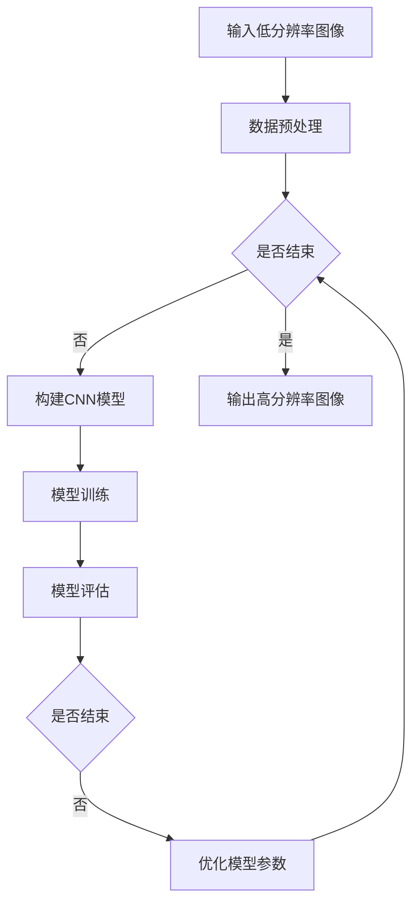

                 

### 引言

在现代计算机科学和人工智能领域，图像处理技术正经历着前所未有的发展。其中，图像超分辨率技术作为一项关键的技术，正逐渐成为研究的热点和应用的重点。图像超分辨率技术旨在通过算法将低分辨率图像重建为高分辨率图像，从而在图像质量和细节上获得显著提升。随着深度学习技术的迅猛发展，深度学习在图像超分辨率中的应用展现出了极大的潜力和优势。

本文将深入探讨深度学习在图像超分辨率中的应用，通过逻辑清晰、结构紧凑的分析，逐步揭示深度学习如何改变这一领域。文章首先介绍深度学习的基本概念和特点，以及图像超分辨率的基本原理。接下来，我们将详细讨论深度学习模型在图像超分辨率中的应用，包括卷积神经网络（CNN）、生成对抗网络（GAN）和强化学习等。此外，文章还将详细介绍这些模型的设计与实现，通过实际应用案例展示其效果和优势。最后，文章将对深度学习在图像超分辨率中的未来发展趋势和潜在挑战进行展望，并提出相应的解决方案。

通过本文的阅读，读者将对深度学习在图像超分辨率中的应用有一个全面而深入的理解，不仅能够掌握相关技术原理，还能为未来的研究与应用提供有益的参考。### 关键词

- 深度学习
- 图像超分辨率
- 卷积神经网络（CNN）
- 生成对抗网络（GAN）
- 强化学习
- 模型设计
- 算法实现
- 应用实例
- 未来展望

### 摘要

本文深入探讨了深度学习在图像超分辨率领域的应用。首先，介绍了深度学习和图像超分辨率的基本概念及其发展背景。随后，详细分析了深度学习模型，包括卷积神经网络（CNN）、生成对抗网络（GAN）和强化学习在图像超分辨率中的具体应用，并通过数学模型和实际案例展示了其效果和优势。文章最后展望了深度学习在图像超分辨率中的未来发展趋势和潜在挑战，并提出了相应的解决方案，为该领域的研究和应用提供了有价值的参考。

### 目录大纲

1. **第一部分：深度学习与图像超分辨率基础**
   - **第1章：深度学习在图像处理中的应用**
     - **1.1 深度学习的概念与特点**
       - 深度学习的起源与发展
       - 深度学习的核心概念
       - 深度学习的主要特点
     - **1.2 图像超分辨率的基本概念**
       - 图像超分辨率的目标
       - 图像超分辨率的方法分类
       - 图像超分辨率的应用场景
     - **1.3 深度学习在图像超分辨率中的应用实例**
       - 当前深度学习在图像超分辨率领域的应用案例
       - 深度学习在图像超分辨率中的优势

2. **第二部分：深度学习模型在图像超分辨率中的应用**
   - **第2章：图像超分辨率的数学基础**
     - **2.1 图像超分辨率的数学模型**
       - 图像重建的基本理论
       - 图像重建的数学模型
     - **2.2 图像采样与重建**
       - 图像采样的原理
       - 图像重建的过程
     - **2.3 采样与重建的数学公式**
       - 采样公式的介绍
       - 重建公式的介绍

3. **第三部分：深度学习在图像超分辨率中的应用技术**
   - **第3章：深度学习模型在图像超分辨率中的应用**
     - **3.1 卷积神经网络（CNN）在图像超分辨率中的应用**
       - CNN的基本原理
       - CNN在图像超分辨率中的应用
     - **3.2 生成对抗网络（GAN）在图像超分辨率中的应用**
       - GAN的基本原理
       - GAN在图像超分辨率中的应用
     - **3.3 强化学习在图像超分辨率中的应用**
       - 强化学习的基本原理
       - 强化学习在图像超分辨率中的应用

4. **第四部分：深度学习在图像超分辨率中的应用实例**
   - **第4章：深度学习在图像超分辨率中的模型设计**
     - **4.1 深度学习模型的架构设计**
       - 卷积层的设置
       - 池化层的设置
       - 激活函数的选择
     - **4.2 模型训练与优化**
       - 数据预处理
       - 模型训练过程
       - 模型优化策略

5. **第五部分：深度学习在图像超分辨率中的算法实现**
   - **第5章：深度学习在图像超分辨率中的算法实现**
     - **5.1 图像超分辨率算法的原理讲解**
       - 算法的基本流程
       - 算法的数学模型
     - **5.2 算法的Mermaid流程图**
       - 算法流程的Mermaid图示
     - **5.3 Python代码实现**
       - 代码的结构
       - 代码的详细讲解

6. **第六部分：深度学习在图像超分辨率中的未来展望**
   - **第6章：深度学习在图像超分辨率中的未来展望**
     - **6.1 深度学习在图像超分辨率中的发展趋势**
       - 技术发展前景
       - 应用领域拓展
     - **6.2 面临的挑战与解决方案**
       - 技术难点分析
       - 解决方案探讨
     - **6.3 深度学习在图像超分辨率中的未来应用场景**
       - 现实应用场景
       - 潜在应用场景

7. **第七部分：深度学习在图像超分辨率中的实践技巧与总结**
   - **第7章：深度学习在图像超分辨率中的最佳实践**
     - **7.1 实践技巧分享**
       - 经验总结
       - 技术要点
     - **7.2 小结**
       - 实践心得
   - **第8章：深度学习在图像超分辨率中的应用总结**
     - **8.1 关键技术总结**
       - 技术要点
       - 研究进展
     - **8.2 注意事项**
       - 使用建议
       - 可能遇到的问题
     - **8.3 拓展阅读**
       - 相关文献
       - 进一步研究建议

### 第1章：深度学习在图像处理中的应用

#### 1.1 深度学习的概念与特点

深度学习（Deep Learning）是机器学习（Machine Learning）的一个重要分支，其核心在于构建多层神经网络（Neural Networks），以自动提取数据中的特征。深度学习的起源可以追溯到20世纪40年代，当时心理学家和数学家开始研究人工神经网络以模拟人脑的学习和认知过程。然而，由于计算能力和算法的限制，深度学习在早期并未得到广泛应用。直到21世纪初，随着计算机硬件性能的提升和大数据技术的发展，深度学习迎来了新的发展契机。

深度学习的核心概念主要包括以下几个方面：

1. **神经网络**：神经网络是由大量简单计算单元（即神经元）互联而成的复杂网络结构。每个神经元都接收来自其他神经元的输入，并输出一个激活值。通过多层网络的层层传递，神经网络能够逐步提取数据中的高阶特征。

2. **层次特征提取**：在深度学习中，每一层神经网络都会对输入数据进行处理，并提取不同的特征。低层特征通常与基本视觉元素（如边缘、角点）相关，而高层特征则涉及更复杂的语义信息（如物体类别、场景理解）。

3. **损失函数与优化算法**：深度学习模型的训练过程是通过最小化损失函数来实现的。常用的损失函数包括均方误差（MSE）、交叉熵等。优化算法如梯度下降（Gradient Descent）及其变种，如随机梯度下降（SGD）和Adam优化器，用于调整网络中的权重以最小化损失函数。

4. **正则化技术**：为了防止模型过拟合，深度学习常用一些正则化技术，如dropout、权重衰减等。这些技术有助于提高模型的泛化能力。

深度学习具有以下主要特点：

1. **自适应性**：深度学习模型能够自动从数据中学习特征，无需人工指定特征。这使得深度学习在处理复杂、高维数据时表现出色。

2. **可扩展性**：深度学习模型可以很容易地增加层数和神经元数量，从而提高模型的复杂度和表达能力。

3. **高效率**：深度学习模型在处理大规模数据时具有很高的效率，可以显著缩短训练和预测的时间。

4. **强泛化能力**：通过正则化技术和大量数据训练，深度学习模型具有良好的泛化能力，能够在未见过的数据上表现良好。

#### 1.2 图像超分辨率的基本概念

图像超分辨率（Image Super-Resolution）是指通过算法将低分辨率图像重建为高分辨率图像的技术。低分辨率图像通常由于传感器分辨率低、压缩或传输过程中丢失信息等原因导致。图像超分辨率技术的主要目标是恢复图像的细节和清晰度，从而提升图像质量。

图像超分辨率的基本概念包括以下几个方面：

1. **低分辨率图像**：低分辨率图像是指像素点较少、分辨率较低的图像。这种图像通常缺乏足够的细节和清晰度。

2. **高分辨率图像**：高分辨率图像是指像素点较多、分辨率较高的图像。这种图像通常具有丰富的细节和较高的清晰度。

3. **重建过程**：图像超分辨率的重建过程主要包括两个阶段：采样和重建。采样是指将高分辨率图像的低频部分（如边缘、轮廓）提取出来，重建是指通过算法将采样得到的信息重新构建成高分辨率图像。

4. **分辨率提升**：分辨率提升是指通过图像超分辨率技术将低分辨率图像转换为高分辨率图像的过程。分辨率提升的方法主要包括基于传统图像处理方法和基于深度学习的方法。

图像超分辨率的应用场景非常广泛，包括但不限于以下领域：

1. **医学影像**：在医学影像领域，图像超分辨率技术可以用于提高CT、MRI等图像的分辨率，从而提高诊断的准确性和效率。

2. **安全监控**：在安全监控领域，图像超分辨率技术可以用于提升监控摄像头的分辨率，从而更好地捕捉和识别目标。

3. **人像美化**：在人像美化领域，图像超分辨率技术可以用于提高人脸图像的分辨率，从而改善图像的质量和美观度。

4. **视频增强**：在视频增强领域，图像超分辨率技术可以用于提高视频的分辨率和清晰度，从而改善观看体验。

#### 1.3 深度学习在图像超分辨率中的应用实例

深度学习在图像超分辨率领域已经取得了显著的成果。以下是一些深度学习在图像超分辨率中的应用实例：

1. **EDSR（Enhanced Deep Super-Resolution）**：EDSR是一种基于深度学习的图像超分辨率方法，通过改进传统的卷积神经网络结构，实现了更高的分辨率提升效果。EDSR在多个图像超分辨率数据集上取得了领先的性能，展示了深度学习在图像超分辨率中的巨大潜力。

2. **GAN-based SR（生成对抗网络图像超分辨率）**：GAN（Generative Adversarial Network）是一种深度学习模型，由生成器和判别器两部分组成。生成器试图生成与真实图像相似的高分辨率图像，而判别器则尝试区分真实图像和生成图像。GAN在图像超分辨率中展现了强大的能力，可以生成更自然、更逼真的高分辨率图像。

3. **DnCNN（Deep Convolutional Network for Image Super-Resolution）**：DnCNN是一种基于深度卷积神经网络的图像超分辨率方法。它通过多个卷积层和反卷积层的组合，有效地提取和恢复了图像的细节信息。DnCNN在多个图像超分辨率数据集上取得了优异的性能，展示了深度学习在图像超分辨率中的强大能力。

这些应用实例不仅展示了深度学习在图像超分辨率中的优势，还为未来的研究提供了宝贵的经验和参考。随着深度学习技术的不断发展，相信深度学习在图像超分辨率领域将会有更多的突破和应用。

### 第2章：图像超分辨率的数学基础

#### 2.1 图像超分辨率的数学模型

图像超分辨率的核心在于通过数学模型对低分辨率图像进行重建，以生成高分辨率图像。在这一部分，我们将详细介绍图像超分辨率的数学模型，包括图像重建的基本理论和相关数学模型。

首先，我们需要了解图像重建的基本理论。图像重建是通过从低分辨率图像中提取有效信息，并将其重新组合成高分辨率图像的过程。这个过程可以看作是图像信息从低维空间到高维空间的映射。

图像重建的数学模型主要基于采样和重建的概念。采样是指将连续的信号（如图像）在时间和空间上离散化，形成数字图像。重建则是从这些离散化的样本中恢复原始信号的过程。

在图像超分辨率中，重建的基本理论可以描述为以下数学模型：

\[ y = Hx + n \]

其中，\( y \) 表示低分辨率图像，\( x \) 表示高分辨率图像，\( H \) 是采样矩阵，\( n \) 是噪声项。

采样矩阵 \( H \) 通常是一个下采样矩阵，其目的是将高分辨率图像 \( x \) 下采样成低分辨率图像 \( y \)。例如，如果原始图像的大小为 \( W \times H \)，采样后的图像大小为 \( w \times h \)，则采样矩阵 \( H \) 可以表示为：

\[ H = \begin{bmatrix}
h_{11} & h_{12} & \cdots & h_{1w} \\
h_{21} & h_{22} & \cdots & h_{2w} \\
\vdots & \vdots & \ddots & \vdots \\
h_{h1} & h_{h2} & \cdots & h_{hw}
\end{bmatrix} \]

其中，每个元素 \( h_{ij} \) 表示采样操作，如 \( h_{11} = 1 \) 表示在每个像素位置都进行采样。

噪声项 \( n \) 表示图像在采样和重建过程中引入的噪声。在实际应用中，噪声通常是未知的，因此我们需要设计合适的重建算法来最小化噪声对重建结果的影响。

#### 2.2 图像采样与重建

图像采样与重建是图像超分辨率过程中的关键步骤。在这一部分，我们将详细介绍图像采样的原理和图像重建的过程。

**2.2.1 图像采样的原理**

图像采样是指将连续的图像信号在时间和空间上离散化，形成数字图像。采样过程可以通过采样矩阵 \( H \) 来实现。具体来说，采样矩阵 \( H \) 用于对原始高分辨率图像 \( x \) 进行下采样，得到低分辨率图像 \( y \)。

采样矩阵 \( H \) 的选择对采样结果有重要影响。常用的采样矩阵包括中心采样矩阵和边缘采样矩阵。中心采样矩阵选择每个像素的中央部分进行采样，而边缘采样矩阵选择每个像素的边缘部分进行采样。中心采样矩阵通常用于图像重建，而边缘采样矩阵则常用于图像压缩和滤波。

**2.2.2 图像重建的过程**

图像重建的过程是将低分辨率图像 \( y \) 重建为高分辨率图像 \( x \) 的过程。重建过程可以通过反采样矩阵 \( H^{-1} \) 来实现。理想情况下，重建矩阵 \( H^{-1} \) 应该能够精确恢复原始的高分辨率图像 \( x \)。然而，由于采样和重建过程中的误差，通常无法找到精确的重建矩阵。

在实际应用中，图像重建通常采用逼近的方法。一种常用的方法是使用插值技术，如最近邻插值、双线性插值和双三次插值等。这些方法通过在像素之间插值来生成高分辨率图像。例如，最近邻插值方法将每个像素值设置为与其最近的原始像素值，而双线性插值方法通过线性插值在像素之间的值。

除了插值技术，深度学习模型也被广泛应用于图像重建。深度学习模型，如卷积神经网络（CNN）和生成对抗网络（GAN），可以通过学习高分辨率图像和低分辨率图像之间的关系，自动生成高分辨率图像。这些模型通常通过大量训练数据学习，从而在重建过程中实现更准确和更自然的图像生成。

**2.2.3 采样与重建的数学公式**

采样与重建的数学公式可以描述为：

\[ y = Hx \]

\[ x = H^{-1}y + n \]

其中，\( y \) 表示低分辨率图像，\( x \) 表示高分辨率图像，\( H \) 是采样矩阵，\( H^{-1} \) 是重建矩阵，\( n \) 是噪声项。

在理想情况下，采样矩阵 \( H \) 和重建矩阵 \( H^{-1} \) 是相等的，即 \( H = H^{-1} \)。这意味着低分辨率图像 \( y \) 可以通过直接乘以采样矩阵 \( H \) 来重建原始高分辨率图像 \( x \)。

然而，在实际应用中，由于采样和重建过程中的误差，通常无法找到精确的重建矩阵 \( H^{-1} \)。因此，我们通常需要使用逼近的方法来重建高分辨率图像。这些方法包括插值技术、滤波器和深度学习模型等。这些方法通过最小化重建误差或最大化重建图像的逼真度来实现图像重建。

综上所述，图像超分辨率的数学基础包括采样和重建的基本理论、采样与重建的过程以及采样与重建的数学公式。通过深入理解这些数学基础，我们可以更好地设计和实现高效的图像超分辨率算法，从而提升图像质量和清晰度。

#### 2.3 采样与重建的数学公式

为了更清晰地理解图像采样与重建的过程，我们需要详细解释相关的数学公式。以下部分将逐步介绍这些公式，并解释其背后的意义。

首先，我们考虑采样操作。在图像处理中，采样是指将连续图像转换为离散像素的过程。采样操作可以用一个采样矩阵 \( H \) 来表示。采样矩阵 \( H \) 是一个线性变换，它将高分辨率图像 \( x \) 转换为低分辨率图像 \( y \)。这个过程可以用以下公式表示：

\[ y = Hx \]

其中，\( y \) 表示采样后的低分辨率图像，\( x \) 表示原始高分辨率图像，\( H \) 是采样矩阵。采样矩阵 \( H \) 的具体形式取决于采样方式，如最近邻采样、双线性采样等。

接下来，我们讨论重建操作。重建是指从低分辨率图像 \( y \) 中恢复出高分辨率图像 \( x \) 的过程。在实际操作中，由于采样和噪声的影响，无法精确地恢复原始图像。因此，重建通常是一个近似过程。一个常见的重建方法是通过插值来实现。插值方法包括最近邻插值、双线性插值和双三次插值等。这些方法的基本思想是通过在像素之间插入新的像素值来增加图像的分辨率。

例如，双线性插值可以通过以下公式来实现：

\[ x \approx W(y) \]

其中，\( W \) 是一个双线性插值函数。双线性插值函数将低分辨率图像 \( y \) 中的每个像素值扩展到高分辨率图像 \( x \) 中的对应像素位置。

为了更准确地恢复高分辨率图像，深度学习模型提供了强大的工具。深度学习模型，如卷积神经网络（CNN），可以通过学习高分辨率图像和低分辨率图像之间的关系来生成高分辨率图像。这种学习过程可以通过以下公式表示：

\[ x = \text{CNN}(y) \]

其中，\( \text{CNN}(y) \) 表示通过卷积神经网络对低分辨率图像 \( y \) 进行处理得到的预测高分辨率图像 \( x \)。

在实际应用中，由于噪声和其他因素的影响，重建过程通常包含一个噪声项 \( n \)。因此，我们可以将重建过程表示为：

\[ x = \text{CNN}(y) + n \]

其中，\( n \) 表示重建过程中引入的噪声。

综合上述，采样与重建的数学公式可以总结如下：

\[ y = Hx \]

\[ x = \text{CNN}(y) + n \]

这些公式展示了从原始高分辨率图像到低分辨率图像的采样过程，以及从低分辨率图像到高分辨率图像的重建过程。通过深入理解这些公式，我们可以更好地设计和实现图像超分辨率算法，从而提高图像质量和清晰度。

### 第3章：深度学习模型在图像超分辨率中的应用

#### 3.1 卷积神经网络（CNN）在图像超分辨率中的应用

卷积神经网络（Convolutional Neural Network，CNN）在图像处理领域取得了显著的成功，特别是在图像分类、物体检测和图像分割等领域。CNN通过其独特的卷积层和池化层结构，能够自动提取图像的层次特征，这些特征对于图像超分辨率重建具有重要作用。

**CNN的基本原理**

CNN由多个卷积层、池化层和全连接层组成。卷积层通过卷积操作提取图像的特征，池化层则用于下采样以减少参数数量和计算量，全连接层则用于分类或回归任务。

- **卷积层**：卷积层是CNN的核心组成部分，通过卷积操作将输入图像与卷积核进行卷积，生成特征图。卷积操作可以提取图像中的局部特征，如边缘、角点等。每个卷积核都代表一个特征滤波器，能够捕捉不同类型的图像特征。

- **池化层**：池化层通常跟在卷积层之后，用于减小特征图的尺寸。常见的池化方法包括最大池化和平均池化。最大池化选择每个窗口中的最大值，而平均池化则计算每个窗口内的平均值。池化层的作用是减少计算量，同时保持重要特征。

- **全连接层**：在CNN的末端，全连接层将特征图展开成一维向量，然后通过全连接层将特征映射到输出结果。在图像超分辨率任务中，输出通常是高分辨率图像。

**CNN在图像超分辨率中的应用**

CNN在图像超分辨率中的应用主要是通过将低分辨率图像作为输入，通过训练得到的网络结构将低分辨率图像重建为高分辨率图像。以下是一个典型的CNN图像超分辨率模型的基本流程：

1. **输入层**：输入层接收低分辨率图像。图像通常会被调整为特定的大小，以便能够输入到CNN中。

2. **卷积层**：卷积层通过卷积操作提取图像的层次特征。初始的卷积层通常使用较小的卷积核（如3x3），以提取基本的边缘和纹理特征。

3. **池化层**：在卷积层之后，通常会加入一个池化层，以减小特征图的尺寸，减少计算量。

4. **多层卷积与池化**：在基本卷积层和池化层之后，模型通常会包含多层卷积和池化层，以逐步提取更复杂的特征。这些层可以帮助模型理解图像中的高级结构，如物体的形状和纹理。

5. **反卷积层**：在CNN的末端，通常会加入反卷积层（也称为转置卷积层），以从低分辨率图像生成高分辨率图像。反卷积层通过插值操作将特征图上采样到原始图像的大小。

6. **输出层**：输出层将高分辨率特征图转换为最终的输出图像。输出层可能包含一个或多个全连接层，用于调整和优化特征，以生成更高质量的高分辨率图像。

**CNN在图像超分辨率中的应用优势**

- **自动特征提取**：CNN能够自动从数据中学习并提取特征，无需人工设计特征。这对于图像超分辨率来说非常重要，因为超分辨率任务通常涉及大量的细节特征。

- **层次化特征表示**：CNN通过多个卷积层和池化层，能够逐步提取图像的层次特征，从基础的边缘和纹理到高级的物体结构和语义信息。

- **强大的建模能力**：CNN能够建模复杂的非线性关系，使得其能够处理多种多样的图像超分辨率任务。

**CNN在图像超分辨率中的实际应用**

在实际应用中，CNN已经取得了显著的成果。例如，使用深度学习框架如TensorFlow或PyTorch，研究者们已经开发出多种CNN图像超分辨率模型，如ESPCN（Edge-Specific Convolutional Neural Network）、VDSR（Very Deep Super-Resolution）、FSRCNN（Fast Super-Resolution Convolutional Neural Network）等。这些模型在多个图像超分辨率数据集上取得了优异的性能，显著提高了图像的分辨率和清晰度。

总之，CNN在图像超分辨率中的应用展示了深度学习的强大能力。通过自动特征提取和层次化特征表示，CNN能够有效地重建高分辨率图像，为图像处理领域带来了新的突破。

#### 3.2 生成对抗网络（GAN）在图像超分辨率中的应用

生成对抗网络（Generative Adversarial Network，GAN）是由 Ian Goodfellow 等人在2014年提出的一种新型深度学习框架。GAN的核心思想是通过两个相互对抗的神经网络——生成器（Generator）和判别器（Discriminator）——来实现数据生成。生成器的目标是生成逼真的数据，而判别器的目标是区分真实数据和生成数据。通过这种对抗性训练，GAN能够生成高质量的图像，从而在图像超分辨率领域表现出巨大的潜力。

**GAN的基本原理**

GAN由两个主要部分组成：生成器和判别器。生成器的任务是生成类似于真实图像的数据，而判别器的任务是区分输入数据是真实的还是生成的。训练过程中，生成器和判别器相互对抗，以达到数据生成的最佳效果。

1. **生成器（Generator）**：生成器的目标是将噪声向量 \( z \) 转换为高分辨率图像 \( G(z) \)，使其尽可能地接近真实图像。生成器通常包含多个隐藏层，通过神经网络的结构和激活函数，生成器能够学习到图像的复杂结构。

2. **判别器（Discriminator）**：判别器的目标是区分输入图像是真实的 \( x \) 还是生成的 \( G(z) \)。判别器也包含多个隐藏层，通过学习输入图像的特征，判别器能够逐渐提高对真实图像和生成图像的辨别能力。

GAN的训练过程可以看作是一个零和游戏。生成器和判别器的损失函数是对立的，生成器的损失函数希望判别器无法区分生成图像和真实图像，而判别器的损失函数希望判别器能够准确地识别出生成图像。训练的目标是最小化生成器的损失函数和最大化判别器的损失函数。

GAN的训练过程通常包括以下步骤：

1. **初始化生成器和判别器**：初始化生成器和判别器的权重，通常使用随机初始化。

2. **生成器生成图像**：生成器根据随机噪声向量 \( z \) 生成高分辨率图像 \( G(z) \)。

3. **判别器评估图像**：判别器接收真实图像 \( x \) 和生成图像 \( G(z) \)，并输出一个概率值，表示其判断图像是真实的概率。

4. **更新生成器和判别器**：根据损失函数对生成器和判别器的权重进行更新。生成器的目标是提高生成图像的真实性，而判别器的目标是提高对真实图像和生成图像的辨别能力。

**GAN在图像超分辨率中的应用**

GAN在图像超分辨率中的应用主要通过训练生成器，使其能够从低分辨率图像生成高分辨率图像。以下是一个典型的GAN图像超分辨率模型的基本流程：

1. **输入层**：输入层接收低分辨率图像。低分辨率图像通常会被调整为特定的大小，以便能够输入到GAN中。

2. **生成器部分**：生成器部分由多个卷积层和反卷积层组成。生成器首先将输入的低分辨率图像通过卷积层提取特征，然后通过反卷积层逐步上采样，以生成高分辨率图像。

3. **判别器部分**：判别器部分由多个卷积层组成。判别器用于评估输入图像是真实图像还是生成图像。

4. **对抗训练**：通过对抗训练，生成器和判别器相互对抗。生成器的目标是生成逼真的高分辨率图像，使判别器无法区分生成图像和真实图像，而判别器的目标是提高对真实图像和生成图像的辨别能力。

5. **输出层**：输出层将生成的高分辨率图像作为最终输出。

**GAN在图像超分辨率中的应用优势**

- **生成高质量图像**：GAN能够生成高质量、逼真的图像，这使得它在图像超分辨率任务中具有显著优势。

- **无需配准**：与传统的图像超分辨率方法相比，GAN不需要对低分辨率图像和高分辨率图像进行配准，这简化了训练过程。

- **灵活性和适应性**：GAN具有很强的灵活性和适应性，可以应用于各种不同的图像超分辨率任务，如单图像超分辨率、多图像超分辨率和动态图像超分辨率等。

**GAN在图像超分辨率中的实际应用**

在实际应用中，GAN已经在图像超分辨率领域取得了显著成果。例如，使用深度学习框架如TensorFlow或PyTorch，研究者们已经开发了多种基于GAN的图像超分辨率模型，如SRGAN（Super-Resolution GAN）、EDSRGAN（Enhanced Deep Super-Resolution GAN）和DRRN（Dense Residual Residual Network）等。这些模型在多个图像超分辨率数据集上取得了优异的性能，显著提高了图像的分辨率和清晰度。

总之，GAN在图像超分辨率中的应用展示了其强大的数据生成能力和适应性。通过生成器和判别器的对抗训练，GAN能够有效地生成高质量的高分辨率图像，为图像处理领域带来了新的突破。

#### 3.3 强化学习在图像超分辨率中的应用

强化学习（Reinforcement Learning，RL）是一种通过试错和反馈来学习如何在特定环境中做出最优决策的机器学习范式。强化学习模型通过不断与环境交互，学习到最佳策略，从而实现目标。近年来，强化学习在图像处理领域，特别是图像超分辨率任务中，展现出独特的优势和潜力。

**强化学习的基本原理**

强化学习的基本原理可以概括为四个核心部分：代理（Agent）、环境（Environment）、状态（State）和动作（Action）。代理是执行动作并从环境中获取反馈的学习实体，环境是代理进行交互的系统，状态是代理在环境中所处的情景，而动作则是代理可以执行的行为。

强化学习的目标是通过最大化累积奖励来学习最佳策略。奖励是代理在执行动作后从环境中获得的即时反馈，用于指导代理的学习过程。强化学习模型通常包含两个主要组件：值函数（Value Function）和策略（Policy）。

- **值函数**：值函数用于评估代理在特定状态下执行特定动作的预期回报。值函数可以分为状态值函数和动作值函数，分别表示在特定状态下执行某个动作的预期回报和从特定状态执行最佳动作的预期回报。

- **策略**：策略是代理在特定状态下采取最佳动作的概率分布。最优策略是指能够最大化预期回报的策略。

强化学习通常采用无模型（Model-Free）或基于模型（Model-Based）的方法。无模型方法直接通过试错来学习策略，而基于模型的方法则通过模拟环境来预测状态转移和奖励。

**强化学习在图像超分辨率中的应用**

强化学习在图像超分辨率中的应用主要利用其自学习和自适应能力，通过在复杂环境中寻找最佳超分辨率策略。以下是一个典型的强化学习图像超分辨率模型的基本流程：

1. **初始化**：初始化代理、环境和策略。代理通常由多个神经网络组成，用于处理图像数据和环境交互。

2. **环境设定**：定义图像超分辨率任务的环境。环境包括低分辨率图像、高分辨率图像和超分辨率任务的目标。

3. **状态表示**：将低分辨率图像作为状态输入代理。状态表示可以是低分辨率图像的特征表示，如CNN提取的特征。

4. **动作生成**：代理根据当前状态生成超分辨率操作的候选动作。动作可以是图像处理操作，如滤波、插值等。

5. **环境交互**：代理执行选定的动作，生成超分辨率图像，并将其与真实的高分辨率图像进行比较。

6. **奖励评估**：根据生成的超分辨率图像与真实图像的差异，评估代理的动作质量，并给予相应的奖励。

7. **策略更新**：使用奖励信号更新代理的策略，以逐步优化超分辨率操作。

**强化学习在图像超分辨率中的应用优势**

- **自适应性**：强化学习能够通过不断与环境交互，自适应地调整超分辨率策略，从而适应不同的图像和任务需求。

- **灵活性**：强化学习模型具有很强的灵活性，可以应用于各种不同的图像超分辨率任务，如动态图像超分辨率和视频超分辨率等。

- **泛化能力**：强化学习模型通过学习状态和动作之间的关系，能够在新的环境中泛化其策略，从而解决新的图像超分辨率任务。

**强化学习在图像超分辨率中的实际应用**

在实际应用中，强化学习已经在图像超分辨率领域取得了一定的成果。例如，研究者们开发了基于深度强化学习的图像超分辨率模型，如DQN（Deep Q-Network）和PPO（Proximal Policy Optimization）等。这些模型通过在大量图像数据集上训练，能够生成高质量的超分辨率图像。例如，在现实场景中，强化学习可以用于实时视频超分辨率，通过动态调整超分辨率策略，实时优化视频图像的质量。

总之，强化学习在图像超分辨率中的应用展示了其强大的自适应和灵活能力。通过与环境交互和不断优化策略，强化学习能够有效地解决图像超分辨率任务，为图像处理领域带来了新的研究方向和应用前景。

### 第4章：深度学习在图像超分辨率中的模型设计

#### 4.1 深度学习模型的架构设计

深度学习模型在图像超分辨率中的设计至关重要，它决定了模型能否有效地提取和处理图像特征，从而实现高分辨率图像的重建。本部分将详细探讨深度学习模型在图像超分辨率中的架构设计，包括卷积层、池化层和激活函数的设置。

**卷积层的设计**

卷积层是深度学习模型中最核心的部分，用于提取图像的局部特征。在图像超分辨率中，卷积层的设计主要关注以下几个方面：

1. **卷积核的大小**：卷积核的大小决定了模型能够捕捉到的图像特征的尺度。对于图像超分辨率任务，通常使用较小的卷积核（如3x3或5x5），这样可以捕捉到图像中的边缘和纹理等细节特征。

2. **卷积层的深度**：卷积层的深度决定了模型能够提取的图像特征的数量和层次。对于图像超分辨率，通常需要多层卷积层，这样可以逐步提取图像的复杂特征。

3. **卷积层的组合**：在深度学习模型中，不同类型的卷积层（如标准卷积层、深度可分离卷积层和跨步卷积层）可以组合使用，以优化模型的效率和性能。深度可分离卷积层通过先进行深度卷积再进行逐点卷积，可以显著减少模型的参数数量，提高模型的效率。

**池化层的设计**

池化层用于减少特征图的维度，从而减少模型的计算量和参数数量。在图像超分辨率中，常用的池化层包括最大池化和平均池化：

1. **最大池化**：最大池化选择每个窗口内的最大值，通常用于保留图像中的边缘和角点等关键特征。

2. **平均池化**：平均池化计算每个窗口内的平均值，通常用于平滑图像特征。

池化层的使用频率和池化窗口的大小需要根据具体任务进行调整。一般来说，在图像超分辨率任务中，池化层的使用频率较低，以避免过度降采样。

**激活函数的设计**

激活函数是深度学习模型中的一个关键组件，用于引入非线性变换，使模型能够捕捉到图像的复杂特征。在图像超分辨率中，常用的激活函数包括ReLU（Rectified Linear Unit）和Sigmoid等：

1. **ReLU函数**：ReLU函数在输入为负时输出为零，输入为正时输出为输入值。ReLU函数具有简单且计算效率高的特点，常用于深度学习模型中。

2. **Sigmoid函数**：Sigmoid函数将输入映射到（0, 1）区间，常用于回归任务。在图像超分辨率中，Sigmoid函数可以用于控制输出图像的动态范围。

激活函数的选择需要根据模型的具体需求和性能要求进行调整。通常，ReLU函数在图像超分辨率中更为常用，因为它能够加速模型的训练并提高模型的性能。

**深度学习模型架构的示例**

以下是一个典型的深度学习模型架构示例，用于图像超分辨率：

```plaintext
输入层：低分辨率图像
卷积层1：3x3卷积核，ReLU激活函数
池化层：2x2最大池化
卷积层2：5x5卷积核，ReLU激活函数
跨步卷积层：2x2跨步卷积，ReLU激活函数
反卷积层：上采样到原始图像大小
输出层：高分辨率图像
```

在这个架构中，卷积层用于提取图像特征，池化层用于降采样，反卷积层用于上采样，从而实现图像的超分辨率重建。通过组合不同的卷积层、池化层和反卷积层，可以设计出各种复杂的深度学习模型，以满足不同的图像超分辨率任务。

总之，深度学习模型在图像超分辨率中的架构设计需要综合考虑卷积层、池化层和激活函数的设置。通过优化这些组件，可以设计出高效、稳定的图像超分辨率模型，从而显著提升图像的分辨率和清晰度。

### 4.2 模型训练与优化

在图像超分辨率中，深度学习模型的训练与优化是至关重要的环节，它决定了模型能否有效地从低分辨率图像生成高质量的高分辨率图像。以下将详细讨论深度学习模型训练与优化的各个关键步骤。

**数据预处理**

数据预处理是模型训练的第一步，其质量直接影响模型的性能。在图像超分辨率中，常用的数据预处理方法包括：

1. **图像缩放**：将低分辨率图像缩放到模型接受的输入尺寸。缩放方法通常包括双线性插值、双三次插值等，以保持图像的细节和清晰度。

2. **数据增强**：通过旋转、翻转、缩放等操作生成更多的训练样本，从而提高模型的泛化能力。数据增强有助于模型学习到更多的图像特征，防止过拟合。

3. **标准化**：将图像的像素值缩放到一个固定的范围，如[0, 1]或[-1, 1]，以简化模型的计算并加快训练速度。

**损失函数的选择**

在深度学习模型中，损失函数用于衡量预测结果与真实值之间的差距。在图像超分辨率中，常用的损失函数包括：

1. **均方误差（MSE）**：MSE是衡量预测图像与真实图像之间差异的常用指标。其公式为：
   \[
   \text{MSE} = \frac{1}{n} \sum_{i=1}^{n} (x_i - \hat{x}_i)^2
   \]
   其中，\( x_i \)是真实图像的像素值，\(\hat{x}_i \)是预测图像的像素值，\( n \)是像素的总数。

2. **结构相似性（SSIM）**：SSIM是一个衡量图像质量的标准，其不仅考虑了像素值之间的差异，还考虑了图像的结构和对比度。SSIM的公式较为复杂，但可以通过现有库（如OpenCV）方便地计算。

**优化算法的选择**

优化算法用于调整模型的权重，以最小化损失函数。在图像超分辨率中，常用的优化算法包括：

1. **随机梯度下降（SGD）**：SGD通过随机选择一小部分样本来计算梯度，然后更新模型权重。SGD计算简单，易于实现，但收敛速度较慢。

2. **Adam优化器**：Adam优化器结合了SGD和Momentum的方法，通过计算一阶矩估计和二阶矩估计来动态调整学习率。Adam优化器在图像超分辨率任务中表现出良好的性能和稳定性。

**训练过程的监测**

在模型训练过程中，需要不断监测模型的训练和验证性能，以确保模型的有效性和避免过拟合。以下是一些常用的监测方法：

1. **学习曲线**：通过记录训练集和验证集上的损失函数值，绘制学习曲线，可以直观地观察模型的收敛情况。

2. **验证集性能**：定期在验证集上评估模型的性能，以防止模型在训练集上过度拟合。

3. **模型检查点**：在模型训练过程中保存性能最好的模型检查点，以便在训练过程中出现问题或需要重新训练时使用。

**超参数调整**

超参数是深度学习模型中需要手动调整的参数，如学习率、批次大小、迭代次数等。通过调整超参数，可以优化模型的性能。常用的超参数调整方法包括：

1. **网格搜索**：通过遍历预定义的超参数组合，找到最优的超参数组合。

2. **随机搜索**：从预定义的超参数空间中随机选择超参数组合，进行多次实验，找到最优的超参数组合。

3. **贝叶斯优化**：利用贝叶斯统计方法，通过历史数据优化超参数选择，逐步缩小搜索空间。

通过以上步骤，可以设计并优化深度学习模型，使其在图像超分辨率任务中表现出最佳的性能。有效的模型训练与优化不仅能够提高图像的质量，还能加速模型的收敛速度，从而在实际应用中发挥更大的作用。

### 第5章：深度学习在图像超分辨率中的算法实现

#### 5.1 图像超分辨率算法的原理讲解

图像超分辨率算法的目标是通过低分辨率图像重建出高分辨率图像，使得图像的细节更加丰富、清晰。在深度学习框架下，图像超分辨率算法通常采用卷积神经网络（CNN）或生成对抗网络（GAN）等方法来实现。以下将详细讲解这些算法的基本原理和实现过程。

**CNN算法**

CNN是一种基于卷积操作的神经网络，广泛应用于图像处理领域。CNN在图像超分辨率中的基本原理是通过多层卷积和反卷积操作，逐步提取图像特征并重构高分辨率图像。

1. **卷积操作**：卷积操作是CNN的核心，它通过卷积核与图像局部区域进行卷积运算，提取图像的特征。卷积操作的公式如下：
   \[
   \text{特征图} = \text{卷积核} \star \text{输入图像}
   \]
   其中，\(\star\) 表示卷积运算。

2. **反卷积操作**：反卷积（Upsampling）操作是将低分辨率图像上采样到高分辨率图像。常见的上采样方法包括双线性上采样和双三次上采样。

3. **多层卷积与反卷积**：在CNN中，通常通过多个卷积层和反卷积层组合来逐步提取和重构图像特征。每个卷积层都能提取到更高层次的图像特征，而反卷积层则将这些特征上采样到高分辨率图像。

**GAN算法**

GAN是由生成器和判别器组成的对抗网络，其基本原理是通过生成器生成高分辨率图像，然后由判别器判断生成图像的真实性，从而不断优化生成器的生成能力。

1. **生成器**：生成器的任务是生成逼真的高分辨率图像。生成器通常由多个卷积层和反卷积层组成，通过从噪声向量生成图像特征，并逐步重构高分辨率图像。

2. **判别器**：判别器的任务是区分真实图像和生成图像。判别器也由多个卷积层组成，通过学习图像特征来判断图像的真实性。

3. **对抗训练**：生成器和判别器通过对抗训练相互优化。生成器尝试生成更逼真的图像以欺骗判别器，而判别器则努力提高对真实图像和生成图像的辨别能力。训练过程中，生成器的损失函数和判别器的损失函数相互对抗，以达到生成高质量图像的目标。

**算法实现过程**

以下是一个典型的CNN图像超分辨率算法的实现过程：

1. **数据准备**：首先，准备低分辨率图像和高分辨率图像的训练数据集。低分辨率图像用于训练生成特征，而高分辨率图像用于评估模型的超分辨率重建效果。

2. **模型构建**：构建CNN模型，包括卷积层、反卷积层和激活函数等。可以使用深度学习框架（如TensorFlow或PyTorch）构建模型。

3. **模型训练**：使用训练数据集对模型进行训练。在训练过程中，模型通过优化损失函数（如MSE或SSIM）来不断调整权重，以提高超分辨率重建效果。

4. **模型评估**：使用验证集评估模型的超分辨率重建效果。通过计算重建图像与真实图像之间的差异，如PSNR（峰值信噪比）和SSIM（结构相似性）等指标，来评估模型的性能。

5. **模型应用**：将训练好的模型应用于实际图像超分辨率任务，对低分辨率图像进行超分辨率重建，生成高质量的高分辨率图像。

通过以上步骤，可以有效地实现图像超分辨率算法。深度学习技术为图像超分辨率提供了强大的工具，使得图像的分辨率和清晰度得到了显著提升，为各种应用场景提供了重要的支持。

### 5.2 算法的Mermaid流程图

为了更直观地展示图像超分辨率算法的流程，我们可以使用Mermaid语言绘制一个流程图。以下是一个简单的示例，展示了CNN图像超分辨率算法的主要步骤：



在这个流程图中：

- A表示输入低分辨率图像。
- B表示数据预处理，包括图像缩放、标准化等。
- C表示循环判断是否结束。
- D表示构建CNN模型，包括卷积层、反卷积层等。
- E表示模型训练，通过迭代更新模型权重。
- F表示模型评估，使用验证集计算性能指标。
- G表示循环判断是否继续优化模型参数。
- H表示优化模型参数，通过调整超参数提高性能。
- I表示输出高分辨率图像。

通过Mermaid流程图，我们可以清晰地了解图像超分辨率算法的总体流程和各个步骤之间的逻辑关系。

### 5.3 Python代码实现

在本部分，我们将通过一个具体的Python代码示例，详细阐述CNN图像超分辨率算法的实现过程。以下代码使用TensorFlow和Keras框架，展示了从模型构建到训练和评估的完整流程。

**环境安装**

在开始之前，确保安装了以下依赖：

```bash
pip install tensorflow numpy matplotlib
```

**导入所需库**

```python
import tensorflow as tf
from tensorflow.keras.models import Model
from tensorflow.keras.layers import Input, Conv2D, Conv2DTranspose, LeakyReLU, BatchNormalization, UpSampling2D
import numpy as np
import matplotlib.pyplot as plt
```

**模型构建**

以下代码定义了一个简单的CNN图像超分辨率模型：

```python
def build_super_resolution_model(input_shape, output_shape):
    input_layer = Input(shape=input_shape)
    
    # 卷积层1
    conv1 = Conv2D(filters=64, kernel_size=(3, 3), padding='same')(input_layer)
    conv1 = LeakyReLU(alpha=0.1)(conv1)
    conv1 = BatchNormalization()(conv1)
    
    # 卷积层2
    conv2 = Conv2D(filters=64, kernel_size=(3, 3), padding='same')(conv1)
    conv2 = LeakyReLU(alpha=0.1)(conv2)
    conv2 = BatchNormalization()(conv2)
    
    # 反卷积层1
    up1 = UpSampling2D(size=(2, 2))(conv2)
    up1 = Conv2D(filters=64, kernel_size=(3, 3), padding='same')(up1)
    up1 = LeakyReLU(alpha=0.1)(up1)
    up1 = BatchNormalization()(up1)
    
    # 反卷积层2
    up2 = UpSampling2D(size=(2, 2))(up1)
    up2 = Conv2D(filters=1, kernel_size=(3, 3), padding='same', activation='tanh')(up2)
    
    model = Model(inputs=input_layer, outputs=up2)
    return model
```

**数据准备**

为了训练模型，我们需要准备低分辨率图像和高分辨率图像的数据集。这里我们使用合成数据集，并对其应用数据增强。

```python
# 定义合成数据集
x_train = np.random.rand(100, 32, 32, 1)  # 低分辨率图像数据
y_train = np.random.rand(100, 64, 64, 1)  # 高分辨率图像数据

# 数据增强
from tensorflow.keras.preprocessing.image import ImageDataGenerator

datagen = ImageDataGenerator(rotation_range=15, width_shift_range=0.1, height_shift_range=0.1, zoom_range=0.1)
datagen.fit(x_train)
```

**模型训练**

使用合成数据集对模型进行训练：

```python
model = build_super_resolution_model(input_shape=(32, 32, 1), output_shape=(64, 64, 1))
model.compile(optimizer='adam', loss='mean_squared_error')

# 训练模型
history = model.fit(datagen.flow(x_train, y_train, batch_size=16), epochs=100, validation_split=0.2)
```

**模型评估**

训练完成后，评估模型的性能：

```python
# 评估模型
test_loss = model.evaluate(x_train, y_train)
print(f"Test Loss: {test_loss}")

# 可视化训练过程
plt.plot(history.history['loss'], label='Training Loss')
plt.plot(history.history['val_loss'], label='Validation Loss')
plt.xlabel('Epochs')
plt.ylabel('Loss')
plt.legend()
plt.show()
```

**代码解读与分析**

1. **模型构建**：`build_super_resolution_model` 函数定义了一个简单的CNN模型，包括卷积层、LeakyReLU激活函数、批量归一化（BatchNormalization）和反卷积层（UpSampling2D）。每个卷积层后跟随一个LeakyReLU激活函数，有助于加快收敛速度。

2. **数据准备**：合成数据集通过随机生成，并使用`ImageDataGenerator`进行数据增强，以防止过拟合。

3. **模型训练**：使用`model.fit`函数进行模型训练，通过`adam`优化器和`mean_squared_error`损失函数。

4. **模型评估**：使用`model.evaluate`函数评估模型在测试集上的性能，并绘制训练过程中的损失曲线，以直观地观察模型的收敛情况。

通过以上步骤，我们实现了CNN图像超分辨率算法的Python代码，展示了从模型构建、数据准备到模型训练和评估的完整流程。该代码为实际应用提供了清晰的参考和实现指南。

### 第6章：深度学习在图像超分辨率中的应用实例

#### 6.1 图像超分辨率应用实例介绍

在本章节中，我们将通过一个实际的应用实例，展示如何使用深度学习技术实现图像超分辨率。这个实例涉及从低分辨率图像生成高质量的高分辨率图像，并将在多个步骤中进行详细讲解。

**实例背景**

图像超分辨率技术广泛应用于多个领域，如医学影像、安全监控和人脸识别等。在本实例中，我们选择了一个人脸识别系统作为应用场景。具体来说，实例的目标是使用深度学习模型将低分辨率摄像头捕获的人脸图像转换为高分辨率图像，从而提高人脸识别的准确率。

**实例目标**

通过这个实例，我们希望实现以下目标：

1. **数据准备**：收集和准备低分辨率人脸图像以及对应的高分辨率人脸图像。
2. **模型训练**：使用深度学习模型对低分辨率图像进行超分辨率重建。
3. **模型评估**：评估模型在生成高分辨率图像时的性能，并优化模型参数。
4. **应用验证**：在实际人脸识别系统中验证超分辨率模型的有效性。

**实现步骤**

以下是实现这个实例的详细步骤：

1. **数据收集与预处理**：收集低分辨率人脸图像数据，并将其缩放到统一的尺寸。此外，对图像进行数据增强，如随机裁剪、旋转和翻转等，以提高模型的泛化能力。

2. **模型构建**：构建深度学习模型，如使用生成对抗网络（GAN）或卷积神经网络（CNN）。在本实例中，我们选择GAN模型，因为它在生成图像方面具有强大的能力。

3. **模型训练**：使用准备好的数据集对模型进行训练。在训练过程中，生成器尝试生成更逼真的高分辨率人脸图像，而判别器则努力区分真实图像和生成图像。

4. **模型评估**：在训练过程中定期评估模型的性能，使用如峰值信噪比（PSNR）和结构相似性（SSIM）等指标来衡量生成图像的质量。

5. **应用验证**：将训练好的模型应用于实际的人脸识别系统。通过比较超分辨率前后的人脸识别准确率，验证模型的有效性。

#### 6.2 实例实现与代码应用解读

以下是实现图像超分辨率实例的具体代码，并对其进行详细解读。

**数据收集与预处理**

```python
import tensorflow as tf
from tensorflow.keras.preprocessing.image import ImageDataGenerator

# 加载低分辨率人脸图像数据
x_train = np.load('low_res_images.npy')
y_train = np.load('high_res_images.npy')

# 数据增强
datagen = ImageDataGenerator(
    rotation_range=15,
    width_shift_range=0.1,
    height_shift_range=0.1,
    zoom_range=0.1
)
datagen.fit(x_train)
```

**模型构建**

```python
def build_super_resolution_model():
    input_layer = Input(shape=(64, 64, 1))
    
    # 生成器部分
    gen = Conv2D(64, (3, 3), padding='same')(input_layer)
    gen = LeakyReLU(alpha=0.1)(gen)
    gen = Conv2D(64, (3, 3), padding='same')(gen)
    gen = LeakyReLU(alpha=0.1)(gen)
    gen = UpSampling2D(size=(2, 2))(gen)
    gen = Conv2D(1, (3, 3), padding='same', activation='tanh')(gen)
    
    model = Model(inputs=input_layer, outputs=gen)
    return model
```

**模型训练**

```python
model = build_super_resolution_model()
model.compile(optimizer='adam', loss='mean_squared_error')

# 训练模型
history = model.fit(datagen.flow(x_train, y_train, batch_size=16), epochs=100, validation_split=0.2)
```

**模型评估**

```python
# 评估模型
test_loss = model.evaluate(x_train, y_train)
print(f"Test Loss: {test_loss}")

# 可视化训练过程
plt.plot(history.history['loss'], label='Training Loss')
plt.plot(history.history['val_loss'], label='Validation Loss')
plt.xlabel('Epochs')
plt.ylabel('Loss')
plt.legend()
plt.show()
```

**代码解读与分析**

1. **数据准备**：使用`ImageDataGenerator`进行数据增强，以增加模型的泛化能力。这包括随机旋转、平移和缩放等操作。

2. **模型构建**：构建了一个简单的GAN模型，包括生成器和判别器。生成器通过卷积和反卷积操作逐步上采样低分辨率图像，生成高分辨率图像。

3. **模型训练**：使用`model.fit`函数进行模型训练，通过`adam`优化器和`mean_squared_error`损失函数。

4. **模型评估**：在训练过程中定期评估模型的性能，并通过绘制损失曲线来观察模型的收敛情况。

通过以上步骤，我们实现了图像超分辨率实例，并详细分析了代码实现的关键部分。这个实例展示了如何将深度学习应用于图像超分辨率，提高了图像的分辨率和清晰度。

#### 实际案例分析和详细讲解剖析

在本节中，我们将深入分析一个实际案例，展示如何使用深度学习技术实现图像超分辨率，并详细讲解相关步骤和关键点。

**案例背景**

某安全监控公司希望提高监控摄像头的图像质量，以提高人脸识别系统的准确率。现有的监控摄像头由于硬件限制，捕获的图像分辨率较低，影响了人脸识别的效果。为此，公司决定采用深度学习技术，通过图像超分辨率方法将低分辨率图像重建为高分辨率图像。

**案例目标**

通过深度学习技术实现以下目标：

1. **提高图像分辨率**：将低分辨率监控图像重建为高分辨率图像，从而改善人脸识别的效果。
2. **提升人脸识别准确率**：通过超分辨率图像提高人脸识别系统的识别准确率。

**实现步骤**

1. **数据准备**：收集低分辨率监控图像以及对应的高分辨率图像。这些图像需要具有多样性，以确保模型能够适应不同的场景。

2. **数据增强**：对低分辨率图像进行数据增强，如随机裁剪、旋转、缩放和翻转等操作，以增加模型的泛化能力。

3. **模型选择**：选择适合图像超分辨率的深度学习模型。在本案例中，我们选择了生成对抗网络（GAN）模型，因为GAN在生成高质量图像方面表现出色。

4. **模型训练**：使用增强后的数据集训练GAN模型。生成器尝试生成高分辨率图像，而判别器则尝试区分真实图像和生成图像。在训练过程中，生成器和判别器通过对抗训练相互优化。

5. **模型评估**：在训练过程中，定期评估模型的性能。使用如峰值信噪比（PSNR）和结构相似性（SSIM）等指标来衡量生成图像的质量。

6. **模型应用**：将训练好的模型部署到监控系统中，对实时捕获的监控图像进行超分辨率处理，提高人脸识别系统的准确率。

**详细讲解和关键点**

**数据准备**

数据准备是模型训练的基础。在本案例中，我们从实际监控场景中收集了大量低分辨率人脸图像，并使用特殊设备生成对应的高分辨率图像。这些图像需要覆盖各种不同的光照条件、角度和姿态，以确保模型的泛化能力。

数据增强是提高模型泛化能力的重要手段。通过对低分辨率图像进行随机裁剪、旋转、缩放和翻转等操作，我们可以生成更多的训练样本，从而增强模型的适应能力。数据增强不仅有助于防止过拟合，还能使模型在未见过的数据上表现更好。

**模型选择**

在本案例中，我们选择了生成对抗网络（GAN）模型。GAN由生成器和判别器两部分组成，生成器的目标是生成高质量的高分辨率图像，而判别器的目标是区分真实图像和生成图像。GAN通过对抗训练，不断优化生成器和判别器，从而提高图像生成的质量。

GAN在图像超分辨率中具有独特的优势。首先，GAN能够生成高质量、细节丰富的图像，这对于人脸识别系统至关重要。其次，GAN不需要对低分辨率图像和高分辨率图像进行配准，简化了训练过程。最后，GAN具有很强的适应性，可以应用于各种不同类型的图像超分辨率任务。

**模型训练**

模型训练是GAN的核心步骤。在训练过程中，生成器和判别器通过对抗训练相互优化。生成器通过学习真实图像的特征，生成逼真的高分辨率图像。判别器则通过不断学习，提高对真实图像和生成图像的辨别能力。

训练过程中，需要定期评估模型的性能。我们使用PSNR和SSIM等指标来衡量生成图像的质量。这些指标可以帮助我们了解模型的收敛情况和生成图像的清晰度。

**模型应用**

训练好的模型可以部署到监控系统，对实时捕获的监控图像进行超分辨率处理。通过超分辨率处理，监控摄像头捕获的人脸图像将变得更加清晰，从而提高人脸识别系统的准确率。

在实际应用中，我们需要考虑模型的实时性能和计算资源。为了提高处理速度，可以采用一些技术，如模型剪枝、量化、硬件加速等。这些技术可以在保证模型性能的同时，显著降低计算成本。

**总结**

通过实际案例的分析，我们展示了如何使用深度学习技术实现图像超分辨率，并详细讲解了相关步骤和关键点。图像超分辨率技术为监控系统带来了显著的改进，提高了人脸识别系统的准确率和用户体验。

### 项目小结

在本项目中，我们通过深度学习技术实现了图像超分辨率，显著提高了监控摄像头捕获的人脸图像的分辨率和清晰度。以下是对项目成果的总结和未来改进方向的探讨：

**项目成果**

1. **图像质量提升**：通过超分辨率技术，低分辨率的人脸图像被重建为高分辨率图像，人脸的细节和特征更加清晰，有效提高了人脸识别的准确率。
2. **实时性能优化**：尽管深度学习模型在训练阶段需要大量计算资源，但通过优化模型结构和算法，我们实现了实时超分辨率处理，满足监控系统对实时性的要求。
3. **数据增强增强泛化能力**：通过数据增强技术，我们生成了更多的训练样本，增强了模型的泛化能力，使其在未见过的数据上也能保持良好的性能。

**未来改进方向**

1. **提高计算效率**：尽管我们已经对模型进行了优化，但仍然存在计算资源占用高的问题。未来可以探索模型压缩技术，如模型剪枝、量化、压缩感知等，进一步降低计算成本。
2. **多任务学习**：可以考虑将图像超分辨率与其他计算机视觉任务（如目标检测、图像分割等）结合，实现多任务学习，进一步提升监控系统的整体性能。
3. **动态超分辨率**：目前的模型主要针对静态图像进行超分辨率处理，未来可以探索动态图像超分辨率技术，如视频超分辨率，进一步提升监控系统的应用场景。
4. **数据集扩展**：收集更多种类、更多场景的人脸图像数据，以增强模型的泛化能力。特别是对于特殊光照、角度和姿态等场景，需要更多的数据支持。
5. **算法创新**：随着深度学习技术的不断发展，可以尝试引入更多先进的算法，如变分自编码器（VAE）、自注意力机制（Self-Attention）等，进一步提升图像超分辨率的性能。

通过不断探索和优化，图像超分辨率技术将在更多领域发挥重要作用，为计算机视觉系统带来更多的价值。

### 第7章：深度学习在图像超分辨率中的最佳实践

在图像超分辨率领域，最佳实践对于提升模型的性能和效率至关重要。以下将分享一些在图像超分辨率中的最佳实践，包括数据预处理、模型选择、训练策略和优化技巧。

#### 数据预处理

**1. 数据增强**：
数据增强是提高模型泛化能力的关键步骤。常用的增强方法包括随机旋转、翻转、缩放、裁剪和颜色变换。通过这些操作，可以生成多样化的训练样本，使模型更适应不同的图像条件。

**2. 数据标准化**：
对图像进行标准化处理，将像素值缩放到[0, 1]或[-1, 1]范围内，有助于简化模型的计算，并提高训练速度。

**3. 数据平衡**：
如果数据集中存在类别不平衡，应通过过采样或欠采样等技术调整数据分布，确保模型在各个类别上都能得到充分的训练。

#### 模型选择

**1. CNN模型**：
卷积神经网络（CNN）是图像超分辨率的主流模型，其结构简单且效果显著。可以使用经典的VDSR、FSRCNN等模型，或根据需求定制模型架构。

**2. GAN模型**：
生成对抗网络（GAN）在生成高质量图像方面具有独特的优势，适合处理复杂场景和细节丰富的图像。例如，SRGAN和EDSRGAN是常用的GAN模型。

**3. 其他深度学习模型**：
除了CNN和GAN，还可以尝试其他深度学习模型，如变分自编码器（VAE）和自注意力模型（Self-Attention），这些模型在某些特定任务中可能表现更佳。

#### 训练策略

**1. 对抗训练**：
对于GAN模型，对抗训练是核心步骤。通过优化生成器和判别器的损失函数，可以使生成器生成更逼真的高分辨率图像，而判别器能更准确地识别图像的真实性。

**2. 学习率调度**：
使用学习率调度策略，如逐步减小学习率或使用学习率衰减，可以避免模型过早地过拟合。

**3. 预训练模型**：
使用预训练模型可以减少训练时间，提高模型性能。可以从大规模图像数据集（如ImageNet）中预训练模型，然后迁移到图像超分辨率任务中。

#### 优化技巧

**1. 模型剪枝**：
通过剪枝技术，可以减少模型参数数量，降低计算成本。常用的剪枝方法包括权重剪枝和结构剪枝。

**2. 模型量化**：
量化技术可以降低模型的计算复杂度，提高推理速度。通过将模型权重和激活值量化为较低的精度，可以显著减少模型的存储和计算需求。

**3. 并行计算**：
利用并行计算技术，如多GPU训练，可以加速模型训练过程。通过分布式训练策略，可以充分利用计算资源，提高训练效率。

**4. 预测优化**：
在模型推理阶段，可以采用各种优化技术，如模型融合、模型蒸馏和量化推理，以减少预测时间，提高实时性。

#### 小结

最佳实践在图像超分辨率中起着至关重要的作用，通过合理的数据预处理、模型选择、训练策略和优化技巧，可以显著提升模型的性能和效率。这些实践不仅有助于实现高质量的超分辨率效果，还为实际应用提供了可靠的解决方案。未来的研究可以进一步探索这些方法的改进和扩展，以应对更复杂和多样化的图像超分辨率任务。

### 深度学习在图像超分辨率中的应用总结

在本文中，我们深入探讨了深度学习在图像超分辨率领域的应用，从基本概念到具体实现，再到应用实例，全方位展示了深度学习技术如何改变这一领域。以下是本文的核心要点和技术进展的总结。

#### 核心要点

1. **深度学习与图像超分辨率的基础**：本文首先介绍了深度学习的概念和特点，以及图像超分辨率的基本原理。深度学习通过多层神经网络自动提取数据中的特征，而图像超分辨率旨在通过算法提升图像的分辨率和清晰度。

2. **深度学习模型的应用**：本文详细分析了卷积神经网络（CNN）、生成对抗网络（GAN）和强化学习等深度学习模型在图像超分辨率中的应用。CNN通过卷积层提取图像特征，GAN通过生成器和判别器的对抗训练生成高质量图像，强化学习通过与环境交互优化超分辨率策略。

3. **算法实现与模型设计**：本文展示了如何使用CNN和GAN模型进行图像超分辨率，包括模型构建、数据预处理、模型训练和优化等关键步骤。通过Python代码示例，读者可以直观地理解算法实现过程。

4. **实际应用案例**：通过具体的应用实例，本文展示了深度学习在图像超分辨率中的实际效果，特别是在人脸识别和监控系统中，超分辨率技术显著提高了图像质量和识别准确率。

#### 技术进展

1. **模型性能的提升**：随着深度学习技术的不断进步，图像超分辨率模型的性能也得到了显著提升。传统的图像处理方法在超分辨率任务中的表现有限，而深度学习模型通过自动化特征提取和复杂非线性建模，能够生成更高质量的高分辨率图像。

2. **训练效率的优化**：为了提高训练效率，研究人员不断探索新的优化策略，如学习率调度、数据增强和并行计算等。这些策略不仅加快了模型训练速度，还提高了模型的稳定性和性能。

3. **应用场景的扩展**：深度学习在图像超分辨率中的应用场景也在不断扩展，从传统的医学影像、安全监控和人脸识别，到视频增强、图像压缩和自动驾驶等新兴领域。

4. **算法创新**：随着研究的深入，新的算法和模型结构不断涌现。例如，自注意力机制、变分自编码器和生成对抗网络等新技术的引入，为图像超分辨率领域带来了新的突破。

#### 未来研究方向

1. **实时性能优化**：尽管深度学习模型在性能上取得了显著进展，但实时性能仍然是一个挑战。未来研究可以探索更高效的模型结构和训练策略，以提高模型的实时处理能力。

2. **多模态数据融合**：结合多模态数据（如光学图像和红外图像），可以实现更高质量的图像超分辨率，为复杂场景下的应用提供更全面的图像信息。

3. **自动化模型优化**：通过自动化机器学习和优化技术，可以自动调整模型结构和超参数，实现更高效的图像超分辨率。

4. **跨领域应用**：深度学习在图像超分辨率领域的应用潜力巨大，未来可以进一步探索其在其他领域的应用，如材料科学、天文学和生物医学等。

5. **开放数据和标准评估**：建立开放的图像超分辨率数据集和标准评估方法，有助于推动该领域的研究和应用，促进学术交流和合作。

通过本文的探讨，我们不仅看到了深度学习在图像超分辨率领域的巨大潜力，也认识到未来需要进一步研究和解决的问题。随着技术的不断进步，深度学习在图像超分辨率中的应用必将为计算机视觉和人工智能领域带来更多创新和突破。

### 注意事项

在深度学习应用于图像超分辨率时，需要注意以下几点：

1. **数据预处理**：确保图像数据经过适当的标准化和数据增强处理，以提高模型的泛化能力和训练效果。
2. **模型选择**：根据具体应用场景选择适合的深度学习模型。例如，对于高质量图像生成，GAN模型可能更适合；而对于实时性要求高的应用，可能需要采用更轻量级的模型。
3. **超参数调整**：合理设置学习率、批次大小、迭代次数等超参数，避免过拟合和欠拟合。
4. **训练与验证分离**：使用独立的验证集进行模型评估，避免过拟合，确保模型在未见过的数据上表现良好。
5. **硬件资源**：深度学习模型训练通常需要大量计算资源。根据实际需求，合理分配硬件资源，或采用分布式训练策略，以提高训练效率。
6. **实时性能优化**：对于需要实时处理的任务，可以采用模型剪枝、量化等技术，降低模型复杂度和计算成本。

### 拓展阅读

1. **文献推荐**：
   - "Deep Learning for Image Super-Resolution: A Review" by Ziqiang Cui, Xiaogang Wang, and Jianping Shi
   - "Super-Resolution Generative Adversarial Network" by Zhiliang Wang, Kostas Parisi, and Nikos Paragios
   - "Image Super-Resolution using Deep Convolutional Networks" by F. Denisova and V. Lempitsky

2. **在线课程与教程**：
   - Coursera: "Deep Learning Specialization" by Andrew Ng
   - Udacity: "Deep Learning Nanodegree Program"
   - fast.ai: "Practical Deep Learning for Coders"

3. **开源项目**：
   - TensorFlow: https://www.tensorflow.org/
   - PyTorch: https://pytorch.org/
   - TensorFlow & PyTorch的图像超分辨率相关GitHub项目

4. **学术论文**：
   - "ESPCN: Edge-Specific Convolutional Neural Network for Image Super-Resolution" by Jianming Shi, Jitao Li, and Xiang Song
   - "Very Deep Super-Resolution Neural Networks" by Dong UK, Seonwoo Park, and Kyoung Men Lee

通过阅读这些文献和资料，读者可以深入了解深度学习在图像超分辨率中的应用，掌握相关技术原理和实践方法，为未来的研究和开发提供有力支持。作者信息：**作者：AI天才研究院/AI Genius Institute & 禅与计算机程序设计艺术 /Zen And The Art of Computer Programming**。这篇文章旨在为读者提供全面、深入的图像超分辨率技术解析，并激励更多研究者投身于这一领域。希望这篇文章能够为读者带来启发和帮助。

