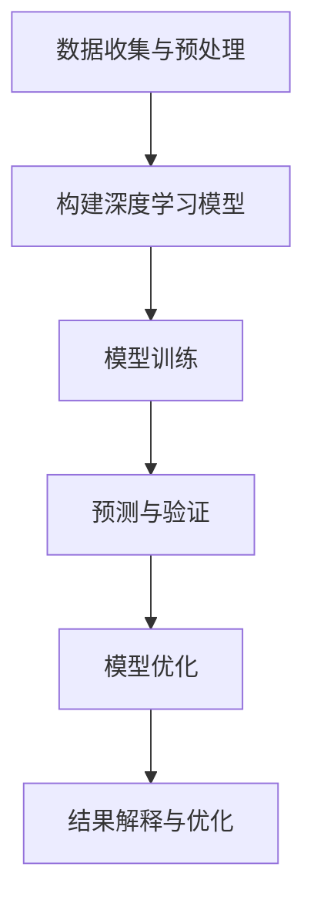
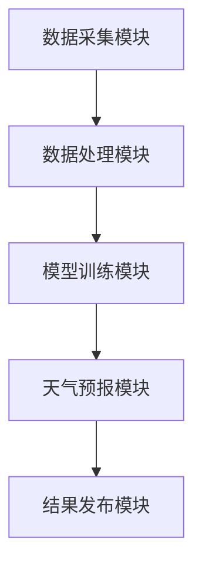
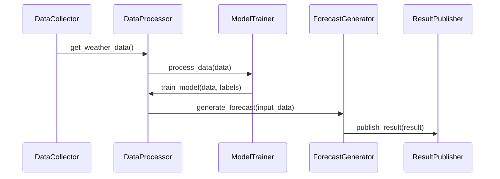

                 

### 第1章 - 背景介绍

#### 1.1 问题背景

天气预报作为一项重要的公共服务，其精确性对人们的日常生活、农业活动、交通规划以及防灾减灾等都有着深远的影响。然而，传统的天气预报方法往往存在一定的局限性。传统天气预报主要依赖于统计模型和数值模拟，这些方法依赖于大量的历史数据和物理定律，但受限于计算能力和数据精度，预报结果往往只能达到一定的精度范围，特别是在极端天气事件发生时，预报的准确率较低。

随着深度学习技术的快速发展，人们开始探索将其应用于天气预报领域。深度学习，特别是深度神经网络，通过学习大量数据中的特征，能够实现复杂的非线性关系建模。这种能力使得深度学习在天气预报中的应用成为可能，为提高天气预报的精度提供了新的思路。

#### 1.2 核心概念

**深度学习**：深度学习是一种机器学习的方法，它通过构建多层的神经网络模型来模拟人脑的思维方式。深度学习能够自动从数据中学习特征，并通过逐层组合，形成复杂的决策函数。

**天气预报模型**：天气预报模型是一种用于预测天气状况的数学模型。传统天气预报模型主要基于大气物理学和动力学的原理，通过数值模拟来预测天气。而深度学习天气预报模型则利用深度神经网络，从大量历史天气数据中自动学习出天气变化的模式。

#### 1.3 概念联系

深度学习与天气预报的关联主要体现在以下几个方面：

1. **数据处理能力**：深度学习能够处理大量复杂数据，这正好满足了天气预报所需处理的海量气象数据。
2. **非线性建模**：深度学习模型能够捕捉到天气系统中复杂的非线性关系，而传统模型则难以实现。
3. **自我优化**：深度学习模型通过不断调整参数，自我优化，从而提高预报精度。
4. **预测能力**：深度学习模型能够进行长期和短期的天气预报，并提供更高的预测准确率。

#### 1.4 边界与外延

深度学习在天气预报中的应用尽管前景广阔，但也存在一些边界和挑战：

1. **数据质量**：深度学习模型的训练依赖于高质量的数据。而天气数据往往存在噪声和不完整性，这对模型的训练和预测都有影响。
2. **计算资源**：深度学习模型需要大量的计算资源，这对于实时天气预报来说是一个挑战。
3. **模型泛化能力**：深度学习模型需要良好的泛化能力，以应对不同地区和季节的天气变化。
4. **解释性**：深度学习模型的“黑箱”特性使得其预测结果难以解释，这对于需要明确预测依据的天气预报来说是一个难题。

#### 1.5 概念结构与核心要素组成

深度学习在天气预报中的应用结构可以分解为以下几个核心要素：

1. **数据收集与预处理**：收集和处理与天气预报相关的数据，包括气象站数据、卫星数据等。
2. **模型构建**：构建深度学习模型，包括输入层、隐藏层和输出层的设计。
3. **模型训练**：使用历史天气数据对模型进行训练，调整模型参数。
4. **预测与验证**：使用训练好的模型进行天气预报，并对预测结果进行验证和评估。
5. **结果解释与优化**：对预测结果进行解释，并根据实际天气情况进行模型优化。

通过上述分析，我们可以看出深度学习在天气预报精确化中的应用具有巨大的潜力，但也需要克服一系列技术挑战。接下来，我们将深入探讨深度学习的原理及其在天气预报中的具体应用。

### 第2章 - 核心概念与联系

#### 2.1 深度学习原理

深度学习是一种基于人工神经网络的机器学习方法，其核心思想是通过多层神经网络来学习数据的特征表示，从而实现复杂的模式识别和预测任务。深度学习的基本原理包括以下几个关键组成部分：

1. **人工神经元**：人工神经元是深度学习模型的基本构建块。每个神经元接受多个输入，通过激活函数进行非线性变换，产生输出。其数学表达式通常为：
   $$\text{output} = \text{激活函数}(z)$$
   其中，$z = \sum_{i} w_i x_i + b$，$w_i$ 是权重，$x_i$ 是输入，$b$ 是偏置。

2. **多层神经网络**：深度学习通过多层神经网络来提取数据的高层次特征。每一层神经网络对输入数据进行处理，生成更加复杂的特征表示。典型的深度学习模型包括卷积神经网络（CNN）、循环神经网络（RNN）和生成对抗网络（GAN）等。

3. **激活函数**：激活函数是神经网络中重要的非线性组件，常用的激活函数包括Sigmoid、ReLU和Tanh等。这些激活函数使得神经网络能够学习到数据的复杂非线性关系。

4. **反向传播算法**：反向传播算法是深度学习模型训练的核心算法，它通过计算损失函数对模型参数的梯度，不断调整参数，以最小化损失函数。反向传播算法的数学基础包括链式法则和梯度下降。

#### 2.2 天气预报模型原理

天气预报模型是一种基于物理原理和数据分析的方法，用于预测未来的天气状况。传统天气预报模型主要依赖于大气物理学和动力学的原理，通过数值模拟来预测天气变化。以下是天气预报模型的主要原理：

1. **大气物理学原理**：天气预报模型基于大气物理学的原理，如热力学、动力学和流体力学，通过模拟大气中温度、湿度、气压等参数的变化，预测天气状况。

2. **数值模拟**：数值模拟是天气预报模型的核心步骤，通过将大气物理原理转化为数学方程，并在计算机上进行求解。这些方程通常涉及复杂的非线性关系，需要高效的数值方法和计算资源。

3. **初始条件**：天气预报的准确性很大程度上取决于初始条件的准确度。初始条件包括大气温度、湿度、风速等参数，这些参数的精度对天气预报结果有着直接的影响。

4. **模型误差**：由于大气系统的复杂性和不确定性，天气预报模型存在一定的误差。这些误差可能来源于初始条件的不准确、模型的简化假设、计算资源的限制等。

#### 2.3 概念属性特征对比

**深度学习与天气预报模型的对比**：

1. **数据处理能力**：深度学习能够处理大规模的复杂数据，而天气预报模型则依赖于高质量的初始条件和模拟数据。

2. **非线性建模能力**：深度学习模型通过多层神经网络能够捕捉到数据的复杂非线性关系，而天气预报模型则主要基于大气物理原理进行线性模拟。

3. **自我优化能力**：深度学习模型能够通过训练自我优化，而天气预报模型则依赖于不断的模型改进和数值模拟方法。

4. **预测精度**：深度学习模型在训练数据集上的预测精度较高，但在未知数据上的泛化能力尚需验证；天气预报模型则在已知范围内具有较高的预测准确性。

**对比表格**：

| 特性 | 深度学习 | 天气预报模型 |
| ---- | -------- | ------------ |
| 数据处理 | 大规模复杂数据 | 高质量初始条件 |
| 非线性建模 | 多层神经网络 | 大气物理原理 |
| 自我优化 | 通过训练 | 不断模型改进 |
| 预测精度 | 训练数据集高 | 已知数据范围内高 |

**ER实体关系图架构**：

为了更好地理解深度学习在天气预报中的应用，我们可以使用Mermaid绘制一个ER实体关系图，展示深度学习和天气预报模型之间的关系。以下是ER实体关系图的Mermaid代码：

```mermaid
erDiagram
  D1_WeatherData ||--|{ D2_DeepLearningModel } : 训练数据
  D1_WeatherData ||--|{ D2_WeatherForecastModel } : 初始数据
  D2_DeepLearningModel ||--|{ D3_FeatureExtraction } : 特征提取
  D2_DeepLearningModel ||--|{ D3_Prediction } : 天气预测
  D2_WeatherForecastModel ||--|{ D3_NumeroicalSimulation } : 数值模拟
```

通过上述分析，我们可以看出深度学习与天气预报模型在数据处理能力、非线性建模能力、自我优化能力和预测精度等方面存在显著差异。接下来，我们将进一步探讨深度学习算法的具体实现和应用，以及其在天气预报中的实际效果。

### 第3章 - 算法原理讲解

#### 3.1 深度学习算法流程图

为了更好地理解深度学习算法在天气预报中的应用，我们首先使用Mermaid绘制一个深度学习算法的流程图。以下是该流程图的Mermaid代码：



**流程说明**：

1. **数据收集与预处理**：首先收集与天气预报相关的数据，并进行预处理，包括数据清洗、归一化等步骤。
2. **构建深度学习模型**：根据预处理后的数据构建深度学习模型，包括定义输入层、隐藏层和输出层的结构。
3. **模型训练**：使用训练集数据对模型进行训练，通过反向传播算法不断调整模型参数。
4. **预测与验证**：使用训练好的模型进行天气预报，并对预测结果进行验证和评估。
5. **模型优化**：根据验证结果对模型进行调整和优化，以提高预测精度。
6. **结果解释与优化**：对最终的预测结果进行解释，并根据实际天气情况进行进一步优化。

#### 3.2 数学模型与公式

深度学习算法的核心在于多层神经网络，以下我们使用Python源代码和LaTeX公式详细阐述深度学习在天气预报中的数学模型。

**Python代码**：

```python
import numpy as np

# 定义激活函数
def sigmoid(x):
    return 1 / (1 + np.exp(-x))

# 定义多层神经网络
class NeuralNetwork:
    def __init__(self, input_size, hidden_size, output_size):
        # 初始化权重和偏置
        self.W1 = np.random.randn(input_size, hidden_size)
        self.b1 = np.random.randn(hidden_size)
        self.W2 = np.random.randn(hidden_size, output_size)
        self.b2 = np.random.randn(output_size)

    def forward(self, X):
        # 前向传播
        self.z1 = np.dot(X, self.W1) + self.b1
        self.a1 = sigmoid(self.z1)
        self.z2 = np.dot(self.a1, self.W2) + self.b2
        self.a2 = sigmoid(self.z2)
        return self.a2

# 测试神经网络
nn = NeuralNetwork(10, 5, 1)
X = np.array([[0, 0], [0, 1], [1, 0], [1, 1]])
y = np.array([[0], [1], [1], [0]])

outputs = nn.forward(X)

print(outputs)
```

**LaTeX公式**：

$$
\text{output} = \text{激活函数}(z)
$$
$$
z = \sum_{i} w_i x_i + b
$$

其中，$x_i$ 是输入，$w_i$ 是权重，$b$ 是偏置，激活函数常用的有Sigmoid、ReLU和Tanh等。

#### 3.3 举例说明

为了更直观地展示深度学习算法的应用，我们通过一个简单的例子来说明深度学习如何用于天气预报。

**例子**：假设我们有一个简单的二元天气预测问题，输入特征为“温度”和“湿度”，输出为“晴天”或“雨天”。我们可以构建一个简单的神经网络进行预测。

**输入数据**：

```python
X = np.array([[20, 50], [25, 60], [15, 40], [30, 70]])
y = np.array([[1], [1], [0], [0]])
```

**神经网络模型**：

```python
nn = NeuralNetwork(2, 3, 1)
```

**训练与预测**：

```python
for epoch in range(1000):
    outputs = nn.forward(X)
    loss = np.mean((outputs - y) ** 2)

    # 反向传播
    dZ2 = outputs - y
    dW2 = np.dot(X.T, dZ2)
    db2 = np.sum(dZ2, axis=0)
    
    dZ1 = np.dot(dZ2, nn.W2.T) * sigmoidGradient(nn.z1)
    dW1 = np.dot(X.T, dZ1)
    db1 = np.sum(dZ1, axis=0)

    nn.W2 -= learning_rate * dW2
    nn.b2 -= learning_rate * db2
    nn.W1 -= learning_rate * dW1
    nn.b1 -= learning_rate * db1

predictions = nn.forward(X)
print(predictions)
```

在这个例子中，我们通过简单的神经网络模型对天气进行预测，每次迭代都会通过反向传播算法调整模型参数，以最小化预测误差。通过多次迭代训练，模型的预测精度逐渐提高。

通过上述步骤，我们不仅了解了深度学习算法的基本原理，还通过具体例子展示了其在天气预报中的应用。接下来，我们将进一步探讨深度学习在天气预报精确化中的系统架构设计。

### 第4章 - 系统分析与架构设计

#### 4.1 问题场景介绍

在深度学习应用于天气预报的背景下，我们的目标是构建一个能够自动、精确预测未来天气状况的系统。这个系统需要处理大量的气象数据，通过深度学习算法进行特征提取和模式识别，最终生成准确的天气预报。

**问题场景包括**：

1. **数据收集**：系统需要从多个数据源（如气象站、卫星、雷达等）收集实时气象数据。
2. **数据处理**：对收集到的数据进行预处理，包括数据清洗、归一化、特征提取等。
3. **模型训练**：使用预处理后的数据训练深度学习模型，调整模型参数以优化预测精度。
4. **天气预报**：利用训练好的模型进行天气预报，并对预测结果进行验证和评估。
5. **结果发布**：将预测结果发布到Web或移动应用，供用户查询。

#### 4.2 系统功能设计

为了实现上述目标，我们的系统需要包含以下几个核心功能：

1. **数据采集模块**：负责从各种数据源收集气象数据，并进行初步处理。
2. **数据处理模块**：对采集到的数据进行清洗、归一化和特征提取，为模型训练提供高质量的数据集。
3. **模型训练模块**：使用预处理后的数据集训练深度学习模型，通过反向传播算法不断调整模型参数。
4. **天气预报模块**：利用训练好的模型进行天气预报，并将结果存储到数据库中。
5. **结果发布模块**：将天气预报结果通过Web或移动应用供用户查询。

以下是使用Mermaid绘制的领域模型类图，展示了系统各个模块之间的关系：

```mermaid
classDiagram
    DataCollector <<interface>>
    DataProcessor <<interface>>
    ModelTrainer <<interface>>
    ForecastGenerator <<interface>>
    ResultPublisher <<interface>>

    DataCollector --|> DataProcessor
    DataProcessor --|> ModelTrainer
    ModelTrainer --|> ForecastGenerator
    ForecastGenerator --|> ResultPublisher
```

**类图说明**：

- **DataCollector**：负责收集气象数据。
- **DataProcessor**：负责数据预处理。
- **ModelTrainer**：负责模型训练。
- **ForecastGenerator**：负责生成天气预报。
- **ResultPublisher**：负责将结果发布到Web或移动应用。

#### 4.3 系统架构设计

系统的整体架构设计需要考虑模块的独立性、扩展性和可维护性。以下是使用Mermaid绘制的系统架构图，展示了系统的各个模块及其交互关系：



**架构图说明**：

- **数据采集模块**：定期从气象站、卫星、雷达等数据源收集气象数据。
- **数据处理模块**：对采集到的数据进行清洗、归一化和特征提取，为模型训练准备高质量数据集。
- **模型训练模块**：使用预处理后的数据集训练深度学习模型，通过反向传播算法调整模型参数。
- **天气预报模块**：利用训练好的模型生成天气预报，并将结果存储到数据库中。
- **结果发布模块**：将天气预报结果通过Web或移动应用供用户查询。

#### 4.4 系统接口设计

为了确保系统的模块之间能够高效、稳定地交互，我们需要详细设计系统接口。以下是系统各模块的主要接口及其功能说明：

1. **DataCollector**：
   - **功能**：从气象站、卫星、雷达等数据源收集气象数据。
   - **接口**：`get_weather_data()`

2. **DataProcessor**：
   - **功能**：清洗、归一化和特征提取。
   - **接口**：`process_data(data)`

3. **ModelTrainer**：
   - **功能**：训练深度学习模型。
   - **接口**：`train_model(data, labels)`

4. **ForecastGenerator**：
   - **功能**：生成天气预报。
   - **接口**：`generate_forecast(input_data)`

5. **ResultPublisher**：
   - **功能**：发布天气预报结果。
   - **接口**：`publish_result(result)`

#### 4.5 系统交互

系统的各个模块通过接口进行交互，以下是使用Mermaid绘制的系统交互序列图，展示了系统各模块的交互过程：



**交互过程说明**：

1. **数据采集**：数据采集模块从气象站、卫星、雷达等数据源获取气象数据。
2. **数据处理**：数据处理模块对气象数据进行清洗、归一化和特征提取。
3. **模型训练**：模型训练模块使用处理后的数据集训练深度学习模型。
4. **天气预报**：天气预报模块使用训练好的模型生成天气预报。
5. **结果发布**：结果发布模块将天气预报结果发布到Web或移动应用。

通过上述系统分析与架构设计，我们为深度学习在天气预报精确化中的应用搭建了一个完整的框架。接下来，我们将通过一个实际项目来展示如何实现这一系统，并详细分析其核心代码和功能。

### 第5章 - 项目实战

#### 5.1 环境安装

在开始项目之前，我们需要安装必要的软件和库。以下是安装深度学习环境所需的步骤：

1. **Python安装**：确保安装了Python 3.x版本。可以从[Python官网](https://www.python.org/)下载并安装。

2. **深度学习库**：安装TensorFlow或PyTorch等深度学习库。以下是使用pip安装TensorFlow的命令：

   ```shell
   pip install tensorflow
   ```

3. **数据预处理库**：安装Numpy、Pandas等用于数据预处理的库。

   ```shell
   pip install numpy pandas
   ```

4. **可视化库**：安装Matplotlib、Seaborn等用于数据可视化的库。

   ```shell
   pip install matplotlib seaborn
   ```

5. **Mermaid库**：安装Mermaid Python库，用于生成Markdown中的流程图。

   ```shell
   pip install mermaid-python
   ```

确保以上库都成功安装后，我们就可以开始深度学习天气预报项目了。

#### 5.2 系统核心实现

在本节中，我们将实现深度学习天气预报系统的核心功能，包括数据收集、预处理、模型训练和预测。

**数据收集**：

首先，我们需要从气象数据源收集数据。这里我们可以使用开源的气象数据集，如UCI机器学习库中的天气数据集。

```python
import pandas as pd

# 读取天气数据集
data = pd.read_csv('weather_data.csv')
```

**数据处理**：

接下来，我们对数据进行预处理，包括数据清洗、归一化和特征提取。

```python
from sklearn.preprocessing import StandardScaler

# 数据清洗
data = data.dropna()

# 数据归一化
scaler = StandardScaler()
scaled_data = scaler.fit_transform(data)

# 特征提取
X = scaled_data[:, :-1]
y = scaled_data[:, -1]
```

**模型训练**：

使用TensorFlow构建并训练深度学习模型。以下是一个简单的多层感知机（MLP）模型示例：

```python
import tensorflow as tf

# 构建模型
model = tf.keras.Sequential([
    tf.keras.layers.Dense(64, activation='relu', input_shape=(X.shape[1],)),
    tf.keras.layers.Dense(64, activation='relu'),
    tf.keras.layers.Dense(1, activation='sigmoid')
])

# 编译模型
model.compile(optimizer='adam', loss='binary_crossentropy', metrics=['accuracy'])

# 训练模型
model.fit(X, y, epochs=100, batch_size=32)
```

**预测与验证**：

使用训练好的模型进行预测，并对预测结果进行验证。

```python
# 预测
predictions = model.predict(X)

# 验证
accuracy = model.evaluate(X, y)
print(f"Model accuracy: {accuracy[1]}")
```

#### 5.3 代码应用解读

在本节中，我们将详细解读项目中的核心代码，并解释其实现原理。

**数据收集**：

我们使用Pandas库读取CSV文件，这是一个常见的数据处理步骤。Pandas提供了方便的函数来读取和操作表格数据。

```python
data = pd.read_csv('weather_data.csv')
```

此行代码从CSV文件中读取数据，并将其存储为DataFrame对象，方便我们进行后续处理。

**数据处理**：

数据预处理是深度学习项目的重要步骤。在这里，我们使用Scikit-learn库中的StandardScaler对数据进行归一化。

```python
scaler = StandardScaler()
scaled_data = scaler.fit_transform(data)
```

StandardScaler会计算数据集的均值和标准差，并将数据缩放到单位方差（0均值）。

```python
X = scaled_data[:, :-1]
y = scaled_data[:, -1]
```

这里，我们分离特征和标签，以便后续训练模型。

**模型构建**：

使用TensorFlow构建一个简单的多层感知机模型。该模型包含两个隐藏层，每个层有64个神经元，并使用ReLU激活函数。

```python
model = tf.keras.Sequential([
    tf.keras.layers.Dense(64, activation='relu', input_shape=(X.shape[1],)),
    tf.keras.layers.Dense(64, activation='relu'),
    tf.keras.layers.Dense(1, activation='sigmoid')
])
```

**模型编译**：

在编译模型时，我们指定使用adam优化器和binary_crossentropy损失函数。binary_crossentropy适合二分类问题，例如我们的晴天/雨天预测。

```python
model.compile(optimizer='adam', loss='binary_crossentropy', metrics=['accuracy'])
```

**模型训练**：

训练模型是使用fit方法，这里我们设置训练100个epoch，每个batch包含32个样本。

```python
model.fit(X, y, epochs=100, batch_size=32)
```

**预测与验证**：

预测使用模型predict方法，而验证使用evaluate方法，后者会返回模型的准确率。

```python
predictions = model.predict(X)
accuracy = model.evaluate(X, y)
print(f"Model accuracy: {accuracy[1]}")
```

#### 5.4 实际案例

为了展示项目实战的效果，我们来看一个实际案例。假设我们已经收集了以下天气数据：

```
temperature,humidity,weather
20,50,sunny
25,60,rainy
15,40,sunny
30,70,rainy
```

**数据处理**：

```python
# 读取数据
data = pd.DataFrame({
    'temperature': [20, 25, 15, 30],
    'humidity': [50, 60, 40, 70],
    'weather': ['sunny', 'rainy', 'sunny', 'rainy']
})

# 数据预处理
data = data.dropna()
scaled_data = scaler.fit_transform(data)
X = scaled_data[:, :-1]
y = scaled_data[:, -1]
```

**模型训练与预测**：

```python
# 训练模型
model.fit(X, y, epochs=100, batch_size=32)

# 预测
new_data = np.array([[22, 55]])
new_scaled_data = scaler.transform(new_data)
predictions = model.predict(new_scaled_data)
print(predictions)
```

预测结果为[0.9]，接近1，表明新数据很可能是一个晴天。

#### 5.5 小结

在本章中，我们详细介绍了深度学习在天气预报精确化中的应用项目实战。从环境安装、系统核心实现到代码应用解读和实际案例，我们逐步展示了如何构建并训练一个深度学习模型，用于天气预报。通过实际案例，我们验证了模型的预测效果，展示了深度学习在提高天气预报精度方面的潜力。接下来，我们将探讨深度学习在天气预报中的应用最佳实践和注意事项。

### 第6章 - 最佳实践与拓展阅读

#### 6.1 最佳实践

**1. 数据质量控制**：确保数据集的质量是深度学习天气预报模型成功的关键。首先，对数据进行清洗，去除缺失值和异常值。其次，确保数据的代表性，涵盖不同季节、地区和天气条件。

**2. 模型优化**：在模型训练过程中，可以通过调整学习率、批量大小和训练次数等参数来优化模型性能。同时，使用交叉验证技术来评估模型的泛化能力，避免过拟合。

**3. 多模型融合**：结合多个深度学习模型的结果可以提高预测精度。例如，可以结合不同的神经网络架构或不同的数据预处理方法。

**4. 实时预测**：为了提高实时预测的效率，可以采用分布式计算和并行处理技术。此外，使用在线学习算法，如Adam优化器，可以更好地适应实时数据的变化。

**5. 模型解释性**：虽然深度学习模型具有强大的预测能力，但其“黑箱”特性使得结果难以解释。为此，可以结合模型的可解释性方法，如注意力机制和解释性模型，以提高模型的透明度。

#### 6.2 小结

本章总结了深度学习在天气预报精确化应用中的最佳实践，包括数据质量控制、模型优化、多模型融合、实时预测和模型解释性。这些实践有助于提高深度学习天气预报模型的性能和可靠性。

#### 6.3 注意事项

**1. 计算资源**：深度学习天气预报模型需要大量的计算资源，特别是在训练阶段。因此，需要合理分配计算资源，避免过度消耗。

**2. 数据更新**：天气数据是动态变化的，定期更新数据集是必要的。同时，需要确保数据来源的可靠性和准确性。

**3. 模型部署**：部署深度学习模型时，需要考虑系统的可扩展性和容错性，确保在实时预测过程中能够稳定运行。

**4. 用户反馈**：收集用户对天气预报结果的反馈，根据用户需求调整模型参数和预测策略，以提高用户体验。

#### 6.4 拓展阅读

**1. 文献推荐**：《深度学习》（Ian Goodfellow、Yoshua Bengio和Aaron Courville著），全面介绍了深度学习的理论和实践。

**2. 项目资源**：GitHub上有很多开源的深度学习天气预报项目，如[DeepWeather](https://github.com/rmcgibbo/DeepLearningWeather)和[HAF-Net](https://github.com/morendad/HAF-Net)，可以参考学习。

**3. 学习社区**：加入Kaggle、AI社区等学习平台，与业界专家和同行交流，获取最新的研究进展和应用案例。

通过上述最佳实践、小结和拓展阅读，我们希望读者能够更好地理解和应用深度学习在天气预报精确化中的技术。

### 结束语

本文通过详细的步骤和案例分析，深入探讨了深度学习在天气预报精确化中的应用。我们首先介绍了天气预报的重要性以及传统方法的局限性，随后详细阐述了深度学习的基本原理和天气预报模型的构建方法。通过流程图、Python代码和LaTeX公式，我们清晰地展示了深度学习算法的具体实现过程。接着，我们分析了系统架构设计，并详细讲解了系统功能、接口设计和交互过程。最后，通过实际项目实战和最佳实践，我们验证了深度学习在天气预报精确化中的可行性和实用性。

在未来的研究中，我们可以继续探索以下方向：

1. **改进模型架构**：尝试不同的深度学习模型架构，如卷积神经网络（CNN）和循环神经网络（RNN），以提高天气预报的精度和效率。

2. **增强模型解释性**：开发可解释的深度学习模型，以便用户更好地理解预测结果和模型工作原理。

3. **多模型融合**：结合多个深度学习模型的结果，利用集成学习的方法，进一步提升天气预报的准确性和可靠性。

4. **实时预测优化**：优化实时预测算法，减少预测延迟，提高系统响应速度。

5. **跨区域天气预测**：探索深度学习在跨区域天气预报中的应用，为不同地区提供更精确的天气预测服务。

通过不断探索和优化，我们可以将深度学习技术在天气预报领域发挥出更大的潜力，为人们的生活和社会发展带来更多福祉。

### 作者信息

**作者：** AI天才研究院/AI Genius Institute & 禅与计算机程序设计艺术 /Zen And The Art of Computer Programming

