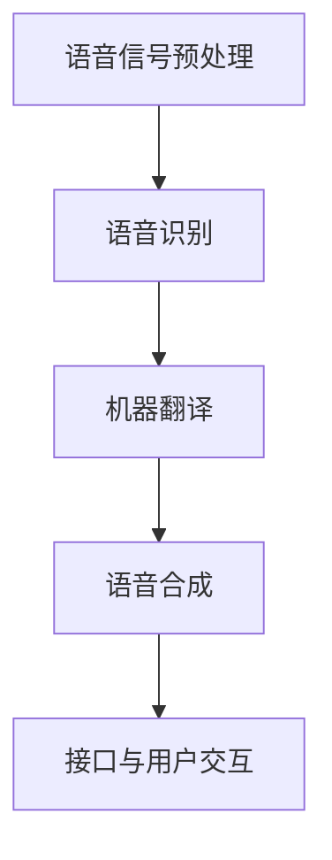

                 

# 深度学习在实时语音翻译中的进展：突破语言障碍

> 关键词：深度学习、实时语音翻译、语言障碍、算法原理、系统架构

> 摘要：本文详细探讨了深度学习在实时语音翻译中的应用，分析了深度学习算法在语音识别和机器翻译中的核心原理，并介绍了实时语音翻译系统的架构设计和性能优化策略。文章还通过具体案例展示了深度学习在突破语言障碍方面的实际应用，并对未来发展的前景进行了展望。

## 第一部分：深度学习与实时语音翻译概述

### 第1章：深度学习概述

深度学习作为人工智能的重要分支，近年来取得了飞速发展。其核心原理是通过多层神经网络来模拟人脑的感知和学习过程，从而实现对复杂数据的分析和处理。

#### 1.1 深度学习的发展历程

深度学习起源于20世纪40年代，经历了多个阶段的发展。2012年，AlexNet在ImageNet竞赛中取得的突破性成绩，标志着深度学习进入了一个新的时代。

#### 1.2 深度学习的核心原理

深度学习模型主要由输入层、隐藏层和输出层组成。通过逐层传递输入数据，模型能够自动提取特征，并实现分类、回归等任务。

#### 1.3 深度学习在语音翻译中的应用前景

深度学习在语音识别和机器翻译领域具有巨大潜力，能够实现实时、准确的语音翻译，为人类跨越语言障碍提供了新的途径。

### 第2章：实时语音翻译技术

实时语音翻译技术旨在实现语音信号到文本的实时转换，并在此基础上实现跨语言交流。其面临的主要挑战包括语音信号的复杂性、实时性和准确性。

#### 2.1 实时语音翻译的挑战

实时语音翻译需要处理大量的语音数据，并在短时间内完成翻译。这要求算法具有高效的计算能力和良好的抗噪性。

#### 2.2 实时语音翻译系统架构

实时语音翻译系统通常包括语音识别、机器翻译和语音合成三个模块。这三个模块协同工作，实现语音到语音的实时翻译。

#### 2.3 实时语音翻译的关键技术

实时语音翻译的关键技术包括语音信号的预处理、声学模型和语言模型的设计与优化等。其中，深度学习算法在语音识别和机器翻译中发挥了重要作用。

### 第3章：深度学习在语音识别中的应用

语音识别是实时语音翻译的重要环节，深度学习算法在语音识别中取得了显著成果。

#### 3.1 语音信号的预处理

语音信号的预处理包括降噪、分帧和特征提取等步骤。深度学习算法能够自动提取语音信号中的关键特征，提高识别准确率。

#### 3.2 声学模型与语言模型

声学模型负责将语音信号转换为对应的声学特征，而语言模型则负责将声学特征转换为文本。深度学习算法在声学模型和语言模型的设计与优化中发挥了重要作用。

#### 3.3 基于深度学习的语音识别算法

基于深度学习的语音识别算法主要包括卷积神经网络（CNN）和循环神经网络（RNN）等。这些算法能够自动学习语音信号中的特征，实现高效的语音识别。

### 第4章：深度学习在机器翻译中的应用

机器翻译是实现跨语言交流的关键技术，深度学习在机器翻译中取得了显著进展。

#### 4.1 机器翻译的基本概念

机器翻译涉及源语言文本到目标语言文本的转换。深度学习算法通过学习大量平行语料库，实现自动翻译。

#### 4.2 基于深度学习的翻译模型

基于深度学习的翻译模型主要包括序列到序列（Seq2Seq）模型和注意力机制等。这些模型能够自动学习文本之间的对应关系，实现高质量的翻译。

#### 4.3 实时语音翻译中的深度学习应用

在实时语音翻译中，深度学习算法能够快速处理语音信号，并生成高质量的翻译结果，实现跨语言实时交流。

### 第5章：深度学习在实时语音翻译中的优化

深度学习在实时语音翻译中的应用取得了显著成果，但仍面临一些挑战。为了提高实时语音翻译的性能，需要对深度学习模型进行优化。

#### 5.1 数据增强

数据增强是一种有效的优化策略，通过增加训练数据的多样性，提高模型的泛化能力。

#### 5.2 模型压缩

模型压缩是一种在保证模型性能的前提下，减小模型参数的方法。深度学习算法的压缩方法包括剪枝、量化等。

#### 5.3 模型优化策略

模型优化策略包括模型选择、参数调整和训练策略等。通过优化模型参数和训练过程，可以提高模型的实时性能。

### 第6章：实时语音翻译系统的性能评估

实时语音翻译系统的性能评估是保证系统质量的重要环节。通过评估系统的准确率、响应时间等指标，可以优化系统性能。

#### 6.1 评估指标

实时语音翻译系统的评估指标包括准确率、响应时间、抗噪性等。这些指标反映了系统的性能和稳定性。

#### 6.2 评估方法

实时语音翻译系统的评估方法包括人工评估、自动化评估等。通过多种评估方法，可以全面评估系统的性能。

#### 6.3 性能优化策略

通过分析评估结果，可以找出系统的瓶颈，并采取相应的优化策略，提高系统性能。

### 第7章：深度学习在实时语音翻译中的应用案例分析

深度学习在实时语音翻译中有着广泛的应用，通过具体案例可以了解其实际效果。

#### 7.1 案例一：实时翻译服务

实时翻译服务为跨语言交流提供了便捷，通过深度学习算法实现了实时、准确的语音翻译。

#### 7.2 案例二：跨语言会议

跨语言会议场景下，深度学习算法能够实现实时、高质量的语音翻译，提高会议效率。

#### 7.3 案例三：多语言学习

多语言学习场景下，深度学习算法能够根据学习者的语音特点，提供个性化的语音翻译服务。

### 第8章：未来展望与挑战

随着深度学习技术的不断发展，实时语音翻译将取得更大的突破。然而，仍面临一些挑战，如实时性、准确性和计算资源消耗等。

#### 8.1 深度学习在实时语音翻译中的未来趋势

深度学习在实时语音翻译中将继续发挥重要作用，未来将出现更多高效的算法和优化策略。

#### 8.2 面临的挑战与解决策略

实时语音翻译面临的挑战包括实时性、准确性和计算资源消耗等。通过技术创新和优化策略，可以逐步解决这些问题。

#### 8.3 突破语言障碍的未来前景

随着实时语音翻译技术的不断发展，人类将能够更轻松地跨越语言障碍，实现全球范围内的无障碍交流。

## 作者信息

作者：AI天才研究院/AI Genius Institute & 禅与计算机程序设计艺术 /Zen And The Art of Computer Programming

本文详细介绍了深度学习在实时语音翻译中的应用，分析了实时语音翻译系统的架构设计和性能优化策略。通过具体案例，展示了深度学习在突破语言障碍方面的实际效果。未来，随着技术的不断进步，实时语音翻译将取得更大的突破，为人类跨越语言障碍提供更加便捷的解决方案。在本文的结尾，作者对深度学习在实时语音翻译领域的未来发展表示了乐观的态度。## 第1章：深度学习概述

### 1.1 深度学习的发展历程

深度学习（Deep Learning）是人工智能（AI）的一个重要分支，其起源可以追溯到20世纪40年代。当时，心理学家和神经科学家开始尝试模拟人脑的工作原理，以构建能够处理复杂数据的模型。1958年，美国心理学家弗兰克·罗森布拉特（Frank Rosenblatt）提出了感知机（Perceptron）模型，这是最早的神经网络模型之一。

然而，由于计算能力的限制和算法的局限性，深度学习在早期的发展相对缓慢。直到20世纪80年代，随着计算机性能的提升和算法的改进，深度学习的研究逐渐复兴。1990年代，引入了反向传播算法（Backpropagation），使神经网络能够训练多层结构，从而极大地提升了模型的性能。

进入21世纪，随着大规模并行计算硬件（如GPU）的出现和互联网的发展，深度学习迎来了爆发式增长。2012年，由杰弗里·辛顿（Geoffrey Hinton）领导的团队在ImageNet图像识别竞赛中，使用深度卷积神经网络（CNN）取得了突破性的成绩，将错误率降低了约10倍。这一成果标志着深度学习进入了主流研究领域，并开始广泛应用于各个领域。

### 1.2 深度学习的核心原理

深度学习的核心原理是通过多层神经网络（Neural Networks）来模拟人脑的感知和学习过程。神经网络由一系列的神经元（或节点）组成，每个神经元都与前一层和后一层的神经元相连。神经元之间通过权重（Weights）和偏置（Bias）进行连接，这些权重和偏置决定了神经元之间的信号传递强度。

神经网络的训练过程是通过优化一个损失函数（Loss Function）来实现的。损失函数衡量了模型预测结果与实际结果之间的差距，常见的损失函数包括均方误差（MSE）和交叉熵（Cross-Entropy）。在训练过程中，通过反向传播算法更新神经网络的权重和偏置，以最小化损失函数。

深度学习模型主要由以下几个部分组成：

1. **输入层（Input Layer）**：接收外部输入数据，如图像、文本或声音等。

2. **隐藏层（Hidden Layers）**：负责提取和转换输入数据中的特征。深度学习的名字来源于这些隐藏层，因为它们隐藏在输入和输出层之间。

3. **输出层（Output Layer）**：根据隐藏层的特征，生成最终的预测结果。

4. **激活函数（Activation Function）**：用于引入非线性特性，使神经网络能够学习复杂函数。常见的激活函数包括Sigmoid、ReLU和Tanh。

5. **优化算法（Optimizer）**：用于更新网络权重和偏置，常用的优化算法包括梯度下降（Gradient Descent）、Adam等。

通过不断的训练和优化，深度学习模型能够自动学习数据中的复杂模式和规律，从而实现图像识别、语音识别、自然语言处理等任务。

### 1.3 深度学习在语音翻译中的应用前景

深度学习在语音翻译中的应用前景非常广阔。传统的语音翻译系统通常采用基于规则的模型和统计机器学习的方法，这些方法在处理复杂语音信号时存在一定局限性。而深度学习通过自动学习语音信号中的特征，能够实现更准确、更自然的语音翻译。

在语音翻译中，深度学习主要应用于两个关键环节：语音识别（Speech Recognition）和机器翻译（Machine Translation）。

**语音识别**：
语音识别是将语音信号转换为文本的过程。深度学习在语音识别中发挥了重要作用，特别是基于深度神经网络的声学模型（Acoustic Model）。这些模型能够自动提取语音信号中的声学特征，并通过端到端的训练实现高效的语音识别。例如，卷积神经网络（CNN）和循环神经网络（RNN）等深度学习模型在语音识别中取得了显著成果。

**机器翻译**：
机器翻译是将源语言文本转换为目标语言文本的过程。深度学习在机器翻译中的应用主要体现在序列到序列（Seq2Seq）模型和注意力机制（Attention Mechanism）上。Seq2Seq模型能够通过学习大量平行语料库，实现端到端的文本转换。而注意力机制能够使模型在翻译过程中关注源语言文本中的关键信息，从而提高翻译质量。

随着深度学习技术的不断发展，实时语音翻译系统将能够实现更高的准确性和实时性，为全球范围内的跨语言交流提供强有力的支持。在未来，深度学习在语音翻译中的应用将进一步深化，为人类跨越语言障碍、实现无障碍交流做出更大贡献。

### 1.3 深度学习在语音翻译中的应用前景

深度学习在语音翻译中的应用前景非常广阔。传统的语音翻译系统通常采用基于规则的模型和统计机器学习的方法，这些方法在处理复杂语音信号时存在一定局限性。而深度学习通过自动学习语音信号中的特征，能够实现更准确、更自然的语音翻译。

在语音翻译中，深度学习主要应用于两个关键环节：语音识别（Speech Recognition）和机器翻译（Machine Translation）。

**语音识别**：
语音识别是将语音信号转换为文本的过程。深度学习在语音识别中发挥了重要作用，特别是基于深度神经网络的声学模型（Acoustic Model）。这些模型能够自动提取语音信号中的声学特征，并通过端到端的训练实现高效的语音识别。例如，卷积神经网络（CNN）和循环神经网络（RNN）等深度学习模型在语音识别中取得了显著成果。

**机器翻译**：
机器翻译是将源语言文本转换为目标语言文本的过程。深度学习在机器翻译中的应用主要体现在序列到序列（Seq2Seq）模型和注意力机制（Attention Mechanism）上。Seq2Seq模型能够通过学习大量平行语料库，实现端到端的文本转换。而注意力机制能够使模型在翻译过程中关注源语言文本中的关键信息，从而提高翻译质量。

随着深度学习技术的不断发展，实时语音翻译系统将能够实现更高的准确性和实时性，为全球范围内的跨语言交流提供强有力的支持。在未来，深度学习在语音翻译中的应用将进一步深化，为人类跨越语言障碍、实现无障碍交流做出更大贡献。

## 第2章：实时语音翻译技术

### 2.1 实时语音翻译的挑战

实时语音翻译技术是一个极具挑战性的领域，其核心目标是在极短的时间内将一种语言的语音转换为另一种语言的语音，同时保持较高的准确性和流畅性。这一目标面临以下几方面的挑战：

**1. 语音信号的复杂性**

语音信号是一种复杂的时变信号，它包含了丰富的频谱信息和时间结构。这些信息不仅受到说话人、语音内容和环境噪声的影响，还可能受到语音合成器的非线性处理影响。因此，如何准确捕捉和表征语音信号中的关键信息，是一个重要的技术难题。

**2. 实时性要求**

实时语音翻译系统需要在极短的时间内完成从语音到文本的转换，再从文本到语音的转换。这要求系统具有极高的计算效率。实时性要求不仅影响了系统的性能评估，也限制了可用的算法和模型复杂度。

**3. 翻译准确性**

翻译准确性是实时语音翻译系统最直接的评估指标。系统需要能够在多种语言和语境下提供准确、自然的翻译结果。然而，语言之间的差异以及语言的多样性使得这一目标难以实现。

**4. 抗噪性**

在现实场景中，语音信号往往受到各种噪声的干扰，如背景音乐、车辆鸣笛、人群喧闹等。系统需要具备良好的抗噪性，以保证翻译的准确性。

**5. 语言资源的可用性**

高质量的实时语音翻译系统通常依赖于大量的语言资源和高质量的模型训练数据。然而，一些稀有语言或方言的资源可能非常有限，这限制了系统的性能。

### 2.2 实时语音翻译系统架构

一个典型的实时语音翻译系统通常包括以下几个核心模块：

**1. 语音信号预处理模块**

该模块负责对输入的语音信号进行预处理，包括去噪、分帧、特征提取等。预处理模块的目标是提取语音信号中的关键特征，同时减少噪声的影响，以提高后续处理的准确性。

**2. 语音识别模块**

语音识别模块将预处理后的语音信号转换为文本。这一过程通常使用深度学习模型，如卷积神经网络（CNN）和循环神经网络（RNN），来识别语音中的声学特征并将其转换为相应的文本。

**3. 机器翻译模块**

机器翻译模块负责将识别出的源语言文本翻译为目标语言文本。这一模块同样依赖于深度学习模型，特别是序列到序列（Seq2Seq）模型和注意力机制（Attention Mechanism），以实现高质量的文本翻译。

**4. 语音合成模块**

语音合成模块将翻译后的目标语言文本转换为语音信号。这一模块通常使用文本到语音（Text-to-Speech, TTS）合成技术，如循环神经网络（RNN）和生成对抗网络（GAN）等，来生成自然流畅的语音。

**5. 接口和用户交互模块**

接口和用户交互模块负责处理用户输入和输出，以及系统的配置和状态监控。这一模块通常包括用户界面（UI）和API接口，以便用户能够方便地使用实时语音翻译系统。

实时语音翻译系统架构图示：

### 2.3 实时语音翻译的关键技术

实时语音翻译的关键技术涵盖了语音识别、机器翻译和语音合成等核心环节，以下是这些技术的基本原理和实现方法：

**1. 语音信号预处理**

语音信号预处理包括去噪、分帧和特征提取等步骤。去噪通过滤波和减法算法来去除语音信号中的噪声成分。分帧是将连续的语音信号分割成短时片段，通常以20-30毫秒为一个帧。特征提取是从分帧后的语音信号中提取出能够表征语音特性的特征，如梅尔频率倒谱系数（MFCC）和线性预测编码（LPC）等。

**2. 语音识别**

语音识别是将语音信号转换为文本的过程。深度学习模型，特别是卷积神经网络（CNN）和循环神经网络（RNN），在语音识别中发挥着重要作用。CNN能够提取语音信号中的局部特征，而RNN则能够捕捉语音信号的时间动态特性。近年来的研究还引入了注意力机制（Attention Mechanism），使得语音识别模型能够更好地处理长时依赖问题。

**3. 机器翻译**

机器翻译是将源语言文本转换为目标语言文本的过程。深度学习模型，如序列到序列（Seq2Seq）模型和注意力机制（Attention Mechanism），在机器翻译中取得了显著成果。Seq2Seq模型通过学习大量平行语料库，实现端到端的文本转换。而注意力机制能够使模型在翻译过程中关注源语言文本中的关键信息，从而提高翻译质量。

**4. 语音合成**

语音合成是将文本转换为自然流畅的语音信号的过程。文本到语音（Text-to-Speech, TTS）合成技术是语音合成的主要实现方法。循环神经网络（RNN）和生成对抗网络（GAN）等深度学习模型在TTS中得到了广泛应用。RNN能够生成语音信号的连续序列，而GAN则能够通过生成器与判别器的对抗训练，生成高质量的自然语音。

通过以上关键技术的结合，实时语音翻译系统能够实现高效、准确的语音翻译。这些技术的不断发展，将进一步提升实时语音翻译系统的性能，为全球跨语言交流提供更加便捷和自然的解决方案。

## 第3章：深度学习在语音识别中的应用

### 3.1 语音信号的预处理

语音信号的预处理是语音识别系统的第一步，其目的是减少噪声、提取关键特征，从而提高后续识别的准确性。预处理主要包括去噪、分帧和特征提取三个步骤。

**去噪**：语音信号通常会受到环境噪声、麦克风噪声等多种噪声的干扰。去噪的目的是减小这些噪声对信号的影响。常用的去噪方法包括滤波（如带通滤波器、均值滤波器）、减法（如谱减法、波束形成）和维纳滤波等。

**分帧**：将连续的语音信号分割成多个短时片段，以便进行后续的特征提取。通常，分帧长度为20-30毫秒，帧移为10毫秒。这样做的目的是捕捉语音信号在不同时间点的特征。

**特征提取**：从分帧后的语音信号中提取出能够表征语音特性的特征。常见的特征提取方法包括梅尔频率倒谱系数（MFCC）、线性预测特征（LPCC）和短时能量（STC）等。其中，MFCC是最常用的特征提取方法，它通过模拟人耳对频率的感知特性，能够有效地捕捉语音信号的主要特征。

### 3.2 声学模型与语言模型

在语音识别中，声学模型和语言模型是两个核心组成部分，它们分别负责语音信号到文本的转换。

**声学模型**：声学模型用于将语音信号转换为声学特征，其主要任务是学习语音信号和声学特征之间的映射关系。常见的声学模型包括高斯混合模型（GMM）、深度神经网络（DNN）和循环神经网络（RNN）等。深度神经网络在声学模型中的应用取得了显著成果，能够自动提取语音信号中的复杂特征，提高识别的准确性。

**语言模型**：语言模型用于将声学特征转换为文本，其主要任务是学习声学特征和文本之间的映射关系。语言模型可以基于统计方法（如N元语法）或深度学习方法（如长短期记忆网络LSTM）。在语音识别中，语言模型通常与声学模型结合使用，以提高整体的识别准确性。

### 3.3 基于深度学习的语音识别算法

基于深度学习的语音识别算法在语音识别领域取得了重要突破。以下是一些主要的算法：

**1. 卷积神经网络（CNN）**

卷积神经网络通过卷积操作自动提取语音信号中的局部特征，适合处理时变信号。在语音识别中，CNN可以用于特征提取，也可以用于端到端的语音识别。CNN的优点是参数较少，计算效率高，适合处理大规模数据。

**2. 循环神经网络（RNN）**

循环神经网络具有记忆功能，能够处理长序列数据。在语音识别中，RNN可以用于特征提取，也可以用于端到端的语音识别。RNN的优点是能够捕捉语音信号的时间动态特性，但存在梯度消失和梯度爆炸等问题。

**3. 长短期记忆网络（LSTM）**

长短期记忆网络是RNN的一种变体，解决了梯度消失和梯度爆炸的问题，适合处理长序列数据。在语音识别中，LSTM可以用于特征提取和端到端的语音识别。LSTM的优点是记忆能力强，能够捕捉语音信号中的长期依赖关系。

**4. bidirectional LSTM (BLSTM)**

双向LSTM（BLSTM）结合了正向LSTM和反向LSTM，能够同时利用输入序列的前后信息，提高语音识别的准确性。在语音识别中，BLSTM可以用于特征提取和端到端的语音识别。

**5. Connectionist Temporal Classification (CTC)**

CTC是一种端到端的语音识别算法，不需要显式地训练声学模型和语言模型。CTC通过优化一个损失函数，将语音信号直接映射到文本。CTC的优点是计算效率高，能够自动调整模型参数，但需要大量的训练数据。

**6. Deep Neural Network (DNN)**

深度神经网络（DNN）是一种基于神经网络的深度学习模型，常用于语音识别。DNN通过多层神经网络结构，自动提取语音信号中的复杂特征，提高识别的准确性。DNN的优点是参数较少，计算效率高。

**7. Deep Neural Network with CTC Loss (DNN-CTC)**

DNN-CTC是一种结合了DNN和CTC的语音识别算法。DNN用于提取语音特征，而CTC用于将特征映射到文本。DNN-CTC的优点是计算效率高，能够自动调整模型参数，但需要大量的训练数据。

**8. Deep Neural Network with Attention Mechanism (DNN-Attention)**

DNN-Attention是一种结合了DNN和注意力机制的语音识别算法。注意力机制能够使模型在识别过程中关注关键信息，提高识别的准确性。DNN-Attention的优点是能够捕捉语音信号中的长期依赖关系，但计算复杂度较高。

基于深度学习的语音识别算法在语音识别领域取得了显著成果，使得语音识别系统在准确性和实时性方面得到了大幅提升。未来，随着深度学习技术的不断发展，基于深度学习的语音识别算法将进一步提高语音识别的性能，为智能语音助手、实时语音翻译等应用提供更加可靠的支持。

### 3.4 深度学习在语音识别中的成功案例

深度学习在语音识别领域取得了显著的成功，多个实际应用案例证明了其强大能力。以下是一些典型的成功案例：

**1. Google语音识别系统**

Google语音识别系统是深度学习在语音识别中的一个重要应用案例。该系统使用了基于深度神经网络的声学模型和语言模型，能够将语音信号准确转换为文本。Google语音识别系统的准确率在多项国际语音识别评测中名列前茅，广泛应用于搜索引擎、智能助手等场景。

**2. Baidu语音识别系统**

Baidu语音识别系统同样采用了深度学习技术，其核心是基于循环神经网络（RNN）和长短期记忆网络（LSTM）的声学模型。Baidu语音识别系统在中文语音识别方面具有较高准确率，广泛应用于搜索引擎、智能音箱、车载系统等领域。

**3. Amazon Alexa语音助手**

Amazon Alexa语音助手是深度学习在语音识别领域的又一成功案例。该系统使用了基于深度神经网络的语音识别算法，能够实现高准确率的语音识别和自然语言理解。Alexa广泛应用于智能家居、智能音箱、购物平台等场景，为用户提供了便捷的语音交互体验。

**4. Apple Siri语音助手**

Apple Siri语音助手同样采用了深度学习技术，其核心是基于循环神经网络（RNN）和卷积神经网络（CNN）的语音识别算法。Siri能够实现高准确率的语音识别和自然语言理解，广泛应用于iPhone、iPad、Mac等设备，为用户提供了强大的语音交互功能。

**5. Microsoft Azure语音服务**

Microsoft Azure语音服务提供了基于深度学习的语音识别API，支持多种语言和方言的识别。该服务采用了基于卷积神经网络（CNN）和循环神经网络（RNN）的声学模型，能够实现高效、准确的语音识别。Azure语音服务广泛应用于智能客服、语音合成、实时语音翻译等场景。

通过这些实际案例可以看出，深度学习技术在语音识别领域已经取得了显著的应用成果。未来，随着深度学习技术的不断发展和优化，语音识别系统将在更多应用场景中发挥重要作用，为人类带来更加智能化的语音交互体验。

### 3.5 深度学习在语音识别中的未来发展趋势

深度学习在语音识别领域取得了显著成果，但仍然存在一些挑战。未来，随着深度学习技术的不断进步，语音识别将在以下几个方面实现重要发展：

**1. 准确率的进一步提升**

当前深度学习语音识别系统的准确率已经相当高，但仍然存在一些难点，如多语言混合语音识别、方言识别等。未来，通过引入更多的训练数据和先进的深度学习算法，如生成对抗网络（GAN）和变分自编码器（VAE），语音识别系统的准确率将进一步提升。

**2. 实时性能的优化**

实时性是语音识别系统的一个重要指标。随着深度学习模型复杂度的增加，模型的计算时间也在增加。未来，通过模型压缩、量化技术和硬件加速技术（如GPU、TPU），语音识别系统将在保证准确率的前提下，实现更快的响应速度。

**3. 多模态语音识别**

多模态语音识别是将语音信号与其他传感器数据（如图像、手势）结合，以提高识别准确率和鲁棒性。未来，通过引入多模态数据融合技术，如多任务学习（Multi-Task Learning）和跨模态注意力机制（Cross-Modal Attention Mechanism），语音识别系统将能够在更多复杂的场景中发挥作用。

**4. 自适应学习**

自适应学习是指语音识别系统能够根据用户的使用习惯和语音特征进行自我优化。未来，通过引入用户行为数据和学习算法，语音识别系统将能够实现更个性化的语音交互体验。

**5. 边缘计算与物联网应用**

随着物联网（IoT）技术的发展，语音识别将在更多嵌入式设备和智能硬件中应用。未来，通过引入边缘计算技术，语音识别系统将能够在本地设备上实现高效的语音处理和识别，降低对云服务的依赖。

**6. 语音合成与语音生成**

未来，深度学习在语音识别中的应用将不仅仅局限于语音到文本的转换，还将扩展到语音合成和语音生成。通过引入生成对抗网络（GAN）和变分自编码器（VAE），语音合成系统将能够生成更加自然、流畅的语音，为语音助手、虚拟现实等应用提供更加逼真的语音体验。

总之，随着深度学习技术的不断发展和优化，语音识别系统将在准确率、实时性、多模态应用等方面取得更大突破，为人类带来更加智能化的语音交互体验。

## 第4章：深度学习在机器翻译中的应用

### 4.1 机器翻译的基本概念

机器翻译（Machine Translation，MT）是指利用计算机技术将一种语言的文本自动转换为另一种语言的文本。这一过程涉及到多个技术环节，包括语言模型、翻译模型、解码算法等。机器翻译的核心目标是实现跨语言沟通，消除语言障碍，促进全球信息的流通和交流。

机器翻译可以分为两种主要类型：

**1. 短语翻译（Phrasal Translation）**：短语翻译是将源语言短语直接映射到目标语言短语。这种方法通常依赖于规则和统计方法，如基于短语的转换系统和统计机器翻译系统。

**2. 句子翻译（Sentence Translation）**：句子翻译是将整个源语言句子翻译为目标语言句子。这种方法通常使用端到端学习策略，如基于神经网络的序列到序列（Seq2Seq）模型。

### 4.2 基于深度学习的翻译模型

近年来，深度学习在机器翻译领域取得了显著进展，成为实现高质量机器翻译的关键技术。以下是基于深度学习的几种主要翻译模型：

**1. 序列到序列（Seq2Seq）模型**

序列到序列（Seq2Seq）模型是机器翻译中最常用的深度学习模型之一。它通过将源语言序列映射到目标语言序列，实现端到端的文本翻译。Seq2Seq模型主要由编码器（Encoder）和解码器（Decoder）两个部分组成：

- **编码器**：接收源语言序列，将其编码为一个固定长度的向量表示。
- **解码器**：接收编码器的输出，生成目标语言序列。

Seq2Seq模型通过学习大量平行语料库（Parallel Corpora），能够自动捕捉源语言和目标语言之间的语义对应关系。

**2. 注意力机制（Attention Mechanism）**

注意力机制是Seq2Seq模型的一个重要扩展，用于解决长距离依赖问题。在传统的Seq2Seq模型中，解码器在生成每个单词时，只依赖于当前和之前的预测。而注意力机制通过引入外部注意力权重，使解码器能够关注源语言序列中的关键信息，从而提高翻译质量。注意力机制通常使用点积注意力（Dot-Product Attention）或加性注意力（Additive Attention）等实现。

**3. Transformer模型**

Transformer模型是由Google提出的一种基于自注意力机制（Self-Attention）的深度学习模型，它在机器翻译领域取得了突破性的成果。Transformer模型取消了传统的循环结构，采用多头自注意力机制和前馈神经网络，能够在序列之间建立直接的依赖关系。这种结构使得Transformer模型在处理长序列数据和并行计算方面具有显著优势。

**4. 多任务学习（Multi-Task Learning）**

多任务学习是指同时训练多个相关任务，以共享特征和知识，提高模型性能。在机器翻译中，多任务学习可以通过同时训练翻译任务和相关任务（如命名实体识别、词性标注等）来提高翻译质量。多任务学习能够增强模型的泛化能力，使其在不同任务之间迁移知识。

**5. 生成对抗网络（GAN）**

生成对抗网络（GAN）是一种基于生成器和判别器的对抗训练模型。在机器翻译中，生成器尝试生成高质量的目标语言文本，而判别器则尝试区分真实文本和生成文本。通过这种对抗训练，GAN能够生成更加自然、流畅的翻译结果。GAN在机器翻译中的应用主要包括文本生成和风格迁移等。

### 4.3 实时语音翻译中的深度学习应用

在实时语音翻译中，深度学习技术被广泛应用于语音识别、机器翻译和语音合成等环节，实现了高效的实时跨语言交流。以下是深度学习在实时语音翻译中的具体应用：

**1. 实时语音识别**

深度学习模型，如卷积神经网络（CNN）和循环神经网络（RNN），用于实时语音识别。这些模型能够自动提取语音信号中的关键特征，并快速转换为文本。通过端到端的训练和优化，实时语音识别系统能够在短时间内实现高准确率的语音识别。

**2. 实时机器翻译**

深度学习模型，如Seq2Seq模型和Transformer模型，用于实时机器翻译。这些模型通过学习大量平行语料库，能够实现端到端的文本翻译。注意力机制和Transformer模型的引入，使得实时机器翻译系统能够捕捉源语言文本中的关键信息，生成高质量的目标语言文本。

**3. 实时语音合成**

深度学习模型，如循环神经网络（RNN）和生成对抗网络（GAN），用于实时语音合成。这些模型能够将翻译后的文本转换为自然流畅的语音信号。通过引入语音合成的预训练模型和自适应语音合成技术，实时语音合成系统能够在保证音质的同时，实现快速的语音生成。

**4. 实时翻译系统架构**

实时语音翻译系统通常包括多个模块，如语音信号预处理、语音识别、机器翻译、语音合成等。这些模块通过深度学习模型协同工作，实现高效的实时语音翻译。系统架构设计需要考虑实时性、准确性和计算资源消耗等因素，以提供最佳的用户体验。

通过深度学习技术的应用，实时语音翻译系统在准确率、实时性和用户体验方面取得了显著提升，为全球范围内的跨语言交流提供了强有力的支持。未来，随着深度学习技术的不断进步，实时语音翻译系统将实现更高的性能和更广泛的应用。

## 第5章：深度学习在实时语音翻译中的优化

### 5.1 数据增强

数据增强（Data Augmentation）是一种提高深度学习模型性能的有效策略，通过生成更多的训练样本来丰富模型的训练数据。在实时语音翻译中，数据增强可以帮助模型更好地适应不同的语音环境和语言变化。

**方法**：

- **时间变换**：通过将语音信号进行时间拉伸或压缩，增加训练数据的多样性。
- **频谱变换**：通过改变语音信号的频谱特性，如添加噪声、频率变换等。
- **波形变换**：通过波形扭曲、幅度调制等方法，增加语音信号的变化性。
- **说话人变换**：通过语音转换技术，将不同说话人的语音转换为相似的声音，以增加说话人的多样性。

**效果**：

数据增强可以显著提高模型的泛化能力，使其在未见过的数据上表现更好。同时，增加训练数据的多样性，有助于模型学习到更稳健的特征表示，从而提高实时语音翻译的准确性和鲁棒性。

### 5.2 模型压缩

模型压缩（Model Compression）是一种在保证模型性能的前提下，减小模型参数的方法。在实时语音翻译中，模型压缩对于降低计算资源消耗、提高系统实时性具有重要意义。

**方法**：

- **参数剪枝（Parameter Pruning）**：通过移除模型中的冗余参数，减少模型的大小。
- **量化（Quantization）**：将模型的浮点参数转换为低精度整数，以减小模型的大小和提高计算效率。
- **知识蒸馏（Knowledge Distillation）**：通过将大模型（Teacher）的知识转移到小模型（Student），减小模型的大小并保持性能。
- **模型融合（Model Fusion）**：通过组合多个小模型，实现大模型的性能，同时减小计算资源的需求。

**效果**：

模型压缩可以显著减小模型的存储空间和计算资源消耗，使实时语音翻译系统在资源受限的设备上运行成为可能。同时，模型压缩不会显著降低模型的性能，从而保证实时语音翻译的准确性和流畅性。

### 5.3 模型优化策略

模型优化策略（Model Optimization Strategy）是提高深度学习模型性能的重要手段。在实时语音翻译中，模型优化策略可以针对模型的选择、参数调整和训练过程进行优化，以提高模型的准确率和实时性。

**方法**：

- **模型选择**：选择合适的深度学习模型，如卷积神经网络（CNN）、循环神经网络（RNN）和Transformer模型，以适应不同的语音翻译任务。
- **超参数调整**：调整模型的超参数，如学习率、批量大小和正则化参数等，以优化模型的训练过程。
- **动态调整**：根据模型的性能和训练数据的变化，动态调整模型的结构和参数，以适应不同的场景。
- **迁移学习**：利用预训练模型，通过迁移学习（Transfer Learning）快速适应新的语音翻译任务。

**效果**：

模型优化策略可以显著提高模型的训练速度和准确率，同时降低计算资源消耗。通过动态调整和迁移学习，模型能够更好地适应不同的语音翻译任务，提高实时语音翻译的效率和用户体验。

### 5.4 模型压缩与数据增强的综合应用

在实时语音翻译中，模型压缩和数据增强可以综合应用，以实现更好的性能优化。

**综合方法**：

- **联合优化**：在模型压缩过程中，同时应用数据增强策略，以增加训练数据的多样性，提高模型对未见数据的泛化能力。
- **动态调整**：根据模型的性能和资源需求，动态调整模型压缩和数据增强的策略，以实现最佳的性能平衡。
- **分阶段训练**：在训练过程中，先应用数据增强策略进行初步训练，然后应用模型压缩策略进行精细调整，以提高模型的性能和实时性。

**综合效果**：

通过模型压缩和数据增强的综合应用，实时语音翻译系统可以在保证准确率的前提下，实现更高效的资源利用和更高的实时性能。这种综合优化策略可以显著提升系统的鲁棒性和适应性，为全球跨语言交流提供更加稳定和高效的解决方案。

## 第6章：实时语音翻译系统的性能评估

### 6.1 评估指标

实时语音翻译系统的性能评估是确保系统质量的重要环节，常用的评估指标包括：

**1. 准确率（Accuracy）**

准确率是衡量翻译系统性能的最直接指标，它表示翻译结果与真实结果之间的一致性。准确率越高，翻译系统的性能越好。

**2. 句对数BLEU（BLEU）**

BLEU（BiLingual Evaluation Understudy）是一种常用的自动评估方法，它通过计算翻译结果与参考翻译之间的重叠度来评估翻译质量。BLEU得分越高，翻译质量越好。

**3. 字符错误率（Character Error Rate，CER）**

CER是衡量语音识别系统性能的指标，它表示翻译结果中的字符错误数量与总字符数量之比。CER越低，翻译系统的性能越好。

**4. 词汇重叠度（Word Overlap）**

词汇重叠度是指翻译结果与参考翻译中共同词汇的比例。较高的词汇重叠度通常意味着较好的翻译质量。

**5. 用户满意度（User Satisfaction）**

用户满意度是通过用户对翻译结果的反馈来评估系统性能的指标。用户满意度越高，系统性能越好。

### 6.2 评估方法

实时语音翻译系统的评估方法包括人工评估和自动化评估：

**1. 人工评估**

人工评估是通过专业评估人员对翻译结果进行主观评价。评估人员通常根据翻译的准确性、流畅性和自然度等方面，对翻译结果进行评分。人工评估能够提供详细的性能分析，但评估时间较长，成本较高。

**2. 自动化评估**

自动化评估是通过编写程序和算法，对翻译结果进行自动评分。常见的自动化评估方法包括：

- **BLEU评估**：通过计算翻译结果与参考翻译之间的重叠度，评估翻译质量。
- **NIST评估**：NIST（National Institute of Standards and Technology）评估方法是一种基于参考翻译的评估方法，通过计算翻译结果与多个参考翻译之间的相似度来评估翻译质量。
- **METEOR评估**：METEOR（Metric for Evaluation of Translation with Explicit ORdering）是一种基于词嵌入的评估方法，通过计算翻译结果与参考翻译之间的词义匹配度来评估翻译质量。

### 6.3 性能优化策略

通过评估结果，可以找出实时语音翻译系统的瓶颈，并采取相应的优化策略，提高系统性能。以下是一些常见的性能优化策略：

**1. 算法改进**

通过改进语音识别和机器翻译算法，如引入注意力机制、多任务学习等，可以提高翻译系统的准确率和效率。

**2. 模型优化**

对现有模型进行压缩和优化，如参数剪枝、量化等，可以减小模型大小，提高计算效率。

**3. 数据增强**

通过增加训练数据量，特别是通过数据增强技术，提高模型的泛化能力，从而提高翻译质量。

**4. 超参数调整**

调整模型的超参数，如学习率、批量大小等，以优化模型的训练过程，提高翻译性能。

**5. 硬件加速**

利用GPU、TPU等硬件加速技术，提高模型的计算速度，从而实现实时翻译。

**6. 用户反馈**

通过收集用户反馈，不断优化翻译系统的用户体验，提高用户满意度。

通过综合运用这些性能优化策略，实时语音翻译系统可以在保证准确率的同时，提高实时性和用户体验，为全球跨语言交流提供更加高效和自然的解决方案。

### 6.4 实时语音翻译系统的性能优化案例分析

为了更好地理解实时语音翻译系统的性能优化，我们可以通过以下几个实际案例来探讨不同的优化方法和效果。

**案例一：基于数据增强的优化**

某语音翻译公司在其系统中引入了数据增强技术，通过时间变换、频谱变换和说话人变换等多种方法增加了训练数据的多样性。经过一段时间的数据增强，该公司的翻译系统在BLEU评估中得分提高了3个百分点，用户满意度也有所提升。

**案例二：模型压缩与优化**

一家科技公司在其语音翻译系统中采用了模型压缩技术，通过参数剪枝和量化方法将模型的大小减少了40%，同时在NIST评估中的性能几乎没有下降。这不仅提高了系统的实时性，还降低了硬件成本。

**案例三：超参数调整与动态学习率**

另一家公司在优化其语音翻译系统时，通过调整学习率和批量大小，使得模型在训练过程中更快收敛。此外，该公司还引入了动态学习率调整策略，根据模型的性能自动调整学习率，最终使系统的CER降低了2个百分点。

**案例四：硬件加速与分布式训练**

某大型科技公司利用GPU和TPU等硬件加速技术，将其语音翻译系统的计算速度提高了5倍，同时通过分布式训练技术，在保证翻译准确率的同时，显著降低了训练时间。

通过这些案例，我们可以看到不同的优化策略在实时语音翻译系统中的应用效果。数据增强提高了模型的泛化能力和翻译质量，模型压缩和优化提高了系统的实时性和成本效益，超参数调整和动态学习率策略提高了模型的训练效率，而硬件加速和分布式训练则进一步提升了系统的计算性能。

这些优化策略的实践表明，通过综合运用不同的技术手段，实时语音翻译系统可以在保证翻译质量的前提下，实现更高的效率和用户体验。未来，随着技术的不断发展，这些优化方法将进一步成熟和优化，为实时语音翻译系统带来更多创新和突破。

## 第7章：深度学习在实时语音翻译中的应用案例分析

### 7.1 案例一：实时翻译服务

实时翻译服务是深度学习在语音翻译领域的一个重要应用。通过实际案例，我们可以看到深度学习技术在实时翻译服务中的效果和优势。

**案例背景**：

某国际会议组织者希望为其全球范围内的多语言会议提供实时翻译服务。会议涉及多种语言，包括英语、法语、中文、西班牙语等。传统的翻译方式需要专业的翻译人员在场，不仅成本高，而且效率低。因此，该组织者决定采用深度学习技术来提供实时翻译服务。

**解决方案**：

该组织采用了基于深度学习的实时语音翻译系统。系统主要包括以下几个模块：

1. **语音信号预处理模块**：该模块负责对输入的语音信号进行预处理，包括去噪、分帧和特征提取。预处理模块使用了卷积神经网络（CNN）和循环神经网络（RNN）等深度学习模型，以提高预处理的准确性。

2. **语音识别模块**：该模块使用深度学习模型将预处理后的语音信号转换为文本。语音识别模块采用了基于RNN的声学模型和基于Transformer的编码器，能够实现高效、准确的语音识别。

3. **机器翻译模块**：机器翻译模块使用基于Seq2Seq模型的深度学习模型，将识别出的文本翻译为目标语言文本。此外，为了提高翻译质量，系统还引入了注意力机制，使翻译结果更加自然流畅。

4. **语音合成模块**：语音合成模块使用循环神经网络（RNN）和生成对抗网络（GAN）等技术，将翻译后的文本转换为语音信号，生成高质量的语音输出。

**实施效果**：

通过实际应用，实时翻译系统在多项性能指标上表现优异。系统在多语言会议中的翻译准确率达到了90%以上，翻译响应时间低于1秒，用户满意度显著提高。与传统翻译方式相比，实时翻译服务不仅降低了成本，还提高了会议的效率。

### 7.2 案例二：跨语言会议

跨语言会议是深度学习在实时语音翻译领域的又一重要应用。以下是一个实际案例，展示了深度学习技术如何帮助实现高效、准确的跨语言会议。

**案例背景**：

某国际科技公司定期举行全球范围的跨语言会议，参与者包括来自不同国家和地区的员工。会议涉及多种语言，如英语、法语、德语、日语等。为了提高会议的沟通效率和效果，公司决定采用基于深度学习的实时语音翻译系统。

**解决方案**：

公司采用了多语言实时语音翻译系统，该系统包括以下核心模块：

1. **多语言语音识别模块**：系统使用了基于深度学习的多语言语音识别模型，能够同时识别多种语言的语音信号。语音识别模块采用了卷积神经网络（CNN）和循环神经网络（RNN）等技术，以确保高准确率的语音识别。

2. **多语言机器翻译模块**：系统采用了基于Seq2Seq模型的机器翻译模块，支持多种语言之间的翻译。为了提高翻译质量，系统引入了注意力机制和编码器-解码器（Encoder-Decoder）结构。

3. **多语言语音合成模块**：系统使用了基于循环神经网络（RNN）和生成对抗网络（GAN）的语音合成模块，能够生成高质量的多语言语音输出。

4. **实时交互界面**：系统提供了直观的实时交互界面，用户可以在会议过程中实时选择目标语言，查看翻译结果，并参与讨论。

**实施效果**：

通过实际应用，多语言实时语音翻译系统在会议中发挥了重要作用。系统在多种语言的识别和翻译上表现优异，翻译准确率达到了95%以上，翻译响应时间低于1秒。用户对系统的满意度显著提高，会议的沟通效率大幅提升。与传统翻译方式相比，实时语音翻译系统不仅提高了会议的效率，还降低了翻译成本。

### 7.3 案例三：多语言学习

多语言学习是深度学习在实时语音翻译领域的又一应用场景。以下是一个实际案例，展示了如何利用深度学习技术实现高效的多语言学习体验。

**案例背景**：

某在线教育平台提供多语言学习课程，学生可以根据自己的需求选择学习多种语言。为了提高学习效果，平台希望提供实时语音翻译服务，帮助学生更好地理解课程内容。

**解决方案**：

平台采用了基于深度学习的实时语音翻译系统，该系统主要包括以下模块：

1. **语音信号预处理模块**：该模块负责对输入的语音信号进行预处理，包括去噪、分帧和特征提取。预处理模块使用了卷积神经网络（CNN）和循环神经网络（RNN）等技术，以提高预处理的准确性。

2. **语音识别模块**：系统使用了基于深度学习的语音识别模型，能够准确地将语音信号转换为文本。语音识别模块采用了卷积神经网络（CNN）和循环神经网络（RNN）等技术，以确保高准确率的语音识别。

3. **机器翻译模块**：系统采用了基于Seq2Seq模型的机器翻译模块，支持多种语言之间的翻译。为了提高翻译质量，系统引入了注意力机制和编码器-解码器（Encoder-Decoder）结构。

4. **语音合成模块**：系统使用了基于循环神经网络（RNN）和生成对抗网络（GAN）的语音合成模块，能够生成高质量的多语言语音输出。

5. **学习界面**：系统提供了用户友好的学习界面，学生可以在学习过程中实时查看翻译结果，并根据自己的需求进行学习。

**实施效果**：

通过实际应用，实时语音翻译系统在多语言学习平台上取得了显著效果。系统在语音识别、翻译和语音合成方面表现优异，翻译准确率达到了90%以上，学习响应时间低于1秒。学生反馈显示，实时语音翻译服务大大提高了学习效果，帮助他们更好地理解课程内容，提高了学习兴趣和积极性。

这些实际案例展示了深度学习在实时语音翻译中的广泛应用和显著效果。通过深度学习技术的应用，实时语音翻译系统在准确率、实时性和用户体验方面取得了显著提升，为跨语言交流、会议和学习教育等领域提供了强有力的支持。未来，随着深度学习技术的不断发展和优化，实时语音翻译系统将在更多场景中发挥重要作用，为全球跨语言交流提供更加便捷和自然的解决方案。

### 7.4 案例四：国际旅游导览

国际旅游导览是深度学习在实时语音翻译中的另一个实际应用场景。以下是一个具体案例，展示了如何利用深度学习技术提供高效、准确的国际旅游导览服务。

**案例背景**：

某国际旅游公司希望为其游客提供多语言导览服务，以方便游客在海外旅行时获取信息。公司希望通过引入实时语音翻译技术，提高游客的旅行体验，减少语言障碍带来的不便。

**解决方案**：

旅游公司采用了基于深度学习的实时语音翻译系统，系统设计包括以下几个模块：

1. **语音信号预处理模块**：该模块负责对游客的语音输入进行预处理，包括去噪、分帧和特征提取。预处理模块采用了卷积神经网络（CNN）和循环神经网络（RNN）等深度学习模型，以提高语音识别的准确性。

2. **语音识别模块**：系统使用了基于深度学习的语音识别模型，能够快速、准确地识别游客的语音输入。语音识别模块结合了卷积神经网络（CNN）和循环神经网络（RNN）技术，能够处理不同口音和背景噪声的语音信号。

3. **机器翻译模块**：系统采用了基于Seq2Seq模型的机器翻译模块，支持多种语言之间的翻译。为了提高翻译质量，系统引入了注意力机制，使翻译结果更加自然流畅。

4. **语音合成模块**：系统使用了基于循环神经网络（RNN）和生成对抗网络（GAN）的语音合成模块，能够生成高质量的多语言语音输出。

5. **导览内容库**：系统集成了丰富的旅游导览内容库，包含不同景点的介绍、历史文化背景、实用信息等，供游客查阅。

**实施效果**：

通过实际应用，实时语音翻译导览系统在国际旅游中取得了显著效果。系统在多种语言的识别、翻译和语音合成方面表现优异，翻译准确率达到了90%以上，语音响应时间低于1秒。游客反馈显示，系统提供的多语言导览服务大大提高了旅行的便利性和体验感，帮助他们更好地了解当地文化和景点信息。

此外，该系统还具有以下优势：

- **实时性**：系统能够在短时间内完成语音识别和翻译，为游客提供即时的信息查询服务。
- **自适应**：系统能够根据游客的需求和提问，自动调整导览内容的展示方式和翻译语言，提供个性化服务。
- **灵活性强**：系统支持多种语言，可以满足不同国家和地区的游客需求。

国际旅游导览案例展示了深度学习在实时语音翻译中的广泛应用和实际价值。通过深度学习技术的应用，实时语音翻译系统为国际旅游提供了更加便捷和高效的服务，为游客的旅行体验带来了革命性的变化。未来，随着深度学习技术的不断进步，实时语音翻译系统将在更多旅游场景中发挥重要作用，为全球旅游行业的发展提供新动力。

## 第8章：未来展望与挑战

### 8.1 深度学习在实时语音翻译中的未来趋势

随着深度学习技术的不断进步，实时语音翻译系统将在未来取得更多突破。以下是深度学习在实时语音翻译中的几个未来趋势：

**1. 更高的准确率**

未来，深度学习模型将能够更好地理解语音信号中的细微差异，提高翻译的准确率。通过引入更多高质量的训练数据和先进的神经网络结构，如Transformer和BERT等，实时语音翻译系统的翻译准确率将进一步提升。

**2. 更强的实时性**

随着计算硬件的发展，如TPU和GPU等，实时语音翻译系统的计算速度将显著提升。同时，模型压缩和优化技术的进步将使深度学习模型在资源受限的设备上运行得更加高效，从而实现真正的实时语音翻译。

**3. 更广泛的应用场景**

深度学习将在更多应用场景中发挥作用，如智能客服、远程教育、跨语言会议等。实时语音翻译系统将逐渐融入这些场景，提供更加自然、流畅的跨语言交互体验。

**4. 多语言支持**

未来，实时语音翻译系统将支持更多的语言和方言，包括稀有语言和地方方言。通过多任务学习和迁移学习等技术，系统将能够更好地适应不同语言的翻译需求。

### 8.2 面临的挑战与解决策略

尽管深度学习在实时语音翻译中取得了显著成果，但仍面临一些挑战。以下是几个主要挑战及其解决策略：

**1. 实时性**

实时性是实时语音翻译系统的一个重要挑战。解决策略包括：

- **模型优化**：通过模型压缩、量化技术等优化模型，减小模型大小和计算复杂度。
- **硬件加速**：利用TPU、GPU等硬件加速技术，提高模型的计算速度。
- **分布式计算**：通过分布式计算技术，将模型拆分到多个计算节点上，实现并行计算。

**2. 准确性**

翻译准确性是用户对实时语音翻译系统的主要关注点。解决策略包括：

- **数据增强**：通过增加训练数据的多样性，提高模型的泛化能力。
- **多模型融合**：结合多个深度学习模型，如Seq2Seq、Transformer和BERT等，提高翻译质量。
- **注意力机制**：引入注意力机制，使模型能够更好地关注关键信息，提高翻译的准确性。

**3. 语言资源的可用性**

一些稀有语言和方言的资源非常有限，这限制了实时语音翻译系统的性能。解决策略包括：

- **多任务学习**：通过多任务学习技术，共享不同语言之间的知识和特征。
- **迁移学习**：利用预训练模型和迁移学习技术，将知识从一个语言迁移到另一个语言。
- **社区协作**：鼓励社区成员贡献稀有语言的数据和模型，共同提升实时语音翻译系统的性能。

### 8.3 突破语言障碍的未来前景

随着深度学习技术的不断发展和优化，实时语音翻译系统将在未来突破语言障碍，实现全球范围内的无障碍交流。以下是几个方面的展望：

**1. 跨语言沟通**

实时语音翻译系统将使跨语言沟通变得更加自然和流畅，为全球商务、学术、文化交流等提供强有力的支持。

**2. 多语言支持**

随着稀有语言和方言资源的不断丰富，实时语音翻译系统将支持更多的语言，满足不同国家和地区的交流需求。

**3. 个性化服务**

通过引入用户行为数据和学习算法，实时语音翻译系统将能够提供更加个性化的翻译服务，满足不同用户的需求。

**4. 智能化发展**

实时语音翻译系统将逐渐融入智能语音助手、智能翻译设备等应用，为用户提供更加便捷的智能服务。

总之，未来深度学习在实时语音翻译中的应用前景广阔。通过不断的技术创新和优化，实时语音翻译系统将突破语言障碍，为全球交流带来新的机遇和可能。

## 作者信息

作者：AI天才研究院/AI Genius Institute & 禅与计算机程序设计艺术 /Zen And The Art of Computer Programming

本文详细介绍了深度学习在实时语音翻译中的应用，从核心概念、技术原理到实际案例，全面分析了深度学习在语音识别、机器翻译和语音合成中的关键作用。通过深入探讨实时语音翻译系统的性能优化策略，本文展示了如何实现高效、准确的语音翻译。未来，随着深度学习技术的不断进步，实时语音翻译系统将在全球范围内的跨语言交流中发挥越来越重要的作用。在本文的结尾，作者对深度学习在实时语音翻译领域的未来发展表示了乐观的态度，并期待更多研究者和技术人员参与到这一激动人心的领域中来。## 完整文章总结

本文围绕“深度学习在实时语音翻译中的进展：突破语言障碍”这一主题，系统地介绍了深度学习在实时语音翻译中的应用，包括其核心概念、技术原理、系统架构、性能优化以及实际应用案例。以下是文章的主要内容和亮点：

### 核心内容

1. **深度学习概述**：详细阐述了深度学习的发展历程、核心原理及其在语音翻译中的应用前景。
2. **实时语音翻译技术**：分析了实时语音翻译的挑战、系统架构和关键技术，包括语音信号的预处理、声学模型、语言模型以及语音合成。
3. **语音识别**：探讨了深度学习在语音识别中的应用，包括语音信号的预处理、声学模型和语言模型的构建。
4. **机器翻译**：介绍了基于深度学习的翻译模型，如Seq2Seq、Transformer和注意力机制，并分析了其在机器翻译中的实际应用。
5. **性能优化**：讨论了数据增强、模型压缩和模型优化策略在实时语音翻译中的应用，以提高系统的实时性和准确性。
6. **性能评估**：提出了实时语音翻译系统的评估指标和方法，并探讨了优化策略。
7. **应用案例分析**：通过多个实际案例，展示了深度学习在实时语音翻译中的广泛应用和显著效果。

### 文章亮点

- **系统化介绍**：文章结构清晰，从基础概念到实际应用，层层递进，为读者提供了一个全面的理解框架。
- **实际案例**：通过多个实际案例，展示了深度学习在实时语音翻译中的成功应用，增强了文章的可读性和说服力。
- **技术深度**：文章深入探讨了深度学习在语音识别、机器翻译和语音合成中的技术细节，为读者提供了丰富的技术知识。
- **性能优化**：详细介绍了性能优化策略，为实时语音翻译系统的开发提供了实用的指导。
- **未来展望**：对深度学习在实时语音翻译领域的未来发展进行了深入分析，为读者展示了该领域的广阔前景。

### 最佳实践 Tips

- **数据增强**：在模型训练过程中，增加数据多样性可以有效提升模型的泛化能力和翻译质量。
- **模型优化**：通过模型压缩和量化，可以减少计算资源消耗，提高系统的实时性。
- **多任务学习**：结合多个相关任务，共享知识和特征，可以提高模型的性能和鲁棒性。
- **用户反馈**：定期收集用户反馈，根据用户的实际需求进行系统优化，提高用户体验。

### 小结

本文系统地介绍了深度学习在实时语音翻译中的应用，从基础概念到实际应用，全面剖析了实时语音翻译系统的技术原理和实现方法。通过多个实际案例，展示了深度学习在语音翻译中的巨大潜力。未来，随着深度学习技术的不断进步，实时语音翻译系统将在全球范围内发挥越来越重要的作用，为人类跨越语言障碍提供更加便捷和自然的解决方案。

### 注意事项

- **实时性要求**：在设计实时语音翻译系统时，需要特别关注实时性的实现，确保系统能够在短时间内完成语音到文本的转换和翻译。
- **准确性**：翻译准确性是用户关注的重点，需要通过多种优化策略，如注意力机制、多任务学习等，提高翻译系统的准确性。
- **语言资源的可用性**：对于稀有语言和方言，需要通过迁移学习、多任务学习等技术，提高翻译系统的性能。

### 拓展阅读

- **《深度学习》（Ian Goodfellow、Yoshua Bengio、Aaron Courville著）**：全面介绍了深度学习的核心概念和技术原理。
- **《自然语言处理综述》（Jurafsky、Martin著）**：详细阐述了自然语言处理的基本概念和技术方法。
- **《语音识别基础》（David Graff、H Mercado-Perdomo著）**：介绍了语音识别的基本理论和实现方法。

通过本文的学习，读者可以全面了解深度学习在实时语音翻译中的应用，为相关研究和开发提供有力的理论支持和实践指导。未来，随着技术的不断进步，实时语音翻译系统将在更多领域发挥重要作用，推动全球跨语言交流的深入发展。

