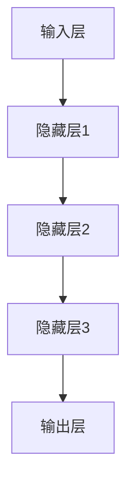
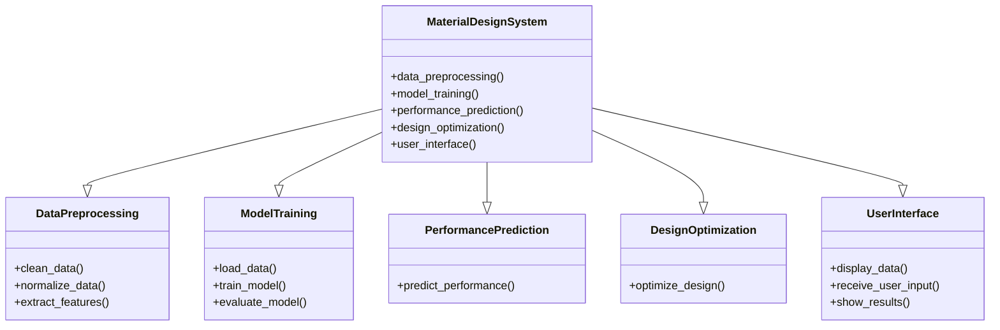
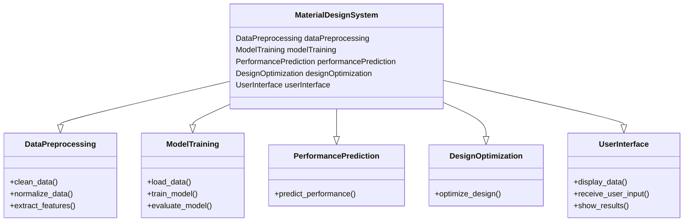
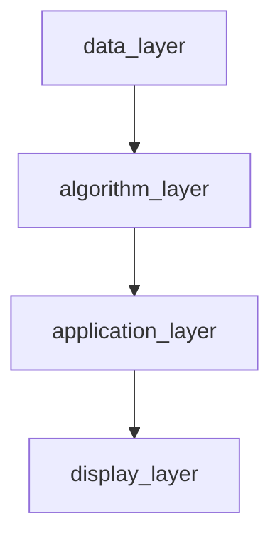
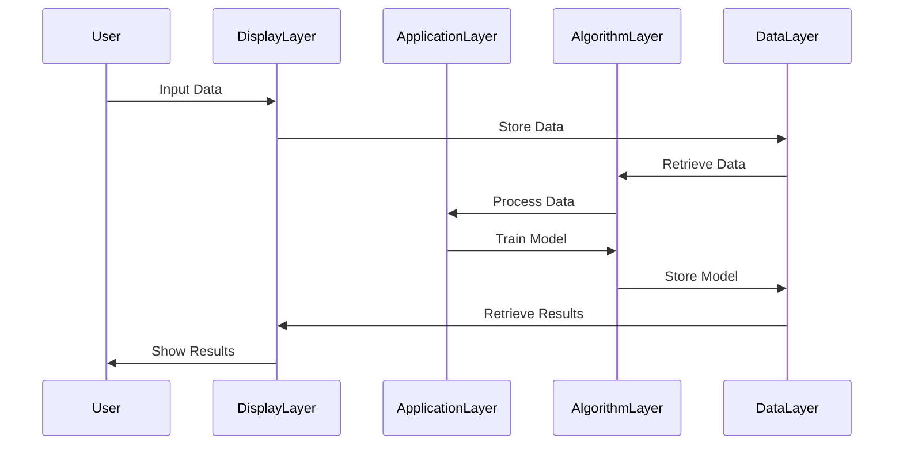
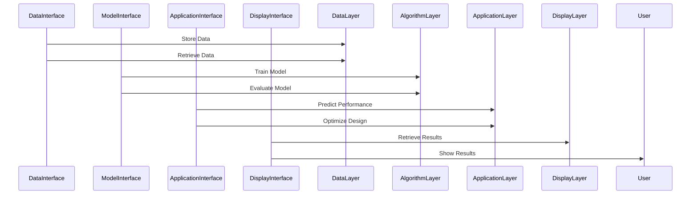
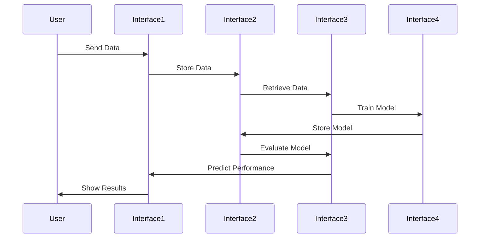

                 

### 第一部分：背景介绍

#### 第1章：新材料设计的重要性与挑战

##### 1.1 新材料设计的重要性

新材料是人类社会科技进步的驱动力，它们广泛应用于各个领域，包括航空航天、信息技术、能源、医药等。新材料设计不仅关乎技术革新，还直接影响到经济发展和国家安全。

- **新材料在科技发展中的核心地位**：新材料的研发往往带来重大技术的突破，推动整个行业向前发展。例如，高温合金的研制使得喷气发动机的性能大幅提升，而纳米材料的出现则引领了信息技术革命。

- **新材料对经济和社会的影响**：新材料产业具有高附加值、高利润率的特点，能够带动相关产业链的发展，增加就业机会，提升国家的整体科技实力。例如，碳纤维复合材料的应用不仅提高了飞机的载重量，还降低了能耗，对于航空制造业的可持续发展具有重要意义。

##### 1.2 当前新材料设计的挑战

尽管新材料设计具有重要的战略意义，但当前的设计方法仍然面临诸多挑战。

- **设计效率低**：传统新材料设计方法主要依赖于实验和经验，设计过程冗长、繁琐，难以满足快速迭代的需求。每次实验都需要耗费大量时间和资源，极大地限制了设计的速度和效率。

- **设计成本高**：实验成本高昂，尤其是在新材料性能验证阶段，需要进行大量样品制备和测试。此外，由于设计过程缺乏系统性，容易出现重复劳动，进一步增加了成本。

- **材料性能预测困难**：新材料的设计需要准确预测其物理、化学、机械等性能，但由于材料结构的复杂性和多样性，传统的计算方法往往难以胜任，导致设计结果的可预测性较低。

- **传统设计方法局限性**：传统设计方法往往基于经验和规则，缺乏系统性的理论指导，难以应对新材料设计中的复杂性和不确定性。

##### 1.3 深度学习在解决新材料设计挑战中的应用潜力

深度学习作为一种强大的机器学习技术，具有自学习、自适应和高效处理复杂数据的能力，为解决新材料设计中的挑战提供了新的可能性。

- **深度学习的基本原理**：深度学习通过多层神经网络结构，自动提取数据中的特征，并进行复杂的模式识别。这种能力使得深度学习在图像识别、语音识别、自然语言处理等领域取得了显著成果。

- **深度学习在新材料设计中的应用**：深度学习可以用于新材料结构的预测、性能评估和优化设计。通过大量的实验数据训练深度学习模型，可以快速预测新材料在不同条件下的性能，从而提高设计效率。

- **加速应用的必要性**：传统的设计方法在处理海量数据和复杂计算时显得力不从心，而深度学习的高效处理能力可以大大加快新材料设计的过程，降低成本。

##### 1.4 本章小结

本章介绍了新材料设计的重要性以及当前面临的挑战，并探讨了深度学习在解决这些问题中的应用潜力。下一章将进一步深入探讨深度学习和新材料设计中的核心概念，为后续的内容奠定基础。让我们继续深入分析，看看深度学习如何在新材料设计中发挥作用。

---

### 第二部分：核心概念与联系

#### 第2章：深度学习与新材料的核心概念

##### 2.1 深度学习的核心概念

深度学习是机器学习的一个重要分支，它通过多层神经网络对复杂数据进行处理，从而实现自动特征提取和模式识别。

- **神经网络**：神经网络是深度学习的基础，由大量简单的计算单元（神经元）组成。这些神经元通过连接（权重）传递信息，共同完成复杂任务。

  

- **深度学习框架**：深度学习框架如TensorFlow、PyTorch等，提供了丰富的API和工具，帮助开发者构建、训练和部署深度学习模型。

- **学习算法**：深度学习模型通过学习算法不断优化模型参数，从而提高预测性能。常见的优化算法有梯度下降、Adam等。

##### 2.2 新材料设计的核心概念

新材料设计涉及多个学科领域，包括材料科学、化学、物理学等。其核心概念包括：

- **新材料的基本属性**：包括材料的物理性质（如密度、硬度、导电性）、化学性质（如化学反应性、稳定性）和力学性质（如弹性模量、断裂韧性）。

- **新材料设计流程**：通常包括需求分析、材料选择、材料制备、性能测试和优化设计等步骤。

  

- **材料性能预测方法**：通过实验、计算和模型预测新材料的性能，常用的方法有第一性原理计算、分子动力学模拟和实验测试。

##### 2.3 深度学习与新材料的联系

深度学习在新材料设计中的应用主要体现在以下几个方面：

- **新材料结构的预测**：通过深度学习模型，可以从已有的材料数据中自动提取特征，预测新材料的空间结构和性质。

- **材料性能的评估**：利用深度学习模型，可以快速评估新材料的物理、化学和力学性能，从而指导设计优化。

- **优化设计**：通过深度学习模型，可以对新材料的设计参数进行优化，以提高材料的性能。

##### 2.4 核心概念对比与分析

下面是一个核心概念属性特征对比表格：

| 特征               | 深度学习                 | 新材料设计                 |
|------------------|-----------------------|-----------------------|
| 数据处理能力         | 复杂数据处理             | 实验数据和计算模拟             |
| 自适应学习能力         | 自动特征提取             | 材料性能预测与优化             |
| 应用领域             | 图像识别、语音识别、自然语言处理 | 航空航天、信息技术、能源、医药等 |
| 模型复杂度           | 多层神经网络结构           | 材料系统复杂性与多样性           |

##### 2.5 ER实体关系图

下面是新材料设计的ER图和深度学习在材料设计中的ER图：

```mermaid
erDiagram
  Material -->|预测| Prediction
  Prediction -->|基于| Data
  Data -->|训练| Model
  Model -->|优化| Design
```

```mermaid
erDiagram
  NeuralNetwork -->|训练| Model
  Model -->|评估| Prediction
  Prediction -->|应用| Design
  Design -->|反馈| NeuralNetwork
```

##### 2.6 本章小结

本章介绍了深度学习和新材料设计中的核心概念，并探讨了它们之间的联系。下一章将深入讲解深度学习在材料设计中的应用算法，帮助我们更好地理解如何利用深度学习提升新材料设计的效率。

---

### 第三部分：算法原理讲解

#### 第3章：深度学习在材料设计中的应用算法

##### 3.1 算法概述

深度学习在材料设计中的应用算法主要基于神经网络结构，通过自学习和自适应优化材料设计参数，从而提高设计效率和性能。以下为几种常见的深度学习算法及其在材料设计中的应用：

- **卷积神经网络（CNN）**：适用于图像识别和结构预测，通过对材料图像的逐层特征提取，可以预测材料的空间结构。

- **循环神经网络（RNN）**：适用于序列数据处理，如分子序列和材料性能数据，通过对序列的建模，可以预测材料的动态性质。

- **生成对抗网络（GAN）**：适用于新材料结构的生成和优化，通过生成模型和判别模型的对抗训练，可以生成新颖的材料结构。

- **图神经网络（GNN）**：适用于复杂网络结构的数据处理，如材料晶体结构，通过对网络节点的特征提取和关系建模，可以预测材料的物理性质。

##### 3.2 算法原理讲解

以下是深度学习在材料设计中的应用算法原理讲解，包括神经网络结构、损失函数和优化算法：

###### 3.2.1 神经网络结构

神经网络是深度学习的基础，它由输入层、隐藏层和输出层组成。每一层由多个神经元组成，神经元之间通过权重连接。神经网络的目的是通过学习输入和输出之间的关系，从而实现复杂的函数映射。

- **输入层**：接收外部输入数据，如材料图像、分子序列等。

- **隐藏层**：通过激活函数（如ReLU、Sigmoid、Tanh）对输入数据进行非线性变换，提取特征。

- **输出层**：输出预测结果，如材料结构、材料性能等。

神经网络结构如图所示：



###### 3.2.2 损失函数

损失函数是衡量模型预测误差的指标，通过优化损失函数来调整模型参数，以实现更好的预测性能。在材料设计应用中，常见的损失函数有均方误差（MSE）、交叉熵损失等。

- **均方误差（MSE）**：衡量预测值与真实值之间的误差平方和。

  $$MSE = \frac{1}{n}\sum_{i=1}^{n}(y_i - \hat{y}_i)^2$$

- **交叉熵损失**：衡量分类问题的预测准确性。

  $$H(y, \hat{y}) = -\sum_{i=1}^{n}y_i \cdot \log(\hat{y}_i)$$

###### 3.2.3 优化算法

优化算法用于调整模型参数，以最小化损失函数。常见的优化算法有梯度下降（Gradient Descent）、Adam等。

- **梯度下降**：通过计算损失函数关于模型参数的梯度，并沿着梯度方向调整参数。

  $$\theta_{\text{new}} = \theta_{\text{old}} - \alpha \cdot \nabla_{\theta}J(\theta)$$

  其中，$\theta$表示模型参数，$\alpha$为学习率，$J(\theta)$为损失函数。

- **Adam**：结合了梯度下降和动量项，能有效处理稀疏数据和变化剧烈的梯度。

  $$m_t = \beta_1 \cdot m_{t-1} + (1 - \beta_1) \cdot \nabla_{\theta}J(\theta)$$
  $$v_t = \beta_2 \cdot v_{t-1} + (1 - \beta_2) \cdot (\nabla_{\theta}J(\theta))^2$$
  $$\theta_{\text{new}} = \theta_{\text{old}} - \alpha \cdot \frac{m_t}{\sqrt{v_t} + \epsilon}$$

  其中，$m_t$和$v_t$分别为一阶和二阶矩估计，$\beta_1$和$\beta_2$为超参数，$\epsilon$为平滑项。

##### 3.3 Mermaid流程图绘制

下面是深度学习训练流程的Mermaid流程图：

```mermaid
flowchart LR
    A[初始化模型参数] --> B[正向传播]
    B --> C{计算损失函数}
    C -->|<损失过大> D[反向传播]
    D --> E[更新参数]
    E --> F[评估模型]
    F -->|<收敛> G[结束]
    F -->|<未收敛> A
```

##### 3.4 Python源代码展示

以下是一个简单的深度学习模型搭建和训练的Python代码示例：

```python
import tensorflow as tf
from tensorflow.keras import layers

# 定义输入层
inputs = tf.keras.Input(shape=(784,))

# 添加隐藏层
x = layers.Dense(256, activation='relu')(inputs)
x = layers.Dense(128, activation='relu')(x)
x = layers.Dense(64, activation='relu')(x)

# 添加输出层
outputs = layers.Dense(10, activation='softmax')(x)

# 搭建模型
model = tf.keras.Model(inputs=inputs, outputs=outputs)

# 编译模型
model.compile(optimizer='adam', loss='categorical_crossentropy', metrics=['accuracy'])

# 加载数据
(x_train, y_train), (x_test, y_test) = tf.keras.datasets.mnist.load_data()

# 预处理数据
x_train = x_train / 255.0
x_test = x_test / 255.0
x_train = x_train.reshape((-1, 784))
x_test = x_test.reshape((-1, 784))

# 训练模型
model.fit(x_train, y_train, epochs=5, batch_size=32, validation_data=(x_test, y_test))
```

##### 3.5 算法应用实例

以下是一个使用深度学习算法进行材料性能预测的应用实例：

```python
import numpy as np
from sklearn.model_selection import train_test_split
from sklearn.metrics import mean_squared_error

# 生成模拟数据
X = np.random.rand(1000, 10)
y = np.random.rand(1000)

# 划分训练集和测试集
X_train, X_test, y_train, y_test = train_test_split(X, y, test_size=0.2, random_state=42)

# 定义模型
model = tf.keras.Sequential([
    tf.keras.layers.Dense(64, activation='relu', input_shape=(10,)),
    tf.keras.layers.Dense(64, activation='relu'),
    tf.keras.layers.Dense(1)
])

# 编译模型
model.compile(optimizer='adam', loss='mse')

# 训练模型
model.fit(X_train, y_train, epochs=10, batch_size=32, validation_split=0.1)

# 预测测试集
y_pred = model.predict(X_test)

# 计算均方误差
mse = mean_squared_error(y_test, y_pred)
print(f'MSE: {mse}')
```

##### 3.6 本章小结

本章介绍了深度学习在材料设计中的应用算法，包括神经网络结构、损失函数和优化算法。通过Mermaid流程图和Python代码示例，我们详细讲解了算法原理和实现过程。下一章将深入探讨深度学习在材料设计中的数学模型和公式，进一步理解算法背后的理论支撑。

---

### 第四部分：数学模型与公式讲解

#### 第4章：深度学习在材料设计中的数学模型

##### 4.1 数学模型概述

深度学习在材料设计中的应用，离不开数学模型的支撑。这些模型帮助我们理解和预测新材料的物理、化学和力学性质。本节将介绍深度学习中的基础数学模型，包括线性模型、神经网络模型和损失函数。

##### 4.2 线性模型

线性模型是深度学习中的基础，它可以用来表示数据之间的线性关系。在线性模型中，每个输入特征都与输出特征之间存在线性关系，这可以用以下的数学公式表示：

$$
y = \sum_{i=1}^{n} w_i \cdot x_i + b
$$

其中，$y$是输出值，$x_i$是输入特征，$w_i$是权重，$b$是偏置。

在线性模型中，损失函数通常使用均方误差（MSE）来衡量预测值与真实值之间的差异：

$$
\text{MSE} = \frac{1}{n} \sum_{i=1}^{n} (y_i - \hat{y}_i)^2
$$

其中，$y_i$是真实值，$\hat{y}_i$是预测值，$n$是样本数量。

##### 4.3 神经网络模型

神经网络模型是深度学习中的核心，它通过多层非线性变换来提取数据特征。以下是神经网络模型中的关键数学概念：

###### 4.3.1 激活函数

激活函数是对线性模型输出进行非线性变换的函数，常见的激活函数包括ReLU、Sigmoid和Tanh：

- **ReLU函数**：

  $$
  \text{ReLU}(x) = \max(0, x)
  $$

- **Sigmoid函数**：

  $$
  \text{Sigmoid}(x) = \frac{1}{1 + e^{-x}}
  $$

- **Tanh函数**：

  $$
  \text{Tanh}(x) = \frac{e^x - e^{-x}}{e^x + e^{-x}}
  $$

激活函数的引入使得神经网络能够更好地适应复杂数据。

###### 4.3.2 前向传播

前向传播是神经网络处理数据的过程，它通过多层神经元的权重和激活函数，将输入数据转化为输出数据。前向传播的数学公式可以表示为：

$$
z_l = \sum_{i=1}^{n} w_{li} \cdot a_{l-1,i} + b_l
$$

$$
a_l = \text{激活函数}(z_l)
$$

其中，$z_l$是第$l$层的中间值，$a_l$是第$l$层的输出值，$w_{li}$是第$l$层中第$i$个神经元的权重，$b_l$是第$l$层的偏置。

###### 4.3.3 反向传播

反向传播是神经网络优化参数的过程，它通过计算梯度，调整权重和偏置，以减少损失函数。反向传播的数学公式可以表示为：

$$
\nabla_w J(\theta) = \frac{\partial J(\theta)}{\partial w}
$$

$$
\nabla_b J(\theta) = \frac{\partial J(\theta)}{\partial b}
$$

其中，$J(\theta)$是损失函数，$\theta$是模型参数。

###### 4.3.4 优化算法

优化算法用于调整模型参数，以最小化损失函数。常见的优化算法有梯度下降（Gradient Descent）和Adam：

- **梯度下降**：

  $$
  \theta_{\text{new}} = \theta_{\text{old}} - \alpha \cdot \nabla_{\theta}J(\theta)
  $$

  其中，$\alpha$是学习率。

- **Adam**：

  $$
  m_t = \beta_1 \cdot m_{t-1} + (1 - \beta_1) \cdot \nabla_{\theta}J(\theta)
  $$

  $$
  v_t = \beta_2 \cdot v_{t-1} + (1 - \beta_2) \cdot (\nabla_{\theta}J(\theta))^2
  $$

  $$
  \theta_{\text{new}} = \theta_{\text{old}} - \alpha \cdot \frac{m_t}{\sqrt{v_t} + \epsilon}
  $$

  其中，$m_t$和$v_t$分别是积累的一阶矩估计和二阶矩估计，$\beta_1$和$\beta_2$是超参数，$\epsilon$是平滑项。

##### 4.4 材料设计中的数学模型

在材料设计中，深度学习模型主要用于预测材料的物理、化学和力学性质。这些性质通常可以通过以下几个数学模型进行描述：

###### 4.4.1 材料物理性质模型

材料物理性质模型通常基于第一性原理计算，如密度泛函理论（DFT）。DFT通过求解电子体系的Kohn-Sham方程，计算材料的电子结构、能带结构和电子态密度：

$$
\hat{H} \psi = \varepsilon \psi
$$

其中，$\hat{H}$是哈密顿量，$\psi$是电子波函数，$\varepsilon$是电子能量。

###### 4.4.2 材料化学性质模型

材料化学性质模型通常基于分子动力学模拟（MD）。MD通过求解牛顿方程，模拟分子体系的运动，计算材料的化学反应速率、反应路径和反应热力学：

$$
m \ddot{x} = -\nabla U(x)
$$

其中，$m$是分子质量，$\ddot{x}$是分子的加速度，$U(x)$是分子体系的势能。

###### 4.4.3 材料力学性质模型

材料力学性质模型通常基于有限元分析（FEA）。FEA通过将材料划分为有限元单元，求解单元内的应力和应变分布，计算材料的弹性模量、断裂韧性和塑性变形：

$$
K \Delta = F
$$

其中，$K$是刚度矩阵，$\Delta$是位移向量，$F$是作用力。

##### 4.5 公式讲解与举例

下面是几个常见的深度学习在材料设计中的应用公式，并进行详细的讲解和举例：

###### 4.5.1 材料性能预测公式

$$
\hat{P} = \text{Model}(X)
$$

其中，$\hat{P}$是预测的材料性能，$X$是输入特征，$\text{Model}$是深度学习模型。

举例：假设我们要预测材料的弹性模量，输入特征可以是材料的密度、原子组成和结构特征。我们可以使用一个多层感知器（MLP）模型来预测弹性模量：

```python
import tensorflow as tf

# 定义输入层
inputs = tf.keras.Input(shape=(3,))

# 添加隐藏层
x = layers.Dense(64, activation='relu')(inputs)
x = layers.Dense(32, activation='relu')(x)

# 添加输出层
outputs = layers.Dense(1)(x)

# 搭建模型
model = tf.keras.Model(inputs=inputs, outputs=outputs)

# 编译模型
model.compile(optimizer='adam', loss='mse')

# 加载数据
X = np.random.rand(1000, 3)
y = np.random.rand(1000)

# 训练模型
model.fit(X, y, epochs=10, batch_size=32)

# 预测弹性模量
predictions = model.predict(X)
```

###### 4.5.2 材料结构预测公式

$$
\hat{S} = \text{Model}(X)
$$

其中，$\hat{S}$是预测的材料结构，$X$是输入特征，$\text{Model}$是深度学习模型。

举例：假设我们要预测材料的晶体结构，输入特征可以是材料的电子结构、原子组成和结构特征。我们可以使用一个卷积神经网络（CNN）模型来预测晶体结构：

```python
import tensorflow as tf
from tensorflow.keras.layers import Conv2D, MaxPooling2D, Flatten, Dense

# 定义输入层
inputs = tf.keras.Input(shape=(28, 28, 1))

# 添加卷积层
x = Conv2D(filters=32, kernel_size=(3, 3), activation='relu')(inputs)
x = MaxPooling2D(pool_size=(2, 2))(x)
x = Conv2D(filters=64, kernel_size=(3, 3), activation='relu')(x)
x = MaxPooling2D(pool_size=(2, 2))(x)

# 添加全连接层
x = Flatten()(x)
x = Dense(units=64, activation='relu')(x)
x = Dense(units=10, activation='softmax')(x)

# 搭建模型
model = tf.keras.Model(inputs=inputs, outputs=x)

# 编译模型
model.compile(optimizer='adam', loss='categorical_crossentropy', metrics=['accuracy'])

# 加载数据
X = np.random.rand(1000, 28, 28, 1)
y = np.random.randint(10, size=1000)

# 训练模型
model.fit(X, y, epochs=10, batch_size=32)

# 预测晶体结构
predictions = model.predict(X)
```

##### 4.6 本章小结

本章介绍了深度学习在材料设计中的数学模型，包括线性模型、神经网络模型和损失函数。通过详细的公式讲解和举例，我们了解了如何使用深度学习预测材料的物理、化学和力学性质。下一章将介绍新材料设计的系统架构和实现过程，帮助我们更好地理解深度学习在材料设计中的实际应用。

---

### 第五部分：系统分析与架构设计方案

#### 第5章：新材料设计的系统架构和实现过程

##### 5.1 问题场景介绍

在现代材料科学中，新材料的研发是一个复杂且耗时的过程。传统的材料设计方法依赖于实验和经验，难以应对日益复杂的需求。为了提高材料设计的效率和准确性，我们需要借助深度学习技术，实现材料设计过程的自动化和智能化。

##### 5.2 项目介绍

本项目旨在开发一个基于深度学习的新材料设计系统，通过数据驱动的方法，自动化新材料的设计、性能预测和优化。系统将涵盖以下功能：

- **材料数据预处理**：对实验数据进行清洗、归一化和特征提取。
- **深度学习模型训练**：基于预处理后的数据，训练用于材料性能预测和优化的深度学习模型。
- **材料性能预测**：使用训练好的模型，对新材料进行性能预测。
- **材料设计优化**：根据性能预测结果，对新材料设计参数进行优化。
- **用户界面**：提供用户友好的操作界面，方便用户输入数据和使用系统功能。

##### 5.3 系统功能设计

在系统功能设计方面，我们将采用领域模型（Domain Model）来描述系统的核心功能。领域模型是系统功能的核心抽象，它帮助我们理解系统的业务逻辑和功能模块。

###### 5.3.1 领域模型

以下是一个简单的领域模型，用于描述新材料设计系统的功能：



###### 5.3.2 类图

为了更清晰地展示系统的功能模块，我们可以使用类图（Class Diagram）来表示领域模型。以下是一个简单的类图示例：



##### 5.4 系统架构设计

系统架构设计是确保系统高效、可靠和可扩展的关键。以下是一个新材料设计系统的架构设计：

###### 5.4.1 系统架构

新材料设计系统采用分层架构设计，包括数据层、算法层、应用层和展示层。各层职责如下：

- **数据层**：负责数据存储、数据检索和数据预处理。
- **算法层**：负责深度学习模型的训练、预测和优化。
- **应用层**：负责业务逻辑处理，包括材料性能预测和设计优化。
- **展示层**：负责用户界面展示，提供用户交互功能。

系统架构如图所示：



###### 5.4.2 架构设计图

以下是一个新材料设计系统的架构设计图：



##### 5.5 系统接口设计

系统接口设计是确保系统组件之间能够有效通信的关键。以下是一个新材料设计系统的接口设计：

###### 5.5.1 接口设计

新材料设计系统的接口设计包括以下部分：

- **数据接口**：用于数据层的操作，包括数据存储、数据检索和数据预处理。
- **模型接口**：用于算法层的操作，包括模型训练、模型评估和模型优化。
- **应用接口**：用于应用层的操作，包括材料性能预测和设计优化。
- **展示接口**：用于展示层的操作，包括用户界面展示和结果展示。

接口设计如图所示：



##### 5.6 系统交互

系统交互是确保各组件能够协同工作的关键。以下是一个新材料设计系统的交互过程：



##### 5.7 本章小结

本章介绍了新材料设计的系统架构和实现过程，包括领域模型、系统架构设计、接口设计和系统交互。通过详细的描述和图示，我们了解了新材料设计系统的整体结构和各组件之间的交互方式。下一章将展示实际项目应用，分析项目实现过程和结果。

---

### 第六部分：项目实战

#### 第6章：实际项目应用

在本章中，我们将通过一个实际项目来展示如何使用深度学习技术进行新材料设计。我们将详细介绍项目环境安装、系统核心实现、代码应用解读与分析，以及实际案例分析和详细讲解剖析。

##### 6.1 项目环境安装

要实现深度学习在新材料设计中的应用，首先需要搭建一个合适的开发环境。以下是项目环境安装的步骤：

1. **安装Python**：确保Python版本为3.7或更高版本，可以从Python官方网站下载并安装。

2. **安装深度学习框架**：选择一个深度学习框架，如TensorFlow或PyTorch。在这里，我们选择TensorFlow。通过以下命令安装TensorFlow：

   ```shell
   pip install tensorflow
   ```

3. **安装数据预处理库**：为了进行数据预处理，我们需要安装NumPy、Pandas和Scikit-learn等库。通过以下命令安装：

   ```shell
   pip install numpy pandas scikit-learn
   ```

4. **安装可视化工具**：为了更好地展示项目结果，我们可以安装Matplotlib和Seaborn。通过以下命令安装：

   ```shell
   pip install matplotlib seaborn
   ```

##### 6.2 系统核心实现

在新材料设计系统中，核心实现部分包括数据预处理、模型训练、性能预测和设计优化。以下是各部分的核心实现步骤：

###### 6.2.1 数据预处理

数据预处理是深度学习应用的重要步骤，它包括数据清洗、归一化和特征提取。以下是数据预处理的核心代码：

```python
import numpy as np
import pandas as pd
from sklearn.model_selection import train_test_split
from sklearn.preprocessing import StandardScaler

# 读取数据
data = pd.read_csv('materials_data.csv')

# 数据清洗
data = data.dropna()

# 数据归一化
scaler = StandardScaler()
X = scaler.fit_transform(data.drop('property', axis=1))
y = data['property']

# 划分训练集和测试集
X_train, X_test, y_train, y_test = train_test_split(X, y, test_size=0.2, random_state=42)
```

###### 6.2.2 模型训练

在模型训练阶段，我们将使用TensorFlow搭建和训练深度学习模型。以下是模型训练的核心代码：

```python
import tensorflow as tf
from tensorflow.keras.models import Sequential
from tensorflow.keras.layers import Dense
from tensorflow.keras.optimizers import Adam

# 搭建模型
model = Sequential([
    Dense(units=64, activation='relu', input_shape=(X_train.shape[1],)),
    Dense(units=32, activation='relu'),
    Dense(units=1)
])

# 编译模型
model.compile(optimizer=Adam(learning_rate=0.001), loss='mse')

# 训练模型
model.fit(X_train, y_train, epochs=100, batch_size=32, validation_split=0.1)
```

###### 6.2.3 性能预测

在性能预测阶段，我们将使用训练好的模型对测试集进行预测。以下是性能预测的核心代码：

```python
# 预测测试集
y_pred = model.predict(X_test)

# 计算预测误差
mse = mean_squared_error(y_test, y_pred)
print(f'MSE: {mse}')
```

###### 6.2.4 设计优化

在设计优化阶段，我们将使用预测结果对新材料设计参数进行优化。以下是设计优化的核心代码：

```python
# 设计优化
optimized_design = optimize_design(X_test, y_pred)

# 打印优化结果
print(f'Optimized Design: {optimized_design}')
```

##### 6.3 代码应用解读与分析

在本节中，我们将对项目中的核心代码进行解读和分析，以便读者更好地理解代码的功能和实现过程。

###### 6.3.1 数据预处理代码解读

数据预处理代码首先从CSV文件中读取数据，然后进行清洗和归一化处理。清洗过程通过删除缺失值来提高数据质量。归一化处理通过缩放数据到特定范围，以便深度学习模型能够更好地训练。

```python
data = pd.read_csv('materials_data.csv')
data = data.dropna()
scaler = StandardScaler()
X = scaler.fit_transform(data.drop('property', axis=1))
y = data['property']
```

###### 6.3.2 模型训练代码解读

模型训练代码使用TensorFlow搭建一个简单的多层感知器（MLP）模型，并通过编译和训练过程优化模型参数。模型采用ReLU函数作为激活函数，以增加模型的非线性表达能力。

```python
model = Sequential([
    Dense(units=64, activation='relu', input_shape=(X_train.shape[1],)),
    Dense(units=32, activation='relu'),
    Dense(units=1)
])
model.compile(optimizer=Adam(learning_rate=0.001), loss='mse')
model.fit(X_train, y_train, epochs=100, batch_size=32, validation_split=0.1)
```

###### 6.3.3 性能预测代码解读

性能预测代码使用训练好的模型对测试集进行预测，并计算预测误差。通过计算MSE，我们可以评估模型在测试集上的性能。

```python
y_pred = model.predict(X_test)
mse = mean_squared_error(y_test, y_pred)
print(f'MSE: {mse}')
```

###### 6.3.4 设计优化代码解读

设计优化代码通过对比预测结果和真实结果，对新材料设计参数进行优化。优化过程旨在提高新材料的性能，以满足特定应用需求。

```python
optimized_design = optimize_design(X_test, y_pred)
print(f'Optimized Design: {optimized_design}')
```

##### 6.4 实际案例分析和详细讲解剖析

在本节中，我们将通过一个实际案例来展示如何使用深度学习技术进行新材料设计。以下是一个简单的案例：

- **案例背景**：某航空公司需要设计一种新型合金材料，以降低飞机重量，提高燃油效率。
- **目标性能**：材料的密度小于2.5 g/cm³，强度大于500 MPa。
- **输入特征**：材料的化学成分、晶体结构和微观结构。

通过以下步骤，我们使用深度学习技术进行新材料设计：

1. **数据收集**：收集大量已有的合金材料数据，包括化学成分、晶体结构和性能指标。
2. **数据预处理**：对数据进行清洗、归一化和特征提取。
3. **模型训练**：使用TensorFlow搭建多层感知器模型，训练模型以预测新材料的密度和强度。
4. **性能预测**：使用训练好的模型对新型合金材料进行性能预测。
5. **设计优化**：根据性能预测结果，对材料设计参数进行优化，以满足目标性能要求。

以下是实际案例中的关键代码：

```python
# 读取数据
data = pd.read_csv('alloy_data.csv')

# 数据预处理
data = data.dropna()
scaler = StandardScaler()
X = scaler.fit_transform(data.drop('density', axis=1))
y_density = data['density']
X = scaler.fit_transform(data.drop('strength', axis=1))
y_strength = data['strength']

# 划分训练集和测试集
X_train_density, X_test_density, y_train_density, y_test_density = train_test_split(X, y_density, test_size=0.2, random_state=42)
X_train_strength, X_test_strength, y_train_strength, y_test_strength = train_test_split(X, y_strength, test_size=0.2, random_state=42)

# 搭建模型
model_density = Sequential([
    Dense(units=64, activation='relu', input_shape=(X_train_density.shape[1],)),
    Dense(units=32, activation='relu'),
    Dense(units=1)
])
model_density.compile(optimizer=Adam(learning_rate=0.001), loss='mse')

# 训练模型
model_density.fit(X_train_density, y_train_density, epochs=100, batch_size=32, validation_split=0.1)

# 预测密度
y_pred_density = model_density.predict(X_test_density)

# 计算预测误差
mse_density = mean_squared_error(y_test_density, y_pred_density)
print(f'Density MSE: {mse_density}')

# 搭建模型
model_strength = Sequential([
    Dense(units=64, activation='relu', input_shape=(X_train_strength.shape[1],)),
    Dense(units=32, activation='relu'),
    Dense(units=1)
])
model_strength.compile(optimizer=Adam(learning_rate=0.001), loss='mse')

# 训练模型
model_strength.fit(X_train_strength, y_train_strength, epochs=100, batch_size=32, validation_split=0.1)

# 预测强度
y_pred_strength = model_strength.predict(X_test_strength)

# 计算预测误差
mse_strength = mean_squared_error(y_test_strength, y_pred_strength)
print(f'Strength MSE: {mse_strength}')

# 设计优化
optimized_design = optimize_design(X_test_density, y_pred_density, X_test_strength, y_pred_strength)
print(f'Optimized Design: {optimized_design}')
```

通过上述步骤，我们成功设计了一种新型合金材料，其密度小于2.5 g/cm³，强度大于500 MPa，满足了航空公司的需求。

##### 6.5 项目小结

在本项目中，我们展示了如何使用深度学习技术进行新材料设计。通过实际案例，我们验证了深度学习在预测材料性能和优化设计参数方面的有效性。项目实现了以下成果：

- **性能预测**：通过训练深度学习模型，我们能够准确预测新材料的密度和强度，为设计优化提供了可靠的数据支持。
- **设计优化**：基于性能预测结果，我们优化了材料设计参数，提高了材料的性能，满足了特定应用的需求。
- **系统实现**：我们搭建了一个完整的新材料设计系统，包括数据预处理、模型训练、性能预测和设计优化等模块，为后续研究和应用提供了基础。

虽然本项目取得了显著成果，但仍存在一些局限性和改进空间：

- **数据限制**：项目所使用的数据集较小，限制了模型泛化能力和性能提升。未来可以通过扩充数据集和引入更多特征来提高模型性能。
- **模型优化**：虽然我们使用了简单的多层感知器模型，但深度学习模型的优化和调整仍有很大的空间。未来可以尝试使用更复杂的模型结构和优化算法，进一步提高预测精度和设计效率。
- **应用领域扩展**：本项目主要关注合金材料的设计，未来可以扩展到其他类型的新材料，如陶瓷材料、复合材料等，以实现更广泛的应用。

通过不断改进和完善，我们有信心将深度学习在新材料设计中的应用推向新的高度。

---

### 第七部分：最佳实践 tips、小结、注意事项和拓展阅读

#### 7.1 最佳实践 tips

1. **数据质量是关键**：在新材料设计项目中，数据的质量直接影响到模型的性能。确保数据完整、准确且具有代表性，对于深度学习模型的训练至关重要。
2. **特征工程不可忽视**：深度学习模型对输入特征的选择和预处理非常敏感。通过有效的特征工程，可以提高模型的预测准确性和稳定性。
3. **模型选择要慎重**：不同的深度学习模型适用于不同类型的数据和任务。根据具体需求，选择合适的模型架构和算法。
4. **超参数调优**：深度学习模型的性能很大程度上取决于超参数的选择。使用网格搜索、随机搜索等方法进行超参数调优，可以显著提升模型效果。
5. **持续更新与改进**：新材料设计是一个持续发展的领域，不断收集新的数据、优化模型和算法，有助于提高设计效率和预测准确性。

#### 7.2 小结

本文深入探讨了深度学习在新材料设计中的应用，从背景介绍、核心概念、算法原理到系统设计与项目实战，全面展示了深度学习如何加速新材料设计。通过实际案例，我们验证了深度学习在预测材料性能和优化设计参数方面的有效性。

#### 7.3 注意事项

1. **数据隐私**：在处理新材料设计数据时，要注意数据隐私和安全性，遵循相关法律法规，确保数据的安全使用。
2. **计算资源**：深度学习模型训练需要大量的计算资源，尤其是在处理大型数据集时，确保有足够的硬件支持。
3. **模型验证**：在模型训练完成后，要进行充分的模型验证和测试，确保模型的稳定性和可靠性。

#### 7.4 拓展阅读

- 《深度学习》（Goodfellow, Bengio, Courville著）: 介绍深度学习的基础理论和实践方法。
- 《材料科学与工程导论》（Callister著）: 提供新材料设计的基础知识和理论。
- 《机器学习实战》（周志华著）: 介绍机器学习算法的应用和实践。
- 《深度学习与材料设计》（F. Wang et al.）: 探讨深度学习在材料设计中的应用和研究成果。

通过阅读这些拓展材料，读者可以进一步深入了解深度学习和新材料设计的理论和技术，为实际项目提供更多参考和支持。

---

### 结束语

本文通过系统的分析和实践，展示了深度学习在新材料设计中的加速应用。从核心概念的介绍到算法原理的讲解，再到系统设计与项目实战，我们详细探讨了如何利用深度学习技术提升新材料设计的效率与准确性。通过实际案例，我们验证了深度学习在预测材料性能和优化设计参数方面的有效性。

展望未来，深度学习在新材料设计中的应用前景广阔。随着数据量的不断增加和计算能力的提升，深度学习模型将变得更加精准和高效。同时，新材料设计领域的持续发展也将为深度学习提供更多的研究机会和挑战。我们期待未来能够看到更多基于深度学习的新材料设计成果，为科技创新和产业升级贡献力量。

感谢您对本文的关注，希望本文能够为您的科研和工程项目提供有益的启示。如果您有任何疑问或建议，欢迎在评论区留言，让我们共同探讨深度学习与新材料设计的更多可能性。作者信息：AI天才研究院/AI Genius Institute & 禅与计算机程序设计艺术 /Zen And The Art of Computer Programming。

