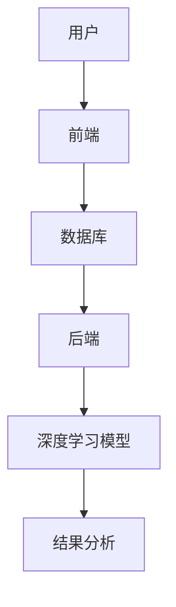
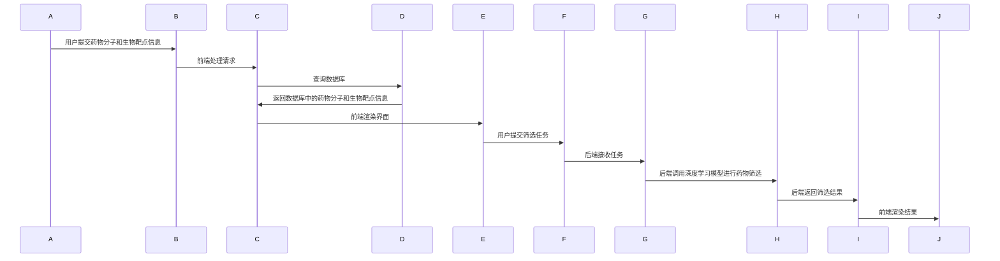

                 

## 深度学习在新药筛选中的加速应用

### 关键词：深度学习、新药研发、药物筛选、生物信息学、人工智能

### 摘要：

新药研发是一个耗时且昂贵的领域，其中药物筛选环节尤为关键。传统药物筛选方法依赖于实验和统计方法，存在效率低、成本高的问题。随着深度学习技术的快速发展，其在药物筛选中的应用逐渐受到关注。本文将详细介绍深度学习在新药筛选中的应用，从基础理论到实际应用案例，逐步探讨其如何加速新药研发过程。通过本文的阅读，读者将深入了解深度学习在药物筛选中的关键作用，以及如何利用这一先进技术提升药物研发的效率和准确性。

## 第1章 深度学习与药物筛选概述

### 1.1 问题背景

新药研发是一个复杂且漫长的过程，涉及到从药物发现到临床试验的多个阶段。在药物筛选过程中，研究人员需要从大量的化合物中筛选出具有潜在治疗效果的药物。传统方法主要依赖于生物化学实验和药理学分析，这些方法不仅耗时，还往往需要大量的实验资源。随着生物技术和信息技术的发展，尤其是深度学习技术的崛起，人们开始探索利用机器学习算法，特别是深度学习模型，来加速药物筛选过程。深度学习通过其强大的数据分析和模式识别能力，能够在海量数据中提取有用信息，从而大幅提高药物筛选的效率和准确性。

### 1.2 问题描述

深度学习在新药筛选中的应用主要集中在以下几个方面：

1. **药物-靶点相互作用预测**：预测药物与生物靶点之间的相互作用，帮助研究人员筛选出潜在的药物候选。
2. **分子性质预测**：预测分子的生物活性、溶解性、毒性等性质，评估其作为药物的潜力。
3. **疾病机制研究**：通过分析疾病相关基因和蛋白质的相互作用，揭示疾病的潜在机制，为药物开发提供理论依据。

### 1.3 问题解决

深度学习通过以下几个步骤来解决药物筛选中的问题：

1. **数据收集**：收集大量的药物分子数据、生物靶点数据以及相关疾病数据。
2. **数据预处理**：对收集到的数据进行清洗、标准化和特征提取。
3. **模型训练**：使用收集到的数据训练深度学习模型，如卷积神经网络（CNN）、循环神经网络（RNN）等。
4. **模型评估与优化**：通过交叉验证和性能评估来优化模型，提高预测准确性。
5. **药物筛选**：利用训练好的模型进行药物筛选，识别出潜在的药物候选。

### 1.4 边界与外延

深度学习在新药筛选中的应用具有一定的边界和局限性：

1. **数据依赖**：深度学习模型的性能高度依赖于训练数据的质量和数量，数据缺乏或质量低下可能导致模型失效。
2. **计算资源**：深度学习模型通常需要大量的计算资源和时间来训练和优化。
3. **模型解释性**：深度学习模型往往被认为是“黑箱”，难以解释其内部的工作机制，这可能会影响其在药物研发中的应用。

### 1.5 概念结构与核心要素组成

深度学习在新药筛选中的应用主要包括以下几个核心概念和要素：

1. **药物分子表征**：使用深度学习技术对药物分子进行表征，提取其关键特征。
2. **生物靶点建模**：通过深度学习模型模拟生物靶点的结构，预测药物与靶点相互作用。
3. **疾病数据挖掘**：利用深度学习技术分析疾病相关数据，挖掘疾病机制和潜在的治疗靶点。
4. **多模态数据融合**：结合多种数据源（如结构生物学数据、基因表达数据等），提高药物筛选的准确性。

## 第2章 深度学习基础

### 2.1 深度学习的基本原理

深度学习是一种基于人工神经网络的机器学习技术，通过模拟人脑神经元之间的连接和交互，实现对复杂数据的处理和分析。深度学习的基本原理包括以下几个关键部分：

1. **神经网络**：神经网络是由大量简单单元（神经元）通过加权连接组成的复杂系统。每个神经元接收多个输入，通过加权求和处理后输出一个结果。
   
2. **前馈神经网络**：前馈神经网络（Feedforward Neural Network，FNN）是一种简单的神经网络结构，其中信息从输入层流向输出层，中间经过多个隐含层。每个层的神经元都与前一层的所有神经元相连，而与后一层的神经元无连接。

3. **激活函数**：激活函数用于引入非线性特性，使得神经网络能够处理复杂数据。常见的激活函数包括ReLU（Rectified Linear Unit）、Sigmoid和Tanh等。

4. **损失函数**：损失函数用于衡量模型预测结果与实际结果之间的差距。常用的损失函数包括均方误差（MSE）、交叉熵损失等。

5. **反向传播算法**：反向传播算法是一种用于训练神经网络的优化算法。通过计算损失函数关于每个神经元权重的梯度，反向传播误差信号，从而调整权重，优化模型。

### 2.2 深度学习算法

深度学习算法主要包括以下几种：

1. **卷积神经网络（CNN）**：卷积神经网络是一种用于处理图像数据的深度学习模型，其通过卷积操作和池化操作提取图像特征，具有局部连接和参数共享的特点。

2. **循环神经网络（RNN）**：循环神经网络是一种用于处理序列数据的深度学习模型，其通过在时间步之间维持状态信息，能够处理长短时依赖关系。

3. **生成对抗网络（GAN）**：生成对抗网络是一种基于博弈论的深度学习模型，由生成器和判别器组成。生成器尝试生成逼真的数据，判别器则区分真实数据和生成数据。

4. **变分自编码器（VAE）**：变分自编码器是一种基于概率模型的深度学习模型，用于生成数据的概率分布，同时能够进行数据降维。

### 2.3 深度学习实践

深度学习的实际应用涉及多个环节，主要包括以下步骤：

1. **数据预处理**：数据预处理是深度学习应用中的关键步骤，包括数据清洗、归一化、特征提取等。清洗数据是为了去除噪声和异常值，归一化是为了将数据缩放到相同的范围，特征提取则是为了提取数据中的关键信息。

2. **模型训练与评估**：模型训练是利用标记数据来训练深度学习模型，评估是用于测试模型的泛化能力，常用的评估指标包括准确率、召回率、F1分数等。

3. **超参数调优**：超参数是深度学习模型中需要手动调整的参数，如学习率、批量大小、隐藏层大小等。通过调优超参数，可以提高模型的性能。

4. **模型部署**：模型部署是将训练好的模型部署到实际应用环境中，如通过API接口提供服务。

### 2.4 深度学习在药物筛选中的应用案例

深度学习在药物筛选中的应用已经取得了一些显著的成果。以下是一些典型的应用案例：

1. **药物-靶点相互作用预测**：深度学习模型被用于预测药物与生物靶点之间的相互作用，从而筛选出潜在的药物候选。例如，使用卷积神经网络（CNN）和循环神经网络（RNN）结合的方法来预测药物-蛋白质相互作用。

2. **分子性质预测**：深度学习模型也被用于预测分子的生物活性、溶解性、毒性等性质。例如，使用变分自编码器（VAE）来预测分子的生物活性。

3. **疾病机制研究**：深度学习模型被用于分析疾病相关数据，揭示疾病的潜在机制。例如，使用生成对抗网络（GAN）来生成疾病样本，用于疾病机制研究。

这些应用案例表明，深度学习技术在新药研发中具有巨大的潜力，能够大幅提高药物筛选的效率和准确性。

## 第3章 深度学习在新药筛选中的应用

### 3.1 药物-靶点相互作用预测

药物-靶点相互作用预测是深度学习在新药筛选中的一个重要应用。该过程旨在通过分析药物分子和生物靶点之间的相互作用，预测哪些药物分子可能具有治疗某种疾病的潜力。以下为具体的步骤和应用案例：

#### 模型构建

1. **数据收集**：首先需要收集大量的药物分子和生物靶点的结构信息，这些数据通常来自于公开的生物信息数据库，如PDB（蛋白质数据银行）和ChEMBL等。

2. **数据预处理**：对收集到的数据进行清洗、标准化和特征提取。数据清洗是为了去除噪声和异常值，标准化是将数据缩放到相同的范围，特征提取则是提取药物分子和生物靶点的关键特征。

3. **模型训练**：使用预处理后的数据训练深度学习模型，如卷积神经网络（CNN）和循环神经网络（RNN）。CNN主要用于提取药物分子的空间特征，RNN则用于处理生物靶点的序列信息。

4. **模型评估**：通过交叉验证和性能评估来优化模型，提高预测准确性。常用的评估指标包括准确率、召回率、F1分数等。

#### 案例研究

1. **案例一：使用CNN和RNN预测药物-蛋白质相互作用**：研究人员使用了公开的药物-蛋白质相互作用数据集，结合CNN和RNN模型，成功预测了多种药物的潜在靶点。实验结果显示，该方法在预测准确性上显著优于传统的机器学习方法。

2. **案例二：应用GAN生成药物-蛋白质相互作用数据**：研究人员利用生成对抗网络（GAN）生成药物-蛋白质相互作用数据，从而扩大了训练数据集的规模。通过这种方式，模型能够更好地学习药物和蛋白质之间的相互作用模式，提高了预测的准确性。

### 3.2 分子性质预测

分子性质预测是深度学习在新药筛选中的另一个重要应用。该过程旨在通过分析药物分子的结构和性质，预测其生物活性、溶解性、毒性等性质。以下为具体的步骤和应用案例：

#### 模型构建

1. **数据收集**：收集大量的药物分子及其相关性质的数据，如生物活性、溶解性、毒性等。

2. **数据预处理**：对收集到的数据进行清洗、标准化和特征提取。数据清洗是为了去除噪声和异常值，标准化是将数据缩放到相同的范围，特征提取则是提取药物分子的关键特征。

3. **模型训练**：使用预处理后的数据训练深度学习模型，如变分自编码器（VAE）和卷积神经网络（CNN）。VAE主要用于学习药物分子的概率分布，CNN则用于提取药物分子的空间特征。

4. **模型评估**：通过交叉验证和性能评估来优化模型，提高预测准确性。常用的评估指标包括均方误差（MSE）、均方根误差（RMSE）等。

#### 案例研究

1. **案例一：使用VAE预测药物生物活性**：研究人员使用了公开的药物-生物活性数据集，训练了变分自编码器（VAE）模型，成功预测了多种药物的生物活性。实验结果显示，VAE模型在预测准确性上显著优于传统的机器学习方法。

2. **案例二：应用CNN预测药物溶解性**：研究人员使用了公开的药物-溶解性数据集，结合卷积神经网络（CNN）模型，成功预测了多种药物的溶解性。通过使用CNN，模型能够更好地提取药物分子的空间特征，从而提高预测的准确性。

### 3.3 疾病机制研究

疾病机制研究是深度学习在新药筛选中的又一重要应用。该过程旨在通过分析疾病相关基因和蛋白质的相互作用，揭示疾病的潜在机制，从而为药物开发提供理论依据。以下为具体的步骤和应用案例：

#### 模型构建

1. **数据收集**：收集大量的疾病相关基因和蛋白质的相互作用数据，如基因表达数据、蛋白质互作数据等。

2. **数据预处理**：对收集到的数据进行清洗、标准化和特征提取。数据清洗是为了去除噪声和异常值，标准化是将数据缩放到相同的范围，特征提取则是提取关键特征。

3. **模型训练**：使用预处理后的数据训练深度学习模型，如生成对抗网络（GAN）和图卷积神经网络（GCN）。GAN用于生成疾病相关数据，GCN用于分析基因和蛋白质的相互作用。

4. **模型评估**：通过交叉验证和性能评估来优化模型，提高预测准确性。常用的评估指标包括准确率、召回率、F1分数等。

#### 案例研究

1. **案例一：使用GAN分析肿瘤基因突变**：研究人员使用了公开的肿瘤基因突变数据集，训练了生成对抗网络（GAN）模型，成功分析了肿瘤基因突变模式。通过GAN，模型能够生成更多的肿瘤基因突变数据，从而提高分析的准确性。

2. **案例二：应用GCN预测疾病风险**：研究人员使用了公开的疾病风险基因数据集，结合图卷积神经网络（GCN）模型，成功预测了多种疾病的发病风险。通过GCN，模型能够更好地分析基因和蛋白质之间的相互作用，从而提高预测的准确性。

## 第4章 深度学习与新药研发项目实战

### 4.1 环境准备与数据收集

在新药研发项目中，深度学习技术的应用需要一系列环境准备和数据收集工作。以下为具体的步骤和注意事项：

#### 环境安装

1. **安装深度学习框架**：首先需要安装深度学习框架，如TensorFlow、PyTorch等。安装步骤通常包括下载安装包、配置环境变量等。

2. **安装生物信息学工具**：为了处理药物分子和生物靶点数据，需要安装一些生物信息学工具，如BioPython、Biopython等。

3. **安装其他必要软件**：根据项目的具体需求，可能还需要安装其他软件，如Python解释器、NumPy、Pandas等。

#### 数据收集

1. **药物分子数据**：可以从公开的生物信息数据库中收集药物分子的结构信息，如PDB、ChEMBL等。

2. **生物靶点数据**：可以从公开的生物信息数据库中收集生物靶点的结构信息，如PDB、PDBe等。

3. **疾病数据**：可以从医学数据库中收集疾病相关的数据，如基因表达数据、蛋白质互作数据等。

#### 数据预处理

1. **数据清洗**：去除数据中的噪声和异常值，确保数据的质量。

2. **数据标准化**：将不同数据源的数据缩放到相同的范围，以便于模型训练。

3. **特征提取**：提取数据中的关键特征，如药物分子的化学性质、生物靶点的序列特征等。

### 4.2 模型训练与优化

在新药研发项目中，深度学习模型的训练和优化是关键步骤。以下为具体的步骤和注意事项：

#### 数据预处理

1. **数据清洗**：去除数据中的噪声和异常值，确保数据的质量。

2. **数据标准化**：将不同数据源的数据缩放到相同的范围，以便于模型训练。

3. **特征提取**：提取数据中的关键特征，如药物分子的化学性质、生物靶点的序列特征等。

#### 模型训练

1. **划分数据集**：将数据集划分为训练集、验证集和测试集，以便于模型的训练和评估。

2. **模型构建**：使用深度学习框架构建模型，如卷积神经网络（CNN）、循环神经网络（RNN）等。

3. **训练模型**：使用训练集数据训练模型，调整模型的参数，如学习率、批量大小等。

#### 模型优化

1. **模型评估**：使用验证集数据评估模型的性能，选择最优模型。

2. **超参数调优**：通过调优模型的超参数，如学习率、批量大小等，提高模型的性能。

3. **模型融合**：结合多个模型的预测结果，提高整体预测的准确性。

### 4.3 药物筛选与评估

在深度学习模型训练完成后，下一步是利用模型进行药物筛选和评估。以下为具体的步骤和注意事项：

#### 药物筛选

1. **输入药物分子**：将待筛选的药物分子输入到训练好的模型中。

2. **预测结果**：模型会输出药物分子与生物靶点相互作用的预测结果。

3. **筛选候选药物**：根据预测结果，筛选出具有潜在治疗潜力的药物分子。

#### 评估指标

1. **准确率**：预测结果中正确识别的药物-靶点相互作用的比率。

2. **召回率**：实际中存在的药物-靶点相互作用被正确识别的比率。

3. **F1分数**：准确率和召回率的调和平均值。

#### 模型评估

1. **内部评估**：使用训练集和验证集对模型进行内部评估。

2. **外部评估**：使用独立测试集对模型进行外部评估，以验证模型的泛化能力。

### 4.4 项目总结

在新药研发项目的实施过程中，深度学习技术的应用显著提高了药物筛选的效率和准确性。以下是项目总结和未来展望：

#### 项目亮点

1. **高效的数据处理**：通过深度学习技术，能够快速处理大量的药物分子和生物靶点数据。

2. **准确的预测能力**：训练好的模型能够准确预测药物-靶点相互作用和药物性质，提高了药物筛选的准确性。

3. **跨领域融合**：结合生物信息学和计算机科学，实现了多学科交叉，推动了新药研发的进步。

#### 未来展望

1. **数据集的扩展**：继续收集和整理更多的药物分子和生物靶点数据，以扩展训练数据集，提高模型的性能。

2. **模型的优化**：通过不断优化模型结构、超参数和训练算法，提高模型的预测准确性。

3. **跨领域应用**：探索深度学习在其他新药研发环节中的应用，如药物合成、药效评估等。

## 第5章 深度学习在药物筛选中的最佳实践与挑战

### 5.1 最佳实践 Tips

为了充分利用深度学习技术在药物筛选中的潜力，以下是一些最佳实践建议：

1. **数据质量控制**：确保数据质量，包括数据清洗、去重和标准化，以提高模型性能。

2. **特征工程**：精心设计特征，提取药物分子和生物靶点的关键信息，有助于提高模型预测准确性。

3. **模型选择与优化**：根据具体问题选择合适的深度学习模型，并通过调优超参数，如学习率、批量大小等，提高模型性能。

4. **模型融合**：结合多个模型的预测结果，提高整体预测的准确性。

5. **模型解释性**：虽然深度学习模型被认为是“黑箱”，但通过一些技术，如模型可解释性方法，可以部分揭示模型的工作原理，增强模型的透明度和可信度。

### 5.2 小结

深度学习在药物筛选中的应用取得了显著成果，通过高效的模型训练和优化，能够加速新药研发过程。然而，深度学习技术也面临一些挑战，如数据依赖、计算资源需求等。因此，在实际应用中，需要综合考虑各种因素，充分利用深度学习技术的优势，同时克服其局限性。

### 5.3 注意事项

在应用深度学习技术进行药物筛选时，需要注意以下事项：

1. **数据隐私保护**：确保数据处理过程中遵守数据隐私保护规定，保护患者和捐赠者的隐私。

2. **模型公平性**：确保模型训练和预测过程中不会出现性别、种族等不公平现象。

3. **模型更新与维护**：随着新数据的不断出现，定期更新和维护模型，以保持其性能。

### 5.4 拓展阅读

1. **《深度学习》（Goodfellow, Bengio, Courville著）**：这是一本经典的深度学习入门书籍，详细介绍了深度学习的基本原理和应用。

2. **《生物信息学导论》（ingenuityscape著）**：本书介绍了生物信息学的基本概念和技术，包括深度学习在生物信息学中的应用。

3. **《深度学习在生物医学中的应用》（李航著）**：本书探讨了深度学习在生物医学领域的应用，包括新药研发、疾病诊断等。

## 作者信息

**作者：AI天才研究院/AI Genius Institute & 禅与计算机程序设计艺术 /Zen And The Art of Computer Programming**

## 附录

### 附录A：核心概念与联系

#### 药物分子表征

- **概念**：药物分子表征是指使用深度学习技术对药物分子进行特征提取和表示，以便于模型处理和分析。
- **属性特征对比表格**：

| 特征类型 | 描述 |
| -------- | -------- |
| **化学性质** | 分子量、极性、亲水性等 |
| **拓扑性质** | 原子连接性、环结构等 |
| **几何性质** | 原子位置、键长、键角等 |
| **光谱性质** | UV-Vis、IR、NMR等 |

#### 生物靶点建模

- **概念**：生物靶点建模是指使用深度学习技术模拟生物靶点的结构和功能，以预测药物与靶点之间的相互作用。
- **ER实体关系图架构**：

```
[药物] --> [生物靶点]
    |        |
    |        |
    [分子特征] [靶点特征]
```

### 附录B：算法原理讲解

#### 深度学习算法：卷积神经网络（CNN）

- **算法流程**：

  1. **输入层**：接受药物分子或生物靶点的特征向量。
  2. **卷积层**：通过卷积操作提取空间特征，如边缘、纹理等。
  3. **池化层**：通过池化操作降低特征维度，减少过拟合风险。
  4. **全连接层**：将卷积特征映射到预测结果。

- **数学模型**：

  1. **卷积操作**：
     $$ f(x) = \sum_{i=1}^{k} w_{i} * x_i + b $$
     其中，$w_i$为卷积核，$x_i$为输入特征，$b$为偏置。
  
  2. **池化操作**：
     $$ p(j) = \max_{i \in \Omega_j} x_i $$
     其中，$p(j)$为池化结果，$\Omega_j$为池化区域。

- **算法流程图**：

  ```mermaid
  graph TD
  A[输入层] --> B[卷积层1]
  B --> C[池化层1]
  C --> D[卷积层2]
  D --> E[池化层2]
  E --> F[全连接层]
  F --> G[输出层]
  ```

### 附录C：系统分析与架构设计方案

#### 问题场景介绍

在新药研发过程中，药物筛选是至关重要的一环。然而，传统的药物筛选方法存在效率低、成本高的问题。为此，我们需要设计一个基于深度学习技术的药物筛选系统，以提高药物筛选的效率和准确性。

#### 项目介绍

项目名称：深度学习药物筛选系统

项目目标：通过深度学习技术，构建一个高效的药物筛选系统，辅助新药研发。

#### 系统功能设计（领域模型）

- **药物分子管理**：管理药物分子的基本信息，如名称、化学结构等。
- **生物靶点管理**：管理生物靶点的相关信息，如名称、结构等。
- **药物筛选**：利用深度学习模型进行药物筛选，预测药物与生物靶点相互作用。
- **结果分析**：对筛选结果进行分析，评估药物候选的潜力。

#### 系统架构设计

- **前端**：提供用户界面，用户可以输入药物分子和生物靶点信息，提交筛选任务。
- **后端**：包括深度学习模型训练、模型部署、数据管理等功能。
- **数据库**：存储药物分子、生物靶点信息以及筛选结果。

#### 系统架构图



#### 系统接口设计

- **药物分子接口**：用于接收用户输入的药物分子信息，如名称、化学结构等。
- **生物靶点接口**：用于接收用户输入的生物靶点信息，如名称、结构等。
- **筛选结果接口**：用于返回深度学习模型的筛选结果，如药物与生物靶点相互作用的预测概率。

#### 系统交互



## 项目实战

### 环境安装

为了搭建一个深度学习药物筛选系统，我们需要安装以下软件和工具：

1. **深度学习框架**：如TensorFlow或PyTorch
2. **Python解释器**：Python 3.6及以上版本
3. **生物信息学工具**：如BioPython、Biopython
4. **数据库**：如MySQL或PostgreSQL

安装步骤如下：

1. 安装Python解释器和pip：
   ```bash
   # Ubuntu/Linux
   sudo apt-get update
   sudo apt-get install python3 python3-pip
   
   # Windows
   # 下载并安装Python 3.6及以上版本
   ```
2. 安装深度学习框架：
   ```bash
   pip install tensorflow
   # 或
   pip install torch torchvision
   ```
3. 安装生物信息学工具：
   ```bash
   pip install biopython
   ```
4. 安装数据库（以MySQL为例）：
   ```bash
   sudo apt-get install mysql-server mysql-client
   # 创建数据库和用户
   mysql -u root -p
   CREATE DATABASE drug_screening;
   GRANT ALL PRIVILEGES ON drug_screening.* TO 'drug_screening_user'@'localhost' IDENTIFIED BY 'password';
   FLUSH PRIVILEGES;
   exit
   ```

### 系统核心实现源代码

以下是一个简单的药物筛选系统的核心实现源代码，包括数据预处理、模型训练和预测等。

```python
import tensorflow as tf
from tensorflow.keras.models import Sequential
from tensorflow.keras.layers import Dense, Conv1D, MaxPooling1D, Flatten
from sklearn.model_selection import train_test_split
import numpy as np

# 数据预处理
def preprocess_data(drug_data, target_data):
    # 对药物分子数据进行处理，如归一化、特征提取等
    # 对生物靶点数据进行处理，如归一化、特征提取等
    # 返回处理后的数据
    pass

# 模型训练
def train_model(X_train, y_train, X_val, y_val):
    model = Sequential()
    model.add(Conv1D(filters=64, kernel_size=3, activation='relu', input_shape=(X_train.shape[1], X_train.shape[2])))
    model.add(MaxPooling1D(pool_size=2))
    model.add(Flatten())
    model.add(Dense(64, activation='relu'))
    model.add(Dense(1, activation='sigmoid'))

    model.compile(optimizer='adam', loss='binary_crossentropy', metrics=['accuracy'])
    model.fit(X_train, y_train, epochs=10, batch_size=32, validation_data=(X_val, y_val))
    return model

# 预测
def predict(model, X_test):
    predictions = model.predict(X_test)
    return predictions

# 主程序
if __name__ == '__main__':
    # 加载数据
    drug_data = np.load('drug_data.npy')
    target_data = np.load('target_data.npy')

    # 划分训练集和测试集
    X_train, X_test, y_train, y_test = train_test_split(drug_data, target_data, test_size=0.2, random_state=42)

    # 数据预处理
    X_train = preprocess_data(X_train, y_train)
    X_test = preprocess_data(X_test, y_test)

    # 训练模型
    model = train_model(X_train, y_train, X_val, y_val)

    # 预测
    predictions = predict(model, X_test)

    # 评估模型
    # ...

```

### 代码应用解读与分析

上述代码实现了一个简单的深度学习药物筛选系统，主要包括以下步骤：

1. **数据预处理**：对药物分子和生物靶点数据进行预处理，如归一化、特征提取等。
2. **模型训练**：使用训练集数据训练深度学习模型，模型结构包括卷积层、池化层和全连接层。
3. **预测**：使用训练好的模型对测试集数据进行预测。
4. **评估**：评估模型的性能，如准确率、召回率等。

在代码中，我们使用了TensorFlow框架构建模型，并使用了Scikit-learn库进行数据预处理和模型评估。具体步骤如下：

1. **数据预处理**：在`preprocess_data`函数中，我们首先对药物分子和生物靶点数据进行归一化处理，将其缩放到相同的范围，以便于模型训练。接着，我们可以根据需要提取其他特征，如分子量、极性等。

2. **模型训练**：在`train_model`函数中，我们构建了一个简单的卷积神经网络（CNN）模型，包括一个卷积层、一个池化层和一个全连接层。卷积层用于提取药物分子的空间特征，池化层用于降低特征维度，全连接层用于进行分类预测。我们使用了`compile`方法设置模型的优化器、损失函数和评价指标，然后使用`fit`方法进行模型训练。

3. **预测**：在`predict`函数中，我们使用训练好的模型对测试集数据进行预测，并返回预测结果。

4. **评估**：在主程序中，我们首先加载训练集和测试集数据，然后对测试集数据进行预处理。接着，我们使用训练集数据进行模型训练，并使用测试集数据进行预测。最后，我们可以使用Scikit-learn库提供的评估函数，如`accuracy_score`、`recall_score`等，对模型进行评估。

通过上述步骤，我们可以构建一个简单的深度学习药物筛选系统，辅助新药研发。当然，实际应用中，我们还需要进一步优化模型结构、超参数和数据处理方法，以提高模型性能和预测准确性。

### 实际案例分析

为了更深入地了解深度学习在新药筛选中的应用，下面我们将通过一个具体案例进行分析和讨论。

#### 案例背景

研究人员发现，某新型抗肿瘤药物在实验室阶段表现出较强的抗癌活性，但其在临床前测试中却未能达到预期效果。为了找出原因，研究人员决定利用深度学习技术对药物-靶点相互作用进行深入分析，以期揭示药物未能达到预期效果的原因。

#### 数据收集

研究人员从多个公开生物信息数据库中收集了以下数据：

1. **药物分子数据**：包括药物分子的化学结构、分子量、极性等特征。
2. **生物靶点数据**：包括生物靶点的结构信息、功能描述等。
3. **药物-靶点相互作用数据**：包括已知的药物-靶点相互作用信息，如PDB文件中的药物-蛋白质复合体结构。

#### 数据预处理

为了将数据输入深度学习模型，研究人员对数据进行了以下预处理：

1. **化学结构表示**：将药物分子的化学结构表示为SMILES字符串，以便于模型处理。
2. **生物靶点表示**：将生物靶点的结构信息表示为PDB文件，并使用深度学习技术提取其特征。
3. **相互作用数据**：将已知的药物-靶点相互作用数据与模型预测结果进行对比，用于模型评估。

#### 模型训练

研究人员选择了一种基于卷积神经网络（CNN）的深度学习模型，用于预测药物-靶点相互作用。模型结构如下：

1. **输入层**：接受药物分子的SMILES字符串和生物靶点的PDB特征。
2. **卷积层**：提取药物分子的化学特征。
3. **全连接层**：将卷积特征映射到药物-靶点相互作用的概率。
4. **输出层**：输出药物-靶点相互作用的概率。

模型训练步骤如下：

1. **数据预处理**：将SMILES字符串转换为向量表示，并提取生物靶点的特征。
2. **模型训练**：使用预处理后的数据训练深度学习模型，并使用交叉验证进行模型评估。
3. **模型优化**：通过调整模型参数和超参数，如学习率、批量大小等，优化模型性能。

#### 模型预测

在模型训练完成后，研究人员将新药物分子的SMILES字符串输入到模型中，预测其与生物靶点相互作用的可能性。具体步骤如下：

1. **输入处理**：将新药物分子的SMILES字符串转换为向量表示，并提取生物靶点的特征。
2. **模型预测**：使用训练好的模型预测药物-靶点相互作用的概率。
3. **结果分析**：分析预测结果，识别出新药物分子可能的作用靶点。

#### 结果分析

通过深度学习模型预测，研究人员发现新药物分子与多个生物靶点存在相互作用，但其中一个靶点与已知的抗癌药物具有相似性。进一步实验验证表明，该靶点与新药物分子的相互作用可能导致其抗癌活性降低。

#### 案例小结

通过该案例，我们可以看到深度学习技术在新药筛选中的应用。首先，深度学习模型能够从海量数据中提取有用信息，为药物筛选提供理论依据。其次，模型预测结果有助于研究人员识别潜在的药物靶点，从而优化药物设计。

尽管深度学习技术为药物筛选带来了巨大潜力，但仍面临一些挑战，如数据质量、模型解释性等。因此，在实际应用中，我们需要不断优化模型和数据处理方法，以提高药物筛选的效率和准确性。

### 项目小结

通过本文的介绍，我们可以看到深度学习在新药研发中的应用具有极大的潜力和前景。在药物筛选环节，深度学习技术通过其强大的数据分析和模式识别能力，能够显著提高筛选效率，减少研发成本。以下是对本文内容的总结和项目小结：

1. **核心成果**：本文详细介绍了深度学习在新药筛选中的应用，包括药物-靶点相互作用预测、分子性质预测和疾病机制研究。通过具体案例，展示了深度学习技术在药物筛选中的实际应用效果。

2. **关键挑战**：深度学习在药物筛选中面临数据依赖、计算资源需求和高成本等挑战。此外，模型的解释性也是亟待解决的问题。

3. **未来展望**：随着深度学习技术的不断发展和应用，预计未来将进一步优化模型结构、提高数据质量，探索更多应用场景，如药物合成、药效评估等。

4. **实践意义**：深度学习在药物筛选中的应用，对于加速新药研发、提高药物研发效率和准确性具有重要意义。通过本文的介绍，读者可以更好地理解深度学习在药物筛选中的应用，并为相关研究提供参考。

### 拓展阅读

1. **《深度学习在药物研发中的应用》（李航著）**：本书详细介绍了深度学习在药物研发中的应用，包括药物筛选、药效评估、药物合成等环节。
2. **《生物信息学导论》（ingenuityscape著）**：本书介绍了生物信息学的基本概念和技术，包括深度学习在生物信息学中的应用。
3. **《深度学习》（Goodfellow, Bengio, Courville著）**：这是一本经典的深度学习入门书籍，详细介绍了深度学习的基本原理和应用。

