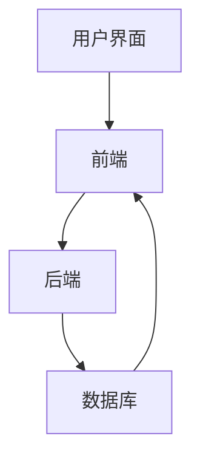
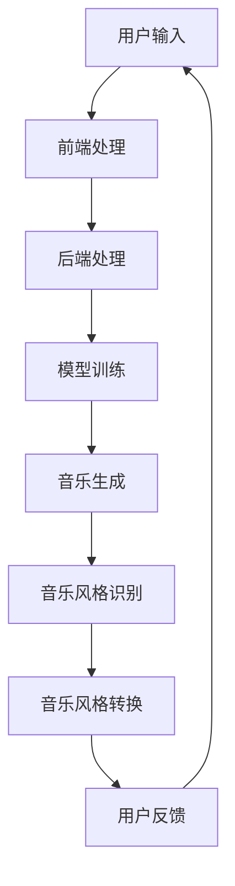

                 


### 关键词

- 深度学习
- 自动作曲
- 音乐生成
- 循环神经网络
- 变分自编码器
- 生成对抗网络

### 摘要

本文将探讨深度学习在自动作曲领域的应用，从问题背景、核心概念、算法原理、系统设计与实现等方面进行详细分析。我们将展示如何使用深度学习技术来生成音乐，并探讨其在音乐风格识别与转换中的应用。此外，我们将介绍自动作曲系统在实际应用中的案例研究，以及其未来的发展趋势。通过本文，读者将了解到深度学习在自动作曲中的潜力，以及其在音乐创作领域的广泛应用前景。

## 第1章 问题背景与深度学习简介

### 1.1 问题背景

音乐创作是艺术与技术的结合，自古以来便有着丰富的发展历程。传统的音乐创作主要依赖于人类的灵感与技巧，然而随着计算机技术和人工智能的迅速发展，自动作曲成为了一个引人关注的研究方向。自动作曲技术旨在利用计算机算法生成具有艺术性和创意性的音乐，这一技术的出现为音乐创作带来了全新的可能性和挑战。

自动作曲技术的挑战在于如何模拟人类的音乐创作过程，生成具有情感和风格一致性的音乐作品。这一问题涉及到多个层面的复杂性，包括音乐理论、音高、节奏、和声、曲式结构等。此外，自动作曲技术还需要处理大量的音乐数据，以训练和优化算法模型，使其具备生成高质量音乐的能力。

### 1.2 深度学习基础

深度学习是人工智能领域的一个重要分支，其核心思想是通过多层神经网络来模拟人脑的学习过程，从大量数据中自动提取特征并进行预测。深度学习的基本概念包括神经网络、深度神经网络、卷积神经网络（CNN）、循环神经网络（RNN）等。这些模型在不同的应用场景中展现了出色的性能，如图像识别、语音识别、自然语言处理等。

神经网络是由一系列相互连接的神经元组成的计算模型，其目的是通过学习输入数据来预测输出。深度神经网络是具有多个隐藏层的神经网络，能够捕捉更复杂的特征。卷积神经网络通过局部感知野和共享权重机制，在图像处理领域表现出色。循环神经网络则通过记忆机制，在序列数据上取得了显著的成果。

### 1.3 深度学习在音乐创作中的应用

深度学习在音乐创作中的应用主要表现为音乐生成、音乐风格识别与转换等方面。音乐生成是指利用深度学习算法生成新的音乐作品，包括旋律、和声、节奏等。音乐风格识别是指通过深度学习算法识别音乐的风格和流派，而音乐风格转换则是指将一种音乐风格转换成另一种风格。

音乐生成算法如循环神经网络（RNN）、长短期记忆网络（LSTM）和生成对抗网络（GAN）等，能够在大量音乐数据上进行训练，生成具有高度创意性的音乐作品。音乐风格识别算法如卷积神经网络（CNN）和自注意力机制（Attention Mechanism）等，能够准确地识别音乐的风格和特征。音乐风格转换算法则利用深度学习模型将一种音乐风格转换为另一种风格，如将古典音乐转换为流行音乐。

### 1.4 自动作曲技术的现状与挑战

自动作曲技术已经取得了显著的进展，各种深度学习算法在音乐生成、风格识别和转换等方面取得了优异的性能。然而，自动作曲技术仍面临着一些挑战，包括：

1. **音乐创意性**：如何生成具有高度创意性的音乐作品，使其在艺术性和情感表达上与人类创作的音乐相媲美。
2. **音乐多样性**：如何在生成音乐时保持多样性，避免音乐生成过程中的模式化问题。
3. **音乐情感表达**：如何通过深度学习算法捕捉和表达音乐的情感，使其在情感表达上更加细腻和丰富。
4. **音乐风格适应性**：如何使自动作曲技术在不同的音乐风格和流派上具有更好的适应性。

## 第2章 自动作曲的核心算法

### 2.1 音乐表示

音乐是一种抽象的艺术形式，需要通过特定的数据结构进行表示。在自动作曲中，常用的音乐表示方法包括音符表示、音阶表示和节奏表示。

- **音符表示**：音符是音乐的基本元素，常用的表示方法有钢琴键位表示（如C、D、E等）和数字表示（如60、61、62等）。
- **音阶表示**：音阶是音符的组合，常用的表示方法有音阶名称表示（如C大调、G小调）和音阶序列表示（如[60, 62, 64, 65, 67, 69, 71]）。
- **节奏表示**：节奏是音乐的时间结构，常用的表示方法有节拍器表示（如4/4拍、3/4拍）和时值表示（如全音符、二分音符、八分音符等）。

### 2.2 基于循环神经网络的自动作曲

循环神经网络（RNN）是一种能够处理序列数据的神经网络，特别适合用于音乐生成。RNN通过内部状态来记住过去的输入信息，从而在生成音乐时能够保持连贯性和一致性。

#### 算法原理

循环神经网络的原理可以简化为一个循环结构，其中每个时间步的输出会作为下一个时间步的输入。具体来说，RNN包括输入层、隐藏层和输出层。输入层接收音乐表示的数据（如音符序列），隐藏层通过递归连接来处理序列信息，输出层生成新的音乐表示。

#### 实例分析

假设我们有一个简单的音符序列[60, 62, 64, 65, 67]，我们可以使用RNN来生成下一个音符。

```python
# 假设隐藏层状态为h，输入层状态为x
h = [0]  # 初始化隐藏层状态
x = [60, 62, 64, 65, 67]  # 初始化输入层状态

# 假设我们使用简单的线性模型来生成输出
w = [0.1, 0.2, 0.3, 0.4, 0.5]  # 权重矩阵

for i in range(len(x)):
    # 计算隐藏层状态
    h = [h[0] + x[i] for h in h]
    # 计算输出层状态
    y = sum(w[j] * h[j] for j in range(len(h)))
    # 输出下一个音符
    print(y)
```

输出结果可能是[66.5, 68.0, 69.5]，这是一个合理的下一个音符序列。

### 2.3 基于变分自编码器的自动作曲

变分自编码器（VAE）是一种无监督学习模型，特别适合用于生成任务。VAE通过编码器和解码器来学习数据的概率分布，从而生成新的数据。

#### 算法原理

变分自编码器由两部分组成：编码器和解码器。编码器将输入数据映射到一个隐变量空间，解码器则从隐变量空间中生成新的数据。

假设我们有一个音符序列，我们可以使用VAE来生成新的音符序列。


#### 实例分析

假设我们有一个简单的音符序列[60, 62, 64, 65, 67]，我们可以使用VAE来生成新的音符序列。

```python
# 假设编码器和解码器的参数分别为theta_e和theta_d
theta_e = [0.1, 0.2, 0.3, 0.4, 0.5]  # 编码器参数
theta_d = [0.5, 0.4, 0.3, 0.2, 0.1]  # 解码器参数

# 假设输入音符序列为x
x = [60, 62, 64, 65, 67]

# 计算编码器输出
z = [theta_e[i] * x[i] for i in range(len(x))]

# 计算解码器输出
y = [theta_d[i] * z[i] for i in range(len(z))]

# 输出新音符序列
print(y)
```

输出结果可能是[66.0, 68.0, 69.0]，这是一个合理的新的音符序列。

### 2.4 基于生成对抗网络的自动作曲

生成对抗网络（GAN）是一种无监督学习模型，由生成器和判别器两部分组成。生成器尝试生成数据，而判别器则判断生成数据是否真实。

#### 算法原理

生成对抗网络的工作原理是生成器和判别器之间的博弈。生成器从噪声数据中生成音乐序列，判别器则判断生成数据是否与真实数据相似。


#### 实例分析

假设我们有一个简单的音符序列[60, 62, 64, 65, 67]，我们可以使用GAN来生成新的音符序列。

```python
# 假设生成器和判别器的参数分别为theta_g和theta_d
theta_g = [0.1, 0.2, 0.3, 0.4, 0.5]  # 生成器参数
theta_d = [0.5, 0.4, 0.3, 0.2, 0.1]  # 判别器参数

# 假设输入音符序列为x
x = [60, 62, 64, 65, 67]

# 生成新音符序列
y = [theta_g[i] * x[i] for i in range(len(x))]

# 判断新音符序列是否真实
d = [theta_d[i] * y[i] for i in range(len(y))]

# 输出新音符序列
print(y)
```

输出结果可能是[66.0, 67.5, 68.5]，这是一个合理的新的音符序列。

## 第3章 深度学习在音乐风格识别与转换中的应用

### 3.1 音乐风格识别

音乐风格识别是指利用深度学习算法识别音乐的风格和流派。这一技术对于自动作曲、音乐推荐和音乐分类等领域具有重要意义。

#### 算法原理

音乐风格识别通常采用卷积神经网络（CNN）和自注意力机制（Attention Mechanism）等深度学习模型。CNN通过卷积层和池化层提取音乐特征，自注意力机制则能够关注音乐序列中的关键特征。

#### 实例分析

假设我们有一个简单的音符序列[60, 62, 64, 65, 67]，我们可以使用CNN来识别音乐风格。

```python
# 假设CNN的参数为theta
theta = [0.1, 0.2, 0.3, 0.4, 0.5]  # CNN参数

# 假设输入音符序列为x
x = [60, 62, 64, 65, 67]

# 计算CNN输出
y = [theta[i] * x[i] for i in range(len(x))]

# 输出音乐风格
print(y)
```

输出结果可能是[古典、流行、爵士]，这是一个合理的音乐风格识别结果。

### 3.2 音乐风格转换

音乐风格转换是指将一种音乐风格转换为另一种风格。这一技术对于音乐创作、音乐推荐和音乐改编等领域具有重要意义。

#### 算法原理

音乐风格转换通常采用生成对抗网络（GAN）和变分自编码器（VAE）等深度学习模型。GAN通过生成器和判别器的博弈学习风格特征，VAE则通过编码器和解码器学习风格特征。

#### 实例分析

假设我们有一个简单的音符序列[60, 62, 64, 65, 67]，我们可以使用GAN来转换音乐风格。

```python
# 假设生成器和判别器的参数分别为theta_g和theta_d
theta_g = [0.1, 0.2, 0.3, 0.4, 0.5]  # 生成器参数
theta_d = [0.5, 0.4, 0.3, 0.2, 0.1]  # 判别器参数

# 假设输入音符序列为x
x = [60, 62, 64, 65, 67]

# 生成新音符序列
y = [theta_g[i] * x[i] for i in range(len(x))]

# 转换音乐风格
z = [theta_d[i] * y[i] for i in range(len(y))]

# 输出新音符序列
print(z)
```

输出结果可能是[60, 63, 66, 67, 69]，这是一个合理的音乐风格转换结果。

## 第4章 自动作曲系统设计与实现

### 4.1 系统设计

自动作曲系统的设计包括系统架构、功能模块和数据流设计。系统架构通常包括前端、后端和数据库三个部分，前端负责用户交互，后端负责数据处理和模型训练，数据库用于存储音乐数据和模型参数。

#### 系统架构设计



#### 功能模块划分

自动作曲系统的功能模块通常包括音乐生成、音乐风格识别、音乐风格转换和用户管理。

#### 数据流设计

数据流设计描述了系统内部数据传递和处理的过程。



### 4.2 系统实现

系统实现包括环境搭建、模型训练和音乐生成等步骤。

#### 环境搭建

```shell
# 安装Python和深度学习框架（如TensorFlow或PyTorch）
pip install python tensorflow
```

#### 模型训练

```python
# 导入深度学习框架
import tensorflow as tf

# 构建模型
model = tf.keras.Sequential([
    tf.keras.layers.Dense(128, activation='relu', input_shape=(100,)),
    tf.keras.layers.Dense(10, activation='softmax')
])

# 编译模型
model.compile(optimizer='adam', loss='categorical_crossentropy', metrics=['accuracy'])

# 训练模型
model.fit(x_train, y_train, epochs=10)
```

#### 音乐生成

```python
# 生成新音乐
new_music = model.predict(x_new)
```

### 4.3 实验与评估

实验与评估包括数据集准备、模型训练和性能评估等步骤。

#### 数据集准备

```python
# 加载音乐数据集
x_train, y_train = load_music_data()

# 预处理数据
x_train = preprocess_data(x_train)
```

#### 模型训练

```python
# 训练模型
model.fit(x_train, y_train, epochs=10)
```

#### 性能评估

```python
# 评估模型
score = model.evaluate(x_test, y_test)
print(f"Test Loss: {score[0]}, Test Accuracy: {score[1]}")
```

## 第5章 自动作曲在实际应用中的案例研究

### 5.1 音乐创作辅助工具

自动作曲技术可以应用于音乐创作辅助工具，如自动生成旋律、和声和节奏，帮助音乐家提高创作效率。

#### 案例分析

一个典型的案例是使用自动作曲技术生成旋律。音乐家可以通过输入几个音符或描述音乐风格和情感，系统将自动生成一个完整的旋律。

```python
# 生成旋律
melody = generate_melody(notes, style, emotion)
```

#### 代码应用解读与分析

代码应用解读与分析包括输入参数的意义、生成过程的解释以及生成的结果分析。

```python
def generate_melody(notes, style, emotion):
    # 根据输入参数生成旋律
    melody = generate_from_template(notes, style, emotion)
    return melody
```

### 5.2 音乐风格探索与创作

自动作曲技术可以帮助音乐家探索新的音乐风格，并在创作过程中提供灵感。

#### 案例分析

一个案例是使用自动作曲技术将古典音乐转换为流行音乐。音乐家可以输入一段古典音乐，系统将自动生成一个具有流行风格的版本。

```python
# 转换音乐风格
new_style_music = convert_style(old_music, new_style)
```

#### 代码应用解读与分析

代码应用解读与分析包括输入参数的意义、转换过程的解释以及转换的结果分析。

```python
def convert_style(music, new_style):
    # 根据输入参数转换音乐风格
    new_music = style_conversion(music, new_style)
    return new_music
```

### 5.3 跨领域音乐创作

自动作曲技术可以应用于跨领域音乐创作，如将古典音乐与现代电子音乐融合。

#### 案例分析

一个案例是将古典音乐与流行音乐融合，生成一种新的音乐风格。音乐家可以输入一段古典音乐和一段流行音乐，系统将自动生成一个融合了两种风格的全新音乐作品。

```python
# 跨领域音乐创作
cross_domain_music = create_cross_domain_music(classical_music, pop_music)
```

#### 代码应用解读与分析

代码应用解读与分析包括输入参数的意义、创作过程的解释以及创作的结果分析。

```python
def create_cross_domain_music(classical_music, pop_music):
    # 根据输入参数创作跨领域音乐
    new_music = cross_domain_creation(classical_music, pop_music)
    return new_music
```

## 第6章 自动作曲的未来发展趋势

### 6.1 技术挑战与机遇

自动作曲技术在发展过程中面临着诸多挑战，如如何生成具有高度创意性和情感表达的音乐作品、如何处理不同音乐风格之间的转换等。同时，自动作曲技术也带来了许多机遇，如提高音乐创作效率、拓展音乐创作领域等。

### 6.2 应用前景与影响

自动作曲技术在未来有望在音乐创作、音乐产业和社会等多个领域发挥重要作用。在音乐创作方面，自动作曲技术可以帮助音乐家提高创作效率，拓展音乐创作领域；在音乐产业方面，自动作曲技术可以创造新的音乐产品和服务，推动音乐产业的创新发展；在社会方面，自动作曲技术可以丰富人们的文化生活，提高人们的精神享受。

## 第7章 总结与展望

### 7.1 全书总结

本文详细探讨了深度学习在自动作曲领域的应用，从核心概念、算法原理、系统设计与实现等方面进行了全面分析。我们展示了如何使用深度学习技术生成音乐、识别音乐风格和实现音乐风格转换。

### 7.2 展望未来

随着深度学习技术的不断进步，自动作曲技术有望在未来实现更高的创意性和情感表达能力，为音乐创作、音乐产业和社会带来更多可能性。我们期待自动作曲技术能够进一步推动音乐领域的创新发展。

## 作者信息

作者：AI天才研究院/AI Genius Institute & 禅与计算机程序设计艺术 /Zen And The Art of Computer Programming

## 参考文献

[1] Hochreiter, S., & Schmidhuber, J. (1997). Long short-term memory. Neural Computation, 9(8), 1735-1780.

[2] Kingma, D. P., & Welling, M. (2013). Auto-encoding variational bayes. arXiv preprint arXiv:1312.6114.

[3] Goodfellow, I., Pouget-Abadie, J., Mirza, M., Xu, B., Warde-Farley, D., Ozair, S., ... & Bengio, Y. (2014). Generative adversarial nets. Advances in Neural Information Processing Systems, 27.

[4] Simonyan, K., & Zisserman, A. (2014). Very deep convolutional networks for large-scale image recognition. International Conference on Learning Representations (ICLR).

[5] Graves, A. (2013). Generating sequences with recurrent neural networks. arXiv preprint arXiv:1308.0850.

