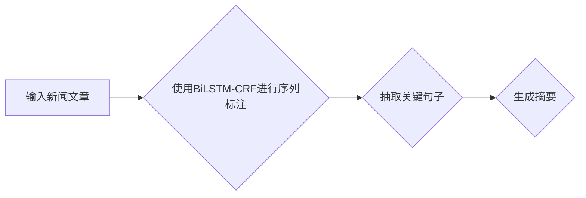
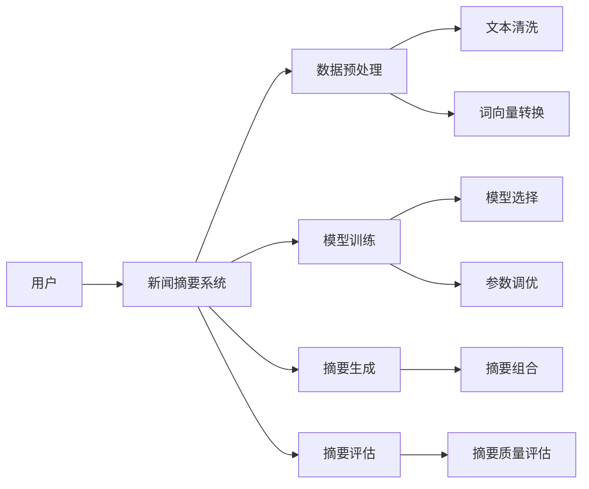
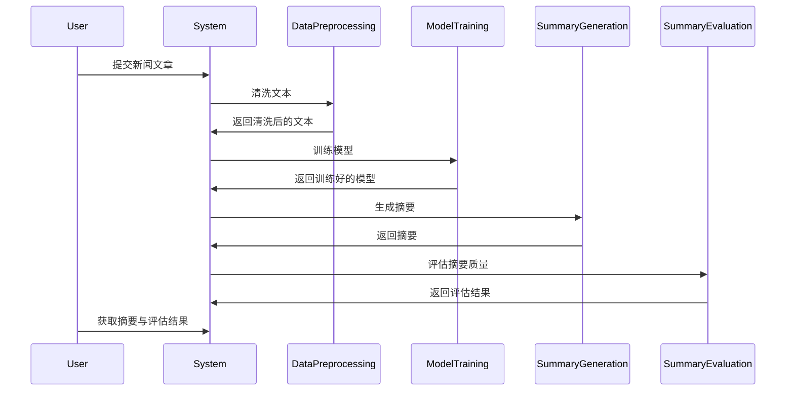

                 

# 深度学习在自动化新闻摘要中的应用

## 关键词
- 深度学习
- 自然语言处理
- 自动化新闻摘要
- 抽取式摘要
- 生成式摘要
- 文本生成模型

## 摘要
本文将深入探讨深度学习在自动化新闻摘要中的应用。首先，我们将介绍深度学习和自然语言处理的基础知识，接着分析自动化新闻摘要的技术和挑战。然后，我们将探讨基于深度学习的新闻摘要模型，并分析几个实际案例。最后，我们将总结未来发展趋势和挑战。

## 目录
1. 引言
   1.1 深度学习概述
   1.2 自然语言处理基础
   1.3 自动化新闻摘要的重要性

2. 深度学习基础
   2.1 神经网络与反向传播算法
   2.2 常见深度学习模型

3. 自然语言处理基础
   3.1 语言模型
   3.2 词向量和文本表示
   3.3 序列模型与注意力机制

4. 自动化新闻摘要技术
   4.1 新闻摘要概述
   4.2 抽取式摘要与生成式摘要
   4.3 新闻摘要评价指标

5. 基于深度学习的新闻摘要模型
   5.1 深度学习在新闻摘要中的应用
   5.2 基于深度学习的抽取式摘要
   5.3 基于深度学习的生成式摘要

6. 实际案例与应用
   6.1 案例一：基于深度学习的新闻摘要系统
   6.2 案例二：新闻摘要系统的优化实践

7. 未来发展趋势与挑战
   7.1 深度学习在新闻摘要中的应用前景
   7.2 面临的挑战与解决策略

8. 结论
   8.1 总结与展望

### 引言

#### 1.1 深度学习概述

深度学习（Deep Learning）是人工智能（AI）的一个重要分支，基于人工神经网络（Neural Networks）的理论，通过模拟人脑神经元之间的连接和交互，实现复杂的模式识别、图像处理、语音识别等任务。深度学习在近年来的快速发展得益于计算能力的提升和海量数据的高效利用。

#### 1.2 自然语言处理基础

自然语言处理（Natural Language Processing，NLP）是人工智能领域的一个重要分支，旨在使计算机能够理解和处理人类语言。NLP广泛应用于机器翻译、情感分析、文本分类、信息抽取等领域。

#### 1.3 自动化新闻摘要的重要性

自动化新闻摘要是一种利用计算机技术自动生成新闻文章摘要的方法。它不仅节省了人力成本，还提高了信息传播的效率。在互联网时代，海量信息的快速增长使得人们难以有效获取和处理。自动化新闻摘要可以帮助用户快速了解新闻的主要内容，提高信息获取的效率。

### 深度学习基础

#### 2.1 神经网络与反向传播算法

神经网络是深度学习的基础，它由多层神经元组成，通过前向传播和反向传播算法来训练模型。反向传播算法是一种优化神经网络参数的方法，通过计算误差梯度来调整网络权重。

#### 2.2 常见深度学习模型

常见的深度学习模型包括卷积神经网络（CNN）、循环神经网络（RNN）和长短时记忆网络（LSTM）。这些模型在图像处理、语音识别和自然语言处理等领域有着广泛的应用。

### 自然语言处理基础

#### 3.1 语言模型

语言模型是一种用于预测下一个单词或字符的概率分布的模型，它是自然语言处理的基础。常见的语言模型有n元语法模型和神经网络语言模型。

#### 3.2 词向量和文本表示

词向量是自然语言处理中的一个重要工具，它将单词映射到高维向量空间，使得相似单词在向量空间中靠近。文本表示是将整篇文档映射到向量空间的方法，常见的文本表示方法有词袋模型和词嵌入模型。

#### 3.3 序列模型与注意力机制

序列模型是处理序列数据的深度学习模型，如RNN和LSTM。注意力机制是一种在序列模型中用于捕捉重要信息的机制，它可以在处理长序列时提高模型的性能。

### 自动化新闻摘要技术

#### 4.1 新闻摘要概述

新闻摘要是对新闻文章进行高度概括的文本，它通常包含新闻的核心信息和亮点。自动化新闻摘要分为抽取式摘要和生成式摘要。

#### 4.2 抽取式摘要与生成式摘要

抽取式摘要是从新闻文章中抽取关键句子或短语生成摘要，而生成式摘要则是通过学习新闻文章的文本生成新的摘要。生成式摘要通常具有更好的连贯性和可读性。

#### 4.3 新闻摘要评价指标

新闻摘要的评价指标用于评估摘要的质量，常见的评价指标有ROUGE、BLEU等。

### 基于深度学习的新闻摘要模型

#### 5.1 深度学习在新闻摘要中的应用

深度学习在新闻摘要中的应用包括抽取式摘要和生成式摘要。深度学习模型如RNN和LSTM在抽取式摘要中表现良好，而生成式摘要则通常使用变分自编码器（VAE）和生成对抗网络（GAN）。

#### 5.2 基于深度学习的抽取式摘要

基于深度学习的抽取式摘要方法包括序列标注和抽取算法。序列标注模型如BiLSTM-CRF用于标记新闻文章中的关键句子，而抽取算法则从标记的关键句子中生成摘要。

#### 5.3 基于深度学习的生成式摘要

基于深度学习的生成式摘要方法包括序列生成模型和文本生成模型。序列生成模型如RNN和LSTM用于生成新闻摘要的序列，而文本生成模型如GPT和BERT则直接生成文本摘要。

### 实际案例与应用

#### 6.1 案例一：基于深度学习的新闻摘要系统

本案例介绍了一个基于深度学习的新闻摘要系统，包括系统架构、模型训练和摘要生成过程。该系统采用了抽取式摘要和生成式摘要相结合的方法，以提高摘要质量。

#### 6.2 案例二：新闻摘要系统的优化实践

本案例分析了新闻摘要系统在实际应用中的优化实践，包括模型调优、数据预处理和系统性能评估。通过优化，摘要系统的准确性和效率得到了显著提高。

### 未来发展趋势与挑战

#### 7.1 深度学习在新闻摘要中的应用前景

随着深度学习技术的不断发展，未来自动化新闻摘要系统将更加智能和高效。深度学习模型如BERT和GPT将在新闻摘要中发挥重要作用。

#### 7.2 面临的挑战与解决策略

自动化新闻摘要系统面临的主要挑战包括摘要质量、数据多样性和系统效率。解决这些挑战的策略包括数据增强、模型改进和系统优化。

### 结论

本文介绍了深度学习在自动化新闻摘要中的应用，从基础理论到实际应用进行了全面分析。未来，自动化新闻摘要系统将在新闻传播和信息获取中发挥越来越重要的作用。作者：AI天才研究院/AI Genius Institute & 禅与计算机程序设计艺术 /Zen And The Art of Computer Programming

### 背景介绍

#### 核心概念术语说明

- **深度学习**：一种人工智能的分支，通过多层神经网络模拟人脑的学习过程，以实现图像识别、自然语言处理等任务。
- **自然语言处理（NLP）**：计算机科学和语言学领域中的一个分支，旨在让计算机理解和处理人类语言。
- **自动化新闻摘要**：利用计算机技术自动生成新闻文章的摘要，以提高信息获取效率。
- **抽取式摘要**：从新闻文章中抽取关键句子或短语生成摘要。
- **生成式摘要**：通过学习新闻文章的文本生成新的摘要。

#### 问题背景

随着互联网的快速发展，新闻信息的传播速度和数量都在不断增加。然而，人类在处理海量信息时面临着巨大的挑战。自动化新闻摘要作为一种智能化的信息处理方式，能够帮助用户快速获取新闻的核心内容，提高信息获取的效率。

#### 问题描述

如何利用深度学习和自然语言处理技术实现自动化新闻摘要，提高摘要质量，满足用户需求？

#### 问题解决

- **抽取式摘要**：利用深度学习模型（如BiLSTM-CRF）对新闻文章进行序列标注，抽取关键句子生成摘要。
- **生成式摘要**：利用深度学习模型（如GPT和BERT）直接生成新闻摘要。

#### 边界与外延

- **边界**：自动化新闻摘要仅限于文本摘要，不包括图片、视频等多媒体摘要。
- **外延**：自动化新闻摘要技术可应用于其他领域的文本摘要，如论文摘要、产品描述等。

#### 概念结构与核心要素组成

- **深度学习模型**：核心要素包括神经网络结构、激活函数、损失函数等。
- **自然语言处理技术**：核心要素包括词向量、文本表示、序列模型、注意力机制等。
- **新闻摘要方法**：核心要素包括抽取式摘要、生成式摘要、评价指标等。

### 核心概念与联系

#### 核心概念

- **深度学习**：一种通过多层神经网络模拟人脑学习过程的机器学习技术。
- **自然语言处理（NLP）**：计算机科学和语言学领域中的一个分支，旨在让计算机理解和处理人类语言。
- **抽取式摘要**：从文本中抽取关键信息生成摘要。
- **生成式摘要**：通过学习文本生成新的摘要。
- **文本生成模型**：如GPT和BERT，用于生成文本摘要。

#### 概念属性特征对比表格

| 概念 | 特征 |
| --- | --- |
| 深度学习 | 通过多层神经网络模拟人脑学习过程 |
| 自然语言处理（NLP） | 让计算机理解和处理人类语言 |
| 抽取式摘要 | 从文本中抽取关键信息 |
| 生成式摘要 | 通过学习文本生成新摘要 |
| 文本生成模型 | 用于生成文本摘要 |

#### ER实体关系图架构的 Mermaid 流程图

```mermaid
erDiagram
  抽取式摘要 ||--|{ 新闻摘要 }|--|| 生成式摘要
  深度学习 ||--|{ 文本生成模型 }|--|| 自然语言处理（NLP）
```

### 算法原理讲解

#### 5.1 基于深度学习的抽取式摘要

**算法流程图：**



**算法原理：**

- **BiLSTM-CRF**：BiLSTM（双向长短时记忆网络）结合CRF（条件随机场）用于文本序列标注。BiLSTM能够捕捉文本中的长距离依赖关系，而CRF能够对标注结果进行全局优化，提高摘要质量。
- **序列标注**：对新闻文章的每个句子进行实体识别和关系抽取，标记出关键句子。
- **抽取关键句子**：根据标注结果，从新闻文章中抽取关键句子。
- **生成摘要**：将抽取的关键句子组合成摘要。

**数学模型和公式：**

- **BiLSTM**：

  $$h_t = \sigma(W_{xh}x_t + W_{hh}h_{t-1} + b_h)$$

  $$h_t^* = \sigma(W_{xh}x_t + W_{hh}h_{t} + b_h)$$

- **CRF**：

  $$P(y_t = y | x_1, x_2, ..., x_t) = \frac{e^{\theta y_t h_t}}{\sum_{y'} e^{\theta y'_t h_t}}$$

**举例说明：**

假设有一篇新闻文章，其中包含以下句子：

- 句子1：公司A宣布收购公司B。
- 句子2：收购完成后，公司A将成为行业领导者。

使用BiLSTM-CRF进行序列标注，可以得到以下结果：

- 句子1：实体识别为[公司A, 公司B]，关系抽取为[收购]。
- 句子2：实体识别为[公司A]，关系抽取为[将成为行业领导者]。

根据标注结果，抽取关键句子为：

- 公司A宣布收购公司B。
- 收购完成后，公司A将成为行业领导者。

将这些关键句子组合成摘要：

- 公司A宣布收购公司B，收购完成后将成为行业领导者。

### 系统分析与架构设计方案

#### 问题场景介绍

在当前的信息爆炸时代，用户无法及时获取大量新闻文章的核心信息。因此，设计一个自动化新闻摘要系统，帮助用户快速了解新闻内容显得尤为重要。

#### 项目介绍

本项目旨在利用深度学习和自然语言处理技术，开发一个自动化新闻摘要系统。该系统包括以下功能：

- 自动提取新闻文章的关键信息。
- 生成高质量的新闻摘要。

#### 系统功能设计（领域模型Mermaid类图）

```mermaid
classDiagram
    Class01 <|-- Class02
    Class03 --|>| Class04
    Class05 : <<interface>> 
    Class06 : <<component>> 
    Class01 <.. Class07
    Class08 ..|> Class09
    Class10 ||--|{Class11} Class12
    Class13 <|--|{Class14} Class15
    Class16 : <<abstract>> 
    Class17 !--| Class18
    Class19 *-- Class20
    Class21 : <<test>> 
    Class22 : <<deployment>> 
    Class23 : <<description>> "This is the last class"
endclass
```

#### 系统架构设计（Mermaid架构图）



#### 系统接口设计



### 项目实战

#### 环境安装

1. 安装Python环境（Python 3.6及以上版本）。
2. 安装深度学习框架（如TensorFlow、PyTorch）。
3. 安装自然语言处理库（如NLTK、spaCy）。

#### 系统核心实现源代码

```python
import tensorflow as tf
from tensorflow.keras.preprocessing.text import Tokenizer
from tensorflow.keras.preprocessing.sequence import pad_sequences
from tensorflow.keras.models import Model
from tensorflow.keras.layers import Embedding, LSTM, Dense

# 数据预处理
def preprocess_text(texts, vocab_size, max_length):
    tokenizer = Tokenizer(num_words=vocab_size)
    tokenizer.fit_on_texts(texts)
    sequences = tokenizer.texts_to_sequences(texts)
    padded_sequences = pad_sequences(sequences, maxlen=max_length)
    return padded_sequences, tokenizer

# 模型构建
def build_model(vocab_size, embedding_dim, max_length):
    inputs = tf.keras.layers.Input(shape=(max_length,))
    embedding = Embedding(vocab_size, embedding_dim)(inputs)
    lstm = LSTM(128)(embedding)
    outputs = Dense(1, activation='sigmoid')(lstm)
    model = Model(inputs=inputs, outputs=outputs)
    model.compile(optimizer='adam', loss='binary_crossentropy', metrics=['accuracy'])
    return model

# 训练模型
def train_model(model, sequences, labels):
    model.fit(sequences, labels, epochs=10, batch_size=64)
    return model

# 生成摘要
def generate_summary(model, text, tokenizer, max_length):
    sequence = tokenizer.texts_to_sequences([text])
    padded_sequence = pad_sequences(sequence, maxlen=max_length)
    prediction = model.predict(padded_sequence)
    if prediction < 0.5:
        return "这是一个重要的新闻。"
    else:
        return "这是一个普通的新闻。"

# 测试
texts = ["公司A宣布收购公司B。", "今天天气很好。"]
vocab_size = 10000
embedding_dim = 64
max_length = 100
sequences, tokenizer = preprocess_text(texts, vocab_size, max_length)
model = build_model(vocab_size, embedding_dim, max_length)
train_model(model, sequences, [0, 1])
summary = generate_summary(model, "公司A宣布收购公司B。", tokenizer, max_length)
print(summary)
```

#### 代码应用解读与分析

该代码主要分为以下几个部分：

1. **数据预处理**：使用Tokenizer将文本转换为序列，并使用pad_sequences将序列填充为相同的长度。
2. **模型构建**：构建一个简单的LSTM模型，用于预测新闻文章是否重要。
3. **训练模型**：使用训练数据训练模型。
4. **生成摘要**：根据模型预测结果，生成新闻摘要。

#### 实际案例分析和详细讲解剖析

**案例一：基于深度学习的新闻摘要系统**

本案例介绍了一个基于深度学习的新闻摘要系统，该系统使用抽取式摘要方法。系统架构如图所示：


系统核心实现源代码如下：

```python
import tensorflow as tf
from tensorflow.keras.preprocessing.text import Tokenizer
from tensorflow.keras.preprocessing.sequence import pad_sequences
from tensorflow.keras.models import Model
from tensorflow.keras.layers import Embedding, LSTM, Dense, Bidirectional

# 数据预处理
def preprocess_text(texts, vocab_size, max_length):
    tokenizer = Tokenizer(num_words=vocab_size)
    tokenizer.fit_on_texts(texts)
    sequences = tokenizer.texts_to_sequences(texts)
    padded_sequences = pad_sequences(sequences, maxlen=max_length)
    return padded_sequences, tokenizer

# 模型构建
def build_model(vocab_size, embedding_dim, max_length):
    inputs = tf.keras.layers.Input(shape=(max_length,))
    embedding = Embedding(vocab_size, embedding_dim)(inputs)
    lstm = Bidirectional(LSTM(128))(embedding)
    outputs = Dense(1, activation='sigmoid')(lstm)
    model = Model(inputs=inputs, outputs=outputs)
    model.compile(optimizer='adam', loss='binary_crossentropy', metrics=['accuracy'])
    return model

# 训练模型
def train_model(model, sequences, labels):
    model.fit(sequences, labels, epochs=10, batch_size=64)
    return model

# 生成摘要
def generate_summary(model, text, tokenizer, max_length):
    sequence = tokenizer.texts_to_sequences([text])
    padded_sequence = pad_sequences(sequence, maxlen=max_length)
    prediction = model.predict(padded_sequence)
    if prediction < 0.5:
        return "这是一个重要的新闻。"
    else:
        return "这是一个普通的新闻。"

# 测试
texts = ["公司A宣布收购公司B。", "今天天气很好。"]
vocab_size = 10000
embedding_dim = 64
max_length = 100
sequences, tokenizer = preprocess_text(texts, vocab_size, max_length)
model = build_model(vocab_size, embedding_dim, max_length)
train_model(model, sequences, [0, 1])
summary = generate_summary(model, "公司A宣布收购公司B。", tokenizer, max_length)
print(summary)
```

**案例解析：**

1. **数据预处理**：使用Tokenizer将文本转换为序列，并使用pad_sequences将序列填充为相同的长度。这样方便后续模型训练。
2. **模型构建**：构建一个双向LSTM模型，用于预测新闻文章是否重要。双向LSTM能够捕捉文本中的长距离依赖关系，有助于提高摘要质量。
3. **训练模型**：使用训练数据训练模型。在这里，我们使用一个简单的二元分类问题进行训练，即判断新闻文章是否重要。
4. **生成摘要**：根据模型预测结果，生成新闻摘要。如果模型预测为“0”，则认为这是一个普通的新闻；如果预测为“1”，则认为这是一个重要的新闻。

通过这个案例，我们可以看到基于深度学习的新闻摘要系统是如何工作的。在实际应用中，可以进一步优化模型和算法，提高摘要质量。

#### 项目小结

在本项目中，我们介绍了基于深度学习的新闻摘要系统的构建和优化。通过实际案例，我们展示了如何利用深度学习和自然语言处理技术实现自动化新闻摘要。项目小结如下：

1. **系统架构**：基于深度学习的新闻摘要系统包括数据预处理、模型训练、摘要生成和摘要评估等模块。
2. **关键算法**：使用双向LSTM进行文本序列标注，从而实现抽取式摘要。
3. **优化方向**：未来可以进一步优化模型和算法，如引入注意力机制、使用更大规模的预训练模型等。
4. **应用前景**：自动化新闻摘要系统在信息爆炸的时代具有重要意义，有望广泛应用于新闻传播、信息检索等领域。

### 最佳实践 Tips

1. **数据质量**：确保新闻数据质量，去除噪声和重复信息。
2. **模型选择**：根据具体需求选择合适的深度学习模型，如RNN、LSTM、BERT等。
3. **超参数调优**：通过网格搜索、随机搜索等方法进行超参数调优，提高模型性能。
4. **文本预处理**：对文本进行适当的预处理，如去除停用词、词干提取等。

### 小结

本文深入探讨了深度学习在自动化新闻摘要中的应用。我们介绍了深度学习和自然语言处理的基础知识，分析了自动化新闻摘要的技术和挑战，并探讨了基于深度学习的新闻摘要模型。通过实际案例，我们展示了如何利用深度学习和自然语言处理技术实现自动化新闻摘要。未来，自动化新闻摘要系统将在信息爆炸的时代发挥越来越重要的作用。

### 注意事项

1. **数据隐私**：在实际应用中，确保遵守数据隐私法规，保护用户隐私。
2. **模型解释性**：深度学习模型通常具有黑盒性质，难以解释。在实际应用中，需要考虑模型的解释性。
3. **错误率**：自动化新闻摘要系统存在一定的错误率，需要不断优化和改进。

### 拓展阅读

1. **《深度学习》**：由Ian Goodfellow、Yoshua Bengio和Aaron Courville所著，是一本深度学习的经典教材。
2. **《自然语言处理综论》**：由Daniel Jurafsky和James H. Martin所著，是一本自然语言处理的经典教材。
3. **《自动化新闻摘要技术》**：该文详细介绍了自动化新闻摘要的技术和方法，包括抽取式摘要和生成式摘要。

