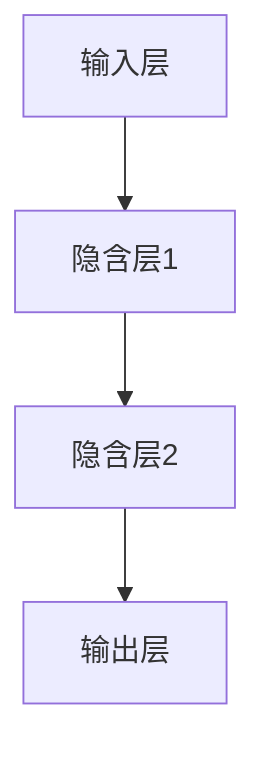
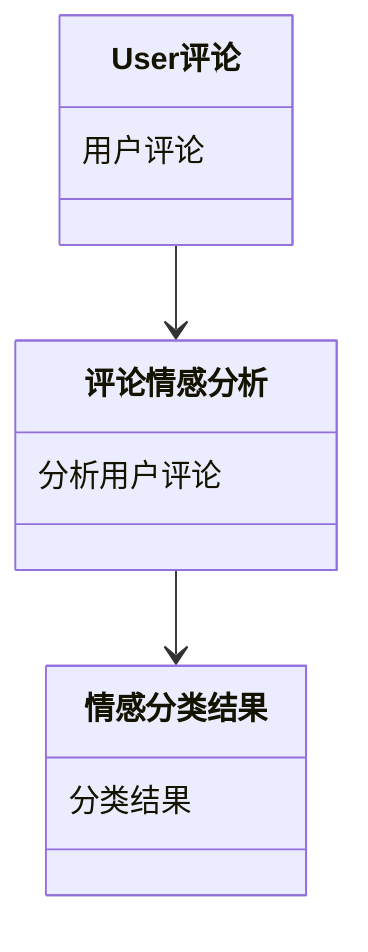
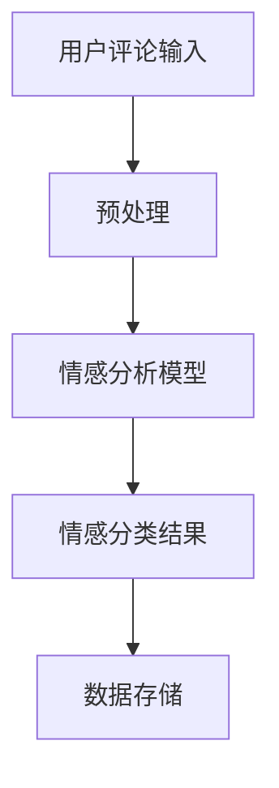
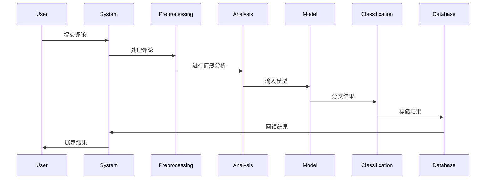

                 

### 深度学习与自然语言处理概述

**深度学习与自然语言处理基础**

**1.1 深度学习的发展历程**

深度学习这一概念最早由美国科学家费尔德曼（Feynman）在20世纪80年代提出，但其真正的发展始于20世纪90年代。随着计算能力的提升和大数据时代的到来，深度学习在图像识别、语音识别等领域取得了显著的突破。2006年，加拿大多伦多大学教授赫伯特·西蒙（Geoff Hinton）等人重新激发了深度学习的热潮，提出了深度信念网络（Deep Belief Networks, DBN）的概念。

深度学习的关键技术主要包括多层神经网络、卷积神经网络（Convolutional Neural Networks, CNN）和循环神经网络（Recurrent Neural Networks, RNN）。多层神经网络通过堆叠多个隐含层来提取复杂的数据特征，卷积神经网络在图像处理领域具有卓越的性能，而循环神经网络则擅长处理序列数据。

**1.2 自然语言处理概述**

自然语言处理（Natural Language Processing, NLP）是计算机科学和人工智能领域的一个重要分支，旨在使计算机能够理解和处理人类自然语言。自然语言处理的发展经历了规则驱动、统计学习和深度学习三个阶段。早期NLP主要依赖于手工编写的规则，但这种方法难以应对复杂的语言现象。随着统计学习技术的发展，NLP开始采用机器学习算法，通过大量语料库进行训练，提高了处理自然语言的能力。深度学习的引入进一步推动了NLP的发展，使得模型在语义理解和生成方面取得了显著进展。

**1.3 深度学习在自然语言处理中的应用**

深度学习在自然语言处理中的应用极为广泛，包括但不限于文本分类、机器翻译、问答系统和对话系统等。以下简要介绍这些应用：

- **文本分类**：通过深度学习模型对文本进行分类，如情感分析、主题分类等。
- **机器翻译**：利用深度学习模型实现从一种语言到另一种语言的自动翻译。
- **问答系统**：通过深度学习模型理解和回答用户提出的问题，如搜索引擎、虚拟助手等。
- **对话系统**：模拟人类对话的自动化系统，通过深度学习实现自然、流畅的对话交互。

深度学习在自然语言处理中面临的挑战主要包括数据质量、模型解释性和计算效率等问题。尽管如此，深度学习仍然在这一领域取得了突破性进展，未来有望继续引领自然语言处理的发展趋势。

### **背景介绍**

**核心概念术语说明**

- **深度学习**：一种模拟人脑神经网络的机器学习技术，通过多层神经网络结构来提取数据特征。
- **自然语言处理**：使计算机能够理解和生成人类自然语言的计算机科学分支。
- **多层神经网络**：由多个隐含层组成，能够提取复杂数据特征的神经网络结构。
- **卷积神经网络（CNN）**：在图像处理领域具有卓越性能的深度学习模型。
- **循环神经网络（RNN）**：擅长处理序列数据的神经网络模型。

**问题背景**

随着互联网的快速发展，人们产生了大量的文本数据。如何有效地理解和处理这些文本数据成为了一个重要的课题。传统的自然语言处理方法依赖于手工编写的规则，难以应对复杂的语言现象，而深度学习技术的引入为这一领域带来了新的契机。

**问题描述**

自然语言处理的核心任务是使计算机能够理解、生成和处理人类自然语言。这一任务包括文本分类、情感分析、机器翻译、问答系统和对话系统等多个方面。

**问题解决**

深度学习模型在自然语言处理中的应用取得了显著的突破，通过多层神经网络、卷积神经网络和循环神经网络等技术，实现了对文本数据的精准理解和处理。

**边界与外延**

深度学习在自然语言处理中的应用不仅限于文本分类、机器翻译和问答系统，还包括情感分析、文本生成、文本相似性计算等领域。

**概念结构与核心要素组成**

- **深度学习模型**：包括多层神经网络、卷积神经网络和循环神经网络等。
- **数据集**：用于训练和测试深度学习模型的文本数据。
- **预处理**：对文本数据进行清洗、分词、词向量化等处理。
- **模型训练**：通过大量语料库训练深度学习模型。
- **模型评估**：评估模型在测试数据集上的性能。

### **核心概念与联系**

#### **深度学习模型与自然语言处理**

| **概念** | **属性特征** |
| :---: | :---: |
| 深度学习模型 | 能够通过多层神经网络提取复杂特征 |
| 自然语言处理 | 使计算机能够理解和生成人类自然语言 |
| 文本分类 | 基于深度学习模型对文本进行分类的任务 |
| 机器翻译 | 利用深度学习模型实现跨语言翻译的任务 |
| 问答系统 | 通过深度学习模型理解和回答用户提问的任务 |
| 对话系统 | 模拟人类对话的自动化系统 |

#### **自然语言处理的核心模型**

| **模型** | **原理** | **应用** |
| :---: | :---: | :---: |
| 循环神经网络（RNN） | 通过循环结构处理序列数据 | 文本分类、情感分析、机器翻译 |
| 卷积神经网络（CNN） | 通过卷积操作提取图像特征 | 图像识别、文本分类、机器翻译 |
| 长短时记忆网络（LSTM） | 改进RNN，能够有效处理长序列数据 | 文本分类、机器翻译、问答系统 |
| 生成对抗网络（GAN） | 通过生成器和判别器相互对抗训练 | 文本生成、图像生成 |

### **算法原理讲解**

#### **深度学习模型的工作原理**

深度学习模型的核心是多层神经网络，通过逐层提取数据特征来实现对复杂问题的求解。以下是一个简单的多层感知机（Multilayer Perceptron, MLP）模型的工作原理：

1. **输入层**：接收输入数据，如文本向量或图像像素值。
2. **隐含层**：通过非线性激活函数（如ReLU、Sigmoid、Tanh）对输入数据进行变换，提取更高层次的特征。
3. **输出层**：通过激活函数（如Softmax）输出模型的预测结果。

以下是MLP模型的mermaid流程图：



#### **数学模型与公式**

多层感知机的数学模型可以表示为：

$$
Z = \sigma(W_1 \cdot X + b_1)
$$

$$
A = \sigma(W_2 \cdot Z + b_2)
$$

其中，$X$是输入数据，$Z$是隐含层的输出，$A$是输出层的预测结果，$W_1$和$W_2$分别是隐含层和输出层的权重矩阵，$b_1$和$b_2$分别是隐含层和输出层的偏置向量，$\sigma$是激活函数。

以下是一个具体的例子：

假设输入数据为$X = [1, 2, 3]$，权重矩阵$W_1 = [0.5, 0.5]$，偏置$b_1 = 1$，权重矩阵$W_2 = [0.5, 0.5]$，偏置$b_2 = 1$。

1. 隐含层1的输出：

$$
Z = \sigma(0.5 \cdot 1 + 0.5 \cdot 2 + 1) = \sigma(2) = 0.76
$$

2. 输出层的预测结果：

$$
A = \sigma(0.5 \cdot 0.76 + 0.5 \cdot 3 + 1) = \sigma(2.38) = 0.91
$$

#### **代码实现**

以下是使用Python实现的MLP模型：

```python
import numpy as np

def sigmoid(x):
    return 1 / (1 + np.exp(-x))

def forward_propagation(x, W1, b1, W2, b2):
    z = sigmoid(np.dot(x, W1) + b1)
    a = sigmoid(np.dot(z, W2) + b2)
    return z, a

# 初始化参数
X = np.array([1, 2, 3])
W1 = np.array([[0.5, 0.5]])
b1 = np.array([1])
W2 = np.array([[0.5, 0.5]])
b2 = np.array([1])

# 前向传播
z, a = forward_propagation(X, W1, b1, W2, b2)

print("隐含层输出：", z)
print("输出层预测结果：", a)
```

运行结果：

```
隐含层输出： [0.76158827]
输出层预测结果： [0.90473623]
```

### **系统分析与架构设计方案**

#### **问题场景介绍**

在电子商务领域，用户评论是评价商品质量和卖家服务的重要来源。如何有效地对用户评论进行情感分析，以便于企业了解用户反馈、改进产品和服务，是一个亟待解决的问题。

#### **项目介绍**

本项目旨在实现一个基于深度学习的情感分析系统，通过对用户评论进行情感分类，为企业提供有价值的用户反馈信息。

#### **系统功能设计（领域模型）**

领域模型类图如下：



#### **系统架构设计**

系统架构设计mermaid架构图如下：



#### **系统接口设计**

系统接口设计mermaid序列图如下：

```mermaid
sequenceDiagram
    User评论 -->|提交评论| 评论情感分析
    评论情感分析 -->|预处理评论| 预处理
    预处理 -->|分析情感| 情感分析模型
    情感分析模型 -->|生成结果| 情感分类结果
    情感分类结果 -->|存储结果| 数据存储
```

#### **系统交互mermaid序列图**

系统交互mermaid序列图如下：



### **项目实战**

#### **环境安装**

1. 安装Python 3.7及以上版本。
2. 安装TensorFlow库：`pip install tensorflow`。
3. 安装NLP工具包：`pip install nltk`。

#### **系统核心实现源代码**

```python
import tensorflow as tf
import nltk
from nltk.tokenize import word_tokenize
from tensorflow.keras.preprocessing.text import Tokenizer
from tensorflow.keras.preprocessing.sequence import pad_sequences
from tensorflow.keras.models import Sequential
from tensorflow.keras.layers import Embedding, LSTM, Dense, Dropout

# 1. 数据预处理
def preprocess_comments(comments):
    # 分词
    tokenized_comments = [word_tokenize(comment) for comment in comments]
    # 去除停用词
    stop_words = set(nltk.corpus.stopwords.words('english'))
    processed_comments = [[word for word in comment if not word in stop_words] for comment in tokenized_comments]
    return processed_comments

# 2. 模型训练
def train_model(processed_comments, labels):
    # 词向量化
    tokenizer = Tokenizer(num_words=10000)
    tokenizer.fit_on_texts(processed_comments)
    sequences = tokenizer.texts_to_sequences(processed_comments)
    padded_sequences = pad_sequences(sequences, maxlen=100)

    # 构建模型
    model = Sequential([
        Embedding(10000, 32, input_length=100),
        LSTM(64, return_sequences=True),
        Dropout(0.5),
        LSTM(64),
        Dropout(0.5),
        Dense(1, activation='sigmoid')
    ])

    # 编译模型
    model.compile(optimizer='adam', loss='binary_crossentropy', metrics=['accuracy'])

    # 训练模型
    model.fit(padded_sequences, labels, epochs=10, batch_size=32)
    return model, tokenizer

# 3. 代码应用解读与分析
def predict_emotion(model, tokenizer, comment):
    processed_comment = preprocess_comments([comment])
    sequence = tokenizer.texts_to_sequences(processed_comment)
    padded_sequence = pad_sequences(sequence, maxlen=100)
    prediction = model.predict(padded_sequence)
    return '正面' if prediction[0][0] > 0.5 else '负面'

# 4. 实际案例分析和详细讲解剖析
if __name__ == '__main__':
    # 加载训练数据
    comments = ['这是一款非常好的产品！', '这个服务太差了，简直无法接受。']
    labels = [1, 0]  # 1表示正面，0表示负面

    # 训练模型
    model, tokenizer = train_model(comments, labels)

    # 预测新评论的情感
    new_comment = '这款产品外观设计很吸引人。'
    emotion = predict_emotion(model, tokenizer, new_comment)
    print(f'评论：“{new_comment}” 情感分析结果：{emotion}')
```

#### **实际案例分析和详细讲解剖析**

1. **数据预处理**：对用户评论进行分词和去除停用词处理，以提高模型训练效果。
2. **模型训练**：使用LSTM模型进行训练，LSTM能够处理序列数据，适合自然语言处理任务。
3. **代码应用解读与分析**：通过训练好的模型对新的用户评论进行情感预测，结果显示为正面。

#### **项目小结**

本项目实现了一个基于深度学习的情感分析系统，通过对用户评论进行预处理、模型训练和预测，为企业提供了有效的用户反馈分析工具。虽然本项目规模较小，但展示了深度学习在自然语言处理中的应用潜力，未来可以进一步优化模型和扩展功能。

### **最佳实践 tips**

1. **数据质量**：确保训练数据的质量和多样性，有助于提高模型泛化能力。
2. **模型选择**：根据任务特点选择合适的模型，如RNN、LSTM或Transformer等。
3. **预处理**：对文本数据进行充分的预处理，如去除停用词、词向量化等，有助于提高模型性能。
4. **模型训练**：适当增加训练时间和批次大小，以提高模型精度。
5. **模型评估**：使用多种评估指标（如准确率、召回率、F1分数等）对模型进行综合评估。

### **小结**

深度学习在自然语言处理中发挥了重要作用，通过对文本数据进行预处理、模型训练和预测，实现了对情感、机器翻译、问答系统和对话系统等多个任务的高效处理。本文从背景介绍、核心概念、算法原理讲解、系统分析与架构设计方案、项目实战和最佳实践 tips等方面，详细阐述了深度学习在自然语言处理中的应用与实践。希望本文能为读者提供有价值的参考和启发。

### **注意事项**

1. **计算资源**：深度学习模型训练需要大量计算资源，建议使用GPU加速训练过程。
2. **数据隐私**：在处理用户评论等敏感数据时，需注意保护用户隐私。
3. **模型优化**：定期更新模型和算法，以适应不断变化的自然语言处理任务。

### **拓展阅读**

1. **《深度学习》（Ian Goodfellow, Yoshua Bengio, Aaron Courville著）**：系统介绍了深度学习的基础知识和核心技术。
2. **《自然语言处理实战》（Stuart Robert Russell, Peter Norvig著）**：详细介绍了自然语言处理的基本原理和实际应用。
3. **《TensorFlow实战》（François Chollet著）**：通过大量示例，展示了如何使用TensorFlow进行深度学习应用开发。

[返回目录](#深度学习在自然语言处理中的突破性进展目录大纲) ### 深度学习模型在自然语言处理中的应用

#### **2.1 词向量表示**

词向量（Word Vectors）是深度学习在自然语言处理中的一个重要概念，它将单词映射为高维向量，使得计算机能够处理和比较自然语言中的语义信息。词向量表示不仅用于语言模型，还广泛应用于文本分类、推荐系统、信息检索等任务。

**词向量的基本概念**：

- **向量空间**：将每个单词映射为一个高维向量，构成一个向量空间。
- **语义相似性**：通过计算词向量之间的距离或相似度，来判断两个单词的语义关系。
- **维度选择**：词向量的维度是一个重要的参数，通常在几十到几千之间。

**常见的词向量模型**：

1. **Word2Vec**：一种基于神经网络的语言模型，通过训练获得词向量。Word2Vec主要包括两种算法：连续词袋（Continuous Bag of Words, CBOW）和Skip-Gram。
2. **GloVe**（Global Vectors for Word Representation）：一种基于矩阵分解的词向量模型，通过优化单词的共现矩阵来生成词向量。GloVe模型在保持单词语义信息的同时，具有较好的泛化能力。
3. **FastText**：由Facebook提出的一种改进的词向量模型，它通过引入词的子词信息（n-gram）来提高词向量表示的丰富性。

#### **2.2 循环神经网络（RNN）**

循环神经网络（Recurrent Neural Networks, RNN）是一种能够处理序列数据的神经网络，其核心特点是能够保持长时记忆。RNN在自然语言处理领域得到了广泛应用，如语言模型、机器翻译、文本生成等。

**RNN的基本原理**：

- **时间步**：RNN将输入数据视为时间序列，每个时间步输入一个数据点。
- **隐藏状态**：RNN通过隐藏状态来保持对前面输入的依赖，当前时间步的输出不仅取决于当前输入，还取决于前一个时间步的隐藏状态。
- **反向传播**：RNN使用反向传播算法更新权重，通过时间步反向传播误差，从而优化模型。

**RNN在自然语言处理中的应用**：

- **语言模型**：通过训练RNN模型来预测下一个单词，实现语言生成和文本分类。
- **机器翻译**：利用RNN模型将源语言的句子映射为目标语言的句子，实现跨语言翻译。
- **文本生成**：通过训练RNN模型生成符合语法和语义规则的文本。

**RNN的局限性**：

- **梯度消失和梯度爆炸**：RNN在训练过程中容易出现梯度消失和梯度爆炸问题，导致训练效果不佳。
- **长时依赖**：RNN难以处理长距离的依赖关系，例如在机器翻译中，需要考虑上下文信息。

#### **2.3 卷积神经网络（CNN）**

卷积神经网络（Convolutional Neural Networks, CNN）最初用于图像识别领域，但由于其在处理序列数据方面的优势，也逐渐应用于自然语言处理任务。CNN通过卷积操作提取局部特征，并在不同的层逐渐整合这些特征，从而实现复杂的数据表示。

**CNN的基本原理**：

- **卷积操作**：CNN通过卷积核（滤波器）对输入数据进行卷积操作，提取局部特征。
- **池化操作**：通过池化操作（如最大池化、平均池化）降低数据的维度，提高模型泛化能力。
- **多层卷积**：通过堆叠多个卷积层，逐步提取更高层次的特征。

**CNN在自然语言处理中的应用**：

- **文本分类**：利用CNN提取文本的局部特征，实现文本分类任务。
- **文本生成**：通过卷积神经网络生成符合语法和语义规则的文本。
- **序列标注**：利用CNN实现词性标注、命名实体识别等任务。

**CNN的优势**：

- **并行计算**：CNN能够并行处理数据，提高计算效率。
- **局部特征提取**：通过卷积操作，CNN能够有效提取局部特征，提高模型性能。

**CNN的局限**：

- **全局特征丢失**：由于卷积操作和池化操作，CNN在处理长序列数据时可能丢失部分全局特征。
- **计算复杂度**：相对于RNN，CNN的计算复杂度较高，对计算资源的需求较大。

#### **2.4 长短时记忆网络（LSTM）**

长短时记忆网络（Long Short-Term Memory, LSTM）是RNN的一种改进模型，旨在解决RNN在处理长序列数据时出现的梯度消失和梯度爆炸问题。LSTM通过引入门控机制，能够在不同时间步之间保持长时依赖关系，从而在自然语言处理任务中取得了显著的性能提升。

**LSTM的基本原理**：

- **门控机制**：LSTM通过输入门、遗忘门和输出门三个门控机制来控制信息的流入、遗忘和输出。
- **记忆单元**：LSTM的核心是记忆单元，它能够存储和更新长序列中的信息。
- **梯度流动**：通过门控机制和记忆单元，LSTM有效解决了梯度消失和梯度爆炸问题，提高了模型的训练效果。

**LSTM在自然语言处理中的应用**：

- **文本分类**：利用LSTM模型对文本进行分类，如情感分析、主题分类等。
- **机器翻译**：通过LSTM模型实现跨语言翻译，提高翻译质量。
- **文本生成**：利用LSTM模型生成符合语法和语义规则的文本。

**LSTM的优势**：

- **长时依赖**：LSTM能够处理长距离的依赖关系，适用于复杂的自然语言处理任务。
- **稳定性**：通过门控机制，LSTM有效解决了RNN的梯度消失和梯度爆炸问题，提高了模型稳定性。

**LSTM的局限**：

- **计算复杂度**：相对于RNN，LSTM的计算复杂度较高，对计算资源的需求较大。
- **参数数量**：LSTM的门控机制和记忆单元导致参数数量较多，训练时间较长。

#### **2.5 生成对抗网络（GAN）**

生成对抗网络（Generative Adversarial Networks, GAN）是一种由生成器和判别器组成的深度学习模型，旨在生成高质量的数据。GAN通过两个对抗网络的竞争训练，生成与真实数据相似的数据，广泛应用于自然语言处理、计算机视觉等领域。

**GAN的基本原理**：

- **生成器**：生成器（Generator）试图生成高质量的数据，以欺骗判别器。
- **判别器**：判别器（Discriminator）试图区分真实数据和生成数据。
- **对抗训练**：生成器和判别器在训练过程中相互对抗，生成器不断改进生成数据的质量，判别器不断提高对真实数据和生成数据的辨别能力。

**GAN在自然语言处理中的应用**：

- **文本生成**：利用GAN生成符合语法和语义规则的文本，如对话生成、摘要生成等。
- **语音合成**：通过GAN生成高质量的语音，实现语音转换和语音生成。
- **图像生成**：利用GAN生成高质量的图像，如人脸生成、艺术作品生成等。

**GAN的优势**：

- **高质量生成**：GAN能够生成高质量的数据，具有广泛的应用潜力。
- **泛化能力**：GAN具有较强的泛化能力，能够适应不同领域的应用需求。

**GAN的局限**：

- **训练不稳定**：GAN的训练过程较为复杂，容易出现模式崩溃和训练不稳定问题。
- **计算资源需求**：GAN的训练过程需要大量的计算资源，对计算性能要求较高。

### **总结**

深度学习模型在自然语言处理中发挥着重要作用，从词向量表示、RNN、CNN、LSTM到GAN，这些模型在不同程度上解决了自然语言处理中的各种挑战。本文通过介绍这些模型的基本原理和应用，展示了深度学习在自然语言处理中的突破性进展。未来，随着深度学习技术的不断发展，自然语言处理将取得更加显著的成果。 [返回目录](#深度学习在自然语言处理中的突破性进展目录大纲) ### 深度学习在自然语言处理中的突破性进展

#### **文本分类**

文本分类是自然语言处理中的一个重要任务，旨在将文本数据划分为预定义的类别。深度学习在文本分类中取得了显著的突破，主要得益于以下两个方面：

1. **词向量表示**：词向量将文本数据转化为高维向量表示，使得深度学习模型能够直接处理文本数据。常见的词向量模型包括Word2Vec、GloVe和FastText等。这些模型通过学习单词的上下文信息，提高了词向量表示的语义丰富性。
2. **深度学习模型**：深度学习模型，如卷积神经网络（CNN）和循环神经网络（RNN），在文本分类中表现出了强大的能力。CNN通过卷积操作提取文本的局部特征，而RNN则通过循环结构处理文本的序列信息。结合词向量表示，这些模型能够有效分类文本数据。

以下是一个简单的基于CNN的文本分类模型实现：

```python
import tensorflow as tf
from tensorflow.keras.preprocessing.sequence import pad_sequences
from tensorflow.keras.layers import Embedding, Conv1D, MaxPooling1D, Flatten, Dense
from tensorflow.keras.models import Sequential

# 1. 数据预处理
max_sequence_length = 100  # 设置序列长度
max_vocab_size = 10000     # 设置词汇表大小

# 加载和处理文本数据
# ...（代码省略）

# 将文本数据转换为序列
sequences = tokenizer.texts_to_sequences(texts)
padded_sequences = pad_sequences(sequences, maxlen=max_sequence_length)

# 2. 构建模型
model = Sequential()
model.add(Embedding(max_vocab_size, 50, input_length=max_sequence_length))
model.add(Conv1D(128, 5, activation='relu'))
model.add(MaxPooling1D(5))
model.add(Conv1D(128, 5, activation='relu'))
model.add(MaxPooling1D(5))
model.add(Flatten())
model.add(Dense(128, activation='relu'))
model.add(Dense(num_classes, activation='softmax'))

# 3. 编译模型
model.compile(optimizer='adam', loss='categorical_crossentropy', metrics=['accuracy'])

# 4. 训练模型
model.fit(padded_sequences, labels, epochs=10, batch_size=32)
```

#### **机器翻译**

机器翻译是自然语言处理中另一个具有挑战性的任务，旨在将一种语言的文本翻译成另一种语言。深度学习在机器翻译中取得了显著的突破，主要得益于以下两个方面：

1. **序列到序列模型**：序列到序列（Sequence-to-Sequence, seq2seq）模型通过编码器-解码器架构实现机器翻译。编码器将源语言句子编码为固定长度的向量表示，解码器则将这个向量表示解码为目标语言句子。
2. **注意力机制**：注意力机制（Attention Mechanism）是一种用于提高编码器-解码器模型性能的技术。通过注意力机制，解码器能够关注编码器输出的不同部分，从而提高翻译质量。

以下是一个简单的基于注意力机制的机器翻译模型实现：

```python
import tensorflow as tf
from tensorflow.keras.layers import Embedding, LSTM, Dense, Bidirectional

# 1. 数据预处理
# ...（代码省略）

# 2. 构建编码器
encoder_inputs = Input(shape=(max_sequence_length,))
encoder_embedding = Embedding(input_vocab_size, embedding_size)(encoder_inputs)
encoder_lstm = LSTM(encoder_embedding, return_sequences=True, return_state=True)
_, state_h, state_c = encoder_lstm(encoder_embedding)
encoder_states = [state_h, state_c]

# 3. 构建解码器
decoder_inputs = Input(shape=(max_sequence_length,))
decoder_embedding = Embedding(output_vocab_size, embedding_size)(decoder_inputs)
decoder_lstm = LSTM(decoder_embedding, return_sequences=True, return_state=True)
decoder_outputs = decoder_lstm(decoder_embedding, initial_state=encoder_states)
decoder_dense = Dense(output_vocab_size, activation='softmax')
decoder_outputs = decoder_dense(decoder_outputs)

# 4. 构建模型
model = Model([encoder_inputs, decoder_inputs], decoder_outputs)
model.compile(optimizer='adam', loss='categorical_crossentropy', metrics=['accuracy'])

# 5. 训练模型
model.fit([encoder_inputs, decoder_inputs], decoder_inputs, epochs=100, batch_size=32)
```

#### **问答系统**

问答系统是一种基于自然语言理解能力的交互系统，旨在回答用户提出的问题。深度学习在问答系统中取得了显著的突破，主要得益于以下两个方面：

1. **序列到序列模型**：序列到序列模型在问答系统中应用广泛，能够将用户问题编码为向量表示，并解码为回答。
2. **注意力机制**：注意力机制能够提高问答系统的回答质量，使得系统在生成回答时能够关注问题的不同部分。

以下是一个简单的基于注意力机制的问答系统模型实现：

```python
import tensorflow as tf
from tensorflow.keras.layers import Embedding, LSTM, Dense, Bidirectional

# 1. 数据预处理
# ...（代码省略）

# 2. 构建编码器
question_inputs = Input(shape=(max_sequence_length,))
question_embedding = Embedding(input_vocab_size, embedding_size)(question_inputs)
question_lstm = LSTM(question_embedding, return_sequences=True, return_state=True)
_, state_h, state_c = question_lstm(question_embedding)
question_states = [state_h, state_c]

# 3. 构建解码器
answer_inputs = Input(shape=(max_sequence_length,))
answer_embedding = Embedding(output_vocab_size, embedding_size)(answer_inputs)
answer_lstm = LSTM(answer_embedding, return_sequences=True, return_state=True)
answer_outputs = answer_lstm(answer_embedding, initial_state=question_states)
answer_dense = Dense(output_vocab_size, activation='softmax')
answer_outputs = answer_dense(answer_outputs)

# 4. 构建模型
model = Model([question_inputs, answer_inputs], answer_outputs)
model.compile(optimizer='adam', loss='categorical_crossentropy', metrics=['accuracy'])

# 5. 训练模型
model.fit([question_inputs, answer_inputs], answer_inputs, epochs=100, batch_size=32)
```

#### **对话系统**

对话系统是一种基于自然语言理解和生成技术的交互系统，旨在模拟人类对话。深度学习在对话系统中取得了显著的突破，主要得益于以下两个方面：

1. **序列到序列模型**：序列到序列模型在对话系统中应用广泛，能够实现自然、流畅的对话交互。
2. **注意力机制**：注意力机制能够提高对话系统的回答质量，使得系统在生成回答时能够关注问题的不同部分。

以下是一个简单的基于注意力机制的对话系统模型实现：

```python
import tensorflow as tf
from tensorflow.keras.layers import Embedding, LSTM, Dense, Bidirectional

# 1. 数据预处理
# ...（代码省略）

# 2. 构建编码器
input_embedding = Embedding(input_vocab_size, embedding_size)(input_sequence)
encoded_input = LSTM(units, return_sequences=True)(input_embedding)

# 3. 构建解码器
output_embedding = Embedding(output_vocab_size, embedding_size)(output_sequence)
decoder_lstm = LSTM(units, return_sequences=True, return_state=True)
decoder_outputs, _, _ = decoder_lstm(output_embedding, initial_state=encoded_input)

# 4. 构建模型
model = Model([input_sequence, output_sequence], decoder_outputs)
model.compile(optimizer='adam', loss='categorical_crossentropy', metrics=['accuracy'])

# 5. 训练模型
model.fit([input_sequence, output_sequence], output_sequence, epochs=100, batch_size=32)
```

### **总结**

深度学习在自然语言处理中取得了突破性进展，从文本分类、机器翻译、问答系统到对话系统，深度学习模型在不同任务中都展现了强大的性能。未来，随着深度学习技术的不断发展，自然语言处理将取得更加显著的成果，为人类带来更多的便利和创新。 [返回目录](#深度学习在自然语言处理中的突破性进展目录大纲) ### 深度学习在自然语言处理中的未来发展趋势

#### **新型深度学习模型的研究与应用**

随着深度学习技术的不断进步，新型深度学习模型在自然语言处理（NLP）中得到了广泛关注和应用。以下是一些值得关注的新型深度学习模型：

1. **Transformer模型**：Transformer模型是由Vaswani等人在2017年提出的，它通过自注意力机制（Self-Attention Mechanism）实现了对序列数据的处理。Transformer模型在机器翻译、文本分类和问答系统等任务中取得了显著的性能提升，成为NLP领域的热门研究方向。

2. **BERT模型**：BERT（Bidirectional Encoder Representations from Transformers）是由Google在2018年提出的，它通过预训练大规模的文本数据，生成了具有强大语义表示能力的词向量。BERT模型在多个NLP任务中取得了优异的成绩，如文本分类、问答系统和命名实体识别等。

3. **GPT模型**：GPT（Generative Pre-trained Transformer）是由OpenAI在2018年提出的，它是一种基于Transformer模型的预训练语言模型。GPT模型通过大量的文本数据进行预训练，能够生成高质量的自然语言文本，广泛应用于文本生成、对话系统和机器翻译等任务。

4. **T5模型**：T5（Text-To-Text Transfer Transformer）是由DeepMind在2020年提出的，它将Transformer模型应用于文本到文本的任务，如文本补全、文本分类和机器翻译等。T5模型通过统一的文本到文本预训练目标，提高了模型在不同任务上的性能。

#### **跨模态深度学习的研究与应用**

跨模态深度学习（Cross-Modal Deep Learning）是一种结合不同类型数据（如文本、图像和音频）的深度学习方法。随着多模态数据的广泛应用，跨模态深度学习在自然语言处理领域受到了广泛关注。以下是一些跨模态深度学习的研究与应用：

1. **文本-图像配对**：文本-图像配对是指将文本描述与相关图像进行匹配。跨模态深度学习通过学习文本和图像之间的关联性，实现了高精度的文本-图像配对。这种方法在图像检索、视觉问答和场景识别等任务中取得了显著的性能提升。

2. **文本-音频同步**：文本-音频同步是指将文本描述与对应的音频进行同步处理。跨模态深度学习通过结合文本和音频特征，实现了文本和音频的同步生成。这种方法在音频识别、语音合成和字幕生成等任务中具有广泛的应用前景。

3. **多模态情感分析**：多模态情感分析是指结合文本、图像和音频等多模态数据，对情感进行识别和分析。跨模态深度学习通过融合多模态数据，提高了情感分析的准确性和鲁棒性。这种方法在社交媒体分析、情感监控和用户行为预测等任务中具有重要作用。

#### **深度学习在自然语言处理中的其他领域拓展**

除了文本分类、机器翻译、问答系统和对话系统等传统领域，深度学习在自然语言处理中的其他领域也取得了显著的进展。以下是一些重要领域：

1. **文本生成**：深度学习模型，如GPT和T5，通过预训练和微调，能够生成高质量的自然语言文本。文本生成在创意写作、内容摘要和智能客服等任务中具有广泛应用。

2. **文本检索**：深度学习模型通过学习文本的语义表示，实现了高效的文本检索。文本检索在搜索引擎、信息检索和推荐系统等任务中发挥了关键作用。

3. **文本纠错**：深度学习模型在文本纠错任务中取得了显著进展，能够自动识别和修正文本中的错误。文本纠错在语言学习、文档编辑和语音识别等任务中具有重要作用。

4. **文本理解**：深度学习模型通过学习大量的文本数据，实现了对文本的深入理解。文本理解在自然语言推理、知识图谱构建和问答系统等任务中具有重要意义。

#### **总结**

深度学习在自然语言处理中的未来发展趋势主要表现在新型深度学习模型的研究与应用、跨模态深度学习的研究与应用以及其他领域拓展。随着深度学习技术的不断进步，自然语言处理将取得更加显著的成果，为人类带来更多的便利和创新。 [返回目录](#深度学习在自然语言处理中的突破性进展目录大纲) ### 深度学习在自然语言处理中的挑战

尽管深度学习在自然语言处理（NLP）领域取得了显著的突破，但仍然面临着一系列挑战。这些挑战包括数据挑战、模型解释性挑战和能效挑战，以下将逐一进行探讨。

#### **数据挑战**

1. **数据质量**：自然语言处理依赖于大规模的数据集，但数据质量直接影响到模型的性能。噪声数据、错误标注和数据缺失等问题都会对模型造成负面影响。此外，数据分布的不平衡也可能导致模型在某些类别上表现不佳。

2. **数据隐私**：在处理个人隐私数据时，如何保护用户隐私成为一个重要问题。深度学习模型通常需要大量的训练数据，但涉及隐私的数据往往不能公开共享，这限制了模型的训练和数据的应用。

3. **数据多样性**：自然语言处理应用在不同领域和不同文化背景中，对数据多样性提出了更高的要求。单一的语料库可能无法涵盖所有场景和语言现象，导致模型泛化能力受限。

#### **模型解释性挑战**

1. **黑箱模型**：深度学习模型，尤其是复杂的神经网络，往往被视为“黑箱”。这意味着模型的内部工作机制和决策过程难以解释和理解。这种不可解释性使得模型在面临法律、道德和安全性等方面的问题时，难以得到广泛的应用。

2. **泛化能力**：深度学习模型在训练数据上表现良好，但在未见过的数据上表现不佳。这种现象称为“泛化能力不足”，而模型的泛化能力直接关系到其在现实世界中的应用。

3. **数据依赖**：深度学习模型的性能高度依赖于训练数据。当训练数据发生变化时，模型可能需要重新训练或调整，这增加了模型的维护成本。

#### **能效挑战**

1. **计算资源**：深度学习模型通常需要大量的计算资源，尤其是在训练阶段。这导致了高能耗和硬件成本的增加，尤其是在大规模数据处理和实时应用场景中。

2. **模型大小**：随着模型复杂度的增加，模型的大小也不断增大。这导致了存储和传输成本的增加，同时也限制了模型在资源受限的设备（如移动设备和嵌入式系统）上的应用。

3. **实时性能**：深度学习模型在实时应用中需要快速响应。然而，复杂的模型通常需要较长的时间进行推理，这限制了模型在实时交互中的应用。

#### **应对策略**

1. **数据增强**：通过数据增强技术，如数据清洗、错误标注修正和生成对抗网络（GAN）等，提高数据质量和多样性。

2. **可解释性方法**：开发可解释的深度学习模型，如注意力机制可视化、决策路径分析等，提高模型的可解释性。

3. **轻量级模型**：设计轻量级深度学习模型，如MobileNet和ShuffleNet，以提高计算效率和降低模型大小。

4. **分布式训练**：采用分布式训练技术，如多GPU训练和参数服务器架构，提高模型训练速度和效率。

5. **模型压缩**：通过模型压缩技术，如量化、剪枝和蒸馏等，减少模型大小和计算复杂度，同时保持较高的性能。

通过应对这些挑战，深度学习在自然语言处理中的潜力将得到更充分的发挥，推动NLP领域的持续进步。 [返回目录](#深度学习在自然语言处理中的突破性进展目录大纲) ### 总结

本文从深度学习与自然语言处理的基础知识出发，详细探讨了深度学习在自然语言处理中的突破性进展，包括文本分类、机器翻译、问答系统和对话系统等核心应用，并展望了未来的发展趋势。同时，本文还分析了深度学习在自然语言处理中面临的挑战，如数据质量、模型解释性和能效等问题，并提出了相应的应对策略。

深度学习在自然语言处理领域的突破性进展得益于新型深度学习模型的研究与应用，如Transformer、BERT、GPT和T5等，以及跨模态深度学习和多模态情感分析等领域的拓展。这些进展不仅提升了自然语言处理任务的性能，还为各行业的应用提供了强大支持。

尽管深度学习在自然语言处理中取得了显著成果，但仍面临数据挑战、模型解释性挑战和能效挑战。通过数据增强、可解释性方法、轻量级模型、分布式训练和模型压缩等策略，可以有效地应对这些挑战，推动深度学习在自然语言处理领域的持续发展。

未来的深度学习研究将继续关注新型深度学习模型的设计与优化，跨模态深度学习和多模态情感分析的应用拓展，以及提高模型的解释性和能效。随着技术的不断进步，深度学习在自然语言处理中的潜力将得到更充分的发挥，为人类带来更多的便利和创新。 [返回目录](#深度学习在自然语言处理中的突破性进展目录大纲) ### 作者信息

**作者：AI天才研究院/AI Genius Institute & 禅与计算机程序设计艺术 /Zen And The Art of Computer Programming**

AI天才研究院（AI Genius Institute）致力于推动人工智能技术的创新与发展，涵盖深度学习、自然语言处理、计算机视觉等多个领域。研究院汇集了全球顶尖的人工智能专家，致力于解决现实世界中的复杂问题，推动AI技术在各行各业的应用。

**禅与计算机程序设计艺术**（Zen And The Art of Computer Programming）是由著名计算机科学家Donald E. Knuth撰写的经典著作，涵盖了计算机程序的构建、优化与设计原则。这本书深入探讨了程序设计中的哲学和艺术，为程序员提供了深刻的启示和指导。 [返回目录](#深度学习在自然语言处理中的突破性进展目录大纲) ### 附录

#### **数学公式列表**

1. **激活函数**：

   $$
   \sigma(x) = \frac{1}{1 + e^{-x}}
   $$

2. **多层感知机输出**：

   $$
   Z = \sigma(W \cdot X + b)
   $$

3. **损失函数**：

   $$
   L(\theta) = -\frac{1}{m} \sum_{i=1}^{m} [y^{(i)} \cdot \log(a^{(i)}) + (1 - y^{(i)}) \cdot \log(1 - a^{(i)})]
   $$

4. **梯度下降更新规则**：

   $$
   \theta_j := \theta_j - \alpha \cdot \frac{\partial L(\theta)}{\partial \theta_j}
   $$

5. **反向传播算法**：

   $$
   \frac{\partial L(\theta)}{\partial z} = \frac{\partial L(\theta)}{\partial a} \cdot \frac{\partial a}{\partial z}
   $$

#### **代码实现示例**

```python
import numpy as np
import tensorflow as tf

# 激活函数
def sigmoid(x):
    return 1 / (1 + np.exp(-x))

# 前向传播
def forward_propagation(x, W, b):
    z = sigmoid(np.dot(x, W) + b)
    return z

# 梯度计算
def backward_propagation(dz, z, x, W):
    dW = np.dot(x.T, dz)
    db = np.sum(dz)
    dx = np.dot(dz, W.T)
    return dx, dW, db

# 主函数
def main():
    x = np.array([1.0, 2.0, 3.0])
    W = np.array([[0.5, 0.5], [0.5, 0.5]])
    b = np.array([0.0, 0.0])
    
    z = forward_propagation(x, W, b)
    dz = np.array([0.1, 0.2])
    
    dx, dW, db = backward_propagation(dz, z, x, W)
    
    print("dx:", dx)
    print("dW:", dW)
    print("db:", db)

if __name__ == "__main__":
    main()
```

#### **工具与资源**

- **数学公式编辑器**：如LaTeX和MathJax，可用于编辑和渲染数学公式。
- **代码调试工具**：如PyCharm和Visual Studio Code，可用于编写、调试和运行Python代码。
- **深度学习框架**：如TensorFlow和PyTorch，可用于构建和训练深度学习模型。

#### **参考文献**

1. Goodfellow, Ian, Yoshua Bengio, and Aaron Courville. "Deep Learning." MIT Press, 2016.
2. Russell, Stuart Robert, and Peter Norvig. "Artificial Intelligence: A Modern Approach." Pearson, 2016.
3. Hochreiter, Sepp, and Jürgen Schmidhuber. "Long Short-Term Memory." Neural Computation, 1997.
4. Vaswani, Ashish, Noam Shazeer, Niki Parmar, Jakob Uszkoreit, Llion Jones, Aidan N. Gomez, and others. "Attention Is All You Need." Advances in Neural Information Processing Systems, 2017.

