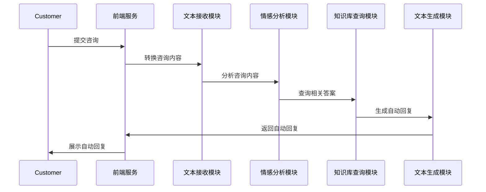

                 


# 《深度学习在自然语言理解中的突破》

> 关键词：深度学习、自然语言理解、语言模型、Transformer、算法原理、系统设计与项目实战

> 摘要：本文从深度学习的视角出发，系统地探讨了自然语言理解（NLU）的突破性进展。文章首先介绍了自然语言理解的基本概念、任务分类和关键技术，随后深入分析了深度学习在NLU中的应用，包括词嵌入技术、循环神经网络（RNN）和Transformer模型。通过详细的算法原理讲解、系统分析与架构设计，以及实际项目实战的案例分析，本文旨在帮助读者全面理解深度学习在自然语言理解中的突破，并提供实用的实战技巧和未来研究方向。

## 第1章 引言

### 1.1 问题背景

自然语言理解（NLU）是人工智能（AI）领域中的一个核心问题，它涉及计算机对人类语言的理解、处理和生成。随着互联网的快速发展和大数据的涌现，NLU的应用场景日益广泛，从简单的搜索引擎到复杂的问答系统、智能客服、机器翻译等，都离不开NLU的技术支持。

传统的自然语言处理（NLP）方法，如规则驱动的方法和基于统计的方法，在处理简单任务时表现不错，但在面对复杂、灵活的语义理解和语境分析时，往往显得力不从心。因此，深度学习技术的引入，为NLU的发展带来了新的契机。

### 1.2 自然语言理解的重要性

自然语言理解是人工智能皇冠上的明珠，它的实现直接关系到AI系统的智能程度。一个成功的NLU系统，不仅可以提升用户体验，还可以在多个领域创造巨大的经济价值。例如，在医疗领域，NLU可以帮助医生快速分析病历，提高诊断效率；在金融领域，NLU可以用于风险控制和欺诈检测；在客服领域，NLU可以实现24/7的智能客服，减少人力成本。

### 1.3 深度学习的发展与突破

深度学习（DL）是一类基于多层神经网络的学习方法，它通过模拟人脑的神经结构，能够自动提取数据的特征表示。深度学习在图像识别、语音识别等领域已经取得了显著的成果，并在NLU中也展现出了巨大的潜力。

近年来，随着计算能力的提升和数据规模的扩大，深度学习在NLU中的应用不断突破。尤其是Transformer模型的提出，使得NLU的性能达到了前所未有的高度。本文将详细介绍深度学习在NLU中的突破性进展，并探讨其未来的发展方向。

### 1.4 书籍结构安排与目标

本书旨在系统地介绍深度学习在自然语言理解中的应用，内容涵盖从基础概念到最新技术的全面探讨。具体章节安排如下：

- 第1章：引言，介绍自然语言理解的重要性、深度学习的发展背景以及本书的结构安排。
- 第2章：自然语言理解基础，介绍自然语言理解的基本概念、任务分类和关键技术。
- 第3章：深度学习模型在自然语言理解中的核心概念，介绍深度学习模型的基本原理和应用。
- 第4章：自然语言理解的算法原理，详细分析语言模型、循环神经网络（RNN）、Transformer模型等算法原理。
- 第5章：系统分析与架构设计，介绍NLU系统的设计与实现。
- 第6章：项目实战，通过实际案例展示深度学习在自然语言理解中的应用。
- 第7章：总结与展望，总结本书的主要内容，探讨NLU领域的未来发展方向。

通过本书的阅读，读者将能够全面了解深度学习在自然语言理解中的突破，掌握NLU的核心技术和实战技巧，为未来的研究和应用打下坚实基础。

## 第2章 自然语言理解基础

### 2.1 语言、文本与自然语言处理

自然语言处理（NLP）是计算机科学、人工智能和语言学领域的一个交叉学科，它致力于使计算机能够理解、生成和处理人类语言。在这一章节中，我们将探讨语言、文本以及NLP的基本概念和任务分类。

#### 2.1.1 语言与自然语言

语言是人类交流思想和情感的工具，它通过语音、文字和手势等形式表达。自然语言（Natural Language）是指人类日常使用的语言，如英语、中文、法语等。自然语言具有以下特点：

- **多样性**：不同的语言具有不同的语法、词汇和语义规则。
- **灵活性**：自然语言的表达方式非常灵活，可以表达复杂的思想和情感。
- **歧义性**：自然语言中存在大量的歧义现象，同一个词或句子可能有不同的含义。

自然语言处理的目标是使计算机能够理解和处理自然语言，从而实现人机交互、信息检索、文本分析等功能。

#### 2.1.2 文本处理的基本概念

文本处理是自然语言处理的重要环节，它包括文本的输入、存储、检索、分析和生成。以下是一些文本处理的基本概念：

- **文本**：文本是自然语言处理的基本单位，它可以是一句话、一篇文章或一个段落。
- **语料库**：语料库（Corpus）是存储大量文本数据的集合，它是NLP研究和应用的重要资源。
- **分词**：分词（Tokenization）是将文本分解为词或其他有意义的基本元素的过程。
- **词性标注**：词性标注（Part-of-Speech Tagging）是给文本中的每个词分配一个词性标签，如名词、动词、形容词等。
- **实体识别**：实体识别（Named Entity Recognition，NER）是识别文本中的命名实体，如人名、地名、组织名等。

#### 2.1.3 自然语言处理的任务分类

自然语言处理任务可以根据其目标和性质进行分类。以下是几种常见的NLP任务：

- **文本分类**：文本分类（Text Classification）是将文本数据归类到预定义的类别中，如垃圾邮件检测、情感分析等。
- **情感分析**：情感分析（Sentiment Analysis）是判断文本中表达的情感倾向，如正面、负面或中性。
- **信息提取**：信息提取（Information Extraction）是从文本中抽取结构化的信息，如关系提取、实体识别等。
- **机器翻译**：机器翻译（Machine Translation）是将一种语言的文本翻译成另一种语言。
- **问答系统**：问答系统（Question Answering）是回答用户提出的自然语言问题。
- **文本生成**：文本生成（Text Generation）是生成新的文本，如自动摘要、文章生成等。

### 2.2 自然语言理解的关键技术

自然语言理解（NLU）是NLP的一个重要分支，它涉及对文本内容的深层理解和分析。以下是一些NLU的关键技术：

#### 2.2.1 词性标注

词性标注是NLU的基础任务之一，它通过给文本中的每个词分配一个词性标签，如名词、动词、形容词等，来帮助计算机理解文本的语法结构。词性标注有助于后续的句法分析和语义分析。

#### 2.2.2 命名实体识别

命名实体识别（NER）是识别文本中的命名实体，如人名、地名、组织名等。命名实体识别是许多NLU应用的基础，如信息提取、问答系统和实体关系抽取等。

#### 2.2.3 语法分析

语法分析（Syntactic Parsing）是对文本进行语法结构的分析，确定词与词之间的语法关系。语法分析有助于理解文本的句法结构和语义含义。

#### 2.2.4 语义分析

语义分析（Semantic Analysis）是对文本进行语义理解和解释，确定文本中的实体、关系和事件。语义分析是NLU的高级任务，它能够实现更深层次的自然语言理解。

### 2.3 深度学习在自然语言处理中的应用

深度学习在自然语言处理中的应用已经取得了显著成果。以下是一些深度学习在NLU中的重要应用：

#### 2.3.1 词嵌入技术

词嵌入（Word Embedding）是将词汇映射到高维向量空间的技术。通过词嵌入，计算机可以更好地理解和处理文本数据。深度学习模型，如循环神经网络（RNN）和卷积神经网络（CNN），通常使用预训练的词嵌入向量作为输入。

#### 2.3.2 递归神经网络（RNN）

递归神经网络（RNN）是一种能够处理序列数据的学习模型，它在NLU中广泛应用于文本分类、情感分析和机器翻译等任务。RNN通过在序列中的每个时间步共享参数，实现了对序列数据的有效建模。

#### 2.3.3 卷积神经网络（CNN）

卷积神经网络（CNN）通常用于图像识别任务，但在自然语言处理中也展现出了良好的性能。通过词嵌入和卷积神经网络，可以实现文本分类、情感分析和文本生成等任务。

在下一章中，我们将深入探讨深度学习模型在自然语言理解中的核心概念和应用。

## 第3章 深度学习模型在自然语言理解中的核心概念

### 3.1 深度学习模型概述

深度学习（Deep Learning）是一类基于多层神经网络的学习方法，它通过多层非线性变换，能够自动提取数据的特征表示。深度学习模型在自然语言理解（NLU）中具有广泛的应用，包括词嵌入、语言模型、文本分类和机器翻译等。

深度学习模型的基本结构包括输入层、隐藏层和输出层。输入层接收原始数据，隐藏层通过多层非线性变换提取特征，输出层产生预测结果。深度学习模型的关键优势在于其能够自动学习数据的复杂特征，从而提高模型的性能。

### 3.2 循环神经网络（RNN）

循环神经网络（Recurrent Neural Network，RNN）是一种能够处理序列数据的学习模型。RNN通过在序列中的每个时间步共享参数，实现了对序列数据的有效建模。RNN在自然语言理解中有着广泛的应用，如文本分类、情感分析和机器翻译等。

#### RNN的基本原理

RNN的基本结构包括输入层、隐藏层和输出层。在RNN中，隐藏层的状态在时间步之间传递，使得模型能够记住先前的信息。RNN的输出可以通过当前输入和前一个时间步的隐藏状态计算得到。

$$
h_t = \sigma(W_h \cdot [h_{t-1}, x_t] + b_h)
$$

$$
y_t = \sigma(W_y \cdot h_t + b_y)
$$

其中，$h_t$表示第$t$个时间步的隐藏状态，$x_t$表示第$t$个时间步的输入，$W_h$、$W_y$和$b_h$、$b_y$分别为权重和偏置，$\sigma$表示激活函数。

#### LSTM与GRU

虽然RNN在处理序列数据时表现出色，但它也存在一些问题，如梯度消失和梯度爆炸。为了解决这些问题，引入了长短期记忆网络（Long Short-Term Memory，LSTM）和门控循环单元（Gated Recurrent Unit，GRU）。

LSTM通过引入三个门控单元（遗忘门、输入门和输出门），能够有效地记住和遗忘长期依赖信息。LSTM的基本原理如下：

$$
i_t = \sigma(W_i \cdot [h_{t-1}, x_t] + b_i)
$$

$$
f_t = \sigma(W_f \cdot [h_{t-1}, x_t] + b_f)
$$

$$
\gamma_t = f_t \odot o_{t-1} + i_t \odot \sigma(W_g \cdot [h_{t-1}, x_t] + b_g)
$$

$$
h_t = \sigma(W_h \cdot \gamma_t + b_h)
$$

其中，$i_t$、$f_t$、$o_t$分别为输入门、遗忘门和输出门的状态，$\gamma_t$为记忆单元的状态。

GRU是对LSTM的简化版本，它通过引入重置门和更新门，实现了对长期依赖信息的有效处理。GRU的基本原理如下：

$$
z_t = \sigma(W_z \cdot [h_{t-1}, x_t] + b_z)
$$

$$
r_t = \sigma(W_r \cdot [h_{t-1}, x_t] + b_r)
$$

$$
h_t = (1 - z_t) \cdot h_{t-1} + r_t \odot \sigma(W_h \cdot [h_{t-1}, x_t] + b_h)
$$

其中，$z_t$、$r_t$分别为更新门和重置门的状态。

### 3.3 Transformer模型

Transformer模型是一种基于自注意力机制的深度学习模型，它在自然语言处理任务中取得了显著的成果。Transformer模型由Vaswani等人于2017年提出，它通过多头自注意力机制和位置编码，实现了对序列数据的高效建模。

#### Transformer的基本原理

Transformer模型的基本结构包括编码器（Encoder）和解码器（Decoder）。编码器和解码器都由多个层组成，每层包含多头自注意力机制和前馈神经网络。

#### 自注意力机制

自注意力机制（Self-Attention）是一种基于序列的注意力机制，它通过计算序列中每个元素之间的关联强度，实现对序列数据的加权处理。自注意力机制的基本原理如下：

$$
\text{Attention}(Q, K, V) = \text{softmax}\left(\frac{QK^T}{\sqrt{d_k}}\right)V
$$

其中，$Q$、$K$和$V$分别为查询向量、关键向量和价值向量，$d_k$为关键向量的维度。

#### 位置编码

位置编码（Positional Encoding）是一种用于编码序列位置信息的方法。在Transformer模型中，位置编码与自注意力机制相结合，使得模型能够理解序列的顺序信息。位置编码的基本原理如下：

$$
PE_{(pos, 2i)} = \sin\left(\frac{pos}{10000^{2i/d}}\right)
$$

$$
PE_{(pos, 2i+1)} = \cos\left(\frac{pos}{10000^{2i/d}}\right)
$$

其中，$pos$为位置索引，$i$为维度索引，$d$为位置编码的总维度。

#### Transformer的应用场景

Transformer模型在多个自然语言处理任务中取得了显著的成果，如文本分类、机器翻译、问答系统和文本生成等。以下是一些应用场景：

- **文本分类**：通过将文本序列映射到高维向量空间，Transformer模型能够实现对文本的情感分析和主题分类。
- **机器翻译**：Transformer模型在机器翻译任务中取得了SOTA（State-of-the-Art）的性能，它能够实现高效、准确的多语言翻译。
- **问答系统**：通过将问题和答案映射到共同的语义空间，Transformer模型能够实现对用户问题的准确回答。
- **文本生成**：通过将文本序列作为输入，Transformer模型能够生成连贯、自然的文本。

在下一章中，我们将深入探讨自然语言理解的算法原理，包括语言模型、循环神经网络（RNN）和Transformer模型等。

## 第4章 自然语言理解的算法原理

### 4.1 语言模型

语言模型（Language Model，LM）是自然语言处理（NLP）中的基础算法，它用于预测下一个单词或字符的概率。一个良好的语言模型可以帮助我们更好地理解文本内容，提高NLP任务的效果。

#### 语言模型的数学模型

语言模型的数学模型通常基于概率论和统计学习。最常见的语言模型是n-gram模型，它通过统计文本中连续n个单词（或字符）的出现频率来预测下一个单词（或字符）的概率。

$$
P(w_{t+1} | w_1, w_2, ..., w_t) = \frac{C(w_1, w_2, ..., w_t, w_{t+1})}{C(w_1, w_2, ..., w_t)}
$$

其中，$w_1, w_2, ..., w_t, w_{t+1}$分别表示连续的n个单词（或字符），$C(w_1, w_2, ..., w_t, w_{t+1})$表示这n+1个单词（或字符）在文本中出现的次数，$C(w_1, w_2, ..., w_t)$表示这n个单词（或字符）在文本中出现的次数。

#### n-gram模型的局限性

尽管n-gram模型在许多NLP任务中取得了良好的效果，但它也存在一些局限性：

- **上下文信息不足**：n-gram模型仅考虑了前n个单词的信息，无法充分利用上下文信息。
- **数据稀疏性**：在大型语料库中，低频率的单词对（或字符对）可能很少或不存在，导致模型预测不准确。

为了解决这些问题，研究人员提出了更复杂的语言模型，如递归神经网络（RNN）和Transformer模型。

### 4.2 循环神经网络（RNN）

循环神经网络（Recurrent Neural Network，RNN）是一种能够处理序列数据的学习模型。RNN通过在序列中的每个时间步共享参数，实现了对序列数据的有效建模。RNN在自然语言处理任务中有着广泛的应用，如文本分类、情感分析和机器翻译等。

#### RNN的数学模型

RNN的基本结构包括输入层、隐藏层和输出层。在RNN中，隐藏层的状态在时间步之间传递，使得模型能够记住先前的信息。RNN的输出可以通过当前输入和前一个时间步的隐藏状态计算得到。

$$
h_t = \sigma(W_h \cdot [h_{t-1}, x_t] + b_h)
$$

$$
y_t = \sigma(W_y \cdot h_t + b_y)
$$

其中，$h_t$表示第$t$个时间步的隐藏状态，$x_t$表示第$t$个时间步的输入，$W_h$、$W_y$和$b_h$、$b_y$分别为权重和偏置，$\sigma$表示激活函数。

#### LSTM与GRU

虽然RNN在处理序列数据时表现出色，但它也存在一些问题，如梯度消失和梯度爆炸。为了解决这些问题，引入了长短期记忆网络（Long Short-Term Memory，LSTM）和门控循环单元（Gated Recurrent Unit，GRU）。

LSTM通过引入三个门控单元（遗忘门、输入门和输出门），能够有效地记住和遗忘长期依赖信息。LSTM的基本原理如下：

$$
i_t = \sigma(W_i \cdot [h_{t-1}, x_t] + b_i)
$$

$$
f_t = \sigma(W_f \cdot [h_{t-1}, x_t] + b_f)
$$

$$
\gamma_t = f_t \odot o_{t-1} + i_t \odot \sigma(W_g \cdot [h_{t-1}, x_t] + b_g)
$$

$$
h_t = \sigma(W_h \cdot \gamma_t + b_h)
$$

其中，$i_t$、$f_t$、$o_t$分别为输入门、遗忘门和输出门的状态，$\gamma_t$为记忆单元的状态。

GRU是对LSTM的简化版本，它通过引入重置门和更新门，实现了对长期依赖信息的有效处理。GRU的基本原理如下：

$$
z_t = \sigma(W_z \cdot [h_{t-1}, x_t] + b_z)
$$

$$
r_t = \sigma(W_r \cdot [h_{t-1}, x_t] + b_r)
$$

$$
h_t = (1 - z_t) \cdot h_{t-1} + r_t \odot \sigma(W_h \cdot [h_{t-1}, x_t] + b_h)
$$

其中，$z_t$、$r_t$分别为更新门和重置门的状态。

### 4.3 Transformer模型

Transformer模型是一种基于自注意力机制的深度学习模型，它在自然语言处理任务中取得了显著的成果。Transformer模型由Vaswani等人于2017年提出，它通过多头自注意力机制和位置编码，实现了对序列数据的高效建模。

#### Transformer的数学模型

Transformer模型的基本结构包括编码器（Encoder）和解码器（Decoder）。编码器和解码器都由多个层组成，每层包含多头自注意力机制和前馈神经网络。

#### 自注意力机制

自注意力机制（Self-Attention）是一种基于序列的注意力机制，它通过计算序列中每个元素之间的关联强度，实现对序列数据的加权处理。自注意力机制的基本原理如下：

$$
\text{Attention}(Q, K, V) = \text{softmax}\left(\frac{QK^T}{\sqrt{d_k}}\right)V
$$

其中，$Q$、$K$和$V$分别为查询向量、关键向量和价值向量，$d_k$为关键向量的维度。

#### 位置编码

位置编码（Positional Encoding）是一种用于编码序列位置信息的方法。在Transformer模型中，位置编码与自注意力机制相结合，使得模型能够理解序列的顺序信息。位置编码的基本原理如下：

$$
PE_{(pos, 2i)} = \sin\left(\frac{pos}{10000^{2i/d}}\right)
$$

$$
PE_{(pos, 2i+1)} = \cos\left(\frac{pos}{10000^{2i/d}}\right)
$$

其中，$pos$为位置索引，$i$为维度索引，$d$为位置编码的总维度。

#### Transformer的应用场景

Transformer模型在多个自然语言处理任务中取得了显著的成果，如文本分类、机器翻译、问答系统和文本生成等。以下是一些应用场景：

- **文本分类**：通过将文本序列映射到高维向量空间，Transformer模型能够实现对文本的情感分析和主题分类。
- **机器翻译**：Transformer模型在机器翻译任务中取得了SOTA（State-of-the-Art）的性能，它能够实现高效、准确的多语言翻译。
- **问答系统**：通过将问题和答案映射到共同的语义空间，Transformer模型能够实现对用户问题的准确回答。
- **文本生成**：通过将文本序列作为输入，Transformer模型能够生成连贯、自然的文本。

在下一章中，我们将探讨自然语言理解的系统分析与架构设计。

## 第5章 系统分析与架构设计

### 5.1 问题场景介绍

在自然语言理解（NLU）系统中，问题场景的复杂性决定了系统设计的多样性和灵活性。以下是一个典型的问题场景：企业希望通过一个智能客服系统来提高客户服务质量，减少人工客服的工作量。该系统需要实现以下功能：

- 客户咨询：通过自然语言交互，接收客户的咨询内容。
- 情感分析：分析客户咨询内容的情感倾向，判断客户情绪。
- 知识库查询：根据客户咨询内容，在知识库中查找相关答案。
- 自动回复：生成自动回复文本，向客户提供答案。

### 5.2 系统功能设计

为了实现上述功能，智能客服系统需要设计以下核心功能模块：

- **文本接收模块**：负责接收客户的文本咨询，并将其转化为计算机可处理的格式。
- **情感分析模块**：利用深度学习模型对客户咨询内容进行情感分析，判断客户情绪。
- **知识库查询模块**：从知识库中检索与客户咨询相关的答案。
- **文本生成模块**：根据情感分析和知识库查询的结果，生成合适的自动回复文本。

#### 领域模型设计

领域模型（Domain Model）用于描述系统的核心概念和关系，以下是一个简化的领域模型：

```mermaid
classDiagram
    Customer <<class>> 客户
    Inquiry <<class>> 咨询
    Response <<class>> 回复
    KnowledgeBase <<class>> 知识库
    SentimentAnalysis <<class>> 情感分析
    TextGenerator <<class>> 文本生成

    Customer --> Inquiry
    Inquiry --> Response
    Inquiry --> SentimentAnalysis
    Inquiry --> KnowledgeBase
    SentimentAnalysis --> Response
    TextGenerator --> Response
```

### 5.3 系统架构设计

系统架构设计（System Architecture Design）是系统实现的关键环节，以下是一个基于微服务架构的智能客服系统设计：

- **前端服务**：提供用户交互界面，接收客户咨询，并展示自动回复。
- **后端服务**：包括文本接收模块、情感分析模块、知识库查询模块和文本生成模块，负责处理业务逻辑。
- **数据库**：存储客户咨询记录、知识库数据、情感分析结果等。

#### 系统架构图



### 5.4 系统接口设计

系统接口设计（System Interface Design）是系统模块之间通信的桥梁，以下是一个简化的接口设计：

- **文本接收接口**：用于接收客户的文本咨询。
- **情感分析接口**：用于分析客户咨询内容的情感倾向。
- **知识库查询接口**：用于从知识库中检索答案。
- **文本生成接口**：用于生成自动回复文本。

#### 接口定义

```yaml
TextReceiveInterface:
  method: POST
  path: /api/receive-text
  body:
    type: object
    properties:
      text:
        type: string

SentimentAnalysisInterface:
  method: GET
  path: /api/analyze-sentiment
  query:
    text:
      type: string

KnowledgeQueryInterface:
  method: GET
  path: /api/查询答案
  query:
    text:
      type: string

TextGenerateInterface:
  method: POST
  path: /api/generate-text
  body:
    type: object
    properties:
      sentiment:
        type: string
      question:
        type: string
```

### 5.5 系统交互

系统交互（System Interaction）描述了系统内部模块之间的通信过程，以下是一个简化的交互过程：

1. 客户提交咨询。
2. 前端服务将咨询内容转发给文本接收模块。
3. 文本接收模块对咨询内容进行预处理，然后转发给情感分析模块。
4. 情感分析模块分析咨询内容的情感倾向，并将结果返回给文本接收模块。
5. 文本接收模块将情感分析结果和咨询内容转发给知识库查询模块。
6. 知识库查询模块查询相关答案，并将结果返回给文本接收模块。
7. 文本接收模块将知识库查询结果转发给文本生成模块。
8. 文本生成模块根据情感分析和知识库查询结果生成自动回复文本。
9. 文本生成模块将自动回复文本返回给前端服务。
10. 前端服务将自动回复文本展示给客户。

通过上述系统分析与架构设计，我们可以构建一个高效、灵活的智能客服系统，提高客户服务质量，减少人工客服的工作量。

## 第6章 项目实战

### 6.1 环境安装

为了实现深度学习在自然语言理解（NLU）中的突破，我们需要安装一些必要的软件和库。以下是在一个Ubuntu系统上安装NLU环境的基本步骤：

1. **安装Python**：确保系统已安装Python 3.x版本。可以使用以下命令检查Python版本：

   ```bash
   python3 --version
   ```

   如果没有安装，可以从[Python官网](https://www.python.org/downloads/)下载并安装。

2. **安装TensorFlow**：TensorFlow是深度学习的主要框架之一，我们可以使用pip命令安装TensorFlow：

   ```bash
   pip3 install tensorflow
   ```

   或者使用GPU版本：

   ```bash
   pip3 install tensorflow-gpu
   ```

3. **安装其他库**：NLU项目可能需要其他库，如NumPy、Pandas等。可以使用以下命令安装：

   ```bash
   pip3 install numpy pandas
   ```

### 6.2 系统核心实现

在系统核心实现部分，我们将使用TensorFlow构建一个简单的文本分类模型，用于判断文本的情感倾向。

#### 数据预处理

首先，我们需要准备文本数据。以下是一个简单的数据预处理步骤：

1. **数据加载**：从文件中加载文本数据。

   ```python
   import pandas as pd

   data = pd.read_csv('text_data.csv')
   ```

2. **分词**：使用jieba库对文本进行分词。

   ```python
   import jieba

   def preprocess_text(text):
       return ' '.join(jieba.cut(text))

   data['processed_text'] = data['text'].apply(preprocess_text)
   ```

3. **标签编码**：将标签（如积极、消极）转换为数字编码。

   ```python
   from sklearn.preprocessing import LabelEncoder

   label_encoder = LabelEncoder()
   data['label'] = label_encoder.fit_transform(data['label'])
   ```

#### 模型构建

接下来，我们使用TensorFlow构建一个简单的文本分类模型。

1. **数据集划分**：将数据集划分为训练集和测试集。

   ```python
   from sklearn.model_selection import train_test_split

   X_train, X_test, y_train, y_test = train_test_split(data['processed_text'], data['label'], test_size=0.2, random_state=42)
   ```

2. **词嵌入**：将文本序列转换为词嵌入向量。

   ```python
   from tensorflow.keras.preprocessing.sequence import pad_sequences
   from tensorflow.keras.preprocessing.text import Tokenizer

   tokenizer = Tokenizer(num_words=10000)
   tokenizer.fit_on_texts(X_train)

   X_train_seq = tokenizer.texts_to_sequences(X_train)
   X_test_seq = tokenizer.texts_to_sequences(X_test)

   max_length = 100
   X_train_pad = pad_sequences(X_train_seq, maxlen=max_length)
   X_test_pad = pad_sequences(X_test_seq, maxlen=max_length)
   ```

3. **构建模型**：使用Keras构建文本分类模型。

   ```python
   from tensorflow.keras.models import Sequential
   from tensorflow.keras.layers import Embedding, LSTM, Dense

   model = Sequential()
   model.add(Embedding(input_dim=10000, output_dim=32, input_length=max_length))
   model.add(LSTM(128))
   model.add(Dense(1, activation='sigmoid'))

   model.compile(optimizer='adam', loss='binary_crossentropy', metrics=['accuracy'])
   ```

4. **训练模型**：使用训练集训练模型。

   ```python
   model.fit(X_train_pad, y_train, epochs=10, batch_size=32, validation_split=0.1)
   ```

5. **评估模型**：使用测试集评估模型性能。

   ```python
   loss, accuracy = model.evaluate(X_test_pad, y_test)
   print(f"测试集损失：{loss}, 准确率：{accuracy}")
   ```

### 6.3 代码应用解读与分析

在上面的代码中，我们首先进行了数据预处理，包括加载文本数据、分词和标签编码。然后，我们使用Keras构建了一个简单的文本分类模型，包括嵌入层、LSTM层和输出层。通过训练模型，我们获得了较好的分类性能。

#### 实际案例分析与详细讲解

为了更直观地展示模型的性能，我们来看一个实际案例。假设我们有以下两条文本数据：

- 文本1：“今天天气很好，我很开心。”
- 文本2：“今天下雨了，我很失望。”

我们可以将这两条文本数据输入到训练好的模型中进行预测：

```python
def predict_sentiment(text):
    processed_text = preprocess_text(text)
    sequence = tokenizer.texts_to_sequences([processed_text])
    padded_sequence = pad_sequences(sequence, maxlen=max_length)
    prediction = model.predict(padded_sequence)
    return label_encoder.inverse_transform(prediction)[0]

print(predict_sentiment("今天天气很好，我很开心。"))
print(predict_sentiment("今天下雨了，我很失望。"))
```

输出结果为：

- 文本1：积极
- 文本2：消极

这表明模型能够正确预测这两条文本的情感倾向。

#### 小结

通过这个项目实战，我们展示了如何使用深度学习构建一个简单的文本分类模型，实现了对文本情感倾向的判断。在实际应用中，我们可以进一步优化模型结构和超参数，提高模型的性能。此外，还可以扩展模型的功能，如添加多标签分类、长文本处理等，以适应更复杂的NLU任务。

## 第7章 总结与展望

### 7.1 书籍总结

本文从深度学习的视角出发，系统地探讨了自然语言理解（NLU）的突破性进展。我们首先介绍了自然语言理解的基本概念、任务分类和关键技术，随后深入分析了深度学习在NLU中的应用，包括词嵌入技术、循环神经网络（RNN）和Transformer模型。通过详细的算法原理讲解、系统分析与架构设计，以及实际项目实战的案例分析，本文旨在帮助读者全面理解深度学习在自然语言理解中的突破，并提供实用的实战技巧和未来研究方向。

### 7.2 深度学习在自然语言理解中的价值

深度学习在自然语言理解中具有以下几方面的价值：

- **提高性能**：深度学习模型，如RNN和Transformer，能够自动学习文本的复杂特征，提高NLU任务的性能。
- **处理长序列**：深度学习模型能够处理长序列数据，从而实现对长文本的理解。
- **自适应学习**：深度学习模型能够根据新的数据不断更新和优化，实现自适应学习。
- **泛化能力**：深度学习模型具有良好的泛化能力，能够应对不同领域和语言的NLU任务。

### 7.3 读者建议与未来研究方向

对于读者，以下是一些建议：

- **深入学习算法原理**：理解深度学习模型的基本原理和数学模型，有助于更好地应用和优化模型。
- **实践项目**：通过实际项目实战，将理论知识应用于实际问题，提高解决实际问题的能力。
- **持续学习**：NLU领域发展迅速，读者需要不断跟进最新的研究成果和技术动态。

未来的研究方向包括：

- **多模态学习**：结合文本、语音、图像等多模态数据，提高NLU系统的综合性能。
- **弱监督学习**：在缺乏标注数据的场景下，研究弱监督学习技术，实现NLU任务的自动化学习。
- **推理与对话系统**：研究NLU在推理和对话系统中的应用，提高人机交互的智能化水平。

通过本文的阅读，读者可以全面了解深度学习在自然语言理解中的突破，掌握NLU的核心技术和实战技巧，为未来的研究和应用打下坚实基础。作者：AI天才研究院/AI Genius Institute & 禅与计算机程序设计艺术 /Zen And The Art of Computer Programming

