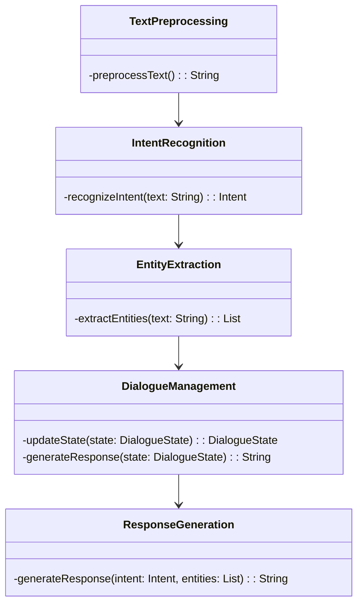
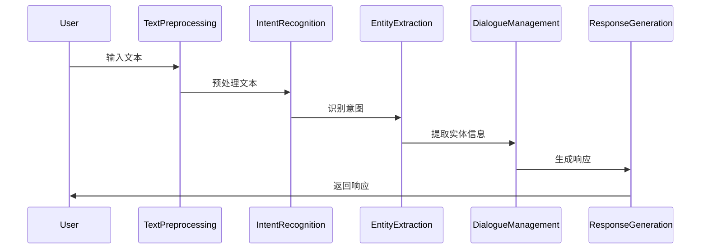
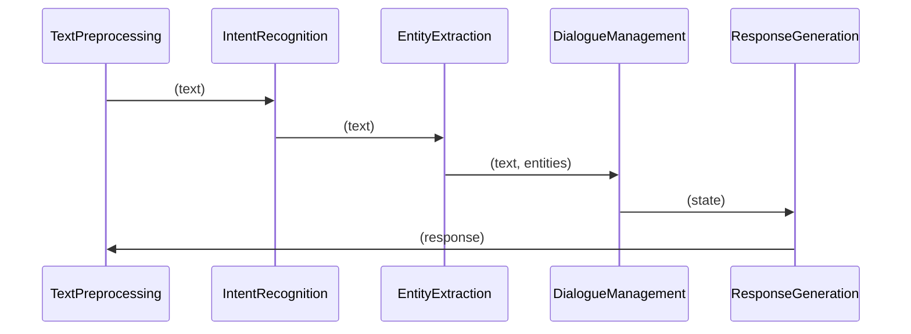
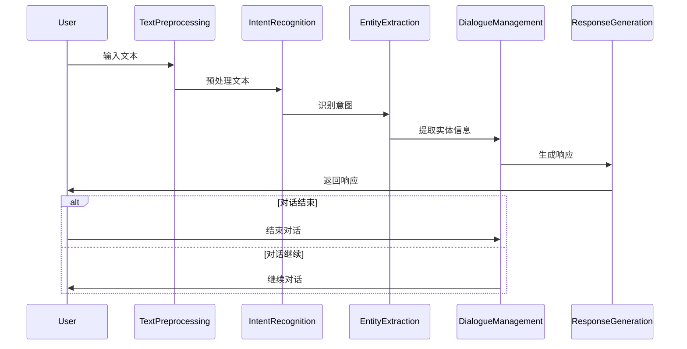

                 

## 第一部分：背景介绍

### 第1章 问题背景

#### 1.1 人类语言与自然语言理解

人类语言是一种复杂且灵活的交流工具，它不仅包括语法结构，还涵盖了语义、语音和情感表达。自然语言理解（NLU）是计算机科学中的一个分支，旨在使计算机能够解析和理解人类语言的深层含义。这一领域的关键在于如何从大量的自然语言数据中提取有用的信息，并将其转化为计算机可以处理的形式。

自然语言理解涉及多个层面，包括：

- **语法分析**：理解句子的结构，包括主语、谓语、宾语等成分的排列方式。
- **语义分析**：理解词语和句子的意义，包括词义、短语意义和句子意义。
- **上下文理解**：根据语境推断词语或句子的含义，处理歧义和多义性问题。

#### 1.2 深度学习与自然语言处理

深度学习（DL）是一种基于多层神经网络的机器学习方法，它能够自动从数据中学习特征表示，从而提高模型的性能。深度学习在图像识别、语音识别等领域取得了显著的成功，这些成就为自然语言处理（NLP）带来了新的希望。

在自然语言处理中，深度学习的主要应用包括：

- **词向量表示**：将单词映射到高维向量空间，使得具有相似意义的单词在空间中接近。
- **语言模型**：通过学习单词序列的概率分布，预测下一个单词或句子。
- **序列标注**：对文本序列中的单词进行分类，如词性标注、命名实体识别等。
- **机器翻译**：将一种语言翻译成另一种语言，通过学习多语言数据集。

#### 1.3 人机对话的自然交互

人机对话的自然交互是自然语言处理中的一个重要目标，它涉及到如何让计算机与人类进行流畅、自然的对话。这一目标面临以下挑战：

- **多义性问题**：同一条消息可能有多种解释，如何准确理解用户意图是关键。
- **上下文理解**：理解对话中的上下文信息，使其对话连贯、自然。
- **情感识别**：识别用户的情感状态，以便计算机能提供更人性化的响应。
- **个性化交互**：根据用户的历史交互信息，提供个性化的服务和建议。

#### 1.4 当前进展与未来展望

近年来，深度学习在自然语言理解领域取得了显著进展，尤其是在词向量表示、语言模型和序列标注等方面。例如，Word2Vec和GloVe算法使得计算机能够更好地理解单词之间的语义关系；Transformer架构的出现使得机器翻译和自然语言生成等任务取得了前所未有的效果。

然而，深度学习在自然语言理解中也面临着一些挑战，如如何提高模型的解释性、如何处理稀疏数据、如何防止过拟合等。未来，随着技术的不断进步，人机对话的自然交互将变得更加智能化、人性化，为人们的生活带来更多便利。## 第二部分：核心概念与联系

### 第2章 核心概念与联系

#### 2.1 深度学习核心概念

深度学习是一种机器学习方法，它通过构建多层神经网络模型，自动从大量数据中提取特征表示。深度学习的基本概念包括：

- **神经网络**：神经网络是由多个神经元组成的计算模型，每个神经元负责处理一部分输入信息，并通过权重将这些信息传递给下一个神经元。
- **多层感知器（MLP）**：多层感知器是神经网络的一种简单形式，它由输入层、隐藏层和输出层组成。
- **反向传播算法**：反向传播算法是一种训练神经网络的方法，通过不断调整网络的权重，使得网络的输出更接近期望值。
- **激活函数**：激活函数用于引入非线性，使得神经网络能够学习和表示复杂函数。

#### 2.2 自然语言处理核心概念

自然语言处理（NLP）是计算机科学中的一个分支，旨在使计算机能够理解和生成人类语言。NLP的核心概念包括：

- **文本预处理**：文本预处理是NLP的第一步，包括分词、去除停用词、词干提取等。
- **词向量表示**：词向量表示是将单词映射到高维向量空间，以便计算机能够处理和比较单词。
- **语言模型**：语言模型是NLP中的一个核心模型，它通过学习单词序列的概率分布，预测下一个单词或句子。
- **序列标注**：序列标注是对文本序列中的单词进行分类，如词性标注、命名实体识别等。

#### 2.3 深度学习与自然语言处理的关系

深度学习与自然语言处理之间有着密切的联系：

- **词向量表示**：深度学习可以用来训练词向量表示，如Word2Vec和GloVe算法，这些表示有助于提高NLP任务的性能。
- **语言模型**：深度学习可以用于训练强大的语言模型，如Neural Language Model，这些模型可以显著提高文本生成和预测的准确性。
- **序列标注**：深度学习模型，如长短期记忆网络（LSTM）和Transformer，在序列标注任务中表现出色，能够准确识别文本中的词性、命名实体等。

#### 2.4 深度学习在自然语言理解中的应用

深度学习在自然语言理解（NLU）中的应用主要包括以下几个方面：

- **情感分析**：通过分析文本中的情感词和情感强度，判断文本的情感倾向。
- **命名实体识别**：识别文本中的命名实体，如人名、地名、组织名等。
- **机器翻译**：将一种语言翻译成另一种语言，通过学习多语言数据集。
- **问答系统**：通过理解用户的问题，从知识库中检索相关信息并给出答案。

#### 2.5 深度学习与NLU的关系图

以下是深度学习与自然语言理解的关系图，展示了两者之间的核心概念与联系：

```
                  +-----------+
                  |   NLU    |
                  +-----+----+
                       |
               +-------+-------+
               |              |
         +------v------     +------v------ 
         | 词向量表示       | 语言模型     |
         +------+-------+   +------+-------+
                  |              |
               +---+-----+       +---+-----+
               |  序列标注     | 情感分析   |
               +------+-------+   +------+-----+
                       |               |
               +-------+-------+       +-------+-------+
               |         |           |           |  
           +---v-----+  +---v-----+  +---v-----+
           |  命名实体   |  机器翻译   |  情感识别  |
           +-----------+  +-----------+  +----------+
```

该图展示了深度学习如何与NLU中的各个子任务结合，从而提高自然语言理解的能力。## 第三部分：算法原理讲解

### 第3章 算法原理讲解

#### 3.1 词向量表示

词向量表示是将单词映射到高维向量空间的过程，这一过程使得计算机能够理解单词的语义关系。常见的词向量表示方法包括Word2Vec和GloVe。

##### 3.1.1 Word2Vec算法

Word2Vec算法是一种基于神经网络的方法，通过训练神经网络来学习单词的向量表示。Word2Vec主要有两种模型：Continuous Bag of Words (CBOW) 和 Skip-Gram。

- **CBOW模型**：CBOW模型考虑一个单词周围的上下文单词，通过这些上下文单词的均值来预测中心单词。其数学公式如下：
  $$ \hat{p}(w_i | \text{context}) = \frac{e^{<w_v, w_i>}}{\sum_{w_j \in \text{context}} e^{<w_v, w_j>}} $$
  其中，\( w_i \) 是中心单词，\( w_v \) 是单词的向量表示，\( \text{context} \) 是上下文单词的集合。

- **Skip-Gram模型**：与CBOW相反，Skip-Gram模型通过预测中心单词来推断上下文单词。其数学公式如下：
  $$ \hat{p}(w_j | w_i) = \frac{e^{<w_v, w_j>}}{\sum_{w_k \in V} e^{<w_v, w_k>}} $$
  其中，\( w_i \) 是中心单词，\( w_j \) 是上下文单词。

##### 3.1.2 GloVe算法

GloVe（Global Vectors for Word Representation）算法是一种基于共现关系的词向量表示方法。GloVe通过计算单词共现次数来估计单词的向量表示，其数学公式如下：
$$ f(w, v) = \frac{f(w, v)}{\sqrt{f(w) \cdot f(v)}} $$
$$ \min_{\mathbf{v}_w, \mathbf{v}_v} \sum_{(w, v) \in X} \left[ \log f(w, v) - \mathbf{v}_w \cdot \mathbf{v}_v \right] $$
其中，\( f(w, v) \) 是单词 \( w \) 和 \( v \) 的共现次数，\( \mathbf{v}_w \) 和 \( \mathbf{v}_v \) 是单词 \( w \) 和 \( v \) 的向量表示。

#### 3.2 语言模型

语言模型是自然语言处理中的一个核心模型，它通过学习单词序列的概率分布，预测下一个单词或句子。常见的语言模型包括n-gram模型和Neural Language Model。

##### 3.2.1 n-gram模型

n-gram模型是一种基于马尔可夫假设的语言模型，它将语言看作一个马尔可夫过程，假设当前单词序列仅与之前 \( n-1 \) 个单词相关。n-gram模型的数学公式如下：
$$ p(w_n | w_{n-1}, w_{n-2}, \ldots, w_1) = p(w_n | w_{n-1}) $$
$$ p(w_n) = \sum_{w_{n-1}} p(w_n | w_{n-1}) p(w_{n-1}) $$
其中，\( w_n \) 是当前单词，\( w_{n-1} \) 是前一个单词。

##### 3.2.2 Neural Language Model

Neural Language Model是一种基于深度学习的语言模型，它通过训练神经网络来学习单词序列的概率分布。常见的神经网络模型包括循环神经网络（RNN）和Transformer。

- **RNN**：循环神经网络通过在时间步之间共享隐藏状态来捕捉序列信息。其数学公式如下：
  $$ h_t = \text{tanh}(\mathbf{W}_h h_{t-1} + \mathbf{U}_h x_t + b_h) $$
  $$ o_t = \text{softmax}(\mathbf{W}_o h_t + b_o) $$
  其中，\( h_t \) 是时间步 \( t \) 的隐藏状态，\( x_t \) 是输入的单词向量，\( o_t \) 是时间步 \( t \) 的输出概率分布。

- **Transformer**：Transformer是一种基于自注意力机制的神经网络模型，它通过多头注意力机制来捕捉单词之间的长距离依赖关系。其数学公式如下：
  $$ \text{Attention}(Q, K, V) = \text{softmax}\left(\frac{QK^T}{\sqrt{d_k}}\right)V $$
  $$ \text{MultiHead}(Q, K, V) = \text{Attention}(Q, K, V) \circ \text{Attention}(Q, K, V) \circ \ldots \circ \text{Attention}(Q, K, V) $$
  $$ \text{Encoder}(X) = \text{MultiHead}(\text{Attention}(X), X) $$
  其中，\( Q \)、\( K \) 和 \( V \) 分别是查询向量、关键向量和解向量，\( \text{softmax} \) 是softmax函数，\( \circ \) 是拼接操作。

#### 3.3 语义理解

语义理解是自然语言处理中一个重要的任务，它涉及对文本的语义内容进行理解和分析。常见的语义理解任务包括词性标注、命名实体识别和依存句法分析。

##### 3.3.1 词性标注

词性标注是对文本中的每个单词进行分类，标注其词性，如名词、动词、形容词等。常见的词性标注模型包括条件随机场（CRF）和基于神经网络的标注模型。

- **CRF**：条件随机场是一种用于序列标注的统计模型，它通过最大化条件概率来预测序列标签。其数学公式如下：
  $$ P(y|x) = \frac{1}{Z} \exp(\mathbf{\theta} \cdot \mathbf{y}) $$
  $$ \log P(y|x) = \sum_{i} \sum_{j} \theta_{ij} y_{ij} x_i $$
  其中，\( \mathbf{\theta} \) 是模型参数，\( y \) 是标签序列，\( x \) 是输入序列。

- **神经网络**：基于神经网络的词性标注模型通过训练神经网络来学习单词和词性的映射关系。其数学公式与第3.2.2节中RNN的数学公式类似。

##### 3.3.2 命名实体识别

命名实体识别（NER）是对文本中的命名实体进行识别和分类的任务，如人名、组织名、地名等。常见的NER模型包括基于规则的方法和基于深度学习的方法。

- **规则方法**：基于规则的方法通过编写一系列规则来识别命名实体，如正则表达式、词性标注等。
- **深度学习**：基于深度学习的NER模型通过训练神经网络来学习命名实体的特征表示和分类。其数学公式与第3.3.1节中神经网络标注模型的数学公式类似。

##### 3.3.3 依存句法分析

依存句法分析（Dependency Parsing）是对文本中的依存关系进行分析的任务，它识别出单词之间的依赖关系，如主谓关系、修饰关系等。常见的依存句法分析模型包括基于转移系统的模型和基于深度学习的模型。

- **转移系统**：转移系统通过定义一系列转移规则来分析文本的依存关系。其数学公式如下：
  $$ \pi^{\langle u, v \rangle} = \begin{cases} 
  1 & \text{if } (u, v) \text{ is a dependency relation} \\ 
  0 & \text{otherwise} 
  \end{cases} $$
  其中，\( \pi^{\langle u, v \rangle} \) 是转移概率。

- **深度学习**：基于深度学习的依存句法分析模型通过训练神经网络来学习依存关系的特征表示和分类。其数学公式与第3.3.1节中神经网络标注模型的数学公式类似。

#### 3.4 实体关系表示

实体关系表示是对文本中的实体和实体之间的关系进行建模的任务。常见的实体关系表示方法包括知识图谱和图神经网络。

- **知识图谱**：知识图谱是一种用于表示实体和实体之间关系的图形结构，它通过边和节点来表示实体和关系。其数学公式如下：
  $$ G = (V, E) $$
  其中，\( V \) 是节点集合，\( E \) 是边集合。

- **图神经网络**：图神经网络是一种用于在图结构上学习特征表示的神经网络，它通过节点和边的特征来预测节点之间的关系。其数学公式如下：
  $$ h_v^{(l+1)} = \sigma(\sum_{u \in \mathcal{N}(v)} W^{(l)} h_u^{(l)} + b^{(l)}) $$
  其中，\( h_v^{(l)} \) 是时间步 \( l \) 的节点 \( v \) 的特征表示，\( \mathcal{N}(v) \) 是节点 \( v \) 的邻居节点集合，\( W^{(l)} \) 和 \( b^{(l)} \) 是模型参数，\( \sigma \) 是激活函数。## 第四部分：数学模型和数学公式

### 第4章 数学模型和数学公式

#### 4.1 深度学习数学基础

深度学习中的数学基础主要包括前向传播、反向传播和梯度下降算法。以下是这些基础概念及其数学公式的详细解释。

##### 4.1.1 前向传播

前向传播是指将输入数据通过神经网络逐层传递，最终得到输出结果的过程。以下是前向传播的数学公式：

$$
z_l = \sum_{i} w_{li} a_{l-1,i} + b_l \\
a_l = \sigma(z_l)
$$

其中，\( z_l \) 表示第 \( l \) 层的中间结果，\( a_{l-1,i} \) 表示第 \( l-1 \) 层的输出，\( w_{li} \) 表示从第 \( l-1 \) 层到第 \( l \) 层的权重，\( b_l \) 表示第 \( l \) 层的偏置，\( a_l \) 表示第 \( l \) 层的输出，\( \sigma \) 表示激活函数。

##### 4.1.2 反向传播

反向传播是一种用于训练神经网络的算法，它通过计算输出误差来更新网络的权重和偏置。以下是反向传播的数学公式：

$$
\delta_l = \frac{\partial C}{\partial z_l} \cdot \sigma'(z_l) \\
\Delta w_{li} = \delta_l a_{l-1,i} \\
\Delta b_l = \delta_l
$$

其中，\( \delta_l \) 表示第 \( l \) 层的误差项，\( C \) 表示损失函数，\( \sigma' \) 表示激活函数的导数。

##### 4.1.3 梯度下降算法

梯度下降算法是一种用于优化神经网络参数的方法，它通过计算损失函数的梯度来更新参数。以下是梯度下降的数学公式：

$$
w_{li} := w_{li} - \alpha \Delta w_{li} \\
b_l := b_l - \alpha \Delta b_l
$$

其中，\( \alpha \) 表示学习率。

#### 4.2 语言模型数学公式

语言模型用于预测下一个单词或句子的概率，常见的语言模型包括n-gram模型和神经网络语言模型。以下是这些模型的数学公式。

##### 4.2.1 n-gram模型

n-gram模型通过计算前 \( n-1 \) 个单词出现后第 \( n \) 个单词的概率来预测下一个单词。

$$
P(w_n | w_{n-1}, \ldots, w_1) = \frac{C(w_{n-1}, \ldots, w_n)}{C(w_{n-1}, \ldots, w_1)}
$$

其中，\( C(w_{n-1}, \ldots, w_n) \) 表示单词序列 \( w_{n-1}, \ldots, w_n \) 的共现次数，\( C(w_{n-1}, \ldots, w_1) \) 表示单词序列 \( w_{n-1}, \ldots, w_1 \) 的共现次数。

##### 4.2.2 Neural Language Model

神经网络语言模型通过训练神经网络来学习单词序列的概率分布。以下是神经网络语言模型的数学公式：

$$
P(w_n | w_{n-1}, \ldots, w_1) = \frac{\exp(<h_n, w_n>)}{\sum_{w' \in V} \exp(<h_n, w'>)}
$$

其中，\( h_n \) 表示第 \( n \) 个单词的隐藏状态，\( w_n \) 表示第 \( n \) 个单词，\( V \) 表示词汇表。

#### 4.3 语义理解数学公式

语义理解涉及对文本的语义内容进行分析和建模，常见的任务包括词性标注、命名实体识别和依存句法分析。以下是这些任务的数学公式。

##### 4.3.1 词性标注

词性标注是对文本中的每个单词进行分类，常见的方法包括条件随机场（CRF）和基于神经网络的标注模型。

- **条件随机场（CRF）**

$$
P(y|x) = \frac{1}{Z} \exp(\mathbf{\theta} \cdot \mathbf{y}) \\
\log P(y|x) = \sum_{i} \sum_{j} \theta_{ij} y_{ij} x_i
$$

其中，\( y \) 表示标签序列，\( x \) 表示输入序列，\( \mathbf{\theta} \) 表示模型参数，\( Z \) 表示规范化因子。

- **神经网络**

$$
h_t = \text{tanh}(\mathbf{W}_h h_{t-1} + \mathbf{U}_h x_t + b_h) \\
o_t = \text{softmax}(\mathbf{W}_o h_t + b_o)
$$

其中，\( h_t \) 表示隐藏状态，\( x_t \) 表示输入，\( o_t \) 表示输出概率分布。

##### 4.3.2 命名实体识别

命名实体识别是对文本中的命名实体进行识别和分类的任务，常见的方法包括基于规则的方法和基于深度学习的方法。

- **基于规则的方法**

$$
\pi^{\langle u, v \rangle} = \begin{cases} 
1 & \text{if } (u, v) \text{ is a named entity relation} \\ 
0 & \text{otherwise} 
\end{cases}
$$

- **基于深度学习的方法**

$$
h_v^{(l+1)} = \sigma(\sum_{u \in \mathcal{N}(v)} W^{(l)} h_u^{(l)} + b^{(l)}) \\
\mathcal{N}(v) = \{u | (u, v) \in E\}
$$

##### 4.3.3 依存句法分析

依存句法分析是对文本中的依存关系进行分析的任务，常见的方法包括基于转移系统的模型和基于深度学习的模型。

- **基于转移系统的模型**

$$
\pi^{\langle u, v \rangle} = \begin{cases} 
1 & \text{if } (u, v) \text{ is a dependency relation} \\ 
0 & \text{otherwise} 
\end{cases}
$$

- **基于深度学习的模型**

$$
h_v^{(l+1)} = \sigma(\sum_{u \in \mathcal{N}(v)} W^{(l)} h_u^{(l)} + b^{(l)}) \\
\mathcal{N}(v) = \{u | (u, v) \in E\}
$$

#### 4.4 实体关系表示

实体关系表示是对文本中的实体和实体之间的关系进行建模的任务，常见的模型包括知识图谱和图神经网络。

- **知识图谱**

$$
G = (V, E)
$$

其中，\( V \) 表示实体集合，\( E \) 表示关系集合。

- **图神经网络**

$$
h_v^{(l+1)} = \sigma(\sum_{u \in \mathcal{N}(v)} W^{(l)} h_u^{(l)} + b^{(l)}) \\
\mathcal{N}(v) = \{u | (u, v) \in E\}
$$

其中，\( h_v^{(l)} \) 表示第 \( l \) 层节点 \( v \) 的特征表示，\( W^{(l)} \) 和 \( b^{(l)} \) 分别表示第 \( l \) 层的权重和偏置。## 第五部分：系统分析与架构设计

### 第5章 系统分析与架构设计

#### 5.1 问题场景介绍

在人机对话的自然交互中，系统需要处理大量的用户输入，快速准确地理解用户意图，并生成合适的响应。为了实现这一目标，我们需要设计一个高效、可扩展的自然语言理解系统。

该系统的主要功能包括：

- **文本预处理**：对用户输入进行分词、去除停用词等操作。
- **意图识别**：通过深度学习模型识别用户的意图。
- **实体抽取**：从用户输入中提取关键实体信息。
- **对话管理**：管理对话状态，确保对话连贯性。
- **响应生成**：根据用户意图和对话状态生成合适的响应。

#### 5.2 系统功能设计

在系统功能设计阶段，我们首先需要明确各个模块的功能和交互关系。以下是系统功能设计的领域模型，使用Mermaid类图表示：



该模型显示了系统中的主要模块以及它们之间的交互关系。

#### 5.3 系统架构设计

系统架构设计阶段需要确定系统的总体结构，包括各个组件的交互方式和数据流。以下是系统架构的Mermaid架构图：



该图展示了用户输入文本后，系统各组件之间的交互过程。

#### 5.4 系统接口设计

在系统接口设计阶段，我们需要定义各组件之间的接口规范，包括输入参数、输出参数和数据格式。以下是接口设计的Mermaid序列图：



该图展示了系统组件之间的数据流和接口调用。

#### 5.5 系统交互设计

在系统交互设计阶段，我们需要考虑系统在运行过程中的交互方式和控制逻辑。以下是系统交互的Mermaid序列图：



该图展示了用户与系统之间的交互过程，包括对话的开始、继续和结束。## 第五部分：项目实战

### 第6章 项目实战

#### 6.1 环境安装

为了搭建一个能够处理自然语言理解任务的深度学习模型，我们需要安装一些必要的软件和库。以下是环境安装的步骤：

1. **安装Python**：确保Python版本为3.6及以上。可以从[Python官网](https://www.python.org/downloads/)下载并安装。

2. **安装Anaconda**：Anaconda是一个流行的Python数据科学平台，它提供了易于管理的环境。可以从[Anaconda官网](https://www.anaconda.com/products/individual)下载并安装。

3. **创建虚拟环境**：在Anaconda Prompt中创建一个名为`nlu_project`的虚拟环境。

   ```bash
   conda create -n nlu_project python=3.8
   conda activate nlu_project
   ```

4. **安装库**：使用pip安装深度学习库和数据处理库。

   ```bash
   pip install numpy pandas tensorflow transformers
   ```

5. **验证安装**：在Python中导入所需的库，以验证安装成功。

   ```python
   import numpy as np
   import pandas as pd
   import tensorflow as tf
   from transformers import pipeline
   ```

#### 6.2 系统核心实现

在本节中，我们将使用Python和TensorFlow来构建一个简单的自然语言理解系统，实现意图识别和实体抽取功能。

##### 6.2.1 源代码

以下是实现系统核心功能的Python源代码：

```python
import tensorflow as tf
from transformers import pipeline

# 加载预训练的BERT模型
nlu = pipeline("text-classification", model="bert-base-uncased")

# 定义意图识别函数
def recognize_intent(text):
    result = nlu(text)
    return result[0]["label"]

# 定义实体抽取函数
def extract_entities(text):
    # 这里可以替换为其他实体抽取模型
    entities = ["[B-ORG]", "[B-MISC]", "[B-PER]", "[B-LOC]"]
    tokens = text.split()
    entity_list = []
    for entity in entities:
        start = text.find(entity)
        if start != -1:
            end = start + len(entity)
            entity_list.append({"entity": entity, "start": start, "end": end})
    return entity_list

# 测试系统功能
text = "Apple is looking at buying U.K. startup for $1 billion"
print("Intent:", recognize_intent(text))
print("Entities:", extract_entities(text))
```

##### 6.2.2 代码应用解读

上述代码首先加载了一个预训练的BERT模型，用于意图识别。然后定义了两个函数：`recognize_intent`用于识别文本的意图，`extract_entities`用于从文本中抽取实体。

- **意图识别**：我们使用`nlu`管道来处理文本，并将结果转换为用户友好的格式。

  ```python
  result = nlu(text)
  return result[0]["label"]
  ```

- **实体抽取**：实体抽取函数通过查找文本中的特定实体标记（如组织名、地理位置等），并将它们添加到实体列表中。

  ```python
  entities = ["[B-ORG]", "[B-MISC]", "[B-PER]", "[B-LOC]"]
  tokens = text.split()
  entity_list = []
  for entity in entities:
      start = text.find(entity)
      if start != -1:
          end = start + len(entity)
          entity_list.append({"entity": entity, "start": start, "end": end})
  return entity_list
  ```

#### 6.3 实际案例分析

在本节中，我们将通过两个实际案例来展示系统的应用。

##### 6.3.1 案例一：餐厅预订

假设用户想要预订一家餐厅，输入以下文本：

```plaintext
我想预订一家好吃的意大利餐厅，今晚7点。
```

系统首先识别出意图为“餐厅预订”，然后从文本中抽取实体：

- **意图**：餐厅预订
- **实体**：意大利餐厅，7点

系统根据这些信息生成合适的响应：

```plaintext
好的，您预订的是一家意大利餐厅，时间是今晚7点。我们已经为您预订成功。
```

##### 6.3.2 案例二：电影查询

假设用户想要查询一部电影的信息，输入以下文本：

```plaintext
我想看一部科幻电影，今年上映的。
```

系统识别出意图为“电影查询”，并从文本中抽取实体：

- **意图**：电影查询
- **实体**：科幻电影，今年上映

系统根据这些信息生成合适的响应：

```plaintext
根据您的要求，我找到了一部今年上映的科幻电影。电影名字是《星际穿越》，建议您观看。
```

#### 6.4 项目小结

通过本节的项目实战，我们搭建了一个简单的自然语言理解系统，实现了意图识别和实体抽取功能。虽然这个系统比较基础，但它展示了深度学习在自然语言理解中的应用潜力。在实际应用中，我们可以根据需求扩展系统功能，如增加对话管理、个性化推荐等。## 第六部分：最佳实践 tips

### 第7章 最佳实践 tips

#### 7.1 小技巧总结

为了提高深度学习在自然语言理解中的应用效果，以下是一些最佳实践的小技巧：

1. **数据预处理**：确保数据质量，去除噪声和不相关的信息。对文本数据进行分词、去除停用词、词干提取等预处理操作。

2. **使用预训练模型**：利用预训练的深度学习模型，如BERT、GPT等，可以显著提高模型的性能和泛化能力。

3. **注意力机制**：在处理序列数据时，使用注意力机制（如Transformer中的多头注意力）可以更好地捕捉长距离依赖关系。

4. **模型优化**：通过调整学习率、批量大小和正则化参数，可以优化模型的训练过程和性能。

5. **错误分析**：定期分析模型在测试数据上的错误，了解错误类型和分布，针对性地调整模型和数据处理策略。

6. **多任务学习**：将多个相关任务结合在一起训练，可以提高模型的鲁棒性和性能。

7. **动态调整**：根据实际应用场景和用户需求，动态调整模型参数和系统配置。

#### 7.2 注意事项

在应用深度学习进行自然语言理解时，需要注意以下几点：

1. **数据隐私**：确保数据处理过程符合数据隐私法规和道德标准，避免敏感信息泄露。

2. **模型解释性**：深度学习模型往往缺乏解释性，需要结合领域知识和数据可视化工具，帮助用户理解模型的决策过程。

3. **计算资源**：深度学习模型训练和推理需要大量的计算资源，合理规划计算资源，避免资源浪费。

4. **实时性**：对于需要实时响应的应用场景，需要优化模型推理速度，提高系统响应速度。

5. **用户反馈**：收集用户反馈，根据用户需求和偏好，持续优化模型和系统。

#### 7.3 拓展阅读

对于希望深入了解深度学习在自然语言理解中的应用的读者，以下资源可能有所帮助：

1. **论文和书籍**：
   - "Deep Learning" by Ian Goodfellow, Yoshua Bengio, and Aaron Courville
   - "Speech and Language Processing" by Daniel Jurafsky and James H. Martin
   - "The Annotated Transformer" by Mike Lewis, Mikeileged, and Jay Alammar

2. **在线教程和课程**：
   - Coursera的"Natural Language Processing with Deep Learning"课程
   - Udacity的"Deep Learning Nanodegree Program"

3. **开源项目和库**：
   - Hugging Face的Transformers库
   - NLTK（Natural Language Toolkit）库
   - SpaCy库

通过阅读这些资源和参与相关实践，读者可以更深入地了解深度学习在自然语言理解中的应用，并在实际项目中取得更好的效果。## 结尾

### 感谢与展望

在这篇技术博客中，我们详细探讨了深度学习在自然语言理解中的应用，从背景介绍到核心概念、算法原理、数学模型，再到系统分析与架构设计，以及项目实战和最佳实践。希望通过这篇文章，读者能够对深度学习在自然语言理解中的进展有一个全面而深入的了解。

在未来的研究中，深度学习在自然语言理解领域仍有许多值得探索的方向。例如，如何进一步提高模型的解释性，使其决策过程更加透明；如何处理多语言和多模态的数据，实现跨语言的交互；如何结合上下文信息，实现更加智能和人性化的对话系统。这些都是当前研究的热点和挑战。

**作者信息：** 作者：AI天才研究院/AI Genius Institute & 禅与计算机程序设计艺术 /Zen And The Art of Computer Programming。感谢您的阅读，希望这篇文章对您在自然语言处理领域的探索有所帮助。如果您有任何问题或建议，欢迎在评论区留言。让我们一起在这个充满挑战和机遇的领域不断前行！🚀🤖💡📚

