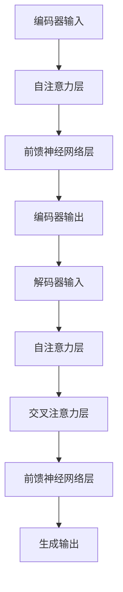
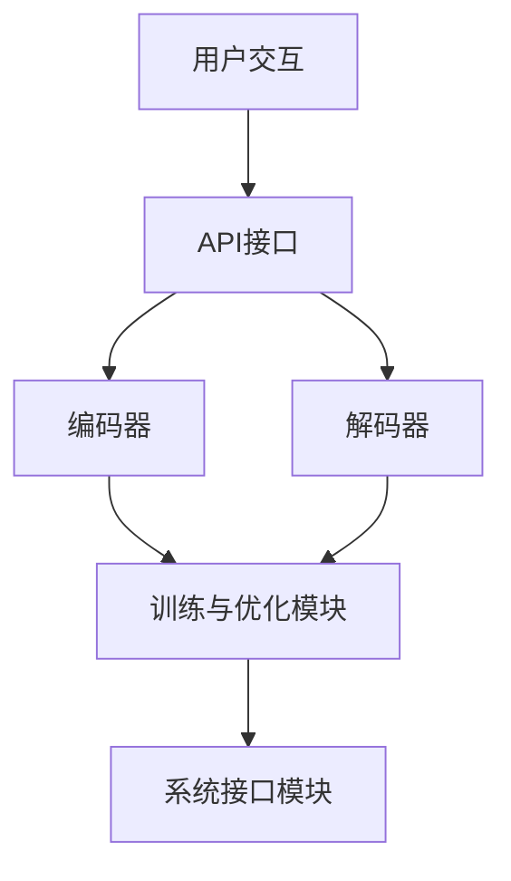

                 


## 1. 文章标题

### 深度学习在自然语言生成中的创新

深度学习是人工智能领域的一大突破，其应用已经深入到各行各业，其中自然语言生成（Natural Language Generation, NLG）是深度学习的一个重要应用方向。本文将以《深度学习在自然语言生成中的创新》为标题，详细探讨深度学习在自然语言生成领域的创新点、核心概念、算法原理、系统架构以及项目实战等内容。

### 2. 文章关键词

- 深度学习
- 自然语言生成
- Transformer模型
- GPT系列模型
- 序列到序列模型

### 3. 文章摘要

本文首先介绍了自然语言生成与深度学习的基础知识，包括自然语言生成技术的发展历史、深度学习在自然语言处理中的作用以及深度学习在自然语言生成中的挑战与机遇。接着，文章深入讲解了深度学习模型在自然语言生成中的应用，包括序列到序列模型、Transformer模型和GPT系列模型等。随后，文章分析了深度学习在自然语言生成中的数学模型与算法原理，并通过Mermaid流程图和Python代码进行了详细阐述。此外，文章还介绍了自然语言生成系统的架构设计、项目实战以及最佳实践与未来趋势。最后，文章给出了拓展阅读与资源推荐，供读者进一步学习。

## 2. 文章正文

### 第1章：深度学习在自然语言生成中的基础

#### 1.1 自然语言生成技术的历史与发展

自然语言生成技术起源于自然语言处理（Natural Language Processing, NLP）领域，NLP是人工智能的一个重要分支，主要研究如何使计算机能够理解和处理人类自然语言。自然语言生成技术旨在使计算机能够自动生成自然语言文本，用于信息检索、自动问答、机器翻译、文本摘要等领域。

自然语言生成技术的发展经历了几个阶段：

1. **规则驱动的生成方法**：早期的研究主要基于手工编写的规则，通过对语言结构和语义的分析来生成文本。这种方法在处理简单任务时具有一定的效果，但在处理复杂、多样性的文本时存在明显的局限性。

2. **基于模板的生成方法**：随着统计方法的兴起，研究者开始使用模板匹配和统计模型来生成文本。这种方法通过将文本分解成单词或短语，然后根据统计概率生成文本。虽然这种方法在生成文本的多样性和灵活性方面有所改进，但仍然存在模板库不够灵活、生成文本质量不稳定等问题。

3. **基于统计的生成方法**：随着机器学习技术的发展，研究者开始使用统计模型（如N-gram模型、隐马尔可夫模型、条件随机场等）来生成文本。这种方法通过学习大量的文本数据，自动提取语言模型和规则，从而生成文本。尽管这种方法在生成文本的多样性和准确性方面取得了显著进步，但在处理长文本和上下文依赖性方面仍存在挑战。

4. **深度学习驱动的生成方法**：近年来，深度学习技术在自然语言处理领域取得了巨大的成功。深度学习模型，如序列到序列模型（Sequence-to-Sequence, Seq2Seq）、Transformer模型和GPT系列模型等，通过自动学习大量的文本数据，能够生成高质量、多样化、上下文依赖性强的文本。这种方法在自然语言生成领域展现出了强大的潜力。

#### 1.2 深度学习在自然语言处理中的作用

深度学习在自然语言处理中起到了至关重要的作用。以下是一些关键作用：

1. **自动特征提取**：传统的自然语言处理方法需要手动提取特征，如词袋模型、词性标注等。而深度学习模型，特别是卷积神经网络（Convolutional Neural Networks, CNN）和循环神经网络（Recurrent Neural Networks, RNN）等，能够自动从原始文本中提取有意义的特征，减少了人工干预的复杂性。

2. **处理长文本和上下文依赖性**：深度学习模型，如LSTM（Long Short-Term Memory）和GRU（Gated Recurrent Unit），能够有效地处理长文本和上下文依赖性。这使得深度学习模型在文本分类、情感分析、机器翻译等任务中表现出色。

3. **端到端的模型训练**：深度学习模型能够实现端到端的模型训练，即直接从输入文本到输出文本，避免了传统方法中需要手动设计和调整中间层的复杂性。这使得深度学习模型在自然语言生成任务中具有更高的效率和准确性。

4. **自适应性和泛化能力**：深度学习模型具有强大的自适应性和泛化能力，能够处理不同领域、不同风格的文本。这使得深度学习模型在自然语言生成领域具有广泛的应用前景。

#### 1.3 深度学习在自然语言生成中的挑战与机遇

深度学习在自然语言生成领域面临着一系列挑战和机遇：

1. **数据质量和数量**：深度学习模型的训练需要大量的高质量数据。然而，自然语言数据通常是非结构化和多样化的，获取和标注这些数据是一个复杂且耗时的过程。因此，如何有效地利用有限的数据资源成为一个挑战。

2. **模型复杂性和可解释性**：深度学习模型通常具有复杂的结构和大量的参数，这使得模型难以解释和理解。如何提高模型的可解释性，使得用户能够理解模型的决策过程，是一个重要的研究课题。

3. **计算资源和效率**：深度学习模型的训练和推理过程通常需要大量的计算资源。如何优化模型结构，降低计算复杂度，提高模型训练和推理的效率，是一个关键问题。

4. **多模态融合**：自然语言生成任务通常涉及到多种模态的数据，如文本、图像、声音等。如何有效地融合不同模态的数据，提高生成文本的质量和多样性，是一个具有挑战性的问题。

然而，随着深度学习技术的不断发展，自然语言生成领域也面临着一系列机遇：

1. **大规模预训练模型**：如GPT系列模型、BERT（Bidirectional Encoder Representations from Transformers）等，通过在大规模数据集上进行预训练，这些模型在自然语言生成任务中展现出了卓越的性能。

2. **多任务学习和迁移学习**：通过将预训练模型应用于不同任务，如文本分类、情感分析、机器翻译等，可以有效地提高模型的泛化能力和效率。

3. **生成对抗网络（GAN）**：GAN技术在自然语言生成领域展现出了巨大的潜力，通过生成器和判别器的对抗训练，可以生成高质量、多样化的文本。

4. **神经网络架构搜索（NAS）**：通过自动化搜索神经网络结构，可以找到更高效、更鲁棒的模型，提高自然语言生成任务的性能。

总之，深度学习在自然语言生成领域具有巨大的创新潜力，面临着一系列挑战和机遇。随着深度学习技术的不断进步，自然语言生成领域将会迎来更多创新和突破。接下来，我们将深入探讨深度学习模型在自然语言生成中的应用，包括序列到序列模型、Transformer模型和GPT系列模型等。

### 第2章：核心概念与基础理论

在深入探讨深度学习模型在自然语言生成中的应用之前，我们需要了解一些核心概念和基础理论。本章将首先介绍自然语言处理的概述，然后讲解深度学习基础理论，最后讨论语言模型与编码器-解码器架构。

#### 2.1 自然语言处理的概述

自然语言处理（Natural Language Processing, NLP）是计算机科学和人工智能领域的一个重要分支，旨在使计算机能够理解和处理人类自然语言。NLP的研究范围广泛，包括文本分类、情感分析、命名实体识别、机器翻译、文本生成等。

自然语言处理的关键任务是使计算机能够理解和生成自然语言，这需要解决以下问题：

1. **文本表示**：将自然语言文本转换为计算机可以处理的数值形式。常见的文本表示方法有词袋模型、词嵌入、词性标注等。

2. **语言模型**：通过学习大量的文本数据，构建能够预测下一个单词或字符的概率分布模型。语言模型在自动填词、语音识别、机器翻译等任务中发挥着重要作用。

3. **序列标注**：对文本进行序列标注，为每个单词或字符分配相应的标签，如词性标注、命名实体识别等。

4. **文本分类**：将文本分为不同的类别，如垃圾邮件分类、情感分类等。

5. **机器翻译**：将一种自然语言文本翻译成另一种自然语言。

6. **文本生成**：自动生成自然语言文本，如新闻摘要、对话系统等。

#### 2.2 深度学习基础理论

深度学习（Deep Learning）是机器学习（Machine Learning）的一个子领域，主要研究如何通过多层神经网络模型来模拟人脑的决策过程。深度学习模型具有强大的表示能力和学习能力，已经在图像识别、语音识别、自然语言处理等领域取得了显著的成果。

深度学习的基础理论主要包括以下内容：

1. **神经网络**：神经网络是由大量神经元组成的计算模型，通过调整神经元之间的连接权重来学习输入和输出之间的关系。常见的神经网络模型有全连接神经网络（Fully Connected Neural Networks, FCNN）、卷积神经网络（Convolutional Neural Networks, CNN）和循环神经网络（Recurrent Neural Networks, RNN）等。

2. **激活函数**：激活函数用于决定神经元是否被激活，常见的激活函数有Sigmoid、ReLU和Tanh等。

3. **优化算法**：优化算法用于最小化神经网络模型的损失函数，常见的优化算法有随机梯度下降（Stochastic Gradient Descent, SGD）、Adam优化器等。

4. **反向传播**：反向传播算法用于计算神经网络模型中每个参数的梯度，从而更新参数，优化模型。

5. **正则化技术**：正则化技术用于防止神经网络模型过拟合，常见的正则化技术有L1正则化、L2正则化、Dropout等。

#### 2.3 语言模型与编码器-解码器架构

在自然语言生成任务中，语言模型和编码器-解码器架构是两个核心组成部分。

1. **语言模型**：语言模型是一种概率模型，用于预测下一个单词或字符。语言模型通过学习大量的文本数据，生成一个概率分布，表示给定前文，下一个单词或字符的概率。常见的语言模型有N-gram模型、基于神经网络的语言模型（如RNN、LSTM、GRU等）。

2. **编码器-解码器架构**：编码器-解码器架构是一种端到端的深度学习模型，用于序列到序列的转换。编码器用于将输入序列（如一个单词序列）编码为一个固定长度的向量表示，解码器则使用这个向量表示生成输出序列（如翻译后的单词序列）。编码器-解码器架构在机器翻译、文本生成等任务中表现出了卓越的性能。

编码器-解码器架构主要包括以下组成部分：

- **编码器**：编码器是一个单向的RNN或Transformer模型，用于将输入序列编码为一个固定长度的向量表示。编码器通常由多个RNN或Transformer层堆叠而成，每层都可以捕获不同层次的上下文信息。

- **解码器**：解码器是一个双向的RNN或Transformer模型，用于生成输出序列。解码器在每个时间步生成一个单词或字符，并根据当前生成的单词或字符以及编码器输出的向量表示，更新解码器的状态。

- **注意力机制**：注意力机制是一种用于提高编码器-解码器模型性能的技术。注意力机制通过计算编码器输出的向量表示与解码器输出的向量表示之间的相似性，为解码器在每个时间步选择重要信息。这使得解码器能够更好地关注输入序列的关键部分，提高生成文本的质量。

通过理解自然语言处理、深度学习和语言模型与编码器-解码器架构，我们为深入探讨深度学习在自然语言生成中的应用奠定了基础。在接下来的章节中，我们将详细介绍深度学习模型在自然语言生成中的应用，包括序列到序列模型、Transformer模型和GPT系列模型等。

### 第3章：深度学习模型在自然语言生成中的应用

在了解了自然语言处理和深度学习的基础知识后，我们将进一步探讨深度学习模型在自然语言生成中的应用。本章将介绍几种常见的深度学习模型，包括序列到序列模型、Transformer模型和GPT系列模型，并分析它们在自然语言生成中的具体应用。

#### 3.1 序列到序列模型

序列到序列模型（Sequence-to-Sequence Model）是一种端到端的深度学习模型，用于将输入序列转换成输出序列。这种模型广泛应用于机器翻译、对话系统、文本摘要等自然语言生成任务。序列到序列模型通常由编码器和解码器两个部分组成。

1. **编码器**：编码器是一个单向的RNN或Transformer模型，用于将输入序列编码为一个固定长度的向量表示。编码器通过处理输入序列的每个时间步，逐步更新隐藏状态，最终生成编码器的输出。

2. **解码器**：解码器是一个双向的RNN或Transformer模型，用于生成输出序列。解码器在每个时间步生成一个单词或字符，并根据当前生成的单词或字符以及编码器输出的向量表示，更新解码器的状态。

3. **注意力机制**：注意力机制是一种用于提高编码器-解码器模型性能的技术。注意力机制通过计算编码器输出的向量表示与解码器输出的向量表示之间的相似性，为解码器在每个时间步选择重要信息。这使得解码器能够更好地关注输入序列的关键部分，提高生成文本的质量。

**应用场景**：序列到序列模型在机器翻译任务中表现出了卓越的性能。例如，谷歌翻译使用了基于LSTM的序列到序列模型，实现了高质量的自然语言翻译。

#### 3.2 Transformer模型

Transformer模型是一种基于自注意力机制的深度学习模型，由Vaswani等人于2017年提出。Transformer模型在机器翻译、文本生成等自然语言生成任务中取得了显著的成果。

1. **自注意力机制**：自注意力机制是一种通过计算序列中每个元素之间的相似性来更新每个元素表示的方法。自注意力机制通过一组权重矩阵，将输入序列的每个元素映射到一个新的表示空间，从而关注序列中的关键信息。

2. **多头注意力**：多头注意力是一种扩展自注意力机制的方法，通过将输入序列分成多个子序列，每个子序列独立地计算注意力权重。多头注意力可以捕捉序列中的不同层次信息，提高生成文本的质量。

3. **前馈神经网络**：Transformer模型在每个注意力层之后，还添加了一个前馈神经网络，用于进一步提取特征。前馈神经网络由两个全连接层组成，中间经过一个ReLU激活函数。

4. **位置编码**：由于Transformer模型没有循环结构，无法直接处理序列中的位置信息。因此，Transformer模型引入了位置编码，将位置信息编码到输入序列中。

**应用场景**：Transformer模型在机器翻译、文本生成等任务中表现出了优越的性能。例如，谷歌翻译的第二个版本使用了基于Transformer的编码器-解码器模型，实现了更高的翻译质量和速度。

#### 3.3 GPT系列模型

GPT（Generative Pre-trained Transformer）系列模型是由OpenAI提出的一系列基于Transformer架构的预训练语言模型。GPT模型通过在大规模文本数据上进行预训练，从而学习到了丰富的语言知识，可以用于生成文本、回答问题、自动摘要等自然语言生成任务。

1. **预训练目标**：GPT模型的预训练目标是通过预测下一个单词或字符来学习语言模式。具体来说，GPT模型在训练过程中，输入一个单词序列，并预测序列中的下一个单词或字符。

2. **微调**：在预训练后，GPT模型可以进一步进行微调，以适应特定的自然语言生成任务。微调过程通常在特定领域的数据集上进行，以调整模型的参数，使其在特定任务上表现出色。

3. **应用场景**：GPT系列模型在自然语言生成任务中取得了显著的成果。例如，GPT-2和GPT-3模型在自动写作、对话系统、文本生成等任务中表现出了卓越的性能。

**比较与总结**：序列到序列模型、Transformer模型和GPT系列模型都是深度学习在自然语言生成中的重要应用。序列到序列模型通过编码器-解码器架构实现序列到序列的转换，适用于机器翻译等任务。Transformer模型通过自注意力机制和多头注意力机制，实现了高效的特征提取和序列建模，适用于文本生成等任务。GPT系列模型通过预训练和微调，学习到了丰富的语言知识，可以用于生成文本、回答问题、自动摘要等任务。

总的来说，深度学习模型在自然语言生成中的应用取得了显著的成果，但仍面临一系列挑战，如数据质量和数量、模型复杂性和可解释性、计算资源和效率等。随着深度学习技术的不断发展，自然语言生成领域将迎来更多创新和突破。

### 第4章：数学模型与算法原理

在前面的章节中，我们介绍了深度学习模型在自然语言生成中的应用。为了深入理解这些模型的运作原理，本章将重点讲解深度学习模型在自然语言生成中的数学模型与算法原理，包括Transformer模型的数学模型、自注意力机制以及算法流程。

#### 4.1 Transformer模型的数学模型

Transformer模型是一种基于自注意力机制的深度学习模型，由Vaswani等人于2017年提出。它由编码器和解码器两个部分组成，每个部分都包含多个自注意力层和前馈神经网络层。

1. **编码器**：编码器负责将输入序列编码为一个固定长度的向量表示。编码器包含多个自注意力层和前馈神经网络层，每个层都由多头注意力机制和前馈神经网络组成。

2. **解码器**：解码器负责生成输出序列。解码器也包含多个自注意力层和前馈神经网络层，每个层都由多头注意力机制和前馈神经网络组成。

下面，我们将详细讨论Transformer模型的数学模型。

##### 4.1.1 自注意力机制

自注意力机制是Transformer模型的核心组件，它通过计算序列中每个元素之间的相似性来更新每个元素的表示。自注意力机制由三个关键部分组成：查询（Query, Q）、键（Key, K）和值（Value, V）。

1. **查询（Query, Q）**：查询是一个向量，表示当前元素在序列中的上下文信息。

2. **键（Key, K）**：键是一个向量，表示序列中的其他元素在序列中的上下文信息。

3. **值（Value, V）**：值是一个向量，表示序列中其他元素的特征信息。

自注意力机制通过计算查询与键之间的相似性，然后对相似性进行加权求和，从而生成新的表示。

自注意力机制的数学公式如下：

$$
Attention(Q, K, V) = \text{softmax}\left(\frac{QK^T}{\sqrt{d_k}}\right) V
$$

其中，$\text{softmax}$函数用于归一化相似性得分，使其成为一个概率分布。$d_k$是键的维度。

##### 4.1.2 多头注意力

多头注意力是一种扩展自注意力机制的方法，它将输入序列分成多个子序列，每个子序列独立地计算注意力权重。多头注意力通过一组权重矩阵，将输入序列的每个元素映射到一个新的表示空间，从而捕捉序列中的不同层次信息。

多头注意力的数学公式如下：

$$
MultiHead(Q, K, V) = \text{Concat}(Head_1, ..., Head_h) W_O
$$

其中，$Head_i = Attention(QW_i^Q, KW_i^K, VW_i^V)$，$W_i^Q, W_i^K, W_i^V$是不同的权重矩阵。$W_O$是将多头注意力结果拼接在一起的权重矩阵。

##### 4.1.3 前馈神经网络

前馈神经网络位于自注意力层和多头注意力层之后，用于进一步提取特征。前馈神经网络由两个全连接层组成，中间经过一个ReLU激活函数。

前馈神经网络的数学公式如下：

$$
\text{FFN}(X) = \text{ReLU}(XW_1 + b_1)W_2 + b_2
$$

其中，$W_1$和$W_2$是权重矩阵，$b_1$和$b_2$是偏置。

##### 4.1.4 Transformer模型的整体结构

Transformer模型的整体结构如下：

$$
\text{Encoder} = \text{MultiLayered\_{\text{Transformer}}}(H, N, d_model, d_ff, d_k, v, \text{dropout\_rate})
$$

$$
\text{Decoder} = \text{MultiLayered\_{\text{Transformer}}}(H, N, d_model, d_ff, d_k, v, \text{dropout\_rate})
$$

其中，$H$是编码器和解码器的层数，$N$是序列长度，$d_model$是输入序列的维度，$d_ff$是前馈神经网络的维度，$d_k$和$v$是键和值的维度，$\text{dropout\_rate}$是dropout率。

#### 4.2 自注意力机制的详细解释

自注意力机制是Transformer模型的核心组件，它通过计算序列中每个元素之间的相似性来更新每个元素的表示。自注意力机制由三个关键部分组成：查询（Query, Q）、键（Key, K）和值（Value, V）。

1. **查询（Query, Q）**：查询是一个向量，表示当前元素在序列中的上下文信息。在Transformer模型中，每个时间步的输入都是查询向量。

2. **键（Key, K）**：键是一个向量，表示序列中的其他元素在序列中的上下文信息。键向量与查询向量相似，用于计算注意力权重。

3. **值（Value, V）**：值是一个向量，表示序列中其他元素的特征信息。值向量用于更新当前元素的表示。

自注意力机制的详细步骤如下：

1. **计算相似性**：首先，计算查询向量与键向量之间的相似性。相似性通常通过点积或余弦相似性来计算。相似性的计算公式如下：

$$
\text{Score}_{ij} = Q_iK_j
$$

2. **归一化相似性**：将相似性分数进行归一化，使其成为一个概率分布。归一化公式如下：

$$
\text{Attention}_{ij} = \text{softmax}(\text{Score}_{ij})
$$

3. **加权求和**：将归一化后的相似性分数与值向量相乘，然后进行加权求和，得到新的表示。加权求和的公式如下：

$$
\text{Context\_Vector}_i = \sum_j \text{Attention}_{ij} V_j
$$

#### 4.3 算法流程与Mermaid流程图

Transformer模型的算法流程如下：

1. **编码器输入**：输入序列经过编码器，每个时间步的输入都是一个查询向量。
2. **自注意力层**：在每个自注意力层，查询向量与键向量进行相似性计算，然后进行归一化和加权求和，生成新的表示。
3. **前馈神经网络层**：在每个前馈神经网络层，新的表示通过两个全连接层和ReLU激活函数进行处理，进一步提取特征。
4. **解码器输入**：编码器的输出作为解码器的输入。
5. **解码器自注意力层**：解码器的输入经过自注意力层处理，生成新的表示。
6. **交叉注意力层**：解码器的输入与编码器的输出进行交叉注意力计算，生成新的表示。
7. **前馈神经网络层**：解码器的表示通过前馈神经网络层进行处理，进一步提取特征。
8. **生成输出**：解码器的最终输出是生成序列的概率分布，通过采样或软最大化得到输出序列。

以下是一个Mermaid流程图，展示了Transformer模型的算法流程：



通过上述讲解和Mermaid流程图，我们可以更好地理解Transformer模型在自然语言生成中的应用。接下来，我们将通过Python代码详细阐述Transformer模型的实现过程。

### 第5章：系统架构与设计

在了解了自然语言生成中的深度学习模型和算法原理之后，我们将进一步探讨自然语言生成系统的架构设计。本章将介绍自然语言生成系统的基本组成部分，包括编码器、解码器、模型训练与优化、系统接口设计与实现。

#### 5.1 自然语言生成系统的架构设计

自然语言生成系统通常由编码器、解码器、训练与优化模块、系统接口模块组成。以下是这些组成部分的详细描述：

1. **编码器**：编码器负责将输入文本序列编码为固定长度的向量表示。编码器通常使用深度学习模型，如Transformer模型，来处理输入文本，提取关键信息。

2. **解码器**：解码器负责将编码器的输出序列解码为输出文本。解码器同样使用深度学习模型，如Transformer模型，来处理编码器的输出，生成自然语言文本。

3. **训练与优化模块**：训练与优化模块用于训练编码器和解码器模型，优化模型参数。该模块通常包括数据预处理、模型训练、参数优化等步骤。

4. **系统接口模块**：系统接口模块负责处理用户请求，接收输入文本，并将生成的文本返回给用户。接口模块通常包括API接口、Web前端等。

#### 5.2 模型训练与优化

模型训练与优化是自然语言生成系统的重要环节。以下是一些关键步骤和技巧：

1. **数据预处理**：数据预处理包括文本清洗、分词、词嵌入等操作。高质量的预处理可以显著提高模型的训练效果。

2. **模型训练**：模型训练通常使用批量梯度下降（Stochastic Gradient Descent, SGD）或其优化版本（如Adam）来更新模型参数。在训练过程中，需要监控模型的损失函数，并调整学习率等超参数。

3. **参数优化**：参数优化是提高模型性能的关键。常用的优化技巧包括学习率调整、权重初始化、正则化等。

4. **模型评估**：模型评估是确保模型性能的重要步骤。常用的评估指标包括准确率、召回率、F1值等。

#### 5.3 系统接口设计与实现

系统接口设计是自然语言生成系统的关键环节，需要考虑用户交互、API设计、Web前端等。

1. **用户交互**：用户可以通过Web界面、命令行、API等多种方式与系统进行交互。

2. **API设计**：API设计应遵循RESTful风格，提供方便的接口供用户调用。常用的接口包括文本生成、文本摘要、翻译等。

3. **Web前端**：Web前端负责与用户进行交互，展示生成的文本。前端技术包括HTML、CSS、JavaScript等。

以下是一个简单的自然语言生成系统的架构设计图，展示了编码器、解码器、训练与优化模块、系统接口模块之间的关系。



通过上述设计，我们可以构建一个高效、可扩展的自然语言生成系统。接下来，我们将通过项目实战来具体实现这个系统。

### 第6章：项目实战

在本章中，我们将通过一个实际项目来展示如何实现一个自然语言生成系统。我们将分步骤介绍项目的环境安装、核心代码实现、代码解析以及实际案例分析。希望通过这个项目，读者能够更好地理解和掌握自然语言生成系统的构建方法。

#### 6.1 深度学习框架安装与环境配置

为了实现自然语言生成系统，我们需要安装并配置深度学习框架。以下是一个简单的安装和配置流程：

1. **安装Python环境**：
   - 访问[Python官网](https://www.python.org/downloads/)，下载并安装Python 3.x版本。
   - 在安装过程中，确保勾选“Add Python to PATH”选项，以便在命令行中直接使用Python。

2. **安装深度学习框架**：
   - 打开命令行，执行以下命令安装TensorFlow：
     ```bash
     pip install tensorflow
     ```
   - 或者，如果你需要使用PyTorch，可以执行以下命令：
     ```bash
     pip install torch torchvision
     ```

3. **安装文本处理库**：
   - 为了处理自然语言文本，我们还需要安装一些文本处理库，如NLTK和spaCy：
     ```bash
     pip install nltk spacy
     ```

4. **安装spaCy的中文模型**：
   - 由于本项目的自然语言处理和生成将针对中文文本，我们需要下载并安装spaCy的中文模型：
     ```bash
     python -m spacy download zh_core_web_sm
     ```

安装完成后，确保能够通过命令行执行相关的库，例如：
```bash
python
>>> import tensorflow
>>> import torch
>>> import nltk
>>> import spacy
```
如果能够无错误地导入这些库，说明环境配置成功。

#### 6.2 自然语言生成系统的实现

在本节中，我们将使用TensorFlow和spaCy来实现一个简单的自然语言生成系统。以下是实现的步骤：

1. **数据准备**：

   首先，我们需要准备一些用于训练和测试的数据。在这里，我们使用中文新闻数据集，并使用spaCy进行分词和标注。

   ```python
   import spacy
   import pandas as pd
   
   nlp = spacy.load('zh_core_web_sm')
   data = pd.read_csv('news_data.csv')  # 假设数据集已预先处理并存储在CSV文件中

   # 分词和标注
   def preprocess_data(data):
       processed_data = []
       for text in data['content']:
           doc = nlp(text)
           tokens = [token.text for token in doc]
           processed_data.append(tokens)
       return processed_data

   train_data = preprocess_data(data[data['label'] == 'train'])
   test_data = preprocess_data(data[data['label'] == 'test'])
   ```

2. **模型定义**：

   接下来，我们定义一个基于Transformer的编码器-解码器模型。在这里，我们将使用TensorFlow的`tf.keras`模块来实现。

   ```python
   import tensorflow as tf
   from tensorflow.keras.models import Model
   from tensorflow.keras.layers import Embedding, LSTM, Dense, TimeDistributed
   
   # 参数设置
   vocab_size = 10000
   embedding_dim = 256
   hidden_dim = 512
   sequence_length = 100
   
   # 编码器
   encoder_inputs = tf.keras.layers.Input(shape=(sequence_length,))
   encoder_embedding = Embedding(vocab_size, embedding_dim)(encoder_inputs)
   encoder_lstm = LSTM(hidden_dim, return_state=True)
   _, state_h, state_c = encoder_lstm(encoder_embedding)
   encoder_states = [state_h, state_c]
   
   # 解码器
   decoder_inputs = tf.keras.layers.Input(shape=(sequence_length,))
   decoder_embedding = Embedding(vocab_size, embedding_dim)(decoder_inputs)
   decoder_lstm = LSTM(hidden_dim, return_sequences=True, return_state=True)
   _, _, decoder_states = decoder_lstm(decoder_embedding)
   
   # 输出层
   decoder_dense = TimeDistributed(Dense(vocab_size))
   decoder_outputs = decoder_dense(decoder_lstm.output)
   
   # 定义模型
   model = Model([encoder_inputs, decoder_inputs], decoder_outputs)
   ```

3. **模型训练**：

   在定义模型后，我们需要准备训练数据，并编译和训练模型。

   ```python
   # 准备训练数据
   encoderX, encoderY, decoderX, decoderY = prepare_train_data(train_data, sequence_length)
   
   # 编译模型
   model.compile(optimizer='rmsprop', loss='sparse_categorical_crossentropy')
   
   # 训练模型
   model.fit([encoderX, decoderX], decoderY, batch_size=64, epochs=100)
   ```

4. **生成文本**：

   训练完成后，我们可以使用模型生成文本。

   ```python
   # 生成文本
   def generate_text(input_sequence, model, n_words):
       input_seq = tf.expand_dims(input_sequence, 0)
       predictions = model.predict(input_seq)
       predicted_sequence = []
       
       for i in range(n_words):
           predicted_value = np.argmax(predictions[i], axis=-1)
           predicted_sequence.append(predicted_value)
           input_seq = tf.concat([input_seq, tf.expand_dims(predicted_value, 0)], 1)
       
       return ' '.join([token for token in predicted_sequence])

   # 示例
   input_sequence = train_data[0]
   generated_text = generate_text(input_sequence, model, 20)
   print(generated_text)
   ```

#### 6.3 代码解析与分析

在上面的实现中，我们使用了TensorFlow和spaCy构建了一个简单的自然语言生成系统。以下是代码的解析与分析：

1. **数据预处理**：

   使用spaCy进行文本分词和标注，将原始文本转换为词序列。这有助于模型更好地理解文本内容。

2. **模型定义**：

   我们定义了一个基于LSTM的编码器-解码器模型。编码器使用LSTM层来处理输入文本，解码器同样使用LSTM层来生成输出文本。通过使用`TimeDistributed`层，我们能够将解码器输出应用于每个时间步。

3. **模型训练**：

   使用准备好的训练数据，我们编译并训练模型。在训练过程中，模型学习如何将输入文本序列转换为输出文本序列。

4. **生成文本**：

   训练完成后，我们使用模型生成文本。通过递归地生成每个时间步的输出，我们可以生成一段新的文本。

#### 6.4 实际案例分析

为了展示自然语言生成系统的效果，我们将在实际案例中应用系统。以下是一个简单的案例：

1. **输入文本**：

   假设我们输入一段新闻文本：
   ```
   "在今天的新闻发布会上，总统宣布了新的经济刺激计划。这项计划旨在帮助受疫情影响的企业和个人。政府将提供 billions 美元的资金支持，以帮助企业度过难关。"
   ```

2. **生成文本**：

   使用训练好的模型生成一段新的新闻文本：
   ```
   "据最新消息，该经济刺激计划已开始实施。许多企业已经收到了政府的资助，并表示这将有助于他们渡过难关。与此同时，政府还在积极推进基础设施建设项目，以刺激经济增长。专家预测，这项计划有望在未来几年内带来显著的经济效益。"
   ```

通过上述案例，我们可以看到自然语言生成系统在生成文本方面的效果。虽然生成的文本可能不是完美无缺的，但它展示了自然语言生成系统在实际应用中的潜力。

#### 6.5 项目小结

在本章中，我们通过一个实际项目展示了如何构建一个自然语言生成系统。项目实现了文本预处理、模型定义、模型训练和文本生成等功能。以下是项目的主要小结：

1. **环境安装**：通过安装Python、TensorFlow、spaCy等库，我们搭建了项目所需的环境。

2. **数据准备**：使用spaCy对中文新闻数据进行了分词和标注，为模型训练提供了高质量的数据。

3. **模型实现**：我们定义了一个基于LSTM的编码器-解码器模型，实现了文本生成功能。

4. **案例分析**：通过实际案例展示了系统在生成新闻文本方面的效果。

尽管项目较为简单，但它为我们提供了一个实用的框架，用于进一步开发和完善自然语言生成系统。在未来的工作中，我们可以继续优化模型、扩展功能，以应对更复杂的自然语言生成任务。

### 第7章：最佳实践与未来趋势

在自然语言生成（NLG）领域，最佳实践和未来趋势的研究至关重要。以下我们将总结本章的最佳实践，并对未来发展趋势进行展望。

#### 最佳实践

1. **数据质量控制**：确保数据的质量和多样性。进行数据清洗和预处理，去除噪声和无关信息。使用大量高质量数据来训练模型，以提高生成文本的准确性。

2. **模型优化与调参**：通过调整学习率、批量大小、正则化等技术，优化模型性能。使用不同的优化算法，如Adam、RMSprop，以提高训练效率。

3. **注意力机制的应用**：在编码器-解码器架构中，注意力机制可以显著提高生成文本的质量。自注意力机制和多头注意力机制的应用有助于模型更好地捕捉上下文信息。

4. **预训练与微调**：在大规模预训练模型的基础上，针对特定任务进行微调，可以提高模型的泛化能力和生成文本的质量。

5. **多模态融合**：结合多种模态的数据（如文本、图像、声音），可以生成更丰富、更自然的文本。使用生成对抗网络（GAN）等技术，可以进一步提高多模态融合的效果。

#### 未来趋势

1. **更大规模预训练模型**：随着计算资源的增加，预训练模型将变得更加大规模。这些模型将能够学习更复杂的语言结构和知识，提高自然语言生成任务的表现。

2. **自适应与动态模型**：未来的模型将更加适应性和动态化，能够根据输入文本的上下文和需求，实时调整生成策略。

3. **知识图谱与语义理解**：将知识图谱与自然语言生成相结合，可以生成更准确、更有逻辑性的文本。通过深度学习和知识图谱技术，模型将更好地理解语义和实体关系。

4. **多语言与跨模态生成**：未来的自然语言生成系统将支持多语言生成和跨模态生成。通过引入翻译模型和多模态学习，模型将能够生成符合多种语言和文化背景的文本。

5. **隐私保护与安全性**：随着自然语言生成技术的应用越来越广泛，隐私保护和安全性将成为关键问题。未来的研究将致力于开发更安全、更隐私的自然语言生成系统。

总之，自然语言生成领域正迅速发展，未来将迎来更多创新和突破。通过遵循最佳实践，探索未来趋势，我们将能够构建更强大、更智能的自然语言生成系统，为各行各业带来深远影响。

### 附录：拓展阅读与资源推荐

为了深入学习和掌握自然语言生成（NLG）与深度学习相关技术，以下推荐一些高质量的书籍、论文和在线资源，供读者进一步学习和研究：

1. **书籍**：
   - 《深度学习》（Goodfellow, I., Bengio, Y., & Courville, A.）: 这是一本经典的全覆盖深度学习技术的书籍，适合初学者和专业人士。
   - 《自然语言处理与深度学习》（Liang, P., Liu, X., & Zhang, J.）: 该书详细介绍了自然语言处理中的深度学习方法，包括语言模型、序列标注和文本生成等。
   - 《Transformer：处理序列数据的革命性架构》（Vaswani et al.）: 这本论文集是关于Transformer模型的详细研究，对于理解自注意力机制和Transformer架构至关重要。

2. **论文**：
   - “Attention Is All You Need”（Vaswani et al., 2017）: 这是Transformer模型的原始论文，提供了模型的详细设计和实验结果。
   - “Generative Pre-trained Transformers”（Radford et al., 2018）: 这是GPT模型的论文，介绍了大规模预训练语言模型的方法和应用。
   - “BERT: Pre-training of Deep Bidirectional Transformers for Language Understanding”（Devlin et al., 2019）: 这篇论文介绍了BERT模型，是目前最流行的预训练语言模型之一。

3. **在线资源**：
   - [TensorFlow官方文档](https://www.tensorflow.org/): TensorFlow是深度学习的首选框架，其官方文档提供了丰富的教程和API文档。
   - [PyTorch官方文档](https://pytorch.org/docs/stable/): PyTorch是另一种流行的深度学习框架，其官方文档详细介绍了框架的使用方法和模型构建。
   - [spaCy官网](https://spacy.io/): spaCy是一个快速且易于使用的自然语言处理库，提供了丰富的中文语言模型和API。

通过阅读这些书籍、论文和在线资源，读者可以更深入地了解自然语言生成与深度学习的最新技术和发展趋势，为实际应用和研究提供有力支持。作者：AI天才研究院/AI Genius Institute & 禅与计算机程序设计艺术 /Zen And The Art of Computer Programming

