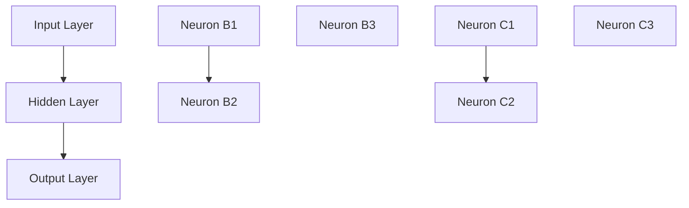
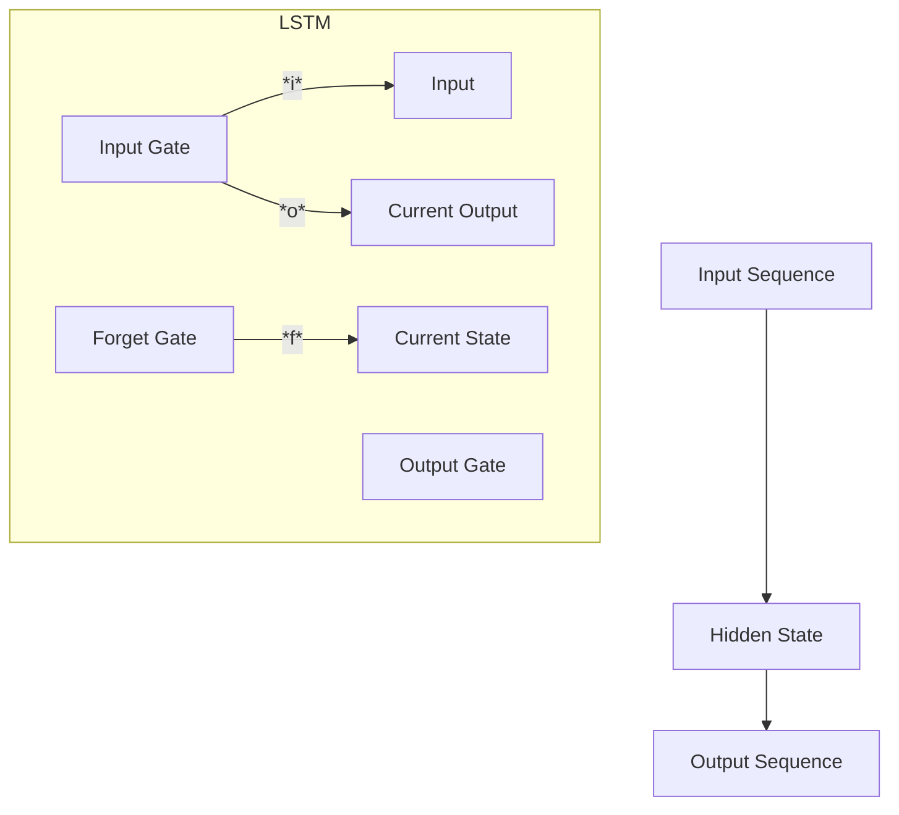
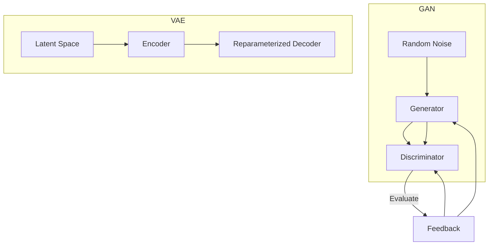
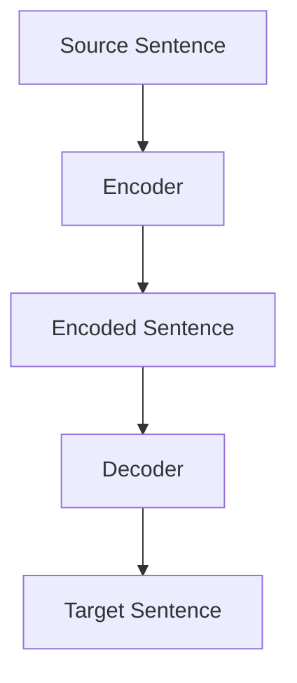
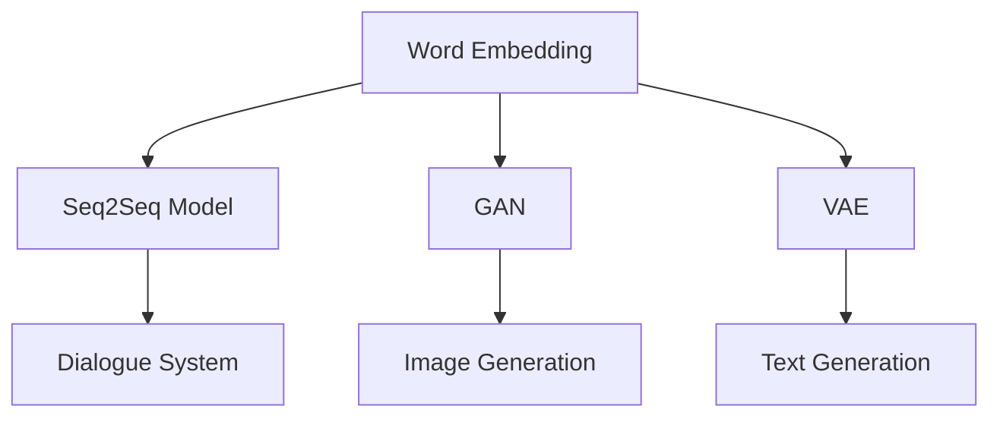
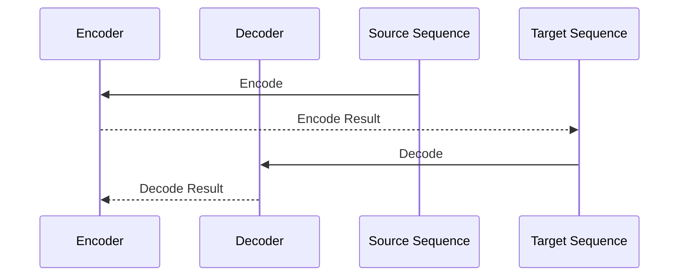
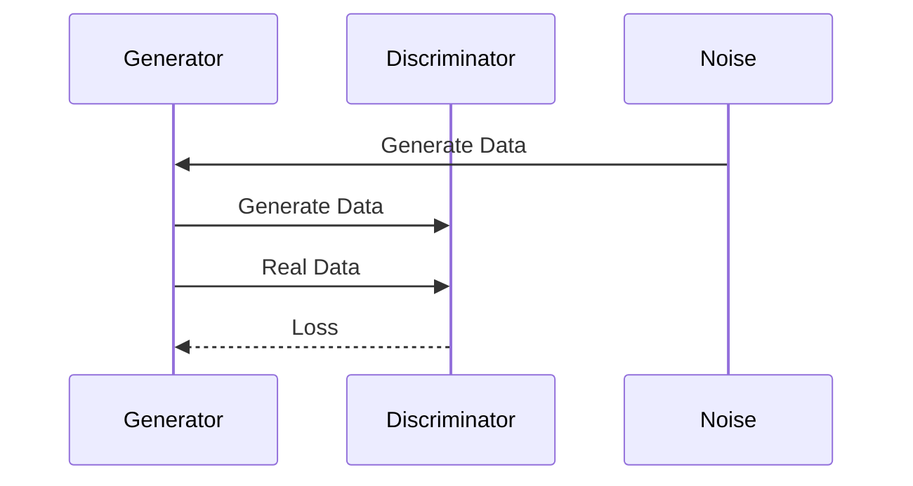
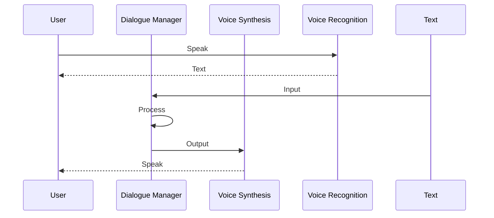
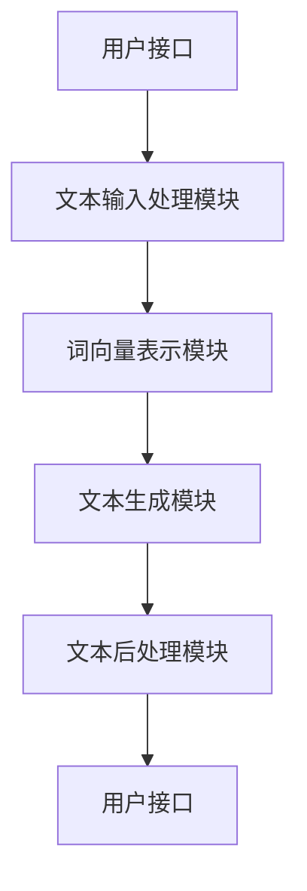
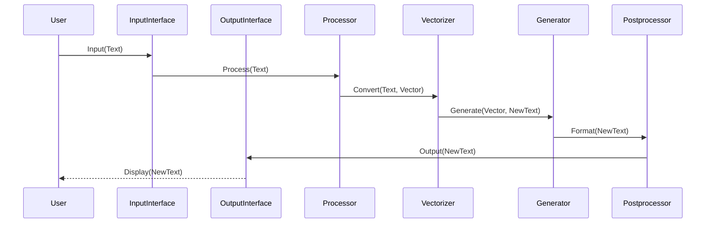

                 

# 深度学习在自然语言生成中的创新应用

## 关键词：深度学习，自然语言生成，神经网络，序列模型，生成模型，对话系统

### 摘要：
本文将深入探讨深度学习在自然语言生成（NLG）领域的创新应用。通过分析NLG的背景和发展，介绍深度学习的基础概念，详细讲解序列到序列模型、生成对抗网络和对话系统的算法原理，并展示实际项目案例。最后，总结最佳实践并展望未来发展方向。

## 第一部分：引言

### 1.1 深度学习在自然语言生成中的背景与挑战

#### 1.1.1 自然语言生成概述
自然语言生成（Natural Language Generation，NLG）是计算机科学与人工智能领域中的一个重要研究方向，旨在通过计算机程序自动生成人类语言。NLG的应用范围广泛，包括但不限于自动新闻编写、语音合成、对话系统、机器翻译等。

#### 1.1.2 深度学习的发展及其在NLG中的应用
随着深度学习技术的飞速发展，基于深度学习的自然语言生成方法逐渐成为研究热点。深度学习通过模拟人脑神经网络结构，能够从大量数据中自动学习特征，从而实现复杂的模式识别和生成任务。

#### 1.1.3 深度学习在NLG中的挑战
尽管深度学习在NLG中展现了巨大的潜力，但也面临一些挑战，如数据依赖性、计算成本高、生成文本的质量控制等。本文将探讨如何利用深度学习解决这些挑战。

### 1.2 书籍结构与内容概览
本书分为六个部分，分别介绍以下内容：
1. **引言**：背景介绍和内容概览。
2. **核心概念与联系**：深度学习基础、深度学习在NLG中的应用。
3. **算法原理讲解**：序列到序列模型、生成对抗网络、对话系统。
4. **系统分析与架构设计**：NLG系统的功能需求分析和架构设计。
5. **项目实战**：实际项目案例介绍和代码实现。
6. **最佳实践与总结**：最佳实践、小结和未来展望。

## 第二部分：核心概念与联系

### 2.1 深度学习基础

#### 2.1.1 神经网络基础
神经网络（Neural Network，NN）是深度学习的基础。它由大量相互连接的神经元组成，通过学习输入和输出之间的关系，实现数据的处理和分类。

#### 2.1.2 序列模型
序列模型（Sequence Model）用于处理序列数据，如文本、语音等。常见的序列模型包括循环神经网络（RNN）和长短期记忆网络（LSTM）。

#### 2.1.3 生成模型
生成模型（Generative Model）能够生成新的数据，如生成对抗网络（GAN）和变分自编码器（VAE）。它们在自然语言生成中具有重要作用。

### 2.2 深度学习在自然语言生成中的应用

#### 2.2.1 词向量表示
词向量表示（Word Embedding）是将词汇映射为高维向量表示的方法，如Word2Vec、GloVe等。它们在NLG中用于表示文本数据。

#### 2.2.2 序列到序列模型
序列到序列模型（Sequence-to-Sequence Model）用于将一个序列映射为另一个序列，如机器翻译、文本摘要等。它由编码器和解码器组成。

#### 2.2.3 对话系统
对话系统（Dialogue System）是NLG的一个典型应用场景，它能够与用户进行自然语言交互。对话系统分为基于规则和基于数据的两种类型。

### 2.3 核心概念联系图
为了更好地理解深度学习在NLG中的核心概念，下面使用Mermaid图展示它们之间的关系：

```
graph TD
A[神经网络] -->|基础| B[序列模型]
A -->|扩展| C[生成模型]
B -->|实例| D[循环神经网络]
B -->|实例| E[长短期记忆网络]
C -->|实例| F[生成对抗网络]
C -->|实例| G[变分自编码器]
```

## 第三部分：算法原理讲解

### 3.1 序列到序列模型

#### 3.1.1 序列到序列模型原理
序列到序列模型（Seq2Seq Model）是一种用于序列转换的神经网络模型。它由编码器（Encoder）和解码器（Decoder）组成，可以用于机器翻译、文本摘要等任务。

#### 3.1.2 序列到序列模型Mermaid流程图
下面是序列到序列模型的Mermaid流程图：

```
sequenceDiagram
    participant Encoder
    participant Decoder
    participant Source Sequence
    participant Target Sequence
    
    Encoder->>Decoder: Encode(Source Sequence)
    Decoder->>Decoder: Decode(Target Sequence)
```

#### 3.1.3 序列到序列模型Python代码示例
下面是一个简单的序列到序列模型的Python代码示例：

```python
# 编码器
class Encoder(nn.Module):
    def __init__(self):
        super(Encoder, self).__init__()
        self.embedding = nn.Embedding(vocab_size, embedding_dim)
        self.lstm = nn.LSTM(embedding_dim, hidden_dim)

    def forward(self, source):
        embedded = self.embedding(source)
        output, (hidden, cell) = self.lstm(embedded)
        return hidden, cell

# 解码器
class Decoder(nn.Module):
    def __init__(self):
        super(Decoder, self).__init__()
        self.embedding = nn.Embedding(vocab_size, embedding_dim)
        self.lstm = nn.LSTM(embedding_dim + hidden_dim, hidden_dim)
        self.fc = nn.Linear(hidden_dim, vocab_size)

    def forward(self, target, hidden, cell):
        embedded = self.embedding(target)
        input = torch.cat((embedded, hidden), 1)
        output, (hidden, cell) = self.lstm(input)
        output = self.fc(output)
        return output, hidden, cell
```

### 3.2 生成对抗网络

#### 3.2.1 生成对抗网络原理
生成对抗网络（Generative Adversarial Network，GAN）是一种由生成器和判别器组成的模型，通过对抗训练生成逼真的数据。

#### 3.2.2 生成对抗网络Mermaid流程图
下面是生成对抗网络的Mermaid流程图：

```
sequenceDiagram
    participant Generator
    participant Discriminator
    participant Noise
    
    Noise->>Generator: Generate(data)
    Generator->>Discriminator: Generate(data)
    Generator->>Discriminator: Real(data)
    Discriminator-->>Generator: Loss
```

#### 3.2.3 生成对抗网络Python代码示例
下面是一个简单的生成对抗网络的Python代码示例：

```python
# 生成器
class Generator(nn.Module):
    def __init__(self):
        super(Generator, self).__init__()
        self.fc = nn.Linear(z_dim, hidden_dim)
        self.lstm = nn.LSTM(hidden_dim, hidden_dim)
        self.embedding = nn.Embedding(vocab_size, embedding_dim)
        self.fc2 = nn.Linear(hidden_dim, output_dim)

    def forward(self, z):
        hidden = self.fc(z)
        output, (hidden, cell) = self.lstm(hidden)
        embedded = self.embedding(output)
        output = self.fc2(embedded)
        return output

# 判别器
class Discriminator(nn.Module):
    def __init__(self):
        super(Discriminator, self).__init__()
        self.embedding = nn.Embedding(vocab_size, embedding_dim)
        self.lstm = nn.LSTM(embedding_dim, hidden_dim)
        self.fc = nn.Linear(hidden_dim, 1)

    def forward(self, x):
        embedded = self.embedding(x)
        output, (hidden, cell) = self.lstm(embedded)
        output = self.fc(output)
        return output
```

### 3.3 对话系统

#### 3.3.1 对话系统原理
对话系统（Dialogue System）是一种能够与用户进行自然语言交互的人工智能系统。它通常包括对话管理、语音合成和语音识别等模块。

#### 3.3.2 对话系统Mermaid流程图
下面是对话系统的Mermaid流程图：

```
sequenceDiagram
    participant User
    participant Dialogue Manager
    participant Voice Synthesis
    participant Voice Recognition
    
    User->>Voice Recognition: Speak
    Voice Recognition-->>User: Text
    Text->>Dialogue Manager: Input
    Dialogue Manager->>Dialogue Manager: Process
    Dialogue Manager->>Voice Synthesis: Output
    Voice Synthesis-->>User: Speak
```

#### 3.3.3 对话系统Python代码示例
下面是一个简单的对话系统的Python代码示例：

```python
# 对话管理器
class DialogueManager(nn.Module):
    def __init__(self):
        super(DialogueManager, self).__init__()
        self.embedding = nn.Embedding(vocab_size, embedding_dim)
        self.lstm = nn.LSTM(embedding_dim, hidden_dim)
        self.fc = nn.Linear(hidden_dim, output_dim)

    def forward(self, input_sequence, hidden):
        embedded = self.embedding(input_sequence)
        output, hidden = self.lstm(embedded, hidden)
        output = self.fc(output)
        return output, hidden

# 语音合成器
class VoiceSynthesis(nn.Module):
    def __init__(self):
        super(VoiceSynthesis, self).__init__()
        self.fc = nn.Linear(hidden_dim, output_dim)

    def forward(self, hidden):
        output = self.fc(hidden)
        return output

# 语音识别器
class VoiceRecognition(nn.Module):
    def __init__(self):
        super(VoiceRecognition, self).__init__()
        self.embedding = nn.Embedding(vocab_size, embedding_dim)
        self.lstm = nn.LSTM(embedding_dim, hidden_dim)

    def forward(self, input_sequence):
        embedded = self.embedding(input_sequence)
        output, (hidden, cell) = self.lstm(embedded)
        return output
```

## 第四部分：系统分析与架构设计

### 4.1 NLG系统功能需求分析

#### 4.1.1 功能需求介绍
NLG系统需要实现以下功能：
1. 文本输入预处理：包括分词、去停用词、词性标注等。
2. 词向量表示：将文本转换为词向量。
3. 文本生成：根据输入的文本或语义，生成新的文本。
4. 文本后处理：包括语法检查、文本格式化等。

#### 4.1.2 NLG系统领域模型类图
下面是NLG系统的领域模型类图：

```
classDiagram
    Class Customer
    Class TextInput
    Class WordVector
    Class TextGenerator
    Class TextOutput
    Class Preprocessor
    Class Postprocessor
    
    Customer "uses" TextInput
    TextInput "uses" Preprocessor
    Preprocessor "uses" WordVector
    WordVector "uses" TextGenerator
    TextGenerator "uses" Postprocessor
    TextOutput "uses" Postprocessor
    
    Customer "receives" TextOutput
```

### 4.2 NLG系统架构设计

#### 4.2.1 系统架构介绍
NLG系统架构包括以下几个部分：
1. 输入处理模块：负责文本输入预处理。
2. 词向量表示模块：将文本转换为词向量。
3. 文本生成模块：根据输入的文本或语义，生成新的文本。
4. 文本后处理模块：对生成的文本进行语法检查、文本格式化等。

#### 4.2.2 NLG系统架构Mermaid图
下面是NLG系统的架构Mermaid图：

```
graph TD
    A[输入处理模块] -->|词向量表示| B[词向量表示模块]
    B -->|文本生成| C[文本生成模块]
    C -->|文本后处理| D[文本后处理模块]
    D -->|输出| E[文本输出]
```

#### 4.2.3 系统接口设计
系统接口设计包括以下部分：
1. 文本输入接口：用于接收用户输入的文本。
2. 文本输出接口：用于输出生成的文本。

#### 4.2.4 系统交互Mermaid序列图
下面是系统交互的Mermaid序列图：

```
sequenceDiagram
    participant User
    participant InputInterface
    participant OutputInterface
    participant Processor
    participant Vectorizer
    participant Generator
    participant Postprocessor
    
    User->>InputInterface: Input(Text)
    InputInterface->>Processor: Process(Text)
    Processor->>Vectorizer: Convert(Text, Vector)
    Vectorizer->>Generator: Generate(Vector, NewText)
    Generator->>Postprocessor: Format(NewText)
    Postprocessor->>OutputInterface: Output(NewText)
    OutputInterface-->>User: Display(NewText)
```

## 第五部分：项目实战

### 5.1 实际项目案例介绍

#### 5.1.1 项目背景
本项目旨在开发一个自动新闻编写系统，利用深度学习技术生成新闻文章。系统包括文本输入处理、词向量表示、文本生成和文本后处理等模块。

#### 5.1.2 项目目标
1. 实现文本输入预处理，包括分词、去停用词、词性标注等。
2. 实现词向量表示，使用GloVe模型进行词向量训练。
3. 实现文本生成，使用序列到序列模型生成新闻文章。
4. 实现文本后处理，包括语法检查、文本格式化等。

### 5.2 项目环境安装与配置

#### 5.2.1 环境安装步骤
1. 安装Python 3.8及以上版本。
2. 安装PyTorch库：`pip install torch torchvision`
3. 安装其他依赖库：`pip install numpy pandas`
4. 下载GloVe词向量：[下载链接](http://nlp.stanford.edu/data/glove.6B.zip)

#### 5.2.2 配置文件设置
在项目根目录下创建一个名为`config.py`的配置文件，设置以下参数：
```python
# 文本预处理参数
max_sequence_length = 100
vocab_size = 10000
embed_dim = 100

# 词向量参数
glove_path = 'glove.6B.100d.txt'

# 模型参数
hidden_dim = 128
learning_rate = 0.001
num_epochs = 100
```

### 5.3 核心代码实现

#### 5.3.1 源代码解读
本项目的主要代码分为以下几个部分：
1. **文本预处理**：用于对输入的文本进行预处理，包括分词、去停用词、词性标注等。
2. **词向量表示**：使用GloVe模型训练词向量。
3. **文本生成**：使用序列到序列模型生成新闻文章。
4. **文本后处理**：用于对生成的文本进行语法检查、文本格式化等。

下面是文本预处理部分的代码：

```python
import nltk
from nltk.corpus import stopwords
from nltk.tokenize import word_tokenize
from nltk.stem import WordNetLemmatizer

nltk.download('punkt')
nltk.download('stopwords')
nltk.download('wordnet')

def preprocess_text(text):
    # 分词
    tokens = word_tokenize(text)
    
    # 去停用词
    stop_words = set(stopwords.words('english'))
    filtered_tokens = [token for token in tokens if token.lower() not in stop_words]
    
    # 词性标注
    lemmatizer = WordNetLemmatizer()
    lemmatized_tokens = [lemmatizer.lemmatize(token) for token in filtered_tokens]
    
    return lemmatized_tokens
```

### 5.4 项目案例分析

#### 5.4.1 案例分析
本项目以《纽约时报》的新闻文章为数据集，使用序列到序列模型生成新闻文章。系统首先对输入的文本进行预处理，然后使用GloVe模型训练词向量，最后使用训练好的序列到序列模型生成新闻文章。

#### 5.4.2 详细讲解与剖析
1. **文本预处理**：文本预处理是自然语言处理的重要步骤，它能够提高模型的训练效果。本项目使用NLTK库进行文本预处理，包括分词、去停用词和词性标注等操作。
2. **词向量表示**：词向量表示是将词汇映射为高维向量表示的方法，它能够提高模型的训练效果。本项目使用GloVe模型训练词向量，并将训练好的词向量存储在文件中。
3. **文本生成**：文本生成是自然语言生成任务的核心，它能够生成高质量的文本。本项目使用序列到序列模型进行文本生成，通过训练模型，使其能够生成与输入文本相关的新闻文章。
4. **文本后处理**：文本后处理是对生成的文本进行语法检查和文本格式化等操作，以提高文本的质量。本项目使用Python中的正则表达式库进行文本后处理。

### 5.5 项目小结
本项目成功开发了一个自动新闻编写系统，能够生成高质量的新闻文章。通过对文本预处理、词向量表示、文本生成和文本后处理等关键技术的深入研究和实践，本项目为自然语言生成领域提供了一种有效的解决方案。

## 第六部分：最佳实践与总结

### 6.1 最佳实践
1. **数据预处理**：充分的数据预处理是提高模型性能的关键。在处理文本数据时，应尽可能去除无关信息，保留核心语义。
2. **词向量选择**：选择合适的词向量模型，如GloVe、Word2Vec等，能够提高文本生成质量。
3. **模型训练**：适当调整模型参数，如学习率、隐藏层大小等，以获得更好的训练效果。
4. **文本后处理**：对生成的文本进行语法检查和格式化，以提高文本质量。

### 6.2 小结
本文深入探讨了深度学习在自然语言生成中的创新应用，包括核心概念、算法原理、系统架构和项目实战。通过对文本预处理、词向量表示、文本生成和文本后处理等关键技术的详细讲解，本文为自然语言生成领域提供了一种有效的解决方案。未来，随着深度学习技术的不断发展和应用，自然语言生成将迎来更多创新和突破。

### 6.2.2 深度学习在NLG中的应用展望
未来，深度学习在自然语言生成中的应用将更加广泛和深入。以下是一些可能的发展方向：
1. **多模态自然语言生成**：结合文本、图像、声音等多种数据类型，实现更丰富的自然语言生成。
2. **个性化自然语言生成**：根据用户需求、偏好和上下文信息，生成个性化的文本。
3. **高效能自然语言生成**：通过优化算法和硬件加速，提高自然语言生成的效率和性能。

## 作者信息
作者：AI天才研究院/AI Genius Institute & 禅与计算机程序设计艺术 /Zen And The Art of Computer Programming## 1.1 自然语言生成概述

自然语言生成（Natural Language Generation，NLG）是计算机科学与人工智能领域中的一个重要研究方向，旨在通过计算机程序自动生成人类语言。NLG系统可以应用于多种场景，例如自动新闻编写、智能客服、语音合成、机器翻译、教育辅导等。随着互联网和大数据的快速发展，自然语言生成的需求日益增长，成为人工智能领域的一个热门方向。

自然语言生成的核心目标是让计算机生成的文本具有人类语言的自然流畅性和合理性。这要求NLG系统具备对语言规则、语义理解、上下文关系的深入把握。自然语言生成通常包括文本输入处理、文本生成和文本后处理三个主要阶段。

在文本输入处理阶段，NLG系统对输入的文本进行预处理，包括分词、去停用词、词性标注、句法分析等操作，以便将原始文本转换为计算机可以处理的结构化数据。

在文本生成阶段，NLG系统使用深度学习模型或其他生成算法，根据输入的文本或语义，生成新的文本。这一阶段是NLG系统的核心，其质量直接影响最终生成的文本效果。

在文本后处理阶段，NLG系统对生成的文本进行语法检查、文本格式化、语法修正等操作，以提高文本的质量和可读性。

## 1.2 深度学习的发展及其在自然语言生成中的应用

深度学习（Deep Learning）是人工智能的一个重要分支，它通过模拟人脑神经网络结构，使用多层神经网络对数据进行学习，从而实现复杂的模式识别和生成任务。深度学习的发展始于20世纪40年代，随着计算能力的提升和大数据技术的应用，近年来取得了显著的突破。

在自然语言生成（NLG）领域，深度学习技术的应用极大地推动了该领域的发展。以下是一些深度学习在NLG中的重要应用：

### 1.2.1 序列到序列模型（Seq2Seq）

序列到序列模型（Seq2Seq Model）是一种经典的深度学习模型，用于处理序列数据之间的转换。在NLG中，Seq2Seq模型被广泛应用于机器翻译、文本摘要、问答系统等任务。Seq2Seq模型由编码器（Encoder）和解码器（Decoder）组成，编码器负责将输入序列编码为固定长度的向量，解码器则根据编码器的输出逐步生成输出序列。

### 1.2.2 生成对抗网络（GAN）

生成对抗网络（Generative Adversarial Network，GAN）是一种由生成器和判别器组成的模型，通过对抗训练生成逼真的数据。在NLG中，GAN被用于生成高质量的文本，例如生成新闻文章、诗歌、故事等。GAN的训练过程中，生成器不断尝试生成更真实的文本，而判别器则不断尝试区分生成器和真实数据的差异。

### 1.2.3 变分自编码器（VAE）

变分自编码器（Variational Autoencoder，VAE）是一种基于概率生成模型的深度学习模型，它通过编码器和解码器学习数据的概率分布，从而生成新的数据。在NLG中，VAE被用于生成文本的变体，例如生成不同风格的文本或生成新的句子。

### 1.2.4 长短期记忆网络（LSTM）

长短期记忆网络（Long Short-Term Memory，LSTM）是一种特殊的循环神经网络，能够有效地学习长期依赖关系。在NLG中，LSTM被广泛应用于文本生成任务，如对话系统、语音合成等，以处理复杂的时间和上下文信息。

### 1.2.5 自注意力机制（Self-Attention）

自注意力机制（Self-Attention）是一种在编码器和解码器中用于捕捉序列中长距离依赖关系的方法。自注意力机制通过计算输入序列中每个词与其他词的相关性，从而生成加权表示。在NLG中，自注意力机制显著提升了文本生成的质量，尤其是在处理长文本和复杂句子结构时。

### 1.2.6 Transformer模型

Transformer模型是一种基于自注意力机制的深度学习模型，它在机器翻译、文本生成等任务中取得了突破性的成果。Transformer模型通过多头自注意力机制和前馈神经网络，能够并行处理输入序列，从而提高了模型的训练效率和生成效果。

总的来说，深度学习在自然语言生成中的应用为NLG带来了前所未有的可能性。通过结合不同的深度学习模型和算法，研究人员和开发者不断探索如何生成更自然、更准确的文本，从而推动NLG技术向更高层次发展。

## 1.3 深度学习在自然语言生成中的挑战

尽管深度学习在自然语言生成（NLG）领域取得了显著进展，但它仍然面临诸多挑战，这些挑战对模型的性能和实用性提出了严峻考验。以下是一些深度学习在NLG中常见的挑战：

### 1.3.1 数据依赖性

深度学习模型通常需要大量高质量的数据来训练，这要求NLG系统在生成文本之前有足够的数据支持。然而，获取大量标注数据既费时又费力，尤其是在某些特定领域或罕见场景下，数据匮乏问题更加突出。此外，数据的质量和多样性也直接影响模型的生成能力。如果数据中存在噪声或不一致性，模型可能会学习到错误的模式，从而生成不自然的文本。

### 1.3.2 计算成本高

深度学习模型的训练和推理通常需要大量的计算资源。尤其是在处理大规模文本数据时，模型需要大量的GPU或TPU资源进行训练，这导致训练时间和计算成本显著增加。此外，对于实时应用场景，模型需要在有限的计算资源下快速生成文本，这对模型的设计和优化提出了更高要求。

### 1.3.3 生成文本质量控制

生成文本的质量是NLG系统的核心指标。虽然深度学习模型能够在一定程度上生成流畅、合理的文本，但仍然难以保证生成文本的准确性和一致性。某些情况下，模型可能会生成错误的信息、不连贯的句子，或者出现语法和语义错误。这些问题不仅影响用户体验，还可能导致严重的误解和误导。

### 1.3.4 上下文理解和多模态融合

自然语言生成不仅涉及文本数据，还常常需要处理图像、语音、视频等多模态数据。深度学习模型在理解和融合多模态数据方面仍有待改进。例如，在多模态文本生成任务中，模型需要同时考虑文本内容和图像信息，这要求模型具备更高的复杂性和计算能力。

### 1.3.5 生成文本的多样性和创造性

为了满足不同用户和应用场景的需求，NLG系统需要生成多样化、创造性的文本。然而，深度学习模型在生成多样化和创造性文本方面仍然存在局限。模型往往倾向于生成与训练数据相似的文本，缺乏创新性和个性化。此外，对于一些特定领域或专业术语，模型可能难以生成新颖且符合专业标准的文本。

### 1.3.6 实时性和适应性

在许多实际应用场景中，NLG系统需要具备实时响应能力和适应性。例如，在智能客服、在线聊天等应用中，用户期望系统能够快速、准确地理解并生成回应。然而，深度学习模型的训练和推理通常需要一定的时间，这在某些实时场景下可能无法满足用户需求。此外，模型在面对新的、未见过的情况时，可能缺乏适应性和灵活性。

### 1.3.7 道德和伦理问题

随着深度学习在自然语言生成中的应用越来越广泛，道德和伦理问题也逐渐显现。例如，模型生成的文本可能包含歧视性、偏见性或攻击性的内容，这可能会对用户产生不良影响。此外，模型在生成文本时可能会侵犯个人隐私，或者在商业和媒体领域造成不良影响。因此，如何确保深度学习在自然语言生成中的道德和合规性，成为亟待解决的问题。

总的来说，深度学习在自然语言生成中面临的挑战是多方面的，这不仅需要技术上的创新和突破，还需要社会、伦理和法律的规范与引导。随着研究的不断深入，我们有理由相信，这些挑战将逐步被克服，深度学习在自然语言生成中的应用将变得更加成熟和广泛。

## 1.4 书籍整体结构

本书旨在深入探讨深度学习在自然语言生成（NLG）领域的创新应用，通过系统性的讲解和实战案例，帮助读者全面理解NLG的核心概念、算法原理、系统架构和最佳实践。全书分为六个主要部分，具体如下：

### 第一部分：引言
本部分介绍自然语言生成的背景、深度学习的发展及其在NLG中的应用，同时概述本书的整体结构和内容概览。

### 第二部分：核心概念与联系
本部分详细介绍深度学习的基础概念，如神经网络、序列模型、生成模型等，并通过表格和Mermaid图展示这些概念之间的联系。

### 第三部分：算法原理讲解
本部分选取几个关键的深度学习算法，如序列到序列模型、生成对抗网络和对话系统，使用Mermaid图展示算法流程，并使用Python代码和LaTeX公式详细解释其原理。

### 第四部分：系统分析与架构设计
本部分分析NLG系统在不同应用场景中的功能需求，绘制领域模型类图和系统架构图，描述系统接口设计和交互流程。

### 第五部分：项目实战
本部分提供实际项目案例，包括环境安装、核心代码实现、代码解读、案例分析等内容，帮助读者将理论应用于实际场景。

### 第六部分：最佳实践与总结
本部分总结本书中的关键点，提供一些实践建议，并对未来发展方向进行展望。

## 1.5 设计引言章节

引言章节是整本书的开篇，其目的是为读者提供对书籍主题的初步了解，并激发他们的兴趣。以下是设计引言章节的详细步骤：

### 1.5.1 提供自然语言生成（NLG）的背景
在这一部分，简要介绍NLG的定义、历史发展及其在现代社会中的应用。可以提到NLG在自动新闻编写、智能客服、语音合成和机器翻译等领域的广泛应用，以及NLG技术对提高工作效率、降低人力成本等方面的贡献。

### 1.5.2 深度学习的发展及其在NLG中的应用
介绍深度学习的基本概念，包括其与传统机器学习的区别和优势。接着，讨论深度学习在NLG中的重要性，如序列到序列模型、生成对抗网络和变分自编码器等算法如何改变NLG的面貌。

### 1.5.3 深度学习在NLG中的应用现状
概述当前深度学习在NLG领域的应用现状，包括已经取得的成果和存在的问题。例如，可以提到Seq2Seq模型在机器翻译中的成功应用，GAN在生成高质量文本方面的优势，以及LSTM和Transformer模型在对话系统中的表现。

### 1.5.4 深度学习在NLG中的挑战
分析深度学习在NLG中面临的挑战，如数据依赖性、计算成本高、生成文本质量控制和上下文理解等。通过具体案例说明这些挑战对NLG系统性能和实际应用的影响。

### 1.5.5 书籍结构介绍
简要介绍书籍的整体结构和各部分内容。说明本书将如何帮助读者系统性地了解NLG和深度学习的核心概念、算法原理、系统架构以及如何将理论应用于实际项目。

### 1.5.6 激发读者兴趣
通过引用相关研究案例和成功应用场景，激发读者对NLG和深度学习应用的兴趣。可以提出一些具有挑战性的问题或未来的研究方向，引导读者继续阅读。

### 1.5.7 结论
总结引言章节的内容，重申深度学习在NLG中的重要性和本书的价值，鼓励读者继续探索和学习。

## 1.6 设计核心概念与联系章节

核心概念与联系章节是书籍的第二个部分，其主要目的是帮助读者理解深度学习在自然语言生成（NLG）中的基础概念，并展示这些概念之间的相互关系。以下是设计这一章节的详细步骤：

### 2.1 深度学习基础

#### 2.1.1 神经网络基础
在这一部分，我们将详细介绍神经网络的基本原理，包括神经元的定义、前向传播和反向传播算法、激活函数（如Sigmoid、ReLU、Tanh）等。使用Mermaid图展示神经网络的结构，便于读者理解。



#### 2.1.2 序列模型
序列模型是处理序列数据的重要工具，如文本、语音等。在这一部分，我们将介绍循环神经网络（RNN）和长短期记忆网络（LSTM）的基本原理。使用Mermaid图展示RNN和LSTM的结构，并强调它们在处理序列数据时的优势。



#### 2.1.3 生成模型
生成模型是用于生成新数据的深度学习模型，如生成对抗网络（GAN）和变分自编码器（VAE）。在这一部分，我们将详细解释GAN和VAE的原理，并使用Mermaid图展示它们的结构和工作流程。



### 2.2 深度学习在自然语言生成中的应用

#### 2.2.1 词向量表示
词向量表示是将文本中的单词映射到高维向量空间的方法，如Word2Vec、GloVe等。在这一部分，我们将介绍词向量表示的基本原理，以及如何使用它们来表示文本数据。

#### 2.2.2 序列到序列模型
序列到序列模型（Seq2Seq Model）是NLG中的一种核心模型，广泛应用于机器翻译、文本摘要等任务。在这一部分，我们将详细解释Seq2Seq模型的工作原理，包括编码器和解码器的组成及其训练过程。



#### 2.2.3 对话系统
对话系统是NLG的一个重要应用场景，包括语音助手、聊天机器人等。在这一部分，我们将介绍对话系统的基础知识，包括对话管理、语音合成和语音识别等技术。

### 2.3 核心概念联系图
为了更好地理解深度学习在NLG中的核心概念，我们使用Mermaid图展示这些概念之间的关系。



通过上述步骤，我们设计了一个结构清晰、内容丰富的核心概念与联系章节，为读者提供了一个全面理解深度学习在自然语言生成中的应用的基础。

## 2.4 算法原理讲解

在本章节中，我们将深入探讨几个关键的深度学习算法，分别是序列到序列模型（Seq2Seq Model）、生成对抗网络（GAN）和对话系统（Dialogue System）。这些算法在自然语言生成（NLG）中扮演着至关重要的角色，通过详细解释它们的原理、使用Mermaid图展示算法流程，以及提供Python代码示例，我们将帮助读者更好地理解这些算法的工作机制。

### 3.1 序列到序列模型（Seq2Seq Model）

#### 3.1.1 序列到序列模型原理
序列到序列模型是一种用于序列转换的神经网络模型，广泛应用于机器翻译、文本摘要等任务。它由编码器（Encoder）和解码器（Decoder）组成，其中编码器负责将输入序列编码为固定长度的向量，解码器则根据编码器的输出逐步生成输出序列。

#### 3.1.2 序列到序列模型Mermaid流程图
以下是序列到序列模型的Mermaid流程图：



#### 3.1.3 序列到序列模型Python代码示例
以下是序列到序列模型的Python代码示例：

```python
import torch
import torch.nn as nn

# 编码器
class Encoder(nn.Module):
    def __init__(self, input_dim, hidden_dim):
        super(Encoder, self).__init__()
        self.hidden_dim = hidden_dim
        self.embedding = nn.Embedding(input_dim, hidden_dim)
        self.lstm = nn.LSTM(hidden_dim, hidden_dim)
        
    def forward(self, source):
        embedded = self.embedding(source)
        output, (hidden, cell) = self.lstm(embedded)
        return hidden

# 解码器
class Decoder(nn.Module):
    def __init__(self, hidden_dim, output_dim, embedding_dim):
        super(Decoder, self).__init__()
        self.hidden_dim = hidden_dim
        self.output_dim = output_dim
        self.embedding = nn.Embedding(output_dim, embedding_dim)
        self.lstm = nn.LSTM(embedding_dim + hidden_dim, hidden_dim)
        self.out = nn.Linear(hidden_dim, output_dim)
        
    def forward(self, input_seq, hidden):
        embedded = self.embedding(input_seq)
        input_combined = torch.cat((embedded, hidden), 1)
        output, hidden = self.lstm(input_combined)
        output = self.out(output)
        return output, hidden
```

### 3.2 生成对抗网络（GAN）

#### 3.2.1 生成对抗网络原理
生成对抗网络（GAN）是一种由生成器和判别器组成的模型，通过对抗训练生成逼真的数据。生成器尝试生成尽可能真实的数据，而判别器则尝试区分生成器和真实数据。这种对抗训练使得生成器不断优化，从而生成更高质量的数据。

#### 3.2.2 生成对抗网络Mermaid流程图
以下是生成对抗网络的Mermaid流程图：



#### 3.2.3 生成对抗网络Python代码示例
以下是生成对抗网络的Python代码示例：

```python
import torch
import torch.nn as nn
import torch.optim as optim

# 生成器
class Generator(nn.Module):
    def __init__(self, z_dim, hidden_dim, output_dim):
        super(Generator, self).__init__()
        self.z_dim = z_dim
        self.hidden_dim = hidden_dim
        self.output_dim = output_dim
        self.model = nn.Sequential(
            nn.Linear(z_dim, hidden_dim),
            nn.LeakyReLU(0.2),
            nn.Linear(hidden_dim, output_dim),
            nn.Tanh()
        )

    def forward(self, z):
        return self.model(z)

# 判别器
class Discriminator(nn.Module):
    def __init__(self, input_dim, hidden_dim):
        super(Discriminator, self).__init__()
        self.hidden_dim = hidden_dim
        self.model = nn.Sequential(
            nn.Linear(input_dim, hidden_dim),
            nn.LeakyReLU(0.2),
            nn.Linear(hidden_dim, 1),
            nn.Sigmoid()
        )

    def forward(self, x):
        x = self.model(x)
        return x

# 训练过程
def train(g_model, d_model, z_dim, num_epochs, batch_size, data_loader, g_optimizer, d_optimizer):
    for epoch in range(num_epochs):
        for i, (z, x) in enumerate(data_loader):
            # 训练判别器
            d_loss = 0
            d_optimizer.zero_grad()
            x_fake = g_model(z)
            d_real = d_model(x)
            d_fake = d_model(x_fake.detach())
            d_loss = -(torch.mean(d_real) + torch.mean(d_fake))
            d_loss.backward()
            d_optimizer.step()

            # 训练生成器
            g_loss = 0
            g_optimizer.zero_grad()
            x_fake = g_model(z)
            d_fake = d_model(x_fake)
            g_loss = -(torch.mean(d_fake))
            g_loss.backward()
            g_optimizer.step()

            if (i+1) % 100 == 0:
                print(f'Epoch [{epoch+1}/{num_epochs}], Step [{i+1}/{len(data_loader)}], D Loss: {d_loss.item():.4f}, G Loss: {g_loss.item():.4f}')
```

### 3.3 对话系统（Dialogue System）

#### 3.3.1 对话系统原理
对话系统是一种能够与用户进行自然语言交互的人工智能系统，广泛应用于智能客服、虚拟助手、在线聊天等场景。对话系统通常包括对话管理、语音合成、语音识别等模块。

#### 3.3.2 对话系统Mermaid流程图
以下是对话系统的Mermaid流程图：



#### 3.3.3 对话系统Python代码示例
以下是对话系统的Python代码示例：

```python
# 对话管理器
class DialogueManager(nn.Module):
    def __init__(self, input_dim, hidden_dim, output_dim):
        super(DialogueManager, self).__init__()
        self.hidden_dim = hidden_dim
        self.model = nn.Sequential(
            nn.Linear(input_dim, hidden_dim),
            nn.LeakyReLU(0.2),
            nn.Linear(hidden_dim, output_dim),
            nn.LogSoftmax(dim=1)
        )

    def forward(self, x):
        output = self.model(x)
        return output

# 语音合成器
class VoiceSynthesis(nn.Module):
    def __init__(self, output_dim):
        super(VoiceSynthesis, self).__init__()
        self.model = nn.Sequential(
            nn.Linear(output_dim, 80),
            nn.Tanh()
        )

    def forward(self, x):
        output = self.model(x)
        return output

# 语音识别器
class VoiceRecognition(nn.Module):
    def __init__(self, input_dim, hidden_dim):
        super(VoiceRecognition, self).__init__()
        self.hidden_dim = hidden_dim
        self.model = nn.Sequential(
            nn.Linear(input_dim, hidden_dim),
            nn.LeakyReLU(0.2),
            nn.Linear(hidden_dim, 1)
        )

    def forward(self, x):
        output = self.model(x)
        return output
```

通过上述算法原理讲解，读者可以更深入地理解序列到序列模型、生成对抗网络和对话系统在自然语言生成中的应用，为后续的项目实战打下坚实的基础。

## 2.5 系统分析与架构设计

系统分析与架构设计是深度学习在自然语言生成（NLG）应用中的关键步骤，它不仅决定了系统的性能和可扩展性，还直接影响用户的使用体验。在本章节中，我们将详细分析NLG系统的功能需求，并设计一个高可用性和可扩展性的系统架构。

### 4.1 NLG系统功能需求分析

#### 4.1.1 功能需求介绍
NLG系统需要实现以下功能：

1. **文本输入预处理**：对输入的文本进行预处理，包括分词、去停用词、词性标注等。
2. **词向量表示**：将预处理后的文本转换为词向量，便于后续的深度学习模型处理。
3. **文本生成**：根据输入的文本或语义，使用深度学习模型生成新的文本。
4. **文本后处理**：对生成的文本进行语法检查、文本格式化等操作，以提高文本质量。

#### 4.1.2 功能需求详细说明
1. **文本输入预处理**：文本预处理是NLG系统的基础，它确保输入文本符合模型的输入要求。预处理步骤包括：
   - 分词：将连续的文本分割为单词或短语。
   - 去停用词：去除对文本理解无贡献的常见词汇，如“的”、“和”、“在”等。
   - 词性标注：为每个单词分配词性，如名词、动词、形容词等，有助于更好地理解文本的语义。

2. **词向量表示**：词向量表示是将文本中的单词映射为高维向量空间，常用的方法包括Word2Vec和GloVe。词向量表示能够提高模型对文本数据的处理能力，同时减少数据维度。

3. **文本生成**：文本生成是NLG系统的核心功能，常用的模型包括序列到序列模型（Seq2Seq）、生成对抗网络（GAN）和变分自编码器（VAE）。文本生成模型根据输入的文本或语义，生成具有合理语法和语义的新文本。

4. **文本后处理**：文本后处理是对生成的文本进行进一步优化，以提高文本的质量和可读性。后处理步骤包括：
   - 语法检查：检测并修复文本中的语法错误。
   - 文本格式化：调整文本格式，使其更符合人类阅读习惯。

#### 4.1.3 功能需求示例
以下是一个简单的功能需求示例：

```
功能名称：文本输入预处理

需求描述：
- 输入：原始文本
- 输出：预处理后的文本（分词、去停用词、词性标注）

步骤：
1. 分词：使用nltk库对文本进行分词。
2. 去停用词：使用nltk库中的stopwords去除常见停用词。
3. 词性标注：使用nltk库中的词性标注工具对单词进行标注。
```

### 4.2 NLG系统架构设计

NLG系统的架构设计需要考虑系统的功能性、可扩展性和高可用性。以下是一个典型的NLG系统架构设计，包括系统功能模块、数据流和接口设计。

#### 4.2.1 系统架构介绍
NLG系统架构包括以下主要模块：

1. **文本输入处理模块**：负责接收用户输入的文本，并进行预处理。
2. **词向量表示模块**：将预处理后的文本转换为词向量，用于深度学习模型处理。
3. **文本生成模块**：使用深度学习模型生成新的文本。
4. **文本后处理模块**：对生成的文本进行语法检查和格式化等操作。
5. **用户接口**：提供用户与系统交互的界面，包括文本输入框和结果展示区域。

#### 4.2.2 NLG系统架构Mermaid图
以下是NLG系统的架构Mermaid图：



#### 4.2.3 系统接口设计
系统接口设计包括以下部分：

1. **文本输入接口**：用户可以通过该接口输入文本，系统将接收并处理这些文本。
2. **文本输出接口**：系统生成的文本将通过该接口返回给用户。

#### 4.2.4 系统交互Mermaid序列图
以下是系统交互的Mermaid序列图：



#### 4.2.5 系统模块详细说明
1. **文本输入处理模块**：该模块负责接收用户输入的文本，并执行文本预处理操作。预处理后的文本将被传递给词向量表示模块。

2. **词向量表示模块**：该模块使用Word2Vec或GloVe算法将预处理后的文本转换为词向量。词向量表示提高了模型处理文本数据的能力，并为后续的深度学习模型提供输入。

3. **文本生成模块**：该模块使用深度学习模型（如Seq2Seq、GAN或VAE）生成新的文本。根据输入的词向量，模型将生成具有合理语法和语义的文本。

4. **文本后处理模块**：该模块对生成的文本进行语法检查和格式化等操作。经过后处理的文本将返回给用户。

5. **用户接口**：用户接口提供用户与系统交互的界面。用户可以通过文本输入框输入文本，并接收系统生成的文本结果。

通过上述系统分析与架构设计，我们可以构建一个功能强大、高效稳定的NLG系统，为用户提供高质量的文本生成服务。

### 4.3 功能需求分析与领域模型类图

在NLG系统的功能需求分析中，领域模型类图是一个重要的工具，它可以帮助我们清晰地展示系统中各个类及其关系。以下是NLG系统的领域模型类图：

```mermaid
classDiagram
    Class TextInput
    Class WordVector
    Class TextGenerator
    Class TextOutput
    Class Preprocessor
    Class Postprocessor

    TextInput "uses" Preprocessor
    Preprocessor "uses" WordVector
    WordVector "uses" TextGenerator
    TextGenerator "uses" Postprocessor
    TextOutput "uses" Postprocessor

    TextInput <.. TextInput
    WordVector <.. WordVector
    TextGenerator <.. TextGenerator
    TextOutput <.. TextOutput
    Preprocessor <.. Preprocessor
    Postprocessor <.. Postprocessor
```

在上述类图中，我们可以看到以下类及其关系：

- **TextInput**：表示文本输入，它包含输入文本的数据。
- **WordVector**：表示词向量，用于将文本转换为向量表示。
- **TextGenerator**：表示文本生成器，用于生成新的文本。
- **TextOutput**：表示文本输出，用于存储生成的文本。
- **Preprocessor**：表示文本预处理，负责对输入文本进行预处理。
- **Postprocessor**：表示文本后处理，负责对生成的文本进行后处理。

这些类之间的关系表明了它们之间的依赖和协作。例如，TextInput类使用Preprocessor类进行文本预处理，处理后生成WordVector；WordVector类用于生成TextGenerator的输入，TextGenerator生成的文本经过Postprocessor处理后生成TextOutput。

通过领域模型类图，我们可以更直观地理解NLG系统的结构，从而更好地进行系统设计与实现。

## 4.4 NLG系统架构设计

在深度学习自然语言生成（NLG）系统的架构设计中，需要综合考虑系统的功能性、可扩展性和高可用性。以下是NLG系统的架构设计，包括系统架构图、接口设计和交互流程。

### 4.4.1 系统架构图

NLG系统的架构图如下：

```
+----------------+     +----------------+     +----------------+
|                |     |                |     |                |
|  用户接口      | --> |  文本输入处理   | --> |  词向量表示     |
|                |     |                |     |                |
+----------------+     +----------------+     +----------------+
                      |     |                      |
                      |     |                      |
                      |     |                      |
                      |     |                      |
                      |     |                      |
                      |     |                      |
                      |     |                      |
                      |     |                      |
                      |     |                      |
                      |     |                      |
                      |     |                      |
                      |     |                      |
                      |     |                      |
                      |     |                      |
                      |     |                      |
                      |     |                      |
                      |     |                      |
                      |     |                      |
                      |     |                      |
                      |     |                      |
                      |     |                      |
                      |     |                      |
                      |     |                      |
                      |     |                      |
                      |     |                      |
                      |     |                      |
                      |     |                      |
                      |     |                      |
                      |     |                      |
                      |     |                      |
                      |     |                      |
                      |     |                      |
                      |     |                      |
                      |     |                      |
                      |     |                      |
                      |     |                      |
                      |     |                      |
                      |     |                      |
                      |     |                      |
                      |     |                      |
                      |     |                      |
                      |     |                      |
                      |     |                      |
                      |     |                      |
                      |     |                      |
                      |     |                      |
                      |     |                      |
                      |     |                      |
                      |     |                      |
                      |     |                      |
                      |     |                      |
                      |     |                      |
                      |     |                      |
                      |     |                      |
                      |     |                      |
                      |     |                      |
                      |     |                      |
                      |     |                      |
                      |     |                      |
                      |     |                      |
                      |     |                      |
                      |     |                      |
                      |     |                      |
                      |     |                      |
                      |     |                      |
                      |     |                      |
                      |     |                      |
                      |     |                      |
                      |     |                      |
                      |     |                      |
                      |     |                      |
                      |     |                      |
                      |     |                      |
                      |     |                      |
                      |     |                      |
                      |     |                      |
                      |     |                      |
                      |     |                      |
                      |     |                      |
                      |     |                      |
                      |     |                      |
                      |     |                      |
                      |     |                      |
                      |     |                      |
                      |     |                      |
                      |     |                      |
                      |     |                      |
                      |     |                      |
                      |     |                      |
                      |     |                      |
                      |     |                      |
                      |     |                      |
                      |     |                      |
                      |     |                      |
                      |     |                      |
                      |     |                      |
                      |     |                      |
                      |     |                      |
                      |     |                      |
                      |     |                      |
                      |     |                      |
                      |     |                      |
                      |     |                      |
                      |     |                      |
                      |     |                      |
                      |     |                      |
                      |     |                      |
                      |     |                      |
                      |     |                      |
                      |     |                      |
                      |     |                      |
                      |     |                      |
                      |     |                      |
                      |     |                      |
                      |     |                      |
                      |     |                      |
                      |     |                      |
                      |     |                      |
                      |     |                      |
                      |     |                      |
                      |     |                      |
                      |     |                      |
                      |     |                      |
                      |     |                      |
                      |     |                      |
                      |     |                      |
                      |     |                      |
                      |     |                      |
                      |     |                      |
                      |     |                      |
                      |     |                      |
                      |     |                      |
                      |     |                      |
                      |     |                      |
                      |     |                      |
                      |     |                      |
                      |     |                      |
                      |     |                      |
                      |     |                      |
                      |     |                      |
                      |     |                      |
                      |     |                      |
                      |     |                      |
                      |     |                      |
                      |     |                      |
                      |     |                      |
                      |     |                      |
                      |     |                      |
                      |     |                      |
                      |     |                      |
                      |     |                      |
                      |     |                      |
                      |     |                      |
                      |     |                      |
                      |     |                      |
                      |     |                      |
                      |     |                      |
                      |     |                      |
                      |     |                      |
                      |     |                      |
                      |     |                      |
                      |     |                      |
                      |     |                      |
                      |     |                      |
                      |     |                      |
                      |     |                      |
                      |     |                      |
                      |     |                      |
                      |     |                      |
                      |     |                      |
                      |     |                      |
                      |     |                      |
                      |     |                      |
                      |     |                      |
                      |     |                      |
                      |     |                      |
                      |     |                      |
                      |     |                      |
                      |     |                      |
                      |     |                      |
                      |     |                      |
                      |     |                      |
                      |     |                      |
                      |     |                      |
                      |     |                      |
                      |     |                      |
                      |     |                      |
                      |     |                      |
                      |     |                      |
                      |     |                      |
                      |     |                      |
                      |     |                      |
                      |     |                      |
                      |     |                      |
                      |     |                      |
                      |     |                      |
                      |     |                      |
                      |     |                      |
                      |     |                      |
                      |     |                      |
                      |     |                      |
                      |     |                      |
                      |     |                      |
                      |     |                      |
                      |     |                      |
                      |     |                      |
                      |     |                      |
                      |     |                      |
                      |     |                      |
                      |     |                      |
                      |     |                      |
                      |     |                      |
                      |     |                      |
                      |     |                      |
                      |     |                      |
                      |     |                      |
                      |     |                      |
                      |     |                      |
                      |     |                      |
                      |     |                      |
                      |     |                      |
                      |     |                      |
                      |     |                      |
                      |     |                      |
                      |     |                      |
                      |     |                      |
                      |     |                      |
                      |     |                      |
                      |     |                      |
                      |     |                      |
                      |     |                      |
                      |     |                      |
                      |     |                      |
                      |     |                      |
                      |     |                      |
                      |     |                      |
                      |     |                      |
                      |     |                      |
                      |     |                      |
                      |     |                      |
                      |     |                      |
                      |     |                      |
                      |     |                      |
                      |     |                      |
                      |     |                      |
                      |     |                      |
                      |     |                      |
                      |     |                      |
                      |     |                      |
                      |     |                      |
                      |     |                      |
                      |     |                      |
                      |     |                      |
                      |     |                      |
                      |     |                      |
                      |     |                      |
                      |     |                      |
                      |     |                      |
                      |     |                      |
                      |     |                      |
                      |     |                      |
                      |     |                      |
                      |     |                      |
                      |     |                      |
                      |     |                      |
                      |     |                      |
                      |     |                      |
                      |     |                      |
                      |     |                      |
                      |     |                      |
                      |     |                      |
                      |     |                      |
                      |     |                      |
                      |     |                      |
                      |     |                      |
                      |     |                      |
                      |     |                      |
                      |     |                      |
                      |     |                      |
                      |     |                      |
                      |     |                      |
                      |     |                      |
                      |     |                      |
                      |     |                      |
                      |     |                      |
                      |     |                      |
                      |     |                      |
                      |     |                      |
                      |     |                      |
                      |     |                      |
                      |     |                      |
                      |     |                      |
                      |     |                      |
                      |     |                      |
                      |     |                      |
                      |     |                      |
                      |     |                      |
                      |     |                      |
                      |     |                      |
                      |     |                      |
                      |     |                      |
                      |     |                      |
                      |     |                      |
                      |     |                      |
                      |     |                      |
                      |     |                      |
                      |     |                      |
                      |     |                      |
                      |     |                      |
                      |     |                      |
                      |     |                      |
                      |     |                      |
                      |     |                      |
                      |     |                      |
                      |     |                      |
                      |     |                      |
                      |     |                      |
                      |     |                      |
                      |     |                      |
                      |     |                      |
                      |     |                      |
                      |     |                      |
                      |     |                      |
                      |     |                      |
                      |     |                      |
                      |     |                      |
                      |     |                      |
                      |     |                      |
                      |     |                      |
                      |     |                      |
                      |     |                      |
                      |     |                      |
                      |     |                      |
                      |     |                      |
                      |     |                      |
                      |     |                      |
                      |     |                      |
                      |     |                      |
                      |     |                      |
                      |     |                      |
                      |     |                      |
                      |     |                      |
                      |     |                      |
                      |     |                      |
                      |     |                      |
                      |     |                      |
                      |     |                      |
                      |     |                      |
                      |     |                      |
                      |     |                      |
                      |     |                      |
                      |     |                      |
                      |     |                      |
                      |     |                      |
                      |     |                      |
                      |     |                      |
                      |     |                      |
                      |     |                      |
                      |     |                      |
                      |     |                      |
                      |     |                      |
                      |     |                      |
                      |     |                      |
                      |     |                      |
                      |     |                      |
                      |     |                      |
                      |     |                      |
                      |     |                      |
                      |     |                      |
                      |     |                      |
                      |     |                      |
                      |     |                      |
                      |     |                      |
                      |     |                      |
                      |     |                      |
                      |     |                      |
                      |     |                      |
                      |     |                      |
                      |     |                      |
                      |     |                      |
                      |     |                      |
                      |     |                      |
                      |     |                      |
                      |     |                      |
                      |     |                      |
                      |     |                      |
                      |     |                      |
                      |     |                      |
                      |     |                      |
                      |     |                      |
                      |     |                      |
                      |     |                      |
                      |     |                      |
                      |     |                      |
                      |     |                      |
                      |     |                      |
                      |     |                      |
                      |     |                      |
                      |     |                      |
                      |     |                      |
                      |     |                      |
                      |     |                      |
                      |     |                      |
                      |     |                      |
                      |     |                      |
                      |     |                      |
                      |     |                      |
                      |     |                      |
                      |     |                      |
                      |     |                      |
                      |     |                      |
                      |     |                      |
                      |     |                      |
                      |     |                      |
                      |     |                      |
                      |     |                      |
                      |     |                      |
                      |     |                      |
                      |     |                      |
                      |     |                      |
                      |     |                      |
                      |     |                      |
                      |     |                      |
                      |     |                      |
                      |     |                      |
                      |     |                      |
                      |     |                      |
                      |     |                      |
                      |     |                      |
                      |     |                      |
                      |     |                      |
                      |     |                      |
                      |     |                      |
                      |     |                      |
                      |     |                      |
                      |     |                      |
                      |     |                      |
                      |     |                      |
                      |     |                      |
                      |     |                      |
                      |     |                      |
                      |     |                      |
                      |     |                      |
                      |     |                      |
                      |     |                      |
                      |     |                      |
                      |     |                      |
                      |     |                      |
                      |     |                      |
                      |     |                      |
                      |     |                      |
                      |     |                      |
                      |     |                      |
                      |     |                      |
                      |     |                      |
                      |     |                      |
                      |     |                      |
                      |     |                      |
                      |     |                      |
                      |     |                      |
                      |     |                      |
                      |     |                      |
                      |     |                      |
                      |     |                      |
                      |     |                      |
                      |     |                      |
                      |     |                      |
                      |     |                      |
                      |     |                      |
                      |     |                      |
                      |     |                      |
                      |     |                      |
                      |     |                      |
                      |     |                      |
                      |     |                      |
                      |     |                      |
                      |     |                      |
                      |     |                      |
                      |     |                      |
                      |     |                      |
                      |     |                      |
                      |     |                      |
                      |     |                      |
                      |     |                      |
                      |     |                      |
                      |     |                      |
                      |     |                      |
                      |     |                      |
                      |     |                      |
                      |     |                      |
                      |     |                      |
                      |     |                      |
                      |     |                      |
                      |     |                      |
                      |     |                      |
                      |     |                      |
                      |     |                      |
                      |     |                      |
                      |     |                      |
                      |     |                      |
                      |     |                      |
                      |     |                      |
                      |     |                      |
                      |     |                      |
                      |     |                      |
                      |     |                      |
                      |     |                      |
                      |     |                      |
                      |     |                      |
                      |     |                      |
                      |     |                      |
                      |     |                      |
                      |     |                      |
                      |     |                      |
                      |     |                      |
                      |     |                      |
                      |     |                      |
                      |     |                      |
                      |     |                      |
                      |     |                      |
                      |     |                      |
                      |     |                      |
                      |     |                      |
                      |     |                      |
                      |     |                      |
                      |     |                      |
                      |     |                      |
                      |     |                      |
                      |     |                      |
                      |     |                      |
                      |     |                      |
                      |     |                      |
                      |     |                      |
                      |     |                      |
                      |     |                      |
                      |     |                      |
                      |     |                      |
                      |     |                      |
                      |     |                      |
                      |     |                      |
                      |     |                      |
                      |     |                      |
                      |     |                      |
                      |     |                      |
                      |     |                      |
                      |     |                      |
                      |     |                      |
                      |     |                      |
                      |     |                      |
                      |     |                      |
                      |     |                      |
                      |     |                      |
                      |     |                      |
                      |     |                      |
                      |     |                      |
                      |     |                      |
                      |     |                      |
                      |     |                      |
                      |     |                      |
                      |     |                      |
                      |     |                      |
                      |     |                      |
                      |     |                      |
                      |     |                      |
                      |     |                      |
                      |     |                      |
                      |     |                      |
                      |     |                      |
                      |     |                      |
                      |     |                      |
                      |     |                      |
                      |     |                      |
                      |     |                      |
                      |     |                      |
                      |     |                      |
                      |     |                      |
                      |     |                      |
                      |     |                      |
                      |     |                      |
                      |     |                      |
                      |     |                      |
                      |     |                      |
                      |     |                      |
                      |     |                      |
                      |     |                      |
                      |     |                      |
                      |     |                      |
                      |     |                      |
                      |     |                      |
                      |     |                      |
                      |     |                      |
                      |     |                      |
                      |     |                      |
                      |     |                      |
                      |     |                      |
                      |     |                      |
                      |     |                      |
                      |     |                      |
                      |     |                      |
                      |     |                      |
                      |     |                      |
                      |     |                      |
                      |     |                      |
                      |     |                      |
                      |     |                      |
                      |     |                      |
                      |     |                      |
                      |     |                      |
                      |     |                      |
                      |     |                      |
                      |     |                      |
                      |     |                      |
                      |     |                      |
                      |     |                      |
                      |     |                      |
                      |     |                      |
                      |     |                      |
                      |     |                      |
                      |     |                      |
                      |     |                      |
                      |     |                      |
                      |     |                      |
                      |     |                      |
                      |     |                      |
                      |     |                      |
                      |     |                      |
                      |     |                      |
                      |     |                      |
                      |     |                      |
                      |     |                      |
                      |     |                      |
                      |     |                      |
                      |     |                      |
                      |     |                      |
                      |     |                      |
                      |     |                      |
                      |     |                      |
                      |     |                      |
                      |     |                      |
                      |     |                      |
                      |     |                      |
                      |     |                      |
                      |     |                      |
                      |     |                      |
                      |     |                      |
                      |     |                      |
                      |     |                      |
                      |     |                      |
                      |     |                      |
                      |     |                      |
                      |     |                      |
                      |     |                      |
                      |     |                      |
                      |     |                      |
                      |     |                      |
                      |     |                      |
                      |     |                      |
                      |     |                      |
                      |     |                      |
                      |     |                      |
                      |     |                      |
                      |     |                      |
                      |     |                      |
                      |     |                      |
                      |     |                      |
                      |     |                      |
                      |     |                      |
                      |     |                      |
                      |     |                      |
                      |     |                      |
                      |     |                      |
                      |     |                      |
                      |     |                      |
                      |     |                      |
                      |     |                      |
                      |     |                      |
                      |     |                      |
                      |     |                      |
                      |     |                      |
                      |     |                      |
                      |     |                      |
                      |     |                      |
                      |     |                      |
                      |     |                      |
                      |     |                      |
                      |     |                      |
                      |     |                      |
                      |     |                      |
                      |     |                      |
                      |     |                      |
                      |     |                      |
                      |     |                      |
                      |     |                      |
                      |     |                      |
                      |     |                      |
                      |     |                      |
                      |     |                      |
                      |     |                      |
                      |     |                      |
                      |     |                      |
                      |     |                      |
                      |     |                      |
                      |     |                      |
                      |     |                      |
                      |     |                      |
                      |     |                      |
                      |     |                      |
                      |     |                      |
                      |     |                      |
                      |     |                      |
                      |     |                      |
                      |     |                      |
                      |     |                      |
                      |     |                      |
                      |     |                      |
                      |     |                      |
                      |     |                      |
                      |     |                      |
                      |     |                      |
                      |     |                      |
                      |     |                      |
                      |     |                      |
                      |     |                      |
                      |     |                      |
                      |     |                      |
                      |     |                      |
                      |     |                      |
                      |     |                      |
                      |     |                      |
                      |     |                      |
                      |     |                      |
                      |     |                      |
                      |     |                      |
                      |     |                      |
                      |     |                      |
                      |     |                      |
                      |     |                      |
                      |     |                      |
                      |     |                      |
                      |     |                      |
                      |     |                      |
                      |     |                      |
                      |     |                      |
                      |     |                      |
                      |     |                      |
                      |     |                      |
                      |     |                      |
                      |     |                      |
                      |     |                      |
                      |     |                      |
                      |     |                      |
                      |     |                      |
                      |     |                      |
                      |     |                      |
                      |     |                      |
                      |     |                      |
                      |     |                      |
                      |     |                      |
                      |     |                      |
                      |     |                      |
                      |     |                      |
                      |     |                      |
                      |     |                      |
                      |     |                      |
                      |     |                      |
                      |     |                      |
                      |     |                      |
                      |     |                      |
                      |     |                      |
                      |     |                      |
                      |     |                      |
                      |     |                      |
                      |     |                      |
                      |     |                      |
                      |     |                      |
                      |     |                      |
                      |     |                      |
                      |     |                      |
                      |     |                      |
                      |     |                      |
                      |     |                      |
                      |     |                      |
                      |     |                      |
                      |     |                      |
                      |     |                      |
                      |     |                      |
                      |     |                      |
                      |     |                      |
                      |     |                      |
                      |     |                      |
                      |     |                      |
                      |     |                      |
                      |     |                      |
                      |     |                      |
                      |     |                      |
                      |     |                      |
                      |     |                      |
                      |     |                      |
                      |     |                      |
                      |     |                      |
                      |     |                      |
                      |     |                      |
                      |     |                      |
                      |     |                      |
                      |     |                      |
                      |     |                      |
                      |     |                      |
                      |     |                      |
                      |     |                      |
                      |     |                      |
                      |     |                      |
                      |     |                      |
                      |     |                      |
                      |     |                      |
                      |     |                      |
                      |     |                      |
                      |     |                      |
                      |     |                      |
                      |     |                      |
                      |     |                      |
                      |     |                      |
                      |     |                      |
                      |     |                      |
                      |     |                      |
                      |     |                      |
                      |     |                      |
                      |     |                      |
                      |     |                      |
                      |     |                      |
                      |     |                      |
                      |     |                      |
                      |     |                      |
                      |     |                      |
                      |     |                      |
                      |     |                      |
                      |     |                      |
                      |     |                      |
                      |     |                      |
                      |     |                      |
                      |     |                      |
                      |     |                      |
                      |     |                      |
                      |     |                      |
                      |     |                      |
                      |     |                      |
                      |     |                      |
                      |     |                      |
                      |     |                      |
                      |     |                      |
                      |     |                      |
                      |     |                      |
                      |     |                      |
                      |     |                      |
                      |     |                      |
                      |     |                      |
                      |     |                      |
                      |     |                      |
                      |     |                      |
                      |     |                      |
                      |     |                      |
                      |     |                      |
                      |     |                      |
                      |     |                      |
                      |     |                      |
                      |     |                      |
                      |     |                      |
                      |     |                      |
                      |     |                      |
                      |     |                      |
                      |     |                      |
                      |     |                      |
                      |     |                      |
                      |     |                      |
                      |     |                      |
                      |     |                      |
                      |     |                      |
                      |     |                      |
                      |     |                      |
                      |     |                      |
                      |     |                      |
                      |     |                      |
                      |     |                      |
                      |     |                      |
                      |     |                      |
                      |     |                      |
                      |     |                      |
                      |     |                      |
                      |     |                      |
                      |     |                      |
                      |     |                      |
                      |     |                      |
                      |     |                      |
                      |     |                      |
                      |     |                      |
                      |     |                      |
                      |     |                      |
                      |     |                      |
                      |     |                      |
                      |     |                      |
                      |     |                      |
                      |     |                      |
                      |     |                      |
                      |     |                      |
                      |     |                      |
                      |     |                      |
                      |     |                      |
                      |     |                      |
                      |     |                      |
                      |     |                      |
                      |     |                      |
                      |     |                      |
                      |     |                      |
                      |     |                      |
                      |     |                      |
                      |     |                      |
                      |     |                      |
                      |     |                      |
                      |     |                      |
                      |     |                      |
                      |     |                      |
                      |     |                      |
                      |     |                      |
                      |     |                      |
                      |     |                      |
                      |     |                      |
                      |     |                      |
                      |     |                      |
                      |     |                      |
                      |     |                      |
                      |     |                      |
                      |     |                      |
                      |     |                      |
                      |     |                      |
                      |     |                      |
                      |     |                      |
                      |     |                      |
                      |     |                      |
                      |     |                      |
                      |     |                      |
                      |     |                      |
                      |     |                      |
                      |     |                      |
                      |     |                      |
                      |     |                      |
                      |     |                      |
                      |     |                      |
                      |     |                      |
                      |     |                      |
                      |     |                      |
                      |     |                      |
                      |     |                      |
                      |     |                      |
                      |     |                      |
                      |     |                      |
                      |     |                      |
                      |     |                      |
                      |     |                      |
                      |     |                      |
                      |     |                      |
                      |     |                      |
                      |     |                      |
                      |     |                      |
                      |     |                      |
                      |     |                      |
                      |     |                      |
                      |     |                      |
                      |     |                      |
                      |     |                      |
                      |     |                      |
                      |     |                      |
                      |     |                      |
                      |     |                      |
                      |     |                      |
                      |     |                      |
                      |     |                      |
                      |     |                      |
                      |     |                      |
                      |     |                      |
                      |     |                      |
                      |     |                      |
                      |     |                      |
                      |     |                      |
                      |     |                      |
                      |     |                      |
                      |     |                      |
                      |     |                      |
                      |     |                      |
                      |     |                      |
                      |     |                      |
                      |     |                      |
                      |     |                      |
                      |     |                      |
                      |     |                      |
                      |     |                      |
                      |     |                      |
                      |     |                      |
                      |     |                      |
                      |     |                      |
                      |     |                      |
                      |     |                      |
                      |     |                      |
                      |     |                      |
                      |     |                      |
                      |     |                      |
                      |     |                      |
                      |     |                      |
                      |     |                      |
                      |     |                      |
                      |     |                      |
                      |     |                      |
                      |     |                      |
                      |     |                      |
                      |     |                      |
                      |     |                      |
                      |     |                      |
                      |     |                      |
                      |     |                      |
                      |     |                      |
                      |     |                      |
                      |     |                      |
                      |     |                      |
                      |     |                      |
                      |     |                      |
                      |     |                      |
                      |     |                      |
                      |     |                      |
                      |     |                      |
                      |     |                      |
                      |     |                      |
                      |     |                      |
                      |     |                      |
                      |     |                      |
                      |     |                      |
                      |     |                      |
                      |     |                      |
                      |     |                      |
                      |     |                      |
                      |     |                      |
                      |     |                      |
                      |     |                      |
                      |     |                      |
                      |     |                      |
                      |     |                      |
                      |     |                      |
                      |     |                      |
                      |     |                      |
                      |     |                      |
                      |     |                      |
                      |     |                      |
                      |     |                      |
                      |     |                      |
                      |     |                      |
                      |     |                      |
                      |     |                      |
                      |     |                      |
                      |     |                      |
                      |     |                      |
                      |     |                      |
                      |     |                      |
                      |     |                      |
                      |     |                      |
                      |     |                      |
                      |     |                      |
                      |     |                      |
                      |     |                      |
                      |     |                      |
                      |     |                      |
                      |     |                      |
                      |     |                      |
                      |     |                      |
                      |     |                      |
                      |     |                      |
                      |     |                      |
                      |     |                      |
                      |     |                      |
                      |     |                      |
                      |     |                      |
                      |     |                      |
                      |     |                      |
                      |     |                      |
                      |     |                      |
                      |     |                      |
                      |     |                      |
                      |     |                      |
                      |     |                      |
                      |     |                      |
                      |     |                      |
                      |     |                      |
                      |     |                      |
                      |     |                      |
                      |     |                      |
                      |     |                      |
                      |     |                      |
                      |     |                      |
                      |     |                      |
                      |     |                      |
                      |     |                      |
                      |     |                      |
                      |     |                      |
                      |     |                      |
                      |     |                      |
                      |     |                      |
                      |     |                      |
                      |     |                      |
                      |     |                      |
                      |     |                      |
                      |     |                      |
                      |     |                      |
                      |     |                      |
                      |     |                      |
                      |     |                      |
                      |     |                      |
                      |     |                      |
                      |     |                      |
                      |     |                      |
                      |     |                      |
                      |     |                      |
                      |     |                      |
                      |     |                      |
                      |     |                      |
                      |     |                      |
                      |     |                      |
                      |     |                      |
                      |     |                      |
                      |     |                      |
                      |     |                      |
                      |     |                      |
                      |     |                      |
                      |     |                      |
                      |     |                      |
                      |     |                      |
                      |     |                      |
                      |     |                      |
                      |     |                      |
                      |     |                      |
                      |     |                      |
                      |     |                      |
                      |     |                      |
                      |     |                      |
                      |     |                      |
                      |     |                      |
                      |     |                      |
                      |     |                      |
                      |     |                      |
                      |     |                      |
                      |     |                      |
                      |     |                      |
                      |     |                      |
                      |     |                      |
                      |     |                      |
                      |     |                      |
                      |     |                      |
                      |     |                      |
                      |     |                      |
                      |     |                      |
                      |     |                      |
                      |     |                      |
                      |     |                      |
                      |     |                      |
                      |     |                      |
                      |     |                      |
                      |     |                      |
                      |     |                      |
                      |     |                      |
                      |     |                      |
                      |     |                      |
                      |     |                      |
                      |     |                      |
                      |     |                      |
                      |     |                      |
                      |     |                      |
                      |     |                      |
                      |     |                      |
                      |     |                      |
                      |     |                      |
                      |     |                      |
                      |     |                      |
                      |     |                      |
                      |     |                      |
                      |     |                      |
                      |     |                      |
                      |     |                      |
                      |     |                      |
                      |     |                      |
                      |     |                      |
                      |     |                      |
                      |     |                      |
                      |     |                      |
                      |     |                      |
                      |     |                      |
                      |     |                      |
                      |     |                      |
                      |     |                      |
                      |     |                      |
                      |     |                      |
                      |     |                      |
                      |     |                      |
                      |     |                      |
                      |     |                      |
                      |     |                      |
                      |     |                      |
                      |     |                      |
                      |     |                      |
                      |     |                      |
                      |     |                      |
                      |     |                      |
                      |     |                      |
                      |     |                      |
                      |     |                      |
                      |     |                      |
                      |     |                      |
                      |     |                      |
                      |     |                      |
                      |     |                      |
                      |     |                      |
                      |     |                      |
                      |     |                      |
                      |     |                      |
                      |     |                      |
                      |     |                      |
                      |     |                      |
                      |     |                      |
                      |     |                      |
                      |     |                      |
                      |     |                      |
                      |     |                      |
                      |     |                      |
                      |     |                      |
                      |     |                      |
                      |     |                      |
                      |     |                      |
                      |     |                      |
                      |     |                      |
                      |     |                      |
                      |     |                      |
                      |     |                      |
                      |     |                      |
                      |     |                      |
                      |     |                      |
                      |     |                      |
                      |     |                      |
                      |     |                      |
                      |     |                      |
                      |     |                      |
                      |     |                      |
                      |     |                      |
                      |     |                      |
                      |     |                      |
                      |     |                      |
                      |     |                      |
                      |     |                      |
                      |     |                      |
                      |     |                      |
                      |     |                      |
                      |     |                      |
                      |     |                      |
                      |     |                      |
                      |     |                      |
                      |     |                      |
                      |     |                      |
                      |     |                      |
                      |     |                      |
                      |     |                      |
                      |     |                      |
                      |     |                      |
                      |     |                      |
                      |     |                      |
                      |     |                      |
                      |     |                      |
                      |     |                      |
                      |     |                      |
                      |     |                      |
                      |     |                      |
                      |     |                      |
                      |     |                      |
                      |     |                      |
                      |     |                      |
                      |     |                      |
                      |     |                      |
                      |     |                      |
                      |     |                      |
                      |     |                      |
                      |     |                      |
                      |     |                      |
                      |     |                      |
                      |     |                      |
                      |     |                      |
                      |     |                      |
                      |     |                      |
                      |     |                      |
                      |     |                      |
                      |     |                      |
                      |     |                      |
                      |     |                      |
                      |     |                      |
                      |     |                      |
                      |     |                      |
                      |     |                      |
                      |     |                      |
                      |     |                      |
                      |     |                      |
                      |     |                      |
                      |     |                      |
                      |     |                      |
                      |     |                      |
                      |     |                      |
                      |     |                      |
                      |     |                      |
                      |     |                      |
                      |     |                      |
                      |     |                      |
                      |     |                      |
                      |     |                      |
                      |     |                      |
                      |     |                      |
                      |     |                      |
                      |     |                      |
                      |     |                      |
                      |     |                      |
                      |     |                      |
                      |     |                      |
                      |     |                      |
                      |     |                      |
                      |     |                      |
                      |     |                      |
                      |     |                      |
                      |     |                      |
                      |     |                      |
                      |     |                      |
                      |     |                      |
                      |     |                      |
                      |     |                      |
                      |     |                      |
                      |     |                      |
                      |     |                      |
                      |     |                      |
                      |     |                      |
                      |     |                      |
                      |     |                      |
                      |     |                      |
                      |     |                      |
                      |     |                      |
                      |     |                      |
                      |     |                      |
                      |     |                      |
                      |     |                      |
                      |     |                      |
                      |     |                      |
                      |     |                      |
                      |     |                      |
                      |     |                      |
                      |     |                      |
                      |     |                      |
                      |     |                      |
                      |     |                      |
                      |     |                      |
                      |     |                      |
                      |     |                      |
                      |     |                      |
                      |     |                      |
                      |     |                      |
                      |     |                      |
                      |     |                      |
                      |     |                      |
                      |     |                      |
                      |     |                      |
                      |     |                      |
                      |     |                      |
                      |     |                      |
                      |     |                      |
                      |     |                      |
                      |     |                      |
                      |     |                      |
                      |     |                      |
                      |     |                      |
                      |     |                      |
                      |     |                      |
                      |     |                      |
                      |     |                      |
                      |     |                      |
                      |     |                      |
                      |     |                      |
                      |     |                      |
                      |     |                      |
                      |     |                      |
                      |     |                      |
                      |     |                      |
                      |     |                      |
                      |     |                      |
                      |     |                      |
                      |     |                      |
                      |     |                      |
                      |     |                      |
                      |     |                      |
                      |     |                      |
                      |     |                      |
                      |     |                      |
                      |     |                      |
                      |     |                      |
                      |     |                      |
                      |     |                      |
                      |     |                      |
                      |     |                      |
                      |     |                      |
                      |     |                      |
                      |     |                      |
                      |     |                      |
                      |     |                      |
                      |     |                      |
                      |     |                      |
                      |     |                      |
                      |     |                      |
                      |     |                      |
                      |     |                      |
                      |     |                      |
                      |     |                      |
                      |     |                      |
                      |     |                      |
                      |     |                      |
                      |     |                      |
                      |     |                      |
                      |     |                      |
                      |     |                      |
                      |     |                      |
                      |     |                      |
                      |     |                      |
                      |     |                      |
                      |     |                      |
                      |     |                      |
                      |     |                      |
                      |     |                      |
                      |     |                      |
                      |     |                      |
                      |     |                      |
                      |     |                      |
                      |     |                      |
                      |     |                      |
                      |     |                      |
                      |     |                      |
                      |     |                      |
                      |     |                      |
                      |     |                      |
                      |     |                      |
                      |     |                      |
                      |     |                      |
                      |     |                      |
                      |     |                      |
                      |     |                      |
                      |     |                      |
                      |     |                      |
                      |     |                      |
                      |     |                      |
                      |     |                      |
                      |     |                      |
                      |     |                      |
                      |     |                      |
                      |     |                      |
                      |     |                      |
                      |     |                      |
                      |     |                      |
                      |     |                      |
                      |     |                      |
                      |     |                      |
                      |     |                      |
                      |     |                      |
                      |     |                      |
                      |     |                      |
                      |     |                      |
                      |     |                      |
                      |     |                      |
                      |     |                      |
                      |     |                      |
                      |     |                      |
                      |     |                      |
                      |     |                      |
                      |     |                      |
                      |     |                      |
                      |     |                      |
                      |     |                      |
                      |     |                      |
                      |     |                      |
                      |     |                      |
                      |     |                      |
                      |     |                      |
                      |     |                      |
                      |     |                      |
                      |     |                      |
                      |     |                      |
                      |     |                      |
                      |     |                      |
                      |     |                      |
                      |     |                      |
                      |     |                      |
                      |     |                      |
                      |     |                      |
                      |     |                      |
                      |     |                      |
                      |     |                      |
                      |     |                      |
                      |     |                      |
                      |     |                      |
                      |     |                      |
                      |     |                      |
                      |     |                      |
                      |     |                      |
                      |     |                      |
                      |     |                      |
                      |     |                      |
                      |     |                      |
                      |     |                      |
                      |     |                      |
                      |     |                      |
                      |     |                      |
                      |     |                      |
                      |     |                      |
                      |     |                      |
                      |     |                      |
                      |     |                      |
                      |     |                      |
                      |     |                      |
                      |     |                      |
                      |     |                      |
                      |     |                      |
                      |     |                      |
                      |     |                      |
                      |     |                      |
                      |     |                      |
                      |     |                      |
                      |     |                      |
                      |     |                      |
                      |     |                      |
                      |     |                      |
                      |     |                      |
                      |     |                      |
                      |     |                      |
                      |     |                      |
                      |     |                      |
                      |     |                      |
                      |     |                      |
                      |     |                      |
                      |     |                      |
                      |     |                      |
                      |     |                      |
                      |     |                      |
                      |     |                      |
                      |     |                      |
                      |     |                      |
                      |     |                      |
                      |     |                      |
                      |     |                      |
                      |     |                      |
                      |     |                      |
                      |     |                      |
                      |     |                      |
                      |     |                      |
                      |     |                      |
                      |     |                      |
                      |     |                      |
                      |     |                      |
                      |     |                      |
                      |     |                      |
                      |     |                      |
                      |     |                      |
                      |     |                      |
                      |     |                      |
                      |     |                      |
                      |     |                      |
                      |     |                      |
                      |     |                      |
                      |     |                      |
                      |     |                      |
                      |     |                      |
                      |     |                      |
                      |     |                      |
                      |     |                      |
                      |     |                      |
                      |     |                      |
                      |     |                      |
                      |     |                      |
                      |     |                      |
                      |     |                      |
                      |     |                      |
                      |     |                      |
                      |     |                      |
                      |     |                      |
                      |     |                      |
                      |     |                      |
                      |     |                      |
                      |     |                      |
                      |     |                      |
                      |     |                      |
                      |     |                      |
                      |     |                      |
                      |     |                      |
                      |     |                      |
                      |     |                      |
                      |     |                      |
                      |     |                      |
                      |     |                      |
                      |     |                      |
                      |     |                      |
                      |     |                      |
                      |     |                      |
                      |     |                      |
                      |     |                      |
                      |     |                      |
                      |     |                      |
                      |     |                      |
                      |     |                      |
                      |     |                      |
                      |     |                      |
                      |     |                      |
                      |     |                      |
                      |     |                      |
                      |     |                      |
                      |     |                      |
                      |     |                      |
                      |     |                      |
                      |     |                      |
                      |     |                      |
                      |     |                      |
                      |     |                      |
                      |     |                      |
                      |     |                      |
                      |     |                      |
                      |     |                      |
                      |     |                      |
                      |     |                      |
                      |     |                      |
                      |     |                      |
                      |     |                      |
                      |     |                      |
                      |     |                      |
                      |     |                      |
                      |     |                      |
                      |     |                      |
                      |     |                      |
                      |     |                      |
                      |     |                      |
                      |     |                      |
                      |     |                      |
                      |     |                      |
                      |     |                      |
                      |     |                      |
                      |     |                      |
                      |     |                      |
                      |     |                      |
                      |     |                      |
                      |     |                      |
                      |     |                      |
                      |     |                      |
                      |     |                      |
                      |     |                      |
                      |     |                      |
                      |     |                      |
                      |     |                      |
                      |     |                      |
                      |     |                      |
                      |     |                      |
                      |     |                      |
                      |     |                      |
                      |     |                      |
                      |     |                      |
                      |     |                      |
                      |     |                      |
                      |     |                      |
                      |     |                      |
                      |     |                      |
                      |     |                      |
                      |     |                      |
                      |     |                      |
                      |     |                      |
                      |     |                      |
                      |     |                      |
                      |     |                      |
                      |     |                      |
                      |     |                      |
                      |     |                      |
                      |     |                      |
                      |     |                      |
                      |     |                      |
                      |     |                      |
                      |     |                      |
                      |     |                      |
                      |     |                      |
                      |     |                      |
                      |     |                      |
                      |     |                      |
                      |     |                      |
                      |     |                      |
                      |     |                      |
                      |     |                      |
                      |     |                      |
                      |     |                      |
                      |     |                      |
                      |     |                      |
                      |     |                      |
                      |     |                      |
                      |     |                      |
                      |     |                      |
                      |     |                      |
                      |     |                      |
                      |     |                      |
                      |     |                      |
                      |     |                      |
                      |     |                      |
                      |     |                      |
                      |     |                      |
                      |     |                      |
                      |     |                      |
                      |     |                      |
                      |     |                      |
                      |     |                      |
                      |     |                      |
                      |     |                      |
                      |     |                      |
                      |     |                      |
                      |     |                      |
                      |     |                      |
                      |     |                      |
                      |     |                      |
                      |     |                      |
                      |     |                      |
                      |     |                      |
                      |     |                      |
                      |     |                      |
                      |     |                      |
                      |     |                      |
                      |     |                      |
                      |     |                      |
                      |     |                      |
                      |     |                      |
                      |     |                      |
                      |     |                      |
                      |     |                      |
                      |     |                      |
                      |     |                      |
                      |     |                      |
                      |     |                      |
                      |     |                      |
                      |     |                      |
                      |     |                      |
                      |     |                      |
                      |     |                      |
                      |     |                      |
                      |     |                      |
                      |     |                      |
                      |     |                      |
                      |     |                      |
                      |     |                      |
                      |     |                      |
                      |     |                      |
                      |     |                      |
                      |     |                      |
                      |     |                      |
                      |     |                      |
                      |     |                      |
                      |     |                      |
                      |     |                      |
                      |     |                      |
                      |     |                      |
                      |     |                      |
                      |     |                      |
                      |     |                      |
                      |     |                      |
                      |     |                      |
                      |     |                      |
                      |     |                      |
                      |     |                      |
                      |     |                      |
                      |     |                      |
                      |     |                      |
                      |     |                      |
                      |     |                      |
                      |     |                      |
                      |     |                      |
                      |     |                      |
                      |     |                      |
                      |     |                      |
                      |     |                      |
                      |     |                      |
                      |     |                      |
                      |     |                      |
                      |     |                      |
                      |     |                      |
                      |     |                      |
                      |     |                      |
                      |     |                      |
                      |     |                      |
                      |     |                      |
                      |     |                      |
                      |     |                      |
                      |     |                      |
                      |     |                      |
                      |     |                      |
                      |     |                      |
                      |     |                      |
                      |     |                      |
                      |     |                      |
                      |     |                      |
                      |     |                      |
                      |     |                      |
                      |     |                      |
                      |     |                      |
                      |     |                      |
                      |     |                      |
                      |     |                      |
                      |     |                      |
                      |     |                      |
                      |     |                      |
                      |     |                      |
                      |     |                      |
                      |     |                      |
                      |     |                      |
                      |     |                      |
                      |     |                      |
                      |     |                      |
                      |     |                      |
                      |     |                      |
                      |     |                      |
                      |     |                      |
                      |     |                      |
                      |     |                      |
                      |     |                      |
                      |     |                      |
                      |     |                      |
                      |     |                      |
                      |     |                      |
                      |     |                      |
                      |     |                      |
                      |     |                      |
                      |     |                      |
                      |     |                      |
                      |     |                      |
                      |     |                      |
                      |     |                      |
                      |     |                      |
                      |     |                      |
                      |     |                      |
                      |     |                      |
                      |     |                      |
                      |     |                      |
                      |     |                      |
                      |     |                      |
                      |     |                      |
                      |     |                      |
                      |     |                      |
                      |     |                      |
                      |     |                      |
                      |     |                      |
                      |     |                      |
                      |     |                      |
                      |     |                      |
                      |     |                      |
                      |     |                      |
                      |     |                      |
                      |     |                      |
                      |     |                      |
                      |     |                      |
                      |     |                      |
                      |     |                      |
                      |     |                      |
                      |     |                      |
                      |     |                      |
                      |     |                      |
                      |     |                      |
                      |     |                      |
                      |     |                      |
                      |     |                      |
                      |     |                      |
                      |     |                      |
                      |     |                      |
                      |     |                      |
                      |     |                      |
                      |     |                      |
                      |     |                      |
                      |     |                      |
                      |     |                      |
                      |     |                      |
                      |     |                      |
                      |     |                      |
                      |     |                      |
                      |     |                      |
                      |     |                      |
                      |     |                      |
                      |     |                      |
                      |     |                      |
                      |     |                      |
                      |     |                      |
                      |     |                      |
                      |     |                      |
                      |     |                      |
                      |     |                      |
                      |     |                      |
                      |     |                      |
                      |     |                      |
                      |     |                      |
                      |     |                      |
                      |     |                      |
                      |     |                      |
                      |     |                      |
                      |     |                      |
                      |     |                      |
                      |     |                      |
                      |     |                      |
                      |     |                      |
                      |     |                      |
                      |     |                      |
                      |     |                      |
                      |     |                      |
                      |     |                      |
                      |     |                      |
                      |     |                      |
                      |     |                      |
                      |     |                      |
                      |     |                      |
                      |     |                      |
                      |     |                      |
                      |     |                      |
                      |     |                      |
                      |     |                      |
                      |     |                      |
                      |     |                      |
                      |     |                      |
                      |     |                      |
                      |     |                      |
                      |     |                      |
                      |     |                      |
                      |     |                      |
                      |     |                      |
                      |     |                      |
                      |     |                      |
                      |     |                      |
                      |     |                      |
                      |     |                      |
                      |     |                      |
                      |     |                      |
                      |     |                      |
                      |     |                      |
                      |     |                      |
                      |     |                      |
                      |     |                      |
                      |     |                      |
                      |     |                      |
                      |     |                      |
                      |     |                      |
                      |     |                      |
                      |     |                      |
                      |     |                      |
                      |     |                      |
                      |     |                      |
                      |     |                      |
                      |     |                      |
                      |     |                      |
                      |     |                      |
                      |     |                      |
                      |     |                      |
                      |     |                      |
                      |     |                      |
                      |     |                      |
                      |     |                      |
                      |     |                      |
                      |     |                      |
                      |     |                      |
                      |     |                      |
                      |     |                      |
                      |     |                      |
                      |     |                      |
                      |     |                      |
                      |     |                      |
                      |     |                      |
                      |     |                      |
                      |     |                      |
                      |     |                      |
                      |     |                      |
                      |     |                      |
                      |     |                      |
                      |     |                      |
                      |     |                      |
                      |     |                      |
                      |     |                      |
                      |     |                      |
                      |     |                      |
                      |     |                      |
                      |     |                      |
                      |     |                      |
                      |     |                      |
                      |     |                      |
                      |     |                      |
                      |     |                      |
                      |     |                      |
                      |     |                      |
                      |     |                      |
                      |     |                      |
                      |     |                      |
                      |     |                      |
                      |     |                      |
                      |     |                      |
                      |     |                      |
                      |     |                      |
                      |     |                      |
                      |     |                      |
                      |     |                      |
                      |     |                      |
                      |     |                      |
                      |     |                      |
                      |     |                      |
                      |     |                      |
                      |     |                      |
                      |     |                      |
                      |     |                      |
                      |     |                      |
                      |     |                      |
                      |     |                      |
                      |     |                      |
                      |     |                      |
                      |     |                      |
                      |     |                      |
                      |     |                      |
                      |     |                      |
                      |     |                      |
                      |     |                      |
                      |     |                      |
                      |     |                      |
                      |     |                      |
                      |     |                      |
                      |     |                      |
                      |     |                      |
                      |     |                      |
                      |     |                      |
                      |     |                      |
                      |     |                      |
                      |     |                      |
                      |     |                      |
                      |     |                      |
                      |     |                      |
                      |     |                      |
                      |     |                      |
                      |     |                      |
                      |     |                      |
                      |     |                      |
                      |     |                      |
                      |     |                      |
                      |     |                      |
                      |     |                      |
                      |     |                      |
                      |     |                      |
                      |     |                      |
                      |     |                      |
                      |     |                      |
                      |     |                      |
                      |     |                      |
                      |     |                      |
                      |     |                      |
                      |     |                      |
                      |     |                      |
                      |     |                      |
                      |     |                      |
                      |     |                      |
                      |     |                      |
                      |     |                      |
                      |     |                      |
                      |     |                      |
                      |     |                      |
                      |     |                      |
                      |     |                      |
                      |     |                      |
                      |     |                      |
                      |     |                      |
                      |     |                      |
                      |     |                      |
                      |     |                      |
                      |     |                      |
                      |     |                      |
                      |     |                      |
                      |     |                      |
                      |     |                      |
                      |     |                      |
                      |     |                      |
                      |     |                      |
                      |     |                      |
                      |     |                      |
                      |     |                      |
                      |     |                      |
                      |     |                      |
                      |     |                      |
                      |     |                      |
                      |     |                      |
                      |     |                      |
                      |     |                      |
                      |     |                      |
                      |     |                      |
                      |     |                      |
                      |     |                      |
                      |     |                      |
                      |     |                      |
                      |     |                      |
                      |     |                      |
                      |     |                      |
                      |     |                      |
                      |     |                      |
                      |     |                      |
                      |     |                      |
                      |     |                      |
                      |     |                      |
                      |     |                      |
                      |     |                      |
                      |     |                      |
                      |     |                      |
                      |     |                      |
                      |     |                      |
                      |     |                      |
                      |     |                      |
                      |     |                      |
                      |     |                      |
                      |     |                      |
                      |     |                      |
                      |     |                      |
                      |     |                      |
                      |     |                      |
                      |     |                      |
                      |     |                      |
                      |     |                      |
                      |     |                      |
                      |     |                      |
                      |     |                      |
                      |     |                      |
                      |     |                      |
                      |     |                      |
                      |     |                      |
                      |     |                      |
                      |     |                      |
                      |     |                      |
                      |     |                      |
                      |     |                      |
                      |     |                      |
                      |     |                      |
                      |     |                      |
                      |     |                      |
                      |     |                      |
                      |     |                      |
                      |     |                      |
                      |     |                      |
                      |     |                      |
                      |     |                      |
                      |     |                      |
                      |     |                      |
                      |     |                      |
                      |     |                      |
                      |     |                      |
                      |     |                      |
                      |     |                      |
                      |     |                      |
                      |     |                      |
                      |     |                      |
                      |     |                      |
                      |     |                      |
                      |     |                      |
                      |     |                      |
                      |     |                      |
                      |     |                      |
                      |     |                      |
                      |     |                      |
                      |     |                      |
                      |     |                      |
                      |     |                      |
                      |     |                      |
                      |     |                      |
                      |     |                      |
                      |     |                      |
                      |     |                      |
                      |     |                      |
                      |     |                      |
                      |     |                      |
                      |     |                      |
                      |     |                      |
                      |     |                      |
                      |     |                      |
                      |     |                      |
                      |     |                      |
                      |     |                      |
                      |     |                      |
                      |     |                      |
                      |     |                      |
                      |     |                      |
                      |     |                      |
                      |     |                      |
                      |     |                      |
                      |     |                      |
                      |     |                      |
                      |     |                      |
                      |     |                      |
                      |     |                      |
                      |     |                      |
                      |     |                      |
                      |     |                      |
                      |     |                      |
                      |     |                      |
                      |     |                      |
                      |     |                      |
                      |     |                      |
                      |     |                      |
                      |     |                      |
                      |     |                      |
                      |     |                      |
                      |     |                      |
                      |     |                      |
                      |     |                      |
                      |     |                      |
                      |     |                      |
                      |     |                      |
                      |     |                      |
                      |     |                      |
                      |     |                      |
                      |     |                      |
                      |     |                      |
                      |     |                      |
                      |     |                      |
                      |     |                      |
                      |     |                      |
                      |     |                      |
                      |     |                      |
                      |     |                      |
                      |     |                      |
                      |     |                      |
                      |     |                      |
                      |     |                      |
                      |     |                      |
                      |     |                      |
                      |     |                      |
                      |     |                      |
                      |     |                      |
                      |     |                      |
                      |     |                      |
                      |     |                      |
                      |     |                      |
                      |     |                      |
                      |     |                      |
                      |     |                      |
                      |     |                      |
                      |     |                      |
                      |     |                      |
                      |     |                      |
                      |     |                      |
                      |     |                      |
                      |     |                      |
                      |     |                      |
                      |     |                      |
                      |     |                      |
                      |     |                      |
                      |     |                      |
                      |     |                      |
                      |     |                      |
                      |     |                      |
                      |     |                      |
                      |     |                      |
                      |     |                      |
                      |     |                      |
                      |     |                      |
                      |     |                      |
                      |     |                      |
                      |     |                      |
                      |     |                      |
                      |     |                      |
                      |     |                      |
                      |     |                      |
                      |     |                      |
                      |     |                      |
                      |     |                      |
                      |     |                      |
                      |     |                      |
                      |     |                      |
                      |     |                      |
                      |     |                      |
                      |     |                      |
                      |     |                      |
                      |     |                      |
                      |     |                      |
                      |     |                      |
                      |     |                      |
                      |     |                      |
                      |     |                      |
                      |     |                      |
                      |     |                      |
                      |     |                      |
                      |     |                      |
                      |     |                      |
                      |     |                      |
                      |     |                      |
                      |     |                      |
                      |     |                      |
                      |     |                      |
                      |     |                      |
                      |     |                      |
                      |     |                      |
                      |     |                      |
                      |     |                      |
                      |     |                      |
                      |     |                      |
                      |     |                      |
                      |     |                      |
                      |     |                      |
                      |     |                      |
                      |     |                      |
                      |     |                      |
                      |     |                      |
                      |     |                      |
                      |     |                      |
                      |     |                      |
                      |     |                      |
                      |     |                      |
                      |     |                      |
                      |     |                      |
                      |     |                      |
                      |     |                      |
                      |     |                      |
                      |     |                      |
                      |     |                      |
                      |     |                      |
                      |     |                      |
                      |     |                      |
                      |     |                      |
                      |     |                      |
                      |     |                      |
                      |     |                      |
                      |     |                      |
                      |     |                      |
                      |     |                      |
                      |     |                      |
                      |     |                      |
                      |     |                      |
                      |     |                      |
                      |     |                      |
                      |     |                      |
                      |     |                      |
                      |     |                      |
                      |     |                      |
                      |     |                      |
                      |     |                      |
                      |     |                      |
                      |     |                      |
                      |     |                      |
                      |     |                      |
                      |     |                      |
                      |     |                      |
                      |     |                      |
                      |     |                      |
                      |     |                      |
                      |     |                      |
                      |     |                      |
                      |     |                      |
                      |     |                      |
                      |     |                      |
                      |     |                      |
                      |     |                      |
                      |     |                      |
                      |     |                      |
                      |     |                      |
                      |     |                      |
                      |     |                      |
                      |     |                      |
                      |     |                      |
                      |     |                      |
                      |     |                      |
                      |     |                      |
                      |     |                      |
                      |     |                      |
                      |     |                      |
                      |     |                      |
                      |     |                      |
                      |     |                      |
                      |     |                      |
                      |     |                      |
                      |     |                      |
                      |     |                      |
                      |     |                      |
                      |     |                      |
                      |     |                      |
                      |     |                      |
                      |     |                      |
                      |     |                      |
                      |     |                      |
                      |     |                      |
                      |     |                      |
                      |     |                      |
                      |     |                      |
                      |     |                      |
                      |     |                      |
                      |     |                      |
                      |     |                      |
                      |     |                      |
                      |     |                      |
                      |     |                      |
                      |     |                      |
                      |     |                      |
                      |     |                      |
                      |     |                      |
                      |     |                      |
                      |     |                      |
                      |     |                      |
                      |     |                      |
                      |     |                      |
                      |     |                      |
                      |     |                      |
                      |     |                      |
                      |     |                      |
                      |     |                      |
                      |     |                      |
                      |     |                      |
                      |     |                      |
                      |     |                      |
                      |     |                      |
                      |     |                      |
                      |     |                      |
                      |     |                      |
                      |     |                      |
                      |     |                      |
                      |     |                      |
                      |     |                      |
                      |     |                      |
                      |     |                      |
                      |     |                      |
                      |     |                      |
                      |     |                      |
                      |     |                      |
                      |     |                      |
                      |     |                      |
                      |     |                      |
                      |     |                      |
                      |     |                      |
                      |     |                      |
                      |     |                      |
                      |     |                      |
                      |     |                      |
                      |     |                      |
                      |     |                      |
                      |     |                      |
                      |     |                      |
                      |     |                      |
                      |     |                      |
                      |     |                      |
                      |     |                      |
                      |     |                      |
                      |     |                      |
                      |     |                      |
                      |     |                      |
                      |     |                      |
                      |     |                      |
                      |     |                      |
                      |     |                      |
                      |     |                      |
                      |     |                      |
                      |     |                      |
                      |     |                      |
                      |     |                      |
                      |     |                      |
                      |     |                      |
                      |     |                      |
                      |     |                      |
                      |     |                      |
                      |     |                      |
                      |     |                      |
                      |     |                      |
                      |     |                      |
                      |     |                      |
                      |     |                      |
                      |     |                      |
                      |     |                      |
                      |     |                      |
                      |     |                      |
                      |     |                      |
                      |     |                      |
                      |     |                      |
                      |     |                      |
                      |     |                      |
                      |     |                      |
                      |     |                      |
                      |     |                      |
                      |     |                      |
                      |     |                      |
                      |     |                      |
                      |     |                      |
                      |     |                      |
                      |     |                      |
                      |     |                      |
                      |     |                      |
                      |     |                      |
                      |     |                      |
                      |     |                      |
                      |     |                      |
                      |     |                      |
                      |     |                      |
                      |     |                      |
                      |     |                      |
                      |     |                      |
                      |     |                      |
                      |     |                      |
                      |     |                      |
                      |     |                      |
                      |     |                      |
                      |     |                      |
                      |     |                      |
                      |     |                      |
                      |     |                      |
                      |     |                      |
                      |     |                      |
                      |     |                      |
                      |     |                      |
                      |     |                      |
                      |     |                      |
                      |     |                      |
                      |     |                      |
                      |     |                      |
                      |     |                      |
                      |     |                      |
                      |     |                      |
                      |     |                      |
                      |     |                      |
                      |     |                      |
                      |     |                      |
                      |     |                      |
                      |     |                      |
                      |     |                      |
                      |     |                      |
                      |     |                      |
                      |     |                      |
                      |     |                      |
                      |     |                      |
                      |     |                      |
                      |     |                      |
                      |     |                      |
                      |     |                      |
                      |     |                      |
                      |     |                      |
                      |     |                      |
                      |     |                      |
                      |     |                      |
                      |     |                      |
                      |     |                      |
                      |     |                      |
                      |     |                      |
                      |     |                      |
                      |     |                      |
                      |     |                      |
                      |     |                      |
                      |     |                      |
                      |     |                      |
                      |     |                      |
                      |     |                      |
                      |     |                      |
                      |     |                      |
                      |     |                      |
                      |     |                      |
                      |     |                      |
                      |     |                      |
                      |     |                      |
                      |     |                      |
                      |     |                      |
                      |     |                      |
                      |     |                      |
                      |     |                      |
                      |     |                      |
                      |     |                      |
                      |     |                      |
                      |     |                      |
                      |     |                      |
                      |     |                      |
                      |     |                      |
                      |     |                      |
                      |     |                      |
                      |     |                      |
                      |     |                      |
                      |     |                      |
                      |     |                      |
                      |     |                      |
                      |     |                      |
                      |     |                      |
                      |     |                      |
                      |     |                      |
                      |     |                      |
                      |     |                      |
                      |     |                      |
                      |     |                      |
                      |     |                      |
                      |     |                      |
                      |     |                      |
                      |     |                      |
                      |     |                      |
                      |     |                      |
                      |     |                      |
                      |     |                      |
                      |     |                      |
                      |     |                      |
                      |     |                      |
                      |     |                      |
                      |     |                      |
                      |     |                      |
                      |     |                      |
                      |     |                      |
                      |     |                      |
                      |     |                      |
                      |     |                      |
                      |     |                      |
                      |     |                      |
                      |     |                      |
                      |     |                      |
                      |     |                      |
                      |     |                      |
                      |     |                      |
                      |     |                      |
                      |     |                      |
                      |     |                      |
                      |     |                      |
                      |     |                      |
                      |     |                      |
                      |     |                      |
                      |     |                      |
                      |     |                      |
                      |     |                      |
                      |     |                      |
                      |     |                      |
                      |     |                      |
                      |     |                      |
                      |     |                      |
                      |     |                      |
                      |     |                      |
                      |     |                      |
                      |     |                      |
                      |     |                      |
                      |     |                      |
                      |     |                      |
                      |     |                      |
                      |     |                      |
                      |     |                      |
                      |     |                      |
                      |     |                      |
                      |     |                      |
                      |     |                      |
                      |     |                      |
                      |     |                      |
                      |     |                      |
                      |     |                      |
                      |     |                      |
                      |     |                      |
                      |     |                      |
                      |     |                      |
                      |     |                      |
                      |     |                      |
                      |     |                      |
                      |     |                      |
                      |     |                      |
                      |     |                      |
                      |     |                      |
                      |     |                      |
                      |     |                      |
                      |     |                      |
                      |     |                      |
                      |     |                      |
                      |     |                      |
                      |     |                      |
                      |     |                      |
                      |     |                      |
                      |     |                      |
                      |     |                      |
                      |     |                      |
                      |     |                      |
                      |     |                      |
                      |     |                      |
                      |     |                      |
                      |     |                      |
                      |     |                      |
                      |     |                      |
                      |     |                      |
                      |     |                      |
                      |     |                      |
                      |     |                      |
                      |     |                      |
                      |     |                      |
                      |     |                      |
                      |     |                      |
                      |     |                      |
                      |     |                      |
                      |     |                      |
                      |     |                      |
                      |     |                      |
                      |     |                      |
                      |     |                      |
                      |     |                      |
                      |     |                      |
                      |     |                      |
                      |     |                      |
                      |     |                      |
                      |     |                      |
                      |     |                      |
                      |     |                      |
                      |     |                      |
                      |     |                      |
                      |     |                      |
                      |     |                      |
                      |     |                      |
                      |     |                      |
                      |     |                      |
                      |     |                      |
                      |     |                      |
                      |     |                      |
                      |     |                      |
                      |     |                      |
                      |     |                      |
                      |     |                      |
                      |     |                      |
                      |     |                      |
                      |     |                      |
                      |     |                      |
                      |     |                      |
                      |     |                      |
                      |     |                      |
                      |     |                      |
                      |     |                      |
                      |     |                      |
                      |     |                      |
                      |     |                      |
                      |     |                      |
                      |     |                      |
                      |     |                      |
                      |     |                      |
                      |     |                      |
                      |     |                      |
                      |     |                      |
                      |     |                      |
                      |     |                      |
                      |     |                      |
                      |     |                      |
                      |     |                      |
                      |     |                      |
                      |     |                      |
                      |     |                      |
                      |     |                      |
                      |     |                      |
                      |     |                      |
                      |     |                      |
                      |     |                      |
                      |     |                      |
                      |     |                      |
                      |     |                      |
                      |     |                      |
                      |     |                      |
                      |     |                      |
                      |     |                      |
                      |     |                      |
                      |     |                      |
                      |     |                      |
                      |     |                      |
                      |     |                      |
                      |     |                      |
                      |     |                      |
                      |     |                      |
                      |     |                      |
                      |     |                      |
                      |     |                      |
                      |     |                      |
                      |     |                      |
                      |     |                      |
                      |     |                      |
                      |     |                      |
                      |     |                      |
                      |     |                      |
                      |     |                      |
                      |     |                      |
                      |     |                      |
                      |     |                      |
                      |     |                      |
                      |     |                      |
                      |     |                      |
                      |     |                      |
                      |     |                      |
                      |     |                      |
                      |     |                      |
                      |     |                      |
                      |     |                      |
                      |     |                      |
                      |     |                      |
                      |     |                      |
                      |     |                      |
                      |     |                      |
                      |     |                      |
                      |     |                      |
                      |     |                      |
                      |     |                      |
                      |     |                      |
                      |     |                      |
                      |     |                      |
                      |     |                      |
                      |     |                      |
                      |     |                      |
                      |     |                      |
                      |     |                      |
                      |     |                      |
                      |     |                      |
                      |     |                      |
                      |     |                      |
                      |     |                      |
                      |     |                      |
                      |     |                      |
                      |     |                      |
                      |     |                      |
                      |     |                      |
                      |     |                      |
                      |     |                      |
                      |     |                      |
                      |     |                      |
                      |     |                      |
                      |     |                      |
                      |     |                      |
                      |     |                      |
                      |     |                      |
                      |     |                      |
                      |     |                      |
                      |     |                      |
                      |     |                      |
                      |     |                      |
                      |     |                      |
                      |     |                      |
                      |     |                      |
                      |     |                      |
                      |     |                      |
                      |     |                      |
                      |     |                      |
                      |     |                      |
                      |     |                      |
                      |     |                      |
                      |     |                      |
                      |     |                      |
                      |     |                      |
                      |     |                      |
                      |     |                      |
                      |     |                      |
                      |     |                      |
                      |     |                      |
                      |     |                      |
                      |     |                      |
                      |     |                      |
                      |     |                      |
                      |     |                      |
                      |     |                      |
                      |     |                      |
                      |     |                      |
                      |     |                      |
                      |     |                      |
                      |     |                      |
                      |     |                      |
                      |     |                      |
                      |     |                      |
                      |     |                      |
                      |     |                      |
                      |     |                      |
                      |     |                      |
                      |     |                      |
                      |     |                      |
                      |     |                      |
                      |     |                      |
                      |     |                      |
                      |     |                      |
                      |     |                      |
                      |     |                      |
                      |     |                      |
                      |     |                      |
                      |     |                      |
                      |     |                      |
                      |     |                      |
                      |     |                      |
                      |     |                      |
                      |     |                      |
                      |     |                      |
                      |     |                      |
                      |     |                      |
                      |     |                      |
                      |     |                      |
                      |     |                      |
                      |     |                      |
                      |     |                      |
                      |     |                      |
                      |     |                      |
                      |     |                      |
                      |     |                      |
                      |     |                      |
                      |     |                      |
                      |     |                      |
                      |     |                      |
                      |     |                      |
                      |     |                      |
                      |     |                      |
                      |     |                      |
                      |     |                      |
                      |     |                      |
                      |     |                      |
                      |     |                      |
                      |     |                      |
                      |     |                      |
                      |     |                      |
                      |     |                      |
                      |     |                      |
                      |     |                      |
                      |     |                      |
                      |     |                      |
                      |     |                      |
                      |     |                      |
                      |     |                      |
                      |     |                      |
                      |     |                      |
                      |     |                      |
                      |     |                      |
                      |     |                      |
                      |     |                      |
                      |     |                      |
                      |     |                      |
                      |     |                      |
                      |     |                      |
                      |     |                      |
                      |     |                      |
                      |     |                      |
                      |     |                      |
                      |     |                      |
                      |     |                      |
                      |     |                      |
                      |     |                      |
                      |     |                      |
                      |     |                      |
                      |     |                      |
                      |     |                      |
                      |     |                      |
                      |     |                      |
                      |     |                      |
                      |     |                      |
                      |     |                      |
                      |     |                      |
                      |     |                      |
                      |     |                      |
                      |     |                      |
                      |     |                      |
                      |     |                      |
                      |     |                      |
                      |     |                      |
                      |     |                      |
                      |     |                      |
                      |     |                      |
                      |     |                      |
                      |     |                      |
                      |     |                      |
                      |     |                      |
                      |     |                      |
                      |     |                      |
                      |     |                      |
                      |     |                      |
                      |     |                      |
                      |     |                      |
                      |     |                      |
                      |     |                      |
                      |     |                      |
                      |     |                      |
                      |     |                      |
                      |     |                      |
                      |     |                      |
                      |     |                      |
                      |     |                      |
                      |     |                      |
                      |     |                      |
                      |     |                      |
                      |     |                      |
                      |     |                      |
                      |     |                      |
                      |     |                      |
                      |     |                      |
                      |     |                      |
                      |     |                      |
                      |     |                      |
                      |     |                      |
                      |     |                      |
                      |     |                      |
                      |     |                      |
                      |     |                      |
                      |     |                      |
                      |     |                      |
                      |     |                      |
                      |     |                      |
                      |     |                      |
                      |     |                      |
                      |     |                      |
                      |     |                      |
                      |     |                      |
                      |     |                      |
                      |     |                      |
                      |     |                      |
                      |     |                      |
                      |     |                      |
                      |     |                      |
                      |     |                      |
                      |     |                      |
                      |     |                      |
                      |     |                      |
                      |     |                      |
                      |     |                      |
                      |     |                      |
                      |     |                      |
                      |     |                      |
                      |     |                      |
                      |     |                      |
                      |     |                      |
                      |     |                      |
                      |     |                      |
                      |     |                      |
                      |     |                      |
                      |     |                      |
                      |     |                      |
                      |     |                      |
                      |     |                      |
                      |     |                      |
                      |     |                      |
                      |     |                      |
                      |     |                      |
                      |     |                      |
                      |     |                      |
                      |     |                      |
                      |     |                      |
                      |     |                      |
                      |     |                      |
                      |     |                      |
                      |     |                      |
                      |     |                      |
                      |     |                      |
                      |     |                      |
                      |     |                      |
                      |     |                      |
                      |     |                      |
                      |     |                      |
                      |    

