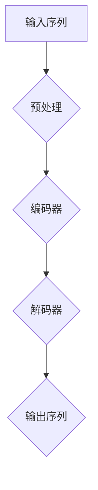
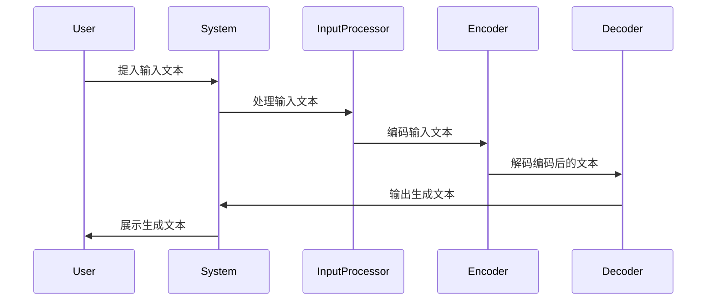
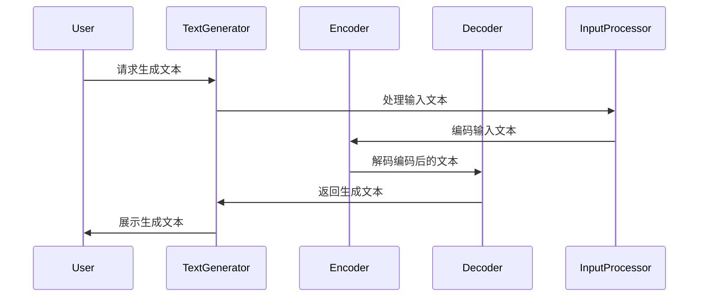

                 

# 深度学习在自然语言生成中的应用

## 关键词

- 深度学习
- 自然语言生成
- 循环神经网络（RNN）
- 长短期记忆网络（LSTM）
- Transformer模型

## 摘要

本文旨在探讨深度学习在自然语言生成（NLG）中的应用。首先，我们介绍了自然语言生成的问题背景和主要挑战，然后详细讲解了深度学习的基础和自然语言处理的相关知识。接着，我们重点介绍了Transformer模型及其在自然语言生成中的应用。此外，我们还通过Python代码示例展示了自然语言生成算法的实现过程。最后，我们分析了自然语言生成在不同领域的应用案例，并讨论了未来发展趋势和挑战。本文为希望深入了解自然语言生成技术的读者提供了全面的指导和启示。

## 第1章：深度学习在自然语言生成中的应用背景

### 1.1 问题背景

随着互联网和大数据技术的飞速发展，自然语言生成（Natural Language Generation，NLG）作为人工智能的一个重要分支，正日益受到广泛关注。自然语言生成技术旨在利用计算机技术自动生成具有自然语言特性的文本，广泛应用于新闻报道、客服对话、教育辅助、智能写作等多个领域。

在新闻报道领域，自动新闻写作系统可以快速生成新闻稿件，提高新闻发布的效率。在客服对话领域，智能客服系统能够与用户进行自然、流畅的对话，提高用户体验。在教育辅助领域，自然语言生成技术可以生成个性化的学习资料和辅导内容，帮助学生更好地掌握知识。在智能写作领域，自然语言生成技术可以用于写作辅助、创意写作和内容生成等。

### 1.2 问题描述

自然语言生成面临的主要挑战包括：如何生成流畅、准确的文本，如何理解复杂语义，以及如何适应不同的语言风格和文体。这些问题的解决，需要依托于深度学习技术，通过大规模数据训练和复杂模型架构来实现。

#### 如何生成流畅、准确的文本？

自然语言生成的流畅性主要体现在文本的连贯性和自然性。要生成流畅的文本，需要模型能够捕捉文本中的上下文信息，保持文本的一致性和连贯性。同时，生成的文本需要准确无误，避免出现语法错误和语义歧义。

#### 如何理解复杂语义？

理解复杂语义是自然语言生成中的一个关键问题。语义理解涉及对文本中词汇、短语和句子含义的深入挖掘，要求模型能够捕捉文本中的隐含信息和深层含义，从而生成符合语义逻辑的文本。

#### 如何适应不同的语言风格和文体？

不同的应用场景和用户需求需要不同的语言风格和文体。自然语言生成技术需要能够灵活适应各种语言风格和文体，如正式、非正式、幽默、夸张等，以满足不同应用的需求。

### 1.3 问题解决

深度学习在自然语言生成中的应用，通过神经网络模型，如循环神经网络（RNN）、长短期记忆网络（LSTM）、变换器（Transformer）等，来捕捉文本中的语义信息，生成高质量的文本。

#### 循环神经网络（RNN）

循环神经网络（RNN）是一种能够处理序列数据的神经网络。RNN通过循环结构来维持信息状态，从而捕捉序列中的上下文信息。然而，传统的RNN在处理长序列数据时存在梯度消失或爆炸的问题，导致模型性能不佳。

#### 长短期记忆网络（LSTM）

长短期记忆网络（LSTM）是RNN的一种改进模型，通过引入记忆单元和门控机制，有效解决了梯度消失问题。LSTM在自然语言生成中表现出色，能够生成流畅、连贯的文本。

#### 变换器（Transformer）

变换器（Transformer）是近年来提出的一种新型神经网络结构，通过引入多头自注意力机制，能够更好地捕捉序列中的长距离依赖关系。Transformer在自然语言生成任务中取得了显著的效果，成为当前自然语言处理领域的主流模型。

### 1.4 边界与外延

自然语言生成的边界在于生成的文本必须符合语法规则、语义逻辑，且能够满足实际应用的需求。外延包括但不限于文本生成、对话系统、文本摘要、机器翻译等领域。

#### 文本生成

文本生成是自然语言生成的核心任务，旨在生成具有自然语言特性的文本。文本生成可以应用于自动写作、内容生成、文案策划等多个领域。

#### 对话系统

对话系统是自然语言生成在智能客服、智能助手等领域的应用。对话系统能够与用户进行自然、流畅的对话，提供个性化服务。

#### 文本摘要

文本摘要是从原始文本中提取关键信息，生成简洁、精炼的摘要。文本摘要可以应用于信息检索、文本压缩、自动总结等多个领域。

#### 机器翻译

机器翻译是将一种语言的文本翻译成另一种语言。机器翻译是自然语言生成的一个重要应用领域，对促进跨语言交流具有重要意义。

### 1.5 概念结构与核心要素组成

自然语言生成系统主要包括以下几个核心要素：

- **自然语言生成**：自动生成具有自然语言特性的文本。
- **深度学习**：一种机器学习方法，通过神经网络结构模拟人脑学习过程。
- **神经网络**：由大量简单节点互联构成，通过学习输入数据来完成任务。
- **语义理解**：理解文本中的含义和意图，为生成文本提供基础。
- **文本预处理**：对原始文本进行清洗、分词、词向量表示等预处理操作，为模型输入做好准备。

## 第2章：深度学习基础与自然语言处理

### 2.1 深度学习基础

#### 2.1.1 神经网络与深度学习

深度学习是一种基于神经网络的机器学习方法，通过多层神经网络结构模拟人脑学习过程，对数据进行建模和预测。神经网络由大量简单节点（称为神经元）组成，每个神经元通过输入和输出层连接，通过学习输入数据来完成任务。

#### 神经元与神经网络

神经元是神经网络的基本单元，类似于人脑中的神经元。每个神经元接收多个输入信号，通过加权求和后，经过激活函数输出一个值。神经网络通过多层叠加，将输入数据逐步映射到输出结果。

#### 前向传播与反向传播

神经网络通过前向传播和反向传播来更新网络参数。前向传播是指将输入数据通过神经网络传递，逐层计算得到输出结果。反向传播是指根据输出结果与实际值的差异，通过反向传递误差信号，更新网络参数，以达到更好的拟合效果。

#### 激活函数

激活函数是神经网络中用于引入非线性因素的函数，常见的激活函数包括sigmoid函数、ReLU函数、Tanh函数等。激活函数的作用是使神经网络能够处理非线性问题，提高模型的拟合能力。

#### 损失函数

损失函数用于衡量模型预测结果与实际值之间的差异。常见的损失函数包括均方误差（MSE）、交叉熵（Cross-Entropy）等。损失函数的目的是通过优化模型参数，使模型预测结果更接近实际值。

### 2.1.2 自然语言处理基础

自然语言处理（Natural Language Processing，NLP）是深度学习在自然语言生成中的应用领域。NLP旨在使计算机能够理解和处理人类自然语言，主要包括文本预处理、词向量表示、序列模型等。

#### 文本预处理

文本预处理是自然语言处理的第一步，主要包括文本清洗、分词、词性标注等操作。文本清洗是指去除文本中的无关信息，如标点符号、停用词等。分词是指将文本拆分成一个个词语，以便后续处理。词性标注是指对词语进行词性分类，如名词、动词、形容词等。

#### 词向量表示

词向量表示是将自然语言文本转换为机器可以处理的向量形式。常见的词向量表示方法包括Word2Vec、FastText等。词向量表示能够捕捉词语的语义信息，为后续的模型训练提供基础。

#### 序列模型

序列模型是用于处理序列数据的神经网络模型，如循环神经网络（RNN）、长短期记忆网络（LSTM）等。序列模型能够捕捉序列中的上下文信息，对文本进行建模和分析。

### 2.1.3 循环神经网络（RNN）

循环神经网络（RNN）是一种能够处理序列数据的神经网络，通过循环结构来维持信息状态。RNN在自然语言处理中表现出色，能够处理变长的序列数据。

#### RNN结构与原理

RNN由输入层、隐藏层和输出层组成。输入层接收外部输入，隐藏层用于维持信息状态，输出层生成预测结果。RNN通过递归结构，将隐藏层的输出作为下一时刻的输入，从而维持信息状态。

#### LSTM与GRU

长短期记忆网络（LSTM）和门控循环单元（GRU）是RNN的改进模型，通过引入门控机制，有效解决了梯度消失问题。LSTM和GRU在自然语言处理任务中表现出色，能够生成高质量的自然语言文本。

#### RNN在文本处理中的应用

RNN在文本处理中主要用于文本分类、情感分析、机器翻译等任务。通过训练RNN模型，可以自动提取文本中的特征信息，实现文本的自动分类和情感分析。此外，RNN还可以用于机器翻译，将一种语言的文本翻译成另一种语言。

## 第3章：Transformer与自然语言生成

### 3.1 Transformer模型介绍

Transformer模型是自然语言处理领域的一种重要模型，由Vaswani等人于2017年提出。与传统的循环神经网络（RNN）相比，Transformer模型采用了一种全新的架构，通过引入多头自注意力机制，能够更好地捕捉序列中的长距离依赖关系。

#### Transformer架构

Transformer模型由编码器（Encoder）和解码器（Decoder）两部分组成。编码器负责将输入序列编码为固定长度的向量，解码器负责根据编码器的输出生成目标序列。编码器和解码器都由多个相同的层组成，每个层包含多头自注意力机制和前馈神经网络。

#### 多头自注意力机制

多头自注意力机制是Transformer模型的核心创新之一。通过引入多个自注意力头，模型能够同时关注输入序列中的不同部分，从而更好地捕捉长距离依赖关系。

#### 位置编码与序列建模

Transformer模型通过位置编码来处理输入序列的位置信息。位置编码是一种嵌入向量，用于表示输入序列中的位置信息。在模型训练过程中，位置编码被添加到输入序列中，使得模型能够关注输入序列的顺序。

### 3.2 自注意力机制详解

自注意力机制是一种用于计算序列中不同位置之间关系的机制。在Transformer模型中，自注意力机制通过计算输入序列的每个位置与其他位置之间的相似性，来生成序列的表示。

#### 注意力机制

注意力机制是一种用于计算不同输入元素之间权重的方法。在自注意力机制中，每个输入序列的位置都会被计算与其他位置之间的相似性，并通过一个权重系数来表示。

#### 自注意力计算

自注意力计算是通过计算输入序列中每个位置与其他位置之间的相似性，来生成序列的表示。具体来说，自注意力计算包括以下几个步骤：

1. **计算相似性**：将输入序列的每个位置与其他位置进行点积运算，得到相似性矩阵。
2. **加权求和**：对相似性矩阵进行softmax运算，得到权重系数。
3. **生成表示**：将权重系数与输入序列的点积运算，得到序列的表示。

#### 多头注意力

多头注意力是一种扩展自注意力机制的方法，通过引入多个注意力头，模型能够同时关注输入序列的不同部分，从而更好地捕捉长距离依赖关系。

### 3.3 Transformer在自然语言生成中的应用

#### 编码器-解码器架构

编码器-解码器架构是Transformer模型在自然语言生成中的主要应用场景。编码器负责将输入序列编码为固定长度的向量，解码器根据编码器的输出生成目标序列。

#### BERT与GPT模型

BERT（Bidirectional Encoder Representations from Transformers）和GPT（Generative Pre-trained Transformer）是两种基于Transformer的预训练模型。BERT通过双向编码器结构，捕捉输入序列的前后依赖关系，GPT通过解码器结构，生成自然语言文本。

#### 生成文本的质量评估

生成文本的质量评估是自然语言生成的一个重要环节。常用的评估指标包括BLEU、ROUGE、METEOR等。这些指标通过比较生成文本与参考文本的相似性，来评估生成文本的质量。

## 第4章：自然语言生成算法原理与实现

### 4.1 算法原理

自然语言生成算法主要分为序列生成模型和序列到序列模型。序列生成模型通过生成一个字符或词语序列来生成文本，而序列到序列模型通过生成一个句子或段落来生成文本。

#### 序列生成模型

序列生成模型是基于生成式模型的，通过学习输入序列的概率分布，生成输出序列。常见的序列生成模型包括：

1. **基于字符的生成模型**：如RNN、LSTM等，通过学习输入字符的概率分布，生成输出字符。
2. **基于词语的生成模型**：如BERT、GPT等，通过学习输入词语的概率分布，生成输出词语。

#### 序列到序列模型

序列到序列模型是基于判别式模型的，通过学习输入序列和输出序列之间的映射关系，生成输出序列。常见的序列到序列模型包括：

1. **基于编码器-解码器的模型**：如Transformer、BERT等，通过编码器将输入序列编码为固定长度的向量，解码器根据编码器的输出生成输出序列。
2. **基于注意力机制的模型**：如Attention Mechanism、Multi-Head Attention等，通过注意力机制来关注输入序列的不同部分，生成输出序列。

### 4.2 Python源代码实现

下面是一个简单的基于Transformer的序列到序列模型的Python代码实现：

```python
import tensorflow as tf
from tensorflow.keras.models import Model
from tensorflow.keras.layers import Input, Embedding, LSTM, Dense

# 输入层
input_seq = Input(shape=(None,))

# 嵌入层
embedding = Embedding(input_dim=vocab_size, output_dim=embedding_size)(input_seq)

# 编码器
encoded = LSTM(units=128, return_sequences=True)(embedding)

# 解码器
decoded = LSTM(units=128, return_sequences=True)(encoded)

# 输出层
output = Dense(units=vocab_size, activation='softmax')(decoded)

# 模型
model = Model(inputs=input_seq, outputs=output)

# 编译模型
model.compile(optimizer='adam', loss='categorical_crossentropy')

# 模型训练
model.fit(x_train, y_train, epochs=10, batch_size=64)
```

### 4.3 Mermaid算法流程图

下面是一个简单的Mermaid算法流程图，用于描述自然语言生成算法的基本流程：



## 第5章：自然语言生成应用案例

### 5.1 自动新闻写作

#### 应用场景

自动新闻写作是指利用自然语言生成技术，自动生成新闻报道。自动新闻写作系统可以实时收集新闻数据，自动生成新闻稿件，提高新闻发布的效率。

#### 案例解析

一个典型的自动新闻写作系统包括以下几个模块：

1. **数据采集模块**：从新闻网站、社交媒体等渠道采集新闻数据。
2. **文本预处理模块**：对采集到的新闻数据进行清洗、分词、词性标注等预处理操作。
3. **模型训练模块**：使用预训练的Transformer模型，对预处理后的新闻数据进行训练，生成新闻生成模型。
4. **新闻生成模块**：根据训练好的模型，自动生成新闻稿件。

通过自动新闻写作系统，新闻机构可以节省大量的人力成本，提高新闻发布的速度和效率。同时，自动新闻写作系统还可以生成个性化的新闻推荐，满足用户的个性化需求。

### 5.2 智能客服对话系统

#### 应用场景

智能客服对话系统是指利用自然语言生成技术，实现与用户的智能对话。智能客服系统可以自动识别用户的需求，生成相应的回复，提供个性化的服务。

#### 案例解析

一个典型的智能客服对话系统包括以下几个模块：

1. **用户输入模块**：接收用户的输入，如文本或语音。
2. **文本预处理模块**：对用户输入进行清洗、分词、词性标注等预处理操作。
3. **对话管理模块**：根据用户输入，生成相应的回复，并管理对话流程。
4. **自然语言生成模块**：根据对话管理模块的输出，生成自然语言回复。

通过智能客服对话系统，企业可以提供24小时不间断的客户服务，提高客户满意度。同时，智能客服对话系统还可以自动记录用户反馈，帮助企业了解用户需求，优化服务质量。

### 5.3 文本摘要与摘要生成

#### 应用场景

文本摘要是指从原始文本中提取关键信息，生成简洁、精炼的摘要。文本摘要可以应用于信息检索、文本压缩、自动总结等多个领域。

#### 案例解析

一个典型的文本摘要系统包括以下几个模块：

1. **文本预处理模块**：对原始文本进行清洗、分词、词性标注等预处理操作。
2. **摘要生成模块**：使用预训练的Transformer模型，生成文本摘要。
3. **摘要优化模块**：对生成的摘要进行优化，提高摘要的质量。

通过文本摘要系统，用户可以快速获取原始文本的关键信息，节省阅读时间。同时，文本摘要系统还可以应用于信息检索，提高搜索效率。

## 第6章：深度学习在自然语言生成中的挑战与未来趋势

### 6.1 挑战

尽管深度学习在自然语言生成领域取得了显著的进展，但仍面临一些挑战：

#### 文本生成质量

当前的自然语言生成模型在生成文本的流畅性和准确性方面仍有待提高。模型在生成长文本时容易出现语法错误和语义不一致的问题。

#### 计算资源消耗

深度学习模型通常需要大量的计算资源和时间进行训练。尤其是在处理大规模数据集时，计算资源消耗更加显著。

#### 语言多样性

自然语言生成技术在不同语言和方言中的应用效果存在差异。如何使模型在不同语言和方言中表现出色是一个重要挑战。

### 6.2 未来趋势

未来，自然语言生成技术将朝着以下几个方向发展：

#### 预训练模型与迁移学习

预训练模型（如BERT、GPT）的提出，使得模型在预训练阶段即可获得丰富的语言知识。未来，迁移学习将更加普及，通过在特定任务上微调预训练模型，实现更好的性能。

#### 生成对抗网络（GAN）

生成对抗网络（GAN）是一种具有强大生成能力的模型。未来，GAN将在自然语言生成中发挥重要作用，用于生成更加真实、多样化的文本。

#### 多模态自然语言生成

多模态自然语言生成是指结合文本、图像、声音等多种模态进行生成。未来，多模态自然语言生成技术将更加成熟，为智能对话、多媒体内容生成等领域带来更多可能性。

## 第7章：小结与拓展

### 7.1 小结

本文介绍了深度学习在自然语言生成中的应用，从问题背景、基础理论、模型实现到应用案例，全面探讨了自然语言生成技术的现状和发展趋势。深度学习在自然语言生成领域取得了显著成果，但仍面临许多挑战。未来，随着技术的不断进步，自然语言生成将在更多领域发挥重要作用。

### 7.2 注意事项

在自然语言生成应用过程中，需要注意以下几个方面：

- **数据质量和预处理**：确保数据的质量和多样性，进行充分的预处理，以提高模型性能。
- **模型优化**：通过模型优化、超参数调优等方法，提高模型生成文本的质量和流畅性。
- **伦理和隐私**：在自然语言生成应用中，需要关注数据安全和隐私保护，遵循相关法律法规。

### 7.3 拓展阅读

- **相关书籍与论文**：
  - 《深度学习》（Goodfellow, I., Bengio, Y., & Courville, A.）
  - 《自然语言处理综合教程》（Jurafsky, D. & Martin, J.）
  - 《Attention Is All You Need》（Vaswani, A., et al.）
- **在线资源与社区**：
  - [TensorFlow官方文档](https://www.tensorflow.org/)
  - [自然语言处理社区](https://nlp.seas.harvard.edu/)
  - [Hugging Face](https://huggingface.co/)：一个提供预训练模型和工具的在线平台

作者：AI天才研究院/AI Genius Institute & 禅与计算机程序设计艺术 /Zen And The Art of Computer Programming

## 附录：Mermaid算法流程图与类图

### Mermaid算法流程图


### Mermaid类图

```mermaid
classDiagram
    类图展示自然语言生成系统的核心类及其关系

    Class InputProcessor {
        +processInput(input: String): ProcessedInput
    }

    Class Encoder {
        +encode(input: ProcessedInput): EncodedSequence
    }

    Class Decoder {
        +decode(encoded: EncodedSequence): String
    }

    Class TextGenerator {
        +generateText(input: String): String
    }

    InputProcessor <- Encoder
    Encoder <- Decoder
    Decoder <- TextGenerator
```

### Mermaid架构图



### Mermaid序列图



通过上述Mermaid图表，可以直观地了解自然语言生成系统的数据处理流程和模块间的关系。这些图表有助于开发者更好地理解和设计系统架构。

