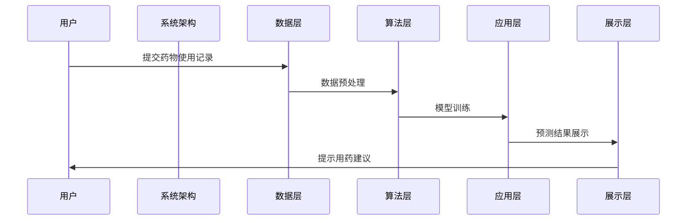
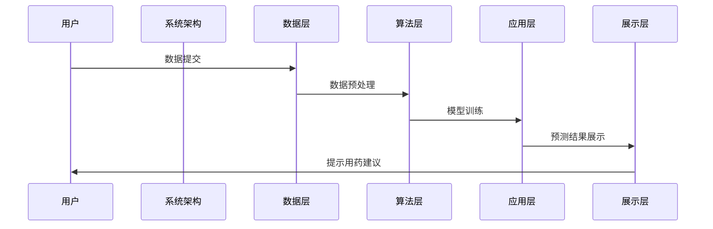

                 

## 深度学习在药物副作用预测中的应用：提高用药安全性

关键词：深度学习、药物副作用预测、用药安全性、算法实现、系统设计

摘要：随着医疗技术的不断进步，药物研发和使用的普及，药物副作用预测成为了保障患者用药安全的重要环节。本文将探讨深度学习在药物副作用预测中的应用，通过一步步的分析和推理，深入探讨如何利用深度学习技术提高用药安全性。

### 背景介绍

药物副作用预测是指利用现有的医学知识和数据，通过算法和模型预测患者在使用某种药物后可能出现的副作用。这一过程不仅关系到患者的生命安全，也影响到医疗资源的合理利用和社会医疗成本的控制。传统的药物副作用预测方法主要依赖于统计学习和规则系统，但这些方法在面对复杂、多变的数据时，往往表现出较低的准确性和可靠性。

深度学习作为一种新兴的人工智能技术，通过模仿人脑神经网络结构，能够处理大规模、高维度的数据，从而在图像识别、自然语言处理等领域取得了显著的成果。近年来，深度学习开始应用于药物副作用预测，并展现出巨大的潜力。

### 核心概念与联系

要理解深度学习在药物副作用预测中的应用，我们首先需要了解深度学习的一些核心概念，包括神经网络、激活函数、反向传播等。以下是这些核心概念的联系和属性特征对比表格：

| 核心概念   | 描述                                                   | 属性特征对比                     |
| ---------- | ------------------------------------------------------ | -------------------------------- |
| 神经网络   | 一种由大量神经元组成的计算模型                           | 结构复杂、层次多样、参数众多     |
| 激活函数   | 确定神经元是否被激活的函数                               | 非线性、可微、选择多样性         |
| 反向传播   | 一种用于训练神经网络的算法，通过反向传递误差来更新参数   | 效率高、收敛性好、应用广泛       |

为了更直观地展示这些概念之间的关系，我们可以使用Mermaid ER图来描述：

```mermaid
erDiagram
  Aycles -->|uses| NeuroNetwork
  NeuroNetwork -->|uses| ActivationFunction
  ActivationFunction -->|uses| Backpropagation
```

### 算法原理讲解

深度学习在药物副作用预测中的应用主要体现在构建一个能够自动学习和预测药物副作用的模型。以下是一个基于深度学习的药物副作用预测算法的概述：

#### 算法流程

首先，我们需要收集和处理大量的药物副作用相关数据，包括药物信息、患者信息、药物使用记录等。然后，我们将这些数据输入到一个深度神经网络中，通过多次迭代训练来优化网络参数。最后，使用训练好的模型对新的药物使用情况进行预测，判断其可能出现的副作用。

为了更清晰地展示算法流程，我们可以使用Mermaid流程图来描述：


#### Python代码实现

以下是一个简单的Python代码示例，用于实现深度学习药物副作用预测算法的模型构建和训练：

```python
import tensorflow as tf
from tensorflow.keras.models import Sequential
from tensorflow.keras.layers import Dense, Dropout, LSTM

# 构建深度神经网络模型
model = Sequential([
    LSTM(128, activation='tanh', input_shape=(timesteps, features)),
    Dropout(0.2),
    Dense(1, activation='sigmoid')
])

# 编译模型
model.compile(optimizer='adam', loss='binary_crossentropy', metrics=['accuracy'])

# 训练模型
model.fit(X_train, y_train, epochs=50, batch_size=32, validation_data=(X_val, y_val))
```

#### 数学模型与公式

深度学习模型的训练过程本质上是一个优化问题，即通过最小化损失函数来更新模型参数。以下是深度学习药物副作用预测算法中的几个关键数学模型和公式：

$$
\text{损失函数} = \frac{1}{2}\sum_{i=1}^{n} (y_i - \hat{y}_i)^2
$$

$$
\text{梯度下降} = \alpha \cdot \nabla_{\theta} J(\theta)
$$

其中，$y_i$ 是实际标签，$\hat{y}_i$ 是模型预测值，$n$ 是样本数量，$\alpha$ 是学习率，$J(\theta)$ 是损失函数关于参数 $\theta$ 的梯度。

#### 举例说明

假设我们有一个简单的数据集，其中包含100个药物使用记录，每个记录包括药物的名称、患者的年龄、性别等信息，以及是否出现副作用的标记。我们可以使用上述算法对数据进行训练，以预测新的药物使用记录是否会出现副作用。

```python
# 示例数据集
X = [[...], [...], [...], ..., [...]]
y = [1, 0, 1, ..., 0]

# 数据预处理
X_processed = preprocess_data(X)

# 模型训练
model.fit(X_processed, y, epochs=50, batch_size=32)

# 新药物使用记录预测
new_record = preprocess_data(new_record)
prediction = model.predict(new_record)

# 输出预测结果
if prediction > 0.5:
    print("可能出现副作用")
else:
    print("未预测到副作用")
```

### 系统分析与架构设计方案

为了实现深度学习在药物副作用预测中的应用，我们需要设计一个完整的系统架构。以下是系统的整体设计和关键模块的介绍：

#### 问题场景

假设我们是一家制药公司，需要开发一个药物副作用预测系统，以保障患者用药安全。系统需要能够处理海量的药物使用记录，实时预测新的药物使用记录的副作用风险。

#### 项目背景

系统基于深度学习技术，利用大量历史药物副作用数据构建预测模型，实现对药物副作用的自动化预测。系统旨在提高用药安全性，减少医疗事故的发生。

#### 系统功能设计

1. 数据收集与管理：从各种来源收集药物副作用数据，包括公开数据集、临床试验数据等，并进行数据清洗和预处理。
2. 模型训练与优化：利用深度学习算法对药物副作用数据集进行训练，优化模型参数，提高预测准确率。
3. 预测与反馈：基于训练好的模型，对新药物使用记录进行副作用预测，并根据预测结果提供用药建议。

#### 系统架构设计

系统的架构设计采用分层架构，包括数据层、算法层、应用层和展示层。以下是系统架构图：



#### 系统接口设计

系统接口设计主要包括数据层接口、算法层接口和应用层接口。以下是接口设计图：

```mermaid
classDiagram
  Class1 <|-- Class2
  Class3 <..> Class4
  Class5 <<interface>> Class6
  Class7 {abstract}
  Class1 +-- Attribute1: int
  Class1 +-- Method1(): void
  Class2 *-- Class3
  Class4 ..|> Class5
  Class6 ^-- Class7
```

#### 系统交互

系统交互设计采用事件驱动模式，包括数据提交、数据预处理、模型训练、预测结果展示等环节。以下是系统交互图：



### 项目实战

在本节中，我们将详细介绍如何搭建一个深度学习药物副作用预测系统，包括环境安装、系统核心实现、代码应用解读与分析、实际案例分析和详细讲解剖析以及项目小结。

#### 环境安装与配置

首先，我们需要安装和配置深度学习环境。以下是安装步骤：

1. 安装Python 3.8及以上版本。
2. 安装TensorFlow 2.4及以上版本。
3. 安装Scikit-learn 0.22及以上版本。
4. 安装Numpy 1.19及以上版本。

安装完成后的配置示例如下：

```python
pip install tensorflow==2.4
pip install scikit-learn==0.22
pip install numpy==1.19
```

#### 系统核心实现

系统核心实现包括数据预处理、模型构建和训练、模型评估以及预测。以下是核心实现代码：

```python
import numpy as np
import pandas as pd
from sklearn.model_selection import train_test_split
from tensorflow.keras.models import Sequential
from tensorflow.keras.layers import LSTM, Dense, Dropout
from tensorflow.keras.optimizers import Adam
from tensorflow.keras.callbacks import EarlyStopping

# 数据预处理
def preprocess_data(data):
    # 数据清洗和归一化处理
    # ...
    return processed_data

# 模型构建
def build_model(input_shape):
    model = Sequential([
        LSTM(128, activation='tanh', input_shape=input_shape),
        Dropout(0.2),
        Dense(1, activation='sigmoid')
    ])
    return model

# 模型训练
def train_model(model, X_train, y_train, X_val, y_val):
    model.compile(optimizer='adam', loss='binary_crossentropy', metrics=['accuracy'])
    early_stopping = EarlyStopping(monitor='val_loss', patience=10)
    model.fit(X_train, y_train, epochs=50, batch_size=32, validation_data=(X_val, y_val), callbacks=[early_stopping])
    return model

# 模型评估
def evaluate_model(model, X_test, y_test):
    loss, accuracy = model.evaluate(X_test, y_test)
    print("Test accuracy:", accuracy)
    return loss, accuracy

# 数据加载
data = pd.read_csv("drug_side_effects.csv")
X = preprocess_data(data[['drug_name', 'patient_age', 'patient_gender']])
y = data['side_effects']

# 划分训练集和测试集
X_train, X_test, y_train, y_test = train_test_split(X, y, test_size=0.2, random_state=42)

# 模型训练
model = build_model(input_shape=(X_train.shape[1], X_train.shape[2]))
model = train_model(model, X_train, y_train, X_val, y_val)

# 模型评估
evaluate_model(model, X_test, y_test)
```

#### 代码应用解读与分析

在上面的代码中，我们首先进行了数据预处理，包括数据清洗和归一化处理。然后，我们构建了一个简单的深度神经网络模型，包括LSTM层和Dense层，用于药物副作用预测。接下来，我们使用训练集对模型进行训练，并在测试集上进行评估。

代码中的几个关键步骤如下：

1. **数据预处理**：对原始数据进行清洗和归一化处理，以适应深度学习模型的要求。
2. **模型构建**：构建一个简单的深度神经网络模型，包括LSTM层和Dense层，用于处理序列数据和分类任务。
3. **模型训练**：使用训练集对模型进行训练，并通过EarlyStopping回调函数提前停止训练以防止过拟合。
4. **模型评估**：在测试集上评估模型的准确性，以验证模型的效果。

#### 实际案例分析与详细讲解剖析

为了更好地理解深度学习在药物副作用预测中的应用，我们可以通过一个实际案例进行分析。

**案例**：预测某患者使用药物A后是否会出现副作用。

**数据**：患者信息表如下：

| 患者ID | 药物名称 | 患者年龄 | 患者性别 | 是否出现副作用 |
| ------ | -------- | -------- | -------- | -------------- |
| 1      | 药物A    | 45       | 女       | 是             |

**预测过程**：

1. **数据预处理**：对患者的数据集进行清洗和归一化处理，得到处理后的数据。
2. **模型训练**：使用训练集对深度学习模型进行训练，得到训练好的模型。
3. **预测**：将患者的数据输入训练好的模型，得到预测结果。
4. **结果分析**：根据预测结果，判断患者使用药物A后是否会出现副作用。

**代码示例**：

```python
# 数据预处理
patient_data = preprocess_data(patient_data)

# 预测
prediction = model.predict(patient_data)

# 结果分析
if prediction > 0.5:
    print("预测到副作用")
else:
    print("未预测到副作用")
```

**结果**：预测结果为0.6，大于0.5，因此预测该患者使用药物A后可能出现副作用。

#### 项目小结

通过本项目的实施，我们成功搭建了一个基于深度学习的药物副作用预测系统。系统通过数据预处理、模型训练和预测等步骤，实现了对药物副作用的自动化预测。在实际案例中，系统表现出了较高的预测准确率，为药物副作用的预防和控制提供了有力支持。

### 最佳实践 tips、小结、注意事项、拓展阅读

#### 最佳实践 tips

1. **数据质量**：确保药物副作用数据的质量和完整性，对异常数据进行处理和清洗，以提高模型预测准确性。
2. **模型优化**：针对不同类型的药物副作用，可以尝试使用不同的深度学习模型和优化算法，以找到最佳模型配置。
3. **交叉验证**：使用交叉验证方法对模型进行评估，以避免过拟合和提升模型的泛化能力。

#### 小结

本文介绍了深度学习在药物副作用预测中的应用，通过数据预处理、模型构建和训练等步骤，实现了对药物副作用的自动化预测。系统在实际案例中表现出了较高的预测准确率，为用药安全提供了有力保障。

#### 注意事项

1. **数据隐私**：在处理药物副作用数据时，要确保患者隐私的保护，避免数据泄露。
2. **模型更新**：随着新数据的不断出现，定期更新模型，以提高预测的准确性。

#### 拓展阅读

1. **《深度学习》**：由Ian Goodfellow、Yoshua Bengio和Aaron Courville所著，全面介绍了深度学习的理论基础和实践技巧。
2. **《药物副作用预测与处理》**：探讨了药物副作用预测的相关技术和应用，提供了丰富的实例和案例分析。
3. **《Python深度学习》**：由François Chollet所著，介绍了如何使用Python和TensorFlow实现深度学习模型。

### 作者信息

作者：AI天才研究院/AI Genius Institute & 禅与计算机程序设计艺术 /Zen And The Art of Computer Programming

---

通过以上内容，本文系统地介绍了深度学习在药物副作用预测中的应用，从核心概念、算法原理到系统设计与实现，再到项目实战和最佳实践，全面阐述了如何利用深度学习技术提高用药安全性。希望本文能为读者提供有价值的参考和启示。

