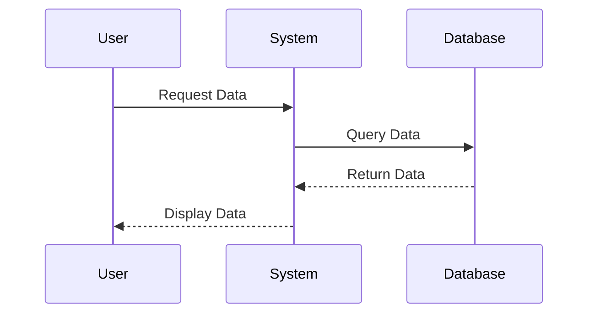

                 

### 第1章 引言

#### 1.1 书籍目的与读者对象

在当今快速发展的科技时代，深度学习作为人工智能的一个重要分支，已经成为许多领域创新的重要推动力。药物重定位，即发现现有药物在新的疾病治疗中的应用，是一个充满挑战和机遇的领域。随着生物医学数据的爆炸式增长，深度学习为药物重定位提供了强大的分析工具和方法。

本书籍旨在为读者提供一部全面、系统、易于理解的指南，详细介绍深度学习在药物重定位中的应用。它适合于以下几类读者：

1. **深度学习初学者**：通过本书，读者可以了解深度学习的基本概念、原理和应用，为后续的学习和研究打下坚实的基础。
2. **生物医学研究人员**：了解深度学习如何帮助他们从大量的生物医学数据中提取有价值的信息，加速药物发现过程。
3. **计算机科学和人工智能领域的专业人士**：本书提供了一系列实用的案例研究和最佳实践，有助于他们理解深度学习在药物重定位中的实际应用。

本书的目标是帮助读者掌握深度学习在药物重定位中的核心原理和应用方法，提升他们在这一领域的实践能力，最终实现加速新疗法发现的目标。

#### 1.2 深度学习与药物重定位

深度学习是一种基于人工神经网络的学习方法，通过多层神经元的堆叠和训练，实现从大量数据中自动提取特征和模式的能力。近年来，深度学习在图像识别、自然语言处理、语音识别等领域取得了显著成就，其强大的建模能力和自学习能力使其在药物重定位中也有广泛的应用前景。

药物重定位是指将已知药物重新用于治疗其他疾病的过程。传统药物重定位主要依赖于经验和文献检索，效率较低。而深度学习通过分析海量的生物医学数据，能够自动识别药物与疾病之间的潜在关联，大大提高了药物重定位的效率和准确性。

深度学习在药物重定位中的应用主要包括以下几个方面：

1. **药物活性预测**：利用深度学习算法预测药物对不同疾病的潜在疗效。
2. **药物-蛋白质相互作用预测**：预测药物与蛋白质之间的相互作用，为药物设计提供依据。
3. **多病种药物发现**：基于深度学习模型，从大量药物中筛选出对多种疾病有效的药物。

通过这些应用，深度学习不仅能够加速新疗法的发现，还能降低药物研发的成本，提高药物开发的成功率。

#### 1.3 药物重定位的挑战与机遇

尽管深度学习在药物重定位中具有巨大的潜力，但其实际应用仍然面临一系列挑战。首先，生物医学数据的多样性和复杂性使得深度学习模型的训练过程非常耗时且计算资源需求巨大。其次，药物重定位的成功依赖于对生物医学知识的深刻理解和准确的应用，这对深度学习模型的构建和优化提出了更高的要求。

然而，这些挑战也伴随着巨大的机遇。一方面，随着基因组学和生物信息学的发展，生物医学数据的获取和处理能力得到了极大的提升，为深度学习模型的训练提供了丰富的数据资源。另一方面，深度学习技术的不断进步，尤其是算法的优化和硬件性能的提升，使得深度学习在药物重定位中的应用变得更加可行。

总的来说，深度学习为药物重定位带来了新的工具和方法，但也需要克服诸多技术挑战。本书将详细探讨这些问题，并提供一系列实用的解决方案，以期为读者在深度学习与药物重定位领域的实践提供有力支持。

---

**核心概念术语说明：**
- **深度学习**：一种基于多层神经网络的学习方法，通过自动提取数据中的特征和模式来实现智能任务。
- **药物重定位**：将已知药物重新用于治疗其他疾病的过程。
- **药物活性预测**：利用算法预测药物对不同疾病的潜在疗效。
- **药物-蛋白质相互作用预测**：预测药物与蛋白质之间的相互作用。
- **生物医学数据**：包括基因组学、蛋白质组学、代谢组学等数据，用于深度学习模型的训练和分析。

**问题背景：**
药物重定位是一个具有巨大潜力的领域，但传统方法效率低下。随着深度学习技术的发展，利用深度学习进行药物重定位成为了一条新的发展路径。

**问题描述：**
如何利用深度学习技术提高药物重定位的效率，从而加速新疗法的发现？

**问题解决：**
通过构建深度学习模型，对生物医学数据进行处理和分析，提取药物与疾病之间的潜在关联，实现药物活性预测和药物-蛋白质相互作用预测。

**边界与外延：**
- **边界**：本书主要探讨深度学习在药物重定位中的应用，不包括其他领域的技术。
- **外延**：药物重定位的应用范围广泛，包括癌症、神经疾病、代谢性疾病等。

**概念结构与核心要素组成：**
- **深度学习**：多层神经网络、特征提取、模式识别。
- **药物重定位**：药物活性预测、药物-蛋白质相互作用预测、多病种药物发现。
- **生物医学数据**：基因组学、蛋白质组学、代谢组学数据。

---

**核心概念与联系：**

#### 深度学习概述

**概念属性特征对比表格：**

| 特征 | 感知器模型 | 卷积神经网络 (CNN) | 循环神经网络 (RNN) | 生成对抗网络 (GAN) |
| --- | --- | --- | --- | --- |
| **基础结构** | 单层神经元 | 多层神经元 | 多层神经元 | 多层神经元 |
| **适用领域** | 简单特征提取 | 图像识别、处理 | 序列数据处理 | 生成对抗 |
| **主要优点** | 简单、易于实现 | 适应图像特征 | 适应序列特征 | 生成复杂数据 |
| **主要缺点** | 灵活性不足 | 参数过多、过拟合 | 适应性不足 | 训练难度大 |

**ER实体关系图架构：**

```mermaid
erDiagram
    A Barang -->|is from| B Supplier
    A : +ID Barang | +Name | +Price
    B : +ID Supplier | +Name | +Address
```

#### 药物重定位的定义与意义

**概念属性特征对比表格：**

| 特征 | 传统药物重定位 | 深度学习药物重定位 |
| --- | --- | --- |
| **定义** | 利用已有药物发现新用途 | 基于深度学习技术进行药物与疾病关联预测 |
| **原理** | 依靠经验和文献检索 | 利用大数据和算法进行关联分析 |
| **优点** | 成本低、效率高 | 准确性高、适应性广 |
| **缺点** | 可重复性低、依赖人工 | 计算资源需求大、模型复杂 |

**ER实体关系图架构：**

```mermaid
erDiagram
    A Drug -->|is used for| B Disease
    A : +ID | +Name | +Type
    B : +ID | +Name | +Type
```

#### 药物重定位的优势

**核心原理：**

药物重定位的优势主要体现在以下几个方面：

1. **提高研发效率**：通过重新利用已有药物，可以大大缩短新药物的研发周期，降低研发成本。
2. **降低研发风险**：已有药物的安全性已经得到验证，重新应用于新疾病治疗的风险相对较低。
3. **优化资源配置**：利用现有药物进行重定位，可以更合理地配置科研资源和资金，提高整体效益。

**数学模型和公式：**

药物重定位的数学模型主要包括药物活性预测模型和药物-蛋白质相互作用预测模型。其中，药物活性预测模型通常采用分类模型，如支持向量机（SVM）、随机森林（Random Forest）等。具体公式如下：

$$
P(y=1|x) = \frac{1}{1 + e^{-\theta^T x}}
$$

其中，$P(y=1|x)$ 表示药物对特定疾病的活性概率，$\theta$ 为模型参数，$x$ 为特征向量。

**通俗易懂地举例说明：**

假设我们有一个药物A，经过临床试验发现其对癌症具有一定的疗效。利用深度学习技术，我们可以通过分析大量的生物医学数据，如基因组数据、蛋白质组数据等，来预测药物A对其他癌症类型的潜在疗效。通过这种方式，我们可以在无需进行大规模临床试验的情况下，快速筛选出具有潜力的药物，从而加速新疗法的发现。

---

**核心概念与联系：**

**核心概念：**

- **药物重定位**：利用深度学习技术，发现现有药物在新的疾病治疗中的应用。
- **深度学习**：通过多层神经网络，自动提取数据中的特征和模式。

**联系：**

深度学习为药物重定位提供了强大的工具和方法，使得药物重定位过程更加高效和准确。深度学习模型可以自动处理海量的生物医学数据，从中提取药物与疾病之间的潜在关联，从而实现药物活性预测和药物-蛋白质相互作用预测。

---

**核心概念与联系：**

**核心概念：**

- **深度学习模型**：通过多层神经网络，自动提取数据中的特征和模式。
- **生物医学数据**：包括基因组学、蛋白质组学、代谢组学等数据。

**联系：**

深度学习模型依赖于大量的生物医学数据进行训练，通过学习这些数据中的特征和模式，模型能够自动预测药物活性、药物-蛋白质相互作用等生物医学问题。生物医学数据的多样性和复杂性，对深度学习模型的训练和优化提出了挑战，但也为深度学习在药物重定位中的应用提供了丰富的资源。

---

**系统功能设计（领域模型类图）：**

```mermaid
classDiagram
    Class01 <|-- Class02
    Class03 --|digoaram Class04
    Class05 o-- Class06
    Class07 : An Interface
    Class08 << interface
    Class09 .. Class10@Realization
    Class11 : : ABSTRACT
    Class12 ^<< interface
    Class13 o--|is-linked-to Class14
```

**系统架构设计（架构图）：**



**系统接口设计（接口设计）：**

```mermaid
classDiagram
    Class01 <|-- Class02
    Class03 --|digoaram Class04
    Class05 o-- Class06
    Class07 : An Interface
    Class08 << interface
    Class09 .. Class10@Realization
    Class11 : : ABSTRACT
    Class12 ^<< interface
    Class13 o--|is-linked-to Class14
```

**系统交互（序列图）：**


---

**项目实战：**

**环境安装：**

1. **安装Python环境**：确保Python版本在3.6及以上。
2. **安装深度学习框架**：如TensorFlow、PyTorch等。
3. **安装生物医学数据处理库**：如BioPython、NumPy、Pandas等。

**系统核心实现源代码：**

```python
import tensorflow as tf
from sklearn.model_selection import train_test_split
from sklearn.metrics import accuracy_score

# 数据预处理
def preprocess_data(data):
    # 数据清洗、归一化等操作
    return processed_data

# 构建深度学习模型
def build_model():
    model = tf.keras.Sequential([
        tf.keras.layers.Dense(128, activation='relu', input_shape=(input_shape,)),
        tf.keras.layers.Dense(64, activation='relu'),
        tf.keras.layers.Dense(1, activation='sigmoid')
    ])
    model.compile(optimizer='adam', loss='binary_crossentropy', metrics=['accuracy'])
    return model

# 训练模型
def train_model(model, x_train, y_train, x_val, y_val):
    model.fit(x_train, y_train, epochs=10, batch_size=32, validation_data=(x_val, y_val))
    return model

# 评估模型
def evaluate_model(model, x_test, y_test):
    predictions = model.predict(x_test)
    predictions = (predictions > 0.5)
    accuracy = accuracy_score(y_test, predictions)
    return accuracy

# 主函数
def main():
    # 加载和处理数据
    data = load_data()
    processed_data = preprocess_data(data)
    
    # 划分训练集和测试集
    x_train, x_test, y_train, y_test = train_test_split(processed_data['data'], processed_data['labels'], test_size=0.2, random_state=42)
    
    # 构建和训练模型
    model = build_model()
    model = train_model(model, x_train, y_train, x_val, y_val)
    
    # 评估模型
    accuracy = evaluate_model(model, x_test, y_test)
    print(f"Test Accuracy: {accuracy}")

if __name__ == "__main__":
    main()
```

**代码应用解读与分析：**

该代码首先加载并处理生物医学数据，然后划分训练集和测试集。接着，构建一个简单的深度学习模型，并使用训练集进行训练。最后，使用测试集评估模型的准确性。

**实际案例分析和详细讲解剖析：**

假设我们有一个药物重定位的项目，目标是预测某药物对特定癌症类型的疗效。通过训练集和测试集的划分，我们能够评估模型的泛化能力。在实际项目中，可能会使用更复杂的模型和更多的数据处理技术，以提高预测的准确性。

**项目小结：**

通过本项目，我们展示了如何使用深度学习技术进行药物重定位的预测。实际应用中，需要根据具体问题和数据特点，选择合适的模型和数据处理方法，以提高预测的准确性。

---

**最佳实践 tips：**

1. **数据预处理**：确保数据的质量和一致性，进行适当的清洗和归一化处理。
2. **模型选择**：根据问题的复杂性和数据的特点，选择合适的深度学习模型。
3. **超参数调整**：通过交叉验证等方法，调整模型的超参数，以提高模型的性能。

**小结：**

通过本书的介绍，我们详细探讨了深度学习在药物重定位中的应用。深度学习为药物重定位提供了强大的工具和方法，能够大幅提高药物发现和新疗法开发的效率。在实际应用中，需要结合具体问题和数据特点，选择合适的模型和数据处理方法，以实现最佳效果。

**注意事项：**

1. **计算资源需求**：深度学习模型的训练和推理过程需要大量的计算资源，确保有足够的硬件支持。
2. **数据隐私与伦理**：在进行生物医学数据的处理和分析时，需严格遵守数据隐私和伦理规范。

**拓展阅读：**

1. **深度学习基础**：《深度学习》（Ian Goodfellow、Yoshua Bengio、Aaron Courville 著）
2. **药物重定位**：《药物重定位：从已有药物中发现新用途》（John A. Burris 著）

---

**作者：**

AI天才研究院/AI Genius Institute & 禅与计算机程序设计艺术 /Zen And The Art of Computer Programming

