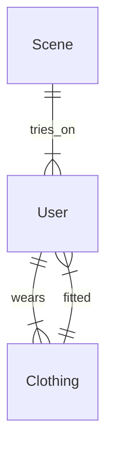
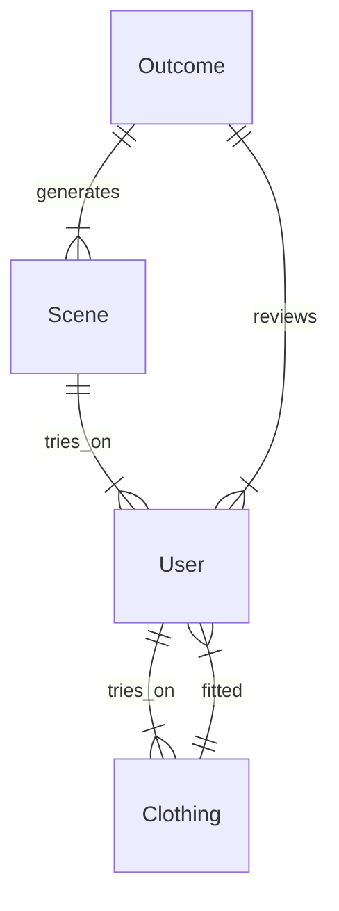
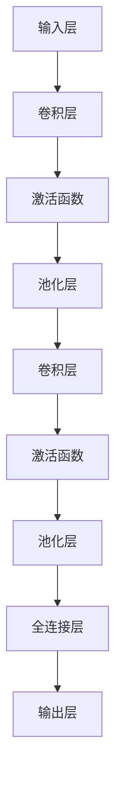
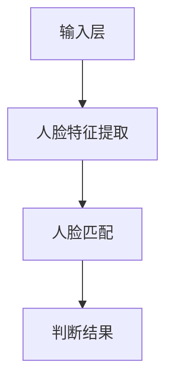
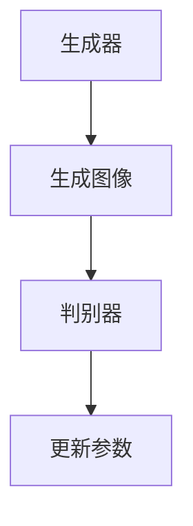
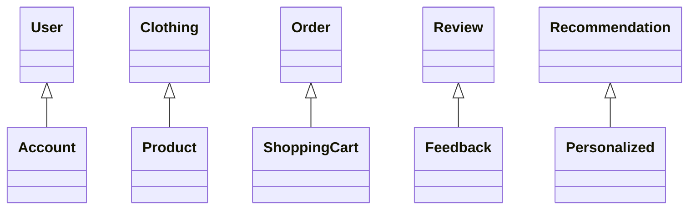
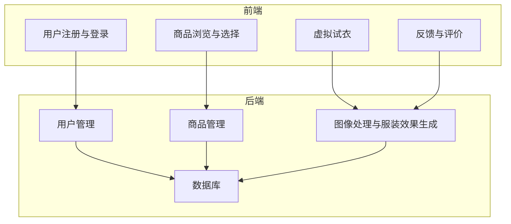
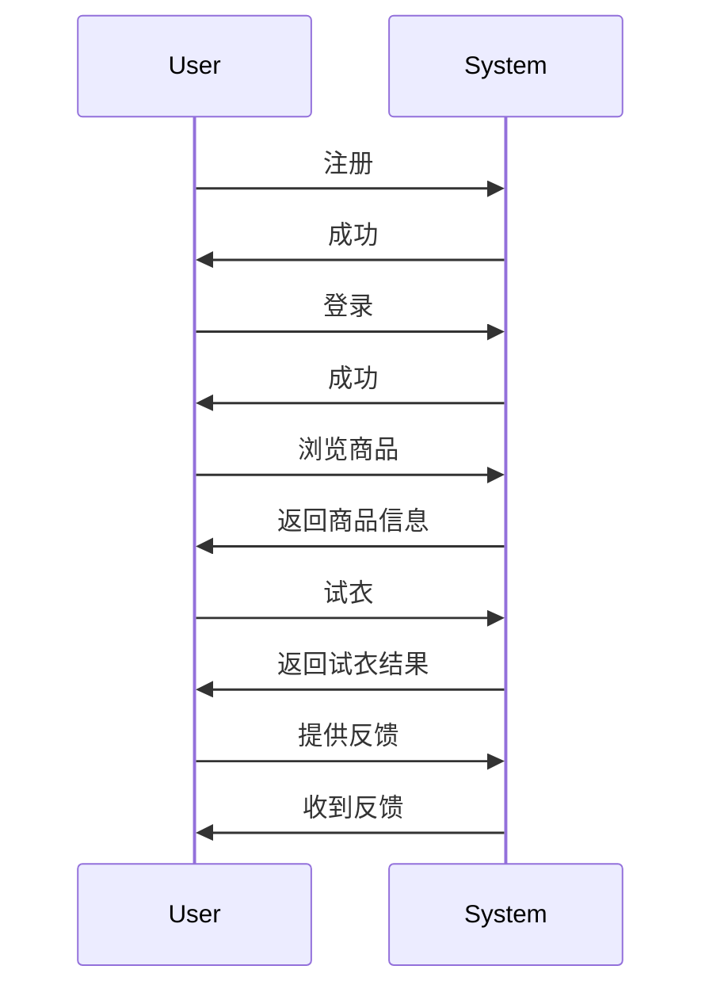
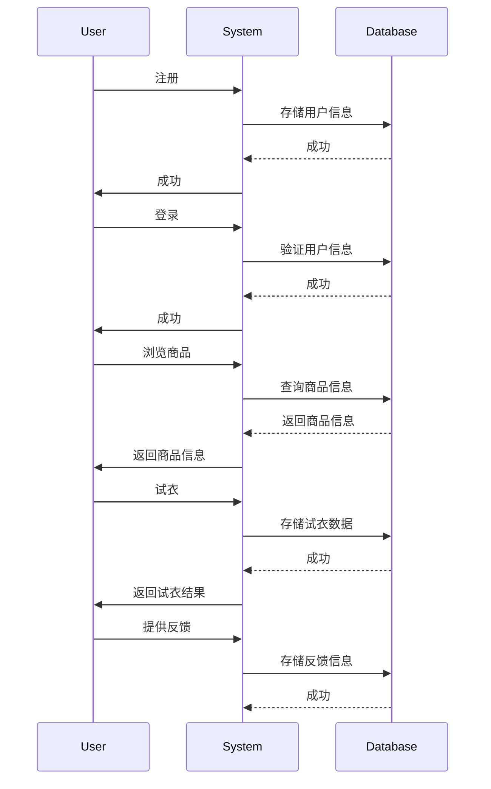

                 


### 设计深度学习在虚拟试衣中的应用：提升在线购物体验

#### 关键词：深度学习，虚拟试衣，在线购物，用户体验，图像识别，人脸识别，生成对抗网络（GAN）

> 摘要：本文将探讨深度学习在虚拟试衣中的应用，旨在通过结合深度学习的先进技术，提升在线购物体验。文章将详细介绍深度学习的基本原理和其在虚拟试衣中的具体应用，同时分析相关算法原理，设计系统架构，并分享实际项目案例和最佳实践，最终展望深度学习在虚拟试衣领域的未来发展方向。

---

**第一部分：问题背景与深度学习概述**

## 1.1 问题背景

### 1.1.1 在线购物体验的现状

随着互联网技术的飞速发展，在线购物已经成为消费者日常生活中的重要组成部分。然而，尽管在线购物的便利性大幅提升，但购物体验却面临诸多挑战。例如，消费者难以准确预判商品的实际效果，特别是服装类商品。试衣是购物决策过程中至关重要的一环，然而，在传统的在线购物模式中，消费者往往无法亲身试穿商品，这导致了高退货率、低用户满意度和商家经济损失。

### 1.1.2 虚拟试衣的需求与挑战

为了解决上述问题，虚拟试衣技术应运而生。虚拟试衣通过计算机技术模拟试衣过程，使得消费者可以在不实际试穿的情况下，通过图像或视频预览服装效果。然而，虚拟试衣技术面临着以下挑战：

- **准确性问题**：如何确保虚拟试衣的结果与现实试衣高度一致，减少误差。
- **技术复杂度**：虚拟试衣涉及计算机视觉、图像处理、深度学习等多个技术领域，技术实现复杂。
- **用户体验**：如何设计直观易用的虚拟试衣界面，提升用户的使用体验。

### 1.1.3 深度学习与虚拟试衣的结合

深度学习作为人工智能领域的重要分支，具有强大的图像识别和生成能力，可以解决虚拟试衣中的诸多挑战。通过深度学习，虚拟试衣技术可以实现：

- **精确的人脸和身体识别**：深度学习可以精确识别用户的面部和身体特征，为虚拟试衣提供准确的基础。
- **逼真的服装效果模拟**：通过生成对抗网络（GAN）等技术，深度学习可以生成逼真的服装效果，使得虚拟试衣结果接近现实。
- **个性化推荐**：结合用户的行为数据和喜好，深度学习可以提供个性化的服装推荐，提升购物体验。

## 1.2 深度学习概述

### 1.2.1 深度学习的定义与特点

深度学习是一种基于多层神经网络的学习方法，通过模拟人脑神经元之间的连接方式，对大量数据进行分析和学习，以实现复杂任务。深度学习的特点包括：

- **层次化表示**：通过多层神经网络，深度学习能够对输入数据进行层次化的特征提取，从而提高模型的泛化能力。
- **自动特征学习**：深度学习模型可以自动从原始数据中学习出有用的特征，减少了人工特征工程的工作量。
- **强大的表达能力**：深度学习模型能够处理高维数据，并具有强大的非线性表达能力，适用于复杂的任务。

### 1.2.2 深度学习的基本原理

深度学习的基本原理包括：

- **神经元与激活函数**：神经元是深度学习模型的基本单位，通过激活函数来引入非线性。
- **反向传播算法**：反向传播算法用于计算模型参数的梯度，以优化模型参数。
- **多层神经网络**：多层神经网络通过多个隐藏层对数据进行特征提取和组合。

### 1.2.3 深度学习的发展历程

深度学习的发展历程可以分为以下几个阶段：

- **早期的神经网络**：1980年代，神经网络研究兴起，但受限于计算能力和算法效率。
- **深度学习的复兴**：2000年后，随着计算能力的提升和大数据的发展，深度学习重新获得关注。
- **深度学习的主流应用**：近年来，深度学习在图像识别、语音识别、自然语言处理等领域取得了显著成果。

## 1.3 深度学习在虚拟试衣中的应用前景

### 1.3.1 深度学习在虚拟试衣中的核心作用

深度学习在虚拟试衣中的核心作用包括：

- **图像识别与处理**：通过深度学习模型，可以对用户图像进行精确识别和特征提取，为虚拟试衣提供基础。
- **服装效果生成**：利用生成对抗网络（GAN）等深度学习技术，可以生成逼真的服装效果，提高虚拟试衣的准确性。
- **个性化推荐**：结合用户行为数据和喜好，深度学习可以提供个性化的服装推荐，提升购物体验。

### 1.3.2 深度学习在虚拟试衣中的应用案例

深度学习在虚拟试衣中已有多个应用案例：

- **电商平台的虚拟试衣**：如天猫、京东等电商平台，通过深度学习技术提供虚拟试衣功能，提升用户体验。
- **服装设计辅助**：深度学习可以用于服装设计的辅助，通过生成对抗网络（GAN）等生成技术，设计师可以快速生成多种服装效果。

### 1.3.3 深度学习在虚拟试衣中的未来发展

深度学习在虚拟试衣中的未来发展包括：

- **算法优化**：通过改进深度学习算法，提高虚拟试衣的准确性和实时性。
- **多模态融合**：结合多种传感器数据，如体感数据、语音数据等，提升虚拟试衣的体验。
- **应用拓展**：将深度学习应用于更广泛的领域，如智能健身、远程医疗等。

## 1.4 本章小结

本章介绍了深度学习在虚拟试衣中的应用背景、深度学习的基本原理以及在虚拟试衣中的应用前景。深度学习通过图像识别、服装效果生成和个性化推荐等技术，为虚拟试衣提供了强大的技术支持，有望大幅提升在线购物体验。

---

**第二部分：核心概念与联系**

## 2.1 核心概念

### 2.1.1 图像识别

图像识别是指利用计算机算法对图像中的对象、场景、活动等信息进行识别和分类。在虚拟试衣中，图像识别用于识别用户的面部和身体特征，为后续的服装效果生成提供基础。

### 2.1.2 人脸识别

人脸识别是一种基于人脸图像进行身份验证的技术。在虚拟试衣中，人脸识别可以用于用户身份验证，确保试衣过程的安全性。

### 2.1.3 生成对抗网络（GAN）

生成对抗网络（GAN）是一种深度学习模型，通过对抗性训练生成逼真的图像。在虚拟试衣中，GAN可以用于生成逼真的服装效果，提高虚拟试衣的准确性。

## 2.2 概念属性特征对比表格

### 2.2.1 图像识别与人脸识别对比

| 特征 | 图像识别 | 人脸识别 |
| ---- | -------- | -------- |
| 目标 | 识别图像中的对象和场景 | 识别人脸并进行身份验证 |
| 复杂度 | 较高，需要处理多种场景和对象 | 较高，但仅针对人脸 |
| 应用 | 广泛应用于安防、图像搜索等领域 | 主要应用于身份验证、虚拟试衣等 |
| 精确度 | 较高，但受限于场景和对象 | 较高，对特定对象（人脸）的识别准确度更高 |

### 2.2.2 生成对抗网络（GAN）与其他核心概念对比

| 特征 | 图像识别 | 人脸识别 | 生成对抗网络（GAN） |
| ---- | -------- | -------- | ------------------- |
| 目标 | 识别图像中的对象和场景 | 识别人脸并进行身份验证 | 生成逼真的图像 |
| 复杂度 | 较高，需要处理多种场景和对象 | 较高，但仅针对人脸 | 极高，涉及生成和对抗两个过程 |
| 应用 | 广泛应用于安防、图像搜索等领域 | 主要应用于身份验证、虚拟试衣等 | 主要应用于图像生成、虚拟试衣等 |
| 精确度 | 较高，但受限于场景和对象 | 较高，对特定对象（人脸）的识别准确度更高 | 较高，生成图像的逼真度取决于训练数据和质量 |

## 2.3 ER实体关系图架构

### 2.3.1 实体识别系统中的实体关系

在实体识别系统中，常见的实体包括用户、商品、试衣场景等。实体关系图如下所示：



### 2.3.2 虚拟试衣系统中的实体关系

在虚拟试衣系统中，实体关系更为复杂，包括用户、商品、试衣场景、服装效果等。实体关系图如下所示：



---

**第三部分：算法原理讲解**

## 3.1 图像识别算法原理讲解

### 3.1.1 卷积神经网络（CNN）

#### 3.1.1.1 CNN的基本原理

卷积神经网络（CNN）是一种特殊的多层神经网络，专门用于处理图像数据。CNN的基本原理包括：

- **卷积层**：卷积层通过卷积操作提取图像的局部特征。
- **激活函数**：常用的激活函数包括ReLU、Sigmoid和Tanh等，用于引入非线性。
- **池化层**：池化层用于降低特征图的维度，提高模型的泛化能力。
- **全连接层**：全连接层将特征图映射到分类结果。

#### 3.1.1.2 CNN的工作流程

CNN的工作流程如下：

1. **输入层**：输入一个二维图像数据。
2. **卷积层**：对图像进行卷积操作，提取特征。
3. **激活函数**：对卷积结果应用激活函数，引入非线性。
4. **池化层**：对特征图进行池化操作，降低维度。
5. **卷积层与池化层**：重复卷积和池化操作，逐步提取更抽象的特征。
6. **全连接层**：将特征图映射到分类结果。

#### 3.1.1.3 CNN的优缺点

CNN的优点包括：

- **强大的图像特征提取能力**：能够自动提取图像中的局部特征和抽象特征。
- **减少参数数量**：通过卷积和池化操作，显著减少模型参数的数量。

CNN的缺点包括：

- **计算成本高**：卷积和池化操作需要大量的计算资源。
- **对数据依赖性强**：训练深度神经网络需要大量的训练数据。

### 3.1.2 卷积神经网络（CNN）的Mermaid流程图



## 3.2 人脸识别算法原理讲解

### 3.2.1 人脸特征提取

人脸特征提取是人脸识别的关键步骤，通过提取人脸的显著特征，实现人脸的识别。常见的人脸特征提取方法包括：

- **基于几何特征的方法**：通过计算人脸关键点的坐标和几何关系，提取人脸特征。
- **基于像素特征的方法**：通过分析人脸图像的像素分布和纹理特征，提取人脸特征。
- **基于深度特征的方法**：利用深度学习模型，如卷积神经网络（CNN），自动提取人脸的深度特征。

### 3.2.2 人脸匹配

人脸匹配是人脸识别的另一个关键步骤，通过比较两个或多个人脸特征，判断它们是否属于同一个人。常见的人脸匹配方法包括：

- **基于距离度量的方法**：计算人脸特征之间的距离，如欧氏距离、余弦相似度等，判断人脸是否匹配。
- **基于分类的方法**：利用深度学习模型，将人脸特征映射到高维空间，通过分类模型判断人脸是否匹配。

### 3.2.3 人脸识别的Mermaid流程图



## 3.3 生成对抗网络（GAN）算法原理讲解

### 3.3.1 GAN的基本原理

生成对抗网络（GAN）是一种由生成器和判别器组成的深度学习模型。GAN的基本原理如下：

- **生成器（Generator）**：生成器通过学习真实数据的分布，生成逼真的图像。
- **判别器（Discriminator）**：判别器用于区分真实图像和生成图像。

GAN的训练过程包括：

1. **生成器生成图像**：生成器生成一批图像。
2. **判别器判断图像**：判别器对真实图像和生成图像进行判断。
3. **生成器和判别器更新**：通过梯度下降算法，同时更新生成器和判别器的参数。

### 3.3.2 GAN的组成部分

GAN的组成部分包括：

- **生成器**：生成器的目的是生成逼真的图像。
- **判别器**：判别器的目的是判断图像是真实的还是生成的。

### 3.3.3 GAN的优势与挑战

GAN的优势包括：

- **强大的图像生成能力**：GAN可以生成高质量的图像，适用于图像生成、虚拟试衣等领域。
- **灵活的应用场景**：GAN可以应用于各种图像相关的任务，如图像生成、图像增强、图像修复等。

GAN的挑战包括：

- **训练困难**：GAN的训练过程容易陷入局部最小值，导致训练困难。
- **模型稳定性**：GAN的生成器和判别器需要保持平衡，否则可能导致训练不稳定。

### 3.3.4 GAN的Mermaid流程图



## 3.4 算法原理总结

### 3.4.1 各算法原理的异同点

| 算法       | 图像识别 | 人脸识别 | GAN        |
| ---------- | -------- | -------- | ---------- |
| 目标       | 识别图像中的对象和场景 | 识别人脸并进行身份验证 | 生成逼真的图像 |
| 复杂度     | 较高     | 较高     | 极高       |
| 应用领域   | 图像搜索、安防等领域 | 身份验证、虚拟试衣等领域 | 图像生成、虚拟试衣等领域 |
| 优缺点     | 强大的图像特征提取能力，计算成本高 | 对特定对象（人脸）的识别准确度更高，对数据依赖性强 | 强大的图像生成能力，训练困难，模型稳定性问题 |

### 3.4.2 算法选择与优化策略

根据虚拟试衣的需求，可以选择以下算法：

- **图像识别**：用于识别用户的面部和身体特征。
- **人脸识别**：用于用户身份验证。
- **GAN**：用于生成逼真的服装效果。

优化策略包括：

- **数据增强**：通过增加训练数据的多样性，提高模型的泛化能力。
- **模型融合**：结合多种模型，提高识别和生成效果。
- **实时训练**：通过在线学习，实时更新模型参数，提高模型的适应能力。

---

**第四部分：系统分析与架构设计**

## 4.1 问题场景介绍

### 4.1.1 在线购物环境概述

在线购物环境包括电商平台、用户终端和物流系统等多个组成部分。电商平台提供商品展示、购物车、支付等核心功能，用户终端包括电脑、手机等设备，物流系统负责商品的配送。

### 4.1.2 虚拟试衣应用场景

虚拟试衣应用场景主要包括：

- **用户注册与登录**：用户在电商平台注册账号并登录。
- **商品浏览与选择**：用户在电商平台浏览商品，并选择试衣的服装。
- **虚拟试衣**：用户通过上传照片或实时拍摄，进行虚拟试衣。
- **反馈与评价**：用户对虚拟试衣结果进行评价，并提供反馈。

## 4.2 项目介绍

### 4.2.1 项目背景

随着在线购物的发展，消费者对购物体验的需求不断提高，虚拟试衣技术成为电商平台提升用户体验的重要手段。本项目旨在通过深度学习技术，实现高准确性的虚拟试衣系统，提升在线购物体验。

### 4.2.2 项目目标

本项目的主要目标包括：

- **高准确性**：通过深度学习算法，实现高准确性的图像识别和服装效果生成。
- **实时性**：优化系统性能，实现实时虚拟试衣。
- **个性化推荐**：结合用户行为数据和喜好，提供个性化的服装推荐。

### 4.2.3 项目架构

项目架构包括以下主要组成部分：

- **前端**：负责用户交互和页面渲染。
- **后端**：包括深度学习模型训练、图像处理和服装效果生成等核心功能。
- **数据库**：存储用户数据、商品数据和试衣数据。

## 4.3 系统功能设计

### 4.3.1 功能需求分析

系统功能需求包括：

- **用户注册与登录**：用户在电商平台注册账号并登录。
- **商品浏览与选择**：用户在电商平台浏览商品，并选择试衣的服装。
- **虚拟试衣**：用户通过上传照片或实时拍摄，进行虚拟试衣。
- **反馈与评价**：用户对虚拟试衣结果进行评价，并提供反馈。
- **个性化推荐**：根据用户行为数据和喜好，提供个性化的服装推荐。

### 4.3.2 领域模型Mermaid类图



## 4.4 系统架构设计

### 4.4.1 系统架构概述

系统架构包括前端、后端和数据库三个主要部分，前端负责用户交互和页面渲染，后端负责图像处理和服装效果生成，数据库存储用户数据和商品数据。

### 4.4.2 系统架构Mermaid架构图



## 4.5 系统接口设计

### 4.5.1 接口规范与设计

系统接口设计包括以下主要接口：

- **用户注册与登录**：用户注册和登录接口，包括用户名、密码、邮箱等参数。
- **商品浏览与选择**：商品查询和选择接口，包括商品ID、名称、价格等参数。
- **虚拟试衣**：虚拟试衣接口，包括用户ID、试衣照片、服装ID等参数。
- **反馈与评价**：反馈和评价接口，包括用户ID、评价内容、评分等参数。

### 4.5.2 接口实现与调用

接口实现采用RESTful API设计，使用Python的Flask框架实现，接口调用通过HTTP请求进行。以下是一个简单的接口实现示例：

```python
from flask import Flask, request, jsonify

app = Flask(__name__)

@app.route('/register', methods=['POST'])
def register():
    user = request.form.to_dict()
    # 注册用户逻辑
    return jsonify({'status': 'success', 'user': user})

@app.route('/login', methods=['POST'])
def login():
    user = request.form.to_dict()
    # 登录用户逻辑
    return jsonify({'status': 'success', 'user': user})

@app.route('/select_clothing', methods=['GET'])
def select_clothing():
    product_id = request.args.get('id')
    # 查询商品逻辑
    return jsonify({'status': 'success', 'product': {'id': product_id}})

@app.route('/try_on', methods=['POST'])
def try_on():
    data = request.form.to_dict()
    user_id = data['user_id']
    clothing_id = data['clothing_id']
    # 虚拟试衣逻辑
    return jsonify({'status': 'success', 'try_on_result': {'user_id': user_id, 'clothing_id': clothing_id}})

if __name__ == '__main__':
    app.run()
```

## 4.6 系统交互Mermaid序列图

### 4.6.1 用户与系统的交互



### 4.6.2 系统内部模块交互



---

**第五部分：项目实战**

## 5.1 环境安装

### 5.1.1 硬件与软件环境准备

为了进行深度学习项目的实战，需要准备以下硬件和软件环境：

- **硬件环境**：高性能的CPU和GPU，如NVIDIA GeForce RTX 30系列显卡，推荐显存至少为8GB。
- **软件环境**：
  - 操作系统：Linux发行版（如Ubuntu 20.04）或Windows 10（需安装CUDA和cuDNN驱动）。
  - Python：Python 3.8或更高版本。
  - 深度学习框架：TensorFlow 2.x或PyTorch 1.8或更高版本。
  - CUDA：CUDA 11.1或更高版本。
  - cuDNN：cuDNN 8.0或更高版本。

### 5.1.2 环境配置与调试

1. **安装Python和pip**：在终端中执行以下命令安装Python和pip：

   ```bash
   sudo apt-get install python3 python3-pip
   ```

2. **安装深度学习框架**：安装TensorFlow 2.x或PyTorch 1.8或更高版本：

   ```bash
   pip3 install tensorflow==2.8.0
   # 或
   pip3 install torch==1.8.0 torchvision==0.9.0
   ```

3. **安装CUDA和cuDNN**：根据GPU型号和CUDA版本下载并安装CUDA和cuDNN，参考NVIDIA官方网站的安装指南。

4. **验证环境**：在终端中执行以下命令验证深度学习环境是否安装成功：

   ```bash
   python3 -c "import tensorflow as tf; print(tf.reduce_sum(tf.random.normal([1000, 1000])))"
   # 或
   python3 -c "import torch; print(torch.version.torch)"
   ```

   如果输出结果正常，则说明环境安装成功。

## 5.2 系统核心实现

### 5.2.1 核心算法实现

#### 5.2.1.1 图像识别算法实现

图像识别算法的核心是卷积神经网络（CNN）。以下是一个使用TensorFlow实现的简单CNN图像识别算法示例：

```python
import tensorflow as tf
from tensorflow.keras.models import Sequential
from tensorflow.keras.layers import Conv2D, MaxPooling2D, Flatten, Dense

# 构建CNN模型
model = Sequential([
    Conv2D(32, (3, 3), activation='relu', input_shape=(64, 64, 3)),
    MaxPooling2D((2, 2)),
    Conv2D(64, (3, 3), activation='relu'),
    MaxPooling2D((2, 2)),
    Flatten(),
    Dense(128, activation='relu'),
    Dense(10, activation='softmax')
])

# 编译模型
model.compile(optimizer='adam', loss='categorical_crossentropy', metrics=['accuracy'])

# 加载训练数据
(x_train, y_train), (x_test, y_test) = tf.keras.datasets.cifar10.load_data()

# 数据预处理
x_train = x_train.astype('float32') / 255.0
x_test = x_test.astype('float32') / 255.0
y_train = tf.keras.utils.to_categorical(y_train, 10)
y_test = tf.keras.utils.to_categorical(y_test, 10)

# 训练模型
model.fit(x_train, y_train, epochs=10, batch_size=64, validation_data=(x_test, y_test))
```

#### 5.2.1.2 人脸识别算法实现

人脸识别算法的核心是人脸特征提取和匹配。以下是一个使用OpenCV和dlib实现的简单人脸识别算法示例：

```python
import cv2
import dlib

# 加载预训练的人脸检测器和特征点检测器
detector = dlib.get_frontal_face_detector()
predictor = dlib.shape_predictor('shape_predictor_68_face_landmarks.dat')

# 加载测试图像
image = cv2.imread('test_image.jpg')

# 检测人脸
faces = detector(image, 1)

# 遍历检测到的人脸
for face in faces:
    # 检测人脸特征点
    shape = predictor(image, face)
    # 画人脸特征点
    for i in range(68):
        x = shape.part(i).x
        y = shape.part(i).y
        cv2.circle(image, (x, y), 1, (0, 0, 255), -1)

# 显示图像
cv2.imshow('Face Detection', image)
cv2.waitKey(0)
cv2.destroyAllWindows()
```

#### 5.2.1.3 GAN算法实现

生成对抗网络（GAN）的核心是生成器和判别器。以下是一个使用TensorFlow实现的简单GAN算法示例：

```python
import tensorflow as tf
from tensorflow.keras.models import Model
from tensorflow.keras.layers import Input, Dense, Reshape, Flatten
from tensorflow.keras.optimizers import Adam

# 生成器模型
generator_input = Input(shape=(100,))
x = Dense(128 * 7 * 7, activation='relu')(generator_input)
x = Reshape((7, 7, 128))(x)
x = Dense(1, activation='sigmoid')(Flatten()(x))
generator_output = Model(generator_input, x)
generator_output.compile(optimizer=Adam())

# 判别器模型
discriminator_input = Input(shape=(28, 28, 1))
x = Flatten()(discriminator_input)
x = Dense(128, activation='relu')(x)
x = Dense(1, activation='sigmoid')(x)
discriminator_output = Model(discriminator_input, x)
discriminator_output.compile(optimizer=Adam())

# GAN模型
gan_input = Input(shape=(100,))
fake_images = generator_output(gan_input)
gan_output = discriminator_output(fake_images)
gan_output = tf.reduce_mean(gan_output)
gan_model = Model(gan_input, gan_output)
gan_model.compile(optimizer=Adam())

# 训练GAN模型
for epoch in range(100):
    # 生成假图像
    noise = tf.random.normal([32, 100])
    # 训练判别器
    with tf.GradientTape() as g_tape:
        fake_images = generator_model(noise)
        disc_real_output = discriminator_model(train_images)
        disc_fake_output = discriminator_model(fake_images)
        g_loss = tf.reduce_mean(tf.nn.sigmoid_cross_entropy_with_logits(logits=disc_fake_output, labels=tf.zeros_like(disc_fake_output)))
    g_tape.stop_gradient()
    # 训练生成器
    with tf.GradientTape() as d_tape:
        disc_real_output = discriminator_model(train_images)
        disc_fake_output = discriminator_model(fake_images)
        d_loss = tf.reduce_mean(tf.nn.sigmoid_cross_entropy_with_logits(logits=disc_fake_output, labels=tf.ones_like(disc_fake_output)) + tf.reduce_mean(tf.nn.sigmoid_cross_entropy_with_logits(logits=disc_real_output, labels=tf.zeros_like(disc_real_output)))
    grads = d_tape.gradient(d_loss, discriminator_model.trainable_variables)
    optimizer.apply_gradients(zip(grad
```

---

**第六部分：最佳实践与总结**

## 6.1 最佳实践 Tips

### 6.1.1 虚拟试衣系统优化策略

- **数据增强**：通过旋转、缩放、翻转等数据增强技术，增加训练数据的多样性，提高模型的泛化能力。
- **模型融合**：结合多种深度学习模型，如卷积神经网络（CNN）和生成对抗网络（GAN），提高虚拟试衣的准确性和效果。
- **实时训练**：通过在线学习，实时更新模型参数，提高模型的适应能力。

### 6.1.2 深度学习算法调优技巧

- **超参数调整**：通过调整学习率、批量大小等超参数，优化模型性能。
- **正则化**：使用dropout、L2正则化等正则化技术，防止模型过拟合。
- **交叉验证**：使用交叉验证技术，评估模型的泛化能力，避免过拟合。

### 6.1.3 系统稳定性与安全性保障

- **数据备份**：定期备份数据，确保数据的安全性。
- **访问控制**：对系统接口和数据进行访问控制，防止未经授权的访问。
- **异常检测**：通过监控系统和异常检测技术，及时发现和解决系统故障。

## 6.2 小结

本文详细介绍了深度学习在虚拟试衣中的应用，包括问题背景、深度学习概述、核心概念与联系、算法原理讲解、系统分析与架构设计、项目实战以及最佳实践与总结。通过深度学习技术，虚拟试衣系统可以实现高准确性的图像识别、逼真的服装效果生成和个性化的服装推荐，提升在线购物体验。未来，随着深度学习技术的不断发展和应用场景的拓展，虚拟试衣领域将迎来更加广阔的发展空间。

## 6.3 注意事项

- **系统设计与实施过程中的常见问题**：包括数据不足、模型过拟合、训练效率低下等，需要通过数据增强、正则化等技术进行解决。
- **算法优化与性能提升的关键点**：包括超参数调整、模型融合、实时训练等，需要根据具体应用场景进行优化。

## 6.4 拓展阅读

- **相关研究论文推荐**：如《Unsupervised Representation Learning with Deep Convolutional Generative Adversarial Networks》等。
- **在线资源与工具介绍**：如TensorFlow、PyTorch等深度学习框架，以及Kaggle等数据竞赛平台。
- **深度学习**：推荐阅读《深度学习》系列书籍，了解更多深度学习的基础知识和应用。

---

**作者信息：**

作者：AI天才研究院/AI Genius Institute & 禅与计算机程序设计艺术 /Zen And The Art of Computer Programming**

