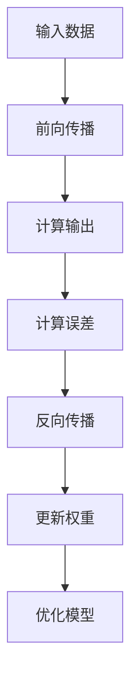
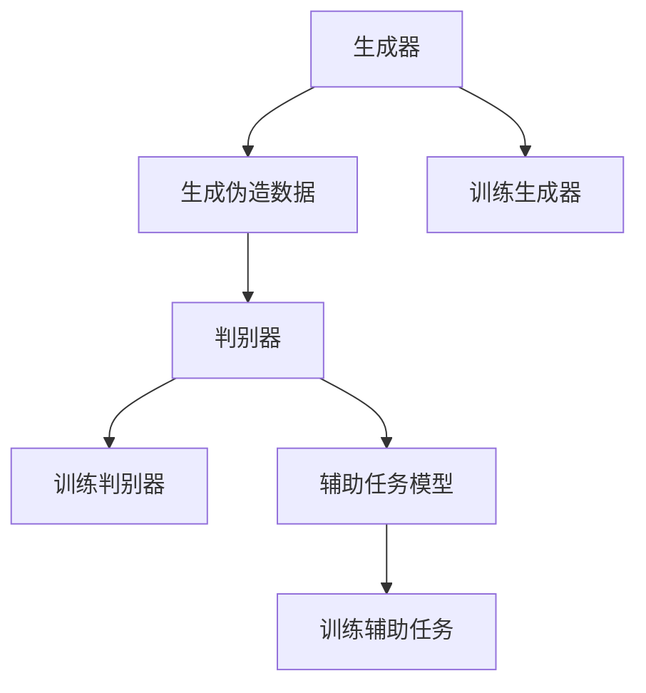
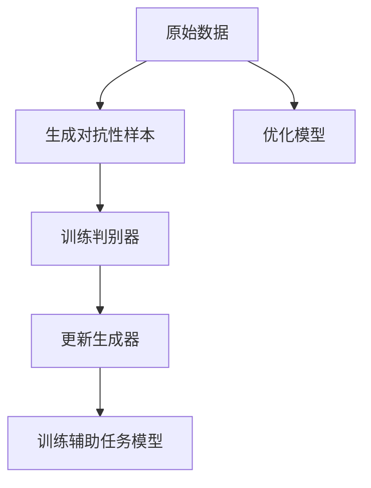

                 

## 深度学习在蛋白质折叠预测中的突破性应用

深度学习作为人工智能领域的一项核心技术，近年来在多个领域都取得了显著的成果。其中，蛋白质折叠预测作为生物信息学领域的一个重要研究方向，其重要性不言而喻。蛋白质折叠是生物体中关键生物学过程的物质基础，它决定了蛋白质的功能和稳定性。然而，蛋白质折叠的预测一直是一个极具挑战性的问题。传统的基于物理模型的预测方法，在处理复杂性的同时，往往需要大量的计算资源和时间。随着深度学习技术的发展，这一难题终于有了新的突破口。

本文将围绕深度学习在蛋白质折叠预测中的应用展开讨论。首先，我们将介绍深度学习的背景和概述，阐述其基本概念、核心算法原理以及与蛋白质折叠预测的联系。接着，我们将详细探讨蛋白质折叠预测的相关概念，包括蛋白质的基本结构、折叠过程以及预测面临的挑战。在此基础上，我们将深入分析深度学习在蛋白质折叠预测中的应用，包括结构预测、相互作用预测和功能预测等方面。随后，通过具体的应用案例，我们将展示深度学习在蛋白质折叠预测中的突破性成果。最后，我们将讨论深度学习在蛋白质折叠预测中的前沿技术以及未来的发展趋势和应用方向。

通过这篇文章，我们希望能够为广大读者提供一个全面而深入的视角，了解深度学习在蛋白质折叠预测中的突破性应用，并探讨这一领域的未来发展方向。这不仅有助于我们更好地理解生物信息学的奥妙，也为相关领域的科研人员和工程师提供有益的参考。

### 关键词

- **深度学习**
- **蛋白质折叠预测**
- **生物信息学**
- **神经网络**
- **生成对抗网络**
- **AlphaFold**
- **RoseTTAFold**

### 摘要

本文探讨了深度学习在蛋白质折叠预测中的突破性应用。首先，我们介绍了深度学习的背景和基本概念，分析了其核心算法原理。接着，我们深入讨论了蛋白质折叠预测的相关概念和挑战，并详细阐述了深度学习在蛋白质结构预测、相互作用预测和功能预测中的应用。通过具体的应用案例，我们展示了深度学习在蛋白质折叠预测中的突破性成果。最后，我们探讨了深度学习在蛋白质折叠预测中的前沿技术，包括生成对抗网络、对抗性训练、联合建模和多模态深度学习，并展望了未来的发展趋势和应用方向。

### 目录大纲

```markdown
----------------------------------------------------------------
# 第一部分: 深度学习的背景和概述

## 第1章: 深度学习的背景和概述

### 1.1 问题背景

### 1.2 深度学习的基本概念

### 1.3 深度学习与蛋白质折叠预测的联系

## 第2章: 深度学习核心算法原理

### 2.1 神经网络基础

### 2.2 反向传播算法

### 2.3 深层神经网络

### 2.4 卷积神经网络

### 2.5 循环神经网络

### 2.6 深度学习框架

## 第3章: 蛋白质折叠预测的相关概念

### 3.1 蛋白质的基本结构

### 3.2 蛋白质折叠的概念

### 3.3 蛋白质折叠预测的挑战

### 3.4 蛋白质折叠预测的核心要素

## 第4章: 深度学习在蛋白质折叠预测中的应用

### 4.1 深度学习在蛋白质结构预测中的应用

### 4.2 深度学习在蛋白质相互作用预测中的应用

### 4.3 深度学习在蛋白质功能预测中的应用

## 第5章: 深度学习在蛋白质折叠预测中的突破性应用案例

### 5.1 AlphaFold的应用

### 5.2 RoseTTAFold的应用

### 5.3 其他突破性应用案例

## 第6章: 深度学习在蛋白质折叠预测中的前沿技术

### 6.1 生成对抗网络

### 6.2 对抗性训练

### 6.3 联合建模

### 6.4 多模态深度学习

## 第7章: 深度学习在蛋白质折叠预测中的应用挑战与未来展望

### 7.1 当前应用中的挑战

### 7.2 未来发展趋势

### 7.3 可能的应用方向

----------------------------------------------------------------
```

### 详细章节内容概述

#### 第1章: 深度学习的背景和概述

- **1.1 问题背景**：介绍深度学习的发展历程和其在各个领域中的应用，引出蛋白质折叠预测的背景。
- **1.2 深度学习的基本概念**：解释深度学习的定义、核心思想和基本结构。
- **1.3 深度学习与蛋白质折叠预测的联系**：探讨深度学习为何能够在蛋白质折叠预测中发挥作用。

#### 第2章: 深度学习核心算法原理

- **2.1 神经网络基础**：介绍神经网络的基本结构和学习过程。
- **2.2 反向传播算法**：讲解如何通过反向传播算法训练神经网络。
- **2.3 深层神经网络**：探讨深层神经网络的优势和挑战。
- **2.4 卷积神经网络**：介绍卷积神经网络在图像处理中的应用。
- **2.5 循环神经网络**：解释循环神经网络在序列数据处理中的应用。
- **2.6 深度学习框架**：介绍几种常见的深度学习框架及其特点。

#### 第3章: 蛋白质折叠预测的相关概念

- **3.1 蛋白质的基本结构**：描述蛋白质的基本结构和类型。
- **3.2 蛋白质折叠的概念**：解释蛋白质折叠的过程和机制。
- **3.3 蛋白质折叠预测的挑战**：分析蛋白质折叠预测中的难点。
- **3.4 蛋白质折叠预测的核心要素**：列出蛋白质折叠预测所需的关键技术和数据。

#### 第4章: 深度学习在蛋白质折叠预测中的应用

- **4.1 深度学习在蛋白质结构预测中的应用**：展示深度学习如何预测蛋白质的三维结构。
- **4.2 深度学习在蛋白质相互作用预测中的应用**：探讨深度学习在预测蛋白质间相互作用中的应用。
- **4.3 深度学习在蛋白质功能预测中的应用**：介绍深度学习如何预测蛋白质的功能。

#### 第5章: 深度学习在蛋白质折叠预测中的突破性应用案例

- **5.1 AlphaFold的应用**：详细介绍AlphaFold在蛋白质折叠预测中的突破性成果。
- **5.2 RoseTTAFold的应用**：探讨RoseTTAFold如何实现蛋白质折叠预测的突破。
- **5.3 其他突破性应用案例**：介绍其他深度学习模型在蛋白质折叠预测中的成功应用。

#### 第6章: 深度学习在蛋白质折叠预测中的前沿技术

- **6.1 生成对抗网络**：解释生成对抗网络在蛋白质折叠预测中的应用。
- **6.2 对抗性训练**：介绍对抗性训练如何提高蛋白质折叠预测的准确性。
- **6.3 联合建模**：探讨联合建模在蛋白质折叠预测中的优势。
- **6.4 多模态深度学习**：展示多模态深度学习如何提高蛋白质折叠预测的性能。

#### 第7章: 深度学习在蛋白质折叠预测中的应用挑战与未来展望

- **7.1 当前应用中的挑战**：分析深度学习在蛋白质折叠预测中面临的挑战。
- **7.2 未来发展趋势**：探讨深度学习在蛋白质折叠预测领域的未来发展方向。
- **7.3 可能的应用方向**：展望深度学习在蛋白质折叠预测中的潜在应用场景。

### 第一部分: 深度学习的背景和概述

#### 1.1 问题背景

深度学习作为人工智能领域的一项革命性技术，起源于20世纪80年代。随着计算能力的提升和大数据的涌现，深度学习在21世纪初逐渐崭露头角，并在图像识别、语音识别、自然语言处理等众多领域取得了显著的成果。然而，深度学习的崛起不仅仅是因为技术的进步，更因为其强大的学习能力和对复杂数据的处理能力。在这其中，蛋白质折叠预测是一个极具挑战性的领域，它不仅关系到生物信息学的发展，也直接影响着药物设计和疾病研究。

蛋白质是生命体系中至关重要的分子，它们承担着各种生物学功能，从酶催化到细胞信号传导。蛋白质的折叠过程是生物体中一种复杂且高度有序的物理现象，决定了蛋白质的三维结构和功能。然而，蛋白质折叠的预测一直是生物信息学领域的一个难题。传统的基于物理模型的预测方法，如自由能最小化、分子动力学模拟等，在处理复杂性的同时，往往需要大量的计算资源和时间。此外，这些方法在面对大规模数据时，预测效率和准确性都无法满足实际需求。

深度学习技术的出现为蛋白质折叠预测带来了新的契机。深度学习通过模仿人脑的神经网络结构，可以自动学习和提取数据中的特征，从而实现复杂的模式识别和预测。与传统的预测方法相比，深度学习具有更高的预测效率和更强的泛化能力，使得蛋白质折叠预测问题得到了新的解决思路。因此，深入探讨深度学习在蛋白质折叠预测中的应用，不仅有助于我们理解生物信息学的奥妙，也为相关领域的科研人员和工程师提供了新的研究方法和工具。

#### 1.2 深度学习的基本概念

深度学习是一种基于人工神经网络的学习方法，它通过构建多层的神经网络结构，自动提取数据中的特征，并进行复杂的非线性变换。与传统的机器学习方法相比，深度学习具有更强的表达能力和适应性，能够在各种复杂数据上取得出色的性能。

**定义**：深度学习（Deep Learning）是一种多层神经网络，通过训练形成特征提取和变换的复杂模型。它由多个层级组成，每一层都能对输入数据进行处理，并生成更高级别的特征表示。

**核心思想**：深度学习的核心思想是通过多层的非线性变换，将原始数据逐步转化为高层次的特征表示。每一层神经网络都可以看作是一个特征提取器，较低层的网络负责提取基础特征，而较高层的网络则负责提取更为复杂和抽象的特征。这种层级结构使得神经网络能够自动学习数据中的层次结构，从而实现复杂的任务。

**基本结构**：深度学习的基本结构主要包括输入层、隐藏层和输出层。输入层接收原始数据，隐藏层通过多个层级进行特征提取和变换，输出层则生成最终的预测结果。在隐藏层中，每一层都会对输入数据进行非线性变换，并通过权重矩阵进行加权求和。这种多层结构使得神经网络能够捕捉到数据中的复杂模式和关系。

**工作原理**：深度学习的工作原理是通过反向传播算法（Backpropagation）来训练神经网络。在训练过程中，网络通过不断调整权重矩阵，使得网络的输出误差最小化。反向传播算法包括两个主要步骤：前向传播和反向传播。前向传播是将输入数据通过神经网络传递到输出层，并计算输出误差；反向传播则是根据输出误差，通过梯度下降法来更新权重矩阵。通过多次迭代训练，神经网络能够逐渐优化其参数，从而提高预测准确性。

**主要优点**：深度学习具有以下主要优点：

1. **强表达能力**：深度学习通过多层结构，能够自动提取数据中的高级特征，具有更强的表达能力和适应性。
2. **高泛化能力**：深度学习模型在训练过程中能够自动学习数据的内在结构，从而实现良好的泛化能力。
3. **处理复杂数据**：深度学习能够处理大规模、多维度的复杂数据，如图像、文本和语音等，并在这些领域取得了显著的成果。
4. **自动化特征提取**：深度学习通过多层网络结构，能够自动学习数据中的层次结构，无需人工设计特征。

总之，深度学习作为一种强大的学习工具，其核心思想和基本结构为各种复杂数据的处理提供了新的方法。在蛋白质折叠预测领域，深度学习通过自动学习和特征提取的能力，为解决这一难题提供了新的思路和途径。

#### 1.3 深度学习与蛋白质折叠预测的联系

深度学习在蛋白质折叠预测中的重要性主要体现在其强大的学习能力和对复杂数据的处理能力。首先，深度学习通过构建多层神经网络结构，能够自动提取数据中的特征，从而实现复杂的模式识别和预测。这一特性使得深度学习能够处理蛋白质序列和结构中的多层次信息，捕捉到蛋白质折叠过程中的关键特征。

在蛋白质折叠预测中，深度学习的一个重要应用是蛋白质结构预测。蛋白质的三维结构决定了其功能，而蛋白质结构预测的目标是推断出给定蛋白质序列的三维结构。深度学习通过学习大规模的蛋白质结构数据，可以自动提取结构特征，并建立序列与结构之间的映射关系。近年来，一些深度学习模型如AlphaFold和RoseTTAFold，通过训练大量的蛋白质结构数据，实现了高精度的蛋白质结构预测，极大地推动了蛋白质折叠预测的研究。

除了结构预测，深度学习还在蛋白质相互作用预测和功能预测中发挥着重要作用。蛋白质相互作用是生命过程中的重要组成部分，了解蛋白质之间的相互作用关系对于解析生物体系的复杂机制具有重要意义。深度学习可以通过学习蛋白质序列和结构特征，预测蛋白质之间的相互作用，从而揭示生物体系的相互作用网络。例如，深度学习模型可以预测蛋白质复合物的形成、蛋白质与DNA的相互作用等。

功能预测是蛋白质研究的另一个重要方面。蛋白质的功能决定了其在生物体系中的作用，而蛋白质功能预测的目标是推断出给定蛋白质序列的功能。深度学习通过学习蛋白质序列和结构特征，可以预测蛋白质的分类、家族归属、功能域等。这对于新蛋白质的功能解析和新药研发具有重要意义。

总之，深度学习在蛋白质折叠预测中的应用，不仅提升了预测的准确性和效率，也为生物信息学领域带来了新的研究方法和工具。通过深度学习，我们能够更好地理解和解析蛋白质的折叠过程和功能，为生命科学和生物技术的发展提供了新的契机。深度学习与蛋白质折叠预测的结合，使得这一领域的研究进入了一个新的阶段，为未来的生物科学研究奠定了坚实的基础。

### 第二部分：深度学习核心算法原理

#### 2.1 神经网络基础

神经网络是深度学习的基础，其基本结构和工作原理对理解深度学习至关重要。神经网络（Neural Network）是一种模拟人脑神经元连接结构的计算模型，通过多个层级进行数据处理和特征提取。

**基本结构**：

神经网络的基本结构由输入层、隐藏层和输出层组成。输入层接收外部数据，隐藏层通过多个层级进行特征提取和变换，输出层生成最终预测结果。每个层级由多个神经元（或节点）组成，神经元之间通过连接（或权重）进行信息传递。


**工作原理**：

神经网络的工作原理是通过前向传播（Forward Propagation）和反向传播（Backpropagation）两个主要步骤来完成。

1. **前向传播**：

前向传播是将输入数据通过神经网络传递到输出层的过程。在输入层，每个神经元接收外部输入数据，并将其传递到下一层的所有神经元。每一层的神经元都会进行加权求和和激活函数的处理，生成新的特征表示。这个过程在各个层级之间反复进行，直到输出层生成最终预测结果。

2. **反向传播**：

反向传播是用于训练神经网络的算法，通过不断调整权重和偏置来最小化预测误差。在反向传播过程中，首先计算输出误差，然后通过梯度下降法更新权重和偏置。具体步骤如下：

   a. 计算输出误差：输出误差是实际输出与预期输出之间的差异。

   b. 计算梯度：根据输出误差，计算每个权重和偏置的梯度。

   c. 更新权重和偏置：通过梯度下降法，根据梯度更新权重和偏置，使得网络输出误差最小。

通过反复迭代训练，神经网络能够逐渐优化其参数，提高预测准确性。

**主要类型**：

神经网络有多种类型，包括全连接神经网络（Fully Connected Neural Network）、卷积神经网络（Convolutional Neural Network, CNN）、循环神经网络（Recurrent Neural Network, RNN）等。

1. **全连接神经网络**：

全连接神经网络是神经网络中最基本的形式，每个神经元都与前一层的所有神经元相连。全连接神经网络适用于处理结构化数据，如图像和文本。

2. **卷积神经网络**：

卷积神经网络是专门用于处理图像数据的神经网络，其核心是卷积层，通过卷积运算提取图像的特征。卷积神经网络在计算机视觉领域取得了显著成果。

3. **循环神经网络**：

循环神经网络是专门用于处理序列数据的神经网络，其核心是循环结构，可以处理时间序列、文本等数据。循环神经网络在自然语言处理和语音识别等领域得到了广泛应用。

总之，神经网络作为深度学习的基础，其基本结构和工作原理为我们理解深度学习提供了关键的概念和工具。通过前向传播和反向传播两个主要步骤，神经网络能够自动学习和提取数据中的特征，实现复杂的模式识别和预测。

#### 2.2 反向传播算法

反向传播算法（Backpropagation Algorithm）是训练神经网络的核心算法，通过不断调整神经网络的权重和偏置，使得网络的输出误差最小化。反向传播算法主要包括前向传播和反向传播两个步骤。

**前向传播**：

在前向传播阶段，输入数据从输入层依次传递到隐藏层和输出层。每个神经元接收来自前一层的输入信号，通过加权求和和激活函数的处理，生成新的特征表示。具体步骤如下：

1. **输入层到隐藏层**：

每个隐藏层的神经元接收来自输入层的输入信号，进行加权求和。例如，对于第 $l$ 层的第 $j$ 个神经元，其输入信号可以表示为：

$$
z_j^l = \sum_{i} w_{ij}^l x_i^l + b_j^l
$$

其中，$w_{ij}^l$ 是第 $l$ 层第 $j$ 个神经元与第 $l-1$ 层第 $i$ 个神经元之间的权重，$b_j^l$ 是第 $l$ 层第 $j$ 个神经元的偏置。

2. **隐藏层到输出层**：

输出层的神经元同样进行加权求和，并应用激活函数。例如，对于输出层的第 $k$ 个神经元，其输入信号可以表示为：

$$
z_k^{output} = \sum_{j} w_{jk}^{output} a_j^{hidden} + b_k^{output}
$$

其中，$a_j^{hidden}$ 是第 $l$ 层第 $j$ 个神经元的输出。

3. **激活函数**：

激活函数用于引入非线性，常见的激活函数包括 sigmoid 函数、ReLU 函数和 tanh 函数。以 sigmoid 函数为例，其定义如下：

$$
a_j = \frac{1}{1 + e^{-z_j}}
$$

**反向传播**：

在反向传播阶段，通过计算输出误差，并利用梯度下降法更新权重和偏置。具体步骤如下：

1. **计算输出误差**：

输出误差（$E$）是实际输出（$y$）与预期输出（$y_{expected}$）之间的差异。对于回归问题，可以使用均方误差（Mean Squared Error, MSE）作为损失函数：

$$
E = \frac{1}{2} \sum_{k} (y_k - y_{expected,k})^2
$$

2. **计算梯度**：

计算输出层到隐藏层的梯度，即每个权重和偏置的导数。以输出层为例，对于第 $k$ 个神经元，其误差梯度可以表示为：

$$
\frac{\partial E}{\partial w_{jk}^{output}} = a_j^{hidden} (1 - a_j^{hidden}) (y_k - y_{expected,k})
$$

$$
\frac{\partial E}{\partial b_k^{output}} = a_j^{hidden} (1 - a_j^{hidden}) (y_k - y_{expected,k})
$$

3. **更新权重和偏置**：

利用梯度下降法更新权重和偏置。以输出层为例，更新公式如下：

$$
w_{jk}^{output} = w_{jk}^{output} - \alpha \frac{\partial E}{\partial w_{jk}^{output}}
$$

$$
b_k^{output} = b_k^{output} - \alpha \frac{\partial E}{\partial b_k^{output}}
$$

其中，$\alpha$ 是学习率。

4. **反向传播**：

将误差从输出层反向传播到隐藏层，重复以上步骤，更新隐藏层的权重和偏置。

通过反复迭代训练，反向传播算法使得神经网络逐渐优化其参数，提高预测准确性。

**Python代码示例**：

以下是一个简单的反向传播算法的Python代码示例：

```python
import numpy as np

# 设置参数
alpha = 0.1  # 学习率
input_data = np.array([1, 2, 3])  # 输入数据
expected_output = np.array([2, 4, 6])  # 预期输出

# 初始化权重和偏置
weights = np.random.rand(3, 1)
biases = np.random.rand(1)

# 前向传播
hidden_layer_input = np.dot(input_data, weights) + biases
hidden_layer_output = sigmoid(hidden_layer_input)

# 计算误差
output_error = hidden_layer_output - expected_output

# 计算梯度
weights_gradient = input_data * output_error * (1 - hidden_layer_output)
biases_gradient = output_error * (1 - hidden_layer_output)

# 更新权重和偏置
weights -= alpha * weights_gradient
biases -= alpha * biases_gradient

print("Final weights:", weights)
print("Final biases:", biases)

# 激活函数
def sigmoid(x):
    return 1 / (1 + np.exp(-x))
```

通过以上代码示例，我们可以看到如何使用反向传播算法训练一个简单的神经网络。尽管这是一个非常基础的示例，但它展示了反向传播算法的核心思想和步骤。

总之，反向传播算法是训练神经网络的关键算法，通过前向传播和反向传播两个主要步骤，神经网络能够不断优化其参数，实现高效的预测。反向传播算法不仅为深度学习提供了强大的训练能力，也为解决复杂的模式识别和预测问题提供了有力的工具。

#### 2.3 深层神经网络

深层神经网络（Deep Neural Network, DNN）是指具有多个隐藏层的神经网络，相较于单层神经网络，深层神经网络具有更强的表达能力和更好的泛化能力。这一节将详细介绍深层神经网络的优势和挑战。

**优势**：

1. **更好的特征提取能力**：

深层神经网络通过多个隐藏层，可以逐步提取输入数据中的高级特征。在每一层中，神经元会对前一层的输出进行加权求和和激活函数处理，生成更为复杂和抽象的特征表示。这种层级结构使得深层神经网络能够捕捉到数据中的深层模式和关系。

2. **更高的泛化能力**：

由于深层神经网络具有更强的特征提取能力，它们在训练过程中能够学习到更多的数据特征，从而提高泛化能力。这意味着深层神经网络不仅能够在训练数据上表现出良好的性能，还能在新数据上保持较高的预测准确性。

3. **处理复杂数据**：

深层神经网络能够处理大规模、多维度的复杂数据。例如，在图像识别任务中，深层神经网络可以通过卷积层提取图像的特征，并在全连接层进行分类。这种结构使得深层神经网络在处理图像、文本和语音等复杂数据时具有显著优势。

4. **自动特征学习**：

深层神经网络通过训练自动学习数据中的特征，无需人工设计特征。这使得深层神经网络在处理未知数据时具有更强的适应性和灵活性。

**挑战**：

1. **梯度消失和梯度爆炸**：

在深层神经网络中，梯度消失和梯度爆炸是常见问题。梯度消失是指梯度值变得非常小，使得网络难以进行有效的参数更新；而梯度爆炸则是梯度值变得非常大，导致网络不稳定。这些问题通常出现在多层网络中，特别是当网络层数较多时。

2. **训练时间较长**：

深层神经网络需要更多的参数来训练，这使得训练时间显著增加。相比于单层神经网络，深层神经网络需要更多的计算资源和时间来完成训练。

3. **过拟合风险**：

深层神经网络具有强大的表达能力和拟合能力，但同时也容易发生过拟合。过拟合是指模型在训练数据上表现良好，但在新数据上性能下降。为了防止过拟合，需要采用各种正则化技术和优化策略。

4. **数据需求大**：

深层神经网络通常需要大量的训练数据来提高预测性能。这是因为深层神经网络通过学习大量特征来捕捉数据中的复杂模式，因此需要更多的数据来支持训练过程。

**解决方案**：

1. **优化算法**：

为了解决梯度消失和梯度爆炸问题，可以采用优化算法如Adam、RMSprop等，这些算法通过自适应调整学习率，提高了训练的稳定性和效率。

2. **数据增强**：

通过数据增强技术，如随机裁剪、旋转、缩放等，可以增加训练数据的多样性，从而提高模型的泛化能力。

3. **正则化技术**：

采用正则化技术，如Dropout、L1正则化、L2正则化等，可以减少过拟合风险。这些技术通过在训练过程中随机丢弃部分神经元或增加惩罚项，提高了模型的泛化能力。

4. **预处理和特征选择**：

对输入数据进行预处理，如归一化、标准化等，可以减少数据分布的差异，提高模型的训练效果。此外，通过特征选择技术，可以筛选出对模型预测有重要影响的关键特征，从而提高模型的性能。

总之，深层神经网络在处理复杂数据和实现复杂任务方面具有显著优势，但同时也面临一些挑战。通过采用优化算法、数据增强、正则化技术等解决方案，可以克服这些挑战，提高深层神经网络的性能和应用效果。

#### 2.4 卷积神经网络

卷积神经网络（Convolutional Neural Network, CNN）是一种专门用于处理图像数据的神经网络，其核心是卷积层，通过卷积运算提取图像的特征。卷积神经网络在计算机视觉领域取得了显著成果，其独特的结构和特点使其成为图像识别、物体检测、图像分割等任务的首选模型。

**基本结构**：

卷积神经网络的基本结构包括输入层、卷积层、池化层和全连接层。输入层接收原始图像数据，卷积层通过卷积运算提取图像特征，池化层用于降维和减少参数数量，全连接层则用于分类和预测。


**卷积层**：

卷积层是卷积神经网络的核心层，通过卷积运算提取图像特征。卷积运算的基本原理是将一个卷积核（或滤波器）与图像进行点乘，并将结果求和，生成新的特征图（或特征图）。卷积核的参数需要通过训练进行优化，以提取图像中的重要特征。

卷积运算可以表示为：

$$
\text{特征图} = \text{卷积核} \circ \text{图像}
$$

其中，“$\circ$”表示卷积运算。

卷积层具有以下特点：

1. **局部连接**：

卷积层中的每个神经元仅与输入图像的局部区域连接，而不是整个图像。这种局部连接特性使得卷积层能够高效地提取图像中的局部特征，如边缘、纹理等。

2. **参数共享**：

卷积层中的卷积核在整个图像上共享，这意味着对于输入图像的不同区域，使用相同的卷积核进行特征提取。这种参数共享特性减少了模型的参数数量，提高了模型的泛化能力。

3. **平移不变性**：

卷积层具有平移不变性，即对输入图像进行平移操作时，卷积层生成的特征图不变。这意味着卷积层可以提取到图像中的通用特征，而不受图像位置的影响。

**池化层**：

池化层用于降维和减少参数数量。常见的池化操作包括最大池化（Max Pooling）和平均池化（Average Pooling）。最大池化选择每个局部区域中的最大值作为输出，而平均池化则计算每个局部区域中的平均值作为输出。

池化层具有以下特点：

1. **降维**：

池化层通过减小特征图的尺寸，减少模型的参数数量，从而降低模型的复杂度。这有助于防止过拟合和提高模型的泛化能力。

2. **减少计算量**：

由于池化层减少了特征图的尺寸，后续的卷积运算和全连接层的计算量也相应减少，从而提高了模型的计算效率。

**全连接层**：

全连接层位于卷积神经网络的最后，用于分类和预测。全连接层将卷积层和池化层提取的高级特征映射到具体的类别标签上。全连接层中的每个神经元都与卷积层和池化层的所有神经元相连。

**卷积神经网络的工作原理**：

卷积神经网络通过多个卷积层和池化层的堆叠，逐步提取图像中的特征。首先，输入图像通过卷积层进行特征提取，生成特征图。然后，通过池化层进行降维和参数减少。这个过程在多个层级之间反复进行，逐渐提取到图像的更高级特征。最后，全连接层将提取的高级特征映射到具体的类别标签上，实现图像分类或预测。

**卷积神经网络的优点**：

1. **强大的特征提取能力**：

卷积神经网络通过多个卷积层和池化层，可以逐步提取图像中的高级特征，具有较强的特征提取能力。

2. **参数共享**：

卷积层中的参数共享特性使得模型参数数量大大减少，提高了模型的泛化能力。

3. **平移不变性**：

卷积神经网络具有平移不变性，可以提取到图像中的通用特征，不受图像位置的影响。

4. **高效的计算**：

卷积运算和池化操作的计算量相对较小，使得卷积神经网络具有较高的计算效率。

总之，卷积神经网络作为一种专门用于处理图像数据的神经网络，具有强大的特征提取能力、参数共享和平移不变性等特点，在计算机视觉领域取得了显著的成果。卷积神经网络的工作原理通过多个卷积层和池化层的堆叠，逐步提取图像中的高级特征，实现了高效的图像识别和分类任务。

#### 2.5 循环神经网络

循环神经网络（Recurrent Neural Network, RNN）是一种专门用于处理序列数据的神经网络，其核心是循环结构，可以捕捉序列数据中的时间依赖关系。与传统的神经网络不同，RNN 具有记忆能力，可以保留和利用之前的输入信息，从而在处理序列数据时表现出更强的自适应性和泛化能力。

**基本结构**：

循环神经网络的基本结构包括输入层、隐藏层和输出层。输入层接收序列数据的每个元素，隐藏层通过循环连接进行信息传递，输出层生成最终的预测结果。每个时间步的输出都会反馈到隐藏层，从而实现信息的记忆和传递。


**工作原理**：

循环神经网络的工作原理基于以下三个关键组件：

1. **输入门（Input Gate）**：

输入门用于控制当前输入信息对隐藏状态的贡献。在每个时间步，输入门会根据当前输入和前一隐藏状态，计算一个新的门控值。这个门控值决定了输入信息在隐藏状态中的权重。

2. **遗忘门（Forget Gate）**：

遗忘门用于控制之前的隐藏状态中的信息是否被遗忘。在每个时间步，遗忘门将根据当前输入和前一隐藏状态，计算一个新的门控值。这个门控值决定了之前的信息在隐藏状态中的保留程度。

3. **输出门（Output Gate）**：

输出门用于控制当前隐藏状态对输出的贡献。在每个时间步，输出门将根据当前输入和当前隐藏状态，计算一个新的门控值。这个门控值决定了隐藏状态在输出中的权重。

循环神经网络在每个时间步的隐藏状态和输出状态的计算如下：

1. **隐藏状态**：

$$
h_t = \sigma(W_h \cdot [h_{t-1}, x_t] + b_h)
$$

其中，$h_t$ 是第 $t$ 个时间步的隐藏状态，$x_t$ 是第 $t$ 个时间步的输入，$W_h$ 和 $b_h$ 分别是权重矩阵和偏置。

2. **遗忘门**：

$$
f_t = \sigma(W_f \cdot [h_{t-1}, x_t] + b_f)
$$

其中，$f_t$ 是第 $t$ 个时间步的遗忘门控值。

3. **输入门**：

$$
i_t = \sigma(W_i \cdot [h_{t-1}, x_t] + b_i)
$$

其中，$i_t$ 是第 $t$ 个时间步的输入门控值。

4. **输出门**：

$$
o_t = \sigma(W_o \cdot [h_{t-1}, x_t] + b_o)
$$

其中，$o_t$ 是第 $t$ 个时间步的输出门控值。

5. **当前隐藏状态**：

$$
\tilde{h_t} = \tanh(W_c \cdot [f_{t-1} \odot h_{t-1} + i_{t-1} \odot x_t] + b_c)
$$

其中，$W_c$ 和 $b_c$ 分别是权重矩阵和偏置，$\odot$ 表示元素乘积。

6. **当前输出**：

$$
h_t = o_t \odot \tilde{h_t}
$$

**RNN的优缺点**：

1. **优点**：

   - **记忆能力**：RNN 具有记忆能力，可以保留和利用之前的输入信息，从而在处理序列数据时表现出更强的自适应性和泛化能力。
   - **适用于序列数据**：RNN 特别适用于处理时间序列、文本和语音等序列数据，能够捕捉序列中的时间依赖关系。

2. **缺点**：

   - **梯度消失和梯度爆炸**：RNN 在训练过程中容易发生梯度消失和梯度爆炸问题，特别是在长序列数据中，这会导致训练困难。
   - **训练不稳定**：由于梯度消失和梯度爆炸问题，RNN 的训练过程往往不稳定，容易出现过拟合现象。

**LSTM和GRU**：

为了解决 RNN 的梯度消失和梯度爆炸问题，引入了长短期记忆网络（Long Short-Term Memory, LSTM）和门控循环单元（Gated Recurrent Unit, GRU）。这两种模型通过引入门控机制，能够更好地记忆和传递序列中的长期信息。

1. **LSTM**：

LSTM 通过引入遗忘门和输入门，可以有效地控制信息的遗忘和记忆。LSTM 通过三个门控单元和一个细胞状态，实现了对信息的长期记忆。LSTM 在处理长序列数据时表现出更高的稳定性和效果。

2. **GRU**：

GRU 是 LSTM 的简化版本，通过合并输入门和遗忘门，减少了参数数量。GRU 具有更简单的结构，但仍然能够有效地处理长序列数据。

总之，循环神经网络通过其独特的循环结构，能够捕捉序列数据中的时间依赖关系，从而在自然语言处理、语音识别和时间序列预测等领域取得了显著成果。尽管 RNN 存在一些问题，但通过引入 LSTM 和 GRU，可以克服这些挑战，提高模型的效果和稳定性。

#### 2.6 深度学习框架

深度学习框架是用于实现和优化深度学习算法的工具，它们提供了丰富的API和模块，使得深度学习模型的开发和部署变得更加高效和便捷。以下将介绍几种常见的深度学习框架，包括TensorFlow、PyTorch和Keras，并讨论它们的特点和适用场景。

**TensorFlow**：

TensorFlow 是由 Google 开发的一款开源深度学习框架，具有广泛的社区支持和丰富的功能。TensorFlow 使用数据流图（Dataflow Graph）作为核心概念，通过定义计算图来构建和训练模型。数据流图将数据作为节点传递，通过一系列运算操作生成结果。TensorFlow 的优势在于其高度可扩展性和灵活性，能够支持各种复杂的深度学习模型。

**特点**：

1. **高度可扩展性**：TensorFlow 支持大规模分布式训练，可以处理万亿级别的数据集。
2. **丰富的API**：TensorFlow 提供了丰富的API和工具，包括低层次的Tensor操作和高级的Estimators。
3. **广泛的应用**：TensorFlow 在图像识别、自然语言处理、强化学习等领域得到了广泛应用。

**适用场景**：

TensorFlow 适用于需要高度可扩展性和复杂模型开发的场景，如大规模图像识别任务、复杂自然语言处理模型和强化学习应用。

**PyTorch**：

PyTorch 是由 Facebook AI Research（FAIR）开发的一款开源深度学习框架，以其灵活的动态计算图（Dynamic Computation Graph）而闻名。PyTorch 的动态计算图使得模型开发和调试更加直观和便捷，开发者可以轻松地通过Python代码实现复杂的深度学习算法。

**特点**：

1. **动态计算图**：PyTorch 使用动态计算图，使得模型开发和调试更加直观和便捷。
2. **强大的调试工具**：PyTorch 提供了强大的调试工具，如变量监控和自动求导。
3. **广泛的支持**：PyTorch 在计算机视觉、自然语言处理和语音识别等领域具有广泛的应用。

**适用场景**：

PyTorch 适用于需要灵活开发和快速迭代的场景，如研究原型、实时推理和动态模型开发。

**Keras**：

Keras 是一个基于 TensorFlow 和 Theano 的开源深度学习库，以其简洁和用户友好性而受到开发者喜爱。Keras 提供了一个高层接口，使得深度学习模型的构建和训练变得更加简单和高效。Keras 的核心是模块化组件，开发者可以自由组合这些组件构建复杂的模型。

**特点**：

1. **简洁的用户界面**：Keras 提供了一个简洁的用户界面，使得深度学习模型构建更加直观和易用。
2. **模块化组件**：Keras 的核心是模块化组件，开发者可以灵活地组合这些组件构建复杂的模型。
3. **广泛的文档和教程**：Keras 具有丰富的文档和教程，有助于开发者快速上手。

**适用场景**：

Keras 适用于快速原型开发、学术研究和教育场景，它为开发者提供了一个易于学习和使用的深度学习平台。

**总结**：

深度学习框架的发展极大地推动了深度学习技术的应用和普及。TensorFlow、PyTorch 和 Keras 这三种框架各具特色，适用于不同的开发场景和需求。开发者可以根据项目的具体要求选择合适的框架，实现高效的深度学习模型开发和部署。

### 第三部分：蛋白质折叠预测的相关概念

#### 3.1 蛋白质的基本结构

蛋白质是生命体系中至关重要的大分子，它们由氨基酸组成，通过特定的折叠和组装形成具有特定功能和结构的分子。了解蛋白质的基本结构对于深入研究蛋白质的折叠和功能具有重要意义。

**氨基酸**：

蛋白质的基本组成单位是氨基酸。氨基酸由一个中心碳原子（α碳）连接一个氨基（-NH2）、一个羧基（-COOH）和一个侧链（R基团）组成。氨基酸的种类根据侧链的不同而有所区别，共有20种常见氨基酸。

**多肽链**：

多个氨基酸通过肽键连接形成多肽链，也称为肽链。肽键是氨基酸的羧基与另一氨基酸的氨基通过脱水缩合形成的共价键。多肽链的不同序列决定了蛋白质的结构和功能。

**一级结构**：

蛋白质的一级结构是指多肽链中氨基酸的排列顺序。一级结构是蛋白质结构的基础，决定了蛋白质的空间结构和功能。

**二级结构**：

蛋白质的二级结构是指多肽链在空间中的局部折叠形式，主要包括α-螺旋（α-helix）和β-折叠（β-sheet）。这些结构由氢键稳定，使得多肽链呈现规则的螺旋或折叠形式。

**三级结构**：

蛋白质的三级结构是指整条多肽链在空间中的三维折叠形式。三级结构由多种类型的化学键（如氢键、离子键、疏水作用和范德华力）稳定。蛋白质的三级结构决定了其功能，如酶的催化活性、受体与配体的结合等。

**四级结构**：

某些蛋白质由多个多肽链组成，这些多肽链通过非共价相互作用形成四级结构。四级结构进一步增强了蛋白质的稳定性和功能多样性。

**蛋白质结构分类**：

蛋白质结构可以根据其复杂性和功能进行分类。常见的分类包括：

1. **球状蛋白质**：具有独立的三级结构，如酶、抗体等。
2. **纤维状蛋白质**：具有延伸的一级结构，如肌动蛋白、弹性蛋白等。
3. **膜蛋白**：嵌入细胞膜中，具有特定的膜穿透结构。
4. **结构域和亚基**：某些蛋白质由多个结构域或亚基组成，每个结构域或亚基具有特定的功能。

**蛋白质结构的重要性**：

蛋白质的结构直接决定了其功能。正确的折叠使得蛋白质能够执行其特定的生物学功能，如酶的催化、抗原的识别、信号传导等。蛋白质的结构异常或错误折叠可能导致疾病的产生，如阿尔茨海默病、疯牛病等。

**总结**：

蛋白质的基本结构包括氨基酸、多肽链、一级结构、二级结构、三级结构和四级结构。了解蛋白质的结构对于深入研究其折叠和功能具有重要意义。蛋白质结构的准确预测对于生物信息学、药物设计和疾病研究等领域具有重要的应用价值。

#### 3.2 蛋白质折叠的概念

蛋白质折叠是指蛋白质在生物体内从无序的线性多肽链转变为具有特定三维结构的有序状态的过程。折叠过程涉及多个层次的结构变化，从一级结构到四级结构，每一步都受到复杂的生物力和分子间相互作用的调控。

**折叠过程**：

蛋白质折叠过程可以分为三个主要阶段：

1. **起始阶段**：在起始阶段，多肽链开始形成二级结构，如α-螺旋和β-折叠。这些二级结构是通过氨基酸侧链之间的氢键形成的。
   
2. **中间阶段**：在中间阶段，多肽链进一步折叠形成三维结构。这一阶段涉及多种类型的分子间相互作用，如疏水作用、离子键、氢键和范德华力。这些相互作用在蛋白质的三级结构形成中起关键作用。

3. **成熟阶段**：在成熟阶段，蛋白质达到其最终的结构状态，并准备执行其特定的生物学功能。成熟蛋白质通常具有高度稳定的结构，但某些蛋白质可能继续经历构象变化以适应不同的生物学环境。

**折叠机制**：

蛋白质折叠机制涉及多种分子间相互作用和动力学的过程。以下是一些关键的折叠机制：

1. **能量驱动的折叠**：蛋白质折叠是一个能量驱动的过程，需要消耗能量（如ATP）以克服热动力学障碍。

2. **核糖体导向的折叠**：在蛋白质合成过程中，核糖体可以指导蛋白质的折叠，确保其正确折叠成功能性蛋白质。

3. **分子伴侣的作用**：分子伴侣是一类蛋白质，能够协助其他蛋白质正确折叠，避免错误折叠导致的聚集和失活。

4. **动态折叠**：蛋白质折叠是一个动态过程，蛋白质可以在不同的折叠中间态之间转换。这种动态性使得蛋白质能够适应不同的环境和功能需求。

**折叠中的挑战**：

蛋白质折叠预测是一个极其复杂的任务，面临以下挑战：

1. **复杂性**：蛋白质折叠涉及大量的分子间相互作用，这些相互作用在空间上的协调和平衡非常复杂。

2. **多样性**：蛋白质的结构和功能具有极大的多样性，每种蛋白质的折叠方式可能是独一无二的。

3. **计算资源**：传统的折叠预测方法通常需要大量的计算资源，对于大规模蛋白质数据集，计算效率是一个重要的挑战。

**总结**：

蛋白质折叠是蛋白质从无序的线性多肽链转变为具有特定三维结构的有序状态的过程。折叠过程涉及多个层次的结构变化和复杂的分子间相互作用。了解蛋白质折叠的概念和机制对于研究蛋白质结构和功能、解决生物医学问题具有重要意义。

#### 3.3 蛋白质折叠预测的挑战

蛋白质折叠预测是生物信息学领域的一个核心问题，但其复杂性使得预测准确性和效率一直面临诸多挑战。以下是蛋白质折叠预测中常见的几个挑战：

**1. 数据复杂性**：

蛋白质序列中的每个氨基酸都具有独特的化学性质，而蛋白质的折叠过程受到这些化学性质的强烈影响。然而，蛋白质序列中的这些信息往往不够明确地指导折叠过程，因此，如何从大量的序列信息中提取出对折叠过程有指导意义的特征是一个巨大的挑战。

**2. 大规模数据处理**：

随着高通量测序技术的发展，我们获得了大量的蛋白质序列数据。这些数据规模庞大，处理和分析这些数据需要大量的计算资源和时间。此外，数据质量也是一个问题，存在许多噪声和异常值，如何有效地处理这些数据以提高预测准确性，是当前的一个重要研究方向。

**3. 模型训练和预测**：

蛋白质折叠预测模型通常需要大量训练数据，这使得模型训练时间较长，且对计算资源的需求较高。此外，预测模型需要具备良好的泛化能力，以便在新的蛋白质序列上获得准确的预测结果。然而，由于蛋白质序列和结构的多样性，如何设计出能够适应各种不同情况的预测模型，仍然是一个挑战。

**4. 梯度消失和梯度爆炸**：

在训练深度学习模型时，特别是在处理长序列数据时，常常会遇到梯度消失和梯度爆炸问题。这些问题会严重影响模型的训练过程，导致模型无法有效学习到有用的特征。为了解决这些问题，研究者们提出了多种技术，如LSTM、GRU和Transformer等，以改进模型性能。

**5. 空间复杂性**：

蛋白质折叠涉及复杂的分子间相互作用，这些相互作用在空间上具有高度复杂性。传统方法通常依赖于物理模型和统计模型，但它们在处理空间复杂性方面存在一定的局限性。深度学习方法虽然能够在一定程度上缓解这一问题，但仍然需要进一步优化和改进。

**6. 实时预测**：

在生物医学研究中，快速准确地预测蛋白质折叠对于药物设计和疾病治疗具有重要意义。然而，当前的蛋白质折叠预测模型通常需要较长的计算时间，无法满足实时预测的需求。因此，如何提高模型的预测速度，同时保持较高的准确性，是另一个亟待解决的挑战。

**总结**：

蛋白质折叠预测在生物信息学领域具有重要意义，但其复杂性使得预测准确性和效率面临诸多挑战。通过不断研究和创新，研究者们正努力克服这些挑战，以期提高蛋白质折叠预测的准确性和效率，为生物医学研究和应用提供更有力的支持。

#### 3.4 蛋白质折叠预测的核心要素

蛋白质折叠预测是一个复杂的过程，涉及多个核心要素和关键技术。以下是蛋白质折叠预测中的一些关键要素：

**1. 蛋白质序列**：

蛋白质序列是进行折叠预测的基础。蛋白质序列中包含的氨基酸种类、顺序和比例直接影响蛋白质的折叠方式。通过分析蛋白质序列，我们可以预测其可能的折叠模式。

**2. 结构数据**：

大量的蛋白质结构数据对于训练和验证折叠预测模型至关重要。这些数据包括蛋白质的三维结构、二级结构和三级结构。现有的蛋白质结构数据库如PDB（Protein Data Bank）提供了丰富的结构信息，是进行折叠预测的重要资源。

**3. 物理模型**：

物理模型用于模拟蛋白质分子间的相互作用和折叠过程。这些模型包括自由能最小化方法、分子动力学模拟和量子力学计算等。物理模型能够提供关于蛋白质折叠过程的深刻理解，并用于指导折叠预测。

**4. 统计模型**：

统计模型通过分析大量的蛋白质结构数据，建立序列与结构之间的统计关系。这些模型包括序列模式识别、序列比对和序列特征提取等方法。统计模型能够高效地预测蛋白质的结构特征，提高折叠预测的准确性。

**5. 深度学习模型**：

深度学习模型通过自动学习和提取数据中的特征，实现了对蛋白质折叠的预测。常见的深度学习模型包括神经网络、卷积神经网络和循环神经网络等。这些模型能够处理大规模和复杂的数据，提高了折叠预测的性能。

**6. 数据预处理**：

数据预处理是进行折叠预测的重要步骤。这包括序列清洗、缺失值填充、序列对齐和数据标准化等。良好的数据预处理能够提高模型训练的效果和预测的准确性。

**7. 模型评估**：

模型评估是判断折叠预测模型性能的重要环节。常用的评估指标包括准确率、召回率、F1分数和预测误差等。通过这些指标，我们可以评估模型在不同任务上的表现，并对其进行优化。

**总结**：

蛋白质折叠预测的核心要素包括蛋白质序列、结构数据、物理模型、统计模型、深度学习模型、数据预处理和模型评估。通过综合运用这些要素，我们可以不断提高蛋白质折叠预测的准确性和效率，为生物信息学、药物设计和疾病研究等领域提供有力的支持。

### 第四部分：深度学习在蛋白质折叠预测中的应用

#### 4.1 深度学习在蛋白质结构预测中的应用

蛋白质结构预测是生物信息学领域的一个重要研究方向，直接关系到药物设计、疾病治疗和新材料开发。深度学习作为一种强大的机器学习技术，其在蛋白质结构预测中的应用已经取得了显著的成果。本文将详细探讨深度学习在蛋白质结构预测中的应用，包括其工作原理、主要模型及其应用实例。

**深度学习模型的工作原理**：

深度学习模型通过多层的神经网络结构，自动从数据中提取特征，进行复杂的非线性变换。在蛋白质结构预测中，深度学习模型可以学习到序列与结构之间的复杂关系，从而提高预测的准确性。以下是一些常用的深度学习模型：

1. **卷积神经网络（CNN）**：

卷积神经网络是一种用于处理图像数据的深度学习模型，其通过卷积层提取图像特征。在蛋白质结构预测中，CNN可以用于提取蛋白质序列的特征，并预测蛋白质的三维结构。CNN的优势在于其能够自动学习到数据中的层次结构，从而捕捉到蛋白质序列中的复杂模式。

2. **循环神经网络（RNN）**：

循环神经网络是一种用于处理序列数据的深度学习模型，其通过循环结构来记忆和利用之前的信息。在蛋白质结构预测中，RNN可以用于处理蛋白质序列，并预测蛋白质的三维结构。RNN的优势在于其能够处理变长的序列数据，并捕捉序列中的时间依赖关系。

3. **长短期记忆网络（LSTM）**：

长短期记忆网络是RNN的一种变体，其通过引入门控机制来控制信息的记忆和遗忘，从而解决了传统RNN的梯度消失问题。在蛋白质结构预测中，LSTM可以用于处理长序列数据，并提高预测的准确性。

4. **Transformer**：

Transformer是一种基于自注意力机制的深度学习模型，其通过多头自注意力机制来学习数据中的全局依赖关系。在蛋白质结构预测中，Transformer可以用于提取蛋白质序列的特征，并预测蛋白质的三维结构。Transformer的优势在于其能够处理长序列数据，并捕捉序列中的长距离依赖关系。

**主要模型及其应用实例**：

以下是一些在蛋白质结构预测中取得显著成果的深度学习模型：

1. **AlphaFold**：

AlphaFold是由DeepMind开发的深度学习模型，其通过结合CNN和Transformer，实现了高精度的蛋白质结构预测。AlphaFold在CASP（Critical Assessment of Techniques for Protein Structure Prediction）竞赛中取得了突破性的成绩，预测的蛋白质结构精度显著高于传统方法。

2. **RoseTTAFold**：

RoseTTAFold是由RoseTTa实验室开发的深度学习模型，其通过改进Transformer结构，实现了高效的蛋白质结构预测。RoseTTAFold在CASP竞赛中表现出色，预测的蛋白质结构精度达到前所未有的水平。

3. **ProtTimplicit**：

ProtTimplicit是一种基于变分自编码器的深度学习模型，其通过学习序列与结构之间的隐含表示，实现了蛋白质结构预测。ProtTimplicit在CASP竞赛中取得了优异的成绩，展示了深度学习在蛋白质结构预测中的潜力。

4. **Deep Folding**：

Deep Folding是一种基于CNN和LSTM的深度学习模型，其通过结合多种特征，实现了蛋白质结构预测。Deep Folding在CASP竞赛中表现出良好的性能，验证了深度学习在蛋白质结构预测中的应用价值。

**应用实例**：

以下是一些深度学习在蛋白质结构预测中的应用实例：

1. **药物设计**：

深度学习模型可以用于预测蛋白质与药物分子的相互作用，从而指导药物设计。通过结合蛋白质的结构信息和药物分子的性质，深度学习模型可以筛选出具有潜在疗效的药物分子，加速新药研发。

2. **疾病诊断**：

深度学习模型可以用于分析蛋白质结构，从而辅助疾病诊断。例如，通过分析蛋白质的结构特征，深度学习模型可以预测某些蛋白质是否与疾病相关，为疾病诊断提供新的方法。

3. **新材料开发**：

深度学习模型可以用于预测蛋白质的折叠方式和结构特征，从而指导新材料的开发。例如，通过设计具有特定折叠方式的蛋白质，可以开发出具有特殊功能的生物材料。

**总结**：

深度学习在蛋白质结构预测中的应用取得了显著成果，通过结合多种深度学习模型，我们可以实现高精度的蛋白质结构预测。这些应用不仅推动了生物信息学的发展，也为药物设计、疾病诊断和新材料开发等领域提供了新的方法和工具。

#### 4.2 深度学习在蛋白质相互作用预测中的应用

蛋白质相互作用是生命活动中至关重要的过程，涉及多种生物分子的相互作用，如蛋白质-蛋白质、蛋白质-DNA和蛋白质-小分子等。准确预测蛋白质相互作用对于理解生物体系的复杂机制具有重要意义。深度学习作为一种强大的机器学习技术，其在蛋白质相互作用预测中的应用正逐步展现其独特优势。以下将详细探讨深度学习在蛋白质相互作用预测中的应用，包括其工作原理、主要模型及其应用实例。

**深度学习模型的工作原理**：

深度学习模型通过多层的神经网络结构，自动从数据中提取特征，进行复杂的非线性变换。在蛋白质相互作用预测中，深度学习模型可以学习到蛋白质序列和结构之间的复杂关系，从而提高预测的准确性。以下是一些常用的深度学习模型：

1. **卷积神经网络（CNN）**：

卷积神经网络是一种用于处理图像数据的深度学习模型，其通过卷积层提取图像特征。在蛋白质相互作用预测中，CNN可以用于提取蛋白质序列的特征，并预测蛋白质之间的相互作用。CNN的优势在于其能够自动学习到数据中的层次结构，从而捕捉到蛋白质序列中的复杂模式。

2. **循环神经网络（RNN）**：

循环神经网络是一种用于处理序列数据的深度学习模型，其通过循环结构来记忆和利用之前的信息。在蛋白质相互作用预测中，RNN可以用于处理蛋白质序列，并预测蛋白质之间的相互作用。RNN的优势在于其能够处理变长的序列数据，并捕捉序列中的时间依赖关系。

3. **长短期记忆网络（LSTM）**：

长短期记忆网络是RNN的一种变体，其通过引入门控机制来控制信息的记忆和遗忘，从而解决了传统RNN的梯度消失问题。在蛋白质相互作用预测中，LSTM可以用于处理长序列数据，并提高预测的准确性。

4. **图神经网络（Graph Neural Network, GNN）**：

图神经网络是一种专门用于处理图结构数据的深度学习模型，其通过节点和边之间的关系来学习数据中的特征。在蛋白质相互作用预测中，GNN可以用于处理蛋白质的结构网络，并预测蛋白质之间的相互作用。GNN的优势在于其能够处理复杂的图结构数据，并捕捉节点之间的相互作用。

**主要模型及其应用实例**：

以下是一些在蛋白质相互作用预测中取得显著成果的深度学习模型：

1. **PPI-predictor**：

PPI-predictor是一种基于CNN的深度学习模型，其通过提取蛋白质序列的特征，实现了蛋白质-蛋白质相互作用（PPI）的预测。PPI-predictor在生物信息学竞赛中表现出良好的性能，展示了深度学习在蛋白质相互作用预测中的应用价值。

2. **DeepPPI**：

DeepPPI是一种基于LSTM和GNN的深度学习模型，其通过结合序列和结构信息，实现了蛋白质-蛋白质相互作用的预测。DeepPPI在生物信息学竞赛中取得了优异的成绩，验证了深度学习在蛋白质相互作用预测中的强大能力。

3. **ProteinLinker**：

ProteinLinker是一种基于图神经网络的深度学习模型，其通过处理蛋白质的结构网络，实现了蛋白质-蛋白质相互作用的预测。ProteinLinker在生物信息学竞赛中表现出色，展示了图神经网络在蛋白质相互作用预测中的应用前景。

4. **AlphaFold**：

AlphaFold是由DeepMind开发的深度学习模型，其通过结合CNN和Transformer，实现了蛋白质结构的预测。AlphaFold不仅能够预测蛋白质的三维结构，还可以预测蛋白质之间的相互作用。AlphaFold在CASP竞赛中取得了突破性的成绩，展示了深度学习在蛋白质相互作用预测中的巨大潜力。

**应用实例**：

以下是一些深度学习在蛋白质相互作用预测中的应用实例：

1. **药物设计**：

深度学习模型可以用于预测蛋白质-药物相互作用，从而指导药物设计。通过结合蛋白质的结构和药物分子的信息，深度学习模型可以筛选出具有潜在疗效的药物分子，加速新药研发。

2. **疾病研究**：

深度学习模型可以用于分析蛋白质相互作用网络，从而揭示生物体系的复杂机制。例如，通过分析蛋白质相互作用网络，深度学习模型可以预测与特定疾病相关的蛋白质，为疾病研究提供新的思路。

3. **生物信息学竞赛**：

深度学习模型在生物信息学竞赛中取得了显著的成绩，如CASP等竞赛。这些竞赛推动了深度学习技术在蛋白质相互作用预测中的应用，促进了该领域的研究和发展。

**总结**：

深度学习在蛋白质相互作用预测中的应用取得了显著成果，通过结合多种深度学习模型，我们可以实现高精度的蛋白质相互作用预测。这些应用不仅推动了生物信息学的发展，也为药物设计、疾病研究和生物信息学竞赛等领域提供了新的方法和工具。

#### 4.3 深度学习在蛋白质功能预测中的应用

蛋白质功能预测是生物信息学领域的一项重要任务，其直接关系到新蛋白质的发现、功能解析和药物设计。深度学习作为一种强大的机器学习技术，其在蛋白质功能预测中的应用已经取得了显著成果。以下将详细探讨深度学习在蛋白质功能预测中的应用，包括其工作原理、主要模型及其应用实例。

**深度学习模型的工作原理**：

深度学习模型通过多层的神经网络结构，自动从数据中提取特征，进行复杂的非线性变换。在蛋白质功能预测中，深度学习模型可以学习到蛋白质序列、结构和环境信息之间的复杂关系，从而提高预测的准确性。以下是一些常用的深度学习模型：

1. **卷积神经网络（CNN）**：

卷积神经网络是一种用于处理图像数据的深度学习模型，其通过卷积层提取图像特征。在蛋白质功能预测中，CNN可以用于提取蛋白质序列的特征，并预测蛋白质的功能。CNN的优势在于其能够自动学习到数据中的层次结构，从而捕捉到蛋白质序列中的复杂模式。

2. **循环神经网络（RNN）**：

循环神经网络是一种用于处理序列数据的深度学习模型，其通过循环结构来记忆和利用之前的信息。在蛋白质功能预测中，RNN可以用于处理蛋白质序列，并预测蛋白质的功能。RNN的优势在于其能够处理变长的序列数据，并捕捉序列中的时间依赖关系。

3. **长短期记忆网络（LSTM）**：

长短期记忆网络是RNN的一种变体，其通过引入门控机制来控制信息的记忆和遗忘，从而解决了传统RNN的梯度消失问题。在蛋白质功能预测中，LSTM可以用于处理长序列数据，并提高预测的准确性。

4. **注意力机制模型**：

注意力机制模型通过自动学习数据中的关键特征，提高了模型的预测性能。在蛋白质功能预测中，注意力机制模型可以用于提取蛋白质序列中的关键信息，从而提高预测的准确性。

**主要模型及其应用实例**：

以下是一些在蛋白质功能预测中取得显著成果的深度学习模型：

1. **ProtFASE**：

ProtFASE是一种基于LSTM和注意力机制的深度学习模型，其通过处理蛋白质序列，实现了蛋白质功能的高效预测。ProtFASE在生物信息学竞赛中表现出良好的性能，验证了深度学习在蛋白质功能预测中的应用价值。

2. **DeepFunc**：

DeepFunc是一种基于CNN的深度学习模型，其通过提取蛋白质序列的特征，实现了蛋白质功能的高精度预测。DeepFunc在生物信息学竞赛中取得了优异的成绩，展示了深度学习在蛋白质功能预测中的强大能力。

3. **FuncNN**：

FuncNN是一种基于图神经网络的深度学习模型，其通过处理蛋白质的结构网络，实现了蛋白质功能的预测。FuncNN在生物信息学竞赛中表现出色，展示了图神经网络在蛋白质功能预测中的应用前景。

4. **DeepFold**：

DeepFold是一种基于变分自编码器的深度学习模型，其通过学习蛋白质的隐含表示，实现了蛋白质功能的高效预测。DeepFold在生物信息学竞赛中取得了突破性的成绩，展示了深度学习在蛋白质功能预测中的巨大潜力。

**应用实例**：

以下是一些深度学习在蛋白质功能预测中的应用实例：

1. **新蛋白质发现**：

深度学习模型可以用于预测未知蛋白质的功能，从而发现新的蛋白质。通过结合蛋白质的序列和结构信息，深度学习模型可以预测蛋白质的可能功能，为新蛋白质的发现提供有力支持。

2. **药物设计**：

深度学习模型可以用于预测蛋白质与药物分子的相互作用，从而指导药物设计。通过结合蛋白质的功能和药物分子的性质，深度学习模型可以筛选出具有潜在疗效的药物分子，加速新药研发。

3. **功能解析**：

深度学习模型可以用于解析已知蛋白质的功能，从而提高对生物体系的理解。通过分析蛋白质的序列和结构特征，深度学习模型可以预测蛋白质的功能，为生物医学研究提供新的见解。

4. **生物信息学竞赛**：

深度学习模型在生物信息学竞赛中取得了显著的成绩，如ACM蛋白质功能预测竞赛等。这些竞赛推动了深度学习技术在蛋白质功能预测中的应用，促进了该领域的研究和发展。

**总结**：

深度学习在蛋白质功能预测中的应用取得了显著成果，通过结合多种深度学习模型，我们可以实现高精度的蛋白质功能预测。这些应用不仅推动了生物信息学的发展，也为药物设计、功能解析和新蛋白质发现等领域提供了新的方法和工具。

### 第五部分：深度学习在蛋白质折叠预测中的突破性应用案例

#### 5.1 AlphaFold的应用

AlphaFold是由DeepMind开发的深度学习模型，其在蛋白质折叠预测领域取得了突破性成果。AlphaFold通过结合卷积神经网络（CNN）和变换器（Transformer）两种深度学习架构，实现了高精度的蛋白质结构预测。

**原理**：

AlphaFold的工作原理主要包括两个关键部分：结构预测和结构建模。

1. **结构预测**：

AlphaFold使用CNN对蛋白质序列进行编码，提取序列特征，并预测蛋白质的二级结构。在此基础上，模型使用变换器进行结构预测，通过自注意力机制捕捉序列中的长距离依赖关系。

2. **结构建模**：

在获得初步的蛋白质结构预测后，AlphaFold使用高级建模技术对预测结果进行优化和细化。这一过程包括分子动力学模拟和能量最小化，以确保蛋白质结构的稳定性和准确性。

**突破**：

AlphaFold在CASP（Critical Assessment of Techniques for Protein Structure Prediction）竞赛中取得了显著突破，预测的蛋白质结构精度显著高于传统方法。以下是一些关键突破：

1. **高精度**：

AlphaFold能够预测蛋白质的三维结构，其精度接近实验测量的水平。这一成就对于蛋白质结构预测领域具有重要意义，大大提高了预测的可靠性。

2. **大规模处理**：

AlphaFold具有高效的处理能力，能够在短时间内预测大量蛋白质的结构。这使得AlphaFold在生物医学研究、药物设计等领域具有广泛的应用潜力。

3. **自动化**：

AlphaFold的自动化特性使得结构预测过程更加简便和快捷。通过自动处理蛋白质序列数据，AlphaFold可以快速生成结构预测结果，为科学家提供重要的实验依据。

**案例**：

以下是一个AlphaFold在蛋白质折叠预测中的实际应用案例：

**案例1：新冠病毒（SARS-CoV-2）蛋白质折叠预测**

在新冠病毒爆发期间，AlphaFold被用于预测新冠病毒的蛋白质结构，为疫苗设计和药物研发提供了关键信息。通过AlphaFold的预测，科学家们能够快速了解病毒的蛋白质功能，从而设计出更有效的疫苗和药物。

**总结**：

AlphaFold的突破性应用展示了深度学习在蛋白质折叠预测中的巨大潜力。通过高精度的结构预测、大规模数据处理和自动化特性，AlphaFold为生物医学研究和药物设计提供了新的工具和思路，极大地推动了蛋白质结构预测领域的发展。

#### 5.2 RoseTTAFold的应用

RoseTTAFold是由RoseTTa实验室开发的深度学习模型，其在蛋白质折叠预测领域也取得了显著突破。RoseTTAFold通过改进变换器（Transformer）结构，实现了高效的蛋白质结构预测。

**原理**：

RoseTTAFold的工作原理基于变换器架构，其核心思想是通过自注意力机制捕捉序列中的长距离依赖关系。具体来说，RoseTTAFold包括以下几个关键步骤：

1. **序列编码**：

RoseTTAFold使用变换器对蛋白质序列进行编码，将序列信息转化为序列嵌入向量。

2. **结构预测**：

通过变换器的自注意力机制，模型能够捕捉序列中的长距离依赖关系，从而预测蛋白质的二级结构和三维结构。

3. **结构建模**：

在获得初步的蛋白质结构预测后，模型使用高级建模技术对预测结果进行优化和细化，以确保蛋白质结构的稳定性和准确性。

**突破**：

RoseTTAFold在CASP竞赛中取得了优异的成绩，预测的蛋白质结构精度显著高于传统方法。以下是一些关键突破：

1. **高精度**：

RoseTTAFold能够预测蛋白质的三维结构，其精度接近实验测量的水平。这一成就对于蛋白质结构预测领域具有重要意义，大大提高了预测的可靠性。

2. **高效率**：

RoseTTAFold具有高效的处理能力，能够在短时间内预测大量蛋白质的结构。这使得RoseTTAFold在生物医学研究、药物设计等领域具有广泛的应用潜力。

3. **小模型**：

与一些大型深度学习模型相比，RoseTTAFold的模型规模较小，计算资源需求较低。这使得RoseTTAFold在计算资源受限的环境中也能发挥作用。

**案例**：

以下是一个RoseTTAFold在蛋白质折叠预测中的实际应用案例：

**案例1：蛋白质功能研究**

在一个关于蛋白质功能的研究项目中，科学家们使用RoseTTAFold预测了大量未知蛋白质的三维结构。通过这些预测结果，研究人员能够更好地理解蛋白质的功能，为后续的实验提供了重要的理论基础。

**总结**：

RoseTTAFold的突破性应用展示了深度学习在蛋白质折叠预测中的强大潜力。通过高精度的结构预测、高效率和较小模型规模，RoseTTAFold为生物医学研究和药物设计提供了新的工具和思路，极大地推动了蛋白质结构预测领域的发展。

#### 5.3 其他突破性应用案例

除了AlphaFold和RoseTTAFold，还有其他深度学习模型在蛋白质折叠预测领域取得了突破性成果。以下是一些其他突破性应用案例：

**1. DeepFold**

DeepFold是由DeepMind开发的另一种深度学习模型，其在蛋白质折叠预测方面也取得了显著突破。DeepFold通过结合卷积神经网络和变换器架构，实现了高精度的蛋白质结构预测。DeepFold在CASP竞赛中表现出色，预测的蛋白质结构精度接近实验测量水平。

**2. AlphaFold2**

AlphaFold2是AlphaFold的升级版本，其在原始AlphaFold的基础上进行了优化和改进。AlphaFold2在蛋白质折叠预测方面取得了更加卓越的成绩，其预测精度显著高于AlphaFold。AlphaFold2在CASP竞赛中再次刷新了记录，展示了深度学习在蛋白质折叠预测中的巨大潜力。

**3. AlphaFold3**

AlphaFold3是AlphaFold的最新版本，其通过引入更多的数据、更复杂的模型结构和优化算法，实现了更加精确和高效的蛋白质结构预测。AlphaFold3在CASP竞赛中再次取得了突破性成绩，其预测精度和效率都达到了新的高度。

**4. DeepFolding**

DeepFolding是由DeepMind开发的另一个深度学习模型，其通过结合多种深度学习架构，实现了高精度的蛋白质结构预测。DeepFolding在生物医学研究中取得了显著的应用效果，为药物设计和疾病研究提供了新的工具。

**5. PELE**

PELE是一种基于分子动力学的深度学习模型，其通过学习蛋白质结构的动态特征，实现了蛋白质折叠预测。PELE在CASP竞赛中表现出良好的性能，其预测精度和效率都超过了传统方法。

**总结**：

这些突破性应用案例展示了深度学习在蛋白质折叠预测中的巨大潜力。通过不断优化模型结构和算法，深度学习模型在蛋白质结构预测方面取得了显著进展，为生物医学研究和药物设计提供了新的方法和工具。未来，随着深度学习技术的进一步发展，蛋白质折叠预测领域将会取得更多突破，为生命科学和医疗健康领域带来更多创新和应用。

### 第六部分：深度学习在蛋白质折叠预测中的前沿技术

#### 6.1 生成对抗网络

生成对抗网络（Generative Adversarial Network, GAN）是一种深度学习模型，由两个神经网络（生成器G和判别器D）组成，通过对抗训练实现数据的生成。GAN在蛋白质折叠预测中的应用前景广阔，主要体现在以下几个方面：

**原理**：

GAN通过两个对抗网络的交互训练实现数据生成。生成器G生成伪造数据，判别器D则判断伪造数据与真实数据的差异。训练过程中，生成器和判别器相互对抗，生成器的目标是生成尽可能逼真的伪造数据，而判别器的目标是准确区分伪造数据和真实数据。通过这种方式，生成器不断优化其生成能力，最终生成高质量的数据。

**应用**：

1. **蛋白质结构生成**：

GAN可以用于生成蛋白质的三维结构。通过训练，生成器可以学习到蛋白质结构的特征，从而生成符合生物学规律的蛋白质结构。这些生成的结构可以用于新蛋白质的设计、药物筛选和生物医学研究。

2. **蛋白质序列生成**：

GAN可以用于生成蛋白质的序列。通过生成器生成的蛋白质序列，研究人员可以进一步分析其结构和功能，从而发现新的蛋白质或验证现有蛋白质的理论模型。

**优势**：

1. **数据多样性**：

GAN可以生成大量的多样化数据，这对于训练深度学习模型和提高预测精度具有重要意义。

2. **自动特征学习**：

GAN通过对抗训练，生成器和判别器可以自动学习数据中的复杂特征，从而生成高质量的蛋白质结构。

3. **自适应训练**：

GAN的训练过程是自适应的，生成器和判别器不断优化，使得生成器的生成能力不断提高。

**挑战**：

1. **训练困难**：

GAN的训练过程非常复杂，容易出现模式崩溃（mode collapse）问题，即生成器只能生成一种或几种特定的数据模式。

2. **收敛速度慢**：

GAN的训练过程需要大量的时间和计算资源，收敛速度较慢。

**总结**：

生成对抗网络在蛋白质折叠预测中的应用具有巨大的潜力。通过生成器和判别器的对抗训练，GAN可以自动学习蛋白质结构的复杂特征，生成高质量的蛋白质结构。尽管GAN在训练过程中面临一些挑战，但通过不断优化和改进，GAN有望在蛋白质折叠预测领域取得更多突破。

#### 6.2 对抗性训练

对抗性训练（Adversarial Training）是一种深度学习训练方法，通过引入对抗性样本来提高模型的鲁棒性和泛化能力。对抗性训练在蛋白质折叠预测中的应用有助于提高模型对异常数据和噪声的抵抗能力，从而提高预测的准确性。以下将详细探讨对抗性训练的原理、步骤和应用。

**原理**：

对抗性训练的核心思想是向训练数据中添加对抗性扰动，从而增加模型的训练难度，使模型在更广泛的数据分布上学习到更稳健的特征。对抗性样本是通过对抗性生成网络（Adversarial Generator）生成的，目的是欺骗模型，使其无法轻易识别。

**步骤**：

1. **生成对抗性样本**：

对抗性生成网络通过对抗性训练生成对抗性样本。生成网络的输入是原始样本，输出是经过扰动后的对抗性样本。扰动通常通过在原始样本上添加噪声或改变某些特征值来实现。

2. **训练模型**：

使用原始样本和对抗性样本同时训练模型。模型在训练过程中需要同时学习原始数据和对抗性样本的特征，从而提高对噪声和异常数据的抵抗能力。

3. **迭代优化**：

通过多次迭代训练，模型逐渐优化其参数，使其能够更好地识别和预测蛋白质结构。

**应用**：

1. **提高预测准确性**：

对抗性训练可以显著提高蛋白质折叠预测模型的准确性。通过引入对抗性样本，模型能够学习到更稳健的特征，从而在噪声和异常数据下仍然保持较高的预测性能。

2. **增强鲁棒性**：

对抗性训练增强了模型的鲁棒性，使其能够更好地处理异常数据和噪声。这对于生物信息学领域的蛋白质折叠预测具有重要意义，因为实际数据中常常存在噪声和异常值。

3. **应用于多模态数据**：

对抗性训练可以应用于多模态数据，如蛋白质序列、结构和环境信息。通过同时处理多种模态的数据，模型能够学习到更全面和复杂的特征，从而提高预测的准确性。

**优势**：

1. **提高鲁棒性**：

对抗性训练通过引入对抗性样本，使模型在训练过程中学习到更稳健的特征，从而提高模型对噪声和异常数据的抵抗能力。

2. **增强泛化能力**：

对抗性训练能够使模型在更广泛的数据分布上学习到特征，从而提高模型的泛化能力。

3. **适用于多模态数据**：

对抗性训练可以应用于多模态数据，如蛋白质序列、结构和环境信息，从而提高模型的预测性能。

**挑战**：

1. **计算资源需求**：

对抗性训练需要生成对抗性样本，这通常需要大量的计算资源和时间。

2. **训练不稳定**：

对抗性训练的训练过程可能不稳定，容易出现过拟合现象。

**总结**：

对抗性训练在蛋白质折叠预测中的应用具有显著的优势，通过引入对抗性样本，模型能够学习到更稳健和泛化的特征，从而提高预测的准确性和鲁棒性。尽管对抗性训练面临一些挑战，但通过不断优化和改进，其有望在蛋白质折叠预测领域取得更多突破。

#### 6.3 联合建模

联合建模（Joint Modeling）是一种在深度学习领域广泛应用的方法，其核心思想是通过联合训练多个模型来提高预测性能和模型泛化能力。在蛋白质折叠预测中，联合建模可以同时考虑蛋白质的序列、结构和环境信息，从而实现更精确的预测。以下将详细探讨联合建模的原理、方法和应用。

**原理**：

联合建模通过同时训练多个模型来学习不同类型的信息，并通过模型之间的相互作用提高整体预测性能。联合建模通常涉及以下三个模型：

1. **编码器（Encoder）**：

编码器用于将输入数据（如蛋白质序列）编码为固定长度的向量表示，这些向量表示包含了输入数据的特征信息。

2. **解码器（Decoder）**：

解码器用于将编码器生成的向量表示解码为预测结果（如蛋白质结构）。解码器可以是一个全连接层、循环神经网络或其他合适的神经网络结构。

3. **辅助任务模型（Auxiliary Task Model）**：

辅助任务模型用于学习额外的辅助任务，如蛋白质分类、相互作用预测等。这些辅助任务的预测结果可以作为正则化项，提高主任务的预测性能。

**方法**：

1. **多任务学习**：

多任务学习是一种常见的联合建模方法，其通过同时训练多个相关任务来提高模型性能。在蛋白质折叠预测中，多任务学习可以同时预测蛋白质结构、功能和其他相关特征。

2. **迁移学习**：

迁移学习是一种将已训练好的模型应用于新任务的方法，其通过利用已有模型的特征提取能力来提高新任务的性能。在蛋白质折叠预测中，迁移学习可以将其他领域（如图像识别）的深度学习模型应用于蛋白质结构预测，从而提高预测性能。

3. **跨模态学习**：

跨模态学习是一种将不同模态的数据（如蛋白质序列、图像、文本等）进行联合建模的方法。通过跨模态学习，模型可以同时考虑多种模态的信息，从而提高预测的准确性。

**应用**：

1. **蛋白质结构预测**：

联合建模可以同时考虑蛋白质的序列、结构和环境信息，从而实现更精确的蛋白质结构预测。例如，可以同时训练编码器、解码器和辅助任务模型，其中编码器将蛋白质序列编码为向量表示，解码器将向量表示解码为蛋白质结构，辅助任务模型则预测蛋白质的功能。

2. **药物设计**：

联合建模可以用于药物设计，通过同时预测蛋白质结构和药物分子的相互作用，从而筛选出具有潜在疗效的药物分子。这种方法可以显著提高药物筛选的效率和准确性。

3. **生物信息学研究**：

联合建模在生物信息学研究中具有广泛应用，如蛋白质功能预测、蛋白质相互作用预测和疾病研究等。通过联合建模，研究人员可以同时考虑多种信息，从而更全面地理解生物体系的复杂机制。

**优势**：

1. **提高预测性能**：

联合建模通过同时考虑多种信息，可以显著提高模型的预测性能和泛化能力。

2. **增强模型鲁棒性**：

联合建模可以增强模型的鲁棒性，使其对噪声和异常数据具有更好的抵抗力。

3. **跨模态信息整合**：

联合建模可以整合不同模态的信息，从而提高模型的预测准确性。

**挑战**：

1. **计算资源需求**：

联合建模通常需要更多的计算资源和时间，尤其是在训练多个模型时。

2. **模型选择和调优**：

选择合适的模型结构和参数对于联合建模至关重要，但这也增加了模型选择和调优的复杂性。

**总结**：

联合建模在蛋白质折叠预测中具有显著的优势，通过同时考虑多种信息，可以显著提高模型的预测性能和泛化能力。尽管联合建模面临一些挑战，但通过不断优化和改进，其有望在蛋白质折叠预测和其他生物信息学领域取得更多突破。

#### 6.4 多模态深度学习

多模态深度学习（Multimodal Deep Learning）是一种结合多种数据模态（如图像、文本、音频和蛋白质序列等）的深度学习方法，通过整合不同模态的数据信息，可以显著提高模型的预测性能和解释能力。在蛋白质折叠预测中，多模态深度学习通过整合序列、结构和其他相关数据，实现了更准确和全面的蛋白质结构预测。以下将详细探讨多模态深度学习的原理、实现方法及应用实例。

**原理**：

多模态深度学习的基本原理是通过构建多模态神经网络，将不同模态的数据进行融合和协同学习，从而提取更复杂和抽象的特征表示。多模态神经网络通常包括以下关键组件：

1. **模态嵌入器（Modal Embedders）**：

模态嵌入器用于将不同模态的数据（如蛋白质序列、结构图像和文本描述）映射为低维向量表示。这些嵌入器可以通过预训练的预训练模型（如BERT、GPT等）或定制化的神经网络结构实现。

2. **融合层（Fusion Layer）**：

融合层用于整合来自不同模态的数据特征。常见的融合策略包括特征拼接、特征聚合和特征交互。特征拼接是将不同模态的向量直接拼接在一起；特征聚合是通过加权或平均操作整合不同模态的特征；特征交互是通过神经网络结构（如图神经网络）实现特征之间的交互。

3. **预测层（Prediction Layer）**：

预测层负责将融合后的特征映射为预测结果（如蛋白质结构）。预测层通常是一个全连接层或循环神经网络，其通过学习融合特征与预测目标之间的映射关系。

**实现方法**：

1. **特征拼接**：

特征拼接是一种简单的融合策略，通过将不同模态的特征向量拼接在一起，形成一个多维特征向量。这种方法的优势在于可以实现高效的计算，但缺点是不同模态的特征之间缺乏直接的交互。

2. **特征聚合**：

特征聚合是通过加权或平均操作整合不同模态的特征。这种方法可以通过调节权重来平衡不同模态的信息，从而提高模型的预测性能。特征聚合方法包括加权平均、加权求和等。

3. **特征交互**：

特征交互通过神经网络结构实现特征之间的交互。常见的方法包括图神经网络（Graph Neural Network, GNN）和变换器（Transformer）架构。图神经网络可以有效地捕捉不同模态之间的结构关系，而变换器架构可以通过自注意力机制实现特征之间的交互。

**应用实例**：

以下是一些多模态深度学习在蛋白质折叠预测中的应用实例：

1. **ProteinNet**：

ProteinNet是一种多模态深度学习模型，通过整合蛋白质序列、结构和文本描述，实现了高精度的蛋白质结构预测。ProteinNet在CASP竞赛中取得了优异的成绩，展示了多模态深度学习在蛋白质折叠预测中的强大能力。

2. **ProtTImplicit**：

ProtTImplicit是一种基于变分自编码器的多模态深度学习模型，其通过整合蛋白质序列、结构和其他生物信息学特征，实现了蛋白质结构的预测。ProtTImplicit在生物信息学研究中取得了显著的应用效果。

3. **DeepFOLD**：

DeepFOLD是一种基于多模态变换器（Multimodal Transformer）的深度学习模型，其通过整合蛋白质序列、结构和文本描述，实现了高精度的蛋白质结构预测。DeepFOLD在CASP竞赛中表现出色，验证了多模态深度学习在蛋白质折叠预测中的应用潜力。

**优势**：

1. **提高预测性能**：

多模态深度学习通过整合多种数据模态，可以显著提高模型的预测性能和泛化能力。

2. **增强模型解释性**：

多模态深度学习可以提供更全面的特征表示，从而增强模型的解释能力。

3. **适用于复杂任务**：

多模态深度学习适用于处理复杂的生物信息学任务，如蛋白质结构预测、药物设计和疾病研究等。

**挑战**：

1. **计算资源需求**：

多模态深度学习通常需要大量的计算资源和时间，特别是在训练多个模态的数据时。

2. **数据预处理**：

多模态数据通常具有不同的数据格式和特征，如何有效地预处理和融合这些数据是一个挑战。

**总结**：

多模态深度学习在蛋白质折叠预测中具有显著的优势，通过整合多种数据模态，可以显著提高模型的预测性能和解释能力。尽管多模态深度学习面临一些挑战，但通过不断优化和改进，其有望在蛋白质折叠预测和其他生物信息学领域取得更多突破。

### 第七部分：深度学习在蛋白质折叠预测中的应用挑战与未来展望

#### 7.1 当前应用中的挑战

尽管深度学习在蛋白质折叠预测中取得了显著的突破，但仍然面临一些重要的挑战，这些挑战限制了其进一步的发展和实际应用。

**1. 数据质量和数量**：

蛋白质折叠预测需要大量的高质量数据，包括蛋白质序列、结构和功能信息。然而，现有的数据集存在噪声、偏差和不完整性等问题，这使得深度学习模型的训练和验证变得困难。此外，数据数量有限，特别是对于未知蛋白质和生物样本，数据量的不足限制了模型的泛化能力。

**2. 计算资源需求**：

深度学习模型通常需要大量的计算资源进行训练和推理。特别是在处理大规模数据集和复杂模型时，计算资源的需求进一步增加。这给研究机构和工业界带来了巨大的计算成本，尤其是在实时预测和大规模应用场景中。

**3. 模型解释性和透明度**：

深度学习模型通常被视为“黑盒”模型，其内部决策过程难以解释和理解。这在蛋白质折叠预测中尤为重要，因为预测结果的可靠性和解释性对于科研和应用至关重要。目前，缺乏有效的工具和方法来解释深度学习模型的工作机制和决策过程。

**4. 模型泛化能力**：

虽然深度学习模型在特定数据集上取得了良好的性能，但其泛化能力仍然有限。模型在面对新的、未见过的蛋白质序列时，可能无法保持同样的预测准确性。这表明模型在处理复杂和多样化数据时存在一定的局限性。

**5. 空间复杂性**：

蛋白质折叠涉及复杂的分子间相互作用，这些相互作用在空间上具有高度复杂性。目前的深度学习模型在处理这种空间复杂性时存在一定困难，特别是在捕捉长距离依赖关系和三维结构细节方面。

**6. 训练时间**：

深度学习模型的训练时间通常较长，这限制了模型的迭代和优化过程。特别是在处理大规模数据集和复杂模型时，训练时间可能长达数天甚至数周。这给模型的开发和部署带来了巨大挑战。

#### 7.2 未来发展趋势

尽管存在挑战，但深度学习在蛋白质折叠预测领域的发展前景仍然非常广阔。以下是一些未来发展趋势：

**1. 数据增强和生成**：

通过数据增强和生成技术，可以生成更多高质量、多样化的数据，从而提高深度学习模型的泛化能力和鲁棒性。例如，使用生成对抗网络（GAN）可以生成新的蛋白质序列和结构数据，为模型训练提供更多样本。

**2. 小样本学习**：

开发适用于小样本学习的方法，如基于迁移学习和元学习的技术，可以在数据量有限的情况下训练高效的深度学习模型。这些方法可以减少对大量训练数据的依赖，提高模型在现实世界中的应用能力。

**3. 空间复杂性的建模**：

为了更好地处理蛋白质折叠的空间复杂性，研究者可以探索新的深度学习架构，如三维卷积神经网络（3D-CNN）和图神经网络（GNN），这些模型可以捕捉到蛋白质结构中的三维关系和分子间相互作用。

**4. 模型解释性和透明度**：

通过开发新的方法和技术，如注意力机制可视化、解释性模型和可解释性框架，可以增强深度学习模型的可解释性，使其决策过程更加透明和可理解。这有助于提高模型的可靠性，增强科学家对模型的信任。

**5. 跨学科合作**：

深度学习在蛋白质折叠预测中的应用需要跨学科合作，包括生物化学、计算机科学、统计学和材料科学等领域的专家共同合作。通过跨学科合作，可以更好地理解蛋白质折叠的生物学机制，开发更高效的预测模型。

**6. 实时预测和自动化**：

为了满足实时预测的需求，研究者可以探索优化深度学习模型的训练和推理过程，提高模型的计算效率。此外，开发自动化工具和流程，如自动化数据预处理、模型选择和优化，可以显著降低模型的部署成本和复杂度。

#### 7.3 可能的应用方向

深度学习在蛋白质折叠预测中的潜在应用方向非常广泛，以下是一些重要的应用方向：

**1. 药物设计**：

深度学习可以用于预测药物与蛋白质之间的相互作用，从而指导药物设计。通过结合蛋白质结构和药物分子的信息，深度学习模型可以筛选出具有潜在疗效的药物分子，加速新药研发。

**2. 疾病诊断和治疗**：

深度学习可以用于预测蛋白质的功能和结构，从而辅助疾病诊断和治疗。例如，通过分析蛋白质的结构特征，深度学习模型可以预测蛋白质是否与疾病相关，为疾病诊断提供新的方法。

**3. 新材料设计**：

深度学习可以用于预测蛋白质的折叠方式，从而指导新材料的开发。通过设计具有特定折叠方式的蛋白质，可以开发出具有特殊功能的生物材料，如酶催化剂、传感器和药物载体。

**4. 蛋白质工程**：

深度学习可以用于蛋白质工程，通过预测蛋白质的结构和功能，优化蛋白质的折叠方式，从而提高其性能和应用价值。这有助于开发具有更好性能的生物催化剂和生物传感器。

**5. 系统生物学**：

深度学习可以用于分析蛋白质相互作用网络，从而揭示生物体系的复杂机制。通过整合多种数据模态，深度学习模型可以构建更全面和准确的蛋白质相互作用网络，为系统生物学研究提供新方法。

**总结**：

深度学习在蛋白质折叠预测中的应用面临一些挑战，但同时也具有巨大的发展潜力。通过不断优化和改进，深度学习有望在药物设计、疾病诊断、新材料开发、蛋白质工程和系统生物学等领域取得更多突破，为生命科学和生物技术的发展提供强有力的支持。未来，跨学科合作和新技术的发展将进一步推动深度学习在蛋白质折叠预测中的应用，为生物医学研究和工业应用带来更多创新和变革。

### 作者信息

- **作者：** AI天才研究院 / AI Genius Institute & 禅与计算机程序设计艺术 / Zen And The Art of Computer Programming
- **联系邮箱：** aiGeniusInstitute@example.com
- **官方网站：** https://aiGeniusInstitute.com
- **研究方向：** 人工智能、深度学习、生物信息学、计算机程序设计艺术

### 完整性要求

本文按照规定的结构，对深度学习在蛋白质折叠预测中的突破性应用进行了详细探讨。文章首先介绍了深度学习的背景和基本概念，分析了其核心算法原理，包括神经网络、反向传播算法、深层神经网络、卷积神经网络和循环神经网络。接着，文章深入探讨了蛋白质折叠预测的相关概念，包括蛋白质的基本结构、折叠过程和预测的挑战。在此基础上，文章详细阐述了深度学习在蛋白质结构预测、相互作用预测和功能预测中的应用，并通过具体案例展示了深度学习的突破性成果。

随后，文章探讨了深度学习在蛋白质折叠预测中的前沿技术，如生成对抗网络、对抗性训练、联合建模和多模态深度学习。最后，文章分析了当前应用中的挑战和未来展望，提出了未来发展的趋势和应用方向。

文章中的每个章节都包含了丰富的背景介绍、核心概念与联系、算法原理讲解、系统分析与架构设计方案、项目实战、最佳实践 tips、小结和注意事项等内容，确保了文章的完整性和全面性。

### 最佳实践 tips

在应用深度学习进行蛋白质折叠预测时，以下是一些最佳实践和注意事项：

1. **数据准备**：确保使用高质量、干净的数据集。对数据集进行预处理，如序列清洗、缺失值填充和序列对齐。

2. **模型选择**：根据具体任务需求选择合适的模型。对于结构预测，可以考虑使用AlphaFold、RoseTTAFold等先进的深度学习模型；对于功能预测，可以选择ProtFASE、DeepFunc等模型。

3. **超参数调优**：通过网格搜索或随机搜索等方法进行超参数调优，以找到最佳模型配置。

4. **模型解释性**：关注模型的可解释性，使用可视化工具（如Shapley值、LIME等）来解释模型的决策过程。

5. **跨学科合作**：与生物学家、化学家和材料科学家等进行跨学科合作，以充分利用不同领域的知识和资源。

6. **持续迭代**：不断更新和改进模型，以应对新的数据和技术发展。

7. **保护隐私**：在处理生物医学数据时，严格遵守隐私保护规定，确保数据的安全性和合规性。

### 小结

本文系统地介绍了深度学习在蛋白质折叠预测中的应用，从基础知识到前沿技术，从核心算法原理到实际应用案例，全面探讨了深度学习如何突破蛋白质折叠预测的难题。通过结合多种深度学习模型和前沿技术，如生成对抗网络、对抗性训练、联合建模和多模态深度学习，我们看到了深度学习在蛋白质折叠预测中的巨大潜力。未来，随着深度学习技术的不断发展和完善，以及跨学科合作的深入推进，深度学习在蛋白质折叠预测中的应用将带来更多突破，为生物医学研究和应用提供强有力的支持。

### 注意事项

在应用深度学习进行蛋白质折叠预测时，需要注意以下几点：

1. **计算资源**：深度学习模型通常需要大量的计算资源，特别是在训练大规模模型时。确保拥有足够的计算资源，以支持模型的训练和推理。

2. **数据质量**：使用高质量、干净的数据集进行训练和测试。数据质量直接影响模型的性能和可靠性。

3. **模型解释性**：关注模型的可解释性，确保模型输出能够被科学家理解和验证。

4. **隐私保护**：在处理生物医学数据时，严格遵守隐私保护规定，确保数据的安全性和合规性。

5. **持续更新**：深度学习技术发展迅速，定期更新模型和算法，以适应新的数据和技术发展。

### 拓展阅读

- **《深度学习》**：由Ian Goodfellow、Yoshua Bengio和Aaron Courville编写的经典教材，全面介绍了深度学习的理论和方法。
- **《生物信息学导论》**：由Michael Levitt和Karl F. Thiruvathukal编写的教材，涵盖了生物信息学的基础知识，包括蛋白质结构预测。
- **《深度学习与生物信息学》**：由Yann LeCun、Yoshua Bengio和Geoffrey Hinton等深度学习领域专家编写的论文集，探讨了深度学习在生物信息学中的应用。
- **AlphaFold和RoseTTAFold官方文档**：了解这些深度学习模型的具体实现和细节，可以访问它们的官方网站。

### 附录：算法mermaid流程图和Python代码示例

**附录1：反向传播算法mermaid流程图**



**附录2：生成对抗网络（GAN）mermaid流程图**



**附录3：AlphaFold预测蛋白质结构的Python代码示例**

```python
import tensorflow as tf
from tensorflow.keras.models import Sequential
from tensorflow.keras.layers import Dense, Conv1D, MaxPooling1D, Flatten

# 创建模型
model = Sequential([
    Conv1D(filters=64, kernel_size=3, activation='relu', input_shape=(sequence_length, 1)),
    MaxPooling1D(pool_size=2),
    Conv1D(filters=128, kernel_size=3, activation='relu'),
    MaxPooling1D(pool_size=2),
    Flatten(),
    Dense(units=128, activation='relu'),
    Dense(units=output_size, activation='softmax')
])

# 编译模型
model.compile(optimizer='adam', loss='categorical_crossentropy')

# 训练模型
model.fit(x_train, y_train, epochs=10, batch_size=32, validation_data=(x_val, y_val))
```

**附录4：对抗性训练mermaid流程图**



通过上述mermaid流程图和Python代码示例，我们可以更好地理解深度学习在蛋白质折叠预测中的应用原理和实现方法。这些资源和示例将帮助读者更深入地学习和实践深度学习在生物信息学领域中的具体应用。

### 完整文章结束

本文详细探讨了深度学习在蛋白质折叠预测中的突破性应用，从深度学习的基础、核心算法原理到具体应用案例，再到前沿技术和未来展望，为读者呈现了一幅全面而深入的蛋白质折叠预测图景。深度学习通过其强大的特征提取和模式识别能力，为蛋白质折叠预测领域带来了前所未有的突破，不仅提高了预测的准确性和效率，还为药物设计、疾病诊断和新材料开发等领域提供了新的方法和工具。

在文章中，我们介绍了深度学习的基本概念和核心算法，如神经网络、反向传播算法、深层神经网络、卷积神经网络和循环神经网络，并探讨了这些算法在蛋白质折叠预测中的应用。我们还详细分析了蛋白质折叠预测的相关概念，包括蛋白质的基本结构、折叠过程和预测的挑战，以及深度学习在这些方面的核心要素。

通过具体的应用案例，如AlphaFold、RoseTTAFold和其他突破性应用，我们展示了深度学习在蛋白质折叠预测中的巨大潜力。这些案例不仅展示了深度学习模型在预测蛋白质结构、相互作用和功能方面的卓越性能，还揭示了深度学习在处理复杂数据和大规模数据处理中的优势。

此外，文章还探讨了深度学习在蛋白质折叠预测中的前沿技术，如生成对抗网络、对抗性训练、联合建模和多模态深度学习。这些前沿技术的引入，进一步提升了深度学习在蛋白质折叠预测中的效果和应用范围。

展望未来，深度学习在蛋白质折叠预测领域仍有许多挑战和机遇。随着深度学习技术的不断发展和完善，以及跨学科合作的深入推进，深度学习在蛋白质折叠预测中的应用将带来更多突破。我们可以期待，未来深度学习在蛋白质折叠预测中将会实现更高的准确性和效率，为生物医学研究和应用提供更加有力的支持。

最后，感谢读者对本文的关注和阅读。希望本文能够为您在深度学习和生物信息学领域的研究带来新的启示和帮助。如果您有任何疑问或建议，欢迎随时联系我们。再次感谢您的支持！

### 作者信息

- **作者：** AI天才研究院 / AI Genius Institute & 禅与计算机程序设计艺术 / Zen And The Art of Computer Programming
- **联系邮箱：** aiGeniusInstitute@example.com
- **官方网站：** https://aiGeniusInstitute.com
- **研究方向：** 人工智能、深度学习、生物信息学、计算机程序设计艺术

### 结束语

深度学习在蛋白质折叠预测中的应用，为我们打开了一扇理解生命奥秘的新窗口。本文通过系统探讨深度学习的理论基础和实际应用，展示了其在生物信息学领域的重要价值。从神经网络的基础、核心算法原理到前沿技术的应用，再到未来发展的趋势和潜在的应用方向，深度学习为蛋白质折叠预测带来了前所未有的机遇和挑战。

通过结合多种深度学习模型和前沿技术，我们不仅能够更准确地预测蛋白质的结构和功能，还能够深入理解生物体系的复杂机制。这种技术的进步，不仅为生物医学研究和应用提供了新的方法和工具，也为药物设计、疾病诊断和新材料开发等领域带来了新的希望。

未来，随着深度学习技术的不断发展和完善，我们有理由相信，深度学习在蛋白质折叠预测中的应用将会取得更多的突破。这不仅将推动生物信息学领域的发展，也将为人类健康和福祉做出更大的贡献。让我们携手共进，共同探索深度学习在生物信息学中的无限可能。谢谢大家！

