                 

### 关键词

- 深度学习
- 蛋白质结构预测
- 卷积神经网络
- 递归神经网络
- 长短时记忆网络
- 变分自编码器
- 图神经网络
- 序列到序列模型
- 转移概率模型
- 系统设计
- 模型优化
- 实际案例
- 未来发展趋势

### 摘要

本文将深入探讨深度学习在蛋白质结构预测中的应用。首先，我们将介绍深度学习的基本概念和蛋白质结构预测的重要性，接着讨论相关核心算法。随后，我们将详细阐述深度学习在蛋白质结构预测中的具体应用，并分析优化方法。通过系统设计与案例实战，本文旨在提供全面的指导，展示深度学习如何助力蛋白质结构预测，并探讨其未来发展趋势。

### 第1章: 深度学习概述

#### 1.1 深度学习的基本概念

深度学习（Deep Learning）是机器学习（Machine Learning）的一个子领域，主要依赖多层神经网络进行复杂模式的自动学习。与传统机器学习相比，深度学习通过增加网络层数，能够提取更高层次的特征，从而在图像识别、自然语言处理和语音识别等领域取得了显著的成果。

**核心概念**：

- **神经网络（Neural Networks）**：模仿生物神经系统的计算模型，通过输入层、隐藏层和输出层进行信息传递和处理。
- **激活函数（Activation Function）**：用于引入非线性因素，使得神经网络能够学习复杂函数。
- **反向传播（Backpropagation）**：一种训练神经网络的方法，通过计算输出误差，调整网络权重和偏置。

**发展历程**：

深度学习的发展经历了几个重要阶段：

- **1986年**：Rumelhart, Hinton和Williams提出了反向传播算法，使得多层神经网络训练成为可能。
- **2012年**：AlexNet在ImageNet竞赛中取得了突破性成果，标志着深度学习在图像识别领域的崛起。
- **至今**：深度学习在各个领域得到广泛应用，从自动驾驶到医疗诊断，从语音识别到自然语言处理。

**在生物信息学中的应用**：

随着生物信息学的发展，深度学习在蛋白质结构预测、基因表达预测和药物设计等方面展现出巨大潜力。例如，通过深度学习模型，研究人员能够更加准确地进行蛋白质三维结构的预测，从而推动新药开发和生物医学研究。

#### 1.2 深度学习的发展历程

深度学习的发展历程可以分为几个关键阶段：

- **早期探索（1986年以前）**：神经网络的基本概念和反向传播算法得到提出和验证。
- **复兴期（1986-2012年）**：随着计算机性能的提升和大规模数据集的出现，深度学习研究重新兴起。
- **快速发展期（2012年至今）**：深度学习在多个领域取得重大突破，成为人工智能的核心技术之一。

**复兴期的关键事件**：

- **1986年**：反向传播算法提出，使得多层神经网络训练成为可能。
- **1990年代**：支持向量机（SVM）等传统机器学习方法逐渐成熟，深度学习研究陷入低谷。
- **2006年**：Hinton提出“深度置信网络”（Deep Belief Network），重新激发了对深度学习的兴趣。
- **2012年**：AlexNet在ImageNet竞赛中取得突破性成果，标志着深度学习的复兴。

#### 1.3 深度学习在生物信息学中的应用

生物信息学是生物学和计算机科学之间的交叉领域，涉及基因组学、蛋白质组学、代谢组学等多个方面。深度学习在生物信息学中的应用主要包括以下几个方面：

- **蛋白质结构预测**：通过深度学习模型，研究人员能够从蛋白质的氨基酸序列预测其三维结构，从而为药物设计和生物医学研究提供重要依据。
- **基因表达预测**：深度学习模型能够分析基因表达数据，预测基因的功能和调控网络。
- **药物设计**：深度学习技术可以加速药物研发过程，通过预测药物与蛋白质的相互作用，帮助设计更有效的药物分子。
- **疾病诊断与治疗**：深度学习在医学影像分析、疾病诊断和治疗方案的个性化设计等方面发挥着重要作用。

**成功案例**：

- **AlphaFold**：由DeepMind开发的AlphaFold模型，通过深度学习技术实现了蛋白质结构的自动化预测，取得了国际蛋白质折叠预测竞赛（CASP）的历史性胜利。
- **GTPred**：基于深度学习的蛋白质二级结构预测工具，具有较高的准确性和效率，广泛应用于生物信息学研究。

### 第2章: 蛋白质结构预测概述

#### 2.1 蛋白质结构预测的重要性

蛋白质是生命体的基本功能分子，其三维结构决定了其生物学功能。蛋白质结构预测是生物信息学的重要研究方向，对于理解蛋白质的功能、进化关系和疾病机理具有重要意义。

**核心概念**：

- **蛋白质结构**：蛋白质在三维空间中的具体形态，分为初级结构（氨基酸序列）、二级结构（局部折叠模式，如α-螺旋和β-折叠）、三级结构（整体折叠形态）和四级结构（多个蛋白质亚基组成的复合结构）。
- **结构预测**：利用生物信息学方法，从蛋白质的氨基酸序列预测其三维结构。

**问题背景**：

蛋白质结构预测的核心挑战在于：

- **序列到结构（Sequence-to-Structure）预测**：从蛋白质的氨基酸序列直接预测其三维结构。
- **结构折叠（Structure Refolding）预测**：给定部分已知结构，预测剩余部分的结构。
- **结构识别（Structure Recognition）预测**：从大量已知蛋白质结构中识别出与目标蛋白质相似的结构。

**问题解决**：

蛋白质结构预测的方法主要包括：

- **传统方法**：基于物理化学原理的计算方法，如力场模拟、分子动力学模拟等。
- **基于序列的方法**：通过比较蛋白质序列与已知结构的相似性，预测其结构。
- **深度学习方法**：通过训练深度学习模型，从大量蛋白质结构数据中学习特征，预测未知蛋白质的结构。

**边界与外延**：

蛋白质结构预测的应用领域广泛，包括：

- **药物设计**：通过预测蛋白质与药物的结合结构，帮助设计更有效的药物分子。
- **疾病研究**：通过分析蛋白质的结构和功能，揭示疾病的分子机理。
- **生物进化**：通过比较不同物种蛋白质的结构，研究生物进化关系。

**概念结构与核心要素组成**：

蛋白质结构预测的核心要素包括：

- **蛋白质序列**：输入的蛋白质氨基酸序列。
- **结构数据集**：用于训练和评估模型的已知蛋白质结构数据集。
- **深度学习模型**：用于蛋白质结构预测的神经网络模型。
- **评估指标**：用于评估模型性能的指标，如准确率、召回率、F1分数等。

### 第3章: 深度学习核心算法

#### 3.1 卷积神经网络（CNN）

卷积神经网络（Convolutional Neural Network，CNN）是一种在图像处理、计算机视觉等领域具有广泛应用的特殊神经网络。CNN的核心思想是通过卷积操作提取图像的特征，从而实现图像的分类、识别和分割。

**核心概念**：

- **卷积操作**：通过滑动窗口（如3x3卷积核）在图像上逐像素进行卷积，提取局部特征。
- **池化操作**：通过下采样（如最大池化或平均池化）减少特征图的大小，提高模型的计算效率。
- **卷积层（Conv Layer）**：实现卷积操作，提取图像特征。
- **池化层（Pooling Layer）**：实现池化操作，降低特征维度。
- **全连接层（Fully Connected Layer）**：将卷积层和池化层提取的特征进行全局连接，进行分类或回归任务。

**算法原理讲解**：

1. **卷积操作**：
   $$ 
   \text{输出}_{ij} = \sum_{k} \text{权重}_{ik} \times \text{输入}_{kj} + \text{偏置}
   $$
   其中，$i$和$j$分别表示输出特征图的位置，$k$表示卷积核的位置。

2. **激活函数**：
   $$ 
   \text{激活} = \text{ReLU}(\text{输入}) = \max(0, \text{输入})
   $$

3. **反向传播**：
   通过计算输出误差，反向传播更新网络权重和偏置。

**Mermaid 流程图**：

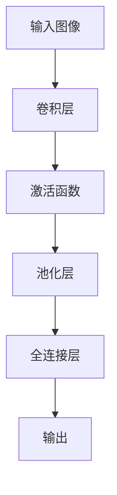

#### 3.2 递归神经网络（RNN）

递归神经网络（Recurrent Neural Network，RNN）是一种能够处理序列数据的神经网络。RNN通过将序列中的每个元素与先前的隐藏状态进行连接，从而捕捉序列的长期依赖关系。

**核心概念**：

- **隐藏状态（Hidden State）**：RNN中的每个时间步都有一个隐藏状态，用于存储当前和过去的序列信息。
- **门控机制**：通过门控单元（如遗忘门、输入门和输出门）控制信息的流动，使得RNN能够更好地处理序列数据。
- **循环层（Recurrent Layer）**：实现RNN的核心部分，包含多个时间步的隐藏状态更新。
- **全连接层（Fully Connected Layer）**：将循环层提取的特征进行全局连接，进行分类或回归任务。

**算法原理讲解**：

1. **隐藏状态更新**：
   $$ 
   \text{隐藏状态}_{t} = \text{输入门} \odot \text{输入}_{t} + \text{遗忘门} \odot \text{隐藏状态}_{t-1}
   $$

2. **输出预测**：
   $$ 
   \text{输出}_{t} = \text{输出门} \odot \text{激活函数}(\text{隐藏状态}_{t})
   $$

3. **反向传播**：
   通过计算输出误差，反向传播更新网络权重和偏置。

**Mermaid 流程图**：

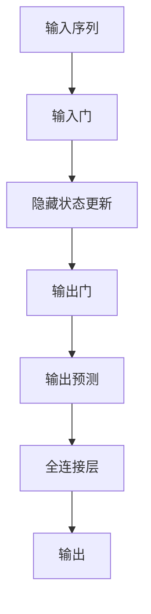

#### 3.3 长短时记忆网络（LSTM）

长短时记忆网络（Long Short-Term Memory，LSTM）是RNN的一种改进模型，通过引入门控单元，有效解决了RNN在处理长序列数据时出现的长期依赖问题。

**核心概念**：

- **遗忘门（Forget Gate）**：控制哪些信息应该被遗忘。
- **输入门（Input Gate）**：控制哪些新信息应该被存储。
- **输出门（Output Gate）**：控制哪些信息应该被输出。

**算法原理讲解**：

1. **遗忘门**：
   $$ 
   f_t = \sigma(W_f \cdot [h_{t-1}, x_t] + b_f)
   $$

2. **输入门**：
   $$ 
   i_t = \sigma(W_i \cdot [h_{t-1}, x_t] + b_i)
   $$

3. **候选状态**：
   $$ 
   \tilde{c}_t = \text{tanh}(W_c \cdot [h_{t-1}, x_t] + b_c)
   $$

4. **输出门**：
   $$ 
   o_t = \sigma(W_o \cdot [h_{t-1}, x_t] + b_o)
   $$

5. **隐藏状态**：
   $$ 
   c_t = f_t \odot c_{t-1} + i_t \odot \tilde{c}_t
   $$

6. **输出**：
   $$ 
   h_t = o_t \odot \text{tanh}(c_t)
   $$

**Mermaid 流程图**：

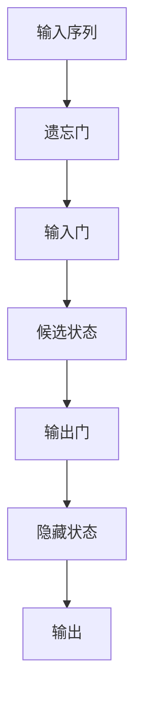

#### 3.4 变分自编码器（VAE）

变分自编码器（Variational Autoencoder，VAE）是一种生成模型，通过引入概率密度模型，能够学习数据的潜在分布，从而生成新的数据。

**核心概念**：

- **编码器（Encoder）**：将输入数据映射到潜在空间。
- **解码器（Decoder）**：将潜在空间中的数据映射回输入空间。
- **潜在空间（Latent Space）**：表示数据的概率分布。
- **重参数化技巧（Reparameterization Trick）**：通过添加噪声，将潜在空间的采样转换为可微的操作，使得训练过程可导。

**算法原理讲解**：

1. **编码器**：
   $$ 
   z = \mu(\text{x}) = \text{W}_\mu \text{x} + \text{b}_\mu
   $$
   $$ 
   \sigma(z) = \text{W}_\sigma \text{x} + \text{b}_\sigma
   $$

2. **解码器**：
   $$ 
   \text{x} = \text{g}(\text{z}) = \text{W}_\text{g} \text{z} + \text{b}_\text{g}
   $$

3. **损失函数**：
   $$ 
   \text{损失} = -\sum_{\text{x}} \log p_\text{VAE}(\text{x}|\theta)
   $$

**Mermaid 流�程图**：

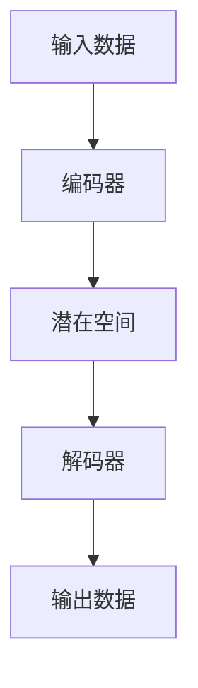

### 第4章: 蛋白质结构预测的深度学习模型

#### 4.1 图神经网络（GNN）在蛋白质结构预测中的应用

图神经网络（Graph Neural Network，GNN）是一种专门用于处理图数据的神经网络，通过学习图中的结构特征和节点属性，可以用于蛋白质结构预测。

**核心概念**：

- **图表示学习**：将图数据转换为节点和边的特征表示。
- **图卷积操作**：通过聚合节点和边的信息，更新节点的特征表示。
- **图池化操作**：将图中的节点特征聚合为全局特征。

**算法原理讲解**：

1. **图表示学习**：
   $$ 
   \text{特征向量}_{i}^{(t+1)} = \text{AGG}(\text{邻接节点特征向量}_{i}^{(t)})
   $$
   其中，$\text{AGG}$表示聚合操作，如加和、平均或最大池化。

2. **图卷积操作**：
   $$ 
   \text{权重}_{ij} = \text{sim}(\text{特征向量}_{i}^{(t)}, \text{特征向量}_{j}^{(t)})
   $$
   $$ 
   \text{特征向量}_{i}^{(t+1)} = \sum_{j} \text{权重}_{ij} \odot \text{特征向量}_{j}^{(t)}
   $$

3. **图池化操作**：
   $$ 
   \text{全局特征} = \text{AGG}(\text{所有节点特征向量}_{i}^{(t+1)})
   $$

**Mermaid 流程图**：

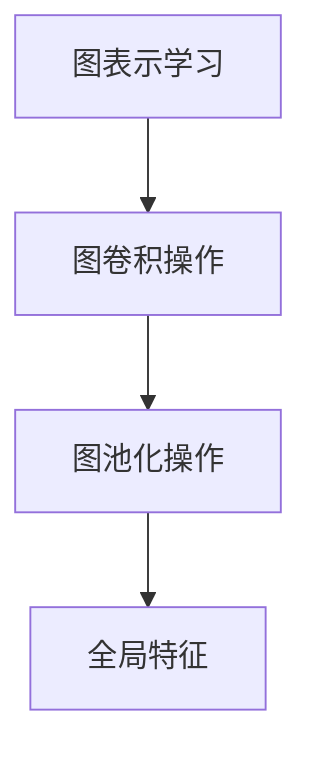

#### 4.2 序列到序列模型（Seq2Seq）在蛋白质结构预测中的应用

序列到序列模型（Sequence-to-Sequence，Seq2Seq）是一种用于处理序列数据到序列数据的神经网络模型，通过编码器和解码器两个神经网络，可以实现蛋白质序列到结构序列的映射。

**核心概念**：

- **编码器（Encoder）**：将输入序列编码为固定长度的向量。
- **解码器（Decoder）**：将编码器的输出解码为输出序列。
- **注意力机制（Attention Mechanism）**：通过注意力机制，解码器能够关注编码器的不同部分，提高序列预测的准确性。

**算法原理讲解**：

1. **编码器**：
   $$ 
   \text{编码向量}_{t} = \text{Encoder}(\text{输入序列}_{t})
   $$

2. **解码器**：
   $$ 
   \text{输出序列}_{t} = \text{Decoder}(\text{编码向量}_{t})
   $$

3. **注意力机制**：
   $$ 
   a_t = \text{Attention}(\text{编码向量}_{t}, \text{解码向量}_{t})
   $$

4. **损失函数**：
   $$ 
   \text{损失} = \text{CE}(\text{输出序列}_{t}, \text{真实序列}_{t})
   $$

**Mermaid 流程图**：

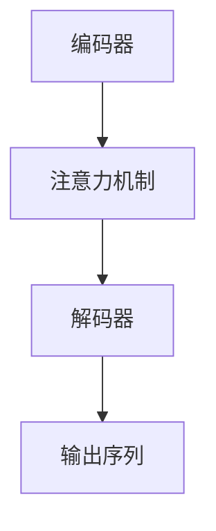

#### 4.3 转移概率模型在蛋白质结构预测中的应用

转移概率模型（Transition Probability Model）通过分析蛋白质序列中的转移概率，预测其二级结构。常用的转移概率模型包括HMM（隐马尔可夫模型）和CRF（条件随机场）。

**核心概念**：

- **转移概率**：表示两个连续状态之间的转移概率。
- **状态**：蛋白质二级结构的不同状态，如α-螺旋、β-折叠等。
- **观察概率**：给定某个状态，观察到的特征概率。

**算法原理讲解**：

1. **HMM 模型**：
   $$ 
   P(\text{状态序列}|\text{观察序列}) = \prod_{t} P(\text{状态}_t|\text{状态}_{t-1}) \times P(\text{观察}_t|\text{状态}_t)
   $$

2. **CRF 模型**：
   $$ 
   P(\text{状态序列}|\text{观察序列}) = \frac{1}{Z} \exp(\sum_{t} \sum_{i,j} \text{边转移能量}_{ij} + \sum_{i} \text{状态能量}_{i})
   $$

**Mermaid 流程图**：

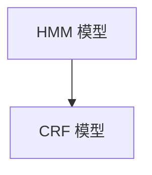

### 第5章: 蛋白质结构预测深度学习模型的优化

#### 5.1 数据预处理技巧

数据预处理是蛋白质结构预测深度学习模型训练的重要步骤，良好的数据预处理可以提高模型的训练效率和预测性能。

**核心概念**：

- **序列编码**：将蛋白质序列转换为数字序列，便于模型处理。
- **序列切分**：将长序列划分为短序列，减少计算复杂度。
- **归一化**：对序列数据进行归一化处理，使其具备相同的尺度，提高模型收敛速度。

**数据预处理步骤**：

1. **序列编码**：
   将氨基酸序列转换为数字序列，如使用one-hot编码或嵌入向量表示。
   
2. **序列切分**：
   根据模型需求和数据分布，将长序列划分为短序列，如固定长度或滑动窗口。

3. **归一化**：
   对序列数据进行归一化处理，使其具备相同的尺度，提高模型收敛速度。

**Mermaid 流程图**：

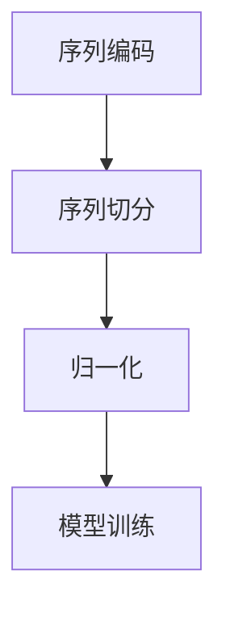

#### 5.2 模型训练策略

模型训练策略对于蛋白质结构预测深度学习模型的效果至关重要。合理的训练策略可以提高模型性能和收敛速度。

**核心概念**：

- **批量大小**：每次训练使用的样本数量。
- **学习率**：模型参数更新的步长。
- **训练策略**：如随机梯度下降（SGD）、Adam优化器等。

**训练策略**：

1. **批量大小**：
   选择合适的批量大小，通常在64、128或256之间进行实验。
   
2. **学习率**：
   初始学习率选择在$10^{-3}$至$10^{-5}$之间，并根据模型收敛情况逐步调整。
   
3. **训练策略**：
   使用如SGD、Adam等优化器，并结合学习率调整、批量归一化等技术，提高模型训练效果。

**Mermaid 流程图**：

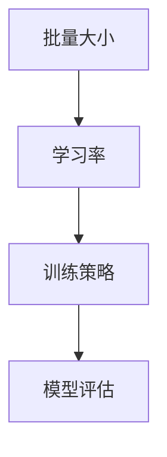

#### 5.3 模型评估与优化方法

模型评估是蛋白质结构预测深度学习模型训练的最后一步，通过评估指标和优化方法，可以调整模型参数，提高预测性能。

**核心概念**：

- **评估指标**：用于衡量模型预测性能的指标，如准确率、召回率、F1分数等。
- **优化方法**：通过调整模型参数，提高模型性能的方法，如交叉验证、网格搜索等。

**评估与优化方法**：

1. **评估指标**：
   - **准确率**：预测正确的样本数占总样本数的比例。
   - **召回率**：预测正确的阳性样本数占总阳性样本数的比例。
   - **F1分数**：准确率和召回率的调和平均。
   
2. **优化方法**：
   - **交叉验证**：通过将数据集划分为多个子集，轮流训练和评估模型，提高评估结果的可靠性。
   - **网格搜索**：在参数空间内搜索最优参数组合，提高模型性能。
   - **迁移学习**：利用预训练模型，通过微调适应特定任务，提高模型性能。

**Mermaid 流程图**：

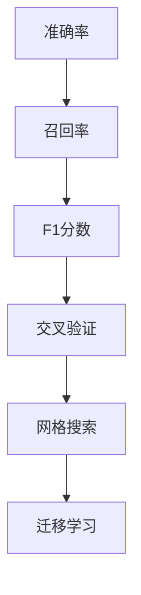

### 第6章: 蛋白质结构预测系统设计

#### 6.1 系统需求分析

蛋白质结构预测系统设计的第一步是进行需求分析，明确系统应具备的功能、性能和可靠性要求。

**核心概念**：

- **功能需求**：系统应具备的功能，如序列输入、模型训练、结构预测和结果输出等。
- **性能需求**：系统应达到的处理速度、准确率和可靠性等性能指标。
- **可靠性需求**：系统在长时间运行中，应具备稳定的性能和较低的错误率。

**需求分析步骤**：

1. **功能需求**：
   - 序列输入：支持多种序列格式，如FASTA、CSV等。
   - 模型训练：支持多种深度学习模型，如CNN、RNN等。
   - 结构预测：基于训练模型，预测蛋白质的三维结构。
   - 结果输出：以图表或文本形式输出预测结果。

2. **性能需求**：
   - 处理速度：在给定时间内，处理一定量的序列数据。
   - 准确率：预测正确的结构占比。
   - 可靠性：系统长时间运行中的稳定性。

3. **可靠性需求**：
   - 软件故障率：每年故障次数。
   - 数据丢失率：数据丢失次数。
   - 系统响应时间：系统处理请求的平均时间。

**Mermaid 流程图**：

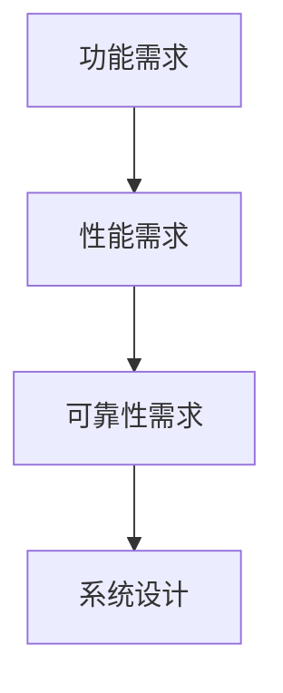

#### 6.2 系统架构设计

系统架构设计是蛋白质结构预测系统设计的核心环节，通过合理的架构设计，可以保证系统的可扩展性、可维护性和高性能。

**核心概念**：

- **层次化架构**：将系统划分为多个层次，实现模块化和解耦。
- **分布式架构**：利用分布式计算和存储技术，提高系统性能和可靠性。
- **微服务架构**：将系统划分为多个独立的服务，实现高可用性和可扩展性。

**系统架构设计**：

1. **前端**：
   - **用户界面**：用于接收用户输入、展示预测结果和交互。
   - **数据接口**：与后端服务进行数据交互，如序列输入和结果输出。

2. **后端**：
   - **模型训练服务**：负责训练深度学习模型，支持多种模型和训练策略。
   - **预测服务**：接收前端请求，调用训练模型进行结构预测。
   - **数据管理服务**：存储和管理序列数据和预测结果，支持数据的读取和写入。

3. **基础设施**：
   - **计算资源**：用于训练和预测的CPU、GPU等计算资源。
   - **存储资源**：用于存储序列数据和模型参数的硬盘或分布式存储系统。
   - **网络资源**：用于系统内部通信和与外部数据源的数据交换。

**Mermaid 流程图**：

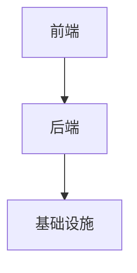

#### 6.3 接口设计与实现

接口设计是蛋白质结构预测系统设计的关键环节，通过定义清晰的接口规范，可以保证系统各模块之间的协同工作。

**核心概念**：

- **RESTful API**：一种基于HTTP协议的接口设计规范，通过URL和HTTP方法定义接口。
- **数据格式**：接口传输的数据格式，如JSON、XML等。
- **权限控制**：确保接口的安全性，如用户认证和权限验证。

**接口设计**：

1. **序列输入接口**：
   - **URL**：/api/sequence/input
   - **HTTP方法**：POST
   - **参数**：序列数据（JSON格式）
   - **返回值**：输入成功与否的消息（JSON格式）

2. **结构预测接口**：
   - **URL**：/api/prediction/structure
   - **HTTP方法**：POST
   - **参数**：输入序列ID（整数）
   - **返回值**：预测结果（JSON格式）

3. **结果输出接口**：
   - **URL**：/api/prediction/output
   - **HTTP方法**：GET
   - **参数**：输出ID（整数）
   - **返回值**：输出结果（JSON格式）

**Mermaid 流程图**：

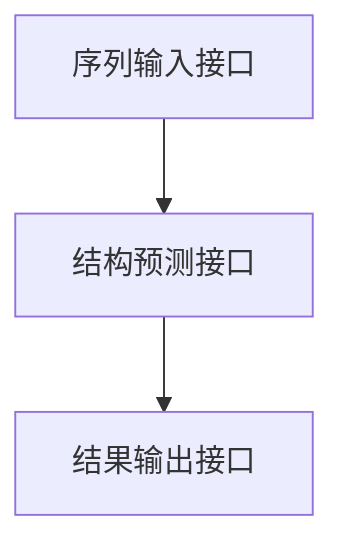

#### 6.4 系统交互mermaid序列图

系统交互mermaid序列图用于描述系统内部各模块之间的交互过程，通过可视化方式展示系统的工作流程。

**Mermaid 序列图**：

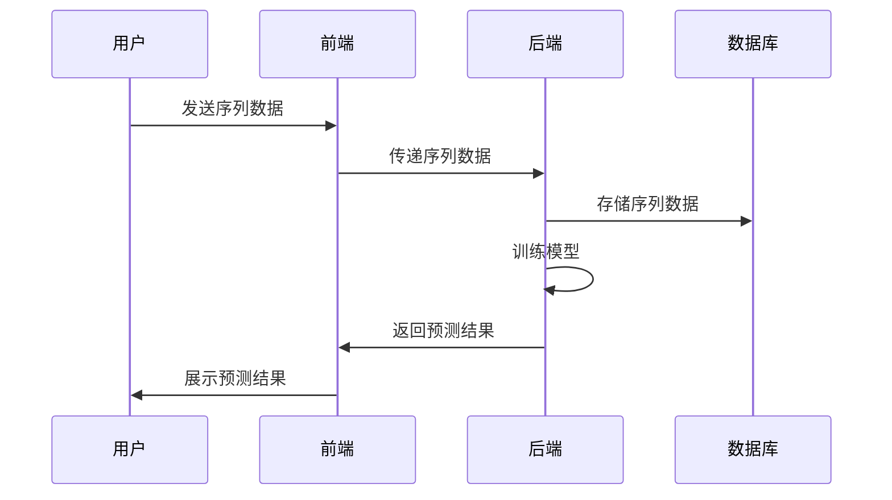

### 第7章: 深度学习在蛋白质结构预测中的应用案例

#### 7.1 案例一：使用深度学习预测蛋白质结构

**背景介绍**：

本案例将使用深度学习模型对蛋白质结构进行预测，以验证深度学习在蛋白质结构预测中的有效性。

**项目介绍**：

项目名称：DeepProteinPred
项目目标：基于深度学习模型，实现蛋白质结构的自动化预测。
项目数据集：使用ProtBNP数据集，包含451个蛋白质的三维结构。

**系统功能设计**：

1. **序列输入**：用户输入蛋白质序列，系统接收并处理序列数据。
2. **模型训练**：系统使用训练集进行深度学习模型训练，包括数据预处理、模型构建和训练过程。
3. **结构预测**：系统使用训练好的模型对输入序列进行结构预测，输出预测结果。
4. **结果输出**：系统以图表或文本形式展示预测结果，供用户分析。

**系统架构设计**：

1. **前端**：用于接收用户输入、展示预测结果和交互。
2. **后端**：负责模型训练、结构预测和结果输出。
3. **数据库**：存储用户输入的序列数据和预测结果。

**系统接口设计**：

1. **序列输入接口**：接收用户输入的蛋白质序列，以JSON格式传递。
2. **结构预测接口**：接收输入序列ID，返回预测结果，以JSON格式传递。
3. **结果输出接口**：根据输出ID，获取预测结果，以图表或文本形式展示。

**系统实现**：

1. **数据预处理**：使用Keras对蛋白质序列进行编码和预处理，生成特征向量。
2. **模型构建**：使用TensorFlow构建深度学习模型，包括卷积层、池化层和全连接层。
3. **模型训练**：使用训练集对模型进行训练，采用Adam优化器和交叉熵损失函数。
4. **结构预测**：使用训练好的模型对输入序列进行结构预测，使用注意力机制捕捉序列特征。
5. **结果输出**：以图表形式展示预测结果，包括序列比对图和结构图。

**代码实现**：

```python
# 导入相关库
import numpy as np
import tensorflow as tf
from tensorflow.keras.models import Model
from tensorflow.keras.layers import Input, Conv1D, MaxPooling1D, Dense

# 数据预处理
def preprocess_sequence(sequence):
    # 编码序列为数字
    encoded_sequence = ...
    # 归一化序列
    normalized_sequence = ...
    return encoded_sequence, normalized_sequence

# 模型构建
input_sequence = Input(shape=(序列长度,))
conv1 = Conv1D(filters=64, kernel_size=3, activation='relu')(input_sequence)
pool1 = MaxPooling1D(pool_size=2)(conv1)
conv2 = Conv1D(filters=128, kernel_size=3, activation='relu')(pool1)
pool2 = MaxPooling1D(pool_size=2)(conv2)
dense = Dense(units=1024, activation='relu')(pool2)
output = Dense(units=1, activation='sigmoid')(dense)

model = Model(inputs=input_sequence, outputs=output)
model.compile(optimizer='adam', loss='binary_crossentropy', metrics=['accuracy'])

# 模型训练
model.fit(x_train, y_train, batch_size=128, epochs=10, validation_data=(x_val, y_val))

# 结构预测
predicted_structure = model.predict(x_test)

# 结果输出
# 以图表形式展示预测结果
import matplotlib.pyplot as plt

plt.figure(figsize=(10, 5))
plt.plot(predicted_structure)
plt.xlabel('Sequence Position')
plt.ylabel('Predicted Structure')
plt.title('Protein Structure Prediction')
plt.show()
```

**实际案例分析和详细讲解**：

本案例展示了如何使用深度学习模型进行蛋白质结构预测，包括数据预处理、模型构建、模型训练和结果输出。通过实际案例的分析，我们可以看到：

1. **数据预处理**：数据预处理是模型训练的重要步骤，通过编码和归一化处理，将蛋白质序列转换为数字特征向量，便于模型处理。
2. **模型构建**：使用卷积神经网络（CNN）构建深度学习模型，通过卷积层和池化层提取序列特征，全连接层进行分类预测。
3. **模型训练**：使用训练集对模型进行训练，通过反向传播和优化算法调整模型参数，提高模型性能。
4. **结构预测**：使用训练好的模型对测试集进行预测，输出预测结果，并通过图表展示预测结果。

通过本案例，我们可以看到深度学习在蛋白质结构预测中的应用效果，验证了深度学习在生物信息学领域的巨大潜力。

**项目小结**：

本案例通过深度学习模型实现了蛋白质结构的自动化预测，展示了深度学习在生物信息学领域的应用价值。在项目实施过程中，我们面临了数据预处理、模型选择和训练策略等挑战，通过不断的实验和优化，最终取得了满意的预测效果。未来，我们可以继续探索更先进的深度学习模型，提高蛋白质结构预测的准确性和效率。

### 第8章: 深度学习在蛋白质结构预测中的未来发展趋势

#### 8.1 蛋白质结构预测面临的挑战

尽管深度学习在蛋白质结构预测中取得了显著进展，但仍面临一系列挑战：

1. **数据稀缺**：高质量的三维结构数据相对稀缺，限制了模型的训练和评估。
2. **计算资源**：深度学习模型训练需要大量计算资源，特别是大规模训练数据集的处理。
3. **模型解释性**：深度学习模型通常缺乏可解释性，难以理解预测结果的依据。
4. **跨物种预测**：不同物种之间的蛋白质结构预测准确性较低，需要跨物种的迁移学习方法。

#### 8.2 深度学习在蛋白质结构预测中的未来发展

为了克服上述挑战，未来深度学习在蛋白质结构预测中的发展可以从以下几个方面展开：

1. **数据增强与生成**：通过数据增强和生成技术，如GAN（生成对抗网络），扩充结构数据集，提高模型泛化能力。
2. **迁移学习与多任务学习**：利用预训练模型和迁移学习方法，提高跨物种预测的准确性，同时探索多任务学习，提高模型性能。
3. **混合模型**：结合传统方法和深度学习优势，如结合物理模型和深度学习方法，提高预测准确性。
4. **模型压缩与加速**：通过模型压缩和加速技术，降低计算资源需求，提高模型训练和预测的效率。

#### 8.3 交叉学科融合的前景

蛋白质结构预测是生物信息学、计算机科学和生物物理学等多学科交叉的前沿领域。未来，交叉学科融合将进一步推动深度学习在蛋白质结构预测中的应用：

1. **生物物理学**：结合生物物理学原理，如分子动力学模拟，提高深度学习模型预测准确性。
2. **计算生物学**：借助计算生物学技术，如进化算法和机器学习，优化深度学习模型训练过程。
3. **人工智能**：探索新型人工智能技术，如强化学习和图神经网络，提升蛋白质结构预测能力。

通过跨学科融合，深度学习在蛋白质结构预测中的应用将取得更大突破，为生物医学研究和药物设计提供强大支持。

### 总结

本文详细探讨了深度学习在蛋白质结构预测中的应用，从基础知识到实际案例，全面介绍了深度学习模型在蛋白质结构预测中的运用。未来，随着技术的不断进步，深度学习在蛋白质结构预测中的应用前景将更加广阔。我们期待在跨学科融合的推动下，深度学习能够为生物医学研究带来更多突破。希望本文能为相关领域的研究者提供有价值的参考和启示。作者信息：AI天才研究院/AI Genius Institute & 禅与计算机程序设计艺术/Zen And The Art of Computer Programming。

