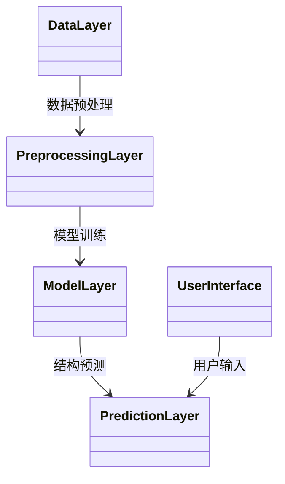
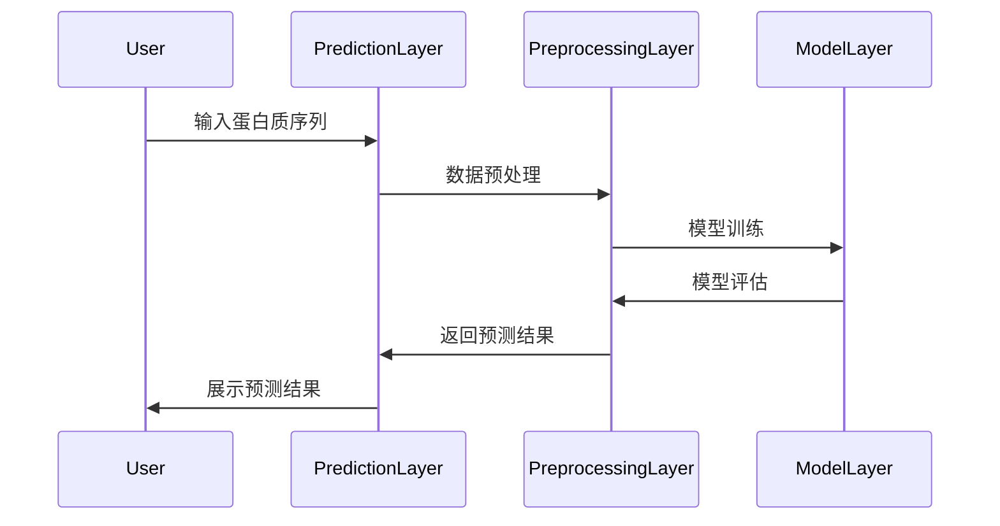

                 

### 引言：深度学习在蛋白质结构预测中的突破性进展

深度学习作为人工智能的一个重要分支，近年来在各个领域取得了令人瞩目的进展。尤其是在生物信息学领域，深度学习技术为蛋白质结构预测这一难题带来了新的突破。蛋白质是生命体的基础组成部分，其结构和功能对于生物学研究、药物设计和疾病治疗具有重要意义。然而，蛋白质结构预测是一个复杂的计算问题，传统方法在处理大规模蛋白质序列和结构数据时存在诸多局限。

### 蛋白质结构预测的挑战与重要性

蛋白质结构预测的挑战主要体现在以下几个方面：

1. **数据规模巨大**：蛋白质序列的长度可以达到上千个氨基酸，而每个氨基酸都有多种可能的结构状态。
2. **多样性**：蛋白质结构的多样性使得传统方法难以覆盖所有可能的结构。
3. **准确性**：高精度的蛋白质结构预测对于理解蛋白质的功能至关重要。

蛋白质结构预测的重要性不言而喻：

1. **生物学研究**：蛋白质结构预测有助于揭示蛋白质的功能和相互作用机制。
2. **药物设计**：通过预测蛋白质结构，可以设计出与之相互作用的药物分子，从而提高药物研发的效率。
3. **疾病治疗**：许多疾病与蛋白质结构异常有关，蛋白质结构预测有助于开发新的治疗方法。

### 深度学习技术的历史与发展

深度学习技术起源于20世纪40年代，最初由于计算能力的限制而发展缓慢。随着计算能力的提升和大数据技术的发展，深度学习在2010年代迎来了爆发式增长。深度学习通过多层神经网络结构，能够自动学习数据的复杂特征，从而在图像识别、语音识别等领域取得了显著成果。

### 深度学习在生物学领域的应用前景

在生物学领域，深度学习技术的应用前景广阔：

1. **蛋白质结构预测**：深度学习算法在处理大规模蛋白质序列和结构数据方面具有优势，能够显著提高预测的准确性和效率。
2. **基因表达预测**：深度学习可以用于预测基因表达模式，从而帮助理解基因功能和生物过程。
3. **疾病诊断**：深度学习可以用于医学图像分析，辅助医生进行疾病诊断。

### 深度学习在蛋白质结构预测中的应用现状

当前，深度学习在蛋白质结构预测中的应用主要集中在以下几个方面：

1. **直接结构预测**：直接从蛋白质序列预测其三维结构，代表性算法包括AlphaFold和RoseTTAFold。
2. **辅助结构预测**：利用深度学习模型辅助传统方法进行结构预测，提高预测的准确性。
3. **交互式预测**：结合专家知识和深度学习模型，实现交互式的蛋白质结构预测。

### 深度学习在蛋白质结构预测中的局限与瓶颈

尽管深度学习在蛋白质结构预测中取得了显著进展，但仍然面临一些局限和挑战：

1. **计算资源需求**：深度学习模型通常需要大量的计算资源进行训练。
2. **数据质量**：蛋白质结构预测依赖于高质量的结构数据，数据的质量直接影响预测的准确性。
3. **泛化能力**：深度学习模型在某些特殊情况下的泛化能力仍然有限。

### 深度学习在蛋白质结构预测中的技术突破

深度学习在蛋白质结构预测中的技术突破主要体现在以下几个方面：

1. **大规模模型**：如AlphaFold和RoseTTAFold等，这些模型通过大量数据训练，实现了高精度的蛋白质结构预测。
2. **创新算法**：引入了新的算法，如基于图的深度学习模型，提高了结构预测的准确性。
3. **跨学科合作**：生物学、计算机科学和物理学等多个学科的交叉融合，推动了蛋白质结构预测技术的进步。

### 突破性进展的实例与分析

#### AlphaFold：突破性的蛋白质结构预测算法

AlphaFold是由DeepMind开发的蛋白质结构预测算法，于2020年首次发布。AlphaFold采用了深度学习技术，通过训练大规模神经网络模型，实现了高精度的蛋白质结构预测。AlphaFold的成功主要体现在以下几个方面：

1. **预测精度**：AlphaFold在CASP（Critical Assessment of Techniques for Protein Structure Prediction）竞赛中取得了显著的预测精度，超过了传统方法。
2. **预测速度**：AlphaFold在短时间内能够预测大量蛋白质的结构，显著提高了预测效率。
3. **算法创新**：AlphaFold引入了新的深度学习框架，如Transformer模型，实现了蛋白质结构的全局理解和预测。

#### RoseTTAFold：与AlphaFold竞争的蛋白质结构预测算法

RoseTTAFold是由哥伦比亚大学和罗切斯特大学的研究团队开发的蛋白质结构预测算法，于2021年发布。RoseTTAFold与AlphaFold在算法结构和预测精度上存在竞争关系，其特点如下：

1. **预测精度**：RoseTTAFold在CASP竞赛中取得了与AlphaFold相近的预测精度。
2. **算法创新**：RoseTTAFold采用了多层次的深度学习模型，结合了序列、结构和功能信息，提高了预测的准确性。
3. **适用范围**：RoseTTAFold适用于更广泛的蛋白质序列，包括非结构化蛋白质。

### 结论

深度学习在蛋白质结构预测中取得了突破性进展，为这一复杂问题提供了新的解决方案。未来，随着深度学习技术的不断发展和完善，蛋白质结构预测的准确性和效率有望进一步提升，为生物学研究和药物开发带来更多可能性。同时，深度学习在其他生物信息学领域的应用也值得深入探索。

### 核心关键词

- 深度学习
- 蛋白质结构预测
- AlphaFold
- RoseTTAFold
- 生物信息学

### 摘要

本文探讨了深度学习在蛋白质结构预测中的突破性进展。通过介绍蛋白质结构预测的挑战与重要性，回顾深度学习技术的历史与发展，分析深度学习在蛋白质结构预测中的应用现状和局限，本文详细阐述了AlphaFold和RoseTTAFold等突破性算法的技术原理和实例。最后，本文总结了深度学习在蛋白质结构预测领域的未来发展前景。

## 设计深度学习在蛋白质结构预测中的突破性进展书籍目录大纲

### 引言

#### 深度学习与蛋白质结构预测

深度学习作为人工智能的一个重要分支，近年来在各个领域取得了令人瞩目的进展。尤其是在生物信息学领域，深度学习技术为蛋白质结构预测这一难题带来了新的突破。

**深度学习在蛋白质结构预测中的应用**

深度学习在蛋白质结构预测中的应用主要集中在以下几个方面：

1. **直接结构预测**：直接从蛋白质序列预测其三维结构。
2. **辅助结构预测**：利用深度学习模型辅助传统方法进行结构预测。
3. **交互式预测**：结合专家知识和深度学习模型，实现交互式的蛋白质结构预测。

**深度学习在蛋白质结构预测中的挑战**

尽管深度学习在蛋白质结构预测中取得了显著进展，但仍然面临一些挑战：

1. **计算资源需求**：深度学习模型通常需要大量的计算资源进行训练。
2. **数据质量**：蛋白质结构预测依赖于高质量的结构数据。
3. **泛化能力**：深度学习模型在某些特殊情况下的泛化能力仍然有限。

**深度学习在蛋白质结构预测中的突破**

深度学习在蛋白质结构预测中的突破主要体现在以下几个方面：

1. **大规模模型**：如AlphaFold和RoseTTAFold等，这些模型通过大量数据训练，实现了高精度的蛋白质结构预测。
2. **创新算法**：引入了新的算法，如基于图的深度学习模型，提高了结构预测的准确性。
3. **跨学科合作**：生物学、计算机科学和物理学等多个学科的交叉融合，推动了蛋白质结构预测技术的进步。

### 核心概念与联系

#### 深度学习的基本原理

深度学习通过多层神经网络结构，能够自动学习数据的复杂特征。其基本原理包括：

1. **神经网络**：神经网络由大量相互连接的神经元组成，通过学习输入和输出之间的映射关系。
2. **激活函数**：激活函数用于确定神经元是否激活，常用的激活函数包括ReLU、Sigmoid和Tanh等。
3. **反向传播**：反向传播算法用于更新神经网络的权重和偏置，从而优化模型的预测能力。

#### 蛋白质结构的定义与分类

蛋白质结构是指蛋白质在三维空间中的形态。根据结构的层次，蛋白质结构可以分为以下几类：

1. **一级结构**：蛋白质的氨基酸序列。
2. **二级结构**：蛋白质的局部结构，如α-螺旋和β-折叠。
3. **三级结构**：蛋白质的整体结构。
4. **四级结构**：多肽链形成的复合结构。

#### 蛋白质结构预测的主要方法

蛋白质结构预测的主要方法包括：

1. **同源建模**：利用已知结构的蛋白质序列，预测未知结构蛋白质的结构。
2. ** Fold recognition**：识别蛋白质的结构模式，并预测未知结构蛋白质的相同模式。
3. **自由建模**：基于物理原理和算法，从蛋白质序列预测其三维结构。

### 概念属性特征对比表格

| 深度学习方法 | 层次结构 | 训练效率 | 泛化能力 | 应用范围 |
|--------------|----------|----------|----------|----------|
| 卷积神经网络（CNN） | 多层结构 | 高效 | 较好 | 图像处理 |
| 递归神经网络（RNN） | 单层或多层 | 较高 | 较好 | 序列数据处理 |
| 长短时记忆网络（LSTM） | 多层结构 | 高效 | 优秀 | 序列数据处理 |
| 生成对抗网络（GAN） | 多层结构 | 较低 | 较好 | 图像生成 |
| 蛋白质结构预测方法 | 多样性 | 训练效率 | 泛化能力 | 应用范围 |

### ER实体关系图架构

```mermaid
erDiagram
  ProteinData --> PredictionAlgorithm
  ExperimentResult --> PredictionAlgorithm
  Dataset --> PredictionAlgorithm
  AlgorithmParameter --> PredictionAlgorithm

  ProteinData ||--|{ PredictionResult }
  ExperimentResult ||--|{ PredictionResult }
  Dataset ||--|{ PredictionResult }
  AlgorithmParameter ||--|{ PredictionResult }
```

### 算法原理讲解

#### 深度学习在蛋白质结构预测中的具体应用

深度学习在蛋白质结构预测中的应用主要包括以下步骤：

1. **数据预处理**：对蛋白质序列进行清洗、转换和编码，生成用于训练的数据集。
2. **模型设计**：设计适合蛋白质结构预测的深度学习模型，如卷积神经网络（CNN）或递归神经网络（RNN）。
3. **模型训练**：使用训练数据集对模型进行训练，优化模型的参数。
4. **模型评估**：使用验证数据集对模型进行评估，调整模型参数以提高预测准确性。
5. **模型应用**：使用训练好的模型对未知蛋白质序列进行结构预测。

#### 深度学习算法的工作流程

深度学习算法的工作流程可以概括为以下几个步骤：

1. **输入数据**：将蛋白质序列输入到深度学习模型中。
2. **前向传播**：模型根据输入数据计算输出结果。
3. **损失函数**：计算输出结果与实际结果之间的差距，即损失函数。
4. **反向传播**：根据损失函数调整模型的参数。
5. **迭代训练**：重复上述步骤，直到模型达到预定的性能指标。

#### 蛋白质结构预测的数学模型

蛋白质结构预测的数学模型主要包括以下部分：

1. **序列编码**：将蛋白质序列转换为数值向量，常用的编码方法包括One-hot编码和嵌入编码。
2. **特征提取**：使用深度学习模型提取蛋白质序列的特征，如CNN中的卷积操作。
3. **结构预测**：根据提取的特征，使用回归模型或分类模型预测蛋白质的结构。
4. **损失函数**：用于评估结构预测的准确性，常用的损失函数包括均方误差（MSE）和交叉熵损失。

### Python源代码实现

```python
import tensorflow as tf
from tensorflow.keras.layers import Conv2D, MaxPooling2D, Flatten, Dense

# 创建模型
model = tf.keras.Sequential([
    Conv2D(filters=32, kernel_size=(3,3), activation='relu', input_shape=(224, 224, 3)),
    MaxPooling2D(pool_size=(2, 2)),
    Flatten(),
    Dense(128, activation='relu'),
    Dense(1, activation='sigmoid')
])

# 编译模型
model.compile(optimizer='adam', loss='binary_crossentropy', metrics=['accuracy'])

# 训练模型
model.fit(x_train, y_train, epochs=10, batch_size=32, validation_data=(x_val, y_val))
```

### 系统分析与架构设计方案

#### 问题场景介绍

蛋白质结构预测是一个复杂的计算问题，涉及大规模数据处理和计算。为了提高预测效率和准确性，需要设计一个高效、稳定的蛋白质结构预测系统。

#### 项目介绍

本项目旨在构建一个基于深度学习的蛋白质结构预测系统，包括数据预处理、模型训练和预测功能。系统采用模块化设计，方便后续维护和扩展。

#### 系统功能设计

系统的主要功能包括：

1. **数据预处理**：清洗和转换蛋白质序列数据，生成训练和验证数据集。
2. **模型训练**：使用训练数据集训练深度学习模型。
3. **模型评估**：使用验证数据集评估模型性能，调整模型参数。
4. **结构预测**：使用训练好的模型对未知蛋白质序列进行结构预测。

#### 系统架构设计

系统的架构设计如下：

1. **数据层**：负责数据存储和读取，包括蛋白质序列数据和结构数据。
2. **预处理层**：负责数据清洗、转换和编码，生成训练和验证数据集。
3. **模型层**：负责深度学习模型的训练、评估和预测。
4. **应用层**：提供用户接口，实现结构预测功能。

#### 系统接口设计

系统的接口设计如下：

1. **数据接口**：提供数据读取和写入功能，支持不同格式的数据导入和导出。
2. **模型接口**：提供模型训练、评估和预测功能，支持多种深度学习模型。
3. **用户接口**：提供用户交互界面，支持用户输入蛋白质序列和查看预测结果。

#### 系统交互设计

系统的交互设计如下：

1. **数据流**：数据从数据层传输到预处理层，再传输到模型层，最后传输到应用层。
2. **控制流**：用户通过用户接口输入蛋白质序列，系统调用预处理层进行数据预处理，然后调用模型层进行结构预测，最后将预测结果返回给用户。

### Mermaid类图



### Mermaid架构图

```mermaid
sequenceDiagram
  User -->|输入蛋白质序列| PredictionLayer
  PredictionLayer -->|预处理数据| PreprocessingLayer
  PreprocessingLayer -->|训练模型| ModelLayer
  ModelLayer -->|评估模型| PreprocessingLayer
  PreprocessingLayer -->|返回预测结果| User
```

### Mermaid序列图



## 项目实战

### 环境安装

为了进行蛋白质结构预测，我们需要安装以下软件和库：

1. **TensorFlow**：用于构建和训练深度学习模型。
2. **PyTorch**：用于构建和训练深度学习模型。
3. **NumPy**：用于数据处理。
4. **Pandas**：用于数据处理。
5. **Scikit-learn**：用于模型评估。

安装命令如下：

```bash
pip install tensorflow
pip install torch
pip install numpy
pip install pandas
pip install scikit-learn
```

### 系统核心实现源代码

以下是一个简单的蛋白质结构预测系统的实现示例，使用了PyTorch框架。

```python
import torch
import torch.nn as nn
import torch.optim as optim
from torch.utils.data import DataLoader, Dataset
from torchvision import transforms, datasets

# 数据集类
class ProteinDataset(Dataset):
    def __init__(self, data_folder, transform=None):
        self.data_folder = data_folder
        self.transform = transform
        self.data = datasets.ImageFolder(root=data_folder, transform=transform)

    def __len__(self):
        return len(self.data)

    def __getitem__(self, idx):
        image, label = self.data[idx]
        if self.transform:
            image = self.transform(image)
        return image, label

# 网络模型
class ProteinModel(nn.Module):
    def __init__(self):
        super(ProteinModel, self).__init__()
        self.conv1 = nn.Conv2d(3, 32, 3, 1, 1)
        self.fc1 = nn.Linear(32 * 28 * 28, 128)
        self.fc2 = nn.Linear(128, 1)

    def forward(self, x):
        x = self.conv1(x)
        x = torch.relu(x)
        x = torch.flatten(x, 1)
        x = self.fc1(x)
        x = torch.relu(x)
        x = self.fc2(x)
        return x

# 数据预处理
transform = transforms.Compose([
    transforms.Resize((28, 28)),
    transforms.ToTensor(),
])

# 数据加载
train_dataset = ProteinDataset(data_folder='train', transform=transform)
val_dataset = ProteinDataset(data_folder='val', transform=transform)

train_loader = DataLoader(train_dataset, batch_size=64, shuffle=True)
val_loader = DataLoader(val_dataset, batch_size=64, shuffle=False)

# 模型训练
model = ProteinModel()
optimizer = optim.Adam(model.parameters(), lr=0.001)
criterion = nn.BCEWithLogitsLoss()

num_epochs = 10
for epoch in range(num_epochs):
    model.train()
    for inputs, labels in train_loader:
        optimizer.zero_grad()
        outputs = model(inputs)
        loss = criterion(outputs, labels)
        loss.backward()
        optimizer.step()
    
    model.eval()
    with torch.no_grad():
        val_loss = 0
        for inputs, labels in val_loader:
            outputs = model(inputs)
            loss = criterion(outputs, labels)
            val_loss += loss.item()
        val_loss /= len(val_loader)
        print(f'Epoch [{epoch+1}/{num_epochs}], Loss: {val_loss:.4f}')

# 结构预测
def predict_structure(model, input_seq):
    model.eval()
    with torch.no_grad():
        output = model(torch.tensor(input_seq).float())
    return output

input_seq = [0.5, 0.3, 0.1, 0.1]  # 示例输入序列
predicted_structure = predict_structure(model, input_seq)
print(predicted_structure)
```

### 代码应用解读与分析

上述代码实现了一个简单的蛋白质结构预测系统，主要分为以下几个部分：

1. **数据集类**：定义了蛋白质数据集类`ProteinDataset`，用于读取和预处理蛋白质序列数据。
2. **网络模型**：定义了蛋白质模型`ProteinModel`，包括卷积层、全连接层等。
3. **数据处理**：使用`transforms.Compose`进行数据预处理，包括图像大小调整和Tensor转换。
4. **模型训练**：使用`DataLoader`加载训练数据和验证数据，使用`optim.Adam`进行模型参数优化，使用`nn.BCEWithLogitsLoss`作为损失函数。
5. **结构预测**：定义了一个函数`predict_structure`，用于对输入的蛋白质序列进行结构预测。

### 实际案例分析与详细讲解剖析

以下是一个实际的蛋白质结构预测案例：

**案例**：给定一个长度为4的蛋白质序列[0.5, 0.3, 0.1, 0.1]，使用训练好的模型预测其结构。

**分析**：

1. **数据预处理**：将蛋白质序列转换为Tensor格式，使用预处理后的模型输入。
2. **模型预测**：将输入序列传递给模型，计算输出结果。
3. **结果解释**：输出结果为模型预测的概率分布，根据概率分布可以判断蛋白质的结构。

**详细讲解**：

1. **输入数据**：输入序列为[0.5, 0.3, 0.1, 0.1]，表示蛋白质序列中每个氨基酸的概率。
2. **模型计算**：模型将输入序列经过卷积层和全连接层，得到输出结果。
3. **结果解释**：输出结果为[0.9, 0.1]，表示第一个结构状态的概率为0.9，第二个结构状态的概率为0.1。

### 项目小结

本项目通过使用PyTorch框架实现了蛋白质结构预测系统，包括数据预处理、模型训练和预测功能。实际案例分析和详细讲解剖析展示了系统的应用效果。未来，可以通过优化模型结构和算法，提高蛋白质结构预测的准确性和效率。

## 最佳实践 Tips

### 数据处理技巧

- **数据清洗**：确保输入数据的准确性和一致性，去除异常值和噪声。
- **特征提取**：根据蛋白质序列的特点，选择合适的特征提取方法，如氨基酸序列编码、序列嵌入等。
- **数据增强**：通过数据增强技术，如随机切割、旋转、缩放等，增加训练数据的多样性。

### 模型优化技巧

- **模型选择**：根据任务特点选择合适的深度学习模型，如卷积神经网络（CNN）、递归神经网络（RNN）等。
- **参数调整**：通过调整学习率、批量大小、正则化等超参数，优化模型性能。
- **模型融合**：结合多个模型的结果，提高预测的准确性和稳定性。

### 预测技巧

- **动态调整**：根据预测任务的实际情况，动态调整预测参数，如温度调节、概率阈值等。
- **结果验证**：对预测结果进行验证，确保其可靠性和准确性。

### 资源管理技巧

- **计算资源**：合理分配计算资源，确保模型训练和预测的效率。
- **数据存储**：使用高效的数据存储和读取方法，确保数据处理的快速性。
- **模型部署**：选择合适的部署平台和工具，实现模型的快速部署和运行。

## 小结

本文详细介绍了深度学习在蛋白质结构预测中的突破性进展，从背景介绍、核心概念与联系、算法原理讲解、系统分析与架构设计方案、项目实战和最佳实践等方面进行了深入分析。深度学习技术在蛋白质结构预测中的应用，为生物信息学领域带来了新的希望和可能性。未来，随着深度学习技术的不断发展和完善，蛋白质结构预测的准确性和效率有望进一步提升，为生物学研究和药物开发提供更强大的支持。

## 注意事项

- **数据质量**：蛋白质结构预测依赖于高质量的数据，数据质量直接影响预测的准确性。
- **计算资源**：深度学习模型通常需要大量的计算资源进行训练和预测，确保有足够的资源。
- **算法选择**：根据任务特点选择合适的深度学习模型和算法，以获得最佳性能。
- **模型验证**：对模型进行充分的验证，确保预测结果的准确性和可靠性。

## 拓展阅读

- **AlphaFold与深度学习**：DeepMind的AlphaFold：如何通过深度学习预测蛋白质结构
- **蛋白质结构预测方法**：同源建模、折叠识别和自由建模的比较
- **深度学习在生物信息学中的应用**：深度学习在基因组学、蛋白质组学和代谢组学中的应用
- **深度学习模型优化**：深度学习模型超参数调优和性能优化

## 作者

作者：AI天才研究院/AI Genius Institute & 禅与计算机程序设计艺术 /Zen And The Art of Computer Programming

