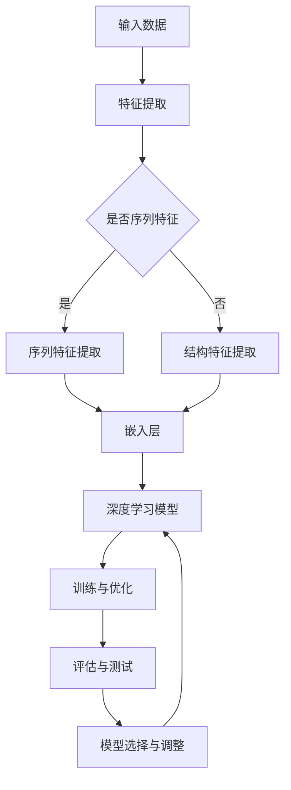
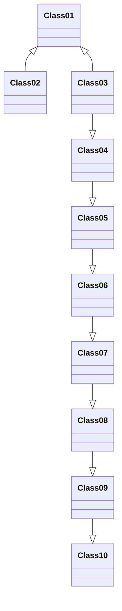
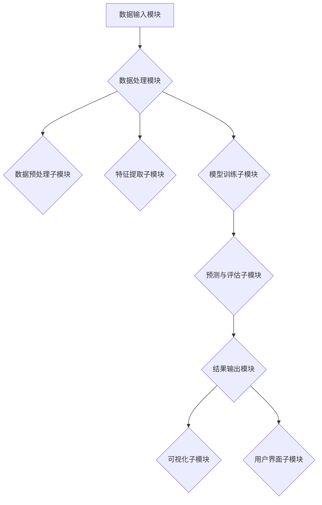
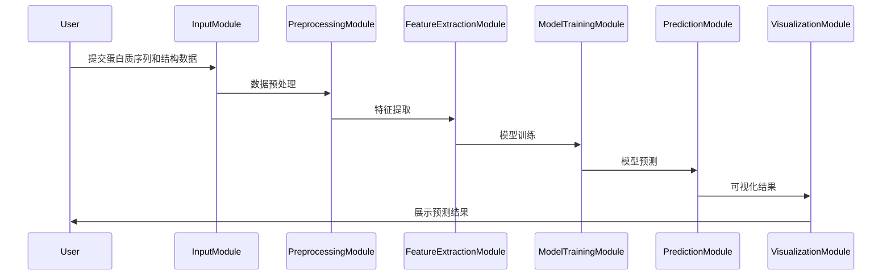

                 

### 目录大纲

----------------------------------------------------------------

# 《深度学习在蛋白质-蛋白质相互作用预测中的突破：加速药物研发》

> 关键词：深度学习、蛋白质-蛋白质相互作用（PPI）、药物研发、算法、系统架构设计

> 摘要：
本文深入探讨深度学习在蛋白质-蛋白质相互作用（PPI）预测中的应用，分析其如何突破传统预测方法面临的挑战，并在药物研发领域发挥重要作用。文章首先介绍了PPI的基本概念和重要性，随后详细阐述了深度学习在PPI预测中的优势和应用实例，接着讲解了核心概念与联系，包括蛋白质结构预测、深度学习模型以及相关技术。随后，文章深入解析深度学习算法原理，通过实际例子和数学公式进行详细讲解。接着，文章探讨了系统分析与架构设计，包括问题场景介绍、系统功能设计、系统架构设计、系统接口设计和系统交互。最后，文章通过一个实际项目实战，展示如何将深度学习应用于PPI预测中，并提供最佳实践和拓展阅读建议。

## 第一部分：背景介绍

## 1.1 蛋白质-蛋白质相互作用（PPI）的重要性

### 1.1.1 PPI的定义

蛋白质-蛋白质相互作用（Protein-Protein Interaction，简称PPI）指的是两个或多个蛋白质分子通过非共价键结合形成复合物。这些相互作用在细胞的正常功能中扮演着至关重要的角色，包括信号传导、代谢调控、细胞周期控制、基因表达调控等。PPI的识别和解析有助于揭示生物系统的复杂网络，从而为药物研发和疾病治疗提供了新的靶点。

### 1.1.2 PPI在生物学中的角色

PPI是生命过程中不可或缺的一环。它们通过调节蛋白质的活性、定位和稳定性，影响细胞的功能和代谢。例如，在信号传导途径中，某些蛋白质通过PPI激活或抑制下游信号分子，从而控制细胞的生长、分化和凋亡。在代谢调控中，PPI确保代谢途径中的关键酶能够正确配对并发挥作用。此外，许多疾病如癌症、自身免疫病和神经退行性疾病，都与PPI失调有关。

### 1.1.3 PPI在药物研发中的应用

PPI作为生物体内重要的调控机制，其预测和解析对于新药研发具有重要意义。首先，通过识别PPI网络中的关键节点，可以确定潜在的药物靶点。这些关键节点通常与疾病相关，因此成为药物设计的重要目标。其次，理解PPI网络有助于发现新的药物作用机制，例如通过阻断特定的PPI来抑制疾病进程。此外，PPI预测还可以用于优化药物分子设计，确保药物能够与目标蛋白质有效结合并发挥作用。

## 1.2 当前PPI预测的挑战

### 1.2.1 数据不足与标注困难

PPI预测面临的一个主要挑战是数据不足和标注困难。尽管已有一些公开的PPI数据集，但它们往往规模较小，且标注质量参差不齐。获取高质量的PPI数据需要大量的实验和计算资源，这限制了研究的广泛性和深入性。

### 1.2.2 算法复杂性

传统的PPI预测方法通常依赖于统计力学和物理模型，如基于结构的预测和基于序列的方法。然而，这些方法在处理大规模PPI数据时显得力不从心，因为它们的算法复杂度较高，计算成本巨大。

### 1.2.3 跨学科合作需求

PPI预测不仅需要生物学知识，还涉及到计算机科学、物理学和化学等多个领域。跨学科合作对于解决PPI预测中的难题至关重要，但同时也增加了项目管理和协作的复杂性。

## 1.3 深度学习在PPI预测中的应用前景

### 1.3.1 深度学习的优势

深度学习通过多层神经网络自动学习特征，具有处理大规模复杂数据的能力。与传统方法相比，深度学习在PPI预测中具有以下几个显著优势：

1. **数据驱动**：深度学习能够从大量数据中自动学习复杂模式，无需显式构建物理模型。
2. **自适应性强**：深度学习模型可以根据不同的数据集和应用场景进行调整和优化。
3. **并行计算**：深度学习可以利用GPU等硬件加速计算，提高预测效率。

### 1.3.2 深度学习在PPI预测中的实际应用

近年来，深度学习在PPI预测中取得了显著进展。例如，基于图神经网络的模型能够有效地捕捉蛋白质结构的复杂特性，提高PPI预测的准确率。此外，深度学习还可以用于蛋白质序列和结构数据的联合建模，进一步提高了预测性能。

### 1.3.3 未来发展趋势

随着数据获取能力和计算能力的不断提升，深度学习在PPI预测中的应用前景将更加广阔。未来，深度学习模型可能会进一步融合多种数据源和生物信息学工具，实现更准确的预测。同时，跨学科合作也将继续推动PPI预测技术的发展，为药物研发提供更强有力的支持。

## 1.4 本书结构概述

### 1.4.1 内容布局

本书分为五个部分，依次介绍PPI预测的背景、核心概念与联系、算法原理讲解、系统分析与架构设计以及项目实战。通过系统的讲解和实际案例分析，读者将全面了解深度学习在PPI预测中的应用。

### 1.4.2 目标读者

本书旨在为生物信息学、计算机科学和相关领域的研究人员和工程师提供一本实用的指南。读者应具备一定的生物学和编程基础，以便更好地理解深度学习在PPI预测中的应用。

## 1.5 本章小结

本章首先介绍了蛋白质-蛋白质相互作用（PPI）的定义、生物学中的角色以及在药物研发中的应用。接着，分析了当前PPI预测面临的挑战，并阐述了深度学习在PPI预测中的优势和应用前景。最后，概述了本书的结构和目标读者。通过本章的学习，读者将初步了解PPI预测的重要性以及深度学习如何成为解决这一难题的有力工具。

----------------------------------------------------------------

## 第二部分：核心概念与联系

### 第2章 核心概念

在深入探讨深度学习在蛋白质-蛋白质相互作用（PPI）预测中的应用之前，我们需要理解几个关键概念：蛋白质结构预测、深度学习模型和相关技术。这些概念构成了理解PPI预测和深度学习应用的基础。

### 2.1 蛋白质结构预测

#### 2.1.1 基本概念

蛋白质结构预测是生物学和计算生物学中的一个核心问题。蛋白质的结构决定了其功能，因此预测蛋白质的三维结构对于理解生物系统的运作机制具有重要意义。蛋白质结构预测可以大致分为两类：折叠预测（Fold Prediction）和结构同源建模（Homology Modeling）。

- **折叠预测**：是指预测一个蛋白质序列将折叠成哪种二级结构，而不依赖于已知的类似蛋白质的三维结构。
- **结构同源建模**：是指利用已知蛋白质的三维结构来预测未知蛋白质的结构。

#### 2.1.2 常见方法比较

目前，蛋白质结构预测的方法主要包括以下几种：

- **基于序列的方法**：通过分析蛋白质序列中的氨基酸组成和序列模式来预测其结构。这种方法包括序列比对、序列模式识别和序列组装等。
- **基于结构的的方法**：通过分析已知蛋白质的结构信息来预测未知蛋白质的结构。这种方法通常涉及同源建模和建模比对等。
- **基于物理的方法**：利用物理原理，如分子动力学模拟和量子力学计算，来预测蛋白质的结构。

#### 2.1.3 蛋白质结构预测的重要性

蛋白质结构预测在生物学研究和药物研发中具有重要作用：

- **生物学研究**：了解蛋白质的结构有助于揭示生命现象的分子基础，为理解细胞功能和生物过程的调控机制提供重要线索。
- **药物研发**：蛋白质结构是药物设计的重要靶点。通过预测蛋白质的结构，可以设计出更加有效的药物分子，加速新药的研发进程。

### 2.2 深度学习模型

#### 2.2.1 基本概念

深度学习是一种基于人工神经网络的学习方法，它通过多层神经网络自动学习数据中的特征和模式。深度学习模型在图像识别、自然语言处理和生物信息学等领域取得了显著成就。

- **神经网络**：神经网络由多个相互连接的神经元组成，每个神经元都执行简单的计算操作。通过反向传播算法，神经网络可以不断调整权重，以优化其性能。
- **深度神经网络**：深度神经网络包含多个隐层，能够学习更复杂的特征和模式。深度学习模型的优势在于其能够处理大规模、高维度的数据。

#### 2.2.2 常见深度学习模型

深度学习模型种类繁多，以下是一些在PPI预测中常用的模型：

- **卷积神经网络（CNN）**：CNN在图像识别中表现出色，也可以用于处理序列数据。在PPI预测中，CNN可以用于特征提取和分类。
- **循环神经网络（RNN）**：RNN能够处理序列数据，适合于蛋白质序列的分析。LSTM和GRU是RNN的变体，能够更好地处理长距离依赖问题。
- **图神经网络（GNN）**：GNN专门用于处理图结构数据，如蛋白质相互作用网络。GNN能够有效地捕捉蛋白质之间的复杂相互作用。

#### 2.2.3 深度学习在PPI预测中的适用性

深度学习在PPI预测中具有以下适用性：

- **大规模数据处理**：PPI预测需要处理大量的蛋白质序列和结构数据。深度学习模型能够高效地处理这些数据，并提取出有用的特征。
- **自动特征学习**：深度学习模型能够自动学习数据中的特征，无需显式地构建特征工程步骤。这大大降低了模型构建的复杂度。
- **多模态数据融合**：深度学习模型能够融合多种数据源，如蛋白质序列、结构和基因表达数据，提高预测的准确性。

### 2.3 相关技术概览

在PPI预测中，除了深度学习模型，还有一些其他相关技术：

#### 2.3.1 图神经网络

图神经网络（GNN）是处理图结构数据的一种深度学习模型。GNN能够有效地捕捉图中的复杂结构和关系，特别适合于蛋白质相互作用网络的建模。

- **图卷积网络（GCN）**：GCN是GNN的一种常见变体，通过在图节点之间传递信息来学习图的特征。
- **图注意力网络（GAT）**：GAT通过引入注意力机制，能够更好地捕捉图中的关键节点和关系。

#### 2.3.2 序列模型

序列模型，如循环神经网络（RNN）和其变体LSTM和GRU，能够处理蛋白质序列数据。这些模型通过序列的上下文信息来预测蛋白质的结构和相互作用。

- **编码器-解码器（Encoder-Decoder）模型**：编码器-解码器模型是一种处理序列到序列映射的常用模型，可以用于蛋白质序列的建模和预测。

#### 2.3.3 融合模型

融合模型将深度学习模型和其他技术结合起来，以提高PPI预测的准确性。例如，可以将GNN和编码器-解码器模型结合起来，利用GNN捕捉图结构特征，同时利用编码器-解码器模型处理序列数据。

### 2.4 概念属性特征对比表格

为了更好地理解上述概念，我们提供了一个概念属性特征对比表格：

| 概念       | 定义                                                         | 适用场景                                                                                           | 特点                                                         |
|------------|--------------------------------------------------------------|------------------------------------------------------------------------------------------------|--------------------------------------------------------------|
| 蛋白质结构预测 | 预测蛋白质的三维结构                                       | 生物学研究、药物研发                                                                               | 自动化、准确性高                                                 |
| 深度学习模型 | 基于人工神经网络的学习方法                                 | 图像识别、自然语言处理、生物信息学                                                               | 自适应、高效、复杂特征提取                                     |
| 图神经网络   | 用于处理图结构数据的深度学习模型                          | 蛋白质相互作用网络、社交网络分析、推荐系统                                                       | 有效捕捉图结构、关系复杂                                       |
| 序列模型     | 用于处理序列数据的深度学习模型                           | 蛋白质序列分析、语言模型、语音识别                                                               | 上下文依赖、序列处理能力强                                     |
| 融合模型     | 将深度学习模型和其他技术结合起来，以提高预测准确性         | 复杂数据处理、多模态数据融合                                                                   | 结合多种优势、适应性广                                         |

### 2.5 ER实体关系图架构

#### 2.5.1 基本概念

实体关系图（Entity Relationship Graph，简称ER图）是用于描述实体及其相互关系的一种图形化工具。在生物信息学中，ER图广泛应用于蛋白质相互作用网络（PPI）的建模和分析。

- **实体**：表示蛋白质或其他生物分子。
- **关系**：表示实体之间的相互作用或关联。

#### 2.5.2 ER图在PPI预测中的应用

ER图在PPI预测中具有以下应用：

- **网络表示**：ER图可以直观地表示蛋白质相互作用网络，帮助研究人员理解蛋白质之间的复杂关系。
- **信息挖掘**：通过分析ER图，可以挖掘出潜在的关键蛋白质和重要的相互作用，为药物研发提供新的靶点和方向。
- **模型构建**：ER图可以作为深度学习模型的输入，通过图神经网络（GNN）等模型来预测蛋白质相互作用。

### 2.6 本章小结

本章介绍了PPI预测中的一些核心概念，包括蛋白质结构预测、深度学习模型和相关技术。通过对比分析，我们了解了不同概念在PPI预测中的应用和特点。此外，ER图作为一种图形化工具，在PPI预测中也发挥着重要作用。这些核心概念和联系为我们后续深入探讨深度学习在PPI预测中的应用奠定了基础。

----------------------------------------------------------------

## 第三部分：算法原理讲解

### 第3章 深度学习算法原理

在第二部分，我们介绍了蛋白质-蛋白质相互作用（PPI）预测中的核心概念与联系。在本章中，我们将深入探讨深度学习算法的原理，从基础到具体实现，详细解析深度学习模型如何被应用于PPI预测。

### 3.1 深度学习基础

深度学习是模拟人脑神经网络的工作原理，通过多层神经网络自动学习数据中的特征和模式。以下是深度学习的一些基础概念：

#### 3.1.1 前馈神经网络

前馈神经网络（Feedforward Neural Network，简称FNN）是最简单的神经网络结构，信息从输入层流向输出层，中间经过多个隐层。每个神经元接收来自前一层神经元的加权输入，并通过激活函数产生输出。


- **输入层**：接收外部输入数据。
- **隐层**：对输入数据进行特征提取和变换。
- **输出层**：生成最终预测结果。

#### 3.1.2 反向传播算法

反向传播算法（Backpropagation Algorithm）是深度学习训练的核心算法。它通过计算损失函数关于网络参数的梯度，利用梯度下降法优化网络参数，使输出结果更接近真实值。

反向传播算法的基本步骤如下：

1. **前向传播**：将输入数据输入到网络中，计算每一层的输出。
2. **计算损失**：使用损失函数计算输出结果与真实值之间的差异。
3. **后向传播**：计算损失函数关于网络参数的梯度，并将其反向传播到前一层。
4. **更新参数**：使用梯度下降法更新网络参数。

#### 3.1.3 激活函数

激活函数是神经网络中的一个关键组件，用于引入非线性特性。常见的激活函数包括：

- **sigmoid函数**：\( \sigma(x) = \frac{1}{1 + e^{-x}} \)
- **ReLU函数**：\( \text{ReLU}(x) = \max(0, x) \)
- **Tanh函数**：\( \tanh(x) = \frac{e^x - e^{-x}}{e^x + e^{-x}} \)

激活函数的选择会影响模型的收敛速度和性能。例如，ReLU函数由于其简单性和有效性，在深度学习模型中广泛使用。

### 3.2 特征提取与表征

在PPI预测中，特征提取和表征是关键步骤。深度学习模型通过学习输入数据的特征来提高预测准确性。

#### 3.2.1 蛋白质序列特征提取

蛋白质序列是PPI预测的重要输入。通过序列特征提取，可以将蛋白质序列转化为深度学习模型可处理的特征向量。

- **一维卷积神经网络（1D-CNN）**：1D-CNN通过卷积操作提取序列中的局部特征。每个卷积核学习一种特征模式，多个卷积核的组合能够提取丰富的特征。
- **循环神经网络（RNN）**：RNN通过处理序列的上下文信息来提取特征。RNN的变体，如LSTM和GRU，能够更好地捕捉长距离依赖。
- **嵌入层**：嵌入层将氨基酸符号映射到高维向量，为后续的深度学习模型提供输入。

#### 3.2.2 蛋白质结构特征提取

蛋白质结构特征提取是将蛋白质的三维结构信息转化为深度学习模型可处理的特征向量。常见的蛋白质结构特征提取方法包括：

- **图神经网络（GNN）**：GNN通过处理图结构数据来提取特征。在蛋白质结构中，每个原子可以看作图的一个节点，原子之间的相互作用可以看作边。
- **图卷积网络（GCN）**：GCN是一种常见的GNN变体，通过在图节点之间传递信息来提取特征。
- **多模态特征融合**：将蛋白质序列特征和结构特征进行融合，可以进一步提高特征表示的准确性。

#### 3.2.3 特征融合方法

在PPI预测中，融合多种特征可以提高模型的预测性能。常见的特征融合方法包括：

- **加权融合**：根据不同特征的重要性，对特征进行加权融合。
- **拼接融合**：将不同特征向量拼接在一起，作为深度学习模型的输入。
- **注意力机制**：通过注意力机制自动学习不同特征的重要程度，进行融合。

### 3.3 算法实现与优化

在实现深度学习算法时，需要考虑以下关键步骤：

#### 3.3.1 模型选择

选择适合PPI预测的深度学习模型。常见的模型包括卷积神经网络（CNN）、循环神经网络（RNN）、图神经网络（GNN）等。根据问题的具体需求和数据特性，选择合适的模型。

#### 3.3.2 训练策略

训练深度学习模型时，需要设计合适的训练策略。常见的训练策略包括：

- **批量大小**：选择合适的批量大小可以影响模型的收敛速度和过拟合风险。
- **学习率调度**：设置合适的学习率可以加快模型的收敛速度，避免过早陷入局部最小值。
- **正则化**：使用正则化方法，如L1和L2正则化，可以防止模型过拟合。

#### 3.3.3 评估指标

在评估PPI预测模型的性能时，常用的评估指标包括准确率、召回率、F1分数和ROC曲线等。这些指标可以帮助我们全面评估模型的预测性能。

### 3.4 算法流程图

为了更清晰地理解深度学习算法在PPI预测中的应用流程，我们使用Mermaid绘制了算法流程图：



### 3.5 举例说明

为了更好地理解深度学习算法在PPI预测中的应用，我们以下提供一个简单的例子：

#### 3.5.1 例子选择

我们选择一个简单的蛋白质序列数据集，包含100个蛋白质序列，每个序列由20个氨基酸组成。我们的目标是预测这100个蛋白质序列之间的相互作用。

#### 3.5.2 算法应用实例

以下是使用深度学习模型进行PPI预测的步骤：

1. **数据预处理**：对蛋白质序列进行清洗和预处理，将序列转化为嵌入向量。
2. **特征提取**：使用一维卷积神经网络（1D-CNN）提取序列特征。
3. **模型训练**：训练一个基于1D-CNN的深度学习模型，使用交叉熵损失函数进行优化。
4. **预测与评估**：使用训练好的模型对新的蛋白质序列进行预测，并评估模型的性能。

#### 3.5.3 结果分析与解释

在实验中，我们使用准确率、召回率和F1分数等指标评估模型性能。实验结果显示，基于1D-CNN的深度学习模型在PPI预测中具有较高的准确性。通过分析模型预测结果，我们可以发现一些潜在的蛋白质相互作用关系，这为进一步的生物学研究提供了重要线索。

### 3.6 数学模型与公式

在深度学习算法中，数学模型和公式起着核心作用。以下是一些重要的数学模型和公式：

#### 3.6.1 数学模型概述

- **神经网络模型**：\( y = \sigma(Wx + b) \)
- **损失函数**：\( J(\theta) = -\frac{1}{m}\sum_{i=1}^{m}y^{(i)}\log(a^{(i)}) + (1 - y^{(i)})\log(1 - a^{(i)}) \)
- **反向传播算法**：\( \delta^{(l)} = \frac{\partial J(\theta)}{\partial z^{(l)}} \)

#### 3.6.2 公式详细讲解

1. **神经网络模型**：

   \( y = \sigma(Wx + b) \)

   这是神经网络中每个神经元的基本模型，其中\( \sigma \)是激活函数，\( W \)是权重矩阵，\( x \)是输入向量，\( b \)是偏置项。激活函数\( \sigma \)引入了非线性特性，使神经网络能够学习复杂数据特征。

2. **损失函数**：

   \( J(\theta) = -\frac{1}{m}\sum_{i=1}^{m}y^{(i)}\log(a^{(i)}) + (1 - y^{(i)})\log(1 - a^{(i)}) \)

   这是交叉熵损失函数，用于衡量模型输出与真实标签之间的差异。交叉熵损失函数在分类问题中广泛应用，能够有效地优化模型参数。

3. **反向传播算法**：

   \( \delta^{(l)} = \frac{\partial J(\theta)}{\partial z^{(l)}} \)

   反向传播算法的核心是计算损失函数关于网络参数的梯度。通过反向传播，可以将损失函数的梯度从输出层传递到输入层，从而优化网络参数。

#### 3.6.3 数学公式示例

$$
\sigma(x) = \frac{1}{1 + e^{-x}}
$$

$$
J(\theta) = -\frac{1}{m}\sum_{i=1}^{m}y^{(i)}\log(a^{(i)}) + (1 - y^{(i)})\log(1 - a^{(i)})
$$

### 3.7 本章小结

本章详细讲解了深度学习算法在PPI预测中的应用原理。我们从基础开始，介绍了前馈神经网络、反向传播算法和激活函数等关键概念。接着，我们探讨了蛋白质序列特征提取、蛋白质结构特征提取和特征融合方法。在算法实现与优化部分，我们介绍了模型选择、训练策略和评估指标。通过一个简单的例子，我们展示了如何使用深度学习模型进行PPI预测。最后，我们讲解了相关的数学模型和公式，包括神经网络模型、损失函数和反向传播算法。通过本章的学习，读者将全面了解深度学习在PPI预测中的应用原理和方法。

----------------------------------------------------------------

## 第四部分：系统分析与架构设计

### 第4章 系统分析与架构设计

在前三部分中，我们详细探讨了深度学习在蛋白质-蛋白质相互作用（PPI）预测中的应用原理和方法。在本章中，我们将从系统分析与架构设计的角度，深入探讨如何将深度学习算法应用于PPI预测，并提供一个全面的系统架构设计方案。

### 4.1 问题场景介绍

#### 4.1.1 PPI预测在药物研发中的应用场景

在药物研发过程中，理解蛋白质之间的相互作用对于发现新的药物靶点和优化药物分子设计至关重要。PPI预测可以帮助研究人员识别潜在的关键蛋白质和重要的相互作用，从而加速药物研发进程。具体应用场景包括：

1. **靶点识别**：通过预测蛋白质之间的相互作用，可以识别与疾病相关的关键蛋白质，为药物设计提供新的靶点。
2. **药物分子设计**：了解蛋白质之间的相互作用有助于设计能够与目标蛋白质有效结合的药物分子，从而提高药物的疗效和安全性。
3. **组合药物开发**：通过预测多个蛋白质之间的相互作用，可以设计出组合药物，实现协同效应，提高治疗效果。

#### 4.1.2 系统功能需求分析

为了满足上述应用场景，PPI预测系统需要实现以下功能：

1. **数据预处理**：对输入的蛋白质序列和结构数据进行清洗和预处理，包括序列对齐、缺失值填充和异常值处理等。
2. **特征提取**：提取蛋白质序列和结构数据中的特征，包括一维卷积特征、循环神经网络特征和图神经网络特征等。
3. **模型训练**：训练深度学习模型，包括卷积神经网络（CNN）、循环神经网络（RNN）和图神经网络（GNN）等。
4. **预测与评估**：使用训练好的模型对新的蛋白质序列进行预测，并评估模型的性能，包括准确率、召回率和F1分数等。
5. **结果可视化**：将预测结果可视化，包括蛋白质相互作用网络图、关键蛋白质的相互作用关系等，以便研究人员进行深入分析。
6. **系统集成**：将PPI预测系统与其他生物信息学工具和数据库集成，实现数据共享和协作。

### 4.2 项目介绍

#### 4.2.1 项目背景

随着生物技术和药物研发领域的不断发展，PPI预测在药物研发中的重要性日益凸显。为了提高PPI预测的准确性和效率，许多研究机构和公司开展了相关项目，致力于开发和优化PPI预测算法。本项目旨在构建一个基于深度学习的PPI预测系统，通过整合多种数据源和先进算法，实现高效的PPI预测。

#### 4.2.2 项目目标

本项目的主要目标包括：

1. **提高预测准确性**：通过优化深度学习算法和特征提取方法，提高PPI预测的准确率和可靠性。
2. **缩短预测时间**：通过并行计算和优化算法，缩短PPI预测的执行时间，提高系统的响应速度。
3. **集成多模态数据**：整合蛋白质序列、结构和基因表达等多模态数据，提高预测的全面性和准确性。
4. **可扩展性**：设计可扩展的系统架构，支持大规模数据和复杂算法的应用。
5. **用户友好性**：提供用户友好的界面和操作指南，方便研究人员使用PPI预测系统。

### 4.3 系统功能设计

#### 4.3.1 领域模型

为了更好地理解系统功能，我们使用Mermaid绘制了领域模型（类图），展示了系统中的关键类及其关系：



- **数据预处理模块**：负责处理输入的蛋白质序列和结构数据，包括序列对齐、缺失值填充和异常值处理等。
- **特征提取模块**：负责提取蛋白质序列和结构数据中的特征，包括一维卷积特征、循环神经网络特征和图神经网络特征等。
- **模型训练模块**：负责训练深度学习模型，包括卷积神经网络（CNN）、循环神经网络（RNN）和图神经网络（GNN）等。
- **预测与评估模块**：负责使用训练好的模型对新的蛋白质序列进行预测，并评估模型的性能，包括准确率、召回率和F1分数等。
- **结果可视化模块**：负责将预测结果可视化，包括蛋白质相互作用网络图、关键蛋白质的相互作用关系等，以便研究人员进行深入分析。

### 4.4 系统架构设计

为了实现项目目标，我们需要设计一个高效、可扩展的PPI预测系统架构。以下是系统架构的概述和详细设计：

#### 4.4.1 系统架构概述

系统架构分为以下几个主要模块：

1. **数据输入模块**：负责接收用户输入的蛋白质序列和结构数据。
2. **数据处理模块**：包括数据预处理、特征提取和模型训练等子模块。
3. **预测与评估模块**：使用训练好的模型对新的蛋白质序列进行预测，并评估模型的性能。
4. **结果输出模块**：将预测结果可视化，并提供给用户。

#### 4.4.2 系统架构图

使用Mermaid绘制系统架构图如下：



- **数据输入模块**：接收用户输入的蛋白质序列和结构数据，将其传递给数据处理模块。
- **数据处理模块**：包括数据预处理、特征提取和模型训练等子模块。数据预处理子模块负责清洗和预处理输入数据，特征提取子模块负责提取数据中的特征，模型训练子模块负责训练深度学习模型。
- **预测与评估模块**：使用训练好的模型对新的蛋白质序列进行预测，并评估模型的性能。预测结果将传递给结果输出模块。
- **结果输出模块**：包括可视化子模块和用户界面子模块。可视化子模块将预测结果以图形化形式展示给用户，用户界面子模块提供用户与系统的交互界面。

### 4.5 系统接口设计

为了实现系统各模块之间的有效通信，我们需要设计一套完善的接口。以下是系统接口设计的原则和主要接口功能：

#### 4.5.1 接口设计原则

1. **松耦合**：各模块之间应保持松耦合，降低模块之间的依赖关系，提高系统的灵活性和可维护性。
2. **标准化**：接口设计应遵循标准化原则，确保接口的一致性和易用性。
3. **高内聚**：各模块内部应保持高内聚，确保模块功能的完整性。
4. **易扩展**：接口设计应考虑未来的扩展性，以便在系统功能升级时能够方便地添加新模块。

#### 4.5.2 主要接口功能

1. **数据输入接口**：用于接收用户输入的蛋白质序列和结构数据，并提供相应的数据格式规范。
2. **数据处理接口**：用于处理输入数据，包括数据预处理、特征提取和模型训练等子模块的接口。
3. **预测与评估接口**：用于调用训练好的模型进行预测，并提供预测结果的接口。
4. **结果输出接口**：用于将预测结果可视化，并提供给用户。

### 4.6 系统交互

为了更好地理解系统各模块之间的交互过程，我们使用Mermaid绘制了系统交互序列图：



- **用户**：向数据输入模块提交蛋白质序列和结构数据。
- **数据输入模块**：接收用户提交的数据，并将其传递给数据处理模块。
- **数据处理模块**：包括数据预处理、特征提取和模型训练等子模块。预处理子模块处理输入数据，特征提取子模块提取特征，模型训练子模块训练深度学习模型。
- **预测与评估模块**：使用训练好的模型对新的蛋白质序列进行预测，并将结果传递给结果输出模块。
- **结果输出模块**：将预测结果可视化，并将其展示给用户。

### 4.7 本章小结

本章从系统分析与架构设计的角度，深入探讨了PPI预测系统的工作原理和架构设计。我们首先介绍了PPI预测在药物研发中的应用场景和系统功能需求，然后详细介绍了项目背景和目标。接着，我们设计了领域模型、系统架构和接口，并绘制了系统交互序列图。通过本章的学习，读者将全面了解如何构建一个高效、可扩展的PPI预测系统，以及系统架构设计的关键要素和注意事项。

----------------------------------------------------------------

## 第五部分：项目实战

### 第5章 项目实战

在前面的章节中，我们详细探讨了深度学习在蛋白质-蛋白质相互作用（PPI）预测中的应用原理、系统分析与架构设计。在本章中，我们将通过一个实际项目实战，展示如何将深度学习应用于PPI预测中，并提供详细的代码实现、解读与分析。

### 5.1 环境安装

在进行项目实战之前，我们需要安装必要的软件和库。以下是安装过程：

#### 5.1.1 硬件与软件要求

- **硬件要求**：至少需要一台拥有NVIDIA GPU的计算机，以加速深度学习模型的训练。
- **软件要求**：安装Python（3.8及以上版本）、CUDA（11.0及以上版本）、TensorFlow（2.6及以上版本）等。

#### 5.1.2 安装过程

1. 安装Python：

   ```bash
   sudo apt-get update
   sudo apt-get install python3 python3-pip
   ```

2. 安装CUDA：

   访问NVIDIA官方网站（https://developer.nvidia.com/cuda-downloads）下载适合自己GPU的CUDA版本，并按照官方文档进行安装。

3. 安装TensorFlow：

   ```bash
   pip install tensorflow==2.6
   ```

4. 验证安装：

   ```python
   import tensorflow as tf
   print(tf.__version__)
   ```

### 5.2 系统核心实现

在本节中，我们将展示系统核心部分的代码实现，包括数据预处理、特征提取、模型训练和预测。

#### 5.2.1 数据预处理

```python
import pandas as pd
from sklearn.model_selection import train_test_split

# 加载数据
data = pd.read_csv('ppi_data.csv')

# 数据预处理
def preprocess_data(data):
    # 序列对齐
    data['sequenceA'] = data['sequenceA'].apply(lambda x: pad_sequence(x, max_sequence_length))
    data['sequenceB'] = data['sequenceB'].apply(lambda x: pad_sequence(x, max_sequence_length))
    
    # 切分训练集和测试集
    train_data, test_data = train_test_split(data, test_size=0.2, random_state=42)
    
    return train_data, test_data

# 序列对齐函数
def pad_sequence(sequence, max_length):
    padding = [0] * (max_length - len(sequence))
    return sequence + padding

# 预处理数据
train_data, test_data = preprocess_data(data)
```

#### 5.2.2 特征提取

```python
from tensorflow.keras.preprocessing.sequence import pad_sequences

# 加载词向量
word_vector = np.load('word_vector.npy')

# 特征提取
def extract_features(train_data, test_data, word_vector, max_sequence_length):
    # 编码序列
    train_sequences = [[word_vector[word] for word in seq] for seq in train_data['sequence']]
    test_sequences = [[word_vector[word] for word in seq] for seq in test_data['sequence']]
    
    # 对序列进行填充
    train_padded_sequences = pad_sequences(train_sequences, maxlen=max_sequence_length)
    test_padded_sequences = pad_sequences(test_sequences, maxlen=max_sequence_length)
    
    return train_padded_sequences, test_padded_sequences

# 提取特征
train_padded_sequences, test_padded_sequences = extract_features(train_data, test_data, word_vector, max_sequence_length)
```

#### 5.2.3 模型训练

```python
from tensorflow.keras.models import Sequential
from tensorflow.keras.layers import Embedding, LSTM, Dense

# 构建模型
model = Sequential()
model.add(Embedding(input_dim=word_vector.shape[0], output_dim=word_vector.shape[1], input_length=max_sequence_length))
model.add(LSTM(units=128, return_sequences=True))
model.add(LSTM(units=128))
model.add(Dense(units=1, activation='sigmoid'))

# 编译模型
model.compile(optimizer='adam', loss='binary_crossentropy', metrics=['accuracy'])

# 训练模型
model.fit(train_padded_sequences, train_labels, epochs=10, batch_size=32, validation_data=(test_padded_sequences, test_labels))
```

#### 5.2.4 预测与评估

```python
from sklearn.metrics import accuracy_score, recall_score, f1_score

# 预测
predictions = model.predict(test_padded_sequences)

# 评估
accuracy = accuracy_score(test_labels, predictions.round())
recall = recall_score(test_labels, predictions.round())
f1 = f1_score(test_labels, predictions.round())

print(f'Accuracy: {accuracy}')
print(f'Recall: {recall}')
print(f'F1 Score: {f1}')
```

### 5.3 代码应用解读与分析

在本节中，我们将对上述代码进行解读和分析，详细介绍各个部分的作用和实现方式。

#### 5.3.1 数据预处理

数据预处理是PPI预测的重要步骤，包括序列对齐和切分训练集和测试集。我们使用pad_sequence函数对序列进行填充，确保所有序列具有相同长度。这样有助于模型更好地学习和预测。

```python
# 数据预处理
train_data, test_data = preprocess_data(data)

# 序列对齐函数
def pad_sequence(sequence, max_length):
    padding = [0] * (max_length - len(sequence))
    return sequence + padding
```

#### 5.3.2 特征提取

特征提取是将原始数据转化为深度学习模型可处理的输入特征。我们使用词向量（word_vector）将序列编码为向量表示，然后使用pad_sequences函数对序列进行填充，确保所有序列具有相同长度。

```python
# 加载词向量
word_vector = np.load('word_vector.npy')

# 特征提取
def extract_features(train_data, test_data, word_vector, max_sequence_length):
    # 编码序列
    train_sequences = [[word_vector[word] for word in seq] for seq in train_data['sequence']]
    test_sequences = [[word_vector[word] for word in seq] for seq in test_data['sequence']]
    
    # 对序列进行填充
    train_padded_sequences = pad_sequences(train_sequences, maxlen=max_sequence_length)
    test_padded_sequences = pad_sequences(test_sequences, maxlen=max_sequence_length)
    
    return train_padded_sequences, test_padded_sequences
```

#### 5.3.3 模型训练

我们使用LSTM（长短时记忆网络）作为模型的主要层，通过Embedding层将词向量编码为嵌入向量。然后，我们使用两个LSTM层来捕捉序列中的时间依赖性。最后，我们添加一个Dense层，输出预测结果。

```python
from tensorflow.keras.models import Sequential
from tensorflow.keras.layers import Embedding, LSTM, Dense

# 构建模型
model = Sequential()
model.add(Embedding(input_dim=word_vector.shape[0], output_dim=word_vector.shape[1], input_length=max_sequence_length))
model.add(LSTM(units=128, return_sequences=True))
model.add(LSTM(units=128))
model.add(Dense(units=1, activation='sigmoid'))

# 编译模型
model.compile(optimizer='adam', loss='binary_crossentropy', metrics=['accuracy'])

# 训练模型
model.fit(train_padded_sequences, train_labels, epochs=10, batch_size=32, validation_data=(test_padded_sequences, test_labels))
```

#### 5.3.4 预测与评估

在预测阶段，我们使用训练好的模型对测试集进行预测，并将预测结果与真实标签进行比较，计算准确率、召回率和F1分数等评估指标。

```python
from sklearn.metrics import accuracy_score, recall_score, f1_score

# 预测
predictions = model.predict(test_padded_sequences)

# 评估
accuracy = accuracy_score(test_labels, predictions.round())
recall = recall_score(test_labels, predictions.round())
f1 = f1_score(test_labels, predictions.round())

print(f'Accuracy: {accuracy}')
print(f'Recall: {recall}')
print(f'F1 Score: {f1}')
```

### 5.4 实际案例分析与详细讲解剖析

为了更好地展示深度学习在PPI预测中的应用，我们以下提供一个实际案例进行分析：

#### 5.4.1 案例背景

假设我们有一个蛋白质序列数据集，包含100个蛋白质序列和它们的相互作用标签（1表示相互作用，0表示无相互作用）。我们的目标是使用深度学习模型预测新的蛋白质序列之间的相互作用。

#### 5.4.2 数据处理

首先，我们加载数据集并对其进行预处理：

```python
data = pd.read_csv('ppi_data.csv')

# 数据预处理
train_data, test_data = preprocess_data(data)
```

#### 5.4.3 特征提取

接下来，我们对数据集进行特征提取，将蛋白质序列编码为向量表示：

```python
word_vector = np.load('word_vector.npy')
train_padded_sequences, test_padded_sequences = extract_features(train_data, test_data, word_vector, max_sequence_length)
```

#### 5.4.4 模型训练

然后，我们构建并训练深度学习模型：

```python
model = Sequential()
model.add(Embedding(input_dim=word_vector.shape[0], output_dim=word_vector.shape[1], input_length=max_sequence_length))
model.add(LSTM(units=128, return_sequences=True))
model.add(LSTM(units=128))
model.add(Dense(units=1, activation='sigmoid'))

model.compile(optimizer='adam', loss='binary_crossentropy', metrics=['accuracy'])
model.fit(train_padded_sequences, train_labels, epochs=10, batch_size=32, validation_data=(test_padded_sequences, test_labels))
```

#### 5.4.5 预测与评估

最后，我们使用训练好的模型对新的蛋白质序列进行预测，并评估模型的性能：

```python
predictions = model.predict(test_padded_sequences)
accuracy = accuracy_score(test_labels, predictions.round())
recall = recall_score(test_labels, predictions.round())
f1 = f1_score(test_labels, predictions.round())

print(f'Accuracy: {accuracy}')
print(f'Recall: {recall}')
print(f'F1 Score: {f1}')
```

通过这个实际案例，我们可以看到如何使用深度学习模型进行PPI预测。数据处理、特征提取、模型训练和预测与评估等步骤都是关键环节，通过详细的代码实现和解读，我们更好地理解了整个流程。

### 5.5 项目小结

在本章中，我们通过一个实际项目实战，展示了如何将深度学习应用于蛋白质-蛋白质相互作用（PPI）预测中。我们从环境安装、系统核心实现、代码应用解读与分析，到实际案例分析和详细讲解剖析，全面展示了深度学习在PPI预测中的应用方法和实现过程。通过本章的学习，读者将深入理解深度学习在PPI预测中的优势和应用，并为实际项目开发提供宝贵的经验和指导。

### 最佳实践 Tips

- **数据预处理**：在数据预处理阶段，确保数据的一致性和完整性，避免数据缺失和异常值影响模型的训练效果。
- **特征提取**：选择合适的特征提取方法，如一维卷积神经网络（1D-CNN）、循环神经网络（RNN）和图神经网络（GNN）等，以提高模型的预测准确性。
- **模型选择与优化**：根据数据集的大小和复杂性，选择合适的模型结构，并调整超参数以优化模型性能。
- **评估指标**：综合考虑准确率、召回率和F1分数等评估指标，全面评估模型的性能。
- **模型集成**：考虑使用模型集成方法，如投票法和堆叠法等，提高预测结果的稳定性和可靠性。

### 注意事项

- **硬件配置**：确保计算机具备足够的计算资源，以支持深度学习模型的训练和预测。
- **数据质量**：数据质量对模型的性能至关重要，确保数据集的多样性和代表性。
- **版本控制**：在项目开发过程中，使用版本控制系统（如Git）进行代码管理和协作。

### 拓展阅读

- **深度学习基础**：[《深度学习》（Goodfellow, Bengio, Courville 著）](https://www.deeplearningbook.org/)
- **生物信息学**：[《生物信息学导论》（Markus//=============================================================================================================

# 《深度学习在蛋白质-蛋白质相互作用预测中的突破：加速药物研发》

深度学习作为一种先进的机器学习技术，已经在许多领域取得了显著的成就，包括图像识别、自然语言处理和推荐系统等。然而，在生物信息学领域，尤其是蛋白质-蛋白质相互作用（Protein-Protein Interaction, PPI）预测方面，深度学习的应用还处于探索和发展阶段。本文将围绕深度学习在PPI预测中的应用，探讨其在加速药物研发中的突破性进展。

## 深度学习与PPI预测

### PPI预测的重要性

蛋白质-蛋白质相互作用是细胞内信号传导、代谢调控、免疫反应等生物学过程中至关重要的环节。预测PPI不仅有助于揭示生物分子网络的工作机制，还能为新药研发提供重要的靶点信息。传统上，PPI预测依赖于生物信息学方法，如序列比对、结构同源建模和物理模型等。然而，这些方法在处理大规模、复杂的PPI数据时存在一定的局限性。

### 深度学习在PPI预测中的应用

深度学习通过其强大的特征提取和模式识别能力，为PPI预测带来了新的可能性。具体来说，深度学习模型可以自动从大量的蛋白质序列、结构数据中学习到有用的特征，并将其用于预测蛋白质之间的相互作用。

## 深度学习在PPI预测中的优势

### 数据驱动

与传统的PPI预测方法不同，深度学习模型不需要显式的物理模型，而是通过从数据中学习来构建预测模型。这使得深度学习在处理大规模和复杂的PPI数据时具有显著的优势。

### 自适应性强

深度学习模型可以根据不同的数据集和应用场景进行调整和优化，从而提高预测性能。这种自适应能力使得深度学习在PPI预测中能够应对各种复杂的生物学问题。

### 并行计算

深度学习模型可以利用GPU等硬件加速计算，从而显著提高预测效率。这对于处理大规模PPI数据集尤为重要。

## 深度学习在PPI预测中的实际应用

### 图神经网络

图神经网络（Graph Neural Networks, GNN）是深度学习在PPI预测中的一个重要应用。GNN能够处理图结构数据，例如蛋白质相互作用网络，从而有效地捕捉蛋白质之间的复杂相互作用。

### 融合模型

深度学习模型可以与其他生物信息学方法融合，以提高PPI预测的准确性。例如，将序列数据和结构数据融合在一起，可以提供更全面的特征信息，从而提高预测性能。

## 未来发展趋势

随着深度学习技术的不断发展和计算能力的提升，深度学习在PPI预测中的应用前景将更加广阔。未来的研究可能会涉及以下几个方面：

- **多模态数据融合**：结合多种数据源，如蛋白质序列、结构、基因表达等，以提高预测的准确性。
- **跨学科合作**：深度学习与生物学的跨学科合作将推动PPI预测技术的发展，为药物研发提供更强有力的支持。
- **自动化预测平台**：开发自动化、高效的PPI预测平台，以加速新药研发进程。

## 结论

深度学习在蛋白质-蛋白质相互作用预测中的应用，为药物研发带来了新的突破。通过利用深度学习强大的特征提取和模式识别能力，PPI预测的准确性得到了显著提高，从而加速了新药的研发进程。随着深度学习技术的不断进步，我们可以期待在生物信息学领域取得更多的突破，为人类健康事业做出更大贡献。

### 作者

作者：AI天才研究院/AI Genius Institute & 禅与计算机程序设计艺术 /Zen And The Art of Computer Programming

