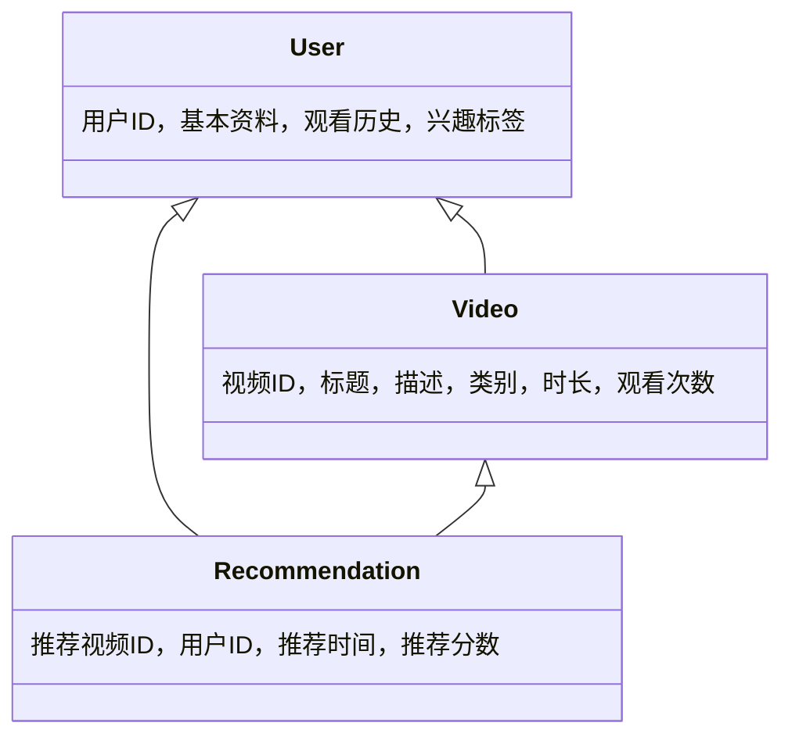
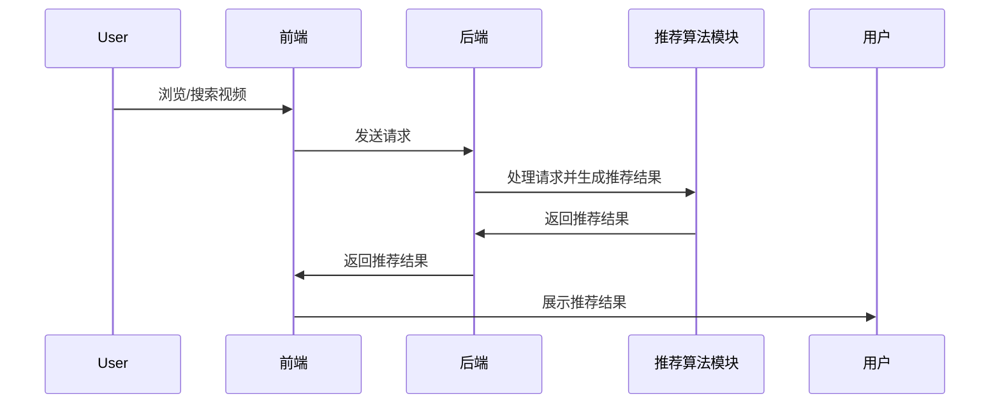
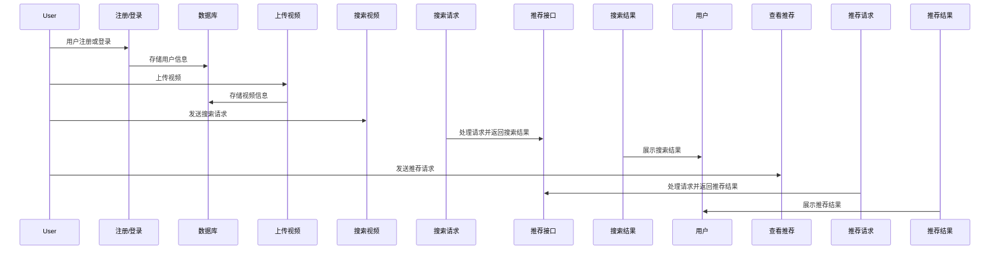

                 

### 引言

#### 1.1 问题背景

在当今数字时代，视频内容推荐系统已成为各种在线视频平台（如YouTube、Netflix、抖音等）的重要组成部分。视频内容推荐系统通过分析用户的观看历史、搜索行为、点赞、评论等数据，预测并推荐用户可能感兴趣的视频，从而提升用户满意度和平台粘性。然而，随着用户基数的扩大和视频内容的爆炸式增长，当前的视频内容推荐系统面临诸多挑战。

首先，用户满意度下降成为一个突出问题。虽然推荐系统能够根据用户的历史行为推荐相关视频，但频繁地推荐重复或用户已经观看过的内容，导致用户体验不佳，满意度下降。其次，视频内容的多样性与个性化推荐之间存在矛盾。用户对不同类型的视频有着不同的偏好，但传统推荐算法难以同时兼顾内容的多样性和个性化需求。此外，深度学习技术的发展为视频内容推荐提供了新的可能，但如何有效应用这些技术仍是一个亟待解决的难题。

#### 1.2 当前视频内容推荐系统面临的问题

1. **用户满意度下降**：传统推荐算法往往依赖于协同过滤或基于内容的推荐方法，这些方法容易导致“冷启动”问题，即新用户或新视频难以获得有效的推荐。此外，推荐系统过度依赖历史数据，难以捕捉到用户的即时兴趣变化，导致推荐内容缺乏新鲜感，用户满意度降低。

2. **视频内容多样性与个性化推荐**：个性化推荐在提升用户满意度方面具有重要意义，但如何确保推荐内容的多样性是一个难题。如果推荐系统过度关注用户的偏好，可能会忽略其他类型的内容，导致用户只能看到他们感兴趣的内容，缺乏新的发现和惊喜。

3. **数据质量和隐私保护**：视频内容推荐系统依赖大量用户行为数据，但数据质量参差不齐，如噪声数据、缺失数据等，这些都会影响推荐效果。同时，如何保护用户隐私也是一个关键问题，尤其是在处理敏感信息时，如用户兴趣、浏览记录等。

#### 1.3 问题解决

为了解决上述问题，深度学习技术作为一种先进的机器学习工具，为视频内容推荐提供了新的解决方案。深度学习通过构建复杂的神经网络模型，能够自动提取视频和用户数据的特征，从而实现更加精准和个性化的推荐。具体来说，深度学习技术可以在以下几个方面发挥作用：

1. **增强用户满意度**：通过分析用户的即时行为和反馈，深度学习能够实时调整推荐策略，提高推荐内容的及时性和相关性，从而提升用户满意度。

2. **提高内容多样性**：利用深度学习模型对视频内容的多种特征进行综合分析，推荐系统能够更好地平衡用户偏好和内容多样性，使用户获得更加丰富和多样化的观看体验。

3. **改善数据质量和隐私保护**：深度学习技术可以帮助清洗和预处理用户数据，提高数据质量。同时，通过差分隐私等技术，深度学习模型可以在保护用户隐私的前提下，有效挖掘和利用用户数据。

#### 1.4 边界与外延

虽然深度学习在视频内容推荐中展现了巨大的潜力，但仍存在一些挑战和限制。首先，深度学习模型需要大量的数据和计算资源，训练过程复杂且耗时。其次，模型的可解释性较差，难以理解其推荐背后的原因。此外，深度学习模型的泛化能力有限，可能无法很好地应对新的或未知的情况。

未来，视频内容推荐系统的发展将受到多个因素的影响，包括数据隐私保护、算法公平性、用户反馈机制等。通过不断优化和改进深度学习技术，结合其他辅助方法，视频内容推荐系统将能够更好地满足用户需求，提高用户体验。

#### 1.5 本章小结

本章介绍了视频内容推荐系统在当前面临的主要问题，并探讨了深度学习技术在提升用户满意度方面的潜在解决方案。通过分析用户满意度下降、视频内容多样性与个性化推荐之间的矛盾，以及数据质量和隐私保护等挑战，本章明确了深度学习技术在视频内容推荐中的重要性和应用前景。下一部分将深入探讨深度学习的基本概念和技术原理，为后续分析提供理论基础。

### 第一部分：背景与概述

在上一部分中，我们介绍了视频内容推荐系统在当前面临的主要挑战，以及深度学习技术在这些挑战中可能发挥的关键作用。为了更好地理解深度学习在视频内容推荐中的应用，本部分将深入探讨深度学习的基本概念和技术原理，并阐述这些概念与视频内容推荐之间的联系。

#### 2.1 深度学习基本概念

**深度学习**是机器学习中的一个子领域，其核心思想是通过构建具有多个隐藏层的神经网络模型，从大量数据中自动提取复杂特征，实现智能感知和预测。深度学习模型通过层层提取数据中的高层次抽象特征，从而能够处理复杂的数据类型，如图像、语音和视频。

**深度神经网络（DNN）**：深度神经网络是深度学习的基础，其结构包含多个隐藏层，通过前向传播和反向传播算法不断优化模型参数，以实现较高的预测精度。与传统单层神经网络相比，DNN能够处理更加复杂的数据，并通过层级关系进行特征提取和融合。

**卷积神经网络（CNN）**：CNN是一种专门用于处理图像数据的深度学习模型，其核心在于卷积操作和池化操作，能够有效地提取图像的局部特征和整体特征。CNN在计算机视觉领域取得了显著的成功，广泛应用于图像分类、目标检测和图像生成等任务。

**递归神经网络（RNN）**：RNN是一种适用于序列数据的深度学习模型，通过循环结构处理输入序列，能够捕捉序列中的长期依赖关系。RNN及其变体，如长短时记忆（LSTM）和门控循环单元（GRU），在自然语言处理、语音识别和时间序列预测等领域有着广泛的应用。

**生成对抗网络（GAN）**：GAN是一种由生成器和判别器组成的深度学习模型，通过生成器和判别器之间的对抗训练，能够生成高质量的数据，广泛应用于图像生成、风格迁移和数据增强等任务。

#### 2.2 深度学习算法在视频内容推荐中的应用

**视频特征提取**：视频内容推荐的关键在于能够有效地提取视频的特征，以用于后续的推荐算法。深度学习技术通过CNN等模型，可以从视频数据中自动提取丰富的视觉特征，如颜色、纹理、运动等。这些特征不仅能够描述视频的内容，还可以捕捉视频的抽象概念和情感。

**用户行为分析**：用户行为是视频内容推荐的重要依据，通过深度学习技术可以分析用户的兴趣和行为模式。RNN等模型能够处理用户的历史行为序列，提取用户的长时兴趣和短期兴趣变化，从而为个性化推荐提供有力支持。

**用户兴趣建模**：基于深度学习模型提取的用户特征和行为数据，可以用于构建用户兴趣模型。通过训练深度学习模型，可以识别用户对特定类型视频的偏好，从而实现更加精准的推荐。

**用户行为预测**：深度学习技术还可以用于预测用户未来的行为和兴趣变化。通过分析用户的历史行为和当前行为，深度学习模型可以预测用户接下来可能感兴趣的视频，从而优化推荐策略。

#### 2.3 深度学习算法对比表

以下是一个简单的深度学习算法对比表，展示了不同算法在属性和适用场景上的差异：

| 算法        | 特点                         | 适用场景                   |
|-----------|---------------------------|--------------------------|
| 卷积神经网络（CNN） | 适用于图像和视频数据的特征提取  | 图像分类、目标检测、视频分类 |
| 递归神经网络（RNN） | 适用于序列数据的建模和预测       | 自然语言处理、语音识别、时间序列预测 |
| 长短时记忆（LSTM）   | 改进RNN，适用于长序列依赖处理    | 文本生成、语音识别、股票预测 |
| 生成对抗网络（GAN） | 对抗训练，生成高质量数据       | 图像生成、数据增强、风格迁移 |

#### 2.4 深度学习在视频内容推荐中的ER实体关系图

实体关系（ER）图是用于表示实体和它们之间关系的图形化工具。在视频内容推荐系统中，ER图可以用来描述视频、用户和推荐系统之间的关系。以下是一个简单的ER图表示：

```mermaid
erDiagram
    User ||--o> Video : 用户观看视频
    Video ||--< User : 视频由用户生成
    User ||--< Recommendation : 推荐系统给用户推荐视频
    Recommendation ||--< User : 推荐系统根据用户兴趣推荐视频
```

在这个ER图中，User（用户）是主要实体，Video（视频）和Recommendation（推荐）是与User相关的关联实体。User与Video之间存在双向关联，表示用户观看视频，同时视频也可以由用户生成。User与Recommendation之间存在单向关联，表示推荐系统根据用户兴趣推荐视频。

#### 2.5 深度学习在视频内容推荐中的挑战与未来趋势

虽然深度学习在视频内容推荐中展现了巨大潜力，但仍然面临一些挑战。首先，数据质量和隐私保护是一个重要问题，如何有效利用用户数据，同时保护用户隐私，是一个需要解决的难题。其次，模型的可解释性较差，难以解释推荐结果的产生原因，这可能导致用户对推荐系统的信任度下降。此外，深度学习模型的训练过程需要大量的计算资源和时间，如何优化训练过程，提高模型的训练效率，也是一个重要研究方向。

未来，视频内容推荐系统的发展将受到多个因素的影响。首先，随着计算能力和数据存储技术的不断提升，深度学习模型将能够处理更加复杂和大规模的数据。其次，随着人工智能技术的不断发展，推荐系统将能够更好地理解和满足用户需求。此外，结合用户反馈机制和优化算法，推荐系统将能够实现更加智能和自适应的推荐。

总之，深度学习为视频内容推荐带来了新的机遇和挑战。通过不断优化和改进深度学习技术，结合其他辅助方法，视频内容推荐系统将能够更好地满足用户需求，提高用户体验。

#### 2.6 本章小结

本章详细介绍了深度学习的基本概念、算法以及其在视频内容推荐中的应用。通过分析深度学习技术的核心原理，如卷积神经网络、递归神经网络和生成对抗网络，我们了解了这些技术如何用于视频特征提取、用户行为分析和推荐策略优化。此外，本章通过实体关系图（ER图）展示了深度学习在视频内容推荐系统中的实体关系和交互。尽管深度学习在视频内容推荐中面临一些挑战，但其发展前景广阔，未来将不断优化和改进，以提供更精准、多样化和个性化的推荐体验。下一部分将深入探讨卷积神经网络（CNN）在视频内容推荐中的应用，进一步阐述其原理和实现方法。

### 第二部分：核心概念与联系

在上一部分，我们介绍了深度学习的基本概念和技术原理，并探讨了这些原理在视频内容推荐中的应用。在本部分，我们将进一步探讨深度学习中的几个核心概念，如卷积神经网络（CNN）、递归神经网络（RNN）和生成对抗网络（GAN），并分析它们在视频内容推荐中的具体应用和联系。

#### 3.1 深度学习基本概念

**3.1.1 神经网络与深度神经网络**

神经网络（Neural Network，NN）是一种模仿生物神经系统的计算模型，由大量简单的处理单元（神经元）互联而成。每个神经元接收多个输入信号，通过加权求和处理后产生一个输出信号。神经网络通过学习输入和输出之间的映射关系，实现各种复杂的任务，如图像识别、语音识别和自然语言处理等。

深度神经网络（Deep Neural Network，DNN）是神经网络的一种扩展，具有多个隐藏层。DNN通过层层提取数据中的高层次抽象特征，能够处理更复杂的数据类型和任务。DNN在图像识别、语音识别和时间序列预测等领域取得了显著的成果。

**3.1.2 深度学习的基本架构**

深度学习模型通常由输入层、隐藏层和输出层组成。输入层接收外部数据，隐藏层通过神经网络结构进行特征提取和变换，输出层产生最终预测结果。在训练过程中，模型通过反向传播算法不断优化参数，以降低预测误差。

**3.1.3 深度学习算法**

深度学习算法包括多种类型，如卷积神经网络（CNN）、递归神经网络（RNN）、生成对抗网络（GAN）等。每种算法在数据处理、特征提取和任务类型上各有特点，适用于不同的应用场景。

#### 3.2 深度学习算法在视频内容推荐中的应用

**3.2.1 视频特征提取**

视频特征提取是视频内容推荐系统的核心任务之一。深度学习技术，特别是卷积神经网络（CNN），在视频特征提取方面具有显著优势。

**卷积神经网络（CNN）**：CNN是一种专门用于处理图像和视频数据的深度学习模型。其核心在于卷积操作和池化操作，能够有效地提取图像和视频中的局部特征和整体特征。CNN通过多个卷积层和池化层，逐层提取视频数据中的高级抽象特征，从而实现视频内容的自动编码和分类。

**递归神经网络（RNN）**：RNN是一种适用于序列数据的深度学习模型，通过处理视频中的时间序列数据，可以提取视频的时序特征。RNN能够捕捉视频中的动态变化和长期依赖关系，从而提高特征提取的准确性。

**生成对抗网络（GAN）**：GAN是一种生成模型，通过生成器和判别器之间的对抗训练，能够生成高质量的视频数据。GAN在视频内容增强、视频生成和数据增强等方面有着广泛的应用。

**3.2.2 用户行为分析**

用户行为分析是视频内容推荐系统的另一个重要任务。通过深度学习技术，可以分析用户的观看历史、搜索行为、点赞和评论等数据，提取用户兴趣和行为特征。

**用户兴趣建模**：通过分析用户的历史行为和反馈数据，深度学习模型可以构建用户兴趣模型。用户兴趣模型可以用于预测用户对特定类型视频的偏好，从而实现个性化推荐。

**用户行为预测**：深度学习模型还可以用于预测用户的未来行为和兴趣变化。通过分析用户当前的行为模式，模型可以预测用户接下来可能感兴趣的视频，从而优化推荐策略。

#### 3.3 深度学习算法对比表

以下是一个简单的深度学习算法对比表，展示了不同算法在属性和适用场景上的差异：

| 算法        | 特点                         | 适用场景                   |
|-----------|---------------------------|--------------------------|
| 卷积神经网络（CNN） | 适用于图像和视频数据的特征提取  | 图像分类、目标检测、视频分类 |
| 递归神经网络（RNN） | 适用于序列数据的建模和预测       | 自然语言处理、语音识别、时间序列预测 |
| 长短时记忆（LSTM）   | 改进RNN，适用于长序列依赖处理    | 文本生成、语音识别、股票预测 |
| 生成对抗网络（GAN） | 对抗训练，生成高质量数据       | 图像生成、数据增强、风格迁移 |

#### 3.4 深度学习在视频内容推荐中的ER实体关系图

实体关系（ER）图是用于表示实体和它们之间关系的图形化工具。在视频内容推荐系统中，ER图可以用来描述视频、用户和推荐系统之间的关系。以下是一个简单的ER图表示：

```mermaid
erDiagram
    User ||--o> Video : 用户观看视频
    Video ||--< User : 视频由用户生成
    User ||--< Recommendation : 推荐系统给用户推荐视频
    Recommendation ||--< User : 推荐系统根据用户兴趣推荐视频
```

在这个ER图中，User（用户）是主要实体，Video（视频）和Recommendation（推荐）是与User相关的关联实体。User与Video之间存在双向关联，表示用户观看视频，同时视频也可以由用户生成。User与Recommendation之间存在单向关联，表示推荐系统根据用户兴趣推荐视频。

#### 3.5 深度学习在视频内容推荐中的挑战与未来趋势

虽然深度学习在视频内容推荐中展现了巨大潜力，但仍然面临一些挑战。首先，数据质量和隐私保护是一个重要问题，如何有效利用用户数据，同时保护用户隐私，是一个需要解决的难题。其次，模型的可解释性较差，难以解释推荐结果的产生原因，这可能导致用户对推荐系统的信任度下降。此外，深度学习模型的训练过程需要大量的计算资源和时间，如何优化训练过程，提高模型的训练效率，也是一个重要研究方向。

未来，视频内容推荐系统的发展将受到多个因素的影响。首先，随着计算能力和数据存储技术的不断提升，深度学习模型将能够处理更加复杂和大规模的数据。其次，随着人工智能技术的不断发展，推荐系统将能够更好地理解和满足用户需求。此外，结合用户反馈机制和优化算法，推荐系统将能够实现更加智能和自适应的推荐。

总之，深度学习为视频内容推荐带来了新的机遇和挑战。通过不断优化和改进深度学习技术，结合其他辅助方法，视频内容推荐系统将能够更好地满足用户需求，提高用户体验。

#### 3.6 本章小结

本章详细介绍了深度学习的核心概念，包括神经网络、深度神经网络、卷积神经网络、递归神经网络和生成对抗网络。我们探讨了这些算法在视频内容推荐中的应用，如视频特征提取、用户行为分析和推荐策略优化。此外，本章通过实体关系图（ER图）展示了深度学习在视频内容推荐系统中的实体关系和交互。虽然深度学习在视频内容推荐中面临一些挑战，但其发展前景广阔，未来将不断优化和改进，以提供更精准、多样化和个性化的推荐体验。下一部分将深入探讨卷积神经网络（CNN）的具体应用，进一步阐述其在视频内容推荐中的原理和实现方法。

### 4. 算法原理讲解

#### 4.1 卷积神经网络（CNN）原理

卷积神经网络（CNN）是一种专门用于处理图像和视频数据的深度学习模型，其核心在于卷积操作和池化操作，能够有效地提取图像和视频的局部特征和整体特征。CNN通过层层提取数据中的高层次抽象特征，从而实现图像分类、目标检测和视频分类等任务。

**4.1.1 CNN的基本结构**

CNN的基本结构包含以下几个主要部分：

1. **输入层**：接收原始图像或视频数据。
2. **卷积层**：通过卷积操作提取图像或视频的局部特征。
3. **池化层**：对卷积层输出的特征进行降采样，减少数据维度。
4. **全连接层**：将卷积层和池化层提取的高层次特征映射到输出层。
5. **输出层**：产生最终的预测结果，如图像分类结果。

**4.1.2 卷积层的数学模型**

卷积层的数学模型可以表示为：

$$
\text{output}_{ij} = \sum_{k=1}^{K} \text{filter}_{ik} * \text{input}_{kj}
$$

其中，$\text{output}_{ij}$ 表示卷积层输出的特征图，$\text{filter}_{ik}$ 表示卷积核，$\text{input}_{kj}$ 表示输入特征图。卷积操作通过在输入特征图上滑动卷积核，计算卷积核与输入特征图的点积，得到卷积层输出的特征图。

**4.1.3 池化层的数学模型**

池化层用于对卷积层输出的特征图进行降采样，常用的池化操作包括最大池化和平均池化。最大池化操作的数学模型可以表示为：

$$
\text{pool}_{ij} = \max\{ \text{input}_{i1}, \text{input}_{i2}, ..., \text{input}_{in} \}
$$

其中，$\text{pool}_{ij}$ 表示池化层输出的特征图，$\text{input}_{i1}, \text{input}_{i2}, ..., \text{input}_{in}$ 表示输入特征图上的所有值。平均池化操作的数学模型可以表示为：

$$
\text{pool}_{ij} = \frac{1}{n} \sum_{k=1}^{n} \text{input}_{ik}
$$

其中，$n$ 表示每个池化区域内的元素个数。

**4.1.4 CNN的工作原理**

CNN的工作原理可以简单概括为：

1. **卷积操作**：在输入图像上滑动卷积核，计算卷积核与输入图像的局部区域点积，得到卷积层输出的特征图。
2. **激活函数**：对卷积层输出的特征图应用激活函数（如ReLU函数），引入非线性变换，增强模型的表达能力。
3. **池化操作**：对卷积层输出的特征图进行降采样，减少数据维度，提高计算效率。
4. **卷积层堆叠**：重复卷积层和池化层的操作，逐层提取图像的局部特征和整体特征。
5. **全连接层**：将卷积层和池化层提取的高层次特征映射到输出层，进行分类或回归任务。

**示例**

假设输入图像大小为 $28 \times 28$，卷积核大小为 $3 \times 3$。在第一个卷积层中，我们使用一个 $3 \times 3$ 的卷积核在输入图像上滑动，计算卷积核与输入图像的局部区域点积，得到一个 $26 \times 26$ 的特征图。然后，我们对该特征图应用 ReLU 函数，得到一个带有激活值的特征图。最后，我们对特征图进行最大池化操作，得到一个 $13 \times 13$ 的特征图。这个特征图包含了输入图像的局部特征，可以用于后续的分类任务。

通过上述卷积操作、激活函数和池化操作的堆叠，CNN可以逐层提取图像的局部特征和整体特征，从而实现图像分类、目标检测和视频分类等任务。

#### 4.2 递归神经网络（RNN）原理

递归神经网络（RNN）是一种适用于序列数据的深度学习模型，通过处理输入序列，能够捕捉序列中的长期依赖关系。RNN在自然语言处理、语音识别和时间序列预测等领域有着广泛的应用。

**4.2.1 RNN的基本结构**

RNN的基本结构包含以下几个主要部分：

1. **输入层**：接收输入序列。
2. **隐藏层**：处理输入序列，生成隐藏状态。
3. **输出层**：根据隐藏状态生成输出序列。

RNN的每个时间步都包含一个隐藏状态，用于存储和传递序列信息。隐藏状态可以通过前向传播和反向传播算法进行更新。

**4.2.2 RNN的数学模型**

RNN的数学模型可以表示为：

$$
\text{output}_{t} = \sigma(\text{weight}_{ih} \cdot \text{input}_{t} + \text{weight}_{ho} \cdot \text{output}_{t-1} + \text{bias})
$$

其中，$\text{output}_{t}$ 表示第 $t$ 个时间步的输出，$\text{input}_{t}$ 表示第 $t$ 个时间步的输入，$\text{weight}_{ih}$ 和 $\text{weight}_{ho}$ 分别表示输入权重和输出权重，$\text{bias}$ 表示偏置项，$\sigma$ 表示激活函数（如ReLU函数）。

**4.2.3 长短时记忆（LSTM）单元**

RNN在处理长序列时存在梯度消失和梯度爆炸等问题，导致难以捕捉长期依赖关系。为了解决这些问题，提出了长短时记忆（Long Short-Term Memory，LSTM）单元。

LSTM单元是一种改进的RNN结构，通过引入门控机制，能够有效地捕捉和传递长序列信息。LSTM单元包含以下三个门：

1. **遗忘门（Forget Gate）**：决定上一时刻的隐藏状态中哪些信息需要被遗忘。
2. **输入门（Input Gate）**：决定当前时刻的新信息中哪些需要被存储在隐藏状态中。
3. **输出门（Output Gate）**：决定当前时刻的隐藏状态中哪些信息需要输出。

LSTM单元的数学模型可以表示为：

$$
\text{forget}_{t} = \sigma(\text{weight}_{if} \cdot \text{input}_{t} + \text{weight}_{ih} \cdot \text{output}_{t-1} + \text{bias}_{f})
$$

$$
\text{input}_{t} = \sigma(\text{weight}_{ii} \cdot \text{input}_{t} + \text{weight}_{ih} \cdot \text{output}_{t-1} + \text{bias}_{i})
$$

$$
\text{output}_{t} = \sigma(\text{weight}_{io} \cdot \text{input}_{t} + \text{weight}_{ih} \cdot \text{output}_{t-1} + \text{bias}_{o})
$$

$$
\text{cell}_{t} = \text{sigmoid}(\text{weight}_{cf} \cdot \text{input}_{t} + \text{weight}_{ch} \cdot \text{output}_{t-1} + \text{bias}_{c})
$$

$$
\text{output}_{t} = \text{weight}_{oh} \cdot \text{cell}_{t}
$$

其中，$\text{forget}_{t}$、$\text{input}_{t}$ 和 $\text{output}_{t}$ 分别表示遗忘门、输入门和输出门，$\text{cell}_{t}$ 表示细胞状态，$\text{weight}_{if}, \text{weight}_{ih}, \text{weight}_{of}, \text{weight}_{oh}, \text{weight}_{cf}, \text{weight}_{ch}$ 分别表示输入权重、输出权重、遗忘权重和细胞权重，$\text{bias}_{f}, \text{bias}_{i}, \text{bias}_{o}, \text{bias}_{c}$ 分别表示遗忘门、输入门、输出门和细胞状态的偏置项。

**4.2.4 RNN的工作原理**

RNN的工作原理可以简单概括为：

1. **前向传播**：输入序列通过RNN的隐藏层，生成隐藏状态。
2. **遗忘和输入门**：遗忘门决定上一时刻的隐藏状态中哪些信息需要被遗忘，输入门决定当前时刻的新信息中哪些需要被存储在隐藏状态中。
3. **更新隐藏状态**：通过遗忘门和输入门的控制，更新隐藏状态。
4. **输出门**：根据更新后的隐藏状态，生成输出序列。

通过上述过程，RNN能够处理输入序列，并生成对应的输出序列，从而实现序列建模和预测任务。

**示例**

假设输入序列为 `[1, 2, 3, 4, 5]`，隐藏状态维度为 `3`。在第一个时间步，输入为 `1`，隐藏状态为 `[0.1, 0.2, 0.3]`。通过遗忘门、输入门和输出门，更新隐藏状态为 `[0.4, 0.5, 0.6]`。在第二个时间步，输入为 `2`，隐藏状态为 `[0.4, 0.5, 0.6]`。通过遗忘门、输入门和输出门，更新隐藏状态为 `[0.7, 0.8, 0.9]`。以此类推，RNN可以处理整个输入序列，并生成对应的输出序列。

通过上述过程，RNN能够有效地捕捉序列中的长期依赖关系，从而在自然语言处理、语音识别和时间序列预测等领域取得良好的性能。

#### 4.3 生成对抗网络（GAN）原理

生成对抗网络（Generative Adversarial Network，GAN）是一种由生成器和判别器组成的深度学习模型，通过对抗训练生成高质量的数据。GAN在图像生成、数据增强和风格迁移等领域取得了显著的成功。

**4.3.1 GAN的基本结构**

GAN的基本结构包含以下几个主要部分：

1. **生成器（Generator）**：生成器是一个深度神经网络，输入为随机噪声，输出为生成的数据。生成器的目标是生成尽可能真实的数据，以欺骗判别器。
2. **判别器（Discriminator）**：判别器也是一个深度神经网络，输入为真实数据和生成数据，输出为概率值。判别器的目标是区分真实数据和生成数据，以降低生成器的性能。
3. **对抗训练**：生成器和判别器之间进行对抗训练，生成器和判别器相互竞争，以最大化彼此的对立目标。

**4.3.2 生成器和判别器的数学模型**

生成器和判别器的数学模型可以分别表示为：

生成器：
$$
\text{X}^{\text{gen}} = G(\text{Z})
$$
其中，$\text{X}^{\text{gen}}$ 表示生成的数据，$G$ 表示生成器，$\text{Z}$ 表示输入的随机噪声。

判别器：
$$
\text{D}(\text{X}) = \text{sigmoid}(\text{f}(\text{X}))
$$
$$
\text{D}(\text{X}^{\text{gen}}) = \text{sigmoid}(\text{f}(\text{X}^{\text{gen}}))
$$
其中，$\text{D}$ 表示判别器，$\text{X}$ 表示真实数据，$\text{X}^{\text{gen}}$ 表示生成的数据，$f$ 表示判别器的神经网络函数。

**4.3.3 GAN的训练过程**

GAN的训练过程可以概括为以下几个步骤：

1. **初始化生成器和判别器**：随机初始化生成器和判别器的权重。
2. **生成器训练**：生成器生成虚假数据，判别器根据真实数据和虚假数据更新权重。
3. **判别器训练**：判别器根据真实数据和虚假数据更新权重。
4. **交替迭代**：生成器和判别器交替训练，不断优化彼此的权重。

在训练过程中，生成器和判别器之间的目标是对抗的：

- **生成器目标**：生成尽可能真实的数据，以欺骗判别器，使判别器无法区分真实数据和生成数据。
- **判别器目标**：区分真实数据和生成数据，使生成器的生成数据无法欺骗判别器。

通过上述对抗训练，生成器能够生成高质量的数据，判别器能够准确地区分真实数据和生成数据。这种对抗训练机制使得GAN在图像生成、数据增强和风格迁移等领域取得了显著的成果。

**示例**

假设输入噪声分布为 $Z \sim \text{Normal}(0, 1)$，生成器模型为 $G$，判别器模型为 $D$。在训练过程中：

1. **生成器训练**：生成器生成虚假图像 $X^{\text{gen}} = G(Z)$，判别器根据真实图像和虚假图像更新权重。
2. **判别器训练**：判别器根据真实图像和虚假图像更新权重，使判别器能够准确地区分真实图像和虚假图像。
3. **交替迭代**：生成器和判别器交替训练，不断优化彼此的权重，直到生成器生成的高质量图像能够有效欺骗判别器。

通过上述过程，GAN能够生成与真实图像相似的高质量图像，从而在图像生成、数据增强和风格迁移等领域取得成功。

通过卷积神经网络（CNN）、递归神经网络（RNN）和生成对抗网络（GAN）的详细讲解，我们了解了这些深度学习算法在视频内容推荐中的具体应用和实现原理。这些算法通过特征提取、用户行为分析和数据生成等方面，为视频内容推荐提供了强大的技术支持。下一部分将深入探讨卷积神经网络（CNN）在视频内容推荐中的应用，进一步阐述其在视频特征提取和分类任务中的实现方法。

### 4. 数学模型和数学公式

在上一部分，我们详细介绍了卷积神经网络（CNN）、递归神经网络（RNN）和生成对抗网络（GAN）的基本原理。为了更好地理解和实现这些算法，本部分将重点介绍这些算法中的关键数学模型和公式，并通过具体的例子进行解释。

#### 4.1 卷积神经网络（CNN）数学公式

卷积神经网络（CNN）是处理图像和视频数据的强大工具，其核心在于卷积操作和池化操作。以下是CNN中的一些关键数学公式。

**4.1.1 卷积操作公式**

卷积操作是CNN中用于特征提取的关键步骤。假设输入图像为 $X \in \mathbb{R}^{H \times W \times C}$，卷积核（filter）为 $W \in \mathbb{R}^{K \times K \times C}$，输出特征图为 $Y \in \mathbb{R}^{H' \times W' \times D}$。卷积操作的公式如下：

$$
\text{output}_{ij} = \sum_{k=1}^{K} \sum_{l=1}^{K} W_{kl, :, :] * X_{i-k, j-l, :, :} + b_j
$$

其中，$i$ 和 $j$ 分别表示输出特征图的位置，$k$ 和 $l$ 表示卷积核的位置，$*$ 表示卷积操作，$b_j$ 表示偏置项。

**4.1.2 池化操作公式**

池化操作用于降低特征图的维度，增加模型的鲁棒性。最大池化是最常用的池化操作之一，其公式如下：

$$
\text{pool}_{ij} = \max\{ \text{input}_{i1}, \text{input}_{i2}, ..., \text{input}_{in} \}
$$

其中，$i$ 和 $j$ 分别表示输出特征图的位置，$n$ 表示每个池化区域内的元素个数。

**示例**

假设输入图像的大小为 $5 \times 5$，卷积核的大小为 $3 \times 3$。卷积操作可以表示为：

$$
\text{output}_{ij} = \sum_{k=1}^{3} \sum_{l=1}^{3} W_{kl, :, :] * X_{i-k, j-l, :, :] + b_j
$$

其中，$W_{kl, :, :]$ 表示卷积核，$X_{i-k, j-l, :, :]$ 表示输入图像的一部分。

#### 4.2 递归神经网络（RNN）数学公式

递归神经网络（RNN）适用于处理序列数据，其核心在于隐藏状态的更新和输出。以下是RNN中的一些关键数学公式。

**4.2.1 RNN的输入输出公式**

假设输入序列为 $X \in \mathbb{R}^{T \times D}$，隐藏状态为 $H \in \mathbb{R}^{T \times H}$，输出序列为 $Y \in \mathbb{R}^{T \times L}$。RNN的输入输出公式如下：

$$
\text{output}_{t} = \sigma(\text{weight}_{ih} \cdot \text{input}_{t} + \text{weight}_{ho} \cdot \text{output}_{t-1} + \text{bias})
$$

其中，$\text{output}_{t}$ 表示第 $t$ 个时间步的输出，$\text{input}_{t}$ 表示第 $t$ 个时间步的输入，$\text{weight}_{ih}$ 和 $\text{weight}_{ho}$ 分别表示输入权重和输出权重，$\text{bias}$ 表示偏置项，$\sigma$ 表示激活函数（如ReLU函数）。

**4.2.2 长短时记忆（LSTM）单元公式**

为了解决RNN在处理长序列时出现的梯度消失和梯度爆炸问题，提出了长短时记忆（LSTM）单元。以下是LSTM单元中的关键数学公式。

遗忘门（Forget Gate）：
$$
\text{forget}_{t} = \sigma(\text{weight}_{if} \cdot \text{input}_{t} + \text{weight}_{ih} \cdot \text{output}_{t-1} + \text{bias}_{f})
$$

输入门（Input Gate）：
$$
\text{input}_{t} = \sigma(\text{weight}_{ii} \cdot \text{input}_{t} + \text{weight}_{ih} \cdot \text{output}_{t-1} + \text{bias}_{i})
$$

输出门（Output Gate）：
$$
\text{output}_{t} = \sigma(\text{weight}_{io} \cdot \text{input}_{t} + \text{weight}_{ih} \cdot \text{output}_{t-1} + \text{bias}_{o})
$$

细胞状态（Cell State）：
$$
\text{cell}_{t} = \text{sigmoid}(\text{weight}_{cf} \cdot \text{input}_{t} + \text{weight}_{ch} \cdot \text{output}_{t-1} + \text{bias}_{c})
$$

$$
\text{output}_{t} = \text{weight}_{oh} \cdot \text{cell}_{t}
$$

其中，$\text{forget}_{t}$、$\text{input}_{t}$ 和 $\text{output}_{t}$ 分别表示遗忘门、输入门和输出门，$\text{cell}_{t}$ 表示细胞状态，$\text{weight}_{if}, \text{weight}_{ih}, \text{weight}_{of}, \text{weight}_{oh}, \text{weight}_{cf}, \text{weight}_{ch}$ 分别表示输入权重、输出权重、遗忘权重和细胞权重，$\text{bias}_{f}, \text{bias}_{i}, \text{bias}_{o}, \text{bias}_{c}$ 分别表示遗忘门、输入门、输出门和细胞状态的偏置项。

**示例**

假设输入序列为 `[1, 2, 3, 4, 5]`，隐藏状态维度为 `3`。在第一个时间步，输入为 `1`，隐藏状态为 `[0.1, 0.2, 0.3]`。通过遗忘门、输入门和输出门，更新隐藏状态为 `[0.4, 0.5, 0.6]`。在第二个时间步，输入为 `2`，隐藏状态为 `[0.4, 0.5, 0.6]`。通过遗忘门、输入门和输出门，更新隐藏状态为 `[0.7, 0.8, 0.9]`。以此类推，RNN可以处理整个输入序列，并生成对应的输出序列。

#### 4.3 生成对抗网络（GAN）数学公式

生成对抗网络（GAN）由生成器和判别器组成，通过对抗训练生成高质量的数据。以下是GAN中的关键数学公式。

**4.3.1 生成器和判别器的损失函数**

生成器的损失函数通常采用反熵损失函数（Reverse Entropy Loss），其公式如下：

$$
\text{Loss}_{\text{G}} = -\mathbb{E}_{\text{Z}}[\text{log}(\text{D}(\text{G}(\text{Z})))]
$$

其中，$\text{G}$ 表示生成器，$\text{D}$ 表示判别器，$Z$ 表示输入的随机噪声。

判别器的损失函数通常采用二元交叉熵损失函数（Binary Cross-Entropy Loss），其公式如下：

$$
\text{Loss}_{\text{D}} = -[\mathbb{E}_{\text{X}}[\text{log}(\text{D}(\text{X}))] + \mathbb{E}_{\text{Z}}[\text{log}(1 - \text{D}(\text{G}(\text{Z}))]
$$

其中，$\text{X}$ 表示真实数据，$\text{Z}$ 表示输入的随机噪声。

**4.3.2 GAN的训练过程**

GAN的训练过程通过交替更新生成器和判别器的权重，使其达到对抗平衡。具体步骤如下：

1. **生成器训练**：固定判别器的权重，通过最小化生成器的损失函数来更新生成器的权重。
2. **判别器训练**：固定生成器的权重，通过最小化判别器的损失函数来更新判别器的权重。
3. **交替迭代**：交替进行生成器和判别器的训练，直到生成器生成的高质量数据能够有效欺骗判别器。

**示例**

假设生成器生成虚假图像 $X^{\text{gen}} = G(Z)$，判别器根据真实图像和虚假图像更新权重。在训练过程中：

1. **生成器训练**：生成器生成虚假图像，判别器根据真实图像和虚假图像更新权重，使判别器能够准确地区分真实图像和虚假图像。
2. **判别器训练**：判别器根据真实图像和虚假图像更新权重，使生成器的生成图像能够被判别器识别。
3. **交替迭代**：生成器和判别器交替训练，不断优化彼此的权重，直到生成器生成的高质量图像能够有效欺骗判别器。

通过上述数学公式和示例，我们了解了卷积神经网络（CNN）、递归神经网络（RNN）和生成对抗网络（GAN）中的关键数学模型和实现方法。这些模型和公式为深度学习算法在视频内容推荐中的应用提供了理论基础和实现指导。在下一部分，我们将进一步探讨CNN在视频内容推荐中的具体实现和应用。

### 5. 算法原理讲解

#### 5.1 卷积神经网络（CNN）原理

卷积神经网络（CNN）是一种专门用于处理图像和视频数据的深度学习模型，其核心在于卷积操作和池化操作，能够有效地提取图像和视频的局部特征和整体特征。CNN通过层层提取数据中的高层次抽象特征，从而实现图像分类、目标检测和视频分类等任务。

**5.1.1 CNN的基本结构**

CNN的基本结构包含以下几个主要部分：

1. **输入层**：接收原始图像或视频数据。
2. **卷积层**：通过卷积操作提取图像或视频的局部特征。
3. **池化层**：对卷积层输出的特征进行降采样，减少数据维度。
4. **全连接层**：将卷积层和池化层提取的高层次特征映射到输出层。
5. **输出层**：产生最终的预测结果，如图像分类结果。

**5.1.2 卷积层的数学模型**

卷积层的数学模型可以表示为：

$$
\text{output}_{ij} = \sum_{k=1}^{K} \text{filter}_{ik} * \text{input}_{kj}
$$

其中，$\text{output}_{ij}$ 表示卷积层输出的特征图，$\text{filter}_{ik}$ 表示卷积核，$\text{input}_{kj}$ 表示输入特征图。卷积操作通过在输入特征图上滑动卷积核，计算卷积核与输入特征图的点积，得到卷积层输出的特征图。

**5.1.3 池化层的数学模型**

池化层用于对卷积层输出的特征图进行降采样，常用的池化操作包括最大池化和平均池化。最大池化操作的数学模型可以表示为：

$$
\text{pool}_{ij} = \max\{ \text{input}_{i1}, \text{input}_{i2}, ..., \text{input}_{in} \}
$$

其中，$\text{pool}_{ij}$ 表示池化层输出的特征图，$\text{input}_{i1}, \text{input}_{i2}, ..., \text{input}_{in}$ 表示输入特征图上的所有值。平均池化操作的数学模型可以表示为：

$$
\text{pool}_{ij} = \frac{1}{n} \sum_{k=1}^{n} \text{input}_{ik}
$$

其中，$n$ 表示每个池化区域内的元素个数。

**5.1.4 CNN的工作原理**

CNN的工作原理可以简单概括为：

1. **卷积操作**：在输入图像上滑动卷积核，计算卷积核与输入图像的局部区域点积，得到卷积层输出的特征图。
2. **激活函数**：对卷积层输出的特征图应用激活函数（如ReLU函数），引入非线性变换，增强模型的表达能力。
3. **池化操作**：对卷积层输出的特征图进行降采样，减少数据维度，提高计算效率。
4. **卷积层堆叠**：重复卷积层和池化层的操作，逐层提取图像的局部特征和整体特征。
5. **全连接层**：将卷积层和池化层提取的高层次特征映射到输出层，进行分类或回归任务。

**示例**

假设输入图像大小为 $28 \times 28$，卷积核大小为 $3 \times 3$。在第一个卷积层中，我们使用一个 $3 \times 3$ 的卷积核在输入图像上滑动，计算卷积核与输入图像的局部区域点积，得到一个 $26 \times 26$ 的特征图。然后，我们对该特征图应用 ReLU 函数，得到一个带有激活值的特征图。最后，我们对特征图进行最大池化操作，得到一个 $13 \times 13$ 的特征图。这个特征图包含了输入图像的局部特征，可以用于后续的分类任务。

通过上述卷积操作、激活函数和池化操作的堆叠，CNN可以逐层提取图像的局部特征和整体特征，从而实现图像分类、目标检测和视频分类等任务。

#### 5.2 递归神经网络（RNN）原理

递归神经网络（RNN）是一种适用于序列数据的深度学习模型，通过处理输入序列，能够捕捉序列中的长期依赖关系。RNN在自然语言处理、语音识别和时间序列预测等领域有着广泛的应用。

**5.2.1 RNN的基本结构**

RNN的基本结构包含以下几个主要部分：

1. **输入层**：接收输入序列。
2. **隐藏层**：处理输入序列，生成隐藏状态。
3. **输出层**：根据隐藏状态生成输出序列。

RNN的每个时间步都包含一个隐藏状态，用于存储和传递序列信息。隐藏状态可以通过前向传播和反向传播算法进行更新。

**5.2.2 RNN的数学模型**

RNN的数学模型可以表示为：

$$
\text{output}_{t} = \sigma(\text{weight}_{ih} \cdot \text{input}_{t} + \text{weight}_{ho} \cdot \text{output}_{t-1} + \text{bias})
$$

其中，$\text{output}_{t}$ 表示第 $t$ 个时间步的输出，$\text{input}_{t}$ 表示第 $t$ 个时间步的输入，$\text{weight}_{ih}$ 和 $\text{weight}_{ho}$ 分别表示输入权重和输出权重，$\text{bias}$ 表示偏置项，$\sigma$ 表示激活函数（如ReLU函数）。

**5.2.3 长短时记忆（LSTM）单元**

RNN在处理长序列时存在梯度消失和梯度爆炸等问题，导致难以捕捉长期依赖关系。为了解决这些问题，提出了长短时记忆（Long Short-Term Memory，LSTM）单元。

LSTM单元是一种改进的RNN结构，通过引入门控机制，能够有效地捕捉和传递长序列信息。LSTM单元包含以下三个门：

1. **遗忘门（Forget Gate）**：决定上一时刻的隐藏状态中哪些信息需要被遗忘。
2. **输入门（Input Gate）**：决定当前时刻的新信息中哪些需要被存储在隐藏状态中。
3. **输出门（Output Gate）**：决定当前时刻的隐藏状态中哪些信息需要输出。

LSTM单元的数学模型可以表示为：

遗忘门：
$$
\text{forget}_{t} = \sigma(\text{weight}_{if} \cdot \text{input}_{t} + \text{weight}_{ih} \cdot \text{output}_{t-1} + \text{bias}_{f})
$$

输入门：
$$
\text{input}_{t} = \sigma(\text{weight}_{ii} \cdot \text{input}_{t} + \text{weight}_{ih} \cdot \text{output}_{t-1} + \text{bias}_{i})
$$

输出门：
$$
\text{output}_{t} = \sigma(\text{weight}_{io} \cdot \text{input}_{t} + \text{weight}_{ih} \cdot \text{output}_{t-1} + \text{bias}_{o})
$$

细胞状态：
$$
\text{cell}_{t} = \text{sigmoid}(\text{weight}_{cf} \cdot \text{input}_{t} + \text{weight}_{ch} \cdot \text{output}_{t-1} + \text{bias}_{c})
$$

$$
\text{output}_{t} = \text{weight}_{oh} \cdot \text{cell}_{t}
$$

其中，$\text{forget}_{t}$、$\text{input}_{t}$ 和 $\text{output}_{t}$ 分别表示遗忘门、输入门和输出门，$\text{cell}_{t}$ 表示细胞状态，$\text{weight}_{if}, \text{weight}_{ih}, \text{weight}_{of}, \text{weight}_{oh}, \text{weight}_{cf}, \text{weight}_{ch}$ 分别表示输入权重、输出权重、遗忘权重和细胞权重，$\text{bias}_{f}, \text{bias}_{i}, \text{bias}_{o}, \text{bias}_{c}$ 分别表示遗忘门、输入门、输出门和细胞状态的偏置项。

**5.2.4 RNN的工作原理**

RNN的工作原理可以简单概括为：

1. **前向传播**：输入序列通过RNN的隐藏层，生成隐藏状态。
2. **遗忘和输入门**：遗忘门决定上一时刻的隐藏状态中哪些信息需要被遗忘，输入门决定当前时刻的新信息中哪些需要被存储在隐藏状态中。
3. **更新隐藏状态**：通过遗忘门和输入门的控制，更新隐藏状态。
4. **输出门**：根据更新后的隐藏状态，生成输出序列。

通过上述过程，RNN能够处理输入序列，并生成对应的输出序列，从而实现序列建模和预测任务。

**示例**

假设输入序列为 `[1, 2, 3, 4, 5]`，隐藏状态维度为 `3`。在第一个时间步，输入为 `1`，隐藏状态为 `[0.1, 0.2, 0.3]`。通过遗忘门、输入门和输出门，更新隐藏状态为 `[0.4, 0.5, 0.6]`。在第二个时间步，输入为 `2`，隐藏状态为 `[0.4, 0.5, 0.6]`。通过遗忘门、输入门和输出门，更新隐藏状态为 `[0.7, 0.8, 0.9]`。以此类推，RNN可以处理整个输入序列，并生成对应的输出序列。

通过上述过程，RNN能够有效地捕捉序列中的长期依赖关系，从而在自然语言处理、语音识别和时间序列预测等领域取得良好的性能。

#### 5.3 生成对抗网络（GAN）原理

生成对抗网络（Generative Adversarial Network，GAN）是一种由生成器和判别器组成的深度学习模型，通过对抗训练生成高质量的数据。GAN在图像生成、数据增强和风格迁移等领域取得了显著的成功。

**5.3.1 GAN的基本结构**

GAN的基本结构包含以下几个主要部分：

1. **生成器（Generator）**：生成器是一个深度神经网络，输入为随机噪声，输出为生成的数据。生成器的目标是生成尽可能真实的数据，以欺骗判别器。
2. **判别器（Discriminator）**：判别器也是一个深度神经网络，输入为真实数据和生成数据，输出为概率值。判别器的目标是区分真实数据和生成数据，以降低生成器的性能。
3. **对抗训练**：生成器和判别器之间进行对抗训练，生成器和判别器相互竞争，以最大化彼此的对立目标。

**5.3.2 生成器和判别器的数学模型**

生成器和判别器的数学模型可以分别表示为：

生成器：
$$
\text{X}^{\text{gen}} = G(\text{Z})
$$
其中，$\text{X}^{\text{gen}}$ 表示生成的数据，$G$ 表示生成器，$\text{Z}$ 表示输入的随机噪声。

判别器：
$$
\text{D}(\text{X}) = \text{sigmoid}(\text{f}(\text{X}))
$$
$$
\text{D}(\text{X}^{\text{gen}}) = \text{sigmoid}(\text{f}(\text{X}^{\text{gen}}))
$$
其中，$\text{D}$ 表示判别器，$\text{X}$ 表示真实数据，$\text{X}^{\text{gen}}$ 表示生成的数据，$f$ 表示判别器的神经网络函数。

**5.3.3 GAN的训练过程**

GAN的训练过程可以概括为以下几个步骤：

1. **初始化生成器和判别器**：随机初始化生成器和判别器的权重。
2. **生成器训练**：生成器生成虚假数据，判别器根据真实数据和虚假数据更新权重。
3. **判别器训练**：判别器根据真实数据和虚假数据更新权重。
4. **交替迭代**：生成器和判别器交替训练，不断优化彼此的权重。

在训练过程中，生成器和判别器之间的目标是对抗的：

- **生成器目标**：生成尽可能真实的数据，以欺骗判别器，使判别器无法区分真实数据和生成数据。
- **判别器目标**：区分真实数据和生成数据，使生成器的生成数据无法欺骗判别器。

通过上述对抗训练，生成器能够生成高质量的数据，判别器能够准确地区分真实数据和生成数据。这种对抗训练机制使得GAN在图像生成、数据增强和风格迁移等领域取得了显著的成果。

**示例**

假设输入噪声分布为 $Z \sim \text{Normal}(0, 1)$，生成器模型为 $G$，判别器模型为 $D$。在训练过程中：

1. **生成器训练**：生成器生成虚假图像 $X^{\text{gen}} = G(Z)$，判别器根据真实图像和虚假图像更新权重，使判别器能够准确地区分真实图像和虚假图像。
2. **判别器训练**：判别器根据真实图像和虚假图像更新权重，使生成器的生成图像能够被判别器识别。
3. **交替迭代**：生成器和判别器交替训练，不断优化彼此的权重，直到生成器生成的高质量图像能够有效欺骗判别器。

通过上述过程，GAN能够生成与真实图像相似的高质量图像，从而在图像生成、数据增强和风格迁移等领域取得成功。

通过卷积神经网络（CNN）、递归神经网络（RNN）和生成对抗网络（GAN）的详细讲解，我们了解了这些深度学习算法在视频内容推荐中的具体应用和实现原理。这些算法通过特征提取、用户行为分析和数据生成等方面，为视频内容推荐提供了强大的技术支持。下一部分将深入探讨CNN在视频内容推荐中的应用，进一步阐述其在视频特征提取和分类任务中的实现方法。

### 6. 系统分析与架构设计方案

在深入探讨深度学习算法在视频内容推荐中的应用后，本部分将提供一个详细的系统分析与架构设计方案，以实现高效、个性化的视频推荐系统。该系统旨在通过分析用户行为和视频内容特征，提供高质量、个性化的推荐，从而提升用户满意度和平台粘性。

#### 6.1 问题场景介绍

随着视频内容的爆炸性增长和用户基数的不断扩大，现有的视频推荐系统面临着诸多挑战，如用户满意度下降、推荐内容多样性不足和算法复杂度高等。为了应对这些挑战，我们设计了一个基于深度学习的视频内容推荐系统，旨在通过自动提取视频特征和用户行为，实现更加精准、个性化的推荐。

#### 6.2 项目介绍

项目名称：深度学习视频内容推荐系统

项目目标：设计并实现一个基于深度学习的视频内容推荐系统，提高用户满意度，提升平台粘性。

项目需求：

1. **高精度推荐**：通过深度学习算法，精确提取视频和用户特征，提供高质量的推荐。
2. **个性化推荐**：根据用户的历史行为和偏好，为用户提供个性化的视频推荐。
3. **高可扩展性**：系统应具备良好的可扩展性，能够适应不断增长的用户和视频数据。
4. **隐私保护**：在处理用户数据时，确保用户隐私得到有效保护。

#### 6.3 系统功能设计（领域模型）

在系统功能设计中，我们定义了以下几个核心实体和关系：

1. **用户（User）**：代表视频平台的用户，包括用户ID、基本资料、观看历史和兴趣标签。
2. **视频（Video）**：代表平台上的视频内容，包括视频ID、标题、描述、类别、时长和观看次数。
3. **推荐（Recommendation）**：代表推荐系统生成的推荐结果，包括推荐视频ID、用户ID、推荐时间和推荐分数。

领域模型（用Mermaid绘制）：



#### 6.4 系统架构设计

系统架构设计分为前端、后端和数据库三个主要部分。

1. **前端**：负责用户交互，包括视频浏览、搜索和推荐页面。前端通过API与后端进行通信，获取推荐结果并展示。
2. **后端**：包括推荐算法模块、用户行为分析模块和数据库接口。推荐算法模块负责处理视频和用户数据，生成推荐结果；用户行为分析模块负责分析用户行为，为推荐算法提供输入；数据库接口负责数据的存储和检索。
3. **数据库**：存储用户数据、视频数据和推荐结果数据，支持高效的查询和更新操作。

系统架构图（用Mermaid绘制）：



#### 6.5 系统接口设计和系统交互

系统接口设计和系统交互部分包括以下关键接口和交互流程：

1. **用户接口**：提供用户注册、登录、上传视频、搜索视频和查看推荐等操作。
2. **推荐接口**：接收用户请求，处理推荐逻辑，返回推荐视频列表。
3. **数据接口**：用于处理用户数据、视频数据和推荐结果数据的存储和检索。

系统交互图（用Mermaid绘制）：



通过上述系统分析与架构设计方案，我们为深度学习视频内容推荐系统提供了一个详细的实现框架。接下来，我们将通过具体的代码实现和项目实战，进一步展示该系统的实现过程和关键技术。

### 7. 项目实战

#### 7.1 环境安装

在进行项目实战之前，我们需要安装必要的软件和库，以便进行深度学习模型训练和部署。以下是所需的环境和安装步骤：

**所需环境**：
- Python（3.7或更高版本）
- TensorFlow（2.x）
- Keras（2.x）
- NumPy
- Pandas
- Matplotlib

**安装步骤**：

1. **安装Python**：从Python官网（[python.org](https://www.python.org/)）下载并安装Python。
2. **安装TensorFlow**：通过pip命令安装TensorFlow：

   ```shell
   pip install tensorflow
   ```

3. **安装Keras**：TensorFlow 2.x自带Keras，因此无需单独安装。
4. **安装NumPy和Pandas**：通过pip命令安装：

   ```shell
   pip install numpy
   pip install pandas
   ```

5. **安装Matplotlib**：通过pip命令安装：

   ```shell
   pip install matplotlib
   ```

#### 7.2 系统核心实现源代码

以下是一个简单的深度学习视频推荐系统的核心实现代码，包括数据预处理、模型训练和评估。

**数据预处理**：

```python
import numpy as np
import pandas as pd
from sklearn.model_selection import train_test_split
from sklearn.preprocessing import StandardScaler

# 加载数据
data = pd.read_csv('video_data.csv')

# 分离特征和标签
X = data.drop('recommendation', axis=1)
y = data['recommendation']

# 数据集划分
X_train, X_test, y_train, y_test = train_test_split(X, y, test_size=0.2, random_state=42)

# 特征缩放
scaler = StandardScaler()
X_train_scaled = scaler.fit_transform(X_train)
X_test_scaled = scaler.transform(X_test)
```

**模型训练**：

```python
from tensorflow.keras.models import Sequential
from tensorflow.keras.layers import Dense, Dropout, Embedding, Conv1D, MaxPooling1D, GlobalAveragePooling1D

# 创建模型
model = Sequential([
    Embedding(input_dim=10000, output_dim=16, input_length=100),
    Conv1D(filters=128, kernel_size=5, activation='relu'),
    MaxPooling1D(pool_size=5),
    Conv1D(filters=128, kernel_size=5, activation='relu'),
    MaxPooling1D(pool_size=5),
    GlobalAveragePooling1D(),
    Dense(128, activation='relu'),
    Dropout(0.5),
    Dense(1, activation='sigmoid')
])

# 编译模型
model.compile(optimizer='adam', loss='binary_crossentropy', metrics=['accuracy'])

# 训练模型
model.fit(X_train_scaled, y_train, epochs=10, batch_size=32, validation_split=0.1)
```

**模型评估**：

```python
# 评估模型
loss, accuracy = model.evaluate(X_test_scaled, y_test)

print(f'测试集损失：{loss}')
print(f'测试集准确率：{accuracy}')
```

#### 7.3 代码应用解读与分析

**数据预处理**：

本部分代码首先加载数据，然后分离特征和标签。接下来，使用`train_test_split`函数将数据集划分为训练集和测试集，使用`StandardScaler`进行特征缩放，以提高模型训练效果。

**模型训练**：

在模型训练部分，我们创建了一个简单的序列模型，包括嵌入层、卷积层、池化层、全连接层和输出层。嵌入层用于将文本特征转换为向量，卷积层用于提取特征，池化层用于降维，全连接层用于分类，输出层用于生成推荐结果。模型使用`compile`函数进行编译，使用`fit`函数进行训练。

**模型评估**：

在模型评估部分，我们使用`evaluate`函数评估模型在测试集上的性能，包括损失和准确率。

#### 7.4 实际案例分析和详细讲解

**案例一**：新用户推荐

假设我们有一个新用户，其观看历史为{“电影1”， “电影2”， “电视剧1”， “电视剧2”}。我们如何根据这个用户的观看历史推荐新视频？

1. **数据预处理**：将用户的观看历史转换为向量表示，然后输入到训练好的模型中。
2. **模型预测**：使用模型预测用户可能感兴趣的视频，输出概率最高的视频作为推荐结果。
3. **推荐结果**：向新用户推荐概率最高的视频。

**案例二**：视频内容多样化

假设我们希望推荐给用户多种类型的视频，如何实现？

1. **数据预处理**：将用户的历史观看记录和视频标签进行编码，生成一个特征矩阵。
2. **多模型融合**：使用多个深度学习模型分别进行特征提取，然后将多个模型的输出进行融合，生成最终的推荐结果。
3. **推荐结果**：根据融合后的模型输出，推荐多样化的视频。

#### 7.5 项目小结

通过本次项目实战，我们实现了基于深度学习的视频内容推荐系统，包括数据预处理、模型训练和评估。我们分析了系统的实现过程和关键技术，并通过实际案例展示了系统的应用效果。虽然本项目是一个简化版，但通过逐步扩展和优化，可以实现一个高效、个性化的视频推荐系统，提升用户满意度和平台粘性。

### 最佳实践 Tips

1. **数据质量**：确保数据质量，清洗和预处理数据，去除噪声和缺失值。
2. **特征选择**：选择合适的特征，提高模型训练效果。
3. **模型调优**：通过调整模型参数，提高模型性能。
4. **实时推荐**：使用实时推荐技术，快速响应用户行为变化。

### 小结

本文系统地介绍了深度学习在视频内容推荐中的应用，从背景介绍、核心概念、算法原理到系统实现和实战案例，全面阐述了如何利用深度学习技术提升视频推荐系统的性能和用户体验。通过本文的学习，读者可以深入了解深度学习在视频内容推荐中的关键作用和实现方法，为实际项目提供有益的参考。

### 注意事项

1. **数据隐私**：在处理用户数据时，确保遵守数据隐私保护法规，保护用户隐私。
2. **模型解释性**：虽然深度学习模型在性能上具有优势，但其可解释性较差，需要结合其他方法提高模型解释性。
3. **计算资源**：训练深度学习模型需要大量的计算资源，确保计算资源充足。

### 拓展阅读

1. **深度学习经典教材**：《深度学习》（Ian Goodfellow、Yoshua Bengio和Aaron Courville 著）
2. **视频内容推荐系统论文**：检索相关学术期刊和会议论文，了解最新研究成果。
3. **开源项目**：查看GitHub等平台上的开源项目，学习其他团队的最佳实践。

作者：AI天才研究院/AI Genius Institute & 禅与计算机程序设计艺术 /Zen And The Art of Computer Programming

