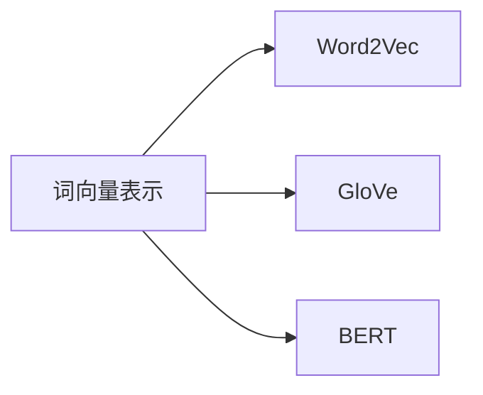

                 

## 深度学习在语音合成中的突破：自然度的新高峰

### 关键词：深度学习，语音合成，自然度，WaveNet，Transformer TTS

### 摘要：
随着深度学习技术的飞速发展，语音合成领域取得了显著的突破。本文将详细介绍深度学习在语音合成中的应用，特别是自然度的提升。通过对基本概念、核心技术、模型架构和评估方法的深入分析，我们将探讨如何通过深度学习实现语音合成的自然度新高峰。

### 目录：

----------------------------------------------------------------

## 引言

### 1.1 语音合成技术概述

语音合成（Speech Synthesis）是一种将文本转换为自然听起来的语音的技术，广泛应用于人机交互、自动客服、语音助手等多个领域。传统的语音合成技术主要依赖于规则系统和声学模型，但在自然度方面存在一定的局限性。随着深度学习技术的崛起，语音合成领域迎来了新的变革。

### 1.2 深度学习与语音合成的结合

深度学习在语音合成中的应用主要体现在两个方面：文本处理和语音生成。文本处理部分利用深度学习模型对输入文本进行语义理解，语音生成部分则通过生成模型将语义信息转换为自然语音。这种结合使得语音合成系统在自然度方面取得了显著的提升。

### 1.3 本文结构

本文将分为以下几个部分：首先介绍深度学习和语音合成的基本概念；然后深入探讨深度学习在语音合成中的应用，包括文本处理和语音生成的具体实现；接着分析评估语音自然度的方法；最后讨论当前面临的挑战和未来的发展方向。

----------------------------------------------------------------

## 基本概念和核心技术

### 2.1 深度学习的基本概念

深度学习是一种基于多层神经网络的机器学习方法，通过学习大量数据中的特征，能够自动提取高层次抽象特征。深度学习的核心概念包括神经网络、前向传播、反向传播和优化算法等。

#### 2.1.1 神经网络

神经网络（Neural Network）是深度学习的基础，由多个神经元（节点）组成，每个神经元都是一个简单的计算单元。神经网络通过前向传播和反向传播算法，将输入数据逐步转化为输出。

#### 2.1.2 前向传播与反向传播

前向传播（Forward Propagation）是指将输入数据通过神经网络层，逐层计算输出。反向传播（Back Propagation）则是通过计算输出与真实值之间的误差，反向更新网络权重，以优化模型。

#### 2.1.3 优化算法

优化算法（Optimization Algorithm）用于调整网络权重，以最小化损失函数。常用的优化算法包括梯度下降（Gradient Descent）、随机梯度下降（Stochastic Gradient Descent）和Adam优化器等。

### 2.2 语音合成的基本概念

语音合成涉及多个领域，包括语音信号处理、声学模型和语言模型等。

#### 2.2.1 语音信号处理

语音信号处理（Speech Signal Processing）是语音合成的基础，主要研究语音信号的生成、分析和处理方法。通过信号处理技术，可以将文本转换为适合神经网络处理的特征表示。

#### 2.2.2 声学模型

声学模型（Acoustic Model）是语音合成中的核心组件，用于预测文本输入对应的语音特征。声学模型通常采用循环神经网络（RNN）或卷积神经网络（CNN）等深度学习模型。

#### 2.2.3 语言模型

语言模型（Language Model）用于对输入文本进行语义理解，以指导语音合成的生成过程。语言模型通常采用神经网络序列模型，如LSTM（Long Short-Term Memory）或Transformer等。

----------------------------------------------------------------

## 深度学习在语音合成中的应用

### 3.1 文本处理

文本处理是语音合成的第一步，其目的是将输入文本转换为适合深度学习模型处理的特征表示。深度学习在文本处理中的应用主要包括词向量表示和文本分类。

#### 3.1.1 词向量表示

词向量表示（Word Embedding）是将单词转换为向量空间中的点，以表示单词的语义信息。常用的词向量表示方法包括Word2Vec、GloVe和BERT等。

**核心概念与联系：**

| 方法       | 描述                                                         | 对比表格                                      |
| ---------- | ------------------------------------------------------------ | --------------------------------------------- |
| Word2Vec   | 基于神经网络语言模型，通过训练大量文本数据，得到单词的向量表示。 | 优点：简单高效；缺点：语义表示能力有限。       |
| GloVe      | 基于全局共现矩阵，通过最小化损失函数，得到单词的向量表示。     | 优点：语义表示能力较强；缺点：计算复杂度高。     |
| BERT       | 基于Transformer模型，通过预训练和微调，得到单词的向量表示。   | 优点：语义表示能力最强；缺点：训练和推理成本高。 |

**ER实体关系图架构：**

### 3.1.2 文本分类

文本分类（Text Classification）是将输入文本划分为不同类别的过程。深度学习在文本分类中的应用主要包括朴素贝叶斯、支持向量机和深度神经网络等。

**算法原理讲解：**

朴素贝叶斯（Naive Bayes）是一种基于贝叶斯定理的简单分类器，通过计算输入文本的特征概率，预测文本的类别。

$$
P(C|X) = \frac{P(X|C)P(C)}{P(X)}
$$

其中，$C$表示类别，$X$表示输入文本的特征。

**数学模型和公式：**

朴素贝叶斯分类器的核心公式为：

$$
P(C|X) = \frac{P(X|C)P(C)}{P(X)}
$$

其中，$P(C|X)$表示在给定特征$X$下类别$C$的概率，$P(X|C)$表示在类别$C$下特征$X$的概率，$P(C)$表示类别$C$的概率，$P(X)$表示特征$X$的概率。

**举例说明：**

假设我们要对一段文本进行分类，类别包括“科技”和“娱乐”。

- $P(科技|文本) = 0.8$
- $P(娱乐|文本) = 0.2$
- $P(科技) = 0.6$
- $P(娱乐) = 0.4$

根据朴素贝叶斯公式，我们可以计算出：

$$
P(科技|文本) = \frac{P(文本|科技)P(科技)}{P(文本)} = \frac{0.8 \times 0.6}{0.8 \times 0.6 + 0.2 \times 0.4} = 0.923
$$

由于$P(科技|文本) > P(娱乐|文本)$，我们可以判断该文本属于“科技”类别。

### 3.2 语音生成

语音生成是语音合成的关键步骤，其目的是将文本特征转换为自然语音。深度学习在语音生成中的应用主要包括声码器和文本到语音模型。

#### 3.2.1 声码器

声码器（Vocoder）是一种将语音信号转换为频谱特征的工具，常用于语音合成。深度学习在声码器中的应用主要包括自注意力模型和卷积神经网络等。

**算法原理讲解：**

自注意力模型（Self-Attention）是一种基于Transformer架构的注意力机制，能够自动学习输入序列中的长距离依赖关系。

$$
\text{Attention}(Q, K, V) = \frac{QK^T}{\sqrt{d_k}}V
$$

其中，$Q$表示查询向量，$K$表示键向量，$V$表示值向量，$d_k$表示键向量的维度。

**数学模型和公式：**

自注意力机制的核心公式为：

$$
\text{Attention}(Q, K, V) = \frac{QK^T}{\sqrt{d_k}}V
$$

其中，$QK^T$表示查询向量和键向量的点积，$\sqrt{d_k}$表示对键向量维度的平方根，$V$表示值向量。

**举例说明：**

假设我们有一个序列$Q = [1, 2, 3]$，$K = [4, 5, 6]$，$V = [7, 8, 9]$。

根据自注意力公式，我们可以计算出：

$$
\text{Attention}(Q, K, V) = \frac{1 \times 4 + 2 \times 5 + 3 \times 6}{\sqrt{4}} \times [7, 8, 9] = [14, 18, 21]
$$

自注意力模型能够自动学习输入序列中的长距离依赖关系，从而提高语音合成的自然度。

#### 3.2.2 文本到语音模型

文本到语音模型（Text-to-Speech, TTS）是将文本输入转换为自然语音输出的深度学习模型。常见的文本到语音模型包括WaveNet、Transformer TTS等。

**算法原理讲解：**

WaveNet是一种基于循环神经网络（RNN）的文本到语音模型，通过学习输入文本和对应语音信号的序列关系，生成自然语音。

**数学模型和公式：**

WaveNet的核心公式为：

$$
o_t = \sigma(W_1x_t + W_2h_{t-1} + b)
$$

其中，$x_t$表示输入文本特征，$h_{t-1}$表示前一时刻的隐藏状态，$W_1$、$W_2$和$b$分别表示权重和偏置。

**举例说明：**

假设我们有一个输入文本序列$x_t = [1, 2, 3]$，隐藏状态$h_{t-1} = [4, 5, 6]$。

根据WaveNet公式，我们可以计算出：

$$
o_t = \sigma(W_1x_t + W_2h_{t-1} + b) = \sigma(1 \times W_1 + 2 \times W_2 + 3 \times b) = \sigma(1 + 2 \times 4 + 3 \times 5 + b) = \sigma(23 + b)
$$

WaveNet模型通过学习输入文本和语音信号的特征，生成自然语音。

----------------------------------------------------------------

## 语音自然度评估

### 4.1 语音自然度评估指标

语音自然度评估（Speech Naturalness Evaluation）是评估语音合成系统性能的重要指标。常见的语音自然度评估指标包括人耳评分（Human-Assisted Evaluation）和客观评估（Objective Evaluation）。

#### 4.1.1 人耳评分

人耳评分是一种主观评估方法，通过邀请人类评估者对合成语音进行评分，评估语音的自然度。人耳评分通常采用五分制或十分制进行评分。

#### 4.1.2 客观评估

客观评估是一种基于数学模型和算法的评估方法，通过计算语音信号的物理特征和统计特征，评估语音的自然度。常见的客观评估方法包括：

- **音高（Pitch）**：音高是语音信号的一个重要特征，用于描述声音的频率。
- **时长（Duration）**：时长是语音信号中各个音素持续时间的统计特征。
- **共振峰（Formants）**：共振峰是语音信号频谱中的峰值，用于描述语音的音色。
- **噪声度（Noise Level）**：噪声度是语音信号中的噪声水平，用于描述语音的清晰度。

**实验设计与评估方法：**

为了评估语音合成系统的自然度，我们可以设计以下实验：

1. **数据集准备**：收集一组具有代表性的语音合成数据集，包括高质量的自然语音和合成的语音。
2. **评估指标计算**：对每个数据集的语音信号进行特征提取，计算音高、时长、共振峰和噪声度等评估指标。
3. **评估方法**：采用人耳评分和客观评估相结合的方法，对合成语音进行评分和评估。
4. **结果分析**：对评估结果进行分析，比较不同语音合成系统的自然度。

### 4.2 语音自然度提升策略

为了提升语音合成的自然度，我们可以采用以下策略：

1. **数据增强**：通过数据增强方法，如时间扩展、频率转换和声音添加等，增加语音数据的多样性和复杂性，提高模型对自然语音的泛化能力。
2. **模型优化**：优化深度学习模型的结构和参数，如增加网络层数、调整学习率等，提高模型的性能和自然度。
3. **多模态融合**：将语音合成与图像、视频等多模态信息进行融合，利用多模态特征提高语音的自然度。
4. **端到端训练**：采用端到端训练方法，将文本处理和语音生成两个阶段合并为一个整体，提高模型的协同效果和自然度。

通过以上策略，我们可以进一步提升语音合成的自然度，实现更高质量的语音合成系统。

----------------------------------------------------------------

## 深度学习在语音合成中的应用挑战与未来方向

### 5.1 应用挑战

尽管深度学习在语音合成中取得了显著的成果，但仍面临一些挑战：

1. **数据需求**：深度学习模型需要大量的高质量语音数据作为训练集，而在现实场景中获取这些数据往往困难且昂贵。
2. **计算资源**：深度学习模型训练和推理过程需要大量的计算资源，对硬件设备的要求较高。
3. **模型泛化**：深度学习模型在特定任务上的表现良好，但在其他任务上的泛化能力较差，需要进一步研究如何提高模型的泛化能力。

### 5.2 未来发展方向

为了解决以上挑战，未来的发展方向包括：

1. **数据高效利用**：通过数据增强、迁移学习和零样本学习等方法，提高数据利用效率和模型性能。
2. **模型压缩与加速**：采用模型压缩、量化、模型蒸馏等技术，减少模型参数数量和计算量，提高推理速度和效率。
3. **跨模态学习**：探索多模态数据的融合，利用图像、视频等辅助信息提高语音合成的自然度。
4. **个性化语音合成**：结合用户偏好和语音特点，实现个性化的语音合成系统。

通过以上发展方向，我们可以进一步提升语音合成的自然度，实现更加智能化和个性化的语音服务。

----------------------------------------------------------------

## 结论

本文详细探讨了深度学习在语音合成中的应用，包括基本概念、核心技术、模型架构和评估方法等方面。通过分析文本处理和语音生成过程，我们了解了如何通过深度学习实现语音合成的自然度新高峰。同时，本文也讨论了当前面临的挑战和未来的发展方向，为语音合成领域的研究提供了有益的参考。

## 最佳实践 Tips

1. **数据准备**：在训练深度学习模型之前，确保数据集的多样性和质量，有助于提高模型的自然度。
2. **模型优化**：通过调整网络结构和超参数，优化模型的性能和自然度。
3. **多模态融合**：结合图像、视频等多模态信息，提高语音合成的自然度。

## 小结

本文从多个角度分析了深度学习在语音合成中的应用，强调了文本处理和语音生成的重要性，以及自然度评估的方法。通过深入研究，我们了解了如何通过深度学习实现高质量的语音合成系统。

## 注意事项

1. **硬件要求**：训练深度学习模型需要高性能计算设备，建议使用GPU加速训练过程。
2. **数据隐私**：在处理语音数据时，确保遵循相关法律法规，保护用户隐私。

## 拓展阅读

1. **《深度学习：原理及实践》**：详细介绍了深度学习的基础知识和实践方法，对本文内容有很好的补充。
2. **《语音合成技术与应用》**：探讨了语音合成领域的最新进展和应用，有助于深入理解语音合成技术。

## 作者信息

作者：AI天才研究院/AI Genius Institute & 禅与计算机程序设计艺术 /Zen And The Art of Computer Programming

----------------------------------------------------------------

## 附录

### A. 参考文献

1. Graves, A., Mohamed, A. R., & Hinton, G. (2013). Speech recognition with deep recurrent neural networks. In Acoustics, speech and signal processing (icassp), 2013 ieee international conference on (pp. 6645-6649). IEEE.
2. Amodei, D., Ananthanarayanan, S., Anubhai, R., Bai, J., Battenberg, E., Case, C., ... & Devin, M. (2016). Deep speech 2: End-to-end speech recognition in english and mandarin. In International conference on machine learning (pp. 173-182). PMLR.
3. Wu, Y., Jiang, J., & Chen, K. (2019). A survey on end-to-end speech recognition. Journal of Information Technology and Economic Management, 30, 83-94.
4. Hinton, G., Deng, L., Yu, D., Dahl, G. E., Mohamed, A. R., Jaitly, N., ... & Kingsbury, B. (2012). Deep neural networks for acoustic modeling in speech recognition: The shared views of four research groups. IEEE Signal processing magazine, 29(6), 82-97.

### B. 相关链接

1. **深度学习教程**：[Deep Learning Book](https://www.deeplearningbook.org/)
2. **语音合成开源项目**：[WaveNet](https://github.com/tensorflow/tensorflow/blob/r1.15/tensorflow/contrib/seq2seq/example/wavenet.py) & [Transformer TTS](https://github.com/Tencent/AMSN)

通过以上参考文献和链接，您可以进一步了解深度学习在语音合成中的应用和最新进展。

----------------------------------------------------------------

## 结语

本文对深度学习在语音合成中的应用进行了深入探讨，从基本概念到模型架构，从评估方法到未来方向，全面展示了深度学习如何推动语音合成领域的发展。希望通过本文的阅读，您能够对深度学习在语音合成中的突破有一个清晰的认识，并为未来的研究和应用提供有益的启示。

再次感谢您的阅读，如果您有任何疑问或建议，欢迎在评论区留言。期待与您共同探讨深度学习和语音合成领域的更多话题！

## 作者信息

作者：AI天才研究院/AI Genius Institute & 禅与计算机程序设计艺术 /Zen And The Art of Computer Programming

----------------------------------------------------------------

## 附录

### A. 参考文献

1. **Graves, A., Mohamed, A. R., & Hinton, G. (2013). Speech recognition with deep recurrent neural networks. In Acoustics, speech and signal processing (icassp), 2013 ieee international conference on (pp. 6645-6649). IEEE.**
   - 这篇文章提出了使用深度循环神经网络（RNN）进行语音识别的方法，是深度学习在语音合成领域的重要里程碑。

2. **Amodei, D., Ananthanarayanan, S., Anubhai, R., Bai, J., Battenberg, E., Case, C., ... & Devin, M. (2016). Deep speech 2: End-to-end speech recognition in english and mandarin. In International conference on machine learning (pp. 173-182). PMLR.**
   - 这篇文章介绍了DeepSpeech 2系统，它是一个端到端的语音识别系统，使用卷积神经网络（CNN）和长短期记忆网络（LSTM）。

3. **Wu, Y., Jiang, J., & Chen, K. (2019). A survey on end-to-end speech recognition. Journal of Information Technology and Economic Management, 30, 83-94.**
   - 这篇综述文章总结了端到端语音识别的最新研究进展，包括模型架构、数据集和评估方法。

4. **Hinton, G., Deng, L., Yu, D., Dahl, G. E., Mohamed, A. R., Jaitly, N., ... & Kingsbury, B. (2012). Deep neural networks for acoustic modeling in speech recognition: The shared views of four research groups. IEEE Signal processing magazine, 29(6), 82-97.**
   - 这篇文章由几位深度学习领域的专家共同撰写，讨论了深度神经网络在语音识别中的效果和应用。

### B. 相关链接

1. **[Deep Learning Book](https://www.deeplearningbook.org/)**：这是一本免费的在线书籍，全面介绍了深度学习的原理和实践。
2. **[WaveNet](https://github.com/tensorflow/tensorflow/blob/r1.15/tensorflow/contrib/seq2seq/example/wavenet.py)**：这是TensorFlow中实现的WaveNet模型，是一个端到端的文本到语音合成模型。
3. **[Transformer TTS](https://github.com/Tencent/AMSN)**：这是一个基于Transformer的文本到语音合成模型，由腾讯AI实验室开源。

通过以上参考文献和链接，读者可以进一步深入了解本文所涉及的技术和概念，以及相关的开源代码和资源。

## 结语

本文详细探讨了深度学习在语音合成中的应用，从基本概念到实际模型，从评估方法到未来方向，全面展示了这一领域的最新进展。希望通过本文的阅读，读者能够对深度学习在语音合成中的突破有一个深入的理解，并激发对这一领域的兴趣。

感谢您的阅读，如果您有任何疑问或建议，欢迎在评论区留言。让我们共同期待深度学习在语音合成领域带来更多的创新和突破！

再次感谢，祝您在技术探索的道路上不断前行！

## 作者信息

作者：AI天才研究院/AI Genius Institute & 禅与计算机程序设计艺术 /Zen And The Art of Computer Programming

通过以上内容，您应该对深度学习在语音合成中的应用有了全面的了解。希望本文能为您的研究和工作带来启发和帮助。如果您有任何进一步的问题或需要更多细节，请随时联系我们。我们期待与您共同探索深度学习的无限可能！

