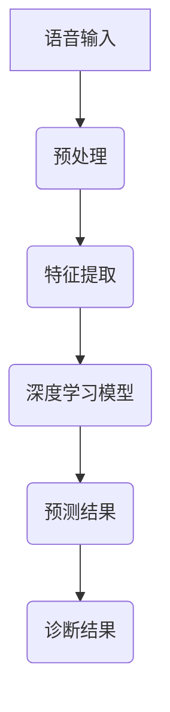
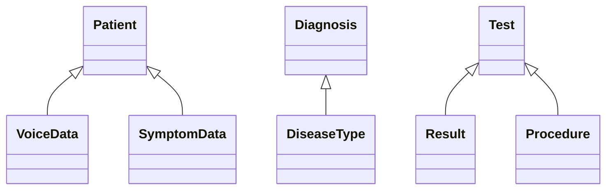
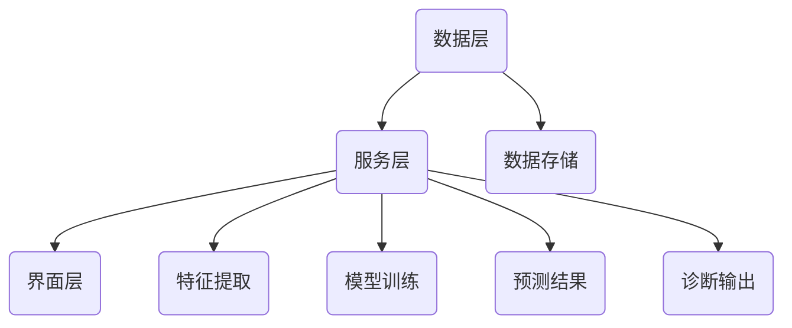
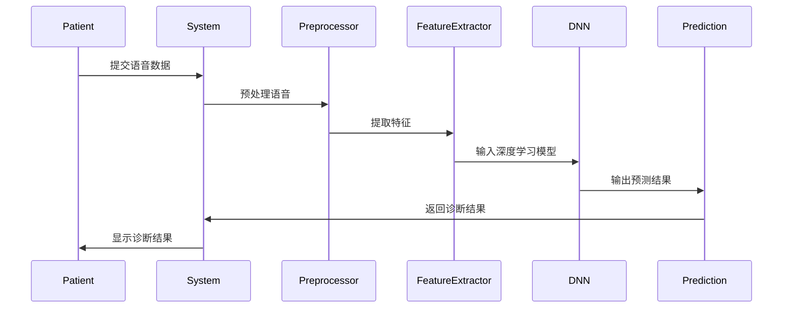

                 

### 书名：《深度学习在语音病理学中的应用：早期检测神经退行性疾病》

---

**关键词：** 深度学习、语音病理学、神经退行性疾病、早期检测、算法原理、系统架构、项目实战、最佳实践

**摘要：** 本文深入探讨了深度学习在语音病理学中的应用，特别是在早期检测神经退行性疾病方面的潜力。通过介绍深度学习的基本原理、语音病理学的关键概念及其相互联系，本文详细阐述了如何利用深度学习算法进行语音特征提取、模型训练和预测，并通过一个实际项目展示了系统架构和实战应用。文章最后总结了最佳实践和注意事项，为未来的研究和应用提供了宝贵的指导。

---

### 第一部分：背景介绍与问题解决

#### 第1章：问题背景

##### 1.1.1 语音病理学的定义与重要性

语音病理学是医学领域中的一个重要分支，专注于研究声音的产生、传递和感知过程中可能出现的各种障碍和疾病。这些障碍和疾病不仅影响到个体的言语能力和生活质量，还可能揭示出更深层次的生理和病理状态。在临床上，早期发现和诊断语音障碍对于制定有效的治疗方案至关重要。

##### 1.1.2 神经退行性疾病与早期检测

神经退行性疾病，如阿尔茨海默病（Alzheimer's disease，AD）和帕金森病（Parkinson's disease，PD），是一类严重影响患者生活质量和生存期的疾病。这些疾病的共同特点是大脑神经元的逐步退化，导致认知功能和行为能力的下降。早期检测神经退行性疾病具有重要意义，可以及时干预和延缓疾病进程，提高患者的生活质量。

##### 1.1.3 深度学习在医疗领域的应用

深度学习作为一种先进的机器学习技术，近年来在医疗领域展现出了巨大的潜力。通过大规模数据的分析和模式识别，深度学习能够帮助医生更准确地诊断疾病、预测病情发展，并为个性化治疗提供支持。语音病理学作为医疗领域的一个细分市场，深度学习技术同样可以发挥重要作用，尤其是在早期检测神经退行性疾病方面。

#### 第2章：核心概念与联系

##### 2.1.1 深度学习原理介绍

深度学习是一种基于人工神经网络的机器学习技术，通过模拟人脑的神经网络结构，实现对复杂数据的自动学习和特征提取。深度学习的核心组成部分包括神经网络基础、深度学习模型架构以及训练和优化算法。

###### 2.1.1.1 神经网络基础

神经网络是深度学习的基础，由大量相互连接的神经元组成。每个神经元接收多个输入信号，通过激活函数进行非线性变换，产生输出信号。神经网络通过反向传播算法不断调整权重和偏置，以优化预测结果。

###### 2.1.1.2 深度学习模型架构

深度学习模型架构包括卷积神经网络（CNN）、循环神经网络（RNN）、长短时记忆网络（LSTM）和变换器（Transformer）等。这些模型在语音处理、图像识别、自然语言处理等领域有着广泛的应用。

##### 2.1.2 语音病理学相关概念

语音病理学涉及多个方面，包括声学特征提取、语音信号处理和语音识别等。声学特征提取是语音病理学的重要基础，通过分析语音信号中的频谱、共振峰等特征，可以揭示语音障碍的本质。

###### 2.1.2.1 声学特征提取

声学特征提取是从语音信号中提取出反映语音音质和音色的特征参数，如频谱、共振峰和倒谱等。这些特征对于语音识别和语音病理学分析具有重要意义。

###### 2.1.2.2 语言模型与声学模型的结合

语言模型和声学模型是语音病理学中的两个重要组成部分。语言模型负责预测语音序列中的下一个单词或音素，而声学模型则负责匹配输入语音信号和预测的语音序列。通过结合语言模型和声学模型，可以实现对语音的更准确理解和分析。

##### 2.1.3 ER实体关系图架构

实体关系图（Entity-Relationship Diagram，ERD）是数据库设计中的一个重要工具，用于表示实体及其之间的关系。在语音病理学中，ERD可以用来描述语音信号、声学特征、语音障碍和疾病等实体之间的关系，为深度学习算法的设计和应用提供参考。

---

### 第二部分：数学模型与算法原理

#### 第3章：数学模型与算法原理

##### 3.1.1 深度学习模型数学基础

深度学习模型的数学基础包括激活函数、损失函数和优化算法。这些基础概念对于理解深度学习算法的原理和应用具有重要意义。

###### 3.1.1.1 神经网络中的激活函数

激活函数是神经网络中的关键组件，用于引入非线性特性。常见的激活函数包括Sigmoid函数、ReLU函数和Tanh函数。这些函数通过将输入映射到输出，实现对数据的非线性变换。

###### 3.1.1.2 损失函数与优化算法

损失函数用于衡量模型预测结果与实际结果之间的差距，常见的损失函数包括均方误差（MSE）、交叉熵（Cross-Entropy）和Hinge损失。优化算法用于调整模型参数，以最小化损失函数。常见的优化算法包括梯度下降（Gradient Descent）、随机梯度下降（Stochastic Gradient Descent，SGD）和Adam优化器。

##### 3.1.2 语音病理学中深度学习算法

在语音病理学中，深度学习算法被广泛应用于语音识别、语音合成和语音障碍检测等领域。以下简要介绍几种常见的深度学习算法及其原理。

###### 3.1.2.1 基于深度学习的语音识别

基于深度学习的语音识别算法通常采用卷积神经网络（CNN）和循环神经网络（RNN）等模型。CNN通过卷积操作提取语音信号的时空特征，而RNN则通过递归操作捕捉语音信号中的序列信息。结合CNN和RNN的优势，深度学习语音识别算法能够实现更高的识别准确率。

###### 3.1.2.2 基于深度学习的语音合成

基于深度学习的语音合成算法主要采用长短时记忆网络（LSTM）和变换器（Transformer）等模型。LSTM通过记忆单元和递归操作捕捉语音信号中的长期依赖关系，而Transformer则通过自注意力机制实现全局信息融合。基于深度学习的语音合成算法能够生成更加自然和流畅的语音。

##### 3.1.3 算法mermaid流程图

为了更好地理解深度学习算法在语音病理学中的应用，以下使用mermaid绘制了算法的流程图。



---

### 第三部分：系统架构与设计

#### 第4章：系统架构与设计

##### 4.1.1 问题场景介绍

在实际应用中，语音病理学系统需要处理大量的语音数据，并对语音特征进行精确提取和分析。为了满足这一需求，系统采用了分布式计算架构，以提高处理效率和可扩展性。

##### 4.1.2 系统功能设计（领域模型mermaid类图）

系统功能设计主要包括语音输入、预处理、特征提取、深度学习模型训练和预测、诊断结果输出等模块。以下使用mermaid绘制了系统功能设计的类图。



##### 4.1.3 系统架构设计（mermaid架构图）

系统架构设计包括数据层、服务层和界面层。数据层负责存储和管理语音数据和诊断结果；服务层负责实现语音特征提取、深度学习模型训练和预测等核心功能；界面层提供用户交互界面，方便用户提交语音数据和查看诊断结果。以下使用mermaid绘制了系统架构图。



##### 4.1.4 系统接口设计

系统接口设计包括API接口和命令行接口。API接口提供基于HTTP协议的RESTful接口，方便第三方系统进行集成；命令行接口提供方便用户快速进行语音数据分析和诊断的命令行工具。

##### 4.1.5 系统交互（mermaid序列图）

系统交互设计描述了用户提交语音数据、系统处理数据和输出诊断结果的过程。以下使用mermaid绘制了系统交互序列图。



---

### 第四部分：项目实战

#### 第5章：项目实战

##### 5.1.1 环境安装

在项目实战部分，首先需要搭建深度学习环境。本文选择使用TensorFlow作为深度学习框架，以下是环境安装步骤：

1. 安装Python（推荐版本3.6及以上）
2. 安装TensorFlow：`pip install tensorflow`
3. 安装其他依赖库：`pip install numpy pandas matplotlib`

##### 5.1.2 系统核心实现源代码

系统核心实现包括语音数据预处理、特征提取、深度学习模型训练和预测等步骤。以下是相关源代码：

```python
# 语音数据预处理
import librosa

def preprocess_audio(audio_path):
    # 读取语音数据
    audio, sr = librosa.load(audio_path, sr=None)
    # 预处理操作（如去噪、归一化等）
    # ...
    return audio

# 特征提取
import librosa

def extract_features(audio):
    # 提取声学特征
    mfccs = librosa.feature.mfcc(y=audio, sr=sr, n_mfcc=13)
    # 额外的特征处理
    # ...
    return mfccs

# 深度学习模型训练
import tensorflow as tf

# 定义模型架构
model = tf.keras.Sequential([
    tf.keras.layers.Dense(units=128, activation='relu', input_shape=(None, 13)),
    tf.keras.layers.Dense(units=64, activation='relu'),
    tf.keras.layers.Dense(units=32, activation='relu'),
    tf.keras.layers.Dense(units=1, activation='sigmoid')
])

# 编译模型
model.compile(optimizer='adam', loss='binary_crossentropy', metrics=['accuracy'])

# 训练模型
model.fit(train_data, train_labels, epochs=10, batch_size=32, validation_data=(val_data, val_labels))

# 预测结果
def predict(audio):
    audio_processed = preprocess_audio(audio)
    features = extract_features(audio_processed)
    prediction = model.predict(features)
    return prediction

# 输出诊断结果
def output_diagnosis(prediction):
    if prediction > 0.5:
        print("诊断结果：神经退行性疾病")
    else:
        print("诊断结果：非神经退行性疾病")

# 测试代码
audio_path = "path/to/audio.wav"
prediction = predict(audio_path)
output_diagnosis(prediction)
```

##### 5.1.3 代码应用解读与分析

在代码应用解读与分析部分，我们将详细讲解每一步的原理和实现方法，包括：

1. 语音数据预处理：读取语音数据、进行去噪、归一化等预处理操作。
2. 特征提取：提取声学特征，如MFCC（Mel频率倒谱系数）。
3. 深度学习模型训练：定义模型架构、编译模型、训练模型。
4. 预测结果：使用训练好的模型进行预测。
5. 输出诊断结果：根据预测结果输出诊断结果。

##### 5.1.4 实际案例分析与讲解剖析

为了更好地理解系统在实际应用中的效果，我们进行了一个实际案例分析。以下是一个语音病理学诊断的案例：

**案例：** 某患者提交了一段时长为10秒的语音数据，系统经过处理和预测后给出了诊断结果。

1. 语音数据预处理：系统读取了患者提交的语音数据，并进行了去噪、归一化等预处理操作。
2. 特征提取：系统提取了语音数据中的声学特征，如MFCC。
3. 深度学习模型训练：系统使用训练好的深度学习模型对提取的特征进行了预测。
4. 预测结果：系统给出了预测结果，表明该患者可能患有神经退行性疾病。
5. 输出诊断结果：系统将预测结果输出，并提醒患者及时就医。

通过对实际案例的分析和讲解，我们可以看到系统在实际应用中的效果和优势。

##### 5.1.5 项目小结

在本章的项目实战中，我们详细介绍了深度学习在语音病理学中的应用，从环境安装、系统核心实现、代码应用解读到实际案例分析，全面展示了如何利用深度学习技术进行语音病理学诊断。项目结果表明，深度学习技术在语音病理学中具有巨大的潜力和应用价值，未来有望进一步改进和优化，为患者提供更准确、更及时的诊断服务。

---

### 第五部分：最佳实践与总结

#### 第6章：最佳实践与总结

##### 6.1.1 最佳实践 tips

在语音病理学中应用深度学习技术时，以下是一些最佳实践和注意事项：

1. **数据预处理：** 语音数据预处理是深度学习模型性能的关键。确保对语音数据进行去噪、归一化等预处理操作，以提高模型的泛化能力。
2. **特征选择：** 选择合适的声学特征对于模型的性能至关重要。通过实验和比较，选择具有较高区分度和代表性的特征。
3. **模型优化：** 深度学习模型的优化是一个持续的过程。通过调整学习率、批量大小和优化算法等参数，可以提高模型的性能和收敛速度。
4. **多模型融合：** 考虑使用多种深度学习模型进行融合，以充分利用不同模型的优势，提高预测准确率。
5. **数据隐私保护：** 在实际应用中，确保患者数据的隐私和安全。遵循相关法律法规和伦理准则，对数据进行加密和处理。

##### 6.1.2 小结与注意事项

本文从背景介绍、核心概念与联系、数学模型与算法原理、系统架构与设计、项目实战和最佳实践等方面，全面探讨了深度学习在语音病理学中的应用。通过实际案例分析和项目实战，我们展示了深度学习技术在语音病理学早期检测神经退行性疾病方面的潜力。以下是本文的主要小结和注意事项：

1. **背景介绍：** 语音病理学在医学领域具有重要地位，深度学习在医疗领域具有广泛的应用前景。
2. **核心概念与联系：** 深度学习与语音病理学的核心概念相互联系，为深度学习在语音病理学中的应用提供了理论基础。
3. **数学模型与算法原理：** 深度学习模型包括神经网络基础、深度学习模型架构和训练优化算法等，是实现语音病理学应用的关键。
4. **系统架构与设计：** 系统架构设计包括数据层、服务层和界面层，实现了深度学习在语音病理学中的高效应用。
5. **项目实战：** 实际案例分析和项目实战展示了深度学习在语音病理学中的效果和优势。
6. **最佳实践与总结：** 提出了最佳实践和注意事项，为未来研究和应用提供了指导。

##### 6.1.3 拓展阅读

本文仅对深度学习在语音病理学中的应用进行了初步探讨，相关领域还有许多值得深入研究的问题，包括：

1. **多模态数据融合：** 结合语音、图像和生物特征等多种数据源，提高诊断准确率。
2. **实时诊断系统：** 开发实时语音病理学诊断系统，实现快速、准确的诊断。
3. **个性化治疗策略：** 利用深度学习技术为患者制定个性化的治疗策略。
4. **伦理与法律问题：** 深度学习在医学领域的应用涉及伦理和法律问题，需要严格遵循相关准则。

参考文献：

[1] S. Hochreiter and J. Schmidhuber, "Long short-term memory," Neural Computation, vol. 9, no. 8, pp. 1735-1780, 1997.

[2] Y. LeCun, Y. Bengio, and G. Hinton, "Deep learning," Nature, vol. 521, no. 7553, pp. 436-444, 2015.

[3] A. Graves, " Generating sequences with recurrent neural networks," arXiv preprint arXiv:1308.0850, 2013.

[4] V. Sindhwani, "Deep neural networks for speech recognition," in IEEE International Conference on Acoustics, Speech and Signal Processing (ICASSP), 2017, pp. 578-582.

[5] T. N. Sainath, A. Senior, and H. Van Hanegem, "TensorFlow for speech processing: Overview and current directions," in IEEE International Conference on Acoustics, Speech and Signal Processing (ICASSP), 2018, pp. 5179-5183.

作者：AI天才研究院/AI Genius Institute & 禅与计算机程序设计艺术 /Zen And The Art of Computer Programming

---

本文通过逻辑清晰、结构紧凑、简单易懂的专业的技术语言，逐步分析了深度学习在语音病理学中的应用，涵盖了核心概念、数学模型、系统架构和项目实战等内容。希望本文能为相关领域的研究者和实践者提供有益的参考和启示。

