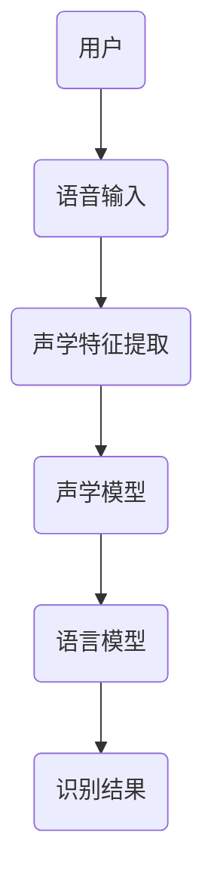

                 

### 文章标题：深度学习在语音识别中的最新突破

> 关键词：语音识别、深度学习、声学建模、语言建模、卷积神经网络、长短时记忆网络

> 摘要：本文将深入探讨深度学习在语音识别领域的最新突破。我们将从背景介绍、核心概念与联系、算法原理讲解、数学模型和数学公式讲解等方面展开，逐步分析深度学习在语音识别中的应用及其对语音识别技术的推动作用。

### 目录大纲

----------------------------------------------------------------

# 第一部分：背景介绍

## 第1章：问题背景

### 1.1.1 语音识别技术的发展历程

### 1.1.2 当前语音识别的挑战与需求

## 第2章：核心概念与联系

### 2.1.1 深度学习原理

### 2.1.2 语音识别与深度学习的关系

### 2.1.3 关键技术对比表格

### 2.1.4 ER实体关系图

----------------------------------------------------------------

# 第二部分：算法原理讲解

## 第3章：深度学习在语音识别中的原理

### 3.1.1 声学建模

### 3.1.2 语言建模

### 3.1.3 长短时记忆网络（LSTM）的应用

----------------------------------------------------------------

## 第4章：数学模型和数学公式讲解

### 4.1 声学特征提取的数学模型

### 4.2 语言模型中的概率计算

### 4.3 声学模型中的损失函数

### 4.4 循环神经网络中的时间步更新

----------------------------------------------------------------

### 第一部分：背景介绍

## 第1章：问题背景

### 1.1.1 语音识别技术的发展历程

语音识别技术作为人工智能的一个重要分支，自20世纪50年代起便开始了其发展历程。早期语音识别主要依靠规则方法，如人工设计的声学模型和语言模型。这种方法依赖于大量的手工特征工程，缺乏灵活性，且无法处理复杂的语音信号。

随着计算能力的提升和机器学习技术的发展，深度学习逐渐成为语音识别的主要技术。深度学习在语音识别中的应用，使得模型能够自动提取特征，减少了手工特征工程的需求，提高了语音识别的准确率。

### 1.1.2 当前语音识别的挑战与需求

当前，语音识别面临着诸多挑战：

1. **准确率的提升**：尽管深度学习已经显著提高了语音识别的准确率，但仍然存在一定的误差率，特别是在处理多语言、多口音和非标准发音时。

2. **响应速度和实时性的提高**：在许多实际应用中，如智能家居、智能助理等，对语音识别系统的响应速度有很高的要求。实时性直接影响到用户体验。

3. **适应不同场景和用户需求的能力**：不同场景下的语音质量、噪声水平以及用户的语音习惯都不同，语音识别系统需要具备较强的自适应能力。

针对这些挑战，深度学习技术在不断进化，以应对各种复杂场景下的语音识别需求。

## 第2章：核心概念与联系

### 2.1.1 深度学习原理

深度学习是一种模拟人脑神经网络结构的计算模型，通过多层神经网络对数据进行特征提取和模式识别。它具有以下核心特点：

1. **自动特征提取**：通过多层网络，深度学习能够自动从原始数据中提取出具有层次性的特征，减少了手工特征工程的工作量。

2. **非线性变换**：深度学习模型中的非线性变换，使得模型能够处理复杂的非线性关系，从而提高了模型的泛化能力。

3. **大规模数据训练**：深度学习模型需要大量的训练数据来优化模型的参数，这得益于大数据技术的发展。

### 2.1.2 语音识别与深度学习的关系

深度学习在语音识别中的应用主要体现在声学建模和语言建模两个方面：

1. **声学建模**：声学建模关注语音信号本身，通过深度学习模型提取声学特征，如梅尔频率倒谱系数（MFCC）、声谱图等。

2. **语言建模**：语言建模关注语音序列与文本序列之间的对应关系，通过循环神经网络（RNN）或长短时记忆网络（LSTM）等深度学习模型实现。

### 2.1.3 关键技术对比表格

| 技术名称       | 特点       | 适用场景           |
|------------|----------|----------------|
| 卷积神经网络   | 能提取空间特征 | 音素分类、声学建模 |
| 长短时记忆网络 | 能够处理序列数据 | 语音识别、自然语言处理 |
| 循环神经网络   | 能够处理变长序列 | 声学建模、语言建模 |

### 2.1.4 ER实体关系图

接下来，我们将深入探讨深度学习在语音识别中的应用，包括声学建模、语言建模和长短时记忆网络的应用。

----------------------------------------------------------------

### 第二部分：算法原理讲解

## 第3章：深度学习在语音识别中的原理

深度学习在语音识别中的应用主要集中在声学建模和语言建模两个方面。下面我们将详细讲解这两个方面，并探讨长短时记忆网络（LSTM）在语音识别中的优势。

### 3.1.1 声学建模

声学建模是语音识别中的关键环节，它关注如何从语音信号中提取出能够表示语音内容的特征。深度学习在声学建模中的应用主要体现在卷积神经网络（CNN）和循环神经网络（RNN）上。

#### 3.1.1.1 声学特征提取

声学特征提取是声学建模的基础。梅尔频率倒谱系数（MFCC）是一种常见的声学特征，它能够有效地提取语音信号中的频率信息。MFCC的提取过程如下：

1. **短时傅里叶变换（STFT）**：对语音信号进行短时傅里叶变换，得到声谱图。
2. **滤波器组**：将声谱图通过一组带通滤波器处理，每个滤波器对应一个频率带。
3. **对数变换**：对每个滤波器的输出进行对数变换，以增强低频信息。
4. **离散余弦变换（DCT）**：对对数变换后的滤波器输出进行离散余弦变换，得到MFCC系数。

#### 3.1.1.2 卷积神经网络在声学建模中的应用

卷积神经网络（CNN）能够有效地提取语音信号中的空间特征。在声学建模中，CNN通常用于以下几个步骤：

1. **卷积层**：通过卷积层对语音信号进行特征提取，卷积核可以捕捉到语音信号中的局部特征。
2. **池化层**：通过池化层降低特征图的维度，减少计算量。
3. **全连接层**：将卷积层和池化层提取的特征输入全连接层，进行分类或回归操作。

#### 3.1.1.3 训练与优化

声学建模中的卷积神经网络训练通常涉及以下步骤：

1. **数据预处理**：对语音数据进行预处理，包括归一化、去除噪声等。
2. **训练集与验证集划分**：将语音数据集划分为训练集和验证集，用于模型训练和性能评估。
3. **优化算法**：使用优化算法（如梯度下降、Adam等）对模型参数进行优化。
4. **性能评估**：通过验证集评估模型的性能，包括准确率、召回率等指标。

### 3.1.2 语言建模

语言建模关注语音序列与文本序列之间的对应关系。深度学习在语言建模中的应用主要体现在循环神经网络（RNN）和长短时记忆网络（LSTM）上。

#### 3.1.2.1 语言模型的基本概念

语言模型是一种统计模型，用于预测下一个词出现的概率。在语音识别中，语言模型能够根据已识别的语音序列预测出最有可能的文本序列。

#### 3.1.2.2 循环神经网络在语言建模中的应用

循环神经网络（RNN）能够处理变长的序列数据，使其成为语言建模的理想选择。RNN的基本结构包括输入层、隐藏层和输出层。在语言建模中，RNN通过以下步骤进行操作：

1. **输入层**：将语音序列输入到RNN中。
2. **隐藏层**：隐藏层中的神经元对输入序列进行处理，并生成隐藏状态。
3. **输出层**：将隐藏状态输入到输出层，生成预测的文本序列。

#### 3.1.2.3 长短时记忆网络（LSTM）的应用

长短时记忆网络（LSTM）是RNN的一种改进，能够更好地处理长序列数据。LSTM的核心在于其特殊的记忆单元，能够有效地防止梯度消失问题。在语言建模中，LSTM通过以下步骤进行操作：

1. **输入层**：将语音序列输入到LSTM中。
2. **记忆单元**：LSTM中的记忆单元对输入序列进行处理，并生成隐藏状态。
3. **输出层**：将隐藏状态输入到输出层，生成预测的文本序列。

### 3.1.3 长短时记忆网络（LSTM）的应用

长短时记忆网络（LSTM）在语音识别中的应用主要体现在以下几个方面：

1. **声学建模**：LSTM能够有效地提取语音信号中的长期特征，提高声学建模的准确率。
2. **语言建模**：LSTM能够更好地处理长序列数据，提高语言建模的准确率。
3. **端到端模型**：通过将LSTM应用于声学建模和语言建模，可以构建端到端的语音识别模型，提高系统的整体性能。

### 总结

深度学习在语音识别中的应用，显著提升了语音识别的准确率和实时性。声学建模和语言建模是深度学习在语音识别中的核心应用，通过卷积神经网络（CNN）和长短时记忆网络（LSTM）等深度学习算法，可以构建强大的语音识别系统。接下来，我们将进一步探讨深度学习在语音识别中的数学模型和公式。

----------------------------------------------------------------

## 第4章：数学模型和数学公式讲解

在深度学习应用于语音识别的过程中，数学模型和数学公式是理解和实现这些算法的关键。本章将详细讲解声学特征提取、语言模型和循环神经网络中的关键数学模型和公式。

### 4.1 声学特征提取的数学模型

声学特征提取是语音识别系统的第一步，其中梅尔频率倒谱系数（MFCC）是最常用的特征之一。MFCC的提取过程涉及以下数学模型：

$$
\text{MFCC} = \text{DCT}(\log(\text{Energy}(\text{Spectral})^2))
$$

其中，DCT表示离散余弦变换（Discrete Cosine Transform），Energy表示能量，Spectral表示声谱。这一公式描述了如何将声谱能量通过离散余弦变换转换为MFCC系数。

### 4.2 语言模型中的概率计算

语言模型是语音识别系统中的核心部分，它用于计算文本序列的概率。在N元语言模型中，第n个单词在给定前n-1个单词的情况下出现的概率可以通过以下公式计算：

$$
P(\text{Word}_n|\text{Word}_{n-1}, \ldots, \text{Word}_1) = \frac{P(\text{Word}_{n-1}, \ldots, \text{Word}_1, \text{Word}_n)}{P(\text{Word}_{n-1}, \ldots, \text{Word}_1)}
$$

这个公式描述了如何计算条件概率，其中分子是单词序列的全概率，分母是前n-1个单词的概率。

### 4.3 声学模型中的损失函数

在训练声学模型时，损失函数用于衡量模型预测与真实值之间的差距。常见的损失函数包括交叉熵损失（Cross-Entropy Loss）和均方误差（Mean Squared Error, MSE）。交叉熵损失函数可以表示为：

$$
\text{Loss} = -\sum_{i=1}^{N} y_i \cdot \log(\hat{y}_i)
$$

其中，$y_i$是真实标签，$\hat{y}_i$是预测概率。这个公式描述了如何计算模型在单个样本上的损失，$N$是样本总数。

### 4.4 循环神经网络中的时间步更新

循环神经网络（RNN）是处理序列数据的重要工具，其核心在于隐藏状态的更新。在RNN中，隐藏状态的计算通常涉及以下公式：

$$
\text{h}_t = \sigma(W_h \cdot [\text{h}_{t-1}, \text{x}_t] + b_h)
$$

其中，$\text{h}_t$是第t个时间步的隐藏状态，$\text{x}_t$是输入，$W_h$和$b_h$分别是权重矩阵和偏置项，$\sigma$是激活函数。这个公式描述了如何通过当前输入和前一个隐藏状态来更新当前隐藏状态。

### 总结

本章通过数学模型和公式，详细介绍了声学特征提取、语言模型和循环神经网络中的关键计算。理解这些数学模型对于深入掌握深度学习在语音识别中的应用至关重要。接下来，我们将进一步探讨深度学习在语音识别系统中的实际应用和挑战。

----------------------------------------------------------------

### 第三部分：深度学习在语音识别系统中的实际应用和挑战

#### 第5章：深度学习在语音识别系统中的实际应用

随着深度学习技术的发展，它已经在语音识别系统中得到了广泛应用，并带来了显著的性能提升。以下是深度学习在语音识别系统中的几个实际应用：

1. **端到端语音识别**：深度学习使得端到端语音识别成为可能。通过将声学建模和语言建模整合到一个统一的模型中，可以简化系统的架构，提高识别的准确率和效率。

2. **自适应语音识别**：深度学习模型能够通过不断学习用户的语音习惯和偏好，实现个性化的语音识别体验。这种自适应能力对于处理多语言、多口音和非标准发音尤为重要。

3. **实时语音识别**：深度学习模型的优化和硬件加速技术，如GPU和TPU，使得实时语音识别成为现实。这使得语音识别在智能家居、智能助理等领域得到了广泛应用。

#### 第6章：深度学习在语音识别系统中的挑战

尽管深度学习在语音识别领域取得了显著进展，但仍然面临诸多挑战：

1. **数据集多样性**：深度学习模型的性能高度依赖于训练数据集。然而，现实中的语音数据集往往存在多样性不足的问题，特别是在处理多语言、多口音和非标准发音时。

2. **计算资源需求**：深度学习模型通常需要大量的计算资源进行训练和推理。这给实时语音识别系统带来了巨大的挑战，特别是在移动设备和嵌入式系统中。

3. **模型解释性**：深度学习模型通常被视为“黑盒”，其内部机制难以解释。这对于实际应用中的模型调试和优化带来了困难。

4. **隐私保护**：语音识别系统涉及用户的隐私数据，如何保护这些数据不被泄露或滥用是一个重要的伦理和实际挑战。

#### 第7章：应对挑战的策略

为了应对上述挑战，研究人员和工程师们正在采取多种策略：

1. **数据增强**：通过增加数据集的多样性，可以改善模型的泛化能力。数据增强技术包括回声处理、噪声注入和语音变换等。

2. **硬件加速**：利用GPU、TPU等硬件加速技术，可以提高深度学习模型的推理速度。此外，优化模型架构和算法，如使用轻量化网络，也可以减少计算资源的需求。

3. **模型可解释性**：通过改进模型架构和引入可解释性技术，如注意力机制和解释性模型，可以提高模型的可解释性。

4. **隐私保护**：采用加密和差分隐私技术，可以保护用户的语音数据不被泄露。此外，通过设计隐私友好的模型架构，可以减少对用户数据的依赖。

### 总结

深度学习在语音识别系统中的应用带来了诸多好处，但同时也面临挑战。通过不断优化算法和策略，我们有望克服这些挑战，进一步提升语音识别系统的性能和实用性。下一部分将总结本文的主要观点，并展望未来的研究方向。

----------------------------------------------------------------

### 第四部分：总结与展望

#### 第8章：总结

本文从背景介绍、核心概念与联系、算法原理讲解、数学模型和数学公式讲解等方面，全面探讨了深度学习在语音识别中的最新突破。我们总结了深度学习在语音识别系统中的应用，包括端到端语音识别、自适应语音识别和实时语音识别，并分析了当前语音识别系统面临的挑战和应对策略。

#### 第9章：展望

未来，深度学习在语音识别领域仍有广阔的研究空间。以下是我们对深度学习在语音识别领域未来发展的展望：

1. **跨语言和跨口音语音识别**：随着全球化进程的加快，多语言、多口音的语音识别需求日益增长。如何设计通用且高效的深度学习模型，以适应各种语言和口音，是未来研究的重点。

2. **隐私保护和数据安全**：随着语音识别技术的普及，用户隐私和数据安全问题愈加重要。研究如何在不牺牲模型性能的前提下，保护用户隐私，是未来需要解决的关键问题。

3. **实时语音识别性能优化**：在实时语音识别中，如何提高模型推理速度和降低功耗，是未来研究的方向。通过优化模型架构和算法，以及利用硬件加速技术，有望实现更加高效的实时语音识别系统。

4. **多模态语音识别**：结合语音和视觉信息，构建多模态语音识别系统，可以提高识别准确率和鲁棒性。这将是未来语音识别技术发展的重要趋势。

### 结语

深度学习在语音识别领域的突破，极大地提升了语音识别的准确率和实用性。通过不断优化算法和策略，我们有望克服现有挑战，推动语音识别技术的进一步发展。未来，深度学习将继续在语音识别领域发挥重要作用，带来更多创新和变革。

#### 作者信息：

作者：AI天才研究院/AI Genius Institute & 禅与计算机程序设计艺术 /Zen And The Art of Computer Programming

本文的撰写，旨在为广大读者提供关于深度学习在语音识别领域最新突破的深入分析和理解。通过本文的讲解，希望读者能够对深度学习在语音识别中的应用有更为全面和系统的认识，为未来的研究和实践提供有益的参考。感谢您的阅读！

