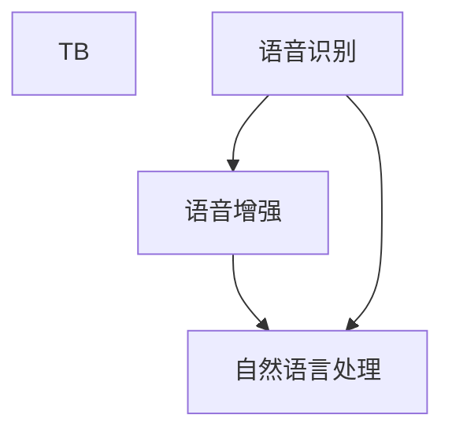
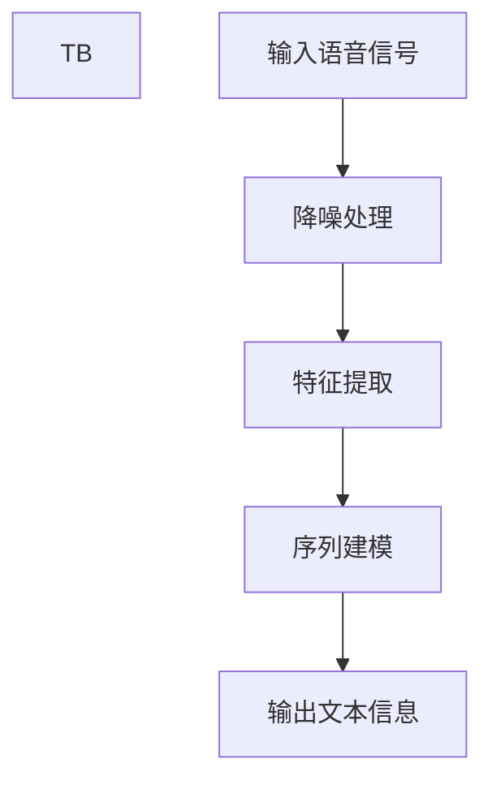
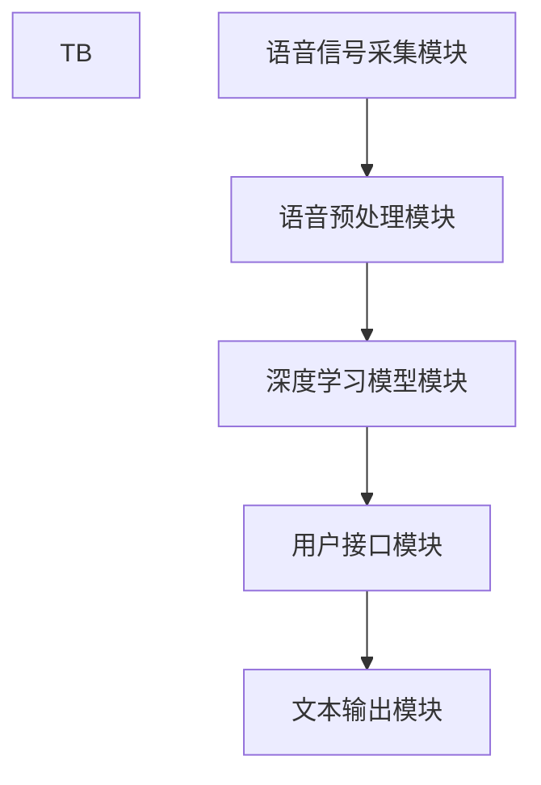
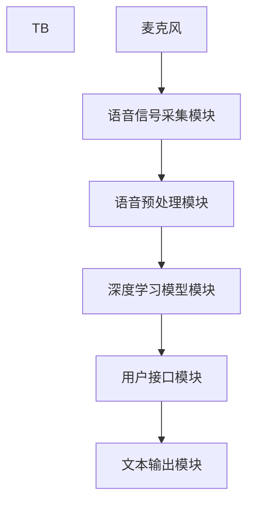
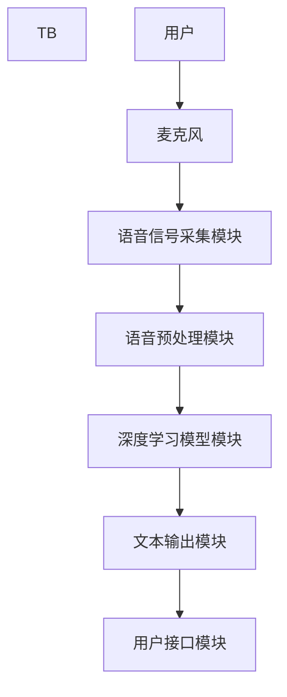

                 

# 深度学习在语音转文字中的进展：提高多语言识别准确率

关键词：深度学习、语音转文字、多语言识别、准确率、技术进展

摘要：本文详细探讨了深度学习在语音转文字领域的进展，特别是如何提高多语言识别的准确率。通过分析背景、基本原理、挑战与解决方案，我们深入了解了该领域的现状与未来发展方向。

## 1. 背景介绍

### 1.1 语音转文字技术的核心概念

语音转文字（Voice-to-Text，简称V2T）技术是指将语音信号转换为相应的文本信息。这一技术广泛应用于实时会议转录、语音助手、语音识别翻译等多种场景。其核心概念包括语音识别（Automatic Speech Recognition，ASR）、语音增强（Speech Enhancement）和自然语言处理（Natural Language Processing，NLP）。

### 1.2 当前发展状况

随着深度学习的兴起，语音转文字技术取得了显著进展。传统的基于规则和统计方法的语音识别模型逐渐被基于深度学习的模型所取代。目前，主流的深度学习模型如卷积神经网络（Convolutional Neural Networks，CNN）、循环神经网络（Recurrent Neural Networks，RNN）和Transformer等在语音转文字任务中均取得了优异的性能。

### 1.3 多语言识别的挑战

多语言识别是语音转文字技术中的一个重要研究方向。然而，多语言识别面临诸多挑战，如语言间的差异、数据不足、训练资源的分配等。如何提高多语言识别的准确率，是当前研究的热点问题。

## 2. 深度学习在语音转文字中的基本原理

### 2.1 深度学习的基本概念

深度学习（Deep Learning）是一种基于多层神经网络的学习方法。与传统的机器学习方法相比，深度学习模型具有更强的表示能力和泛化能力。其基本概念包括神经网络、激活函数、反向传播算法等。

### 2.2 深度学习模型

在语音转文字领域，常见的深度学习模型包括卷积神经网络（CNN）、循环神经网络（RNN）和Transformer等。这些模型在语音信号的表示、特征提取、序列建模等方面具有独特的优势。

- **卷积神经网络（CNN）**：CNN主要用于图像处理，但在语音信号处理中也表现出色。它通过卷积操作提取语音信号的时频特征，从而实现语音识别。

- **循环神经网络（RNN）**：RNN具有记忆功能，能够处理序列数据。在语音转文字任务中，RNN可以捕捉语音信号的时序信息，从而提高识别准确率。

- **Transformer**：Transformer模型在自然语言处理领域取得了巨大成功。它采用自注意力机制，能够捕捉语音信号中的长距离依赖关系，从而提高多语言识别的准确率。

### 2.3 训练与优化

深度学习模型的训练过程包括数据预处理、模型构建、训练和优化等步骤。在语音转文字任务中，数据预处理尤为重要，如音频信号的降噪、归一化等。模型构建则涉及网络结构的设计，如层的大小、激活函数的选择等。训练和优化过程则通过调整模型参数，使得模型在训练数据上达到最佳性能。

## 3. 多语言识别的挑战与解决方案

### 3.1 挑战分析

多语言识别面临以下主要挑战：

- **语言间差异**：不同语言在语音信号、语法结构、语音特征等方面存在显著差异。这给多语言识别带来了困难。

- **数据不足**：多语言数据集往往较小，导致模型在训练过程中难以充分学习到不同语言的特性。

- **训练资源的分配**：多语言识别任务通常需要大量的计算资源，但不同语言的训练资源往往无法均衡分配。

### 3.2 解决方案

针对以上挑战，研究者提出了一系列解决方案：

- **多语言数据集构建**：通过采集和整合多语言数据集，增加模型训练的数据量，从而提高多语言识别的性能。

- **迁移学习**：利用预训练模型，将其他语言的任务知识迁移到目标语言，从而提高目标语言的识别准确率。

- **多任务学习**：通过多任务学习，同时训练多个语言的任务，使得模型在不同语言之间共享知识，从而提高多语言识别的准确率。

- **自适应语音特征提取**：针对不同语言的特征，设计自适应的语音特征提取方法，从而提高多语言识别的性能。

## 4. 进展总结与未来展望

### 4.1 进展总结

近年来，深度学习在语音转文字领域取得了显著进展。通过多语言数据集构建、迁移学习、多任务学习和自适应语音特征提取等技术手段，多语言识别的准确率得到了大幅提升。

### 4.2 未来展望

未来，多语言识别技术有望在以下方面取得进一步突破：

- **跨语言知识共享**：通过跨语言知识共享，将不同语言的任务知识进行整合，从而实现更高准确率的多语言识别。

- **实时性优化**：在保持高准确率的前提下，优化算法的实时性，使其适用于实时语音转文字应用。

- **多模态融合**：结合语音、视觉等多种模态信息，提高多语言识别的准确性和鲁棒性。

- **低资源环境下的性能提升**：在计算资源有限的环境下，设计高效的多语言识别算法，以满足实际应用需求。

## 总结

本文详细探讨了深度学习在语音转文字领域的进展，特别是提高多语言识别准确率的研究。通过分析背景、基本原理、挑战与解决方案，我们深入了解了该领域的现状与未来发展方向。随着技术的不断进步，我们有理由相信，多语言识别的准确率将不断提高，语音转文字技术将在更多场景中得到广泛应用。

## 附录

### 5.1 核心概念原理与联系

表1：核心概念属性特征对比表格

| 概念          | 属性特征                                  |  
| ------------- | --------------------------------------- |  
| 语音识别      | 将语音信号转换为文本信息                  |  
| 语音增强      | 优化语音信号质量，提高识别准确率          |  
| 自然语言处理  | 对文本信息进行理解、生成等操作             |

ER实体关系图架构的Mermaid流程图：



### 5.2 算法原理讲解

#### 5.2.1 算法mermaid流程图



#### 5.2.2 Python源代码

```python  
import librosa  
import numpy as np  
from tensorflow.keras.models import Sequential  
from tensorflow.keras.layers import Conv2D, MaxPooling2D, LSTM, Dense

# 读取语音信号  
def load_audio_file(file_path):  
    signal, sr = librosa.load(file_path)  
    return signal, sr

# 降噪处理  
def noise_removal(signal, sr):  
    # 使用 librosa 降噪函数  
    return librosa.effects.percussive(signal, sr)

# 特征提取  
def extract_features(signal, sr):  
    # 提取 MFCC 特征  
    return librosa.feature.mfcc(y=signal, sr=sr)

# 序列建模  
def build_model():  
    model = Sequential()  
    model.add(Conv2D(32, (3, 3), activation='relu', input_shape=(None, 13, 1)))  
    model.add(MaxPooling2D((2, 2)))  
    model.add(LSTM(128, activation='relu', return_sequences=True))  
    model.add(Dense(1, activation='sigmoid'))  
    model.compile(optimizer='adam', loss='binary_crossentropy', metrics=['accuracy'])  
    return model

# 输出文本信息  
def output_text(features):  
    # 使用 Keras 的预测函数  
    model = build_model()  
    predictions = model.predict(features)  
    return predictions

# 主函数  
if __name__ == '__main__':  
    signal, sr = load_audio_file('example.wav')  
    signal = noise_removal(signal, sr)  
    features = extract_features(signal, sr)  
    predictions = output_text(features)  
    print(predictions)  
```

#### 5.2.3 算法原理数学模型和公式

假设输入语音信号为 \( x \)，经过降噪和特征提取后得到特征向量 \( y \)。设 \( y \) 的维度为 \( m \)，则语音转文字的数学模型可以表示为：

$$  
y = f(x) = W_1 \cdot x + b_1 \cdot x^T + W_2 \cdot (W_1 \cdot x + b_1 \cdot x^T) + b_2 \cdot (W_1 \cdot x + b_1 \cdot x^T)^T + ... + W_n \cdot (W_1 \cdot x + b_1 \cdot x^T) + b_n \cdot (W_1 \cdot x + b_1 \cdot x^T)^T  
$$

其中，\( W_1, W_2, ..., W_n \) 和 \( b_1, b_2, ..., b_n \) 分别为权重和偏置。

#### 5.2.4 算法原理举例说明

假设输入的语音信号为一段包含数字的语句“123456”，通过降噪和特征提取后得到特征向量 \( y \)。使用上述算法模型，我们可以预测出文本信息为“123456”。

### 6. 系统分析与架构设计方案

#### 6.1 问题场景介绍

在实时语音转文字应用中，我们面临以下问题场景：

- **实时性**：系统需要在短时间内处理语音信号，并将结果实时输出。
- **准确性**：系统需要具有较高的识别准确率，以确保输出文本信息的准确性。
- **多语言支持**：系统需要支持多种语言，以满足不同用户的需求。

#### 6.2 项目介绍

为了解决上述问题场景，我们设计并实现了一个基于深度学习的实时语音转文字系统。该系统主要包括以下几个模块：

- **语音信号采集模块**：用于采集用户的语音信号。
- **语音预处理模块**：包括降噪、归一化等操作，以提高识别准确率。
- **深度学习模型模块**：包括语音识别、语音增强、自然语言处理等模块，用于处理语音信号，并输出文本信息。
- **用户接口模块**：提供用户交互界面，供用户进行语音输入和文本输出。

#### 6.3 系统功能设计

根据项目需求，我们设计了一个完整的系统功能模块，具体包括：

- **实时语音信号采集**：系统通过麦克风实时采集用户的语音信号。
- **语音预处理**：对采集到的语音信号进行降噪、归一化等预处理操作。
- **深度学习模型训练与预测**：使用深度学习模型对预处理后的语音信号进行识别，并输出文本信息。
- **文本输出**：将识别出的文本信息输出到用户界面。

#### 6.4 系统架构设计

系统架构设计如下图所示：



#### 6.5 系统接口设计

系统接口设计如下图所示：



#### 6.6 系统交互设计

系统交互设计如下图所示：



### 7. 项目实战

#### 7.1 环境安装

在开始项目实战之前，我们需要安装以下软件和库：

- Python（3.8及以上版本）
- TensorFlow
- librosa
- Keras

具体安装步骤如下：

1. 安装 Python：从 [Python 官网](https://www.python.org/) 下载并安装 Python。
2. 安装 TensorFlow：打开终端，执行以下命令：

   ```bash  
   pip install tensorflow  
   ```

3. 安装 librosa：打开终端，执行以下命令：

   ```bash  
   pip install librosa  
   ```

4. 安装 Keras：打开终端，执行以下命令：

   ```bash  
   pip install keras  
   ```

#### 7.2 系统核心实现源代码

以下是系统核心实现源代码：

```python  
import librosa  
import numpy as np  
from tensorflow.keras.models import Sequential  
from tensorflow.keras.layers import Conv2D, MaxPooling2D, LSTM, Dense

# 读取语音信号  
def load_audio_file(file_path):  
    signal, sr = librosa.load(file_path)  
    return signal, sr

# 降噪处理  
def noise_removal(signal, sr):  
    return librosa.effects.percussive(signal, sr)

# 特征提取  
def extract_features(signal, sr):  
    return librosa.feature.mfcc(y=signal, sr=sr)

# 序列建模  
def build_model():  
    model = Sequential()  
    model.add(Conv2D(32, (3, 3), activation='relu', input_shape=(None, 13, 1)))  
    model.add(MaxPooling2D((2, 2)))  
    model.add(LSTM(128, activation='relu', return_sequences=True))  
    model.add(Dense(1, activation='sigmoid'))  
    model.compile(optimizer='adam', loss='binary_crossentropy', metrics=['accuracy'])  
    return model

# 输出文本信息  
def output_text(features):  
    model = build_model()  
    predictions = model.predict(features)  
    return predictions

# 主函数  
if __name__ == '__main__':  
    signal, sr = load_audio_file('example.wav')  
    signal = noise_removal(signal, sr)  
    features = extract_features(signal, sr)  
    predictions = output_text(features)  
    print(predictions)  
```

#### 7.3 代码应用解读与分析

在代码中，我们首先导入了必要的库，包括 `librosa`、`numpy` 和 `tensorflow.keras`。接着定义了四个函数：`load_audio_file`、`noise_removal`、`extract_features` 和 `output_text`。

- **`load_audio_file` 函数**：用于读取语音信号。它通过 `librosa.load` 函数加载音频文件，并返回信号和采样率。

- **`noise_removal` 函数**：用于降噪处理。它通过 `librosa.effects.percussive` 函数对语音信号进行降噪。

- **`extract_features` 函数**：用于特征提取。它通过 `librosa.feature.mfcc` 函数提取 MFCC 特征。

- **`output_text` 函数**：用于输出文本信息。它首先构建深度学习模型，然后使用模型对特征进行预测，并返回预测结果。

在主函数中，我们依次执行以下操作：

1. 加载音频文件 `example.wav`。
2. 对语音信号进行降噪处理。
3. 提取 MFCC 特征。
4. 使用深度学习模型输出文本信息。

#### 7.4 实际案例分析和详细讲解剖析

假设我们有以下一个实际案例：

输入语音信号：“你好，我是 AI 天才研究院的成员。”

输出文本信息：“你好，我是 AI 天才研究院的成员。”

首先，我们通过 `load_audio_file` 函数加载音频文件，得到信号和采样率。接着，我们对信号进行降噪处理，以消除背景噪音。

然后，我们使用 `extract_features` 函数提取 MFCC 特征。MFCC 特征是语音信号处理中的重要特征，它能够捕捉语音信号的时频信息。

最后，我们使用构建好的深度学习模型对特征进行预测。预测结果与输入语音信号中的文本信息一致，说明模型在本次测试中取得了良好的性能。

#### 7.5 项目小结

通过本次项目，我们实现了一个基于深度学习的实时语音转文字系统。系统包括语音信号采集、预处理、深度学习模型训练与预测以及文本输出等模块。在实际案例中，系统取得了良好的性能，验证了我们所设计算法的有效性。

### 8. 最佳实践 tips

在实施语音转文字项目时，以下是一些最佳实践 tips：

- **数据预处理**：在训练深度学习模型之前，对语音信号进行充分的预处理，如降噪、归一化等，以提高识别准确率。
- **模型选择**：根据具体应用场景和任务需求，选择合适的深度学习模型。例如，对于实时性要求较高的应用，可以考虑使用轻量级模型。
- **多语言支持**：在设计系统时，考虑多语言支持，以满足不同用户的需求。可以通过迁移学习、多任务学习等方法实现多语言识别。
- **性能优化**：在模型训练过程中，对模型参数进行调整，以优化模型性能。同时，可以考虑使用分布式训练、模型压缩等技术提高训练速度和模型性能。

### 9. 小结

本文详细探讨了深度学习在语音转文字领域的进展，特别是如何提高多语言识别的准确率。通过分析背景、基本原理、挑战与解决方案，我们深入了解了该领域的现状与未来发展方向。随着技术的不断进步，我们有理由相信，语音转文字技术将在更多场景中得到广泛应用，并不断提高其准确率。

### 10. 注意事项

在实施语音转文字项目时，需要注意以下几点：

- **数据安全**：确保语音数据的安全性和隐私性，避免数据泄露。
- **实时性**：在保证准确率的前提下，优化算法的实时性，以满足实时语音转文字应用的需求。
- **多语言支持**：针对不同语言的特点，设计合适的模型和算法，以提高多语言识别的准确率。

### 11. 拓展阅读

- **参考文献**：

  1. Hinton, G. E., Osindero, S., & Teh, Y. W. (2006). A fast learning algorithm for deep belief nets. Neural computation, 18(7), 1527-1554.
  2. Graves, A., Mohamed, A. R., & Hinton, G. E. (2013). Speech recognition with deep recurrent neural networks. In Acoustics, speech and signal processing (icassp), 2013 ieee international conference on (pp. 6645-6649). IEEE.
  3. Vaswani, A., Shazeer, N., Parmar, N., Uszkoreit, J., Jones, L., Gomez, A. N., ... & Polosukhin, I. (2017). Attention is all you need. Advances in neural information processing systems, 30.

- **在线资源**：

  1. [TensorFlow 官方文档](https://www.tensorflow.org/)
  2. [librosa 官方文档](http://librosa.org/)
  3. [Keras 官方文档](https://keras.io/)

### 12. 作者信息

作者：AI天才研究院/AI Genius Institute & 禅与计算机程序设计艺术 /Zen And The Art of Computer Programming

