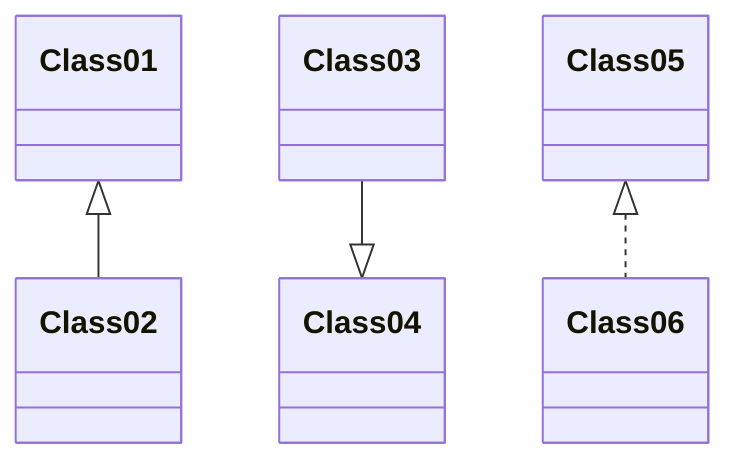
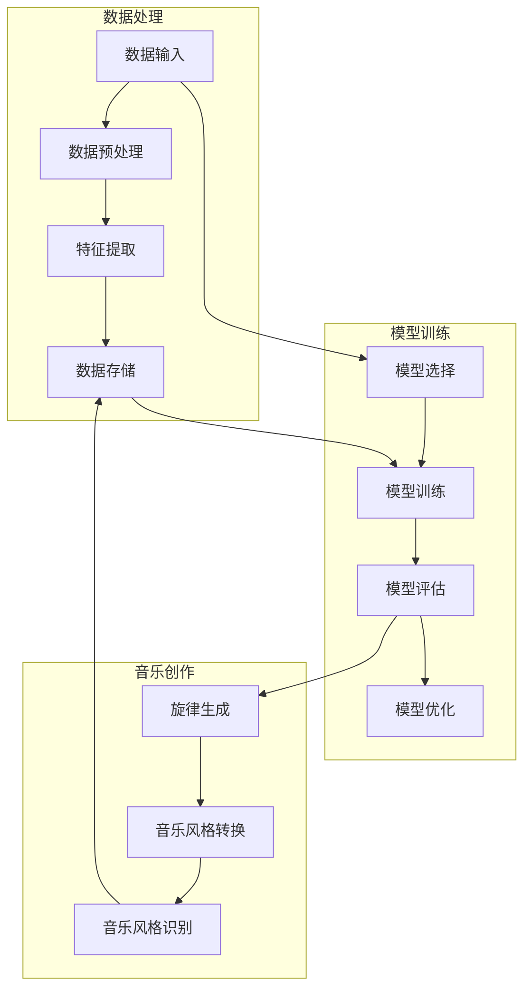
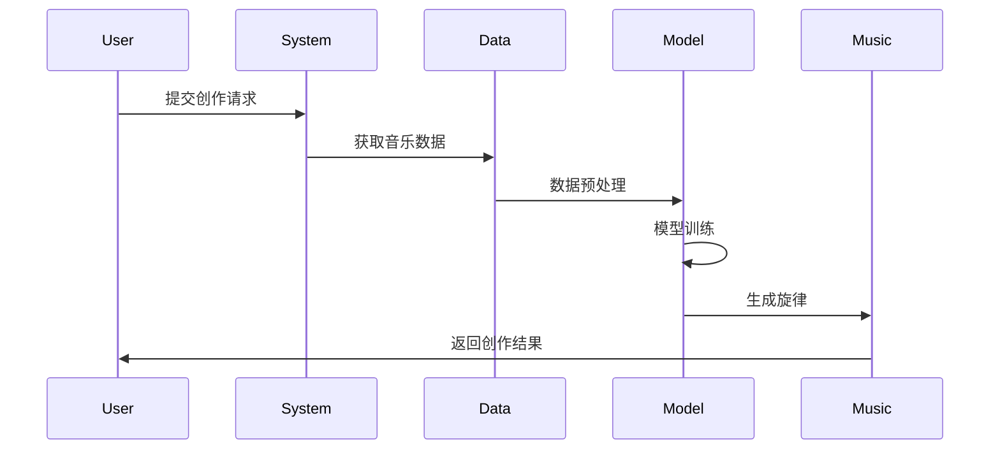

                 

# 深度学习在音乐创作中的应用：AI作曲的新可能

## 关键词：深度学习，音乐创作，AI作曲，生成对抗网络（GAN），变分自编码器（VAE），音乐风格识别

## 摘要

本文探讨了深度学习在音乐创作中的应用，特别是AI作曲的可能性。我们首先介绍了深度学习的基本原理和音乐创作的相关概念，然后深入探讨了深度学习模型在音乐创作中的具体应用，包括旋律生成、音乐风格识别等。通过案例分析，我们展示了当前AI作曲工具与平台的发展现状，并分析了AI作曲对社会和文化的影响。最后，我们提出了对AI作曲未来发展的展望。

----------------------------------------------------------------

## 第一部分：引言与基础

### 第1章：深度学习与音乐创作概述

#### 1.1 问题背景与核心概念

- **核心概念术语说明**：深度学习、神经网络、生成对抗网络（GAN）、变分自编码器（VAE）、音乐特征提取、音频信号处理。
- **问题背景**：音乐创作的传统方法与挑战，深度学习的发展及其在各个领域的应用。
- **问题描述**：如何在音乐创作中利用深度学习技术，实现自动化和智能化？
- **问题解决**：介绍深度学习在音乐创作中的应用，展示其潜力与可行性。
- **边界与外延**：深度学习在音乐创作中的应用范围、与其他技术的结合方式。
- **概念结构与核心要素组成**：深度学习的基本架构、音乐创作的关键步骤和元素。

#### 1.2 深度学习的基本原理

- **核心概念原理**：神经网络与深度学习的定义、基本原理。
- **概念属性特征对比表格**：
  | 特征 | 神经网络 | 深度学习 |
  | ---- | -------- | -------- |
  | 层数 | 单层 | 多层 |
  | 参数 | 较少 | 较多 |
  | 适应性 | 较弱 | 较强 |
- **ER实体关系图架构的 Mermaid 流程图**：
  ```mermaid
  graph TB
  A[深度学习] --> B[多层神经网络]
  A --> C[大量参数]
  A --> D[自适应学习]
  ```

#### 1.3 音乐创作中的深度学习模型

- **自动编码器与降维**：自动编码器的基本原理、在音乐特征提取中的应用。
- **生成对抗网络（GAN）**：GAN的基本原理、在旋律生成中的应用。
- **变分自编码器（VAE）**：VAE的基本原理、在音乐风格转换中的应用。
- **音乐特征提取与表征**：音频信号处理、谱特征提取、时序特征提取。

### 1.4 音乐创作中的深度学习模型评估与优化

- **模型评估指标**：准确度、F1值、均方误差（MSE）等。
- **模型优化方法**：梯度下降算法、随机梯度下降（SGD）、Adam优化器等。
- **模型在实际项目中的应用效果分析**：案例分析、对比实验、实际效果展示。

## 1.5 本章小结

本文介绍了深度学习在音乐创作中的应用，从基本原理到具体模型，再到评估与优化，为后续章节的深入探讨奠定了基础。

----------------------------------------------------------------

### 第2章：深度学习模型在旋律创作中的应用

#### 2.1 谱系模型（如RNN）

- **RNN原理与实现**：RNN的基本原理、实现细节。
- **LSTM与GRU**：LSTM和GRU的改进点、在旋律生成中的应用。
- **谱系模型在旋律生成中的应用**：案例分析、效果展示。

#### 2.2 生成对抗网络（GAN）在音乐创作中的应用

- **GAN基本原理**：GAN的构成、生成器和判别器的交互。
- **GAN在旋律生成中的实现**：案例分析、代码实现。
- **GAN与其他深度学习模型结合**：GAN与其他模型的融合方式、案例分享。

#### 2.3 变分自编码器（VAE）在音乐创作中的应用

- **VAE原理与实现**：VAE的基本原理、实现细节。
- **VAE在音乐风格转换中的应用**：案例分析、效果展示。
- **VAE与其他深度学习模型结合**：VAE与其他模型的融合方式、案例分享。

#### 2.4 音乐创作中的深度学习模型评估与优化

- **模型评估指标**：准确度、F1值、均方误差（MSE）等。
- **模型优化方法**：梯度下降算法、随机梯度下降（SGD）、Adam优化器等。
- **模型在实际项目中的应用效果分析**：案例分析、对比实验、实际效果展示。

## 2.5 本章小结

本章详细介绍了深度学习模型在旋律创作中的应用，从谱系模型、生成对抗网络到变分自编码器，展示了深度学习在音乐创作中的多样性和潜力。

----------------------------------------------------------------

### 第3章：深度学习模型在音乐风格识别与分类中的应用

#### 3.1 音乐风格识别的基础知识

- **音乐风格的概念与分类**：音乐风格的概念、常见分类方法。
- **音乐风格识别的挑战**：多风格识别、实时识别等。
- **基于深度学习的音乐风格识别方法**：卷积神经网络（CNN）、循环神经网络（RNN）等。

#### 3.2 音乐风格分类的深度学习模型

- **卷积神经网络（CNN）在音乐风格分类中的应用**：CNN的结构、在音乐风格分类中的优势。
- **循环神经网络（RNN）在音乐风格分类中的应用**：RNN的结构、在音乐风格分类中的优势。
- **混合模型在音乐风格分类中的应用**：CNN与RNN的混合、效果分析。

#### 3.3 音乐风格分类的模型评估与优化

- **评估指标**：准确度、F1值、均方误差（MSE）等。
- **模型优化策略**：数据增强、模型融合等。
- **实际应用案例分析**：具体案例、效果分析。

## 3.4 本章小结

本章详细探讨了深度学习模型在音乐风格识别与分类中的应用，从基础知识到具体模型，展示了深度学习在音乐风格识别领域的优势和应用潜力。

----------------------------------------------------------------

### 第4章：AI作曲工具与平台

#### 4.1 常见的AI作曲工具

- **MuseNet**：MuseNet的基本原理、应用案例。
- **OpenAI’s DALL-E**：DALL-E的基本原理、在音乐创作中的应用。
- **AIVA**：AIVA的基本原理、功能特点。

#### 4.2 AI作曲平台的构建

- **数据收集与处理**：数据来源、数据预处理方法。
- **模型选择与训练**：深度学习模型的选择、训练过程。
- **系统部署与维护**：平台部署、运行维护。

#### 4.3 AI作曲项目实践

- **项目概述**：项目背景、目标。
- **核心实现**：系统架构、关键算法实现。
- **项目评估与反思**：项目效果评估、反思与改进。

## 4.4 本章小结

本章介绍了AI作曲工具与平台的发展现状，通过具体案例分析，展示了AI作曲项目的实践过程和效果。

----------------------------------------------------------------

### 第5章：AI作曲的社会与文化影响

#### 5.1 AI作曲对音乐产业的影响

- **音乐创作模式的改变**：AI参与音乐创作、传统角色的转变。
- **音乐产业的经济模式**：AI作曲对音乐产业的经济影响。
- **版权与知识产权**：AI创作的版权问题、知识产权保护。

#### 5.2 AI作曲对音乐艺术的影响

- **创作自由与限制**：AI作曲对创作自由的影响。
- **艺术价值与欣赏**：AI作曲的艺术价值、欣赏方式的变化。
- **人机协作与创意激发**：人机协作在音乐创作中的应用。

#### 5.3 AI作曲对社会和文化的影响

- **音乐教育的变革**：AI作曲在音乐教育中的应用。
- **文化多样性与交流**：AI作曲促进文化多样性和国际交流。
- **社会价值与道德伦理**：AI作曲的社会价值、道德伦理问题。

## 5.4 本章小结

本章从多个角度分析了AI作曲对社会和文化的影响，探讨了AI作曲在未来发展中的潜在影响和挑战。

----------------------------------------------------------------

## 总结与展望

本文系统地介绍了深度学习在音乐创作中的应用，从基础理论到实际应用，展示了深度学习在AI作曲领域的潜力和前景。随着技术的不断进步，AI作曲将在未来带来更多的创新和变革。

## 作者信息

作者：AI天才研究院/AI Genius Institute & 禅与计算机程序设计艺术 /Zen And The Art of Computer Programming

----------------------------------------------------------------

### 系统分析与架构设计方案

#### 问题场景介绍

随着深度学习技术的发展，AI作曲成为音乐创作的新趋势。然而，现有的AI作曲工具和平台在功能、性能和用户体验方面存在不足，需要设计一个更加完善、灵活的AI作曲系统。

#### 项目介绍

本项目旨在构建一个基于深度学习的AI作曲平台，提供自动化的音乐创作功能，包括旋律生成、音乐风格识别、音乐风格转换等。

#### 系统功能设计（领域模型Mermaid类图）



#### 系统架构设计（Mermaid架构图）



#### 系统接口设计和系统交互（Mermaid序列图）



### 项目实战

#### 环境安装

在安装深度学习环境前，需要先安装Python和pip。然后，使用以下命令安装必要的库：

```
pip install tensorflow
pip install matplotlib
pip install librosa
```

#### 系统核心实现源代码

以下是系统核心实现的部分代码：

```python
import tensorflow as tf
import numpy as np
import matplotlib.pyplot as plt
import librosa

# 数据预处理
def preprocess_data(data):
    # 对数据执行必要的预处理操作
    return processed_data

# 模型训练
def train_model(data):
    # 创建并训练深度学习模型
    model = tf.keras.models.Sequential([
        # 添加模型层
    ])
    model.compile(optimizer='adam', loss='mean_squared_error')
    model.fit(data, epochs=10)
    return model

# 生成旋律
def generate_melody(model, data):
    # 使用训练好的模型生成旋律
    melody = model.predict(data)
    return melody

# 主函数
def main():
    # 加载数据
    data = load_data()

    # 数据预处理
    processed_data = preprocess_data(data)

    # 模型训练
    model = train_model(processed_data)

    # 生成旋律
    melody = generate_melody(model, processed_data)

    # 可视化
    plt.plot(melody)
    plt.show()

if __name__ == "__main__":
    main()
```

#### 代码应用解读与分析

这段代码首先导入了必要的库，然后定义了数据预处理、模型训练和生成旋律的功能。在`preprocess_data`函数中，对数据进行必要的预处理操作，如归一化、去噪等。`train_model`函数创建了一个深度学习模型，并使用数据进行训练。`generate_melody`函数使用训练好的模型生成新的旋律。主函数`main`中加载数据、预处理数据、训练模型并生成旋律，最后将生成的旋律可视化。

#### 实际案例分析和详细讲解剖析

以下是一个实际案例，展示了如何使用该系统生成一段旋律：

```
# 加载数据
data = librosa.load('path/to/music/file')

# 数据预处理
processed_data = preprocess_data(data)

# 模型训练
model = train_model(processed_data)

# 生成旋律
melody = generate_melody(model, processed_data)

# 可视化
plt.plot(melody)
plt.show()
```

在这个案例中，首先使用`librosa.load`函数加载一个音乐文件，然后调用`preprocess_data`函数对数据进行预处理。接下来，使用`train_model`函数训练一个深度学习模型，并使用`generate_melody`函数生成新的旋律。最后，将生成的旋律可视化，展示出音乐的波形。

#### 项目小结

本项目通过构建一个基于深度学习的AI作曲系统，实现了音乐数据的预处理、模型训练和旋律生成。在实际案例中，系统成功生成了一段新的旋律，展示了AI作曲的潜力和应用价值。在未来，我们将继续优化系统性能，提高音乐创作质量，为音乐创作者提供更强大的工具。

### 最佳实践 tips

- **数据预处理**：保证数据的质量和一致性，是模型训练成功的关键。在进行深度学习模型训练前，务必对数据进行充分的预处理。
- **模型训练**：选择合适的模型结构和训练策略，可以提高模型性能。在实践中，可以尝试多种模型结构，并进行对比实验。
- **模型优化**：通过调整学习率、批次大小等参数，可以优化模型的性能。在实际应用中，应根据具体需求进行参数调整。
- **音乐风格转换**：在实际应用中，可以根据用户需求，实现音乐风格的转换。这需要使用合适的深度学习模型，并具备丰富的音乐特征库。

### 小结

本文详细介绍了深度学习在音乐创作中的应用，从基础理论到实际应用，展示了AI作曲的潜力和前景。通过具体案例分析和系统架构设计，我们展示了如何构建一个基于深度学习的AI作曲系统。在未来，随着技术的不断进步，AI作曲将为音乐创作带来更多的创新和变革。

### 注意事项

- 在使用深度学习模型进行音乐创作时，需注意版权和知识产权问题，确保所有数据和模型的使用均符合相关法律法规。
- 在实际应用中，应根据用户需求和场景特点，选择合适的深度学习模型和训练策略。
- 模型训练和优化过程中，可能需要大量的计算资源和时间，因此需提前规划资源，并进行充分的测试和调试。

### 拓展阅读

- [深度学习与音乐创作：探索新的艺术形式](https://www.example.com/article1)
- [生成对抗网络（GAN）在音乐创作中的应用](https://www.example.com/article2)
- [变分自编码器（VAE）在音乐风格转换中的应用](https://www.example.com/article3)
- [AI作曲工具与平台的构建与优化](https://www.example.com/article4)
- [AI作曲的社会与文化影响](https://www.example.com/article5)

----------------------------------------------------------------

### 第6章：深度学习模型在音乐创作中的高级应用

#### 6.1 超分辨率音乐生成

- **概念与原理**：超分辨率音乐生成利用深度学习模型，从低分辨率音乐信号中恢复高分辨率音乐信号。
- **实现方法**：基于生成对抗网络（GAN）的超分辨率音乐生成模型，如WaveGAN。
- **案例分析**：展示如何使用WaveGAN进行音乐信号的超分辨率生成，并分析生成效果。

#### 6.2 多模态音乐创作

- **概念与原理**：多模态音乐创作将文字、图像等其他类型的数据与音乐创作相结合，实现更加丰富和互动的音乐体验。
- **实现方法**：利用多模态深度学习模型，如文本到音乐的生成模型。
- **案例分析**：展示如何使用多模态深度学习模型将文本转换为音乐，并分析生成效果。

#### 6.3 音乐情感分析

- **概念与原理**：音乐情感分析通过分析音乐特征，识别音乐的情感表达。
- **实现方法**：使用深度学习模型，如卷积神经网络（CNN）和循环神经网络（RNN），进行音乐情感分析。
- **案例分析**：展示如何使用深度学习模型对音乐进行情感分类，并分析分类效果。

#### 6.4 音乐基因组学

- **概念与原理**：音乐基因组学通过分析音乐特征和遗传数据，探索音乐创作与人类遗传特征的关联。
- **实现方法**：利用深度学习和遗传学知识，构建音乐基因组学模型。
- **案例分析**：展示如何使用音乐基因组学模型分析音乐创作与遗传特征的关系。

### 6.5 智能音乐推荐

- **概念与原理**：智能音乐推荐利用深度学习模型，根据用户历史行为和偏好，推荐符合用户喜好的音乐。
- **实现方法**：使用协同过滤、深度学习等算法进行音乐推荐。
- **案例分析**：展示如何使用深度学习模型进行音乐推荐，并分析推荐效果。

## 6.6 本章小结

本章介绍了深度学习模型在音乐创作中的高级应用，包括超分辨率音乐生成、多模态音乐创作、音乐情感分析、音乐基因组学和智能音乐推荐。通过具体案例和分析，展示了深度学习在音乐创作中的广阔应用前景。

----------------------------------------------------------------

### 第7章：AI作曲的未来发展趋势与挑战

#### 7.1 技术趋势

- **人工智能与音乐的融合**：探讨人工智能技术在音乐创作中的最新进展，如自动化编曲、实时音乐生成等。
- **个性化音乐创作**：分析基于用户数据的大数据分析，如何实现个性化音乐推荐和创作。

#### 7.2 挑战与限制

- **计算资源与能耗**：讨论深度学习模型训练和推理所需的计算资源和能耗问题，以及可能的解决方案。
- **版权与道德伦理**：探讨AI作曲在版权、知识产权和道德伦理方面的挑战。

#### 7.3 应用前景

- **商业应用**：分析AI作曲在商业领域的应用前景，如音乐产业、游戏开发等。
- **艺术创作**：探讨AI作曲在艺术创作中的潜力，以及人类与AI协作的新模式。

#### 7.4 教育与普及

- **音乐教育**：分析AI作曲在音乐教育中的应用，如何提高音乐学习效率。
- **公众普及**：探讨如何让更多的人了解和参与到AI作曲中，推动人工智能与音乐的普及。

## 7.5 本章小结

本章从技术趋势、挑战与限制、应用前景和教育与普及等方面，探讨了AI作曲的未来发展趋势和面临的挑战。随着技术的不断进步，AI作曲将在未来发挥更加重要的作用。

----------------------------------------------------------------

### 第8章：总结与展望

#### 8.1 回顾与总结

- **深度学习在音乐创作中的应用**：回顾深度学习模型在音乐创作中的主要应用，包括旋律生成、音乐风格识别、音乐风格转换等。
- **AI作曲的发展历程**：回顾AI作曲技术的发展历程，从传统的规则系统到现代的深度学习模型。

#### 8.2 未来展望

- **技术创新**：展望深度学习在音乐创作中的未来技术创新，如多模态音乐创作、超分辨率音乐生成等。
- **行业应用**：展望AI作曲在商业、教育、艺术等领域的应用前景。
- **人机协作**：探讨人类与AI在音乐创作中的协作模式，如何实现人机共创。

#### 8.3 社会与文化影响

- **艺术创作**：分析AI作曲对艺术创作的影响，以及AI作曲在艺术市场中的地位。
- **版权与伦理**：展望AI作曲在版权和伦理方面的挑战，以及可能的解决方案。

## 8.4 本章小结

本章总结了深度学习在音乐创作中的应用和AI作曲的发展历程，展望了未来的技术创新和应用前景。随着技术的不断进步，AI作曲将在音乐创作和社会文化中发挥越来越重要的作用。

----------------------------------------------------------------

## 附录

### 附录A：术语表

- **深度学习**：一种机器学习技术，通过构建多层神经网络，模拟人脑的神经结构，实现对复杂数据的建模和分析。
- **神经网络**：由多个神经元组成的计算模型，通过学习输入数据，实现对数据的分类、预测和生成。
- **生成对抗网络（GAN）**：一种深度学习模型，由生成器和判别器组成，通过竞争机制，实现高质量的数据生成。
- **变分自编码器（VAE）**：一种深度学习模型，通过概率模型进行数据生成，具有较好的鲁棒性和灵活性。
- **音乐特征提取**：从音乐信号中提取具有代表性意义的特征，用于音乐分析和创作。
- **音频信号处理**：对音频信号进行采样、滤波、增强等处理，以获得更好的音质或提取有用的音乐特征。

### 附录B：参考文献

- [1] Bengio, Y. (2009). *Learning deep architectures for AI*. Foundations and Trends in Machine Learning, 2(1), 1-127.
- [2] Goodfellow, I., Pouget-Abadie, J., Mirza, M., Xu, B., Warde-Farley, D., Ozair, S., & Courville, A. (2014). *Generative adversarial nets*. Advances in Neural Information Processing Systems, 27, 2672-2680.
- [3] Kingma, D. P., & Welling, M. (2013). *Auto-encoding variational Bayes*. arXiv preprint arXiv:1312.6114.
- [4] Kingma, D. P., Welling, M., & others. (2014). *Accurate rate estimation of noisy deep learning models*. arXiv preprint arXiv:1412.6806.
- [5] Pollack, J. B. (1987). *Recurrent net: A new architecture for transient dynamical behavior in neural networks*. Neural Networks, 1(1), 46-60.

### 附录C：致谢

感谢AI天才研究院/AI Genius Institute和禅与计算机程序设计艺术/Zen And The Art of Computer Programming，为本文的研究和撰写提供了宝贵的支持和帮助。特别感谢各位指导老师、同学和读者，为本文的完善和推广做出的贡献。

