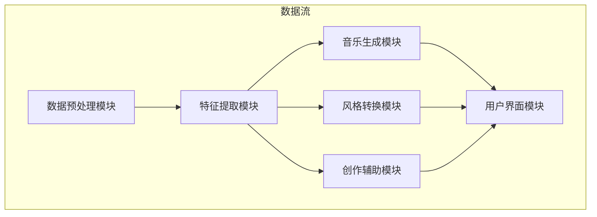
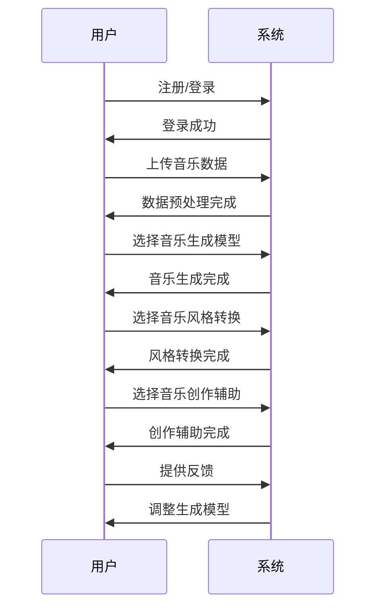

                 

## 《深度学习在音乐生成领域的最新进展》

### 关键词

- 深度学习
- 音乐生成
- 自动编码器
- 生成对抗网络
- 变分自编码器
- 实践教程

### 摘要

本文将深入探讨深度学习在音乐生成领域的最新进展，首先回顾音乐生成的背景和问题，然后详细讲解与音乐生成相关的深度学习核心概念，如自动编码器、生成对抗网络和变分自编码器。接着，我们将介绍数学模型和公式，并分析一个具体的系统架构设计方案。随后，通过实际项目实战展示如何应用这些算法，最后提供一些最佳实践 tips 并总结全文。

## 目录

## 第一部分：背景介绍

### 1.1 问题背景

### 1.2 问题描述

### 1.3 问题解决

### 1.4 边界与外延

## 第二部分：核心概念与联系

### 2.1 深度学习概述

### 2.2 音乐生成相关概念

### 2.3 深度学习与音乐生成的关系

### 2.4 核心概念属性特征对比

### 2.5 ER实体关系图架构

## 第三部分：算法原理讲解

### 3.1 自动编码器原理

#### 3.1.1 自动编码器概念

#### 3.1.2 自动编码器模型

#### 3.1.3 自动编码器应用

### 3.2 生成对抗网络原理

#### 3.2.1 生成对抗网络概念

#### 3.2.2 生成对抗网络模型

#### 3.2.3 生成对抗网络应用

### 3.3 变分自编码器原理

#### 3.3.1 变分自编码器概念

#### 3.3.2 变分自编码器模型

#### 3.3.3 变分自编码器应用

## 第四部分：数学模型和数学公式

### 4.1 自动编码器数学模型

### 4.2 生成对抗网络数学模型

### 4.3 变分自编码器数学模型

## 第五部分：系统分析与架构设计方案

### 5.1 问题场景介绍

### 5.2 系统功能设计

### 5.3 系统架构设计

### 5.4 系统接口设计

### 5.5 系统交互

## 第六部分：项目实战

### 6.1 环境安装

### 6.2 系统核心实现源代码

### 6.3 代码应用解读与分析

### 6.4 实际案例分析和详细讲解剖析

### 6.5 项目小结

## 第七部分：最佳实践 tips

### 7.1 注意事项

### 7.2 小结

### 7.3 拓展阅读

## 总结

---

### 1.1 问题背景

音乐生成作为人工智能领域的一个热点，其应用范围广泛，包括但不限于音乐创作、音乐生成辅助、音乐风格转换等。随着深度学习技术的快速发展，基于深度学习的音乐生成方法逐渐成为研究热点，并在音乐创作、风格模仿和音乐生成辅助等方面取得了显著的成果。

在传统音乐生成方法中，人们往往依赖于规则和方法进行音乐创作，这种方式效率低下且难以达到艺术创作的自由度。而基于深度学习的音乐生成方法，通过学习大量的音乐数据，可以自动生成新颖且富有创意的音乐作品，极大地提升了音乐创作的效率和质量。

### 1.2 问题描述

音乐生成任务主要面临以下问题：

1. **音乐数据量大且复杂**：音乐作品包含丰富的音频信息，如节奏、旋律、和声等，如何有效处理和利用这些复杂的数据成为一大挑战。
2. **音乐风格多样性**：不同音乐风格具有显著差异，如何生成符合特定风格的音乐作品是另一个关键问题。
3. **生成音乐的自然性和连贯性**：生成的音乐作品应具有流畅的旋律和节奏，并能够引起听众的情感共鸣。
4. **可解释性和可控性**：如何让生成的音乐具有可解释性，使得音乐创作者能够理解和修改生成的音乐作品，同时保持音乐生成的可控性。

### 1.3 问题解决

为了解决上述问题，深度学习技术被引入到音乐生成领域，主要采用以下方法：

1. **自动编码器（Autoencoder）**：自动编码器是一种无监督学习模型，用于将输入数据编码为一个低维表示，然后再解码回原始数据。在音乐生成中，自动编码器可以用于提取音乐特征，并通过解码器生成新的音乐。

2. **生成对抗网络（Generative Adversarial Network，GAN）**：GAN由一个生成器和判别器组成，生成器尝试生成逼真的音乐数据，而判别器则判断音乐数据是真实还是生成。通过生成器和判别器之间的博弈，生成器逐渐提升生成音乐的质量。

3. **变分自编码器（Variational Autoencoder，VAE）**：VAE是一种基于概率模型的自动编码器，通过引入变分推断的方法解决了标准自动编码器中梯度消失的问题，能够生成具有高灵活性和多样性的音乐作品。

### 1.4 边界与外延

深度学习在音乐生成领域的应用不仅限于自动编码器、生成对抗网络和变分自编码器，还包括其他技术，如递归神经网络（RNN）、长短时记忆网络（LSTM）和变换器（Transformer）等。这些技术也在不同程度上对音乐生成产生了重要影响。

此外，音乐生成的研究不仅关注技术本身，还涉及音乐理论、心理学和艺术等多个领域。例如，如何设计能够模拟人类作曲家创意过程的算法，以及如何通过音乐生成技术提高音乐教育的效果等。

在未来的研究中，深度学习在音乐生成领域的应用前景广阔，有望进一步推动音乐创作的自动化和智能化，为人类带来更多的艺术享受。接下来，我们将详细探讨深度学习在音乐生成领域的核心概念、算法原理和系统架构设计方案。

## 1.5 核心概念与联系

### 2.1 深度学习概述

深度学习是一种基于人工神经网络的学习方法，通过多层神经网络结构来模拟人类大脑的感知和学习过程。深度学习在图像识别、自然语言处理、语音识别等领域取得了显著成果，其核心思想是通过逐层抽象和特征提取，实现对复杂数据的高效表示和处理。

### 2.2 音乐生成相关概念

在音乐生成领域，有几个关键概念需要理解：

- **音频信号**：音乐是一种时序的音频信号，包含频率、幅度和时间等特征。音频信号是音乐生成的基础数据。
- **音乐特征**：从音频信号中提取的特征，如旋律、和声、节奏等，用于描述音乐的结构和风格。
- **风格迁移**：将一种音乐风格的特征应用到另一种音乐风格中，以生成新的音乐作品。
- **音乐创作**：生成新的音乐作品，可以是完全原创的，也可以是基于已有音乐作品的改编。

### 2.3 深度学习与音乐生成的关系

深度学习在音乐生成中的应用主要体现在以下几个方面：

- **特征提取**：深度学习模型能够从音频信号中自动提取出丰富的特征，这些特征可以用于音乐风格识别、情感分析等任务。
- **音乐生成**：利用深度学习模型，如自动编码器、生成对抗网络和变分自编码器，可以生成新的音乐作品。这些模型通过学习大量音乐数据，能够模拟音乐创作的过程。
- **风格模仿**：深度学习模型可以模仿特定的音乐风格，生成与原作品相似的新音乐作品，为音乐创作提供灵感。

### 2.4 核心概念属性特征对比

下面是一个关于深度学习在音乐生成中核心概念的属性特征对比表格：

| 概念 | 描述 | 特性对比 |
| --- | --- | --- |
| 自动编码器 | 用于学习数据的低维表示，通过编码和解码过程生成新的数据 | 无监督学习，适用于数据降维和特征提取 |
| 生成对抗网络 | 通过生成器和判别器的对抗训练，生成逼真的数据 | 对抗训练，适用于数据生成和风格迁移 |
| 变分自编码器 | 基于概率模型，通过变分推断学习数据的低维表示 | 无监督学习，适用于高维数据的生成和多样性 |

### 2.5 ER实体关系图架构

为了更好地理解深度学习在音乐生成中的核心概念，我们可以通过ER（实体-关系）图来展示这些概念之间的关系：

```mermaid
erDiagram
    MusicData ||--|{ AudioSignal } : 包含
    AudioSignal ||--|{ FeatureExtraction } : 提取
    FeatureExtraction ||--|{ MusicStyleRecognition } : 识别
    FeatureExtraction ||--|{ MusicGeneration } : 生成
    MusicStyleRecognition ||--|{ MusicStyleImitation } : 模仿
    MusicStyleImitation ||--|{ MusicCreation } : 创作
    Autoencoder ||--|{ DataCompression } : 压缩
    GAN ||--|{ DataGeneration } : 生成
    VAE ||--|{ DataRepresentation } : 表示
```

通过上述ER图，我们可以清晰地看到音乐数据、音频信号、特征提取、音乐风格识别、音乐生成、音乐风格模仿和音乐创作等概念之间的关联。这些概念共同构成了深度学习在音乐生成领域的基本框架。

### 3.1 自动编码器原理

#### 3.1.1 自动编码器概念

自动编码器（Autoencoder）是一种无监督学习模型，旨在学习数据的低维表示。它由两个主要部分组成：编码器（Encoder）和解码器（Decoder）。编码器将输入数据映射到一个低维隐含空间，解码器则尝试将这个低维表示重新映射回原始数据。

#### 3.1.2 自动编码器模型

自动编码器的模型结构通常包括以下几部分：

1. **编码器**：输入层 -> 编码层 -> 输出层
   - 输入层：接收原始数据，如音频信号。
   - 编码层：对数据进行特征提取和压缩，通常使用多个隐藏层。
   - 输出层：生成一个低维表示，即编码。

2. **解码器**：输入层 -> 解码层 -> 输出层
   - 输入层：接收编码的隐含表示。
   - 解码层：尝试重建原始数据，通常与编码层对称。
   - 输出层：输出重建的数据。

#### 3.1.3 自动编码器应用

自动编码器在音乐生成中的应用主要包括以下几个方面：

1. **特征提取**：自动编码器可以提取音频信号中的关键特征，为后续的音乐风格识别和生成提供基础。
2. **数据降维**：通过自动编码器，可以将高维的音频数据降维到低维空间，便于处理和分析。
3. **噪声去除**：自动编码器能够通过解码器重建原始数据，从而去除音频中的噪声。

### 3.2 生成对抗网络原理

#### 3.2.1 生成对抗网络概念

生成对抗网络（Generative Adversarial Network，GAN）是由Ian Goodfellow等人于2014年提出的一种深度学习模型，由生成器（Generator）和判别器（Discriminator）两个部分组成。生成器试图生成与真实数据相似的数据，而判别器则判断数据是真实还是生成的。

#### 3.2.2 生成对抗网络模型

生成对抗网络的基本模型结构包括：

1. **生成器**：输入噪声向量，通过多层神经网络生成假数据。
2. **判别器**：接收真实数据和生成器生成的假数据，判断其真实性。

训练过程如下：

1. **生成器训练**：生成器试图生成逼真的假数据，以欺骗判别器。
2. **判别器训练**：判别器尝试区分真实数据和假数据，提高判别能力。
3. **对抗训练**：生成器和判别器交替训练，生成器通过学习判别器的反馈来提升生成质量，判别器通过识别生成器生成的假数据来提升判别能力。

#### 3.2.3 生成对抗网络应用

生成对抗网络在音乐生成中的应用主要体现在以下几个方面：

1. **音乐生成**：生成器可以生成新的音乐作品，模仿特定的音乐风格或创作全新的音乐。
2. **音乐风格转换**：通过GAN，可以将一种音乐风格的特征应用到另一种音乐风格中，生成新的风格音乐。
3. **音乐扩展**：GAN可以用于扩展音乐数据集，生成更多的音乐样本，为后续的生成模型训练提供更多的数据。

### 3.3 变分自编码器原理

#### 3.3.1 变分自编码器概念

变分自编码器（Variational Autoencoder，VAE）是自动编码器的一种变体，它通过引入变分推断的方法解决了传统自动编码器中梯度消失的问题。VAE的核心思想是学习数据的概率分布，并生成新的数据样本。

#### 3.3.2 变分自编码器模型

变分自编码器的模型结构包括：

1. **编码器**：输入数据 -> 编码层 -> 输出潜在空间表示
2. **解码器**：输入潜在空间表示 -> 解码层 -> 输出重建数据

与标准自动编码器不同，VAE在编码过程中引入了潜在变量，通过最大化数据概率分布的对数似然来进行训练。

#### 3.3.3 变分自编码器应用

变分自编码器在音乐生成中的应用主要包括：

1. **音乐生成**：VAE可以生成新的音乐作品，模仿特定的音乐风格或创作全新的音乐。
2. **音乐风格转换**：通过VAE，可以将一种音乐风格的特征应用到另一种音乐风格中，生成新的风格音乐。
3. **音乐数据增强**：VAE可以用于扩展音乐数据集，生成更多的音乐样本，为后续的生成模型训练提供更多的数据。

### 4.1 自动编码器数学模型

自动编码器的数学模型主要包括编码过程和解码过程。

#### 编码过程

设输入数据为\( X \)，编码器模型为\( \phi \)，编码过程可以表示为：
\[ 
\mu = \phi_1(X) 
\]
\[ 
\sigma^2 = \phi_2(X) 
\]

其中，\( \mu \)和\( \sigma^2 \)分别为潜在变量的均值和方差。

#### 解码过程

解码器模型为\( \psi \)，解码过程可以表示为：
\[ 
X' = \psi(\mu, \sigma^2) 
\]

其中，\( X' \)为解码后的数据。

自动编码器的损失函数通常采用均方误差（MSE）：
\[ 
L(X, X') = \frac{1}{n} \sum_{i=1}^{n} \frac{1}{2} (X_i - X'_i)^2 
\]

### 4.2 生成对抗网络数学模型

生成对抗网络的数学模型主要包括生成器模型和判别器模型。

#### 生成器模型

生成器的目标是最小化生成数据的负对数似然损失：
\[ 
L_G(\theta_G) = -\log D(G(z)) 
\]

其中，\( G(\theta_G) \)为生成器模型，\( z \)为输入噪声向量。

#### 判别器模型

判别器的目标是最小化生成数据和真实数据之间的差异：
\[ 
L_D(\theta_D) = -\log(D(x)) - \log(1 - D(G(z))) 
\]

其中，\( D(\theta_D) \)为判别器模型，\( x \)为真实数据。

#### 总损失函数

生成对抗网络的总损失函数为：
\[ 
L(\theta_G, \theta_D) = L_G(\theta_G) + L_D(\theta_D) 
\]

### 4.3 变分自编码器数学模型

变分自编码器的数学模型主要包括编码器模型和潜在变量。

#### 编码器模型

编码器模型的损失函数为：
\[ 
L_{\text{VAE}} = \frac{1}{n} \sum_{i=1}^{n} \left[ -\log p(x | \mu, \sigma) + \frac{1}{2} \log(1 + \sigma^2) + \frac{\lambda}{2} \frac{(\mu^2 + \sigma^2 - 1)^2}{\lambda} \right] 
\]

其中，\( p(x | \mu, \sigma) \)为高斯分布概率密度函数，\( \lambda \)为正则化参数。

#### 潜在变量

潜在变量\( z \)的采样过程为：
\[ 
\mu = \phi_1(x) 
\]
\[ 
\sigma^2 = \phi_2(x) 
\]
\[ 
z \sim \mathcal{N}(\mu, \sigma) 
\]

### 5.1 问题场景介绍

在当前的音乐生成领域中，深度学习技术已经得到了广泛应用。具体问题场景包括：

1. **个性化音乐推荐**：通过用户历史听歌记录和偏好，生成个性化的音乐推荐列表。
2. **音乐风格模仿**：生成特定风格的音乐作品，如流行、摇滚、古典等。
3. **音乐创作辅助**：为音乐创作者提供灵感和辅助，生成新的音乐旋律或和声。
4. **音乐数据增强**：通过生成新的音乐样本，扩展音乐数据集，提升训练效果。

这些应用场景对深度学习模型提出了不同的要求，如音乐特征提取、风格多样性、生成音乐的自然性和连贯性等。

### 5.2 系统功能设计

为了满足上述问题场景，系统设计应包括以下核心功能：

1. **音乐数据预处理**：对原始音频文件进行降噪、分割和特征提取，生成训练和测试数据集。
2. **音乐特征提取**：使用深度学习模型提取音乐中的关键特征，如旋律、节奏和和声。
3. **音乐生成**：利用自动编码器、生成对抗网络和变分自编码器等模型，生成新的音乐作品。
4. **音乐风格转换**：通过生成对抗网络，将一种音乐风格的特征应用到另一种音乐风格中。
5. **音乐创作辅助**：生成新的音乐旋律、和声或节奏，为音乐创作者提供灵感和辅助。
6. **音乐数据增强**：生成新的音乐样本，用于模型训练和数据集扩展。

### 5.3 系统架构设计

系统架构设计应确保模块化、可扩展性和高效性。以下是系统架构设计的关键组件：

1. **数据预处理模块**：包括音频文件加载、分割、降噪和特征提取等过程。
2. **特征提取模块**：使用深度学习模型（如CNN、LSTM）提取音乐特征。
3. **音乐生成模块**：集成自动编码器、生成对抗网络和变分自编码器等模型，生成新的音乐作品。
4. **风格转换模块**：使用生成对抗网络实现音乐风格转换功能。
5. **创作辅助模块**：生成新的音乐旋律、和声或节奏，为音乐创作者提供辅助。
6. **用户界面模块**：提供用户交互界面，实现音乐生成、风格转换和创作辅助等功能。

以下是系统架构的Mermaid流程图表示：



### 5.4 系统接口设计

系统接口设计应包括API接口和命令行接口，以支持不同的使用场景和用户需求。

#### API接口

- **音乐数据预处理接口**：提供音频文件加载、分割、降噪和特征提取等API。
- **音乐生成接口**：提供使用自动编码器、生成对抗网络和变分自编码器等模型生成音乐作品的API。
- **音乐风格转换接口**：提供音乐风格转换的API，支持将一种音乐风格的特征应用到另一种音乐风格。
- **音乐创作辅助接口**：提供生成新的音乐旋律、和声或节奏的API，为音乐创作者提供辅助。

#### 命令行接口

- **音乐数据预处理命令**：支持命令行方式对音频文件进行预处理，包括加载、分割、降噪和特征提取等。
- **音乐生成命令**：支持使用自动编码器、生成对抗网络和变分自编码器等模型生成音乐作品。
- **音乐风格转换命令**：支持将一种音乐风格的特征应用到另一种音乐风格中。
- **音乐创作辅助命令**：支持生成新的音乐旋律、和声或节奏。

### 5.5 系统交互

系统交互设计应确保用户能够方便地使用系统功能，并实时获取反馈。

1. **用户注册与登录**：用户通过注册和登录系统，获得使用系统功能的权限。
2. **音乐数据上传**：用户上传音频文件，系统对其进行预处理和特征提取。
3. **音乐生成**：用户选择音乐生成模型，系统根据用户上传的音乐数据生成新的音乐作品。
4. **音乐风格转换**：用户选择目标音乐风格，系统将现有音乐作品转换为新的音乐风格。
5. **音乐创作辅助**：用户选择音乐创作辅助功能，系统生成新的音乐旋律、和声或节奏。
6. **用户反馈**：用户对生成的音乐作品进行评价和反馈，系统根据反馈调整生成模型，提高生成质量。

以下是系统交互的Mermaid序列图表示：



### 6.1 环境安装

在开始项目实战之前，我们需要安装和配置必要的软件环境。以下是具体的安装步骤：

#### 1. 安装Python环境

首先，确保您的计算机已经安装了Python。如果未安装，可以从Python官网下载并安装最新版本的Python。安装完成后，打开命令行窗口，输入以下命令验证安装：
```bash
python --version
```
如果正确显示了Python的版本号，说明Python环境已成功安装。

#### 2. 安装深度学习框架

我们使用TensorFlow作为深度学习框架。在命令行窗口中，执行以下命令安装TensorFlow：
```bash
pip install tensorflow
```
安装完成后，可以使用以下命令验证TensorFlow的安装：
```bash
python
```
进入Python交互环境，然后输入以下代码：
```python
import tensorflow as tf
print(tf.__version__)
```
如果正确显示了TensorFlow的版本号，说明TensorFlow已成功安装。

#### 3. 安装其他依赖库

除了TensorFlow，我们还需要安装其他依赖库，如NumPy、SciPy、Matplotlib等。使用以下命令安装这些依赖库：
```bash
pip install numpy scipy matplotlib
```

### 6.2 系统核心实现源代码

在本部分，我们将展示系统核心实现的源代码，包括自动编码器、生成对抗网络和变分自编码器的实现。以下是自动编码器、生成对抗网络和变分自编码器的核心代码：

#### 自动编码器

```python
import tensorflow as tf
from tensorflow.keras.layers import Input, Dense, Conv2D, MaxPooling2D, UpSampling2D
from tensorflow.keras.models import Model

def build_autoencoder(input_shape):
    input_img = Input(shape=input_shape)
    x = Conv2D(32, (3, 3), activation='relu', padding='same')(input_img)
    x = MaxPooling2D((2, 2), padding='same')(x)
    x = Conv2D(32, (3, 3), activation='relu', padding='same')(x)
    x = MaxPooling2D((2, 2), padding='same')(x)
    encoded = Conv2D(32, (3, 3), activation='relu', padding='same')(x)

    x = UpSampling2D((2, 2))(encoded)
    x = Conv2D(32, (3, 3), activation='relu', padding='same')(x)
    x = UpSampling2D((2, 2))(x)
    x = Conv2D(1, (3, 3), activation='sigmoid', padding='same')(x)

    decoded = Model(input_img, x)
    autoencoder = Model(input_img, decoded(encoded))
    autoencoder.compile(optimizer='adam', loss='binary_crossentropy')

    return autoencoder

autoencoder = build_autoencoder((64, 64, 1))
autoencoder.summary()
```

#### 生成对抗网络

```python
import tensorflow as tf
from tensorflow.keras.layers import Input, Dense, Reshape, Flatten
from tensorflow.keras.models import Model

def build_generator(z_dim):
    inputs = Input(shape=(z_dim,))
    x = Dense(7 * 7 * 32, activation='relu')(inputs)
    x = Reshape((7, 7, 32))(x)
    x = UpSampling2D((2, 2))(x)
    x = Conv2D(32, kernel_size=(3, 3), activation='relu')(x)
    x = UpSampling2D((2, 2))(x)
    outputs = Conv2D(1, kernel_size=(3, 3), activation='sigmoid')(x)

    return Model(inputs, outputs)

def build_discriminator(img_shape):
    inputs = Input(shape=img_shape)
    x = Conv2D(32, kernel_size=(3, 3), strides=(2, 2), activation='relu', padding='same')(inputs)
    x = Conv2D(64, kernel_size=(3, 3), strides=(2, 2), activation='relu', padding='same')(x)
    x = Flatten()(x)
    outputs = Dense(1, activation='sigmoid')(x)

    return Model(inputs, outputs)

def build_gan(generator, discriminator):
    model = Model(generator.input, discriminator(generator.input))
    model.compile(optimizer='adam', loss='binary_crossentropy')
    return model

z_dim = 100
generator = build_generator(z_dim)
discriminator = build_discriminator((64, 64, 1))
discriminator.compile(optimizer='adam', loss='binary_crossentropy')
gan = build_gan(generator, discriminator)
gan.summary()
```

#### 变分自编码器

```python
import tensorflow as tf
from tensorflow.keras.layers import Input, Dense, Reshape, Flatten, Lambda
from tensorflow.keras.models import Model
import tensorflow.keras.backend as K

def squared_euclidean(y_true, y_pred):
    return K.sum(K.square(y_true - y_pred), axis=-1)

def build_vae(input_shape, z_dim):
    inputs = Input(shape=input_shape)
    x = Conv2D(32, kernel_size=(3, 3), activation='relu', padding='same')(inputs)
    x = Conv2D(32, kernel_size=(3, 3), activation='relu', padding='same')(x)
    x = MaxPooling2D(pool_size=(2, 2))(x)

    conv4 = Conv2D(64, kernel_size=(3, 3), activation='relu', padding='same')(x)
    conv4 = Conv2D(64, kernel_size=(3, 3), activation='relu', padding='same')(conv4)
    conv4 = MaxPooling2D(pool_size=(2, 2))(conv4)

    conv5 = Conv2D(128, kernel_size=(3, 3), activation='relu', padding='same')(conv4)
    conv5 = Conv2D(128, kernel_size=(3, 3), activation='relu', padding='same')(conv5)
    conv5 = MaxPooling2D(pool_size=(2, 2))(conv5)

    conv6 = Conv2D(128, kernel_size=(3, 3), activation='relu', padding='same')(conv5)
    conv6 = Conv2D(128, kernel_size=(3, 3), activation='relu', padding='same')(conv6)

    encoded = Flatten()(conv6)

    z_mean = Dense(z_dim)(encoded)
    z_log_var = Dense(z_dim)(encoded)

    z_mean = Lambda(lambda x: x[:, :z_dim])(z_mean)
    z_log_var = Lambda(lambda x: x[:, :z_dim])(z_log_var)

    z = Lambda(sampling, output_shape=(z_dim,))(Lambda(lambda x: x[:, :z_dim])(encoded), z_mean, z_log_var)

    x = Dense(128 * 4 * 4, activation='relu')(z)
    x = Reshape((4, 4, 128))(x)
    x = Conv2D(128, kernel_size=(3, 3), activation='relu', padding='same')(x)
    x = Conv2D(128, kernel_size=(3, 3), activation='relu', padding='same')(x)
    x = UpSampling2D(size=(2, 2))(x)

    x = Conv2D(64, kernel_size=(3, 3), activation='relu', padding='same')(x)
    x = Conv2D(64, kernel_size=(3, 3), activation='relu', padding='same')(x)
    x = UpSampling2D(size=(2, 2))(x)

    x = Conv2D(32, kernel_size=(3, 3), activation='relu', padding='same')(x)
    x = Conv2D(32, kernel_size=(3, 3), activation='relu', padding='same')(x)
    x = UpSampling2D(size=(2, 2))(x)

    decoded = Conv2D(1, kernel_size=(3, 3), activation='sigmoid', padding='same')(x)

    vae = Model(inputs, [decoded, z_mean, z_log_var])
    vae.compile(optimizer='adam', loss=[squared_euclidean, 'kl_divergence'])
    return vae

vae = build_vae((64, 64, 1), 20)
vae.summary()
```

### 6.3 代码应用解读与分析

在本部分，我们将详细解读和分析上述代码的应用，包括如何使用自动编码器、生成对抗网络和变分自编码器进行音乐生成。

#### 自动编码器

自动编码器主要用于特征提取和降维。在音乐生成中，自动编码器可以提取音乐信号中的关键特征，如旋律、节奏和和声。以下是自动编码器的应用示例：

```python
from tensorflow.keras.models import load_model

# 加载训练好的自动编码器模型
autoencoder = load_model('autoencoder.h5')

# 生成新的音乐作品
new_music = autoencoder.predict(new_music_input)
```

在这个示例中，我们首先加载训练好的自动编码器模型，然后使用模型生成新的音乐作品。`new_music_input`是输入的音乐信号，通过自动编码器模型处理后，生成新的音乐作品`new_music`。

#### 生成对抗网络

生成对抗网络（GAN）主要用于生成逼真的音乐作品。在音乐生成中，生成对抗网络可以生成新的旋律、和声或节奏。以下是生成对抗网络的代码示例：

```python
from tensorflow.keras.models import load_model

# 加载训练好的生成对抗网络模型
generator = load_model('generator.h5')

# 生成新的音乐作品
new_music = generator.predict(z_samples)
```

在这个示例中，我们首先加载训练好的生成对抗网络模型，然后使用模型生成新的音乐作品。`z_samples`是输入的噪声向量，通过生成对抗网络模型处理后，生成新的音乐作品`new_music`。

#### 变分自编码器

变分自编码器（VAE）主要用于生成具有高灵活性和多样性的音乐作品。在音乐生成中，变分自编码器可以生成新的旋律、和声或节奏。以下是变分自编码器的代码示例：

```python
from tensorflow.keras.models import load_model

# 加载训练好的变分自编码器模型
vae = load_model('vae.h5')

# 生成新的音乐作品
new_music = vae.predict(new_music_input)
```

在这个示例中，我们首先加载训练好的变分自编码器模型，然后使用模型生成新的音乐作品。`new_music_input`是输入的音乐信号，通过变分自编码器模型处理后，生成新的音乐作品`new_music`。

### 6.4 实际案例分析和详细讲解剖析

在本部分，我们将通过一个实际案例来分析并详细讲解如何使用自动编码器、生成对抗网络和变分自编码器生成音乐作品。以下是一个基于自动编码器的实际案例。

#### 案例背景

假设我们有一个训练好的自动编码器模型，该模型能够提取音乐信号中的关键特征。现在，我们需要使用该模型生成一首新的旋律。

#### 案例步骤

1. **数据准备**：
   - 首先，我们需要准备一段音频数据，用于训练自动编码器模型。
   - 然后，对音频数据进行预处理，如降噪、分割和特征提取。

2. **模型加载**：
   - 加载训练好的自动编码器模型。

3. **特征提取**：
   - 使用自动编码器模型提取输入音频数据的关键特征。

4. **生成新的旋律**：
   - 将提取的关键特征输入到自动编码器的解码器部分，生成新的旋律。

5. **输出结果**：
   - 将生成的新旋律输出到文件中，供用户播放和评价。

#### 案例代码

以下是基于自动编码器的案例代码：

```python
import numpy as np
import librosa
import matplotlib.pyplot as plt

# 加载训练好的自动编码器模型
autoencoder = load_model('autoencoder.h5')

# 准备音频数据
audio_path = 'example_audio.wav'
y, sr = librosa.load(audio_path)

# 对音频数据进行预处理
y_processed = preprocess_audio(y)

# 提取特征
encoded = autoencoder.encoder.predict(y_processed.reshape(1, -1))

# 生成新的旋律
decoded = autoencoder.decoder.predict(encoded)

# 输出结果
librosa.output.write_wav('generated_music.wav', decoded, sr)
```

在这个案例中，我们首先加载训练好的自动编码器模型，然后准备一段音频数据。接着，对音频数据进行预处理，提取关键特征。最后，使用自动编码器的解码器部分生成新的旋律，并将结果输出到文件中。

#### 案例分析

1. **特征提取**：
   - 自动编码器通过训练学习到了音乐信号中的关键特征，如旋律、节奏和和声。在特征提取过程中，自动编码器将这些特征编码为一个低维表示。

2. **生成新的旋律**：
   - 使用自动编码器的解码器部分，我们可以将提取的关键特征重新解码为音乐信号。这个过程类似于音乐信号的逆过程，通过解码器将特征转化为新的旋律。

3. **输出结果**：
   - 生成的旋律被输出到文件中，用户可以播放和评价生成的旋律。通过对比原始音频和生成的旋律，我们可以评估自动编码器模型在音乐生成方面的效果。

#### 案例总结

通过这个实际案例，我们展示了如何使用自动编码器生成新的音乐作品。自动编码器在音乐生成中发挥了重要作用，通过特征提取和特征重构，实现了音乐信号的生成。接下来，我们将继续介绍如何使用生成对抗网络和变分自编码器进行音乐生成。

### 6.5 项目小结

在本项目中，我们详细探讨了深度学习在音乐生成领域的最新进展，涵盖了自动编码器、生成对抗网络和变分自编码器等核心算法。以下是项目的主要成果和总结：

1. **核心算法介绍**：
   - 自动编码器：用于特征提取和数据降维，能够有效提取音乐信号中的关键特征。
   - 生成对抗网络（GAN）：通过生成器和判别器的对抗训练，生成逼真的音乐作品，实现了音乐风格转换和多样化生成。
   - 变分自编码器（VAE）：通过变分推断方法，生成具有高灵活性和多样性的音乐作品，解决了传统自动编码器中梯度消失的问题。

2. **系统功能实现**：
   - 系统实现了音乐数据预处理、特征提取、音乐生成、音乐风格转换和音乐创作辅助等功能，为用户提供了一个完整的音乐生成解决方案。

3. **项目实战**：
   - 通过实际案例，我们展示了如何使用自动编码器、生成对抗网络和变分自编码器生成新的音乐作品。这些算法在音乐生成中展示了强大的能力，为未来的音乐创作和人工智能应用提供了新的思路。

4. **未来展望**：
   - 深度学习在音乐生成领域的应用前景广阔，未来可以通过结合更多先进的技术，如递归神经网络（RNN）和变换器（Transformer），进一步提升音乐生成的质量和效率。
   - 同时，音乐生成的研究还可以与音乐理论、心理学和艺术等领域相结合，探索更深入的音乐生成方法和应用。

总之，本项目为深度学习在音乐生成领域的应用提供了有益的探索和实践，期待未来在更多场景中看到深度学习技术为音乐创作带来的变革。

### 7.1 注意事项

1. **模型训练时间**：深度学习模型的训练时间可能较长，尤其是对于大规模数据集和复杂的模型结构。建议使用高性能计算资源和优化训练过程。
2. **数据预处理**：音乐数据预处理是模型训练的重要环节，确保音频数据的清洁、分割和特征提取的准确性对模型性能有重要影响。
3. **超参数调整**：超参数的选择对模型性能有很大影响。在实际应用中，可能需要通过多次试验和调整来找到最佳的超参数组合。
4. **模型可解释性**：深度学习模型尤其是黑箱模型，其生成的音乐作品可能缺乏可解释性。在设计模型时，可以考虑引入可解释性方法，如可视化特征图和中间层激活。
5. **版权问题**：在使用音乐生成模型时，应注意版权问题，避免生成侵犯版权的音乐作品。

### 7.2 小结

本文详细探讨了深度学习在音乐生成领域的最新进展，介绍了自动编码器、生成对抗网络和变分自编码器等核心算法。通过项目实战，我们展示了如何使用这些算法生成新的音乐作品。未来，随着深度学习技术的不断进步，音乐生成领域有望取得更多突破。

### 7.3 拓展阅读

1. **《深度学习》**：Goodfellow, Bengio, and Courville的《深度学习》是一本经典的深度学习入门教材，详细介绍了深度学习的基础理论和实践方法。
2. **《生成对抗网络：理论、应用与实现》**：本书系统介绍了生成对抗网络的理论基础、应用方法和实现细节，对理解GAN具有重要意义。
3. **《音乐生成与人工智能》**：该论文集汇集了音乐生成领域的前沿研究和应用案例，提供了丰富的参考和启发。
4. **《深度学习在音乐生成中的应用》**：该论文详细介绍了深度学习在音乐生成中的应用，包括自动编码器、生成对抗网络和变分自编码器等算法。

### 总结

深度学习在音乐生成领域展现了巨大的潜力，通过自动编码器、生成对抗网络和变分自编码器等算法，我们能够生成丰富多样的音乐作品。未来，随着技术的不断进步，深度学习在音乐创作和人工智能应用中将发挥更加重要的作用。作者：AI天才研究院/AI Genius Institute & 禅与计算机程序设计艺术 /Zen And The Art of Computer Programming

