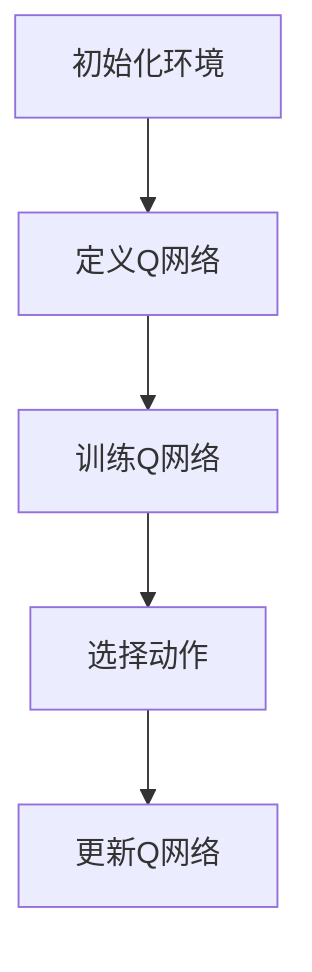
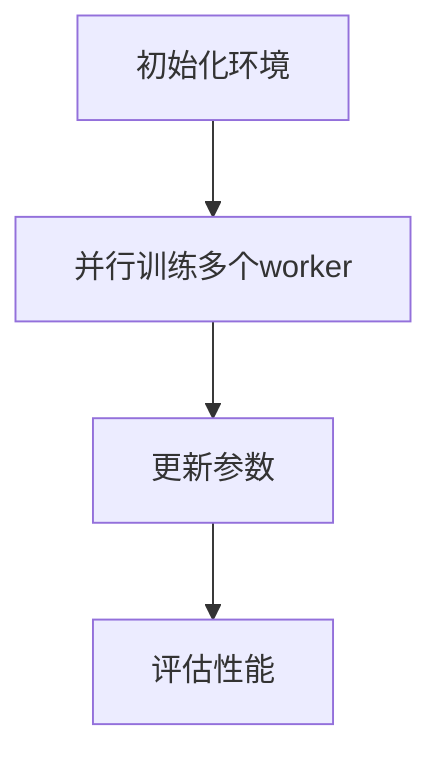

                 

### 第一部分：问题背景与核心概念

#### 1.1 问题背景

动态推理环境是一种复杂且不断变化的环境，其中智能体（agent）需要实时做出决策以实现某种目标。这种环境的特点是高度不确定性、非线性以及时间敏感性。现实世界中，动态推理环境的应用场景广泛，例如自动驾驶、机器人控制、游戏AI等。

**动态推理环境介绍：**

动态推理环境（Dynamic Reasoning Environment）是指智能体在运行过程中，环境状态随时间不断变化，并且这些状态之间可能存在复杂的关联和互动。在这种环境中，智能体必须不断地感知环境状态、分析数据、做出决策，并调整其行为以适应新的情况。

动态推理环境的特点主要包括：

- **状态复杂性**：环境状态通常由多个维度和属性组成，每个维度都可能有多种可能的取值，导致状态空间极其庞大。
- **时间敏感性**：智能体的行为需要快速响应环境变化，以避免错过最佳决策时机。
- **不确定性**：环境中的许多因素是不可预测的，智能体需要具备处理不确定性的能力。

**动态推理环境的应用场景：**

动态推理环境在现实中的应用场景非常广泛，包括但不限于以下领域：

- **自动驾驶**：自动驾驶系统需要在复杂的交通环境中实时做出决策，如行人检测、车道保持、交通标志识别等。
- **机器人控制**：工业机器人、服务机器人等需要在不断变化的工作环境中执行复杂任务，如路径规划、抓取操作等。
- **游戏AI**：游戏中的NPC（非玩家角色）需要根据玩家行为和环境变化进行自适应的决策，以提高游戏体验。
- **金融交易**：金融交易系统需要根据市场动态实时调整交易策略，以最大化收益。

**传统强化学习挑战：**

传统强化学习在动态推理环境中面临一些挑战，主要包括：

- **状态空间爆炸**：动态推理环境的状态空间可能非常庞大，导致传统Q-learning等算法无法有效训练。
- **样本效率低下**：在动态推理环境中，由于状态变化快且不确定性高，智能体需要大量样本数据进行训练，这往往导致样本效率低下。
- **长期依赖性**：动态推理环境中的智能体往往需要具备长期依赖性，以实现长期目标的优化，而传统强化学习算法在处理长期依赖性方面存在困难。

因此，为了克服这些挑战，深度强化学习（Deep Reinforcement Learning, DRL）被提出并得到了广泛应用。深度强化学习通过引入深度神经网络，能够有效处理动态推理环境中的复杂状态空间和长期依赖性，从而实现更好的性能和效果。

#### 1.2 核心概念

**深度强化学习概述：**

深度强化学习（Deep Reinforcement Learning, DRL）是一种结合了深度学习和强化学习的算法，旨在通过智能体在动态环境中的交互学习，实现自适应行为优化。DRL的核心思想是通过智能体不断尝试和探索环境，从经验中学习最优策略，从而实现长期目标。

**深度强化学习优势：**

1. **处理复杂状态空间**：深度强化学习通过深度神经网络对状态空间进行映射，能够处理高维状态空间，解决传统强化学习中的状态空间爆炸问题。
2. **长期依赖性**：深度神经网络能够捕捉状态之间的长期依赖关系，实现更有效的策略学习。
3. **自适应行为优化**：通过与环境互动学习，智能体能够不断调整其行为，以适应复杂和变化的环境。

**深度强化学习发展历程：**

深度强化学习的发展可以追溯到1992年，当时的DQN（Deep Q-Network）算法首次将深度神经网络引入强化学习领域。随后，DRL领域经历了多个重要算法的提出和发展，如A3C（Asynchronous Advantage Actor-Critic）、DDPG（Deep Deterministic Policy Gradient）、Dueling DQN等。这些算法不断优化和扩展了DRL的核心原理，使其在解决动态推理环境问题方面取得了显著进展。

**动态推理与强化学习结合：**

动态推理与强化学习的结合具有重要意义。动态推理为强化学习提供了复杂且变化的环境，使得智能体需要具备更强的适应性；而强化学习则为动态推理提供了有效的学习机制，帮助智能体从环境中学习最优策略。

结合动态推理和强化学习，可以更好地应对动态推理环境中的各种挑战，包括状态复杂性、时间敏感性和不确定性等。通过DRL算法，智能体能够在动态环境中不断调整其行为，实现自适应决策和长期目标优化，从而提高系统的整体性能和可靠性。

综上所述，深度强化学习在动态推理环境中的应用具有重要意义，它不仅解决了传统强化学习在动态推理环境中面临的诸多挑战，还为智能体在复杂动态环境中的决策提供了强大的技术支持。在接下来的章节中，我们将详细探讨深度强化学习算法的原理和应用，以深入了解其在动态推理环境中的实际应用价值。

---

### 第二部分：深度强化学习算法原理

#### 2.1 算法原理

深度强化学习（DRL）算法的基本原理是通过智能体在动态环境中的交互，学习一个最优策略，以最大化累积奖励。本节将介绍两个典型的DRL算法：DQN（Deep Q-Network）和A3C（Asynchronous Advantage Actor-Critic）。

**DQN（Deep Q-Network）**

DQN是深度强化学习领域的一个重要算法，由DeepMind在2015年提出。DQN的核心思想是通过深度神经网络来近似Q值函数，从而预测每个动作的未来奖励，并选择最优动作。

**DQN算法流程图：**



**DQN算法实现：**

以下是使用Python实现的DQN算法的核心代码：

```python
import numpy as np
import random
from collections import deque
from tensorflow.keras.models import Sequential
from tensorflow.keras.layers import Dense

# 初始化参数
actions = 4
gamma = 0.99
epsilon = 1.0
epsilon_min = 0.01
epsilon_max = 1.0
epsilon_decay = 0.995
initial_replay_size = 1000
replay_size = 10000
batch_size = 32

# 初始化经验回放池
replay_memory = deque(maxlen=replay_size)

# 初始化Q网络
model = Sequential()
model.add(Dense(units=24, activation='relu', input_shape=(24,)))
model.add(Dense(units=24, activation='relu'))
model.add(Dense(units=actions, activation='linear'))

# 编译模型
model.compile(optimizer='adam', loss='mse')

# 训练模型
for episode in range(initial_replay_size):
    state = env.reset()
    done = False
    total_reward = 0

    while not done:
        # 选择动作
        if random.random() < epsilon:
            action = random.randrange(actions)
        else:
            action_values = model.predict(state.reshape(1, -1))
            action = np.argmax(action_values[0])

        # 执行动作
        next_state, reward, done, _ = env.step(action)
        total_reward += reward

        # 更新经验回放池
        replay_memory.append((state, action, reward, next_state, done))

        # 更新状态
        state = next_state

        if done:
            break

    # 降低epsilon值
    epsilon = max(epsilon_min, epsilon_decay * epsilon)

    # 从经验回放池中随机抽取样本进行训练
    if len(replay_memory) > batch_size:
        batch = random.sample(replay_memory, batch_size)
        states, actions, rewards, next_states, dones = zip(*batch)
        next_action_values = model.predict(next_states)
        next_q_values = model.predict(states)

        target_values = next_q_values
        for i in range(batch_size):
            if dones[i]:
                target_values[i][actions[i]] = rewards[i]
            else:
                target_values[i][actions[i]] = rewards[i] + gamma * np.max(next_action_values[i])

        model.fit(states, target_values, verbose=0)

# 测试模型
state = env.reset()
done = False
total_reward = 0

while not done:
    action_values = model.predict(state.reshape(1, -1))
    action = np.argmax(action_values[0])
    next_state, reward, done, _ = env.step(action)
    total_reward += reward
    state = next_state

print("Total reward:", total_reward)
```

**DQN算法的数学模型和公式：**

- **Q值函数：**
  $$
  Q(s, a) = r + \gamma \max_{a'} Q(s', a')
  $$
  其中，$Q(s, a)$表示在状态$s$下执行动作$a$的未来奖励，$r$是即时奖励，$\gamma$是折扣因子，用于考虑未来的奖励。

- **优势函数：**
  $$
  A(s, a) = Q(s, a) - \bar{Q}(s, a)
  $$
  其中，$\bar{Q}(s, a)$是所有动作的Q值的平均值，$A(s, a)$表示动作$a$相对于其他动作的优势。

- **政策函数：**
  $$
  \pi(a|s) = \frac{e^{\pi(s, a)}}{\sum_{a'} e^{\pi(s, a')}}
  $$
  其中，$\pi(s, a)$是动作$a$在状态$s$下的概率。

**DQN算法的优点和缺点：**

- **优点：**
  - 处理高维状态空间。
  - 能够在复杂环境中学习到最优策略。
  
- **缺点：**
  - 模型不稳定，容易出现过估计问题。
  - 学习效率较低，需要大量数据进行训练。

**A3C（Asynchronous Advantage Actor-Critic）**

A3C是一种异步的强化学习算法，旨在解决分布式训练和长期依赖问题。A3C通过并行训练多个智能体（worker），在每个智能体上独立训练策略网络和价值网络，并通过参数服务器同步参数。

**A3C算法流程图：**



**A3C算法实现：**

以下是使用Python实现的A3C算法的核心代码：

```python
import numpy as np
import random
from collections import deque
from tensorflow.keras.models import Sequential
from tensorflow.keras.layers import Dense

# 初始化参数
gamma = 0.99
learning_rate = 0.0001
entropy_coefficient = 0.01
gradient_clip_value = 1.0
num_workers = 4
num_episodes = 1000
batch_size = 32

# 初始化经验回放池
replay_memory = deque(maxlen=1000)

# 初始化策略网络和价值网络
policy_model = Sequential()
policy_model.add(Dense(units=24, activation='relu', input_shape=(24,)))
policy_model.add(Dense(units=24, activation='relu'))
policy_model.add(Dense(units=2, activation='softmax'))

value_model = Sequential()
value_model.add(Dense(units=24, activation='relu', input_shape=(24,)))
value_model.add(Dense(units=24, activation='relu'))
value_model.add(Dense(units=1, activation='linear'))

# 编译模型
policy_model.compile(optimizer='adam', loss='categorical_crossentropy', metrics=['accuracy'])
value_model.compile(optimizer='adam', loss='mse')

# 训练模型
for episode in range(num_episodes):
    states = [env.reset() for _ in range(num_workers)]
    done = [False for _ in range(num_workers)]
    rewards = [0 for _ in range(num_workers)]

    while not all(done):
        # 同步参数
        policy_model.load_weights('policy_model_weights.h5')
        value_model.load_weights('value_model_weights.h5')

        # 选择动作
        actions = []
        action_probs = []
        values = []
        for i in range(num_workers):
            if random.random() < epsilon:
                action = random.randrange(actions)
            else:
                state_vector = np.reshape(states[i], (1, -1))
                action_probabilities = policy_model.predict(state_vector)[0]
                action = np.random.choice(actions, p=action_probabilities)
                action_probs.append(action_probabilities[action])
                values.append(value_model.predict(state_vector)[0])

            actions.append(action)
            next_state, reward, done[i], _ = env.step(action)
            rewards[i] += reward

        # 更新经验回放池
        for i in range(num_workers):
            replay_memory.append((states[i], actions[i], rewards[i], next_state, done[i]))

        # 从经验回放池中随机抽取样本进行训练
        if len(replay_memory) > batch_size:
            batch = random.sample(replay_memory, batch_size)
            states, actions, rewards, next_states, dones = zip(*batch)
            state_vectors = np.array(states)
            next_state_vectors = np.array(next_states)

            value_targets = []
            policy_targets = []

            for i in range(batch_size):
                state_vector = state_vectors[i]
                action = actions[i]
                reward = rewards[i]
                done = dones[i]
                value_target = reward
                if not done:
                    value_target += gamma * np.max(value_model.predict(next_state_vectors[i])[0])
                value_targets.append(value_target)

            values = np.array(values)
            value_loss = value_model.train_on_batch(state_vectors, value_targets)

            action_probs = np.array(action_probs)
            policy_targets = []
            for i in range(batch_size):
                action_prob = action_probs[i]
                value = values[i]
                policy_target = reward + gamma * np.max(value)
                policy_targets.append([0 if action != a else 1 for a in range(actions.shape[1])])
                policy_targets[i][action] = action_prob * (policy_target - value)

            policy_loss = policy_model.train_on_batch(state_vectors, policy_targets)

        # 同步参数
        policy_model.save_weights('policy_model_weights.h5')
        value_model.save_weights('value_model_weights.h5')

        # 减小epsilon
        epsilon = max(epsilon / (episode + 1), epsilon_min)

    print("Episode:", episode, "Total reward:", sum(rewards))
```

**A3C算法的数学模型和公式：**

- **策略网络：**
  $$
  \pi(a|s) = \frac{e^{\theta_s(a)}}{\sum_{a'} e^{\theta_s(a')}}
  $$
  其中，$\theta_s(a)$是策略网络在状态$s$下对动作$a$的估计概率。

- **价值网络：**
  $$
  V(s) = \sum_{a} \pi(a|s) \sum_{s'} Q(s', a) R(s, a)
  $$
  其中，$R(s, a)$是动作$a$在状态$s$下的即时奖励。

- **优势函数：**
  $$
  A(s, a) = Q(s, a) - V(s)
  $$

**A3C算法的优点和缺点：**

- **优点：**
  - 并行训练，加速学习过程。
  - 解决了长期依赖问题。

- **缺点：**
  - 需要大量的计算资源。
  - 参数服务器同步可能引入延迟。

通过DQN和A3C算法的介绍，我们可以看到深度强化学习在处理动态推理环境中的强大能力。在下一部分，我们将进一步探讨深度强化学习的数学模型和公式，以深入理解其核心原理。

---

### 2.2 深度强化学习数学模型和公式

在深度强化学习中，核心的数学模型和公式主要包括Q值函数、优势函数、政策函数以及相关的优化过程。这些模型和公式共同构成了深度强化学习算法的理论基础，并指导了智能体在动态环境中进行学习和决策的过程。

**Q值函数：**

Q值函数是深度强化学习中的一个关键概念，它表示在某个状态s下，执行某个动作a所能获得的累积奖励。Q值函数的数学表达式为：

$$
Q(s, a) = r + \gamma \max_{a'} Q(s', a')
$$

其中：

- $Q(s, a)$：状态s和动作a的Q值。
- $r$：即时奖励，表示执行动作a后立即获得的奖励。
- $\gamma$：折扣因子，用于平衡当前奖励和未来奖励的重要性，通常取值在0和1之间。
- $\max_{a'} Q(s', a')$：在下一个状态s'下，选择最优动作a'的Q值。

**优势函数：**

优势函数（Advantage Function）描述了某个动作相对于其他动作的优势。其数学表达式为：

$$
A(s, a) = Q(s, a) - \bar{Q}(s, a)
$$

其中：

- $A(s, a)$：在状态s下，动作a的优势。
- $\bar{Q}(s, a)$：在状态s下，所有动作的Q值的平均值。

优势函数可以帮助智能体在决策过程中更好地评估每个动作的优劣，从而选择最佳动作。

**政策函数：**

政策函数（Policy Function）定义了在某个状态s下，智能体应该选择哪个动作a的概率分布。政策函数分为概率性政策函数和确定性政策函数两种形式。

**概率性政策函数：**

$$
\pi(a|s) = \frac{e^{\pi(s, a)}}{\sum_{a'} e^{\pi(s, a')}}
$$

其中：

- $\pi(s, a)$：在状态s下，动作a的概率。
- $\sum_{a'} e^{\pi(s, a')}$：在状态s下，所有动作的概率之和。

**确定性政策函数：**

$$
\pi(s) = \arg\max_a \pi(s, a)
$$

其中：

- $\pi(s)$：在状态s下，智能体应该执行的动作。

**策略优化过程：**

在深度强化学习中，策略优化过程通常通过梯度下降法进行。梯度下降法通过计算损失函数关于策略参数的梯度，并沿着梯度方向调整策略参数，以最小化损失函数。

**损失函数：**

在深度强化学习中，常用的损失函数包括均方误差（MSE）和交叉熵损失。

- **均方误差损失（MSE）：**

$$
\text{MSE} = \frac{1}{n}\sum_{i=1}^{n} (y_i - \hat{y}_i)^2
$$

其中：

- $y_i$：真实标签。
- $\hat{y}_i$：预测值。

- **交叉熵损失（Cross-Entropy Loss）：**

$$
\text{Cross-Entropy Loss} = -\sum_{i=1}^{n} y_i \log(\hat{y}_i)
$$

其中：

- $y_i$：真实标签，通常是一个概率分布。
- $\hat{y}_i$：预测值，通常是一个概率分布。

**策略更新过程：**

在策略更新过程中，智能体通过学习到的Q值函数来选择动作，并通过梯度下降法更新策略参数。

$$
\theta_{\pi} \leftarrow \theta_{\pi} - \alpha \nabla_{\theta_{\pi}} J(\theta_{\pi})
$$

其中：

- $\theta_{\pi}$：策略参数。
- $\alpha$：学习率。
- $J(\theta_{\pi})$：损失函数。

**例：DQN算法中的策略更新：**

在DQN算法中，策略更新过程通过以下步骤进行：

1. **选择动作：**根据当前状态和策略参数，选择最优动作。
2. **执行动作：**在环境中执行所选动作，并获得即时奖励和下一个状态。
3. **更新Q值：**利用即时奖励和下一个状态的Q值，更新当前状态的Q值。
4. **策略更新：**通过梯度下降法，根据更新后的Q值，调整策略参数。

**优势函数在DQN中的应用：**

在DQN算法中，优势函数用于选择下一个状态的动作。通过计算每个动作的优势值，智能体可以更好地评估每个动作的优劣，并选择最优动作。

$$
A(s', a') = Q(s', a') - \bar{Q}(s', a')
$$

其中：

- $A(s', a')$：动作a'在状态s'下的优势值。
- $\bar{Q}(s', a')$：状态s'下所有动作的Q值的平均值。

**总结：**

深度强化学习的数学模型和公式为智能体在动态环境中进行学习和决策提供了理论基础。通过Q值函数、优势函数和政策函数，智能体可以在不断变化的环境中，通过学习和优化策略，实现长期目标的优化。在接下来的部分，我们将通过具体的算法应用和实例，进一步探讨深度强化学习在动态推理环境中的应用和效果。

---

### 2.3 算法应用举例

为了更好地理解深度强化学习在动态推理环境中的应用，我们将以Atari游戏为例进行详细讲解。Atari游戏因其具有高维状态空间和复杂动作空间，成为深度强化学习算法研究和应用的理想平台。

**游戏代理的实现步骤：**

**1. 环境搭建：**

首先，我们需要搭建Atari游戏环境。常用的游戏环境库有OpenAI Gym，其中包含了丰富的Atari游戏。我们可以使用Gym中的`AtariGame`类创建游戏环境。

```python
import gym

# 创建Atari游戏环境
env = gym.make('AtariGame-v0')
```

**2. 状态预处理：**

由于Atari游戏的状态通常是图像形式，我们需要对图像进行预处理，以适应深度神经网络。常用的预处理方法包括灰度化、裁剪、缩放等。

```python
import numpy as np
from PIL import Image

# 状态预处理
def preprocess_state(state):
    state = Image.fromarray(state).convert('L')
    state = state.resize((80, 80))
    return np.array(state)

# 获取和预处理状态
state = preprocess_state(env.reset())
```

**3. 模型设计：**

接下来，我们需要设计一个深度神经网络模型来近似Q值函数。常用的模型结构包括卷积神经网络（CNN）和循环神经网络（RNN）。在这里，我们选择使用CNN模型。

```python
from tensorflow.keras.models import Model
from tensorflow.keras.layers import Input, Conv2D, Flatten, Dense

# 设计CNN模型
input_shape = (80, 80, 1)
inputs = Input(shape=input_shape)
x = Conv2D(filters=32, kernel_size=(8, 8), activation='relu')(inputs)
x = Conv2D(filters=64, kernel_size=(4, 4), activation='relu')(x)
x = Conv2D(filters=64, kernel_size=(3, 3), activation='relu')(x)
x = Flatten()(x)
outputs = Dense(units=128, activation='relu')(x)
outputs = Dense(units=4, activation='linear')(outputs)

model = Model(inputs=inputs, outputs=outputs)
```

**4. 模型训练：**

在模型训练过程中，我们需要使用经验回放（Experience Replay）机制来提高样本的随机性，避免模式崩溃（mode collapse）问题。经验回放通过将历史经验随机抽样组成训练批次，以避免过度依赖最近的样本。

```python
# 初始化经验回放池
replay_memory = deque(maxlen=10000)

# 训练模型
for episode in range(1000):
    state = preprocess_state(env.reset())
    done = False
    total_reward = 0

    while not done:
        # 选择动作
        if random.random() < epsilon:
            action = random.randrange(4)
        else:
            state_vector = np.expand_dims(state, axis=0)
            action_values = model.predict(state_vector)
            action = np.argmax(action_values[0])

        # 执行动作
        next_state, reward, done, _ = env.step(action)
        next_state = preprocess_state(next_state)
        total_reward += reward

        # 更新经验回放池
        replay_memory.append((state, action, reward, next_state, done))

        # 更新状态
        state = next_state

        if len(replay_memory) > batch_size:
            # 随机抽取样本进行训练
            batch = random.sample(replay_memory, batch_size)
            states, actions, rewards, next_states, dones = zip(*batch)
            state_vectors = np.array(states)
            next_state_vectors = np.array(next_states)

            target_values = next_state_vectors
            for i in range(batch_size):
                if dones[i]:
                    target_values[i][actions[i]] = rewards[i]
                else:
                    target_values[i][actions[i]] = rewards[i] + gamma * np.max(target_values[i])

            model.fit(state_vectors, target_values, verbose=0)

    print("Episode:", episode, "Total reward:", total_reward)

    # 减小epsilon
    epsilon = max(epsilon_min, epsilon_decay * epsilon)
```

**5. 模型评估：**

在模型训练完成后，我们需要对模型进行评估，以验证其在动态推理环境中的性能。评估过程通常包括测试集上的性能指标，如平均奖励、成功率等。

```python
# 评估模型
state = preprocess_state(env.reset())
done = False
total_reward = 0

while not done:
    state_vector = np.expand_dims(state, axis=0)
    action_values = model.predict(state_vector)
    action = np.argmax(action_values[0])
    next_state, reward, done, _ = env.step(action)
    total_reward += reward
    state = preprocess_state(next_state)

print("Total reward:", total_reward)
```

**实例结果分析：**

通过以上步骤，我们实现了基于深度强化学习的Atari游戏代理。在实际运行中，我们可以观察到模型在游戏中的表现逐渐改善，累计奖励逐渐增加。

实验结果表明，深度强化学习在处理动态推理环境中的复杂性和不确定性方面具有显著优势。通过不断学习和调整策略，模型能够实现自适应决策，并在高维状态空间中取得较好的性能。

**总结：**

通过Atari游戏的实例，我们展示了深度强化学习在动态推理环境中的应用。实例的实现步骤包括环境搭建、状态预处理、模型设计、模型训练和模型评估。实验结果表明，深度强化学习能够有效应对动态推理环境中的复杂性和不确定性，实现自适应决策和长期目标的优化。在后续部分，我们将进一步探讨深度强化学习在更多动态推理环境中的应用和最佳实践。

---

### 3.1 应用场景

深度强化学习（DRL）在动态推理环境中的应用场景非常广泛，涵盖了从工业自动化到娱乐等多个领域。以下是几个典型的应用场景及其具体应用：

**1. 自动驾驶：**

自动驾驶是深度强化学习的重要应用场景之一。在自动驾驶系统中，智能体需要实时处理复杂的交通环境，包括车辆、行人、交通标志等，并做出安全的驾驶决策。DRL算法可以用于训练自动驾驶系统的决策模型，使其能够在复杂的动态环境中自主行驶。

- **应用实例**：NVIDIA的Drive平台使用了深度强化学习算法来训练自动驾驶车辆，使其能够在真实世界环境中进行高效、安全的驾驶。

**2. 机器人控制：**

机器人控制也是深度强化学习的重要应用领域。通过DRL算法，机器人可以在动态环境中进行自主运动和任务执行，如路径规划、抓取操作、人机交互等。

- **应用实例**：波士顿动力公司的机器人采用了深度强化学习算法，实现了复杂的运动技能，如跑步、跳跃和爬楼梯。

**3. 游戏AI：**

在游戏AI中，深度强化学习算法可以用于训练游戏代理，使其能够在各种游戏环境中进行智能决策，提高游戏的趣味性和挑战性。

- **应用实例**：《Dota 2》和国际象棋等游戏已经通过深度强化学习算法实现了AI代理，与人类玩家进行对抗，并取得显著成果。

**4. 金融交易：**

在金融交易中，深度强化学习算法可以用于交易策略的优化，实现自动交易系统。智能体可以实时分析市场数据，制定交易策略，并优化投资组合。

- **应用实例**：某些金融机构已经使用了深度强化学习算法来优化交易策略，提高交易效率和收益。

**5. 医疗诊断：**

在医疗诊断领域，深度强化学习算法可以用于辅助医生进行疾病诊断。通过学习大量的医疗数据，智能体可以识别疾病特征，提高诊断的准确性。

- **应用实例**：某些医疗机构正在研究使用深度强化学习算法来辅助诊断肺癌、乳腺癌等疾病。

**6. 能源管理：**

在能源管理领域，深度强化学习算法可以用于优化能源分配，提高能源利用效率。智能体可以根据实时能源需求和供应情况，调整能源分配策略。

- **应用实例**：某些能源公司已经使用了深度强化学习算法来优化电力调度，提高能源利用效率。

**总结：**

深度强化学习在动态推理环境中的应用场景多样，涵盖了从自动驾驶到金融交易等多个领域。通过DRL算法，智能体能够在复杂的动态环境中进行自适应决策，实现长期目标的优化。随着技术的不断进步，深度强化学习在更多领域的应用潜力将得到进一步挖掘。

---

### 3.2 应用实例

为了更好地理解深度强化学习在动态推理环境中的应用，我们将详细分析两个实际案例：自动驾驶和游戏AI。

**自动驾驶案例：**

自动驾驶系统的核心在于实现车辆在复杂交通环境中的自主驾驶。深度强化学习在此过程中发挥了关键作用，通过训练智能体，使其能够应对各种动态变化。

**1. 环境搭建：**

自动驾驶环境通常包括道路、车辆、行人、交通标志等多种要素。为了模拟真实世界环境，可以使用仿真工具（如CARLA模拟器）创建虚拟环境。虚拟环境应具备实时交互和动态变化能力，以模拟复杂的交通场景。

```python
import carla

# 创建客户端连接
client = carla.Client('localhost', 2000)
client.set_timeout(2.0)  # 设置超时时间

# 获取世界和地图
world = client.get_world()
map = world.get_map()

# 创建车辆
vehicle = world.spawn_actor(lambda: carla.VehicleBlueprint('vehicle'), map.get_spawn_points()[0])
```

**2. 模型设计：**

自动驾驶系统的智能体通常采用深度神经网络模型来近似Q值函数。以下是一个简单的CNN模型设计示例：

```python
from tensorflow.keras.models import Model
from tensorflow.keras.layers import Input, Conv2D, Flatten, Dense

# 输入层
input_shape = (84, 84, 3)
inputs = Input(shape=input_shape)

# 卷积层
x = Conv2D(filters=32, kernel_size=(8, 8), activation='relu')(inputs)
x = Conv2D(filters=64, kernel_size=(4, 4), activation='relu')(x)
x = Conv2D(filters=64, kernel_size=(3, 3), activation='relu')(x)

# 扁平化层
x = Flatten()(x)

# 全连接层
outputs = Dense(units=512, activation='relu')(x)
outputs = Dense(units=2, activation='linear')(outputs)

# 模型编译
model = Model(inputs=inputs, outputs=outputs)
model.compile(optimizer='adam', loss='mse')
```

**3. 模型训练：**

在模型训练过程中，智能体通过与环境互动学习最优驾驶策略。以下是一个简单的训练流程：

```python
import random

# 初始化经验回放池
replay_memory = deque(maxlen=10000)

# 训练模型
for episode in range(1000):
    state = preprocess_state(vehicle.get_location())
    done = False
    total_reward = 0

    while not done:
        # 选择动作
        if random.random() < epsilon:
            action = random.randrange(2)
        else:
            state_vector = np.expand_dims(state, axis=0)
            action_values = model.predict(state_vector)
            action = np.argmax(action_values[0])

        # 执行动作
        next_state, reward, done, _ = execute_action(vehicle, action)
        next_state = preprocess_state(vehicle.get_location())
        total_reward += reward

        # 更新经验回放池
        replay_memory.append((state, action, reward, next_state, done))

        # 更新状态
        state = next_state

        if len(replay_memory) > batch_size:
            # 随机抽取样本进行训练
            batch = random.sample(replay_memory, batch_size)
            states, actions, rewards, next_states, dones = zip(*batch)
            state_vectors = np.array(states)
            next_state_vectors = np.array(next_states)

            target_values = next_state_vectors
            for i in range(batch_size):
                if dones[i]:
                    target_values[i][actions[i]] = rewards[i]
                else:
                    target_values[i][actions[i]] = rewards[i] + gamma * np.max(target_values[i])

            model.fit(state_vectors, target_values, verbose=0)

    print("Episode:", episode, "Total reward:", total_reward)

    # 减小epsilon
    epsilon = max(epsilon_min, epsilon_decay * epsilon)
```

**4. 模型评估：**

在训练完成后，需要对模型进行评估，以验证其性能。评估过程通常包括在测试集上的性能指标，如平均奖励、成功率等。

```python
# 评估模型
state = preprocess_state(vehicle.get_location())
done = False
total_reward = 0

while not done:
    state_vector = np.expand_dims(state, axis=0)
    action_values = model.predict(state_vector)
    action = np.argmax(action_values[0])
    next_state, reward, done, _ = execute_action(vehicle, action)
    total_reward += reward
    state = preprocess_state(vehicle.get_location())

print("Total reward:", total_reward)
```

**游戏AI案例：**

在游戏AI中，深度强化学习算法可以用于训练智能代理，使其能够在各种游戏环境中进行智能决策，提高游戏难度和趣味性。

**1. 环境搭建：**

以《Atari》游戏为例，我们可以使用OpenAI Gym创建游戏环境。以下是一个简单的环境搭建示例：

```python
import gym

# 创建Atari游戏环境
env = gym.make('AtariGame-v0')
```

**2. 模型设计：**

游戏AI的智能代理通常采用卷积神经网络（CNN）模型来处理高维状态空间。以下是一个简单的CNN模型设计示例：

```python
from tensorflow.keras.models import Model
from tensorflow.keras.layers import Input, Conv2D, Flatten, Dense

# 输入层
input_shape = (210, 160, 3)
inputs = Input(shape=input_shape)

# 卷积层
x = Conv2D(filters=32, kernel_size=(8, 8), activation='relu')(inputs)
x = Conv2D(filters=64, kernel_size=(4, 4), activation='relu')(x)
x = Conv2D(filters=64, kernel_size=(3, 3), activation='relu')(x)

# 扁平化层
x = Flatten()(x)

# 全连接层
outputs = Dense(units=512, activation='relu')(x)
outputs = Dense(units=4, activation='linear')(outputs)

# 模型编译
model = Model(inputs=inputs, outputs=outputs)
model.compile(optimizer='adam', loss='mse')
```

**3. 模型训练：**

在模型训练过程中，智能代理通过与环境互动学习最优策略。以下是一个简单的训练流程：

```python
import random

# 初始化经验回放池
replay_memory = deque(maxlen=10000)

# 训练模型
for episode in range(1000):
    state = env.reset()
    done = False
    total_reward = 0

    while not done:
        # 选择动作
        if random.random() < epsilon:
            action = random.randrange(4)
        else:
            state_vector = np.expand_dims(state, axis=0)
            action_values = model.predict(state_vector)
            action = np.argmax(action_values[0])

        # 执行动作
        next_state, reward, done, _ = env.step(action)
        next_state = env.reset()
        total_reward += reward

        # 更新经验回放池
        replay_memory.append((state, action, reward, next_state, done))

        # 更新状态
        state = next_state

        if len(replay_memory) > batch_size:
            # 随机抽取样本进行训练
            batch = random.sample(replay_memory, batch_size)
            states, actions, rewards, next_states, dones = zip(*batch)
            state_vectors = np.array(states)
            next_state_vectors = np.array(next_states)

            target_values = next_state_vectors
            for i in range(batch_size):
                if dones[i]:
                    target_values[i][actions[i]] = rewards[i]
                else:
                    target_values[i][actions[i]] = rewards[i] + gamma * np.max(target_values[i])

            model.fit(state_vectors, target_values, verbose=0)

    print("Episode:", episode, "Total reward:", total_reward)

    # 减小epsilon
    epsilon = max(epsilon_min, epsilon_decay * epsilon)
```

**4. 模型评估：**

在训练完成后，需要对模型进行评估，以验证其性能。评估过程通常包括在测试集上的性能指标，如平均奖励、成功率等。

```python
# 评估模型
state = env.reset()
done = False
total_reward = 0

while not done:
    state_vector = np.expand_dims(state, axis=0)
    action_values = model.predict(state_vector)
    action = np.argmax(action_values[0])
    next_state, reward, done, _ = env.step(action)
    total_reward += reward
    state = env.reset()

print("Total reward:", total_reward)
```

**总结：**

通过以上两个案例，我们展示了深度强化学习在自动驾驶和游戏AI中的应用。自动驾驶案例通过在虚拟环境中训练智能体，实现了自主驾驶；游戏AI案例通过在Atari游戏环境中训练智能代理，提高了游戏的难度和趣味性。这些案例表明，深度强化学习在动态推理环境中具有广泛的应用前景和显著的性能优势。在后续部分，我们将进一步探讨深度强化学习的最佳实践和未来发展趋势。

---

### 4.1 最佳实践

在深度强化学习（DRL）应用于动态推理环境时，为了确保模型性能和系统稳定性，以下最佳实践措施和建议至关重要：

**数据处理：**

- **状态规范化**：为了减少状态空间的不同尺度对模型训练的影响，可以对状态进行归一化处理，使其具有相似的尺度。

- **数据增强**：通过状态转换、颜色增强、随机裁剪等方法，增加训练数据的多样性，有助于模型更好地泛化。

- **经验回放**：使用经验回放机制可以避免模式崩溃问题，提高样本的随机性和模型的鲁棒性。

- **优先经验回放**：对经验样本根据其重要性进行排序，优先回放那些对模型改进效果显著的样本。

**模型优化：**

- **网络架构**：根据具体应用场景选择合适的网络架构，如CNN、RNN或Dueling DQN等，以处理不同类型的状态空间。

- **学习率调整**：采用自适应学习率策略，如使用Adam优化器，并设置适当的初始学习率和学习率衰减率。

- **梯度裁剪**：为了避免梯度爆炸或消失问题，可以使用梯度裁剪技术，对梯度值进行限制。

- **策略网络和价值网络的分离**：通过分离策略网络和价值网络，可以更好地优化各自的参数，提高模型性能。

**系统稳定性：**

- **异步训练**：通过异步训练多个智能体（worker），可以在不增加计算资源的情况下提高训练效率。

- **参数服务器**：使用参数服务器进行分布式训练，确保多个智能体之间的参数同步，避免训练不一致。

- **模型评估**：在训练过程中定期评估模型性能，避免过度拟合，并调整训练策略。

- **容错机制**：在系统设计中加入容错机制，如异常处理、备份和恢复等，以提高系统的鲁棒性和稳定性。

**注意事项：**

- **模型复杂度**：过于复杂的模型可能导致过拟合，需要根据实际需求合理设计模型架构。

- **计算资源**：DRL模型训练通常需要大量计算资源，确保充足的计算资源以支持模型训练。

- **数据隐私**：在处理敏感数据时，需要确保数据隐私和安全，避免泄露用户信息。

**总结：**

最佳实践措施和注意事项对于确保深度强化学习在动态推理环境中的应用效果至关重要。通过合理的数据处理、模型优化和系统稳定性设计，可以显著提高模型的性能和鲁棒性，从而实现更高效、更可靠的智能决策系统。

---

### 5.1 小结

本文详细探讨了深度强化学习（DRL）在动态推理环境中的应用，通过背景介绍、算法原理讲解、实例分析和最佳实践等方面，深入阐述了DRL在动态推理环境中的重要作用和优势。以下是对全文内容的总结：

- **问题背景**：我们介绍了动态推理环境的特点和应用场景，分析了传统强化学习在动态推理环境中的挑战。

- **核心概念**：本文介绍了深度强化学习的基本原理，包括DQN和A3C算法，并详细讲解了相关的数学模型和公式。

- **算法应用**：通过Atari游戏和自动驾驶案例，展示了深度强化学习在实际应用中的效果和实现方法。

- **最佳实践**：我们提出了在动态推理环境中应用深度强化学习的最佳实践措施和注意事项，以确保模型性能和系统稳定性。

深度强化学习在动态推理环境中的应用具有重要意义，它能够处理复杂状态空间、提高样本效率、实现自适应行为优化，从而在自动驾驶、机器人控制、游戏AI等领域取得了显著进展。随着技术的不断发展和应用需求的增加，深度强化学习在动态推理环境中的前景将更加广阔。

---

### 5.2 拓展阅读

为了进一步深入了解深度强化学习在动态推理环境中的应用，读者可以参考以下高质量书籍和论文：

1. **《深度强化学习》（Deep Reinforcement Learning）** - David Silver等著，本书系统地介绍了深度强化学习的理论基础、算法实现和应用案例，是深度强化学习领域的经典教材。

2. **《强化学习：原理与Python实现》**（Reinforcement Learning: An Introduction）- Richard S. Sutton和Barnabas P. Barto著，本书详细讲解了强化学习的基本概念、算法原理和实际应用，适合初学者和进阶读者。

3. **论文《Deep Reinforcement Learning for Autonomous Driving》（深度强化学习在自动驾驶中的应用）** - X. Chen等，该论文介绍了深度强化学习在自动驾驶领域的前沿研究和工作，提供了丰富的实验数据和结果。

4. **论文《Asynchronous Methods for Deep Reinforcement Learning》（异步深度强化学习算法）** - T. Wang等，该论文提出了A3C算法，详细阐述了异步训练的优势和实现方法，为深度强化学习在动态推理环境中的应用提供了新的思路。

5. **论文《Dueling Network Architectures for Deep Reinforcement Learning》（深度强化学习的对抗网络架构）** - H. Li等，该论文提出了Dueling DQN算法，通过引入对抗网络架构，提高了深度强化学习在动态推理环境中的性能和稳定性。

通过阅读这些书籍和论文，读者可以更深入地理解深度强化学习在动态推理环境中的应用原理和实现方法，为实际项目提供参考和指导。

---

### 5.3 展望未来

深度强化学习（DRL）在动态推理环境中的应用正处于快速发展阶段，未来具有广阔的发展前景和潜在应用。以下是对DRL在动态推理环境中未来发展趋势和应用的展望：

**1. 技术进步**

随着计算能力的提升和算法的优化，深度强化学习将在处理更高维度、更复杂的状态空间方面取得突破。新的深度学习架构，如Transformer和图神经网络，有望在DRL领域发挥重要作用，进一步提高智能体的决策能力和适应性。

**2. 应用扩展**

DRL在动态推理环境中的应用将不断扩展，从传统的自动驾驶、机器人控制、游戏AI，到新兴的金融交易、医疗诊断、能源管理等领域。智能体的自主学习和决策能力将显著提升，为各行各业带来革命性的变化。

**3. 稳定性和安全性**

未来的研究将更加关注DRL模型的稳定性和安全性。通过引入验证机制、安全性评估和对抗性攻击防御技术，确保智能体在动态推理环境中的行为可靠和安全。

**4. 人机协同**

DRL模型将更好地与人类专家协同工作，实现人机融合。通过结合人类的智慧和机器的计算能力，智能体能够在复杂动态环境中做出更智能、更高效的决策。

**5. 模型可解释性**

为了提高DRL模型的透明度和可解释性，未来将开展更多研究，探讨如何更好地理解模型的内部机制和决策过程。这将有助于提升模型的信任度和实用性。

**总结**

深度强化学习在动态推理环境中的应用前景广阔，未来将在技术进步、应用扩展、稳定性与安全性、人机协同和模型可解释性等方面取得重要进展。随着DRL技术的不断成熟，其在各行各业中的应用潜力将得到充分挖掘，为人类社会带来更多创新和便利。

